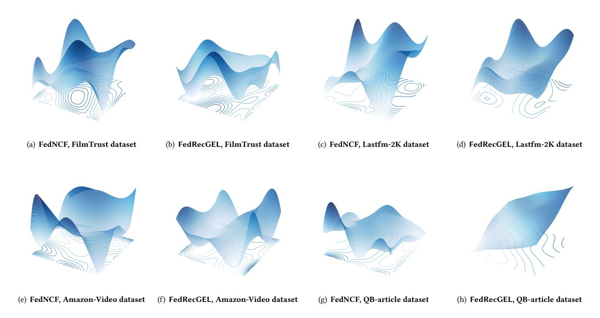
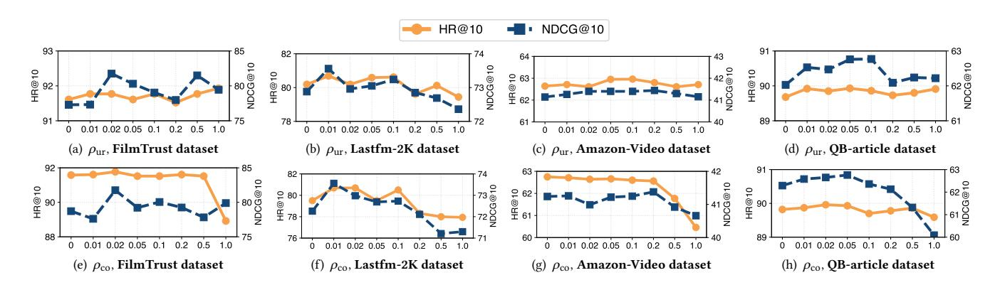
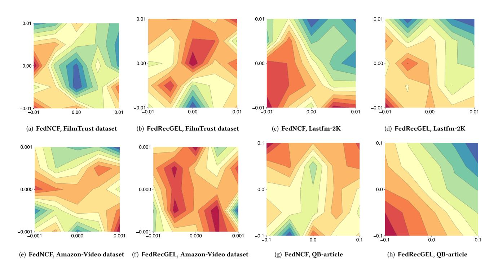

# Sharpness-Aware Minimization for Generalized Embedding Learning in Federated Recommendation

Fengyuan Yu Zhejiang University Hangzhou, China fengyuanyu@zju.edu.cn

Xiaohua Feng Zhejiang University Hangzhou, China fengxiaohua@zju.edu.cn

Yuyuan Li Hangzhou Dianzi University Hangzhou, China y2li@hdu.edu.cn

Changwang Zhang OPPO Research Institute Shenzhen, China changwangzhang@foxmail.com

Jun Wang∗ OPPO Research Institute Shenzhen, China junwang.lu@gmail.com

Chaochao Chen∗ Zhejiang University Hangzhou, China zjuccc@zju.edu.cn

### Abstract

Federated recommender systems enable collaborative model training while keeping user interaction data local and sharing only essential model parameters, thereby mitigating privacy risks. However, existing methods overlook a critical issue, i.e., the stable learning of a generalized item embedding throughout the federated recommender system training process. Item embedding plays a central role in facilitating knowledge sharing across clients. Yet, under the cross-device setting, local data distributions exhibit significant heterogeneity and sparsity, exacerbating the difficulty of learning generalized embeddings. These factors make the stable learning of generalized item embeddings both indispensable for effective federated recommendation and inherently difficult to achieve. To fill this gap, we propose a new federated recommendation framework, named Federated Recommendation with Generalized Embedding Learning (FedRecGEL). We reformulate the federated recommendation problem from an item-centered perspective and cast it as a multi-task learning problem, aiming to learn generalized embeddings throughout the training procedure. Based on theoretical analysis, we employ sharpness-aware minimization to address the generalization problem, thereby stabilizing the training process and enhancing recommendation performance. Extensive experiments on four datasets demonstrate the effectiveness of FedRecGEL in significantly improving federated recommendation performance. Our code is available at [https://github.com/anonymifish/FedRecGEL.](https://github.com/anonymifish/FedRecGEL)

# CCS Concepts

• Information systems → Collaborative search; • Security and privacy → Privacy protections.

### Keywords

Recommender System, Federated Learning, Sharpness-Aware Minimization

∗Corresponding authors (in order): Chaochao Chen and Jun Wang.

[This work is licensed under a Creative Commons Attribution 4.0 International License.](https://creativecommons.org/licenses/by/4.0)

WWW '26, Dubai, United Arab Emirates © 2026 Copyright held by the owner/author(s). ACM ISBN 979-8-4007-2307-0/2026/04 <https://doi.org/10.1145/3774904.3792579>

### ACM Reference Format:

Fengyuan Yu, Xiaohua Feng, Yuyuan Li, Changwang Zhang, Jun Wang, and Chaochao Chen. 2026. Sharpness-Aware Minimization for Generalized Embedding Learning in Federated Recommendation. In Proceedings of the ACM Web Conference 2026 (WWW '26), April 13–17, 2026, Dubai, United Arab Emirates. ACM, New York, NY, USA, [12](#page-11-0) pages. [https://doi.org/10.1145/](https://doi.org/10.1145/3774904.3792579) [3774904.3792579](https://doi.org/10.1145/3774904.3792579)

### 1 Introduction

Recommender systems [\[15,](#page-8-0) [18,](#page-8-1) [35,](#page-8-2) [43,](#page-8-3) [48,](#page-9-0) [54,](#page-9-1) [57\]](#page-9-2) are designed to leverage user-item interaction information to provide personalized content to users. They play a pivotal role across diverse domains, helping users discover items that match their preferences, thus improving user experience and driving economic value. Conventional recommender systems typically rely on centralized collection of user behavior data, which raises significant privacy concerns [\[42\]](#page-8-4). To mitigate these issues, federated learning [\[37,](#page-8-5) [38\]](#page-8-6) is introduced, and federated recommender systems [\[30,](#page-8-7) [40\]](#page-8-8) have emerged as a promising solution. In such a system, each client holds user interaction data locally and shares only essential model parameters for collaborative training. Federated recommender systems operating under the cross-device setting [\[4,](#page-8-9) [59\]](#page-9-3) involve a vast number of clients, where each client corresponds to an individual user. This cross-device setting further exacerbates data heterogeneity and sparsity, thereby substantially increasing the difficulty of training.

Existing work on federated recommendation generally falls into two categories aimed at improving the training process and thus enhancing recommendation performance. First, a number of studies focus on clustering similar users based on user embeddings or item embeddings updated by clients, and then conducting collaborative training within each cluster [\[14,](#page-8-10) [26–](#page-8-11)[28,](#page-8-12) [31\]](#page-8-13). These approaches seek to stabilize the training process by grouping clients with relatively small data distributional differences, thereby alleviating the effects of data heterogeneity and sparsity within clusters. Second, other studies aim to train personalized models for each client by adapting the global model through local fine-tuning [\[22,](#page-8-14) [51,](#page-9-4) [52\]](#page-9-5) or by fusing the global and local models [\[20,](#page-8-15) [21,](#page-8-16) [49,](#page-9-6) [58\]](#page-9-7). These methods allocate more model parameters to capture client-specific data distribution, mitigating the negative impact of heterogeneity across clients.

However, both of the aforementioned categories of methods still overlook a critical challenge, i.e., the stable learning of a generalized item embedding throughout the federated recommender

system training process. In federated recommender systems, the same item can be interacted with by multiple users, and the corresponding updates are aggregated on the server to capture global information, which is then distributed back to the clients for local training, thereby facilitating knowledge sharing across clients. Consequently, it is essential to learn a generalized item embedding that not only characterizes the global distribution but also adapts to diverse local distributions. Additionally, in the cross-device setting, the local data distribution exhibits significant heterogeneity and sparsity, with only a small subset of items participating in local training, further exacerbating the difficulty of learning generalized embeddings [\[16,](#page-8-17) [39,](#page-8-18) [41\]](#page-8-19). Taken together, these factors make the stable learning of generalized item embeddings both indispensable for effective federated recommendation and inherently difficult to achieve. Clustering-based approaches only learn item embeddings specific to a group of similar users, while personalized methods do not focus on improving the generalization of global embeddings.

To fill this gap, we propose a new federated recommendation framework, named Federated Recommendation with Generalized Embedding Learning (FedRecGEL). Different from the aforementioned approaches, FedRecGEL directly addresses the challenge of learning generalized embeddings. FedRecGEL adopts an itemcentered perspective to formalize the federated recommendation problem as a multi-task learning problem, with the objective of improving the generalization capability of the learned embeddings. Through theoretical analysis, we demonstrate that this generalization challenge can be effectively addressed using sharpness-aware minimization. Building on this insight, FedRecGEL modifies both the local training and global aggregation processes, employing sharpness-aware minimization to learn robust and generalized embeddings. This design stabilizes the training procedure and ultimately enhances recommendation performance.

We summarize the main contributions of this paper as follows:

- We reformulate the federated recommendation problem from an item-centered perspective and cast it as a multi-task learning problem, highlighting the importance of learning generalized item embeddings.
- Through theoretical analysis, we reveal that the generalization problem of item embedding learning in the multi-task learning framework can be effectively addressed using sharpness-aware minimization.
- Based on this insight, we propose a novel framework, FedRecGEL, which incorporates sharpness-aware minimization into both local training and global aggregation to stabilize the training process and improve the generalization of embeddings.
- We conduct extensive experiments on four real-world datasets and validate the effectiveness of FedRecGEL. Our method, FedRecGEL, consistently outperforms all baselines across diverse scenarios. Its advantage grows as the user-item ratio increases.

### 2 Related Work

# 2.1 Federated Recommendation

Recommendation systems [\[7,](#page-8-20) [8,](#page-8-21) [15,](#page-8-0) [18,](#page-8-1) [54\]](#page-9-1) are designed to leverage user-item interaction information to provide personalized content to users [\[13\]](#page-8-22). In federated recommendation, each user is treated as a client, holding their own interaction data locally [\[5,](#page-8-23) [16,](#page-8-17) [17\]](#page-8-24). Existing research on federated recommender systems generally falls into two categories. First, a number of studies focus on clustering similar users based on user embeddings or item embeddings updated by clients, and then conducting collaborative training within each cluster [\[14,](#page-8-10) [26–](#page-8-11)[28,](#page-8-12) [31\]](#page-8-13). These approaches aim to stabilize the training process by grouping clients with relatively small data distributional differences, thereby alleviating the effects of data heterogeneity and sparsity within clusters. However, obtaining reliable clustering results is challenging due to the limited and sparse representations of individual client data. Second, other studies aim to train personalized models for each client by adapting the global model through local fine-tuning [\[6,](#page-8-25) [46,](#page-8-26) [51](#page-9-4)[–53\]](#page-9-8) or by fusing the global and local models [\[9,](#page-8-27) [20,](#page-8-15) [21,](#page-8-16) [23,](#page-8-28) [44\]](#page-8-29). These methods allocate more model parameters to capture client-specific data distribution, thereby mitigating the negative impact of heterogeneity and sparsity across clients.

Both categories of methods overlook a critical challenge, i.e., the stable learning of a generalized item embedding throughout the federated recommender system training process. Unlike existing approaches, our proposed FedRecGEL directly learn generalized embedding, thereby enhancing recommendation performance.

### 2.2 Sharpness Aware Minimization

The training loss landscapes of today's deep learning models are commonly complex and non-convex, containing a multitude of local and global minima [\[33,](#page-8-30) [45\]](#page-8-31). Motivated by studies on the correlation between the geometry of the loss landscape and model generalization, Foret et al. [\[10\]](#page-8-32) introduced sharpness-aware minimization (SAM), an efficient training scheme [\[36,](#page-8-33) [60\]](#page-9-9). SAM aims to identify parameters that lie within neighborhoods of uniformly low loss value by minimizing the worst-case loss in a neighborhood of the current model parameter ��, given by:

min �� max ∥�� ∥2≤�� L (�� + ��), (1)

where ∥ · ∥2 denotes the ��2 norm and �� represents the radius of the neighborhood.

To solve problem [\(1\)](#page-1-0), researchers first address the inner maximization, yielding:

�� ∗ = �� ∇�� L (��) ∥∇�� L (��) ∥2 . (2)

Subsequently, the gradient with respect to this perturbed model is computed to update ��:

g SAM = ∇�� max ∥�� ∥ ≤�� L (�� + ��) ≈ ∇�� L (�� + �� ∗ ). (3)

This ensures the model converges to flatter minima, which improves generalization.

The detailed derivation is provided in Appendix [A.](#page-9-10)

### 3 Preliminaries

# 3.1 Problem Statement

Let U = {��1, ��2, . . . , ���� } denote the user set with �� users and I = {��1,��2, . . . ,���� } denote the item set with �� items. In federated recommender systems, each user is treated as an individual client, which locally stores their interaction records R˜ �� = [��˜��1,��˜��2, . . . ,��˜����],

shared gradient is computed as:

�� ��,∗ co = ��co ∇��coLS (��co, �� �� ur) ∇��coLS (��co, �� �� ur) (14)

�� ��,SAM co = ∇��coLS (��co + �� ��,∗ co , �� �� ur), (15)

then we have a straightforward updating strategy:

�� co = Agg(�� 1,SAM co , . . . , �� ��,SAM co ) ⇒ ��co = ��co − ���� co .

Here, Agg(·) denotes the gradient aggregation operator. For computational efficiency and practical applicability, we adopt the widely used FedAvg-style aggregation [\[24,](#page-8-37) [30,](#page-8-7) [47\]](#page-9-14), i.e., the global gradient is obtained as the weighted average of client gradients.

Implementation. Putting everything together, we address a federated learning setting that involves multiple multi-task learning problems. For computational efficiency, we do not compute the worst-case perturbation and SAM gradient for each item individually. Instead, following the standard training paradigm in federated learning, we sample a subset of clients and perform training on them. The computed worst-case perturbation can then be regarded as the worst-case perturbation across the multi-task learning setting, and the resulting SAM gradient corresponds to the aggregated gradient over these tasks. This strategy strikes a balance between computational tractability and generalization performance.

The detailed steps of our proposed method are summarized in Algorithm [1.](#page-3-6)

### 5 Experiments

To comprehensively evaluate our proposed method, we conduct experiments on four real-world datasets. Specifically, we aim to answer the following Research Questions (RQs):

- RQ1: How does our method perform on recommendation tasks compared with strong baselines?
- RQ2: How do the principal hyperparameters, ��ur and ��co, affect FedRecGEL, thereby influencing recommendation performance?
- RQ3: What are the respective contributions of SAM training on the non-shared parts and on the shared parts?
- RQ4: We visualize the loss landscape to determine whether FedRecGEL converges to a flatter, more generalizable solution.

### 5.1 Experimental Settings

Table 1: Dataset statistics.

| Dataset      | # Users (# Clients) | # Items | # Interactions | Sparsity |
|--------------|---------------------|---------|----------------|----------|
| FilmTrust    | 1,227               | 2,059   | 34,889         | 98.62%   |
| Lastfm-2K    | 1,600               | 12,454  | 185,650        | 99.07%   |
| Amazon-Video | 8,072               | 11,830  | 63,836         | 99.93%   |
| QB-article   | 24,516              | 7,355   | 348,736        | 99.81%   |

Datasets. We conduct experiments on four publicly available real-world recommendation datasets, adapting them to federated recommendation scenarios. In the cross-device setting, each user acts as a client, maintaining their interaction records locally. Specifically, FilmTrust [\[11\]](#page-8-38) is a movie recommendation dataset. Lastfm-2K [\[2\]](#page-8-39) is a music dataset, where each user retains a list of listened artists along with their listening frequency. Amazon-Video [\[32\]](#page-8-40) consists of product reviews and metadata collected from the Amazon website. QB-article [\[50\]](#page-9-15) records user click behaviors on articles. The overall dataset statistics are shown in Table [1.](#page-4-2)

Data Preprocessing. For all datasets, we remove the users with less than 5 interactions. Following [\[51\]](#page-9-4), we randomly sample �� = 4 negative instances for each positive sample during training. We employ the leave-one-out strategy. The most recent interaction item for each user (sorted by interaction timestamp) is retained for testing. For each user, we randomly select 99 unobserved items and perform a ranking evaluation among 100 items, including the test item.

Baselines. To assess FedRecGEL and demonstrate its superiority, we choose the following algorithms as baselines:

- FedNCF [\[34\]](#page-8-41): This is the federated adaptation of neural collaborative filtering [\[13\]](#page-8-22). It updates user embedding locally on each client and synchronizes the item embedding globally on the server.
- FedMF [\[3\]](#page-8-42): It applies matrix factorization in the federated learning environment to prevent information leakage by encrypting gradients of both user and item embeddings.
- PerFedRec [\[26\]](#page-8-11): It integrates a federated GNN for joint representation learning, user clustering, and model adaptation.
- PFedRec [\[51\]](#page-9-4): It incorporates the user embeddings into the score function and performs local adaptation to generate personalized item representations for each user.
- FedRAP [\[20\]](#page-8-15): It learns a global view of items via federated learning and a personalized view locally on each user, and enforces the two views to be complementary.
- CoFedRec [\[14\]](#page-8-10): This approach employs a co-clustering strategy, first grouping items into clusters and then clustering users based on their preference for specific item categories.
- GPFedRec [\[52\]](#page-9-5): It constructs a user relationship graph using the received item embeddings and learns user-specific item embeddings through graph-guided aggregation.

Evaluation Metrics. Model performance is evaluated using Tok-K evaluation metrics [\[12\]](#page-8-43), including Hit Ratio (HR) and Normalized Discounted Cumulative Gain (NDCG). HR@K measures whether the test item is in the top-K list. NDCG@K is a position-aware ranking metric that gives higher scores to hits that occur at higher ranks.

Hyperparameters. We refer to the open-sourced code provided by these methods, adopting the recommended hyperparameters, and tuning them accordingly. The local epoch is set to 1, and the total communication round is set to 100. We set both the user and item embedding sizes to 32, with the batch size fixed at 256. We adopt the Adam optimizer. For FedRecGEL, we carry out a grid search on ��ur and ��co and jointly tune the learning rate, choosing the best hyperparameters separately for each dataset.

Hardware Information. All models and algorithms are implemented using Python 3.9 and PyTorch 2.3.0. The experiments are

Table 2: Results of recommendation performance. Best results are typeset in bold with a colored background, e.g., 89.38±0.21 . Runner-up results use a different background color, e.g., 66.67±1.09 . We run all models 5 times and report the average results and standard deviation. Results are expressed as percentages (%).

| Dataset Methods |       | HR@5   |        | NDCG@5       |      | FilmTrust | HR@10  |         | NDCG@10 |       | HR@5   |        | NDCG@5     | Lastfm-2K | HR@10  |         | NDCG@10 |
|-----------------|-------|--------|--------|--------------|------|-----------|--------|---------|---------|-------|--------|--------|------------|-----------|--------|---------|---------|
| FedNCF          | 66.67 | ± 0.30 | 53.09  | ±            | 0.36 | 69.49     | ± 0.17 | 54.20   | ± 0.39  | 52.08 | ± 0.74 | 38.98  | ± 0.28     | 63.85     | ± 0.49 | 42.82   | ± 0.26  |
| FedMF           | 65.23 | ± 0.30 | 47.83  | ±            | 0.35 | 69.38     | ± 0.45 | 49.21   | ± 0.40  | 73.10 | ± 0.28 | 65.02  | ± 0.16     | 78.63     | ± 0.18 | 66.71   | ± 0.23  |
| PerFedRec       | 81.77 | ± 1.64 | 66.35  | ±            | 1.67 | 90.52     | ± 0.91 | 76.95   | ± 1.71  | 45.94 | ± 1.07 | 37.83  | ± 2.13     | 63.96     | ± 3.70 | 44.24   | ± 3.79  |
| PFedRec         | 66.40 | ± 0.33 | 54.30  | ±            | 0.39 | 78.76     | ± 0.14 | 64.83   | ± 0.36  | 76.40 | ± 0.45 | 70.59  | ± 0.21     | 81.35     | ± 0.62 | 72.34   | ± 0.12  |
| FedRAP          | 87.83 | ± 0.77 | 73.80  | ±            | 1.73 | 91.74     | ± 0.10 | 77.67   | ± 1.29  | 68.33 | ± 0.91 | 64.55  | ± 0.69     | 75.71     | ± 0.31 | 71.53   | ± 0.24  |
| CoFedRec        | 68.87 | ± 0.35 | 55.58  | ±            | 0.53 | 81.26     | ± 0.24 | 67.29   | ± 0.09  | 73.85 | ± 0.94 | 68.68  | ± 0.55     | 77.23     | ± 1.23 | 68.96   | ± 0.97  |
| GPFedRec        | 66.56 | ± 0.57 | 53.32  | ±            | 0.79 | 78.57     | ± 0.13 | 64.07   | ± 0.21  | 70.92 | ± 1.58 | 61.41  | ± 2.57     | 80.35     | ± 0.40 | 70.70   | ± 1.01  |
| FedRecGEL       | 89.38 | ± 0.21 | 81.33  | ±            | 0.32 | 91.66     | ± 0.10 | 82.01   | ± 0.23  | 73.92 | ± 0.22 | 70.79  | ± 0.16     | 80.69     | ± 0.25 | 73.56   | ± 0.14  |
| Dataset         |       |        |        | Amazon-Video |      |           |        |         |         |       |        |        | QB-article |           |        |         |         |
| Methods         | HR@5  |        | NDCG@5 |              |      | HR@10     |        | NDCG@10 |         | HR@5  |        | NDCG@5 |            | HR@10     |        | NDCG@10 |         |
| FedNCF          | 48.79 | ± 1.09 | 35.04  | ±            | 1.38 | 60.88     | ± 0.34 | 38.86   | ± 1.30  | 32.58 | ± 0.04 | 19.79  | ± 0.31     | 54.11     | ± 0.32 | 26.56   | ± 0.40  |
| FedMF           | 38.54 | ± 1.87 | 23.74  | ±            | 0.19 | 45.57     | ± 2.17 | 26.02   | ± 0.24  | 30.72 | ± 0.52 | 16.40  | ± 0.29     | 49.64     | ± 0.38 | 22.51   | ± 0.17  |
| PerFedRec       | 45.82 | ± 2.76 | 33.90  | ±            | 2.63 | 59.54     | ± 1.55 | 40.07   | ± 0.98  | 36.42 | ± 0.37 | 23.09  | ± 0.27     | 55.02     | ± 0.73 | 29.19   | ± 0.34  |
| PFedRec         | 46.73 | ± 0.32 | 34.04  | ±            | 0.16 | 59.59     | ± 0.28 | 38.13   | ± 0.06  | 41.65 | ± 0.34 | 27.51  | ± 0.24     | 58.87     | ± 0.34 | 32.86   | ± 0.26  |
| FedRAP          | 31.90 | ± 1.12 | 25.16  | ±            | 0.75 | 43.88     | ± 1.14 | 31.47   | ± 0.93  | 20.68 | ± 0.72 | 14.47  | ± 0.51     | 41.57     | ± 0.53 | 24.38   | ± 0.36  |
| CoFedRec        | 48.24 | ± 0.29 | 35.11  | ±            | 0.29 | 60.82     | ± 0.20 | 40.50   | ± 0.20  | 35.68 | ± 0.36 | 21.96  | ± 0.21     | 56.02     | ± 1.06 | 28.06   | ± 0.67  |
| GPFedRec        | 45.66 | ± 1.37 | 32.96  | ±            | 1.06 | 57.26     | ± 2.17 | 36.74   | ± 1.19  | 34.53 | ± 1.23 | 21.38  | ± 1.42     | 55.20     | ± 0.27 | 27.97   | ± 0.92  |
| FedRecGEL       | 51.20 | ± 0.02 | 37.60  | ±            | 0.11 | 62.70     | ± 0.14 | 41.33   | ± 0.16  | 77.27 | ± 0.09 | 58.39  | ± 0.21     | 89.90     | ± 0.03 | 62.52   | ± 0.19  |

conducted on a server running Ubuntu 22.04, equipped with 256GB of RAM and an NVIDIA GeForce RTX 4090 GPU.

# 5.2 Results and Discussions

5.2.1 Main Results (RQ1). Table [2](#page-5-0) shows the average performance results and standard deviation obtained from five runs with different seeds. We have the following observations and insights:

- Simply combining centralized recommendation methods with federated learning, where model parameters are shared directly, does not lead to optimal results. For example, FedNCF and FedMF perform poorly in most settings, because they only minimize the empirical loss and overlook the generalization ability of item embeddings and model parameters.
- Methods based on clustering similar users show inconsistent performance across datasets. For example, CoFedRec achieves strong performance on Lastfm-2K, but underperforms unexpectedly on FilmTrust. This discrepancy is likely due to its heavy reliance on clustering outcomes, which may be unreliable in federated settings because of client sparsity and insufficient user representations.
- Methods that train personalized models for each client, such as PFedRec, achieve the best results on Lastfm-2K. This is because Lastfm-2K has the lowest user-item ratio, giving each clients abundant local interaction data to learn a personalized model. However, in dataset like Amazon-Video and QB-article, these methods perform less well due to insufficient local data for each client.

- Our method, FedRecGEL, consistently outperforms all baselines across diverse scenarios. Interestingly, its advantage grows as the user-item ratio increases. In the dataset with the largest useritem ratio, QB-article, the improvement in HR@10 exceeds 50%, confirming the effectiveness of FedRecGEL with local SAM training. In real world settings, where user-item ratios tend to be much higher, this suggest strong practical viability. Even on the dataset with the smallest user-item ratio (Lastfm-2K), FedRecGEL remains comparable to the best baseline (PFedRec).

5.2.2 Hyperparameter Sensitivity (RQ2). To assess hyperparameter sensitivity, we run experiments on all four datasets. FedRecGEL has two key hyperparameters: ��ur, the neighborhood radius used to search the worst-case perturbation for the non-shared parts (user embeddings), and ��co, the corresponding radius for the shared parts (item embeddings and model parameters). When varying one hyperparameter, we fix the other to its dataset-specific optimal value. For each dataset, we sweep ��ur and ��co over the grid [0, 0.01, 0.02, 0.05, 0.1, 0.2, 0.5, 1.0]. The results are shown in Figure [2.](#page-6-0) We have the following observations and insights:

- Compare to HR, NDCG exhibits greater sensitivity to both hyperparameters. This is attribute to NDCG being a position-aware ranking metric, which incorporates more detailed information than HR.
- Across all datasets, HR remains unaffected by variations in ��ns. In contrast, HR remains constant between 0 and 0.2 for ��sh, but experiences a significant decline from 0.2 to 1.0, particularly in the FilmTrust and Amazon-Video datasets. This decline is due to the fact that when the neighborhood size is excessively large, the

Figure 1: 3D surface plots of the post-convergence landscapes for models trained with FedRecGEL and with FedNCF.

Figure 2: Effect of hyperparameter ��ur and ��co. We conduct experiments on all four datasets. We report HR@10 and NDCG@10 to represent the recommendation performance.

computed worst-case perturbation fails to serve as a solution for the inner maximization in problem [\(1\)](#page-1-0), owing to the properties of Taylor expansion.

- For smaller datasets, NDCG exhibits fluctuations without a clear pattern, underscoring the importance of selecting appropriate hyperparameters in such context. However, empirical results indicate that the optimal hyperparameter typically falls within the range of 0.02 to 0.2, thereby reducing the complexity of the hyperparameter search process.
- For larger datasets, such as Amazon-Video and QB-article, NDCG follows a bell-shaped curve, increasing from 0 to approximately

0.1, then decreasing from 0.1 to 1.0. This pattern arises because, with a smaller neighborhood size, the perturbation cannot reach a worst-case perturbation, diminishing the effectiveness of SAM training. Consequently, as the neighborhood size increases, NDCG improves. However, as the neighborhood size becomes too large, similar to the reason for the decline in HR, the computed worstcase perturbation no longer serves as a solution for the inner maximization in problem [\(1\)](#page-1-0), due to the properties of Taylor expansion.

Table 3: Ablation study on non-shared and shared parts in SAM training. We compare (i) FedRecGEL-w/o-non-shared, which disables SAM on non-shared parts (user embeddings), keeping it on shared parts; (ii) FedRecGEL-w/o-shared, which disables SAM on shared parts (item embeddings and parameters), keeping it on non-shared parts; and (iii) FedRecGEL, the full model with SAM applied to both. Results are expressed as percentages (%).

|           | Dataset Methods |            |       | HR@5   |        | NDCG@5       |      | FilmTrust | HR@10  |         | NDCG@10 |       | HR@5   |        | NDCG@5     | Lastfm-2K | HR@10  |         | NDCG@10 |
|-----------|-----------------|------------|-------|--------|--------|--------------|------|-----------|--------|---------|---------|-------|--------|--------|------------|-----------|--------|---------|---------|
| FedRecGEL | -w/o-           | non-share  | 89.02 | ± 0.14 | 79.54  | ±            | 2.17 | 91.63     | ± 0.23 | 77.29   | ± 2.20  | 71.88 | ± 0.21 | 69.88  | ± 0.34     | 70.19     | ± 0.37 | 72.88   | ± 2.18  |
| FedRecGEL | -w/o-           | shared     | 89.05 | ± 0.17 | 81.23  | ±            | 0.37 | 91.58     | ± 0.20 | 81.72   | ± 0.86  | 70.69 | ± 0.31 | 69.09  | ± 0.22     | 79.50     | ± 0.12 | 72.26   | ± 0.28  |
|           | FedRecGEL       |            | 89.38 | ± 0.21 | 81.33  | ±            | 0.32 | 91.66     | ± 0.10 | 82.01   | ± 0.23  | 73.92 | ± 0.22 | 70.79  | ± 0.16     | 80.69     | ± 0.25 | 73.56   | ± 0.14  |
|           | Dataset         |            |       |        |        | Amazon-Video |      |           |        |         |         |       |        |        | QB-article |           |        |         |         |
|           | Methods         |            | HR@5  |        | NDCG@5 |              |      | HR@10     |        | NDCG@10 |         | HR@5  |        | NDCG@5 |            | HR@10     |        | NDCG@10 |         |
| FedRecGEL | -w/o-           | non-shared | 51.12 | ± 0.01 | 37.39  | ±            | 0.06 | 62.64     | ± 0.08 | 41.14   | ± 0.10  | 76.92 | ± 0.16 | 57.76  | ± 0.08     | 89.68     | ± 0.05 | 62.03   | ± 0.05  |
| FedRecGEL | -w/o-           | shared     | 51.04 | ± 0.27 | 37.34  | ±            | 0.29 | 61.75     | ± 0.12 | 41.14   | ± 0.22  | 75.35 | ± 0.02 | 56.33  | ± 0.21     | 87.95     | ± 0.06 | 60.45   | ± 0.21  |
|           | FedRecGEL       |            | 51.20 | ± 0.02 | 37.60  | ±            | 0.11 | 62.70     | ± 0.14 | 41.33   | ± 0.16  | 77.27 | ± 0.09 | 58.39  | ± 0.21     | 89.90     | ± 0.03 | 62.52   | ± 0.19  |

5.2.3 Ablation Study (RQ3). We conduct an ablation study across all four datasets to verify the contributions of SAM training on shared and non-shared parts. Specifically, We compare:

- FedRecGEL-w/o-non-shared: SAM is disabled on the non-shared parts (i.e., user embeddings), while still applied on the shared parts;
- FedRecGEL-w/o-shared: SAM is disabled on the shared parts (item embeddings and model parameters), but still applied on the non-shared parts;
- FedRecGEL, the full method, with SAM on both shared and nonshared parts.

The results demonstrate that FedRecGEL outperforms FedRecGELw/o-non-shared, which in turn outperforms FedRecGEL-w/o-shared. This indicates that both components contribute, but SAM on shared parts plays a more critical role in the federated training process, enabling cross-client information exchange, whereas SAM on the non-shared parts primarily enhances stability at each client.

5.2.4 Loss Landscape (RQ4). To explore the role of SAM training in FedRecGEL, we plot the loss landscapes. We randomly perturb two dimensions of the model parameters and compute the corresponding loss. Figure [1](#page-6-1) presents 3D surface visualizations of the post-convergence loss landscapes for models trained with FedRecGEL and FedNCF across all four datasets. Prior work suggests that flatter loss surfaces correlate with better generalization. As seen in Figure [1](#page-6-1) (a) and [1](#page-6-1) (b), the model trained via FedNCF does not settle in a valley, whereas FedRecGEL lands in a relatively flat basin. Similarly, in Figures [1](#page-6-1) (c) and [1](#page-6-1) (d), FedRecGEL yields a flatter surrounding landscape, while FedNCF's converged point lies on a ridge. These visualizations suggest that incorporating SAM during local training smooths the loss surface, leading to item embeddings and parameters with stronger generalization, which in turn improves downstream recommendation performance. We include contour map visualizations of the loss landscapes in Appendix [D.](#page-11-1) Since we do not annotate scales in the main figure, we also provide average loss values at different perturbation magnitudes in the appendix.

### 6 Conclusion

In this paper, we studied federated recommender systems with the objective of learning generalized embeddings to enhance recommendation performance. Existing methods overlook a critical issue, i.e., the stable learning of a generalized item embedding throughout the federated recommender system training process. Item embedding plays a central role in facilitating knowledge sharing across clients. Yet, under the cross-device setting, local data distributions exhibit significant heterogeneity and sparsity, exacerbating the difficulty of learning generalized embeddings. These factors make the stable learning of generalized item embeddings both indispensable for effective federated recommendation and inherently difficult to achieve.

To fill this gap, we propose a new federated recommendation framework, named Federated Recommendation with Generalized Embedding Learning (FedRecGEL). We reformulate the federated recommendation problem from an item-centered perspective and cast it as a multi-task learning problem, aiming to learn generalized embeddings throughout the training procedure. Based on theoretical analysis, we employ sharpness-aware minimization to address the generalization problem, thereby stabilizing the training process and enhancing recommendation performance.

We conduct extensive experiments on four real-world datasets to evaluate the effectiveness of our proposed method. Our method, FedRecGEL, consistently outperforms all baselines across diverse scenarios. Its advantage grows as the user-item ratio increases. Due to considerations of computational efficiency, we adopted a simple aggregation scheme in the global aggregation phase. As future directions, it would be interesting to investigate alternative aggregation strategies and to extend our framework to more diverse federated recommendation scenarios and methodologies.

# Acknowledgments

This work was supported in part by the National Key R&D Program of China (2022YFB4501500,2022YFB4501504), the National Natural Science Foundation of China (No. 62522217), and the National Natural Science Foundation of China (No. 62402148).

### References

[1] Pierre Alquier, James Ridgway, and Nicolas Chopin. 2016. On the properties of variational approximations of Gibbs posteriors. Journal of Machine Learning Research 17, 236 (2016), 1–41. [2] Iván Cantador, Peter Brusilovsky, and Tsvi Kuflik. 2011. Second workshop on information heterogeneity and fusion in recommender systems (HetRec2011). In Proceedings of the fifth ACM conference on Recommender systems. 387–388. [3] Di Chai, Leye Wang, Kai Chen, and Qiang Yang. 2020. Secure federated matrix factorization. IEEE Intelligent Systems 36, 5 (2020), 11–20. [4] Daoyuan Chen, Dawei Gao, Yuexiang Xie, Xuchen Pan, Zitao Li, Yaliang Li, Bolin Ding, and Jingren Zhou. 2023. Fs-real: Towards real-world cross-device federated learning. In Proceedings of the 29th ACM SIGKDD conference on knowledge discovery and data mining. 3829–3841. [5] Xiaohong Chen, Canran Xiao, and Yongmei Liu. 2024. Confusion-resistant federated learning via diffusion-based data harmonization on non-IID data. In Proceedings of the 38th International Conference on Neural Information Processing Systems. 137495–137520. [6] Xiaohua Feng, Yuyuan Li, Chaochao Chen, Li Zhang, Longfei Li, Jun Zhou, and Xiaolin Zheng. 2024. Controllable Unlearning for Image-to-Image Generative Models via backslashvarepsilon-Constrained Optimization. arXiv preprint arXiv:2408.01689 (2024). [7] Xiaohua Feng, Yuyuan Li, Fengyuan Yu, Ke Xiong, Junjie Fang, Li Zhang, Tianyu Du, and Chaochao Chen. 2025. RAID: An In-Training Defense against Attribute Inference Attacks in Recommender Systems. arXiv preprint arXiv:2504.11510 (2025). [8] Xiaohua Feng, Yuyuan Li, Fengyuan Yu, Li Zhang, Chaochao Chen, and Xiaolin Zheng. 2025. Plug and Play: Enabling Pluggable Attribute Unlearning in Recommender Systems. In Proceedings of the ACM on Web Conference 2025. 2689–2699. [9] Xiaohua Feng, Jiaming Zhang, Fengyuan Yu, Chengye Wang, Li Zhang, Kaixiang Li, Yuyuan Li, Chaochao Chen, and Jianwei Yin. 2025. A survey on generative model unlearning: Fundamentals, taxonomy, evaluation, and future direction. arXiv preprint arXiv:2507.19894 (2025). [10] Pierre Foret, Ariel Kleiner, Hossein Mobahi, and Behnam Neyshabur. 2021. Sharpness-aware Minimization for Efficiently Improving Generalization. In International Conference on Learning Representations. [11] Guibing Guo, Jie Zhang, and Neil Yorke-Smith. 2016. A novel evidence-based Bayesian similarity measure for recommender systems. ACM Transactions on the Web (TWEB) 10, 2 (2016), 1–30. [12] Xiangnan He, Tao Chen, Min-Yen Kan, and Xiao Chen. 2015. Trirank: Reviewaware explainable recommendation by modeling aspects. In Proceedings of the 24th ACM international on conference on information and knowledge management. 1661–1670. [13] Xiangnan He, Lizi Liao, Hanwang Zhang, Liqiang Nie, Xia Hu, and Tat-Seng Chua. 2017. Neural collaborative filtering. In Proceedings of the 26th international conference on world wide web. 173–182. [14] Xinrui He, Shuo Liu, Jacky Keung, and Jingrui He. 2024. Co-clustering for federated recommender system. In Proceedings of the ACM Web Conference 2024. 3821–3832. [15] Folasade Olubusola Isinkaye, Yetunde O Folajimi, and Bolande Adefowoke Ojokoh. 2015. Recommendation systems: Principles, methods and evaluation. Egyptian informatics journal 16, 3 (2015), 261–273. [16] Jing Jiang, Chunxu Zhang, Honglei Zhang, Zhiwei Li, Yidong Li, and Bo Yang. 2025. A Tutorial of Personalized Federated Recommender Systems: Recent Advances and Future Directions. In Companion Proceedings of the ACM on Web Conference 2025. 21–24. [17] Zong Ke, Yuqing Cao, Zhenrui Chen, Yuchen Yin, Shouchao He, and Yu Cheng. 2025. Early warning of cryptocurrency reversal risks via multi-source data. Finance Research Letters (2025), 107890. [18] Hyeyoung Ko, Suyeon Lee, Yoonseo Park, and Anna Choi. 2022. A survey of recommendation systems: recommendation models, techniques, and application fields. Electronics 11, 1 (2022), 141. [19] Beatrice Laurent and Pascal Massart. 2000. Adaptive estimation of a quadratic functional by model selection. Annals of statistics (2000), 1302–1338. [20] Zhiwei Li, Guodong Long, and Tianyi Zhou. 2023. Federated recommendation with additive personalization. arXiv preprint arXiv:2301.09109 (2023). [21] Zhiwei Li, Guodong Long, Tianyi Zhou, Jing Jiang, and Chengqi Zhang. 2025. Personalized federated collaborative filtering: A variational autoencoder approach. In Proceedings of the AAAI Conference on Artificial Intelligence, Vol. 39. 18602–18610. [22] Zhiming Lin, Kai Zhao, Sophie Zhang, Peilai Yu, and Canran Xiao. 2025. CEC-Zero: Zero-Supervision Character Error Correction with Self-Generated Rewards. arXiv preprint arXiv:2512.23971 (2025). [23] Weihai Lu, Yu Tong, and Zhiqiu Ye. 2025. DAMMFND: Domain-Aware Multimodal Multi-view Fake News Detection. In Proceedings of the AAAI Conference on Artificial Intelligence, Vol. 39. 559–567. [24] Yao Lu, Wen Yang, Yunzhe Zhang, Zuohui Chen, Jinyin Chen, Qi Xuan, Zhen Wang, and Xiaoniu Yang. 2022. Understanding the dynamics of dnns using graph modularity. In European Conference on Computer Vision. Springer, 225–242. [25] Yao Lu, Yutao Zhu, Yuqi Li, Dongwei Xu, Yun Lin, Qi Xuan, and Xiaoniu Yang. 2024. A generic layer pruning method for signal modulation recognition deep learning models. IEEE Transactions on Cognitive Communications and Networking (2024). [26] Sichun Luo, Yuanzhang Xiao, and Linqi Song. 2022. Personalized federated recommendation via joint representation learning, user clustering, and model adaptation. In Proceedings of the 31st ACM international conference on information & knowledge management. 4289–4293. [27] Sichun Luo, Yuanzhang Xiao, Xinyi Zhang, Yang Liu, Wenbo Ding, and Linqi Song. 2024. Perfedrec++: Enhancing personalized federated recommendation with self-supervised pre-training. ACM Transactions on Intelligent Systems and Technology 15, 5 (2024), 1–24. [28] Xingyuan Mao, Yuwen Liu, Lianyong Qi, Li Duan, Xiaolong Xu, Xuyun Zhang, Wanchun Dou, Amin Beheshti, and Xiaokang Zhou. 2024. Cluster-driven personalized federated recommendation with interest-aware graph convolution network for multimedia. In Proceedings of the 32nd ACM International Conference on Multimedia. 5614–5622. [29] David A McAllester. 1999. PAC-Bayesian model averaging. In Proceedings of the twelfth annual conference on Computational learning theory. 164–170. [30] Brendan McMahan, Eider Moore, Daniel Ramage, Seth Hampson, and Blaise Aguera y Arcas. 2017. Communication-efficient learning of deep networks from decentralized data. In Artificial intelligence and statistics. PMLR, 1273–1282. [31] Khalil Muhammad, Qinqin Wang, Diarmuid O'Reilly-Morgan, Elias Tragos, Barry Smyth, Neil Hurley, James Geraci, and Aonghus Lawlor. 2020. Fedfast: Going beyond average for faster training of federated recommender systems. In Proceedings of the 26th ACM SIGKDD international conference on knowledge discovery & data mining. 1234–1242. [32] Jianmo Ni, Jiacheng Li, and Julian McAuley. 2019. Justifying recommendations using distantly-labeled reviews and fine-grained aspects. In Proceedings of the 2019 conference on empirical methods in natural language processing and the 9th international joint conference on natural language processing (EMNLP-IJCNLP). 188–197. [33] Kaichen Ouyang, Zong Ke, Shengwei Fu, Lingjie Liu, Puning Zhao, and Dayu Hu. 2024. Learn from global correlations: Enhancing evolutionary algorithm via spectral gnn. arXiv preprint arXiv:2412.17629 (2024). [34] Vasileios Perifanis and Pavlos S Efraimidis. 2022. Federated neural collaborative filtering. Knowledge-Based Systems 242 (2022), 108441. [35] Jiaming Qian, Xinting Liao, Xiangmou Qu, Zhihui Fu, Xingyu Lou, Changwang Zhang, Pengyang Zhou, Zijun Zhou, Jun Wang, and Chaochao Chen. 2025. Personalized Federated Recommendation with Multi-Faceted User Representation and Global Consistent Prototype. In Proceedings of the 34th ACM International Conference on Information and Knowledge Management. 2399–2408. [36] Jules Rostand, Chen-Chien James Hsu, and Cheng-Kai Lu. 2024. Comprehensive survey on the effectiveness of sharpness aware minimization and its progressive variants. Journal of the Chinese Institute of Engineers 47, 7 (2024), 795–803. [doi:10.1080/02533839.2024.2383592](https://doi.org/10.1080/02533839.2024.2383592) [37] Wei Shen, Weiqi Liu, Mingde Chen, Wenke Huang, and Mang Ye. 2025. MARS-VFL: A Unified Benchmark for Vertical Federated Learning with Realistic Evaluation. In The Thirty-ninth Annual Conference on Neural Information Processing Systems Datasets and Benchmarks Track. [38] Wei Shen, Mang Ye, Wei Yu, and Pong C Yuen. 2025. Build yourself before collaboration: Vertical federated learning with limited aligned samples. IEEE Transactions on Mobile Computing (2025). [39] Qianyi Sun, Zheyong Qiu, Hong Ye, and Zhiyao Wan. 2019. Multinational Corporation Location Plan under Multiple Factors. In Journal of Physics: Conference Series, Vol. 1168. IOP Publishing, 032012. [doi:10.1088/1742-6596/1168/3/032012](https://doi.org/10.1088/1742-6596/1168/3/032012) [40] Zehua Sun, Yonghui Xu, Yong Liu, Wei He, Lanju Kong, Fangzhao Wu, Yali Jiang, and Lizhen Cui. 2024. A survey on federated recommendation systems. IEEE Transactions on Neural Networks and Learning Systems 36, 1 (2024), 6–20. [41] Yu Tong, Weihai Lu, Xiaoxi Cui, Yifan Mao, and Zhejun Zhao. 2025. DAPT: Domain-Aware Prompt-Tuning for Multimodal Fake News Detection. In Proceedings of the 33rd ACM International Conference on Multimedia. 7902–7911. [42] Paul Voigt and Axel Von dem Bussche. 2017. The eu general data protection regulation (gdpr). A practical guide, 1st ed., Cham: Springer International Publishing 10, 3152676 (2017), 10–5555. [43] Fan Wang, Chaochao Chen, Weiming Liu, Minye Lei, Jintao Chen, Yuwen Liu, Xiaolin Zheng, and Jianwei Yin. 2025. DR-VAE: Debiased and Representationenhanced Variational Autoencoder for Collaborative Recommendation. In Proceedings of the AAAI Conference on Artificial Intelligence. [44] Hua Wang and Fan Zhang. 2024. Computing nodes for plane data points by constructing cubic polynomial with constraints. Computer Aided Geometric Design 111 (2024), 102308. [45] Lei Wu, Zhanxing Zhu, et al. 2017. Towards understanding generalization of deep learning: Perspective of loss landscapes. arXiv preprint arXiv:1706.10239 (2017). [46] Canran Xiao, Jiabao Dou, Zhiming Lin, Zong Ke, and Liwei Hou. 2025. From Points to Coalitions: Hierarchical Contrastive Shapley Values for Prioritizing

[47] Zhipei Xu, Xuanyu Zhang, Runyi Li, Zecheng Tang, Qing Huang, and Jian Zhang. 2025. FakeShield: Explainable Image Forgery Detection and Localization via Multi-modal Large Language Models. In International Conference on Learning Representations. [48] Ziqi Yang, Zhaopeng Peng, Zihui Wang, Jianzhong Qi, Chaochao Chen, Weike Pan, Chenglu Wen, Cheng Wang, and Xiaoliang Fan. 2024. Federated graph learning for cross-domain recommendation. Advances in Neural Information Processing Systems 37 (2024), 64865–64888. [49] Jiawei Yao, Chuming Li, and Canran Xiao. 2024. Swift sampler: Efficient learning of sampler by 10 parameters. Advances in Neural Information Processing Systems 37 (2024), 59030–59053. [50] Guanghu Yuan, Fajie Yuan, Yudong Li, Beibei Kong, Shujie Li, Lei Chen, Min Yang, Chenyun Yu, Bo Hu, Zang Li, et al. 2022. Tenrec: A large-scale multipurpose benchmark dataset for recommender systems. Advances in Neural Information Processing Systems 35 (2022), 11480–11493. [51] Chunxu Zhang, Guodong Long, Tianyi Zhou, Peng Yan, Zijian Zhang, Chengqi Zhang, and Bo Yang. 2023. Dual personalization on federated recommendation. arXiv preprint arXiv:2301.08143 (2023). [52] Chunxu Zhang, Guodong Long, Tianyi Zhou, Zijian Zhang, Peng Yan, and Bo Yang. 2024. Gpfedrec: Graph-guided personalization for federated recommendation. In Proceedings of the 30th ACM SIGKDD Conference on Knowledge Discovery and Data Mining. 4131–4142. [53] Fan Zhang, Gongguan Chen, Hua Wang, and Caiming Zhang. 2024. CF-DAN: Facial-expression recognition based on cross-fusion dual-attention network. Computational Visual Media 10, 3 (2024), 593–608. [54] Shuai Zhang, Lina Yao, Aixin Sun, and Yi Tay. 2019. Deep learning based recommender system: A survey and new perspectives. ACM computing surveys (CSUR) 52, 1 (2019), 1–38. [55] Yu Zhang and Qiang Yang. 2018. An overview of multi-task learning. National Science Review 5, 1 (2018), 30–43. [56] Yu Zhang and Qiang Yang. 2021. A survey on multi-task learning. IEEE transactions on knowledge and data engineering 34, 12 (2021), 5586–5609. [57] Xiaolin Zheng, Zhongyu Wang, Chaochao Chen, Jiashu Qian, and Yao Yang. 2023. Decentralized graph neural network for privacy-preserving recommendation. In Proceedings of the 32nd ACM International Conference on Information and Knowledge Management. 3494–3504. [58] Pengyang Zhou, Chaochao Chen, Weiming Liu, Wenkai Shen, Xinting Liao, Huarong Deng, Zhihui Fu, Jun Wang, Wu Wen, and Xiaolin Zheng. 2025. Joint item embedding dual-view exploration and adaptive local-global fusion for federated recommendation. In Proceedings of the 48th International ACM SIGIR Conference on Research and Development in Information Retrieval. 424–434. [59] Sifan Zhou, Zhi Tian, Xiangxiang Chu, Xinyu Zhang, Bo Zhang, Xiaobo Lu, Chengjian Feng, Zequn Jie, Patrick Yin Chiang, and Lin Ma. 2023. FastPillars: A Deployment-friendly Pillar-based 3D Detector. arXiv preprint arXiv:2302.02367 (2023). [60] Sifan Zhou, Zhihang Yuan, Dawei Yang, Xing Hu, Jian Qian, and Ziyu Zhao. 2025. Pillarhist: A quantization-aware pillar feature encoder based on heightaware histogram. In Proceedings of the Computer Vision and Pattern Recognition Conference. 27336–27345.

### A Detailed Derivation of Sharpness-Aware Minimization

The optimization problem [\(1\)](#page-1-0) is referred to as shapness-aware minimization (SAM). We first derive the solution of the inner maximization problem, the worst-case perturbation �� ∗ , then compute the gradient g SAM with respect to the peturbed model to optimize the outer minimization problem.

Assume that the loss function L is sufficiently smooth with respect to the parameter �� (at least locally differentiable). Then, we can perform a first-order Taylor expansion around ��:

L (�� + ��) ≈ L (��) + �� ⊤∇�� L (��) + O (∥�� ∥ ).

Since we are interested in small perturbations such that ∥�� ∥ ≤ �� and �� is small, the higher-order term O (∥�� ∥ ) can be ignored. Thus, the inner maximization becomes

max ∥�� ∥ ≤�� L (�� + ��) ≈ max ∥�� ∥ ≤�� L (��) + �� ⊤∇�� L (��)

.

Note that L (��) is independent of ��, so it can be treated as a constant and removed from the optimization. The remaining subproblem is

arg max ∥�� ∥ ≤�� �� ⊤∇�� L (��).

We now aim to solve this subproblem:

max ∥�� ∥2≤�� �� ⊤ g, where g := ∇�� L (��).

This is a classical linear maximization problem over a Euclidean ball. Geometrically, �� ⊤g is the projection of �� onto the direction of g, with magnitude proportional to ∥g∥. To maximize the projection, �� should lie on the surface of the ��-ball in the direction of g (Lagrange multiplier method). Hence, the optimal solution is

�� ∗ = �� g ∥g∥2 = �� ∇�� L (��) ∥∇�� L (��) ∥2

This �� ∗ represents the perturbation that most adversely affects the model by pointing in the worst-case direction. With this �� ∗ , the gradient with respect to this perturbed model is computed to update ��:

g SAM = ∇�� max ∥�� ∥ ≤�� L (�� + ��) ≈ ∇�� L (�� + �� ∗ ).

### B Proof of Lemma [1](#page-2-1)

Proof. To prove Lemma [1,](#page-2-1) we first establish the inequality for the scalar case by fixing �� to a specific value. This provides the fundamental bound for a single parameter vector ��. We then extend the result to the vector form by applying mathematical induction over the index �� ∈ [��]. This step-by-step strategy allows us to generalize from the single-task case to the multi-task setting considered in the lemma.

We first establish the inequality for the scalar case. We use the PAC-Bayes theory with P = N 0, ��2 �� I�� and Q = N ��, ��2 I�� the prior and posterior distributions, respectively. By the PAC-Bound [\[1\]](#page-8-34), with probability at least 1 − �� and for all �� &gt; 0, we have

E��∼Q -LD (��) ≤ E��∼Q -LS (��) + 1 �� h KL(Q ∥P)+log 1 �� +Ψ(��, ��) ,

where

Ψ(��, ��) = log EPES h exp{�� (LD (��) − LS (��))}i .

Since the loss is bounded by ��, Hoeffding's lemma gives

Ψ(��, ��) ≤ �� 2�� 8��

By the Cauchy–Schwarz inequality,

1 √ �� �� 2 log 1 + ∥�� ∥ �� ��2 + �� 8 ≥ �� 2 √ �� √︄ �� log 1 + ∥�� ∥ �� ��2 ≥ ��,

which completes the proof under the assumption that the loss is bounded by ��. Now it remains to prove the theorem in the case

∥�� ∥ 2 ≤ �� ��2 exp(4��/�� ) − 1

Since the prior P must be chosen in advance, but its optimal variance depends on ��, we construct a family of priors

�� = n P�� = N 0, ��2 P�� I�� : �� P�� = �� · exp 1 − �� �� , �� = �� 1 + exp(4��/�� ) , �� = 1, 2, . . . o .

| Methods Magnitude | FilmTrust | Lastfm-2K | Amazon-Video | QB-article |
|-------------------|-----------|-----------|--------------|------------|
| 10                | ∼ 2e19    | 0.6504    | 0.6211       | 0.4268     |
| 1                 | ∼ 2e19    | 0.7506    | 0.6128       | 0.4179     |
| 1e-1 FedNCF       | 0.2200    | 0.7662    | 0.6210       | 0.4037     |
| 1e-2              | 0.2207    | 0.7678    | 0.6219       | 0.4047     |
| 1e-3              | 0.2445    | 0.7679    | 0.6220       | 0.4051     |
| 1e-4              | 0.2206    | 0.7679    | 0.6220       | 0.4051     |
| 10                | 0.2671    | 0.6593    | 0.5602       | 0.3317     |
| 1                 | 0.4229    | 0.6397    | 0.5517       | 0.3221     |
| 1e-1 FedRecGEL    | 0.4150    | 0.6387    | 0.5506       | 0.3179     |
| 1e-2              | 0.4136    | 0.6386    | 0.5505       | 0.3179     |
| 1e-3              | 0.4133    | 0.6386    | 0.5505       | 0.3179     |
| 1e-4              | 0.4133    | 0.6386    | 0.5505       | 0.3179     |

