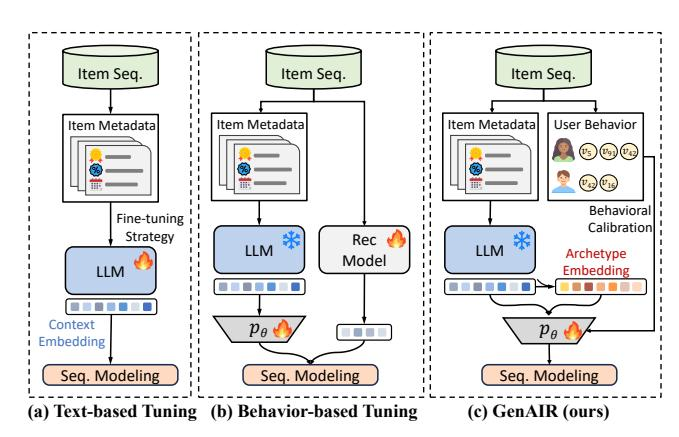
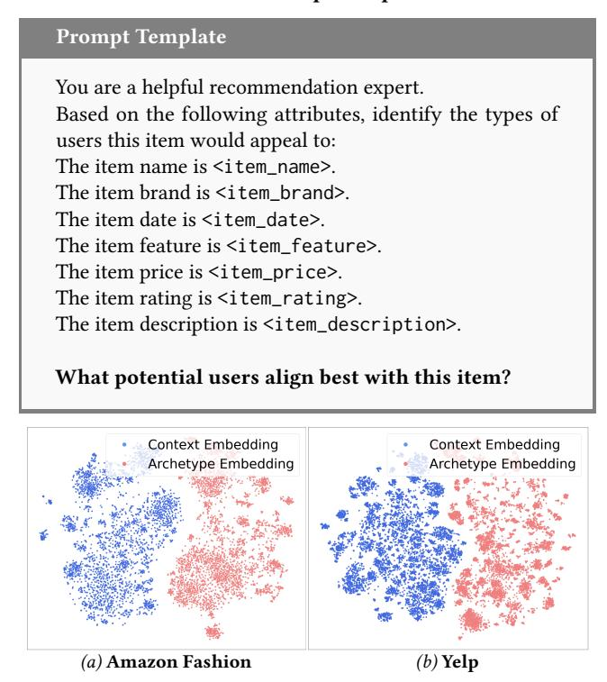
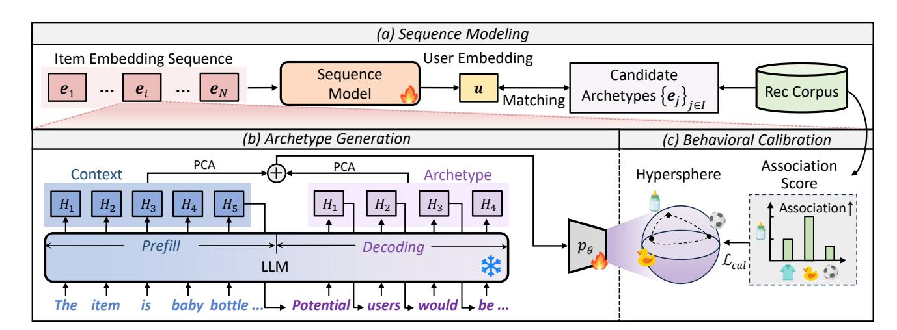
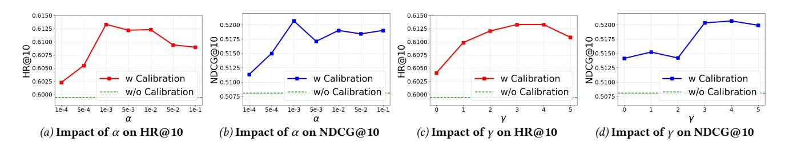
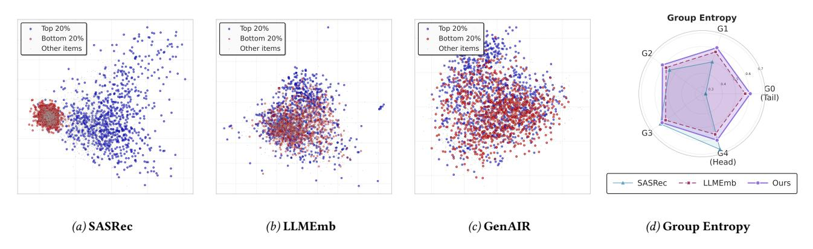

# Generative Archetype-Grounded Item Representations for Sequential Recommendation

[Yifan Li](https://orcid.org/0009-0000-2414-367X) The Chinese University of Hong Kong Hong Kong SAR, China yfli24@cse.cuhk.edu.hk

Jiahong Liu The Chinese University of Hong Kong Hong Kong SAR, China jiahong.liu21@gmail.com

Xinni Zhang The Chinese University of Hong Kong Hong Kong SAR, China xnzhang23@cse.cuhk.edu.hk

Hao Chen The Chinese University of Hong Kong Hong Kong SAR, China chenhao@cse.cuhk.edu.hk

Yankai Chen McGill University Montreal, Canada yankaichen@acm.org

Wenhao Yu The Chinese University of Hong Kong Hong Kong SAR, China whyu24@cse.cuhk.edu.hk

Jianting Chen Tongji University Shanghai, China tj\_chenjt@tongji.edu.cn

Irwin King The Chinese University of Hong Kong Hong Kong SAR, China king@cse.cuhk.edu.hk

# Abstract

Sequential recommendation aims to predict users' next interaction with items by analyzing their historical behavior. However, the limited quality of item representations remains a critical bottleneck. While pre-trained large language models (LLMs) can provide rich semantic representations, existing approaches only rely on static encoding of fixed attributes, overlooking the crucial role of target audiences in defining item identity. Moreover, the semantic space struggles to reflect actual user behavior, resulting in a significant gap between semantic representations and behavioral patterns. To address these limitations, we propose GenAIR, a general framework that empowers sequential recommendation with Generative Archetype-grounded Item Representations. Specifically, we first leverage an LLM to analyze item metadata and infer textual description of the Archetype, which represents the conceptual profile of the item's ideal target audience. We then extract the corresponding embeddings in a single forward pass. Further, to ground these generative archetypes in real-world behavior, we introduce a behavioral calibration objective, which explicitly incorporates behavioral signals from actual interactions. This objective adjusts the structure of the embedding space to reflect empirical patterns. GenAIR enables seamless integration with most existing models while maintaining high efficiency. Comprehensive experiments conducted on three real-world datasets demonstrate that GenAIR significantly improves the performance of various sequential recommendation models and consistently outperforms state-of-theart baseline approaches. Implementation codes are available at [https://github.com/AI-Santiago/GenAIR.](https://github.com/AI-Santiago/GenAIR)

[This work is licensed under a Creative Commons Attribution 4.0 International License.](https://creativecommons.org/licenses/by/4.0) WWW '26, Dubai, United Arab Emirates © 2026 Copyright held by the owner/author(s). ACM ISBN 979-8-4007-2307-0/2026/04 <https://doi.org/10.1145/3774904.3792587>

# CCS Concepts

• Computing methodologies → Artificial intelligence; • Information systems → Information retrieval.

# Keywords

Item Representation, Large Language Model, Sequential Recommendation

#### ACM Reference Format:

Yifan Li, Jiahong Liu, Xinni Zhang, Hao Chen, Yankai Chen, Wenhao Yu, Jianting Chen, and Irwin King. 2026. Generative Archetype-Grounded Item Representations for Sequential Recommendation. In Proceedings of the ACM Web Conference 2026 (WWW '26), April 13–17, 2026, Dubai, United Arab Emirates. ACM, New York, NY, USA, [12](#page-11-0) pages. [https://doi.org/10.1145/3774904.](https://doi.org/10.1145/3774904.3792587) [3792587](https://doi.org/10.1145/3774904.3792587)

# 1 Introduction

Recommendation systems are integral to digital experiences, as they shape how users navigate the vast array of content and products across online services [\[4,](#page-8-0) [5,](#page-8-1) [11,](#page-8-2) [39,](#page-8-3) [48,](#page-9-0) [55–](#page-9-1)[57\]](#page-9-2). A prominent class of these systems is based on sequential recommendation, which predicts users' next interaction with items based on their historical behavior. In recent years, researchers have made considerable advances in neural architectures [\[12,](#page-8-4) [18,](#page-8-5) [29,](#page-8-6) [43,](#page-8-7) [44,](#page-8-8) [52,](#page-9-3) [54\]](#page-9-4), which learn user embeddings by modeling the interactions between item representations. Despite their success, these methods fundamentally operate on ID-based item representations, which are optimized through next-item prediction. Due to real-world data sparsity and imbalance issues, these approaches suffer from limited representational quality and generalization capability [\[3,](#page-8-9) [50,](#page-9-5) [58\]](#page-9-6). This limitation hinders the understanding of item-level signals and remains a critical bottleneck in fully modeling user intentions and profiles.

With the rise of large language models (LLMs), known for their robust knowledge representation and generative capabilities, they have provided new semantic perspectives for addressing this issue. Recent studies [\[15,](#page-8-10) [24,](#page-8-11) [28\]](#page-8-12) have explored the utilization of LLMs to enhance item representations by encoding item textual

Figure 1: A brief comparison of different representation enhancement strategies, where ���� denotes a projector module. The enhanced item representations are then fed into sequential recommendation models.

metadata (e.g., names, brands, descriptions) into semantically rich embeddings. These representations inherit world knowledge from a large-scale pretraining process, enabling more generalized and informative item representations. Moreover, it naturally raises a key question: how to effectively obtain semantic embeddings and align them with the recommendation objectives?

Existing methods have proposed different representation learning strategies [\[10,](#page-8-13) [15,](#page-8-10) [22,](#page-8-14) [24,](#page-8-11) [27,](#page-8-15) [28,](#page-8-12) [41\]](#page-8-16), aiming to optimize the semantic embedding space and enable integration with behavioral knowledge (e.g., item co-occurrences, clicks, purchases observed in real-world recommender systems). These include (i) Text-based tuning [\[10,](#page-8-13) [22,](#page-8-14) [24,](#page-8-11) [27\]](#page-8-15), which fine-tunes the LLM with specific targets in textual form, designed to enhance its understanding of recommendations and modify the distribution of its semantic embedding through additional post-training. (ii) Behavior-based tuning [\[15,](#page-8-10) [28,](#page-8-12) [41\]](#page-8-16), which bridges LLM semantic space with behavior space by matching them to embeddings from recommendation models (trained either separately or jointly). These methods enforce the two embedding spaces to be closer.

Despite their promise, a critical analysis reveals three fundamental limitations: (i) Neglect of Behavioral Information. Text-based tuning methods (Figure [1\(](#page-1-0)a)) rely on static contextual text, which inherently neglects the behavioral patterns crucial for accurately modeling user interactions. In addition, such tuning methods demand substantial computational resources and exhibits limited efficiency. (ii) Representational Mismatch. As shown in Figure [1\(](#page-1-0)b), behavior-based tuning approaches aim to bridge the semantic and behavioral spaces by aligning with ID embeddings from a separate recommendation model. However, ID embeddings suffer from data sparsity issues, and a significant modality gap between semantic and ID embeddings further limits their effectiveness as supervision signals [\[17,](#page-8-17) [19,](#page-8-18) [23,](#page-8-19) [58\]](#page-9-6). (iii) Underutilized Generative Power. A profound limitation shared by both paradigms is their failure to leverage the core strength of modern LLMs. Existing frameworks relegate the LLM to the passive role of a feature extractor or a static text encoder [\[10,](#page-8-13) [27\]](#page-8-15), neglecting their generative and reasoning abilities [\[9,](#page-8-20) [16\]](#page-8-21). The potential to harness these capabilities to interpret targeted user intent and profiles remains largely unexplored.

Presented Work. Motivated by these challenges, in this paper, we propose GenAIR, a general framework that empowers sequential recommendation with Generative Archetype-grounded Item Representations. We define an Archetype as a conceptual representation, which embodies the hypothetical user groups whose preferences align most strongly with the item. This approach is grounded in the STP (Segmentation, Targeting, Positioning) framework [\[20\]](#page-8-22), which holds that an item's identity is shaped not just by its attributes, but by its target audience. To this end, as illustrated in Figure [1\(](#page-1-0)c), we first leverage an LLM to analyze item metadata and generate latent user archetypes. We then obtain semantic item embeddings for these archetypes (referred as archetype embeddings), capturing latent behavioral preferences at the semantic level beyond static attributes. However, while utilizing LLM's world knowledge reveals an item's potential user profile, the real user group often requires actual interaction behavior to emerge. Therefore, to ensure these representations align closely with real user behavior, we introduce a new training objective. Specifically, we capture the collective characteristics of items and their actual audiences based on their association in real-world behavior, and subsequently introduce a behavioral calibration objective that grounds these generative representations in real interaction patterns. Our framework offers seamless integration and compatibility with existing sequential recommendation methods, and maintains high computational efficiency throughout the training process and introduces no additional overhead during inference. Overall, our contributions can be summarized as follows:

- We propose archetype-grounded item representations, where items are characterized through generative modeling of their target audiences rather than static attributes alone.
- We present a general framework that aligns LLM-generated semantic representations with user interactions through a behavioral calibration objective.
- We validate the effectiveness of GenAIR through extensive experiments across three datasets, where it consistently outperforms state-of-the-art baselines, demonstrating its superior performance and practical applicability.

#### 2 Preliminary

Problem Statement. Sequential recommendation aims to predict the next item a user would interact with, given the historical interaction sequence [\[6\]](#page-8-23). Let V denote the universal set of items, where the item �� is represented as ���� ∈ V. The history of user interactions is ordered chronologically and formalized as the sequence Q. The task is to predict the next item ���� +1 by solving:

∗ �� +1 = arg max ���� ∈V �� (���� +1 = ���� | Q) . (1)

Model Formulation. Most sequential recommendation models follow an embedding-sequence framework. First, the item ���� is mapped to a dense embedding:

e�� = Emb(����), (2)

where Emb(·) is the embedding function, and e�� ∈ R �� captures item relationships in a high-dimensional space. Then the sequence model extracts and produces a user representation:

u = Seq({e1, e2, . . . , e�� }) ∈ R �� , (3)

where S����(·) is the backbone recommendation model. The recommendation probability for the item ���� is computed as:

�� (���� +1 = ���� |Q) = u �� e�� . (4)

However, the existing embedding function Emb(·) often relies solely on item IDs. Our goal is to leverage LLMs to enhance the embedding function to achieve better representations and facilitate their integration into various backbone recommendation models.

## 3 Methodology

#### 3.1 Archetype Generation

3.1.1 Archetype Instantiation. The key to recommendation lies in establishing consistent patterns between user preferences and item characteristics, as shown in Figure [3\(](#page-3-0)a). This consistency is typically learned from implicit signals within historical user-item interaction data, such as clicks, purchases, and ratings. However, such signals are inherently retrospective, primarily reflecting the result of complex user-item relationships while overlooking their underlying causes. Drawing on the STP (Segmentation, Targeting, Positioning) framework [\[20\]](#page-8-22), we posit that every item inherently embeds an idealized target user profile throughout its lifecycle, from conceptual design and functional implementation to its marketing. This profile guides strategic decisions and ultimately shapes its market positioning and appeal. As it represents the provider's inference based on their knowledge and assumptions rather than a direct description of any specific user, we define it as an archetype. For item ��, archetype ���� serves as a rich and corresponding representation of its target users, providing a foundation for anchoring the item within the nuanced space of human preferences.

However, this concept presents two computational challenges. First, these archetypes are often internal inferences of item providers and are not accessible to recommendation platforms. Second, existing recommendation models lack the capability to infer target user profiles directly from item attributes. To address these challenges, we propose a systematic approach to reconstruct latent user archetypes from publicly available item metadata. Specifically, an item's design intent is implicitly encoded in its metadata, from which we can derive latent user archetypes via semantic reasoning. This process relies on deep semantic understanding and commonsense reasoning capabilities, making recent LLMs wellsuited [\[46,](#page-9-7) [51\]](#page-9-8). Therefore, we use an LLM to instantiate the abstract concepts of the archetypes into concrete textual forms, providing rich features for downstream tasks while ensuring consistency in descriptive paradigms across items.

For each item �� in the catalog I, we organize the item's metadata attributes (e.g., name, brand, category) into a structured text input ���� . We then fill this contextual information into a prompt template shown in Table [1,](#page-2-0) which is chosen for its simplicity. This template guides and constrains the LLM's reasoning process, instructing the model to understand the item metadata and generate descriptive content from the user archetype perspective. By calling an LLM, we obtain a textual description of the archetype ���� for item ��:

���� = LLM(PromptTemplate(����)). (5)

Table 1: Prompt Template.

Figure 2: Visualization of representation space.

This generation step is performed for each item in the catalog I, yielding a collection of archetypes {���� }��∈I. A detailed example can be found in Appendix [A.](#page-9-9)

3.1.2 Archetype Embeddings. After generating archetypes from the metadata context, the next step is to extract these rich languagebased representations into unified numerical embeddings. A key insight of our approach is that both the contextual text and the generated archetype text can be embedded through a single forward pass of an autoregressive LLM. We obtain the embeddings from the hidden states of the LLM's last transformer layer, as shown in Figure [3\(](#page-3-0)b). This ensures efficient embedding access while keeping them in a shared, semantically coherent space.

This process leverages the two phases of a standard generative LLM invocation. First, during the prefill phase, the LLM processes an input prompt containing the serialized metadata ���� and computes a sequence of final hidden states, denoted as H prefill ∈ R ���� ×��LLM , where ���� represents the number of input tokens and ��LLM denotes the hidden dimension of LLM. Immediately following, during the decoding phase, the model generates archetype text ���� while producing a corresponding sequence of hidden states. Each generated token is one-to-one with a hidden state H decoding ∈ R ���� ×��LLM , where ���� represents the number of generated tokens. To derive a fixed-size embedding, we apply mean pooling along the token dimension [\[2,](#page-8-24) [37,](#page-8-25) [45\]](#page-9-10):

E prefill �� = 1 ���� ∑︁���� ��=1 H prefill ��,[��,:] , E decoding �� = ���� ∑︁���� ��=1 H decoding ��,[��,:] . (6)

Figure 3: The overview of GenAIR. (a) Sequence Modeling: The item representations are organized into sequences and processed by the sequence model for sequential recommendation. (b) Archetype Generation: Partial words are shown for illustration, and for simplicity, we assume that each word corresponds to a token, with ���� denoting the hidden state of the LLM's last layer for the ��-th token. (c) Behavioral Calibration: The projector ���� is optimized using an enhanced association-based objective.

The prefill embedding E prefill reflects the item's factual attributes, while the decoding embedding E decoding �� captures the inferred description of the hypothetical user. Our initial finding (obtained from LLama 2-7B-Chat [\[46\]](#page-9-7) on different datasets) shows the t-SNE visualization space in Figure [2,](#page-2-1) where two components are naturally distinguished, capturing diversity and contributing aspects.

To bridge the large dimensional gap between LLM embeddings and recommendation model embeddings, we employ a standard projection approach. Following prior work [\[27,](#page-8-15) [28\]](#page-8-12), we begin by applying principal component analysis (PCA) [\[38\]](#page-8-26) to each embedding for signal-to-noise separation, retaining principal components sufficient to explain 95% of the variance. Let Eˆ prefill �� and Eˆ decoding �� denote the dimension-reduced embeddings. These are concatenated to construct the final embedding E��

E�� = Concat(Eˆ prefill �� , Eˆ decoding �� ). (7)

This representation is grounded in the item-specific features while simultaneously being enriched by the user-centric perspective of its generated archetype. We freeze these representations to prevent semantic degradation. Next, for better alignment and compatibility with recommendation models, we apply a trainable projector module ���� to map the embedding into the model's latent space. In practice, ���� is implemented as a Multi-Layer Perceptron (MLP).

e�� = ���� (E��). (8)

These embeddings will then serve as the semantically aware item representations for the subsequent stages of the recommendation model and are used to match with user embeddings.

# 3.2 Behavioral Calibration

In Section [3.1,](#page-2-2) we obtain the archetype for each item using an LLM, constructing semantic item representations. These embedded vectors serve as powerful initializations, capturing the expected characteristics and target audiences of items. However, purely semantic

representations exist in isolation from real-world user behavior, which often exhibits structured behavioral patterns far more complex than semantic labels. For instance, users tend to purchase baby bottles and toys together, yet rarely buy baby bottles and soccer balls simultaneously. These associations stem from empirical behavior rather than being determined solely by semantics. Therefore, to capture the actual engagement patterns reflecting group acceptance in actual interactions, we propose behavioral calibration, a mechanism that refines the initial semantic embedding space using association-based behavioral signals, as shown in Figure [3\(](#page-3-0)c).

Following prior work in representation learning [\[36,](#page-8-27) [49\]](#page-9-11), we project all item embeddings onto the unit hypersphere by applying ℓ2 normalization: ���� ← ����/|���� |2. This creates a common manifold, where angular distance can serve as a meaningful metric for measuring inter-item relationships. A common objective for such representations is to promote uniformity, encouraging embeddings to spread across the space to maximize entropy and expressive capacity. This can be framed as a uniformity objective centered around a distance-based Gaussian kernel [\[47\]](#page-9-12):

���� (���� , ����) = �� ∥e�� − e�� ∥ , (9)

where �� is a fixed temperature parameter. However, while promoting diversity, it operates on a flawed assumption that all items should be pushed apart equally, which fundamentally misaligns with the relational structure of user preferences.

To construct a representation space aligned with actual behavior, we argue that repulsion requires modulation based on empirical engagement interactions, such as co-clicks, co-purchases, or other forms of behavioral co-occurrence. To achieve this, we first quantify the behavioral signal from interaction logs, and define it with the inter-item co-occurrence statistics ��(��, ��), which counts how frequently two items co-appear within the same user context, capturing implicit behavioral proximity. To ensure these statistics are stable and comparable across pairs with varying popularity, we

Table 2: Overall performance comparisons between competing baselines and our GenAIR across different backbones on three datasets. Bolded values indicate the best results, showing statistically significant improvements (�� &lt; 0.05, two-sided t-test) compared to the second-best (underlined) baseline.

| General Dataset Backbone | Setting Metric | Base   | Traditional CITIES | Method MELT | RLMRec | LLMInit | Language-based LLM-ESR | Method LLMEmb | Alphafuse | GenAIR | Ours Imprv. |
|--------------------------|----------------|--------|--------------------|-------------|--------|---------|------------------------|---------------|-----------|--------|-------------|
| GRU4Rec                  | HR@10          | 0.4879 | 0.4898             | 0.4985      | 0.4824 | 0.5323  | 0.5592                 | 0.5592        | 0.5636    | 0.5775 | +2.46%      |
|                          | NDCG@10        | 0.2751 | 0.2749             | 0.2825      | 0.2765 | 0.3132  | 0.3300                 | 0.3301        | 0.3380    | 0.3418 | +1.12%      |
| Bert4Rec Yelp            | HR@10          | 0.5307 | 0.5249             | 0.6206      | 0.5356 | 0.5518  | 0.5886                 | 0.6181        | 0.6565    | 0.6912 | +5.29%      |
|                          | NDCG@10        | 0.3035 | 0.3015             | 0.3770      | 0.3111 | 0.3217  | 0.3551                 | 0.3907        | 0.4111    | 0.4390 | +6.79%      |
| SASRec                   | HR@10          | 0.5940 | 0.5828             | 0.6257      | 0.5929 | 0.6302  | 0.5935                 | 0.6488        | 0.6658    | 0.6797 | +2.09%      |
|                          | NDCG@10        | 0.3597 | 0.3540             | 0.3791      | 0.3583 | 0.3859  | 0.3550                 | 0.4139        | 0.4171    | 0.4302 | +3.14%      |
| GRU4Rec                  | HR@10          | 0.3683 | 0.2456             | 0.3702      | 0.3690 | 0.4333  | 0.4765                 | 0.4507        | 0.4788    | 0.5121 | +6.95%      |
|                          | NDCG@10        | 0.2276 | 0.1400             | 0.2161      | 0.2295 | 0.2588  | 0.2992                 | 0.2863        | 0.3046    | 0.3338 | +9.59%      |
| Bert4Rec Beauty          | HR@10          | 0.3984 | 0.3961             | 0.4716      | 0.4019 | 0.4821  | 0.4790                 | 0.4482        | 0.5627    | 0.5936 | +5.49%      |
|                          | NDCG@10        | 0.2367 | 0.2339             | 0.2965      | 0.2391 | 0.3039  | 0.2920                 | 0.2663        | 0.3747    | 0.3961 | +5.71%      |
| SASRec                   | HR@10          | 0.4388 | 0.2256             | 0.4334      | 0.4236 | 0.5263  | 0.4949                 | 0.5036        | 0.5585    | 0.5939 | +6.34%      |
|                          | NDCG@10        | 0.3030 | 0.1413             | 0.2775      | 0.2866 | 0.3551  | 0.3056                 | 0.3153        | 0.3754    | 0.4074 | +8.52%      |
| GRU4Rec                  | HR@10          | 0.4798 | 0.4762             | 0.4884      | 0.4867 | 0.4959  | 0.5514                 | 0.5414        | 0.5346    | 0.5762 | +4.50%      |
|                          | NDCG@10        | 0.3809 | 0.3743             | 0.3975      | 0.4065 | 0.3932  | 0.4555                 | 0.4547        | 0.4375    | 0.4805 | +5.49%      |
| Bert4Rec Fashion         | HR@10          | 0.4668 | 0.4926             | 0.4897      | 0.4734 | 0.4886  | 0.5432                 | 0.5244        | 0.5289    | 0.5558 | +2.32%      |
|                          | NDCG@10        | 0.3613 | 0.4090             | 0.3810      | 0.4012 | 0.3610  | 0.4421                 | 0.4238        | 0.4215    | 0.4463 | +0.95%      |
| SASRec                   | HR@10          | 0.4956 | 0.4923             | 0.4875      | 0.5013 | 0.5169  | 0.5398                 | 0.5872        | 0.5632    | 0.6133 | +4.44%      |
|                          | NDCG@10        | 0.4429 | 0.4423             | 0.4150      | 0.4462 | 0.4138  | 0.4363                 | 0.4973        | 0.4529    | 0.5207 | +4.71%      |

# 4.1 Experimental Settings

4.1.1 Datasets. We conduct experiments on three real-world datasets for evaluation, namely Yelp, Amazon Fashion, and Amazon Beauty. We strictly follow the previous studies [\[18,](#page-8-5) [28\]](#page-8-12) for preprocessing and data split. More details of the datasets are in Appendix [B.2.](#page-10-0)

4.1.2 Backbones and Baselines. To validate the generality, following common configurations [\[27,](#page-8-15) [28\]](#page-8-12), we experiment on the following backbone models: GRU4Rec [\[12\]](#page-8-4), Bert4Rec [\[43\]](#page-8-7) and SAS-Rec [\[18\]](#page-8-5). Further, to validate the effectiveness, we compare GenAIR with several representative methods. Our comparisons include traditional methods such as CITIES [\[17\]](#page-8-17) and MELT [\[19\]](#page-8-18). Additionally, we benchmark against the most recent language-based approaches that incorporate semantic embeddings from LLMs, including RLM-Rec [\[41\]](#page-8-16), LLMInit [\[10,](#page-8-13) [15,](#page-8-10) [40\]](#page-8-28), LLM-ESR [\[28\]](#page-8-12), LLMEmb [\[27\]](#page-8-15), and Alphafuse [\[14\]](#page-8-29). More details can be found in Appendix [B.3.](#page-10-1)

4.1.3 Implementation Details. We use LLama 2-7B-Chat [\[46\]](#page-9-7) as the foundation LLM for the main results. And we fix the final embedding dimensionality to 128 for all methods. For the baseline that utilizes an additional loss function, we use the optimal coefficients suggested in their original paper [\[27,](#page-8-15) [28\]](#page-8-12). For GenAIR, we set �� = 2 following [\[47\]](#page-9-12), and search for the hyper-parameters �� and �� from {0, 1, 2, 3, 4, 5} and {0.0001, 0.0005, 0.001, 0.005, 0.01, 0.05, 0.1}, respectively. Optimization is performed using the Adam optimizer. More detailed settings can be found in Appendix [B.4.](#page-10-2)

4.1.4 Evaluation Protocols and Metrics. We evaluate the performance using two common metrics: Hit Ratio (HR@10) and Normalized Discounted Cumulative Gain (NDCG@10). For the robustness of the results, we calculate the average results obtained from three independent runs.

Table 3: The ablation study on the Fashion dataset with different models. The highest scores are in bold.

| Model    | Metric  | w/o Pref. | w/o Decod. | w/o Calib. | GenAIR |
|----------|---------|-----------|------------|------------|--------|
| GRU4Rec  | HR@10   | 0.5621    | 0.5636     | 0.5627     | 0.5762 |
|          | NDCG@10 | 0.4752    | 0.4730     | 0.4760     | 0.4805 |
| Bert4Rec | HR@10   | 0.5311    | 0.5372     | 0.5388     | 0.5558 |
|          | NDCG@10 | 0.4355    | 0.4328     | 0.4402     | 0.4463 |
| SASRec   | HR@10   | 0.5968    | 0.6010     | 0.6085     | 0.6133 |
|          | NDCG@10 | 0.5069    | 0.5037     | 0.5171     | 0.5207 |

# 4.2 Performance Comparison (RQ1)

Table [2](#page-5-0) presents the main experimental results. It demonstrates that GenAIR consistently outperforms recent state-of-the-art baselines across various backbone models, confirming the generalizability and effectiveness. A detailed analysis reveals that LLM-based methods consistently outperform traditional baselines, which primarily depend on interaction-based signals and attempt to address sparsity by augmenting rare items with popular ones. This observation underscores the significant benefit of incorporating semantic knowledge from pre-trained LLMs. Among the traditional baselines, MELT often performs the best, whereas CITIES occasionally underperforms relative to backbone models, likely due to the seesaw effect, where gains on rare items are offset by considerable performance degradation on popular items. Within the language-based methods, RLMRec frequently underperforms as it utilizes LLM as an auxiliary loss, failing to effectively leverage semantic representations. Although other recent LLM-based methods exhibit notable improvements over traditional approaches, they still fall short of

Figure 4: The hyper-parameter experiments on the weight �� of Lcal, and the weight �� of association score. The results are based on the Fashion dataset with SASRec model.

Table 4: Performance comparisons with different LLMs and sequence models on the Fashion dataset.

| Backbone | Metric  | LLama2 | LLM LLama3.1 | Qwen2.5 |
|----------|---------|--------|--------------|---------|
| GRU4Rec  | HR@10   | 0.5762 | 0.5698       | 0.5787  |
|          | NDCG@10 | 0.4805 | 0.4783       | 0.4794  |
| Bert4Rec | HR@10   | 0.5558 | 0.5500       | 0.5571  |
|          | NDCG@10 | 0.4463 | 0.4524       | 0.4512  |
| SASRec   | HR@10   | 0.6133 | 0.6151       | 0.6156  |
|          | NDCG@10 | 0.5207 | 0.5190       | 0.5226  |

GenAIR. This highlights the distinctive advantage of GenAIR in utilizing semantic information within LLM representations.

#### 4.3 Ablation Study (RQ2-a)

To evaluate the individual effectiveness of each component, we conduct the ablation study and present the results in Table [3.](#page-5-1) First, we analyze the impact by creating variants that remove the prefill embedding or the decoding embedding, denoted as w/o Pref. and w/o Decod., respectively. The results demonstrate that removing either embedding degrades performance, which highlights the unique contribution of each component. Moreover, the variant that eliminates the behavioral calibration objective, denoted as w/o Calib., also leads to reduced performance on all evaluated metrics, demonstrating the effectiveness of behavior awareness for tuning of the representation distribution. The results of these three variants validate the design motivation of each component in GenAIR.

#### 4.4 Hyper-parameter Analysis (RQ2-b)

To investigate the effects of behavioral calibration objective weighting �� and behavioral signal weighting �� in GenAIR, we conduct experiments on Fashion dataset with SASRec model, and present the overall performance trends in Figure [4.](#page-6-0) The hyper-parameter �� determines the influence of behavioral calibration in the optimization process. As �� increases, recommendation accuracy first improves and then declines. An excessively large �� over-prioritizes behavior information, hindering the convergence, while an overly small �� weakens its benefits, leading to suboptimal performance. This underscores the importance of the proposed behavioral calibration objective. We further fix the weight of the behavioral calibration objective and adjust the value of the behavioral signal ��. The results, as shown in Figure [4\(](#page-6-0)c) and Figure [4\(](#page-6-0)d), also exhibit an increasing

Table 5: Training and Inference efficiency comparison.

| Method    | Trainable Parameters | Inference GFLOPs |
|-----------|----------------------|------------------|
| SASRec    | 5.72M                | 0.22             |
| LLM-ESR   | 6.98M                | 3.34             |
| LLMEmb    | 26.99M               | 0.22             |
| AlphaFuse | 5.72M                | 0.22             |
| GenAIR    | 5.95M                | 0.22             |

and then decreasing trend in the overall performance. This reflects the subtle effect of either excessive or insignificant weights on the embedding distribution constraints. Overall, our approach achieves sustained performance improvements over a wide range of weights.

#### 4.5 Impact of Different LLMs (RQ3)

To assess the adaptability of GenAIR, we experiment with different base LLMs, including LLama 2-7B-Chat [\[46\]](#page-9-7), LLama 3.1-8B-Instruct [\[8\]](#page-8-30) and Qwen 2.5-7B-Instruct [\[51\]](#page-9-8). Results are presented in Table [4.](#page-6-1) Our analysis indicates that transitioning from LLama 2-7B-Chat to its successor LLama 3.1-8B-Instruct yields largely comparable performance, with only minor and inconsistent variations across metrics. And Qwen 2.5-7B-Instruct model delivers more substantial gains, consistently outperforms in most configurations. Overall, the stable performance across different LLMs validates the adaptability of our approach.

#### 4.6 Efficiency Analysis (RQ4)

We compare the efficiency of GenAIR against SASRec and the latest baselines based on trainable parameters and inference GFLOPs. As shown in Table [5,](#page-6-2) our proposed method achieves both training and inference efficiency. During training, compared to SASRec and AlphaFuse, GenAIR introduces only a small parameter overhead while requiring significantly fewer parameters than LLMEmb, which involves LLM fine-tuning. Moreover, during inference, GenAIR maintains the same cost as efficient baselines, avoiding the additional computational burden introduced by LLM-ESR. This demonstrates the superior efficiency and deployment practicality of GenAIR.

# 4.7 Group Analysis (RQ5)

To further investigate how our proposed method affects different item groups, we divided items in the fashion dataset into five groups based on popularity. Figure [5](#page-7-0) shows the PCA two-dimensional visualization of the item embeddings for the most popular group (top

Figure 5: The visualization of embeddings and group entropy.

20%) and the least popular group (bottom 20%) with SASRec as the backbone model. We observe significant differences in embedding distributions for long-tail items: SASRec's embeddings are highly concentrated within a small region, while GenAIR's are relatively dispersed. We attribute this to the utilization of richer semantic and behavioral information, which aids in distinguishing diverse long-tail items and preventing representation collapse. To provide a more fundamental quantitative analysis, we further employ matrixbased entropy [\[7,](#page-8-31) [42\]](#page-8-32) to measure the degree of information retention in each group, and present the average group entropy in Figure [5.](#page-7-0) Our findings demonstrate that GenAIR delivers more informative representations across most groups. Notably, in the most popular group, the values of LLMEmb and GenAIR are relatively lower than SASRec, an observation coherent with the see-saw effect. Detailed calculations for matrix entropy are provided in Appendix [B.5.](#page-10-3)

# 5 Related Work

# 5.1 Sequential Recommendation

Sequential recommendation models have gained wide attention for their ability to predict the next item a user will interact with [\[18,](#page-8-5) [21,](#page-8-33) [26,](#page-8-34) [29](#page-8-6)[–32,](#page-8-35) [44,](#page-8-8) [59\]](#page-9-14). Early approaches mainly focus on neural architecture design. Caser [\[44\]](#page-8-8) uses convolutional neural networks to model sequence patterns; GRU4Rec [\[12\]](#page-8-4) uses the gated recurrent unit; SAS-Rec [\[18\]](#page-8-5) introduces a self-attention mechanism; and Bert4Rec [\[43\]](#page-8-7) employs a bidirectional encoder. Subsequent studies have explored methods to improve efficiency [\[59\]](#page-9-14), and also strategies to mitigate the data sparsity issue [\[17,](#page-8-17) [19,](#page-8-18) [30\]](#page-8-36). For instance, CITIES [\[17\]](#page-8-17) designs an embedding-inference function, and MELT [\[19\]](#page-8-18) employs a bilateral branching framework. The latest advances have paid much attention to new paradigms and scale-up strategies [\[52–](#page-9-3)[54\]](#page-9-4). DreamRec and DiffuASR [\[29,](#page-8-6) [52\]](#page-9-3) reformulate the recommendation task through diffusion modeling; HSTU [\[53\]](#page-9-15) proposes a large-scale generative model; and Wukong [\[54\]](#page-9-4) explores the scaling law in recommendation. While they have driven significant progress, a critical challenge persists: embedding layers are inherently bound to skewed or imbalanced distributions of interaction sequences, which limits their capacity to capture subtle item representations and leads to suboptimal performance.

# 5.2 LLM Embeddings for Recommendation

Large language models [\[1,](#page-8-37) [46,](#page-9-7) [51\]](#page-9-8) demonstrate great potential in enhancing recommendation [\[13,](#page-8-38) [25,](#page-8-39) [33,](#page-8-40) [34\]](#page-8-41). To reduce computational cost and avoid using LLMs for frequent inference, a growing body of research has explored the use of LLM embeddings. Generally, these efforts can be divided into two categories: (1) Text-based tuning: These works [\[10,](#page-8-13) [22,](#page-8-14) [24,](#page-8-11) [27\]](#page-8-15) enhance LLMs' understanding of recommendation scenarios through specifically designed fine-tuning frameworks. For instance, TSLRec [\[24\]](#page-8-11) designs a twostage LLM training framework. CALRec [\[22\]](#page-8-14) introduces a two-stage fine-tuning framework using contrastive and language modeling losses. And LLMEmb [\[27\]](#page-8-15) employs a fine-tuning strategy, using data augmentation and contrast learning to make the LLM more recommendation-friendly. (2) Behavior-based tuning: These methods [\[15,](#page-8-10) [28,](#page-8-12) [41\]](#page-8-16) design alignment mechanisms to match LLM-based semantic embeddings with ID-based embeddings. SAID [\[15\]](#page-8-10) feeds ID embeddings into the LLM and uses a projection module with a designed text generation task. RLMRec [\[41\]](#page-8-16) leverages LLM-derived semantic embeddings, mapping them to ID-based embeddings with an additional loss function. LLM-ESR [\[28\]](#page-8-12) proposes a dual-view modeling framework that combines semantic embeddings with ID-based embeddings via an attention mechanism. In addition, Alphafuse [\[14\]](#page-8-29) optimizes ID embeddings within the null space of semantic embeddings. These methods, however, fail to fully utilize LLM generative capabilities.

# 6 Conclusion

In this work, we propose GenAIR, a general framework for sequential recommendation with generative archetype-grounded item representations. We leverage LLMs to generate archetypes from item metadata, thereby producing semantic embeddings that capture the target audience profiles. Further, we introduce a behavioral calibration objective to ground these generative representations in real interaction patterns. This design effectively bridges the semantic richness of LLM knowledge with the behavioral reality of preferences. The proposed framework is model-agnostic and integrates seamlessly with sequential recommendation models. Validated by extensive experiments, GenAIR offers a principled approach for incorporating external knowledge into recommendation.

#### References

[1] Josh Achiam, Steven Adler, Sandhini Agarwal, Lama Ahmad, Ilge Akkaya, Florencia Leoni Aleman, Diogo Almeida, Janko Altenschmidt, Sam Altman, Shyamal Anadkat, et al. 2023. Gpt-4 technical report. arXiv preprint arXiv:2303.08774 (2023). [2] Parishad BehnamGhader, Vaibhav Adlakha, Marius Mosbach, Dzmitry Bahdanau, Nicolas Chapados, and Siva Reddy. 2024. LLM2Vec: Large language models are secretly powerful text encoders. In First Conference on Language Modeling. [3] Jiangxia Cao, Xin Cong, Jiawei Sheng, Tingwen Liu, and Bin Wang. 2022. Contrastive cross-domain sequential recommendation. In Proceedings of the 31st ACM International Conference on Information and Knowledge Management. 138–147. [4] Yankai Chen, Quoc-Tuan Truong, Xin Shen, Jin Li, and Irwin King. 2024. Shopping trajectory representation learning with pre-training for e-commerce customer understanding and recommendation. In Proceedings of the 30th ACM SIGKDD Conference on Knowledge Discovery and Data Mining. 385–396. [5] Yankai Chen, Quoc-Tuan Truong, Xin Shen, Ming Wang, Jin Li, Jim Chan, and Irwin King. 2023. Topological representation learning for e-commerce shopping behaviors. Proceedings of the 19th International Workshop on Mining and Learning with Graphs. [6] Hui Fang, Danning Zhang, Yiheng Shu, and Guibing Guo. 2020. Deep learning for sequential recommendation: Algorithms, influential factors, and evaluations. ACM Transactions on Information Systems (2020), 1–42. [7] Luis Gonzalo Sanchez Giraldo, Murali Rao, and Jose C Principe. 2014. Measures of entropy from data using infinitely divisible kernels. IEEE Transactions on Information Theory (2014), 535–548. [8] Aaron Grattafiori, Abhimanyu Dubey, Abhinav Jauhri, Abhinav Pandey, Abhishek Kadian, Ahmad Al-Dahle, Aiesha Letman, Akhil Mathur, Alan Schelten, Alex Vaughan, et al. 2024. The llama 3 herd of models. arXiv preprint arXiv:2407.21783 (2024). [9] Daya Guo, Dejian Yang, Haowei Zhang, Junxiao Song, Ruoyu Zhang, Runxin Xu, Qihao Zhu, Shirong Ma, Peiyi Wang, Xiao Bi, et al. 2025. Deepseek-r1: Incentivizing reasoning capability in llms via reinforcement learning. arXiv preprint arXiv:2501.12948 (2025). [10] Jesse Harte, Wouter Zorgdrager, Panos Louridas, Asterios Katsifodimos, Dietmar Jannach, and Marios Fragkoulis. 2023. Leveraging large language models for sequential recommendation. In Proceedings of the 17th ACM Conference on Recommender Systems. 1096–1102. [11] Xiangnan He, Lizi Liao, Hanwang Zhang, Liqiang Nie, Xia Hu, and Tat-Seng Chua. 2017. Neural collaborative filtering. In Proceedings of the 26th International Conference on World Wide Web. 173–182. [12] Balázs Hidasi, Alexandros Karatzoglou, Linas Baltrunas, and Domonkos Tikk. 2016. Session-based recommendations with recurrent neural networks. In 4th International Conference on Learning Representations. [13] Yupeng Hou, Jiacheng Li, Zhankui He, An Yan, Xiusi Chen, and Julian McAuley. 2024. Bridging language and items for retrieval and recommendation. arXiv preprint arXiv:2403.03952 (2024). [14] Guoqing Hu, An Zhang, Shuo Liu, Zhibo Cai, Xun Yang, and Xiang Wang. 2025. AlphaFuse: Learn ID embeddings for sequential recommendation in null space of language embeddings. In Proceedings of the 48th International ACM SIGIR Conference on Research and Development in Information Retrieval. 1614–1623. [15] Jun Hu, Wenwen Xia, Xiaolu Zhang, Chilin Fu, Weichang Wu, Zhaoxin Huan, Ang Li, Zuoli Tang, and Jun Zhou. 2024. Enhancing sequential recommendation via llm-based semantic embedding learning. In Companion Proceedings of the ACM on Web Conference 2024. 103–111. [16] Aaron Jaech, Adam Kalai, Adam Lerer, Adam Richardson, Ahmed El-Kishky, Aiden Low, Alec Helyar, Aleksander Madry, Alex Beutel, Alex Carney, et al. 2024. Openai o1 system card. arXiv preprint arXiv:2412.16720 (2024). [17] Seongwon Jang, Hoyeop Lee, Hyunsouk Cho, and Sehee Chung. 2020. Cities: Contextual inference of tail-item embeddings for sequential recommendation. In 2020 IEEE International Conference on Data Mining. 202–211. [18] Wang-Cheng Kang and Julian McAuley. 2018. Self-attentive sequential recommendation. In 2018 IEEE International Conference on Data Mining. 197–206. [19] Kibum Kim, Dongmin Hyun, Sukwon Yun, and Chanyoung Park. 2023. Melt: Mutual enhancement of long-tailed user and item for sequential recommendation. In Proceedings of the 46th International ACM SIGIR conference on Research and Development in Information Retrieval. 68–77. [20] Philip Kotler and Sidney J Levy. 1969. Broadening the concept of marketing. Journal of Marketing (1969), 10–15. [21] Muyang Li, Zijian Zhang, Xiangyu Zhao, Wanyu Wang, Minghao Zhao, Runze Wu, and Ruocheng Guo. 2023. AutoMLP: Automated MLP for sequential recommendations. In Proceedings of the ACM Web Conference 2023. 1190–1198. [22] Yaoyiran Li, Xiang Zhai, Moustafa Alzantot, Keyi Yu, Ivan Vulić, Anna Korhonen, and Mohamed Hammad. 2024. Calrec: Contrastive alignment of generative llms for sequential recommendation. In Proceedings of the 18th ACM Conference on Recommender Systems. 422–432. [23] Yuhan Li, Xinni Zhang, Linhao Luo, Heng Chang, Yuxiang Ren, Irwin King, and Jia Li. 2025. G-refer: Graph retrieval-augmented large language model for explainable recommendation. In Proceedings of the ACM on Web Conference 2025. 240–251. [24] Dugang Liu, Shenxian Xian, Xiaolin Lin, Xiaolian Zhang, Hong Zhu, Yuan Fang, Zhen Chen, and Zhong Ming. 2024. A practice-friendly two-stage LLM-enhanced paradigm in sequential recommendation. arXiv preprint arXiv:2406.00333 (2024). [25] Jiahong Liu, Zexuan Qiu, Zhongyang Li, Quanyu Dai, Wenhao Yu, Jieming Zhu, Minda Hu, Menglin Yang, Tat-Seng Chua, and Irwin King. 2025. A survey of personalized large language models: Progress and future directions. arXiv preprint arXiv:2502.11528 (2025). [26] Qidong Liu, Feng Tian, Qinghua Zheng, and Qianying Wang. 2023. Disentangling interest and conformity for eliminating popularity bias in session-based recommendation. Knowledge and Information Systems (2023), 2645–2664. [27] Qidong Liu, Xian Wu, Wanyu Wang, Yejing Wang, Yuanshao Zhu, Xiangyu Zhao, Feng Tian, and Yefeng Zheng. 2025. LLMEmb: Large language model can be a good embedding generator for sequential recommendation. In Proceedings of the AAAI Conference on Artificial Intelligence. 12183–12191. [28] Qidong Liu, Xian Wu, Yejing Wang, Zijian Zhang, Feng Tian, Yefeng Zheng, and Xiangyu Zhao. 2024. LLM-ESR: Large language models enhancement for long-tailed sequential recommendation. In The Thirty-eighth Annual Conference on Neural Information Processing Systems. 26701–26727. [29] Qidong Liu, Fan Yan, Xiangyu Zhao, Zhaocheng Du, Huifeng Guo, Ruiming Tang, and Feng Tian. 2023. Diffusion augmentation for sequential recommendation. In Proceedings of the 32nd ACM International Conference on Information and Knowledge Management. 1576–1586. [30] Zhiwei Liu, Yongjun Chen, Jia Li, Philip S Yu, Julian McAuley, and Caiming Xiong. 2021. Contrastive self-supervised sequential recommendation with robust augmentation. arXiv preprint arXiv:2108.06479 (2021). [31] Ziru Liu, Shuchang Liu, Zijian Zhang, Qingpeng Cai, Xiangyu Zhao, Kesen Zhao, Lantao Hu, Peng Jiang, and Kun Gai. 2024. Sequential recommendation for optimizing both immediate feedback and long-term retention. In Proceedings of the 47th International ACM SIGIR Conference on Research and Development in Information Retrieval. 1872–1882. [32] Ziru Liu, Jiejie Tian, Qingpeng Cai, Xiangyu Zhao, Jingtong Gao, Shuchang Liu, Dayou Chen, Tonghao He, Dong Zheng, Peng Jiang, and Kun Gai. 2023. Multi-Task Recommendations with Reinforcement Learning. In Proceedings of the ACM Web Conference 2023. 1273–1282. [33] Sichun Luo, Bowei He, Haohan Zhao, Wei Shao, Yanlin Qi, Yinya Huang, Aojun Zhou, Yuxuan Yao, Zongpeng Li, Yuanzhang Xiao, et al. 2025. Recranker: Instruction tuning large language model as ranker for top-k recommendation. ACM Transactions on Information Systems (2025), 1–31. [34] Sichun Luo, Yuxuan Yao, Bowei He, Yinya Huang, Aojun Zhou, Xinyi Zhang, Yuanzhang Xiao, Mingjie Zhan, and Linqi Song. 2024. Integrating large language models into recommendation via mutual augmentation and adaptive aggregation. arXiv preprint arXiv:2401.13870 (2024). [35] Julian McAuley, Christopher Targett, Qinfeng Shi, and Anton Van Den Hengel. 2015. Image-based recommendations on styles and substitutes. In Proceedings of the 38th international ACM SIGIR Conference on Research and Development in Information Retrieval. 43–52. [36] Pascal Mettes, Elise van der Pol, and Cees Snoek. 2019. Hyperspherical prototype networks. In Proceedings of the 33rd International Conference on Neural Information Processing Systems. 1485–1495. [37] Niklas Muennighoff, SU Hongjin, Liang Wang, Nan Yang, Furu Wei, Tao Yu, Amanpreet Singh, and Douwe Kiela. 2024. Generative representational instruction tuning. In ICLR 2024 Workshop: How Far Are We From AGI. [38] Karl Pearson. 1901. LIII. On lines and planes of closest fit to systems of points in space. The London, Edinburgh, and Dublin philosophical magazine and journal of science (1901), 559–572. [39] Zexuan Qiu, Jieming Zhu, Yankai Chen, Guohao Cai, Weiwen Liu, Zhenhua Dong, and Irwin King. 2024. EASE: Learning lightweight semantic feature adapters from large language models for CTR prediction. In Proceedings of the 33rd ACM International Conference on Information and Knowledge Management. 4819–4827. [40] Zekai Qu, Ruobing Xie, Chaojun Xiao, Zhanhui Kang, and Xingwu Sun. 2024. The elephant in the room: rethinking the usage of pre-trained language model in sequential recommendation. In Proceedings of the 18th ACM Conference on Recommender Systems. 53–62. [41] Xubin Ren, Wei Wei, Lianghao Xia, Lixin Su, Suqi Cheng, Junfeng Wang, Dawei Yin, and Chao Huang. 2024. Representation learning with large language models for recommendation. In Proceedings of the ACM on Web Conference 2024. 3464– 3475. [42] Oscar Skean, Jhoan Keider Hoyos Osorio, Austin J Brockmeier, and Luis Gonzalo Sanchez Giraldo. 2023. DiME: Maximizing mutual information by a difference of matrix-based entropies. arXiv preprint arXiv:2301.08164 (2023). [43] Fei Sun, Jun Liu, Jian Wu, Changhua Pei, Xiao Lin, Wenwu Ou, and Peng Jiang. 2019. BERT4Rec: Sequential recommendation with bidirectional encoder representations from transformer. In Proceedings of the 28th ACM International Conference on Information and Knowledge Management. 1441–1450. [44] Jiaxi Tang and Ke Wang. 2018. Personalized top-n sequential recommendation via convolutional sequence embedding. In Proceedings of the eleventh ACM International Conference on Web Search and Data Mining. 565–573.

[45] Yixuan Tang and Yi Yang. 2024. Pooling and attention: What are effective designs for llm-based embedding models? arXiv preprint arXiv:2409.02727 (2024). [46] Hugo Touvron, Louis Martin, Kevin Stone, Peter Albert, Amjad Almahairi, Yasmine Babaei, Nikolay Bashlykov, Soumya Batra, Prajjwal Bhargava, Shruti Bhosale, et al. 2023. Llama 2: Open foundation and fine-tuned chat models. arXiv preprint arXiv:2307.09288 (2023). [47] Tongzhou Wang and Phillip Isola. 2020. Understanding contrastive representation learning through alignment and uniformity on the hypersphere. In Proceedings of the 37th International Conference on Machine Learning. 9929–9939. [48] Youlin Wu, Yuanyuan Sun, Xiaokun Zhang, Haoxi Zhan, Bo Xu, Liang Yang, and Hongfei Lin. 2025. IP2: Entity-Guided Interest Probing for Personalized News Recommendation. In Proceedings of the Nineteenth ACM Conference on Recommender Systems. 187–196. [49] Jiacheng Xu and Greg Durrett. 2018. Spherical latent spaces for stable variational autoencoders. In Proceedings of the 2018 Conference on Empirical Methods in Natural Language Processing. 4503–4513. [50] Wujiang Xu, Qitian Wu, Runzhong Wang, Mingming Ha, Qiongxu Ma, Linxun Chen, Bing Han, and Junchi Yan. 2024. Rethinking cross-domain sequential recommendation under open-world assumptions. In Proceedings of the ACM on Web Conference 2024. 3173–3184. [51] An Yang, Baosong Yang, Beichen Zhang, Binyuan Hui, Bo Zheng, Bowen Yu, Chengyuan Li, Dayiheng Liu, Fei Huang, Haoran Wei, Huan Lin, Jian Yang, Jianhong Tu, Jianwei Zhang, Jianxin Yang, Jiaxi Yang, Jingren Zhou, Junyang Lin, Kai Dang, Keming Lu, Keqin Bao, Kexin Yang, Le Yu, Mei Li, Mingfeng Xue, Pei Zhang, Qin Zhu, Rui Men, Runji Lin, Tianhao Li, Tingyu Xia, Xingzhang Ren, Xuancheng Ren, Yang Fan, Yang Su, Yichang Zhang, Yu Wan, Yuqiong Liu, Zeyu Cui, Zhenru Zhang, and Zihan Qiu. 2024. Qwen2.5 technical report. arXiv preprint arXiv:2412.15115 (2024). [52] Zhengyi Yang, Jiancan Wu, Zhicai Wang, Xiang Wang, Yancheng Yuan, and Xiangnan He. 2023. Generate what you prefer: Reshaping sequential recommendation via guided diffusion. Advances in Neural Information Processing Systems 36 (2023), 24247–24261. [53] Jiaqi Zhai, Lucy Liao, Xing Liu, Yueming Wang, Rui Li, Xuan Cao, Leon Gao, Zhaojie Gong, Fangda Gu, Jiayuan He, et al. 2024. Actions speak louder than words: trillion-parameter sequential transducers for generative recommendations. In Proceedings of the 41st International Conference on Machine Learning. 58484– 58509. [54] Buyun Zhang, Liang Luo, Yuxin Chen, Jade Nie, Xi Liu, Shen Li, Yanli Zhao, Yuchen Hao, Yantao Yao, Ellie Dingqiao Wen, et al. 2024. Wukong: towards a scaling law for large-scale recommendation. In Proceedings of the 41st International Conference on Machine Learning. 59421–59434. [55] Xinni Zhang, Yankai Chen, Chenhao Ma, Yixiang Fang, and Irwin King. 2024. Influential exemplar replay for incremental learning in recommender systems. In Thirty-Eighth AAAI Conference on Artificial Intelligence. 9368–9376. [56] Xiaokun Zhang, Bo Xu, Chenliang Li, Bowei He, Hongfei Lin, Chen Ma, and Fenglong Ma. 2025. A survey on side information-driven session-based recommendation: from a data-centric perspective. IEEE Transactions on Knowledge and Data Engineering (2025), 1–20. [57] Xiaokun Zhang, Bo Xu, Fenglong Ma, Chenliang Li, Liang Yang, and Hongfei Lin. 2023. Beyond co-occurrence: Multi-modal session-based recommendation. IEEE Transactions on Knowledge and Data Engineering (2023), 1450–1462. [58] Xiangyu Zhao, Maolin Wang, Xinjian Zhao, Jiansheng Li, Shucheng Zhou, Dawei Yin, Qing Li, Jiliang Tang, and Ruocheng Guo. 2023. Embedding in recommender systems: A survey. arXiv preprint arXiv:2310.18608 (2023). [59] Kun Zhou, Hui Yu, Wayne Xin Zhao, and Ji-Rong Wen. 2022. Filter-enhanced MLP is all you need for sequential recommendation. In Proceedings of the ACM Web Conference 2022. 2388–2399.

#### A Case Study

To illustrate the differences in archetype generation across different large language models, we present a case study analyzing outputs from Llama 2-7B-Chat and Qwen 2.5-7B-Instruct. Both models were tasked with generating user archetypes for a specific item: the Zutano Baby UPF 30+ Sun Hat. This item originates from the Fashion dataset, with a clearly defined core context: it is an accessory designed specifically for infants and toddlers, emphasizing safety (UV protection) and aesthetics ("cute chin strap"). Analysis of its generated outputs (see Table [7](#page-11-1) for details) reveals significant differences in its contextual understanding and generative capabilities.

(i) Llama 2-7B-Chat. While Llama2's output covers ten distinct archetypes, it deviates significantly from the item's core context:

infants. First, archetype generation is inaccurate. For instance, several user types generated by the model are logically incompatible with the item. Examples include suggesting the hat would appeal to "athletes, fitness enthusiasts, or those who engage in activities like running, playing sports, or doing yoga". Second, content hallucination. For instance, the model invents item attributes by stating "...the breathable cotton material of this hat may offer relief..." despite the source description offering no information about hat materials. The model fabricates plausible yet unverified details based on common knowledge about infant products, undermining modeling of the item's uniqueness. Third, the content is overly broad. While some generated archetypes (e.g., "parents or caregivers") are accurate, they are diluted by predominantly irrelevant or flawed suggestions like "outdoor enthusiasts" or "fashion-conscious individuals", failing to explicitly state that these individuals must be parents, guardians, or purchasing for children.

(ii) Qwen 2.5-7B-Instruct. Its responses are more concise, comprising only five archetypes, yet demonstrate superior contextual awareness and logical reasoning. The outputs are more relevant, reflecting a deeper understanding of the item and its target user groups. First, contextual focus. Each archetype generated by Qwen 2.5 connects directly and logically to the core theme of early childhood item. It accurately identifies the primary users ("parents and guardians") and meticulously expands relevant groups, such as "grandparents" (a significant gift-giving demographic) and "Style-Conscious Parents". Second, logical reasoning. The model effectively connects item features to user motivations. It associates the "UPF 30+ sun protection" feature with "Health-Conscious Individuals" and correctly defines "Outdoor Enthusiasts" as "Families who frequently engage in outdoor activities". This demonstrates the model's ability to integrate multiple pieces of information into a coherent and accurate user profile. Third, high-quality output. The generated archetype list is focused and accurate, with no noticeable noise or hallucinations, indicating a more robust and reliable reasoning process.

This comparative analysis clearly demonstrates the significant differences exhibited by LLMs with varying generative capabilities in reasoning and potential user group generation. The findings from this case also align with its application performance embedded in sequential recommendation.

# B More Experiment Details B.1 Proof of Proposition [3.1](#page-4-3)

For a mini-batch of ordered pairs, we define the calibration loss as:

Lbcal = 1 |B| ∑︁ (��,��) ∈ B ��(��, ��) exp −�� ∥e�� − e�� ∥ , (19)

= 1 |B| ∑︁ (��,��) ∈ B ��(��, ��) exp �� e ⊤ �� e�� , (20)

where �� = 2�� and the constant �� −2�� is omitted as it vanishes upon differentiation. Fixing an index ��, the vector e�� appears only in the summands where it is the first component of the ordered pair. Therefore, the gradient with respect to e�� is given by:

��Lbcal ��e�� = 1 |B| ∑︁ ��: (��,��) ∈ B ��(��, ��) �� ��e�� exp �� e ⊤ �� e�� . (21)

Applying the chain rule, we compute:

�� ��e�� exp �� e ⊤ e�� = �� exp �� e ⊤ e�� e�� . (22)

Substituting this result back into Equation [21,](#page-9-16) we obtain:

��Lbcal ��e�� = �� |B| ∑︁ ��: (��,��) ∈ B ��(��, ��) �� �� e e�� e�� , (23)

which directly yields the stated result.

### B.2 Details of Datasets

Yelp contains the user's check-in history and corresponding reviews, where we use the attribute information and check-in data. The Amazon datasets [\[35\]](#page-8-42) are e-commerce datasets obtained from Amazon platform with user ratings and reviews, and we adopt two of them to evaluate, namely Beauty and Fashion. The statistics of the datasets are summarized in Table [6.](#page-10-4)

Table 6: The statistics of datasets after preprocessing.

| Dataset | Users  | Items  | Avg. Len | Sparsity |
|---------|--------|--------|----------|----------|
| Yelp    | 15,720 | 11,383 | 12.23    | 99.89%   |
| Beauty  | 52,204 | 57,289 | 7.57     | 99.99%   |
| Fashion | 9,049  | 4,722  | 3.82     | 99.92%   |

#### B.3 Details of Backbones and Baselines

B.3.1 Backbones. (i) GRU4Rec [\[12\]](#page-8-4) employs Gated Recurrent Units (GRUs) as the sequence encoder and utilizes a sequenceto-one pairwise ranking loss for optimizing the recommendation task. (ii) Bert4Rec [\[43\]](#page-8-7) introduces a hybrid training objective that combines pairwise ranking loss with cloze task, which involves masking a subset of items within a sequence, enabling the model to learn bidirectional contextual representations. (iii) SASRec [\[18\]](#page-8-5) utilizes causal self-attention layers as the basic unit of its sequence encoder, and it is optimized using a sequence-to-sequence pairwise ranking loss, which aligns with its autoregressive architecture.

B.3.2 Baselines. Traditional methods. This type of approach uses inherent behavioral information to achieve self-enhancement, typically enhancing long-tailed groups with representations of popular groups. (i) CITIES [\[17\]](#page-8-17) introduces an embedding-inference function trained on head items, which is then applied to refine longtail item embeddings during the inference process. (ii) MELT [\[19\]](#page-8-18) employs a bilateral branching architecture that separately processes long-tail and head users/items, effectively addressing the cold-start problem through targeted augmentation strategies.

Language-based Method. These methods augment recommendation models with semantic representations derived from LLMs. (i) RLMRec [\[41\]](#page-8-16) is an representative approach leveraging LLMderived semantic embeddings for collaborative filtering. We refer

to past implementations [\[28\]](#page-8-12) to map semantic LLM embeddings to behavior space via a two-layer MLP, and use similarity differences as the designed additional loss function. (ii) LLMInit [\[10,](#page-8-13) [15,](#page-8-10) [40\]](#page-8-28) uses semantic embeddings from LLM to initialize the item representations, a projector is applied to transforms the dimensions, ensuring compatibility with the recommendation backbone model and replacing the original ID-based embeddings. (iii) LLM-ESR [\[28\]](#page-8-12) proposes a dual-view modeling framework that combines semantic context-based embedding and ID-based embedding, enhances each other through an attention mechanism, and mitigates the long-tail problem through a retrieval-augmented self-distillation algorithm. (iv) LLMEmb [\[27\]](#page-8-15) uses a fine-tuning approach based on featurelevel data augmentation and contrast learning to make the LLM more recommendation-friendly, and enhances the semantic embeddings using ID-based embeddings that are trained in advance. (v) Alphafuse [\[14\]](#page-8-29) optimizes item representations in sequential recommendation by learning ID embeddings within the null space of language embeddings.

### B.4 Implementation Details

The implementation is based on Python 3.9.5 and PyTorch 2.6.0. And the hardware used is an Intel(R) Xeon(R) Silver 4114 platform with NVIDIA RTX A6000 48GB GPUs. For the backbones that have distinct architectures: GRU4Rec utilizes a single GRU layer, whereas SASRec and Bert4Rec implement two self-attention layers each. We fix the final embedding dimensionality to 128 for all methods. The dimension of the item embedding after the PCA step is 384. For consistent training across all models, we maintain uniform hyperparameters, with a batch size of 128 and a learning rate of 0.001. We evaluate the model performance using the NDCG@10 metric on the validation set for optimization, and adopt the early stopping strategy to avoid overfitting.

#### B.5 Matrix-based Entropy

To formally quantify the information content and richness of item representations, we utilize the concept of matrix-based entropy [\[7,](#page-8-31) [42\]](#page-8-32). Let Z ∈ R �� ×�� denote a matrix containing �� item embeddings, where each item is represented by a ��-dimensional vector. We first define the Gram matrix as:

K = ZZ⊤ . (24)

Then the matrix-based ��-order entropy is defined directly on the Gram matrix K. For any order �� &gt; 0, it is given by:

���� (Z) := 1 1 − �� log∑︁�� ��=1 ���� (K) tr(K) �� , (25)

where �� = rank(K) ≤ min(�� , ��) is the rank of the Gram matrix, and tr(K) = Í �� ����(K) is its trace. Here, the order of �� allows for a smooth transition between different entropy definitions. For simplicity, we consistently use �� = 1 throughout this paper.

Table 7: An Example of Latent User Archetype Generation

|    | ## Item     | ##                |                    |                |                |               |              |                  |              |           |               |            |             |               |             |            |             |             |              |              |               |             |
|----|-------------|-------------------|--------------------|----------------|----------------|---------------|--------------|------------------|--------------|-----------|---------------|------------|-------------|---------------|-------------|------------|-------------|-------------|--------------|--------------|---------------|-------------|
|    | Item        | ID: 25            |                    |                |                |               |              |                  |              |           |               |            |             |               |             |            |             |             |              |              |               |             |
|    | Item:       |                   | B0009A1EA6         |                |                |               |              |                  |              |           |               |            |             |               |             |            |             |             |              |              |               |             |
|    | ##          | Context           | ##                 |                |                |               |              |                  |              |           |               |            |             |               |             |            |             |             |              |              |               |             |
|    | Based       | on the            | following          |                | attributes,    | identify      | the          | types            | of users     | this      | item          | would      |             | appeal        | to:         |            |             |             |              |              |               |             |
|    | The         | item              | name is            | Zutano         | Baby           | UPF 30+       | Sun          | Protection       | Hat.         |           |               |            |             |               |             |            |             |             |              |              |               |             |
|    | The         | item              | description        | is "Our        |                | wide-brim     | sun hat      | with             | adorable     | chin      | ties          | will       | not         | only          | stay        | on but     | will        | keep        | your         | little one". |               |             |
|    | The         | item              | feature is         | Select         | Size to        | see the       | return       | policy           | for          | the item; | rank          | is         | 464,412     | in            |             | Clothing,  | Shoes       | Jewelry.    |              |              |               |             |
|    | The         | item              | average            | user rating    | is 5           | star.         |              |                  |              |           |               |            |             |               |             |            |             |             |              |              |               |             |
|    | ##          | Generated         |                    | Archetype      | Text           | (LLama        |              | 2-7B-Chat)       | ##           |           |               |            |             |               |             |            |             |             |              |              |               |             |
|    | Based       | on the            | provided           |                | information,   | the           | Zutano       | Baby             | UPF 30+      | Sun       |               | Protection | Hat         | is            | likely      | to appeal  | to          | specific    | user         | groups       | who           | prioritize  |
|    | safety,     |                   | functionality,     | and            | style for      | young         | children.    |                  |              |           |               |            |             |               |             |            |             |             |              |              |               |             |
| 1. |             | Parents or        | caregivers         | of             | young          | children      | (ages        | 0–5):            | The          | product’s |               | focus      | on          | providing     |             | protection | from        | the         | sun          | and its      | cute design   | make        |
| it | an          | ideal             | choice for         | parents        | who            | want          | to keep      | their            | little       | ones      | safe          | while      | also        | dressing      |             | them in    | style.      |             |              |              |               |             |
| 2. |             | Outdoor           | enthusiasts:       |                | People         | who enjoy     |              | spending         | time         | outdoors, |               | such       | as          | hikers,       | bicyclists, |            | or          | beachgoers, | may          |              | appreciate    | the hat’s   |
|    | ability     | to                | provide            | reliable       | sun            | protection    | without      |                  | sacrificing  | style.    |               |            |             |               |             |            |             |             |              |              |               |             |
| 3. |             | Fashion-conscious |                    |                | individuals:   | Although      | the          | hat              | is           | primarily | marketed      |            | towards     |               | parents     | and        |             | caregivers, | anyone       |              | looking       | for stylish |
|    | headwear    |                   | that also          | offers         | excellent      | sun           | protection   |                  | could find   | this      | product       |            | appealing.  |               |             |            |             |             |              |              |               |             |
| 4. |             | Individuals       | living             | in sunny       |                | climates:     | Residents    | of               | areas        | with      | high          | levels     | of UV       | radiation     |             | may        | prioritize  |             | sun          | protection   | when          | selecting   |
|    | clothing    | and               | accessories,       |                | making         | the           | Zutano       | Baby             | UPF 30+      | Sun       | Protection    |            | Hat         | an            | attractive  |            | option.     |             |              |              |               |             |
| 5. | Active      |                   | people:            | This group     | includes       |               | athletes,    | fitness          | enthusiasts, |           | or            | those      | who         | engage        | in          | activities | like        |             | running,     | playing      | sports,       | or doing    |
|    | yoga,       | where             | they               | need to        | protect        | themselves    |              | from the         | sun          | during    |               | exercise.  |             |               |             |            |             |             |              |              |               |             |
| 6. |             | Travelers:        | Whether            | visiting       |                | tropical      | destinations | or               | enjoying     |           | summer        |            | vacation    | at            | home,       | travelers  |             | might       | seek out     | a            | practical     | yet stylish |
|    | sun hat     | for               | their              | adventures.    |                |               |              |                  |              |           |               |            |             |               |             |            |             |             |              |              |               |             |
| 7. | Those       | with              | sensitive          | skin:          | Some           | individuals   |              | may              | have skin    |           | sensitivity   | or         | allergies   |               | that        | make       | wearing     |             | certain      | fabrics      | uncomfortable | or          |
|    | irritating. | In                | such               | cases, the     |                | breathable    | cotton       | material         | of           | this hat  | may           | offer      | relief      | and           | peace       | of         | mind.       |             |              |              |               |             |
| 8. | Gift        | buyers:           | With               | its            | affordability, |               | versatility, | and              | cute         | design,   | this hat      | could      |             | become        | a           | popular    | gift        | item        | for friends, | family       |               | members, or |
|    | colleagues  |                   | with               | young          | children.      |               |              |                  |              |           |               |            |             |               |             |            |             |             |              |              |               |             |
| 9. |             | Educators         | or                 | daycare        | providers:     | Teachers,     |              | nannies,         | or           | other     | professionals |            |             | responsible   |             | for        | supervising |             | young        | children     | throughout    | the         |
|    | day         | may               | appreciate         | the            | convenience    | and           |              | effectiveness    | of           | this sun  | hat.          |            |             |               |             |            |             |             |              |              |               |             |
|    | 10.         | Photographers     |                    | or             | influencers:   | Professionals |              | working          | in           | creative  | fields        |            | where       | visual        |             | appearance |             | matters     | may          | admire       | the Zutano    | Baby.       |
|    | ##          | Generated         |                    | Archetype      | Text           | (Qwen         |              | 2.5-7B-Instruct) |              | ##        |               |            |             |               |             |            |             |             |              |              |               |             |
|    | The         | Zutano            | Baby               | UPF 30+        | Sun            | Protection    | Hat          | appears          | to           | be a      | fashionable   |            | and         | practical     |             | accessory  |             | designed    |              | specifically | for           | infants and |
|    | young       | children.         |                    | Based on       | its            | attributes,   | the          | following        | types        | of        | users         | would      | likely      | find          | this        | item       | appealing:  |             |              |              |               |             |
| 1. |             | **Parents         | and                | Guardians**:   | This           | is the        | primary      | target           |              | audience  | as            | the hat    | is          | designed      | for         | babies     | and         | young       |              | children.    | Parents       | who are     |
|    | concerned   |                   | about              | sun            | protection     | for their     | children     |                  | would find   | this      | hat           |            | beneficial. |               |             |            |             |             |              |              |               |             |
| 2. |             | **Grandparents**: |                    |                | Grandparents   | often         | play a       | significant      |              | role in   | caring        | for        |             | grandchildren |             | and        | may         | appreciate  | the          | sun          | protection    | features    |
| of | this        | hat.              |                    |                |                |               |              |                  |              |           |               |            |             |               |             |            |             |             |              |              |               |             |
| 3. |             | **Outdoor         |                    | Enthusiasts**: | Families       | who           | frequently   |                  | engage       | in        | outdoor       |            | activities  | such          | as          | picnics,   | beach       | trips,      | or           | park visits  | would         | value a     |
|    | hat that    | keeps             | their              | children       | shaded         | and           | protected    |                  | from the     | sun.      |               |            |             |               |             |            |             |             |              |              |               |             |
| 4. |             |                   | **Health-Conscious |                | Individuals**: | People        | who          |                  | prioritize   | health    | and           |            | well-being  | might         |             | choose     | this        | hat to      | ensure       | their        | children      | receive     |
|    | adequate    | sun               | protection         |                | during         | outdoor       | activities.  |                  |              |           |               |            |             |               |             |            |             |             |              |              |               |             |
| 5. |             | **Style-Conscious |                    | Parents**:     | The            | wide-brim     |              | design           | and          | cute chin | ties          |            | suggest     | that the      | hat         | is         | also        | stylish,    | which        | could        | appeal to     | parents     |
|    | who         | want              | both               | functionality  | and            | fashion       | for          | their            | children’s   |           | accessories.  |            |             |               |             |            |             |             |              |              |               |             |
|    | Given       | the               | high star          | rating         | (5 stars)      | and the       | specific     |                  | mention      | of UPF    | 30+           | sun        |             | protection,   | the         | hat is     | clearly     |             | designed     | with         | safety and    | comfort     |
| in | mind,       |                   | making it          | particularly   |                | suitable      | for          | families         | seeking      | reliable  |               | sun        | protection  | for           | their       |            | young       | ones.       |              |              |               |             |