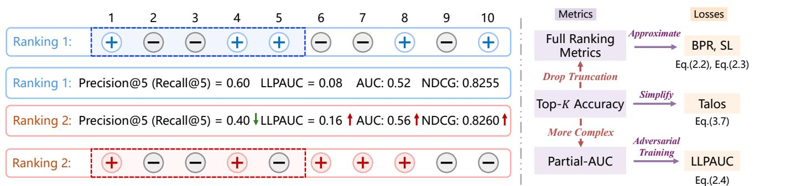
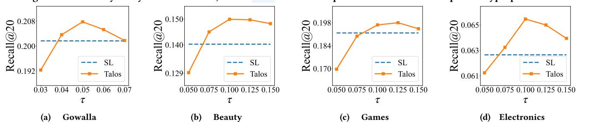

# Talos: Optimizing Top-�� Accuracy in Recommender Systems

[Shengjia Zhang](https://orcid.org/0009-0004-0209-2276)†‡§ Zhejiang University Hangzhou, China shengjia.zhang@zju.edu.cn

[Weiqin Yang](https://orcid.org/0000-0002-5750-5515)†‡§ Zhejiang University Hangzhou, China tinysnow@zju.edu.cn

[Jiawei Chen](https://orcid.org/0000-0002-4752-2629)∗‡§¶ Zhejiang University Hangzhou, China sleepyhunt@zju.edu.cn

[Peng Wu](https://orcid.org/0000-0001-7154-8880)∥ Beijing Technology and Business University Beijing, China pengwu@btbu.edu.cn

[Yuegang Sun](https://orcid.org/0009-0009-2701-4641) Intelligence Indeed Hangzhou, China bulutuo@i-i.ai

[Gang Wang](https://orcid.org/0000-0001-6248-1426) Bangsheng Technology Co,Ltd. Hangzhou, China wanggang@bsfit.com.cn

[Qihao Shi](https://orcid.org/0000-0002-7883-9848) Hangzhou City University Hangzhou, China shiqihao321@zju.edu.cn

[Can Wang](https://orcid.org/0000-0002-5890-4307)ঠZhejiang University Hangzhou, China wcan@zju.edu.cn

# Abstract

Recommender systems (RS) aim to retrieve a small set of items that best match individual user preferences. Naturally, RS place primary emphasis on the quality of the Top-�� results rather than performance across the entire item set. However, estimating Top-�� accuracy (e.g., Precision@��, Recall@��) requires determining the ranking positions of items, which imposes substantial computational overhead and poses significant challenges for optimization. In addition, RS often suffer from distribution shifts due to evolving user preferences or data biases, further complicating the task.

To address these issues, we propose Talos, a loss function that is specifically designed to optimize the Top-�� recommendation accuracy. Talos leverages a quantile technique that replaces the complex ranking-dependent operations into simpler comparisons between predicted scores and learned score thresholds. We further develop a sampling-based regression algorithm for efficient and accurate threshold estimation, and introduce a constraint term to maintain optimization stability by preventing score inflation. Additionally, we incorporate a tailored surrogate function to address discontinuity and enhance robustness against distribution shifts. Comprehensive theoretical analyzes and empirical experiments are conducted to demonstrate the effectiveness, efficiency, convergence, and distributional robustness of Talos. The code is available at [https://github.com/cynthia-shengjia/WWW-2026-Talos.](https://github.com/cynthia-shengjia/WWW-2026-Talos)

# CCS Concepts

• Information systems → Recommender systems.

# Keywords

Recommender Systems, Top-�� Accuracy, Loss Functions

## ACM Reference Format:

Shengjia Zhang, Weiqin Yang, Jiawei Chen, Peng Wu, Yuegang Sun, Gang Wang, Qihao Shi, and Can Wang. 2026. Talos: Optimizing Top-�� Accuracy in Recommender Systems. In Proceedings of the ACM Web Conference 2026 (WWW '26), April 13–17, 2026, Dubai, United Arab Emirates. ACM, New York, NY, USA, [17](#page-16-0) pages. <https://doi.org/10.1145/nnnnnnn.nnnnnnn>

# 1 Introduction

Being able to provide personalized suggestions, Recommender Systems (RS) [\[24,](#page-8-0) [64\]](#page-9-0) are integral to several online service platforms. On these platforms, users are typically presented with only a small set of items. Consequently, RS primarily emphasizes the quality of the Top-�� items (e.g., Precision@�� and Recall@��) rather than the performance across the entire item set. Existing RS often adopt a learning-based paradigm [\[16,](#page-8-1) [53\]](#page-9-1) — learning a recommendation model to estimate user preference scores over items and then retrieving the Top-�� items with the highest predicted scores as recommendations.

The distinct focus on Top-�� accuracy has inspired extensive research on recommendation loss functions. The loss function determines the direction of model optimization, whose importance cannot be overemphasized [\[54,](#page-9-2) [57\]](#page-9-3). Recent years have witnessed the emergence of two prominent types of loss functions:

- Full-ranking Losses: Some works aim to improve the overall ranking performance without explicitly targeting Top-�� estimation. Prominent examples include BPR [\[38\]](#page-8-2) and Softmax Losses [\[54\]](#page-9-2), which have been shown to approximately optimize the Area Under the ROC Curve (AUC) and Normalized Discounted Cumulative Gain (NDCG), respectively. However, AUC and NDCG evaluate the quality of the entire ranking list, which can differ substantially from the quality of the Top-�� subset

†Equal contribution.

∗Corresponding author.

State Key Laboratory of Blockchain and Data Security, Zhejiang University.

§College of Computer Science and Technology, Zhejiang University. ¶Hangzhou High-Tech Zone (Binjiang) Institute of Blockchain and Data Security.

School of Mathematics and Statistics, Beijing Technology and Business University.

[This work is licensed under a Creative Commons Attribution 4.0 International License.](https://creativecommons.org/licenses/by/4.0) WWW '26, Dubai, United Arab Emirates

© 2026 Copyright held by the owner/author(s).

ACM ISBN 978-x-xxxx-xxxx-x/YYYY/MM <https://doi.org/10.1145/nnnnnnn.nnnnnnn>

Figure 1: (Left). Illustration of the inconsistency between LLPAUC/AUC/NDCG and Top-�� accuracy (Precision@�� and Recall@��) for two difference ranking schemes of ten items, where ranking scheme 2 achieves better AUC/LLPAUC and NDCG, while worse on Top-�� accuracy; (Right). The relationship among Talos, LLPAUC, SL, and BPR.

most relevant to RS outcomes. Consequently, optimizing these full-ranking loss functions does not necessarily translate to improvements in Top-�� accuracy and may sometimes reduce it. Figure [1](#page-1-0) provides an example where AUC and NDCG increase while Precision@�� and Recall@�� decrease. Such cases are not rare in RS. By empirically analyzing arbitrary pairs of ranking lists for users on real-world datasets, we observe that the ratio of such inconsistent cases exceeds 34.37% and 28.49% on average.

- Partial-AUC-based Losses: Another line of research focuses on developing loss functions for optimizing Partial-AUC metrics (e.g., LLPAUC [\[43\]](#page-8-3) and OPAUC [\[42\]](#page-8-4)), which evaluate the partial area under the ROC curve and correlate more strongly with Top- �� accuracy than full-ranking losses. Indeed, as shown in Table [1.1,](#page-2-0) the inconsistency ratio between LLPAUC and Precision@�� decreases to 21.86% on average. Nevertheless, the gap still exists. More critically, Partial-AUC metrics are highly complex, incurring significant optimization challenges. It can be seen from their surrogate loss functions often involve adversarial training [\[43\]](#page-8-3), which complicates training stability and reduces effectiveness. Furthermore, these loss functions introduce additional hyperparameters compared to BPR and SL, necessitating expensive and time-consuming tuning efforts. These limitations significantly hinder their practical application.

Given these limitations, an important research question raises: How can we design a loss function that directly optimizes top-K accuracy in recommender systems? Considering the characteristics of Top-�� optimization and RS, we identify the following key obstacles:

- Ranking-aware Discontinuous Objective: Top-�� accuracy (e.g., Precision@��) are computed only over the Top-�� ranked items, requiring a ranking-dependent truncation — determining which items lie in the Top-�� positions. This process requires computing item ranking positions, incurring high computational cost. It also makes the objective discontinuous or constant in large regions, making gradient-based optimization ineffective.
- Distributional-Shift Challenge: It is important to note that RS often faces severe distribution shifts due to evolving user preference [\[50\]](#page-9-4) or data collection biases [\[3,](#page-8-5) [4,](#page-8-6) [12,](#page-8-7) [27\]](#page-8-8). Loss functions that are robust to such shifts have been shown to be essential for RS performance [\[53\]](#page-9-1).

To address these challenges, we propose Talos, a new loss function specifically designed for optimizing Top-�� recommendation accuracy (e.g., Precision@�� and Recall@��). To overcome the rankingdependence, we introduce the quantile [\[13,](#page-8-9) [25,](#page-8-10) [40\]](#page-8-11) to reformulate Top-�� selection into simple comparisons between item scores and a learned score threshold. Items with scores above the threshold constitute the Top-��, avoiding explicit sorting and thus significantly facilitating optimization. However, this threshold-based strategy also raises two further questions: 1) Threshold estimation: The valid thresholds vary per user, requiring efficient and accurate estimation; 2) Convergence concern: Thresholds evolve during training, raising concerns about training convergence and stability. Particularly, we observe score inflation phenomenon that both predicted scores and thresholds rise excessively. We resolve these by: 1) Developing a sampling-based quantile regression method for fast and accurate estimation; 2) Introducing a constraint term limiting the number of items above the threshold, ensuring training convergence and stability.

Additionally, to further tackle discontinuity and distribution shift, we design a specific smooth surrogate function approximating the Heaviside step function. These designs endow Talos with three fundamental theoretical properties: 1) Talos serves as a tight upper bound for optimizing Precision@��, ensuring its effectiveness; 2) Talos is equivalent to performing Distributionally Robust Optimization, a theoretical-sound approach that empowers the model with robustness against distribution shifts; 3) the optimization procedure for Talos provides theoretically convergence guarantees.

The proposed Talos is practical in three aspects: 1) It is concise in form and can be easily plug-in existing RS models with minimal code modifications; 2) It is computationally efficient, with both theoretical time complexity and practical runtime comparable to the conventional loss; 3) It preserves simplicity in hyperparameter tuning, requiring only a single temperature parameter. In summary, our main contributions are:

- We propose Talos, a novel loss function for directly optimizing Top-�� recommendation accuracy.
- We provide comprehensive theoretical analyses, demonstrating its effectiveness, distributional robustness, and convergence guarantees.
- We conduct extensive experiments across four datasets and three backbone models, verifying the superiority of Talos over the state-of-the-art losses.

| Metric   | Gowalla Precision@20 | Recall@20 | Beauty Precision@20 | Recall@20 | Games Precision@20 | Recall@20 | Electronics Precision@20 | Recall@20 |
|----------|----------------------|-----------|---------------------|-----------|--------------------|-----------|--------------------------|-----------|
| AUC      | 33.17%               | 33.89%    | 34.67%              | 35.46%    | 35.17%             | 34.19%    | 33.32%                   | 34.58%    |
| LLPAUC   | 18.53%               | 18.65%    | 23.81%              | 22.95%    | 23.30%             | 22.34%    | 23.30%                   | 22.25%    |
| NDCG     | 26.70%               | 26.88%    | 29.65%              | 29.52%    | 29.52%             | 28.02%    | 29.11%                   | 28.53%    |
| NDCG@ �� | 19.01%               | 18.24%    | 22.02%              | 22.55%    | 21.14%             | 22.21%    | 17.65%                   | 17.51%    |

Table 3.1: Overall performance comparison of Talos with other losses. blue indicates the best result, and the runner-up is underlined. Imp.% indicates the relatively improvements of Talos over the best baselines. "P@20" denotes the metric Precision@20, and "R@20" denotes Recall@20; The mark '\*' suggests the improvement is statistically significant with �� &lt; 0.05.

| Model Loss  |        | P@20 | Gowalla | R@20 |        | P@20 | Beauty | R@20 |        | P@20 | Games  | R@20 |        | P@20 | Electronics | R@20 |
|-------------|--------|------|---------|------|--------|------|--------|------|--------|------|--------|------|--------|------|-------------|------|
| BPR         | 0      | 0438 | 0       | 1511 | 0      | 0146 | 0      | 1267 | 0      | 0142 | 0      | 1334 | 0      | 0058 | 0           | 0566 |
| AATP        | 0      | 0327 | 0       | 1078 | 0      | 0120 | 0      | 1044 | 0      | 0142 | 0      | 1330 | 0      | 0028 | 0           | 0272 |
| RS@ ��      | 0      | 0397 | 0       | 1218 | 0      | 0094 | 0      | 0669 | 0      | 0104 | 0      | 0872 | 0      | 0020 | 0           | 0159 |
| SmoothI@    | �� 0   | 0586 | 0       | 1882 | 0      | 0163 | 0      | 1352 | 0      | 0192 | 0      | 1778 | 0      | 0059 | 0           | 0565 |
| SL          | 0      | 0625 | 0       | 2017 | 0      | 0172 | 0      | 1403 | 0      | 0208 | 0      | 1918 | 0      | 0064 | 0           | 0626 |
| BSL MF      | 0      | 0625 | 0       | 2017 | 0      | 0171 | 0      | 1401 | 0      | 0210 | 0      | 1934 | 0      | 0065 | 0           | 0630 |
| PSL         | 0      | 0631 | 0       | 2031 | 0      | 0174 | 0      | 1432 | 0      | 0210 | 0      | 1935 | 0      | 0066 | 0           | 0637 |
| AdvInfoNCE  | 0      | 0623 | 0       | 2012 | 0      | 0171 | 0      | 1403 | 0      | 0210 | 0      | 1935 | 0      | 0063 | 0           | 0616 |
| LLPAUC      | 0      | 0562 | 0       | 1847 | 0      | 0157 | 0      | 1336 | 0      | 0187 | 0      | 1748 | 0      | 0059 | 0           | 0583 |
| Talos       | 0.0642 |      | 0.2079  |      | 0.0179 |      | 0.1499 |      | 0.0213 |      | 0.1967 |      | 0.0067 |      | 0.0655      |      |
| Imp.%       | +1.71% | ∗    |         |      |        |      |        |      |        |      |        |      |        |      |             |      |
|             |        |      | +2.35%  | ∗    |        |      |        |      |        |      |        |      |        |      |             |      |
|             |        |      |         |      | +2.69% | ∗    |        |      |        |      |        |      |        |      |             |      |
|             |        |      |         |      |        |      | +4.69% | ∗    |        |      |        |      |        |      |             |      |
|             |        |      |         |      |        |      |        |      | +1.19% | ∗    |        |      |        |      |             |      |
|             |        |      |         |      |        |      |        |      |        |      | +1.62% | ∗    |        |      |             |      |
|             |        |      |         |      |        |      |        |      |        |      |        |      | +3.04% | ∗    |             |      |
|             |        |      |         |      |        |      |        |      |        |      |        |      |        |      | +2.75%      | ∗    |
| BPR         | 0      | 0527 | 0       | 1761 | 0      | 0159 | 0      | 1385 | 0      | 0192 | 0      | 1801 | 0      | 0050 | 0           | 0482 |
| AATP        | 0      | 0249 | 0       | 0754 | 0      | 0121 | 0      | 1067 | 0      | 0127 | 0      | 1175 | 0      | 0030 | 0           | 0289 |
| RS@ ��      | 0      | 0536 | 0       | 1735 | 0      | 0151 | 0      | 1192 | 0      | 0168 | 0      | 1511 | 0      | 0038 | 0           | 0357 |
| SmoothI@    | �� 0   | 0590 | 0       | 1898 | 0      | 0169 | 0      | 1427 | 0      | 0196 | 0      | 1801 | 0      | 0065 | 0           | 0630 |
| SL          | 0      | 0628 | 0       | 2025 | 0      | 0172 | 0      | 1433 | 0      | 0211 | 0      | 1942 | 0      | 0065 | 0           | 0629 |
| BSL LGCN    | 0      | 0628 | 0       | 2025 | 0      | 0172 | 0      | 1433 | 0      | 0210 | 0      | 1931 | 0      | 0064 | 0           | 0626 |
| PSL         | 0      | 0634 | 0       | 2042 | 0      | 0173 | 0      | 1425 | 0      | 0210 | 0      | 1925 | 0      | 0065 | 0           | 0627 |
| AdvInfoNCE  | 0      | 0627 | 0       | 2028 | 0      | 0172 | 0      | 1433 | 0      | 0210 | 0      | 1936 | 0      | 0064 | 0           | 0626 |
| LLPAUC      | 0      | 0516 | 0       | 1722 | 0      | 0170 | 0      | 1423 | 0      | 0202 | 0      | 1882 | 0      | 0066 | 0           | 0642 |
| Talos       | 0.0642 |      | 0.2080  |      | 0.0178 |      | 0.1489 |      | 0.0212 |      | 0.1960 |      | 0.0068 |      | 0.0662      |      |
| Imp.%       | +1.26% | ∗    |         |      |        |      |        |      |        |      |        |      |        |      |             |      |
|             |        |      | +1.85%  | ∗    |        |      |        |      |        |      |        |      |        |      |             |      |
|             |        |      |         |      | +3.08% | ∗    |        |      |        |      |        |      |        |      |             |      |
|             |        |      |         |      |        |      | +3.87% | ∗    |        |      |        |      |        |      |             |      |
|             |        |      |         |      |        |      |        |      | +0.68% | ∗    |        |      |        |      |             |      |
|             |        |      |         |      |        |      |        |      |        |      | +0.95% | ∗    |        |      |             |      |
|             |        |      |         |      |        |      |        |      |        |      |        |      | +3.48% | ∗    |             |      |
|             |        |      |         |      |        |      |        |      |        |      |        |      |        |      | +3.06%      | ∗    |
| BPR         | 0      | 0584 | 0       | 1917 | 0      | 0170 | 0      | 1450 | 0      | 0194 | 0      | 1810 | 0      | 0064 | 0           | 0625 |
| AATP        | 0      | 0451 | 0       | 1515 | 0      | 0153 | 0      | 1264 | 0      | 0173 | 0      | 1619 | 0      | 0051 | 0           | 0501 |
| RS@ ��      | 0      | 0515 | 0       | 1669 | 0      | 0151 | 0      | 1221 | 0      | 0174 | 0      | 1590 | 0      | 0040 | 0           | 0373 |
| SmoothI@    | �� 0   | 0532 | 0       | 1731 | 0      | 0077 | 0      | 0560 | 0      | 0144 | 0      | 1320 | 0      | 0040 | 0           | 0395 |
| SL          | 0      | 0623 | 0       | 2010 | 0      | 0171 | 0      | 1418 | 0      | 0208 | 0      | 1915 | 0      | 0065 | 0           | 0627 |
| BSL XSimGCL | 0      | 0625 | 0       | 2013 | 0      | 0169 | 0      | 1413 | 0      | 0209 | 0      | 1931 | 0      | 0063 | 0           | 0619 |
| PSL         | 0      | 0630 | 0       | 2023 | 0      | 0172 | 0      | 1407 | 0      | 0207 | 0      | 1910 | 0      | 0066 | 0           | 0636 |
| AdvInfoNCE  | 0      | 0623 | 0       | 2010 | 0      | 0171 | 0      | 1415 | 0      | 0209 | 0      | 1923 | 0      | 0064 | 0           | 0622 |
| LLPAUC      | 0      | 0612 | 0       | 1980 | 0      | 0171 | 0      | 1443 | 0      | 0207 | 0      | 1910 | 0      | 0064 | 0           | 0635 |
| Talos       | 0.0638 |      | 0.2057  |      | 0.0180 |      | 0.1506 |      | 0.0212 |      | 0.1961 |      | 0.0067 |      | 0.0654      |      |
| Imp.%       | +1.27% | ∗    |         |      |        |      |        |      |        |      |        |      |        |      |             |      |
|             |        |      | +1.68%  | ∗    |        |      |        |      |        |      |        |      |        |      |             |      |
|             |        |      |         |      | +4.87% | ∗    |        |      |        |      |        |      |        |      |             |      |
|             |        |      |         |      |        |      | +3.81% | ∗    |        |      |        |      |        |      |             |      |
|             |        |      |         |      |        |      |        |      | +1.32% | ∗    |        |      |        |      |             |      |
|             |        |      |         |      |        |      |        |      |        |      | +1.60% | ∗    |        |      |             |      |
|             |        |      |         |      |        |      |        |      |        |      |        |      | +2.65% | ∗    |             |      |
|             |        |      |         |      |        |      |        |      |        |      |        |      |        |      | +2.81%      | ∗    |

Advantage 4: Convergence Guarantee. While the proposed optimization process involves dynamic update between Eq.[\(3.3\)](#page-2-3) and Eq.[\(3.6\)](#page-4-2), it has the following theoretical convergence guarantee:

Theorem 3.3 (Convergence guarantee). Let �� be the Lipschitz constant of L�� �������� . With the fixed stepsize 0 &lt; �� &lt; 2/��, the gradient norm is bounded by:

(2�� − ����2 ) 4 E�� h ∥∇L(��) Talos ∥ i ≤ 1 �� L (0) �� �������� (3.10)

where �� denotes the total number of optimization iterations, ∇L(��) Talos denotes the gradient of the loss w.r.t. the score variables at iteration ��, and L (0) �� �������� denotes the the initial loss value.

The proof is presented in Appendix [A.3.](#page-10-0) Theorem [3.3](#page-5-1) provides a theoretical foundation for Talos optimization reliability.

# 4 Experiments

# 4.1 Experimental Setup

Recommendation Backbones. We closely refer to Yang et al. [\[57\]](#page-9-3) and evaluate Talos and baselines on three distinct recommendation backbones: the classic Matrix Factorization (MF) model [\[38\]](#page-8-2), the representative graph-based model LightGCN [\[16\]](#page-8-1), and the SOTA method XSimGCL [\[59\]](#page-9-13). See Appendix [D.2](#page-12-1) for more details. Baselines. The following baselines are included: 1) BPR [\[38\]](#page-8-2), the classic pair-wise loss in RS; 2) SL [\[54\]](#page-9-2): the loss approximately optimizing the NDCG; 3) BSL [\[53\]](#page-9-1), AdvInfoNCE [\[61\]](#page-9-14), and PSL [\[57\]](#page-9-3): three enhanced variants of SL from different perspectives, achieving SOTA performance; 4) LLPAUC [\[43\]](#page-8-3), the loss approximately optimizing the lower-left partial AUC; 5) SmoothI@�� [\[46\]](#page-8-23), RS@�� [\[34\]](#page-8-24), and AATP [\[2\]](#page-8-25), three surrogate losses for Top-�� metrics. Note that

Table 3.2: Performance comparisons with varying �� on MF backbone in Gowalla dataset. blue indicates the best result.

| Gowalla    |        | Recall@20 |        | Recall@50 |        | Recall@80 |
|------------|--------|-----------|--------|-----------|--------|-----------|
| AATP       | 0      | 1062      | 0      | 2068      | 0      | 2160      |
| RS@ ��     | 0      | 1218      | 0      | 1059      | 0      | 2406      |
| SmoothI@   | �� 0   | 1882      | 0      | 3027      | 0      | 3625      |
| SL         | 0      | 2017      | 0      | 3185      | 0      | 3900      |
| BSL        | 0      | 2017      | 0      | 3185      | 0      | 3900      |
| AdvInfoNCE | 0      | 2013      | 0      | 3183      | 0      | 3900      |
| LLPAUC     | 0      | 1847      | 0      | 2927      | 0      | 3640      |
| PSL        | 0      | 2038      | 0      | 3192      | 0      | 3902      |
| Talos@20   | 0.2078 |           | 0      | 3202      | 0      | 3894      |
| Talos@50   | 0      | 2078      | 0.3212 |           | 0      | 3907      |
| Talos@80   | 0      | 2074      | 0      | 3211      | 0.3911 |           |
| Imp.%      | +1.98% |           | +0.63% |           | +0.22% |           |

Table 3.3: Performance comparisons with varying �� on MF backbone in Beauty dataset. blue indicates the best result.

| Beauty      | Recall@20 | Recall@50 | Recall@80 |
|-------------|-----------|-----------|-----------|
| AATP        | 0 1077    | 0 1850    | 0 2371    |
| RS@ ��      | 0.0669    | 0.0989    | 0.1223    |
| SmoothI@ �� | 0.1352    | 0.2041    | 0.2454    |
| SL          | 0.1403    | 0.2163    | 0.2617    |
| BSL         | 0.1401    | 0.2159    | 0.2617    |
| AdvInfoNCE  | 0.1409    | 0.2160    | 0.2621    |
| LLPAUC      | 0.1336    | 0.2047    | 0.2443    |
| PSL         | 0.1432    | 0.2184    | 0.2625    |
| Talos@20    | 0.1499    | 0.2205    | 0.2620    |
| Talos@50    | 0.1484    | 0.2218    | 0.2637    |
| Talos@80    | 0.1485    | 0.2213    | 0.2674    |
| Imp.%       | +1.85%    | +4.69%    | +1.59%    |

Table 3.4: Temporal shift explorations. P@20 denotes Precision@20, while R@20 denotes Recall@20.

| Dataset | Metric | AATP   | RS@ �� | SmoothI@ �� | SL     | BSL    | PSL    | AdvInfoNCE | LLPAUC | Talos  | Imp.%  |
|---------|--------|--------|--------|-------------|--------|--------|--------|------------|--------|--------|--------|
| Gowalla | P@20   | 0.0300 | 0.0404 | 0.0544      | 0.0544 | 0.0544 | 0.0542 | 0.0542     | 0.0567 | 0.0574 | +1.24% |
|         | R@20   | 0.0807 | 0.1103 | 0.1497      | 0.1497 | 0.1497 | 0.1492 | 0.1499     | 0.1541 | 0.1577 | +2.37% |
| Beauty  | P@20   | 0.0061 | 0.0046 | 0.0076      | 0.0089 | 0.0089 | 0.0086 | 0.0089     | 0.0087 | 0.0094 | +5.51% |
|         | R@20   | 0.0461 | 0.0381 | 0.0589      | 0.0696 | 0.0697 | 0.0679 | 0.0699     | 0.0697 | 0.0738 | +5.45% |

these methods are tailored for other domains, and their effectiveness in RS is limited. We discuss these methods in Section [5.](#page-7-1)

Datasets. We conduct experiments on four widely-used datasets containing users' ratings on items: Beauty, Games, Electronics [\[57\]](#page-9-3) and Gowalla [\[16\]](#page-8-1). See Appendix [D.3](#page-12-2) for more details.

Hyperparameter Setting. A grid search is adopted to find optimal hyperparameters. For all compared methods, we closely follow configurations in their respective publications to ensure the optimal performance. We refer readers to Appendix [D.5](#page-12-3) for more details.

# 4.2 Analysis on Experiment Details

Talos VS. others. Table [3.1](#page-5-0) compares Talos with other baselines. Overall, Talos outperforms all baselines across all datasets and backbones. Especially in Beauty, Talos achieves the impressive improvements — 3.83% average on two evaluation metrics, highlighting the effectiveness of Talos that directly optimizes Top-�� accuracy. Additional results in Appendix [E](#page-14-0) demonstrate Talos also brings improvements on NDCG@�� and MRR@��.

LLPAUC VS. SL. While LLPAUC demonstrates a stronger correlation with Top-�� metrics than SL, we observe it does not consistently outperforms SL. In fact, LLPAUC is unstable across different backbones, even worse than basic BPR on Gowalla with LGCN.

Performance comparison with varying ��. Tables [3.2](#page-6-0) and [3.3](#page-6-0) illustrate the performance across different values of ��. We observe that Talos consistently outperforms the compared methods for various �� values. However, as �� increases, the magnitude of the improvements decreases. This observation aligns with our intuition. As �� increases, the Top-�� accuracy gradually degrades to the full ranking metrics. Consequently, the advantage of optimizing for Top-�� accuracy diminishes as �� grows.

Consistency study. Tables [3.2](#page-6-0) and [3.3](#page-6-0) present Recall@�� ′ , and the performance of Talos@�� for varying values ��, ��′∈{20, 50, 80}. We observe that the best performance is achieved when �� =�� ′ , aligned with our expectations. For instance, when evaluating Recall@80 for a model trained with Talos@20 (targets optimizing for Recall@20), the discrepancy between �� and �� ′ leads to performance drop.

Performance with distribution shifts. To evaluate the robustness against distribution shifts, we follow [\[47\]](#page-8-26), introducing temporal bias to construct the test scenario with distribution shifts (cf. Appendix [D.4\)](#page-12-4). Table [3.4](#page-6-1) shows that Talos achieves the best performance, demonstrating its superior distributional robustness. LLPAUC benefits from adversarial training and exhibits fine robustness. Moreover, Talos achieves more pronounced average improvements than in IID setting, i.e., 1.26%→3.37%. The effectiveness can be attributed to its connection with DRO.

Ablation study. In Table [4.1,](#page-7-0) we evaluate three Talos variants: 1) quantile fixed as zero (w/o-quantile); 2) sigmoid(·)1/�� replaced by sigmoid(·/��) (w/o-outside); 3) the denominator term in Eq.[\(3.6\)](#page-4-2) replaced by the constant �� (w/o-denominator). Talos outperforms all variants. We highlight three key observations: 1) The gap between Talos and w/o-quantile highlights the importance of quantile technique; 2) Talos surpasses w/o-outside, indicating the superiority of introducing DRO; 3) Compared to w/o-denominator, results confirm our analysis in Section [3.1](#page-3-1) that Talos naturally penalizes negatives exceeding the Top-�� quantile, addressing score inflation. Temperature Sensitivity. Figure [2](#page-7-2) depicts the performance with varying �� in Talos. Performance initially improves as �� increases, but degrades beyond a certain point. This aligns with Theorem [3.1:](#page-4-1) When �� satisfies the surrogate condition, smaller �� means the tighter upper bound for Top-�� accuracy but increases training difficulty due to the decreased Lipschitz smoothness. As �� increases, the approximation would be looser, even not satisfy the surrogate condition, thus impacting performance.

Figure 2: Sensitivity analysis of Talos on ��, where - - - denotes the performance of SL with optimal hyperparameter.

Table 4.1: Ablation study, we examine three variations of Talos, where the quantile is removed (w/o-quantile), the sigmoid(��) 1/�� form is replaced by sigmoid(��/��) (w/o-outside), and the denominator term is replaced by the constant �� (w/o-denominator).

| Loss            | Precision@20 | Gowalla Recall@20 | Precision@20 | Beauty Recall@20 | Precision@20 | Games Recall@20 | Precision@20 | Electronics Recall@20 |
|-----------------|--------------|-------------------|--------------|------------------|--------------|-----------------|--------------|-----------------------|
| w/o-quantile    | 0.0626       | 0.2037            | 0.0175       | 0.1487           | 0.0208       | 0.1931          | 0.0066       | 0.0640                |
| w/o-outside     | 0.0577       | 0.1859            | 0.0166       | 0.1375           | 0.0194       | 0.1799          | 0.0062       | 0.0592                |
| w/o-denominator | 0.0278       | 0.0869            | 0.0101       | 0.0841           | 0.0127       | 0.1173          | 0.0018       | 0.0160                |
| Talos           | 0.0642       | 0.2079            | 0.0179       | 0.1499           | 0.0213       | 0.1967          | 0.0067       | 0.0655                |

# 5 Related Work

Since this work focuses on recommendation loss functions, here we mainly introduce related work on this topic. For the area of recommendation models and recommendation loss consistency, we refer readers to Appendix [C.](#page-11-2) In recommendation losses, two prominent types stand out: 1) full ranking optimization losses such as BPR [\[38\]](#page-8-2) and SL [\[54\]](#page-9-2). BPR optimizes the relative ranking of positive items over negatives as an AUC surrogate, while SL has been shown to approximately optimize the NDCG ranking metric with excellent performance. Motivated by the success of SL, several works attempted to improve it: BSL [\[53\]](#page-9-1) and AdvInfoNCE [\[61\]](#page-9-14) introduced the DRO framework to enhance SL's robustness. PSL [\[57\]](#page-9-3) replaced the exponential function in SL with other appropriate activation functions, serving as a tighter surrogate for NDCG. 2) LLPAUC [\[43\]](#page-8-3), which evaluates the lower left part of AUC, demonstrates a strong correlation with Top-�� accuracy. Beyond these two types, recent works explored alternative losses [\[28,](#page-8-27) [41\]](#page-8-28), but these do not optimize Top-�� accuracy.

Notably, Top-�� optimization has also been investigated in other fields, yet these approaches fall short when applied to RS. For instance, AATP [\[2\]](#page-8-25) serves as a surrogate Top-�� loss by integrating quantile. Nevertheless, this loss is heuristically designed, which lacks theoretical connections to Top-�� accuracy. Furthermore, it fails to address the common distribution shifts in RS (cf. Table [3.4\)](#page-6-1). In image retrieval, Pre@�� [\[31\]](#page-8-29) and RS@�� [\[34\]](#page-8-24) optimize Precision@�� and Recall@��, respectively. However, they either integrated the complicated sampling strategy or rely on nested approximations of both ranking positions and indicator functions, which exacerbate errors when aligning with Top-�� accuracy. In information retrieval, SmoothI@�� [\[46\]](#page-8-23) employs the softmax function to approximate Top-�� indicators through a complex recursive estimation process, leading to inaccurate approximations particularly in RS with large item sets. As shown in Table [3.1,](#page-5-0) SmoothI@�� underperforms even the basic BPR when applied with the XSimGCL backbone.

Recently, a contemporaneous and parallel study, SL@�� [\[58\]](#page-9-5), focuses on optimizing NDCG@��. We emphasize that Talos differs

from SL@�� in several important aspects: 1) This work targets the optimization of Precision@�� and Recall@��, whereas SL@�� is designed to optimize NDCG@��. These metrics are not consistent as discussed in Section [2.3.](#page-2-4) 2) Talos demonstrates the robustness to distribution shifts, while SL@�� does not. Under temporal shifts, Talos achieves superior performance (over 1.12%, cf. Table [A.1\)](#page-11-0). 3) Talos achieves greater stability when fewer negative items are sampled, yielding markedly higher performance compared with SL@�� (over 1.96%, cf. Table [A.2\)](#page-11-0). 4) Talos incorporates a more accurate threshold estimation strategy, resulting in substantially lower estimation error than SL@�� (0.01 v.s. 0.18, cf. Table [A.4\)](#page-11-1). 5) SL@�� requires a greater number of hyperparameters, considerably limiting its practicality.

# 6 Conclusion and Future Works

This work introduces Talos, tailored for optimizing Top-�� accuracy in recommender systems. Talos incorporates an efficient quantilebased technique to handle the ranking-dependent challenge; introduces a constraint optimization term to address the score inflation issue; and leverage a specific surrogate function to tackle the discontinuity problem, equipping the loss with distributional robustness. Our theoretical analysis confirms the close bounded relationship between Precision@�� and Talos, equivalence to distributionally robustness optimization, and convergence guarantees. Beyond these strengths, Talos is concise in form and computationally efficient, making it practical in RS. Considering Talos still introduces a temperature hyperparameter, developing adaptive �� mechanisms such as connecting �� to the number of positive interactions or using meta-learning, is a promising direction for future research.

# Acknowledgments

This work is supported by the Zhejiang Province "JianBingLingYan+X" Research and Development Plan (2025C02020). We thank the reviewers for their valuable and insightful suggestions that improve the paper.

## References

[1] Robert Bell, Yehuda Koren, and Chris Volinsky. 2007. Modeling relationships at multiple scales to improve accuracy of large recommender systems. In Proceedings of the 13th ACM SIGKDD international conference on Knowledge discovery and data mining. 95–104. [2] Stephen Boyd, Corinna Cortes, Mehryar Mohri, and Ana Radovanovic. 2012. Accuracy at the top. Advances in neural information processing systems 25 (2012). [3] Jiawei Chen, Hande Dong, Yang Qiu, Xiangnan He, Xin Xin, Liang Chen, Guli Lin, and Keping Yang. 2021. AutoDebias: Learning to debias for recommendation. In Proceedings of the 44th International ACM SIGIR Conference on Research and Development in Information Retrieval. 21–30. [4] Jiawei Chen, Hande Dong, Xiang Wang, Fuli Feng, Meng Wang, and Xiangnan He. 2023. Bias and debias in recommender system: A survey and future directions. ACM Transactions on Information Systems 41, 3 (2023), 1–39. [5] Jiawei Chen, Junkang Wu, Jiancan Wu, Xuezhi Cao, Sheng Zhou, and Xiangnan He. 2023. Adap-��: Adaptively modulating embedding magnitude for recommendation. In Proceedings of the ACM Web Conference 2023. 1085–1096. [6] Sirui Chen, Jiawei Chen, Sheng Zhou, Bohao Wang, Shen Han, Chanfei Su, Yuqing Yuan, and Can Wang. 2024. SIGformer: Sign-aware graph transformer for recommendation. In Proceedings of the 47th international ACM SIGIR conference on research and development in information retrieval. 1274–1284. [7] Sirui Chen, Shen Han, Jiawei Chen, Binbin Hu, Sheng Zhou, Gang Wang, Yan Feng, Chun Chen, and Can Wang. 2025. Rankformer: A Graph Transformer for Recommendation based on Ranking Objective. In Proceedings of the ACM on Web Conference 2025. 3037–3048. [8] Paul Covington, Jay Adams, and Emre Sargin. 2016. Deep neural networks for youtube recommendations. In Proceedings of the 10th ACM conference on recommender systems. 191–198. [9] Yu Cui, Feng Liu, Jiawei Chen, Canghong Jin, Xingyu Lou, Changwang Zhang, Jun Wang, Yuegang Sun, and Can Wang. 2025. HatLLM: Hierarchical Attention Masking for Enhanced Collaborative Modeling in LLM-based Recommendation. arXiv preprint arXiv:2510.10955 (2025). [10] Yu Cui, Feng Liu, Jiawei Chen, Xingyu Lou, Changwang Zhang, Jun Wang, Yuegang Sun, Xiaohu Yang, and Can Wang. 2025. Field Matters: A lightweight LLM-enhanced Method for CTR Prediction. arXiv preprint arXiv:2505.14057 (2025). [11] Yu Cui, Feng Liu, Pengbo Wang, Bohao Wang, Heng Tang, Yi Wan, Jun Wang, and Jiawei Chen. 2024. Distillation matters: empowering sequential recommenders to match the performance of large language models. In Proceedings of the 18th ACM Conference on Recommender Systems. 507–517. [12] Chongming Gao, Kexin Huang, Jiawei Chen, Yuan Zhang, Biao Li, Peng Jiang, Shiqi Wang, Zhong Zhang, and Xiangnan He. 2023. Alleviating matthew effect of offline reinforcement learning in interactive recommendation. In Proceedings of the 46th International ACM SIGIR Conference on Research and Development in Information Retrieval. 238–248. [13] Lingxin Hao and Daniel Q Naiman. 2007. Quantile regression. Number 149. Sage. [14] F Maxwell Harper and Joseph A Konstan. 2015. The movielens datasets: History and context. Acm transactions on interactive intelligent systems (tiis) 5, 4 (2015), 1–19. [15] Ruining He and Julian McAuley. 2016. VBPR: visual bayesian personalized ranking from implicit feedback. In Proceedings of the AAAI conference on artificial intelligence, Vol. 30. [16] Xiangnan He, Kuan Deng, Xiang Wang, Yan Li, Yongdong Zhang, and Meng Wang. 2020. LightGCN: Simplifying and powering graph convolution network for recommendation. In Proceedings of the 43rd International ACM SIGIR conference on research and development in Information Retrieval. 639–648. [17] Xiangnan He, Lizi Liao, Hanwang Zhang, Liqiang Nie, Xia Hu, and Tat-Seng Chua. 2017. Neural collaborative filtering. In Proceedings of the 26th international conference on world wide web. 173–182. [18] A Iliev, Nikolay Kyurkchiev, and Svetoslav Markov. 2017. On the approximation of the step function by some sigmoid functions. Mathematics and Computers in Simulation 133 (2017), 223–234. [19] Anton Iliev Iliev, Nikolay Kyurkchiev, and Svetoslav Markov. 2015. On the approximation of the cut and step functions by logistic and Gompertz functions. Biomath 4, 2 (2015), ID–1510101. [20] Ashish Jaiswal, Ashwin Ramesh Babu, Mohammad Zaki Zadeh, Debapriya Banerjee, and Fillia Makedon. 2020. A survey on contrastive self-supervised learning. Technologies 9, 1 (2020), 2. [21] Johan Ludwig William Valdemar Jensen. 1906. Sur les fonctions convexes et les inégalités entre les valeurs moyennes. Acta mathematica 30, 1 (1906), 175–193. [22] Christopher C Johnson et al. 2014. Logistic matrix factorization for implicit feedback data. Advances in Neural Information Processing Systems 27, 78 (2014), 1–9. [23] Diederik P Kingma and Jimmy Ba. 2014. Adam: A method for stochastic optimization. arXiv preprint arXiv:1412.6980 (2014). [24] Hyeyoung Ko, Suyeon Lee, Yoonseo Park, and Anna Choi. 2022. A survey of recommendation systems: recommendation models, techniques, and application fields. Electronics 11, 1 (2022), 141. [25] R Koenker. 2005. Quantile Regression Cambridge, UK: Cambridge Univ. [26] Yehuda Koren, Robert Bell, and Chris Volinsky. 2009. Matrix factorization techniques for recommender systems. Computer 42, 8 (2009), 30–37. [27] Siyi Lin, Chongming Gao, Jiawei Chen, Sheng Zhou, Binbin Hu, Yan Feng, Chun Chen, and Can Wang. 2025. How do recommendation models amplify popularity bias? An analysis from the spectral perspective. In Proceedings of the Eighteenth ACM International Conference on Web Search and Data Mining. 659–668. [28] Zhutian Lin, Junwei Pan, Shangyu Zhang, Ximei Wang, Xi Xiao, Shudong Huang, Lei Xiao, and Jie Jiang. 2024. Understanding the ranking loss for recommendation with sparse user feedback. In Proceedings of the 30th ACM SIGKDD Conference on Knowledge Discovery and Data Mining. 5409–5418. [29] Xiao Liu, Fanjin Zhang, Zhenyu Hou, Li Mian, Zhaoyu Wang, Jing Zhang, and Jie Tang. 2021. Self-supervised learning: Generative or contrastive. IEEE transactions on knowledge and data engineering 35, 1 (2021), 857–876. [30] Phil Long and Rocco Servedio. 2013. Consistency versus realizable H-consistency for multiclass classification. In International conference on machine learning. PMLR, 801–809. [31] Jing Lu, Chaofan Xu, Wei Zhang, Ling-Yu Duan, and Tao Mei. 2019. Sampling wisely: Deep image embedding by top-k precision optimization. In Proceedings of the IEEE/CVF International Conference on Computer Vision. 7961–7970. [32] Aaron van den Oord, Yazhe Li, and Oriol Vinyals. 2018. Representation learning with contrastive predictive coding. arXiv preprint arXiv:1807.03748 (2018). [33] Rong Pan, Yunhong Zhou, Bin Cao, Nathan N Liu, Rajan Lukose, Martin Scholz, and Qiang Yang. 2008. One-class collaborative filtering. In 2008 Eighth IEEE international conference on data mining. IEEE, 502–511. [34] Yash Patel, Giorgos Tolias, and Jiří Matas. 2022. Recall@ k surrogate loss with large batches and similarity mixup. In Proceedings of the IEEE/CVF Conference on Computer Vision and Pattern Recognition. 7502–7511. [35] Qi Pi, Guorui Zhou, Yujing Zhang, Zhe Wang, Lejian Ren, Ying Fan, Xiaoqiang Zhu, and Kun Gai. 2020. Search-based user interest modeling with lifelong sequential behavior data for click-through rate prediction. In Proceedings of the 29th ACM International Conference on Information & Knowledge Management. 2685–2692. [36] Yuanhao Pu, Defu Lian, Xiaolong Chen, Jin Chen, Ze Liu, and Enhong Chen. 2025. Understanding the Effect of Loss Functions on the Generalization of Recommendations. In Proceedings of the 31st ACM SIGKDD Conference on Knowledge Discovery and Data Mining V. 1. 1127–1137. [37] Zhaochun Ren, Xiangnan He, Dawei Yin, Maarten de Rijke, et al. 2024. Information Discovery in E-commerce. Foundations and Trends® in Information Retrieval 18, 4-5 (2024), 417–690. [38] Steffen Rendle, Christoph Freudenthaler, Zeno Gantner, and Lars Schmidt-Thieme. 2009. BPR: Bayesian personalized ranking from implicit feedback. In Proceedings of the Twenty-Fifth Conference on Uncertainty in Artificial Intelligence. 452–461. [39] R Tyrrell Rockafellar and Roger JB Wets. 1998. Variational analysis. Springer. [40] Jun Shao. 2008. Mathematical statistics. Springer Science & Business Media. [41] Xiang-Rong Sheng, Jingyue Gao, Yueyao Cheng, Siran Yang, Shuguang Han, Hongbo Deng, Yuning Jiang, Jian Xu, and Bo Zheng. 2023. Joint optimization of ranking and calibration with contextualized hybrid model. In Proceedings of the 29th ACM SIGKDD Conference on Knowledge Discovery and Data Mining. 4813–4822. [42] Wentao Shi, Jiawei Chen, Fuli Feng, Jizhi Zhang, Junkang Wu, Chongming Gao, and Xiangnan He. 2023. On the theories behind hard negative sampling for recommendation. In Proceedings of the ACM Web Conference 2023. 812–822. [43] Wentao Shi, Chenxu Wang, Fuli Feng, Yang Zhang, Wenjie Wang, Junkang Wu, and Xiangnan He. 2024. Lower-Left Partial AUC: An Effective and Efficient Optimization Metric for Recommendation. In Proceedings of the ACM on Web Conference 2024. 3253–3264. [44] Yue Shi, Martha Larson, and Alan Hanjalic. 2014. Collaborative filtering beyond the user-item matrix: A survey of the state of the art and future challenges. ACM Computing Surveys (CSUR) 47, 1 (2014), 1–45. [45] Xiaoyuan Su and Taghi M Khoshgoftaar. 2009. A survey of collaborative filtering techniques. Advances in artificial intelligence 2009, 1 (2009), 421425. [46] Thibaut Thonet, Yagmur Gizem Cinar, Eric Gaussier, Minghan Li, and Jean-Michel Renders. 2022. Listwise learning to rank based on approximate rank indicators. In Proceedings of the AAAI Conference on Artificial Intelligence, Vol. 36. 8494–8502. [47] Bohao Wang, Jiawei Chen, Changdong Li, Sheng Zhou, Qihao Shi, Yang Gao, Yan Feng, Chun Chen, and Can Wang. 2024. Distributionally Robust Graph-based Recommendation System. In Proceedings of the ACM on Web Conference 2024. 3777–3788. [48] Bohao Wang, Feng Liu, Jiawei Chen, Xingyu Lou, Changwang Zhang, Jun Wang, Yuegang Sun, Yan Feng, Chun Chen, and Can Wang. 2025. Msl: Not all tokens are what you need for tuning llm as a recommender. In Proceedings of the 48th International ACM SIGIR Conference on Research and Development in Information Retrieval. 1912–1922. [49] Bohao Wang, Feng Liu, Changwang Zhang, Jiawei Chen, Yudi Wu, Sheng Zhou, Xingyu Lou, Jun Wang, Yan Feng, Chun Chen, et al. 2025. Llm4dsr: Leveraging

| Loss   | Gowalla Precision@20 | Recall@20 | Games Precision@20 | Recall@20 |
|--------|----------------------|-----------|--------------------|-----------|
| SL@ �� | 0.0567               | 0.1559    | 0.0091             | 0.0708    |
| Talos  | 0.0574               | 0.1577    | 0.0094             | 0.0738    |
| Imp.%  | +1.12%               | +1.12%    | +2.95%             | +4.15%    |

| Loss   | P@20   | P@50   | P@80   | P@100  | P@200  | P@400  |
|--------|--------|--------|--------|--------|--------|--------|
| SL@ �� | 0.2287 | 0.1557 | 0.1224 | 0.1067 | 0.0685 | 0.0400 |
| Talos  | 0.2349 | 0.1600 | 0.1257 | 0.1101 | 0.0700 | 0.0410 |
| Imp.%  | +2.70% | +2.76% | +2.65% | +3.21% | +2.16% | +2.26% |

graph data such as XSimGCL [\[59\]](#page-9-13), etc, achieving the state-of-theart performance. In addition, several recent works utilized large language models [\[11,](#page-8-38) [48,](#page-8-39) [49\]](#page-8-40) to enhance RS performance.

Recommendation Loss Consistency. Recent studies [\[30,](#page-8-41) [36,](#page-8-42) [56\]](#page-9-20) have theoretically demonstrated the loss consistency in terms of recommendation metrics. In particular, Long and Servedio [\[30\]](#page-8-41), Wydmuch et al. [\[56\]](#page-9-20) have demonstrated H-consistency and Bayesconsistency for SL w.r.t. Precision@��, respectively. Pu et al. [\[36\]](#page-8-42) further demonstrate the consistency of SL in two-tower recommendation model settings. However, practical recommendation tasks are inherently complex: distribution shifts, sparse interactions, and limited model capacity mean that the Bayes and H-consistency optimal situation is rarely attainable in practice. Consequently, substantial performance disparities among SL-based methods were observed in empirical experiments (cf. Tables [3.1](#page-5-0) and [3.4\)](#page-6-1). This necessitates examining their consistency in practical RS scenarios.

# D Experimental Details

# D.1 Inconsistency Simulation Details

To quantify the inconsistency between LLPAUC/NDCG and Top- �� metrics (i.e., Recall@�� and NDCG@��), we simulate pair-wise comparisons of ranking lists as follows: We randomly generate two ranking lists, in which the elements represent the ranking of positive items (������ ≤ 200 for simulating the real-world recommender systems). Afterwards, we compute NDCG, LLPAUC, and Top-�� metrics (i.e., Precision@20, NDCG@20) for both lists. An inconsistency case occurs when one list achieves higher NDCG/LLPAUC but lower Top-K accuracy compared to the other, i.e., optimizing LLPAUC/NDCG does not bring benefits for improving Top-�� metrics. The ratio of such cases is collected over 10,000 independent trials (per dataset) to ensure statistical stability.

# D.2 Recommendation Backbones

In our experiments, we implement three popular recommendation backbones:

- MF [\[26\]](#page-8-34): MF is the most foundational yet effective model that factorizes user-item interactions into learnable embeddings (user embedding and item embedding). All the embedding-based recommendation models use MF as the first layer. Following Wang et al. [\[51\]](#page-9-16), we implement MF with embedding dimension �� = 64 for all settings.
- LightGCN [\[16\]](#page-8-1): LightGCN is a effective GNN-based recommendation model that aggregates high-order user-item interactions via non-parameterized graph convolution. By eliminating nonlinear activations and feature transformations in NGCF [\[51\]](#page-9-16), LightGCN achieves computational efficiency and enhanced performance. In our experiments, we adopt 2 graph convolution layers, which aligns with the original setting in He et al. [\[16\]](#page-8-1).
- XSimGCL [\[59\]](#page-9-13): XSimGCL is a novel contrastive learning enhanced [\[20,](#page-8-43) [29\]](#page-8-44) variant of 3-layer LightGCN that injects random noise into intermediate embeddings, and optimizes an auxiliary InfoNCE loss [\[32\]](#page-8-45) between the final layer and a selected intermediate layer (�� ∗ ). Following the original Yu et al. [\[59\]](#page-9-13)'s setting, the modulus of random noise between each layer is set as 0.1, the contrastive layer�� ∗ is set as 1 (where the embedding layer is 0-th

| Dataset     | Table #Users | D.1: Dataset #Items | statistics. #Interactions | Density |
|-------------|--------------|---------------------|---------------------------|---------|
| Electronics | 150,523      | 52,024              | 1,312,545                 | 0.0007  |
| Gowalla     | 29,858       | 40,988              | 1,027,464                 | 0.0007  |
| Games       | 18,813       | 8,691               | 177,572                   | 0.0009  |
| Beauty      | 15,603       | 8,693               | 139,554                   | 0.0009  |

layer), the temperature of InfoNCE is set as 0.1, and the weight of the auxiliary InfoNCE loss is searching from {0.01, 0.05, 0.1, 0.2}.

# D.3 Datasets

The four benchmark datasets used in our experiments are summarized in Table [D.1.](#page-12-5) Following [\[15,](#page-8-46) [51\]](#page-9-16), we use 10-core setting (or 5-core setting) for Gowalla (or Amazon) dataset. Following Yang et al. [\[57\]](#page-9-3), we further clean the data by excluding interactions with ratings below 3 (if available). The dataset is randomly split into training set, validation set, and test set in a ratio of 7:1:2. The details of datasets are as follows:

- Gowalla [\[16\]](#page-8-1): A check-in dataset from the location-based social network Gowalla[2](#page-12-6) , which consists of 1M users, 1M locations, and 6M check-ins.
- Movielens [\[14\]](#page-8-47): The Movielens dataset is a movie rating dataset collected from Movielens[3](#page-12-7) . We use the Movielens-100K version, which contains 100,000 ratings from 1000 users on 1700 movies.
- Amazon: Subsets of the 2014 Amazon product review corpus[4](#page-12-8) , which contains 142.8 million reviews spanning May 1996 to July 2014. We process three widely-used categories: Beauty, Games and Electronics [\[57\]](#page-9-3), with interactions ranging from 40K to 1M.

# D.4 Recommendation Scenarios

The detailed dataset constructions in IID and distributional shift settings are as follows:

- IID setting. Following the standard recommendation setup [\[16\]](#page-8-1), we i.i.d. split training and test sets from the complete dataset, maintaining identical distributions between both sets. Specifically, the positive items of each user are split into 80% training and 20% test sets. Moreover, the training set is further split into 90% training and 10% validation sets for hyperparameter tuning.
- Distributional shift setting. We follow [\[47\]](#page-8-26), introducing temporal bias to construct the test scenario with distribution shifts
  - we divide the training and test dataset according to the interaction time. Specifically, interactions with timestamps in the earliest 80% constitute the training set, while the latest 20% form the test set. Additionally, we randomly split 10% of the training set as the validation set. The temporal shift is very common in real recommendation systems, as user preferences typically evolve over time [\[50\]](#page-9-4).

# D.5 Hyperparameter Setting

Following [\[53\]](#page-9-1), the latent embedding size is set as 64. For model training, we adopt Adam [\[23\]](#page-8-48) optimizer with the learning rate

2<https://en.wikipedia.org/wiki/Gowalla>

3<https://movielens.org/>

4<https://cseweb.ucsd.edu/~jmcauley/datasets/amazon/links.html>

Table D.2: Overall performance comparison of Talos with other losses. blue indicates the Talos achieves the SOTA performance, and the runner-up is underlined. Imp.% indicates the relatively improvements of Talos over the best baselines. The mark '\*' suggests the improvement is statistically significant with �� &lt; 0.05.

| Model Loss  |        | MRR@20 | Gowalla | NDCG@20 |        | MRR@20 | Beauty | NDCG@20 |        | MRR@20 | Games  | NDCG@20 |        | MRR@20 | Electronics | NDCG@20 |
|-------------|--------|--------|---------|---------|--------|--------|--------|---------|--------|--------|--------|---------|--------|--------|-------------|---------|
| BPR         | 0      | 0340   | 0       | 1167    | 0      | 0374   | 0      | 0698    | 0      | 0339   | 0      | 0699    | 0      | 0155   | 0           | 0303    |
| AATP        | 0      | 0227   | 0       | 0795    | 0      | 0294   | 0      | 0558    | 0      | 0318   | 0      | 0674    | 0      | 0065   | 0           | 0135    |
| RS@ ��      | 0      | 0301   | 0       | 0972    | 0      | 0223   | 0      | 0374    | 0      | 0232   | 0      | 0458    | 0      | 0050   | 0           | 0088    |
| SmoothI@    | �� 0   | 0449   | 0       | 1473    | 0      | 0443   | 0      | 0778    | 0      | 0492   | 0      | 0973    | 0      | 0180   | 0           | 0329    |
| SL          | 0      | 0481   | 0       | 1585    | 0      | 0470   | 0      | 0813    | 0      | 0511   | 0      | 1027    | 0      | 0175   | 0           | 0339    |
| BSL         | 0      | 0481   | 0       | 1585    | 0      | 0470   | 0      | 0813    | 0      | 0514   | 0      | 1035    | 0      | 0177   | 0           | 0341    |
| PSL MF      | 0      | 0485   | 0       | 1595    | 0      | 0469   | 0      | 0820    | 0      | 0514   | 0      | 1035    | 0      | 0183   | 0           | 0350    |
| AdvInfoNCE  | 0      | 0481   | 0       | 1582    | 0      | 0468   | 0      | 0811    | 0      | 0505   | 0      | 1027    | 0      | 0180   | 0           | 0341    |
| LLPAUC      | 0      | 0444   | 0       | 1459    | 0      | 0395   | 0      | 0737    | 0      | 0450   | 0      | 0922    | 0      | 0134   | 0           | 0285    |
| Talos       | 0.0513 |        | 0.1667  |         | 0.0482 |        | 0.0851 |         | 0.0532 |        | 0.1063 |         | 0.0190 |        | 0.0361      |         |
| Imp.%       | +5.84% | ∗      | +4.49%  | ∗       | +2.39% | ∗      | +3.77% | ∗       | +3.35% | ∗      | +2.69% | ∗       | +3.63% | ∗      | +3.15%      | ∗       |
| BPR         | 0      | 0425   | 0       | 1398    | 0      | 0412   | 0      | 0762    | 0      | 0467   | 0      | 0952    | 0      | 0128   | 0           | 0251    |
| AATP        | 0      | 0153   | 0       | 0533    | 0      | 0290   | 0      | 0560    | 0      | 0262   | 0      | 0574    | 0      | 0069   | 0           | 0144    |
| RS@ ��      | 0      | 0392   | 0       | 1321    | 0      | 0410   | 0      | 0695    | 0      | 0414   | 0      | 0816    | 0      | 0103   | 0           | 0195    |
| SmoothI@    | �� 0   | 0444   | 0       | 1472    | 0      | 0456   | 0      | 0811    | 0      | 0496   | 0      | 0981    | 0      | 0196   | 0           | 0362    |
| SL          | 0      | 0480   | 0       | 1584    | 0      | 0458   | 0      | 0810    | 0      | 0514   | 0      | 1035    | 0      | 0176   | 0           | 0340    |
| BSL         | 0      | 0480   | 0       | 1584    | 0      | 0458   | 0      | 0810    | 0      | 0511   | 0      | 1031    | 0      | 0175   | 0           | 0338    |
| PSL LGCN    | 0      | 0490   | 0       | 1608    | 0      | 0462   | 0      | 0813    | 0      | 0514   | 0      | 1031    | 0      | 0179   | 0           | 0343    |
| AdvInfoNCE  | 0      | 0481   | 0       | 1587    | 0      | 0458   | 0      | 0811    | 0      | 0513   | 0      | 1032    | 0      | 0175   | 0           | 0338    |
| LLPAUC      | 0      | 0415   | 0       | 1367    | 0      | 0447   | 0      | 0803    | 0      | 0505   | 0      | 1012    | 0      | 0179   | 0           | 0346    |
| Talos       | 0.0517 |        | 0.1675  |         | 0.0478 |        | 0.0848 |         | 0.0528 |        | 0.1056 |         | 0      | 0190   | 0.0363      |         |
| Imp.%       | +5.66% | ∗      | +4.17%  | ∗       | +3.55% | ∗      | +4.20% | ∗       | +2.71% | ∗      | +2.00% | ∗       |        | −      | +0.13%      | ∗       |
| BPR         | 0      | 0469   | 0       | 1531    | 0      | 0447   | 0      | 0812    | 0      | 0483   | 0      | 0976    | 0      | 0177   | 0           | 0339    |
| AATP        | 0      | 0311   | 0       | 1108    | 0      | 0396   | 0      | 0707    | 0      | 0398   | 0      | 0833    | 0      | 0134   | 0           | 0264    |
| RS@ ��      | 0      | 0364   | 0       | 1251    | 0      | 0401   | 0      | 0697    | 0      | 0402   | 0      | 0824    | 0      | 0100   | 0           | 0195    |
| SmoothI@    | �� 0   | 0379   | 0       | 1299    | 0      | 0181   | 0      | 0312    | 0      | 0330   | 0      | 0684    | 0      | 0118   | 0           | 0224    |
| SL          | 0      | 0475   | 0       | 1568    | 0      | 0457   | 0      | 0805    | 0      | 0503   | 0      | 1017    | 0      | 0175   | 0           | 0338    |
| BSL         | 0      | 0475   | 0       | 1572    | 0      | 0438   | 0      | 0788    | 0      | 0504   | 0      | 1023    | 0      | 0168   | 0           | 0330    |
| PSL XSimGCL | 0      | 0480   | 0       | 1583    | 0      | 0463   | 0      | 0808    | 0      | 0505   | 0      | 1019    | 0      | 0181   | 0           | 0348    |
| AdvInfoNCE  | 0      | 0475   | 0       | 1568    | 0      | 0456   | 0      | 0803    | 0      | 0502   | 0      | 1019    | 0      | 0175   | 0           | 0337    |
| LLPAUC      | 0      | 0481   | 0       | 1571    | 0      | 0459   | 0      | 0820    | 0      | 0517   | 0      | 1037    | 0      | 0181   | 0           | 0347    |
| Talos       | 0.0506 |        | 0.1645  |         | 0.0489 |        | 0.0858 |         | 0.0526 |        | 0.1057 |         | 0.0189 |        | 0.0359      |         |
| Imp.%       | +5.18% | ∗      | +3.88%  | ∗       | +5.47% | ∗      | +4.60% | ∗       | +1.84% | ∗      | +1.97% | ∗       | +4.15% | ∗      | +3.25%      | ∗       |

in the range {10−1 , 10−2 , 10−3 }, except for BPR which uses an extended search lr ∈ {10−1 , 10−2 , 10−3 , 10−4 }. The weight decay (wd) is searched in {0, 10−4 , 10−6 , 10−8 }, except for BPR which uses an extended search wd ∈ {0, 10−3 , 10−4 , 10−5 , 10−6 , 10−8 }. The learning rate of the quantile estimation in Talos is fixed as 10−3 . Compared with SL, Talos preserves simplicity in hyperparameter tuning, requiring only a single temperature parameter ��. On XSimGCL backbone, we follow [\[59\]](#page-9-13) tune the weight of the auxiliary InfoNCE (wl) in {0.2, 0.1, 0.05, 0.01}. Following He et al. [\[16\]](#page-8-1), we adopt early stopping strategy, in which the training stops if Precision@20 metric fails to improve for 25 consecutive epochs in validation set. Following [\[53\]](#page-9-1), we uniformly sample 1024 negative items for each positive instance in training (BPR only samples one).

Hyperparameter Settings. To maintain the fairness across all methods, we tune each methods with a very fine granularity to ensure their optimal performance. We reproduced the following losses as baselines in our experiments:

- BPR: No other hyperparameters.
- AATP: The quantile regression learning rate: lrquantile ∈ {10−1 , 10−2 , 10−3 , 10−4 }.
- RS@��: The temperature ��1, which approximates postive ranking, is searched in the range {0.01, 0.05, 0.10, 0.15, 0.20, 0.25, 0.30}. The temperature ��2, which approximates the Heaviside function, is searched in {1, 2, 3, 4, 5}.
- SL: The temperature �� ∈ {0.05, 0.10, 0.15, 0.2, 0.25, 0.30}.
- SmoothI@��: The temperature �� is searched in the same space as SL. Following the original setting Thonet et al. [\[46\]](#page-8-23) offset �� is searched in the rang {0.05, 0.1, 0.15, 0.2, 0.25, 0.30}.
- BSL: The temperatures ��1, ��2 for positive and negative terms are searched in the same space as SL, respectively.

| Model Loss BPR AATP RS@ �� SmoothI@ SL MF BSL PSL | 10 10 10 �� 10 10 10 10 | lr − − − − − − − | Gowalla wd wl others 3 10 − 8 N/A 3 10 − 6 N/A { 10 − 4 } 2 10 − 8 N/A {0.05, 5} 3 0 N/A {0.1, 0.1} 1 0 N/A {0.1} 1 0 N/A {0.1, 0.1} 1 0 N/A {0.05} |
|---------------------------------------------------|-------------------------|------------------|-----------------------------------------------------------------------------------------------------------------------------------------------------|
| AdvInfoNCE                                        | 10                      | −                | 1                                                                                                                                                   |
|                                                   |                         |                  | 0 N/A {5, 30, 10 − 5                                                                                                                                |
|                                                   |                         |                  | , 0.1}                                                                                                                                              |
| LLPAUC                                            | 10                      | −                | 3                                                                                                                                                   |
|                                                   |                         |                  | 10 − 6 N/A {0.7, 0.01}                                                                                                                              |
| TL@ ��                                            | 10                      | −                | 1                                                                                                                                                   |
|                                                   |                         |                  | 0 N/A {0.05} Games                                                                                                                                  |
| Model Loss                                        |                         | lr               | wd wl others                                                                                                                                        |
| BPR                                               | 10                      | −                | 3                                                                                                                                                   |
|                                                   |                         |                  | 10 − 6 N/A                                                                                                                                          |
| AATP                                              | 10                      | −                | 3                                                                                                                                                   |
|                                                   |                         |                  | 10 − 6 N/A { 10 − 2 }                                                                                                                               |
| RS@ ��                                            | 10                      | −                | 1                                                                                                                                                   |
|                                                   |                         |                  | 10 − 8 N/A {0.05, 5}                                                                                                                                |
| SmoothI@                                          | �� 10                   | −                | 1                                                                                                                                                   |
|                                                   |                         |                  | 0 N/A {0.1, 0.05}                                                                                                                                   |
| SL                                                | 10                      | −                | 2                                                                                                                                                   |
| MF                                                |                         |                  | 0 N/A {0.2}                                                                                                                                         |
| BSL                                               | 10                      | −                | 2                                                                                                                                                   |
|                                                   |                         |                  | 0 N/A {0.1, 0.2}                                                                                                                                    |
| PSL                                               | 10                      | −                | 2                                                                                                                                                   |
|                                                   |                         |                  | 10 − 8 N/A {0.1}                                                                                                                                    |
| AdvInfoNCE                                        | 10                      | −                | 2                                                                                                                                                   |
|                                                   |                         |                  | 0 N/A {5, 5, 10 − 5                                                                                                                                 |
|                                                   |                         |                  | , 0.2}                                                                                                                                              |
| LLPAUC                                            | 10                      | −                | 3                                                                                                                                                   |
|                                                   |                         |                  | 10 − 6 N/A {0.6, 0.7}                                                                                                                               |
| TL@ ��                                            | 10                      | −                | 2                                                                                                                                                   |
|                                                   |                         |                  | 10 − 6 N/A {0.1}                                                                                                                                    |

Table I.3: Optimal hyperparameters of IID setting.

| Model Loss  | lr     | wd     | Gowalla wl | others          | lr     | wd     | Beauty wl   |      | others       |
|-------------|--------|--------|------------|-----------------|--------|--------|-------------|------|--------------|
| BPR         | 10 − 3 |        |            |                 |        |        |             |      |              |
|             |        | 10 − 8 | N/A        |                 | 10 − 3 |        |             |      |              |
|             |        |        |            |                 |        | 10 − 6 | N/A         |      |              |
| AATP        | 10 − 3 |        |            |                 |        |        |             |      |              |
|             |        | 10 − 6 | N/A        | { 10 − 4        |        |        |             |      |              |
|             |        |        |            | }               | 10 − 2 |        |             |      |              |
|             |        |        |            |                 |        | 0      | N/A         |      | { 10 − 3 }   |
| RS@ ��      | 10 − 1 |        |            |                 |        |        |             |      |              |
|             |        | 0      | N/A        | {0.01, 2}       | 10 − 1 |        |             |      |              |
|             |        |        |            |                 |        | 10 − 8 | N/A         |      | {0.01, 1}    |
| SmoothI@ �� | 10 − 3 |        |            |                 |        |        |             |      |              |
|             |        | 0      | N/A        | {0.1, 0.05}     | 10 − 1 |        |             |      |              |
|             |        |        |            |                 |        | 10 − 8 | N/A         |      | {0.2, 0.05}  |
| SL          | 10 − 1 |        |            |                 |        |        |             |      |              |
|             |        | 0      | N/A        | {0.1}           | 10 − 3 |        |             |      |              |
| MF          |        |        |            |                 |        | 10 − 8 | N/A         |      | {0.15}       |
| BSL         | 10 − 1 |        |            |                 |        |        |             |      |              |
|             |        | 0      | N/A        | {0.1, 0.1}      | 10 − 1 |        |             |      |              |
|             |        |        |            |                 |        | 0      | N/A         |      | {0.05, 0.15} |
| PSL         | 10 − 1 |        |            |                 |        |        |             |      |              |
|             |        | 0      | N/A        | {0.05}          | 10 − 1 |        |             |      |              |
|             |        |        |            |                 |        | 0      | N/A         |      | {0.1}        |
| AdvInfoNCE  | 10 − 1 |        |            |                 |        |        |             |      |              |
|             |        | 0      | N/A        | {15, 25, 10 − 5 |        |        |             |      |              |
|             |        |        |            | , 0.1}          | 10 − 1 |        |             |      |              |
|             |        |        |            |                 |        | 0      | N/A         | {15, | 30, 10 − 5   |
|             |        |        |            |                 |        |        |             |      | , 0.15}      |
| LLPAUC      | 10 − 3 |        |            |                 |        |        |             |      |              |
|             |        | 10 − 6 | N/A        | {0.8, 0.01}     | 10 − 2 |        |             |      |              |
|             |        |        |            |                 |        | 10 − 6 | N/A         |      | {0.6, 0.9}   |
| Talos       | 10 − 2 |        |            |                 |        |        |             |      |              |
|             |        | 0      | N/A        | {0.05}          | 10 − 1 |        |             |      |              |
|             |        |        |            |                 |        | 10 − 8 | N/A         |      | {0.1}        |
| BPR         | 10 − 3 |        |            |                 |        |        |             |      |              |
|             |        | 10 − 8 | N/A        |                 | 10 − 3 |        |             |      |              |
|             |        |        |            |                 |        | 10 − 6 | N/A         |      |              |
| AATP        | 10 − 3 |        |            |                 |        |        |             |      |              |
|             |        | 0      | N/A        | { 10 − 2        |        |        |             |      |              |
|             |        |        |            | }               | 10 − 3 |        |             |      |              |
|             |        |        |            |                 |        | 10 − 8 | N/A         |      | { 10 − 4 }   |
| RS@ ��      | 10 − 2 |        |            |                 |        |        |             |      |              |
|             |        | 0      | N/A        | {0.1, 5}        | 10 − 3 |        |             |      |              |
|             |        |        |            |                 |        | 0      | N/A         |      | {0.1, 5}     |
| SmoothI@ �� | 10 − 3 |        |            |                 |        |        |             |      |              |
|             |        | 10 − 8 | N/A        | {0.1, 0.05}     | 10 − 3 |        |             |      |              |
|             |        |        |            |                 |        | 10 − 8 | N/A         |      | {0.2, 0.05}  |
| SL          | 10 − 1 |        |            |                 |        |        |             |      |              |
| LGCN        |        | 0      | N/A        | {0.1}           | 10 − 1 |        |             |      |              |
|             |        |        |            |                 |        | 0      | N/A         |      | {0.2}        |
| BSL         | 10 − 1 |        |            |                 |        |        |             |      |              |
|             |        | 0      | N/A        | {0.05, 0.1}     | 10 − 1 |        |             |      |              |
|             |        |        |            |                 |        | 0      | N/A         |      | {0.15, 0.2}  |
| PSL         | 10 − 2 |        |            |                 |        |        |             |      |              |
|             |        | 0      | N/A        | {0.05}          | 10 − 1 |        |             |      |              |
|             |        |        |            |                 |        | 0      | N/A         |      | {0.1}        |
| AdvInfoNCE  | 10 − 2 |        |            |                 |        |        |             |      |              |
|             |        | 0      | N/A        | {5, 30, 10 − 5  |        |        |             |      |              |
|             |        |        |            | , 0.1}          | 10 − 1 |        |             |      |              |
|             |        |        |            |                 |        | 0      | N/A         | {5,  | 25, 10 − 5   |
|             |        |        |            |                 |        |        |             |      | , 0.2}       |
| LLPAUC      | 10 − 3 |        |            |                 |        |        |             |      |              |
|             |        | 10 − 8 | N/A        | {0.1, 0.05}     | 10 − 2 |        |             |      |              |
|             |        |        |            |                 |        | 10 − 6 | N/A         |      | {0.1, 0.1}   |
| Talos       | 10 − 2 |        |            |                 |        |        |             |      |              |
|             |        | 0      | N/A        | {0.05}          | 10 − 1 |        |             |      |              |
|             |        |        |            |                 |        | 0      | N/A         |      | {0.1}        |
| BPR         | 10 − 3 |        |            |                 |        |        |             |      |              |
|             |        | 0      | 0.05       |                 | 10 − 2 |        |             |      |              |
|             |        |        |            |                 |        | 10 − 4 |             |      |              |
| AATP        | 10 − 4 |        |            |                 |        |        |             |      |              |
|             |        | 10 − 6 |            |                 |        |        |             |      |              |
|             |        |        | 0.05       | { 10 − 4        |        |        |             |      |              |
|             |        |        |            | }               | 10 − 2 |        |             |      |              |
|             |        |        |            |                 |        | 10 − 8 |             |      |              |
|             |        |        |            |                 |        |        | 0.05        |      | { 10 − 3 }   |
| RS@ ��      | 10 − 2 |        |            |                 |        |        |             |      |              |
|             |        | 0      | 0.01       | {0.1, 5}        | 10 − 3 |        |             |      |              |
|             |        |        |            |                 |        | 0      | 0.01        |      | {0.15, 5}    |
| SmoothI@ �� | 10 − 2 |        |            |                 |        |        |             |      |              |
|             |        | 0      | 0.01       | {0.1, 0.1}      | 10 − 2 |        |             |      |              |
|             |        |        |            |                 |        | 0      | 0.01        |      | {0.1, 0.05}  |
| SL          | 10 − 3 |        |            |                 |        |        |             |      |              |
| XSimGCL     |        | 0      | 0.01       | {0.1}           | 10 − 3 |        |             |      |              |
|             |        |        |            |                 |        | 0      | 0.01        |      | {0.2}        |
| BSL         | 10 − 2 |        |            |                 |        |        |             |      |              |
|             |        | 0      | 0.01       | {0.05, 0.1}     | 10 − 3 |        |             |      |              |
|             |        |        |            |                 |        | 10 − 8 |             |      |              |
|             |        |        |            |                 |        |        | 0.01        |      | {0.15, 0.02} |
| PSL         | 10 − 1 |        |            |                 |        |        |             |      |              |
|             |        | 0      | 0.01       | {0.05}          | 10 − 2 |        |             |      |              |
|             |        |        |            |                 |        | 0      | 0.01        |      | {0.1}        |
| AdvInfoNCE  | 10 − 3 |        |            |                 |        |        |             |      |              |
|             |        | 0      | 0.01       | {15, 30, 10 − 5 |        |        |             |      |              |
|             |        |        |            | , 0.1}          | 10 − 3 |        |             |      |              |
|             |        |        |            |                 |        | 0      | 0.01        | {10, | 20, 10 − 5   |
|             |        |        |            |                 |        |        |             |      | , 0.2}       |
| LLPAUC      | 10 − 3 |        |            |                 |        |        |             |      |              |
|             |        | 10 − 8 |            |                 |        |        |             |      |              |
|             |        |        | 0.01       | {0.1, 0.01}     | 10 − 2 |        |             |      |              |
|             |        |        |            |                 |        | 10 − 6 |             |      |              |
|             |        |        |            |                 |        |        | 0.01        |      | {0.1, 0.01}  |
| Talos       | 10 − 1 |        |            |                 |        |        |             |      |              |
|             |        | 0      | 0.01       | {0.05}          | 10 − 1 |        |             |      |              |
|             |        |        |            |                 |        | 0      | 0.01        |      | {0.1}        |
| Model Loss  |        |        |            |                 |        |        |             |      |              |
|             |        |        | Games      |                 |        |        | Electronics |      |              |
|             | lr     | wd     | wl         | others          | lr     | wd     | wl          |      | others       |
| BPR         | 10 − 2 |        |            |                 |        |        |             |      |              |
|             |        | 10 − 6 | N/A        |                 | 10 − 3 |        |             |      |              |
|             |        |        |            |                 |        | 10 − 6 | N/A         |      |              |
| AATP        | 10 − 3 |        |            |                 |        |        |             |      |              |
|             |        | 10 − 6 | N/A        | { 10 − 2        |        |        |             |      |              |
|             |        |        |            | }               | 10 − 2 |        |             |      |              |
|             |        |        |            |                 |        | 0      | N/A         |      | { 10 − 4 }   |
| RS@ ��      | 10 − 1 |        |            |                 |        |        |             |      |              |
|             |        | 10 − 8 | N/A        | {0.05, 5}       | 10 − 3 |        |             |      |              |
|             |        |        |            |                 |        | 10 − 6 | N/A         |      | {0.05, 5}    |
| SmoothI@ �� | 10 − 2 |        |            |                 |        |        |             |      |              |
|             |        | 0      | N/A        | {0.15, 0.05}    | 10 − 3 |        |             |      |              |
|             |        |        |            |                 |        | 10 − 8 | N/A         |      | {0.15, 0.2}  |
| SL          | 10 − 2 |        |            |                 |        |        |             |      |              |
|             |        | 10 − 6 | N/A        | {0.2}           | 10 − 3 |        |             |      |              |
| MF          |        |        |            |                 |        | 10 − 6 | N/A         |      | {0.2}        |
| BSL         | 10 − 1 |        |            |                 |        |        |             |      |              |
|             |        | 0      | N/A        | {0.05, 0.2}     | 10 − 2 |        |             |      |              |
|             |        |        |            |                 |        | 10 − 8 | N/A         |      | {0.1, 0.2}   |
| PSL         | 10 − 1 |        |            |                 |        |        |             |      |              |
|             |        | 0      | N/A        | {0.1}           | 10 − 3 |        |             |      |              |
|             |        |        |            |                 |        | 10 − 8 | N/A         |      | {0.1}        |
| AdvInfoNCE  | 10 − 1 |        |            |                 |        |        |             |      |              |
|             |        | 10 − 8 | N/A        | {15, 5, 10 − 5  |        |        |             |      |              |
|             |        |        |            | , 0.2}          | 10 − 2 |        |             |      |              |
|             |        |        |            |                 |        | 10 − 8 | N/A         | {10, | 30, 10 − 5   |
|             |        |        |            |                 |        |        |             |      | , 0.15}      |
| LLPAUC      | 10 − 2 |        |            |                 |        |        |             |      |              |
|             |        | 10 − 6 | N/A        | {0.5, 0.9}      | 10 − 3 |        |             |      |              |
|             |        |        |            |                 |        | 10 − 6 | N/A         |      | {0.6, 0.05}  |
| Talos       | 10 − 1 |        |            |                 |        |        |             |      |              |
|             |        | 0      | N/A        | {0.1}           | 10 − 3 |        |             |      |              |
|             |        |        |            |                 |        | 10 − 6 | N/A         |      | {0.1}        |
| BPR         | 10 − 3 |        |            |                 |        |        |             |      |              |
|             |        | 10 − 6 | N/A        |                 | 10 − 3 |        |             |      |              |
|             |        |        |            |                 |        | 10 − 6 | N/A         |      |              |
| AATP        | 10 − 1 |        |            |                 |        |        |             |      |              |
|             |        | 0      | N/A        | { 10 − 2        |        |        |             |      |              |
|             |        |        |            | }               | 10 − 1 |        |             |      |              |
|             |        |        |            |                 |        | 0      | N/A         |      | { 10 − 2 }   |
| RS@ ��      | 10 − 1 |        |            |                 |        |        |             |      |              |
|             |        | 0      | N/A        | {0.1, 5}        | 10 − 3 |        |             |      |              |
|             |        |        |            |                 |        | 10 − 6 | N/A         |      | {0.15, 4}    |
| SmoothI@ �� | 10 − 3 |        |            |                 |        |        |             |      |              |
|             |        | 10 − 8 | N/A        | {0.15, 0.05}    | 10 − 3 |        |             |      |              |
|             |        |        |            |                 |        | 10 − 8 | N/A         |      | {0.15, 0.1}  |
| SL          | 10 − 1 |        |            |                 |        |        |             |      |              |
| LGCN        |        | 0      | N/A        | {0.2}           | 10 − 2 |        |             |      |              |
|             |        |        |            |                 |        | 0      | N/A         |      | {0.2}        |
| BSL         | 10 − 1 |        |            |                 |        |        |             |      |              |
|             |        | 10 − 8 | N/A        | {0.05, 0.2}     | 10 − 2 |        |             |      |              |
|             |        |        |            |                 |        | 0      | N/A         |      | {0.1, 0.2}   |
| PSL         | 10 − 1 |        |            |                 |        |        |             |      |              |
|             |        | 0      | N/A        | {0.1}           | 10 − 3 |        |             |      |              |
|             |        |        |            |                 |        | 10 − 8 | N/A         |      | {0.1}        |
| AdvInfoNCE  | 10 − 1 |        |            |                 |        |        |             |      |              |
|             |        | 0      | N/A        | {20, 15, 10 − 5 |        |        |             |      |              |
|             |        |        |            | , 0.2}          | 10 − 2 |        |             |      |              |
|             |        |        |            |                 |        | 0      | N/A         | {15, | 30, 10 − 5   |
|             |        |        |            |                 |        |        |             |      | , 0.2}       |
| LLPAUC      | 10 − 2 |        |            |                 |        |        |             |      |              |
|             |        | 10 − 6 | N/A        | {0.1, 0.1}      | 10 − 3 |        |             |      |              |
|             |        |        |            |                 |        | 10 − 6 | N/A         |      | {0.5, 0.01}  |
| Talos       | 10 − 1 |        |            |                 |        |        |             |      |              |
|             |        | 0      | N/A        | {0.1}           | 10 − 1 |        |             |      |              |
|             |        |        |            |                 |        | 0      | N/A         |      | {0.1}        |
| BPR         | 10 − 3 |        |            |                 |        |        |             |      |              |
|             |        | 10 − 6 |            |                 |        |        |             |      |              |
|             |        |        | 0.1        |                 | 10 − 3 |        |             |      |              |
|             |        |        |            |                 |        | 10 − 5 |             |      |              |
| AATP        | 10 − 2 |        |            |                 |        |        |             |      |              |
|             |        | 10 − 8 |            |                 |        |        |             |      |              |
|             |        |        | 0.01       | { 10 − 2        |        |        |             |      |              |
|             |        |        |            | }               | 10 − 3 |        |             |      |              |
|             |        |        |            |                 |        | 10 − 8 |             |      |              |
|             |        |        |            |                 |        |        | 0.01        |      | { 10 − 2 }   |
| RS@ ��      | 10 − 3 |        |            |                 |        |        |             |      |              |
|             |        | 10 − 8 |            |                 |        |        |             |      |              |
|             |        |        | 0.01       | {0.15, 5}       | 10 − 2 |        |             |      |              |
|             |        |        |            |                 |        | 10 − 6 |             |      |              |
|             |        |        |            |                 |        |        | 0.01        |      | {0.1, 4}     |
| SmoothI@ �� | 10 − 1 |        |            |                 |        |        |             |      |              |
|             |        | 0      | 0.01       | {0.15, 0.05}    | 10 − 3 |        |             |      |              |
|             |        |        |            |                 |        | 10 − 8 |             |      |              |
|             |        |        |            |                 |        |        | 0.01        |      | {0.1, 0.1}   |
| SL          | 10 − 2 |        |            |                 |        |        |             |      |              |
| XSimGCL     |        | 0      | 0.01       | {0.2}           | 10 − 1 |        |             |      |              |
|             |        |        |            |                 |        | 0      | 0.01        |      | {0.2}        |
| BSL         | 10 − 2 |        |            |                 |        |        |             |      |              |
|             |        | 0      | 0.01       | {0.05, 0.2}     | 10 − 2 |        |             |      |              |
|             |        |        |            |                 |        | 0      | 0.01        |      | {0.25, 0.25} |
| PSL         | 10 − 2 |        |            |                 |        |        |             |      |              |
|             |        | 0      | 0.01       | {0.1}           | 10 − 2 |        |             |      |              |
|             |        |        |            |                 |        | 0      | 0.01        |      | {0.1}        |
| AdvInfoNCE  | 10 − 2 |        |            |                 |        |        |             |      |              |
|             |        | 0      | 0.01       | {15, 20, 10 − 4 |        |        |             |      |              |
|             |        |        |            | , 0.2}          | 10 − 3 |        |             |      |              |
|             |        |        |            |                 |        | 0      | 0.01        | {15, | 30, 10 − 5   |
|             |        |        |            |                 |        |        |             |      | , 0.2}       |
| LLPAUC      | 10 − 3 |        |            |                 |        |        |             |      |              |
|             |        | 10 − 6 |            |                 |        |        |             |      |              |
|             |        |        | 0.01       | {0.6, 0.05}     | 10 − 2 |        |             |      |              |
|             |        |        |            |                 |        | 10 − 6 |             |      |              |
|             |        |        |            |                 |        |        | 0.05        |      | {0.7, 0.01}  |
| Talos       | 10 − 2 |        |            |                 |        |        |             |      |              |
|             |        | 10 − 8 |            |                 |        |        |             |      |              |
|             |        |        | 0.01       | {0.1}           | 10 − 1 |        |             |      |              |
|             |        |        |            |                 |        | 0      | 0.01        |      | {0.1}        |