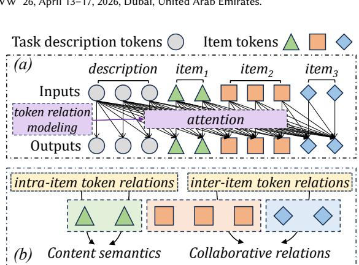
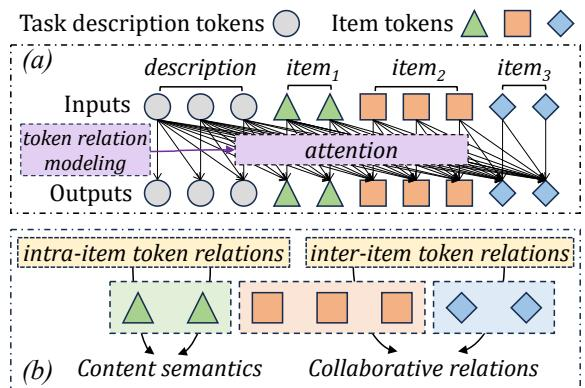
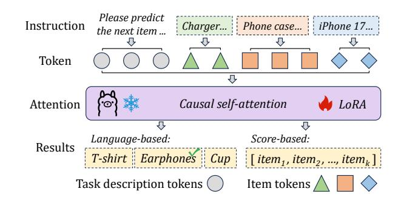
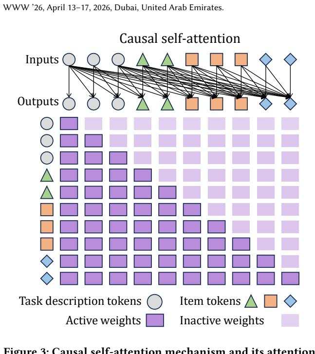
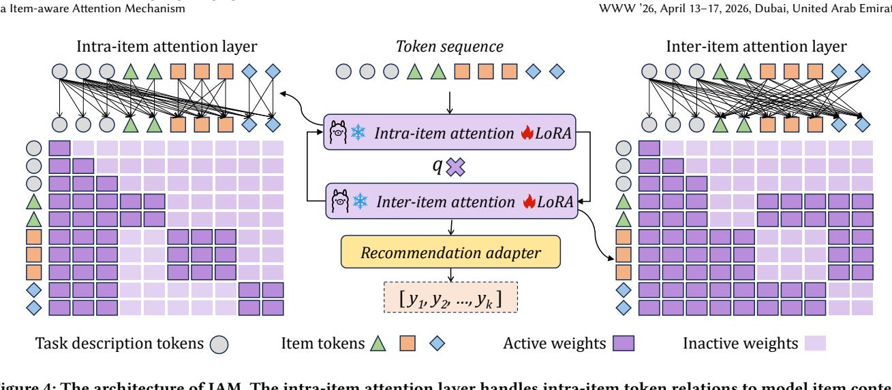
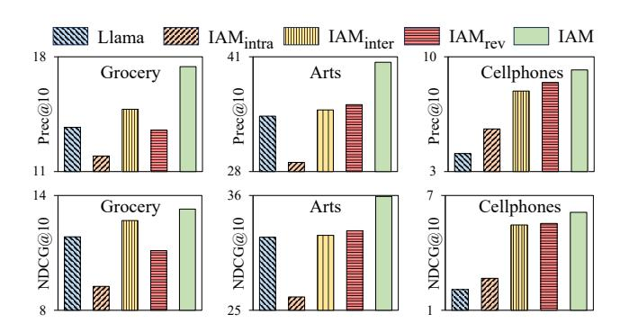
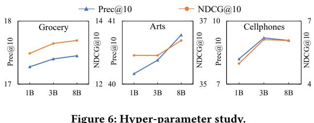

# From Token to Item

# Enhancing Large Language Models for Recommendation via Item-aware Attention Mechanism

Zhang, Xiaokun; He, Bowei; Chen, Jiamin; Cui, Ziqiang; Ma, Chen

# Published in:

WWW '26: Proceedings of the ACM Web Conference 2026

# Published: 01/04/2026

# Document Version:

Final Published version, also known as Publisher's PDF, Publisher's Final version or Version of Record

### License:

CC BY-NC-ND

# Publication record in CityUHK Scholars:

[Go to record](https://scholars.cityu.edu.hk/en/publications/2c73c4dc-d443-46fb-8438-f1fad24065d0)

# Publication details:

Zhang, X., He, B., Chen, J., Cui, Z., & Ma, C. (2026). From Token to Item: Enhancing Large Language Models for Recommendation via Item-aware Attention Mechanism. In WWW '26: Proceedings of the ACM Web Conference 2026 (pp. 6700-6708). (WWW - Proceedings of the ACM Web Conference). Association for Computing Machinery. <https://dl.acm.org/doi/10.1145/3774904.3792610>

### Citing this paper

Please note that where the full-text provided on CityUHK Scholars is the Post-print version (also known as Accepted Author Manuscript, Peer-reviewed or Author Final version), it may differ from the Final Published version. When citing, ensure that you check and use the publisher's definitive version for pagination and other details.

### General rights

Copyright for the publications made accessible via the CityUHK Scholars portal is retained by the author(s) and/or other copyright owners and it is a condition of accessing these publications that users recognise and abide by the legal requirements associated with these rights. Users may not further distribute the material or use it for any profit-making activity or commercial gain.

### Publisher permission

Permission for previously published items are in accordance with publisher's copyright policies sourced from the SHERPA RoMEO database. Links to full text versions (either Published or Post-print) are only available if corresponding publishers allow open access.

Contact lbscholars@cityu.edu.hk if you believe that this document breaches copyright and provide us with details. We will remove access to the work immediately and investigate your claim.

# From Token to Item: Enhancing Large Language Models for Recommendation via Item-aware Attention Mechanism

Xiaokun Zhang∗ City University of Hong Kong Hong Kong, China dawnkun1993@gmail.com

Bowei He City University of Hong Kong Hong Kong, China boweihe2-c@my.cityu.edu.hk

Jiamin Chen City University of Hong Kong Hong Kong, China jmchen26-c@my.cityu.edu.hk

Ziqiang Cui City University of Hong Kong Hong Kong, China ziqiang.cui@my.cityu.edu.hk

Chen Ma† City University of Hong Kong Hong Kong, China chenma@cityu.edu.hk

# Abstract

Large Language Models (LLMs) have recently gained increasing attention in the field of recommendation. Existing LLM-based methods typically represent items as token sequences, and apply attention layers on these tokens to generate recommendations. However, by inheriting the standard attention mechanism, these methods focus on modeling token-level relations. This token-centric focus overlooks the item as the fundamental unit of recommendation, preventing existing methods from effectively capturing collaborative relations at the item level.

In this work, we revisit the role of tokens in LLM-driven recommendation and categorize their relations into two types: (1) intra-item token relations, which present the content semantics of an item, e.g., name, color, and size; and (2) inter-item token relations, which encode collaborative relations across items. Building on these insights, we propose a novel framework with an item-aware attention mechanism (IAM) to enhance LLMs for recommendation. Specifically, IAM devises two complementary attention layers: (1) an intra-item attention layer, which restricts attention to tokens within the same item, modeling item content semantics; and (2) an inter-item attention layer, which attends exclusively to token relations across items, capturing item collaborative relations. Through this stacked design, IAM explicitly emphasizes items as the fundamental units in recommendation, enabling LLMs to effectively exploit item-level collaborative relations. Extensive experiments on several public datasets demonstrate the effectiveness of IAM in enhancing LLMs for personalized recommendation.

# CCS Concepts

### • Information systems → Recommender systems.

∗Xiaokun is also supported by the Key Laboratory of Social Computing and Cognitive Intelligence (Dalian University of Technology), Ministry of Education.

†Corresponding author.

[This work is licensed under a Creative Commons Attribution-NonCommercial-](https://creativecommons.org/licenses/by-nc-nd/4.0)[NoDerivatives 4.0 International License.](https://creativecommons.org/licenses/by-nc-nd/4.0) WWW '26, Dubai, United Arab Emirates. © 2026 Copyright held by the owner/author(s). ACM ISBN 979-8-4007-2307-0/2026/04 <https://doi.org/10.1145/3774904.3792610>

## Keywords

Recommender Systems, Large Language Models, Item-aware Attention, Collaborative information.

### ACM Reference Format:

Xiaokun Zhang, Bowei He, Jiamin Chen, Ziqiang Cui, and Chen Ma. 2026. From Token to Item: Enhancing Large Language Models for Recommendation via Item-aware Attention Mechanism. In Proceedings of the ACM Web Conference 2026 (WWW '26), April 13–17, 2026, Dubai, United Arab Emirates. ACM, New York, NY, USA, [9](#page-9-0) pages. <https://doi.org/10.1145/3774904.3792610>

# 1 Introduction

Sequential recommendation (SR) aims to predict a user's next interaction based on her historical behavior [\[8,](#page-9-1) [12\]](#page-9-2). By modeling dynamics of user preferences, SR plays a crucial role in real-world scenarios such as e-commerce [\[28\]](#page-9-3), social platforms [\[44\]](#page-9-4), and multimedia streaming [\[32\]](#page-9-5). A fundamental driver of existing SR methods is collaborative information, which reflects certain patterns embedded in user-item interactions, e.g., co-occurrence relations between items [\[13,](#page-9-6) [38\]](#page-9-7). Mining these collaborative signals from massive user-item interactions enables models to uncover shared interests among users and deliver relevant recommendations.

Large language Models (LLMs), with their rich world knowledge and strong reasoning capabilities, have recently gained increasing attention in the recommendation research [\[17,](#page-9-8) [23,](#page-9-9) [27\]](#page-9-10). Typically, existing LLM-based methods concatenate task description text with the sequence of item content (e.g., titles) as the instruction, convert these texts into a token sequence, and apply attention mechanisms (e.g., Transformer architectures) on these tokens to generate recommendations. To integrate collaborative information, these methods generally encode user–item interaction patterns into collaborative tokens for each item. Such tokens could be derived from heuristic item indexing rules [\[9,](#page-9-11) [11\]](#page-9-12), or represented as dense vectors learned by well-established neural models (e.g., SASRec [\[12\]](#page-9-2)) [\[13,](#page-9-6) [46\]](#page-9-13). These collaborative tokens are then concatenated with content tokens from items, guiding LLMs to generate recommendations.

However, these methods suffer from a critical limitation in their design. As shown in Figure [1](#page-2-0) (a), by framing recommendation as the processing of token sequences, they explicitly treat tokens as the fundamental modeling unit. This token-centric paradigm restricts LLM-based methods to attending only to token-token relations, preventing them from recognizing items as independent units within the recommendation context. Since collaborative relations inherently

Figure 1: (a) Current LLM-based methods focus on modeling token-level relations, while failing to exploit collaborative relations at the item level; (b) intra- and inter-item token relations indicate item content semantics and collaborative relations, respectively.

emerge between items rather than tokens, such methods fail to effectively exploit collaborative information, leading to a critical misalignment with the core objective of recommendation.

To this end, this work revisits the role of tokens in LLM-based recommendation from an item-centric perspective. As shown in Figure [1](#page-2-0) (b), token relations can be divided into two categories: intraitem and inter-item. Intra-item token relations capture dependencies among tokens within a single item. These intra-item tokens jointly represent an item's content semantics, such as its name, color, and size. In contrast, inter-item token relations occur between tokens belonging to different items. The interactions of these tokens reflect item-item relations and provide a pathway to uncover collaborative information under recommendation scenarios.

Motivated by these insights, we introduce an Item-aware Attention Mechanism (IAM) to align LLMs with the recommendation task. Unlike conventional attention that treats all tokens uniformly, IAM explicitly distinguishes between intra- and interitem token relations through two dedicated layers: an intra-item attention layer and an inter-item attention layer. The intra-item attention layer aims to handle intra-item token relations. Specifically, it models token relations within each item while ignoring cross-item token interactions, enabling precise modeling of item content semantics and reinforcing items as independent units in the task. Complementarily, the inter-item attention layer focuses on inter-item token relations. It attends exclusively to token relations across items while discarding within-item interactions, explicitly capturing item-item relations. By stacking these two layers, IAM empowers LLMs to effectively exploit item-level collaborative information and deliver accurate recommendations. In summary, main contributions of this work are as follows,

- Problem diagnosis. We identify a critical limitation in current LLM-based recommendation: their token-centric paradigm overlooks the role of items as independent units, leaving them structurally incapable of modeling collaborative information at the item level. To our best knowledge, this work marks the pioneering attempt to shift the focus of LLM-based recommendation from token to item.

- Methodology. We propose an item-aware attention mechanism (IAM) tailored for recommendation within LLMs. By distinguishing between intra- and inter-item token relations, IAM explicitly preserves items as independent units, enabling LLMs to effectively exploit item-level collaborative information.
- Empirical validation. Extensive experiments conducted on several public datasets demonstrate the superiority of IAM over existing LLM-based approaches, achieving an average improvement of 34.54% on standard evaluation metrics.

### 2 Related Work

### 2.1 Sequential Recommendation

Sequential recommendation (SR) aims to capture users' evolving preferences based on their historical behaviors, thereby delivering personalized suggestions [\[2,](#page-9-14) [7,](#page-9-15) [39,](#page-9-16) [41\]](#page-9-17). Over the past decade, neural architectures have dominated this task due to their strong representation capacity. A wide spectrum of neural models has been explored to capture collaborative signals from user–item interaction sequences, ranging from Recurrent Neural Networks and their variants [\[8,](#page-9-1) [15\]](#page-9-18), attention-based approaches [\[12,](#page-9-2) [22\]](#page-9-19), and Transformerbased methods [\[28,](#page-9-3) [47\]](#page-9-20), to Graph Neural Networks [\[31,](#page-9-21) [35\]](#page-9-22), and contrastive learning frameworks [\[3,](#page-9-23) [42\]](#page-9-24). Beyond sequence-level modeling, several studies partition user interaction sequences into multi-granularity sub-sequences to capture item collaborative relations at different levels [\[5,](#page-9-25) [37\]](#page-9-26). Recently, researchers have explored the integration of multi-modal signals, such as textual and visual content, in an attempt to improve the understanding of item characteristics and user intents [\[18,](#page-9-27) [40,](#page-9-28) [43,](#page-9-29) [45\]](#page-9-30). Unfortunately, these methods suffer from limited semantic understanding, which constrains their performance.

### 2.2 LLM-based Recommendation

Trained on massive text corpora, Large Language Models (LLMs) have demonstrated remarkable success across a wide range of language tasks [\[20,](#page-9-31) [29\]](#page-9-32). This success has motivated growing efforts to adapt LLMs for recommendation tasks. Early attempts reformulate user–item interactions into natural language, like item title sequences, and combine them with task-specific instructions to fine-tune LLMs for generating recommendations [\[1,](#page-9-33) [33,](#page-9-34) [48\]](#page-9-35). More recent works aim to inject collaborative information directly into LLMs. A common strategy is to create collaborative tokens that encode item collaborative relations for each item and integrate them with item content tokens during fine-tuning. For instance, E4SRec [\[16\]](#page-9-36) simply uses item IDs as collaborative tokens, while other approaches re-index items through heuristic rules for encoding collaborative signals [\[9,](#page-9-11) [11,](#page-9-12) [21,](#page-9-37) [36,](#page-9-38) [49\]](#page-9-39). Alternatively, methods such as CoLLM [\[46\]](#page-9-13), LLaRA [\[19\]](#page-9-40), A-LLMRec [\[13\]](#page-9-6), and iLoRA [\[14\]](#page-9-41), leverage well-established collaborative models, i.e., SASRec [\[12\]](#page-9-2), to extract item embeddings, which are then treated as collaborative tokens. Despite achieving impressive performance, existing methods still follow the standard attention mechanism of LLMs, which indiscriminately attends to all tokens within the instruction and fails to treat items as independent units. This structural limitation hinders them from effectively capturing relations at the item level, thereby constraining their ability to model collaborative information.

Figure 3: Causal self-attention mechanism and its attention matrix.

3.2.4 Recommendation generation. In the current literature on LLM-based recommendation, two primary paradigms for generating recommendations can be identified: language-based and scorebased methods. The language-based approach [\[14,](#page-9-41) [19\]](#page-9-40) leverages LLMs to directly generate textual features of the next item (typically the item title), aligning with language generation practices in natural language processing (NLP). Due to the vast size of item sets, this paradigm is often simplified by prompting LLMs to select the ground-truth item from a small pre-defined candidate set (commonly around 20 items, including the correct one), which is similar with the negative sampling strategy widely used in sequential recommendation [\[6,](#page-9-45) [25\]](#page-9-46). In contrast, the score-based approach [\[16,](#page-9-36) [34,](#page-9-47) [49\]](#page-9-39) projects the output embeddings of LLMs into a score vector, commonly using a learnable matrix, where each entry indicates the likelihood of a candidate item being the next interaction. The top-k recommendation list can then be derived from these predicted scores. This process is closely aligned with the full-ranking techniques prevalent in neural recommendation models [\[12,](#page-9-2) [15,](#page-9-18) [28\]](#page-9-3).

3.2.5 Fine-tuning with Low-rank Adaption. Fully fine-tuning LLMs often demands prohibitive computational resources and storage overhead. To address this challenge, Low-Rank Adaptation (LoRA) has been proposed as a lightweight yet effective alternative technique [\[10\]](#page-9-48). Instead of updating all parameters of the LLM, LoRA injects trainable low-rank matrices into the weight update process of specific layers, e.g., attention projections. Following this practice, in the context of recommendation task, researchers rely on LoRA to fine-tune LLMs with instruction–response pairs, where the instruction encodes user-item interaction history and the response corresponds to the next item.

### 4 The Proposed IAM

As the core component in LLM-based recommendation, the causal self-attention mechanism itself has received little scrutiny. Existing methods largely inherit its standard design from the natural language processing (NLP) tasks, applying it directly within the recommendation context. However, as previously discussed, this token-centric operation fails to capture the holistic notion of an item, thereby limiting its ability to capture collaborative information at the item level.

To overcome this limitation, we introduce an item-aware attention mechanism (IAM) tailored for LLM-based recommendation. As shown in Figure [4,](#page-5-0) the proposed IAM comprises two complementary components: an intra-item attention layer and an inter-item attention layer. Given the well-established effectiveness of the selfattention mechanism in modeling complex dependencies among sequential tokens, we retain its standard formulation to compute the original attention weights as shown in Eq.(2). Instead, we modify the causal mask in Eq.(3) to guide IAM toward handling different types of token relations in different attention layers.

### 4.1 Intra-item Attention Layer

The intra-item attention layer focuses on modeling intra-item token relations, thereby capturing item content semantics. As shown in Figure [4,](#page-5-0) we maintain the original causal mask for task description tokens, as their linguistic patterns closely align with those in conventional NLP tasks. In contrast, for item tokens, i.e., title content tokens in our setting, the attention weights are preserved only among tokens belonging to the same item, while connections across tokens from different items are blocked. Formally, the intra-item attention layer operates as follows,

������������ (������) = ������, ��(����) = 0 ∧ �� ≥ ��, ������, ��(����) = 1 ∧ ��(����) = 1 ∧ ��(���� , ����) = 0, 0, ����ℎ������, (4)

where ��(·) and ��(·, ·) denote indicator functions. Specifically, ��(����) = 0 indicates that token ���� belongs to the task description, while ��(����) = 1 denotes that it is an item token. For ��(���� , ����), the function returns 0 if tokens ���� and ���� belong to the same item, and 1 otherwise. In practice, we replace the casual mask �� (·) with ������������ (·) in Eq.(1) and Eq.(3) to build the intra-item attention layer.

Notably, we relax the causal constraint between tokens of the same item. This design is motivated by two considerations: (1) Compared with the unidirectional paradigm, allowing bidirectional attention among intra-item tokens enables the model to capture richer semantic relations within an item, thereby enhancing its ability to represent item content semantics; and (2) Unlike standard NLP tasks that rely on token-level autoregressive generation, our framework directly predicts the likelihood of each candidate item being the next interaction (see Section [4.4](#page-5-1) for details). Hence, enforcing causality among item tokens is unnecessary. By restricting attention exclusively to tokens within each item, the intra-item attention layer encourages LLMs to perceive each item as an independent unit, which aligns with the recommendation practice.

Figure 4: The architecture of IAM. The intra-item attention layer handles intra-item token relations to model item content semantics. The inter-item attention layer attends to inter-item token relations to explicitly capture item collaborative relations. IAM employs a recommendation adapter to generate top-�� items as recommendations.

### 4.2 Inter-item Attention Layer

The inter-item attention layer aims to attend to inter-item token relations, thus explicitly capturing collaborative relations among items. Similar to the intra-item attention layer, the causal mask is preserved for task description tokens. As illustrated in Figure [4,](#page-5-0) for item tokens, inter-item attention layer prohibits the attention within tokens of the same item while activating attention across tokens belonging to different items. Formally, the inter-item attention layer is defined as follows,

������������ (������) = ������, ��(����) = 0 ∧ �� ≥ ��, ������, ��(����) = 1 ∧ ��(����) = 1 ∧ ��(���� , ����) = 1, 0, ����ℎ������. (5)

The ������������ (·) takes the place of �� (·) in Eq.(1) and Eq.(3) to conduct inter-item token relations modeling. Similar to the intra-item case, we also relax the causal constraint here, allowing bidirectional interactions between tokens of different items. This bidirectional operation enhances the visibility of item–item dependencies, enabling IAM to capture collaborative relations more effectively. In addition, since each token embedding of an item has already integrated information about this item in the intra-item attention layer, every token can serve as a partial representation of the item. Consequently, the inter-item attention layer promotes interactions between all tokens of one item and those of other items, which can be regarded as modeling item–item relations from multiple perspectives. By explicitly emphasizing such item-level relations, it equips our proposed IAM with a strong capacity to adapt LLMs for recommendation tasks.

### 4.3 Attention Layer Integration

Different from conventional LLMs that repeatedly stack identical attention layers to enhance their representation power, our framework IAM introduces two complementary attention layers tailored

for the recommendation task. The integration of these two layers operates as follows: the intra-item attention layer first handles token relations within each item, modeling its content semantics and consolidating it as an independent unit. The inter-item attention layer then attends to tokens across different items, explicitly capturing item–item relations. To maximize the benefits of both perspectives, these two layers are sequentially stacked �� times to form the complete item-aware attention mechanism, where �� is a hyperparameter determined in accordance with the depth of the LLM backbone.

### 4.4 Prediction Layer

The prediction layer aims to convert the LLM outputs into recommendation results. A popular paradigm is the language-based method, as discussed in Section [3.2.4.](#page-4-1) However, this paradigm suffers from two major drawbacks: (1) the inherent randomness and hallucination of LLMs often yield out-of-scope items [\[34\]](#page-9-47); and (2) reliance on a fixed candidate set severely limits scalability and realworld applicability. Therefore, this work adopts another common solution, score-based paradigm [\[16,](#page-9-36) [34,](#page-9-47) [49\]](#page-9-39). Specifically, we introduce a recommendation adapter, i.e., a learnable matrix W������ ∈ R ��×�� , on top of the LLM backbone. The hidden representations from the LLM are mapped through this adapter to produce a ��-dimensional score vector y ∈ R , where each entry ���� corresponds to the predicted likelihood of item ���� being the next interaction. The model is optimized with cross-entropy loss as follows,

L (p, y) = − ∑︁�� ��=1 ���� log(����) + (1 − ����) log(1 − ����), (6)

where ���� is the ground truth indicating whether the user interacts with the item ���� .

Table 2: Statistics of datasets.

| Datasets     | Grocery | Arts    | Cellphones |
|--------------|---------|---------|------------|
| #item        | 1,874   | 4,265   | 6,593      |
| #user        | 6,025   | 17,432  | 17,639     |
| #interaction | 44,921  | 134,105 | 114,605    |
| avg.length   | 7.46    | 7.69    | 6.50       |

### 5 Experimental Setup

# 5.1 Research Questions

We conduct comprehensive experiments to examine IAM's performance, with a focus on the following research questions:

- RQ1: How does our IAM perform compared with existing state-of-the-art methods? (ref. Section [6.1\)](#page-7-0)
- RQ2: How do the proposed intra- and inter-item attention layers, individually and jointly, contribute to the recommendation performance? (ref. Section [6.2\)](#page-7-1)
- RQ3: What is the influence of the key hyper-parameter on IAM? (ref. Section [6.3\)](#page-8-0)

# 5.2 Datasets and Preprocessing

In this work, three datasets are incorporated to examine the recommendation performance of the proposed IAM and all baseline methods, i.e., Grocery, Arts and Cellphones, which are scratched from Amazon[1](#page-6-0) . These datasets span diverse domains and user interaction patterns, making them representative and popular benchmarks for sequential recommendation [\[9,](#page-9-11) [12,](#page-9-2) [13,](#page-9-6) [16,](#page-9-36) [33\]](#page-9-34). For each dataset, we adopt the item title as textual information for an item to provide its content semantics for LLMs. In line with the common practice [\[15,](#page-9-18) [19,](#page-9-40) [46\]](#page-9-13), 5-core filtering is applied for these datasets, where we filter out the items and users with fewer than 5 interactions. Given a user's interaction sequence, the final item is designated as the prediction label, i.e., ground truth item, while the preceding items serve as historical context for modeling user preferences. In addition, we split each dataset chronologically into training, validation, and test sets with an 8:1:1 ratio. The detailed statistics of all datasets are summarized in Table [2.](#page-6-1)

# 5.3 Evaluation Protocol

This study adopts the full-ranking strategy for sequential recommendation. Specifically, the proposed IAM and all baselines are required to rank the entire item set X according to the predicted probability of each item being the next interaction. The top-�� items with the highest scores form the recommendation list, denoted as ������ = [��1, ��2, ..., ���� ], where ���� ∈ X. For evaluation, we follow standard practice [\[15,](#page-9-18) [19,](#page-9-40) [28,](#page-9-3) [31,](#page-9-21) [33\]](#page-9-34) and adopt two widely used metrics: Prec@k (Precision), which measures the proportion of test cases in which the ground-truth item appears within the top-�� recommendation list; and NDCG@k (Normalized Discounted Cumulative Gain), which considers the rank of the ground truth item among the top-�� list. Both metrics are reported at �� = 5 and �� = 10, where higher values indicate better recommendation performance.

### 5.4 Baseline Methods

To examine the effect of IAM, we compare it against nine competitive baselines that fall into two categories: traditional neural network-based methods and emerging LLM-based approaches.

Traditional methods: (1) GRU4Rec [\[8\]](#page-9-1) leverages Gated Recurrent Units (GRU) to mine sequential patterns between items; (2) NARM [\[15\]](#page-9-18) augments GRU with an attention mechanism to capture a user's main intent; (3) SASRec [\[12\]](#page-9-2) applies the self-attention mechanism to learn transition dependencies in user behaviors; (4) SR-GNN [\[31\]](#page-9-21) represents user-item interactions as graphs and employs Graph Neural Networks (GNN) to capture pairwise item transitions; and (5) Atten-Mixer [\[37\]](#page-9-26) partitions a sequence into multiple sub-sequences of varying lengths and applies diverse attention layers to capture fine-grained co-occurrence patterns.

LLM-based methods: (6) Llama [\[30\]](#page-9-44) serves as a representative LLM backbone, fine-tuned with recommendation instructions to enable personalized services; (7) P5 [\[11,](#page-9-12) [33\]](#page-9-34) employs various heuristic rules to re-index items for injecting collaborative information into T5 architecture [\[26\]](#page-9-49); (8) E4SRec [\[16\]](#page-9-36) directly incorporates item ID sequences into instructions, aiming to explicitly integrate collaborative information; and (9) LLaRA [\[19\]](#page-9-40) leverages pre-trained models to generate collaborative embeddings for each item, which are then merged into LLM instructions to explicitly guide the model in preserving collaborative relations among items.

# 5.5 Implementation Details

To ensure a fair comparison, we follow the experimental settings reported in the original papers as closely as possible, aiming to maximize the performance of all baseline methods. The key hyperparameters for both IAM and baselines are tuned via grid search based on validation performance measured by Prec@10. For neural network-based methods, the embedding dimension is selected from {64, 128, 256, 512, 1024, 2048}. We adopt a mini-batch size of 512 and optimize models using Adam with an initial learning rate of 0.001. For LLM-based methods, including IAM and baselines, we employ Llama3 with 3B parameters as the default backbone unless otherwise specified. The instruction used to prompt these methods for recommendations is: "Please predict the next item a user would purchase, given the following purchased items: <title1>, <title2>, ..., <title�� >". Fine-tuning is performed using LoRA with a rank of 8, alpha of 16, and a dropout rate of 0.05. In LLaRA, following established practice [\[13,](#page-9-6) [19,](#page-9-40) [46\]](#page-9-13), we utilize SASRec [\[12\]](#page-9-2) to construct collaborative embeddings for items. For the proposed IAM and all baseline methods, we conduct five independent runs and report the average results as the final performance.

For our IAM, the primary hyper-parameter is the repetition times �� of the intra- and inter-item attention layers, which is determined by the depth of the LLM backbone, e.g., 16 layers for Llama3-1B, 28 layers for Llama3-3B, and 32 layers for Llama3-8B. Notably, IAM represents user behaviors solely through item titles, without the extra efforts to obtain collaborative tokens via heuristic rules or pre-trained models. This design ensures that the performance improvements stem entirely from the proposed attention-layer architecture, which constitutes the core contribution of this work. The source codes are available online[2](#page-6-2) .

1<http://jmcauley.ucsd.edu/data/amazon/>

2<https://github.com/Zhang-xiaokun/IAM>

Table 3: Experimental results (%) of all methods on three datasets. Bold scores are the best performance, while underlined scores are the second best. Improvements of IAM over the best baseline (\*) are statistically significant with ��-test (�� &lt; 0.01).

| Method      | Prec@5  | NDCG@5  | Grocery Prec@10 | NDCG@10 | Prec@5  | NDCG@5  | Arts Prec@10 | NDCG@10 | Prec@5 | NDCG@5 | Cellphones Prec@10 | NDCG@10 |
|-------------|---------|---------|-----------------|---------|---------|---------|--------------|---------|--------|--------|--------------------|---------|
| GRU4Rec     | 10.10   | 8.66    | 11.66           | 9.07    | 28.41   | 22.56   | 30.40        | 23.21   | 3.28   | 2.48   | 3.78               | 2.81    |
| NARM        | 12.78   | 11.38   | 13.37           | 11.69   | 32.20   | 30.14   | 33.01        | 30.76   | 3.13   | 2.53   | 4.18               | 2.87    |
| SASRec      | 11.29   | 10.39   | 13.05           | 11.22   | 33.11   | 32.07   | 34.87        | 32.57   | 3.35   | 2.60   | 4.65               | 2.93    |
| SR-GNN      | 10.63   | 9.31    | 12.57           | 10.22   | 29.37   | 28.49   | 30.91        | 29.65   | 3.60   | 1.79   | 4.72               | 2.19    |
| Atten-Mixer | 12.82   | 11.24   | 13.66           | 11.81   | 36.05   | 33.92   | 37.81        | 34.62   | 4.09   | 3.06   | 5.15               | 3.50    |
| Llama       | 12.64   | 11.37   | 13.70           | 11.84   | 33.21   | 31.33   | 34.28        | 32.00   | 2.36   | 1.89   | 4.10               | 2.08    |
| P5          | 12.52   | 11.18   | 13.48           | 11.92   | 35.55   | 33.29   | 36.68        | 33.86   | 3.48   | 2.79   | 4.84               | 3.17    |
| E4SRec      | 11.57   | 10.71   | 13.44           | 11.63   | 32.64   | 30.69   | 33.78        | 30.93   | 3.63   | 2.74   | 5.00               | 3.02    |
| LLaRA       | 13.12   | 11.46   | 13.83           | 12.08   | 35.24   | 33.53   | 35.83        | 33.96   | 4.31   | 2.87   | 5.38               | 3.24    |
| IAM         | 14 84 ∗ | 12 38 ∗ | 17 40 ∗         | 13 29 ∗ | 37 15 ∗ | 34 87 ∗ | 40 38 ∗      | 35 91 ∗ | 6 37 ∗ | 5 13 ∗ | 9 20 ∗             | 6 12 ∗  |
| ����������. | 13.11%  | 8.03%   | 25.81%          | 10.04%  | 3.05%   | 2.82%   | 6.80%        | 3.74%   | 47.80% | 67.65% | 71.00%             | 74.86%  |

### 6 Results and Analysis

# 6.1 Overall Performance (RQ1)

The performance of all baseline methods and the proposed IAM across three datasets is presented in Table [3,](#page-7-2) from which we can derive the following key observations:

Firstly, among neural network-based methods, Atten-Mixer achieves the best performance in most cases. By partitioning a sequence into multiple sub-sequences and modeling them individually, it captures item-level collaborative relations in a fine-grained manner, which contributes to its superior results. This finding highlights the importance of modeling item-level collaborative signals in the task. In addition, SASRec generally demonstrates competitive performance. Owing to both its effectiveness and parallelizable self-attention mechanism, SASRec has become a widely adopted backbone for encoding collaborative information in recent studies, particularly in LLM-based recommendation frameworks.

Secondly, among the LLM-based methods, the key distinction lies in their manners to incorporate collaborative information, such as re-indexing items via pre-defined rules in P5, direct item ID incorporation in E4SRec, and collaborative embedding injection in LLaRA. The performance differences among these approaches underscore the pivotal role of collaborative information in LLM-based recommendation. This observation also supports the central motivation of this study. In addition, LLaRA consistently outperforms the other LLM-based baselines across all datasets, highlighting the effectiveness of explicitly embedding collaborative information into LLMs for recommendations.

Thirdly, compared with neural models, LLM-based methods generally deliver competitive performance. In particular, Llama, which relies solely on item titles for fine-tuning the LLM, surpasses several representative neural baselines, such as GRU4Rec and NARM, demonstrating the strong potential of LLMs in the recommendation task. Nevertheless, the most recent and advanced Atten-Mixer still outperforms LLM-based methods in certain scenarios. For example, it achieves the best performance among all baselines on the Arts dataset. This suggests that LLM-based approaches still have considerable room for improvement. Furthermore, much of the existing

literature tends to benchmark LLMs only against early neural baselines, overlooking comparisons with more advanced models, which may lead to an overestimation of their effectiveness. Our findings thus provide a reminder for both researchers and practitioners to adopt fairer benchmarking practices and critically assess the true capabilities of LLMs in recommendations.

Finally, the proposed IAM consistently outperforms all baseline methods across all datasets and evaluation metrics, demonstrating its strong effectiveness for sequential recommendation. In particular, IAM achieves substantial gains over the best-performing baselines, with improvements in terms of Prec@10 and NDCG@10 by 25.81% and 10.04% on Grocery, 6.80% and 3.74% on Arts, as well as an impressive 71.00% and 74.86% on Cellphones. We attribute this superiority of IAM to its item-aware attention mechanism, which shifts the focus of LLMs from token to item in the task. By distinguishing between intra- and inter-item token relations, this novel attention mechanism drives LLMs to explicitly preserve items as independent units and effectively capture collaborative information at the item level, contributing to providing accurate recommendations accordingly.

# 6.2 Ablation Study (RQ2)

The core innovation of the proposed item-aware attention mechanism, i.e., IAM, lies in its explicit distinction between intra- and inter-item token relations. Specifically, the intra-item attention layer handles token dependencies within each item to model its content semantics, while the inter-item attention layer focuses on correlations across different items to explicitly capture collaborative information. To evaluate the effectiveness of this model design, we construct the following variants of IAM: (1) Llama employs the standard attention mechanism of LLMs to process token sequences for recommendation; (2) IAMintra retains only the intra-item attention layer while removing the inter-item attention layer from IAM; (3) IAMinter, on the contrary, only employs the inter-item attention layer; and (4) IAMrev reverses the order of these two layers in IAM, where it first utilizes the inter-item attention layer followed by the intra-item attention layer.

Figure 5: Ablation study on intra- and inter-item attention layers.

The results of these variants across all datasets under Prec@10 and NDCG@10 metrics are shown in Figure [5,](#page-8-1) from which we can draw the following insights: (1) Our IAM substantially outperforms Llama, showing that the proposed item-aware attention is better suited for recommendation than the standard attention mechanism. By treating items as basic units and explicitly modeling their relations, IAM effectively captures the collaborative information embedded in user–item interactions, thus achieving good performance; (2) IAM consistently outperforms both IAMintra and IAMinter, confirming that intra- and inter-item token relations jointly contribute to user behavior modeling in LLM-based settings. Omitting either relation leads to performance degradation, which validates our motivation to handle both simultaneously; (3) Among single-layer variants, IAMinter achieves better results than both Llama and IAMintra. This highlights the central role of inter-item token relations in capturing collaborative signals, underscoring the necessity of item-level relation modeling; (4) The reversed variant, IAMrev, performs worse than IAM, indicating that the order of applying intra- then inter-item layers is crucial. It is intuitive as LLMs should first consolidate tokens into independent items before modeling relations across them; and (5) Across all datasets, IAM consistently outperforms all its variants, demonstrating the soundness of our model design and the effectiveness of the proposed item-aware attention mechanism.

## 6.3 Hyper-parameter Study (RQ3)

The main hyper-parameter of our IAM is the repetition factor ��, which determines how many times the item-aware attention module (comprising both intra- and inter-item attention layers) is stacked. Under the context of LLM-based recommendation, �� is naturally aligned with the depth of the LLM backbone, i.e., Llama in our settings. In this work, we instantiate IAM on three widely used versions of Llama, i.e., Llama3-1B with 16 layers, Llama3-3B with 28 layers, and Llama3-8B with 32 layers. Note that, since the number of self-attention layers dominates the parameter volume of LLMs, it generally serves as an indicator to their capability in terms of knowledge retention and reasoning ability.

Figure [6](#page-8-2) plots the performance trends of IAM across different backbones in terms of Prec@10 and NDCG@10. The results reveal a clear pattern: as the backbone depth increases, the performance of IAM consistently improves. This observation is intuitive, as a deeper

Figure 6: Hyper-parameter study.

backbone tends to possess stronger capabilities in content understanding, thereby enhancing the recommendation performance of LLMs. In addition, the observed performance gap across different versions of Llama remains relatively small (generally within 1%). This suggests that the proposed item-aware attention mechanism is both stable and robust. Such a merit of IAM is particularly valuable in real-world applications, where smaller models (e.g., LLaMA3- 3B) can already deliver satisfactory results. In this study, we adopt LLaMA3-3B as the default backbone of IAM to strike a balance between effectiveness and efficiency.

### 7 Conclusion and Future Work

In this study, we scrutinize Large Language Model (LLM)-based recommendation approaches and uncover a subtle yet critical limitation in their design: they primarily focus on handling token-token relations, while overlooking the effective capture of collaborative information at the item level. To address this issue, we propose IAM, a novel LLM-based recommendation framework equipped with an item-aware attention mechanism to enhance collaborative information modeling for LLMs. By distinguishing intra- and inter-item token relations through dedicated attention layers, IAM consolidates items as independent units and explicitly exploits collaborative information at the item level. Comprehensive experiments on multiple real-world datasets demonstrate the consistent superiority of IAM over current state-of-the-art methods, including representative neural network-based and LLM-based methods.

As to future work, we first plan to incorporate extra modality information, like item images, into foundation models to enhance their understanding for item characteristics and user interest. Moreover, current attention layers within LLM-based recommendation methods are uniform across users. It will be a promising direction to design adaptive modules that tailor the attention scope to individual users. In addition, as LLMs can be computationally expensive, designing lightweight variants of IAM with knowledge distillation, quantization, or hybrid architectures would further improve its scalability and implementation for industrial applications.

### Acknowledgement

This work is supported by the Early Career Scheme (No.CityU 21219323) and the General Research Fund (No.CityU 11220324) of the University Grants Committee (UGC), the NSFC Young Scientists Fund (No.9240127), and the Donation for Research Projects (No.9229164 and No.9220187). This work is also supported by the Key Laboratory of Social Computing and Cognitive Intelligence (Dalian University of Technology), Ministry of Education (SCCI2025YB04).

References [1] Keqin Bao, Jizhi Zhang, Yang Zhang, Wenjie Wang, Fuli Feng, and Xiangnan He. 2023. TALLRec: An Effective and Efficient Tuning Framework to Align Large Language Model with Recommendation. In RecSys. 1007–1014. [2] Yankai Chen, Quoc-Tuan Truong, Xin Shen, Jin Li, and Irwin King. 2024. Shopping trajectory representation learning with pre-training for e-commerce customer understanding and recommendation. In KDD. 385–396. [3] Ziqiang Cui, Yunpeng Weng, Xing Tang, Xiaokun Zhang, Dugang Liu, Shiwei Li, Peiyang Liu, Bowei He, Weihong Luo, Xiuqiang He, and Chen Ma. 2025. Semantic Retrieval Augmented Contrastive Learning for Sequential Recommendation. CoRR (2025). [4] Juan Luis Gastaldi, John Terilla, Luca Malagutti, Brian DuSell, Tim Vieira, and Ryan Cotterell. 2025. The Foundations of Tokenization: Statistical and Computational Concerns. In ICLR. [5] Jiayan Guo, Yaming Yang, Xiangchen Song, Yuan Zhang, Yujing Wang, Jing Bai, and Yan Zhang. 2022. Learning Multi-granularity Consecutive User Intent Unit for Session-based Recommendation. In WSDM. 343–352. [6] Bowei He, Xu He, Yingxue Zhang, Ruiming Tang, and Chen Ma. 2023. Dynamically expandable graph convolution for streaming recommendation. In Proceedings of the ACM Web Conference 2023. 1457–1467. [7] Bowei He and Chen Ma. 2024. Interpretable Triplet Importance for Personalized Ranking. In CIKM. 809–818. [8] Balázs Hidasi, Alexandros Karatzoglou, Linas Baltrunas, and Domonkos Tikk. 2016. Session-based Recommendations with Recurrent Neural Networks. In ICLR. [9] Yupeng Hou, Jianmo Ni, Zhankui He, Noveen Sachdeva, Wang-Cheng Kang, Ed H. Chi, Julian J. McAuley, and Derek Zhiyuan Cheng. 2025. ActionPiece: Contextually Tokenizing Action Sequences for Generative Recommendation. In ICML. [10] Edward J. Hu, Yelong Shen, Phillip Wallis, Zeyuan Allen-Zhu, Yuanzhi Li, Shean Wang, Lu Wang, and Weizhu Chen. 2022. LoRA: Low-Rank Adaptation of Large Language Models. In ICLR. [11] Wenyue Hua, Shuyuan Xu, Yingqiang Ge, and Yongfeng Zhang. 2023. How to Index Item IDs for Recommendation Foundation Models. In SIGIR-AP. 195–204. [12] Wang-Cheng Kang and Julian J. McAuley. 2018. Self-Attentive Sequential Recommendation. In ICDM. 197–206. [13] Sein Kim, Hongseok Kang, Seungyoon Choi, Donghyun Kim, Min-Chul Yang, and Chanyoung Park. 2024. Large Language Models meet Collaborative Filtering: An Efficient All-round LLM-based Recommender System. In KDD. 1395–1406. [14] Xiaoyu Kong, Jiancan Wu, An Zhang, Leheng Sheng, Hui Lin, Xiang Wang, and Xiangnan He. 2024. Customizing Language Models with Instance-wise LoRA for Sequential Recommendation. In NeurIPS. [15] Jing Li, Pengjie Ren, Zhumin Chen, Zhaochun Ren, Tao Lian, and Jun Ma. 2017. Neural Attentive Session-based Recommendation. In CIKM. 1419–1428. [16] Xinhang Li, Chong Chen, Xiangyu Zhao, Yong Zhang, and Chunxiao Xing. 2023. E4SRec: An Elegant Effective Efficient Extensible Solution of Large Language Models for Sequential Recommendation. CoRR abs/2312.02443 (2023). [17] Yunzhe Li, Junting Wang, Hari Sundaram, and Zhining Liu. 2025. LLM-RecG: A Semantic Bias-Aware Framework for Zero-Shot Sequential Recommendation. In RecSys. 237–246. [18] Yutong Li and Xinyi Zhang. 2025. MDSBR: Multimodal Denoising for Sessionbased Recommendation. In RecSys. 268–278. [19] Jiayi Liao, Sihang Li, Zhengyi Yang, Jiancan Wu, Yancheng Yuan, Xiang Wang, and Xiangnan He. 2024. LLaRA: Large Language-Recommendation Assistant. In SIGIR. ACM, 1785–1795. [20] Xinyu Lin, Haihan Shi, Wenjie Wang, Fuli Feng, Qifan Wang, See-Kiong Ng, and Tat-Seng Chua. 2025. Order-agnostic Identifier for Large Language Model-based Generative Recommendation. In SIGIR. ACM, 1923–1933. [21] Enze Liu, Bowen Zheng, Cheng Ling, Lantao Hu, Han Li, and Wayne Xin Zhao. 2025. Generative Recommender with End-to-End Learnable Item Tokenization. In SIGIR. 729–739. [22] Qiao Liu, Yifu Zeng, Refuoe Mokhosi, and Haibin Zhang. 2018. STAMP: Short-Term Attention/Memory Priority Model for Session-based Recommendation. In KDD. 1831–1839. [23] Yuting Liu, Jinghao Zhang, Yizhou Dang, Yuliang Liang, Qiang Liu, Guibing Guo, Jianzhe Zhao, and Xingwei Wang. 2025. CoRA: Collaborative Information Perception by Large Language Model's Weights for Recommendation. In AAAI. 12246–12254. [24] Long Ouyang, Jeffrey Wu, Xu Jiang, Diogo Almeida, Carroll L. Wainwright, Pamela Mishkin, Chong Zhang, Sandhini Agarwal, Katarina Slama, Alex Ray, John Schulman, Jacob Hilton, Fraser Kelton, Luke Miller, Maddie Simens, Amanda Askell, Peter Welinder, Paul F. Christiano, Jan Leike, and Ryan Lowe. 2022. Training language models to follow instructions with human feedback. In NeurIPS. [25] Zexuan Qiu, Jieming Zhu, Yankai Chen, Guohao Cai, Weiwen Liu, Zhenhua Dong, and Irwin King. 2024. Ease: Learning lightweight semantic feature adapters from large language models for ctr prediction. In CIKM. 4819–4827. [26] Colin Raffel, Noam Shazeer, Adam Roberts, Katherine Lee, Sharan Narang, Michael Matena, Yanqi Zhou, Wei Li, and Peter J. Liu. 2020. Exploring the Limits of Transfer Learning with a Unified Text-to-Text Transformer. J. Mach. Learn. Res. 21 (2020), 140:1–140:67. [27] Xubin Ren, Wei Wei, Lianghao Xia, Lixin Su, Suqi Cheng, Junfeng Wang, Dawei Yin, and Chao Huang. 2024. Representation Learning with Large Language Models for Recommendation. In WWW. 3464–3475. [28] Fei Sun, Jun Liu, Jian Wu, Changhua Pei, Xiao Lin, Wenwu Ou, and Peng Jiang. 2019. BERT4Rec: Sequential Recommendation with Bidirectional Encoder Representations from Transformer. In CIKM. 1441–1450. [29] Zhongxiang Sun, Zihua Si, Xiaoxue Zang, Kai Zheng, Yang Song, Xiao Zhang, and Jun Xu. 2024. Large Language Models Enhanced Collaborative Filtering. In CIKM. ACM, 2178–2188. [30] Hugo Touvron, Thibaut Lavril, Gautier Izacard, Xavier Martinet, Marie-Anne Lachaux, Timothée Lacroix, Baptiste Rozière, Naman Goyal, Eric Hambro, Faisal Azhar, et al. 2023. Llama: Open and efficient foundation language models. arXiv (2023). [31] Shu Wu, Yuyuan Tang, Yanqiao Zhu, Liang Wang, Xing Xie, and Tieniu Tan. 2019. Session-Based Recommendation with Graph Neural Networks. In AAAI. 346–353. [32] Youlin Wu, Yuanyuan Sun, Xiaokun Zhang, Haoxi Zhan, Bo Xu, Liang Yang, and Hongfei Lin. 2025. IP2: Entity-Guided Interest Probing for Personalized News Recommendation. In RecSys. ACM, 187–196. [33] Shuyuan Xu, Wenyue Hua, and Yongfeng Zhang. 2024. OpenP5: An Open-Source Platform for Developing, Training, and Evaluating LLM-based Recommender Systems. In SIGIR. 386–394. [34] Wujiang Xu, Qitian Wu, Zujie Liang, Jiaojiao Han, Xuying Ning, Yunxiao Shi, Wenfang Lin, and Yongfeng Zhang. 2025. SLMRec: Distilling Large Language Models into Small for Sequential Recommendation. In ICLR. [35] Zitao Xu, Xiaoqing Chen, Weike Pan, and Zhong Ming. 2025. Heterogeneous Graph Transfer Learning for Category-aware Cross-Domain Sequential Recommendation. In WWW. 1951–1962. [36] Jun Yin, Zhengxin Zeng, Mingzheng Li, Hao Yan, Chaozhuo Li, Weihao Han, Jianjin Zhang, Ruochen Liu, Hao Sun, Weiwei Deng, Feng Sun, Qi Zhang, Shirui Pan, and Senzhang Wang. 2025. Unleash LLMs Potential for Sequential Recommendation by Coordinating Dual Dynamic Index Mechanism. In WWW. 216–227. [37] Peiyan Zhang, Jiayan Guo, Chaozhuo Li, Yueqi Xie, Jaeboum Kim, Yan Zhang, Xing Xie, Haohan Wang, and Sunghun Kim. 2023. Efficiently Leveraging Multilevel User Intent for Session-based Recommendation via Atten-Mixer Network. In WSDM. 168–176. [38] Xiaokun Zhang, Zhaochun Ren, Bowei He, Ziqiang Cui, and Chen Ma. 2025. Have We Really Understood Collaborative Information? An Empirical Investigation. CoRR (2025). [39] Xiaokun Zhang, Bo Xu, Chenliang Li, Bowei He, Hongfei Lin, Chen Ma, and Fenglong Ma. 2025. A Survey on Side Information-Driven Session-Based Recommendation: From a Data-Centric Perspective. IEEE Trans. Knowl. Data Eng. 37, 8 (2025), 4411–4431. [40] Xiaokun Zhang, Bo Xu, Fenglong Ma, Chenliang Li, Yuan Lin, and Hongfei Lin. 2023. Bi-preference Learning Heterogeneous Hypergraph Networks for Session-based Recommendation. ACM Trans. Inf. Syst. 42, 3, Article 68 (2023), 28 pages. [41] Xiaokun Zhang, Bo Xu, Fenglong Ma, Chenliang Li, Liang Yang, and Hongfei Lin. 2024. Beyond Co-Occurrence: Multi-Modal Session-Based Recommendation. IEEE Trans. Knowl. Data Eng. 36, 4 (2024), 1450–1462. [42] Xiaokun Zhang, Bo Xu, Fenglong Ma, Zhizheng Wang, Liang Yang, and Hongfei Lin. 2026. Rethinking contrastive learning in session-based recommendation. Pattern Recognit. 169 (2026), 111924. [43] Xiaokun Zhang, Bo Xu, Zhaochun Ren, Xiaochen Wang, Hongfei Lin, and Fenglong Ma. 2024. Disentangling ID and Modality Effects for Session-based Recommendation. In SIGIR. 1883–1892. [44] Xiaokun Zhang, Bo Xu, Youlin Wu, Yuan Zhong, Hongfei Lin, and Fenglong Ma. 2024. FineRec: Exploring Fine-grained Sequential Recommendation. In SIGIR. ACM, 1599–1608. [45] Xiaokun Zhang, Bo Xu, Liang Yang, Chenliang Li, Fenglong Ma, Haifeng Liu, and Hongfei Lin. 2022. Price DOES Matter!: Modeling Price and Interest Preferences in Session-based Recommendation. In SIGIR. 1684–1693. [46] Yang Zhang, Fuli Feng, Jizhi Zhang, Keqin Bao, Qifan Wang, and Xiangnan He. 2025. CoLLM: Integrating Collaborative Embeddings Into Large Language Models for Recommendation. IEEE Trans. Knowl. Data Eng. 37, 5 (2025), 2329–2340. [47] Yipeng Zhang, Xin Wang, Hong Chen, and Wenwu Zhu. 2023. Adaptive Disentangled Transformer for Sequential Recommendation. In KDD. 3434–3445. [48] Bowen Zheng, Yupeng Hou, Hongyu Lu, Yu Chen, Wayne Xin Zhao, Ming Chen, and Ji-Rong Wen. 2024. Adapting Large Language Models by Integrating Collaborative Semantics for Recommendation. In ICDE. 1435–1448. [49] Yaochen Zhu, Liang Wu, Qi Guo, Liangjie Hong, and Jundong Li. 2024. Collaborative Large Language Model for Recommender Systems. In WWW. 3162–3172.