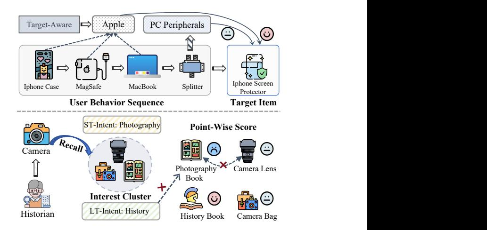
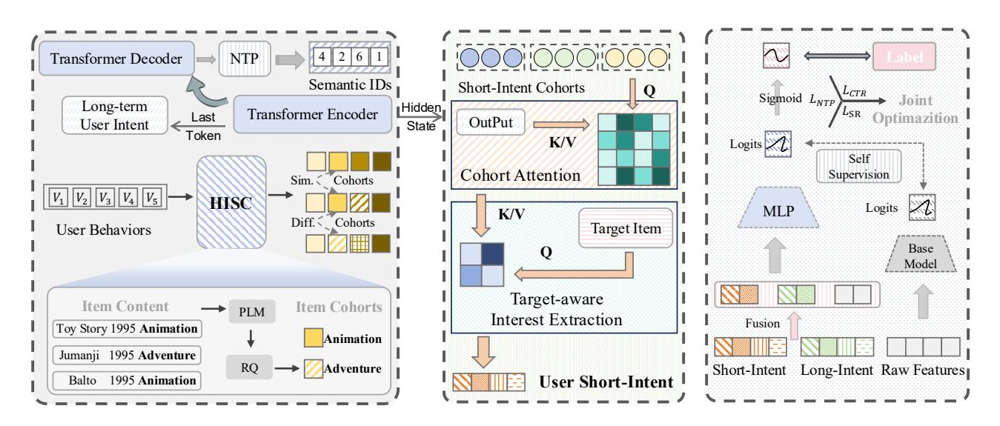
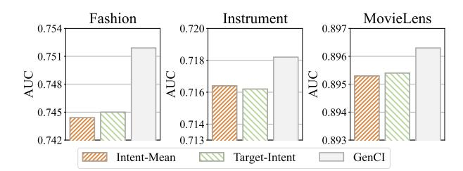
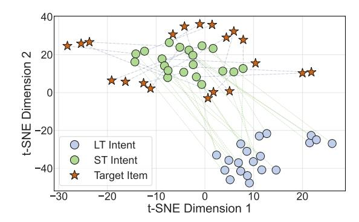
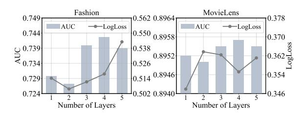
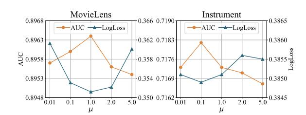
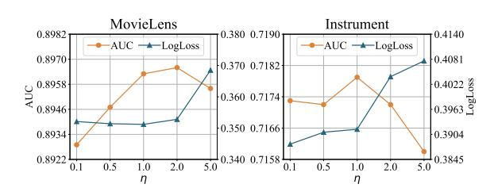

# GenCI: Generative Modeling of User Interest Shift via Cohort-based Intent Learning for CTR Prediction

[Kesha Ou](https://orcid.org/0009-0006-8557-5437)∗ Gaoling School of Artificial Intelligence, Renmin University of China Beijing, China keishaou@gmail.com

[Zhen Tian](https://orcid.org/0000-0001-5569-2591) Gaoling School of Artificial Intelligence, Renmin University of China Beijing, China chenyuwuxinn@gmail.com

[Wayne Xin Zhao](https://orcid.org/0000-0002-8333-6196) B ∗ Gaoling School of Artificial Intelligence, Renmin University of China Beijing, China batmanfly@gmail.com

[Hongyu Lu](https://orcid.org/0000-0002-0247-2496) WeChat, Tencent Beijing, China luhy94@gmail.com

[Ji-Rong Wen](https://orcid.org/0000-0002-9777-9676)∗ Gaoling School of Artificial Intelligence, Renmin University of China Beijing, China jrwen@ruc.edu.cn

# Abstract

Click-through rate (CTR) prediction plays a pivotal role in online advertising and recommender systems. Despite notable progress in modeling user preferences from historical behaviors, two key challenges persist. First, exsiting discriminative paradigms focus on matching candidates to user history, often overfitting to historically dominant features and failing to adapt to rapid interest shifts. Second, a critical information chasm emerges from the point-wise ranking paradigm. By scoring each candidate in isolation, CTR models discard the rich contextual signal implied by the recalled set as a whole, leading to a misalignment where long-term preferences often override the user's immediate, evolving intent.

To address these issues, we propose GenCI, a generative user intent framework that leverages semantic interest cohorts to model dynamic user preferences for CTR prediction. The framework first employs a generative model, trained with a next-item prediction (NTP) objective, to proactively produce candidate interest cohorts. These cohorts serve as explicit, candidate-agnostic representations of a user's immediate intent. A hierarchical candidate-aware network then injects this rich contextual signal into the ranking stage, refining them with cross-attention to align with both user history and the target item. The entire model is trained end-to-end, creating a more aligned and effective CTR prediction pipeline. Extensive experiments on three widely used datasets demonstrate the effectiveness of our approach.

# CCS Concepts

#### • Information systems → Recommender systems.

∗Also with Beijing Key Laboratory of Research on Large Models and Intelligent Governance.

B Corresponding author.

[This work is licensed under a Creative Commons Attribution 4.0 International License.](https://creativecommons.org/licenses/by/4.0) WWW '26, Dubai, United Arab Emirates © 2026 Copyright held by the owner/author(s). ACM ISBN 979-8-4007-2307-0/2026/04 <https://doi.org/10.1145/3774904.3792612>

# Keywords

CTR Prediction, User Interest Modeling, Next-Item Prediction, Recommender Systems

### ACM Reference Format:

Kesha Ou, Zhen Tian, Wayne Xin Zhao B, Hongyu Lu, and Ji-Rong Wen. 2026. GenCI: Generative Modeling of User Interest Shift via Cohort-based Intent Learning for CTR Prediction. In Proceedings of the ACM Web Conference 2026 (WWW '26), April 13–17, 2026, Dubai, United Arab Emirates. ACM, New York, NY, USA, [11](#page-10-0) pages.<https://doi.org/10.1145/3774904.3792612>

#### Resource Availability:

The source code of this paper has been made publicly available at [https:](https://doi.org/10.5281/zenodo.18344901) [//doi.org/10.5281/zenodo.18344901.](https://doi.org/10.5281/zenodo.18344901)

# 1 Introduction

The click-through rate (CTR) prediction task, which aims to estimate the probability of a user clicking an item, is essential for web applications like recommender systems to improve user experience and platform revenue. Various models [\[24,](#page-8-0) [48,](#page-9-0) [49\]](#page-9-1) have been proposed to capture user interests from historical behaviors. Despite the notable achievements, two fundamental challenges persist in contemporary paradigms.

First, existing models have limited ability to capture shifts in user interest. Prior studies [\[47](#page-9-2)[–49\]](#page-9-1) demonstrate that leveraging behavioral histories can improve performance, primarily by using attention mechanisms to weigh the relevance of past behaviors with respect to the target item. However, these models are designed to assess candidate relevance rather than construct a standalone representation of the user's current intent, making it difficult to handle evolving interests. As illustrated in the upper part of Figure [1,](#page-1-0) when a user's focus shifts from iPhone accessories to MacBook accessories, such models tend to assign a high score to an iPhone screen protector due to the abundance of Apple-related items in the user's history, thereby failing to capture the evolving preference. Moreover, the fundamentally discriminative nature of these approaches often induces shortcut learning [\[10,](#page-8-1) [41,](#page-8-2) [45\]](#page-9-3), where the model relies on local strongly predictive historical features instead

of capturing the full spectrum of user interests, further hindering its ability to model dynamic user preferences.

Second, the point-wise CTR prediction paradigm evaluates each recalled candidate in isolation, ignoring the latent interest signal implied by the candidate set as a whole. In modern recall-then-rank pipelines, this context-agnostic approach introduces a substantial information gap. The recall module retrieves a candidate set that reflects hypotheses about the user's immediate intent, forming an contextual interest cohort(i.e., a group of semantically similar items). However, this rich contextual signal is later discarded under the point-wise ranking schema, leading to misalignment between the two stages. As illustrated in the lower part of Figure [1,](#page-1-0) when a user shifts their focus from history to photography, relevant photography books may be successfully recalled, yet the contextagnostic ranker might still prioritize familiar history items driven by strong long-term preferences, failing to capture the user's evolving intent.

To overcome these limitations, we introduce a generative paradigm to more effectively model user interest shifts through an auxiliary next-item prediction (NTP) task. Our approach is grounded in modeling the user's chronologically ordered click sequence, through which the causal decision-making process and evolving intent can be inferred [\[20\]](#page-8-3). Based on this foundation, our model proactively generates semantic IDs that represent a hypothesis about the user's next interaction, overcoming the limitation of discriminative methods that passively evaluate target relevance without forming a candidate-agnostic representation of current intent. Furthermore, because this generative prediction is made over the entire item space [\[29\]](#page-8-4), the resulting semantic IDs encode globally coherent information about user interests, mitigating the overfitting of discriminative methods to local high-frequency features. By modeling the interaction between these semantic IDs and the target item, we inject this rich contextual foundation into the CTR prediction stage, enabling the ranking model to be aware of the recall-stage context (i.e., why an item was retrieved alongside others). This design addresses the inherent limitation of point-wise CTR models, which evaluate items independently without awareness of the retrieval context, thereby achieving better alignment between the recall and ranking stages.

In this paper, we propose GenCI, a novel generative user intent framework that constructs semantic interest cohorts as explicit intent representations for CTR prediction. First, hierarchical quantization is applied to organize items into semantically coherent cohorts, forming latent interest groups that capture fine-grained user preferences. Based on this representation, we employ a generative sequential model built upon a Transformer architecture to perform the NTP task, which extracts dual-aspect user intent: the encoder produces a general long-term interest profile, while the decoder generates candidate interest cohorts that capture the user's immediate, short-term intent. These candidate cohorts are then incorporated as dynamic contextual signals in the ranking stage. To mitigate the noise introduced by items selected merely due to coarse semantic similarity, we design a hierarchical candidate-aware modeling module that refines the cohorts' intent via cross-attention, aligning them with both historical behaviors and the target item to produce highly personalized and dynamic interest representations. Finally, the multi-perspective intent signals are integrated

Figure 1: Illustration of two key challenges in CTR prediction. Top: Relevance-based models focus on long-term preference matching and fail to adapt to short-term intent shifts (e.g., from iPhone accessories to MacBook accessories, ). Bottom: Inconsistency between recall and ranking, where the recall stage retrieves intent-relevant items (e.g., photography-related), but the ranking stage favors items aligned with long-term interests (e.g., history books).

with conventional features and fed into MLPs for CTR estimation, with the entire model trained end-to-end under a joint optimization scheme, augmented by a self-supervised regularization that stabilizes learning and improves robustness. The contributions of this paper are summarized as follows:

• We propose GenCI, a novel framework that introduces a generative paradigm for modeling dynamic user intent. It leverages a NTP task to proactively generate semantically coherent interest cohorts, enabling the capture of multi-faceted user preferences.

• We introduce a hierarchical candidate-aware network that personalizes the generated cohorts via cross-attention, thereby injecting them as dynamic signals to make the point-wise ranker aware of the recall signal.

• We conduct extensive experiments on three widely used datasets. GenCI consistently outperforms a number of competitive baselines, showing the effectiveness of our model.

### 2 Methodology

In this section, we present the proposed approach, named GenCI (Figure [2\)](#page-2-0), which adopts a generative paradigm for multi-faceted user intent modeling. Our framework first employs a generative module to produce candidate interest cohorts that capture the user's short-term intent. Building on this, a hierarchical interest network is applied to extract and refine the most behavior-relevant and target-aligned signals for the final recommendation. This entire process, stabilized by a self-supervised regularization objective, is designed to achieve end-to-end consistency between recall and ranking for CTR prediction. Subsequently, we first introduce the task formulation (Section [2.1\)](#page-2-1), followed by in-depth discussions on generative user-intent modeling (Section [2.2\)](#page-2-2) and interest extraction and utilization (Section [2.3\)](#page-3-0).

nearest codeword:

���� = arg min �� ||�� (��) − �� �� ||2 , �� (��+1) = �� (��) − �� ���� , (3)

where ���� is the selected codeword index at level ��. Crucially, all items assigned the same codeword at level �� (i.e., ���� = ��) form a semantic cohort, capturing shared semantic characteristics at that granularity. Across all levels, the hierarchical quantization induces �� × �� semantic cohorts, organizing the item corpus into multi-granularity interest groups that serve as the foundation for subsequent short-term intent modeling.

2.2.2 Dual-Aspect Interest Extraction from Behavioral Sequences. Leveraging the semantic ID representations, we employ a Transformerbased encoder to model user behavioral sequences for generative retrieval. The encoder, composed of �� layers, processes the input sequence �� to produce a stack of hierarchical representations Henc:

Encoder(��) = [H (1) , H (2) , . . . , H (��) ], (4)

where H (��) denotes the hidden states at layer ��. The final layer's output H (��) encapsulates the deepest contextual information. To obtain the user's long-term intent (LTI) representation HLTI, we extract the hidden state from H (��) at the last valid position:

HLTI = �� (��) �� , where �� = max{�� | ���� = 1}, (5)

where �� denotes the last valid position determined by the mask ��.

During training, the model captures users' short-term and evolving interests by predicting the semantic IDs of the next item in the NTP task. Specifically, the Transformer decoder conditions on the encoder output Henc and the embedded target prefix E<�� at step �� to generate the current preference state:

H (��) dec = DecoderR (Henc, E<�� ), (6)

which is subsequently projected onto the codebook space to compute the probability distribution over the next semantic ID. Leveraging this learned sequential knowledge, the model can autoregressively generate a sequence of valid semantic IDs for a given user's historical interactions, using a constrained beam search to ensure that the generated IDs correspond to items within the recommendation corpus.

This approach capitalizes on the Transformer's ability to capture short-term dependencies [\[17\]](#page-8-5). By formulating the prediction target as structured semantic IDs rather than atomic item identifiers, the decoder is encouraged to learn abstract user intents rather than superficial item co-occurrence patterns. Furthermore, the autoregressive attention mechanism naturally prioritizes recent interactions, ensuring that the generated cohorts accurately reflect users' immediate interests. Consequently, the NTP task effectively models sequential behavior dynamics, capturing the user's evolving short-term intent, complementing the static long-term profile HLTI.

# 2.3 Interest Extraction and Utilization

To fully exploit the contextual information captured by the squential modeling module, we treat the above generated candidate set as a dynamic contextual signal to guide CTR prediction. In this part, We propose a hierarchical candidate-aware interest modeling module that explicitly integrates this short-term intent into the CTR prediction process, improving alignment between recall and ranking. Subsequently, we aggregate multiple signals, including long-term preferences, short-term intent, and conventional raw features (e.g., user profile and target item), feeding them into MLPs to model high-order feature interactions. Finally, the entire framework is trained jointly with both generative and predictive objectives.

2.3.1 Hierarchical Candidate-Aware Intent Modeling. A critical challenge in leveraging the generated candidate set is that it may include items selected merely due to coarse semantic similarity, rather than genuine relevance to the user.Consequently, naïve aggregation can introduce irrelevant signals. To address this, we employ a hierarchical attention mechanism to distill a refined intent representation that is tightly aligned with both the user's historical context and the specific target item under prediction.

Candidate Cohort-Guided Intent Refinement. Building upon the candidate generation in Section [2.2.2,](#page-3-1) which reflects the user's immediate preferences, we further distill the underlying short-term intent through a behavior-aware refinement process. This step is crucial for grounding the semantically derived interest cohorts in the user's concrete behavioral patterns. Specifically, the generated sequence of semantic IDs is mapped to hierarchical item cohorts {��1,��2, . . . ,���� −1}. Here, each ���� denotes the set of items sharing the predicted codeword at level ��, thereby capturing a specific granularity of the user's short-term intent. To preserve this hierarchical structure, we apply mean pooling individually within each cohort to derive the cohort-level representation EC:

�� (��) C = MeanPool({���� | �� ∈ ���� }), EC = [�� (1) C ; . . . ; �� (�� −1) C ], (7)

where EC ∈ R (�� −1)×�� represents the multi-level cohort embeddings. To incorporate behavior-relevant context, we compute the refined intent representation, denoted as ER, by employing the cohort matrix EC as a query to attend to the user's historical context Henc:

ER = Softmax (ECW�� ) (HencW�� ) ⊤ √ �� (HencW�� ), (8)

where W{��,��,�� } are learnable projection matrices and subscripts C and R stand for cohort and refined, respectively. Mechanistically, this operation re-weighs the user's historical actions based on their relevance to the predicted cohort. This selectively emphasizes historical signals that support the current semantic hypothesis while suppressing behaviorally irrelevant noise. The resulting ER thus encodes a behaviorally grounded short-term intent, providing a highly discriminative signal for the subsequent ranking stage.

Target-Aware Dynamic Interest Extraction. Although the previous step filters out many irrelevant signals (i.e., items included in the cohorts merely due to semantic similarity), the resulting multi-level representation ER preserves a hierarchical structure that requires adaptive aggregation. A static strategy, such as mean pooling across the �� hierarchical levels, would yield a target-agnostic interest vector. This is suboptimal, as the importance of different semantic granularities naturally varies depending on the specific target item (e.g., broad categories vs. specific niches). To address this limitation, we introduce a target-aware attention mechanism. We utilize the ID embedding ���� of the target item �� as a query to attend to the refined cohort sequence ER. Formally, the dynamic interest representation

is computed as:

HSTI = Softmax (����W�� ) (ERW�� ) ⊤ √ �� (ERW�� ), (9)

where W{��,��,�� } are learnable projection matrices. Through this mechanism, the model adaptively highlights the specific cohort levels most relevant to the target, yielding a precise and contextaware short-term interest (STI) representation HSTI for the final prediction.

2.3.2 Multi-Intent Fusion and Joint Optimization. Building on the multi-perspective user intent representations captured in previous stages, this part integrates them with conventional features for CTR prediction and further introduces a self-supervised regularization to stabilize learning. Finally, the entire model is trained end-to-end via a joint optimization scheme, which facilitates a seamless information exchange across different modules and ensures coherent alignment between intent modeling and prediction objectives.

Multi-faceted Interest Aggregation for Prediction. In the final prediction layer, we aggregate the multi-faceted interest representations derived from the preceding modules. Specifically, we concatenate the long-term intent HLTI (derived in Eq.[\(5\)](#page-3-2)) and the target-aware short-term intent HSTI (computed in Eq.[\(9\)](#page-4-0)) with conventional feature embeddings to estimate the final CTR score:

��ˆ = �� (MLP ([HLTI; HSTI; E��; E�� ])) , (10)

where E�� and E�� denote the concatenated feature embeddings for the user �� and the target item ��, respectively. The operator [·; ·] represents concatenation, MLP(·) is the prediction network, and ��(·) is the sigmoid function mapping the output to a click probability.

Joint Optimization. Building upon the multi-faceted interest representations introduced above, we further optimize the entire model through a self-supervised joint objective. To enhance training stability, particularly in the early stages when the sequence modeling module may produce noisy intent representations, we incorporate an auxiliary regularization term. Specifically, a lightweight baseline CTR model (e.g., DeepFM) trained on raw features provides supervisory logits, which are used to regularize the full model's output and guide the integrated intent representations toward more reliable patterns:

LSR = − 1 �� ∑︁�� ��=1 �� OPMbase (����) , OPMours(���� , ����) , (11)

where Mbase and Mours denote the baseline and proposed CTR models, respectively, OP(·) extracts logits, and ���� denotes the multilevel intent representation(i.e., HLTI and HSTI) of instance ��. Finally, the framework is optimized in an end-to-end manner under a multitask learning paradigm, incorporating the primary CTR prediction task, the NTP task(defined in Section [2.1\)](#page-2-1), and the self-supervised regularization (SR) task, with the overall loss defined as:

L = LCTR + ��LNTP + ��LSR, (12)

where �� and �� are hyperparameters that balance the contributions of each loss term. This unified optimization allows gradients to propagate across the entire architecture, fostering a synergistic feedback loop. Consequently, the model jointly refines long-term and short-term user interests while aligning the recall-oriented and ranking-oriented objectives under a single global objective, leading to more robust end-to-end CTR prediction.

#### 2.4 Discussion

In this section, we discuss the distinct advantages and architectural insights of the proposed GenCI framework.

Recall-Ranking Consistency. Conventional CTR prediction systems suffer from a key limitation originating from the ranker's point-wise scoring paradigm. Because the ranker scores each candidate independently, it loses the rich contextual signal that is inherent in the co-recalled items. Our framework overcome this limitation by reframing the pipeline from recall-then-rank process into an integrated generate-and-interpret loop. Our generative module produces a semantically coherent interest cohort to act as a dynamic, contextual prior for the ranker. The entire architecture is jointly optimized, which helps the recall stage generate cohorts that are most informative for the ranking stage, ultimately achieving effective recall-ranking consistency.

Cohort-Level Intent Modeling. Unlike conventional methods that infer user interest solely from individual historical items, our framework introduces a cohort-level intent modeling paradigm. We exploit a key property of generative sequence modeling: Semantic IDs naturally group semantically similar items through shared codes. By mapping generated Semantic IDs back to their corresponding items, we construct interest cohorts that provide a broader reflection of the user's immediate intent. To refine these cohorts, we employ a hierarchical attention mechanism to suppress items that are semantically correlated but lack behavioral evidence, resulting in user representations that are both behaviorally grounded and target-aware.

The overall comparison of our approach with existing methods is presented in Table [1.](#page-4-1)

Table 1: Comparison of different CTR methods. "ST", "LT" refer short-term and long-term respectively, CL represents cluster-level, and "RRC" denotes recall–ranking consistency

| Methods |        | LT Intent ST Intent | CL Intent RRC |
|---------|--------|---------------------|---------------|
| DCNV2   | [37]   | " %                 | % %           |
| DIN     | [49]   | " %                 | % %           |
| DIEN    | [48]   | " "                 | % %           |
| GenCI   | (ours) | " "                 | " "           |

#### 3 Experiments

In this section, we conduct extensive experiments to evaluate the effectiveness of GenCI and analyze the impact of each model component.

#### 3.1 Experimental Setup

We introduce the experimental settings, including the datasets, baseline approaches, metrics, and hyperparameter details.

3.1.1 Datasets. We conduct experiments on three public datasets for recommender evaluation, including: movie recommendation (MovieLens[1](#page-5-0) ) and product recommendation (two subsets from Amazon[2](#page-5-1) , namely Fashion and Musical-Instruments). The statistics of datasets are summarized in Table [2.](#page-5-2)

• MovieLens is a widely used benchmark containing users' movie rating records. Following prior work [\[5,](#page-8-7) [35\]](#page-8-8), ratings above 3 are regarded as positive interactions and those below 3 as negative. User interactions are time-ordered and split into training, validation, and test sets (8:1:1), with each sequence truncated to 50 items.

• Fashion and Instrument contain user reviews from May 1996 to September 2023. Following [\[49\]](#page-9-1), we filter users and items with fewer than five interactions, then apply a leave-one-out strategy with each user's sequence limited to 20 items.

Table 2: The statistics of datasets. The"Avg.n" is the average length of behavioral sequences.

| Datasets   | # Users | # Items | # Interaction | Avg. n | Sparsity |
|------------|---------|---------|---------------|--------|----------|
| MovieLens  | 6041    | 3669    | 739012        | 122.35 | 96.66%   |
| Fashion    | 3719    | 13198   | 24097         | 6.48   | 99.95%   |
| Instrument | 57440   | 24588   | 511836        | 8.91   | 99.96%   |

3.1.2 Compared Methods. We compare the proposed approach with the following baseline methods:

• LR [\[30\]](#page-8-9) captures linear dependencies among features via weighted summation.

• FwFM [\[33\]](#page-8-10) enhances factorization machines by introducing field-specific parameters.

• NFM [\[11\]](#page-8-11)integrates the linearity of FM for second-order feature interactions with the non-linearity of neural networks to capture higher-order interactions effectively.

• PNN [\[27\]](#page-8-12) incorporates a product layer to capture interactions between inter-field feature categories.

• FiGNN [\[18\]](#page-8-13) models multi-field feature interactions using graph neural networks to capture complex relationships between features.

• DeepFM [\[9\]](#page-8-14) unifies FM and MLP to jointly capture explicit and implicit feature interactions.

• DCNv2 [\[37\]](#page-8-6) models high-order interactions via deep cross networks while using MLPs for implicit interactions.

• AutoInt+ [\[32\]](#page-8-15) uses multi-head self-attentive neural network to explicitly model the feature interactions. AutoInt+ improves it with a feed-forward neural network.

• xDeepFM [\[19\]](#page-8-16) employs the Compressed Interaction Network (CIN) to capture vector-wise explicit feature interactions.

• AFN+ [\[5\]](#page-8-7) learns arbitrary-order feature interactions in logarithmic space. AFN+ integrates AFN and DNN for better stability.

• RFM [\[35\]](#page-8-8) models adaptive-order feature interactions by representing features as polar angles in the complex plane and capturing their relationships through complex rotations.

• DIN [\[49\]](#page-9-1) employs a local activation unit to adaptively capture user interests from historical behaviors with respect to each target item, enabling instance-level interest representation

• DIEN [\[48\]](#page-9-0) introduces an auxiliary-supervised interest extractor and an interest evolution layer to capture users' dynamic and evolving interests more accurately.

• MIRRN [\[40\]](#page-8-17) employs multi-granularity queries to retrieve diverse interest subsequences and uses a multi-head Fourier transformer to model long-term user behaviors.

• SFG [\[43\]](#page-8-18) reformulates CTR prediction as a supervised generative feature-generation paradigm, generating feature embeddings conditioned on all features to reduce embedding collapse.

The above baseline methods cover a wide spectrum of approaches in CTR prediction. LR and FwFM capture linear and pairwise interactions, while high-order models like NFM, PNN, and FiGNN model complex non-linear dependencies. Ensemble-based models, including DeepFM, DCNv2, xDeepFM, AutoInt+, integrate explicit and implicit interactions for complementarity. AFN and RFM learn arbitrary-order interactions using mathematical transformations, and SFG refines feature embeddings through a generative paradigm. User behavior models, such as DIN and DIEN, capture evolving interests via target-aware representations, with MIRRN further modeling multi-granularity interests.

3.1.3 Evaluation Metrics. Following previous works [\[13,](#page-8-19) [32,](#page-8-15) [33\]](#page-8-10), we adopt two widely used ranking metrics in CTR models: AUC (Area Under the ROC curve) and LogLoss (cross entropy). The RelaImpr metric, as proposed in [\[42\]](#page-8-20), measures the relative improvement over the base model and is defined as follows:

RelaImpr = AUC(measure model) − 0.5 AUC(base model) − 0.5 − 1 × 100% (13)

3.1.4 Implementation Details. We implement all models using the RecBole [\[46\]](#page-9-5) framework. We perform a grid search to find optimal hyperparameters for each model. For sequence modeling, semantic embeddings for items are first learned by encoding their textual information using Sentence-T5 [\[22\]](#page-8-21). Based on these embeddings, an RQ-VAE is trained with three codebooks of size 256 and an additional codebook for collision handling, with T5 [\[28\]](#page-8-22) serving as the backbone of the sequence modeling module. the embedding size is 16 and the batch size is 1024. The intent modeling employs a crossattention mechanism with 2 attention heads and dropout tuned from {0.1, 0.2, 0.3}. The MLP structure of the final prediction layer is [256, 256, 256]. Model parameters are initialized using Xavier initialization [\[8\]](#page-8-23) and optimized with the Adam optimizer [\[6\]](#page-8-24), with the learning rate of 5e-3. More tuning details and the code are available at [https://github.com/RUCAIBox/GenCI.](https://github.com/RUCAIBox/GenCI)

# 3.2 Overall Performance

To validate the effectiveness of GenCI, we compare its performance with several baseline models across three datasets. As summarized in Table [3,](#page-6-0) we make the following observations:

For feature interaction models, traditional methods such as LR and FwFM, which are constrained to modeling low-order feature interactions, generally underperform compared to deep learningbased models such as NFM, PNN and FiGNN that capture higherorder relationships. Ensemble-based approaches like DeepFM, DCNv2, AutoInt+, and xDeepFM further incorporate MLPs to model implicit interactions while also capturing explicit feature interactions. Adaptive models like AFN+ and RFM, which learn arbitrary-order interactions, achieve further gains. Recently, SFG introduces a generative paradigm to refine feature embeddings. Despite their effectiveness, these models largely follow an embedding-then-feature-interaction

1https://grouplens.org/datasets/movielens

2https://amazon-reviews-2023.github.io/

Table 3: Performance comparisons. Note that a higher AUC or lower LogLoss at 0.001-level is significant for CTR prediction.

| Model LR | AUC 0.8577 | LogLoss 0.3904 | MovieLens RelaImpr – | Latency 0.21s | AUC 0.7284 | LogLoss 0.5097 | Amazon-Fashion RelaImpr – | Latency 0.01s | AUC 0.6985 | LogLoss 0.4200 | Amazon-Instrument RelaImpr – | Latency 0.16s |
|----------|------------|----------------|----------------------|---------------|------------|----------------|---------------------------|---------------|------------|----------------|------------------------------|---------------|
| FwFM     | 0.8743     | 0.3694         | 4.64%                | 0.51s         | 0.7317     | 0.5947         | 1.44%                     | 0.01s         | 0.7118     | 0.4075         | 6.70%                        | 0.19s         |
| NFM      | 0.8847     | 0.3649         | 7.55%                | 0.43s         | 0.7421     | 0.5239         | 6.00%                     | 0.03s         | 0.7022     | 0.3937         | 1.86%                        | 0.25s         |
| PNN      | 0.8901     | 0.3511         | 9.06%                | 0.31s         | 0.7440     | 0.5842         | 6.83%                     | 0.02s         | 0.7144     | 0.3875         | 8.01%                        | 0.17s         |
| FiGNN    | 0.8899     | 0.3628         | 9.00%                | 0.45s         | 0.7445     | 0.6632         | 7.05%                     | 0.02s         | 0.7146     | 0.3958         | 8.11%                        | 0.30s         |
| DeepFM   | 0.8908     | 0.3527         | 9.25%                | 0.41s         | 0.7430     | 0.6949         | 6.39%                     | 0.02s         | 0.7151     | 0.3866         | 8.36%                        | 0.22s         |
| DCNV2    | 0.8927     | 0.3564         | 9.78%                | 0.38s         | 0.7423     | 0.6147         | 6.08%                     | 0.02s         | 0.7148     | 0.3869         | 8.21%                        | 0.21s         |
| AutoInt+ | 0.8924     | 0.3534         | 9.70%                | 0.62s         | 0.7446     | 0.6218         | 7.09%                     | 0.05s         | 0.7157     | 0.3862         | 8.66%                        | 0.26s         |
| xDeepFM  | 0.8919     | 0.3512         | 9.56%                | 0.47s         | 0.7443     | 0.6465         | 6.96%                     | 0.03s         | 0.7158     | 0.3868         | 8.71%                        | 0.31s         |
| AFN+     | 0.8906     | 0.3574         | 9.19%                | 0.58s         | 0.7439     | 0.5559         | 6.79%                     | 0.02s         | 0.7102     | 0.3899         | 5.89%                        | 0.23s         |
| RFM      | 0.8918     | 0.3612         | 9.53%                | 0.44s         | 0.7463     | 0.4903         | 7.84%                     | 0.02s         | 0.7131     | 0.3879         | 7.35%                        | 0.23s         |
| DIN      | 0.8931     | 0.3445         | 9.89%                | 0.52s         | 0.7445     | 0.7838         | 7.05%                     | 0.03s         | 0.7166     | 0.3894         | 9.11%                        | 0.29s         |
| DIEN     | 0.8936     | 0.3459         | 10.03%               | 2.34s         | 0.7451     | 0.8129         | 7.31%                     | 0.09s         | 0.7168     | 0.3879         | 9.21%                        | 1.06s         |
| MIRRN    | 0.8938     | 0.3472         | 10.05%               | 0.65s         | 0.7466     | 0.5647         | 7.95%                     | 0.04s         | 0.7169     | 0.3863         | 9.26%                        | 0.36s         |
| SFG      | 0.8939     | 0.3463         | 10.08%               | 0.50s         | 0.7450     | 0.5672         | 7.28%                     | 0.03s         | 0.7159     | 0.3920         | 8.79%                        | 0.29s         |
| GenCI    | 0.8964     | 0.3507         | 10.82%               | 0.48s         | 0.7519     | 0.4959         | 10.29%                    | 0.03s         | 0.7182     | 0.3849         | 9.92%                        | 0.28s         |

paradigm, flattening historical behaviors and failing to capture dynamic user interests.

User behavior modeling approaches mark a paradigm shift by explicitly modeling sequential interactions. DIN leverages targetaware attention to highlight relevant historical behaviors, while DIEN adds an interest evolution layer to capture dynamic interest progression. MIRRN further utilizes multi-granularity queries and Fourier transformers for long-term behavior modeling. By explicitly capturing sequential dynamics, these methods consistently outperform traditional feature interaction baselines.

Ultimately, GenCI achieves state-of-the-art performance across all datasets. By explicitly modeling the NTP task, it captures precise short-term intent that reflects users' immediate needs. The Hierarchical Candidate-Aware Intent Modeling mechanism further refines this intent into personalized, target-aligned representations. Finally, a multi-intent fusion module with joint optimization integrates these complementary signals, delivering superior accuracy with inference times comparable to efficient baselines.

# 3.3 Experimental Analysis

3.3.1 Ablation Study. To verify the contribution of each key component within our proposed GenCI framework, we conduct a comprehensive ablation study by evaluating several of its variants, as summarized in Table [4.](#page-6-1)

•w/o ST-Intent. This variant removes ��st in Eq. [\(10\)](#page-4-2), captures refined short-term intent through the Hierarchical Candidate-Aware Intent Modeling module. As user behaviors are strongly influenced by immediate interests (discuessed in Section [2.3.1\)](#page-3-3), omitting this component results in a significant performance drop, highlighting the importance of modeling dynamic intent at the cohort level.

•w/o LT-Intent. This variant excludes ��lt in Eq. [\(10\)](#page-4-2), which encodes the user's long-term preference profile captured from historical behavioral sequences. Without this stable global intent representation, the model loses its ability to capture persistent user preferences, leading to inferior overall performance.

•w/o SR. This variant removes the self-supervised regularization term LSR in Eq. [\(12\)](#page-4-3), which is designed to stabilize training by

providing auxiliary supervision from a baseline CTR model. Without this regularization, the model becomes more sensitive to noisy intent representations generated during the early stages of training, resulting in unstable convergence and degraded accuracy.

•w/o NTP. This variant removes the term LNTP in Eq. [\(12\)](#page-4-3), which is designed to capture sequential behavioral patterns and serve as a recall-oriented objective. Without this supervision, the model fails to align user exploration with final decision-making, directly hindering the achievement of recall-ranking consistency.

Overall, the ablation results clearly demonstrate that each module plays a critical and complementary role in the overall framework. The long-term and short-term intent representations jointly capture the user's persistent and evolving preferences, while the NTP objective ensures recall-ranking consistency. Furthermore, the self-supervised regularization facilitates stable and reliable training. Together, these components contribute to the superior end-to-end performance of GenCI.

Table 4: Ablation study of the proposed GenCI.

|      | Model |           | AUC    | MovieLens Log | Loss AUC | Fashion Log | Loss AUC | Instruments Log Loss |
|------|-------|-----------|--------|---------------|----------|-------------|----------|----------------------|
| (0): | GenCI |           | 0.8964 | 0.3507        | 0.7519   | 0.4959      | 0.7182   | 0.3849               |
| (1): | w/o   | ST-Intent | 0.8935 | 0.3597        | 0.7394   | 0.5211      | 0.7165   | 0.3856               |
| (2): | w/o   | LT-Intent | 0.8941 | 0.3542        | 0.7414   | 0.6083      | 0.7176   | 0.3858               |
| (3): | w/o   | SR        | 0.8923 | 0.3539        | 0.7410   | 0.5517      | 0.7160   | 0.3856               |
| (4): | w/o   | NTP       | 0.8920 | 0.3550        | 0.7400   | 0.5192      | 0.7146   | 0.3860               |

3.3.2 Performance Comparison w.r.t. Different Ensemble Approaches. We conducted a set of experiments to evaluate the effectiveness of our HCAIM module under different short-term intent extraction strategies, as shown in Figure [3.](#page-7-0) Intent-Mean applies mean pooling over cohorts, which treats all cohorts identically and thus neglects the hierarchical item representations learned by RQ-VAE, thereby undermining the preservation of fine-grained intent semantics. Target-Intent employs target-aware attention to capture target-related representations but overlooks intra-cohort refinement, leaving behaviorally irrelevant items insufficiently filtered. In contrast, our hierarchical attention mechanism refines cohort representations in a coarse-to-fine manner, enhancing behaviorally relevant and target-aligned intent modeling.

Figure 3: Performance comparison w.r.t. different ensemble approaches applied in the HCAIM module.

3.3.3 Visualization of Cohort Interest Distribution. To validate the effectiveness of the learned user intents, we employ t-SNE [\[21\]](#page-8-25) to project the embeddings of long-term and short-term intents, together with target item representations, into a two-dimensional space, as illustrated in Figure [4.](#page-7-1) The short-term intents exhibit compact cohorts centered around their corresponding target items, whereas the long-term intents are more broadly distributed across the latent space. This clear separation indicates that our model successfully disentangles the two facets of user preference, where the short-term intent captures immediate contextual signals, and the long-term intent encodes stable, generalized user tendencies.

Figure 4: Visualization of different interest distribution. Short-term intents cluster tightly around target items, capturing immediate context, while long-term intents are broadly distributed, representing generalized preferences.

# 4 Related Work

The field of CTR prediction has seen significant evolution, with research primarily focused on two areas: feature interaction modeling [\[9,](#page-8-14) [37\]](#page-8-6) and user behavior modeling [\[39,](#page-8-26) [49\]](#page-9-1).

# 4.1 Feature Interaction Modeling.

Early CTR models such as LR [\[30\]](#page-8-9) are efficient but fail to capture cross-feature signals. Factorization-machine-based methods [\[14,](#page-8-27) [23,](#page-8-28) [33,](#page-8-10) [38\]](#page-8-29) address this by factorizing feature spaces to model secondorder interactions under sparse data. The advent of deep learning

led to a new paradigm of models capable of learning high-order interactions. Some models, such as DCNv2 [\[37\]](#page-8-6) and xDeepFM [\[19\]](#page-8-16), predefine a maximum order to enumerate all feature combinations. To alleviate the limitations of fixed-order designs, other studies [\[5,](#page-8-7) [34,](#page-8-30) [35\]](#page-8-8) propose learning the interaction orders adaptively from data, automatically infer interaction orders through transformations in complex vector spaces, achieving greater flexibility. While powerful, these models [\[15,](#page-8-31) [16,](#page-8-32) [36\]](#page-8-33) typically operate on a flattened set of features, often overlooking the inherent sequential structure in user behavior data.

#### 4.2 User Behavior Modeling.

To overcome the limitations of static feature interaction, subsequent works [\[12,](#page-8-34) [40\]](#page-8-17) model users' historical behaviors to derive dynamic interest representations. DIN [\[49\]](#page-9-1) introduces an attention mechanism to weight historical behaviors relative to the target item, shifting from static to target-aware profiles. DIEN[\[48\]](#page-9-0) integrates GRUs to capture temporal evolution of user interests. DSIN [\[7\]](#page-8-35) segments user behaviors into homogeneous sessions and employs LSTMs for finer-grained interest modeling, while BST [\[4\]](#page-8-36) leverages the Transformer architecture to capture complex item dependencies. Recognizing the importance of long sequences [\[1,](#page-8-37) [3,](#page-8-38) [26,](#page-8-39) [31\]](#page-8-40), models like SIM [\[25\]](#page-8-41) and TWIN [\[2\]](#page-8-42) adopt two-stage frameworks to effectively process extended user histories. However, these methods primarily learn a generalized representation of a user's long-term interests. They are less effective at capturing the immediate, evolving nature of a user's short-term intent, which is critical for predicting their next action. Our work specifically addresses this gap by modeling users' immediate interests.

### 5 Conclusion

In this paper, we present GenCI, a generative user intent framework that leverages semantic interest cohorts to model dynamic user preferences for CTR prediction. Our framework employs a Transformer-based generative model for the NTP task to produce candidate interest cohorts that embody multi-perspective user intent. A hierarchical candidate-aware network then refines these cohorts via dynamic attention, creating personalized and contextually relevant representations. These refined cohorts are then injected as dynamic contextual signals into the ranking stage, enabling the CTR model to incorporate recall-stage information. The entire model is trained end-to-end under a joint optimization scheme to enhance recall-ranking consistency, and augmented with self-supervised regularization to stabilize learning and improve robustness. Extensive experiments on three benchmark datasets show that GenCI consistently outperforms state-of-the-art baselines, demonstrating its effectiveness at capturing dynamic user intent and improving CTR prediction. For future work, we plan to explore integrating multi-modal and cross-domain information to further enrich semantic ID representations and enhance interest modeling.

# Acknowledgments

This paper was partially supported by the National Natural Science Foundation of China No. 92470205 and Beijing Major Science and Technology Project under Contract no. Z251100008425002. Xin Zhao is the corresponding author.

#### References

[1] Yue Cao, Xiaojiang Zhou, Jiaqi Feng, Peihao Huang, Yao Xiao, Dayao Chen, and Sheng Chen. 2022. Sampling is all you need on modeling long-term user behaviors for CTR prediction. In Proceedings of the 31st ACM International Conference on Information & Knowledge Management. 2974–2983. [2] Jianxin Chang, Chenbin Zhang, Zhiyi Fu, Xiaoxue Zang, Lin Guan, Jing Lu, Yiqun Hui, Dewei Leng, Yanan Niu, Yang Song, et al. 2023. TWIN: TWo-stage interest network for lifelong user behavior modeling in CTR prediction at kuaishou. In Proceedings of the 29th ACM SIGKDD Conference on Knowledge Discovery and Data Mining. 3785–3794. [3] Qiwei Chen, Changhua Pei, Shanshan Lv, Chao Li, Junfeng Ge, and Wenwu Ou. 2021. End-to-end user behavior retrieval in click-through rateprediction model. arXiv preprint arXiv:2108.04468 (2021). [4] Qiwei Chen, Huan Zhao, Wei Li, Pipei Huang, and Wenwu Ou. 2019. Behavior sequence transformer for e-commerce recommendation in alibaba. In Proceedings of the 1st international workshop on deep learning practice for high-dimensional sparse data. 1–4. [5] Weiyu Cheng, Yanyan Shen, and Linpeng Huang. 2020. Adaptive factorization network: Learning adaptive-order feature interactions. In Proceedings of the AAAI Conference on Artificial Intelligence, Vol. 34. 3609–3616. [6] Kingma Diederik. 2014. Adam: A method for stochastic optimization. (No Title) (2014). [7] Yufei Feng, Fuyu Lv, Weichen Shen, Menghan Wang, Fei Sun, Yu Zhu, and Keping Yang. 2019. Deep session interest network for click-through rate prediction. In Proceedings of the 28th International Joint Conference on Artificial Intelligence. 2301–2307. [8] Xavier Glorot and Yoshua Bengio. 2010. Understanding the difficulty of training deep feedforward neural networks. In Proceedings of the thirteenth international conference on artificial intelligence and statistics. JMLR Workshop and Conference Proceedings, 249–256. [9] Huifeng Guo, Ruiming Tang, Yunming Ye, Zhenguo Li, and Xiuqiang He. 2017. DeepFM: a factorization-machine based neural network for CTR prediction. arXiv preprint arXiv:1703.04247 (2017). [10] Xingzhuo Guo, Junwei Pan, Ximei Wang, Baixu Chen, Jie Jiang, and Mingsheng Long. 2023. On the Embedding Collapse when Scaling up Recommendation Models. arXiv preprint arXiv:2310.04400 (2023). [11] Xiangnan He and Tat-Seng Chua. 2017. Neural factorization machines for sparse predictive analytics. In Proceedings of the 40th International ACM SIGIR conference on Research and Development in Information Retrieval. 355–364. [12] Junjie Huang, Guohao Cai, Jieming Zhu, Zhenhua Dong, Ruiming Tang, Weinan Zhang, and Yong Yu. 2024. Recall-Augmented Ranking: Enhancing Click-Through Rate Prediction Accuracy with Cross-Stage Data. In Companion Proceedings of the ACM Web Conference 2024. 830–833. [13] Tongwen Huang, Zhiqi Zhang, and Junlin Zhang. 2019. FiBiNET: combining feature importance and bilinear feature interaction for click-through rate prediction. In Proceedings of the 13th ACM Conference on Recommender Systems. 169–177. [14] Yuchin Juan, Yong Zhuang, Wei-Sheng Chin, and Chih-Jen Lin. 2016. Fieldaware factorization machines for CTR prediction. In Proceedings of the 10th ACM conference on recommender systems. 43–50. [15] Honghao Li, Yiwen Zhang, Yi Zhang, Hanwei Li, Lei Sang, and Jieming Zhu. 2024. DCNv3: Towards Next Generation Deep Cross Network for CTR Prediction. arXiv preprint arXiv:2407.13349 (2024). [16] Honghao Li, Yiwen Zhang, Yi Zhang, Lei Sang, and Yun Yang. 2024. TF4CTR: twin focus framework for CTR prediction via adaptive sample differentiation. arXiv preprint arXiv:2405.03167 (2024). [17] Jinming Li, Wentao Zhang, Tian Wang, Guanglei Xiong, Alan Lu, and Gerard Medioni. 2023. GPT4Rec: A generative framework for personalized recommendation and user interests interpretation. arXiv preprint arXiv:2304.03879 (2023). [18] Zekun Li, Zeyu Cui, Shu Wu, Xiaoyu Zhang, and Liang Wang. 2019. Fi-gnn: Modeling feature interactions via graph neural networks for ctr prediction. In Proceedings of the 28th ACM International Conference on Information and Knowledge Management. 539–548. [19] Jianxun Lian, Xiaohuan Zhou, Fuzheng Zhang, Zhongxia Chen, Xing Xie, and Guangzhong Sun. 2018. xdeepfm: Combining explicit and implicit feature interactions for recommender systems. In Proceedings of the 24th ACM SIGKDD international conference on knowledge discovery & data mining. 1754–1763. [20] Qi Liu, Xuyang Hou, Defu Lian, Zhe Wang, Haoran Jin, Jia Cheng, and Jun Lei. 2024. At4ctr: Auxiliary match tasks for enhancing click-through rate prediction. In Proceedings of the AAAI Conference on Artificial Intelligence, Vol. 38. 8787–8795. [21] Laurens van der Maaten and Geoffrey Hinton. 2008. Visualizing data using t-SNE. Journal of machine learning research 9, Nov (2008), 2579–2605. [22] Jianmo Ni, Gustavo Hernandez Abrego, Noah Constant, Ji Ma, Keith B Hall, Daniel Cer, and Yinfei Yang. 2021. Sentence-t5: Scalable sentence encoders from pre-trained text-to-text models. arXiv preprint arXiv:2108.08877 (2021). [23] Junwei Pan, Jian Xu, Alfonso Lobos Ruiz, Wenliang Zhao, Shengjun Pan, Yu Sun, and Quan Lu. 2018. Field-weighted factorization machines for click-through rate prediction in display advertising. In Proceedings of the 2018 World Wide Web Conference. 1349–1357. [24] Qi Pi, Weijie Bian, Guorui Zhou, Xiaoqiang Zhu, and Kun Gai. 2019. Practice on long sequential user behavior modeling for click-through rate prediction. In Proceedings of the 25th ACM SIGKDD international conference on knowledge discovery & data mining. 2671–2679. [25] Qi Pi, Guorui Zhou, Yujing Zhang, Zhe Wang, Lejian Ren, Ying Fan, Xiaoqiang Zhu, and Kun Gai. 2020. Search-based user interest modeling with lifelong sequential behavior data for click-through rate prediction. In Proceedings of the 29th ACM International Conference on Information & Knowledge Management. 2685–2692. [26] Jiarui Qin, Weinan Zhang, Xin Wu, Jiarui Jin, Yuchen Fang, and Yong Yu. 2020. User behavior retrieval for click-through rate prediction. In Proceedings of the 43rd International ACM SIGIR Conference on Research and Development in Information Retrieval. 2347–2356. [27] Y Qu, H Cai, W Zhang, Y Wen, and J Wang. 2017. Product-Based Neural Networks for User Response Prediction. In The IEEE International Conference on Data Mining. IEEE, 1149–1154. [28] Colin Raffel, Noam Shazeer, Adam Roberts, Katherine Lee, Sharan Narang, Michael Matena, Yanqi Zhou, Wei Li, and Peter J Liu. 2020. Exploring the limits of transfer learning with a unified text-to-text transformer. Journal of machine learning research 21, 140 (2020), 1–67. [29] Shashank Rajput, Nikhil Mehta, Anima Singh, Raghunandan Hulikal Keshavan, Trung Vu, Lukasz Heldt, Lichan Hong, Yi Tay, Vinh Tran, Jonah Samost, et al. 2023. Recommender systems with generative retrieval. Advances in Neural Information Processing Systems 36 (2023), 10299–10315. [30] Matthew Richardson, Ewa Dominowska, and Robert Ragno. 2007. Predicting clicks: estimating the click-through rate for new ads. In Proceedings of the 16th international conference on World Wide Web. 521–530. [31] Zihua Si, Lin Guan, ZhongXiang Sun, Xiaoxue Zang, Jing Lu, Yiqun Hui, Xingchao Cao, Zeyu Yang, Yichen Zheng, Dewei Leng, et al. 2024. Twin v2: Scaling ultralong user behavior sequence modeling for enhanced ctr prediction at kuaishou. In Proceedings of the 33rd ACM International Conference on Information and Knowledge Management. 4890–4897. [32] Weiping Song, Chence Shi, Zhiping Xiao, Zhijian Duan, Yewen Xu, Ming Zhang, and Jian Tang. 2019. Autoint: Automatic feature interaction learning via selfattentive neural networks. In Proceedings of the 28th ACM International Conference on Information and Knowledge Management. 1161–1170. [33] Yang Sun, Junwei Pan, Alex Zhang, and Aaron Flores. 2021. Fm2: Field-matrixed factorization machines for recommender systems. In Proceedings of the Web Conference 2021. 2828–2837. [34] Zhen Tian, Ting Bai, Wayne Xin Zhao, Ji-Rong Wen, and Zhao Cao. 2023. Euler-Net: Adaptive Feature Interaction Learning via Euler's Formula for CTR Prediction. In Proceedings of the 46th International ACM SIGIR Conference on Research and Development in Information Retrieval. 1376–1385. [35] Zhen Tian, Yuhong Shi, Xiangkun Wu, Wayne Xin Zhao, and Ji-Rong Wen. 2024. Rotative Factorization Machines. In Proceedings of the 30th ACM SIGKDD Conference on Knowledge Discovery and Data Mining. 2912–2923. [36] Fangye Wang, Hansu Gu, Dongsheng Li, Tun Lu, Peng Zhang, and Ning Gu. 2023. Towards deeper, lighter and interpretable cross network for ctr prediction. In Proceedings of the 32nd ACM International Conference on Information and Knowledge Management. 2523–2533. [37] Ruoxi Wang, Rakesh Shivanna, Derek Cheng, Sagar Jain, Dong Lin, Lichan Hong, and Ed Chi. 2021. DCN V2: Improved deep & cross network and practical lessons for web-scale learning to rank systems. In Proceedings of the Web Conference 2021. 1785–1797. [38] Jun Xiao, Hao Ye, Xiangnan He, Hanwang Zhang, Fei Wu, and Tat-Seng Chua. 2017. Attentional factorization machines: learning the weight of feature interactions via attention networks. In Proceedings of the 26th International Joint Conference on Artificial Intelligence. 3119–3125. [39] Zhibo Xiao, Luwei Yang, Wen Jiang, Yi Wei, Yi Hu, and Hao Wang. 2020. Deep multi-interest network for click-through rate prediction. In Proceedings of the 29th ACM international conference on information & knowledge management. 2265–2268. [40] Xiang Xu, Hao Wang, Wei Guo, Luankang Zhang, Wanshan Yang, Runlong Yu, Yong Liu, Defu Lian, and Enhong Chen. 2025. Multi-granularity interest retrieval and refinement network for long-term user behavior modeling in ctr prediction. In Proceedings of the 31st ACM SIGKDD Conference on Knowledge Discovery and Data Mining V. 1. 2745–2755. [41] Xiaoxiao Xu, Chen Yang, Qian Yu, Zhiwei Fang, Jiaxing Wang, Chaosheng Fan, Yang He, Changping Peng, Zhangang Lin, and Jingping Shao. 2022. Alleviating cold-start problem in CTR prediction with a variational embedding learning framework. In Proceedings of the ACM web conference 2022. 27–35. [42] Lin Yan, Wu-Jun Li, Gui-Rong Xue, and Dingyi Han. 2014. Coupled Group Lasso for Web-Scale CTR Prediction in Display Advertising. In International Conference on Machine Learning.<https://api.semanticscholar.org/CorpusID:12400267> [43] Mingjia Yin, Junwei Pan, Hao Wang, Ximei Wang, Shangyu Zhang, Jie Jiang, Defu Lian, and Enhong Chen. 2025. From Feature Interaction to Feature Generation: A Generative Paradigm of CTR Prediction Models. arXiv preprint arXiv:2512.14041 (2025).

[44] Neil Zeghidour, Alejandro Luebs, Ahmed Omran, Jan Skoglund, and Marco Tagliasacchi. 2021. Soundstream: An end-to-end neural audio codec. IEEE/ACM Transactions on Audio, Speech, and Language Processing 30 (2021), 495–507. [45] Moyu Zhang, Yun Chen, Yujun Jin, Jinxin Hu, and Yu Zhang. 2025. DGenCTR: Towards a Universal Generative Paradigm for Click-Through Rate Prediction via Discrete Diffusion. arXiv preprint arXiv:2508.14500 (2025). [46] Wayne Xin Zhao, Shanlei Mu, Yupeng Hou, Zihan Lin, Yushuo Chen, Xingyu Pan, Kaiyuan Li, Yujie Lu, Hui Wang, Changxin Tian, et al. 2021. Recbole: Towards a unified, comprehensive and efficient framework for recommendation algorithms. In Proceedings of the 30th ACM International Conference on Information & Knowledge Management. 4653–4664. [47] Chang Zhou, Jinze Bai, Junshuai Song, Xiaofei Liu, Zhengchao Zhao, Xiusi Chen, and Jun Gao. 2018. Atrank: An attention-based user behavior modeling framework for recommendation. In Proceedings of the AAAI conference on artificial intelligence, Vol. 32. [48] Guorui Zhou, Na Mou, Ying Fan, Qi Pi, Weijie Bian, Chang Zhou, Xiaoqiang Zhu, and Kun Gai. 2019. Deep interest evolution network for click-through rate prediction. In Proceedings of the AAAI conference on artificial intelligence, Vol. 33. 5941–5948. [49] Guorui Zhou, Xiaoqiang Zhu, Chenru Song, Ying Fan, Han Zhu, Xiao Ma, Yanghui Yan, Junqi Jin, Han Li, and Kun Gai. 2018. Deep interest network for click-through rate prediction. In Proceedings of the 24th ACM SIGKDD international conference on knowledge discovery & data mining. 1059–1068.

# A Additional Experimental Results

# A.1 Performance Analysis on Interest Volatility

To explicitly verify whether GenCI effectively captures dynamic interest shifts, we conducted a simulation experiment by slicing the dataset into static and evolving interest groups. We partitioned users into fast-changing and slow-changing groups based on interest volatility, calculated via the average Jaccard distance of consecutive item genres.

The comparison results in Table [5](#page-10-1) show that all models perform worse on the Fast-changing group than on the Slow-changing group, highlighting the challenge of modeling rapid interest shifts. However, GenCI consistently outperforms all baselines, with a more significant improvement in the Fast-changing group. This suggests that while baseline models struggle with quick preference changes, GenCI effectively captures evolving interests using semantic interest cohorts, demonstrating superior robustness in dynamic environments.

Table 5: Performance comparison on user groups with different interest volatilities.

| Model  | Fast-AUC | Fast-LL | Slow-AUC | Slow-LL |
|--------|----------|---------|----------|---------|
| DeepFM | 0.8981   | 0.3653  | 0.9051   | 0.3491  |
| DCNV2  | 0.8991   | 0.3662  | 0.9052   | 0.3470  |
| GE4REC | 0.8996   | 0.3725  | 0.9062   | 0.3497  |
| DIN    | 0.8984   | 0.3764  | 0.9056   | 0.3474  |
| DIEN   | 0.8987   | 0.3659  | 0.9086   | 0.3495  |
| MIRRN  | 0.8998   | 0.3691  | 0.9079   | 0.3432  |
| GENCI  | 0.9049   | 0.3617  | 0.9116   | 0.3431  |

# A.2 Hyperparameter Analysis

We study how the hyperparameters impact the performance of GenCI, including:

• Impact of the number of layers. GenCI employs �� encoder–decoder layers to model the NTP task. To investigate the effect of ��, we vary it from 1 to 5 and report the results in Figure [5.](#page-10-2) We observe a clear trend of performance improvement as the number of layers increases, which eventually plateaus beyond a certain depth. This indicates that GenCI can effectively leverage increased model capacity to capture progressively more complex behavioral patterns.

Figure 5: Performance of GenCI w.r.t. number of Layers

• Impact of Coefficient ��. The coefficient �� in Eq. [\(12\)](#page-4-3) balances the multi-task objective between the primary CTR task and the auxiliary sequence generation task. We evaluate it over the set {0.01, 0.1, 1.0, 2.0, 5.0}. Choosing an appropriate value is critical: a small �� weakens the generative supervision, limiting the model's ability to learn meaningful sequence representations for short-term intents, whereas an excessively large �� may shift optimization away from the primary CTR objective. As shown in Figure [6,](#page-10-3) datasets with longer average sequence lengths (e.g., MovieLens) tend to require larger optimal �� values to capture more complex temporal dependencies, compared to datasets with shorter sequences (e.g., Instruments).

Figure 6: Impact of the coefficients �� in Loss.

• Impact of Coefficient ��. The coefficient �� in Eq. [\(12\)](#page-4-3) controls the weight of the self-supervised regularization term. We investigate its sensitivity by varying �� over the set {0.1, 0.5, 1.0, 2.0, 5.0}. As shown in Figure [7,](#page-10-4) the performance exhibits a distinct rise-then-fall pattern across both datasets. Specifically, the performance peaks at �� = 2.0 for MovieLens and �� = 1.0 for Amazon. This suggests that while appropriate regularization facilitates stability, an excessively large �� may overshadow the primary CTR objective. Furthermore, the higher optimal �� for MovieLens suggests that feature-rich datasets benefit more from stronger regularization constraints to prevent overfitting.

Figure 7: Impact of the coefficients �� in Loss.