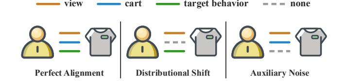
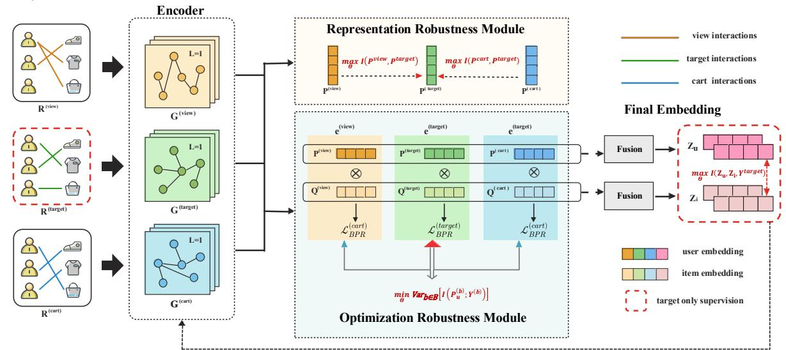
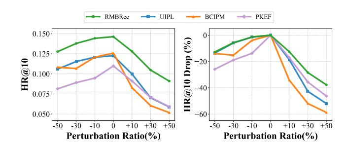
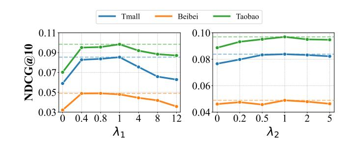
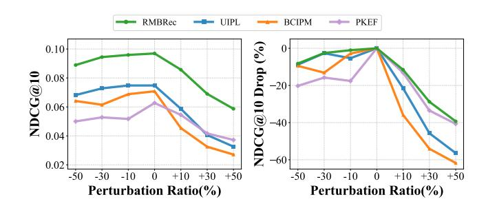

# RMBRec: Robust Multi-Behavior Recommendation towards Target Behaviors

Miaomiao Cai National University of Singapore Singapore, Singapore cmm.hfut@gmail.com

Zhijie Zhang Hefei University of Technology Hefei, China zhijiezhang021@gmail.com

Junfeng Fang National University of Singapore Singapore, Singapore fangjf1997@gmail.com

Zhiyong Cheng Hefei University of Technology Hefei, China jason.zy.cheng@gmail.com

Xiang Wang University of Science and Technology of China Hefei, China xiangwang1223@gmail.com

Meng Wang∗ Hefei University of Technology Hefei, China eric.mengwang@gmail.com

# Abstract

Multi-behavior recommendation faces a critical challenge in practice: auxiliary behaviors (e.g., clicks, carts) are often noisy, weakly correlated, or semantically misaligned with the target behavior (e.g., purchase), which leads to biased preference learning and suboptimal performance. While existing methods attempt to fuse these heterogeneous signals, they inherently lack a principled mechanism to ensure robustness against such behavioral inconsistency.

In this work, we propose Robust Multi-Behavior Recommendation towards Target Behaviors (RMBRec), a robust multi-behavior recommendation framework grounded in an information-theoretic robustness principle. We interpret robustness as a joint process of maximizing predictive information while minimizing its variance across heterogeneous behavioral environments. Under this perspective, the Representation Robustness Module (RRM) enhances local semantic consistency by maximizing the mutual information between users' auxiliary and target representations, whereas the Optimization Robustness Module (ORM) enforces global stability by minimizing the variance of predictive risks across behaviors, which is an efficient approximation to invariant risk minimization. This local–global collaboration bridges representation purification and optimization invariance in a theoretically coherent way. Extensive experiments on three real-world datasets demonstrate that RMBRec not only outperforms state-of-the-art methods in accuracy but also maintains remarkable stability under various noise perturbations. For reproducibility, our code is available at [https://github.com/miaomiao-cai2/RMBRec/.](https://github.com/miaomiao-cai2/RMBRec/)

# CCS Concepts

• Information systems → Recommender systems.

© 2026 Copyright held by the owner/author(s). ACM ISBN 979-8-4007-2307-0/2026/04 <https://doi.org/10.1145/3774904.3792617>

# Keywords

Multi-behavior Recommendation, Robustness, Invariance Learning, Contrastive Learning

#### ACM Reference Format:

Miaomiao Cai, Zhijie Zhang, Junfeng Fang, Zhiyong Cheng, Xiang Wang, and Meng Wang. 2026. RMBRec: Robust Multi-Behavior Recommendation towards Target Behaviors. In Proceedings of the ACM Web Conference 2026 (WWW '26), April 13–17, 2026, Dubai, United Arab Emirates. ACM, New York, NY, USA, [12](#page-11-0) pages.<https://doi.org/10.1145/3774904.3792617>

### 1 Introduction

Recommender systems (RS) have become essential tools of the Web ecosystem [\[11,](#page-8-0) [48,](#page-8-1) [60\]](#page-9-0), helping users discover preferred items, news, or services from massive candidate pools [\[8,](#page-8-2) [14\]](#page-8-3). Traditional studies usually focus on a single type of feedback (e.g., clicks or purchases), a setting often referred to as single-behavior recommendation [\[10,](#page-8-4) [27,](#page-8-5) [39\]](#page-8-6). However, user interactions in real-world scenarios are inherently multi-dimensional, including view, collect, add-to-cart, and purchase behaviors [\[18,](#page-8-7) [19,](#page-8-8) [23,](#page-8-9) [35\]](#page-8-10). Leveraging such heterogeneous feedback, known as multi-behavior recommendation, can enrich supervision and improve the prediction of target behaviors (e.g., purchases) [\[46\]](#page-8-11).

Despite this potential, most existing multi-behavior recommendation works rely on fusion-based paradigm, which learns behaviorspecific embeddings and aggregates them through concatenation [\[10,](#page-8-4) [20\]](#page-8-12), MLPs [\[15,](#page-8-13) [18\]](#page-8-7), or attention mechanisms [\[23,](#page-8-9) [35,](#page-8-10) [36\]](#page-8-14). In practice, however, auxiliary interactions (e.g., view or cart) are often noisy or weakly correlated with the target behavior [\[7,](#page-8-15) [18,](#page-8-7) [41,](#page-8-16) [59\]](#page-9-1). Users may casually browse or add items to carts without genuine purchase intent, introducing inconsistent supervision signals that distort the learned preference space. As a result, multi-behavior recommenders tend to overfit spurious correlations rather than capture true purchasing intent, leading to poor robustness in realworld environments [\[37,](#page-8-17) [40\]](#page-8-18). This vulnerability mainly arises from two types of inconsistencies, as shown in Figure [1.](#page-1-0) (1) Distributional shift: some users directly purchase without performing auxiliary actions, causing the distributions of auxiliary and target behaviors to diverge [\[7,](#page-8-15) [51\]](#page-8-19). (2) Auxiliary noise: many auxiliary interactions (e.g., random views or abandoned carts) are unrelated to real purchase intent [\[58,](#page-9-2) [59\]](#page-9-1). These two factors jointly create

∗Corresponding Authors.

[This work is licensed under a Creative Commons Attribution 4.0 International License.](https://creativecommons.org/licenses/by/4.0) WWW '26, Dubai, United Arab Emirates

Figure 1: Illustration of distributional shift and auxiliary noise in multi-behavior recommendation.

semantic misalignment across behaviors, making naive fusion of heterogeneous signals unreliable.

To quantify the severity of such misalignment, we introduce a diagnostic metric called the Behavioral Alignment Ratio (BAR), which measures the degree to which each auxiliary behavior aligns with the target one. BAR reveals significant disparities across datasets, indicating that auxiliary signals differ in reliability. For example, in some datasets nearly all purchases follow auxiliary actions (high BAR), while in others the majority of purchases occur independently (low BAR). This observation highlights an insight that a robust model must exploit well-aligned signals while resisting noisy or misaligned ones. From an information-theoretic perspective [\[47,](#page-8-20) [53\]](#page-8-21), robustness in multi-behavior learning requires maximizing the predictive information from reliable behaviors while minimizing the influence of noisy or distributionally shifted ones.

To achieve this goal, we propose Robust Multi-Behavior Recommendation towards Target Behaviors (RMBRec), whose core motivation is that auxiliary behaviors differ widely in both semantic relevance and noise level. Guided by this principle, we design two collaborative modules that jointly enhance robustness from local semantic consistency to global optimization stability, grounded in an information-theoretic robustness formulation [\[47,](#page-8-20) [53\]](#page-8-21).

(1) Representation Robustness Module (RRM). Instead of treating all behavior-specific embeddings equally, we anchor the entire representation learning process on the target behavior. Specifically, we propose a target-oriented contrastive learning objective that operates solely on user embeddings, based on the key insight that semantic drift primarily occurs in user representations. While items maintain relatively stable characteristics across different behaviors (an item's properties remain consistent whether it is viewed, carted, or purchased), user intent and preference expression vary significantly across behavior types. A user may casually view or add items to cart without genuine purchase intent, creating semantic inconsistency in their representation across behaviors. Our contrastive objective pulls the user embeddings from auxiliary behaviors (e.g., view, cart) closer to their counterpart from the target behavior (purchase), while pushing away embeddings from irrelevant users. This process can be viewed as maximizing the mutual information between auxiliary and target representations, thereby enforcing local semantic consistency and purifying noisy supervision signals where misalignment is most severe.

(2) Optimization Robustness Module (ORM). We further view each behavior type (view, cart, etc.) as a distinct behavioral environment with its own distribution and noise pattern. Drawing inspiration from invariant learning [\[2,](#page-8-22) [31,](#page-8-23) [54\]](#page-9-3), we introduce a regularization term that enforces the model to learn invariant user preferences across these environments. From an informationtheoretic perspective [\[47,](#page-8-20) [53\]](#page-8-21), ORM aims to minimize the variance of predictive information across behaviors, ensuring that the captured patterns correspond to stable and causal preference factors rather than behavior-specific shortcuts. Through invariance regularization, ORM provides global optimization stability and prevents the model from overfitting to any particular behavioral distribution.

To this end, RRM and ORM form a unified robustness framework that bridges local semantic consistency and global optimization stability. They jointly implement the principle of maximizing predictive information while minimizing its variance across heterogeneous behaviors, offering a principled solution to behavioral noise and misalignment in multi-behavior recommendation. We conduct extensive experiments on three real-world datasets. The results demonstrate that RMBRec significantly outperforms state-ofthe-art baselines. More importantly, extensive ablation and noiseinjection experiments are conducted to validate the robustness of our model against noisy environments. The main contributions are summarized as follows:

- We propose a target-anchored contrastive learning mechanism to purify auxiliary behaviors and enhance local semantic consistency on the user side with the target behavior in the representation space.
- We introduce an invariant optimization regularizer that treats different behaviors as heterogeneous environments, thereby ensuring global optimization stability and enhanced robustness against noisy supervision.
- We demonstrate that RMBRec achieves superior accuracy and robustness over state-of-the-art baselines on three datasets. Its effectiveness is further validated through in-depth ablation studies and noise-injection tests.

# 2 Related Works

Multi-Behavior Recommendation. Multi-behavior recommendation (MBR) models user preferences by leveraging heterogeneous interactions such as view, cart, and purchase [\[15,](#page-8-13) [23\]](#page-8-9). Early methods extend matrix factorization or collaborative filtering by sharing latent factors across behaviors [\[15\]](#page-8-13). With the advancement of graph neural networks (GNNs), subsequent studies construct behaviorspecific graphs and perform cross-behavior propagation to capture high-order user–item dependencies [\[12,](#page-8-24) [23,](#page-8-9) [32,](#page-8-25) [50\]](#page-8-26). Attention-based approaches further adaptively weigh different behaviors to enhance flexibility [\[36,](#page-8-14) [52\]](#page-8-27). Despite their effectiveness, most existing MBR methods implicitly assume that auxiliary behaviors are semantically consistent with the target behavior. In practice, however, auxiliary interactions are often noisy or weakly correlated with target preferences (e.g., frequent views without purchases), which may introduce biased supervision and degrade robustness [\[16,](#page-8-28) [21,](#page-8-29) [29,](#page-8-30) [30,](#page-8-31) [34\]](#page-8-32).

Contrastive Learning for Multi-Behavior Recommendation. To enhance robustness against noisy or insufficient supervision, recent recommendation research has widely adopted contrastive learning to regularize latent representations through auxiliary consistency signals [\[4](#page-8-33)[–6,](#page-8-34) [13,](#page-8-35) [45\]](#page-8-36). In single-behavior settings, SimGCL [\[56\]](#page-9-4) improves robustness and generalization by perturbing user and item embeddings with stochastic noise and enforcing InfoNCE-based contrastive consistency. Building on this paradigm, contrastive learning has been extended to multi-behavior recommendation, where heterogeneous behaviors are modeled via graph

propagation or shared latent structures. Representative methods such as CRGCN [\[50\]](#page-8-26) and MB-CGCN [\[12\]](#page-8-24) refine cross-behavior dependencies through cascading or residual propagation, while PKEF [\[36\]](#page-8-14) adopts a parallel expert fusion framework to disentangle and balance heterogeneous behavior signals. Furthermore, self-supervised approaches including S-MBRec [\[17\]](#page-8-37), MBSSL [\[49\]](#page-8-38), and MISSL [\[46\]](#page-8-11) introduce intra- and inter-behavior contrastive objectives to enhance semantic consistency and optimization stability under noisy supervision. Meanwhile, BCIPM [\[52\]](#page-8-27) incorporates behavior-contextualized preference modeling to filter taskirrelevant signals. Despite these advances, most existing methods still regularize representations via contrastive or reconstruction objectives, implicitly assuming consistent cross-behavior semantics, and thus remain limited in exploiting intrinsic behavioral heterogeneity to address behavior-induced optimization instability and achieve robust generalization.

Invariant Learning for Multi-Behavior Recommendation. Invariant representation learning [\[2,](#page-8-22) [28\]](#page-8-39) aims to identify causal factors that remain stable across different environments, thereby improving robustness under distributional shifts. This principle has recently been explored in recommendations to mitigate bias and domain shift [\[31,](#page-8-23) [54,](#page-9-3) [57\]](#page-9-5). UIPL [\[51\]](#page-8-19) follows the invariant risk minimization (IRM) framework to learn user-invariant preferences from multi-behavior data. It constructs synthetic environments by combining multiple behaviors and employs a variational autoencoder (VAE) [\[26\]](#page-8-40)to generate latent invariant representations optimized. However, the environments in UIPL are artificially constructed rather than derived from the naturally heterogeneous behavioral environments inherent in multi-behavior recommendation. Moreover, its generative framework introduces considerable modeling complexity and constrains invariance to the representation space, without addressing the optimization instability across behaviors.

In summary, while prior studies have enhanced robustness through denoising, contrastive, or representation-level invariance, they typically assume consistent cross-behavior semantics and overlook the potential of leveraging natural behavioral heterogeneity to achieve optimization-level stability and robust generalization across diverse behaviors in real-world settings.

### 3 Model

In this section, we present the proposed RMBRec framework. As illustrated in Figure [2,](#page-3-0) our model consists of two complementary modules operating at different levels to enhance robustness: (1) the Representation Robustness Module (RRM), which ensures local semantic consistency by maximizing the mutual information between auxiliary and target representations; and (2) the Optimization Robustness Module (ORM), which enforces global optimization stability by minimizing the variance of predictive risks across behavioral environments. Together, they instantiate the information-theoretic [\[47,](#page-8-20) [53\]](#page-8-21) robustness principle of maximizing predictive information while minimizing its variance across heterogeneous behaviors.

### 3.1 Multi-Behavior Encoding

Let U and I denote the sets of users and items, respectively. Each user �� ∈ U may interact with item �� ∈ I through multiple types of behaviors B = {��������, ��������������, ������ − ���� − ��������, ��������ℎ������, . . .}, with purchase as the target behavior. For each behavior �� ∈ B, the interaction matrix is denoted as R (��) ∈ {0, 1} |U |× | I |. Our goal is to learn unified user and item embeddings z�� and z�� that effectively predict target behavior interactions. We begin by initializing the user embedding matrix Z�� ∈ R |U |×�� and item embedding matrix Z�� ∈ R | I |×�� , which serves as the foundation for multi-behavior representation learning.

For each behavior type �� ∈ B, we employ an encoder �� (·) to learn behavior-specific representations. The encoding process generates behavior-specific user and item embedding matrices from the interaction graph and unified embeddings:

P (��) , Q (��) = �� (R (��) , Z��, Z��), (1)

where P (��) ∈ R |U |×�� and Q(��) ∈ R | I |×�� are the behavior-specific user and item embedding matrices for behavior ��, respectively. In our implementation, we choose LightGCN as the encoder due to its effectiveness and efficiency in capturing high-order collaborative signals through simplified graph propagation [\[20,](#page-8-12) [44\]](#page-8-41).

For each behavior��, we compute a behavior-specific BPR loss [\[39\]](#page-8-6) to capture the preference relationships within that behavior:

L (��) ������ = − 1 |O(��)+| ∑︁ (��,��,��) ∈ O(��)+ log �� p (��) ⊤ q (��) �� − p (��) ⊤ q (��) �� , (2)

where O (��)+ = {(��,��, ��) | R (��) ��,�� = 1, R (��) ��,�� = 0} contains training triplets for behavior ��, p (��) �� denotes the row vector of user �� in P (��) , and ��(·) is the sigmoid function.

### 3.2 Representation Robustness Module (RRM)

In multi-behavior recommendation, semantic drift is inherently user-centric. While item properties remain invariant across behaviors (e.g., an item's intrinsic attributes stay consistent whether it is merely viewed or purchased), user intent varies significantly. For example, users may casually browse or add items to carts without genuine purchase intention, which induces stochastic noise and semantic drift specifically in user representations. To address this user-side misalignment, we introduce RRM to enhance local semantic consistency. It maximizes the predictive information between auxiliary and target user representations, i.e., ��(�� (��) �� ; �� (��) �� ), ensuring that the learned embeddings retain target-relevant signals while suppressing behavior-specific noise. In particular, RRM realizes this objective via a target-anchored contrastive formulation.

Inspired by the success of contrastive learning in alignment representation learning [\[24,](#page-8-42) [42,](#page-8-43) [47,](#page-8-20) [55\]](#page-9-6), we design a target-anchored contrastive alignment objective to solely guide auxiliary user embeddings toward the target semantics. Specifically, for each user ��, the target-behavior embedding p (������������) �� serves as a reliable anchor that reflects genuine intent. For any auxiliary behavior �� ∈ B������ , we construct a positive pair (p (��) �� , p (������������) �� ) to enforce semantic alignment between auxiliary and target representations. The negative samples are embeddings of other users under the same auxiliary behavior �� within the same mini-batch, i.e., (p (��) �� , p (��) ′ ) with �� ′ ≠ ��. This in-batch sampling strategy avoids the need for a global memory bank and focuses optimization on user representations

Table 2: Overall performance comparison in terms of HR@K and NDCG@K, where �� = 10 and �� = 20. The best results are highlighted in bold, and the second-best are underlined. Results marked with \* indicate statistical significance with ��-value &lt; 0.05 over the best baseline (paired t-test).

| Dataset Metric | Single-Behavior LightGCN | Models SimGCL | CRGCN  | MB-CGCN | PKEF   | Multi-Behavior BCIPM | Models MISSL | S-MBRec | MBSSL  | UIPL   | RMBRec  | Ours Imp. |
|----------------|--------------------------|---------------|--------|---------|--------|----------------------|--------------|---------|--------|--------|---------|-----------|
| HR@10          | 0.0253                   | 0.0400        | 0.1142 | 0.0989  | 0.1098 | 0.1257               | 0.0782       | 0.0568  | 0.0861 | 0.1225 | 0.1462* | 16.3%     |
| NDCG@10 Taobao | 0.0137                   | 0.0236        | 0.0632 | 0.0471  | 0.0627 | 0.0708               | 0.0629       | 0.0328  | 0.0480 | 0.0748 | 0.0969* | 29.5%     |
| HR@20          | 0.0364                   | 0.0522        | 0.1477 | 0.1368  | 0.1223 | 0.1723               | 0.1134       | 0.0891  | 0.1247 | 0.1567 | 0.1766* | 2.5%      |
| NDCG@20        | 0.0178                   | 0.0265        | 0.0773 | 0.0595  | 0.0651 | 0.0833               | 0.0759       | 0.0411  | 0.0579 | 0.0834 | 0.1046* | 25.4%     |
| HR@10          | 0.0379                   | 0.0709        | 0.0840 | 0.1083  | 0.1138 | 0.1418               | 0.0691       | 0.0694  | 0.0760 | 0.1484 | 0.1549* | 4.3%      |
| NDCG@10 TMall  | 0.0205                   | 0.0399        | 0.0442 | 0.0426  | 0.0642 | 0.0743               | 0.0552       | 0.0362  | 0.0421 | 0.0819 | 0.0838* | 2.3%      |
| HR@20          | 0.0486                   | 0.1018        | 0.1238 | 0.1370  | 0.1676 | 0.2025               | 0.1012       | 0.1009  | 0.1113 | 0.2005 | 0.2132* | 5.2%      |
| NDCG@20        | 0.0231                   | 0.0487        | 0.0540 | 0.0523  | 0.0562 | 0.0891               | 0.0667       | 0.0438  | 0.0509 | 0.0946 | 0.0982* | 3.8%      |
| HR@10          | 0.0383                   | 0.0420        | 0.0539 | 0.0579  | 0.0813 | 0.0670               | 0.0569       | 0.0489  | 0.0626 | 0.0731 | 0.0924* | 13.6%     |
| NDCG@10 Beibei | 0.0207                   | 0.0210        | 0.0259 | 0.0381  | 0.0421 | 0.0331               | 0.0391       | 0.0253  | 0.0352 | 0.0377 | 0.0489* | 16.1%     |
| HR@20          | 0.0607                   | 0.0665        | 0.0944 | 0.1073  | 0.1213 | 0.1014               | 0.0850       | 0.0770  | 0.0935 | 0.1131 | 0.1362* | 12.2%     |
| NDCG@20        | 0.0262                   | 0.0273        | 0.0361 | 0.0428  | 0.0525 | 0.0451               | 0.0499       | 0.0324  | 0.0419 | 0.0482 | 0.0599* | 14.1%     |

Table 3: Ablation study of RMBRec on three datasets in terms of HR@10 and NDCG@10. Values in parentheses indicate relative drops compared to the full model.

| Model  | Variant     |         | Taobao   |         |          |        |          | TMall   |          |         |          | Beibei  |          |
|--------|-------------|---------|----------|---------|----------|--------|----------|---------|----------|---------|----------|---------|----------|
|        |             | HR@10   |          | NDCG@10 |          | HR@10  |          | NDCG@10 |          | HR@10   |          | NDCG@10 |          |
| RMBRec |             | 0.1462* |          | 0.0969* |          |        | 0.1549*  |         | 0.0838*  | 0.0924* |          | 0.0489* |          |
| w/o    | RRM         | 0.1089  | (-25.5%) | 0.0702  | (-27.5%) | 0.1083 | (-30.1%) | 0.0589  | (-29.7%) | 0.0667  | (-27.8%) | 0.0321  | (-34.3%) |
| w/o    | ORM         | 0.1321  | (-9.6%)  | 0.0887  | (-8.4%)  | 0.1360 | (-12.2%) | 0.0766  | (-8.6%)  | 0.0871  | (-5.7%)  | 0.0461  | (-5.7%)  |
| w/o    | View        | 0.1093  | (-25.2%) | 0.0758  | (-21.7%) | 0.0686 | (-55.7%) | 0.0411  | (-51.0%) | 0.0789  | (-14.6%) | 0.0425  | (-12.9%) |
| w/o    | Add-to-cart | 0.1016  | (-30.5%) | 0.0603  | (-37.7%) | 0.1895 | (+22.3%) | 0.1043  | (+24.5%) | 0.0571  | (-38.1%) | 0.0294  | (-39.7%) |

behavioral characteristics. On Taobao, where auxiliary behaviors are moderately noisy, RMBRec achieves substantial gains ( +29.5% on NDCG@10). On TMall, where behaviors are weakly correlated with the target, it maintains competitive performance without degradation. Even on the clean and well-structured Beibei, it continues to outperform all baselines. These results highlight the strong generalization ability of RMBRec and its robustness to varying behavior quality and distributional patterns.

#### 4.3 Ablation Study

To better understand the contribution of each component in RM-BRec, we conduct ablation experiments at both the module and behavior levels. At the module level, we remove the Representation Robustness Module (RRM) and the Optimization Robustness Module (ORM) to isolate their respective effects on local and global robustness. At the behavior level, we remove individual auxiliary behaviors (view and add-to-cart) to examine how different interaction types contribute to target behavior prediction. The results are summarized in Table [3.](#page-6-1)

- Both RRM and ORM are essential for robustness, jointly enhancing performance through local–global collaboratively. Removing either module leads to consistent performance degradation across all datasets. Eliminating RRM causes a sharp decline (e.g., Taobao: −25.5% HR@10, −27.5% NDCG@10), verifying that local semantic consistency via contrastive learning is crucial for

mitigating semantic drift in auxiliary behaviors. Similarly, removing ORM also degrades results (e.g., TMall: −12.2% HR@10), showing that global invariance regularization effectively stabilizes learning across heterogeneous behavioral environments. These results confirm that RRM and ORM work in a collaborative manner: RRM focuses on local semantic consistency, while ORM provides global optimization stability, and their joint optimization yields the most robust performance.

- Auxiliary behaviors substantially enhance recommendation performance in most cases. Removing auxiliary interactions generally leads to notable drops in both HR@10 and NDCG@10, indicating that multi-behavior information provides valuable complementary supervision. For example, removing view interactions on Taobao reduces HR@10 by 25.2%, and removing add-to-cart on Beibei causes a 38.1% decline. These results demonstrate that auxiliary signals can significantly enrich user representation learning and that RMBRec can effectively extract useful information from them through target-anchored alignment and invariance optimization.
- Performance degradation from noisy auxiliary behaviors. We observe that incorporating certain auxiliary behaviors can, counter-intuitively, harm performance. A notable example is on the TMall dataset, where removing the add-to-cart behavior results in a significant performance gain (HR@10 +22.3%). This phenomenon is consistent with its extremely low Behavioral Alignment Ratio (BAR = 0.0012), indicating a severe semantic

Figure 3: Robustness analysis under different perturbation ratios on the Taobao dataset (HR@10).

misalignment with the target purchase behavior. In such cases, the auxiliary signal acts primarily as noise, leading to negative transfer. The fact that RMBRec maintains robust performance even in the presence of such misleading signals underscores the effectiveness of its RRM-ORM collaborative design. This finding critically highlights the necessity for future designs to move beyond uniform behavior integration towards more adaptive or selective mechanisms.

We further investigate the impact of different invariance regularization strategies for the ORM module. Empirical results (detailed in Section [C.3\)](#page-11-1) demonstrate that Risk Extrapolation (REx) [\[28\]](#page-8-39) consistently outperforms gradient-based IRM variants (IRM-V1 and IRM-V2) by enforcing risk consistency across heterogeneous behaviors. Consequently, we adopt REx to ensure global optimization stability in RMBRec.

### 4.4 Robustness Study

To further examine the robustness of RMBRec under noisy environments, we conduct a controlled perturbation study on the Taobao dataset by randomly modifying auxiliary behavior interactions. Specifically, we randomly add 10%, 30%, and 50% new edges to simulate spurious behaviors and remove 10%, 30%, and 50% existing edges to simulate missing auxiliary information, enabling evaluation under both over- and under-observed conditions. We compare RMBRec with three competitive multi-behavior baselines—UIPL [\[51\]](#page-8-19), BCIPM [\[52\]](#page-8-27), and PKEF [\[36\]](#page-8-14)—that perform strongly under standard settings.

As shown in Figure [3,](#page-7-0) the left plot reports absolute performance (HR@10), while the right plot shows the relative drop ratio compared to the noise-free condition. RMBRec consistently achieves the best performance across all perturbation ratios, regardless of whether noise is introduced by excessive or missing interactions, and exhibits a substantially smaller performance decline than competing methods. This robustness arises from the collaborative effect of the Representation Robustness Module (RRM), which suppresses semantically drifted auxiliary behaviors, and the Optimization Robustness Module (ORM), which enforces global invariance across disturbed behavioral environments, enabling stable and reliable recommendation performance under severe noise.

# 4.5 Hyperparameter Sensitivities

We study the sensitivity of the two key hyperparameters in RMBRec , ��1 and ��2, which control the weights of contrastive alignment and

Figure 4: Hyperparameter sensitivity analysis of RM-BRec with ��1 and ��2.

invariance regularization. They jointly determine the balance between local semantic consistency and global optimization stability. The results are shown in Figure [4.](#page-7-1)

Across all datasets, performance first increases as ��1 and ��2 grow from small values, indicating that both modules effectively enhance robustness by aligning auxiliary behaviors locally and stabilizing optimization globally. This verifies the complementary roles of RRM and ORM in improving resistance to noisy or misaligned supervision. However, when either weight becomes overly large, the auxiliary objectives dominate the main recommendation loss, leading to performance degradation. These findings suggest that robustness in multi-behavior recommendation relies not on maximizing auxiliary regularization, but on maintaining a balanced integration between local alignment and global invariance.

### 5 Conclusion and Future Work

In this paper, we tackled the challenge of behavioral misalignment and noise in multi-behavior recommendation. Unlike prior fusion-based methods, we proposed RMBRec, a target-centric framework that enhances robustness through a local–global collaborative mechanism: the Representation Robustness Module (RRM) enforces local semantic consistency via target-anchored contrastive alignment, while the Optimization Robustness Module (ORM) ensures global optimization stability by learning invariant user preferences across behavioral environments. Extensive experiments on three real-world datasets verified the superiority of RMBRec in both accuracy and robustness. Moreover, the proposed Behavioral Alignment Ratio (BAR) offers a simple yet effective diagnostic metric for quantifying behavioral consistency and guiding robustness-oriented model design.

Although RMBRec shows strong robustness, our analysis also reveals open challenges. On TMall, the noisy add-to-cart behavior still degrades performance, suggesting that alignment may be suboptimal under weak behavioral correlations. Future work will explore adaptive alignment guided by data characteristics (e.g., BAR) to selectively emphasize informative signals. We also plan to extend the proposed local–global robustness framework to model temporal dynamics and broader multi-source recommendation scenarios.

# Acknowledgments

This research is supported by the New Cornerstone Science Foundation through the XPLORER PRIZE and the National Natural Science Foundation of China (No. 62272254, No. U25A20445, No. 72188101).

- References [1] Kartik Ahuja, Karthikeyan Shanmugam, Kush Varshney, and Amit Dhurandhar. 2020. Invariant risk minimization games. ICML (2020), 145–155. [2] Martin Arjovsky, Léon Bottou, Ishaan Gulrajani, and David Lopez-Paz. 2019. Invariant risk minimization. arXiv (2019). [3] Haoyue Bai, Le Wu, Min Hou, Miaomiao Cai, Zhuangzhuang He, Yuyang Zhou, Richang Hong, and Meng Wang. 2024. Multimodality invariant learning for multimedia-based new item recommendation. SIGIR (2024), 677–686. [4] Miaomiao Cai, Lei Chen, Yifan Wang, Haoyue Bai, Peijie Sun, Le Wu, Min Zhang, and Meng Wang. 2024. Popularity-Aware Alignment and Contrast for Mitigating Popularity Bias. In Proceedings of the 30th ACM SIGKDD Conference on Knowledge Discovery and Data Mining. 187–198. [5] Miaomiao Cai, Lei Chen, Yifan Wang, Zhiyong Cheng, Min Zhang, and Meng Wang. 2026. Graph-Structured Driven Dual Adaptation for Mitigating Popularity Bias. IEEE TKDE (2026), 1129–1143. [6] Miaomiao Cai, Min Hou, Lei Chen, Le Wu, Haoyue Bai, Yong Li, and Meng Wang. 2024. Mitigating Recommendation Biases via Group-Alignment and Global-Uniformity in Representation Learning. ACM Transactions on Intelligent Systems and Technology (2024). [7] Wei Cai, ZhiHong Zheng, Xuan Zhang, Weiyi Shang, Yubin Ma, WenJie Gao, and Zhi Jin. 2025. Neighborhood structure enhancement and denoising method for multi-behavior recommendation. Neural Networks (2025), 107760. [8] Chong Chen, Min Zhang, Chenyang Wang, Weizhi Ma, Minming Li, Yiqun Liu, and Shaoping Ma. 2019. An efficient adaptive transfer neural network for socialaware recommendation. SIGIR (2019), 225–234. [9] Huilin Chen, Miaomiao Cai, Fan Liu, Zhiyong Cheng, Richang Hong, and Meng Wang. 2025. I3-MRec: Invariant Learning with Information Bottleneck for Incomplete Modality Recommendation. MM (2025), 6133–6142. [10] Lei Chen, Le Wu, Richang Hong, Kun Zhang, and Meng Wang. 2020. Revisiting Graph based Collaborative Filtering: A Linear Residual Graph Convolutional Network Approach. AAAI 34, 01 (2020), 27–34. [11] Zhiyong Cheng, Ying Ding, Lei Zhu, and Mohan Kankanhalli. 2018. Aspectaware latent factor model: Rating prediction with ratings and reviews. In WWW. 639–648. [12] Zhiyong Cheng, Sai Han, Fan Liu, Lei Zhu, Zan Gao, and Yuxin Peng. 2023. Multibehavior recommendation with cascading graph convolution networks. WWW (2023), 1181–1189. [13] Ching-Yao Chuang, R Devon Hjelm, Xin Wang, Vibhav Vineet, Neel Joshi, Antonio Torralba, Stefanie Jegelka, and Yale Song. 2022. Robust contrastive learning against noisy views. CVPR (2022), 16670–16681. [14] Paul Covington, Jay Adams, and Emre Sargin. 2016. Deep neural networks for youtube recommendations. RecSys (2016), 191–198. [15] Chen Gao, Xiangnan He, Dahua Gan, Xiangning Chen, Fuli Feng, Yong Li, Tat-Seng Chua, Lina Yao, Yang Song, and Depeng Jin. 2019. Learning to recommend with multiple cascading behaviors. TKDE (2019), 2588–2601. [16] Yunjun Gao, Yuntao Du, Yujia Hu, Lu Chen, Xinjun Zhu, Ziquan Fang, and Baihua Zheng. 2022. Self-guided learning to denoise for robust recommendation. SIGIR (2022), 1412–1422. [17] Shuyun Gu, Xiao Wang, Chuan Shi, and Ding Xiao. 2022. Self-supervised Graph Neural Networks for Multi-behavior Recommendation. IJCAI (2022), 2052–2058. [18] Yongqiang Han, Hao Wang, Kefan Wang, Likang Wu, Zhi Li, Wei Guo, Yong Liu, Defu Lian, and Enhong Chen. 2024. Efficient noise-decoupling for multi-behavior sequential recommendation. WWW (2024), 3297–3306. [19] Jinle He, Chengyong Yang, Jiayi Liu, and Jianlin Cheng. 2024. Denoising Long-Tail Augmented Contrastive Network for Multi-Behavior Recommendation. IEEE Access (2024). [20] Xiangnan He, Kuan Deng, Xiang Wang, Yan Li, Yongdong Zhang, and Meng Wang. 2020. LightGCN: Simplifying and Powering Graph Convolution Network for Recommendation. SIGIR (2020), 639–648. [21] Zhuangzhuang He, Yifan Wang, Yonghui Yang, Peijie Sun, Le Wu, Haoyue Bai, Jinqi Gong, Richang Hong, and Min Zhang. 2024. Double correction framework for denoising recommendation. KDD (2024), 1062–1072. [22] Jonathan L Herlocker, Joseph A Konstan, Loren G Terveen, and John T Riedl. 2004. Evaluating collaborative filtering recommender systems. TOIS (2004), 5–53. [23] Bowen Jin, Chen Gao, Xiangnan He, Depeng Jin, and Yong Li. 2020. Multibehavior recommendation with graph convolutional networks. SIGIR (2020), 659–668. [24] Prannay Khosla, Piotr Teterwak, Chen Wang, Aaron Sarna, Yonglong Tian, Phillip Isola, Aaron Maschinot, Ce Liu, and Dilip Krishnan. 2020. Supervised contrastive learning. NeurIPS (2020), 18661–18673. [25] Diederik P Kingma and Jimmy Ba. 2015. Adam: A method for stochastic optimization. ICLR (2015). [26] Diederik P Kingma and Max Welling. 2013. Auto-encoding variational bayes. ICLR (2013). [27] Yehuda Koren, Robert M. Bell, and Chris Volinsky. 2009. Matrix Factorization Techniques for Recommender Systems. Computer 42, 8 (2009), 30–37. [28] David Krueger, Ethan Caballero, Jörn-Henrik Jacobsen, Amy Zhang, Jonathan Binas, Dinghuai Zhang, Remi Le Priol, and Aaron Courville. 2021. Out-of-Distribution Generalization via Risk Extrapolation. ICML (2021), 5815–5826. [29] Haoxuan Li, Quanyu Dai, Yuru Li, Yan Lyu, Zhenhua Dong, Xiao-Hua Zhou, and Peng Wu. 2023. Multiple robust learning for recommendation. AAAI (2023), 4417–4425. [30] Weijie Li, Wei Yang, Yuenan Hou, Li Liu, Yongxiang Liu, and Xiang Li. 2025. SARATR-X: Toward Building a Foundation Model for SAR Target Recognition. IEEE TIP (2025), 869–884. [31] Yuxin Liao, Yonghui Yang, Min Hou, Le Wu, Hefei Xu, and Hao Liu. 2025. Mitigating distribution shifts in sequential recommendation: An invariance perspective. SIGIR (2025), 1603–1613. [32] Fan Liu, Zhiyong Cheng, Lei Zhu, Zan Gao, and Liqiang Nie. 2021. Interest-aware message-passing GCN for recommendation. In WWW. 1296–1305. [33] Jiashuo Liu, Zheyan Shen, Yue He, Xingxuan Zhang, Renzhe Xu, Han Yu, and Peng Cui. 2021. Towards out-of-distribution generalization: A survey. arXiv (2021). [34] Li Liu, Songyang Lao, Paul W. Fieguth, Yulan Guo, Xiaogang Wang, and Matti Pietikäinen. 2016. Median Robust Extended Local Binary Pattern for Texture Classification. IEEE TIP (2016), 1368–1381. [35] Gang-Feng Ma, Meng-Ang Chen, Xu-Hua Yang, Xilin Wen, Haixia Long, and Yujiao Huang. 2025. Graph Contrastive Learning for Multibehavior Recommendation. TCSS (2025). [36] Chang Meng, Chenhao Zhai, Yu Yang, Hengyu Zhang, and Xiu Li. 2023. Parallel knowledge enhancement based framework for multi-behavior recommendation. CIKM (2023), 1797–1806. [37] Michael O'Mahony, Neil Hurley, Nicholas Kushmerick, and Guénolé Silvestre. 2004. Collaborative recommendation: A robustness analysis. TOIT (2004), 344–
  - 377. [38] Adam Paszke, Sam Gross, Francisco Massa, Adam Lerer, James Bradbury, Gregory Chanan, Trevor Killeen, Zeming Lin, Natalia Gimelshein, Luca Antiga, et al. 2019. Pytorch: An imperative style, high-performance deep learning library. NeurIPS (2019). [39] Steffen Rendle, Christoph Freudenthaler, Zeno Gantner, and Lars Schmidt-Thieme. 2009. BPR: Bayesian personalized ranking from implicit feedback. UAI (2009), 452–461. [40] Bohao Wang, Jiawei Chen, Changdong Li, Sheng Zhou, Qihao Shi, Yang Gao, Yan Feng, Chun Chen, and Can Wang. 2024. Distributionally robust graph-based recommendation system. WWW (2024), 3777–3788. [41] Shuyao Wang, Zhi Zheng, Yongduo Sui, and Hui Xiong. 2025. Unleashing the Power of Large Language Model for Denoising Recommendation. WWW (2025), 252–263. [42] Tongzhou Wang and Phillip Isola. 2020. Understanding contrastive representation learning through alignment and uniformity on the hypersphere. ICML (2020), 9929–9939. [43] Wenjie Wang, Xinyu Lin, Fuli Feng, Xiangnan He, Min Lin, and Tat-Seng Chua. 2022. Causal representation learning for out-of-distribution recommendation. WWW (2022), 3562–3571. [44] Xiang Wang, Xiangnan He, Meng Wang, Fuli Feng, and Tat-Seng Chua. 2019. Neural Graph Collaborative Filtering. SIGIR (2019), 165–174. [45] Yinwei Wei, Xiang Wang, Qi Li, Liqiang Nie, Yan Li, Xuanping Li, and Tat-Seng Chua. 2021. Contrastive learning for cold-start recommendation. MM (2021), 5382–5390. [46] Binquan Wu, Yu Cheng, Haitao Yuan, and Qianli Ma. 2024. When Multi-Behavior Meets Multi-Interest: Multi-Behavior Sequential Recommendation with Multi-Interest Self-Supervised Learning. ICDE (2024), 845–858. [47] Jiancan Wu, Xiang Wang, Fuli Feng, Xiangnan He, Liang Chen, Jianxun Lian, and Xing Xie. 2020. Self-supervised Graph Learning for Recommendation. SIGIR (2020), 726–735. [48] Hefei Xu, Min Hou, Le Wu, Fei Liu, Yonghui Yang, Haoyue Bai, Richang Hong, and Meng Wang. 2025. Fair Personalized Learner Modeling Without Sensitive Attributes. In Proceedings of the ACM on Web Conference 2025. 4612–4624. [49] Jingcao Xu, Chaokun Wang, Cheng Wu, Yang Song, Kai Zheng, Xiaowei Wang, Changping Wang, Guorui Zhou, and Kun Gai. 2023. Multi-behavior selfsupervised learning for recommendation. SIGIR (2023), 496–505. [50] Mingshi Yan, Zhiyong Cheng, Chen Gao, Jing Sun, Fan Liu, Fuming Sun, and Haojie Li. 2023. Cascading residual graph convolutional network for multibehavior recommendation. TOIS (2023), 1–26. [51] Mingshi Yan, Zhiyong Cheng, Fan Liu, Yingda Lyu, and Yahong Han. 2025. User Invariant Preference Learning for Multi-Behavior Recommendation. TOIS (2025). [52] Mingshi Yan, Fan Liu, Jing Sun, Fuming Sun, Zhiyong Cheng, and Yahong Han. 2024. Behavior-contextualized item preference modeling for multi-behavior recommendation. SIGIR (2024), 946–955. [53] Yonghui Yang, Le Wu, Richang Hong, Kun Zhang, and Meng Wang. 2021. Enhanced graph learning for collaborative filtering via mutual information maximization. SIGIR (2021), 71–80.

[54] Yonghui Yang, Le Wu, Yuxin Liao, Zhuangzhuang He, Pengyang Shao, Richang Hong, and Meng Wang. 2025. Invariance matters: Empowering social recommendation via graph invariant learning. SIGIR (2025), 2038–2047. [55] Yonghui Yang, Zhengwei Wu, Le Wu, Kun Zhang, Richang Hong, Zhiqiang Zhang, Jun Zhou, and Meng Wang. 2023. Generative-Contrastive Graph Learning for Recommendation. SIGIR (2023), 1117–1126. [56] Junliang Yu, Hongzhi Yin, Xin Xia, Tong Chen, Li zhen Cui, and Quoc Viet Hung Nguyen. 2022. Are Graph Augmentations Necessary?: Simple Graph Contrastive Learning for Recommendation. SIGIR (2022), 1240–1251. [57] An Zhang, Jingnan Zheng, Xiang Wang, Yancheng Yuan, and Tat-Seng Chua. 2023. Invariant collaborative filtering to popularity distribution shift. In Proceedings of the ACM Web Conference 2023. 1240–1251. [58] Chi Zhang, Rui Chen, Xiangyu Zhao, Qilong Han, and Li Li. 2023. Denoising and prompt-tuning for multi-behavior recommendation. WWW (2023), 1355–1363. [59] Chu Zhao, Enneng Yang, Yuliang Liang, Jianzhe Zhao, Guibing Guo, and Xingwei Wang. 2025. Symmetric Graph Contrastive Learning against Noisy Views for Recommendation. TOIS (2025), 1–28. [60] Xingrui Zhuo, Shengsheng Qian, Jun Hu, Fuxin Dai, Kangyi Lin, and Gongqing Wu. 2024. Multi-Hop Multi-View Memory Transformer for Session-Based Recommendation. ACM TOIS (2024), 144:1–144:28.

### A Further Model Analysis and Discussion

#### A.1 Information-Theoretic Analysis

Let �� (��) �� denote the user embedding learned under behavior �� ∈ B, and �� (��) �� the user embedding under the target behavior. Let ���� denote the target label. From an information-theoretic viewpoint, robust multi-behavior learning should (i) maximize the shared information between auxiliary and target user representations (local purification), and (ii) stabilize the target-relevant information across heterogeneous behavioral environments (global invariance).

RRM as local MI alignment. RRM enforces a target-anchored alignment by contrasting (�� (��) �� , �� (��) �� ) with in-batch negatives. Concretely, the InfoNCE-style objective used in Eq.(3) is a lower bound estimator of the mutual information ��(�� (��) �� ; �� (��) �� ). Therefore, increasing the contrastive score improves a valid lower bound of this MI and reduces the conditional uncertainty ��(�� (��) �� | �� (��) �� ). Formally, letting sim(·, ·) be cosine similarity and �� &gt; 0 the temperature, the loss in Eq.[\(3\)](#page-3-2) satisfies

�� �� (��) �� ; �� (��) shared info ≥ E " log exp sim(�� (��) �� , �� (��) �� )/�� Í �� ′ exp sim(�� (��) �� , �� (��) ′ )/�� # ,

| {z } hence maximizing the RRM (minimizing Eq.[\(3\)](#page-3-2)) tightens a lower bound to ��(�� (��) �� ; �� (��) �� ) and purifies auxiliary representations toward target semantics.

ORM as global risk-variance invariance. While RRM focuses on enhancing the mutual information between auxiliary and target representations, ORM aims to ensure that the predictive information carried by user embeddings remains stable across behaviors. We treat each behavior �� ∈ B as a distinct environment with its own label signal �� (��) , representing behavior-specific supervision (e.g., click, cart, or purchase). Under this view, the empirical mutual information between the user representation and its local label is �� (��) = ��(�� (��) �� ;�� (��) ), and a robust model should maintain invariant predictive information across environments:

min Θ Var��∈ B-��(�� (��) �� ;�� (��) )

Since directly estimating ��(�� (��) �� ;�� (��) ) is intractable, we adopt an optimization surrogate: the empirical variance of per-behavior BPR risks. As lower risk variance indicates more consistent predictive information among behaviors, the ORM loss (Eq. [\(7\)](#page-4-0)) is:

LORM = Var {L(��) BPR}��∈ B = 1 |B| − 1 ∑︁ ��∈ B/������������ (L(��) BPR − L)¯ 2 .

This regularizer reduces the variation of training risks across behaviors, which effectively stabilizes the mutual information ��(�� (��) �� ;�� (��) ) among behavioral environments. By constraining such variation, ORM prevents the model from overfitting to behavior-specific supervision signals and encourages representations that preserve predictive information in a consistent, invariant manner.

Collaborative robustness objective. Combining the above two principles, the overall information-theoretic objective of RMBRec can be expressed as:

max Θ E��∈ Baux [��(�� (��) �� ; �� (��) �� )] (1) local MI alignment −�� Var��∈ B [��(�� (��) �� ;�� (��) )] (2) global MI invariance .

| {z } | {z } This unified formulation connects the representation and optimization level perspectives through mutual information. In particular, the first term encourages auxiliary embeddings to share consistent semantics with the target behavior (local semantic consistency), while the second term enforces cross-behavior stability of the predictive information (global optimization stability).

# A.2 Detailed Description of RMBRec Algorithm

Algorithm [1](#page-10-1) outlines the complete training procedure of RMBRec, which systematically integrates multi-behavior learning with duallevel robustness enhancement.

Complexity and Efficiency Analysis. We demonstrate that RM-BRec is efficient and scalable. Theoretically, the time complexity is dominated by the backbone encoder (O (|R|����)), which scales linearly with data size. The proposed robustness modules add minimal overhead: RRM introduces a constant cost per batch (O (|B|�� 2��)), and ORM is computationally negligible. Empirically, on the Taobao dataset, RMBRec requires 16.7s per epoch. While this is naturally higher than the lightweight LightGCN (4.9s), it is approximately 3× faster than the state-of-the-art robust baseline UIPL (51.6s). This confirms that RMBRec achieves superior performance with high training efficiency.

### B Detailed Experimental Settings

### B.1 Datasets

We provide detailed descriptions of the three datasets used in our experiments. Following established practices in prior research [\[51,](#page-8-19) [52\]](#page-8-27), we retain only the earliest occurrence of each user–item interaction to remove redundant records. The detailed statistics after preprocessing are summarized in Table [4.](#page-10-2)

- Taobao: This dataset is obtained from a widely used Chinese e-commerce platform. It records multiple types of user behaviors, including view, add-to-cart, and purchase. Taobao exhibits medium behavioral consistency, sitting between Beibei (highly aligned) and TMall (highly noisy), and provides a balanced benchmark for evaluating generalization under diverse behavioral distributions.

#### Algorithm 1: The Algorithm of RMBRec.

Input: Multi-behavior interactions {R (��) }��∈ B, learning rate ��, hyperparameters ��1, ��2; Output: Trained model parameters Θ; 1: Initialize final user embedding matrix Z�� ∈ R |U |×�� 2: Initialize final item embedding matrix Z�� ∈ R | I |×�� ; 3: for ��������ℎ = 1, 2, ...,�� do 4: for batch in user set U do 5: Step 1: Learn Behavior-Specific Embeddings 6: for each behavior �� ∈ B do 7: P (��) , Q(��) , L (��) ������ ← LightGCN(R (��) , Z��, Z��); 8: end for 9: Step 2: Representation Robustness Module 10: Calculate representation robustness loss L������ by Eqn.[\(4\)](#page-3-3); 11: Step 3: Optimization Robustness Module 12: Calculate optimization robustness loss L������ by Eqn. [\(7\)](#page-4-0); 13: Step 4: Robustness-Enhanced Fusion 14: z�� ← 1 | B | Í ��∈ B p (��) �� for each user in batch; 15: z�� ← 1 | B | Í ��∈ B q (��) for each item in batch; 16: Step 5: Target Behavior Prediction 17: Calculate main recommendation loss L�������� by Eqn. [\(9\)](#page-4-1); 18: Step 6: Model Optimization 19: Calculate total loss L ← L�������� + ��1L������ + ��2L������ ; 20: Update Θ ← Θ − �� · ∇ΘL; 21: if early stopping condition is met then 22: break; 23: end if 24: end for 25: end for 26: return trained parameters Θ.

Table 4: Statistics of the datasets used in our experiments.

| Dataset | #Users | #Items | #View     | #Collect | #Add-to-cart | #Purchase |
|---------|--------|--------|-----------|----------|--------------|-----------|
| Taobao  | 48,749 | 39,493 | 1,548,162 |          | 193,747      | 259,771   |
| TMall   | 41,738 | 11,953 | 1,813,498 | 221,514  | 1,996        | 287,158   |
| Beibei  | 21,716 | 7,977  | 2,412,586 |          | 642,622      | 304,576   |

- TMall: This dataset is collected from Tmall, one of the largest online marketplaces in China. It covers four types of behaviors, including view, collect, add-to-cart, and purchase. Unlike Beibei, TMall contains highly imbalanced and noisy auxiliary signals. For example, only a tiny fraction of add-to-cart interactions lead to purchases (BAR = 0.0012), making it ideal for evaluating robustness against noise and misalignment.
- Beibei:This dataset is collected from Beibei, an e-commerce platform specializing in maternal and infant products. It contains three types of interactions, including view, add-to-cart, and purchase. Compared to TMall and Taobao, Beibei shows highly consistent user intentions—most purchases are preceded by auxiliary actions, as confirmed by its high BAR values (view = 0.9756, cart = 0.9731).

#### B.2 Baselines

We summarize below the detailed introductions of all baselines compared in our experiments. They can be classified into two main categories: single-behavior methods, which only model the target behavior (e.g., purchases), and multi-behavior methods, which explicitly leverage auxiliary interactions. Among them, several recent approaches (SimGCL, MBSSL, UIPL) also aim to improve model robustness against noisy supervision or distributional shifts. Single-behavior Models.

- LightGCN [\[20\]](#page-8-12): A simplified graph-based collaborative filtering model that removes feature transformation and non-linear activations, effectively capturing high-order user–item relations on the interaction graph.
- SimGCL [\[56\]](#page-9-4): It introduces random embedding perturbations and an InfoNCE-based regularization. This enhances representation robustness and generalization, making it a strong baseline for robustness comparison.

#### Multi-behavior Models.

- CRGCN [\[50\]](#page-8-26): It propagates embeddings across behaviors in sequence, refining user preferences through multi-task learning that jointly optimizes auxiliary and target tasks.
- MB-CGCN [\[12\]](#page-8-24): It simplifies residual propagation and aggregates embeddings across all behaviors to strengthen target recommendation.
- PKEF [\[36\]](#page-8-14): It is a parallel knowledge fusion framework that employs a disentangled multi-expert structure to balance heterogeneous behavior distributions and reduce negative transfer effects.
- BCIPM [\[52\]](#page-8-27): It is a behavior-contextualized item preference model that leverages auxiliary interactions to enhance target recommendation while filtering out noise from irrelevant behaviors with limited invariance guarantees.
- MISSL [\[46\]](#page-8-11): It is a unified multi-behavior and multi-interest framework that employs a hypergraph transformer to extract behavior-specific and shared interests, enhanced by self-supervised contrastive learning and a behavior-aware training task for stable optimization.
- S-MBRec [\[17\]](#page-8-37): It alleviates target sparsity by introducing auxiliary contrastive objectives. It adopts a star-shaped design that provides additional training signals without explicitly modeling inter-auxiliary dependencies.
- MBSSL [\[49\]](#page-8-38): It employs both inter- and intra-behavior contrastive learning to enhance semantic consistency. It further adopts adaptive gradient balancing to maintain stable optimization, thus improving robustness.
- UIPL [\[51\]](#page-8-19): It is the first attempt to incorporate invariant risk minimization into multi-behavior recommendation. It applies a VAE-based invariance constraint. However, its synthetic environment design limits its ability to capture realistic behavioral heterogeneity under distribution shifts.

# C More Experimental Analysis

# C.1 Further Robustness Analyses

To complement the robustness analysis reported in the main text (Figure [3\)](#page-7-0), which focuses on HR@10, we additionally report the

Figure 5: Robustness analysis under different perturbation ratios on the Taobao dataset (NDCG@10).

results in terms of NDCG@10 in Figure [5.](#page-11-2) The overall trend is consistent with the HR-based findings: as the perturbation ratio increases, all models experience performance degradation, yet RM-BRec maintains the highest ranking quality and the smallest drop across all noise levels. This further confirms that the proposed Representation Robustness Module (RRM) and Optimization Robustness Module (ORM) jointly improve stability by filtering semantically drifted auxiliary behaviors and enforcing invariance across disturbed environments. The alignment between HR and NDCG results demonstrates that RMBRec achieves not only higher hit accuracy but also more reliable ranking robustness under noisy conditions across behavior types.

### C.2 Detailed Description of IRM Variants

C.2.1 Background on IRM. Invariant Risk Minimization (IRM) [\[2\]](#page-8-22) was proposed as a principle for out-of-distribution (OOD) generalization [\[33,](#page-8-49) [43\]](#page-8-50). Its key idea is that if a representation truly captures invariant and causal factors, then a single linear classifier should perform well across multiple environments [\[3,](#page-8-51) [9\]](#page-8-44). Formally, IRM aims to find a feature extractor Φ and a classifier �� such that [\[2\]](#page-8-22):

min Φ,�� ∑︁ ��∈ E �� (�� ◦ Φ), s.t. �� ∈ arg min ��˜ �� (��˜ ◦ Φ), ∀��, (12)

where �� (·) denotes the risk in environment ��. This constraint enforces that the same classifier is simultaneously optimal across environments, encouraging Φ to discard spurious correlations and preserve invariant features [\[1\]](#page-8-45). Since solving this constrained problem directly is intractable, several relaxations have been developed [\[2\]](#page-8-22). We summarize three widely used ones: IRMv1 [\[2\]](#page-8-22), IRMv2 [\[1\]](#page-8-45), and Risk Extrapolation (REx) [\[28\]](#page-8-39).

C.2.2 IRMv1. IRMv1 is the most widely adopted implementation of invariant risk minimization [\[2\]](#page-8-22). Instead of strictly enforcing the ideal constraint, it introduces a penalty that aligns the gradients of the risks with respect to the classifier across environments:

min Φ,�� ∑︁ ��∈ E �� (�� ◦ Φ) + �� · ∑︁ ��∈ E ∇��|��=1�� (�� ◦ Φ) 2 , (13)

where �� controls the strength of the penalty. This formulation encourages Φ to learn features that support a common classifier shared across environments. Although principled, the gradientbased penalty is known to be difficult to optimize, and its effectiveness may degrade in noisy or high-variance settings.

C.2.3 IRMv2. IRMv2 [\[1\]](#page-8-45) offers a simplified implementation of invariant risk minimization by fixing the classifier parameter (e.g.,

Table 5: Comparison of different invariance regularization variants in RMBRec.

| Variant | HR@10  | Taobao NDCG@10 | HR@10  | TMall NDCG@10 | HR@10  | Beibei NDCG@10 |
|---------|--------|----------------|--------|---------------|--------|----------------|
| w/o ORM | 0.1321 | 0.0887         | 0.1360 | 0.0766        | 0.0871 | 0.0461         |
| IRM-V1  | 0.1456 | 0.0962         | 0.1411 | 0.0794        | 0.0913 | 0.0483         |
| IRM-V2  | 0.1389 | 0.0938         | 0.1304 | 0.0729        | 0.0902 | 0.0478         |
| IRM-REx | 0.1462 | 0.0969         | 0.1549 | 0.0838        | 0.0924 | 0.0489         |

�� = 1) and penalizing the gradients of the risk under this fixed setting for efficiency and robustness:

min Φ ∑︁ ��∈ E �� (�� ◦ Φ) + �� ∑︁ ��∈ E ∇��|��=1�� (�� ◦ Φ) 2 . (14)

This relaxation avoids the costly bi-level optimization in the original IRM objective, making it easier to implement and computationally more stable [\[1,](#page-8-45) [31,](#page-8-23) [54\]](#page-9-3). However, since the classifier is no longer learnable, the model may lose adaptability, and the invariance constraint is only approximately enforced, which often results in weaker performance compared with IRMv1.

C.2.4 REx. Risk Extrapolation (REx) [\[28\]](#page-8-39) departs from gradient alignment and instead enforces invariance by directly minimizing the variance of risks across environments:

min Φ,�� 1 |E | ∑︁ ��∈ E �� (�� ◦ Φ) + �� · Var��∈ E �� (�� ◦ Φ) . (15)

This design encourages consistent performance across environments and avoids the optimization difficulties of IRMv1. Empirically, it tends to yield more robust and stable results, though it enforces invariance only at the risk level rather than directly constraining representations or gradients.

In summary, IRMv1 provides a principled approximation of the ideal IRM objective but suffers from optimization challenges. IRMv2 improves simplicity and efficiency at the expense of fidelity to the original principle. REx offers a more stable and practical alternative by encouraging risk-level consistency, which often translates into stronger robustness in practice. In our framework, we examine all three variants to better understand their relative strengths for multi-behavior recommendation.

#### C.3 Impact of Invariance Regularization Variants

To identify the most effective implementation for our Optimization Robustness Module (ORM), we examine three widely used variants of Invariant Risk Minimization (IRM) [\[2\]](#page-8-22): IRM-V1 [\[2\]](#page-8-22), IRM-V2 [\[1\]](#page-8-45), and IRM-REx [\[28\]](#page-8-39). The comparison results are reported in Table [5.](#page-11-3)

As shown in Table [5,](#page-11-3) all IRM variants substantially outperform the base model without ORM, verifying that invariance regularization effectively suppresses behavior-specific noise. Among them, IRM-REx achieves the best overall performance. This advantage stems from its variance-based penalty, which enforces consistent risks across behavioral environments more stably than the gradientbased penalties in IRM-V1. In contrast, IRM-V2 performs the weakest due to its fixed classifier (�� = 1), which limits the flexibility of invariant representation learning. Based on these findings, we adopt REx as the core instantiation of ORM in RMBRec.