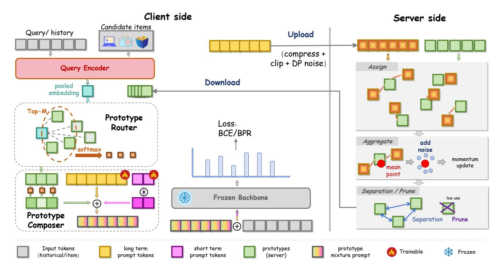
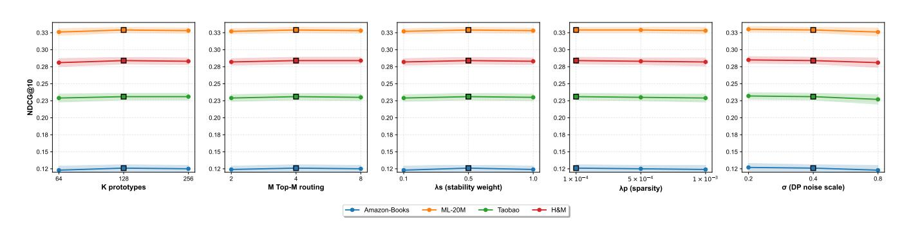
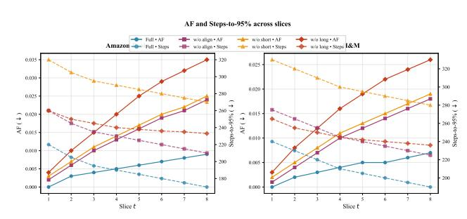
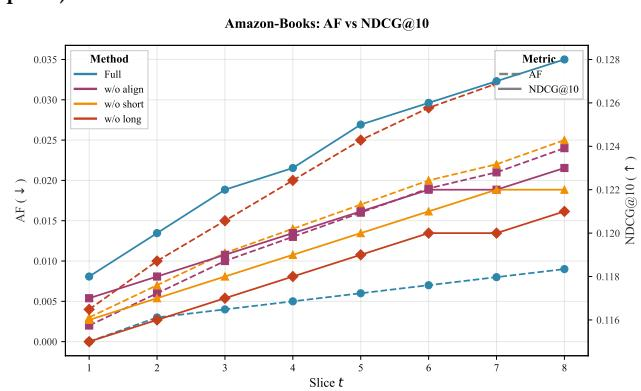
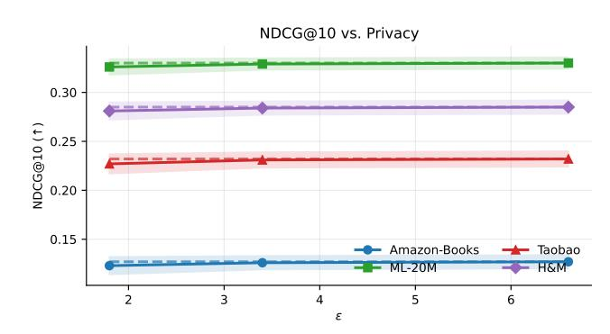
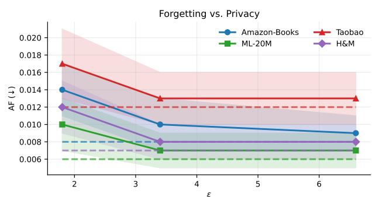
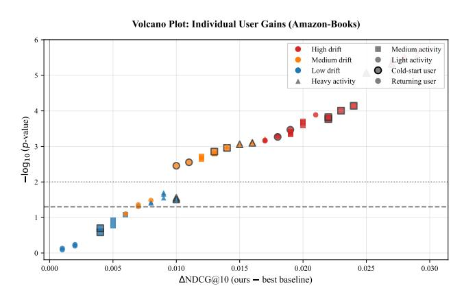
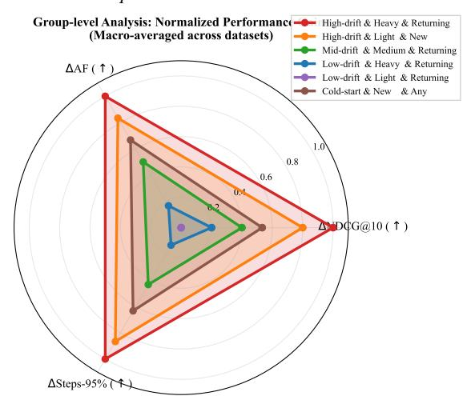

# Prototype-Aligned Federated Soft-Prompts for Continual Web Personalization

[Canran Xiao](https://orcid.org/0009-0001-9730-5454) xiaocr3@mail.sysu.edu.cn Shenzhen Campus of Sun Yat-sen University Shenzhen, Guangdong, China

[Liwei Hou](https://orcid.org/0000-0003-3476-2452)∗ houliwei@hnu.edu.cn Hunan University Changsha, Hunan, China

# Abstract

Continual Web personalization is essential for engagement, yet real-world non-stationarity and privacy constraints make it hard to adapt quickly without forgetting long-term preferences. We target this gap by seeking a privacy-conscious, parameter-efficient interface that controls stability–plasticity at the user/session level while tying user memory to a shared semantic prior. We propose ProtoFed-SP, a prompt-based framework that injects dual-timescale soft prompts into a frozen backbone: a fast, sparse short-term prompt tracks session intent, while a slow long-term prompt is anchored to a small server-side prototype library that is continually refreshed via differentially private federated aggregation. Queries are routed to Top-�� prototypes to compose a personalized prompt. Across eight benchmarks, ProtoFed-SP improves NDCG@10 by +2.9% and HR@10 by +2.0% over the strongest baselines, with notable gains on Amazon-Books (+5.0% NDCG vs. INFER), H&M (+2.5% vs. Dual-LoRA), and Taobao (+2.2% vs. FedRAP). It also lowers forgetting (AF) and Steps-to-95% and preserves accuracy under practical DP budgets. Our contribution is a unifying, privacy-aware prompting interface with prototype anchoring that delivers robust continual personalization and offers a transparent, controllable mechanism to balance stability and plasticity in deployment.

# CCS Concepts

• Computing methodologies → Distributed algorithms; Artificial intelligence.

# Keywords

Continual personalization, federated recommendation, parameterefficient prompting, differential privacy, stability–plasticity tradeoff

## ACM Reference Format:

Canran Xiao and Liwei Hou. 2026. Prototype-Aligned Federated Soft-Prompts for Continual Web Personalization. In Proceedings of the ACM Web Conference 2026 (WWW '26), April 13–17, 2026, Dubai, United Arab Emirates. ACM, New York, NY, USA, [12](#page-11-0) pages.<https://doi.org/10.1145/3774904.3792626>

© 2026 Copyright held by the owner/author(s). ACM ISBN 979-8-4007-2307-0/2026/04 <https://doi.org/10.1145/3774904.3792626>

# 1 Introduction

Personalized Web experiences—from recommendations[\[21,](#page-8-0) [23,](#page-8-1) [27\]](#page-8-2) to on-site search and feeds[\[5,](#page-8-3) [43\]](#page-8-4)—operate in non-stationary environments where user interests, item supply, and platform rules evolve continually. This non-stationarity makes accurate, timely adaptation indispensable for engagement and safety at scale, yet exposes a classic stability–plasticity dilemma: models must absorb fresh signals quickly without erasing long-term preferences. At the same time, modern deployments increasingly require on-device adaptation and privacy-preserving training, challenging conventional full retraining pipelines[\[24,](#page-8-5) [32,](#page-8-6) [34,](#page-8-7) [37\]](#page-8-8).

Recent advancements in continuous recommendation cover selfcorrection, regularization, federated personalization, and parameterefficient prompting—showing that models are capable of adapting under non-stationary conditions [\[3,](#page-8-9) [9,](#page-8-10) [11,](#page-8-11) [14,](#page-8-12) [15,](#page-8-13) [17–](#page-8-14)[19,](#page-8-15) [31,](#page-8-16) [33,](#page-8-17) [41\]](#page-8-18). Yet across these lines, three high-level limitations remain. First, adaptation is typically governed at the global or loss level, with no portable, shareable semantic anchor that tethers per-user memory to population structure—leaving stability–plasticity largely uncontrolled at the user granularity [\[20,](#page-8-19) [28\]](#page-8-20). Second, practical deployments must respect privacy and bandwidth: replay and interactionderived signals can be costly or sensitive, while federated methods often personalize via extra weights without a lightweight, prompt-level memory and explicit DP accounting [\[17,](#page-8-14) [18,](#page-8-21) [26,](#page-8-22) [29\]](#page-8-23). Third, although PEFT/LLM approaches enable low-overhead adaptation, they rarely couple fast session plasticity with a refreshable global prior that is updated in a privacy-aware, federated manner [\[3,](#page-8-9) [11,](#page-8-11) [15,](#page-8-13) [19,](#page-8-15) [33,](#page-8-17) [40,](#page-8-24) [42\]](#page-8-25). In short, the field lacks a privacyconscious, parameter-efficient personalization interface that (i) provides per-user control of stability–plasticity and (ii) binds user memory to a shared semantic prior that can be continually refreshed under federated constraints (with fairness monitored over time [\[16,](#page-8-26) [30,](#page-8-27) [36\]](#page-8-28)).

This paper addresses that gap by studying a prompt-based continual personalization interface that unifies per-user, dual-timescale adaptation with a small population semantic prior maintained in federated form under differential privacy. We give the answer to the following question: Can we achieve fast session-level plasticity and long-term stability per user, while privately refreshing a global anchor that resists drift?

Our contributions can be summarized as follows:

(1) Insight. We articulate and operationalize a stability–plasticity control interface for continual personalization: fast session updates are decoupled from slow preference memory, and slow memory is anchored to a compact, federated semantic prior—yielding a concrete mechanism to reason about drift, forgetting, and adaptation across users.

∗Corresponding author.

[This work is licensed under a Creative Commons Attribution 4.0 International License.](https://creativecommons.org/licenses/by/4.0) WWW '26, Dubai, United Arab Emirates

## 3.7 Algorithmic Overview

ProtoFed-SP decomposes continual personalization into three coordinated procedures: (i) ClientUpdate (Alg. [1\)](#page-9-0) maintains a dualtimescale prompt state per user by performing a sparse, fast update for the short-term prompt and an alignment-aware, slow update for the long-term prompt; (ii) ServerAggregate (Alg. [2\)](#page-9-1) updates the prototype library via differentially private federated aggregation of compressed client embeddings, with robustness and separation constraints; (iii) OnlineInference (Alg. [3\)](#page-9-2) retrieves Top-�� prototypes given the current context, composes the routed soft prompt, and ranks candidates with a frozen backbone [\[39\]](#page-8-36), performing a lightweight in-session short-term step when immediate feedback is available.

Complexity and Memory Footprint. Let ���� be prompt length and �� the embedding width. Per-client memory is O (������) for �� long �� and O (������) for �� short ��,�� (short-term can be ephemeral or capped). Server memory is O (��������) for prototypes. Routing costs O (������ ) per request (before Top-�� pruning); with ANN indexing in R ���� , this becomes sublinear in ��.

# 4 Experiment

# 4.1 Experimental Setup

4.1.1 Datasets. We evaluate ProtoFed-SP on widely-adopted, recent, and method-aligned benchmarks used in continual recommendation, federated personalization, and multi-modal settings.

- Amazon-Books, Amazon-Electronics (sequential, long horizon). Large-scale, high adoption in continual RS; strong concept drift and frequent cold items. We follow recent works by using implicit feedback (binary) with 1 + 99 negative sampling per evaluation query.
- MovieLens-20M (ML-20M). Classic yet still standard for sequence/top-�� evaluation; we use the timestamped ratings and binarize with threshold ≥ 4.
- Yelp (temporal clicks/reviews). Urban venues with pronounced seasonality; useful for user-drift analysis and stability–plasticity trade-offs.
- Gowalla / LastFM-1K (check-in / music listening sequences). Popular for drifted sequences and for comparing to continual/distillation baselines.
- RetailRocket (clickstream). Session-heavy e-commerce interactions with short-term intent spikes.
- Taobao User Behavior (large-scale CTR). Used by recent continual/federated CTR papers; provides realism for federated simulation with many clients.
- H&M Fashion (multi-modal). Public Kaggle benchmark with product images & metadata. We freeze ViT/BERT encoders as backbones to test multi-modal continual personalization and prototype routing.

For all datasets we keep the canonical 5-core filter (users/items with ≥ 5 interactions), sort interactions chronologically, and partition the stream into �� ∈ {8, 10, 12} time-slices (tasks) by wall-clock time so as to avoid leakage. Unless noted, we hold out the last 10% interactions of each time-slice for testing and the previous 10%

for validation; candidate sets are top-100 (1 positive + 99 sampled negatives) standard in sequence ranking.

4.1.2 Evaluation Protocol and Metrics. We follow recent continual-RS practice[\[14\]](#page-8-12) and report freshness, retention/forgetting, and efficiency:

(i)Top-�� accuracy. HitRate@K (HR@ ��), NDCG@ ��, and MRR@ �� with �� ∈ {5, 10, 20} computed on each time-slice ��.

(ii)Forgetting and transfer. Let �� �� denote NDCG@ 10 on slice �� after training up to slice ��.

AF = 1 �� − 1 ��∑︁−1 ��=1 max ′≤�� −1 �� ′ �� − �� �� , (17)

BWT = 1 �� − 1 ��∑︁−1 ��=1 �� �� �� − �� , (18)

FWT = 1 �� − 1 ∑︁�� ��=2 �� ��−1 �� − ��¯scratch . (19)

where ��¯scratch is performance on slice �� before seeing it (scratch model).

(iii)Adaptation speed. Steps-to-95%: the number of local gradient steps to reach 0.95× the converged NDCG@ 10 on the current slice.

(iv)Fairness over time. We report exposure disparity across head vs. tail items and low-activity vs. high-activity users: Dispitem = Exphead − Exptail , Dispuser = Exphi − Explo , tracked across slices to study long-term effects.

(v)Efficiency. Trainable parameters (M), on-device memory (GB), wall-clock per slice (min), and communication cost (MB per client per round). For privacy reporting we provide (��, ��) under the Gaussian mechanism for the chosen �� and accountant.

4.1.3 Baselines. We compare against strong and recent baselines; when methods were originally designed for trainable backbones, we include both their standard implementation and a PEFT variant to normalize training budget.

(i)Static / non-continual. FullRetrain (oracle full retraining on cumulative data), FineTune-Last (train only on the current slice).

(ii)Regularization-based CL. EWC [\[13\]](#page-8-37), SI[\[38\]](#page-8-38), MAS [\[2\]](#page-8-39), LwF [\[22\]](#page-8-40), Personalized Imitation (user-wise stability weights; SAIL-PIWstyle) [\[31\]](#page-8-16).

(iii)Replay-based CL. ER-Random [\[6\]](#page-8-41), ER-Freq [\[1\]](#page-8-42), ReLoop / ReLoop2 [\[4,](#page-8-29) [44\]](#page-8-30), INFER [\[41\]](#page-8-18).

(iv)Distillation / co-evolution. CCD (continual collaborative distillation) [\[14\]](#page-8-12).

(v)Parameter-isolation / adapters. Prefix-/Prompt-Tuning [\[15,](#page-8-13) [19\]](#page-8-15), Adapters [\[10\]](#page-8-43), Dual-LoRA [\[11\]](#page-8-11).

(vi)Federated personalization. FedAvg-Finetune [\[26\]](#page-8-22), FedProx [\[18\]](#page-8-21), Ditto [\[17\]](#page-8-14). For methods without DP, we report both non-DP and DP-wrapped versions for fairness.

(vii)LLM4Rec (reference). RecICL (in-context adaptation without parameter updates) [\[3\]](#page-8-9) and PCL (prompt-as-memory) [\[33\]](#page-8-17). These are included on representative datasets to contextualize promptbased personalization; their backbones are LLMs and are evaluated under the same candidate protocol.

Please refer to [§B](#page-9-3) for the detailed implementations.

Table 1: Overall Top-�� accuracy. NDCG@10 / HR@10 on eight benchmarks: Amazon-Books, Amazon-Electronics, MovieLens-20M, Yelp, RetailRocket, Gowalla, Taobao, and H&M.

| Method                 | N@10  | Books HR@10 | N@10  | Electronics HR@10 | N@10  | ML-20M HR@10 | N@10  | Yelp HR@10 | N@10  | RetailRocket HR@10 | N@10  | Gowalla HR@10 | N@10  | Taobao HR@10 | N@10  | H&M HR@10 |
|------------------------|-------|-------------|-------|-------------------|-------|--------------|-------|------------|-------|--------------------|-------|---------------|-------|--------------|-------|-----------|
| FullRetrain            | 0.114 | 0.231       | 0.133 | 0.257             | 0.319 | 0.644        | 0.109 | 0.220      | 0.244 | 0.466              | 0.205 | 0.514         | 0.217 | 0.438        | 0.262 | 0.487     |
| FineTune-Last          | 0.102 | 0.208       | 0.122 | 0.240             | 0.302 | 0.616        | 0.101 | 0.206      | 0.232 | 0.446              | 0.195 | 0.498         | 0.208 | 0.421        | 0.251 | 0.472     |
| EWC                    | 0.109 | 0.223       | 0.128 | 0.248             | 0.307 | 0.625        | 0.106 | 0.214      | 0.236 | 0.454              | 0.198 | 0.505         | 0.211 | 0.428        | 0.255 | 0.476     |
| SI                     | 0.108 | 0.221       | 0.127 | 0.246             | 0.306 | 0.623        | 0.105 | 0.213      | 0.235 | 0.452              | 0.197 | 0.503         | 0.207 | 0.420        | 0.251 | 0.472     |
| MAS                    | 0.109 | 0.222       | 0.127 | 0.247             | 0.305 | 0.622        | 0.105 | 0.213      | 0.235 | 0.452              | 0.197 | 0.504         | 0.210 | 0.427        | 0.254 | 0.476     |
| LwF                    | 0.110 | 0.225       | 0.129 | 0.249             | 0.310 | 0.629        | 0.106 | 0.214      | 0.238 | 0.457              | 0.199 | 0.507         | 0.212 | 0.431        | 0.257 | 0.480     |
| Personalized Imitation | 0.113 | 0.229       | 0.132 | 0.252             | 0.313 | 0.633        | 0.108 | 0.218      | 0.241 | 0.463              | 0.202 | 0.511         | 0.214 | 0.435        | 0.259 | 0.483     |
| ER-Random              | 0.112 | 0.228       | 0.131 | 0.251             | 0.314 | 0.634        | 0.107 | 0.216      | 0.242 | 0.464              | 0.203 | 0.512         | 0.215 | 0.437        | 0.260 | 0.485     |
| ER-Freq                | 0.115 | 0.232       | 0.134 | 0.255             | 0.316 | 0.637        | 0.110 | 0.220      | 0.245 | 0.469              | 0.206 | 0.517         | 0.218 | 0.441        | 0.263 | 0.489     |
| ReLoop                 | 0.116 | 0.233       | 0.134 | 0.256             | 0.317 | 0.638        | 0.111 | 0.222      | 0.246 | 0.471              | 0.207 | 0.519         | 0.219 | 0.443        | 0.265 | 0.492     |
| ReLoop2                | 0.118 | 0.234       | 0.137 | 0.265             | 0.320 | 0.645        | 0.113 | 0.226      | 0.248 | 0.472              | 0.210 | 0.521         | 0.221 | 0.446        | 0.268 | 0.495     |
| INFER                  | 0.120 | 0.239       | 0.136 | 0.263             | 0.318 | 0.642        | 0.115 | 0.229      | 0.251 | 0.478              | 0.209 | 0.520         | 0.222 | 0.448        | 0.270 | 0.497     |
| CCD                    | 0.117 | 0.235       | 0.134 | 0.257             | 0.317 | 0.639        | 0.112 | 0.223      | 0.247 | 0.471              | 0.212 | 0.525         | 0.220 | 0.444        | 0.267 | 0.494     |
| Prefix/Prompt-Tuning   | 0.116 | 0.233       | 0.132 | 0.252             | 0.315 | 0.636        | 0.111 | 0.222      | 0.244 | 0.467              | 0.206 | 0.517         | 0.216 | 0.440        | 0.271 | 0.497     |
| AdapterCL              | 0.115 | 0.232       | 0.133 | 0.254             | 0.316 | 0.637        | 0.111 | 0.221      | 0.245 | 0.469              | 0.207 | 0.518         | 0.217 | 0.441        | 0.268 | 0.494     |
| Dual-LoRA (LSAT)       | 0.117 | 0.235       | 0.135 | 0.263             | 0.323 | 0.647        | 0.114 | 0.225      | 0.247 | 0.472              | 0.208 | 0.519         | 0.220 | 0.445        | 0.277 | 0.503     |
| FedAvg-Finetune        | 0.111 | 0.226       | 0.129 | 0.249             | 0.309 | 0.628        | 0.106 | 0.214      | 0.240 | 0.460              | 0.201 | 0.509         | 0.219 | 0.442        | 0.261 | 0.486     |
| FedProx                | 0.112 | 0.227       | 0.130 | 0.251             | 0.311 | 0.631        | 0.107 | 0.215      | 0.241 | 0.462              | 0.202 | 0.510         | 0.223 | 0.447        | 0.262 | 0.487     |
| Ditto                  | 0.113 | 0.228       | 0.131 | 0.252             | 0.312 | 0.632        | 0.108 | 0.217      | 0.243 | 0.466              | 0.203 | 0.512         | 0.223 | 0.447        | 0.263 | 0.489     |
| FedRAP                 | 0.114 | 0.231       | 0.133 | 0.256             | 0.314 | 0.635        | 0.110 | 0.219      | 0.246 | 0.471              | 0.206 | 0.517         | 0.226 | 0.451        | 0.266 | 0.492     |
| RecICL                 | 0.113 | 0.232       | 0.128 | 0.250             | 0.311 | 0.628        | 0.110 | 0.221      | 0.242 | 0.468              | 0.203 | 0.514         | 0.214 | 0.435        | 0.266 | 0.492     |
| PCL                    | 0.117 | 0.236       | 0.133 | 0.257             | 0.316 | 0.636        | 0.112 | 0.224      | 0.246 | 0.472              | 0.205 | 0.518         | 0.219 | 0.443        | 0.269 | 0.494     |
| ProtoFed-SP (ours)     | 0.126 | 0.248       | 0.142 | 0.271             | 0.329 | 0.658        | 0.119 | 0.233      | 0.257 | 0.487              | 0.216 | 0.534         | 0.231 | 0.461        | 0.284 | 0.512     |

Figure 2: Core hyperparameter sensitivity (NDCG@10, mean±std). One parameter varied per block; others fixed at defaults.

# 4.2 Main Results

We report Top-�� ranking accuracy on eight widely-used benchmarks.

Across all eight benchmarks, ProtoFed-SP attains the highest NDCG@10 and HR@10 (Tab. [1\)](#page-5-0). Averaged over datasets, it improves NDCG@10 by +2.9% and HR@10 by +2.0% over the strongest competing baseline. The margins are largest on Amazon-Books (+5.0% NDCG vs. INFER) and H&M (+2.5% NDCG vs. Dual–LoRA), evidencing the benefits of prototype alignment and dual-timescale prompting under long-tailed and multi-modal drift.

On Taobao, ProtoFed-SP exceeds FedRAP by +2.2% NDCG and +2.2% HR, indicating that DP prototype aggregation preserves personalization quality.

Although INFER and ReLoop2 are the strongest prior methods on session/sequence data, Dual–LoRA excels on multi-modal H&M and FedRAP on federated CTR; ProtoFed-SP nevertheless consistently outperforms all alternatives.

# 4.3 Ablation and Analysis

Single-factor ablations. We disable one design at a time and keep all other components/Hyperparameters fixed. We report NDCG@10 / HR@10 on four representative datasets covering long-tail (Amazon-Books), classic sequence (ML-20M), federated CTR (Taobao), and multi-modal drift (H&M). Blue numbers denote the drop relative to our full model ([§4.2\)](#page-5-1).

Table [2](#page-6-0) shows each component contributes measurably: (i) Longterm prompt is critical for stability. Removing �� long �� yields the largest drops, confirming its role in retaining long-horizon preferences. (ii) Prototype alignment mitigates drift. Disabling A degrades performance, supporting the stability benefit of anchoring �� long�� to C. (iii) Short-term prompt accelerates intent tracking. Removing �� short��, �� hurts more on interaction-dense or multi-modal settings, aligning with its rapid session adaptation design. (iv) Federated prototype updates matter. Freezing prototypes causes uniform degradation, evidencing the value of continually refreshing population anchors. (v) Aggregator choice is secondary but

Table 2: Single-factor ablations. NDCG@10 / HR@10 on four representative datasets. (Δ) is the decrease w.r.t. ProtoFed-SP (Full).

|             | Method      |               |              |       | N@10     | Amazon-Books | HR@10    |       | N@10     | ML-20M | HR@10    |       | N@10     | Taobao | HR@10    |       | N@10     | H&M   | HR@10    |
|-------------|-------------|---------------|--------------|-------|----------|--------------|----------|-------|----------|--------|----------|-------|----------|--------|----------|-------|----------|-------|----------|
| ProtoFed-SP |             | (Full)        |              | 0.126 |          | 0.248        |          | 0.329 |          | 0.658  |          | 0.231 |          | 0.461  |          | 0.284 |          | 0.512 |          |
| w/o         | Prototype   | Alignment     | A            | 0.120 | (-0.006) | 0.238        | (-0.010) | 0.324 | (-0.005) | 0.649  | (-0.009) | 0.225 | (-0.006) | 0.451  | (-0.010) | 0.277 | (-0.007) | 0.501 | (-0.011) |
| w/o         | Short-term  | prompt        | ( �� = 0)    | 0.122 | (-0.004) | 0.241        | (-0.007) | 0.325 | (-0.004) | 0.652  | (-0.006) | 0.227 | (-0.004) | 0.454  | (-0.007) | 0.279 | (-0.005) | 0.504 | (-0.008) |
| w/o         | Long-term   | prompt        | (short only) | 0.116 | (-0.010) | 0.232        | (-0.016) | 0.320 | (-0.009) | 0.644  | (-0.014) | 0.223 | (-0.008) | 0.448  | (-0.013) | 0.274 | (-0.010) | 0.496 | (-0.016) |
| Static      | Prototypes  | (no federated | update)      | 0.121 | (-0.005) | 0.240        | (-0.008) | 0.326 | (-0.003) | 0.653  | (-0.005) | 0.226 | (-0.005) | 0.453  | (-0.008) | 0.278 | (-0.006) | 0.502 | (-0.010) |
| Alt.        | Aggregator: | Geom.         | Median       | 0.124 | (-0.002) | 0.245        | (-0.003) | 0.328 | (-0.001) | 0.656  | (-0.002) | 0.230 | (-0.001) | 0.460  | (-0.001) | 0.282 | (-0.002) | 0.509 | (-0.003) |
| Alt.        | Aggregator: | 2-Wasserstein | Bary.        | 0.123 | (-0.003) | 0.244        | (-0.004) | 0.327 | (-0.002) | 0.655  | (-0.003) | 0.229 | (-0.002) | 0.459  | (-0.002) | 0.281 | (-0.003) | 0.508 | (-0.004) |

non-negligible. Replacing DP-FedKMeans with Geometric Median or 2-Wasserstein Barycenter changes accuracy by ≤ 0.003 NDCG, indicating our gains are not tied to a specific aggregation rule.

Parameter Sensitivity. We analyze the five most influential hyperparameters while fixing all others to the defaults in [§B.](#page-9-3) Figure [2](#page-5-2) shows stable optima near the defaults.

(a) Time-series verification: AF↓ (left axis) and Steps-to-95%↓ (right axis) across slices on Amazon-Books (left panel) and H&M (right panel).

(b) Dual-axis view (Amazon-Books): AF↓ (left axis) vs. NDCG@10↑ (right axis) across slices for Full and ablations.

Figure 3: Stability–plasticity verification. Prototype alignment consistently lowers forgetting, while short-term prompts markedly reduce the steps needed to adapt; combining both yields the best AF–NDCG frontier.

Stability–Plasticity Verification. This experiment verify that dual timescales (long/short prompts) and prototype alignment jointly reduce forgetting (AF↓) and speed adaptation (Steps-to-95%↓). For each time slice �� ∈ {1, . . . , 8} we compute cumulative forgetting AF(��) and the steps needed to reach 95% of the converged NDCG@10 on the same slice. We compare ProtoFed-SP (Full) with three ablations: w/o align (drop A), w/o short (�� =0), and w/o long (remove �� long).

From Fig. [3,](#page-6-1) we can observe: (i) Forgetting. The Full model maintains uniformly low AF across slices on both datasets; removing alignment increases AF monotonically (e.g., Books ��=8: 0.024 vs. 0.009), evidencing the anchoring effect of prototypes. (ii) Adaptation. Steps-to-95% is lowest for the Full model and largest without the short-term prompt (Books ��=8: 170 vs. 270), confirming that �� short accelerates session adaptation. (iii) AF–NDCG frontier. On Books, the Full model achieves a superior Pareto front: NDCG rises steadily while AF remains below 0.01; ablations trade accuracy for either slower adaptation (w/o short) or larger forgetting (w/o align / w/o long). Together, the curves validate that alignment A reduces drift-induced forgetting and short-term prompting cuts adaptation steps. Their combination yields the best stability–plasticity balance.

Does Privacy Hurt Personalization? Does adding differential privacy (DP) to federated prototype aggregation significantly degrade personalization quality? We compare Non-DP versus DP with Gaussian noise scales �� ∈ {0.2, 0.4, 0.8} applied to uploaded prompt embeddings ���� = compress(�� (�� long �� )) + ��, �� ∼N (0, ��2 ��). As shown in Fig. [4:](#page-7-0) (i) Moderate DP preserves personalization. At ��=0.4 (��≈3.4), NDCG remains within the Non-DP error bands on all datasets while AF increases marginally. (ii) Stronger DP degrades gracefully. ��=0.8 (��≈1.8) reduces NDCG by ∼1–2.5 points but does not induce catastrophic forgetting (AF rises modestly). (iii) Task dependence. Taobao (dense CTR) is the most sensitive to ��, whereas ML-20M is the most robust—consistent with their noise–signal ratios. Overall, DP prototype aggregation does not undermine personalization at practical privacy levels.

Who Benefits from Personalization? Is the gain concentrated on heavy users, or do high-drift and cold-start users also benefit? We stratify users along three axes: (i) drift (Low/Mid/High, estimated by rolling embedding shift), (ii) activity (Light/Medium/Heavy, by interactions per slice), and (iii) cold-start (New vs. Returning).

(a) NDCG@10 vs. privacy level. Lines show mean with ± std bands across seeds; dashed horizontal lines indicate the Non-DP baselines.

(b) AF (forgetting) vs. privacy level. Lower is better; dashed lines are Non-DP references.

Figure 4: Privacy–utility trade-off. Across datasets, moderate DP (e.g., �� =0.4, mid ��) preserves personalization: NDCG stays within the Non-DP band while AF increases only slightly; very strong DP (�� =0.8) degrades gracefully rather than catastrophically.

From Figure [5,](#page-7-1) we can observe that: (i) Not just heavy users. High-drift users—both heavy and light—cluster in the upper-right of the volcano (large Δ, low ��), indicating significant, substantive gains. (ii) Cold-start gains. New users exhibit positive Δ on all radar axes (accuracy, forgetting, and adaptation), showing that promptbased personalization shortens the cold-start vacuum. (iii) Drift matters most. Radar polygons expand with drift level more than with activity, matching the method's design: prototype alignment stabilizes long-term memory, while short-term prompts accelerate adaptation irrespective of activity.

# 5 Conclusion

We addressed continual Web personalization under non-stationarity and privacy by introducing a privacy-aware, parameter-efficient prompting interface that couples dual-timescale user prompts with a federated, prototype-anchored semantic prior. Our framework delivers consistent gains across diverse benchmarks while reducing forgetting and adaptation latency, and it preserves utility under practical DP budgets; ablations and analyses clarify how alignment

(a) Volcano (Amazon-Books). Per-user effect size (ΔNDCG@10) vs. − log10 ��. Points are colored by (drift, activity, cold-start) strata; horizontal line marks ��=0.05.

(b) Group radar (macro-avg across datasets). Axes: ΔNDCG@10 (↑), ΔAF (↑), ΔSteps-to-95% (↑).

Figure 5: High-drift users see the largest, most significant gains; cold-start users also benefit. Heavy users gain, but improvements are not exclusive to them.

curbs drift and short-term prompting accelerates intent tracking. For the community, these results suggest that anchored prompting is a viable recipe for balancing stability–plasticity at the user/session level without sacrificing federated or privacy constraints. Limitations include reliance on frozen backbones, simulated federated settings with accountant-based DP estimates, and manual choices for prototype capacity/separation.

Future work will explore online A/B validation, adaptive prototype growth with fairness-aware constraints, and extensions to richer multi-modal and cross-domain personalization scenarios.

# Acknowledgments

We would like to thank Hunan Airon Technology Co., Ltd. for providing computing resources for this project.

## References

[1] Kian Ahrabian, Yishi Xu, Yingxue Zhang, Jiapeng Wu, Yuening Wang, and Mark Coates. 2021. Structure aware experience replay for incremental learning in graph-based recommender systems. In Proceedings of the 30th ACM International Conference on Information & Knowledge Management. 2832–2836. [2] Rahaf Aljundi, Francesca Babiloni, Mohamed Elhoseiny, Marcus Rohrbach, and Tinne Tuytelaars. 2018. Memory aware synapses: Learning what (not) to forget. In Proceedings of the European conference on computer vision (ECCV). 139–154. [3] Keqin Bao, Ming Yan, Yang Zhang, Jizhi Zhang, Wenjie Wang, Fuli Feng, and Xiangnan He. 2024. Real-Time Personalization for LLM-based Recommendation with Customized In-Context Learning. arXiv preprint arXiv:2410.23136 (2024). [4] Guohao Cai, Jieming Zhu, Quanyu Dai, Zhenhua Dong, Xiuqiang He, Ruiming Tang, and Rui Zhang. 2022. Reloop: A self-correction continual learning loop for recommender systems. In Proceedings of the 45th International ACM SIGIR Conference on Research and Development in Information Retrieval. 2692–2697. [5] Hongru Cai, Yongqi Li, Wenjie Wang, Fengbin Zhu, Xiaoyu Shen, Wenjie Li, and Tat-Seng Chua. 2025. Large language models empowered personalized web agents. In Proceedings of the ACM on Web Conference 2025. 198–215. [6] Arslan Chaudhry, Marcus Rohrbach, Mohamed Elhoseiny, Thalaiyasingam Ajanthan, Puneet K Dokania, Philip HS Torr, and Marc'Aurelio Ranzato. 2019. On tiny episodic memories in continual learning. arXiv preprint arXiv:1902.10486 (2019). [7] Chaochao Chen, Xiaohua Feng, Yuyuan Li, Lingjuan Lyu, Jun Zhou, Xiaolin Zheng, and Jianwei Yin. 2024. Integration of large language models and federated learning. Patterns 5, 12 (2024). [8] Chaochao Chen, Yizhao Zhang, Yuyuan Li, Jun Wang, Lianyong Qi, Xiaolong Xu, Xiaolin Zheng, and Jianwei Yin. 2024. Post-training attribute unlearning in recommender systems. ACM Transactions on Information Systems 43, 1 (2024), 1–28. [9] Xiaohong Chen, Canran Xiao, and Yongmei Liu. 2024. Confusion-resistant federated learning via diffusion-based data harmonization on non-IID data. In Proceedings of the 38th International Conference on Neural Information Processing Systems. 137495–137520. [10] Neil Houlsby, Andrei Giurgiu, Stanislaw Jastrzebski, Bruna Morrone, Quentin De Laroussilhe, Andrea Gesmundo, Mona Attariyan, and Sylvain Gelly. 2019. Parameter-efficient transfer learning for NLP. In International conference on machine learning. PMLR, 2790–2799. [11] Edward J Hu, Yelong Shen, Phillip Wallis, Zeyuan Allen-Zhu, Yuanzhi Li, Shean Wang, Lu Wang, Weizhu Chen, et al. 2022. Lora: Low-rank adaptation of large language models. ICLR 1, 2 (2022), 3. [12] Linling Jiang, Xin Wang, Fan Zhang, and Caiming Zhang. 2025. Transforming time and space: efficient video super-resolution with hybrid attention and deformable transformers. The Visual Computer (2025), 1–12. [13] James Kirkpatrick, Razvan Pascanu, Neil Rabinowitz, Joel Veness, Guillaume Desjardins, Andrei A Rusu, Kieran Milan, John Quan, Tiago Ramalho, Agnieszka Grabska-Barwinska, et al. 2017. Overcoming catastrophic forgetting in neural networks. Proceedings of the national academy of sciences 114, 13 (2017), 3521– 3526. [14] Gyuseok Lee, SeongKu Kang, Wonbin Kweon, and Hwanjo Yu. 2024. Continual collaborative distillation for recommender system. In Proceedings of the 30th ACM SIGKDD Conference on Knowledge Discovery and Data Mining. 1495–1505. [15] Brian Lester, Rami Al-Rfou, and Noah Constant. 2021. The Power of Scale for Parameter-Efficient Prompt Tuning. In Proceedings of the 2021 Conference on Empirical Methods in Natural Language Processing. 3045–3059. [16] Muquan Li, Dongyang Zhang, Tao He, Xiurui Xie, Yuan-Fang Li, and Ke Qin. 2024. Towards effective data-free knowledge distillation via diverse diffusion augmentation. In Proceedings of the 32nd ACM International Conference on Multimedia. 4416–4425. [17] Tian Li, Shengyuan Hu, Ahmad Beirami, and Virginia Smith. 2021. Ditto: Fair and robust federated learning through personalization. In International conference on machine learning. PMLR, 6357–6368. [18] Tian Li, Anit Kumar Sahu, Manzil Zaheer, Maziar Sanjabi, Ameet Talwalkar, and Virginia Smith. 2020. Federated optimization in heterogeneous networks. Proceedings of Machine learning and systems 2 (2020), 429–450. [19] Xiang Lisa Li and Percy Liang. 2021. Prefix-Tuning: Optimizing Continuous Prompts for Generation. In Proceedings of the 59th Annual Meeting of the Association for Computational Linguistics and the 11th International Joint Conference on Natural Language Processing (Volume 1: Long Papers). 4582–4597. [20] Yuyuan Li, Chaochao Chen, Yizhao Zhang, Weiming Liu, Lingjuan Lyu, Xiaolin Zheng, Dan Meng, and Jun Wang. 2023. Ultrare: Enhancing receraser for recommendation unlearning via error decomposition. Advances in Neural Information Processing Systems 36 (2023), 12611–12625. [21] Yuyuan Li, Yizhao Zhang, Weiming Liu, Xiaohua Feng, Zhongxuan Han, Chaochao Chen, and Chenggang Yan. 2025. Multi-Objective Unlearning in Recommender Systems via Preference Guided Pareto Exploration. IEEE Transactions on Services Computing (2025). [22] Zhizhong Li and Derek Hoiem. 2017. Learning without forgetting. IEEE transactions on pattern analysis and machine intelligence 40, 12 (2017), 2935–2947. [23] Ting-Peng Liang, Hung-Jen Lai, and Yi-Cheng Ku. 2006. Personalized content recommendation and user satisfaction: Theoretical synthesis and empirical findings. Journal of Management Information Systems 23, 3 (2006), 45–70. [24] Junhong Lin, Xinyue Zeng, Jie Zhu, Song Wang, Julian Shun, Jun Wu, and Dawei Zhou. 2025. Plan and Budget: Effective and Efficient Test-Time Scaling on Large Language Model Reasoning. arXiv[:2505.16122](https://arxiv.org/abs/2505.16122) [cs.LG] [https://arxiv.org/abs/2505.](https://arxiv.org/abs/2505.16122) [16122](https://arxiv.org/abs/2505.16122) [25] Lixin Liu, Yanling Wang, Tianming Wang, Dong Guan, Jiawei Wu, Jingxu Chen, Rong Xiao, Wenxiang Zhu, and Fei Fang. 2023. Continual transfer learning for cross-domain click-through rate prediction at taobao. In Companion Proceedings of the ACM Web Conference 2023. 346–350. [26] Brendan McMahan, Eider Moore, Daniel Ramage, Seth Hampson, and Blaise Aguera y Arcas. 2017. Communication-efficient learning of deep networks from decentralized data. In Artificial intelligence and statistics. PMLR, 1273–1282. [27] Arpit Rana, Scott Sanner, Mohamed Reda Bouadjenek, Ronald Di Carlantonio, and Gary Farmaner. 2024. User experience and the role of personalization in critiquing-based conversational recommendation. ACM Transactions on the Web 18, 4 (2024), 1–21. [28] Hailin Tao, Jinjiang Li, Zhen Hua, and Fan Zhang. 2023. DUDB: deep unfoldingbased dual-branch feature fusion network for pan-sharpening remote sensing images. IEEE Transactions on Geoscience and Remote Sensing 62 (2023), 1–17. [29] Hua Wang and Fan Zhang. 2024. Computing nodes for plane data points by constructing cubic polynomial with constraints. Computer Aided Geometric Design 111 (2024), 102308. [30] Yuenan Wang, Hua Wang, and Fan Zhang. 2025. A Medical image segmentation model with auto-dynamic convolution and location attention mechanism. Computer Methods and Programs in Biomedicine 261 (2025), 108593. [31] Yuening Wang, Yingxue Zhang, Antonios Valkanas, Ruiming Tang, Chen Ma, Jianye Hao, and Mark Coates. 2023. Structure aware incremental learning with personalized imitation weights for recommender systems. In Proceedings of the AAAI Conference on Artificial Intelligence, Vol. 37. 4711–4719. [32] Zongda Wu, Shigen Shen, Haiping Zhou, Huxiong Li, Chenglang Lu, and Dongdong Zou. 2021. An effective approach for the protection of user commodity viewing privacy in e-commerce website. Knowledge-Based Systems 220 (2021), 106952. [33] Mingdai Yang, Fan Yang, Yanhui Guo, Shaoyuan Xu, Tianchen Zhou, Yetian Chen, Simone Shao, Jia Liu, and Yan Gao. 2025. PCL: Prompt-based continual learning for user modeling in recommender systems. In Companion Proceedings of the ACM on Web Conference 2025. 1475–1479. [34] Jiawei Yao, Chuming Li, Keqiang Sun, Yingjie Cai, Hao Li, Wanli Ouyang, and Hongsheng Li. 2023. Ndc-scene: Boost monocular 3d semantic scene completion in normalized device coordinates space. In 2023 IEEE/CVF International Conference on Computer Vision (ICCV). IEEE Computer Society, 9421–9431. [35] Jiawei Yao, Chuming Li, and Canran Xiao. 2024. Swift sampler: Efficient learning of sampler by 10 parameters. Advances in Neural Information Processing Systems 37 (2024), 59030–59053. [36] Hyunsik Yoo, Zhichen Zeng, Jian Kang, Ruizhong Qiu, David Zhou, Zhining Liu, Fei Wang, Charlie Xu, Eunice Chan, and Hanghang Tong. 2024. Ensuring user-side fairness in dynamic recommender systems. In Proceedings of the ACM Web Conference 2024. 3667–3678. [37] Xinyue Zeng, Haohui Wang, Junhong Lin, Jun Wu, Tyler Cody, and Dawei Zhou. 2025. LENSLLM: Unveiling Fine-Tuning Dynamics for LLM Selection. arXiv[:2505.03793](https://arxiv.org/abs/2505.03793) [cs.LG]<https://arxiv.org/abs/2505.03793> [38] Friedemann Zenke, Ben Poole, and Surya Ganguli. 2017. Continual learning through synaptic intelligence. In International conference on machine learning. PMLR, 3987–3995. [39] Fan Zhang, Gongguan Chen, Hua Wang, Jinjiang Li, and Caiming Zhang. 2023. Multi-scale video super-resolution transformer with polynomial approximation. IEEE Transactions on Circuits and Systems for Video Technology 33, 9 (2023), 4496– 4506. [40] Fan Zhang, Gongguan Chen, Hua Wang, and Caiming Zhang. 2024. CF-DAN: Facial-expression recognition based on cross-fusion dual-attention network. Computational Visual Media 10, 3 (2024), 593–608. [41] Xinni Zhang, Yankai Chen, Chenhao Ma, Yixiang Fang, and Irwin King. 2024. Influential exemplar replay for incremental learning in recommender systems. In Proceedings of the AAAI Conference on Artificial Intelligence, Vol. 38. 9368–9376. [42] Xiaofeng Zhang, Fanshuo Zeng, Yihao Quan, Zheng Hui, and Jiawei Yao. 2025. Enhancing multimodal large language models complex reason via similarity computation. In Proceedings of the AAAI Conference on Artificial Intelligence, Vol. 39. 10203–10211. [43] Yujia Zhou, Qiannan Zhu, Jiajie Jin, and Zhicheng Dou. 2024. Cognitive personalized search integrating large language models with an efficient memory mechanism. In Proceedings of the ACM Web Conference 2024. 1464–1473. [44] Jieming Zhu, Guohao Cai, Junjie Huang, Zhenhua Dong, Ruiming Tang, and Weinan Zhang. 2023. ReLoop2: Building Self-Adaptive Recommendation Models via Responsive Error Compensation Loop. In Proceedings of the 29th ACM SIGKDD Conference on Knowledge Discovery and Data Mining. 5728–5738.

