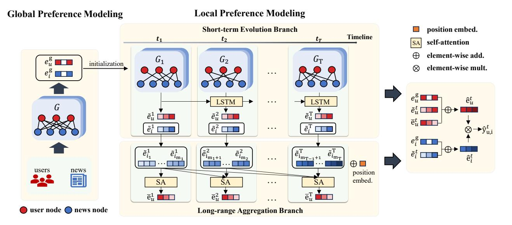
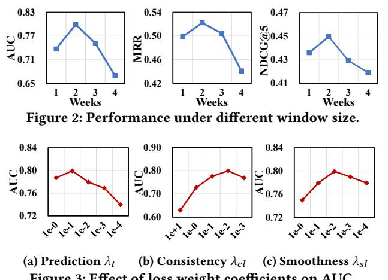

# Modeling Stage-wise Evolution of User Interests for News Recommendation

Zhiyong Cheng The School of Computer Science and Information Engineering, Hefei University of Technology Anhui, China jason.zy.cheng@gmail.com

Yike Jin The School of Computer Science and Information Engineering, Hefei University of Technology Anhui, China jyk06801@gmail.com

Zhijie Zhang The School of Computer Science and Information Engineering, Hefei University of Technology Anhui, China zhijiezhang021@gmail.com

Huilin Chen The School of Computer Science and Information Engineering, Hefei University of Technology Anhui, China ClownClumsy@outlook.com

Zhangling Duan∗ Institute of Artificial intelligence, Hefei Comprehensive National Science Center Anhui, China duanzl1024@iai.ustc.edu.cn

Meng Wang The School of Computer Science and Information Engineering, Hefei University of Technology Anhui, China eric.mengwang@gmail.com

# Abstract

Personalized news recommendation is highly time-sensitive, as user interests are often driven by emerging events, trending topics, and shifting real-world contexts. These dynamics make it essential to model not only users' long-term preferences, which reflect stable reading habits and high-order collaborative patterns, but also their short-term, context-dependent interests that change rapidly over time. However, most existing approaches rely on a single static interaction graph, which struggles to capture both long-term preference patterns and short-term interest changes as user behavior evolves. To address this challenge, we propose a unified framework that learns user preferences from both global and local temporal perspectives. A global preference modeling component captures long-term collaborative signals from the overall interaction graph, while a local preference modeling component partitions historical interactions into stage-wise temporal subgraphs to represent short-term dynamics. Within this module, an LSTM branch models the progressive evolution of recent interests, and a self-attention branch captures long-range temporal dependencies. Extensive experiments on two large-scale real-world datasets show that our approach consistently outperforms strong baselines and delivers fresher and more relevant recommendations across diverse user behaviors and temporal settings.

# CCS Concepts

• Information systems → Personalization; Recommender systems; Collaborative filtering.

# Keywords

News Recommendation, Evolving Preferences, GCN

∗Zhangling Duan is the corresponding author.

[This work is licensed under a Creative Commons Attribution 4.0 International License.](https://creativecommons.org/licenses/by/4.0) WWW '26, Dubai, United Arab Emirates © 2026 Copyright held by the owner/author(s). ACM ISBN 979-8-4007-2307-0/2026/04 <https://doi.org/10.1145/3774904.3792628>

### ACM Reference Format:

Zhiyong Cheng, Yike Jin, Zhijie Zhang, Huilin Chen, Zhangling Duan, and Meng Wang. 2026. Modeling Stage-wise Evolution of User Interests for News Recommendation. In Proceedings of the ACM Web Conference 2026 (WWW '26), April 13–17, 2026, Dubai, United Arab Emirates. ACM, New York, NY, USA, [10](#page-9-0) pages.<https://doi.org/10.1145/3774904.3792628>

# 1 Introduction

Recommender systems [\[5,](#page-8-0) [6,](#page-8-1) [8,](#page-8-2) [15,](#page-8-3) [39\]](#page-8-4) have become indispensable for alleviating information overload and are widely applied in domains such as e-commerce, video, music, and news [\[21,](#page-8-5) [28,](#page-8-6) [36–](#page-8-7) [38,](#page-8-8) [41\]](#page-8-9). In the news domain, the challenge is particularly severe: Online platforms generate a massive stream of news every day, making it challenging for users to filter through the flood of content and identify what truly matters to them. Personalized news recommendation has thus become essential for delivering timely and relevant information.

Compared with other domains, news recommendation faces unique challenges due to the time-sensitive nature of news content. The relevance of articles quickly loses recommendation value as new events occur, or trending topics emerge. Users generally seek the most up-to-date information and lose interest in outdated reports. Moreover, user preferences are not static but exhibit temporal fluctuations driven by real-world events and seasonal contexts. For example, sports fans may focus on major tournaments like the World Cup, while health-related news consumption may spike during a pandemic. Consequently, recommendation systems must account for both long-term interests reflecting stable reading habits, and short-term dynamics capturing rapid preference shifts triggered by emerging events. How to effectively preserve stable interests while adapting to rapidly changing ones remains a fundamental issue to be addressed in personalized news recommendation.

Early news recommendation systems followed two paradigms: collaborative filtering (CF) and content-based (CB) methods. CF approaches [\[1,](#page-8-10) [11,](#page-8-11) [42\]](#page-8-12) infer preferences from behavioral similarity, while CB approaches [\[14,](#page-8-13) [25,](#page-8-14) [26,](#page-8-15) [32\]](#page-8-16) leverage textual content, categories, and metadata to model relevance. Hybrid methods [\[10,](#page-8-17) [45\]](#page-8-18) combine both signals to alleviate sparsity and cold-start issues.

With the rise of deep learning, neural recommenders significantly improved representation learning by capturing richer semantics. Early neural models such as DSSM [\[20\]](#page-8-19) demonstrated the effectiveness of deep semantic representation learning for content understanding. Subsequently, representative news recommenders including NPA [\[49\]](#page-8-20), NRMS [\[50\]](#page-8-21), and NAML [\[48\]](#page-8-22) enhanced user and item embeddings via attention mechanisms, while models such as FIM [\[46\]](#page-8-23) further captured fine-grained semantic interactions between user histories and candidate news. Knowledge-aware approaches like DKN [\[47\]](#page-8-24) integrated external knowledge graphs to enrich semantic representations. Later works further emphasized structural and collaborative signals by employing GCN-based encoders over user–news graphs, leveraging high-order connectivity to improve representation consistency [\[16,](#page-8-25) [19,](#page-8-26) [35\]](#page-8-27). However, these models typically assume user preferences to be static and fail to capture how they evolve over time.

To better capture the temporal nature of news consumption, subsequent work introduced time-aware designs. LSTUR [\[2\]](#page-8-28) fuses a long-term user embedding with short-term sequential behaviors to capture both stability and recency, while HieRec [\[40\]](#page-8-29) organizes interactions into hierarchical sub-sequences to model multi-scale temporal evolution. More recent studies further pursue fine-grained preference modeling, including intent disentanglement [\[24,](#page-8-30) [51,](#page-8-31) [52\]](#page-8-32) and temporal contrastive strategies such as TCCM [\[9\]](#page-8-33), which differentiate user interests across time segments.

Despite these advancements, the challenge of balancing shortterm sensitivity with long-term stability has received limited attention and remains largely underexplored in existing work. Models that rely on static global graphs cannot capture evolving interests and often produce outdated recommendations. On the other hand, sequential models that emphasize recent behaviors often fail to capture stable collaborative signals, leading to representations that are biased toward short-term interests. As a result, user profiles can become either dominated by outdated interactions or overly responsive to temporary trends, both of which reduce recommendation accuracy. This gap motivates the need for a unified approach that simultaneously leverages global collaborative structures and captures dynamic, time-dependent behaviors.

In this paper, we propose a unified framework that addresses this challenge by jointly modeling long-term preferences and short-term dynamics. Our key insight is that user–news interactions naturally exhibit a stage-wise temporal structure: clicks within the same period often reflect coherent local interests, while transitions across periods capture how preferences evolve over time. To exploit this property, our framework consists of two components: (1) A global preference modeling module that learns stable, high-order collaborative signals from the entire interaction graph. (2) A local preference modeling module that partitions user histories into temporal subgraphs to capture stage-specific behaviors. Within this module, a LSTM captures the progressive evolution of short-term interests, while a self-attention mechanism aggregates informative signals across different stages to model long-range dependencies. By combining global preference stability with local temporal dynamics, our approach achieves a better balance between the two, leading to more accurate and robust modeling of evolving user interests in news recommendation.

To validate the effectiveness of our approach, we conduct extensive experiments on two real-world datasets. The results show that our model consistently outperforms state-of-the-art baselines and achieves more accurate modeling of evolving user preferences. Further ablation studies verify the contribution of each component. We have released the code and relevant parameter settings to facilitate repeatability as well as further research[1](#page-1-0) .

In summary, our work makes the following key contributions:

- We tackle the underexplored challenge of modeling stage-wise evolution of user interests in news recommendation, where preferences are shaped by both long-term reading habits and rapidly changing contextual events.
- We propose a unified framework that jointly learns global collaborative patterns from the full interaction graph and local stagespecific dynamics from temporally segmented subgraphs. The latter enables fine-grained modeling of short-term interest evolution via LSTM-based transitions and self-attention–based crossstage aggregation.
- We demonstrate the effectiveness and robustness of our approach through extensive experiments on large-scale real-world datasets, with comprehensive analyses validating its advantages under diverse temporal granularities and user behaviors.

# 2 Related Work

Traditonal methods. Early approaches to news recommendation followed the paradigms of collaborative filtering (CF) and contentbased (CB) recommendation. CF-based methods [\[1,](#page-8-10) [11,](#page-8-11) [29,](#page-8-34) [30,](#page-8-35) [42\]](#page-8-12) infer user preferences by leveraging behavioral similarity, assuming that users with similar interaction patterns are likely to consume similar news. Matrix factorization and its variants are widely used in this setting, but they often suffer from data sparsity and coldstart issues. CB methods [\[14,](#page-8-13) [20,](#page-8-19) [22,](#page-8-36) [25,](#page-8-14) [26,](#page-8-15) [31,](#page-8-37) [32,](#page-8-16) [47\]](#page-8-24), in contrast, directly exploit textual content, categories, and metadata to build richer news representations and improve recommendation for unseen items. Hybrid approaches [\[10,](#page-8-17) [12,](#page-8-38) [27,](#page-8-39) [44,](#page-8-40) [45\]](#page-8-18) combine the strengths of both paradigms by integrating collaborative signals with semantic understanding.

Neural news recommenders. With the rise of deep learning, neural architectures have significantly advanced personalized news recommendation by learning richer semantic representations from textual and auxiliary information. Representative works include DAN [\[58\]](#page-9-1) and DKN [\[47\]](#page-8-24), which leverage attention or multichannel convolutional networks to model news semantics and knowledge-level signals; NPA [\[49\]](#page-8-20), which introduces personalized attention to highlight informative content; NRMS [\[50\]](#page-8-21), which employs multi-head self-attention to capture contextual dependencies; and NAML [\[48\]](#page-8-22), which fuses multiple views of news content (titles, abstracts, and categories) via hierarchical attention. HieRec [\[40\]](#page-8-29), which models user interests in a hierarchical structure to capture multi-level preference representations. These methods greatly improve representation learning but largely treat interactions as independent events, overlooking structural and temporal relationships.

GCN-based methods. Graph neural networks (GCNs) have been widely adopted in news recommendation to exploit high-order connectivity and structural correlations in user–news interaction

1https://github.com/yikeJin/SEIN.

data. Early approaches applied GCNs to the bipartite user–news graph to enhance representation learning beyond direct interactions. For example, session-aware models [\[43\]](#page-8-41) capture short-term behavioral signals at the session level. GNewsRec [\[19\]](#page-8-26) further extends the bipartite structure into a heterogeneous user–news–topic graph to encode richer semantic relationships. Subsequent work further expands the graph structure to encode more complex relations: DIGAT [\[34\]](#page-8-42) models dual-graph interactions over user–user and news–news links, and NRMG [\[7\]](#page-8-43) proposes a multiview GCN to integrate user–news, news–entity, and news–topic relations into a unified framework. More recently, HGNN-PAD [\[55\]](#page-8-44) introduces a heterogeneous GNN with personalized adaptive diversity to balance accuracy and novelty in recommendations. These methods demonstrate the effectiveness of structural modeling, yet they typically rely on a single static global graph, which limits their ability to capture how user preferences evolve over time.

Temporal modeling. Since user interests shift continuously with emerging events and changing contexts, temporal modeling has become a major research focus. Early attempts such as LSTUR [\[2\]](#page-8-28) explicitly separate long-term and short-term preferences. FeedRec [\[53\]](#page-8-45) further leverages diverse feedback to dynamically construct user representations. Other approaches [\[3,](#page-8-46) [4,](#page-8-47) [13\]](#page-8-48) incorporate temporal and causal signals to address bias or cold-start issues. For instance, TCCM [\[9\]](#page-8-33) introduces a time- and content-aware causal model, HyperNews [\[33\]](#page-8-49) jointly models recommendation and active-time prediction, and DIVAN [\[13\]](#page-8-48) incorporates popularityand virality-aware temporal signals for news recommendation. Beyond news recommendation, dynamic graph-based methods such as DGSR [\[56\]](#page-8-50) and TGCL4SR [\[57\]](#page-8-51) learn evolving collaborative signals by converting interaction sequences into dynamic graphs or performing temporal contrastive learning.

Despite these advances, most existing methods either rely solely on a static global user–news graph or focus exclusively on shortterm sequential modeling. The former captures long-term collaborative signals but overlooks stage-specific behavioral changes, while the latter models temporal shifts but fails to incorporate stable, high-order structures. This gap highlights the need for a unified framework that integrates both perspectives. To address these limitations, we propose a recommendation framework that jointly models long-term user preferences and short-term interest dynamics. By combining global collaborative patterns with temporally stage-wise interaction signals, our approach captures how user interests evolve over time, providing a more adaptive and accurate solution for personalized news recommendation.

# 3 Methodology

# 3.1 Preliminaries

In this paper, we focus on the news recommendation task, which aims to predict the likelihood that a target user will click on a candidate news article based on her historical interaction behavior. Formally, let U = {��1, ��2, . . . , ��|U | } denote the set of users and I = {��1,��2, . . . ,��| I | } denote the set of news articles. For a user �� ∈ U, her chronological click history can be represented as:

���� = {(�� 1 ,���� 1 ), (�� 2 ,���� ), . . . , (�� ��,���� �� )}, (1)

where �� �� ∈ I�� is the��-th clicked news article with user ��,�� �� ∈ Ψ�� denote the timestamp of the interaction (��,���� ��), and �� is the total number of clicks. Given a set of candidates C�� ⊆ I, the task is to estimate the probability that user �� will click on each news article �� ∈ C�� that she has not previously interacted with.

To capture users' time-evolving interests, we first convert the historical clicked timeline Ψ = {��1,��2, . . . ,��|�� | } into a time-interval sequence �� = {��1, ��2, . . . , ��|�� | }, where the temporal intervals Δ�� = |���� −���� |. Note that this period can be defined at different granularities, such as weekly or monthly windows. Therefore, we convert the continuous time sequence into discrete time intervals, where each distinct period reflects coherent local interests.

In our task, we initialize the embedding vectors of a user �� ∈ U and a news item �� ∈ I as �� 0 �� ∈ R �� and �� 0 �� ∈ R �� , where �� denotes the embedding dimension. For users, we randomly initialize their embeddings from a trainable matrix �� ∈ R ��× |U |. Each user is represented by a unique one-hot ID vector �� ���� , and the initial embedding is computed as:

�� 0 �� = �� · �� ���� . (2)

For news items, we incorporate textual semantics into the initialization. Specifically, we use a pre-trained language model to encode each news title into a semantic vector and then project it into the ��-dimensional latent space through a single-layer neural network:

�� 0 �� = MLP(LM(Title��)). (3)

This semantic initialization provides richer content-aware representations for news articles, while user embeddings are learned purely from interaction signals during training.

# 3.2 Model

3.2.1 Overview. This work aims to model user interests with both long-term preferences from historical behaviors and short-term interests driven by emerging contexts. We develop a framework with two components:

- Global preference modeling (GPM): It captures long-term preferences, which reflect the relatively stable interests of the users accumulated over a long history of interactions (e.g., a user who consistently follows finance or sports news). Such preferences encode stable, high-order collaborative signals across the entire user–news interaction graph. By aggregating global structural information, the encoder builds comprehensive user representations that provide a strong foundation for subsequent recommendation and downstream preference modeling.
- Local preference modeling (LPM): While global modeling captures stable behavioral patterns, user interests also change over time in response to new contexts. To address this, LPM partitions historical interactions into stage-wise temporal subgraphs and models how preferences evolve across them, enabling the recommender to stay sensitive to short-term dynamics while preserving historical context.

By combining these two modules, our framework jointly captures global preference stability and temporal interest dynamics, leading to a more comprehensive representation of evolving user preferences for personalized news recommendation.

�� = ∑︁�� ��=1 �������� + ��cl ��cl + ��sl ��sl + �� ∥Θ∥ . (16)

The hyperparameters ���� , ��cl, and ��sl control the strengths of the main recommendation loss, consistency regularization, and smoothness regularization terms, respectively. The last term �� ∥Θ∥ 2 2 is a standard ℓ2 regularization applied to all trainable parameters Θ, which helps prevent overfitting and improves the generalization ability of the model.

### 4 Experiments

To evaluate our approach, we design experiments to address the following research questions:

RQ1: Overall Performance: Does our proposed model outperform state-of-the-art baselines ? RQ2: Component Contribution: How do individual components of our model contribute to the overall performance ? RQ3: Hyperparameter Sensitivity: How do different hyperparameters affect our model's performance ? RQ4: Model Capability: Can our model effectively capture such periodic dynamics ?

### 4.1 Experimental Setup

4.1.1 Datasets and Dataset Split. We evaluate our method on two widely used news recommendation datasets: Adressa [\[17\]](#page-8-53) and MIND [\[54\]](#page-8-54). Table [1](#page-5-0) summarizes the dataset statistics used in our experiments, including the number of users, items, interactions, and the time span covered.

As user–news interactions naturally exhibit a stage-wise temporal structure, we partition each user's click history into several discrete time intervals, where the interactions within each interval constitute a temporal subgraph. For the Adressa dataset, which provides complete timestamps in the official release, we adopt a chronological split: the last week is used for testing, the second-tolast week for validation, and the remaining data for training. For the MIND dataset, the official release contains week-6 data without labels, which is excluded from evaluation [\[21,](#page-8-5) [37\]](#page-8-55). According to the dataset organization, weeks 1–4 are chronologically ordered but do not provide exact timestamps; therefore, we divide them evenly into four pseudo-periods for training and validation, while week 5 is used as the test set.

4.1.2 Implementation Details. User embeddings are randomly initialized to 64 dimensions from a Gaussian distribution. We adopt Adam optimizer with a learning rate of 5 × 10−6 , batch size of 1024, embedding dimension of 64, and dropout rate of 0.2. For each positive click, we randomly sample four negative instances and apply early stopping based on validation AUC. The temperature parameter is set to �� = 0.1. The coefficients in the loss function are empirically set as ���� = 1�� − 1, consistency regularization weight ������ = 1�� − 2, and smoothness regularization weight ������ = 1�� − 2.

For temporal segmentation, we choose different window sizes based on the dataset characteristics. For the Adressa-Large dataset, which spans three months of interaction logs, the window size is set to two weeks. For the MIND-Large dataset, which contains only six weeks of logs, we set the window size to one week to

Table 1: Statistics of news article datasets.

ensure sufficient data for validation and testing. Unless otherwise specified, all experimental results reported in the following sections use these default segmentation settings.

4.1.3 Baselines and Evaluation Metrics. To evaluate the effectiveness of our proposed approach, we compare it with a set of competitive baselines covering both classical and state-of-the-art news recommendation methods, as well as representative graph-based and temporal-aware models. (NRMS [\[50\]](#page-8-21), NAML [\[48\]](#page-8-22), NPA [\[49\]](#page-8-20), LightGCN [\[18\]](#page-8-52), CNE-SUE [\[35\]](#page-8-27), TCCM [\[9\]](#page-8-33), CROWN [\[24\]](#page-8-30)).

For evaluation, we follow standard practice in the news recommendation field and adopt the area under the ROC curve (AUC), mean reciprocal rank (MRR), and normalized discounted cumulative gain (nDCG) as ranking metrics. Specifically, we report AUC, MRR, nDCG@5, and nDCG@10 on the testing set when the validation AUC is maximized. All models are implemented in PyTorch [2](#page-5-1) with the Adam optimizer [\[23\]](#page-8-56), and all results are averaged over five independent runs to ensure robustness. Further details on the experimental protocol, dataset descriptions, hyperparameter settings, and implementation details are provided in Appendix [A.](#page-9-2)

### 4.2 RQ1. Overall Performance

Table [2](#page-6-0) reports the overall performance of our model compared with competitive baselines on the Adressa and MIND datasets. The best results are highlighted in bold, and the second-best results are underlined. Our approach consistently achieves substantial improvements over all baselines. These results demonstrate the effectiveness and robustness of our framework across datasets with different temporal spans and interaction characteristics.

Existing methods show clear limitations when handling dynamic, time-sensitive user preferences. Early attentive models such as NPA, NRMS, and NAML improve semantic representations but fail to model temporal evolution, leading to weaker ranking accuracy. Graph-based methods such as LightGCN and CNE-SUE capture high-order structural signals but rely on static graphs and fail to model evolving preferences. Although TCCM considers temporal factors and alleviates popularity bias, its focus on global debiasing rather than fine-grained preference dynamics restricts its ranking performance. CROWN enhances disentangled and causal representation learning and achieves the second-best performance by exploiting content and category semantics, though its dependence on explicit content features restricts adaptability.

Our superior performance benefits from the complementary design of global and local preference modeling. The global preference encoder learns users' long-term interests from their full interaction history and provides initialization for downstream temporal modeling, ensuring that local dynamics are grounded in a comprehensive behavioral context. In parallel, the local preference modeling captures evolving, context-dependent interests by constructing temporal subgraphs and modeling their sequential evolution. This

2https://pytorch.org/

Table 2: Performance comparison of our model and baseline methods on the Adressa and MIND datasets. The best results are highlighted in bold, and the second-best results are underlined.

| Dataset Metric | NPA    | NRMS   | NAML   | LightGCN | CNE-SUE | TCCM   | CROWN  | Ours   |
|----------------|--------|--------|--------|----------|---------|--------|--------|--------|
| AUC            | 0.5312 | 0.5091 | 0.5046 | 0.4996   | 0.5207  | 0.5419 | 0.6553 | 0.7993 |
| MRR Adressa    | 0.2521 | 0.2512 | 0.2602 | 0.4056   | 0.2471  | 0.3424 | 0.3915 | 0.5223 |
| NDCG@5         | 0.2263 | 0.2206 | 0.2341 | 0.2812   | 0.2209  | 0.2380 | 0.4156 | 0.4495 |
| NDCG@10        | 0.3103 | 0.3018 | 0.3002 | 0.3379   | 0.3046  | 0.3219 | 0.5283 | 0.5327 |
| AUC            | 0.5008 | 0.5429 | 0.5479 | 0.5029   | 0.5266  | 0.5468 | 0.5501 | 0.5804 |
| MRR MIND       | 0.2947 | 0.3227 | 0.3173 | 0.2491   | 0.2366  | 0.3570 | 0.3431 | 0.4368 |
| NDCG@5         | 0.3843 | 0.3566 | 0.3489 | 0.2289   | 0.2458  | 0.3178 | 0.4156 | 0.4429 |
| NDCG@10        | 0.4176 | 0.4218 | 0.4134 | 0.2908   | 0.3077  | 0.4068 | 0.4691 | 0.5171 |

combination allows the model to balance historical continuity with short-term adaptability, enabling it to track preference shifts while maintaining global consistency.

Overall, the integration of global preference modeling with finegrained temporal dynamics provides a principled and effective solution for capturing evolving user interests.

# 4.3 RQ2. Ablation Study

To quantify the contribution of each component in our framework, we conduct an ablation study on the Adressa-Large dataset by systematically removing key modules. The following model variants are evaluated:

- w/o LPM: Removes both the short-term evolution branch and the long-range aggregation branch (namely the local preference modeling module), reducing the model to a basic version without temporal sequence modeling.
- w/o STE: Removes the short-term evolution branch, leaving only the long-term aggregation pathway in LPM.
- w/o LRA: Removes the long-range aggregation branch, retaining only the short-term evolution mechanism in LPM.
- w/o GPM: Removes the global preference modeling component, forcing the model to rely solely on local temporal dynamics.

The results are reported in Table [3.](#page-6-1) Several key observations can be made. First, the notable performance degradation of w/o LPM underscores the necessity of explicitly modeling temporal dynamics, as static global signals alone fail to capture evolving user behaviors.

Second, comparing w/o STE and w/o LRA reveals a nuanced interplay between short-term evolution and long-range aggregation: removing the short-term branch causes a larger drop on metrics sensitive to recency (e.g., MRR and nDCG@5), highlighting its importance in adapting to rapidly shifting news interests. Conversely, the decline observed in w/o LRA demonstrates that merely tracking immediate changes is insufficient, incorporating non-local historical context significantly enhances the model's understanding of user intent over longer horizons.

Finally, the performance gap between the full model and w/o GPM illustrates the critical role of global preference modeling. Beyond capturing stable, high-order collaborative patterns, the global component also provides informative initialization for learning on sparse temporal subgraphs, which substantially improves convergence and representation quality.

Table 3: Ablation study results on Adressa.

|      | Variant | AUC    | MRR    | N@5    | N@10   |
|------|---------|--------|--------|--------|--------|
| w/o  | LPM     | 0.4880 | 0.1885 | 0.1049 | 0.1416 |
| w/o  | STE     | 0.5109 | 0.2112 | 0.2570 | 0.2713 |
| w/o  | LRA     | 0.4851 | 0.2573 | 0.3120 | 0.3322 |
| w/o  | GPM     | 0.4996 | 0.4056 | 0.2812 | 0.3379 |
| Ours |         | 0.7993 | 0.5223 | 0.4495 | 0.5327 |

Together, these findings confirm that the three components: global preference modeling, short-term evolution, and long-range aggregation, jointly capture complementary aspects of user behavior. Their combination enables the model to track evolving preferences while grounding predictions in broader behavioral history, leading to consistently superior recommendation accuracy.

# 4.4 RQ3. Hyperparameter Sensitivity

Effects of Temporal Window Size. The temporal segmentation window size is a crucial hyperparameter, as it determines the granularity of temporal subgraphs and thus affects how effectively the model captures preference dynamics. Very short windows may cause severe sparsity and unstable representations, while overly long windows can smooth out fine-grained interest shifts. To analyze its impact, we conduct a sensitivity study with window sizes of 1, 2, 3, and 4 weeks. Note that this analysis cannot be performed on MIND, since weeks 1–4 provide only chronological order without exact timestamps, making it impossible to construct temporal subgraphs under different window granularities. Therefore, we perform this experiment on the Adressa dataset, which contains real-world timestamps, and report the results in Figure [2.](#page-7-0) The results indicate that a 2-week window achieves the best overall performance in terms of AUC, MRR, and nDCG, suggesting that moderate segmentation strikes a good balance between modeling meaningful temporal dynamics and maintaining sufficient interaction density for representation learning.

Effects of Loss Weight Coefficients. We further investigate the effect of different coefficients in the objective function, including the weights for prediction, consistency, and smoothness terms. Here, we report the results on the Adressa dataset using AUC as the evaluation metric to provide a clear view of how each coefficient influences recommendation performance (Figure [3\)](#page-7-1), as the results for other metrics follow similar trends.

Figure 3: Effect of loss weight coefficients on AUC.

The prediction weight achieves the highest AUC at ���� = 1�� −1 , indicating that assigning sufficient importance to the main objective is essential for stable convergence; in contrast, overly small ���� leads to underfitting on the primary recommendation task, resulting in weak temporal alignment and degraded preference modeling. For the consistency coefficient ������ , the best performance is obtained at 1�� −2 , where moderate regularization encourages alignment between temporal and global embeddings, reduces semantic drift over time, and still preserves adaptability to short-term shifts. Similarly, the smoothness coefficient ������ reaches its optimum at 1�� −2 , effectively capturing gradual preference transitions without excessive smoothing—smaller values fail to maintain temporal continuity, whereas larger ones oversmooth representations and weaken the discrimination of evolving preferences.

# 4.5 RQ4. Model Capability

To further evaluate whether our model can effectively capture the temporal evolution of user interests, we conduct an auxiliary experiment on the Adressa dataset. Specifically, we randomly sample 20,000 users for each of four groups based on their interaction frequency: high-interaction (avg. 377.8 clicks), medium-interaction (avg. 39.6), low-interaction (avg. 9.7), and a random group drawn from the full population (avg. 86.2).

For evaluation, we categorize recommended news into two temporal groups: new items refer to articles published within the most recent one-month period of the dataset, while historical items refer to those published during the earliest one-month period. This distinction enables us to analyze how well the model adapts to emerging, time-sensitive content versus older content.

We compare the performance of the full model (with LPM) against a variant that uses only global preference modeling (w/o LPM). Two metrics are reported: New% and Historical% indicate the proportion of new and historical articles in the Top-10 recommendations, respectively. NRank and ORank measure the average rank positions of new and historical items within the Top-10 list (lower values indicate higher ranking positions).

Observations. The results in Table [4](#page-7-2) lead to several important observations:

Table 4: Comparison of models with and without LPM across user groups on Adressa. We report the proportion (%) and average ranking positions of new and historical items in the Top-10 recommendations.

| Group |     | Model | New%  | Historical% | NRank | ORank |
|-------|-----|-------|-------|-------------|-------|-------|
| High  | w/o | LPM   | 0.035 | 0.036       | 1.59  | 1.58  |
|       | our | model | 0.014 | 0.018       | 0.60  | 0.82  |
| Med   | w/o | LPM   | 0.164 | 0.161       | 4.31  | 4.32  |
|       | our | model | 0.187 | 0.145       | 4.53  | 3.85  |
| Low   | w/o | LPM   | 0.159 | 0.156       | 4.10  | 4.12  |
|       | our | model | 0.173 | 0.148       | 4.09  | 3.74  |
| Rand  | w/o | LPM   | 0.114 | 0.113       | 3.38  | 3.40  |
|       | our | model | 0.122 | 0.102       | 3.28  | 3.04  |

- High-interaction users: The full model significantly improves the ranking position of new articles (NRank 0.60 vs. 1.59), indicating that LPM leverages rich historical behavior to prioritize emerging, time-relevant content.
- Medium- and low-interaction users: LPM increases the share of new items (e.g., 18.7% vs. 16.4% for medium users) while improving the ranking of historical articles (3.85 vs. 4.32), suggesting a better balance between novelty and relevance.
- Random user group: Across a heterogeneous user population, LPM consistently improves both the proportion (12.2% vs. 11.4%) and ranking (3.28 vs. 3.38) of new items, demonstrating its robustness.

Overall, these results demonstrate that the LPM module substantially enhances the model's ability to capture the temporal dynamics of user preferences. By adaptively prioritizing new and context-relevant news while still maintaining awareness of historically important content, our model produces recommendations that are both timely and responsive across diverse user groups.

# 5 Conclusion

We proposed a temporal interest subgraph modeling framework that jointly learns user preferences from both global and temporal perspectives. Specifically, the framework captures long-term collaborative patterns from the overall user–news interaction graph and leverages them as informative initialization for subsequent modeling. It then constructs temporal subgraphs to characterize stagespecific preferences, where a recurrent branch captures progressive short-term evolution, and a self-attention branch aggregates long-range dependencies across time. The framework addresses the limitations of static global graphs and short-term sequential models by integrating both long-term and short-term user interests.

# 6 Acknowledgments

This research is supported by the National Natural Science Foundation of China and the New Cornerstone Science Foundation through the XPLORER PRIZE (Nos. 62272254, 72188101, 62020106007). Any opinions, findings, and conclusions or recommendations expressed in this material are those of the author(s) and do not reflect the views of the National Natural Science Foundation of China.

- References [1] Hyung Jun Ahn. 2008. A new similarity measure for collaborative filtering to alleviate the new user cold-starting problem. Inf. Sci. (2008), 37–51. [2] Mingxiao An, Fangzhao Wu, Chuhan Wu, Kun Zhang, Zheng Liu, and Xing Xie. 2019. Neural news recommendation with long-and short-term user representations. In ACL. 336–345. [3] Miaomiao Cai, Lei Chen, Yifan Wang, Haoyue Bai, Peijie Sun, Le Wu, Min Zhang, and Meng Wang. 2024. Popularity-Aware Alignment and Contrast for Mitigating Popularity Bias. In KDD. 187–198. [4] Miaomiao Cai, Lei Chen, Yifan Wang, Zhiyong Cheng, Min Zhang, and Meng Wang. 2026. Graph-Structured Driven Dual Adaptation for Mitigating Popularity Bias. IEEE TKDE (2026), 1129–1143. [5] Miaomiao Cai, Min Hou, Lei Chen, Le Wu, Haoyue Bai, Yong Li, and Meng Wang. 2024. Mitigating Recommendation Biases via Group-Alignment and Global-Uniformity in Representation Learning. ACM TIST (2024), 1–27. [6] Miaomiao Cai, Zhijie Zhang, Junfeng Fang, Zhiyong Cheng, Xiang Wang, and Meng Wang. 2026. RMBRec: Robust Multi-Behavior Recommendation towards Target Behaviors. arXiv (2026). [7] Bao Chen, Yong Xu, Jingru Zhen, Xin He, Qun Fang, and Jinde Cao. 2023. NRMG: News recommendation with multiview graph convolutional networks. IEEE Trans. Comput. Soc. Syst. (2023), 2245–2255. [8] Huilin Chen, Miaomiao Cai, Fan Liu, Zhiyong Cheng, Richang Hong, and Meng Wang. 2025. I3-MRec: Invariant Learning with Information Bottleneck for Incomplete Modality Recommendation. In ACM MM. 6133–6142. [9] Yewang Chen, Weiyao Ye, Guipeng Xv, Chen Lin, and Xiaomin Zhu. 2023. Tccm: time and content-aware causal model for unbiased news recommendation. In CIKM. 3778–3782. [10] Mark Claypool, Anuja Gokhale, Tim Miranda, Pavel Murnikov, Dmitry Netes, and Matthew Sartin. 1999. Combining content-based and collaborative filters in an online newspaper. In SIGIR. 1853–1870. [11] Abhinandan S Das, Mayur Datar, Ashutosh Garg, and Shyam Rajaram. 2007. Google news personalization: scalable online collaborative filtering. In WWW. 271–280. [12] Gianmarco De Francisci Morales, Aristides Gionis, and Claudio Lucchese. 2012. From chatter to headlines: harnessing the real-time web for personalized news recommendation. In WSDM. 153–162. [13] Antonio Ferrara, Marco Valentini, Paolo Masciullo, Antonio De Candia, Davide Abbattista, Riccardo Fusco, Claudio Pomo, Vito Walter Anelli, Giovanni Maria Biancofiore, et al. 2024. DIVAN: deep-interest virality-aware network to exploit temporal dynamics in news recommendation. In RecSys Challenge. 12–16. [14] Evgeniy Gabrilovich and Shaul Markovitch. 2004. Text categorization with many redundant features: Using aggressive feature selection to make SVMs competitive with C4. 5. In ICML. 41. [15] Angel Luis Garrido, Maria Soledad Pera, and Carlos Bobed. 2024. SJORS: A Semantic Recommender System for Journalists. Bus. Inf. Syst. Eng. (2024), 691–
- 708. [16] Suyu Ge, Chuhan Wu, Fangzhao Wu, Tao Qi, and Yongfeng Huang. 2020. Graph enhanced representation learning for news recommendation. In WWW. 2863– 2869. [17] Jon Atle Gulla, Lemei Zhang, Peng Liu, Özlem Özgöbek, and Xiaomeng Su. 2017. The adressa dataset for news recommendation. In WI. 1042–1048. [18] Xiangnan He, Kuan Deng, Xiang Wang, Yan Li, Yongdong Zhang, and Meng Wang. 2020. Lightgcn: Simplifying and powering graph convolution network for recommendation. In SIGIR. 639–648. [19] Linmei Hu, Chen Li, Chuan Shi, Cheng Yang, and Chao Shao. 2020. Graph neural news recommendation with long-term and short-term interest modeling. Inf. Process. Manag. (2020), 102142. [20] Po-Sen Huang, Xiaodong He, Jianfeng Gao, Li Deng, Alex Acero, and Larry Heck. 2013. Learning deep structured semantic models for web search using clickthrough data. In CIKM. 2333–2338. [21] Andreea Iana, Mehwish Alam, and Heiko Paulheim. 2024. A survey on knowledgeaware news recommender systems. Semantic Web (2024), 21–82. [22] Wouter IJntema, Frank Goossen, Flavius Frasincar, and Frederik Hogenboom. 2010. Ontology-based news recommendation. In EDBT/ICDT. 1–6. [23] Diederik P Kingma. 2014. Adam: A method for stochastic optimization. arXiv preprint arXiv:1412.6980 (2014). [24] Yunyong Ko, Seongeun Ryu, and Sang-Wook Kim. 2025. CROWN: A Novel Approach to Comprehending Users' Preferences for Accurate Personalized News Recommendation. In WWW. 1911–1921. [25] Ken Lang. 1995. Newsweeder: Learning to filter netnews. In ICML. 331–339. [26] Lihong Li, Wei Chu, John Langford, and Robert E Schapire. 2010. A contextualbandit approach to personalized news article recommendation. In WWW. 661–
- 670. [27] Lei Li, Dingding Wang, Tao Li, Daniel Knox, and Balaji Padmanabhan. 2011. Scene: a scalable two-stage personalized news recommendation system. In SIGIR. 125–134. [28] Miaomiao Li and Licheng Wang. 2019. A survey on personalized news recommendation technology. IEEE Access (2019), 145861–145879. [29] Fan Liu, Zhiyong Cheng, Lei Zhu, Zan Gao, and Liqiang Nie. 2021. Interest-aware message-passing GCN for recommendation. In WWW. 1296–1305. [30] Fan Liu, Yaqi Liu, Huilin Chen, Zhiyong Cheng, Liqiang Nie, and Mohan Kankanhalli. 2025. Understanding before recommendation: Semantic aspect-aware review exploitation via large language models. TOIS (2025), 1–26. [31] Fan Liu, Shuai Zhao, Zhiyong Cheng, Liqiang Nie, and Mohan Kankanhalli. 2024. Cluster-based graph collaborative filtering. TOIS (2024), 1–24. [32] Jiahui Liu, Peter Dolan, and Elin Rønby Pedersen. 2010. Personalized news recommendation based on click behavior. In IUI. 31–40. [33] Rui Liu, Huilin Peng, Yong Chen, and Dell Zhang. 2020. HyperNews: Simultaneous news recommendation and active-time prediction via a double-task deep neural network.. In IJCAI. 3487–3493. [34] Zhiming Mao, Jian Li, Hongru Wang, Xingshan Zeng, and Kam-Fai Wong. 2022. DIGAT: Modeling News Recommendation with Dual-Graph Interaction. In EMNLP. 6595–6607. [35] Zhiming Mao, Xingshan Zeng, and Kam-Fai Wong. 2021. Neural News Recommendation with Collaborative News Encoding and Structural User Encoding. In EMNLP. 46–55. [36] Xiangfu Meng, Hongjin Huo, Xiaoyan Zhang, Wanchun Wang, and Jinxia Zhu. 2023. A survey of personalized news recommendation. Data Sci. Eng. (2023), 396–416. [37] Lucas Möller and Sebastian Pado. 2025. Explaining neural news recommendation with attributions onto reading histories. ACM Trans. Intell. Syst. Technol. (2025), 1–25. [38] Özlem Özgöbek, Jon Atle Gulla, and R Cenk Erdur. 2014. A survey on challenges and methods in news recommendation. In WEBIST. 278–285. [39] Tao Qi, Fangzhao Wu, Chuhan Wu, and Yongfeng Huang. 2022. News recommendation with candidate-aware user modeling. In SIGIR. 1917–1921. [40] Tao Qi, Fangzhao Wu, Chuhan Wu, Peiru Yang, Yang Yu, Xing Xie, and Yongfeng Huang. 2021. HieRec: Hierarchical User Interest Modeling for Personalized News Recommendation. In ACL. 5446–5456. [41] Shaina Raza and Chen Ding. 2022. News recommender system: a review of recent progress, challenges, and opportunities. Artif. Intell. Rev. (2022), 749–800. [42] Paul Resnick, Neophytos Iacovou, Mitesh Suchak, Peter Bergstrom, and John Riedl. 1994. Grouplens: An open architecture for collaborative filtering of netnews. In CSCW. 175–186. [43] Heng-Shiou Sheu and Sheng Li. 2020. Context-aware graph embedding for session-based news recommendation. In RecSys. 657–662. [44] John K Tarus, Zhendong Niu, and Dorothy Kalui. 2018. A hybrid recommender system for e-learning based on context awareness and sequential pattern mining. Soft Comput. (2018), 2449–2461. [45] Chong Wang and David M Blei. 2011. Collaborative topic modeling for recommending scientific articles. In KDD. 448–456. [46] Heyuan Wang, Fangzhao Wu, Zheng Liu, and Xing Xie. 2020. Fine-grained interest matching for neural news recommendation. In ACL. 836–845. [47] Hongwei Wang, Fuzheng Zhang, Xing Xie, and Minyi Guo. 2018. DKN: Deep knowledge-aware network for news recommendation. In WWW. 1835–1844. [48] Chuhan Wu, Fangzhao Wu, Mingxiao An, Jianqiang Huang, Yongfeng Huang, and Xing Xie. 2019. Neural news recommendation with attentive multi-view learning. In IJCAI. 3863–3869. [49] Chuhan Wu, Fangzhao Wu, Mingxiao An, Jianqiang Huang, Yongfeng Huang, and Xing Xie. 2019. NPA: neural news recommendation with personalized attention. In KDD. 2576–2584. [50] Chuhan Wu, Fangzhao Wu, Suyu Ge, Tao Qi, Yongfeng Huang, and Xing Xie. 2019. Neural news recommendation with multi-head self-attention. In EMNLP-IJCNLP. 6389–6394. [51] Chuhan Wu, Fangzhao Wu, Yongfeng Huang, and Xing Xie. 2021. User-as-graph: User modeling with heterogeneous graph pooling for news recommendation.. In IJCAI. 1624–1630. [52] Chuhan Wu, Fangzhao Wu, Tao Qi, and Yongfeng Huang. 2022. Two Birds with One Stone: Unified Model Learning for Both Recall and Ranking in News Recommendation. In ACL. 3474–3480. [53] Chuhan Wu, Fangzhao Wu, Tao Qi, Qi Liu, Xuan Tian, Jie Li, Wei He, Yongfeng Huang, and Xing Xie. 2022. Feedrec: News feed recommendation with various user feedbacks. In WWW. 2088–2097. [54] Fangzhao Wu, Ying Qiao, Jiun-Hung Chen, Chuhan Wu, Tao Qi, Jianxun Lian, Danyang Liu, Xing Xie, Jianfeng Gao, Winnie Wu, et al. 2020. Mind: A large-scale dataset for news recommendation. In ACL. 3597–3606. [55] Guangping Zhang, Dongsheng Li, Hansu Gu, Tun Lu, and Ning Gu. 2024. Heterogeneous graph neural network with personalized and adaptive diversity for news recommendation. ACM Trans. Web (2024), 1–33. [56] Mengqi Zhang, Shu Wu, Xueli Yu, Qiang Liu, and Liang Wang. 2022. Dynamic graph neural networks for sequential recommendation. IEEE TKDE (2022), 4741– 4753. [57] Shengzhe Zhang, Liyi Chen, Chao Wang, Shuangli Li, and Hui Xiong. 2024. Temporal graph contrastive learning for sequential recommendation. In AAAI.

9359–9367. [58] Qiannan Zhu, Xiaofei Zhou, Zeliang Song, Jianlong Tan, and Li Guo. 2019. Dan: Deep attention neural network for news recommendation. In AAAI. 5973–5980.

# A Detailed Experimental Settings

# A.1 Datasets

We provide detailed descriptions of the two publicly available datasets used in our experiments. For all datasets, we use a pretrained language model all-MiniLM-L6-v2 as a textual encoder to encode news headlines as the initial textual representations (dimension 384) of news nodes, which are then projected into a 64-dimensional space through a single-layer neural network.

- Adressa [\[17\]](#page-8-53): A Norwegian news dataset released by NTNU and Adresseavisen, containing three months of user interaction logs (Jan–Mar 2017) with approximately 3M users, 50K articles, and 27M clicks. It provides complete timestamps for all user interactions, enabling fine-grained temporal modeling and stagewise analysis.
- MIND [\[54\]](#page-8-54): A large-scale English news dataset collected from MSN, spanning six weeks (Oct–Nov 2019) with approximately 1M users, 160K articles, and over 25M clicks. While the week-5 data contains fully timestamped labeled impressions, interactions of the weeks 1-4 data are only chronologically ordered without exact timestamps.

A.1.1 Experimental Protocol. Following prior work [\[2,](#page-8-28) [24,](#page-8-30) [50\]](#page-8-21) in news recommendation, we also adopt a negative sampling strategy with a positive-to-negative ratio of 1:4 during training. This ratio is not treated as a tunable hyperparameter; it is fixed across all models to ensure consistency and fair comparison under the same cross-entropy ranking objective.

Note that our evaluation protocol is substantially more challenging than those used in many previous studies. Earlier studies typically evaluate on a much shorter temporal horizon (e.g., only the final day of week-5), whereas we use the entire week-5 as the test set. This broader temporal horizon introduces larger topical variation and stronger temporal drift, making candidate discrimination more difficult. As a result, traditional baselines without explicit mechanisms for modeling stage-wise transitions or long-range temporal evolution exhibit lower absolute AUC, while preserving stable relative performance ordering.

A.1.2 Hardware and Software Environment. We implemented our model using PyTorch 2.5 on Ubuntu 22.04.3, and all experiments were executed on a single NVIDIA L20 GPU with CUDA 12.x support. The proposed approach does not rely on multi-GPU parallelism or large-scale computing clusters, and can be efficiently trained on a single GPU.

A.1.3 Hyperparameter Tuning and Sensitivity Analysis. Hyperparameters are tuned using a grid-search strategy applied uniformly across all models to ensure fairness and reproducibility. Specifically, the learning rate is searched over {10−3 , 10−4 , 10−5 , 10−6 , 10−7 }, the weight decay over {101 , 100 , 10−1 , 10−2 , 10−3 }, and the temperature parameter over {102 , 101 , 100 , 10−1 , 10−2 }.

The same search procedure is applied uniformly to all baselines to ensure fairness and consistency. Furthermore, all baseline implementations and parameter choices strictly follow the official

code released by their original authors, ensuring reproducibility. Sensitivity analyses of the window size and loss-weight coefficients are reported in Figures 2 and 3, respectively. While real-world user histories can indeed be noisy, sparse, or bursty, the window size in our framework serves only as a coarse structural prior rather than a sensitive modeling hyperparameter. The actual irregular or abrupt shifts in interest are captured by our LPM module, which learns fine-grained dynamics within each stage.

A.1.4 Baselines. To evaluate the effectiveness of our proposed approach, we compare it with a diverse set of competitive baselines, covering classical neural news recommenders, graph-based models, and recent temporal-aware methods:

- NRMS (EMNLP 2019) [\[50\]](#page-8-21): A multi-head self-attention model that captures contextual dependencies among words and news for recommendation.
- NAML (IJCAI 2019) [\[48\]](#page-8-22):A multi-view attentive model that integrates title, body, and category information into hierarchical news representations.
- NPA (KDD 2019) [\[49\]](#page-8-20):A personalized attention model that dynamically assigns attention weights based on user preferences.
- LightGCN (SIGIR 2020) [\[18\]](#page-8-52): A lightweight GCN model that propagates collaborative signals on the user–item graph without transformation or nonlinearity.
- CNE-SUE (EMNLP 2021) [\[35\]](#page-8-27): A framework combining collaborative news encoding with a GCN-based user encoder through mutual representation learning.
- TCCM (CIKM 2023) [\[9\]](#page-8-33): A temporal context-aware model that explicitly captures the evolving dynamics of user preferences by constructing chronological subgraphs and leveraging contrastive learning. It serves as the most relevant baseline to our work, as it also aims to model time-dependent user interests.
- CROWN (WWW 2025) [\[24\]](#page-8-30): The most recent model, which leverages causal reasoning and disentangled representations to enhance user preference modeling.

A.1.5 Ablation Study Interpretation. The substantial performance drop observed in ablation experiments highlights the complementary value of each module in our framework. Our evaluation setting introduces a longer temporal horizon and stronger distribution shifts than those considered in prior work, which amplifies the difficulty of the prediction task. Under such conditions, removing any component that models stage-wise transitions, long-term stability, or fine-grained temporal dynamics significantly degrades performance.

Although real-world news consumption is often noisy, sparse, and bursty, our method does not assume globally smooth preference evolution. Instead, the window size serves only as a coarse structural prior for stage segmentation, while irregular and abrupt interest shifts are explicitly captured by the proposed module that models fine-grained dynamics within each stage. This design explains why each component provides essential and non-redundant functionality, and why ablating any of them leads to a pronounced performance decline.