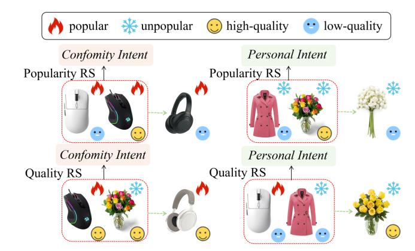
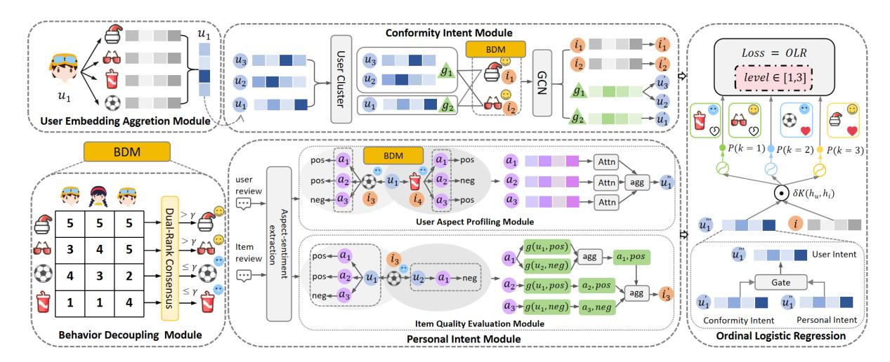
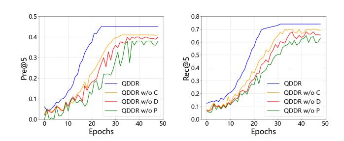
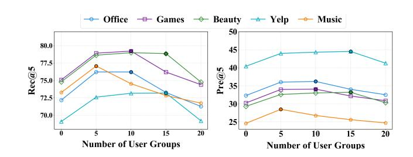
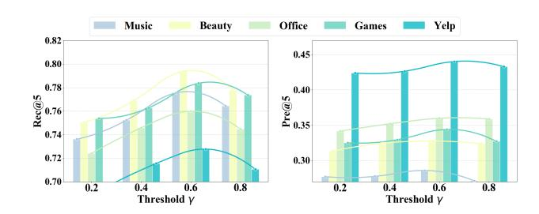
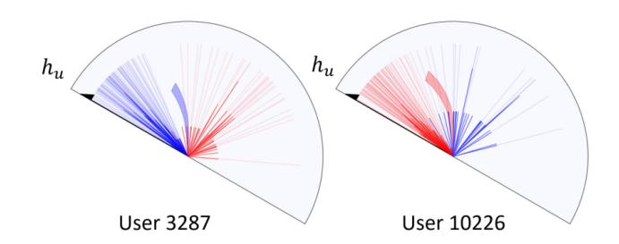
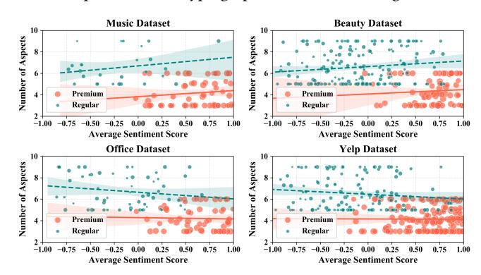

# QDDR: Quality-Driven Intent Disentanglement with Dual-Path Modeling for Recommendation

Nengjun Zhu Shanghai University Shanghai, China zhu\_nj@shu.edu.cn

Yixun Lu Shanghai University Shanghai, China Lu\_yx@shu.edu.cn

Qi Zhang TongJi University Shanghai, China zhangqi\_cs@tongji.edu.cn

## Abstract

Recent advances in intent-aware recommender systems have made significant progress in disentangling diverse user motivations from historical interactions. However, these methods predominantly rely on item popularity as the key signal for modeling user intents, overlooking the more fundamental factor of item quality. This overreliance on popularity tends to persistently recommend popular yet mediocre-quality items, thereby strengthening the filter bubble effect. Simultaneously, many high-quality items that lack widespread popularity struggle to gain adequate exposure. Inspired by this observation, we propose a novel Quality-Driven Intent Disentanglement framework, QDDR. QDDR classifies items and identifies premium items as those with consistently high quality that trigger conformity-driven behavior, while regular items invoke aspectspecific personal preferences. For premium items, we aggregate user behavior at the group level to distill a shared conformity representation. For regular items, we construct a hypergraph from aspect-sentiment pairs to model nuanced personal intents. Extensive experiments on five real-world datasets validate that QDDR consistently outperforms state-of-the-art baselines by effectively mitigating the popularity-quality bias and improving both the accuracy and diversity of recommendations.

## CCS Concepts

• Computing methodologies → Feature selection.

### Keywords

Premium Items, Regular Items, Intent Disentanglement, Aspect

### ACM Reference Format:

Nengjun Zhu, Yixun Lu, and Qi Zhang. 2026. QDDR: Quality-Driven Intent Disentanglement with Dual-Path Modeling for Recommendation. In Proceedings of the ACM Web Conference 2026 (WWW '26), April 13–17, 2026, Dubai, United Arab Emirates. ACM, New York, NY, USA, [9](#page-8-0) pages. <https://doi.org/10.1145/3774904.3792640>

### 1 Introduction

Recommender systems are pivotal to user modeling, personalization, and recommendation, serving as indispensable tools for alleviating information overload and connecting users with content across diverse Web platforms. User intent plays a critical role in shaping these Web interactions and can be inferred from multiple

[This work is licensed under a Creative Commons Attribution 4.0 International License.](https://creativecommons.org/licenses/by/4.0) WWW '26, Dubai, United Arab Emirates

© 2026 Copyright held by the owner/author(s). ACM ISBN 979-8-4007-2307-0/2026/04 <https://doi.org/10.1145/3774904.3792640>

Figure 1: The Misalignment between Popularity and Quality in Recommendation Systems.

signals [\[22\]](#page-8-1) [\[34\]](#page-8-2). Consequently, accurately discerning and modeling these intents is central to generating precise and persuasive Web recommendations.

Recently, a line of work has resorted to disentangling user intents to capture different motivations behind user behaviors. For example, in the context of sequential recommendation, Ding et al. [\[4\]](#page-8-3) explicitly defined intent types such as matching and substitution to model content-level transition logic in fashion recommendations. Similarly, Ren et al. [\[27\]](#page-8-4) proposed generic intents, including repeat purchase and exploration of new items, to handle both repetitive and exploratory behavior in session-based recommendation. Zhu et al. [\[43\]](#page-8-5) defined intent types, including focused intents and emerging intents, to capture the dichotomy between exploitation of existing preferences and exploration of new interests in next-item recommendation. Among these, the most relevant to our work is the effort to decouple conformity behaviors and personalized behaviors [\[26\]](#page-8-6). This work proposed a self-supervised framework to disentangle the two types of behaviors, aiming to improve recommendation performances in scenarios where the collectivity factor and individual preference interact.

However, this method predominantly relies on item popularity as the key signal for modeling user intents, e.g., treating popular items interacted by a user as his response to the conformity intent and unpopular ones as his response to the personalized requirement. This assumption is too simple and might face the following challenges: 1) Popular items do not always have high quality[1](#page-0-0) , which is defined by the agreement in positive evaluations from the user community.

1This conclusion has been validated on our experimental datasets, Office Dataset, in which at least 30% of popular items have low quality.

Thus, from the perspective of item quality, recommending a popular item still has a high risk of disappointing a user with conformity intent; 2) The system tends to persistently recommend popular yet mediocre-quality items, thereby reinforcing the filter bubble; 3) Many high-quality but less popular items struggle to gain adequate exposure, degrading user experience.

Therefore, rather than item popularity, the mentioned item quality is more appropriate for modeling user conformity and personal intents. It is user-centric and aligns naturally with the psychological drivers of intent. As established in shopping psychology [\[9\]](#page-8-7), while conformity intent manifests as following the crowd, it is fundamentally a risk-aversion strategy where users seek items with a strong consensus of positive evaluations for a safe choice. This makes such items the true target of conformity-driven behavior, regardless of their absolute popularity. In contrast, personal intent arises from the desire for self-expression, where choices are made through a deliberate evaluation of how well an item's specific aspects align with the user's internal requirement. Obviously, the alignment between personal intent and the item popularity is not significant either. Fig. [1](#page-0-1) simply illustrates the difference between popularity-based and quality-based RS. When identifying a user with conformity intent, the former usually recommends similar popular items, while the latter recommends similar high-quality items. In contrast, when identifying a user with personal intent, the former usually models user preference according to unpopular items, while the latter focuses more on the mediocre-quality items, e.g., the ones having divergent comments but are still chosen by the user. In most situations, these two intents co-affect the recommendations according to an intent distribution, whether in popularity-based or in quality-based RS.

To this end, we propose QDDR, a quality-driven intent disentanglement framework. Specifically, we define premium items as those receiving consistently positive evaluations across users, and define regular items as those that exhibit divergent opinions. As mentioned in shopping psychology [\[9\]](#page-8-7), users exhibit conformity intent primarily under decision uncertainty and when a clear consensus signal exists. Premium items naturally satisfy these conditions, triggering genuine conformity intent. In contrast, personal intent stems from the desire for specific functional aspects, which is best reflected in the divergent evaluations of regular items that lack a quality consensus. Accordingly, for premium items, we design the Conformity Intent Module (CIM), which models conformity intent by aggregating user preferences into group-level representations through clustering and consensus formation. For regular items, the Personal Intent Module (PIM) captures aspect-driven personal intents by constructing a hypergraph that connects users, items, and aspect-sentiment pairs from reviews. The two intent representations are then integrated adaptively and used in an Ordinal Logistic Regression framework that respects the natural ordering of user preference levels.

Our key contributions are summarized as follows:

- To the best of our knowledge, it is the first effort that proposes a quality-driven framework for intent disentanglement, where user conformity and personal intents are modeled explicitly through the differentiation of items into premium and regular categories.

- We propose a novel framework called QDDR, which includes specific solutions to user behavior decoupling, conformity exploitation, and personal exploration.
- Extensive experiments on five real-world datasets show the superiority of our QDDR compared with various state-ofthe-art solutions.

### 2 Related Work

Our work lies at the intersection of review-based recommendation and intent-based recommendation. Specifically, review-based recommendation methods provide the mechanisms to exploit user reviews not only for assessing item quality to categorize items, but also for modeling the aspect-level preferences that are crucial for capturing personal intent. Meanwhile, intent-based recommendation methods inspire our approach to decouple user behaviors into conformity and personal intents. Below, we review these two lines of work in detail.

## 2.1 Review-based Recommendation

A number of review-based recommendation models have been developed to enhance rating prediction performance. Existing research mainly comprises approaches that learn representations from reviews themselves and those that model interaction dynamics based on review content [\[31\]](#page-8-8).

Significant efforts concentrate on extracting multi-level semantic features from reviews. The advent of deep learning introduced CNNbased models like ConvMF [\[11\]](#page-8-9) and DeepCoNN [\[41\]](#page-8-10) to capture local semantic patterns. Attention mechanisms further advanced feature extraction, as seen in CARL [\[38\]](#page-8-11) and DAML [\[18\]](#page-8-12). For finer granularity, several models focus on aspect-level sentiments: ANR [\[2\]](#page-8-13) learns aspect-based representations for users and items using an attention module, while CAPR [\[13\]](#page-8-14) and ARPM [\[12\]](#page-8-15) construct preference vectors through aspect and sentiment analysis. Graph-based models have also been applied; RGNN [\[23\]](#page-8-16) constructs a graph for each user where words are nodes and their sequential order forms edges, and SENGR [\[29\]](#page-8-17) enhances representations by incorporating sentiment signals into a graph neural network.

Another direction models user-item interactions through review representations, dynamically identifying features for each pair. D-Attn [\[28\]](#page-8-18) employs dual attention at word and review levels, while HTI [\[36\]](#page-8-19) mutually propagates textual features. To handle review quality, NARRE [\[1\]](#page-8-20) weights reviews by usefulness, and NRCA [\[19\]](#page-8-21) employs cross-attention across modeling paradigms. Recent models like DSRLN [\[21\]](#page-8-22) stack attention layers to capture both static and dynamic interests. However, these approaches typically apply homogeneous modeling to all interactions, failing to distinguish conformity behaviors from aspect-specific preferences, resulting in entangled representations.

# 2.2 Intent-based Recommendation

Intent-aware recommender systems can be broadly categorized into those that model a single dominant intent and those that account for multiple intents. Single-intent methods typically assume that all user interactions within a session are driven by one overarching purpose. For instance, ICM [\[25\]](#page-8-23) infers user intent by identifying items similar to the last interaction in a session. CSTUR [\[5\]](#page-8-24) defines intent based on the last clicked item and its category. Alternatively, BINNR [\[17\]](#page-8-25) employs a recurrent neural network to model session sequences. While effective in capturing a primary session goal, these approaches often struggle with "unexpected" items that deviate from the main intent, potentially overlooking diverse or evolving user interests.

Multi-intent methods have been developed to capture the complexity of user behavior [\[6,](#page-8-26) [14,](#page-8-27) [30,](#page-8-28) [37\]](#page-8-29). MSGI [\[7\]](#page-8-30) treats locally consecutive item groups as distinct intents and uses a multi-granularity graph to model their interactions. KA-MemNN [\[42\]](#page-8-31) utilizes item categories as proxies for intents to learn intent-specific user representations. KGIN [\[35\]](#page-8-32) models an intent as an aggregation of knowledge graph relations, naturally generating multiple intents. MCPRN [\[33\]](#page-8-33) features dedicated channels for different intents and routes each item to the appropriate channel via a purpose-routing network. However, these approaches primarily rely on signals like item popularity or sequential patterns to define and disentangle user intents, which introduces a bias by conflating an item's popularity with its quality.

### 3 QDDR Method

### 3.1 Problem Definition

Let �� = {��1, ��2, ..., ����} denote the set of users, �� = {��1,��2, ...,����} denote the set of items. Each item �� has a rating score ����,�� and a review ����,�� given by user ��. The interactions are represented by a user–item rating matrix �� ∈ R ��×��, where ����,�� ∈ {0, 1, 2, 3, 4, 5}. Here, ����,�� = 0 denotes no interaction.

For each �� ∈ �� , the goal is to predict the rating that user �� would score towards an unobserved item.

### 3.2 Overall Framework

We propose QDDR (a Quality-Driven Intent Disentanglement with Dual-Path Modeling for Recommendation) by decoupling user behavior and modeling user intent, and its framework is shown as Fig. [2.](#page-3-0) QDDR has four components:

1) Behavior Decoupling Module (BDM): It categorizes items into two types of user behaviors, i.e., premium items and regular items. Items exhibiting consistently high ratings with low dispersion and uniformly positive sentiment signals from reviews are considered to represent reliable quality, triggering user conformity behavior. In contrast, items with divergent ratings and mixed sentiment opinions from reviews reflect subjective personal intent. BDM synthesizes these dual signals into a unified quality score for each item. By comparing the final score with ��, it classifies an item as premium if the score exceeds ��, or regular otherwise.

2) Conformity Intent Module (CIM): It is predicated on a core psychological tenet: users exhibit conformity primarily when making decisions under uncertainty and in the presence of a clear, reliable consensus signal. Premium items, by definition, fulfill these conditions perfectly. Their consistently high ratings and uniform positive sentiment constitute an unambiguous, low-risk quality signal, making them ideal catalysts for conformity behavior. In contrast, the ambiguous and conflicting signals from regular items offer no such clear conformity. Therefore, conformity intent is not merely correlated with but is causally triggered by the unambiguous quality consensus inherent to premium items. To operationalize

this, the CIM classifies users into groups, deriving an individual's conformity representation from the aggregated preferences of their cohort towards these consensus-driven items.

3) Personal Intent Module (PIM): Interactions with regular items, which exhibit dispersed ratings and heterogeneous reviews, actually reflect each person's unique taste. Such items do not benefit from a uniform quality consensus; Instead, user intents are guided by fine-grained likes for specific aspects of items. Therefore, the PIM introduces aspect-driven modeling, where users and items are represented in terms of the aspects mentioned in reviews. It uses a hypergraph to model relationships among users, regular items, aspects, and sentiments. Specifically, user subgraphs are constructed by modeling associations between users and the aspects they have reviewed. Item subgraphs capture items' performance across aspects by modeling the aspects mentioned about them and users' sentiments on these aspects.

4) Ordinal Logistic Regression (OLR): It is motivated by the understanding that user preferences exhibit a natural ordinal structure. Merely predicting a preference score fails to capture the qualitative difference between disliking an item, liking a regular item, and liking a premium item. Therefore, the OLR module formulates recommendations as an ordinal ranking problem, ensuring that the model's predictions respect this hierarchy of engagement levels.

### 3.3 Behavior Decoupling Module

BDM utilizes users' ratings and reviews on items to adequately identify the differences between them, thereby classifying items into two distinct categories: premium items and regular items. Premium items are those receiving consistently positive evaluations across users, whereas regular items exhibit divergent opinions. Traditional methods predominantly rely on rating information to model the quality of items, which fails to capture the sentiment signals from user reviews. These sentiment signals expressed at the aspect level offer a more reliable reflection of item quality.

To leverage textual information, we extract aspect-sentiment pairs from user reviews using the unsupervised method [\[16\]](#page-8-34). Each aspect-sentiment pair consists of a specific item attribute and the corresponding user sentiment expressed toward that aspect. The sentiment values are quantified [\[16\]](#page-8-34), which classifies each sentiment expression into one of three categories: negative, neutral, or positive, represented numerically as {−1, 0, 1}.

First, we calculate the average score �� ������ �� of the item �� based on all users' ratings for it. Then, we obtain the frequency distribution of each rating level, denoted as ���� (��), where �� = 0, 1, 2, 3, 4, 5 and Í5 ��=0 ���� (��) = 1. Therefore, we can calculate the rating information entropy (IE) of an item to evaluate its quality:

������ �� = − ∑︁ 5 ��=0 ���� (��)������(���� (��)) (1)

Similarly, for the extracted aspect-sentiment pairs, we calculate the average sentiment score �� avg �� as the mean of all sentiment values. We derive the frequency distribution of sentiment levels ���� (��), where �� ∈ {−1, 0, 1} and Í1 ��=−1 ���� (��) = 1. The sentiment information entropy ������ is computed using the same formulation as ������ .

These four indicators collectively characterize an item's quality perception: a high average rating or sentiment score suggests

for evaluation purposes: Musical Instruments, Office Products, Toys and Games, Beauty, which are respectively abbreviated as Music, Office, Toys, and Beauty. The specific details of these experimental datasets are summarized in Table [1.](#page-5-0)

Table 1: Dataset Statistics

| Dataset | #Users | #Items | #Ratings  | #Density |
|---------|--------|--------|-----------|----------|
| Music   | 1,429  | 900    | 10,261    | 0.80%    |
| Office  | 4,905  | 2,420  | 53,228    | 0.45%    |
| Games   | 19,412 | 11,924 | 167,597   | 0.07%    |
| Beauty  | 22,363 | 12,101 | 198,502   | 0.07%    |
| Yelp    | 26,084 | 65,786 | 3,519,533 | 0.04%    |

### 4.2 Baseline

We compare QDDR with the following three types of baselines. The traditional rating-based method includes PMF. Review-based methods include: DeepCoNN, DAML, ANR, DSRLN, MA-GNNs, RGNN, APH. Methods for modeling conformity and personal intent include: INS4NR. Additionally, building on the aforementioned intent-modeling approach, we also include a novel method that incorporates a review modeling module—INS4NR+Review—as a comparative baseline.

Specifically, 1) PMF [\[24\]](#page-8-36) probabilistically factorizes the user-item rating matrix into low-dimensional user and item latent factors. 2) DeepCoNN [\[41\]](#page-8-10) employs two parallel neural networks to model user preferences and item properties from all associated review texts. 3) DAML [\[18\]](#page-8-12) utilizes a meta-learning framework to learn model parameters that can quickly adapt to new domains with minimal data. 4) ANR [\[2\]](#page-8-13) aligns user and item representations using an attention mechanism focused on specific aspects mentioned in reviews. 5) DSRLN [\[21\]](#page-8-22) learns a comprehensive user representation by capturing both long-term static preferences and short-term dynamic interests from interaction sequences. 6) MA-GNNs [\[40\]](#page-8-37) capture session-based recommendations by combining a GNN for short-term session interests with a memory network for long-term user interests. 7) RGNN [\[23\]](#page-8-16) employs a relational graph neural network to aggregate information from neighboring nodes based on different relation types. 8) APH [\[20\]](#page-8-38) models high-order correlations among users, items, and review aspects via an aspect performanceaware hypergraph neural network. 9) INS4NR [\[26\]](#page-8-6) disentangles user intents into conformity and personalization components to recommend long-tail items. 10) INS4NR+Rev extends INS4NR by integrating a review modeling module to use textual information.

### 4.3 Setup

For each dataset, we randomly choose 20% of the user-item interaction pairs (denoted by ����������) for evaluating the model performance in the testing phase, and the remaining 80% of the interaction pairs (denoted by ������������) are used in the training phase. To evaluate the performance of our method, we use Precision (Pre) and Recall (Rec) to evaluate the Top-K performance.

### 4.4 Performance Comparison

Table [2](#page-6-0) illustrates the overall performance of our proposed model and the baselines across five datasets (Music, Beauty, Office, Games, Yelp) in terms of Pre@5 and Rec@5. The following observations can be drawn from the results:

Firstly, our model consistently outperforms all baseline methods on every dataset across both evaluation metrics, demonstrating its effectiveness and generalizability. For instance, on the Beauty dataset, our model improves Pre@5 by 3.85% and Rec@5 by 1.28% over the strongest baseline APH. Similarly, on the Games dataset, it achieves a relative improvement of 3.01% in Pre@5 and 2.15% in Rec@5 compared to APH.

Secondly, traditional rating-based methods like PMF are consistently outperformed by review-enhanced neural approaches such as DeepCoNN, DAML, and ANR. This demonstrates the value of leveraging review semantics to enrich user and item representations. Among these, graph-based models, including RGNN, MA-GNNs, DSRLN, and APH, achieve further improvements, validating the benefit of explicitly modeling relational structure and interaction dependencies. It is worth noting that these methods leverage user review information to enrich their representations of users and items, highlighting the general effectiveness of incorporating user reviews for improving recommendation accuracy.

Thirdly, to more fairly evaluate the effect of intent modeling, we specifically compare with IDS4NR+Rev, which enhances the original intent modeling framework with review information. Despite this augmentation, our model, which employs a quality-driven dual path architecture, consistently surpasses IDS4NR+Rev across all datasets. For example, our approach exceeds IDS4NR+Rev by 3.63% in Pre@5 on Office and by 6.27% in Rec@5 on Games. This performance advantage stems from our fundamental distinction between premium and regular items based on quality consistency, which enables more precise modeling of conformity and personal intents. While IDS4NR+Rev relies primarily on popularity signals for intent separation, our method identifies high-quality items that trigger authentic conformity behavior, thereby achieving more accurate intent disentanglement.

Finally, we observe that the performance margins between our model and others are more pronounced on certain datasets, such as Games and Beauty, which is attributed to the characteristic diversity of user intents and the richness of aspect-level information in these domains. Our model's aspect-aware hypergraph construction and quality-driven intent separation prove particularly effective in such scenarios, enabling fine-grained capture of personal preferences while maintaining accurate conformity modeling for premium items.

### 4.5 Ablation Study

To evaluate the contribution of each key component in our proposed model, we conducted a comprehensive ablation study comparing the full model against several variants: QDDR-w/o-C, QDDR-w/o-P, QDDR-w/o-D, and QDDR-w/o-O. QDDR-w/o-C and QDDR-w/o-P mean eliminating the CIM and PIM. QDDR-w/o-D represents the model without BDM. QDDR-w/o-O indicates the model where the ordinal logistic regression loss is replaced with standard crossentropy loss.

Table 2: Overall Model Performance on All Datasets with the Metrics of Rec@5 and Pre@5.

|               | Pre@5  | Music Rec@5 | Pre@5  | Beauty Rec@5 | Pre@5  | Office Rec@5 | Pre@5  | Games Rec@5 | Pre@5  | Yelp Rec@5 |
|---------------|--------|-------------|--------|--------------|--------|--------------|--------|-------------|--------|------------|
| PMF           | 0.2211 | 0.5233      | 0.1722 | 0.4155       | 0.2033 | 0.4922       | 0.1822 | 0.5055      | 0.2833 | 0.3322     |
| DeepCoNN      | 0.2411 | 0.6855      | 0.2922 | 0.7055       | 0.2622 | 0.7399       | 0.2622 | 0.6422      | 0.3322 | 0.6955     |
| DAML          | 0.2555 | 0.7055      | 0.2322 | 0.6955       | 0.3222 | 0.6822       | 0.2622 | 0.6655      | 0.3922 | 0.6199     |
| ANR           | 0.2499 | 0.7255      | 0.2822 | 0.7355       | 0.2922 | 0.7199       | 0.2822 | 0.6999      | 0.3599 | 0.6622     |
| IDS4NR        | 0.2655 | 0.7199      | 0.2855 | 0.7155       | 0.3255 | 0.7255       | 0.3155 | 0.7055      | 0.3899 | 0.6799     |
| MA-GNNs       | 0.2722 | 0.7255      | 0.2999 | 0.7155       | 0.3255 | 0.7222       | 0.3055 | 0.6999      | 0.3855 | 0.6699     |
| RGNN          | 0.2722 | 0.7422      | 0.3022 | 0.7555       | 0.3299 | 0.7399       | 0.2855 | 0.7199      | 0.3899 | 0.6955     |
| IDS4NR+Review | 0.2755 | 0.7610      | 0.3055 | 0.7522       | 0.3322 | 0.7399       | 0.3099 | 0.7455      | 0.4255 | 0.7222     |
| DSRLN         | 0.2799 | 0.7555      | 0.3099 | 0.7699       | 0.3422 | 0.7422       | 0.2722 | 0.7131      | 0.4322 | 0.7299     |
| APH           | 0.2799 | 0.7599      | 0.3199 | 0.7799       | 0.3499 | 0.7455       | 0.3322 | 0.7755      | 0.4355 | 0.7022     |
| QDDR          | 0.2855 | 0.7722      | 0.3322 | 0.7899       | 0.3622 | 0.7622       | 0.3422 | 0.7922      | 0.4455 | 0.7322     |

\*Bold value indicates the best performance in each column, and the value with an underline is the second one.

Table 3: Rec@5 results of ablation study.

| Ablation | Music  | Beauty | Office | Game   | Yelp   |
|----------|--------|--------|--------|--------|--------|
| w/o-C    | 0.7460 | 0.7638 | 0.7282 | 0.7575 | 0.7080 |
| w/o-P    | 0.7124 | 0.7237 | 0.6985 | 0.7218 | 0.6742 |
| w/o-D    | 0.7306 | 0.7480 | 0.7206 | 0.7496 | 0.6934 |
| w/o-O    | 0.7691 | 0.7712 | 0.7413 | 0.7689 | 0.7153 |
| QDDR     | 0.7691 | 0.7874 | 0.7585 | 0.7891 | 0.7299 |

Figure 3: Ablation study on YELP.

As shown in Table [2](#page-6-0) and Fig. [3,](#page-6-1) QDDR-w/o-P causes the most significant performance degradation across all datasets, with decreases of approximately 7.6% on Music, 8.1% on Beauty, 7.9% on Office, 8.5% on Game, and 7.6% on Yelp compared to the full model. The training dynamics in Fig. [3](#page-6-1) further illustrate this gap, where the QDDR-w/o-P curve consistently lags behind other variants throughout the training process, exhibiting slower convergence and greater instability. This demonstrates that modeling fine-grained aspect-level user preferences and item characteristics is essential for effective recommendations.

Removing the BDM results in noticeable performance degradation, particularly evident on the Beauty and Game datasets. This decline underscores the importance of our approach to segment items into premium and regular categories for specialized modeling. Without BDM's strategic partitioning, the CIM is contaminated by "noisy" regular items, which, due to their divergent user

opinions, undermine the module's ability to distill a clear group consensus. Conversely, the PIM's capacity to discern fine-grained, aspect-specific preferences is diluted by the inclusion of premium items, typically showing homogeneous and less nuanced feedback.

Furthermore, replacing the OLR loss with cross-entropy leads to a modest but consistent performance drop. This verifies that explicitly modeling the ordinal nature of user preference levels, such as disliked, liked regular items, and liked premium items, provides a more nuanced learning signal than treating these levels as independent categories. The OLR loss enhances ranking accuracy by respecting the inherent order of user preferences.

### 4.6 Hyper-parameter Study

Figure 4: Impact of user groups on CIM.

Figure 5: Impact of Threshold on BDM.

1) Impact of user groups on CIM: The number of user groups in the CIM directly affects the ability to capture users' group-level preferences. To evaluate its influence, we change the user group number from 0 to 20, and the results are shown in Fig. [4.](#page-6-2) We can observe that as the number of user groups grows, the performance across all datasets first increases and then decreases. This is because an insufficient number of groups fails to capture the diversity of user preferences, leading to coarse-grained representations, while an excessive number fractures the user base and ultimately undermines the model's ability to learn a stable group consensus. Yelp's diverse business landscape fosters a heterogeneous user base with varied preferences, thus requiring a greater number of groups to accurately model users' complex intents. In contrast, the Beauty and Games datasets, which focus on more specific product categories, may exhibit a stronger overall consensus among users, requiring fewer groups to model their conformity intents.

2) Impact of Threshold ��: The threshold �� plays a critical role in distinguishing premium items from regular items. To evaluate its influence, we adjust the value of �� and present the results in Fig. [5.](#page-6-3) We observe that all datasets achieve optimal performance near �� = 0.6. This trend can be explained as follows: when �� is too small, an excessive number of items are classified as premium. While this provides more data for capturing group preferences, it introduces noise into the premium modeling branch and reduces the number of aspects available for modeling user-specific preferences in the regular branch, ultimately limiting personal recommendation accuracy. Conversely, when �� is too large, too few items qualify as premium. This leads to sparse group preference data that is difficult to model reliably, while simultaneously introducing numerous useless aspects into the hypergraph construction for regular items.

Figure 6: Distribution of Premium Items and Regular Items.

### 4.7 The validity of Behavior Decoupling Module

To evaluate the influence of the BDM, we first analyze the intrinsic characteristics of items across the four datasets. We ensure the data distributionally aligns with real user behavior patterns by sampling items according to the natural proportion of premium and regular items in each dataset. In Fig. [6,](#page-7-0) we can observe that premium items concentrate in the lower-right region, exhibiting higher aspect ratings with fewer aspects and larger bubbles, which means average higher user ratings. In contrast, regular items scatter in the upperleft area, characterized by lower aspect ratings, more aspects, and

smaller bubbles, which means lower user average ratings. This distinct divergence strongly supports the rationality of decoupling user behaviors: items with consistently high ratings and focused aspects manifest herd behavior, while those with dispersed aspects and unstable ratings reflect personal preferences, necessitating finegrained aspect-aware modeling.

### 4.8 Case Study

To visualize the behavior patterns captured by our model, we conduct a case study on two users from the Beauty dataset, as illustrated in Fig. [7.](#page-7-1) User 3287 exhibits strong interactions with premium items and limited interactions with regular items. The model successfully reflects this preference: in the learned representation space, the distance between the user representation and premium items is significantly smaller than that to regular items. In contrast, User 10226 shows an opposite behavior—frequently interacting with regular items. Accordingly, the model outputs a closer proximity between the user's representation and regular items.

Figure 7: Case Study.

### 5 Conclusion

In this paper, we proposed QDDR, a novel quality-driven intent disentanglement framework for recommender systems. Our key insight is that user behaviors are fundamentally triggered by item quality rather than mere popularity. The framework strategically distinguishes premium items that elicit conformity from regular items that invoke personal intents. For premium items, we develop group-level modeling to capture conformity intent through consensus formation and graph propagation. For regular items, we construct aspect-sentiment hypergraphs to model personal preferences at a fine-grained level. Comprehensive experiments demonstrate QDDR's superiority over state-of-the-art baselines across multiple datasets, validating its effectiveness in mitigating popularity-quality bias and improving recommendation accuracy. Future work may explore temporal dynamics and multi-modal information to further enhance our quality-aware paradigm.

### Acknowledgments

This work is supported by National Natural Science Foundation of China under Grant No. 62202282 and 62406225, and the Fundamental ResearchFunds for the Central Universities.

- References [1] Chong Chen, Min Zhang, Yiqun Liu, and Shaoping Ma. 2018. Neural attentional rating regression with review-level explanations. In Proceedings of the World Wide Web Conference. 1583–1592. [2] Jin Yao Chin, Kaiqi Zhao, Shafiq Joty, and Gao Cong. 2018. ANR: Aspect-based neural recommender. In Proceedings of the ACM International Conference on Information and Knowledge Management. 147–156. [3] Morris H DeGroot. 1974. Reaching a consensus. J. Amer. Statist. Assoc. 69, 345 (1974), 118–121. [4] Yujuan Ding, Yunshan Ma, Wai Keung Wong, and Tat-Seng Chua. 2021. Modeling instant user intent and content-level transition for sequential fashion recommendation. IEEE Transactions on Multimedia 24 (2021), 2687–2700. [5] Ramazan Esmeli, Mohamed Bader-El-Den, and Alaa Mohasseb. 2019. Context and short term user intention aware hybrid session based recommendation system. In IEEE International Symposium on Innovations in Intelligent Systems and Applications. IEEE, 1–6. [6] Mike Gartrell, Ulrich Paquet, and Noam Koenigstein. 2017. Low-rank factorization of determinantal point processes. In Proceedings of the AAAI Conference on Artificial Intelligence, Vol. 31. [7] Jiayan Guo, Yaming Yang, Xiangchen Song, Yuan Zhang, Yujing Wang, Jing Bai, and Yan Zhang. 2022. Learning multi-granularity consecutive user intent unit for session-based recommendation. In Proceedings of the ACM International Conference on Web Search and Data Mining. 343–352. [8] Lei Guo, Hongzhi Yin, Tong Chen, Xiangliang Zhang, and Kai Zheng. 2021. Hierarchical hyperedge embedding-based representation learning for group recommendation. ACM Transactions on Information Systems 40, 1 (2021), 1–27. [9] Inwon Kang, Xue He, and Matthew Minsuk Shin. 2020. Chinese consumers' herd consumption behavior related to Korean luxury cosmetics: the mediating role of fear of missing out. Frontiers in psychology 11 (2020), 121. [10] Wang-Cheng Kang and Julian McAuley. 2018. Self-attentive sequential recommendation. In IEEE International Conference on Data Mining. IEEE, 197–206. [11] Donghyun Kim, Chanyoung Park, Jinoh Oh, Sungyoung Lee, and Hwanjo Yu. 2016. Convolutional matrix factorization for document context-aware recommendation. In Proceedings of the ACM Conference on Recommender Systems. 233–240. [12] Chin-Hui Lai and Chia-Yu Hsu. 2021. Rating prediction based on combination of review mining and user preference analysis. Information Systems 99 (2021), 101742. [13] Chenliang Li, Cong Quan, Li Peng, Yunwei Qi, Yuming Deng, and Libing Wu. 2019. A capsule network for recommendation and explaining what you like and dislike. In Proceedings of the International ACM SIGIR Conference on Research and Development in Information Retrieval. 275–284. [14] Pan Li, Maofei Que, Zhichao Jiang, Yao Hu, and Alexander Tuzhilin. 2020. PURS: personalized unexpected recommender system for improving user satisfaction. In Proceedings of the ACM Conference on Recommender Systems. 279–288. [15] Yinfeng Li, Chen Gao, Hengliang Luo, Depeng Jin, and Yong Li. 2022. Enhancing hypergraph neural networks with intent disentanglement for session-based recommendation. In Proceedings of the International ACM SIGIR Conference on Research and Development in Information Retrieval. 1997–2002. [16] Zeyu Li, Wei Cheng, Reema Kshetramade, John Houser, Haifeng Chen, and Wei Wang. 2021. Recommend for a reason: unlocking the power of unsupervised aspect-sentiment co-extraction. arXiv preprint arXiv:2109.03821 (2021). [17] Zhi Li, Hongke Zhao, Qi Liu, Zhenya Huang, Tao Mei, and Enhong Chen. 2018. Learning from history and present: Next-item recommendation via discriminatively exploiting user behaviors. In Proceedings of the ACM SIGKDD International Conference on Knowledge Discovery and Data Mining. 1734–1743. [18] Donghua Liu, Jing Li, Bo Du, Jun Chang, and Rong Gao. 2019. Daml: Dual attention mutual learning between ratings and reviews for item recommendation. In Proceedings of the ACM SIGKDD International Conference on Knowledge Discovery and Data Mining. 344–352. [19] Hongtao Liu, Wenjun Wang, Hongyan Xu, Qiyao Peng, and Pengfei Jiao. 2020. Neural unified review recommendation with cross attention. In Proceedings of the International ACM SIGIR Conference on Research and Development in Information Retrieval. 1789–1792. [20] Junrui Liu, Tong Li, Di Wu, Zifang Tang, Yuan Fang, and Zhen Yang. 2025. An Aspect Performance-aware Hypergraph Neural Network for Review-based Recommendation. In Proceedings of the ACM International Conference on Web Search and Data Mining. 503–511. [21] Tongcun Liu, Siyuan Lou, Jianxin Liao, and Hailin Feng. 2022. Dynamic and static representation learning network for recommendation. IEEE Transactions on Neural Networks and Learning Systems 35, 1 (2022), 831–841. [22] Yuxi Liu, Lianghao Xia, and Chao Huang. 2024. Selfgnn: Self-supervised graph neural networks for sequential recommendation. In Proceedings of the International ACM SIGIR Conference on Research and Development in Information Retrieval. 1609–1618. [23] Yong Liu, Susen Yang, Yinan Zhang, Chunyan Miao, Zaiqing Nie, and Juyong Zhang. 2021. Learning hierarchical review graph representations for recommendation. IEEE Transactions on Knowledge and Data Engineering 35, 1 (2021), 658–671. [24] Andriy Mnih and Russ R Salakhutdinov. 2007. Probabilistic matrix factorization. Advances in Neural Information Processing Systems 20 (2007). [25] Zhiqiang Pan, Fei Cai, Yanxiang Ling, and Maarten De Rijke. 2020. An intentguided collaborative machine for session-based recommendation. In Proceedings of the International ACM SIGIR Conference on Research and Development in Information Retrieval. 1833–1836. [26] Tieyun Qian, Yile Liang, Qing Li, Xuan Ma, Ke Sun, and Zhiyong Peng. 2022. Intent disentanglement and feature self-supervision for novel recommendation. IEEE Transactions on Knowledge and Data Engineering 35, 10 (2022), 9864–9877. [27] Pengjie Ren, Zhumin Chen, Jing Li, Zhaochun Ren, Jun Ma, and Maarten De Rijke. 2019. Repeatnet: A repeat aware neural recommendation machine for sessionbased recommendation. In Proceedings of the AAAI Conference on Artificial Intelligence, Vol. 33. 4806–4813. [28] Sungyong Seo, Jing Huang, Hao Yang, and Yan Liu. 2017. Interpretable convolutional neural networks with dual local and global attention for review rating prediction. In Proceedings of the ACM Conference on Recommender Systems. 297–
  - 305. [29] Liye Shi, Wen Wu, Wang Guo, Wenxin Hu, Jiayi Chen, Wei Zheng, and Liang He. 2022. SENGR: sentiment-enhanced neural graph recommender. Information Sciences 589 (2022), 655–669. [30] Kota Tsubouchi, Wataru Sasaki, Tadashi Okoshi, and Jin Nakazawa. 2020. Search wandering score: Predicting timings of online shopping based on wandering in user's web search queries. In IEEE International Conference on Big Data. IEEE, 1681–1688. [31] Bokun Wang, Yang Yang, Xing Xu, Alan Hanjalic, and Heng Tao Shen. 2017. Adversarial cross-modal retrieval. In Proceedings of the 25th ACM international conference on Multimedia. 154–162. [32] Jianling Wang, Kaize Ding, Ziwei Zhu, and James Caverlee. 2021. Session-based recommendation with hypergraph attention networks. In Proceedings of the SIAM International Conference on Data Mining. SIAM, 82–90. [33] Shoujin Wang, Liang Hu, Yan Wang, Quan Z Sheng, Mehmet Orgun, and Longbing Cao. 2019. Modeling multi-purpose sessions for next-item recommendations via mixture-channel purpose routing networks. In International Joint Conference on Artificial Intelligence. International Joint Conferences on Artificial Intelligence. [34] Xiao Wang, Tingting Dai, Qiao Liu, and Shuang Liang. 2024. Spatial-temporal perceiving: deciphering user hierarchical intent in session-based recommendation. In Proceedings of the International Joint Conference on Artificial Intelligence. 2415–2423. [35] Xiang Wang, Tinglin Huang, Dingxian Wang, Yancheng Yuan, Zhenguang Liu, Xiangnan He, and Tat-Seng Chua. 2021. Learning intents behind interactions with knowledge graph for recommendation. In Proceedings of the Web Conference. 878–887. [36] Jiahui Wen, Jingwei Ma, Hongkui Tu, Mingyang Zhong, Guangda Zhang, Wei Yin, and Jian Fang. 2020. Hierarchical text interaction for rating prediction. Knowledge-Based Systems 206 (2020), 106344. [37] Haolun Wu, Yingxue Zhang, Chen Ma, Wei Guo, Ruiming Tang, Xue Liu, and Mark Coates. 2023. Intent-aware multi-source contrastive alignment for tagenhanced recommendation. In IEEE International Conference on Data Engineering. IEEE, 1112–1125. [38] Libing Wu, Cong Quan, Chenliang Li, Qian Wang, Bolong Zheng, and Xiangyang Luo. 2019. A context-aware user-item representation learning for item recommendation. ACM Transactions on Information Systems 37, 2 (2019), 1–29. [39] Xin Xia, Hongzhi Yin, Junliang Yu, Qinyong Wang, Lizhen Cui, and Xiangliang Zhang. 2021. Self-supervised hypergraph convolutional networks for sessionbased recommendation. In Proceedings of the AAAI Conference on Artificial Intelligence, Vol. 35. 4503–4511. [40] Chenyan Zhang, Shan Xue, Jing Li, Jia Wu, Bo Du, Donghua Liu, and Jun Chang. 2023. Multi-aspect enhanced graph neural networks for recommendation. Neural Networks 157 (2023), 90–102. [41] Lei Zheng, Vahid Noroozi, and Philip S Yu. 2017. Joint deep modeling of users and items using reviews for recommendation. In Proceedings of the ACM International Conference on Web Search and Data Mining. 425–434. [42] Nengjun Zhu, Jian Cao, Yanchi Liu, Yang Yang, Haochao Ying, and Hui Xiong. 2020. Sequential modeling of hierarchical user intention and preference for next-item recommendation. In Proceedings of the International Conference on Web Search and Data Mining. 807–815. [43] Nengjun Zhu, Lingdan Sun, Xiangfeng Luo, Jian Cao, Qi Zhang, and Xinjiang Lu. 2024. Exploitation or exploration next? user behavior decoupling and emerging intent modeling for next-item recommendation. In IEEE International Conference on Data Mining. IEEE, 965–970.