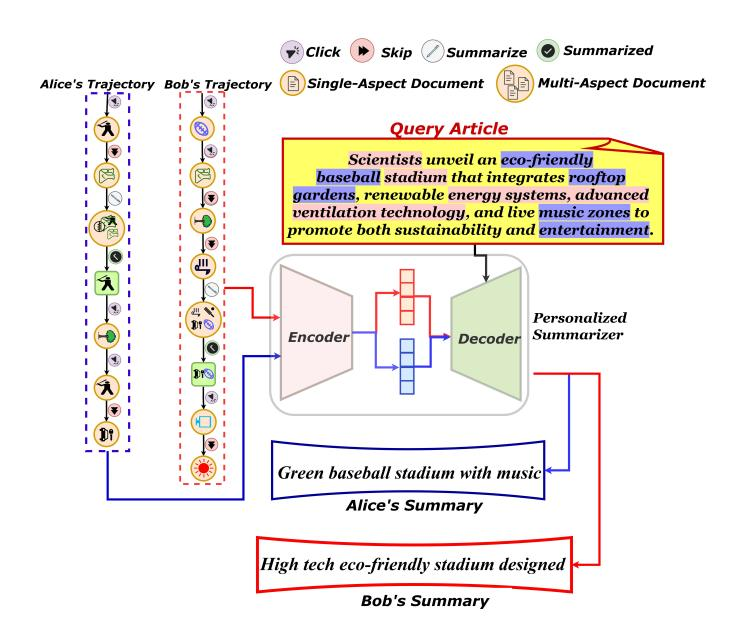
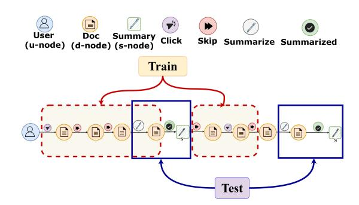
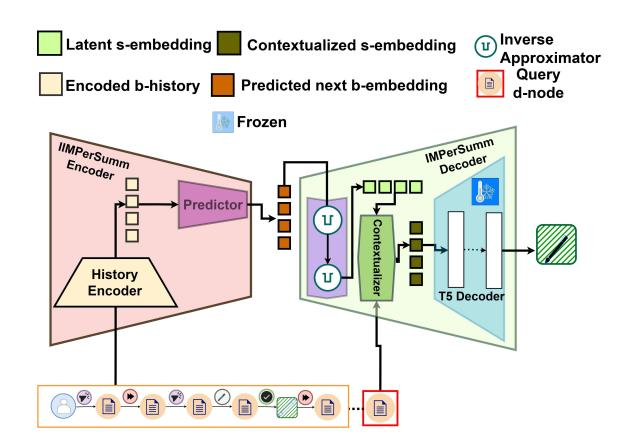
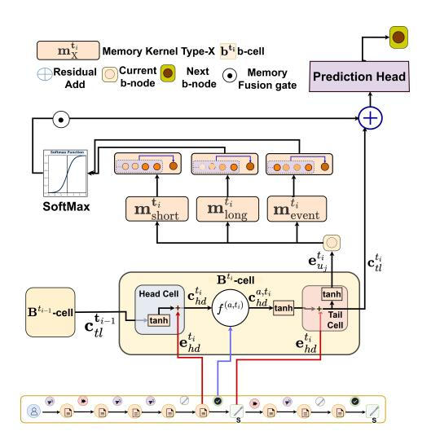
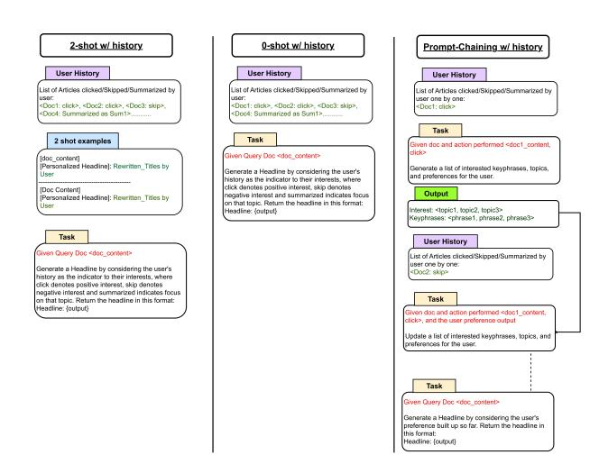

# **IMPerSumm**: Information-Modulated User Preference Modeling for Personalized Text Summarization

Parthiv Chatterjee KDM Lab, Dhirubhai Ambani University Gandhinagar, Gujarat, India 202421011@dau.ac.in

Dhara Jhaveri Adani University Ahmedabad, Gujarat, India DHARAJHAVERI.ict22@adaniuni.ac.in

Sourish Dasgupta KDM Lab, Dhirubhai Ambani University Gandhinagar, Gujarat, India sourish\_dasgupta@dau.ac.in

Tanmoy Chakraborty Indian Institute of Technology Delhi New Delhi, Delhi, India tanchak@iitd.ac.in

### Abstract

Document summarization helps readers focus on the content-ofinterest – a highly subjective and time-variant quantity, making personalized summarization essential. Prior state-of-the-art (SOTA) approaches either flatten evolving preferences into static personas, rely on LLM prompting that fails under long-horizon histories, or encode user interactions without explicit action types (click, skip, summarize, click summary), leaving preference dynamics undermodeled. To this end, we propose IMPerSumm, an informationmodulated user preference encoder for personalized text summarization. IMPerSumm represents user histories as trajectories in a user-interaction graph. It dynamically modulates the mutual information between past interactions and new action-induced signals over a trajectory, and models short-term reactivity, long-term drift, and rare-event reinforcement using memory kernels. We empirically evaluate IMPerSumm on three benchmark datasets – PENS, OpenAI-Reddit, and PersonalSum using PerSEval, a personalization metric with strong human correlation. IMPerSumm outperforms SOTA personalized summarizers (PENS, GTP, Signature-Phrase) by 0.43 ↑ (on avg.), and strong LLM baselines (DeepSeek-R1-14B, LLaMA-2-13B, Mistral-7B, Zephyr-7B) by 0.37 ↑. Strikingly, we also observe that although the IMPerSumm encoder is trained on the personalized summarization task on the PENS dataset, it outperforms SOTA news recommendation systems on the standard de-facto MIND benchmark dataset (accuracy gain w.r.t best: 2.5/3.5/6.6 ↑ w.r.t MRR/nDCG@5/10). This shows that the IMPerSumm encoder develops cross-task capability of news recommendation.

### CCS Concepts

• Information systems → Summarization; Personalization; Recommender systems.

# Keywords

Personalized text summarization, User preference modeling, Temporal preference drift, User interaction graphs, Recommender systems

[This work is licensed under a Creative Commons Attribution-NonCommercial-](https://creativecommons.org/licenses/by-nc-nd/4.0)[NoDerivatives 4.0 International License.](https://creativecommons.org/licenses/by-nc-nd/4.0) WWW '26, Dubai, United Arab Emirates © 2026 Copyright held by the owner/author(s). ACM ISBN 979-8-4007-2307-0/2026/04 <https://doi.org/10.1145/3774904.3792642>

#### ACM Reference Format:

Parthiv Chatterjee, Dhara Jhaveri, Sourish Dasgupta, and Tanmoy Chakraborty. 2026. IMPerSumm: Information-Modulated User Preference Modeling for Personalized Text Summarization. In Proceedings of the ACM Web Conference 2026 (WWW '26), April 13–17, 2026, Dubai, United Arab Emirates. ACM, New York, NY, USA, [12](#page-11-0) pages.<https://doi.org/10.1145/3774904.3792642>

#### Resource Availability:

The source code of this paper has been made publicly available at [https:](https://doi.org/10.5281/zenodo.18324258) [//doi.org/10.5281/zenodo.18324258.](https://doi.org/10.5281/zenodo.18324258)

# 1 Introduction

With information overload, personalized summarization is vital for tailoring updates to a reader's specific interests, especially for multi-aspect documents catering to diverse topics [\[6\]](#page-8-0). Most existing methods rely on static persona traits [\[8,](#page-8-1) [15,](#page-8-2) [21\]](#page-8-3). However, preference datasets representing user reading behavior, like MS/CAS PENS [\[2\]](#page-8-4), show that user interests shift over time at fine-grained subtopic levels. This poses a challenge even for state-of-the-art (SOTA) LLMs, which underperform when detailed user-interaction histories are injected in prompts for in-context personalized summarization [\[25,](#page-8-5) [32\]](#page-8-6).

Recent models aim to explicitly represent the evolving user interaction (i.e., click) trajectories. However, they fail to model either the temporal ordering of the user-interaction sequence or the nuances of the other user-interactions (e.g. skip, summarize, etc.) that affect the information content flow over the trajectory [\[2,](#page-8-4) [22,](#page-8-7) [29,](#page-8-8) [36,](#page-9-0) [43\]](#page-9-1). This is empirically shown from the benchmarking by Dasgupta et al. [\[6\]](#page-8-0) w.r.t. PerSEval, the only personalized summarization metric with strong human-judgment correlation.

To address this gap, we propose IMPerSumm, an encoder-decoderbased personalized summarizer that represents user reading history as an information-content (IC) flow modulated by user actions (click vs. skip). At each timestep, the IMPerSumm encoder aligns the current document's IC with the accumulated history, estimates the document novelty (thereby, new interest) using a Kernel Density Estimation (KDE)-based distributional surprise model, and modulates the flow accordingly. A multi-layer perceptron (MLP)-based header predicts the next behavior embedding that entangles the query document and the corresponding latent summary. The decoder then disentangles the latent summary embedding and generates a contextualized query embedding. This is then fed into a pre-trained frozen vanilla summary-decoder for the final personalized summary.

Figure 1: Personalized Summarization Pipeline: A behavioraware encoder–decoder encodes each user's trajectory as the prefence condition to generate personalized summaries of the same query article.

We pose three core research questions to investigate IMPerSumm's effectiveness as an end-to-end personalized summarizer:

- RQ-1: To what extent does explicit action-specific user encoding affect personalized summarization quality (w.r.t PSE) compared to SOTA RNN and Transformer-based encoders?
- RQ-2: Beyond encoder-based modeling, can stronger personalization emerge either from history-prompted mid-size LLMs or from oracle-style summarizers with access to gold references?
- RQ-3: How well does IMPerSumm's encoder trained for personalized summarization on news datasets (PENS and PersonalSum) generalize to the related task of personalized recommendation, compared to SOTA news recommendation models?

To address RQ-1, we use PENS [\[2\]](#page-8-4), Norwegian PersonalSum [\[50\]](#page-9-2), and OpenAI Reddit [\[41\]](#page-9-3) datasets. We benchmark the PENS summarization framework (augmented with NAML [\[43\]](#page-9-1), EBNR [\[29\]](#page-8-8), NRMS [\[44\]](#page-9-4) user encoder), GTP [\[36\]](#page-9-0) (using the TrRMIo encoder) and Signature-Phrase [\[3\]](#page-8-9), and observe that IMPerSumm yields 0.49/0.48/0.5↑ w.r.t PSE-JSD/SU4/METEOR. For RQ-2, we evaluate Zephyr-7B [\[38\]](#page-9-5), LLaMa2-13B [\[37\]](#page-9-6), Mistral-7B [\[19\]](#page-8-10), and DeepSeek-R1-14B [\[7\]](#page-8-11) as strong baselines. We observe that IMPerSumm outperforms the best baseline (DeepSeek-R1) by 0.27/0.41/0.42↑. We also follow Patel et al. [\[32\]](#page-8-6) to evaluate IMPerSumm against oracle BigBird-Pegasus [\[49\]](#page-9-7) and SimCLS [\[27\]](#page-8-12) (having access to gold references) – IMPerSumm outperforms by 0.32↑. For RQ-3, we evaluate the cross-task capability of the PENS-trained IMPerSumm-encoder by comparing against 30 strong news recommendation baselines on the standard, widely adopted MIND-large news recommendation dataset. We find that IMPerSumm's encoder surpasses the best baseline FastFormer-PLM-NR [\[45\]](#page-9-8) by 3.5/6.6↑ in terms of nDCG@5&@10 and 2.5↑ w.r.t. MRR.

### 2 Related Work

Personalized Summarization Evaluation: Personalized summarization aims to align generated summaries with a user's subjective expectations, as signalled by the evolving reading behavior (clicks, skips, summarize interactions). Traditional accuracy metrics fail to capture this personalization, as shown by Vansh et al. [\[40\]](#page-9-9), who proposed the EGISES metric. PerSEval [\[6\]](#page-8-0) refines EGISES by penalizing accuracy drops. We adopt PerSEval to evaluate our proposed IMPerSumm summarizer.

Training/Evaluation Datasets: Effective personalization demands datasets with (i) temporally-ordered user interactions, (ii) userspecific gold summaries for shared documents, and (iii) diverse, shifting topics. Unlike CNN/DM or MultiNews [\[9,](#page-8-13) [17\]](#page-8-14), PENS [\[2\]](#page-8-4) and translated PersonalSum [\[50\]](#page-9-2) satisfy these. We use both for our experiments, and also OpenAI-Reddit [\[41\]](#page-9-3) to synthetically derive temporal orders for personalized summarization. PENS logs clicks/skips and summaries per user, averaging 13.6 topics and 52.83 sub-topics, with topic change rates of 0.77/0.93 per step. Its fine-grained behavioral diversity makes it a standard benchmark [\[22,](#page-8-7) [36,](#page-9-0) [48\]](#page-9-10).

Personalized Summarizers: Most personalized summarizers assume a static user persona guided summarization (e.g., GSUM, CTRLSum, TMWIN, Tri-Agent) [\[8,](#page-8-1) [15,](#page-8-2) [20,](#page-8-15) [47\]](#page-9-11). On the other hand, models such as PENS augment external dynamic user-trajectory encoders such as NRMS, NAML, and EBNR [\[2,](#page-8-4) [29,](#page-8-8) [43,](#page-9-1) [44\]](#page-9-4). Others, such as GTP [\[36\]](#page-9-0), generate control but omit temporal distinctions. SCAPE integrates content and stylistic features [\[22\]](#page-8-7). However, none capture session-aware, action-specific dynamics. Although prompting LLMs with preference history, termed In-Context-Personalization Learning (ICPL) [\[32\]](#page-8-6), outperforms these models, it fails in practice. This is because most LLMs cannot handle long, complex prompts and suffer the "lost-in-the-middle" effect – i.e., they ignore important trajectory segments that are in the middle [\[11,](#page-8-16) [25,](#page-8-5) [33\]](#page-8-17). Moreover, richer preference cues can degrade personalization, illustrating the iCOPERNICUS "Paradox of Less is More" [\[32\]](#page-8-6). To capture action-specific dynamics, IMPerSumm leverages MI-based relevance [\[5,](#page-8-18) [39,](#page-9-12) [51\]](#page-9-13).

Personalized Summarization and Recommendation. While personalized summarization and recommendation have long evolved in parallel, recent work highlights their convergence. The PENS framework shows that user embeddings from recommendation models can guide abstractive summarization, while SumRecom [\[12\]](#page-8-19) casts summarization itself as a recommendation task via user feedback. Conversely, summarization enhances recommendation by generating explanatory profiles, as in PGHIS [\[26\]](#page-8-20). Multi-task approaches such as P5 [\[52\]](#page-9-14) further demonstrate that user preference signals transfer across retrieval, ranking, and generation. Collectively, these works point to a shared foundation in modeling user histories, with different outputs (ranked items vs. generated summaries). By enabling summarization-to-recommendation transfer without retraining, IMPerSumm advances this line toward unified user models bridging generative and predictive personalization.

# 3 Personalized Summarization: Formulation

In this direction, we introduce the User-Interaction-Graph (UIG), a data model for dynamic behavior trajectories.

pseudo-inverse approximation kernel. While eˆ (����+1 summ can also be fed to the internal frozen decoder (s-Decoder), it lacks the query document's representation completely.

Latent s-Node Contextualization. In contrast to the b-decoder and s-decoder, the IMPerSumm decoder contextualizes the extracted eˆ (����+1 �������� with the query document embedding using cross-attention. eˆ (����+1 �������� serves as the query, and the query document embedding e (���� ) �� acts as both key and value, resulting in the contextualized latent summary embedding e (����+1 ) p-summ as follows:

e (����+1 p-summ = SoftMax © « (����.eˆ (����+1 �������� ) ⊤ (���� .e (���� �� ) √ �� ª ® ¬ · ���� .�� (���� �� (4)

where ����, ���� and ���� are learnable projection matrices for the query, key, and value, respectively.

4.2.3 Task 3: Personalized Summarization. The document contextualized s-node e (����+1 p-summ is fed into a pre-trained frozen decoder of a summarization model. We use the T5-large [\[34\]](#page-8-27) decoder for this purpose.

Decoder Training. The decoder training objective (Ldec) is a linear combination of two loss functions, Generation Loss (Lgen) and the earlier encoder loss (Lenc; see Section [4.2.1\)](#page-4-0), as Ldec = �� · L������ + (1−��) · Lenc. Here Lgen is the cross-entropy loss between predicted tokens ��ˆ and ground-truth �� ∗ under teacher forcing with the frozen T5 decoder. Optimizing Lgen updates ���� , ����, ���� and inverse-mapping weights �� + summ, �� + �� . This ensures accurate latent s-node reconstruction eˆ (����+1) summ and stronger cross-attention with document embedding eˆ (����) �� , thus improving summary relevance.

#### 5 Evaluation

To evaluate IMPerSumm as an effective personalized summarizer, we investigate the three research questions discussed in Section [1.](#page-0-0)

## 5.1 Experiment Setup

Training Data. We construct UIGs from PENS, English-translated PersonalSum (via M2M-100 [\[10\]](#page-8-28)), and OpenAI (Reddit) as T P-D train , T PS-EN train , and T OAI train to train IMPerSumm. We sample 52K trajectories from T P-D train (avg. 134 ��-nodes, 5 ��-nodes each), 21K from T OAI train (avg. 39 ��-nodes, 10 ��-nodes), and 700 from T PS-EN train . Each trajectory is sliced before every (��–��) pair – forming training history �� ���� , query document ����, and target summary �� ∗ ���� �� .

Test Data. We prepare four test sets: T P-D test , T PS-EN test , and T OAI test for end-to-end personalized summarization, and T M test from MIND test data [\[46\]](#page-9-20) to test sequential recommendation. For T P-D test , each user's test trajectory �� ���� , sampled from PENS stage-2 subset, is incrementally built by appending one (��–��) pair at a time to the stage-1 click history. At step ��, �� ���� ℎ includes all prior (��–��) pairs up to �� − 1, and the �� ��ℎ d-node serves as query ����. We also insert 50–70 randomly sampled skipped ��-nodes per user. For T PS-EN test and T OAI test , we slice 500 and 3000 sampled trajectories, respectively, before each (�� − ��) pair. The test UIG T M test from MIND test data is created by augmenting the positive and negative targets as the tail-node of the last behavior with same history sequence (see Appendix [C\)](#page-10-0).

**IMPerSumm** Training. IMPerSumm is trained end-to-end over each user trajectory using Ldec, with optimization carried out via the Adam optimizer (PyTorch v2.0.1) at a learning rate of 1 × 10−3 . We train the full model for 10 epochs (approx. 30 hours) over 56K unique behavior sequences, using a batch size of 28. The decoder operates under teacher-forced supervision with a T5 backbone. Ldec enables the model to jointly learn dynamic behavior representations and generate summaries that are personalized, coherent, and faithful to both user history and source content.

#### 5.2 Baseline Personalized Summarizers

(1) Personalized Summarizer Models. For RQ-1, we compare three SOTA personalized summarizers: PENS [\[2\]](#page-8-4), GTP [\[36\]](#page-9-0), and Signature-Phrase [\[3\]](#page-8-9). PENS couples a pointer-generator with external user encoders; we use the strongest off-the-shelf variants– NAML (T-1), EBNR, and NRMS (T-1/T-2) [\[29,](#page-8-8) [43,](#page-9-1) [44\]](#page-9-4). GTP integrates the TrRMIo user encoder; Signature-Phrase performs sequence modeling over user-specific keyphrases. Architecturally, NAML uses multi-view additive self-attention, EBNR is a GRU over click order, NRMS implements multi-head self-attention, and TrRMIo utilizes full-sequence transformer. All baselines are fine-tuned end-to-end for 2 epochs on T P train.

(2) LLMs-as-summarizers. For RQ-2, we benchmark four frozen LLMs—Mistral-7B-Instruct [\[19\]](#page-8-10), DeepSeek-R1-14B [\[7\]](#page-8-11), LLaMA-2- 13B-Chat-HF [\[37\]](#page-9-6), and Zephyr-7B [\[38\]](#page-9-5)—using the best 0-shot/2-shot prompts from Patel et al. [\[32\]](#page-8-6) and prompt-chaining for DeepSeek-R1-14B and Mistral-7B-Instruct (details in App. [E.2\)](#page-11-1).

(3) Non-personalized Summarizers as Oracles. To further probe RQ-2, we evaluate BigBird-Pegasus [\[49\]](#page-9-7) and SimCLS [\[27\]](#page-8-12) following Vansh et al. [\[40\]](#page-9-9). We substitute each article's original title with the user's gold-reference title (cueing subjective preference). If exploited, these frozen models produce "personalized" summaries, effectively acting as oracles.

(4) News Recommendation Models. For RQ-3, we test IMPerSummencoder on next-interaction prediction and sequential recommendation. For next ��-node prediction, we use PENS-based NAML/EB-NR/NRMS; for recommendation, we compare against 23 sequential news recommenders, including DGAT [\[28\]](#page-8-29), GNEWSREC [\[18\]](#page-8-30), Fast-Former [\[45\]](#page-9-8), and MINER [\[1\]](#page-8-31).

### 5.3 Personalization Evaluation Metrics

Automated Personalization Metric. To evaluate IMPerSumm as a personalized summarizer, we adopt PerSEval (PSE), the only metric explicitly designed for personalized summarization [\[6\]](#page-8-0). We report three PSE variants – PSE-SU4, PSE-METEOR, and PSE-JSD, each having strong human-judgment correlation and also computational efficiency. Details of PerSEval is in Appendix [A.](#page-9-21)

Accuracy Evaluation. We also report the accuracy results of IMPerSumm based on Rouge-SU4 [\[23\]](#page-8-32) and Rouge-L [\[24\]](#page-8-33) metrics.

Encoder Evaluation. IMPerSumm's encoder is validated on next interaction prediction and sequential recommendation under RQ-3 using AUC, MRR, nDCG@5/10.

#### Human Judgment (HJ).

To validate IMPerSumm's human-alignment, we conducted a surveybased evaluation. In the survey, each participant[2](#page-5-0) was shown a pair of gold-reference summary and a model-generated summary for

2Demography: 139 male, 32 female graduate students from Computer Science, Humanities, Mathematics, & Natural Sciences.

a specific news article from the PENS dataset. Model-generated summaries were drawn from IMPerSumm, along with six other bestperforming baselines: PENS-NAML-T1, PENS-EBNR-T2, GTP, LLMs as DeepSeek-R1-14B and Mistal-7B under 2-shot w/history settings, and Bigbird-Pegasus as oracle. Model information was hidden to remove bias. Participants rated the model-generated summary similarity w.r.t the reference on a scale from 1 (low) to 6 (high). Each summary was rated by ≈4 respondents with a low average interagreement (Krippendorf-�� = 0.3), thereby indicating subjectivity. Hence, a higher average human rating with a low coefficientof-variation (CV) would indicate better alignment of the model.

We also interpolate human ratings of our baseline models on the multi-domain non-news OpenAI-Reddit dataset. It contains multiple human-rated summaries of 9 models (≈ 6 raters/summary). We identify the top-rated (i.e., 7) one per user as the human-preferred reference. We then measure the RMSD-divergence of the modelgenerated summaries from the reference on the SBert-embeddingspace. This leads to an average min-max range per rating map used for interpolation.

### 6 Results and Observations

In this section, we discuss the results in light of our three research questions. All results have statistical significance p &lt; 0.01.

### 6.1 RQ-1: **IMPerSumm** Performance

IMPerSumm outperforms SOTA specialized personalized summarizers that ignore action distinctions, achieving 0.48/0.47/0.49↑ on PSE-JSD/SU4/METEOR over the strongest baseline GTP(+TrRMIo). This demonstrates the effectiveness of explicit action-specific information modulation via dynamic memory kernels over uniform RNN or transformer attention (see results in Table [1\)](#page-6-0). When trained on the much smaller PersonalSum train UIG T PS-EN train , it achieves 0.53/0.51/0.52 on PSE-JSD/SU4/METEOR on the PersonalSum test UIG T PS-EN test , underscoring its effectiveness on tailored datasets. IMPerSumm also attains average boost 48.9/43.6↑ in terms of RG-SU4 and RG-L accuracy metrics. IMPerSumm also excels in survey-based HJ evaluation (CV = 0.08) despite inherent subjectivity, indicating stronger personalization, as well as in interpolated human ratings with low avg. RMSD from the references (Table [2\)](#page-6-1). Ablation: Effect of Memory Kernels. To assess action-specific encoding, we ablate IMPerSumm's encoder with a fixed cross-attention decoder in three settings: (i) base model w/o MI, (ii) with KDE-MI (MI Encoder), and (iii) KDE-MI w/ adaptively fused memory kernels (MI+S as MI w/ mshort, MI+SL as MI w/ mshort and mlong, MI+SLE as MI w/ mshort, mlong, and mevent or **IMPerSumm**-Full). The base model using cosine similarity performs worst, showing simplistic embedding-level similarity fails to capture preference shifts. Combining MI with mshort and mlong (MI+SL) achieves 97/96/95% of IMPerSumm-Full performance, confirming that actionaware modulation and dynamic memory kernels are critical.

Ablation: Effect of Contextualized Injection. In order to understand the effect of contextualized injection, we use the bestperforming MI+SLE encoder and compare ��-node injection (b-Decoder), reconstructed ��-node injection w/o document-context (s-Decoder), and w/ document-context (**IMPerSumm**-Full). We find

Table 1: RQ-1: Personalized Summarization on PENS (20k test docs). Baselines show reported means; **IMPerSumm** variants show mean ± 95% CI from three random resampling trials (25%, 50%, 75% subsets). IMPerSumm (Full) achieves 47–55% relative gain over the best baseline.

| Category                 | Model / Variant             |   |        | PSE-JSD      | PSE-SU4      | PSE-METEOR   |
|--------------------------|-----------------------------|---|--------|--------------|--------------|--------------|
| Personalized Summarizers |                             |   |        |              |              |              |
|                          | PENS-NAML-T1                |   |        | 0.021        | 0.014        | 0.016        |
|                          | PENS-EBNR-T1                |   |        | 0.015        | 0.010        | 0.011        |
|                          | PENS-EBNR-T2                |   |        | 0.011        | 0.008        | 0.009        |
|                          | PENS-NRMS-T1                |   |        | 0.015        | 0.011        | 0.011        |
|                          | PENS-NRMS-T2                |   |        | 0.008        | 0.007        | 0.007        |
|                          | GTP                         |   |        | 0.024        | 0.017        | 0.019        |
|                          | SP-Individual               |   |        | 0.017        | 0.015        | 0.014        |
|                          | Base Encoder + CA-Decoder   |   |        | 0.241 ± 0.02 | 0.013 ± 0.01 | 0.107 ± 0.02 |
|                          | MI-Encoder + CA-Decoder     |   |        | 0.311 ± 0.02 | 0.054 ± 0.01 | 0.274 ± 0.02 |
| IMPerSumm                | MI+S-Encoder + CA-Decoder   |   |        | 0.357 ± 0.02 | 0.056 ± 0.01 | 0.334 ± 0.02 |
|                          | MI+L-Encoder + CA-Decoder   |   |        | 0.387 ± 0.02 | 0.265 ± 0.02 | 0.402 ± 0.02 |
| (Encoder Ablations)      | MI+SL-Encoder + CA-Decoder  |   |        | 0.502 ± 0.02 | 0.483 ± 0.03 | 0.491 ± 0.03 |
|                          | MI+LE-Encoder + CA-Decoder  |   |        | 0.485 ± 0.02 | 0.436 ± 0.02 | 0.463 ± 0.03 |
|                          | MI+SE-Encoder + CA-Decoder  |   |        | 0.462 ± 0.02 | 0.447 ± 0.02 | 0.458 ± 0.02 |
| IMPerSumm                | MI+SLE-Encoder + s-Decoder  |   |        | 0.325 ± 0.02 | 0.096 ± 0.01 | 0.202 ± 0.01 |
|                          | MI+SLE-Encoder + b-Decoder  |   |        | 0.331 ± 0.02 | 0.106 ± 0.01 | 0.237 ± 0.02 |
| (Decoder Ablations)      | MI+SLE-Encoder + CA-Decoder | ( | Full ) | 0.518 ± 0.02 | 0.501 ± 0.03 | 0.514 ± 0.03 |

Table 2: Qualitative Comparison w.r.t ROUGE, Survey-based Human Eval (PENS Dataset; Krippendorf-�� = 0.3; CV: Coefficient-of-Variation), & Human Ratings (OpenAI-Reddit).

| Model          | Name RG-SU4 | RG-L  | Direct |           | Human Eval | RMSD | Interpolated Human Rating |
|----------------|-------------|-------|--------|-----------|------------|------|---------------------------|
| IMPerSumm      | -Full 63.61 | 66.51 | 3.15   | (CV=0.08) |            | 0.34 | 7                         |
| Mistral-7B     | 16.42       | 22.85 | 3.05   | (CV       | = 0.07)    | 0,79 | 5                         |
| BigbirdPegasus | 17.13       | 21.65 | 3.02   | (CV       | = 0.08)    | 0.81 | 5                         |
| DeepSeek-14B   | 19.57       | 29.72 | 3.0    | (CV       | = 0.08)    | 0.78 | 5                         |
| PENS-EBNR-T2   | 12.41       | 20.82 | 2.97   | (CV       | = 0.11)    | 0.93 | 2                         |
| PENS-NAML-T1   | 13.12       | 21.62 | 2.94   | (CV       | = 0.09)    | 0.92 | 2                         |
| GTP            | 21.91       | 28.31 | 2.86   | (CV       | = 0.09)    | 0.94 | 2                         |

that IMPerSumm-full outperforms b-Decoder by an avg. of 0.27↑ and s-Decoder by an avg. of 0.29↑ w.r.t. PSE variants; see Table [1.](#page-6-0)

### 6.2 RQ-2: Effectiveness of Preference Injection as Prompts & Cues

We study whether personalization can be achieved without a dedicated behavioral encoder, either through history-aware LLM prompting or as cue-injection into vanilla baseline summarizers (thereby testing their limit as oracles).

RQ-2(a): History-aware LLM Prompting. While injecting user histories as prompts in LLMs shows improvements in personalization over traditional models [\[32\]](#page-8-6), we assess its ability to replace a dedicated behavioral encoder by prompting LLMs with user histories (Section [5.2\)](#page-5-1) via 0-shot, 2-shot+history, and prompt-chaining. IMPerSumm outperforms these approaches by 0.33/0.42/0.40↑ on 0/2-shot and 0.44/0.47/0.49↑ across PSE on prompt chaining across four LLMs, indicating that mid-sized LLM prompting techniques are not as effective.

Ablation: Cross-domain Generalizability. We train IMPerSumm on OpenAI-Reddit T OAI train and evaluate on T OAI test (Section [5.1\)](#page-5-2) for cross-domain generalizability[3](#page-6-2) . IMPerSumm outperforms the best LLM baseline, DeepSeek-R1 by 0.33/0.36/0.38↑, across PSE variants showing cross-domain robustness. Results are in Table [4.](#page-7-0)

RQ-2(b): Oracle Summarizers with Gold References. We evaluate oracle versions of BigBird-Pegasus and SimCLS to analyze whether they can serve as strong baselines. Despite having access to gold cues, IMPerSumm outperforms BigBird-Pegasus by 0.29↑ and

3OAI covers 29 wide-ranging non-news topics with greater diversity (App. [C\)](#page-10-2).

Table 3: Performance comparison on the PENS dataset across LLM variants and **IMPerSumm** under RQ-2.

| Category                | Model                     | PSE-JSD | PSE-SU4 | PSE-METEOR |
|-------------------------|---------------------------|---------|---------|------------|
| LLMs (0-shot history)   |                           |         |         |            |
|                         | LLaMA-13B                 | 0.187   | 0.069   | 0.078      |
|                         | Mistral-7B                | 0.212   | 0.082   | 0.098      |
|                         | DeepSeek-14B              | 0.152   | 0.078   | 0.084      |
|                         | Zephyr-7B                 | 0.211   | 0.081   | 0.089      |
| LLMs (2-shot history)   |                           |         |         |            |
|                         | LLaMA-13B                 | 0.227   | 0.078   | 0.081      |
|                         | Mistral-7B                | 0.235   | 0.087   | 0.084      |
|                         | DeepSeek-14B              | 0.248   | 0.094   | 0.097      |
|                         | Zephyr-7B                 | 0.231   | 0.085   | 0.086      |
| LLMs (Prompt-chaining)  | Mistral-7B                | 0.072   | 0.026   | 0.023      |
|                         | DeepSeek-14B              | 0.078   | 0.028   | 0.024      |
| Vanilla (Cue Injection) | BigbirdPegasus            | 0.253   | 0.143   | 0.168      |
|                         | SimCLS                    | 0.157   | 0.032   | 0.116      |
| IMPerSumm -Full         | MI+SLE-Encoder+CA-Decoder | 0.518   | 0.501   | 0.514      |

Table 4: RQ2: Performance comparison on the OpenAI (Reddit) dataset across LLMs w/ 2-shot user history and **IMPerSumm**.

| Category              | Model                     | PSE-JSD | PSE-SU4 | PSE-METEOR |
|-----------------------|---------------------------|---------|---------|------------|
| LLMs (2-shot history) |                           |         |         |            |
|                       | LLaMA-13B                 | 0.232   | 0.093   | 0.107      |
|                       | Mistral-7B                | 0.226   | 0.088   | 0.103      |
|                       | DeepSeek-14B              | 0.243   | 0.095   | 0.109      |
|                       | Zephyr-7B                 | 0.214   | 0.087   | 0.104      |
| IMPerSumm -Full       | MI+SLE-Encoder+CA-Decoder | 0.576   | 0.454   | 0.494      |

Table 5: RQ-3 (a): Next b-node Prediction (PENS Dataset). † NT: Originally published results were on the news recommendation task in contrast to next behavior prediction. For **IMPerSumm**, values show mean ± 95% CI; Setup as in Table [1.](#page-6-0)

SimCLS by 0.44↑ across PSE variants JSD/SU4/METEOR. This underscores the effectiveness of IMPerSumm's memory-gated, actionspecific encoding (detailed results in Table [3\)](#page-7-1).

## 6.3 RQ-3: **IMPerSumm**-Encoder Validation

We validate IMPerSumm's encoder along two axes–Next b-node Prediction and Sequential Recommendation under the hypothesis that better next-interaction prediction and sequential ranking by user-encoder are expected so as to align with the observed higher personalized summarization performance.

RQ-3(a): Next b-Node Prediction. We see that user-encoder baselines (NAML/NRMS/EBNR), end-to-end trained on the PENS dataset on the summarization task along with the PENS-framework decoder, perform near-random on this task (MRR/nDCG ≈ 0). Using an action-specific MI encoder with multi-horizon memory, MI+SL (short+long kernels) improves performance (0.431 AUC, 0.106 MRR, 0.073/0.117 nDCG@5/10), while MI+SLE (adds event kernel) achieves the best results (0.513 AUC, 0.216 MRR, 0.181/0.236 nDCG@5/10), showing that action-conditioned MI combined with short, long, and event memory better captures evolving user (see Table [5\)](#page-7-2).

RQ-3(b): Sequential Recommendation. We use the standard and widely adopted MIND news recommendation test benchmark.

Table 6: RQ-3(b): Sequential Recommendation on MIND-Large. (sorted by MRR) Baselines show paper-reported means. **IMPerSumm** results denote mean ± 95% CI; Setup as in Table [1.](#page-6-0)

|                            | Methods (Venue, Year) | AUC               | MRR         | nDCG@5      | nDCG@10     |
|----------------------------|-----------------------|-------------------|-------------|-------------|-------------|
| DKN                        | (WWW’18)              | 64.07             | 30.42       | 32.92       | 38.66       |
| EBNR                       | (KDD’17)              | 65.46             | 31.26       | 32.18       | 39.04       |
| NPA                        | (KDD’19)              | 65.92             | 32.07       | 34.72       | 40.37       |
| NAML                       | (IJCAI’19)            | 66.46             | 32.75       | 35.66       | 41.40       |
| LSTUR                      | (ACL’19)              | 67.08             | 32.86       | 35.95       | 40.94       |
| Poolingformer              | (ICML’21)             | 68.54             | 33.20       | 36.69       | 42.60       |
| NRMS                       | (EMNLP-IJCNLP’19)     | 67.66             | 33.25       | 36.28       | 41.98       |
| BigBird                    | (NeurIPS’20)          | 68.14             | 33.28       | 36.42       | 42.18       |
| Transformer                | (NeurIPS’17)          | 68.22             | 33.32       | 36.35       | 42.23       |
| GERL                       | (WWW’20)              | 68.10             | 33.41       | 36.34       | 42.03       |
| GNewsRec                   | (IP&M’20)             | 68.15             | 33.45       | 36.43       | 42.10       |
| FIM                        | (ACL’20)              | 67.87             | 33.46       | 36.53       | 42.21       |
| HieRec                     | (ACL-IJCNLP’21)       | 68.33             | 33.86       | 36.83       | 42.65       |
| DCAN                       | (arXiv’22)            | 68.90             | 33.90       | 36.90       | 42.80       |
| ANRS                       | (arXiv’22)            | 69.20             | 34.10       | 37.10       | 43.00       |
| TCCM                       | (CIKM’23)             | 69.75             | 34.42       | 37.53       | 43.25       |
| Fastformer                 | (arXiv’21)            | 69.11             | 34.55       | 37.62       | 43.38       |
| FUM                        | (SIGIR’22)            | 69.90             | 34.60       | 37.70       | 43.40       |
| CAUM                       | (SIGIR’22)            | 70.04             | 34.71       | 37.89       | 43.57       |
| DIGAT                      | (Findings ACL’22)     | 70.08             | 35.20       | 38.46       | 44.15       |
| PLM-NR                     | (SIGIR’21)            | 70.64             | 35.39       | 38.71       | 44.38       |
| Fastformer+PLM-NR          | (Hybrid)              | 71.04             | 35.91       | 39.16       | 45.03       |
| MINER                      | (Findings ACL’22)     | 71.51             | 36.06       | 39.56       | 45.21       |
| CAST-Rec                   | (TOIS’25)             | 72.10             | 36.90       | 40.20       | 46.30       |
| Fastformer+PLM-NR-Ensemble |                       | (Hybrid’22) 72.68 | 37.45       | 41.51       | 46.84       |
| MI+SL-Encoder              | ( IMPerSumm           | ) 48.13 ± 0.7     | 37.48 ± 0.4 | 40.81 ± 0.5 | 50.86 ± 0.6 |
| MI+SLE-Encoder             | ( IMPerSumm           | ) 55.62 ± 0.6     | 40.03 ± 0.6 | 45.07 ± 0.7 | 53.42 ± 0.7 |

Since the PENS train set is derived from the MIND train set, this test is cross-task rather than cross-domain. We observe that the PENS-trained T M test, MI+SLE-Encoder improves head-of-list ranking over the best baseline (Fastformer+PLM-NR-Ensemble): MRR 2.58 ↑, nDCG@5 3.56 ↑, nDCG@10 6.58 ↑ (see Table [6\)](#page-7-3). Lower AUC (≈ 16 ↓) indicates that although the IMPerSumm-encoder develops crosstask capability of news recommendation when exclusively trained on personalized summarization, it requires explicit training on the recommendation task for a corresponding classification ability.

### 7 Conclusion

In this paper, we propose IMPerSumm, a personalized text summarizer that models user behavior as dynamic information modulation per interaction. It encodes sequences via feature-wise mutual information and aggregates memories with learnable temporal kernels to capture evolving preferences. Unlike static profiles or prompt-based methods, it offers interpretable adaptation with gains in relevance, semantic alignment, and preference sensitivity. We see 55% gain in PSE w.r.t SOTA baselines. As future work, we are exploring adaptive kernels, advanced encoding, decoder-side personalization, and alignment reward-based reinforcement objectives.

### Acknowledgments

Tanmoy Chakraborty acknowledges the support of the Anusandhan National Research Foundation (DST/INT/USA/NSF-DST/Tanmoy/P-2/2024), Google GCP Grant, and Rajiv Khemani Young Faculty Chair Professorship in Artificial Intelligence.

#### References

[1] Niran Abdulhussein and Ahmed Obaid. 2022. User recommendation system based on MIND dataset. International Journal of Nonlinear Analysis and Applications Online First (Sept. 2022). [doi:10.22075/ijnaa.2022.6857](https://doi.org/10.22075/ijnaa.2022.6857) [2] Xiang Ao, Xiting Wang, Ling Luo, Ying Qiao, Qing He, and Xing Xie. 2021. PENS: A Dataset and Generic Framework for Personalized News Headline Generation. In Proceedings of the 59th Annual Meeting of the Association for Computational Linguistics and the 11th International Joint Conference on Natural Language Processing (Volume 1: Long Papers). Association for Computational Linguistics, Online, 82–92. [doi:10.18653/v1/2021.acl-long.7](https://doi.org/10.18653/v1/2021.acl-long.7) [3] Pengshan Cai, Kaiqiang Song, Sangwoo Cho, Hongwei Wang, Xiaoyang Wang, Hong Yu, Fei Liu, and Dong Yu. 2023. Generating User-Engaging News Headlines. In Proceedings of the 61st Annual Meeting of the Association for Computational Linguistics (Volume 1: Long Papers). Association for Computational Linguistics, Toronto, Canada, 3265–3280. [doi:10.18653/v1/2023.acl-long.183](https://doi.org/10.18653/v1/2023.acl-long.183) [4] Junsu Cho and Hyun. 2023. Dynamic multi-behavior sequence modeling for next item recommendation. In Proceedings of the AAAI conference on artificial intelligence. [5] Maxime Darrin, Philippe Formont, Jackie Cheung, and Pablo Piantanida. 2024. COSMIC: Mutual Information for Task-Agnostic Summarization Evaluation. In Proceedings of the 62nd Annual Meeting of the Association for Computational Linguistics (Volume 1: Long Papers). Association for Computational Linguistics, Bangkok, Thailand. [doi:10.18653/v1/2024.acl-long.686](https://doi.org/10.18653/v1/2024.acl-long.686) [6] Sourish Dasgupta, Ankush Chander, Tanmoy Chakraborty, Parth Borad, and Isha Motiyani. 2024. PerSEval: Assessing Personalization in Text Summarizers. Transactions on Machine Learning Research (2024). [https://openreview.net/forum?](https://openreview.net/forum?id=yqT7eBz1VJ) [id=yqT7eBz1VJ](https://openreview.net/forum?id=yqT7eBz1VJ) [7] DeepSeek-AI, Daya Guo, Dejian Yang, Haowei Zhang, Junxiao Song, Ruoyu Zhang, Runxin Xu, Qihao Zhu, Shirong Ma, Peiyi Wang, Xiao Bi, Xiaokang Zhang, Xingkai Yu, Yu Wu, Z. F. Wu, Zhibin Gou, Zhihong Shao, Zhuoshu Li, Ziyi Gao, Aixin Liu, Bing Xue, Bingxuan Wang, Bochao Wu, Bei Feng, Chengda Lu, Chenggang Zhao, and Chengqi et al. 2025. DeepSeek-R1: Incentivizing Reasoning Capability in LLMs via Reinforcement Learning. arXiv[:2501.12948](https://arxiv.org/abs/2501.12948) [cs.CL] [https:](https://arxiv.org/abs/2501.12948) [//arxiv.org/abs/2501.12948](https://arxiv.org/abs/2501.12948) [8] Zi-Yi Dou, Pengfei Liu, Hiroaki Hayashi, Zhengbao Jiang, and Graham Neubig. 2021. GSum: A General Framework for Guided Neural Abstractive Summarization. In Proceedings of the 2021 Conference of the North American Chapter of the Association for Computational Linguistics: Human Language Technologies. Association for Computational Linguistics, Online, 4830–4842. [doi:10.18653/v1/2021.naacl](https://doi.org/10.18653/v1/2021.naacl-main.384)[main.384](https://doi.org/10.18653/v1/2021.naacl-main.384) [9] Alexander Fabbri, Irene Li, Tianwei She, Suyi Li, and Dragomir Radev. 2019. Multi-News: A Large-Scale Multi-Document Summarization Dataset and Abstractive Hierarchical Model. In Proceedings of the 57th Annual Meeting of the Association for Computational Linguistics, Anna Korhonen, David Traum, and Lluís Màrquez (Eds.). Association for Computational Linguistics, Florence, Italy, 1074–1084. [doi:10.18653/v1/P19-1102](https://doi.org/10.18653/v1/P19-1102) [10] Angela Fan, Shruti Bhosale, Holger Schwenk, Zhiyi Ma, Ahmed El-Kishky, Siddharth Goyal, Mandeep Baines, Onur Celebi, Guillaume Wenzek, Vishrav Chaudhary, Naman Goyal, Tom Birch, Vitaliy Liptchinsky, Sergey Edunov, Edouard Grave, Michael Auli, and Armand Joulin. 2020. Beyond English-Centric Multilingual Machine Translation. arXiv[:2010.11125](https://arxiv.org/abs/2010.11125) [cs.CL] [https://arxiv.org/abs/2010.](https://arxiv.org/abs/2010.11125) [11125](https://arxiv.org/abs/2010.11125) [11] Muhan Gao, TaiMing Lu, Kuai Yu, Adam Byerly, and Daniel Khashabi. 2024. Insights into LLM Long-Context Failures: When Transformers Know but Don't Tell. In Findings of the Association for Computational Linguistics: EMNLP 2024, Yaser Al-Onaizan, Mohit Bansal, and Yun-Nung Chen (Eds.). Association for Computational Linguistics, Miami, Florida, USA, 7611–7625. [doi:10.18653/v1/](https://doi.org/10.18653/v1/2024.findings-emnlp.447) [2024.findings-emnlp.447](https://doi.org/10.18653/v1/2024.findings-emnlp.447) [12] Saeid Ghodratnama and Masoud Zakershahrak. 2024. SumRecom: Recommending Summaries via Interactive User Feedback. Information Processing & Management 61, 4 (2024), 103568. [13] Albert Gu and Tri Dao. 2024. Mamba: Linear-Time Sequence Modeling with Selective State Spaces. arXiv[:2312.00752](https://arxiv.org/abs/2312.00752) [cs.LG]<https://arxiv.org/abs/2312.00752> [14] Albert Gu, Karan Goel, and Christopher Ré. 2022. Efficiently Modeling Long Sequences with Structured State Spaces. In The International Conference on Learning Representations (ICLR). [15] Junxian He, Wojciech Kryscinski, Bryan McCann, Nazneen Rajani, and Caiming Xiong. 2022. CTRLsum: Towards Generic Controllable Text Summarization. In Proceedings of the 2022 Conference on Empirical Methods in Natural Language Processing. Association for Computational Linguistics, Abu Dhabi, United Arab Emirates, 5879–5915. [doi:10.18653/v1/2022.emnlp-main.396](https://doi.org/10.18653/v1/2022.emnlp-main.396) [16] Zifan He, Yingqi Cao, Zongyue Qin, Neha Prakriya, Yizhou Sun, and Jason Cong. 2025. HMT: Hierarchical Memory Transformer for Efficient Long Context Language Processing. In Proceedings of the 2025 Conference of the Nations of the Americas Chapter of the Association for Computational Linguistics: Human Language Technologies (Volume 1: Long Papers). Association for Computational Linguistics, Albuquerque, New Mexico, 8068–8089. [doi:10.18653/v1/2025.naacl](https://doi.org/10.18653/v1/2025.naacl-long.410)[long.410](https://doi.org/10.18653/v1/2025.naacl-long.410) [17] Karl Moritz Hermann, Tomáš Kočiský, Edward Grefenstette, Lasse Espeholt, Will Kay, Mustafa Suleyman, and Phil Blunsom. 2015. Teaching machines to read and comprehend. In Proceedings of the 28th International Conference on Neural Information Processing Systems - Volume 1 (Montreal, Canada) (NIPS'15). MIT Press, Cambridge, MA, USA, 1693–1701. [18] Linmei Hu, Chen Li, Chuan Shi, Cheng Yang, and Chao Shao. 2020. Graph neural news recommendation with long-term and short-term interest modeling. Inf. Process. Manage. 57, 2 (March 2020), 10 pages. [doi:10.1016/j.ipm.2019.102142](https://doi.org/10.1016/j.ipm.2019.102142) [19] Albert Q. Jiang, Alexandre Sablayrolles, Arthur Mensch, Chris Bamford, Devendra Singh Chaplot, Diego de las Casas, Florian Bressand, Gianna Lengyel, Guillaume Lample, Lucile Saulnier, Lélio Renard Lavaud, Marie-Anne Lachaux, Pierre Stock, Teven Le Scao, Thibaut Lavril, Thomas Wang, Timothée Lacroix, and William El Sayed. 2023. Mistral 7B. arXiv[:2310.06825](https://arxiv.org/abs/2310.06825) [cs.CL] [https:](https://arxiv.org/abs/2310.06825) [//arxiv.org/abs/2310.06825](https://arxiv.org/abs/2310.06825) [20] Frederic Kirstein, Terry Ruas, Robert Kratel, and Bela Gipp. 2024. Tell me what I need to know: Exploring LLM-based (Personalized) Abstractive Multi-Source Meeting Summarization. In Proceedings of the 2024 Conference on Empirical Methods in Natural Language Processing: Industry Track, Franck Dernoncourt, Daniel Preoţiuc-Pietro, and Anastasia Shimorina (Eds.). Association for Computational Linguistics, Miami, Florida, US, 920–939. [doi:10.18653/v1/2024.emnlp-industry.69](https://doi.org/10.18653/v1/2024.emnlp-industry.69) [21] Zekun Li, Baolin Peng, Pengcheng He, Michel Galley, Jianfeng Gao, and Xifeng Yan. 2023. Guiding large language models via directional stimulus prompting. In Proceedings of the 37th International Conference on Neural Information Processing Systems (New Orleans, LA, USA) (NIPS '23). Curran Associates Inc., Red Hook, NY, USA, Article 2735, 27 pages. [22] Junhong Lian, Xiang Ao, Xinyu Liu, Yang Liu, and Qing He. 2025. Panoramic Interests: Stylistic-Content Aware Personalized Headline Generation. In Companion Proceedings of the ACM on Web Conference 2025. [23] Chin-Yew Lin. 2004. ROUGE: A Package for Automatic Evaluation of Summaries. In Text Summarization Branches Out. Association for Computational Linguistics, Barcelona, Spain, 74–81.<https://aclanthology.org/W04-1013> [24] Chin-Yew Lin and Franz Josef Och. 2004. Automatic evaluation of machine translation quality using longest common subsequence and skip-bigram statistics. In Proceedings of the 42nd Annual Meeting of the Association for Computational Linguistics (ACL-04). 605–612. [25] Nelson F. Liu, Kevin Lin, John Hewitt, Ashwin Paranjape, Michele Bevilacqua, Fabio Petroni, and Percy Liang. 2024. Lost in the Middle: How Language Models Use Long Contexts. Transactions of the Association for Computational Linguistics 12 (2024), 157–173. [doi:10.1162/tacl\\_a\\_00638](https://doi.org/10.1162/tacl_a_00638) [26] Yibin Liu, Ang Li, and Shijian Li. 2026. Hierarchical Interaction Summarization and Contrastive Prompting for Explainable Recommendations. In Machine Learning and Knowledge Discovery in Databases. Research Track. Springer Nature Switzerland, Cham, 485–501. [27] Yixin Liu and Pengfei Liu. 2021. SimCLS: A Simple Framework for Contrastive Learning of Abstractive Summarization. In Proceedings of the 59th Annual Meeting of the Association for Computational Linguistics and the 11th International Joint Conference on Natural Language Processing (Volume 2: Short Papers). Association for Computational Linguistics, 1065–1072. [doi:10.18653/v1/2021.acl-short.135](https://doi.org/10.18653/v1/2021.acl-short.135) [28] Zhiming Mao, Jian Li, Hongru Wang, Xingshan Zeng, and Kam-Fai Wong. 2022. DIGAT: Modeling News Recommendation with Dual-Graph Interaction. arXiv[:2210.05196](https://arxiv.org/abs/2210.05196) [cs.CL]<https://arxiv.org/abs/2210.05196> [29] Shumpei Okura, Yukihiro Tagami, Shingo Ono, and Akira Tajima. 2017. Embedding-Based News Recommendation for Millions of Users. In Proceedings of the 23rd ACM SIGKDD International Conference on Knowledge Discovery and Data Mining (Halifax, NS, Canada) (KDD '17). Association for Computing Machinery, New York, NY, USA, 1933–1942. [doi:10.1145/3097983.3098108](https://doi.org/10.1145/3097983.3098108) [30] Zhonghong Ou, Xiao Zhang, and Zhu. 2025. LS-TGNN: Long and Short-Term Temporal Graph Neural Network for Session-Based Recommendation. In Proceedings of the AAAI Conference on Artificial Intelligence. [31] Zhe Pan and Peng Wang. 2021. Hyperbolic Hierarchy-Aware Knowledge Graph Embedding for Link Prediction. In Findings of the Association for Computational Linguistics: EMNLP 2021. Association for Computational Linguistics, Punta Cana, Dominican Republic, 2941–2948. [doi:10.18653/v1/2021.findings-emnlp.251](https://doi.org/10.18653/v1/2021.findings-emnlp.251) [32] Divya Patel, Pathik Patel, Ankush Chander, Sourish Dasgupta, and Tanmoy Chakraborty. 2024. Are Large Language Models In-Context Personalized Summarizers? Get an iCOPERNICUS Test Done!. In Proceedings of the 2024 Conference on Empirical Methods in Natural Language Processing, Yaser Al-Onaizan, Mohit Bansal, and Yun-Nung Chen (Eds.). Association for Computational Linguistics, Miami, Florida, USA, 16820–16842. [doi:10.18653/v1/2024.emnlp-main.935](https://doi.org/10.18653/v1/2024.emnlp-main.935) [33] Zexuan Qiu, Jingjing Li, Shijue Huang, Xiaoqi Jiao, Wanjun Zhong, and Irwin King. 2024. CLongEval: A Chinese Benchmark for Evaluating Long-Context Large Language Models. In Findings of the Association for Computational Linguistics: EMNLP 2024, Yaser Al-Onaizan, Mohit Bansal, and Yun-Nung Chen (Eds.). Association for Computational Linguistics, Miami, Florida, USA, 3985– 4004. [doi:10.18653/v1/2024.findings-emnlp.230](https://doi.org/10.18653/v1/2024.findings-emnlp.230) [34] Colin Raffel, Noam Shazeer, Adam Roberts, Katherine Lee, Sharan Narang, Michael Matena, Yanqi Zhou, Wei Li, and Peter J. Liu. 2020. Exploring the Limits

- of Transfer Learning with a Unified Text-to-Text Transformer. Journal of Machine Learning Research 21, 140 (2020), 1–67.<http://jmlr.org/papers/v21/20-074.html> [35] B. W. Silverman. 1986. Density Estimation for Statistics and Data Analysis. Chapman and Hall. [36] Yun-Zhu Song, Yi-Syuan Chen, Lu Wang, and Hong-Han Shuai. 2023. General then Personal: Decoupling and Pre-training for Personalized Headline Generation. Transactions of the Association for Computational Linguistics 11 (2023), 1588–1607. [doi:10.1162/tacl\\_a\\_00621](https://doi.org/10.1162/tacl_a_00621) [37] Hugo Touvron, Louis Martin, Kevin Stone, Peter Albert, Amjad Almahairi, Yasmine Babaei, Nikolay Bashlykov, Soumya Batra, Prajjwal Bhargava, Shruti Bhosale, et al. 2023. Llama 2: Open Foundation and Fine-Tuned Chat Models. arXiv e-prints (2023), arXiv–2307. [38] Lewis Tunstall, Edward Beeching, Nathan Lambert, Nazneen Rajani, Kashif Rasul, Younes Belkada, Shengyi Huang, Leandro von Werra, Clémentine Fourrier, Nathan Habib, et al. 2023. Zephyr: Direct Distillation of LM Alignment. arXiv e-prints (2023), arXiv–2310. [39] Aaron van den Oord, Yazhe Li, and Oriol Vinyals. 2019. Representation Learning with Contrastive Predictive Coding. arXiv[:1807.03748](https://arxiv.org/abs/1807.03748) [cs.LG] [https://arxiv.org/](https://arxiv.org/abs/1807.03748) [abs/1807.03748](https://arxiv.org/abs/1807.03748) [40] Rahul Vansh, Darsh Rank, Sourish Dasgupta, and Tanmoy Chakraborty. 2023. Accuracy is not enough: Evaluating Personalization in Summarizers. In Findings of the Association for Computational Linguistics: EMNLP 2023. Association for Computational Linguistics, Singapore, 2582–2595. [doi:10.18653/v1/2023.findings](https://doi.org/10.18653/v1/2023.findings-emnlp.169)[emnlp.169](https://doi.org/10.18653/v1/2023.findings-emnlp.169) [41] Michael Völske, Martin Potthast, Shahbaz Syed, and Benno Stein. 2017. TL;DR: Mining Reddit to Learn Automatic Summarization. In Proceedings of the Workshop on New Frontiers in Summarization. Association for Computational Linguistics, Copenhagen, Denmark, 59–63. [doi:10.18653/v1/W17-4508](https://doi.org/10.18653/v1/W17-4508) [42] Liang Wang, Nan Yang, Xiaolong Huang, Binxing Jiao, Linjun Yang, Daxin Jiang, Rangan Majumder, and Furu Wei. 2024. Text Embeddings by Weakly-Supervised Contrastive Pre-training. arXiv[:2212.03533](https://arxiv.org/abs/2212.03533) [cs.CL] [https://arxiv.org/abs/2212.](https://arxiv.org/abs/2212.03533) [03533](https://arxiv.org/abs/2212.03533) [43] Chuhan Wu, Fangzhao Wu, Mingxiao An, Jianqiang Huang, Yongfeng Huang, and Xing Xie. 2019. Neural News Recommendation with Attentive Multi-View Learning. In Proceedings of the Twenty-Eighth International Joint Conference on Artificial Intelligence. International Joint Conferences on Artificial Intelligence Organization. [44] Chuhan Wu, Fangzhao Wu, Suyu Ge, Tao Qi, Yongfeng Huang, and Xing Xie. 2019. Neural News Recommendation with Multi-Head Self-Attention. In Proceedings of the 2019 Conference on Empirical Methods in Natural Language Processing and the 9th International Joint Conference on Natural Language Processing (EMNLP-IJCNLP). Association for Computational Linguistics, Hong Kong, China, 6389– 6394. [doi:10.18653/v1/D19-1671](https://doi.org/10.18653/v1/D19-1671) [45] Chuhan Wu, Fangzhao Wu, Tao Qi, Yongfeng Huang, and Xing Xie. 2021. Fastformer: Additive Attention Can Be All You Need. arXiv[:2108.09084](https://arxiv.org/abs/2108.09084) [cs.CL] <https://arxiv.org/abs/2108.09084> [46] Fangzhao Wu, Ying Qiao, Jiun-Hung Chen, Chuhan Wu, Tao Qi, Jianxun Lian, Danyang Liu, Xing Xie, Jianfeng Gao, Winnie Wu, and Ming Zhou. 2020. MIND: A Large-scale Dataset for News Recommendation. In Proceedings of the 58th Annual Meeting of the Association for Computational Linguistics. Association for Computational Linguistics, Online, 3597–3606. [doi:10.18653/v1/2020.acl-main.331](https://doi.org/10.18653/v1/2020.acl-main.331) [47] Wen Xiao, Yujia Xie, Giuseppe Carenini, and Pengcheng He. 2024. Personalized Abstractive Summarization by Tri-agent Generation Pipeline. In Findings of the Association for Computational Linguistics: EACL 2024. Association for Computational Linguistics, St. Julian's, Malta, 570–581. [https://aclanthology.org/2024.](https://aclanthology.org/2024.findings-eacl.39/) [findings-eacl.39/](https://aclanthology.org/2024.findings-eacl.39/) [48] Zhao Yang, Junhong Lian, and Xiang Ao. 2023. Fact-Preserved Personalized News Headline Generation. 2023 IEEE International Conference on Data Mining (ICDM) (2023). [49] Manzil Zaheer, Guru Guruganesh, Kumar Avinava Dubey, Joshua Ainslie, Chris Alberti, Santiago Ontanon, Philip Pham, Anirudh Ravula, Qifan Wang, Li Yang, and Amr Ahmed. 2020. Big Bird: Transformers for Longer Sequences. In Advances in Neural Information Processing Systems, Vol. 33. 17283–17297. [https://proceedings.neurips.cc/paper\\_files/paper/2020/file/](https://proceedings.neurips.cc/paper_files/paper/2020/file/c8512d142a2d849725f31a9a7a361ab9-Paper.pdf) [c8512d142a2d849725f31a9a7a361ab9-Paper.pdf](https://proceedings.neurips.cc/paper_files/paper/2020/file/c8512d142a2d849725f31a9a7a361ab9-Paper.pdf) [50] Lemei Zhang, Peng Liu, Marcus Tiedemann Oekland Henriksboe, Even W. Lauvrak, Jon Atle Gulla, and Heri Ramampiaro. 2024. PersonalSum: A User-Subjective Guided Personalized Summarization Dataset for Large Language Models. In The Thirty-eight Conference on Neural Information Processing Systems Datasets and Benchmarks Track.<https://openreview.net/forum?id=ETZk7lqyaF> [51] Yan Zhang, Ruidan He, Zuozhu Liu, Kwan Hui Lim, and Lidong Bing. 2021. An Unsupervised Sentence Embedding Method by Mutual Information Maximization. arXiv[:2009.12061](https://arxiv.org/abs/2009.12061) [cs.CL]<https://arxiv.org/abs/2009.12061> [52] Yongfeng Zhang, Jin Sheng, Yueqing Xie, Xinyan Wang, and Wayne Xin Wu. 2022. P5: Pretrain, Personalized Prompt, and Predict Paradigm for Recommendation. In Proceedings of the 45th International ACM SIGIR Conference on Research and Development in Information Retrieval (SIGIR). ACM, 1859–1868. [53] Zhanqiu Zhang, Jianyu Cai, Yongdong Zhang, and Jie Wang. 2020. Learning hierarchy-aware knowledge graph embeddings for link prediction. In Proceedings of the AAAI conference on artificial intelligence, Vol. 34. 3065–3072. [54] Vitalii Zhelezniak, Anna Rogers, Haiming Hassan, Diana McCarthy, and Matthew Shardlow. 2020. Estimating Mutual Information Between Dense Word Embeddings. In Proceedings of the 58th Annual Meeting of the Association for Computational Linguistics. 6482–6495. [55] Xiaoyu Zhu, Chenyang Bu, Bingbing Dong, Shengwei Ji, Yi He, and Xindong Wu. 2023. IKGN: Intention-aware Knowledge Graph Network for POI Recommendation. In 2023 IEEE International Conference on Data Mining (ICDM). 908–917. [doi:10.1109/ICDM58522.2023.00100](https://doi.org/10.1109/ICDM58522.2023.00100) A Measuring Degree of Personalization Dasgupta et al. [\[6\]](#page-8-0) proposed PerSEval as arguably the only metric for direct evaluation of degree-of-personalization. It is an extension to DEGRESS that measures the proportionate degree of divergence (responsiveness) of model-generated summaries w.r.t the subjective difference in the expected summaries of the users [\[40\]](#page-9-9). PerSEval penalizes the lack of personalization while also accounting for accuracy. Given a document ���� and user ��, summary-level PerSEval is: PerSEval(������ �� | (���� , ���� �� ) ) = DEGRESS(������ �� | (���� , ���� �� ) ) × EDP(������ �� | (���� , ���� �� ) )
  - (5) where DEGRESS measures responsiveness and EDP is the Effective DEGRESS penalty that incorporates both accuracy-drop and accuracy-inconsistency on degree-of-responsiveness. The systemlevel score averages over all (��, ��). PSE-SU4 uses ROUGE-SU4 skip-bigram F1 as ��, and is shown to correlate strongly with human judgment. On the other hand, PSE-JSD uses Jensen–Shannon Divergence between ��-gram distributions of generated vs. reference summaries, while PSE-Meteor uses 1 − METEOR(��, ��), where METEOR combines unigram matches with synonym/paraphrase handling. B Information Modulation via KDE We estimate how much information a current user action (e.g., a click or a generated summary) retains from its immediate past by computing the mutual information (MI) between their embeddings via Kernel Density Estimation (KDE). Each behavior step �� (���� ) ���� consists of a pair of ��-dimensional embeddings (c (����−1 ) ℎ�� , e (���� ) ���� ), where c (����−1 ) ℎ�� represents the head-cell content (historical context) and e (���� ) ���� the tail-node embedding (current action). High MI indicates continuity—the current action is predictable from the user's prior behavior—while low MI suggests novelty or drift. The modulation process thus quantifies how information flows from the past to the present along a user's trajectory �� ���� . KDE-based density estimation. Following the KDE formulation, the marginal densities of the head and tail embeddings are given by: ��ˆℎ�� (cℎ�� ) = (��−1)�� �� Í��−1 ��=1 ��
  - cℎ�� −c (�� �� ℎ�� ! & ��ˆ���� (e����) = 1 (��−1)�� �� Í��−1 ��=1 ��
  - e���� −e (�� �� �� ! . and the joint density between the current tail-node and accumulated history is: ��ˆℎ��,���� (cℎ��, e����) = 1 (�� − 1)�� 2�� ∑︁��−1 ��=1 �� © cℎ�� − c (���� ) ℎ�� �� ª ® �� © e���� − e (���� ) �� ª ®

« ¬ « ¬ (6)

Figure 5: Prompt-Templates for LLM baselines.

4. DeepSeek-R1 14B [\[7\]](#page-8-11) is a 14.8B distilled model optimized for math, code, and reasoning. Despite its size, it matches larger models on AIME/MATH benchmarks and is MIT licensed.

#### Baseline Generic (Oracle) Summarizers:

1. BigBirdPegasus [\[49\]](#page-9-7) extends Pegasus with sparse, global, and random attention, enabling efficient long-sequence summarization. 2. SimCLS [\[27\]](#page-8-12) trains a Seq2Seq generator with MLE and a RoBERTabased contrastive ranker to refine candidate summaries.

#### Baseline Personalized Models

1. PENS Framework uses: (i) NRMS [\[44\]](#page-9-4) that encodes titles and user clicks with self-attention. In Type 1, user embeddings initialize the decoder; in Type 2, they modulate attention weights; (ii) NAML [\[43\]](#page-9-1) that encodes multiple news views (titles, bodies, topics). Its user embedding personalizes decoding via Injection-Type 1; (iii) EBNR [\[29\]](#page-8-8) that uses GRU-based browsing histories for embeddings. Type 1 initializes the decoder, while Type 2 personalizes via attention layers.

2. General Then Personal (GTP) GTP [\[36\]](#page-9-0) first trains a general headline generator, then applies a user-customizer with control codes. ISB and MUM modules ensure fidelity and robust personalization.

3. Signature Phrase Signature Phrases [\[3\]](#page-8-9) distill histories into dynamic phrase-level profiles via contrastive learning. These highlevel signals guide personalized headline generation.

# E Implementation Details

## E.1 Compute Resources

All preprocessing (graph construction, embedding lookup, probability mapping) was done on CPUs with 16GB/core. Embedding tables for bodies, headlines, and summaries were seeded from pretrained E5 embeddings [\[42\]](#page-9-19) and applied 192-D PCA over all embeddings. Training and inference for IMPerSumm used mixed-precision on A10 and L40S GPUs, provided by Lightning.ai.

Table 8: Complete list of hyperparameters and their shapes. Includes classification weights and s/d cross-attention.

### E.2 Prompt Details

2-shot w/ history. This setup presents the model with the user's full interaction history of clicks, skips, and summaries. Two incontext examples, each pairing an article with the user's rewritten headline, are provided before the task. Using these demonstrations together with the history, the model generates a personalized headline for the new document.

0-shot w/ history. Here, the model again receives the complete interaction history containing clicks, skips, and summaries. However, no examples are shown; instead, the prompt explains the meaning of each action type. The model must rely on zero-shot reasoning over this history to produce the personalized headline.

Prompt-Chaining w/ history. This method structures personalization as a step-by-step process. For each document and action, the model extracts topics, keyphrases, and inferred preferences, updating a running profile. When the query document appears, the accumulated profile is used to generate the personalized headline.