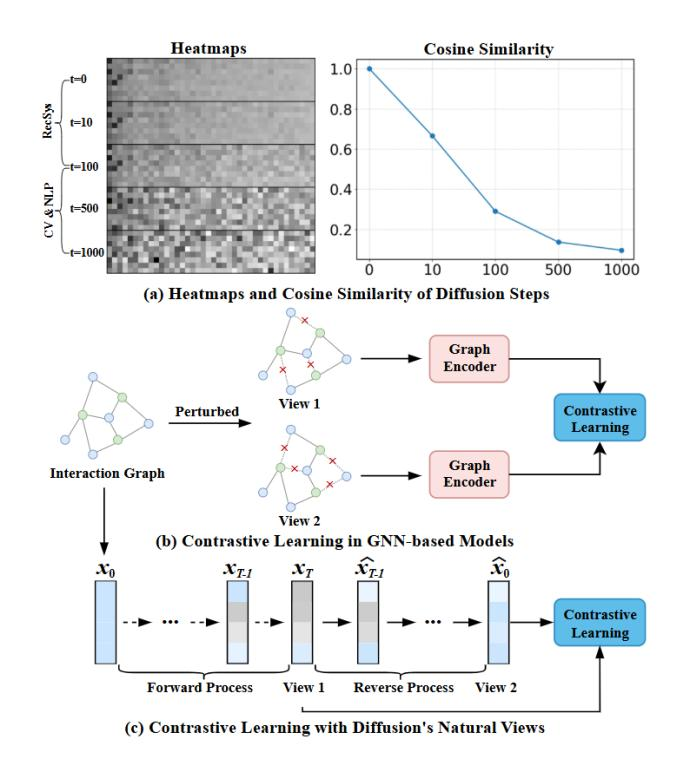
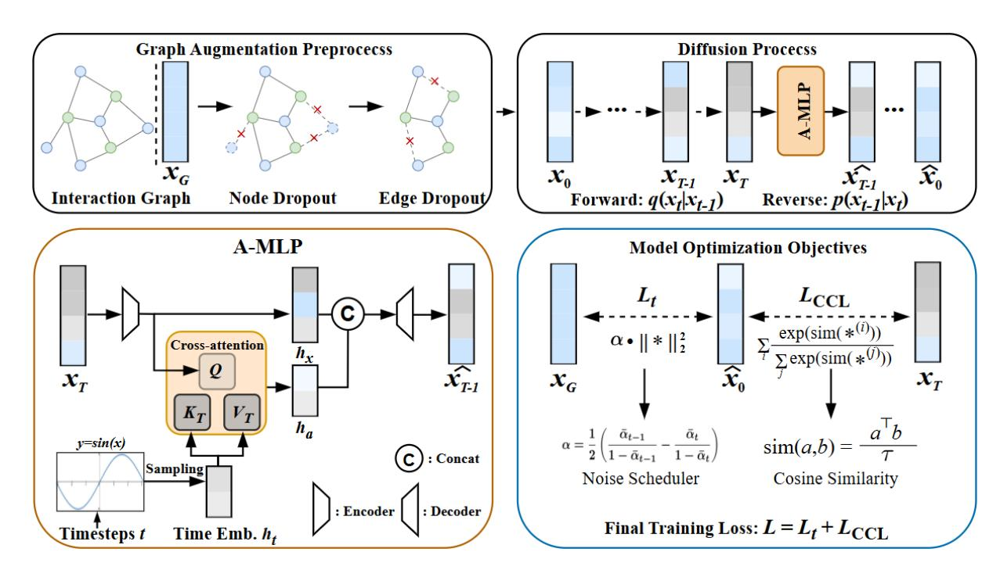
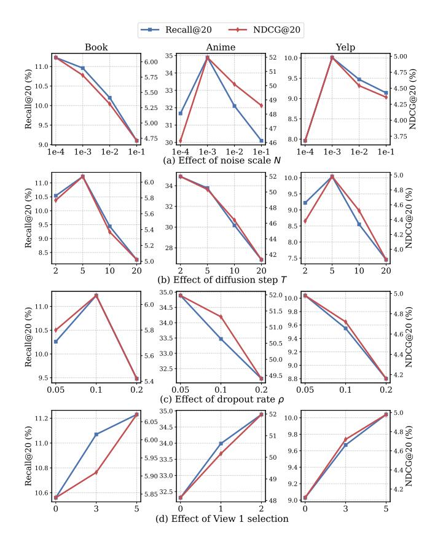
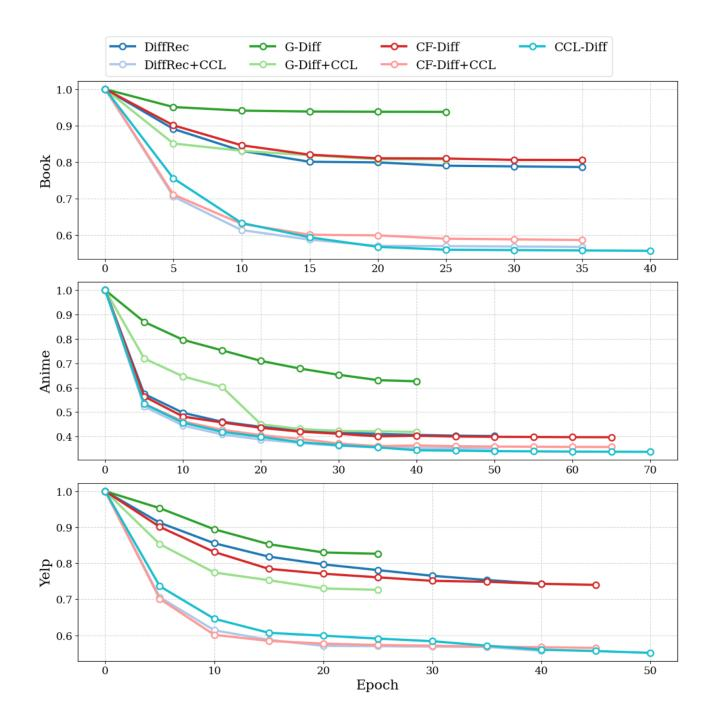

# CCL-Diff: Representation-Consistent Diffusion with Intrinsic Contrastive Learning for Recommender Systems

[Lingyan Zhang](https://orcid.org/0000-0003-4191-9059) School of Computer Science and Engineering, Central South University Changsha, China lingyan\_zhang@csu.edu.cn

[Wanyu Ling](https://orcid.org/0009-0003-4212-2938) School of Computer Science and Engineering, Central South University Changsha, China wanyuling@csu.edu.cn

[Shuwen Daizhou](https://orcid.org/0009-0000-9753-5789) School of Computer Science and Engineering, Central South University Changsha, China shuwendaizhou@csu.edu.cn

[Li Kuang](https://orcid.org/0000-0003-4975-034X) School of Computer Science and Engineering, Central South University Changsha, China kuangli@csu.edu.cn

[Kehua Guo](https://orcid.org/0000-0003-4143-6399)∗ School of Computer Science and Engineering, Central South University Furong Laboratory Changsha, China guokehua@csu.edu.cn

# Abstract

Diffusion models have gained traction in recommender systems for learning user preferences via generative denoising. However, they often overlook an essential aspect: the semantic consistency of representations across diffusion timesteps, limiting their robustness and generalizability. To address this, we propose CCL-Diff, a novel diffusion-based recommendation framework enhanced by Cross-Denoising Contrastive Learning (CCL). CCL exploits the intrinsic multi-view nature of the diffusion process, treating intermediate noisy states as semantically consistent views. By aligning denoised embeddings across these views, it enforces noise-invariant user representations, enhancing the model's discriminative power. Unlike traditional graph contrastive learning, which relies on manual augmentations, CCL derives contrastive signals directly from the denoising trajectory, eliminating the need for external perturbations. CCL is a lightweight, plug-and-play component that integrates effortlessly into diffusion models. We also introduce a cross-attention denoising decoder to adaptively fuse features with timestep-specific embeddings, effectively capturing the temporal dynamics of user preferences. Experimental results on three datasets demonstrate that CCL-Diff consistently outperforms state-of-the-art models. Moreover, applying CCL as an auxiliary objective boosts the performance of diffusion models, highlighting its broad applicability.

# CCS Concepts

• Information systems → Recommender systems.

∗Corresponding author. This work is supported by the National Natural Science Foundation of China under Grants U24A20333, 62472443; National Key R&D Program of China 2023ZD0508201; Hunan Provincial Natural Science Foundation 2024JJ3032; Frontier Cross Project of Central South University (2023QYJC008).

[This work is licensed under a Creative Commons Attribution-NonCommercial-](https://creativecommons.org/licenses/by-nc-nd/4.0)[NoDerivatives 4.0 International License.](https://creativecommons.org/licenses/by-nc-nd/4.0)

WWW '26, Dubai, United Arab Emirates. © 2026 Copyright held by the owner/author(s). ACM ISBN 979-8-4007-2307-0/2026/04 <https://doi.org/10.1145/3774904.3792647>

# Keywords

Diffusion Models, Cross-Denoising Contrastive Learning, Recommender Systems, Representation Consistency

### ACM Reference Format:

Lingyan Zhang, Wanyu Ling, Shuwen Daizhou, Li Kuang, and Kehua Guo. 2026. CCL-Diff: Representation-Consistent Diffusion with Intrinsic Contrastive Learning for Recommender Systems. In Proceedings of the ACM Web Conference 2026 (WWW '26), April 13–17, 2026, Dubai, United Arab Emirates. ACM, New York, NY, USA, [9](#page-8-0) pages.<https://doi.org/10.1145/3774904.3792647>

# 1 Introduction

Graph Convolutional Networks (GCNs) have become a cornerstone of modern recommender systems. Methods like LightGCN [\[7\]](#page-8-1) achieve impressive performance by neighbor aggregation on the user-item interaction graph. Further advances incorporate Graph Contrastive Learning (GCL) [\[6,](#page-8-2) [18,](#page-8-3) [35,](#page-8-4) [42\]](#page-8-5) to enhance representation learning by enforcing invariance to handcrafted perturbations (e.g., node/edge dropout). However, these approaches primarily operate on static graphs with augmentations, struggling to capture the dynamic nature of user preferences. Diffusion models (DMs) [\[28,](#page-8-6) [44\]](#page-8-7) provide a promising alternative by reframing recommendation as a generative denoising process. Recent works such as DiffRec [\[33\]](#page-8-8), CF-Diff [\[10\]](#page-8-9), and G-Diff [\[3\]](#page-8-10) demonstrate that progressively

injecting and removing noise can yield robust user representations. Nevertheless, a critical property of the diffusion process in recommendation remains largely unexplored. As illustrated in Figure [1](#page-1-0) (a), unlike applications in computer vision [\[2,](#page-8-11) [4,](#page-8-12) [8,](#page-8-13) [9,](#page-8-14) [23,](#page-8-15) [29,](#page-8-16) [34\]](#page-8-17) or natural language processing [\[1,](#page-8-18) [16,](#page-8-19) [24\]](#page-8-20) that employ hundreds of noise steps, DMs for recommendation are typically limited to shallow depths (tens of steps) due to the sparsity of user-item graphs. Under such shallow diffusion, the intermediate noisy representations remain strong correlations with the original data, inherently forming multiple, partially corrupted yet semantically consistent views of user preference, a unique characteristic of the recommendation context. Surprisingly, existing DMs [\[3,](#page-8-10) [10,](#page-8-9) [33\]](#page-8-8) neglect this intrinsic multi-view structure and the semantic overlap across timesteps. They focus predominantly on reconstructing observed interactions, failing to explicitly enforce representation consistency across the

Figure 1: Conceptual comparison of GCL and CCL. (a) Shallow diffusion in recommendation preserves semantic consistency, creating natural intermediate views. (b) GCL uses manual perturbations (e.g., edge/node dropout) to generate contrastive views. (c) CCL exploits the multi-view structure of diffusion, aligning denoised embeddings from different timesteps without the need for external augmentation.

denoising trajectory. This oversight leads to two key limitations: (1) increased susceptibility to overfitting on sparse data, and (2) incoherent representations across timesteps, ultimately impairing model robustness and generalization.

To address these issues, we propose CCL-Diff, a novel framework that introduces Cross-Denoising Contrastive Learning (CCL) into the diffusion process. CCL is designed to explicitly leverage the intermediate noisy states as naturally occurring, semantically consistent views. During training, it enforces agreement (e.g., via contrastive loss) between the denoised embeddings derived from these different noisy states across timesteps. This intrinsic contrast signal acts as a powerful regularizer, promoting a locally smooth and global stable latent space. It guides the model to learn more robust and generalizable user preference representations, effective compensating for the limitation of shallow diffusion depths typically used in recommendation. As illustrated in Figure [1](#page-1-0) (b) and (c), unlike conventional GCL methods that rely on manually crafted perturbations such as node or edge dropout to generate contrastive views, CCL operates entirely within the native diffusion pipeline. It seamlessly deriving contrastive signals from the inherent denoising process, without introducing additional augmentation or architectural modifications. As a result, CCL serves as a plug-andplay module that can be integrated into diffusion-based frameworks

with negligible computational overhead. Furthermore, we introduce a cross-attention denoising decoder (A-MLP) to better capture finegrained temporal dynamics during denoising. The A-MLP module dynamically fuses timestep-specific diffusion embeddings with user features via cross-attention, enabling the model to adaptively focus on evolving preference signals throughout the diffusion trajectory.

Our principal contributions are summarized as follows:

- We propose CCL-Diff, a novel diffusion-based recommendation framework that incorporates intrinsic contrastive learning into the denoising process to enforce representation consistency across timesteps.
- We introduce the Cross-denoising Contrastive Learning (CCL) objective, which leverages intermediate noisy states as natural contrastive views. This objective provides a built-in regularization effect without data augmentation, and we show it can be applied as a plug-and-play module to boost existing diffusion models by up to 20.1% in Recall@10.
- We design a cross-attention denoising decoder (A-MLP) that adaptively fuses timestep-aware embeddings with user features to capture temporal preference dynamics.
- We conduct extensive experiments on three public benchmarks, showing that CCL-Diff consistently outperforms stateof-the-art models, improving R@10 by up to 13.1%, and generalizes robustly under sparse data settings.

### 2 Related Work

# 2.1 GCN-Based Recommendation

Graph Neural Networks (GNNs) [\[5,](#page-8-21) [11,](#page-8-22) [36\]](#page-8-23) effectively capture highorder connectivity for recommendation. Notably, LightGCN [\[7\]](#page-8-1) establishes a strong baseline by removing nonlinearities to simplify the architecture. To mitigate data sparsity, Graph Contrastive Learning (GCL) [\[12,](#page-8-24) [19\]](#page-8-25) introduces self-supervised signals via stochastic dropout (SGL [\[35\]](#page-8-4)) or noise injection and prototype alignment (XSimGCL [\[42\]](#page-8-5), NCL [\[18\]](#page-8-3)). However, these methods primarily rely on static structures and manual augmentations, lacking the generative capacity for modeling complex user preference transitions.

# 2.2 Generative-Based Recommendation

2.2.1 VAE-Based Methods. Variational Autoencoders (VAEs) [\[21,](#page-8-26) [39,](#page-8-27) [40,](#page-8-28) [43,](#page-8-29) [45\]](#page-8-30) are widely used to learn representations from implicit feedback. Early denoising frameworks like DAE [\[37\]](#page-8-31) and CVAE [\[13\]](#page-8-32) evolved into models like Mult-VAE [\[17\]](#page-8-33) and RecVAE [\[25\]](#page-8-34), which incorporate multinomial likelihoods for better interaction modeling. Despite their utility, VAE-based approaches often struggle to balance simplicity with expressiveness for intricate behaviors.

2.2.2 Diffusion-Based Methods. Diffusion Models (DMs) [\[15,](#page-8-35) [27,](#page-8-36) [41,](#page-8-37) [46\]](#page-8-38) have emerged as a powerful paradigm by modeling recommendation as a progressive denoising process. CODIGEM [\[30\]](#page-8-39) first adapted DDPMs [\[8\]](#page-8-13) for collaborative filtering. Recent studies have extended this to diverse settings: DiffRec [\[33\]](#page-8-8) and G-Diff [\[3\]](#page-8-10) incorporate sequential and graph structural signals, respectively, while CF-Diff [\[10\]](#page-8-9) leverages cross-attention to integrate multi-hop neighbor information. Nevertheless, existing diffusion methods lack explicit mechanisms to enforce representation consistency across timesteps, limiting their generalizability in sparse scenarios.

Table 1: Statistics of the evaluation datasets.

| Datasets | #User   | #Item  | #Review   | Density (%) |
|----------|---------|--------|-----------|-------------|
| Book     | 108,822 | 94,949 | 3,146,256 | 0.0304      |
| Anime    | 54,199  | 6,969  | 7,634,582 | 2.0216      |
| Yelp     | 54,574  | 34,395 | 1,402,736 | 0.0747      |

anime recommendation dataset collected from MyAnimeList. (3) Yelp[4](#page-5-1) is a representative business dataset containing user reviews for different restaurants and services. Following common practice, we split each user's interactions chronologically: the first 70% for training, the next 10% for validation (hyperparameter turning), and the remaining 20% for testing. Key statistics of the datasets are summarized in Table [1.](#page-5-2)

5.1.2 Evaluation. We adopt the full-ranking evaluation protocol [\[7\]](#page-8-1), ranking all non-interacted items for each user. Performance is measured using two standard metrics: Recall@K (R@K) and Normalized Discounted Cumulative Gain@K (N@K), with �� ∈ {10, 20}.

5.1.3 Baselines. We compare CCL-Diff against eleven strong baselines, including GNN-, AE-, and diffusion-based methods: MF [\[22\]](#page-8-45), LightGCN [\[7\]](#page-8-1), SGL [\[35\]](#page-8-4), NCL [\[18\]](#page-8-3), XSimGCL [\[42\]](#page-8-5), CDAE[\[38\]](#page-8-46), Multi-DAE [\[17\]](#page-8-33), MultiVAE [\[17\]](#page-8-33), DiffRec [\[33\]](#page-8-8), G-Diff [\[3\]](#page-8-10), and CF-Diff [\[10\]](#page-8-9).

5.1.4 Implementation details. All models are implemented in Py-Torch and trained on a single NVIDIA V100 GPU (32GB). For baseline methods, we use the best hyperparameters reported in their original papers or obtained via validation set tuning. For CCL-Diff, we build upon the diffusion framework of DiffRec [\[33\]](#page-8-8) and CF-Diff [\[10\]](#page-8-9). The noise scale ��, the noise lower bound ��min, and the noise upper bound ��max are searched in {1e−4, 1e−3, 1e−2, 1e−1}, {5e−4, 1e−3, 5e−3}, and {5e−3, 1e−2}, respectively. The diffusion step �� and the inference step �� ′ are tuned in {2, 5, 10, 20} and 0, �� 4 , �� 2 , respectively. The step �� for View 1 selection is search in {0, ⌈ �� ⌉,�� }. The timestep embedding dimension is fixed at 64, and the dropout ratio �� is searched in {0.05, 0.1, 0.2}.

### 5.2 Experiment Results and Analysis

5.2.1 Performance Comparison with Baselines (RQ1). Table [2](#page-6-0) summarizes the performance comparison between CCL-Diff and baseline methods, highlighting two key findings:

(1) Superiority over GNN-based Models. CCL-Diff outperforms all graph-based models across datasets. On the Book dataset, it improves over the strongest GCL baseline, NCL, by 40.6% in R@10 and 37.9% in N@10. These substantial gains indicate that CCL captures more informative and generalizable user-item representations beyond what is achievable through traditional graph contrastive learning, which often relies on handcrafted augmentations.

(2) Advantages over Diffusion-based Models. CCL-Diff also consistently exceeds the performance of existing diffusion-based recommenders. On the Anime dataset, it improves by 9.7% in R@10 and 8.5% in N@10 over CF-Diff. On Yelp, it achieves gains of 4.4%

Figure 3: Effect of hyperparameters ��, �� , ��, and View 1.

and 3.0%, respectively. These results confirm that CCL-Diff enhances diffusion models' representation capacity, making it effective across domains with varying sparsity and interaction patterns.

5.2.2 Hyperparameter Sensitivity Analysis (RQ2). We evaluate the sensitivity of CCL-Diff through ablation tests on key hyperparameters. Figure [3](#page-5-3) shows the performance on the validation set for each hyperparameter, with other parameters fixed.

Noise Scale (��): This controls the magnitude of Gaussian noise injected during the forward diffusion process. The best performance occurs with smaller values (�� = 1e−3 for Anime and Yelp, and �� = 1e−4 for Book), indicating that mild noise perturbation is effective for contrastive learning without overwhelming the semantic content of the original interactions.

Diffusion Step (�� ): This controls the depth of the forward diffusion process. Performance improves with smaller �� , peaking at �� = 5 for Book and Yelp, and �� = 2 for Anime. These results suggest that shallow diffusion is often sufficient due to the inherent sparsity of user-item interactions in recommendation data.

Dropout Ratio (��): This parameter is explored for both node and edge dropout. The optimal setting is �� = 0.1 for Book and Yelp, and �� = 0.05 for Anime. These results demonstrate that moderate perturbations enhance model robustness, while excessive dropout may degrade the structural integrity of the interaction graph.

Selection of View 1: We further ablate the choice of View 1 in the CCL objective, comparing three candidates: the clean input ��0, an

4https://www.yelp.com/dataset/

Table 2: Overall performance comparison between the baselines and CCL-Diff on three datasets. Best results are in bold, second-best underlined. "\*" implies the improvements are statistically significant (p-value &lt; 0.05) under one-sample t-tests.

| Methods    | R@10   | R@20   | Book N@10 | N@20   | R@10   | R@20   | Anime N@10 | N@20   | R@10   | R@20   | Yelp N@10 | N@20   |
|------------|--------|--------|-----------|--------|--------|--------|------------|--------|--------|--------|-----------|--------|
| MF         | 0.0437 | 0.0689 | 0.0264    | 0.0339 | 0.1319 | 0.1943 | 0.3764     | 0.3631 | 0.0341 | 0.0560 | 0.0210    | 0.0276 |
| LightGCN   | 0.0534 | 0.0822 | 0.0325    | 0.0411 | 0.2071 | 0.3043 | 0.3937     | 0.3824 | 0.0540 | 0.0904 | 0.0325    | 0.0436 |
| SGL        | 0.0481 | 0.0789 | 0.0301    | 0.0377 | 0.1994 | 0.2918 | 0.3748     | 0.3652 | 0.0503 | 0.0896 | 0.0311    | 0.0424 |
| NCL        | 0.0559 | 0.0841 | 0.0367    | 0.0439 | 0.2063 | 0.3047 | 0.3915     | 0.3819 | 0.0533 | 0.0883 | 0.0318    | 0.0430 |
| XSimGCL    | 0.0547 | 0.0833 | 0.0346    | 0.0423 | 0.1764 | 0.2679 | 0.3361     | 0.3273 | 0.0559 | 0.0936 | 0.0346    | 0.0447 |
| CDAE       | 0.0538 | 0.0737 | 0.0361    | 0.0422 | 0.2036 | 0.2994 | 0.4067     | 0.4001 | 0.0444 | 0.0703 | 0.0280    | 0.0360 |
| MultiDAE   | 0.0571 | 0.0855 | 0.0357    | 0.0442 | 0.2142 | 0.3085 | 0.4177     | 0.4125 | 0.0522 | 0.0864 | 0.0316    | 0.0419 |
| MultiVAE   | 0.0628 | 0.0935 | 0.0393    | 0.0485 | 0.2167 | 0.3106 | 0.4397     | 0.4310 | 0.0567 | 0.0945 | 0.0344    | 0.0458 |
| DiffRec    | 0.0695 | 0.1010 | 0.0451    | 0.0547 | 0.2104 | 0.3012 | 0.5047     | 0.4649 | 0.0581 | 0.0960 | 0.0363    | 0.0478 |
| G-Diff     | 0.0601 | 0.0913 | 0.0389    | 0.0494 | 0.1461 | 0.2102 | 0.3919     | 0.3531 | 0.0483 | 0.0777 | 0.0304    | 0.0394 |
| CF-Diff    | 0.0683 | 0.0994 | 0.0437    | 0.0539 | 0.2191 | 0.3155 | 0.5152     | 0.4748 | 0.0585 | 0.0971 | 0.0368    | 0.0483 |
| CCL-Diff   | 0.0786 | 0.1123 | 0.0506    | 0.0607 | 0.2403 | 0.3489 | 0.5592     | 0.5198 | 0.0611 | 0.1004 | 0.0379    | 0.0498 |
| Improv.(%) | 13.1*  | 11.2*  | 12.2*     | 11.0*  | 9.7*   | 10.6*  | 8.5*       | 9.5*   | 4.4*   | 3.4*   | 3.0*      | 3.1*   |

Table 3: Ablation study on components in CCL-Diff.

| Dataset        | Method    | R@10   | R@20   | N@10   | N@20   |
|----------------|-----------|--------|--------|--------|--------|
| CCL-Diff       |           | 0.0786 | 0.1123 | 0.0506 | 0.0607 |
| w/o Book       | CCL       | 0.0703 | 0.1017 | 0.0451 | 0.0553 |
| w/o            | GraphAug. | 0.0773 | 0.1101 | 0.0487 | 0.0579 |
| w/o            | A-MLP     | 0.0775 | 0.1097 | 0.0493 | 0.0583 |
| CCL-Diff Anime |           | 0.2403 | 0.3489 | 0.5592 | 0.5198 |
| w/o            | CCL       | 0.2183 | 0.3164 | 0.5213 | 0.4801 |
| w/o            | GraphAug. | 0.2365 | 0.3409 | 0.5497 | 0.5103 |
| w/o            | A-MLP     | 0.2363 | 0.3379 | 0.5502 | 0.5121 |
| CCL-Diff       |           | 0.0611 | 0.1004 | 0.0379 | 0.0498 |
| w/o Yelp       | CCL       | 0.0593 | 0.0973 | 0.0369 | 0.0484 |
| w/o            | GraphAug. | 0.0602 | 0.0991 | 0.0373 | 0.0493 |
| w/o            | A-MLP     | 0.0604 | 0.0987 | 0.0372 | 0.0491 |

intermediate state ���� /2, and the fully noised state ���� . Experimental results consistently favor ���� across all datasets and metrics. This validates our theoretical analysis in Section [4.5:](#page-4-4) using the maximally corrupted state ���� provides the strongest contrastive signal against the denoised output ��ˆ0, thereby encouraging the model to learn more robust and noise-invariant representations.

5.2.3 Ablation Study on Model Components (RQ3). We conduct an ablation study to evaluate the contribution of each core component in CCL-Diff by systematically removing the following modules: (1) the CCL objective, (2) graph augmentation, and (3) the A-MLP decoder. The results are summarized in Table [3.](#page-6-1)

Effect of Removing CCL (w/o CCL): Removing CCL results in a noticeable performance drop across all datasets, especially on Anime (e.g., 9.1% decrease in R@10), emphasizing CCL's role in learning noise-invariant, discriminative user representations.

Effect of Removing Graph Augmentation (w/o GraphAug.): Disabling graph augmentation (node and edge dropout) causes a

Figure 4: Normalized training loss curves for DMs, DMs+CCL, and CCL-Diff. All losses are scaled by their initial values to facilitate comparison of convergence behavior.

moderate performance decline. Unlike typical graph contrastive learning methods that use augmentation to generate contrastive views, our method uses augmentation solely to expose the model to structurally perturbed inputs, encouraging robustness in recovering the original interaction graph. This explains the consistent but modest performance drop when augmentation is removed. Effect of Removing Cross-Attention (w/o A-MLP): Replacing

Table 4: Performance comparison of DMs with CCL.

| Methods     | R@10   | R@20   | Book N@10 | N@20   | R@10   | R@20   | Anime N@10 | N@20   | R@10   | R@20   | Yelp N@10 | N@20   |
|-------------|--------|--------|-----------|--------|--------|--------|------------|--------|--------|--------|-----------|--------|
| DiffRec     | 0.0695 | 0.1010 | 0.0451    | 0.0547 | 0.2104 | 0.3012 | 0.5047     | 0.4649 | 0.0581 | 0.0960 | 0.0363    | 0.0478 |
| DiffRec+CCL | 0.0767 | 0.1101 | 0.0496    | 0.0592 | 0.2301 | 0.3317 | 0.5369     | 0.4967 | 0.0595 | 0.0973 | 0.0370    | 0.0485 |
| Improv.(%)  | 10.4   | 9.0    | 10.0      | 8.2    | 9.4    | 10.1   | 6.4        | 6.8    | 2.4    | 1.4    | 1.9       | 1.5    |
| G-Diff      | 0.0601 | 0.0913 | 0.0389    | 0.0494 | 0.1461 | 0.2102 | 0.3919     | 0.3531 | 0.0483 | 0.0777 | 0.0304    | 0.0394 |
| G-Diff+CCL  | 0.0671 | 0.0997 | 0.0443    | 0.0546 | 0.1754 | 0.2501 | 0.4331     | 0.3884 | 0.0533 | 0.0891 | 0.0337    | 0.0430 |
| Improv.(%)  | 11.6   | 9.2    | 13.9      | 10.5   | 20.1   | 19.0   | 10.5       | 10.0   | 10.4   | 14.7   | 10.9      | 9.1    |
| CF-Diff     | 0.0683 | 0.0994 | 0.0437    | 0.0539 | 0.2191 | 0.3155 | 0.5152     | 0.4748 | 0.0585 | 0.0971 | 0.0368    | 0.0483 |
| CF-Diff+CCL | 0.0757 | 0.1005 | 0.0490    | 0.0588 | 0.2287 | 0.3296 | 0.5302     | 0.4921 | 0.0599 | 0.0990 | 0.0375    | 0.0492 |
| Improv.(%)  | 10.8   | 1.1    | 12.1      | 9.1    | 4.4    | 4.5    | 2.9        | 3.6    | 2.4    | 2.0    | 1.9       | 1.9    |

Table 5: Computational efficiency comparison across three datasets. Reported metrics include the number of epochs, training time per epoch (in seconds), total time (in minutes, including training and evaluation), and parameter count (in millions).

| Methods     | Epoch | PerEp. | Book Total | Param. | Epoch | PerEp. | Anime Total | Param. | Epoch | PerEp. | Yelp Total | Param. |
|-------------|-------|--------|------------|--------|-------|--------|-------------|--------|-------|--------|------------|--------|
| DiffRec     | 35    | 36.8   | 32.37      | 190.00 | 50    | 7.9    | 11.77       | 13.96  | 40    | 11.6   | 12.08      | 68.84  |
| DiffRec+CCL | 35    | 36.1   | 29.77      | 190.00 | 50    | 7.2    | 10.08       | 13.96  | 40    | 11.1   | 10.57      | 68.84  |
| G-Diff      | 25    | 737.5  | 610.17     | 190.22 | 40    | 16.8   | 21.32       | 14.03  | 25    | 210.9  | 174.72     | 69.31  |
| G-Diff+CCL  | 25    | 721.6  | 564.32     | 190.22 | 40    | 16.2   | 20.02       | 14.03  | 25    | 203.7  | 153.62     | 69.31  |
| CF-Diff     | 40    | 70.6   | 58.23      | 186.63 | 65    | 17.7   | 29.78       | 14.10  | 45    | 24.9   | 26.58      | 67.88  |
| CF-Diff+CCL | 40    | 68.3   | 51.30      | 186.63 | 65    | 17.1   | 25.85       | 14.10  | 45    | 23.7   | 23.75      | 67.88  |
| CCL-Diff    | 40    | 35.7   | 36.78      | 196.16 | 70    | 7.1    | 13.42       | 14.48  | 50    | 10.7   | 13.53      | 71.11  |

A-MLP with simple feature concatenation results in a clear performance reduction, particularly on Anime (e.g., 3.2% decrease in R@20). This highlights A-MLP's importance in capturing temporal dynamics through adaptive feature fusion.

5.2.4 Generalizability of CCL to Existing DMs (RQ4). We integrate CCL into three existing diffusion-based recommenders: DiffRec, G-Diff, and CF-Diff, as shown in Table [4.](#page-7-0) CCL consistently improves performance across all models and datasets. Specifically, it boosts DiffRec's Recall@10 by 10.4% on Amazon-Book and G-Diff's Recall@10 by 20.1% on Anime. Even CF-Diff, which already uses advanced collaborative signals, benefits from CCL, confirming its broad applicability and complementary value in denoising-based recommendation systems.

5.2.5 Computational Efficiency Analysis (RQ5). We evaluate the computational efficiency of CCL-Diff from two angles: optimization efficiency (measured by loss convergence dynamics in Figure [4\)](#page-6-2) and resource cost (including parameter size and running time in Table [5\)](#page-7-1). Here, the reported "PerEp." time strictly refers to the training time per epoch, while the "Total" time includes both training and evaluation.

A key observation is that integrating CCL into existing DMs (DiffRec, G-Diff, CF-Diff) adds zero extra parameters while reducing total runtime by 6.1%-14.4%, primarily due to faster convergence, as shown in Figure [4.](#page-6-2) For example, DiffRec+CCL reduces total time by 8% on Book (29.77 vs. 32.37 minutes) without any

increase in model size. The standalone CCL-Diff framework, despite a modest 3% increase in parameters compared to DiffRec on Book, achieves significant speedups: it runs 19.7× faster per epoch than G-Diff and completes training 2.0× faster than CF-Diff on Yelp, while maintaining efficiency comparable to DiffRec. These efficiency gains are contributed to CCL's intrinsic regularization effect, which accelerates convergence within the same epoch budget (Figure [4\)](#page-6-2), despite the slight increase in model capacity.

### 6 Conclusion

This work introduces CCL-Diff, a novel diffusion-based recommendation framework that addresses the lack of consistency in representations across diffusion timesteps in existing models. By leveraging CCL, which leverages the intrinsic multi-view nature of the diffusion process to align denoised embeddings from different noise levels, we eliminate the need for handcrafted data augmentations. The A-MLP module captures temporal dynamics through cross-attention, adaptively fusing user features with step-specific embeddings. Extensive experiments on three real-world benchmarks demonstrate that CCL-Diff consistently outperforms stateof-the-art models by up to 13.1% in R@10. Notably, CCL serves as a plug-and-play component that enhances existing diffusion recommenders in both accuracy and convergence speed, without adding computational overhead, making it an effective solution for sparse and noisy recommendation data.

References [1] Jacob Austin, Daniel D Johnson, Jonathan Ho, Daniel Tarlow, and Rianne Van Den Berg. 2021. Structured denoising diffusion models in discrete state-spaces. Advances in neural information processing systems 34 (2021), 17981–17993. [2] Cong Cao, Huanjing Yue, Xin Liu, and Jingyu Yang. 2025. Zero-shot video restoration and enhancement using pre-trained image diffusion model. In Proceedings of the AAAI Conference on Artificial Intelligence, Vol. 39. 1935–1943. [3] Ruixin Chen, Jianping Fan, Meiqin Wu, Rui Cheng, and Jiawen Song. 2024. G-Diff: A Graph-Based Decoding Network for Diffusion Recommender Model. IEEE Transactions on Neural Networks and Learning Systems (2024). [4] Prafulla Dhariwal and Alexander Nichol. 2021. Diffusion models beat gans on image synthesis. Advances in neural information processing systems 34 (2021), 8780–8794. [5] Chen Gao, Xiang Wang, Xiangnan He, and Yong Li. 2022. Graph neural networks for recommender system. In Proceedings of the fifteenth ACM international conference on web search and data mining. 1623–1625. [6] Dongxiao He, Yongqi Huang, Jitao Zhao, Xiaobao Wang, and Zhen Wang. 2025. Str-GCL: Structural Commonsense Driven Graph Contrastive Learning. In Proceedings of the ACM on Web Conference 2025. 1129–1141. [7] Xiangnan He, Kuan Deng, Xiang Wang, Yan Li, Yongdong Zhang, and Meng Wang. 2020. Lightgcn: Simplifying and powering graph convolution network for recommendation. In Proceedings of the 43rd International ACM SIGIR Conference on Research and Development in Information Retrieval. 639–648. [8] Jonathan Ho, Ajay Jain, and Pieter Abbeel. 2020. Denoising diffusion probabilistic models. Advances in neural information processing systems 33 (2020), 6840–6851. [9] Jonathan Ho, Tim Salimans, Alexey Gritsenko, William Chan, Mohammad Norouzi, and David J Fleet. 2022. Video diffusion models. Advances in neural information processing systems 35 (2022), 8633–8646. [10] Yu Hou, Jin-Duk Park, and Won-Yong Shin. 2024. Collaborative filtering based on diffusion models: Unveiling the potential of high-order connectivity. In Proceedings of the 47th International ACM SIGIR Conference on Research and Development in Information Retrieval. 1360–1369. [11] Tairan Huang, Yili Wang, Qiutong Li, Changlong He, and Jianliang Gao. 2025. Can LLMs Find Fraudsters? Multi-level LLM Enhanced Graph Fraud Detection. In Proceedings of the 33rd ACM International Conference on Multimedia. 1530–1538. [12] Ashish Jaiswal, Ashwin Ramesh Babu, Mohammad Zaki Zadeh, Debapriya Banerjee, and Fillia Makedon. 2020. A survey on contrastive self-supervised learning. Technologies 9, 1 (2020), 2. [13] Xiaopeng Li and James She. 2017. Collaborative variational autoencoder for recommender systems. In Proceedings of the 23rd ACM SIGKDD international conference on knowledge discovery and data mining. 305–314. [14] Xiang Li, John Thickstun, Ishaan Gulrajani, Percy S Liang, and Tatsunori B Hashimoto. 2022. Diffusion-lm improves controllable text generation. Advances in neural information processing systems 35 (2022), 4328–4343. [15] Zihao Li, Aixin Sun, and Chenliang Li. 2023. Diffurec: A diffusion model for sequential recommendation. ACM Transactions on Information Systems 42, 3 (2023), 1–28. [16] Long Lian, Boyi Li, Adam Yala, and Trevor Darrell. 2023. Llm-grounded diffusion: Enhancing prompt understanding of text-to-image diffusion models with large language models. arXiv preprint arXiv:2305.13655 (2023). [17] Dawen Liang, Rahul G Krishnan, Matthew D Hoffman, and Tony Jebara. 2018. Variational autoencoders for collaborative filtering. In Proceedings of the 2018 world wide web conference. 689–698. [18] Zihan Lin, Changxin Tian, Yupeng Hou, and Wayne Xin Zhao. 2022. Improving graph collaborative filtering with neighborhood-enriched contrastive learning. In Proceedings of the ACM web conference 2022. 2320–2329. [19] Xiao Liu, Fanjin Zhang, Zhenyu Hou, Li Mian, Zhaoyu Wang, Jing Zhang, and Jie Tang. 2021. Self-supervised learning: Generative or contrastive. IEEE transactions on knowledge and data engineering 35, 1 (2021), 857–876. [20] Calvin Luo. 2022. Understanding diffusion models: A unified perspective. arXiv preprint arXiv:2208.11970 (2022). [21] Jianxin Ma, Chang Zhou, Peng Cui, Hongxia Yang, and Wenwu Zhu. 2019. Learning disentangled representations for recommendation. Advances in neural information processing systems 32 (2019). [22] Steffen Rendle, Christoph Freudenthaler, Zeno Gantner, and Lars Schmidt-Thieme. 2012. BPR: Bayesian personalized ranking from implicit feedback. arXiv preprint arXiv:1205.2618 (2012). [23] Robin Rombach, Andreas Blattmann, Dominik Lorenz, Patrick Esser, and Björn Ommer. 2022. High-resolution image synthesis with latent diffusion models. In Proceedings of the IEEE/CVF conference on computer vision and pattern recognition. 10684–10695. [24] Alexander Shabalin, Viacheslav Meshchaninov, Egor Chimbulatov, Vladislav Lapikov, Roman Kim, Grigory Bartosh, Dmitry Molchanov, Sergey Markov, and Dmitry Vetrov. 2025. Tencdm: Understanding the properties of the diffusion model in the space of language model encodings. In Proceedings of the AAAI Conference on Artificial Intelligence, Vol. 39. 25110–25118. [25] Ilya Shenbin, Anton Alekseev, Elena Tutubalina, Valentin Malykh, and Sergey I Nikolenko. 2020. Recvae: A new variational autoencoder for top-n recommendations with implicit feedback. In Proceedings of the 13th international conference on web search and data mining. 528–536. [26] Jascha Sohl-Dickstein, Eric Weiss, Niru Maheswaranathan, and Surya Ganguli. 2015. Deep unsupervised learning using nonequilibrium thermodynamics. In International conference on machine learning. pmlr, 2256–2265. [27] Te Song, Lianyong Qi, Weiming Liu, Fan Wang, Xiaolong Xu, Xuyun Zhang, Amin Beheshti, Xiaokang Zhou, and Wanchun Dou. 2025. Enhancing Diffusion Model with Auxiliary Information Mining-Exploration and Efficient Sampling Mechanism for Sequential Recommendation. In Proceedings of the AAAI Conference on Artificial Intelligence, Vol. 39. 12568–12576. [28] Youchen Sun, Zhu Sun, Yingpeng Du, Jie Zhang, and Yew Soon Ong. 2025. Modelagnostic social network refinement with diffusion models for robust social recommendation. In Proceedings of the ACM on Web Conference 2025. 370–378. [29] Yusuke Tashiro, Jiaming Song, Yang Song, and Stefano Ermon. 2021. Csdi: Conditional score-based diffusion models for probabilistic time series imputation. Advances in neural information processing systems 34 (2021), 24804–24816. [30] Joojo Walker, Ting Zhong, Fengli Zhang, Qiang Gao, and Fan Zhou. 2022. Recommendation via collaborative diffusion generative model. In International Conference on Knowledge Science, Engineering and Management. Springer, 593–605. [31] Wenjie Wang, Fuli Feng, Xiangnan He, Liqiang Nie, and Tat-Seng Chua. 2021. Denoising implicit feedback for recommendation. In Proceedings of the 14th ACM international conference on web search and data mining. 373–381. [32] Wenjie Wang, Fuli Feng, Xiangnan He, Hanwang Zhang, and Tat-Seng Chua. 2021. Clicks can be cheating: Counterfactual recommendation for mitigating clickbait issue. In Proceedings of the 44th International ACM SIGIR Conference on Research and Development in Information Retrieval. 1288–1297. [33] Wenjie Wang, Yiyan Xu, Fuli Feng, Xinyu Lin, Xiangnan He, and Tat-Seng Chua. 2023. Diffusion recommender model. In Proceedings of the 46th International ACM SIGIR Conference on Research and Development in Information Retrieval. 832–841. [34] Yihan Wang, Fei Xiong, Zhexin Han, Qi Song, Kaiqiao Zhan, and Ben Wang. 2025. Unleashing the Potential of Two-Tower Models: Diffusion-Based Cross-Interaction for Large-Scale Matching. In Proceedings of the ACM on Web Conference 2025. 304–312. [35] Jiancan Wu, Xiang Wang, Fuli Feng, Xiangnan He, Liang Chen, Jianxun Lian, and Xing Xie. 2021. Self-supervised graph learning for recommendation. In Proceedings of the 44th international ACM SIGIR conference on research and development in information retrieval. 726–735. [36] Shiwen Wu, Fei Sun, Wentao Zhang, Xu Xie, and Bin Cui. 2022. Graph neural networks in recommender systems: a survey. Comput. Surveys 55, 5 (2022), 1–37. [37] Yao Wu, Christopher DuBois, Alice X Zheng, and Martin Ester. 2016. Collaborative denoising auto-encoders for top-n recommender systems. In Proceedings of the ninth ACM international conference on web search and data mining. 153–162. [38] Yao Wu, Christopher DuBois, Alice X Zheng, and Martin Ester. 2016. Collaborative denoising auto-encoders for top-n recommender systems. In Proceedings of the ninth ACM international conference on web search and data mining. 153–162. [39] Yu Xia, Rui Zhong, Hao Gu, Wei Yang, Chi Lu, Peng Jiang, and Kun Gai. 2025. Hierarchical tree search-based user lifelong behavior modeling on large language model. In Proceedings of the 48th International ACM SIGIR Conference on Research and Development in Information Retrieval. 1758–1767. [40] Yu Xia, Rui Zhong, Zeyu Song, Wei Yang, Junchen Wan, Qingpeng Cai, Chi Lu, and Peng Jiang. 2025. Trackrec: Iterative alternating feedback with chain-of-thought via preference alignment for recommendation. arXiv preprint arXiv:2508.15388 (2025). [41] Zhengyi Yang, Jiancan Wu, Zhicai Wang, Xiang Wang, Yancheng Yuan, and Xiangnan He. 2023. Generate what you prefer: Reshaping sequential recommendation via guided diffusion. Advances in Neural Information Processing Systems 36 (2023), 24247–24261. [42] Junliang Yu, Xin Xia, Tong Chen, Lizhen Cui, Nguyen Quoc Viet Hung, and Hongzhi Yin. 2023. XSimGCL: Towards extremely simple graph contrastive learning for recommendation. IEEE Transactions on Knowledge and Data Engineering 36, 2 (2023), 913–926. [43] Xianwen Yu, Xiaoning Zhang, Yang Cao, and Min Xia. 2019. VAEGAN: A collaborative filtering framework based on adversarial variational autoencoders.. In IJCAI, Vol. 19. pp–4206. [44] Meng Yuan, Yutian Xiao, Wei Chen, Chou Zhao, Deqing Wang, and Fuzhen Zhuang. 2025. Hyperbolic diffusion recommender model. In Proceedings of the ACM on Web Conference 2025. 1992–2006. [45] Shuai Zhang, Lina Yao, and Xiwei Xu. 2017. Autosvd++ an efficient hybrid collaborative filtering model via contractive auto-encoders. In Proceedings of the 40th International ACM SIGIR conference on Research and Development in Information Retrieval. 957–960. [46] Wenqiao Zhu, Lulu Wang, and Jun Wu. 2025. Addressing Cold-Start Problem in Click-Through Rate Prediction via Supervised Diffusion Modeling. In Proceedings of the AAAI Conference on Artificial Intelligence, Vol. 39. 13455–13463.