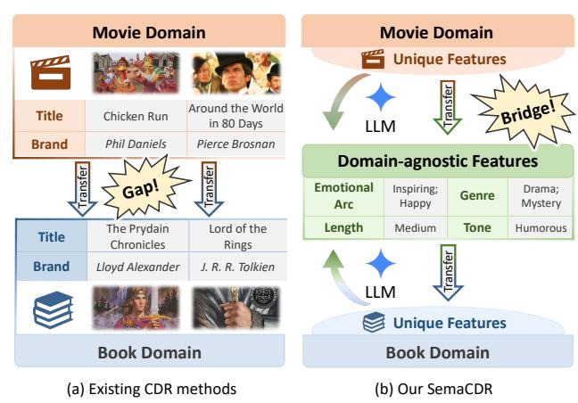
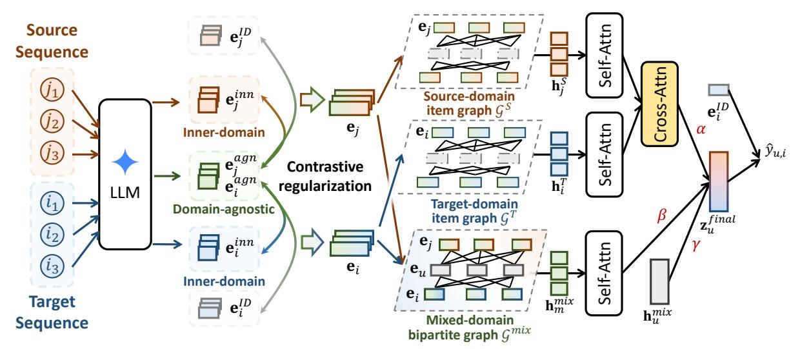
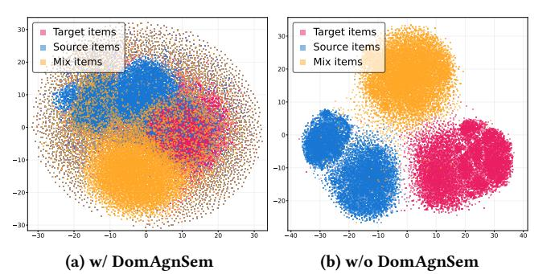
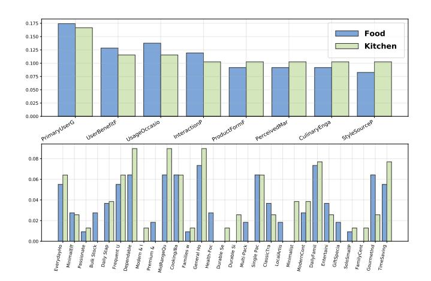
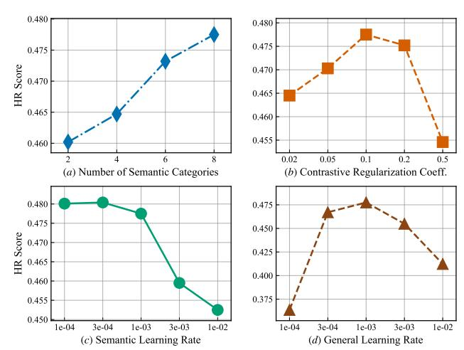

# SemaCDR: LLM-Powered Transferable Semantics for Cross-Domain Sequential Recommendation

Chunxu Zhang∗ Jilin University Changchun, China Hong Kong Polytechnic University Hong Kong, China zhangchunxu@jlu.edu.cn

Shanqiang Huang Jilin University Changchun, China huangsq2022@mails.jlu.edu.cn

Zijian Zhang∗† Jilin University Changchun, China The Chinese University of Hong Kong Hong Kong, China zhangzijian@jlu.edu.cn

Jiahong Liu The Chinese University of Hong Kong Hong Kong, China jiahong.liu21@gmail.com

Linsong Yu Jilin University Changchun, China lsyu9923@mails.jlu.edu.cn

Ruiqi Wan Jilin University Changchun, China wanrq2224@mails.jlu.edu.cn

Bo Yang∗† Jilin University Changchun, China ybo@jlu.edu.cn

Irwin King The Chinese University of Hong Kong Hong Kong, China king@cse.cuhk.edu.hk

### Abstract

Cross-domain recommendation (CDR) addresses the data sparsity and cold-start problems in the target domain by leveraging knowledge from data-rich source domains. However, existing CDR methods often rely on domain-specific features or identifiers that lack transferability across different domains, limiting their ability to capture inter-domain semantic patterns. To overcome this, we propose SemaCDR, a semantics-driven framework for cross-domain sequential recommendation that leverages large language models (LLMs) to construct a unified semantic space. SemaCDR creates multiview item features by integrating LLM-generated domain-agnostic semantics with domain-specific content, aligned by contrastive regularization. SemaCDR systematically creates LLM-generated domain-specific and domain-agnostic semantics, and employs adaptive fusion to generate unified preference representations. Furthermore, it aligns cross-domain behavior sequences with an adaptive fusion mechanism to synthesize interaction sequences from source, target, and mixed domains. Extensive experiments on real-world datasets show that SemaCDR consistently outperforms state-of-theart baselines, demonstrating its effectiveness in capturing coherent intra-domain patterns while facilitating knowledge transfer across domains. Our code is available online[1](#page-0-0) .

## CCS Concepts

#### • Information systems → Data mining.

© 2026 Copyright held by the owner/author(s). ACM ISBN 979-8-4007-2307-0/2026/04 <https://doi.org/10.1145/3774904.3792651>

# Keywords

Cross-domain Recommendation, Large Language Models

#### ACM Reference Format:

Chunxu Zhang, Shanqiang Huang, Zijian Zhang, Jiahong Liu, Linsong Yu, Ruiqi Wan, Bo Yang, and Irwin King. 2026. SemaCDR: LLM-Powered Transferable Semantics for Cross-Domain Sequential Recommendation. In Proceedings of the ACM Web Conference 2026 (WWW '26), April 13–17, 2026, Dubai, United Arab Emirates. ACM, New York, NY, USA, [12](#page-11-0) pages. <https://doi.org/10.1145/3774904.3792651>

## 1 Introduction

In the field of recommender systems, Cross-Domain Recommendation (CDR) is a critical solution for systems that lack sufficient interaction history. The fundamental premise of CDR is the assumption that a user's latent preferences are largely consistent across different domains. By leveraging rich interaction data and learned interest representations from a data-rich source domain, CDR effectively enhances the modeling of interaction preferences in the target domain. This knowledge transfer provides vital predictive signals for cold-start users and items with minimal history [\[4,](#page-8-0) [19,](#page-8-1) [21,](#page-8-2) [32,](#page-8-3) [33,](#page-8-4) [36\]](#page-8-5), enhancing the robustness and completeness of user interest modeling and improving recommendation accuracy and coverage.

Existing research in CDR has generally evolved into three dominant methodological streams. The first involves mapping-based approaches [\[19,](#page-8-1) [37\]](#page-8-6), which learn explicit transformation functions to align user or item representations between the source and target domains, thereby enabling direct feature transfer. The second focuses on fusion-based approaches [\[7,](#page-8-7) [10,](#page-8-8) [15\]](#page-8-9), where heterogeneous signals from multiple domains are jointly modeled at various levels of granularity, e.g., via shared factorization or graph structures, to capture richer cross-domain interactions. The third, and most recent stream, explores Large Language Models (LLM)-based approaches [\[5,](#page-8-10) [8,](#page-8-11) [14,](#page-8-12) [16,](#page-8-13) [24,](#page-8-14) [26\]](#page-8-15), where large language models are either employed as expressive feature encoders to enrich item representations or directly adapted as transferable recommendation models to facilitate knowledge transfer across domains.

∗Also with the Key Laboratory of Symbolic Computation and Knowledge Engineering of Ministry of Education, Jilin University.

†Corresponding authors.

1<https://github.com/huangshanqiang/SemaCDR>

[This work is licensed under a Creative Commons Attribution 4.0 International License.](https://creativecommons.org/licenses/by/4.0) WWW '26, Dubai, United Arab Emirates

Figure 1: Comparison of existing CDR methods and our proposed SemaCDR for cross-domain knowledge transfer.

Despite the continuous technological advancements across existing methods, a fundamental semantic bottleneck persists: the inability to capture transferable semantic patterns that consistently characterize user preferences across domains. As shown in Figure [1](#page-1-0) (a), existing CDR models primarily rely on domain-specific features, such as movie and book titles or brands. While these features are crucial for intra-domain prediction, they often struggle to facilitate effective knowledge transfer. We identify that the core challenge of cross-domain recommendation is to move beyond superficial transfer and achieve effective semantic-level migration. This requires a robust intermediary capable of converting low-level, domain-bound feature details into high-level, domain-agnostic knowledge. LLMs possess rich semantic understanding and broad world knowledge, naturally providing a promising means to generate unified, transferable representations that capture cross-domain user preferences.

In this work, we introduce SemaCDR, a cross-domain sequential recommendation framework that leverages LLMs to construct a unified semantic space capturing latent patterns in user preferences. Rather than focusing solely on source-to-target feature alignment, SemaCDR aims to systematically integrate multi-dimensional semantics that consistently shape user behavior across domains. (i) domain-specific semantics, which integrate identifiers and intrinsic content features to capture item uniqueness and enrich their characterization, and (ii) domain-agnostic latent semantics, which uncover deeper cross-domain commonalities for effective knowledge transfer as illustrated in Figure [1](#page-1-0) (b). Building on these representations, a cross-domain behavior fusion module integrates user interaction sequences from the source and target domains into cohesive sequential embeddings that encode inter-domain dynamics. Finally, an adaptive fusion prediction mechanism combines these sequential embeddings with user and mixed-domain representations to generate unified preference estimations. This holistic design allows SemaCDR to exploit complementary semantics, align behavioral signals, and flexibly adapt to diverse cross-domain recommendation scenarios. The main contributions can be summarized as follows,

- We propose SemaCDR, a semantics-driven framework for crossdomain sequential recommendation that leverages LLMs to construct a unified semantic space, enabling the capture of latent

patterns that consistently govern user preferences across heterogeneous domains.

- We introduce a multi-view semantic learning mechanism to capture complementary item representations and, together with the cross-domain behavior and adaptive fusion strategies, integrate sequential user interactions, enhancing the model's ability to capture coherent intra-domain patterns while effectively transferring knowledge across domains.
- Extensive experiments on real-world datasets demonstrate that SemaCDR consistently outperforms state-of-the-art baselines across diverse metrics, with analyses confirming the effectiveness of its design and its compatibility with existing cross-domain recommendation architectures.

#### 2 Methodology

#### 2.1 Problem Formulation

We consider a Cross-Domain Sequential Recommendation (CDSR) scenario consisting of a source domain �� and a target domain �� , which share a common user set U. Each domain is associated with a distinct item set, denoted as I for the source and I �� for the target. For each user �� ∈ U, we define a chronological interaction sequence S �� = [����,1, ����,2, . . . , ����,���� ] in the source domain and S �� �� = [����,1,����,2, . . . ,����,���� ] in the target domain, where each element denotes an item the user has interacted with in temporal order. These sequences capture users' dynamic behavioral patterns within and across domains, providing the foundation for preference transfer and temporal modeling. In addition, each item may be accompanied by raw descriptive data, such as textual metadata and reviews. We denote these raw features as d �� for source items �� ∈ I�� and d �� for target items�� ∈ I�� . These heterogeneous signals serve as auxiliary information to enhance item characterization. The objective of CDSR is to exploit both sequential interaction data and auxiliary raw features from the source and target domains to improve user preference modeling in the target domain. Formally, the task is to learn a predictive function

�� : U × I�� → R, (1)

which estimates the preference score ��ˆ��,�� = �� (��,��) for user �� ∈ U and target item �� ∈ I�� , by effectively leveraging both domainspecific interaction sequences and the associated raw features.

#### 2.2 Framework Overview

As illustrated in Figure [2,](#page-2-0) SemaCDR consists of three components: multi-view semantic learning, cross-domain behavior fusion, and adaptive fusion prediction. The semantic module aligns domainspecific and domain-agnostic item representations via contrastive learning and graph modeling to establish a transferable foundation. Subsequently, the behavior fusion module integrates crossdomain interaction sequences to produce enhanced embeddings. These are finally combined with user and mixed-domain contexts through an adaptive fusion strategy for preference inference, enabling SemaCDR to effectively exploit complementary semantics and align cross-domain behaviors.

2.6.2 Overall optimization objective. The overall training objective combines the recommendation loss with the contrastive regularization terms, aiming to jointly optimize preference prediction and embedding consistency. Formally, the model minimizes

L = Lrec + �� (L1 c + L2 c ), (14)

where �� is the hyperparameter that balances the contrastive loss and recommendation loss. Optimizing this objective drives the model to integrate user interactions and item semantics across domains, providing a unified criterion for cross-domain recommendation.

#### 3 Experiment

#### 3.1 Datasets and Experimental Setup

3.1.1 Datasets. We conduct experiments on the Amazon Review Dataset [2](#page-4-0) [\[20\]](#page-8-17), a widely used benchmark for cross-domain sequential recommendation tasks. Following the setup in [\[3,](#page-8-18) [18\]](#page-8-19), we construct three bidirectional cross-domain scenarios: "Kitchen-Food" (comprising the Home and Kitchen and Grocery and Gourmet Food domains), "Movie-Book" (comprising the Movies and TV and Books domains), and "CDs-Movie" (comprising the CDs and Vinyl and Movies and TV domains). Consistent with standard CDR practices, these cross-domain scenarios include domains of varying relatedness, providing a comprehensive and diverse benchmark for crossdomain recommendation. Detailed data preprocessing and dataset statistics are summarized in Appendix [B.](#page-9-0)

3.1.2 Evaluation Metrics. Following [\[3,](#page-8-18) [9,](#page-8-20) [17\]](#page-8-21), we employ two standard metrics to evaluate top-N recommendation performance: Hit Ratio@k (HR@k) and Normalized Discounted Cumulative Gain@k (NDCG@k). HR@k quantifies the proportion of test cases where the ground-truth item is present in the top-k recommendation list, while NDCG@k introduces positional awareness by assigning higher weights to relevant items that appear earlier in the ranked sequence. Our main results are reported in terms of HR@{5, 10} and NDCG@{5, 10}, where each value is averaged over five independent runs to ensure reliability and robustness.

3.1.3 Implementation Details. All experiments were implemented in PyTorch and trained on an NVIDIA RTX 3090 GPU with 24GB of memory. Baseline models were constructed following their officially released source codes. For a fair comparison, we adopt consistent training configurations across all methods, with the hidden dimension fixed at 64, batch size set to 256, dropout rate at 0.5, and the maximum sequence length truncated to 100. All model hyperparameters are tuned on the validation set to ensure optimal performance for both baselines and our SemaCDR model. During evaluation, we follow the standard practice in cross-domain recommendation [\[12,](#page-8-22) [29\]](#page-8-23), sampling 100 negative items for each test case to balance efficiency and reliability. More implementation details about our model and baselines can be found in Appendix [C.](#page-9-1)

#### 3.2 Baselines

We compare SemaCDR with several state-of-the-art methods to enable a comprehensive evaluation. The baselines cover two categories: (a) sequential recommendation models that operate within a single domain, and (b) cross-domain sequential recommendation

approaches that directly target knowledge transfer across domains. This setup ensures that the evaluation reflects both the effectiveness of general sequence modeling techniques and the specific benefits of cross-domain modeling. For the sequential recommendation models, we select SASRec [\[9\]](#page-8-20) and CL4SRec [\[28\]](#page-8-24) as baselines. For the cross-domain sequential recommendation models, we select ��-Net [\[18\]](#page-8-19), MGCL [\[29\]](#page-8-23), C2DSR [\[3\]](#page-8-18), CD-SASRec [\[1\]](#page-8-25), Tri-CDR [\[17\]](#page-8-21) and TJAPL [\[31\]](#page-8-26) as baselines. More descriptions about baselines are summarized in Appendix [D.](#page-10-0)

#### 3.3 Performance Comparison

We compare SemaCDR with sequential recommendation models operating in a single domain and cross-domain approaches that leverage knowledge transfer. From the results in Table [1,](#page-5-0) several key observations can be drawn:

(1) Cross-domain recommendation methods generally achieve higher performance than single-domain sequential models, demonstrating that incorporating knowledge from related domains effectively enriches user representations and improves preference prediction. (2) Graph-based models (e.g., MGCL and C2DSR) generally outperform non-graph approaches (e.g., ��-Net and CD-SASRec), demonstrating that explicitly capturing associations among users and items enhances the representation of interaction patterns. Compared with relying solely on sequential item graphs, incorporating user–item connections like MGCL further enriches collaborative signal propagation and enables more effective preference modeling. (3) Explicitly modeling relationships between sourceand target-domain sequences improves cross-domain knowledge transfer. Methods such as C2DSR, TRI, and MGCL leverage intersequence designs, including mutual information maximization or contrastive learning, consistently outperforming models like ��- Net, which highlights the benefit of incorporating sequence-level dependencies. (4) The inclusion of mixed-domain sequences in cross-domain baselines (e.g., Tri-CDR) strengthens the model's ability to capture user behavior by complementing domain-specific sequences, providing a more complete perspective and better modeling cross-domain temporal dependencies. (5) Our SemaCDR achieves consistently superior performance across all settings, demonstrating strong capability in cross-domain sequential recommendation. It integrates multi-view semantic embeddings with item-level contrastive learning, enhancing the alignment between semantic and collaborative signals and strengthening cross-domain generalization. Building on this, the bipartite graph captures rich user–item interactions for more effective relational modeling. Finally, crossdomain sequence fusion enhances alignment between source and target behaviors, while the inclusion of mixed-domain sequences further captures temporal dependencies. These components work together to deliver a coherent framework for preference prediction.

#### 3.4 Compatibility Analysis

A key insight of this work is that item semantic features play a crucial role in cross-domain recommendation. To this end, we propose integrating multi-view item semantic embeddings that enrich item representations by combining ID embeddings with innerdomain semantic and domain-agnostic embeddings. Contrastive learning across these semantic views further aligns semantic and

Table 1: Performance comparison results. "(a)" refers to single-domain sequential recommendation baselines, while "(b)" represents cross-domain sequential recommendation baselines. The best results are highlighted in bold, and the second-best results are underlined. "RelaImpr" reports the relative improvement over the strongest baseline.

|        | Methods   | N@5       | Kitchen N@10 | → Food HR@5 | HR@10    | N@5      | Food N@10 | → Kitchen HR@5 | HR@10    |
|--------|-----------|-----------|--------------|-------------|----------|----------|-----------|----------------|----------|
| (a)    | SASRec    | 0.1754    | 0.2043       | 0.2348      | 0.3248   | 0.1099   | 0.1356    | 0.1564         | 0.2369   |
|        | CL4SRec   | 0.1885    | 0.2261       | 0.2712      | 0.3879   | 0.1176   | 0.1494    | 0.1750         | 0.2741   |
| ��     | -Net      | 0.1653    | 0.1951       | 0.2258      | 0.3184   | 0.1649   | 0.1944    | 0.2256         | 0.3172   |
|        | 2 DSR C   | 0.1739    | 0.2056       | 0.2392      | 0.3328   | 0.1381   | 0.1675    | 0.1968         | 0.2871   |
| (b)    | MGCL      | 0.2191    | 0.2576       | 0.3142      | 0.4335   | 0.1542   | 0.1902    | 0.2268         | 0.3389   |
|        | CD-SASRec | 0.2147    | 0.2543       | 0.3071      | 0.4298   | 0.1139   | 0.1418    | 0.1678         | 0.2547   |
|        | Tri-CDR   | 0.1892    | 0.2272       | 0.2746      | 0.3926   | 0.1420   | 0.1797    | 0.2141         | 0.3315   |
|        | TJAPL     | 0.2454    | 0.2811       | 0.3354      | 0.4464   | 0.1719   | 0.2084    | 0.2486         | 0.3616   |
| (Ours) | SemaCDR   | 0.2736    | 0.3105       | 0.3633      | 0.4775   | 0.2047   | 0.2389    | 0.2744         | 0.3806   |
|        |           | ± 0.0043  | ± 0.0050     | ± 0.0032    | ± 0.0023 | ± 0.0035 | ± 0.0018  | ± 0.0035       | ± 0.0014 |
|        | RelaImpr  | (%) +11.5 | +10.5        | +8.3        | +7.0     | +19.1    | +14.6     | +10.4          | +5.3     |
|        | Methods   |           | Book         | → Movie     |          |          | Movie     | → Book         |          |
|        |           | N@5       | N@10         | HR@5        | HR@10    | N@5      | N@10      | HR@5           | HR@10    |
| (a)    | SASRec    | 0.2246    | 0.2644       | 0.3117      | 0.4356   | 0.1989   | 0.2345    | 0.2759         | 0.3864   |
|        | CL4SRec   | 0.2724    | 0.3077       | 0.3908      | 0.4909   | 0.2442   | 0.2964    | 0.3609         | 0.4912   |
| ��     | -Net      | 0.2171    | 0.2492       | 0.2924      | 0.3918   | 0.2154   | 0.2475    | 0.2907         | 0.3905   |
|        | 2 DSR C   | 0.2468    | 0.2815       | 0.3365      | 0.4469   | 0.1748   | 0.2017    | 0.2577         | 0.3349   |
| (b)    | MGCL      | 0.2382    | 0.2796       | 0.3469      | 0.4551   | 0.2387   | 0.2788    | 0.3060         | 0.3996   |
|        | CD-SASRec | 0.3254    | 0.3719       | 0.4568      | 0.6004   | 0.3235   | 0.3716    | 0.4510         | 0.5998   |
|        | Tri-CDR   | 0.3258    | 0.3726       | 0.4548      | 0.5998   | 0.2871   | 0.3328    | 0.4075         | 0.5488   |
|        | TJAPL     | 0.3507    | 0.3936       | 0.4765      | 0.6090   | 0.3434   | 0.3844    | 0.4701         | 0.6019   |
| (Ours) | SemaCDR   | 0.3548    | 0.3992       | 0.4822      | 0.6199   | 0.3607   | 0.4052    | 0.4878         | 0.6256   |
|        |           | ± 0.0025  | ± 0.0015     | ± 0.0032    | ± 0.0070 | ± 0.0041 | ± 0.0074  | ± 0.0040       | ± 0.0039 |
|        | RelaImpr  | (%) +1.2  | +1.4         | +1.2        | +1.8     | +5.0     | +5.4      | +3.8           | +3.9     |
|        | Methods   |           | CD           | → Movie     |          |          | Movie     | → CD           |          |
|        |           | N@5       | N@10         | HR@5        | HR@10    | N@5      | N@10      | HR@5           | HR@10    |
| (a)    | SASRec    | 0.1631    | 0.1960       | 0.2269      | 0.3292   | 0.1795   | 0.2131    | 0.2537         | 0.3584   |
|        | CL4SRec   | 0.1915    | 0.2370       | 0.2813      | 0.4224   | 0.2243   | 0.2699    | 0.3307         | 0.4721   |
| ��     | -Net      | 0.1434    | 0.1694       | 0.1912      | 0.2720   | 0.1443   | 0.1709    | 0.1929         | 0.2758   |
|        | 2 DSR C   | 0.1977    | 0.2287       | 0.2645      | 0.3620   | 0.1808   | 0.2206    | 0.2476         | 0.3716   |
| (b)    | MGCL      | 0.2308    | 0.2756       | 0.3313      | 0.4703   | 0.2456   | 0.2940    | 0.3570         | 0.5074   |
|        | CD-SASRec | 0.2306    | 0.2769       | 0.3288      | 0.4726   | 0.2372   | 0.2778    | 0.3393         | 0.4651   |
|        | Tri-CDR   | 0.2322    | 0.2765       | 0.3371      | 0.4750   | 0.2434   | 0.2926    | 0.3552         | 0.5084   |
|        | TJAPL     | 0.2747    | 0.3153       | 0.3759      | 0.5020   | 0.2869   | 0.3278    | 0.4018         | 0.5287   |
| (Ours) | SemaCDR   | 0.3256    | 0.3725       | 0.4313      | 0.5760   | 0.3185   | 0.3621    | 0.4215         | 0.5562   |
|        |           | ± 0.0081  | ± 0.0031     | ± 0.0047    | ± 0.0040 | ± 0.0079 | ± 0.0071  | ± 0.0095       | ± 0.0075 |
|        | RelaImpr  | (%) +18.5 | +18.1        | +14.7       | +14.7    | +11.0    | +10.5     | +4.9           | +5.2     |

collaborative signals, enhancing representation expressiveness and transferability. This mechanism is general and can be readily integrated into existing cross-domain recommendation models. To assess its compatibility, we incorporate it into two representative baselines, C2DSR and Tri-CDR. As shown in Table [2,](#page-6-0) integrating our mechanism consistently improves performance for both methods, demonstrating its strong effectiveness. Notably, the two baselines represent distinct cross-domain modeling paradigms. One incorporates item-item graph structures while the other relies solely on sequential interactions. In both cases, integrating our mechanism yields substantial performance gains, highlighting that semantic enhancement consistently benefits cross-domain recommendation regardless of the underlying modeling approach.

#### 3.5 Visualization

Domain-agnostic semantic features are critical for establishing cross-domain associations and enabling knowledge transfer. To assess their effect, we conduct a visualization study on the item representations learned by the graph-based collaborative learning module on the Kitchen-Food dataset. Specifically, for the initial node embeddings, we compare two settings: one without domainagnostic semantic embedding e�� = e �� ⊕ e ������ �� , and one that additionally includes it e�� = e �� ⊕ e ������ �� ⊕ e ������ . We project the item representations from the source domain, target domain, and mixed domain using t-SNE after GNN learning. As shown in Figure [3,](#page-6-1) incorporating domain-agnostic semantics increases the overlap between source- and target-domain representations, indicating that

Table 2: Compatibility analysis by integrating our proposed multi-view item semantics and contrastive learning loss across item views into two representative baselines, denoted as Enhanced C2DSR (Tri-CDR).

| Methods 2 DSR    | Kitchen | N@5    | N@10   | HR@5   | HR@10  |           | N@5    | N@10   | HR@5   | HR@10  |
|------------------|---------|--------|--------|--------|--------|-----------|--------|--------|--------|--------|
|                  |         | 0.1739 | 0.2056 | 0.2392 | 0.3328 | Food      |        |        |        |        |
| C                |         |        |        |        |        |           | 0.1381 | 0.1675 | 0.1968 | 0.2871 |
| Enhanced C 2 DSR | ↓ Food  | 0.1960 | 0.2240 | 0.2565 | 0.3570 | ↓ Kitchen | 0.1558 | 0.1854 | 0.2169 | 0.3127 |
| RelaImpr (%)     |         | +12.7  | +8.9   | +7.2   | +7.3   |           | +12.8  | +10.7  | +10.2  | +9.0   |
| Tri-CDR          | Kitchen |        |        |        |        |           |        |        |        |        |
|                  |         | 0.1892 | 0.2272 | 0.2746 | 0.3926 | Food      |        |        |        |        |
|                  |         |        |        |        |        |           | 0.1420 | 0.1797 | 0.2141 | 0.3315 |
| Enhanced Tri-CDR | ↓       | 0.1969 | 0.2348 | 0.2847 | 0.4106 | ↓         | 0.1469 | 0.1837 | 0.2162 | 0.3362 |
| RelaImpr (%)     | Food    | +4.1   | +3.3   | +3.7   | +4.6   | Kitchen   | +3.5   | +2.2   | +1.0   | +1.4   |
| 2 DSR            | Book    |        |        |        |        |           |        |        |        |        |
|                  |         | 0.2468 | 0.2815 | 0.3365 | 0.4469 | Movie     |        |        |        |        |
| C                |         |        |        |        |        | ↓         | 0.1748 | 0.2017 | 0.2577 | 0.3349 |
| Enhanced C 2 DSR | ↓ Movie | 0.2611 | 0.2965 | 0.3536 | 0.4637 | Book      | 0.2011 | 0.2368 | 0.2809 | 0.3993 |
| RelaImpr (%)     |         | +5.8   | +5.3   | +5.1   | +3.8   |           | +15.1  | +17.4  | +9.0   | +19.2  |
| Tri-CDR          | Book    |        |        |        |        |           |        |        |        |        |
|                  |         | 0.3258 | 0.3726 | 0.4548 | 0.5998 | Movie     |        |        |        |        |
|                  |         |        |        |        |        | ↓         | 0.2871 | 0.3328 | 0.4075 | 0.5488 |
| Enhanced Tri-CDR | ↓       | 0.3306 | 0.3801 | 0.4607 | 0.6043 |           | 0.2950 | 0.3420 | 0.4143 | 0.5601 |
| RelaImpr (%)     | Movie   | +1.5   | +2.0   | +1.3   | +0.8   | Book      | +2.8   | +2.8   | +1.7   | +2.1   |
| 2 DSR            | CD      |        |        |        |        |           |        |        |        |        |
|                  |         | 0.1977 | 0.2287 | 0.2645 | 0.3620 | Movie     |        |        |        |        |
| C                | ↓       |        |        |        |        | ↓         | 0.1808 | 0.2206 | 0.2476 | 0.3716 |
| Enhanced C 2 DSR | Movie   | 0.2103 | 0.2391 | 0.2764 | 0.3839 | CD        | 0.1971 | 0.2312 | 0.2530 | 0.3827 |
| RelaImpr (%)     |         | +6.4   | +4.5   | +4.5   | +6.1   |           | +9.0   | +4.8   | +2.2   | +3.0   |
| Tri-CDR          | CD      |        |        |        |        |           |        |        |        |        |
|                  |         | 0.2322 | 0.2765 | 0.3371 | 0.4750 | Movie     |        |        |        |        |
|                  | ↓       |        |        |        |        | ↓         | 0.2434 | 0.2926 | 0.3552 | 0.5084 |
| Enhanced Tri-CDR |         | 0.2437 | 0.2832 | 0.3421 | 0.4829 |           | 0.2513 | 0.3023 | 0.3679 | 0.5257 |
| RelaImpr (%)     | Movie   | +5.0   | +2.4   | +1.5   | +1.7   | CD        | +3.2   | +3.3   | +3.6   | +3.4   |

Figure 3: T-SNE distribution visualization of item embeddings learned from the graph-based collaborative learning module. "DomAgnSem" denotes domain-agnostic semantics.

these features effectively bridge the semantic gap across domains. These established associations support the subsequent integration of cross-domain sequences. When the representation spaces are closely aligned, the target domain can incorporate relevant signals from the source domain more effectively, facilitating smoother and more coherent cross-domain sequence fusion.

### 3.6 Ablation Study

To investigate the contribution of each key component in our SemaCDR framework, we perform ablation studies on the Kitchen–Food dataset (in the Kitchen-to-Food direction). Specifically, we design a set of model variants by removing or simplifying individual modules to assess their impact on overall performance.

- w/o InnSem, w/o DomAgnSem, w/o InnDomAgnSem: We examine the role of multi-view item semantics by individually excluding the inner-domain semantic, domain-agnostic, and both inner-domain and domain-agnostic embeddings from SemaCDR.

- SimpGraph: We simplify the graph-based collaborative learning module by retaining only item sequence graphs derived from each user's independent interactions for the single domain, without constructing inter-item associations through users.
- w/o CDBehav: We disable the cross-domain behavior fusion mechanism, such that the source- and target-domain sequence embeddings are no longer merged together.
- AvgFusion: We replace the adaptive fusion with the averaging strategy, thereby removing the learnable fusion parameters.
- w/o ConReg: We remove the contrastive regularization between different item views to study its effect on embedding consistency.

The results in Table [3](#page-7-0) clearly demonstrate the effectiveness of each component in our proposed SemaCDR. The full model consistently outperforms all its ablated variants across all metrics. The detailed observations are as follows: (1) Removing item semantic features causes the largest drop, indicating that domain-specific and domain-agnostic embeddings are complementary, and together they provide the essential semantic bridge for effective cross-domain recommendation. (2) Simplifying to single-domain item sequences discards inter-item associations captured via the full graph, demonstrating that leveraging cross-user connections is essential for richer collaborative information. (3) Integrating source- and target-domain sequences allows the model to exploit complementary dynamics from both domains, improving inter-domain alignment and enhancing target-domain representations relative to the version without fusion. (4) Compared with fixed fusion weights, our method learns adaptive fusion weights providing a flexible combination of information, yielding richer and more discriminative representations. (5) We observe that removing contrastive regularization between item views reduces performance, whereas our proposed contrastive regularization reinforces the alignment between domain-specific and domain-agnostic embeddings and maintains inter-item relational consistency, thereby improving the model's ability to generalize user preferences.

Table 3: Ablation study results on the Kitchen-Food dataset. Each row represents a variant of our model with a specific component removed or simplified.

|           | Model Variant | N@5    | N@10   | H@5    | H@10   |
|-----------|---------------|--------|--------|--------|--------|
| w/o       | InnSem        | 0.2608 | 0.2993 | 0.3459 | 0.4637 |
| w/o       | DomAgnSem     | 0.2502 | 0.2896 | 0.3392 | 0.4591 |
| w/o       | InnDomAgnSem  | 0.2370 | 0.2740 | 0.3258 | 0.4404 |
| SimpGraph |               | 0.2698 | 0.3014 | 0.3505 | 0.4721 |
| w/o       | CDBehav       | 0.2671 | 0.3009 | 0.3469 | 0.4678 |
| AvgFusion |               | 0.2510 | 0.2867 | 0.3373 | 0.4479 |
| w/o       | ConReg        | 0.2633 | 0.2948 | 0.3510 | 0.4631 |
| SemaCDR   | (Full)        | 0.2736 | 0.3105 | 0.3633 | 0.4775 |

#### 3.7 Hyper-parameter Analysis

We conduct a hyperparameter study on the Kitchen–Food dataset (HR@10) to validate the robustness of SemaCDR. The analysis shows that setting the number of domain-agnostic semantic categories to �� = 8 achieves the best trade-off between expressiveness and redundancy. For the contrastive regularization weight, performance improves as �� increases and peaks at �� = 0.1, beyond which the main recommendation objective is harmed. In addition, using a smaller learning rate for semantic-related modules (3�� −4 ) and a larger learning rate for general components (1�� −3 ) yields the best results, aligning with the stability of semantic representations. Detailed results are provided in the Appendix [E.](#page-10-1)

### 4 Related Work

### 4.1 LLM-based Recommender Systems

LLM-based recommender systems have emerged to address challenges such as data sparsity and cold-start, leveraging their strengths in semantic understanding, reasoning, and zero/few-shot learning [\[5,](#page-8-10) [14,](#page-8-12) [26,](#page-8-15) [35\]](#page-8-27). Existing work can be broadly categorized into two paradigms: LLM-Enhanced Recommender Systems (LLMERS) [\[8,](#page-8-11) [13,](#page-8-28) [25,](#page-8-29) [27\]](#page-8-30) and LLM-as-Recommender systems [\[2,](#page-8-31) [11,](#page-8-32) [22\]](#page-8-33). LLMERS uses LLMs to assist conventional recommendation models, which remain the primary engines. Representative approaches include enriching inputs by extracting user preferences and item semantics [\[25,](#page-8-29) [27\]](#page-8-30), enhancing representations with LLM-generated embeddings [\[13\]](#page-8-28), and refining ranking or re-ranking processes via LLM reasoning [\[8\]](#page-8-11). These methods demonstrate how LLMs augment traditional recommenders with richer semantics and more flexible reasoning. In contrast, LLM-as-Recommender treats LLMs as the core recommendation engines, either through prompt-based inference without additional training [\[11\]](#page-8-32) or via task-specific finetuning [\[2,](#page-8-31) [22\]](#page-8-33). This paradigm highlights the potential of LLMs to function as standalone recommenders, offering flexibility but also raising new challenges in efficiency and scalability.

## 4.2 Cross Domain Recommendations

Cross-Domain Recommendation (CDR) has gained increasing attention as a means of transferring knowledge from data-rich source domains to improve recommendations in target domains [\[32–](#page-8-3)[34,](#page-8-34) [36\]](#page-8-5). Existing studies can be broadly categorized into three methodological streams. The first investigates mapping-based approaches that

transfer knowledge across domains by aligning the latent embeddings of users or items. These methods generate domain-specific embeddings and then learn mappings or impose shared constraints to bridge the source and target embedding spaces, facilitating effective cross-domain knowledge transfer [\[6,](#page-8-35) [18,](#page-8-19) [19\]](#page-8-1). The second category, fusion-based approaches, seeks to model user preferences by jointly leveraging information from multiple domains. These methods capture cross-domain interactions and align representations across domains to enhance the robustness and expressiveness of user and item modeling, thereby effectively addressing domain shifts and mitigating negative transfer [\[1,](#page-8-25) [3,](#page-8-18) [17,](#page-8-21) [23,](#page-8-36) [29,](#page-8-23) [31\]](#page-8-26). The third category explores the integration of LLMs into cross-domain recommendation, where LLMs are incorporated as part of the recommendation model to enhance representation learning or to act as adaptable recommendation engines, thereby facilitating knowledge transfer and improving performance across domains [\[22\]](#page-8-33). Despite these advances, existing CDR methods rely heavily on domainspecific features or embeddings, limiting their ability to capture transferable semantics across domains. In this paper, we propose leveraging LLMs to construct a unified semantic space, directly modeling high-level, domain-agnostic representations to facilitate more effective cross-domain knowledge transfer.

#### 5 Conclusion

In this work, we present SemaCDR, a semantics-driven framework for cross-domain sequential recommendation that leverages large language models to construct a unified semantic space. By integrating domain-specific and domain-agnostic item representations, SemaCDR effectively captures multi-dimensional user preferences and aligns interaction sequences across source and target domains through a cross-domain behavior fusion mechanism. The adaptive fusion prediction module further combines sequential, user, and mixed-domain representations, producing cohesive preference estimations. Comprehensive evaluations on real-world datasets demonstrate that SemaCDR consistently outperforms existing state-of-theart methods, validating the benefits of unified semantic modeling and cross-domain alignment. Our findings highlight the potential of LLMs as powerful tools for capturing transferable knowledge, offering a promising direction for developing more robust and generalizable cross-domain recommender systems.

#### 6 Acknowledgments

Chunxu Zhang and Bo Yang are supported by the National Natural Science Foundation of China under Grant Nos. U22A2098, 62172185, 62206105 and 62202200; the Major Science and Technology Development Plan of Jilin Province under Grant No.20240212003GX, the Major Science and Technology Development Plan of Changchun under Grant No.2024WX05. Zijian Zhang is supported by the China Postdoctoral Science Foundation (2025M771587), the Open Funding Programs of State Key Laboratory of AI Safety and the Key R&D Program of Jilin Province (20260205050GH). Irwin King is supported by the Research Grants Council of the Hong Kong Special Administrative Region, China (CUHK 2410072, RGC R1015-23) and (CUHK 2300246, RGC C1043-24G).

- References [1] Nawaf Alharbi and Doina Caragea. 2021. Cross-domain self-attentive sequential recommendations. In Proceedings of International Conference on Data Science and Applications: ICDSA 2021, Volume 2. Springer, 601–614. [2] Keqin Bao, Jizhi Zhang, Yang Zhang, Wenjie Wang, Fuli Feng, and Xiangnan He. 2023. Tallrec: An effective and efficient tuning framework to align large language model with recommendation. In Proceedings of the 17th ACM conference on recommender systems. 1007–1014. [3] Jiangxia Cao, Xin Cong, Jiawei Sheng, Tingwen Liu, and Bin Wang. 2022. Contrastive cross-domain sequential recommendation. In Proceedings of the 31st ACM International Conference on Information & Knowledge Management. 138–147. [4] Jiangxia Cao, Shaoshuai Li, Bowen Yu, Xiaobo Guo, Tingwen Liu, and Bin Wang. 2023. Towards universal cross-domain recommendation. In Proceedings of the Sixteenth ACM International Conference on web search and data mining. 78–86. [5] Jin Chen, Zheng Liu, Xu Huang, Chenwang Wu, Qi Liu, Gangwei Jiang, Yuanhao Pu, Yuxuan Lei, Xiaolong Chen, Xingmei Wang, et al. 2024. When large language models meet personalization: Perspectives of challenges and opportunities. World Wide Web 27, 4 (2024), 42. [6] Jinwen Chen, Hao Miao, Dazhuo Qiu, Jiannan Guo, Yawen Li, and Yan Zhao. 2025. Sustainability-Oriented Task Recommendation in Spatial Crowdsourcing. In ICDE. 2712–2725. [7] Lei Guo, Li Tang, Tong Chen, Lei Zhu, Quoc Viet Hung Nguyen, and Hongzhi Yin. 2021. DA-GCN: A domain-aware attentive graph convolution network for shared-account cross-domain sequential recommendation. arXiv preprint arXiv:2105.03300 (2021). [8] Feiran Huang, Yuanchen Bei, Zhenghang Yang, Junyi Jiang, Hao Chen, Qijie Shen, Senzhang Wang, Fakhri Karray, and Philip S Yu. 2025. Large Language Model Simulator for Cold-Start Recommendation. In Proceedings of the Eighteenth ACM International Conference on Web Search and Data Mining. 261–270. [9] Wang-Cheng Kang and Julian McAuley. 2018. Self-attentive sequential recommendation. In 2018 IEEE international conference on data mining (ICDM). IEEE, 197–206. [10] Yakun Li, Lei Hou, and Juanzi Li. 2023. Preference-aware graph attention networks for cross-domain recommendations with collaborative knowledge graph. ACM transactions on information systems 41, 3 (2023), 1–26. [11] Yueqing Liang, Liangwei Yang, Chen Wang, Xiongxiao Xu, Philip S Yu, and Kai Shu. 2024. Taxonomy-guided zero-shot recommendations with llms. arXiv preprint arXiv:2406.14043 (2024). [12] Jing Lin, Weike Pan, and Zhong Ming. 2020. FISSA: Fusing item similarity models with self-attention networks for sequential recommendation. In Proceedings of the 14th ACM conference on recommender systems. 130–139. [13] Qidong Liu, Xian Wu, Wanyu Wang, Yejing Wang, Yuanshao Zhu, Xiangyu Zhao, Feng Tian, and Yefeng Zheng. 2025. Llmemb: Large language model can be a good embedding generator for sequential recommendation. In Proceedings of the AAAI Conference on Artificial Intelligence, Vol. 39. 12183–12191. [14] Qidong Liu, Xiangyu Zhao, Yuhao Wang, Yejing Wang, Zijian Zhang, Yuqi Sun, Xiang Li, Maolin Wang, Pengyue Jia, Chong Chen, et al. 2024. Large Language Model Enhanced Recommender Systems: A Survey. arXiv preprint arXiv:2412.13432 (2024). [15] Yinghui Liu, Hao Miao, Guojiang Shen, Yan Zhao, Xiangjie Kong, and Ivan Lee. 2025. SPOT-Trip: Dual-Preference Driven Out-of-Town Trip Recommendation. In NeurIPS. [16] Hanjia Lyu, Song Jiang, Hanqing Zeng, Yinglong Xia, Qifan Wang, Si Zhang, Ren Chen, Christopher Leung, Jiajie Tang, and Jiebo Luo. 2023. Llm-rec: Personalized recommendation via prompting large language models. arXiv preprint arXiv:2307.15780 (2023). [17] Haokai Ma, Ruobing Xie, Lei Meng, Xin Chen, Xu Zhang, Leyu Lin, and Jie Zhou. 2024. Triple sequence learning for cross-domain recommendation. ACM Transactions on Information Systems 42, 4 (2024), 1–29. [18] Muyang Ma, Pengjie Ren, Yujie Lin, Zhumin Chen, Jun Ma, and Maarten de Rijke. 2019. ��-net: A parallel information-sharing network for shared-account crossdomain sequential recommendations. In Proceedings of the 42nd international ACM SIGIR conference on research and development in information retrieval. 685–
- 694. [19] Tong Man, Huawei Shen, Xiaolong Jin, and Xueqi Cheng. 2017. Cross-domain recommendation: An embedding and mapping approach.. In Ijcai, Vol. 17. 2464– 2470. [20] Julian McAuley, Christopher Targett, Qinfeng Shi, and Anton Van Den Hengel. 2015. Image-based recommendations on styles and substitutes. In Proceedings of the 38th international ACM SIGIR conference on research and development in information retrieval. 43–52. [21] Chung Park, Taesan Kim, Hyungjun Yoon, Junui Hong, Yelim Yu, Mincheol Cho, Minsung Choi, and Jaegul Choo. 2024. Pacer and runner: Cooperative learning framework between single-and cross-domain sequential recommendation. In Proceedings of the 47th International ACM SIGIR Conference on Research and Development in Information Retrieval. 2071–2080. [22] Alessandro Petruzzelli, Cataldo Musto, Lucrezia Laraspata, Ivan Rinaldi, Marco de Gemmis, Pasquale Lops, and Giovanni Semeraro. 2024. Instructing and prompting large language models for explainable cross-domain recommendations. In Proceedings of the 18th ACM Conference on Recommender Systems. 298–308. [23] Zhen Tao, Xinke Jiang, Qingshuai Feng, Haoyu Zhang, Lun Du, Yuchen Fang, Hao Miao, Bangquan Xie, and Qingqiang Sun. 2025. Task-Aware Retrieval Augmentation for Dynamic Recommendation. arXiv preprint arXiv:2511.12495 (2025). [24] Qi Wang, Jindong Li, Shiqi Wang, Qianli Xing, Runliang Niu, He Kong, Rui Li, Guodong Long, Yi Chang, and Chengqi Zhang. 2024. Towards nextgeneration llm-based recommender systems: A survey and beyond. arXiv preprint arXiv:2410.19744 (2024). [25] Yan Wang, Zhixuan Chu, Xin Ouyang, Simeng Wang, Hongyan Hao, Yue Shen, Jinjie Gu, Siqiao Xue, James Zhang, Qing Cui, et al. 2024. Llmrg: Improving recommendations through large language model reasoning graphs. In Proceedings of the AAAI conference on artificial intelligence, Vol. 38. 19189–19196. [26] Likang Wu, Zhi Zheng, Zhaopeng Qiu, Hao Wang, Hongchao Gu, Tingjia Shen, Chuan Qin, Chen Zhu, Hengshu Zhu, Qi Liu, et al. 2024. A survey on large language models for recommendation. World Wide Web 27, 5 (2024), 60. [27] Yunjia Xi, Weiwen Liu, Jianghao Lin, Xiaoling Cai, Hong Zhu, Jieming Zhu, Bo Chen, Ruiming Tang, Weinan Zhang, and Yong Yu. 2024. Towards open-world recommendation with knowledge augmentation from large language models. In Proceedings of the 18th ACM Conference on Recommender Systems. 12–22. [28] Xu Xie, Fei Sun, Zhaoyang Liu, Shiwen Wu, Jinyang Gao, Jiandong Zhang, Bolin Ding, and Bin Cui. 2022. Contrastive learning for sequential recommendation. In 2022 IEEE 38th international conference on data engineering (ICDE). IEEE, 1259– 1273. [29] Zitao Xu, Shu Chen, Weike Pan, and Zhong Ming. 2025. A multi-view graph contrastive learning framework for cross-domain sequential recommendation. ACM Transactions on Recommender Systems 3, 4 (2025), 1–28. [30] Zitao Xu, Xiaoqing Chen, Weike Pan, and Zhong Ming. 2025. Heterogeneous Graph Transfer Learning for Category-aware Cross-Domain Sequential Recommendation. In Proceedings of the ACM on Web Conference 2025. 1951–1962. [31] Zitao Xu, Weike Pan, and Zhong Ming. 2024. Transfer learning in cross-domain sequential recommendation. Information Sciences 669 (2024), 120550. [32] Tianzi Zang, Yanmin Zhu, Haobing Liu, Ruohan Zhang, and Jiadi Yu. 2022. A survey on cross-domain recommendation: taxonomies, methods, and future directions. ACM Transactions on Information Systems 41, 2 (2022), 1–39. [33] Hao Zhang, Mingyue Cheng, Qi Liu, Junzhe Jiang, Xianquan Wang, Rujiao Zhang, Chenyi Lei, and Enhong Chen. 2025. A comprehensive survey on crossdomain recommendation: Taxonomy, progress, and prospects. arXiv preprint arXiv:2503.14110 (2025). [34] Zijian Zhang, Shuchang Liu, Jiaao Yu, Qingpeng Cai, Xiangyu Zhao, Chunxu Zhang, Ziru Liu, Qidong Liu, Hongwei Zhao, Lantao Hu, et al. 2024. M3oe: Multi-domain multi-task mixture-of experts recommendation framework. In Proceedings of the 47th International ACM SIGIR Conference on Research and Development in Information Retrieval. 893–902. [35] Zihuai Zhao, Wenqi Fan, Jiatong Li, Yunqing Liu, Xiaowei Mei, Yiqi Wang, Zhen Wen, Fei Wang, Xiangyu Zhao, Jiliang Tang, et al. 2024. Recommender systems in the era of large language models (llms). IEEE Transactions on Knowledge and Data Engineering 36, 11 (2024), 6889–6907. [36] Feng Zhu, Yan Wang, Chaochao Chen, Jun Zhou, Longfei Li, and Guanfeng Liu. 2021. Cross-domain recommendation: challenges, progress, and prospects. arXiv preprint arXiv:2103.01696 (2021). [37] Yongchun Zhu, Kaikai Ge, Fuzhen Zhuang, Ruobing Xie, Dongbo Xi, Xu Zhang, Leyu Lin, and Qing He. 2021. Transfer-meta framework for cross-domain recommendation to cold-start users. In Proceedings of the 44th international ACM SIGIR conference on research and development in information retrieval. 1813–1817. A LLM-generated Features Illustration In this section, we present an illustrative example demonstrating how domain-agnostic semantic categories and enriched innerdomain semantics are generated using LLMs. Using the Movie–Book CDR scenario as a case study, we design tailored prompts that guide the LLM to produce semantically coherent categories shared across domains, along with detailed inner-domain semantics. For clarity, we provide both the prompt templates and representative generation results. Here is the prompt template�������� and the corresponding response with a sample:

|         | Cross-Domain   |                    |                 | Recommendation    | Prompt              | Template �� ������ |
|---------|----------------|--------------------|-----------------|-------------------|---------------------|--------------------|
| You     | are a          | professional       |                 | cross-domain      |                     | recommendation ex |
| pert.   | I will         | provide            | you             | with              | titles/descriptions | for items          |
| that    | can be         | either             | Books           | or Movies         | and TV              |                    |
| Given   | an             | item with          | the             | category          | [Books; Teen        | & Science          |
| Fiction | &              | Fantasy],          | brand           | [Visit            | Amazon’s Lloyd      | Alexander          |
| Page],  | and            | the                | following       |                   | title/description:  | [The Prydain       |
| Your    | task is        | to                 | perform         | two main          | actions             | based on the       |
| input   | text           | and your           | world           | knowledge:        |                     |                    |
| (1)     | Extract        |                    |                 | Domain-Agnostic   | Features:           | Using the          |
|         |                | "Classification    |                 | Schema"           | provided below,     | extract rel       |
|         | evant          |                    | domain-agnostic |                   | features. For EACH  | category           |
|         | in the         | schema,            | you             | MUST              | select at least     | one relevant       |
| (2)     |                | Generate a         |                 | Semantic          | Summary:            | Create a single,   |
|         | concise        |                    | sentence        | that serves       | as a semantic       | summary.           |
|         | This           | summary            |                 | should            | encapsulate the     | essence of the     |
|         | item           | and                | bridge          | commonalities     | that could          | appeal to          |
|         | users          | interested         | in              | items with        | similar             | characteristics,   |
|         |                | regardless         | of their        | domain.           |                     |                    |
|         | Classification |                    | Schema:         |                   |                     |                    |
|         | {"Genre":      |                    | ["Action",      | "Comedy",         | "Drama",            |                    |
|         | "Thriller",    |                    | "Sci-Fi",       |                   | "Romance"...]},     |                    |
|         | {"Target       |                    | Audience":      | ["Children",      | "Young              | Adult",            |
|         | {"Themes":     |                    | ["Love",        | "Loss",           | "Friendship",       |                    |
|         | "Betrayal",    |                    |                 | "Revenge"...      | ]},                 |                    |
|         | Conversion     | Rules:             |                 |                   |                     |                    |
| (1)     | Analyze        | the                | input           |                   | title/description.  | Leverage your      |
|         | world          |                    | knowledge.      |                   |                     |                    |
| (2)     | For            | EACH               | category        | in the            | "Classification     | Schema",           |
|         | you            | MUST               | select          | one or            | more labels.        |                    |
| (3)     | Generate       |                    | the             | "SemanticSummary" |                     | sentence as de    |
|         | scribed        | above.             |                 |                   |                     |                    |
| (4)     | Output         |                    | strictly        | in the            | following JSON      | format, in        |
|         | cluding        | all                | categories:     |                   |                     |                    |
|         | "Features":    |                    | {               |                   |                     |                    |
|         | "Genre":       |                    | [<list          | of genres>],      |                     |                    |
|         | "Target        |                    | Audience":      | [<list            | of                  | audiences>],       |
|         | "Themes":      |                    | [<list          | of                | themes>],           |                    |
|         |                | "SemanticSummary": |                 | "a                | single,             | concise            |
|         | sentence       |                    |                 | summarizing..."   |                     |                    |

LLM Response Example "mapped\_id": "708", "features": { "Genre": ["Drama", "Historical"], "Target Audience": ["Young Adult"], "Themes": ["Social Issues", "Political Intrigue"], "Setting": ["Historical", "Urban"], "Tone": ["Serious", "Dark"], "Emotional Arc": ["Stressful"], "Pace": ["Moderate-Paced"], "Format/Length": ["Medium"], "Origin": ["Original Work"], "Narrative Style": ["Third Person Limited"] }, "semantic\_summary": "This book, likely aimed at young adults, offers a serious exploration of social and political themes within a historical setting, potentially appealing to readers interested in thought-provoking, character-driven narratives."

To illustrate the characteristics of LLM-generated domain-agnostic semantics, we further examine their distributional patterns at the user level. Specifically, we randomly select a user from the dataset Food–Kitchen, and identify the domain-agnostic categories and subcategories of the items they interacted with in both the source and target domains. We then compute the frequency of each category (subcategory) and visualize the results using histograms. As shown in Figure [4,](#page-10-2) the user exhibits highly similar semantic distributions across the two domains, which aligns with the intuitive expectation that user preferences tend to be stable and transferable. For example, a user who favors "Historical" or "Drama" themes in movies is likely to prefer books of similar genres. This observation confirms that the extracted domain-agnostic semantics effectively capture stable, transferable user interests, aligning well with the core objective of cross-domain recommendation.

### B Data Preprocessing and Dataset Statistics

Based on prior work [\[9,](#page-8-20) [29,](#page-8-23) [30\]](#page-8-37), we preprocess the data in the following steps: (i) treat all interactions as positive feedback and order them by timestamp to construct user sequences; (ii) retain items with at least 10 interactions and users with at least 3 interactions per domain, while removing duplicates; (iii) keep only users that appear in both domains of each pair; and (iv) apply the leave-one-out splitting strategy, where for each user, the last interaction is used for testing, the second-to-last for validation, and the remainder for training. The dataset statistics are summarized in Table [4.](#page-10-3)

### C More Implementation Details

In our method, the graph-based collaborative learning module utilizes a model based on Graph Convolutional Network (GCN). Each GCN layer transforms normalized neighborhood features via a

Table 4: Statistics of three cross-domain datasets.

| Dataset | Overlapped | Users # Items | # Interactions | Avg. Len. |
|---------|------------|---------------|----------------|-----------|
| Movie   | 8,537      | 10,211        | 268,413        | 31.44     |
| CD      | 8,537      | 7,450         | 153,000        | 17.92     |
| Book    | 30,938     | 31,067        | 664,205        | 21.47     |
| Movie   | 30,938     | 19,975        | 763,301        | 24.67     |
| Food    | 19,229     | 8,102         | 232,717        | 12.10     |
| Kitchen | 19,229     | 12,106        | 274,842        | 14.29     |

learnable weight matrix and bias, followed by LeakyReLU activation. This GCN design achieves a good balance between effectiveness and efficiency, requiring only one layer of propagation operation to complete. For the multi-view sequence representation learning module, the sequence encoder adopts a Transformer architecture with single-head attention and two attention blocks (i.e., num\_heads = 1, num\_blocks = 2). Contrastive learning utilizes the InfoNCE loss function, with a temperature parameter of �� = 0.07 and a contrastive loss weight of 0.1. For LLM-based semantic extraction, we adopt a zero-shot setting without fine-tuning. Outliers are filtered via feature word frequency, and non-conforming outputs are re-generated to ensure semantic quality.

For baseline methods using sequence encoders [\[1,](#page-8-25) [3,](#page-8-18) [9,](#page-8-20) [17,](#page-8-21) [28,](#page-8-24) [29,](#page-8-23) [31\]](#page-8-26), we uniformly retain the single-head attention mechanism and dual-attention-layer configuration to ensure a fair comparison. For all GNN-based methods [\[3,](#page-8-18) [29\]](#page-8-23), we assume a layer depth of 1 and follow the recommended parameters provided by the original authors. For the single-domain recommendation model CL4Rec, cl\_embs is set to the "predict mode", w\_clloss = 0.1, and other parameters use the default settings provided by the original authors. For certain models that support multi-source domain recommendations [\[29,](#page-8-23) [31\]](#page-8-26), only one domain is designated as the source domain to ensure fairness.

We further conducted compatibility experiments for this model framework. The hyperparameter settings for the newly added semantic relevance module in different models are detailed as follows: For the Tri-CDR model [\[17\]](#page-8-21): Learning rate = 0.0005, contrastive loss weight = 1, temperature parameter �� = 0.2, maximum sequence length �� = 100. For the C2DSR model [\[3\]](#page-8-18): Learning rate = 0.0001, temperature parameter �� = 0.07, maximum sequence length �� = 100, contrastive loss weight = 0.15. All other parameters retain the default settings.

#### D Baseline Descriptions

#### Sequential recommendation models baselines:

- SASRec [\[9\]](#page-8-20). A sequence recommendation model uses the selfattention mechanism to capture temporal dependencies in users' behavior sequences, thus identifying and tracking their dynamically changing preferences.
- CL4SRec [\[28\]](#page-8-24). A multi-task sequential recommendation model that jointly performs next-item prediction and contrastive learning, leveraging self-supervised signals to learn richer and more discriminative user representations. Cross-domain sequential recommendation baselines:
- ��-Net [\[18\]](#page-8-19). A pioneering cross-domain sequential recommendation model employing a Parallel Information-sharing Network,

Figure 4: User-level distributions of LLM-generated domainagnostic semantic categories across source and target domains for Food–Kitchen dataset.

composed of a Shared Account Filter Unit (SFU) and a Cross-Domain Transfer Unit (CTU), to handle shared accounts and knowledge transfer across domains.

- MGCL [\[29\]](#page-8-23). A model integrating intra- and inter-sequence item dependencies while simultaneously learning single- and crossdomain user preferences through a contrastive learning paradigm.
- C 2DSR [\[3\]](#page-8-18). A model integrating intra- and inter-sequence item dependencies while simultaneously learning single- and crossdomain user preferences through a contrastive learning paradigm.
- CD-SASRec [\[1\]](#page-8-25). An extension of SASRec for cross-domain scenarios, which transfers knowledge by incorporating aggregated source-domain representations into target-domain item embeddings.
- Tri-CDR [\[17\]](#page-8-21). A framework utilizing source, target, and mixed behavior sequences with triple cross-domain attention and contrastive learning to model both comprehensive and domainspecific user preferences.
- TJAPL [\[31\]](#page-8-26). A cross-domain sequential recommendation model leveraging attentive preference learning to capture inter-preference correlations and transfer knowledge from multiple source domains to the target domain.

#### E Details about Hyper-parameter Analysis

In this subsection, we further investigate the impact of several key hyperparameters on model performance and report the performance on the Kitchen-Food dataset in terms of HR@10. We first vary the number of domain-independent high-level semantic categories �� ∈ {2, 4, 6, 8}. As shown in Figure [5](#page-11-1) (a), performance improves steadily as �� increases, since too few categories cannot adequately capture item characteristics. The best result is achieved at �� = 8, beyond which additional categories may introduce redundancy and unnecessary parameter overhead. This suggests that setting �� = 8 provides a balanced and effective representation.

Figure 5: Hyper-parameter analysis results.

We next analyze the coefficient �� that weights the contrastive regularization between item views, balancing the primary recommendation objective with the contrastive signal. The results in

Figure [5](#page-11-1) (b) indicate a clear trend: as �� increases from 0.02 to 0.1, the performance steadily improves, peaking at �� = 0.1 with an HR@10 of 0.4775. A smaller value provides insufficient contrastive guidance, whereas an excessively large value (e.g., �� = 0.5) disrupts optimization of the main recommendation task and leads to degradation. Based on these observations, we fix �� = 0.1 in all subsequent experiments as a balanced and effective setting.

Finally, we analyze the effect of learning rate configuration on model performance. According to parameter functionality, we divide the model into two parts: semantic-related modules (for innerdomain semantic and domain-agnostic semantic embeddings) and general components, and assign them separate learning rates. As shown in Figure [5](#page-11-1) (c), (d), the best results are achieved when the semantic learning rate is set smaller than the general learning rate, with the semantic learning rate set to 3�� −4 and the general learning rate set to 1�� −3 . This is consistent with intuition, since semantic representations are relatively stable and benefit from more conservative updates, while other components require larger adjustments to capture dynamic recommendation signals.