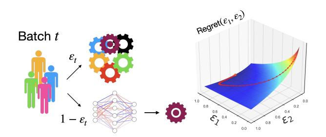
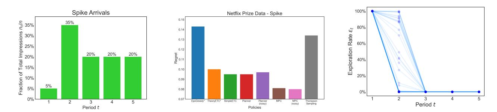

# Exploration Sizing via Model-Predictive Control

[Ethan Che](https://orcid.org/0000-0002-7770-6904)∗ Meta New York, NY, USA eche@meta.com

[Hakan Ceylan](https://orcid.org/0009-0005-2827-5211)† Amazon San Francisco, CA, USA hakancey@amazon.com

[James McInerney](https://orcid.org/0009-0004-6025-5555) Netflix Los Gatos, CA, USA jmcinerney@netflix.com

[Nathan Kallus](https://orcid.org/0000-0003-1672-0507) Netflix Los Gatos, CA, USA Cornell University New York, NY, USA kallus@cornell.edu

# Abstract

Modern recommendation systems rely on exploration to learn user preferences for new items, typically implementing uniform exploration policies (e.g., epsilon-greedy) due to their simplicity and compatibility with machine learning (ML) personalization models. Within these systems, a crucial consideration is the rate of exploration - what fraction of user traffic should receive random item recommendations and how this should evolve over time. While various heuristics exist for navigating the resulting exploration-exploitation tradeoff, selecting optimal exploration rates is complicated by practical constraints including batched updates, time-varying user traffic, and short time horizons. In this work, we propose a principled framework for determining the exploration schedule based on directly minimizing Bayesian regret through stochastic gradient descent (SGD), allowing for dynamic exploration rate adjustment via Model-Predictive Control (MPC). Through extensive experiments with recommendation datasets, we demonstrate that variations in the batch size across periods significantly influence the optimal exploration strategy. Our optimization methods automatically calibrate exploration to the specific problem setting, consistently matching or outperforming the best heuristic for each setting.

### CCS Concepts

### • Theory of computation → Sequential decision making; • Information systems → Personalization.

## Keywords

Contextual bandits, personalization, exploration.

### ACM Reference Format:

Ethan Che, Hakan Ceylan, James McInerney, and Nathan Kallus. 2026. Exploration Sizing via Model-Predictive Control. In Proceedings of the ACM Web Conference 2026 (WWW '26), April 13–17, 2026, Dubai, United Arab Emirates. ACM, New York, NY, USA, [11](#page-10-0) pages.<https://doi.org/10.1145/3774904.3792661>

© 2026 Copyright held by the owner/author(s). ACM ISBN 979-8-4007-2307-0/2026/04 <https://doi.org/10.1145/3774904.3792661>

## 1 Introduction

Modern recommendation systems apply sophisticated machine learning (ML) algorithms to historical interaction data to determine optimal personalized recommendations for each user. This shift has substantially improved recommendation quality but introduces significant challenges when new items or treatments enter the system. The introduction of new items creates the well-documented "cold-start" problem in recommendation systems [\[37\]](#page-8-0), where no historical data exists to inform personalization decisions. While numerous techniques have been proposed for extrapolating from existing items to new ones using content features or collaborative signals, a prevalent practice remains collecting new interaction data through dedicated exploration phases [\[6,](#page-8-1) [25,](#page-8-2) [30\]](#page-8-3). This approach creates a fundamental tension: more exploration yields better training data for recommendation algorithms but delays the delivery of optimally personalized experiences to users. This tension represents the classic "exploration-exploitation" trade-off extensively studied in both recommendation systems and the broader bandit literature [\[1,](#page-7-0) [24\]](#page-8-4).

Although sophisticated algorithms from the contextual bandit literature such as Thompson Sampling (TS) [\[36\]](#page-8-5) are theoretically shown to be effective at managing this trade-off, production recommendation systems often implement simpler exploration strategies based on uniform exploration of items due to (1) engineering and operational constraints [\[29\]](#page-8-6) and (2) compatibility with black-box machine learning models for personalization. Two particularly common approaches in recommendation platforms are:

- Explore-then-commit (ETC): [\[12\]](#page-8-7) This strategy dedicates an initial period to randomly assigning treatments across the user base before switching to a fully personalized policy.
- Epsilon-greedy: [\[40\]](#page-8-8) This approach continuously allocates a fixed percentage of traffic to random items while using the current ML policy for the remainder.

A critical challenge for recommendation system practitioners implementing these strategies is determining the optimal rate of exploration – how many users will be allocated a random item instead of the item recommended by the ML algorithm? For ETC, this means selecting the appropriate duration of the initial exploration phase. For epsilon-greedy, it requires setting the right percentage of traffic devoted to exploration. While theoretical guidelines exist in the

∗Corresponding author.

†Work done while at Netflix.

[This work is licensed under a Creative Commons Attribution 4.0 International License.](https://creativecommons.org/licenses/by/4.0) WWW '26, Dubai, United Arab Emirates

Figure 1: Our work studies how to set the exploration rate for uniform exploration algorithms, for which, in each period ��, assign a random item to ����-fraction of users and a personalized item to the remaining 1 − ���� (see left). Our proposed method selects the exploration rates for each period ���� ∈ [0, 1] by optimizing the exploration rates via stochastic gradient descent (SGD) to minimize a differentiable approximation of Bayesian Regret. The right figure displays this approximation as a function of the exploration rate in the first two periods (��1 and ��2). The iterations of SGD (red dots) starting from an initial plan of zero exploration ��1 = ��2 = 0 converge to an exploration plan that decreases the rate of exploration over time ��1 = 1.0, ��2 = 0.3.

bandit literature [\[24,](#page-8-4) [43\]](#page-8-9), real-world recommendation systems face additional complexities that theoretical models often overlook:

- Batched updates: [\[42\]](#page-8-10) Unlike the fully sequential sampling assumed in theoretical work, real recommendation systems typically collect data in batches and update models periodically (e.g., daily), introducing latency between exploration and policy improvement [\[9,](#page-8-11) [11,](#page-8-12) [32\]](#page-8-13).
- Time-varying user traffic: Recommendation platforms experience fluctuating traffic patterns, especially when new items are released (e.g. new movies). Thus, the batch sizes can vary substantially across time periods, affecting the rate at which exploration data accumulates.
- Limited horizons: New content launches or seasonal recommendations often operate within constrained timeframes (1-2 weeks), requiring rapid convergence to optimal policies before user interest wanes.

These operational realities of recommendation systems significantly complicate the exploration strategy. Despite the maturity of the recommendation systems field, there remains a notable gap between theoretical exploration strategies and practical implementation guidance for these constrained, real-world recommendation scenarios.

In this work, we introduce a principled framework for optimizing exploration in limited horizon, batched settings for linear contextual bandits. Our motivating observation is that cumulative regret, the core performance metric for bandit systems, is difficult to optimize directly due to uncertainty over the true environment. Instead, we show that Bayesian regret leads to a differentiable objective that is directly amenable to gradient-based optimization. In order to mitigate potential errors from relying on a Bayesian model, we propose re-optimizing the exploration schedule after each batch – a control strategy known as model-predictive control (MPC) [\[22\]](#page-8-14), which is widely used in domains such as robotics [\[19\]](#page-8-15) and chemical engineering [\[33\]](#page-8-16) but to our knowledge, has not been yet been applied to tuning exploration in contextual bandits.

In summary, our contributions are as follows:

- Using a Bayesian model, we obtain a differentiable formulation of Bayesian regret as a function of the exploration rates that can be minimized through stochastic gradient descent (SGD).
- By re-solving the optimization problem after every batch–a control policy known as model-predictive control (MPC)–the platform can adjust the exploration rate dynamically.
- We find that our proposed methods are able to adapt the exploration schedule to the structure of the batched arrivals, and match or outperform the best heuristic for each setting.
- We find surprisingly that in these short-horizon, batched settings, uniform exploration with an appropriate exploration schedule can even outperform more sophisticated approaches such as Batched Thompson Sampling [\[17,](#page-8-17) [18\]](#page-8-18).

While we focus on the linear-contextual bandit setting, our method can be extended to deep-learning models by utilizing a Bayesian linear model on the last-layer features of the network; also known as the NeuralLinear [\[35\]](#page-8-19) algorithm which has strong empirical performance in practice [\[39\]](#page-8-20).

The paper is organized as follows. We discuss related work on exploration and contextual bandits in recommendation systems in Section [2.](#page-1-0) In Section [3,](#page-2-0) we introduce the setting and the contextual bandit problem. In Section [4,](#page-2-1) we describe the Bayesian formulation and the regret objective. In Section [5,](#page-4-0) we discuss the optimization problem and the model-predictive control algorithm. In Section [6,](#page-5-0) we benchmark our proposed algorithms with baseline exploration strategies on several datasets. Finally, conclusions and future work are discussed in Section [7.](#page-7-1)

### 2 Related Work

Our work is closely related to bandits for personalization and recommendation as well as Bayesian optimal experimental design.

Bandits for Recommendation Systems. Multi-armed and contextual bandits are a popular methodology for cold-start exploration and personalization [\[1,](#page-7-0) [6,](#page-8-1) [13,](#page-8-21) [28,](#page-8-22) [29,](#page-8-6) [38,](#page-8-23) [41\]](#page-8-24). Rather than designing a new bandit policy, we focus on existing uniform exploration policies, due to their widespread usage [\[29\]](#page-8-6), and develop a framework to tune exploration rates to handle practical constraints such as batched/infrequent feedback [\[42\]](#page-8-10).

Bayesian Optimal Experimental Design. Our methods rely on a Bayesian model to calibrate exploration for personalization, similar to [\[44\]](#page-8-25). Our approach, which formulates exploration as an optimization problem, is closely related to Bayesian methods for optimal experimental design [\[10,](#page-8-26) [34\]](#page-8-27) and Bayesian methods for regret minimization [\[4,](#page-7-2) [5\]](#page-7-3). However, while typically these works typically focus on information gain or minimizing posterior uncertainty, our objective is Bayesian regret and we devise efficient approximations for optimizing this. Furthermore, our scope is limited to tuning the rate of exploration, rather than experimental selection.

�� = 5 items

|             |               |            |       | MovieLens-1M | ��         | = 5 items  |          |            |       | Netflix  |            |       |
|-------------|---------------|------------|-------|--------------|------------|------------|----------|------------|-------|----------|------------|-------|
| �� samples  |               | 500        |       |              | 5000       |            |          | 500        |       |          | 5000       |       |
| Arrival ��  | Constant      | Increasing | Spike | Constant     | Increasing | Spike      | Constant | Increasing | Spike | Constant | Increasing | Spike |
| EpsGreedy   | ∗             |            |       |              |            |            |          |            |       |          |            |       |
|             | 0.278         | 0.309      | 0.332 | 0.145        | 0.154      | 0.157      | 0.121    | 0.128      | 0.143 | 0.065    | 0.072      | 0.072 |
| TheoryETC   | ∗             |            |       |              |            |            |          |            |       |          |            |       |
|             | 0.185         | 0.156      | 0.149 | 0.097        | 0.048      | 0.071      | 0.080    | 0.093      | 0.098 | 0.045    | 0.039      | 0.045 |
| SimpleETC   | 0.139         | 0.292      | 0.185 | 0.074        | 0.049      | 0.057      | 0.105    | 0.147      | 0.095 | 0.040    | 0.047      | 0.031 |
| Planner     | 0.141         | 0.251      | 0.184 | 0.074        | 0.049      | 0.057      | 0.105    | 0.091      | 0.095 | 0.040    | 0.042      | 0.031 |
| Planner     | (noisy) 0.136 | 0.185      | 0.187 | 0.074        | 0.051      | 0.057      | 0.107    | 0.083      | 0.097 | 0.040    | 0.044      | 0.031 |
| MPC         | 0.131         | 0.164      | 0.168 | 0.074        | 0.045      | 0.056      | 0.095    | 0.084      | 0.081 | 0.037    | 0.033      | 0.029 |
| MPC (noisy) | 0.131         | 0.160      | 0.167 | 0.074        | 0.037      | 0.053      | 0.087    | 0.088      | 0.080 | 0.036    | 0.031      | 0.030 |
| TS          | 0.253         | 0.287      | 0.351 | 0.178        | 0.189      | 0.258      | 0.101    | 0.113      | 0.134 | 0.053    | 0.061      | 0.097 |
|             |               |            |       |              | ��         | = 10 items |          |            |       |          |            |       |
|             |               |            |       | MovieLens-1M |            |            |          |            |       | Netflix  |            |       |
| �� samples  |               | 500        |       |              | 5000       |            |          | 500        |       |          | 5000       |       |
| Arrival ��  | Constant      | Increasing | Spike | Constant     | Increasing | Spike      | Constant | Increasing | Spike | Constant | Increasing | Spike |
| EpsGreedy   | ∗             |            |       |              |            |            |          |            |       |          |            |       |
|             | 0.455         | 0.496      | 0.511 | 0.227        | 0.232      | 0.266      | 0.196    | 0.226      | 0.243 | 0.127    | 0.132      | 0.144 |
| TheoryETC   | ∗             |            |       |              |            |            |          |            |       |          |            |       |
|             | 0.320         | 0.346      | 0.292 | 0.155        | 0.126      | 0.117      | 0.168    | 0.164      | 0.167 | 0.073    | 0.082      | 0.082 |
| SimpleETC   | 0.266         | 0.625      | 0.313 | 0.114        | 0.141      | 0.095      | 0.166    | 0.259      | 0.190 | 0.062    | 0.145      | 0.078 |
| Planner     | 0.265         | 0.387      | 0.313 | 0.114        | 0.145      | 0.095      | 0.165    | 0.162      | 0.193 | 0.062    | 0.144      | 0.078 |
| Planner     | (noisy) 0.255 | 0.368      | 0.324 | 0.114        | 0.137      | 0.095      | 0.164    | 0.172      | 0.181 | 0.062    | 0.130      | 0.078 |
| MPC         | 0.263         | 0.320      | 0.292 | 0.115        | 0.113      | 0.093      | 0.161    | 0.157      | 0.154 | 0.061    | 0.090      | 0.078 |
| MPC (noisy) | 0.272         | 0.361      | 0.291 | 0.113        | 0.126      | 0.084      | 0.156    | 0.152      | 0.160 | 0.061    | 0.081      | 0.076 |
| TS          | 0.462         | 0.547      | 0.651 | 0.312        | 0.327      | 0.404      | 0.204    | 0.251      | 0.247 | 0.111    | 0.124      | 0.197 |
|             |               |            |       |              | ��         | = 15 items |          |            |       |          |            |       |
|             |               |            |       | MovieLens-1M |            |            |          |            |       | Netflix  |            |       |
| �� samples  |               | 500        |       |              | 5000       |            |          | 500        |       |          | 5000       |       |
| Arrival ��  | Constant      | Increasing | Spike | Constant     | Increasing | Spike      | Constant | Increasing | Spike | Constant | Increasing | Spike |
| EpsGreedy   | ∗             |            |       |              |            |            |          |            |       |          |            |       |
|             | 0.588         | 0.595      | 0.623 | 0.285        | 0.301      | 0.346      | 0.336    | 0.333      | 0.346 | 0.186    | 0.194      | 0.219 |
| TheoryETC   | ∗             |            |       |              |            |            |          |            |       |          |            |       |
|             | 0.433         | 0.444      | 0.471 | 0.185        | 0.194      | 0.207      | 0.237    | 0.233      | 0.260 | 0.090    | 0.104      | 0.114 |
| SimpleETC   | 0.308         | 0.692      | 0.523 | 0.145        | 0.169      | 0.124      | 0.328    | 0.417      | 0.310 | 0.085    | 0.232      | 0.099 |
| Planner     | 0.308         | 0.402      | 0.523 | 0.145        | 0.165      | 0.124      | 0.328    | 0.307      | 0.310 | 0.085    | 0.232      | 0.099 |
| Planner     | (noisy) 0.315 | 0.425      | 0.501 | 0.145        | 0.167      | 0.124      | 0.327    | 0.302      | 0.306 | 0.085    | 0.230      | 0.099 |
| MPC         | 0.309         | 0.460      | 0.469 | 0.145        | 0.148      | 0.124      | 0.286    | 0.240      | 0.227 | 0.085    | 0.157      | 0.099 |
| MPC (noisy) | 0.308         | 0.455      | 0.478 | 0.145        | 0.154      | 0.124      | 0.296    | 0.231      | 0.230 | 0.082    | 0.163      | 0.099 |
| TS          | 0.525         | 0.615      | 0.660 | 0.278        | 0.306      | 0.360      | 0.290    | 0.328      | 0.404 | 0.209    | 0.219      | 0.259 |

Table 1: Average regret across contextual bandit settings. Each cell is averaged over 1000 bandit problems; standard errors are all close to 0.002. Bolded cells indicates the method(s) with the lowest average regret for each (dataset, horizon, arrival pattern).

Sampling suffers from over-exploration, which has also been observed in other works [\[8,](#page-8-38) [16\]](#page-8-39). One driver of over-exploration is lack of awareness of the time horizon; the algorithm explores until the posterior converges which may be sub-optimal for short time horizons. We find that when time horizon is longer and the arrival pattern is Constant, the performance gap closes. This illustrates that seemingly simple and sub-optimal uniform exploration strategies can be surprisingly effective in settings relevant for practitioners.

## 7 Conclusion

In this work, we introduce a principled framework for selecting the exploration rates for uniform exploration policies in contextual bandit problems. This framework is based on optimization; selecting the exploration rates ���� to minimize a differentiable approximation of Bayesian regret. We find that optimization is able to calibrate exploration automatically in a wide variety of scenarios

and outperforms existing heuristics. In future work, it would of interest to extend the framework to deep learning models via the NeuralLinear algorithm [\[35\]](#page-8-19), and the optimization problem could also be extended to include additional constraints or objectives (e.g. Top-K regret).

### References

- [1] A. Barraza-Urbina. The exploration-exploitation trade-off in interactive recommender systems. In Proceedings of the Eleventh ACM Conference on Recommender Systems, pages 431–435, 2017. [2] J. Bennett and S. Lanning. The Netflix Prize. In Proceedings of KDD Cup and Workshop 2007, 2007. [3] J. Bradbury, R. Frostig, P. Hawkins, M. J. Johnson, C. Leary, D. Maclaurin,
- G. Necula, A. Paszke, J. VanderPlas, S. Wanderman-Milne, and Q. Zhang. JAX: composable transformations of Python+NumPy programs, 2018. URL [http:](http://github.com/jax-ml/jax) [//github.com/jax-ml/jax.](http://github.com/jax-ml/jax) [4] E. Che and H. Namkoong. Adaptive experimentation at scale: A computational framework for flexible batches. arXiv preprint arXiv:2303.11582, 2023. [5] E. Che, D. R. Jiang, H. Namkoong, and J. Wang. Optimization-driven adaptive experimentation. arXiv preprint arXiv:2408.04570, 2024.

