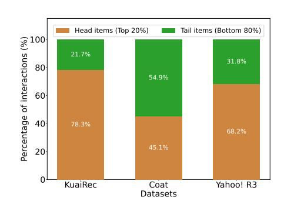
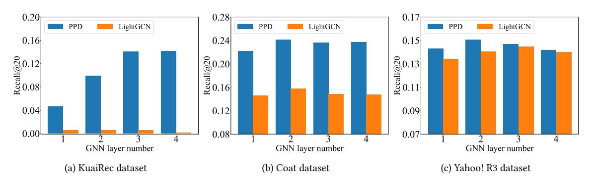
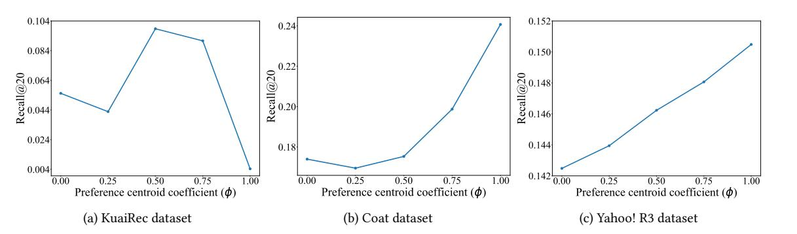
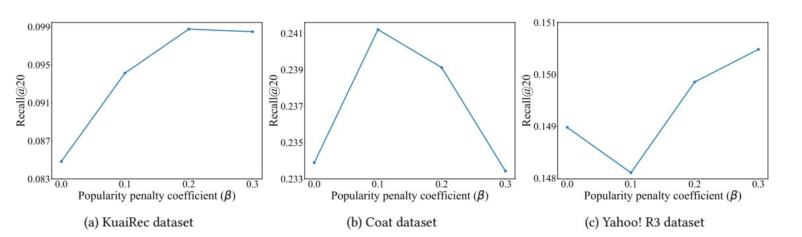

# Post-hoc Popularity Bias Correction in GNN-based Collaborative Filtering

Md Aminul Islam University of Illinois Chicago Chicago, IL, USA mislam34@uic.edu

Elena Zheleva University of Illinois Chicago Chicago, IL, USA ezheleva@uic.edu

Ren Wang Illinois Institute of Technology Chicago, IL, USA rwang74@illinoistech.edu

# Abstract

User historical interaction data is the primary signal for learning user preferences in collaborative filtering (CF). However, the training data often exhibits a long-tailed distribution, where only a few items have the majority of interactions. CF models trained directly on such imbalanced data are prone to learning popularity bias, which reduces personalization and leads to suboptimal recommendation quality. Graph Neural Networks (GNNs), while effective for CF due to their message passing mechanism, can further propagate and amplify popularity bias through their aggregation process. Existing approaches typically address popularity bias by modifying training objectives but fail to directly counteract the bias propagated during GNN's neighborhood aggregation. Applying weights to interactions during aggregation can help alleviate this problem, yet it risks distorting model learning due to unstable node representations in the early stages of training. In this paper, we propose a Post-hoc Popularity Debiasing (PPD) method that corrects for popularity bias in GNN-based CF and operates directly on pretrained embeddings without requiring retraining. By estimating interaction-level popularity and removing popularity components from node representations via a popularity direction vector, PPD reduces bias while preserving user preferences. Experimental results show that our method outperforms state-of-the-art approaches for popularity bias correction in GNN-based CF.

# CCS Concepts

• Information systems → Recommender systems.

### Keywords

collaborative filtering; graph neural networks; popularity bias

#### ACM Reference Format:

Md Aminul Islam, Elena Zheleva, and Ren Wang. 2026. Post-hoc Popularity Bias Correction in GNN-based Collaborative Filtering. In Proceedings of the ACM Web Conference 2026 (WWW '26), April 13–17, 2026, Dubai, United Arab Emirates. ACM, New York, NY, USA, [12](#page-11-0) pages. [https://doi.org/10.1145/](https://doi.org/10.1145/3774904.3792670) [3774904.3792670](https://doi.org/10.1145/3774904.3792670)

#### Resource Availability:

The source code of this paper has been made publicly available at [https:](https://doi.org/10.5281/zenodo.18371801) [//doi.org/10.5281/zenodo.18371801.](https://doi.org/10.5281/zenodo.18371801)

[This work is licensed under a Creative Commons Attribution 4.0 International License.](https://creativecommons.org/licenses/by/4.0) WWW '26, Dubai, United Arab Emirates © 2026 Copyright held by the owner/author(s). ACM ISBN 979-8-4007-2307-0/2026/04 <https://doi.org/10.1145/3774904.3792670>

# 1 Introduction

Recommender systems are integral to modern online platforms, shaping user experiences through personalized recommendations across various domains, including e-commerce, entertainment, and social networking. By leveraging historical user–item interactions, they present users with relevant content from large item collections, a process commonly referred to as collaborative filtering (CF) [\[19,](#page-8-0) [39\]](#page-8-1). Recently, Graph Neural Networks (GNNs) have emerged as a powerful method for CF by modeling recommendations as a user–item bipartite graph and propagating information to multihop neighborhoods via neighborhood aggregation [\[50\]](#page-9-0). The aggregation mechanism enables GNN-based CF methods to learn higher-order interaction patterns, resulting in high-quality user and item representations and state-of-the-art performances [\[15,](#page-8-2) [18\]](#page-8-3).

Recommender systems often rely on user interaction data, such as clicks, to infer preferences, since this data can easily be collected from interaction logs. However, such data is prone to biases [\[2,](#page-8-4) [21\]](#page-8-5), with popularity bias being particularly severe [\[64\]](#page-9-1). Interaction data in recommender systems is often long-tailed, with a small set of items receiving most feedback while the majority remain rarely interacted with [\[55\]](#page-9-2). CF models trained on such skewed data inherit popularity bias [\[6,](#page-8-6) [51\]](#page-9-3), over-recommending head items and under-recommending tail items. Through the feedback loop in recommender systems [\[7\]](#page-8-7), this bias can be amplified over time, reducing personalization and weakening long-term performance. Figure [1](#page-0-0) illustrates the effect of data imbalance in interaction data. In the KuaiRec, Coat, and Yahoo! R3 datasets, items are sorted by interaction frequency, with the top 20% categorized as head items and the remaining 80% as tail items. User interactions are disproportionately concentrated on head items. Consequently, training

Figure 1: Distribution of interactions across head (top 20%) and tail (bottom 80%) items in the KuaiRec, Coat, and Yahoo! R3 datasets. Most interactions are concentrated in head items, highlighting the data imbalance in these datasets.

models on such skewed data amplifies head-item recommendations, further marginalizing tail items in future recommendations.

Several approaches have been proposed to mitigate popularity bias. A common strategy is to adjust the training loss to reduce the influence of popular items. Inverse propensity weighting (IPW) methods [\[2,](#page-8-4) [16,](#page-8-8) [21\]](#page-8-5) reweight the loss by upweighting unpopular items and downweighting popular ones, while regularization-based methods [\[4,](#page-8-9) [12,](#page-8-10) [46\]](#page-9-4) penalize correlations between predicted scores and item popularity. Causal graph-based methods [\[3,](#page-8-11) [31,](#page-8-12) [42,](#page-8-13) [47\]](#page-9-5) instead use causal structures to identify sources of popularity and apply causal inference techniques to mitigate their effect on relevance estimation. However, all three of these loss-based approaches may not fully eliminate popularity bias in GNN-based CF [\[64\]](#page-9-1).

While GNNs are highly effective for CF tasks, they tend to amplify popularity bias [\[11,](#page-8-14) [64\]](#page-9-1). Due to the long-tailed nature of interaction data, popular items connect to many more users than unpopular (niche) items, giving them disproportionate influence during propagation [\[64\]](#page-9-1). During the message passing process, highdegree nodes (i.e., popular items) propagate their information more quickly to neighboring users than low-degree nodes (i.e., niche items), causing users' representations to move closer to these popular items in the embedding space [\[8,](#page-8-15) [11\]](#page-8-14). As a result, learned representations tend to be dominated by signals from high-degree items, and repeated propagation across multiple layers spreads this effect to higher-order neighbors, further strengthening the dominance of popular items [\[11\]](#page-8-14). Consequently, popular items become similar to a wide range of users in the latent space, making them more likely to receive higher prediction scores [\[64\]](#page-9-1) and appear frequently in many users' recommendations.

To address this, recent works [\[23,](#page-8-16) [64\]](#page-9-1) weight interactions during aggregation, akin to propensity scores, to downweight popular item interactions during aggregation. However, these methods assign weights in every training epoch—either using pre-computed scores [\[23\]](#page-8-16) or dynamically estimated values [\[64\]](#page-9-1). Since model representations are unstable in the early stages, the resulting embeddings are under-trained and noisy, which leads to unreliable popularity estimates that can distort and mislead the learning process.

Both loss-based and aggregation-weight methods require retraining the backbone, making them impractical for deployed models [\[8\]](#page-8-15). Post-processing re-ranking methods [\[1,](#page-8-17) [65\]](#page-9-6) adjust predicted scores to diversity or popularity bias but cannot remove popularity effect embedded in node representations. More recently, a post-hoc method [\[11\]](#page-8-14) for GNN-based CF estimates popularity effects using simple node degrees, without considering personalized preferences or interaction-level popularity effects. One might assume that debiasing can be achieved by simply removing some popular items from the recommendations to match the true underlying distribution. This distribution, however, is unknown in practice. Moreover, since popularity is not always harmful [\[63\]](#page-9-7), indiscriminately suppressing head items risks discarding truly relevant items of user interest.

In this paper, we propose a Post-hoc Popularity Debiasing (PPD) method to mitigate popularity bias in GNN-based CF. Our method operates on pre-trained embeddings from an already trained model. We estimate the popularity of each user-item interaction by combining global preference with personalized preference derived from the embeddings. Based on these estimates, we identify a popularity direction vector for each node. We then project the node embedding

onto this direction to obtain its component along the direction and update the embedding by removing this popularity component. This eliminates the popularity effect while preserving preference-driven signals, resulting in unbiased node representations for generating unbiased recommendations. Though this general idea is simple, this method provides a post-hoc solution that is very effective at reducing popularity bias without retraining the model.

Our method has several advantages over existing popularity bias correction methods. Unlike loss-based methods [\[4,](#page-8-9) [16,](#page-8-8) [31,](#page-8-12) [42,](#page-8-13) [46,](#page-9-4) [47\]](#page-9-5), it requires no loss modification, making it applicable to any GNNbased CF model. Second, it operates in a post-hoc manner, eliminating the need for retraining and allowing application to already deployed models. Third, instead of weighting interactions in aggregation during training [\[23,](#page-8-16) [64\]](#page-9-1), our method operates directly on learned embeddings, allowing popularity estimation on stable representations. Finally, unlike prior GNN-based post-hoc method [\[11\]](#page-8-14), it estimates popularity at the interaction level for finer-grained effects and captures both global and personalized influences in popularity estimation, rather than relying on simple node degrees.

# 2 Related Work

Recommender systems often exhibit popularity bias, causing popular items to dominate recommendations [\[9,](#page-8-18) [12,](#page-8-10) [36,](#page-8-19) [55\]](#page-9-2). Existing methods to address this include IPW, post-processing re-ranking, regularization, and causal inference methods.

IPW-based methods mitigate popularity bias by down-weighting frequent items, assigning each interaction a weight inversely proportional to the item's popularity [\[2,](#page-8-4) [21\]](#page-8-5). To reduce the high variance of IPW, subsequent works [\[5,](#page-8-20) [16\]](#page-8-8) use normalization or smoothing penalties. However, the effectiveness of IPW depends on accurate propensity score estimation [\[33\]](#page-8-21). IPW is also widely used in learning-to-rank systems to correct biases such as position and selection bias [\[2,](#page-8-4) [21,](#page-8-5) [27,](#page-8-22) [28,](#page-8-23) [32,](#page-8-24) [43\]](#page-8-25). Regularization-based methods incorporate constraints during training to reduce popularity. LapDQ [\[46\]](#page-9-4) promotes diversity via item-distance regularization, INRS [\[22\]](#page-8-26) applies mean-matching to favor less popular items, ESAM [\[12\]](#page-8-10) transfers knowledge from popular to unpopular items to alleviate sparsity, and Sam-Reg [\[4\]](#page-8-9) reduces the correlation between relevance and popularity. Post-processing re-ranking methods operate after recommendation generation, leaving user and item representations intact. They address goals such as preserving historical preference distributions (calibration) [\[38\]](#page-8-27), enhancing diversity [\[1\]](#page-8-17), and correcting popularity bias in dynamic recommender systems by adjusting predicted scores [\[65\]](#page-9-6). Causal inference has been used to separate user interests from popularity effects [\[3,](#page-8-11) [17,](#page-8-28) [31,](#page-8-12) [42,](#page-8-13) [47,](#page-9-5) [63\]](#page-9-7). CausE [\[3\]](#page-8-11) uses causal graphs for unbiased learning, MPCI [\[17\]](#page-8-28) blocks paths from popularity to predictions, MACR [\[47\]](#page-9-5) removes direct popularity effects via multi-task counterfactual learning, and PPAC [\[31\]](#page-8-12) jointly models global and personal popularity within user neighborhoods using counterfactual inference.

Deep learning-based recommender systems rely on high-quality representations to predict user–item interactions [\[54\]](#page-9-8). GNNs achieve this by aggregating information from neighboring nodes [\[9,](#page-8-18) [10,](#page-8-29) [13,](#page-8-30) [20,](#page-8-31) [57,](#page-9-9) [59\]](#page-9-10), with propagation layers capturing higher-order connectivities. They are state-of-the-art for CF due to this ability. LightGCN [\[18\]](#page-8-3) simplifies GNNs by removing non-linear transformations and activations and is widely used in GNN-based CF.

can be indirectly evaluated through improvements in predictive accuracy through an unbiased evaluation.

#### 4 Methodology

In this section, we introduce our PPD method for mitigating popularity bias in GNN-based CF. We first estimate the popularity for each user–item interaction by proposing a novel metric of popularity that quantifies how much the interaction is influenced by item global preference rather than user preferences, and use these estimates to define a popularity direction in the embedding space. We then project node embeddings onto this direction to get the component of node embeddings on this direction, and update the node embeddings by removing this popularity component from the node embeddings. Despite its simplicity, this approach effectively reduces popularity bias in a post-hoc manner, without requiring retraining, while preserving the underlying preference signals.

### 4.1 Popularity estimation

User-item interactions can arise from two main factors, namely the global preference of the item and the user's personalized preference for it. To quantify the contribution of popularity to each interaction, we define three measures: global preference, personalized preference, and popularity score.

4.1.1 Global preference. Global preference reflects the fact that some items receive disproportionately high recommendations across the user base. To capture this effect in the embedding space, we measure how similar an item is, on average, to all users. Items with higher similarity with users tend to obtain higher prediction scores and are more likely to be recommended, reflecting the extent to which interactions are driven by broader popularity.

Definition 1 (global preference). Let ���� be the global preference for item ��, which estimates its popularity in the embedding space by measuring its similarity to all users, and is defined as:

���� = 1 |U| ∑︁ ��∈U ������(e��, e��), (5)

where sim(·) is a similarity function (e.g., dot product or cosine similarity).

Existing works [\[31,](#page-8-12) [47,](#page-9-5) [58\]](#page-9-19) typically measure an item's global preference by its interaction frequency in the training data, i.e., the ratio of total interactions with the item to the total number of users. In contrast, we define global preference in the embedding space by measuring how similar an item is to users, reflecting how the pre-trained model would tend to promote certain items broadly and thereby makes them popular through recommendations.

4.1.2 Personalized preference. Personalized preference reflects how well an item matches the historical behavior of a user. If an interacted item is similar to a user's historical interactions, it likely reflects the user's personalized preferences. However, since popular items may appear in a user's history, we adjust their influence when computing personalized preferences.

Definition 2 (Personalized Preference). The personalized preference ������ for user �� measures how closely item �� aligns with the other items interacted with by user ��, and is defined as:

������ = 1 |���� | ∑︁ �� ∈���� sim(e�� , e��) − ���������� . (6)

Intuitively, ������ measures how well item �� aligns with the historical preferences of user ��. However, if item �� is globally popular and the set ���� also contains other popular items, their embeddings may appear similar in the embedding space. Consequently, the personalized preference ������ may be high for a pair of popular items. To address this, we introduce a penalty term controlled by the hyperparameter �� ≥ 0. The hyperparameter �� controls how strongly global preference effects are discounted in personalized preference. Larger values impose stronger penalties on personalized preferences, while smaller values allow item similarity to contribute more. It can be dataset-dependent, based on data skewness and sparsity, and therefore we tune �� as a hyperparameter.

4.1.3 Popularity score. We define a popularity score for each interaction to measure the influence of an item's global preference over the user's personalized preference. We define this score as the difference between the item's global and personalized preferences.

Definition 3 (Popularity Score). Let ������ be the popularity score for an interaction (��,��), where ���� is the global preference of item �� and ������ is the user's personalized preference for item ��. Then, ������ is defined as:

������ = ���� − ������ . (7)

The popularity score ������ for each interaction estimates the extent to which an interaction between user �� and item�� is influenced by popularity rather than user preference. The reason for subtracting personalized preference is that some part of an item's global preference reflects true user preferences. Considering global preference (���� ) directly to address popularity bias can hurt recommendations [\[63\]](#page-9-7), as some popular items can truly be relevant. By removing personalized preference component, the popularity score captures only the residual effect of popularity, isolating the part of the interaction that is driven purely by popularity. Without this, preference-aligned popular items can incorrectly be treated as pure popularity. A high score indicates that the item is popular but not well-aligned with the user's interests, suggesting a popularity-driven interaction. A low score implies alignment with the user's preferences, reflecting a more true preference. To make the two scores ���� and ������ comparable, we can normalize them before computing ������. We compute the popularity score for each interaction using the stable user and item embeddings learned by the pre-trained model. This yields a more accurate score, as the embeddings already capture both popularity and meaningful user interests. This is an advantage of our approach over methods [\[23,](#page-8-16) [64\]](#page-9-1) that estimate popularity during training.

### 4.2 Post-hoc popularity bias correction via projection

In the previous section, we estimated interaction-level popularity scores, providing a fine-grained measure of how much each useritem interaction is influenced by item popularity. Popularity-driven components can dominate user and item representations and further amplify bias through GNN's propagation. Our key idea is to use these interaction-level popularity scores to construct a popularity direction in the embedding space for each node, representing how

popularity pulls embeddings away from true preferences. Using this popularity direction, we remove popularity-induced components from node embeddings, thereby preserving the underlying preference signals. This debiasing is performed at the initial embedding layer (�� = 0) of the pre-trained model, and then we propagate information, ensuring that unbiased signals are propagated through all subsequent layers of the GCN.

For each user ��, we compute two embedding centroids using the items N (��) that the user interacted with: a popularity-based centroid and a preference-based centroid. Because ������ represents the extent to which item �� is interacted by user �� due to popularity, (1− ������) reflects the degree to which the interaction aligns with user ��'s personal preferences. Based on this idea, we define the popularitybased centroid (e¯ (0) pop (��)) and the preference-based centroid (e¯ (0) pref(��)) for each user �� at the initial layer (layer 0):

e¯ (0) pop (��) = Í ��∈N (��) ������ · e (0) Í ��∈N (��) ������ + �� , e¯ (0) pref(��) = Í ��∈N (��) (1 − ������) · e (0) Í ��∈N (��) (1 − ������) + �� (8)

The denominator is a normalizing factor, and �� is a small constant added to avoid division by zero. Similarly, for each item ��, we define:

e¯ (0) pop (��) = Í ��∈N (��) ������ · e (0) Í ��∈N (��) ������ + �� , e¯ (0) pref(��) = Í ��∈N (��) (1 − ������) · e (0) Í ��∈N (��) (1 − ������) + �� . (9)

We define the popularity direction vector of a node as the difference between its popularity and preference centroids:

d (0) pop (��) = e¯ (0) pop (��) − �� · e¯ (0) pref(��), d (0) pop (��) = e¯ (0) pop (��) − �� · e¯ (0) pref(��). (10)

The popularity direction vector captures how popularity pulls the node embeddings away from preferences. This vector represents the direction from preference to popularity in embedding space. The preference centroid coefficient �� ∈ [0, 1] controls the contribution of the preference centroid in the popularity direction and adjusts for potential noise in the preference centroid. In datasets where popularity bias is severe due to heavily skewed data, preference signals may contain unreliable or noisy information. In such cases, using a larger �� may yield a less accurate estimate of the popularity direction, whereas a smaller �� can provide a more reliable estimation. In datasets with more diverse interactions and less popularity, preference signals can be more reliable, and a larger �� enables a more accurate estimate of the popularity direction.

We leverage the vector projection formula [\[34\]](#page-8-40) to decompose a vector along the direction of another. By projecting one vector onto another, we can obtain the component of the first vector that lies along the direction of the second [\[34\]](#page-8-40). We project the node embedding onto the popularity direction vector to get the component of an embedding aligned with that direction. By subtracting this component from the node embedding, we remove the popularity component while preserving user preferences, and thus can obtain unbiased embeddings for users and items free from popularity. The final debiased embeddings for user �� at layer 0 can be written as:

e˜ (0) �� = e (0) �� − Projd pop (��) (e (0) �� ) = e (0) �� − ⟨e (0) �� , d (0) pop (��)⟩ ∥d (0) pop (��) ∥2 · d (0) pop (��). (11)

Here, Projd pop (��) (e (0) �� ) denotes the projection of the user embedding e (0) �� onto the popularity direction d (0) pop (��), yielding the component of the user's representation in the direction of popularity. The notation ⟨·, ·⟩ represents the dot product between two vectors. Similarly, the final debiased embeddings for each item �� at layer 0 can be written as:

e˜ (0) = e (0) − Projd (0) pop (��) (e (0) ) = e (0) �� − ⟨e (0) �� , d (0) pop (��)⟩ ∥d (0) pop (��) ∥2 · d (0) pop (��). (12)

These debiased embeddings are used as input to the propagation layers of the model. The information propagation for layers �� ≥ 1 can be computed using equation [\(1\)](#page-2-1), where e (0) �� := e˜ (0) �� and e (0) �� := e˜ (0) are the debiased embeddings at layer 0. By debiasing the 0thlayer embeddings and propagating them in higher layers, the model propagates unbiased node information to higher layers. Thus, we remove popularity at the 0-th layer to allow unbiased information to flow through higher layers. The full PPD algorithm is provided in Subsection [A.1](#page-9-20) of the Appendix.

Finally, the final embedding of a node is obtained by combining information from all layers using equation [\(2\)](#page-2-2). The predicted relevance score between user �� and item �� is the inner product of their final embeddings: ��ˆ���� = e ⊤ e�� . Based on these scores, the model can recommend the top-�� items that user �� has not yet interacted with and that are most likely to reflect the user's interests. Our approach is post-hoc, applying bias correction to already learned node representations. Thus, it can correct bias in a deployed model without retraining, updating only the embeddings of a trained model to mitigate popularity bias.

Note that PPD requires only the embeddings from a pre-trained model and can therefore be used as a general post-hoc debiasing strategy for other latent-factor models (e.g., matrix factorization) using the same procedure, except propagating information from unbiased embeddings. We focus on GNN-based CF in our current study because GNNs are state-of-the-art CF models but tend to severely amplify popularity bias through propagation [\[64\]](#page-9-1), making them an important use case. Exploring post-hoc methods for other latent-factor models can be a good future research direction.

### 5 Experiments

In this section, we evaluate the performance of our PPD method by formulating the following research questions:

- RQ1: How does PPD perform compared with existing popularity bias correction methods?
- RQ2: How does PPD improve the performance of popular and niche item groups relative to other methods, and does improving one come at the expense of the other?
- RQ3: How does varying the number of GNN layers affect the performance of PPD?
- RQ4: How does PPD perform when applied to other GNN-based CF backbones (e.g., SGL [\[48\]](#page-9-11))?
- RQ5: How does incorporating personalized preferences into popularity estimation affect the performance of PPD?

0This work was supervised by Ren Wang and Elena Zheleva.

- RQ6: How does the preference centroid hyperparameter (��) affect the performance of PPD?
- RQ7: How does the popularity penalty hyperparameter (��) in personalized preference affect the performance of PPD?

#### 5.1 Experimental setup

Datasets. We use three real-world datasets: KuaiRec [\[14\]](#page-8-41), Coat [\[37\]](#page-8-42), and Yahoo! R3 [\[30\]](#page-8-43). We choose these datasets because they provide unbiased test data, which allows us unbiased evaluation of methods. KuaiRec, from Kuaishou short-video logs, provides a fully observed user–item matrix for unbiased evaluation, with nearly all users rating every video, while the training set remains sparse. The test set includes ratings from 1, 411 users on 3, 327 items. Following [\[14\]](#page-8-41), an interaction is considered positive if a user watches a video for more than twice its duration. Coat contains customer ratings from an online coat store, where each user rated 24 self-selected items in the training set, and the unbiased test set includes ratings from 16 randomly shown items per user. Yahoo! R3 dataset contains over 300, 000 self-selected user–song ratings by 15, 400 users in the training set. Additionally, a separate unbiased test set is collected by asking 5, 400 users to provide ratings for 10 randomly presented songs. Ratings are given on a 5-point scale, and for our experiments, we consider ratings of 3 or higher as positive feedback. Table [1](#page-5-0) presents a detailed overview of the datasets. Although evaluation on other datasets is possible, they generally do not provide unbiased test data. Those datasets construct test sets by sampling from user interactions in the training data [\[47\]](#page-9-5), which still follow a popularitydominated distribution and prevent unbiased evaluation. Therefore, we use the three mentioned datasets, which provide unbiased test data under random or full-exposure settings, varying sizes, sparsity, and popularity, covering diverse real-world scenarios.

Table 1: Detailed datasets statistics.

| Dataset       | KuaiRec   | Coat    | Yahoo! R3 |
|---------------|-----------|---------|-----------|
| #Users        | 7,176     | 290     | 14,382    |
| #Items        | 10,728    | 300     | 1,000     |
| #Interactions | 1,153,106 | 5,490   | 129,748   |
| Sparsity      | 0.01498   | 0.06303 | 0.00902   |

Evaluation metrics. Following the all-ranking protocol [\[25\]](#page-8-44), we rank all items per user, excluding those with positive feedback in the training set. Recommendation performance is measured using Recall@��, NDCG@��, and Hit Ratio (HR@��) with �� = 20 by default, where �� is the evaluation cutoff. The KuaiRec dataset presents a special case. Its test set is constructed from a dense subset of the user-item matrix [\[14\]](#page-8-41), rather than being a random sample from the entire space. As a result, the traditional all-ranking protocol is not applicable. Instead, for KuaiRec dataset, we evaluate by ranking only the 3, 327 items that are fully exposed.

Baselines. We evaluate the performance of PPD relative to popularity bias correction methods in CF, including post-hoc method DAP [\[11\]](#page-8-14), interaction-weighting methods applied during aggregation like APDA [\[64\]](#page-9-1) and NAVIP [\[23\]](#page-8-16), causal inference-based approaches such as MACR [\[47\]](#page-9-5) and PPAC [\[31\]](#page-8-12), IPW methods like IPSCN [\[16\]](#page-8-8), and a regularization-based approach SAM-REG [\[4\]](#page-8-9). We include LightGCN [\[18\]](#page-8-3) as a standard GNN-based CF backbone

without any debiasing, using it as the backbone for all baselines and for our method. These baselines cover all the major classes of debiasing strategies, while detailed descriptions of baselines are provided in the Appendix [B.1.](#page-9-21) Since PPD focuses on pure CF using only interaction data, without any user or item features or side information, we include baselines that are adaptable to this setting. We provide the detailed implementation details in the Appendix [B.2.](#page-10-0) Our GitHub code is publicly available in the provided link[1](#page-5-1)

### 5.2 Results

In this section, we present the results of our method with respect to the research questions introduced earlier.

Performance comparison between our method and the baselines (RQ1). In response to RQ1, we evaluate whether PPD outperforms existing popularity bias correction approaches. Table [2](#page-6-0) compares PPD with baselines, where in-training methods correct bias during training and post-hoc methods do so after training. PPD consistently achieves the best results across all metrics. On KuaiRec, where popularity bias can be severe (Figure [1\)](#page-0-0), PPD outperforms the strongest baseline (PPAC) with relative improvements of 186.4% in Recall@20, 500.2% in NDCG@20, and 46.4% in HR@20, highlighting its effectiveness in highly skewed data. On Coat, with milder popularity (Figure [1\)](#page-0-0), PPD outperforms the strongest baseline IPSCN by 4.8% in Recall@20, 1.2% in NDCG@20, and 1.8% in HR@20, remaining competitive in less biased scenarios. On sparse Yahoo! R3 (Table [1\)](#page-5-0), PPD exceeds all baselines, improving 2.9%, 5.8%, and 2.7% over PPAC. PPD also outperforms the post-hoc baseline DAP [\[11\]](#page-8-14), as PPD estimates interaction-level popularity for debiasing by considering both global and personalized preferences, rather than clustering similar nodes and relying on simple node degree information. Moreover, PPD consistently outperforms aggregationweighting methods such as APDA [\[64\]](#page-9-1) and NAVIP [\[23\]](#page-8-16), supporting our claim that applying weights in every training epoch can distort model learning and does not effectively reduce popularity bias. These results demonstrate several key insights. First, the substantial improvements on KuaiRec emphasize that PPD is particularly effective in settings where popularity can be most prominent, confirming its robustness to extreme skew in interaction frequency. Second, the consistent improvements on Coat indicate that PPD also generalizes well to datasets with less pronounced popularity bias. Finally, even on Yahoo! R3, where extremely sparse interactions can make debiasing particularly difficult due to fewer preference signals in the data, PPD yields consistent improvements, suggesting its ability to correct for bias in sparser datasets. Together, these findings show that PPD consistently outperforms the baselines across datasets with varying levels of skewness and sparsity.

In addition to performance, PPD demonstrates computational advantages over existing methods because it does not require retraining the model. As shown in Table [2,](#page-6-0) PPD is consistently faster than all methods across all datasets. It achieves 2.32×, 28.64×, and 3.44× speedups on KuaiRec, Coat, and Yahoo! R3, respectively, compared to the best-performing baselines. These results demonstrate that PPD not only improves recommendation performance by reducing popularity bias but also lowers computational cost. Moreover, PPD requires only the embeddings from the pre-trained model,

1Code is available at [https://github.com/edgeslab/Posthoc\\_Popularity\\_Debiasing](https://github.com/edgeslab/Posthoc_Popularity_Debiasing)

Table 2: A comparison of different methods across datasets and evaluation metrics using LightGCN as the backbone. The best-performing method is shown in bold, and the second-best method is underlined. Performance improvement (%) is given compared to the best baseline for all evaluation metrics. We additionally report the runtime (in minutes) for each method and the corresponding runtime improvement of PPD in terms of time speedup compared to the best-performing baseline.

| Debiasing type   | Method | Recall  | NDCG    | KuaiRec HR | Runtime | Recall | NDCG   | Coat HR | Runtime | Recall | NDCG   | Yahoo! R3 HR | Runtime |
|------------------|--------|---------|---------|------------|---------|--------|--------|---------|---------|--------|--------|--------------|---------|
| Post-hoc PPD     |        | 0.0988  | 0.2899  | 0.9043     | 112.31  | 0.2407 | 0.1957 | 0.5871  | 0.11    | 0.1505 | 0.0695 | 0.2237       | 3.35    |
| DAP              | [11]   | 0.0289  | 0.0284  | 0.3007     | 260.13  | 0.1607 | 0.0777 | 0.4555  | 0.28    | 0.1416 | 0.0647 | 0.2150       | 32.25   |
| None LightGCN    | [18]   | 0.0055  | 0.0043  | 0.0709     | 115.42  | 0.1572 | 0.0773 | 0.4626  | 2.97    | 0.1403 | 0.0640 | 0.2136       | 13.83   |
| APDA             | [64]   | 0.0097  | 0.0077  | 0.1057     | 832.52  | 0.1435 | 0.0727 | 0.4413  | 0.68    | 0.1392 | 0.0627 | 0.2081       | 31.58   |
| NAVIP            | [23]   | 0.0006  | 0.0039  | 0.0759     | 121.34  | 0.1413 | 0.0730 | 0.4377  | 0.35    | 0.1439 | 0.0648 | 0.2161       | 13.30   |
| MACR In-training | [47]   | 0.0104  | 0.0107  | 0.1872     | 119.23  | 0.1002 | 0.0451 | 0.3345  | 1.17    | 0.0089 | 0.0033 | 0.0181       | 4.03    |
| IPSCN            | [21]   | 0.0010  | 0.0060  | 0.0574     | 118.32  | 0.2296 | 0.1933 | 0.5765  | 3.15    | 0.1309 | 0.0589 | 0.1977       | 5.12    |
| SAM-REG          | [4]    | 0.0018  | 0.0133  | 0.1121     | 132.12  | 0.2206 | 0.1892 | 0.5730  | 3.75    | 0.1226 | 0.0551 | 0.1847       | 7.14    |
| PPAC             | [31]   | 0.0345  | 0.0483  | 0.6177     | 260.21  | 0.1444 | 0.0716 | 0.3915  | 0.26    | 0.1462 | 0.0657 | 0.2178       | 11.52   |
| Improvement      |        | +186.4% | +500.2% | +46.4%     | 2.32 ×  | +4.8%  | +1.2%  | +1.8%   | 28.64 × | +2.9%  | +5.8%  | +2.7         | 3.44 ×  |

avoiding the need to load and process the training data or train the GNN model on the GPU. As a result, it requires less GPU memory. PPD requires approximately 401MB, 228MB, and 352MB of GPU memory on KuaiRec, Coat, and Yahoo! R3, respectively, which is approximately half of that used by the best-performing baselines.

Popular and niche item performance improvement (RQ2). RQ2 evaluates performance on popular (head) and niche (tail) items, examining whether improvements on one group come at the expense of the other. Popularity bias correction can create such a trade-off, where enhancing tail-item performance may degrade head-item accuracy [\[64\]](#page-9-1). To investigate this, following [\[11,](#page-8-14) [64\]](#page-9-1), we divide items into the top 20% most frequently interacted ones (popular) and the remaining 80% (niche) based on the training data, and evaluate performance on these subsets. This allows assessment of whether PPD balances recommendation quality for both head and tail items. We choose the 20%-80% split, as it is commonly used in recommender systems to analyze popularity [\[11,](#page-8-14) [64\]](#page-9-1), reflecting power-law popularity distributions. As shown in Table [3,](#page-6-1) PPD consistently achieves the best performance across both groups. On KuaiRec, PPD improves head performance by +186.7% in Recall@20

and +492.3% in NDCG@20 compared to the best baseline. For niche items, where all methods struggle due to very skewed data in tails, PPD still shows the best performance, achieving relative improvements of +233.3% in Recall@20 and +400% in NDCG@20 compared to best baseline. The overall low scores on KuaiRec tails stem from the extremely imbalanced distribution, where most niche items may have only a few interactions, making them inherently difficult to recommend. On Coat, PPD also improves both head and niche groups simultaneously. For head items, it yields +2.7% Recall@20 and +0.94% NDCG@20 over the best baseline. For niche items, it further improves by +1.24% Recall@20 and +1.09% NDCG@20, showing that gains on tail recommendations do not compromise head performance. On Yahoo! R3, PPD improves head recommendations with +7.1% Recall@20 and +12.0% NDCG@20 compared to best baseline, while also improving tail performance with +2.33% Recall@20, though NDCG shows a slight drop (–1.5%) compared to best baseline. Across all datasets, PPD achieves the highest HR@20 compared to the baselines, though we do not report the results due to space constraints. In summary, PPD enhances recommendations for tail items, demonstrating its ability to promote niche

Table 3: A comparison of different methods across datasets using LightGCN as the backbone, evaluated on the top 20% and bottom 80% of items sorted by interaction frequency in the training data. The best-performing method is shown in bold, and the second-best method is underlined. Performance improvement (%) is given compared to the best baseline.

| Debiasing type   | Method | Recall  | Top 20% NDCG | KuaiRec Recall | Bottom 80% NDCG | Recall | Top 20% NDCG | Coat Recall | Bottom 80% NDCG | Recall | Top 20% NDCG | Yahoo! R3 Recall | Bottom 80% NDCG |
|------------------|--------|---------|--------------|----------------|-----------------|--------|--------------|-------------|-----------------|--------|--------------|------------------|-----------------|
| Post-hoc PPD     |        | 0.1167  | 0.2931       | 0.0010         | 0.0005          | 0.3770 | 0.2259       | 0.1550      | 0.1291          | 0.3222 | 0.1450       | 0.0352           | 0.0127          |
| DAP              | [11]   | 0.0337  | 0.0297       | 0.0000         | 0.0000          | 0.3627 | 0.1524       | 0.1215      | 0.0582          | 0.2890 | 0.1267       | 0.0337           | 0.0123          |
| None LightGCN    | [18]   | 0.0064  | 0.0027       | 0.0000         | 0.0000          | 0.3671 | 0.1565       | 0.0643      | 0.0237          | 0.2885 | 0.1263       | 0.0332           | 0.0118          |
| APDA             | [64]   | 0.0116  | 0.0085       | 0.0000         | 0.0000          | 0.3073 | 0.1299       | 0.0714      | 0.0286          | 0.2643 | 0.1147       | 0.0344           | 0.0129          |
| NAVIP            | [23]   | 0.0003  | 0.0003       | 0.0000         | 0.0000          | 0.3421 | 0.1395       | 0.0462      | 0.0201          | 0.3008 | 0.1295       | 0.0327           | 0.0125          |
| MACR In-training | [47]   | 0.0125  | 0.0111       | 0.0000         | 0.0000          | 0.1724 | 0.0539       | 0.0663      | 0.0320          | 0.0003 | 0.0001       | 0.0142           | 0.0049          |
| IPSCN            | [21]   | 0.0003  | 0.0012       | 0.0003         | 0.0001          | 0.3672 | 0.2238       | 0.1509      | 0.1277          | 0.2697 | 0.1177       | 0.0297           | 0.0116          |
| SAM-REG          | [4]    | 0.0023  | 0.0132       | 0.0001         | 0.0001          | 0.3341 | 0.2139       | 0.1531      | 0.1272          | 0.2775 | 0.1191       | 0.0116           | 0.0044          |
| PPAC             | [31]   | 0.0407  | 0.0494       | 0.0000         | 0.0000          | 0.3627 | 0.1595       | 0.0731      | 0.0327          | 0.1462 | 0.0657       | 0.0336           | 0.0124          |
| Improvement      |        | +186.7% | +492.3%      | +233.3%        | +400%           | +2.7%  | +0.94%       | +1.24%      | +1.09%          | +7.1%  | +12.0%       | +2.33%           | -1.5%           |

Figure 2: Effect of varying the number of layers on performance (Recall@20) for PPD and LightGCN.

items while maintaining strong performance for head items. PPD explicitly removes popularity-driven components from embeddings while retaining preference-driven signals through interaction-level popularity scores. This ensures that head items are recommended when they genuinely reflect user interests, and tail items are recommended when aligned with user preferences. Therefore, the typical head–tail trade-off is avoided: head accuracy is preserved, and tail performance is improved.

Effect of GNN layer depth on model performance (RQ3). We investigate how varying the number of GNN layers influences the performance of the PPD method. Figure [2](#page-7-0) demonstrates the effect of increasing the number of layers. On the KuaiRec dataset, where popularity bias is most severe, LightGCN reaches peak performance with two layers but suffers degradation as more layers are added, indicating that deeper propagation amplifies popularity bias and over-smoothing. In contrast, PPD continues to benefit from additional layers, suggesting that its debiasing mechanism can mitigate bias amplification while leveraging multi-hop information. On the Coat dataset, where popularity bias is less pronounced, both models achieve their best performance with two layers, and deeper propagation beyond this point may introduce noise rather than useful signals, reducing accuracy. For Yahoo! R3, PPD achieves optimal results with two layers, while LightGCN slightly peaks at three layers, reflecting that in moderately biased and sparse settings, LightGCN can still gain from slightly deeper propagation. Importantly, across all datasets and all depths, PPD consistently outperforms LightGCN, demonstrating robustness and resilience to over-smoothing and bias mitigation. For NDCG@20, PPD also outperforms across different layer depths, exhibiting trends similar to Recall@20. These findings highlight that the optimal number of layers depends on the dataset, and PPD maintains stronger performance by mitigating popularity bias across different depths.

RQ4-RQ7. Beyond all these main results from RQ1-RQ3, we also evaluate four additional analysis in RQ4-RQ7. We present detailed results and analysis for RQ4–RQ7 in Appendix [B.3.](#page-10-1) In RQ4, we apply PPD to another stronger GNN-based CF backbone, Selfsupervised Graph Learning (SGL), to evaluate the generalizability of our debiasing strategy. PPD consistently outperforms SGL across all three datasets (see Table [4\)](#page-10-2), with particularly large gains on the popularity-dominated KuaiRec dataset, demonstrating its effectiveness on different GNN-based CF backbones. In RQ5, we examine the role of personalized preference (������) when estimating the popularity score (������). The comparison between PPD and its variant without

personalized preference (PPD w/o-PP) shows that removing this component when estimating the popularity score reduces performance across datasets (see Table [5\)](#page-10-3), as relying solely on global preference risks discarding genuinely relevant popular items. This confirms that personalized preference is crucial for isolating the residual effect of popularity. In RQ6, we study the effect of the preference centroid coefficient (��) hyperparameter, which balances the contribution of preference signals in popularity direction. The results reveal that the optimal �� is dataset-dependent. Moderate values (e.g., �� = 0.5) work best when popularity is high and preference signals are weak, as in KuaiRec. Higher values yield better performance in less popularity-skewed datasets where preferences are more reliable, as in Coat and Yahoo! R3 (see Figure [3\)](#page-11-1). These findings highlight the importance of tuning the preference centroid and adapting �� to each dataset for popularity debiasing. In RQ7, we examine the effect of the popularity penalty coefficient (��) on PPD during personalized preference estimation. On KuaiRec, Recall@20 improves as �� increases up to 0.2 but declines at 0.3, while Coat achieves its best performance at �� = 0.1 and Yahoo! R3 at �� = 0.3 (see Figure [4\)](#page-11-2). The results also show that without a penalty (�� = 0.0), the model fails to reach optimal performance, highlighting the need for a popularity penalty in estimating personalized preferences.

## 6 Conclusion

In this work, we propose a popularity debiasing method in a posthoc manner, a novel method to mitigate popularity bias in GNNbased CF by estimating interaction-level popularity and leveraging it to derive a popularity direction to remove popularity-driven components from node embeddings. Unlike existing approaches, our method requires no retraining and can be applied directly to pre-trained models. Extensive unbiased evaluations on three realworld datasets show that our method consistently outperforms state-of-the-art methods, improving both head and tail recommendations. We further demonstrate that our method generalizes to other GNN-based CF backbones. Future research can extend posthoc methods to other types of bias, such as exposure bias or position bias, and explore applications beyond GNN-based CF, including other latent-factor models, as well as content-based and dynamic recommendation settings.

# Acknowledgments

This research was partly supported by the National Science Foundation under Award No. 2217023.

#### References

- [1] Himan Abdollahpouri, Robin Burke, and Bamshad Mobasher. 2019. Managing popularity bias in recommender systems with personalized re-ranking. In FLAIRS. [2] Qingyao Ai, Keping Bi, Cheng Luo, Jiafeng Guo, and W Bruce Croft. 2018. Unbiased learning to rank with unbiased propensity estimation. In The 41st international ACM SIGIR conference on research & development in information retrieval. 385–394. [3] Stephen Bonner and Flavian Vasile. 2018. Causal embeddings for recommendation. In Proceedings of the 12th ACM conference on recommender systems. 104–112. [4] Ludovico Boratto, Gianni Fenu, and Mirko Marras. 2021. Connecting user and item perspectives in popularity debiasing for collaborative recommendation. Information Processing & Management 58, 1 (2021), 102387. [5] Léon Bottou, Jonas Peters, Joaquin Quiñonero-Candela, Denis X Charles, D Max Chickering, Elon Portugaly, Dipankar Ray, Patrice Simard, and Ed Snelson. 2013. Counterfactual reasoning and learning systems: The example of computational advertising. The Journal of Machine Learning Research 14, 1 (2013), 3207–3260. [6] Rocío Cañamares and Pablo Castells. 2018. Should I follow the crowd? A probabilistic analysis of the effectiveness of popularity in recommender systems. In The 41st International ACM SIGIR Conference on Research & Development in Information Retrieval. 415–424. [7] Allison JB Chaney, Brandon M Stewart, and Barbara E Engelhardt. 2018. How algorithmic confounding in recommendation systems increases homogeneity and decreases utility. In Proceedings of the 12th ACM conference on recommender systems. 224–232. [8] Deli Chen, Yankai Lin, Wei Li, Peng Li, Jie Zhou, and Xu Sun. 2020. Measuring and relieving the over-smoothing problem for graph neural networks from the topological view. In Proceedings of the AAAI conference on artificial intelligence, Vol. 34. 3438–3445. [9] Hao Chen, Zefan Wang, Feiran Huang, Xiao Huang, Yue Xu, Yishi Lin, Peng He, and Zhoujun Li. 2022. Generative adversarial framework for cold-start item recommendation. In Proceedings of the 45th International ACM SIGIR Conference on Research and Development in Information Retrieval. 2565–2571. [10] Hao Chen, Yue Xu, Feiran Huang, Zengde Deng, Wenbing Huang, Senzhang Wang, Peng He, and Zhoujun Li. 2020. Label-aware graph convolutional networks. In Proceedings of the 29th ACM international conference on information & knowledge management. 1977–1980. [11] Jiajia Chen, Jiancan Wu, Jiawei Chen, Xin Xin, Yong Li, and Xiangnan He. 2024. How graph convolutions amplify popularity bias for recommendation? Frontiers of Computer Science 18, 5 (2024), 185603. [12] Zhihong Chen, Rong Xiao, Chenliang Li, Gangfeng Ye, Haochuan Sun, and Hongbo Deng. 2020. Esam: Discriminative domain adaptation with non-displayed items to improve long-tail performance. In Proceedings of the 43rd international ACM SIGIR conference on research and development in information retrieval. 579–
- 588. [13] Junnan Dong, Qinggang Zhang, Xiao Huang, Keyu Duan, Qiaoyu Tan, and Zhimeng Jiang. 2023. Hierarchy-aware multi-hop question answering over knowledge graphs. In Proceedings of the ACM web conference 2023. 2519–2527. [14] Chongming Gao, Shijun Li, Wenqiang Lei, Jiawei Chen, Biao Li, Peng Jiang, Xiangnan He, Jiaxin Mao, and Tat-Seng Chua. 2022. KuaiRec: A fully-observed dataset and insights for evaluating recommender systems. In Proceedings of the 31st ACM International Conference on Information & Knowledge Management. 540–550. [15] Chen Gao, Xiang Wang, Xiangnan He, and Yong Li. 2022. Graph neural networks for recommender system. In Proceedings of the fifteenth ACM international conference on web search and data mining. 1623–1625. [16] Alois Gruson, Praveen Chandar, Christophe Charbuillet, James McInerney, Samantha Hansen, Damien Tardieu, and Ben Carterette. 2019. Offline evaluation to make decisions about playlist recommendation algorithms. In Proceedings of the Twelfth ACM International Conference on Web Search and Data Mining. 420–428. [17] Ming He, Changshu Li, Xinlei Hu, Xin Chen, and Jiwen Wang. 2022. Mitigating popularity bias in recommendation via counterfactual inference. In International Conference on Database Systems for Advanced Applications. Springer, 377–388. [18] Xiangnan He, Kuan Deng, Xiang Wang, Yan Li, Yongdong Zhang, and Meng Wang. 2020. Lightgcn: Simplifying and powering graph convolution network for recommendation. In Proceedings of the 43rd International ACM SIGIR conference on research and development in Information Retrieval. 639–648. [19] Xiangnan He, Lizi Liao, Hanwang Zhang, Liqiang Nie, Xia Hu, and Tat-Seng Chua. 2017. Neural collaborative filtering. In Proceedings of the 26th international conference on world wide web. 173–182. [20] Zhongyu Huang, Yingheng Wang, Chaozhuo Li, and Huiguang He. 2022. Going deeper into permutation-sensitive graph neural networks. In International conference on machine learning. PMLR, 9377–9409. [21] Thorsten Joachims, Adith Swaminathan, and Tobias Schnabel. 2017. Unbiased learning-to-rank with biased feedback. In Proceedings of the tenth ACM international conference on web search and data mining. 781–789. [22] Toshihiro Kamishima, Shotaro Akaho, Hideki Asoh, and Jun Sakuma. 2014. Correcting popularity bias by enhancing recommendation neutrality. RecSys posters 10 (2014). [23] Minseok Kim, Jinoh Oh, Jaeyoung Do, and Sungjin Lee. 2022. Debiasing neighbor aggregation for graph neural network in recommender systems. In Proceedings of the 31st ACM International Conference on Information & Knowledge Management. 4128–4132. [24] Thomas N. Kipf and Max Welling. 2017. Semi-Supervised Classification with Graph Convolutional Networks. In The Fifth International Conference on Learning Representations. [25] Walid Krichene and Steffen Rendle. 2020. On sampled metrics for item recommendation. In Proceedings of the 26th ACM SIGKDD international conference on knowledge discovery & data mining. 1748–1757. [26] Zihan Lin, Changxin Tian, Yupeng Hou, and Wayne Xin Zhao. 2022. Improving graph collaborative filtering with neighborhood-enriched contrastive learning. In Proceedings of the ACM web conference 2022. 2320–2329. [27] Dan Luo, Lixin Zou, Qingyao Ai, Zhiyu Chen, Chenliang Li, Dawei Yin, and Brian D Davison. 2024. Unbiased Learning-to-Rank Needs Unconfounded Propensity Estimation. In Proceedings of the 47th International ACM SIGIR Conference on Research and Development in Information Retrieval. 1535–1545. [28] Dan Luo, Lixin Zou, Qingyao Ai, Zhiyu Chen, Dawei Yin, and Brian D Davison. 2023. Model-based unbiased learning to rank. In Proceedings of the Sixteenth ACM International Conference on Web Search and Data Mining. 895–903. [29] Kelong Mao, Jieming Zhu, Xi Xiao, Biao Lu, Zhaowei Wang, and Xiuqiang He. 2021. UltraGCN: ultra simplification of graph convolutional networks for recommendation. In Proceedings of the 30th ACM international conference on information & knowledge management. 1253–1262. [30] Benjamin M Marlin and Richard S Zemel. 2009. Collaborative prediction and ranking with non-random missing data. In Proceedings of the third ACM conference on Recommender systems. 5–12. [31] Wentao Ning, Reynold Cheng, Xiao Yan, Ben Kao, Nan Huo, Nur Al Hasan Haldar, and Bo Tang. 2024. Debiasing recommendation with personal popularity. In Proceedings of the ACM Web Conference 2024. 3400–3409. [32] Harrie Oosterhuis and Maarten de Rijke. 2020. Policy-Aware Unbiased Learning to Rank for Top-k Rankings. In Proceedings of the 43rd International ACM SIGIR Conference on Research and Development in Information Retrieval. Association for Computing Machinery, 489–498. [33] Zohreh Ovaisi, Kathryn Vasilaky, and Elena Zheleva. 2021. Propensityindependent bias recovery in offline learning-to-rank systems. In Proceedings of the 44th International ACM SIGIR Conference on Research and Development in Information Retrieval. 1763–1767. [34] Christian Perwass. 2009. Geometric algebra with applications in engineering. Springer. [35] Steffen Rendle, Christoph Freudenthaler, Zeno Gantner, and Lars Schmidt-Thieme. 2012. BPR: Bayesian personalized ranking from implicit feedback. arXiv preprint arXiv:1205.2618 (2012). [36] Wondo Rhee, Sung Min Cho, and Bongwon Suh. 2022. Countering popularity bias by regularizing score differences. In Proceedings of the 16th ACM conference on recommender systems. 145–155. [37] Tobias Schnabel, Adith Swaminathan, Ashudeep Singh, Navin Chandak, and Thorsten Joachims. 2016. Recommendations as treatments: Debiasing learning and evaluation. In international conference on machine learning. PMLR, 1670– 1679. [38] Harald Steck. 2018. Calibrated recommendations. In Proceedings of the 12th ACM conference on recommender systems. 154–162. [39] Xiaoyuan Su and Taghi M Khoshgoftaar. 2009. A survey of collaborative filtering techniques. Advances in artificial intelligence 2009, 1 (2009), 421425. [40] Jianing Sun, Yingxue Zhang, Wei Guo, Huifeng Guo, Ruiming Tang, Xiuqiang He, Chen Ma, and Mark Coates. 2020. Neighbor interaction aware graph convolution networks for recommendation. In Proceedings of the 43rd international ACM SIGIR conference on research and development in information retrieval. 1289–1298. [41] Chenyang Wang, Yuanqing Yu, Weizhi Ma, Min Zhang, Chong Chen, Yiqun Liu, and Shaoping Ma. 2022. Towards representation alignment and uniformity in collaborative filtering. In Proceedings of the 28th ACM SIGKDD conference on knowledge discovery and data mining. 1816–1825. [42] Wenjie Wang, Fuli Feng, Xiangnan He, Xiang Wang, and Tat-Seng Chua. 2021. Deconfounded recommendation for alleviating bias amplification. In Proceedings of the 27th ACM SIGKDD conference on knowledge discovery & data mining. 1717– 1725. [43] Xuanhui Wang, Michael Bendersky, Donald Metzler, and Marc Najork. 2016. Learning to Rank with Selection Bias in Personal Search. In Proceedings of the 39th International ACM SIGIR Conference on Research and Development in Information Retrieval. Association for Computing Machinery, New York, NY, USA, 115–124. [44] Xiang Wang, Xiangnan He, Meng Wang, Fuli Feng, and Tat-Seng Chua. 2019. Neural graph collaborative filtering. In Proceedings of the 42nd international ACM SIGIR conference on Research and development in Information Retrieval. 165–174. [45] Xiang Wang, Hongye Jin, An Zhang, Xiangnan He, Tong Xu, and Tat-Seng Chua. 2020. Disentangled graph collaborative filtering. In Proceedings of the 43rd international ACM SIGIR conference on research and development in information retrieval. 1001–1010.

[46] Jacek Wasilewski and Neil Hurley. 2016. Incorporating Diversity in a Learning to Rank Recommender System.. In FLAIRS. 572–578. [47] Tianxin Wei, Fuli Feng, Jiawei Chen, Ziwei Wu, Jinfeng Yi, and Xiangnan He. 2021. Model-agnostic counterfactual reasoning for eliminating popularity bias in recommender system. In Proceedings of the 27th ACM SIGKDD conference on knowledge discovery & data mining. 1791–1800. [48] Jiancan Wu, Xiang Wang, Fuli Feng, Xiangnan He, Liang Chen, Jianxun Lian, and Xing Xie. 2021. Self-supervised graph learning for recommendation. In Proceedings of the 44th international ACM SIGIR conference on research and development in information retrieval. 726–735. [49] Kun Wu, Jie Shen, Yue Ning, Ting Wang, and Wendy Hui Wang. 2023. Certified edge unlearning for graph neural networks. In Proceedings of the 29th ACM SIGKDD Conference on Knowledge Discovery and Data Mining. 2606–2617. [50] Yonghui Yang, Le Wu, Richang Hong, Kun Zhang, and Meng Wang. 2021. Enhanced graph learning for collaborative filtering via mutual information maximization. In Proceedings of the 44th international ACM SIGIR conference on research and development in information retrieval. 71–80. [51] Sirui Yao and Bert Huang. 2017. Beyond parity: Fairness objectives for collaborative filtering. Advances in neural information processing systems 30 (2017). [52] Junliang Yu, Xin Xia, Tong Chen, Lizhen Cui, Nguyen Quoc Viet Hung, and Hongzhi Yin. 2023. XSimGCL: Towards extremely simple graph contrastive learning for recommendation. IEEE Transactions on Knowledge and Data Engineering 36, 2 (2023), 913–926. [53] Junliang Yu, Hongzhi Yin, Xin Xia, Tong Chen, Lizhen Cui, and Quoc Viet Hung Nguyen. 2022. Are graph augmentations necessary? simple graph contrastive learning for recommendation. In Proceedings of the 45th international ACM SIGIR conference on research and development in information retrieval. 1294–1303. [54] Daochen Zha, Louis Feng, Bhargav Bhushanam, Dhruv Choudhary, Jade Nie, Yuandong Tian, Jay Chae, Yinbin Ma, Arun Kejariwal, and Xia Hu. 2022. Autoshard: Automated embedding table sharding for recommender systems. In Proceedings of the 28th ACM SIGKDD Conference on Knowledge Discovery and Data Mining. 4461–4471. [55] An Zhang, Wenchang Ma, Xiang Wang, and Tat-Seng Chua. 2022. Incorporating bias-aware margins into contrastive loss for collaborative filtering. Advances in Neural Information Processing Systems 35 (2022), 7866–7878. [56] An Zhang, Leheng Sheng, Zhibo Cai, Xiang Wang, and Tat-Seng Chua. 2023. Empowering collaborative filtering with principled adversarial contrastive loss. Advances in Neural Information Processing Systems 36 (2023), 6242–6266. [57] Peiyan Zhang, Jiayan Guo, Chaozhuo Li, Yueqi Xie, Jae Boum Kim, Yan Zhang, Xing Xie, Haohan Wang, and Sunghun Kim. 2023. Efficiently leveraging multilevel user intent for session-based recommendation via atten-mixer network. In Proceedings of the sixteenth ACM international conference on web search and data mining. 168–176. [58] Yang Zhang, Fuli Feng, Xiangnan He, Tianxin Wei, Chonggang Song, Guohui Ling, and Yongdong Zhang. 2021. Causal intervention for leveraging popularity bias in recommendation. In Proceedings of the 44th international ACM SIGIR conference on research and development in information retrieval. 11–20. [59] Yiding Zhang, Chaozhuo Li, Xing Xie, Xiao Wang, Chuan Shi, Yuming Liu, Hao Sun, Liangjie Zhang, Weiwei Deng, and Qi Zhang. 2022. Geometric disentangled collaborative filtering. In Proceedings of the 45th international ACM SIGIR conference on research and development in information retrieval. 80–90. [60] Yin Zhang, Ruoxi Wang, Derek Zhiyuan Cheng, Tiansheng Yao, Xinyang Yi, Lichan Hong, James Caverlee, and Ed H Chi. 2023. Empowering long-tail item recommendation through cross decoupling network (cdn). In Proceedings of the 29th ACM SIGKDD Conference on Knowledge Discovery and Data Mining. 5608– 5617. [61] Chu Zhao, Enneng Yang, Yuliang Liang, Pengxiang Lan, Yuting Liu, Jianzhe Zhao, Guibing Guo, and Xingwei Wang. 2025. Graph representation learning via causal diffusion for out-of-distribution recommendation. In Proceedings of the ACM on Web Conference 2025. 334–346. [62] Chu Zhao, Enneng Yang, Yuliang Liang, Jianzhe Zhao, Guibing Guo, and Xingwei Wang. 2025. Distributionally robust graph out-of-distribution recommendation via diffusion model. In Proceedings of the ACM on Web Conference 2025. 2018–2031. [63] Zihao Zhao, Jiawei Chen, Sheng Zhou, Xiangnan He, Xuezhi Cao, Fuzheng Zhang, and Wei Wu. 2022. Popularity bias is not always evil: Disentangling benign and harmful bias for recommendation. IEEE Transactions on Knowledge and Data Engineering 35, 10 (2022), 9920–9931. [64] Huachi Zhou, Hao Chen, Junnan Dong, Daochen Zha, Chuang Zhou, and Xiao Huang. 2023. Adaptive popularity debiasing aggregator for graph collaborative filtering. In Proceedings of the 46th International ACM SIGIR Conference on Research and Development in Information Retrieval. 7–17. [65] Ziwei Zhu, Yun He, Xing Zhao, and James Caverlee. 2021. Popularity bias in dynamic recommendation. In Proceedings of the 27th ACM SIGKDD conference on knowledge discovery & data mining. 2439–2449.

# A More Details of Our Method

### A.1 PPD algorithm

The complete procedure of our proposed PPD method is outlined in Algorithm [1.](#page-9-22) The algorithm first estimates interaction-level popularity scores, then constructs a popularity direction vector, and finally removes the effect of popularity via projection.

- Algorithm 1 Post-hoc Popularity Debiasing (PPD) 1: Input: User embeddings {e
  - (0) �� }, item embeddings {e
  - (0) }, interaction set E, popularity penalty parameter ��, preference centroid coefficient ��, small constant �� 2: Output: Debiased embeddings {e˜
    - (0) �� }, {e˜
- (0) } 4: Step 1: Popularity score estimation 5: for each interaction (��,��) ∈ E do 6: Compute global preference score ���� using Eq. [\(5\)](#page-3-0) 7: Compute personalized preference score ������ using Eq. [\(6\)](#page-3-1) 8: Compute popularity bias score ������ using Eq. [\(7\)](#page-3-2) 9: end for 10: 11: Step 2: Popularity direction construction 12: for each node �� ∈ U ∪ I do 13: Compute popularity centroid e¯
  - (0) pop (��) and preference centroid e¯
- (0) pop (��) using Eq. [\(8\)](#page-4-0)–[\(9\)](#page-4-1) 14: Compute popularity direction vector d
- (0) pop (��) using Eq. [\(10\)](#page-4-2) 15: end for 16: 17: Step 3: Debiasing via projection 18: for each node �� ∈ U ∪ I do 19: Update node embeddings e˜
- (0) �� by removing popularityaligned component using Eq. [\(11\)](#page-4-3)–[\(12\)](#page-4-4) 20: end for 21: return Debiased embeddings {e˜
  - (0) �� }, {e˜
- (0)

# B Experimental Details

# B.1 Baselines

We evaluate our method against popularity bias correction baselines in CF. We provide a description for each of the baselines.

- DAP: The Debias the Amplification of Popularity [\[11\]](#page-8-14) method clusters similar nodes, estimates their amplification effect, and removes it from node embeddings to reduce popularity bias.
- • APDA: The Adaptive Popularity Debiasing Aggregator [\[64\]](#page-9-1) is a popularity bias correction method in GNN-based CF that adaptively apply per-edge weights using an inverse popularity score to mitigate popularity bias during aggregation.
- • NAVIP: The Neighborhood Aggregation via Inverse Propensity (NAVIP) [\[23\]](#page-8-16) method is a GNN-based approach that mitigates popularity bias by using inverse propensity scores as edge weights to debias neighbor aggregation.
- • MACR: The Model-Agnostic Counterfactual Reasoning [\[47\]](#page-9-5) uses multi-task learning and counterfactual inference to isolate and remove the direct effect popularity.
- IPSCN: Based on the principle of the generic IPW method [\[21\]](#page-8-5), this method [\[16\]](#page-8-8) also introduces max-capping and normalization of the propensity values to reduce their variance.

Table 4: A comparison of PPD and SGL using SGL as the backbone across datasets and evaluation metrics. The best-performing method is shown in bold. Performance improvement (%) is given compared to SGL.

| Method      | Recall   | KuaiRec NDCG | HR      | Recall | Coat NDCG | HR     | Recall | Yahoo! R3 NDCG | HR     |
|-------------|----------|--------------|---------|--------|-----------|--------|--------|----------------|--------|
| PPD         | 0.1352   | 0.3612       | 0.9978  | 0.2437 | 0.2176    | 0.6121 | 0.1381 | 0.0601         | 0.2031 |
| SGL [48]    | 0.0121   | 0.0189       | 0.2574  | 0.2304 | 0.2028    | 0.5801 | 0.1277 | 0.0583         | 0.1909 |
| Improvement | +1017.4% | +1811.1%     | +287.6% | +5.8%  | +7.3%     | +5.6%  | +8.1%  | +3.1%          | +6.4%  |

- SAM-REG: The Sampling and Regularization [\[4\]](#page-8-9) method balances samples across popular and less popular items and regularizes against relevance–popularity correlation to mitigate popularity bias.
- PPAC: The Personal Popularity Aware Counterfactual [\[31\]](#page-8-12) framework integrates both personal and global popularity using counterfactual inference to mitigate popularity bias.
- LightGCN: We train a LightGCN [\[18\]](#page-8-3) model without applying any bias correction. This model serves as a backbone for GNNbased CF and does not account for popularity bias.

# B.2 Implementation details

Since LightGCN [\[18\]](#page-8-3) is the most widely used backbone for GNNbased CF, we adopt it for all baselines and our method, unless otherwise specified. The model is implemented in PyTorch and optimized using Adam. We apply early stopping with a patience of 100 epochs, stopping if Recall@20 on the validation set does not improve for 100 consecutive epochs. This setting allows the model to achieve its best performance while maintaining the early stopping criterion. We tune the learning rate among 1�� −3 , 1�� −4 , 1�� −5 and the regularization coefficient among 0.0, 1�� −3 , 1�� −5 . Batch size is 2,048 and embedding dimension is 256. All other parameters follow the default settings of LightGCN. Unless stated otherwise, we use a two-layer GCN that integrates up to two-hop neighbors. Popularity scores (������) are computed by min–max normalizing global preference (���� ) and personalized preference (������). Hyperparameters for our method are tuned with popularity penalty coefficient �� ∈ {0.0, 0.1, 0.2, 0.3} and preference centroid coefficient �� ∈ {0.0, 0.25, 0.50, 0.75, 1.0}. �� is restricted up to 0.3 to avoid over-penalizing popularity, which could suppress preference signals and weaken the estimation of personalized preference. The small constant �� in equations [\(8\)](#page-4-0) and [\(9\)](#page-4-1) is set to 1�� −8 . For unbiased validation, we split the unbiased test data of each original dataset, using one-third for validation and the remaining two-thirds for testing for KuaiRec and Coat. However, for Yahoo! R3, the unbiased test set contains a very small number of interactions on average. Therefore, we do not split it and directly use it as the test set. The validation dataset for Yahoo! R3 is constructed by sampling interactions from the training set. We use the dot product as the ������(·) function in equations [\(5\)](#page-3-0) and [\(6\)](#page-3-1). To validate our

method on other GNN-based CF models, we also use SGL [\[48\]](#page-9-11) as a backbone (see RQ4). Following [\[56\]](#page-9-17), in our experiments, we set the contrastive loss temperature to 0.15 and its weight to 0.2 for SGL, while keeping all other settings at the default LightGCN settings.

# B.3 Additional experimental results

Performance of PPD with SGL as backbone (RQ4). To validate the generalizability of our method, we apply PPD to another widely used GNN-based CF backbone, Self-supervised Graph Learning (SGL) [\[48\]](#page-9-11). SGL augments LightGCN with self-supervised contrastive learning, generating multiple graph views via node dropout, edge dropout, and random walks. By maximizing agreement between views of the same node, SGL enhances representation robustness and recommendation accuracy. Evaluating PPD on SGL tests whether our debiasing strategy benefits other GNN-based CF backbones. Table [4](#page-10-2) shows results on KuaiRec, Coat, and Yahoo! R3. On KuaiRec, PPD achieves +1017.4% Recall@20, +1811.1% NDCG@20, and +287.6% HR@20 over SGL. For Coat, improvements are +5.8% Recall@20, +7.3% NDCG@20, and +5.6% HR@20, while on Yahoo! R3, gains are +8.1% Recall@20, +3.1% NDCG@20, and +6.4% HR@20. These results highlight two key findings. First, PPD shows substantial improvements on datasets with strong popularity bias, such as KuaiRec, where SGL alone struggles to capture unbiased signals. Second, even on less biased datasets like Coat and Yahoo! R3, PPD still yields consistent improvements. This demonstrates that PPD is not limited to a specific backbone but can be effectively applied on top of stronger backbones like SGL, further boosting recommendation accuracy through mitigating popularity bias. SGL is considered a more effective method than LightGCN. PPD improves performance across both backbones, even with the weaker LightGCN embeddings. This indicates that our popularity direction remains stable even with weaker embeddings and improves performance in both weaker and stronger recommendation models.

Impact of incorporating personalized preference into popularity score estimation (RQ5). In RQ5, we examine the role of personalized preference (������) in estimating the popularity score (������). To this end, we introduce a variant, PPD w/o-PP, which computes

Table 5: A comparison of PPD and PPD without personalized preference (������) when estimating the popularity score (������) using LightGCN as the backbone. The best-performing variant is shown in bold.

Figure 3: Effect of varying the preference centroid coefficient (��) on PPD.

Figure 4: Effect of varying the popularity penalty coefficient (��) in personalized preference on PPD.

the popularity score solely based on global preference (���� ) without accounting for user-specific preferences. The results in Table [5](#page-10-3) show that PPD consistently outperforms PPD w/o-PP across all datasets and evaluation metrics. This comparison reveals that relying only on global preference can be insufficient, as popular items may still align with true user interests [\[63\]](#page-9-7). Without personalized preference, the popularity score (������) risks suppressing relevant popular items, conflating popularity-driven interactions with true user preferences. This is also evident from the NAVIP [\[23\]](#page-8-16) method, which relies only on global preferences (from total interactions), and PPD clearly outperforms it (see Table [2\)](#page-6-0). These observations demonstrate that accounting for personalized preference in estimating the popularity score is important, as it enables PPD to more accurately estimate the true popularity effect, enabling better performance.

Effect of the preference centroid coefficient (��) on PPD (RQ6). In RQ6, we study how the preference centroid coefficient �� ∈ [0, 1], which controls how much the preference centroid contributes when defining the popularity direction and offers flexibility in balancing preference and popularity signals, affects the performance of PPD. Figure [3](#page-11-1) presents the Recall@20 results on the KuaiRec, Coat, and Yahoo! R3 datasets as �� varies from 0 to 1. On KuaiRec, performance drops at �� = 0.25, peaks at �� = 0.50, and then declines, reflecting the dataset's severe popularity dominance and weak preference signals. When �� is too high, noisy preferences distort the estimation of the popularity direction, whereas a moderate value (�� = 0.50) provides the best balance, indicating that a certain level of preference signal is useful for estimating the popularity direction. For Coat, Recall@20 decreases at �� = 0.25

but then steadily improves, reaching its highest value at �� = 1.0. This pattern reflects the dataset's milder popularity bias, which can provide more reliable preference signals and make stronger preference centroids increasingly beneficial. Yahoo! R3 shows a similar monotonic increase, achieving its best performance at �� = 1.0. This may happen even though preference information remains reliable under sparsity, and full reliance on it enables the most effective debiasing. Overall, these results indicate that the optimal choice of �� is dataset-dependent: moderate values are best when preference signals are weak (KuaiRec), while larger values yield stronger debiasing when preferences are reliable (Coat and Yahoo! R3).

Effect of the popularity penalty coefficient (��) on PPD (RQ7). In RQ7, we evaluate the effect of the popularity penalty coefficient (��), which controls the strength of penalizing using global preference when estimating personalized preferences. As shown in Figure [4,](#page-11-2) performance varies across datasets and values of ��. On KuaiRec, Recall@20 improves as �� increases up to 0.2 but declines when raised to 0.3, indicating that moderate global preference penalization yields the best personalized preference and, consequently, the highest performance. On Coat, the highest performance occurs at �� = 0.1, with larger values leading to reduced Recall@20. In contrast, Yahoo! R3 achieves its peak performance at �� = 0.3. These results highlight two key insights. First, without any penalty (�� = 0.0), the model cannot achieve its best performance, demonstrating the necessity of incorporating a popularity penalty in estimating personalized preferences. Second, the optimal value of �� is dataset-dependent, indicating that it should be tuned for each dataset to achieve optimal performance.