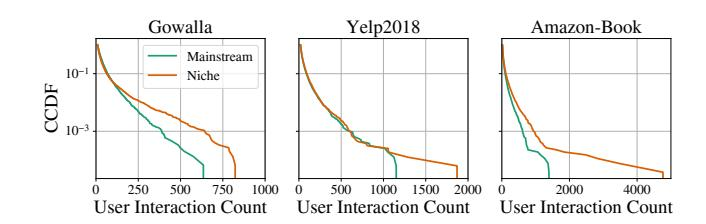
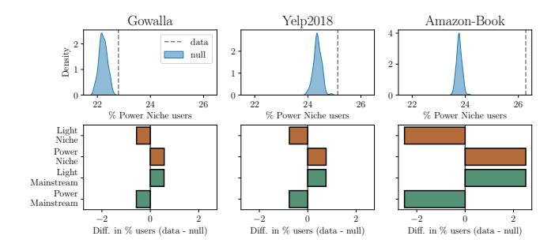
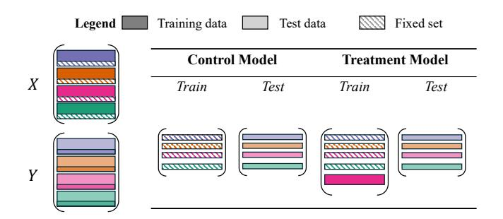
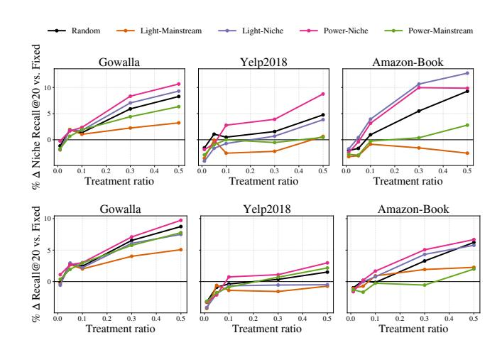
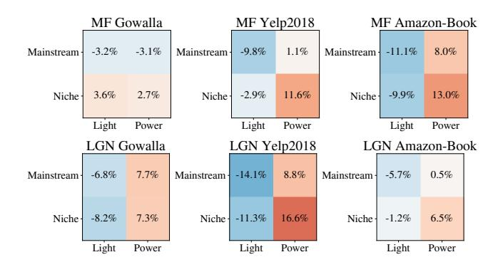
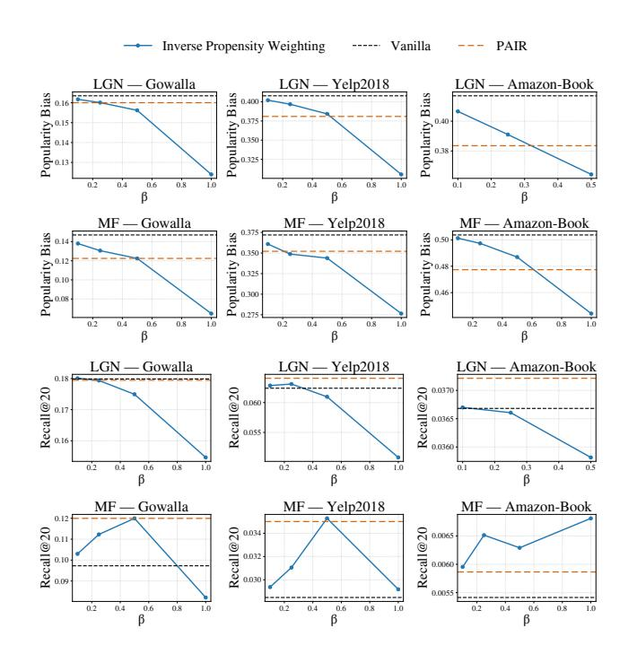
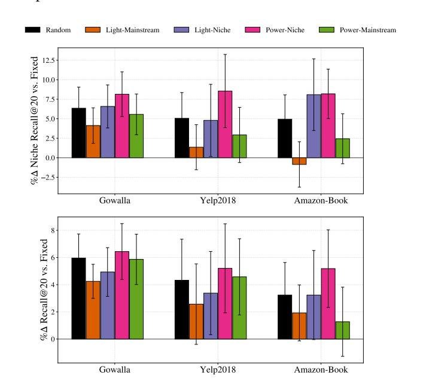

# Identifying and Upweighting Power-Niche Users to Mitigate Popularity Bias in Recommendations

[David Liu](https://orcid.org/0000-0002-2129-447X) Cornell University Ithaca, NY, USA davidliu@cornell.edu

[Erik Weis](https://orcid.org/0009-0000-7275-8230) Northeastern University Boston, MA, USA weis.er@northeastern.edu

[Moritz Laber](https://orcid.org/0000-0002-0273-584X) Northeastern University Boston, MA, USA laber.m@northeastern.edu

[Tina Eliassi-Rad](https://orcid.org/0000-0002-1892-1188) Northeastern University Boston, MA, USA t.eliassirad@northeastern.edu

[Brennan Klein](https://orcid.org/0000-0001-8326-5044) Northeastern University Boston, MA, USA b.klein@northeastern.edu

# Abstract

Recommender systems have been shown to exhibit popularity bias by over-recommending popular items and under-recommending relevant niche items. We seek to understand niche users in benchmark recommendation datasets as a step toward mitigating popularity bias. We find that, compared to mainstream users, niche-preferring users exhibit a longer-tailed activity-level distribution, indicating the existence of users who both prefer niche items and exhibit high activity levels on platforms. We partition users along two axes: (1) activity level ("power" vs. "light") and (2) item-popularity preference ("mainstream" vs. "niche"), and show that in three benchmark datasets, the number of power-niche users (high activity and niche preference) is statistically significantly larger than expected. We also find that interaction data from power-niche users is especially valuable for improving recommendations for not only niche but also mainstream users. In contrast, many existing popularity bias mitigation methods have focused on upweighting niche users regardless of activity level. Motivated by the value of power-niche user data, we propose PAIR (Popularity-and-Activity-Informed Reweighting), a framework for reweighting the Bayesian Personalized Ranking (BPR) loss that simultaneously reweights based on user activity level and item popularity, upweighting power-niche users the most. We instantiate the framework on both deep and shallow collaborative filtering models, and experiments on benchmark datasets show that PAIR reduces popularity bias and can increase overall performance. Although existing popularity-bias mitigation methods yield a trade-off between performance and bias, our results suggest that considering both user activity level and popularity preference leads to Pareto-dominant performance.

# CCS Concepts

• Information systems → Recommender systems.

# Keywords

collaborative filtering, popularity bias, power-niche users

# 1 Introduction

Recommender systems are known to pervasively exhibit popularity bias, disproportionately recommending already popular items and perpetuating popularity feedback loops [\[5,](#page-8-0) [20,](#page-8-1) [30\]](#page-8-2). Popularity bias harms both users and items. Users are harmed because those who have niche preferences unfairly receive lower-quality recommendations [\[4,](#page-8-3) [5\]](#page-8-0). And, items are harmed because popularity bias limits the visibility of new content creators [\[17\]](#page-8-4), leading to monopolies for the already popular. In response, a host of algorithms have been proposed to mitigate popularity bias, with a focus on regularizing and reweighting loss functions [\[18,](#page-8-5) [26,](#page-8-6) [27\]](#page-8-7) and post-process re-ranking [\[5,](#page-8-0) [35\]](#page-8-8). Field studies have shown that mitigation techniques do not necessarily hinder user engagement [\[19\]](#page-8-9) and can even increase the user's sense of discovery [\[31\]](#page-8-10).

Although many algorithms have been proposed to mitigate popularity bias, the question of who consumes niche items remains largely unexplored. We ask the following research questions:

- RQ1: Beyond item preference, how do the behaviors of niche users differ from mainstream users in large-scale recommendation datasets?
- RQ2: How can we leverage these differences in behavior to mitigate popularity bias?

We answer these questions through the following three contributions. The first contribution answers RQ1, while the latter two answer RQ2.

Motivating Data Analysis (RQ1). In Sec. [3](#page-1-0) and [4,](#page-3-0) we begin with a motivating data analysis of benchmark recommendation datasets and divide users into four quadrants based on their (1) activity level and (2) item-popularity preference. We find that there exists a statistically significant group of high-activity, niche-preferring users, which we term power-niche users. In contrast, among mainstream users, there is a significant group of light-activity users. Next, we assess the value of interaction data from each of the four user quadrants to improve recommendations for niche users. While previous bias mitigation work has focused on upweighting interactions from all niche users, we find that compared to light-niche users, data from power-niche users are more valuable for improving both niche and overall recommendation performance. In the process, we propose a method for valuing user groups in recommender systems and transductive machine learning models, more generally.

Reweighting Framework (RQ2). In Sec. [5,](#page-4-0) guided by the promising value of power-niche user data, we design a framework, Popularity-and-Activity-Informed Reweighting (PAIR), that simultaneously reweights for user activity level and item popularity. Our framework adapts the Bayesian Personalized Ranking (BPR) [\[26\]](#page-8-6) loss function and introduces two parameters: one for controlling the weight of power users and another for the weight of niche items. We optimize the parameters through validation-set grid search. Though past works have focused on reweighting for item popularity, either in static [\[30,](#page-8-2) [36\]](#page-8-11) or longitudinal [\[12,](#page-8-12) [18,](#page-8-5) [37\]](#page-8-13) settings, to the best of our knowledge, we are the first to consider both user activity level and item popularity heterogeneity for popularity bias. Our framework allows us to give greater weight to power-niche users.

Evaluation (RQ2). In Sec. [6,](#page-5-0) our experiments show that by upweighting power-niche users in the BPR loss function, we can increase recommendation performance and decrease popularity bias. Further, we show that existing reweighting and regularization approaches reduce popularity bias at the cost of performance, while our approach (PAIR) yields Pareto-dominant performance by accounting for user-activity level.

# 2 Related Works

We review the extensive literature on measuring and mitigating popularity bias. We also review the literature on assigning value to user data, which is related to our motivating analysis regarding the value of user quadrants.

## 2.1 Popularity Bias

The popularity-bias literature has proposed numerous bias metrics and methods for mitigating this bias. Most metrics are centered on the items. Common metrics include summary statistics such as the coverage of the recommended items over the item set [\[6\]](#page-8-14) or the average popularity of recommended items [\[2\]](#page-8-15). Popularity bias has also been defined in terms of equal opportunity, ensuring that head (popular) and tail (less popular) items have balanced truepositive rates [\[37\]](#page-8-13). From the user perspective, Abdollahpouri et al. [\[5\]](#page-8-0) define popularity bias in terms of popularity calibration, that is, ensuring that the distribution of recommended item popularities for a user matches the historical popularity distribution. In our evaluation in Sec. [6,](#page-5-0) we evaluate bias mitigation with a mixture of item and user-centric metrics. In terms of mitigating popularity bias, past approaches can be categorized as either regularization [\[1,](#page-8-16) [38\]](#page-8-17), reweighting [\[22,](#page-8-18) [29,](#page-8-19) [30,](#page-8-2) [36\]](#page-8-11), or post-processing [\[2,](#page-8-15) [5,](#page-8-0) [8,](#page-8-20) [35,](#page-8-8) [38\]](#page-8-17). Our approach is most similar to Inverse Propensity Weighting (IPW) reweighting approaches, as discussed further in Sec. [5.2,](#page-5-1) but in addition to item propensity, we consider user activity level.

While prior work on popularity bias has considered item popularity alongside user activity level [\[23,](#page-8-21) [25\]](#page-8-22), these studies do not define power-niche users or quantify their value. For example, Abdollahpouri et al. [\[3\]](#page-8-23) identify a negative correlation between user activity level and item-popularity preference, suggesting the existence of high-activity niche users. Our work shows that not only do power-niche users exist, but the number of power-niche users is statistically significantly greater than expected across multiple datasets. Alternatively, while algorithmic approaches to mitigating popularity bias often frame a bias-performance trade-off [\[1,](#page-8-16) [34\]](#page-8-24), our work shows that upweighting power-niche users can decrease bias while increasing performance.

## 2.2 Value of User Data

Quantifying the value of data points has a number of uses in machine learning, such as ascribing economic value to observations [\[16\]](#page-8-25) or providing efficient guides for the collection of new data [\[14\]](#page-8-26). A baseline approach for such a task is the Leave-One-Out (LOO) technique, where the value of a point is the marginal increase in a model's performance score when the point is added to the remaining data [\[10\]](#page-8-27). Motivated by the theory of cooperative games, Data Shapley [\[14\]](#page-8-26) expands on this idea with a score that evaluates a data point on its marginal value when added to a random subset of the data. Despite the prominence of Data Shapley, other promising alternatives exist [\[33\]](#page-8-28), leaving the problem of data valuation somewhat unsettled.

The problem becomes harder still when data points have relational dependencies, as opposed to being drawn i.i.d. from an underlying distribution. Recommender systems are one such example. In this setting, defining a single score based on data subsets raises a number of questions, such as whether nodes or edges constitute the appropriate unit of measurement and whether one should be concerned with the potentially heterogeneous contributions to model performance a data point may have through its relational dependencies. One possible treatment of the graph data valuation problem is to limit its scope to local and conditional measures of data value, an approach which comes from the literature on GNN explainability [\[7,](#page-8-29) [9,](#page-8-30) [11\]](#page-8-31). For instance, Chi et al. [\[9\]](#page-8-30) develop PC-Winter, a score for the marginal value of a node �� in the context of another node ��'s neighborhood. Although such values can be averaged at the node or edge level to produce a single score, the resulting value still lacks a clear interpretation in our context, where we are interested in comparing globally different compositions of the data by users and items. Instead, our analysis is closer in spirit to LOO measures, but performed at the level of groups of users as opposed to single data points. We choose nodes (as opposed to edges), since this is the frame most likely to guide the collection of new data in recommender systems.

## 3 Understanding Niche Users

In this section, we conduct a motivating data analysis of popular benchmark datasets to better understand who engages with niche items and what other behaviors distinguish niche users from others. We examine the relationship between user activity level and item preference and find that there is a statistically significant number of users who exhibit a high activity level and preference for niche items. We call this group power-niche users. In contrast, among users with mainstream preferences, there are statistically significantly fewer power users. Our notation is summarized in Appendix [A.](#page-9-0)

We define niche users as follows. Given a binary interaction matrix D ∈ {0, 1} ��×�� among �� users and �� items, where D���� = 1 indicates user �� interacted with item ��, let the popularity of item ��, ���� , be the number of users that have interacted with the item, i.e. ���� = Í �� D���� . Similarly, let the activity level of user ��, ����, be the number of interactions for user ��, i.e. ���� = Í �� D���� . We then define a user's "item-popularity preference" as the average popularity of

all items the user has interacted with. Larger values suggest that the user is mainstream, and lower values suggest the user is niche. In terms of D, the item-popularity-preference of user �� is

Item Pop. Pref. for user �� = �� ��=1 D�������� ���� . (1)

We label a user as a niche user if their item-popularity preference is below the median item-popularity preference among all users.

Our motivating analysis is based on the Gowalla, Yelp2018, and Amazon-Book binary implicit-feedback benchmark datasets [\[21,](#page-8-32) [32\]](#page-8-33), which are detailed in Table [1.](#page-2-0)

Table 1: Benchmark datasets used in this paper

| Dataset     | Type                  | Users  | Items  |
|-------------|-----------------------|--------|--------|
| Gowalla     | Location check-ins    | 29,858 | 40,981 |
| Yelp2018    | Reviews of businesses | 31,668 | 38,048 |
| Amazon-Book | Reviews of books      | 52,643 | 91,599 |

## 3.1 Identifying Power-Niche Users

Longer activity-level tail for niche users. In addition to examining the item preferences of users, we consider their activity levels, or the number of observed interactions. Let us define two groups of users: niche and mainstream. Niche users are those with below-median item-popularity preference, as defined in Eq. [\(1\)](#page-2-1), and mainstream users are all other users. Fig. [1](#page-2-2) visualizes the activity-level distributions for the two groups of users, where a point ��, �� on a curve indicates that a �� fraction of users in the group have at least �� interactions. The plots show that compared to mainstream users, the distributions for niche users have a longer tail, indicating the presence of high-activity niche-preferring users.

Figure 1: Distribution of user activity levels for mainstream and niche users in the Gowalla, Yelp2018, and Amazon-Book datasets. Niche users have below-median item-popularity preference. In each dataset, the distribution of activity levels for niche users is longer (further right) than the distribution for mainstream users, indicating the existence of users who prefer niche items and exhibit high activity levels.

Quadrants of users. We partition the users in each dataset into four quadrants. The first axis is activity level, where users are either above ("power") or below ("light") the median. The second axis is item-popularity preference, where, again, users are either above ("mainstream") or below ("niche") the median.

Table 2: Summary statistics for the four user quadrants across the three benchmark datasets. The quadrants are comparably sized in terms of the number of users. The power-niche quadrant accounts for 38-45% of all interactions. Δ Item-Pop. refers to the change in the average item-popularity preference among users in the quadrant relative to the average among all users. Power-niche users, as expected, prefer more niche items; however, they are marginally less niche than light-niche users.

| Quadrant Light-Mainstream | Dataset Gowalla Yelp2018 Amazon-Book | Users (%) 23.1% 25.6% 26.6% | Inter. (%) Δ 9.6% 12.8% 11.7% | Item-Pop. (%) +74.7% +50.6% +52.3% |
|---------------------------|--------------------------------------|-----------------------------|-------------------------------|------------------------------------|
| Light-Niche               | Gowalla                              | 27.2%                       | 11.0%                         | -58.3%                             |
|                           | Yelp2018                             | 24.9%                       | 12.5%                         | -43.2%                             |
|                           | Amazon-Book                          | 23.7%                       | 10.5%                         | -48.3%                             |
| Power-Mainstream          | Gowalla                              | 26.9%                       | 40.8%                         | +38.4%                             |
|                           | Yelp2018                             | 24.4%                       | 36.2%                         | +34.6%                             |
|                           | Amazon-Book                          | 23.4%                       | 33.3%                         | +42.6%                             |
| Power-Niche               | Gowalla                              | 22.8%                       | 38.7%                         | -51.5%                             |
|                           | Yelp2018                             | 25.1%                       | 38.5%                         | -42.3%                             |
|                           | Amazon-Book                          | 26.3%                       | 44.5%                         | -47.2%                             |

To contextualize the user quadrants, in Table [2,](#page-2-3) we provide summary statistics for the quadrants across the three datasets. Although the quadrants have a similar number of users, power-niche users account for 38.5-44.5% of all observed interactions ("Inter."). The final columns in Table [2](#page-2-3) show that the average power-niche user, relative to all users, interacts with items with 42.3-51.5% fewer interactions. Light-niche users are marginally more niche than power-niche users but yield far fewer interactions.

## 3.2 Significance of Power-Niche Users

To assess the statistical significance of the number of power-niche users we observe, we compare against a null configuration model [\[13,](#page-8-34) [24\]](#page-8-35). In the context of a user-item binary interaction graph, the null configuration model characterizes the space of all graphs with the same user activity levels and item popularities. To sample from this null model, we take the input interaction dataset and randomly rewire pairs of interactions: user-item pairs (��1,��1) and (��2,��2) become (��1,��2) and (��2,��1). For each null sample, we perform 10�� rewirings of the original interaction graph, where �� is the total number of user interactions. Fig. [2](#page-3-1) illustrates the deviation in user counts in the observed datasets compared to samples from the null model. We bin users into quadrants, and show the full distribution for the expected percent of users that belong to the power-niche category. In the three datasets, the observed number of power-niche users is over two standard deviations, our definition of statistical significance, greater than the mean under the null model. Additionally, we show for all four categories the difference between each group's percent representation and its expected value under the null model. For mainstream users, the pattern is flipped, and there are fewer power users than expected.

Figure 2: Item interaction patterns of different user groups, compared to a configuration null model. Users are grouped by activity-level and item-popularity quantiles. Top row: we show the distribution of power-niche representation (expressed as a percentage) under the null model, as well as the same quantity observed in the data. Bottom row: we show the relative difference in percentage representation for the observed data and the null model for all user groups. For each dataset, the number of power-niche users—high activity level and niche item popularity preference—is higher than expected under the configuration null model.

#### 4 Value of User Data in Recommender Systems

In this section, we examine the value of user data from each of the user quadrants to improve overall and niche recommendations. While we expected additional data from niche users to benefit niche users at the cost of mainstream users, we find that data from powerniche users is valuable for not just niche users but all users on average. In Sec. [4.1,](#page-3-2) we introduce our method for measuring the value of user quadrants, and in Sec. [4.2,](#page-3-3) we show that power-niche user data is valuable to both niche and mainstream users.

#### 4.1 Quadrant Valuation Methodology

Our method for evaluating the value of data from each user quadrant is similar to the Leave-One-Out (LOO) method but adapted for the user group setting. Given an input binary interaction dataset D ∈ {0, 1} ��×��, we hold out 20% of each user's interactions as a test set, Y, and the remaining interactions are the training set X, where D = X + Y.

Among the training dataset, we construct a fixed set of users representing a uniform random sample over the user base, such that, in expectation, the relative sizes of quadrants are preserved in the fixed set. Let Ufixed denote the set of fixed users. The purpose of our data valuation methodology is to determine the value of user data from each quadrant to improve the recommendations for Ufixed. Let us partition all other users into their respective quadrants and denote these four sets as ULight-Niche, ULight-Mainstream, UPower-Niche, UPower-Mainstream. Crucially, these user groups are mutually exclusive from the fixed set. Here, we use the same user quadrant definition introduced in Sec. [3.](#page-1-0)

In one trial of our data valuation methodology, we train two models. The first (the "control" model) has access only to training interactions from Ufixed, while the second (the "treatment" model) has access to the same interactions plus a sample of users from a

Figure 3: An overview of our method for valuing data from each user quadrant. A group of users is uniformly sampled at random and labeled the "fixed set". Two models are then trained: one using only training data from the fixed-set users and another that includes an additional sample from the target quadrant. The pink box under the treatment training data is representative of a sample—mutually exclusive of the fixed set—of power-niche users. Both models are evaluated on the fixed-set users. The procedure is repeated for multiple trials, and the value of a quadrant is the average change in performance. We evaluate the value of quadrant data at multiple treatment ratios, which is the relative size of the additional treatment data relative to the fixed set.

specified user quadrant. We then evaluate the difference in performance between these two models when evaluated on Ufixed. More formally, let �� denote a prediction model; let �� [U��] denote the rows of X corresponding to the set of users ��; let ���� (X, Y) denote the evaluation score (e.g. Recall@��) of �� trained on X and tested on Y; and let S denote a uniform-sampling function. Then, the value of a quadrant �� is:

Δ�� = ���� X[Ufixed ∪ S U�� ], Y[Ufixed] − ���� (X[Ufixed], Y[Ufixed]) (2)

In Eq. [\(2\)](#page-3-4), the crucial difference between the two recall terms is the difference in the indices for the training sets. One model is trained on X[Ufixed ∪ S U�� ] and another is trained on X[Ufixed]. The test set is the same for both models.

For a given quadrant, we average Δ�� over repeated samples of S U�� to yield a final score Δ¯ �� for the value of quadrant ��. Fig. [3](#page-3-5) summarizes our data valuation methodology, where the additional training data for the "treatment" model corresponds to X[S U�� ].

#### 4.2 Value of Power-Niche Users for Improving Niche and Overall Performance

Fig. [4](#page-4-1) plots the value of each quadrant for two evaluation metrics: Recall@�� and Niche Recall@��, defined as the average Recall@�� computed only over niche users. For Fig. [4,](#page-4-1) the number of users in the fixed set is 20% of all users, and the treatment ratio on the x-axis refers to the number of additional users added in the treatment model relative to the fixed set. So, a treatment ratio of 0.5 means that the additional quadrant sample �� U�� has half as many users as the fixed set. As a baseline, we also report the data value of an additional random sample of users, ones that are not specific to

any single quadrant, as shown in the black curves. The prediction model is LightGCN [\[15\]](#page-8-36).

For Niche Recall, power-niche users are the most valuable for both Gowalla and Yelp2018 (increasing Niche Recall by up to 10%) and are the second most valuable for Amazon-Book. For overall Recall@��, power-niche users are consistently the most valuable across all three datasets. In contrast, light-mainstream users are often the least valuable. These results show that data from powerniche users is valuable for improving recommendations for both niche users, thus valuable for mitigating popularity bias, and for the user base as a whole.

For Yelp2018, adding additional training users, regardless of quadrant, only marginally improves overall performance. We hypothesize that for the Yelp2018 business-rating dataset, users are more idiosyncratic. This result also highlights the nontrivial nature of assessing data value in a transductive setting.

While the results in Fig. [4](#page-4-1) correspond to a single fixed set Ufixed, Appendix [C](#page-9-1) shows that the value of power-niche users is robust to alternative fixed set samples.

Figure 4: To inform our reweighting, we examine the value of each quadrant for improving niche recommendation performance (top) and overall (bottom) performance. We measure the value of a quadrant by the relative change in performance (Recall@��) for all users and niche users when the model is re-trained after users from a specified quadrant are added to the training dataset. The test set is fixed. Power-niche users are not only valuable for improving niche user performance, but are also the most valuable quadrant for improving overall performance.

## 5 PAIR: A Reweighting Framework for Bayesian Personalized Ranking

We present Popularity-and-Activity Informed Reweighting (PAIR), a framework for simultaneously tuning the weights of niche items and high-activity users. Our motivating analyses identify that, in three benchmark datasets, there exists a statistically significant number of power-niche users, who are valuable for improving niche

and overall performance. PAIR is designed to increase the significance of these users in the Bayesian Personalized Ranking (BPR) loss function to mitigate popularity bias.

#### 5.1 Our Framework

We consider a recommendation setting over a set of �� users, U, and �� items, I. There exists a set of ground-truth interaction labels Y ∈ {0, 1} ��×�� where Y���� = 1 if and only if user �� interacts with item ��. Let �� Y, Yˆ be a loss function for evaluating a set of user-item prediction scores Yˆ ∈ R ��×��.

PAIR adapts the BPR loss function, which induces predictions where positive (interacted) user-item pairs have higher prediction scores than negative pairs. Specifically, the BPR loss function is

�� BPR Y, Yˆ = − ∑︁�� ��=1 ∑︁ ��∈N�� ∑︁ ��∉N�� ln �� Yˆ ���� − Yˆ ���� . (3)

In Eq. [\(3\)](#page-4-2), N�� = {�� | Y���� = 1} is the set of items that user �� has interacted with, and �� is the sigmoid function.

To upweight the significance of power users and niche items, PAIR adapts the BPR loss function and optimizes an adapted loss function involving hyperparameters ��, ��:

�� PAIR ��,�� Y, Yˆ = − ∑︁�� ��=1 ���� E ��∼U(N�� ) ��∼U(I\N�� ) h ���� −�� ln �� Yˆ ���� − Yˆ ���� i! (4)

�� ∈ [0, 1] and �� ∈ [0, ∞) are reweighting hyperparameters. Setting �� = 1, �� = 0 is most closely aligned with a sample-based approximation of the BPR loss (see Eq. [\(3\)](#page-4-2)), whereas setting �� = 0, �� = 0 mirrors the loss function of LightGCN. Our loss function flexibly interpolates, using ��, between these two extremes for taking user activity into account and, in addition, introduces via �� a way to take into account item popularity. While we defined threshold-based quadrant boundaries for our motivating analysis, PAIR does not rely on group partitions and instead continuously upweights based on user activity level and item popularity. Next, we discuss our reweighting rationale.

Significance of Item Popularity. Compared to the BPR loss function, we introduce a factor ���� −�� . Since ���� is the popularity of item �� and �� &gt; 0, the factor increases as the popularity of items decreases. Intuitively, the factor suggests that the loss should give greater weight to observed interactions with niche items because a user may interact with a popular item simply because popular items have greater exposure [\[29\]](#page-8-19).

Significance of User Activity Level. To adjust the significance of user activity level, we tune the number of positive items that we sample with replacement. Specifically, compared to the BPR loss, we do not sum over all positive and negative pairs ��,�� and ��, �� but rather take the expectation over a uniform sample of ��, �� and scale the expectation by a factor ���� . To optimize the scaled expectation, we sample ���� = round ���� Í ��′ ∈U ����′ Í ′′ ∈U ���� ′′ triplets for user ��, where ���� is a weighted fraction of the total number of interactions, rounded to the nearest integer. The hyperparameter �� tunes the significance of high-activity users. When �� = 0, all users have the same number of training samples per epoch, regardless of the number of observed positives. This approach is used in LightGCN [\[15\]](#page-8-36). When �� = 1, the number of samples for user �� is equal to the number of observed interactions, ����. This approach is most faithful to a sample-based approximation of the BPR loss function, Eq. [\(3\)](#page-4-2). [1](#page-5-2) The normalizing denominator and the right term denoting the total number of interactions in ���� are constants and are not included in the loss function in Eq. [\(4\)](#page-4-3).

## 5.2 Relationship to Prior Work

Our approach to reweighting items is related to causal approaches to accounting for popularity bias [\[29\]](#page-8-19). These works recognize that the unobserved interactions in Y are not missing at random. A user interacts with an item only when exposed, so a missing interaction with an item does not necessarily imply a lack of relevance. A common debiasing approach is Inverse Propensity Weighting (IPW). In IPW, for a user ��, an item �� has a latent propensity probability ������ ∈ [0, 1] of being exposed to the user, so to debias the estimator, the loss for ��,�� is reweighted by 1/������. Although there has been previous work on training a separate model to estimate propensity, there are also heuristic-based approaches. Our item reweighting approach is equivalent to prior popularity-heuristic approaches to Inverse Propensity Weighting [\[22,](#page-8-18) [28\]](#page-8-37) where the propensity for an item �� is proportional to �� −�� , where a common setting is �� = 1/2.

We also note that past work has proposed alternative modifications to the BPR loss to mitigate popularity bias [\[27\]](#page-8-7). In contrast to existing reweighting approaches, PAIR's novelty lies in the empirical identification and valuation of power-niche users, which directly motivates the ��, �� formulation.

## 6 Experiments

We present an empirical evaluation of our reweighting framework PAIR, instantiated with LightGCN and matrix factorization as base models. Our results show that by simultaneously accounting for user activity level and item-popularity heterogeneities, we are able to Pareto-dominate vanilla models, increasing recommendation performance and decreasing popularity bias. We also show that PAIR yields superior performance compared to approaches that consider only item popularity.

# 6.1 Methodology

Base Model. We define a base model as any score prediction model that produces a score prediction matrix Yˆ ∈ {0, 1} ��×��. Our reweighting framework is specific to the BPR loss function and can be applied to any base model. In the following results, we utilize two base models: Matrix Factorization (MF) and LightGCN (LGN) [\[15\]](#page-8-36), a deep collaborative filtering model. We instantiate LightGCN with 3 layers and use the hyperparameters reported in He et al. [\[15\]](#page-8-36). The MF base model defines the prediction score for user �� and item �� as Yˆ ���� = �� u �� �� v�� , where u��, v�� ∈ R �� are ��-dimensional user and item embeddings. Both base models also introduce a regularization on the Frobenius norm of the embeddings.

Vanilla Models. Past sampling implementations of the BPR loss have implicitly reweighted users based on activity level, while PAIR explicitly tunes the activity-level reweighting. The two common implementations of the BPR loss are specific instances of

the ��, �� framework in PAIR. The first instance is the most closely aligned with sample-based approximations of the BPR loss and sets �� = 1, �� = 0, where the number of positive samples for a user is proportional to the user's activity level. The second instance, as in the case of LightGCN, sets �� = 0, �� = 0 such that all users have the same number of positive samples. Sampling a fixed number of positives for all users implicitly upweights light users. In our evaluation, we compare against both implementations of the BPR loss where "Vanilla" refers to �� = 0, to reproduce the results in He et al. [\[15\]](#page-8-36), and "Vanilla-BPR" refers to �� = 1, to indicate alignment with the original BPR loss in Eq. [\(3\)](#page-4-2).

Baselines. We compare against representative baselines from three popularity-bias mitigation categories:

- Regularization ("Pop. Reg.") We compare against the popularityregularization mitigation method introduced in Zhu et al. [\[38\]](#page-8-17). The regularization penalizes positive correlations between prediction scores and item popularity. There is a hyperparameter �� &gt; 0 to control the regularization strength.
- Re-weighting (IPW) We compare against the commonly-used Inverse Propensity Weighting approach for mitigating popularity bias as introduced in Schnabel et al. [\[29\]](#page-8-19). To account for unequal item exposure probabilities, IPW reweights an interaction between user �� and item �� by �� −�� �� where ���� is the propensity of item ��. Similar to past heuristic approaches to estimating propensity, an item's propensity is equal to its popularity in our experiments, and we tune the propensity exponent hyperparameter ��. This formulation of IPW is equivalent to fixing �� = 0 in PAIR.
- Post-process Re-ranking ("Pop. Comp.") We compare against the popularity-compensation post-processing technique introduced in Zhu et al. [\[38\]](#page-8-17). The technique interpolates the raw prediction scores Yˆ with a popularity compensation, where less popular items receive greater compensation. Pop. Comp. utilizes two hyperparameters, not to be confused with those in PAIR, �� ′ , ��′ , where �� ′ dictates the linear interpolation and �� ′ dictates the amount of compensation.

Data and Metrics. We run our experiments on the three datasets introduced in Sec. [3,](#page-1-0) using the train/validation/test splits introduced in Lee et al. [\[21\]](#page-8-32). We evaluate recommendation performance via the standard Recall@��, Precision@��, and NDCG@�� ranking metrics, where �� = 20. We measure popularity bias with both item and user-centric metrics. For item-centric metrics, we use the Popularity-Opportunity Bias (POB) metric [\[38\]](#page-8-17), which is the correlation between an item's popularity and its average ranking among users who interact with the item, and Coverage, which denotes the fraction of all items that are ranked in the top �� at least once among all users. For a user-centric perspective, we also measure the Recall@�� for niche users, which we refer to as the Niche Recall@��.

Hyperparameter Optimization. We select the ��, �� pair that maximizes PAIR's Recall@�� on the validation set. Optimized values and additional hyperparameter optimization methodology for PAIR and the baselines are included in Appendix [B.](#page-9-3)[2](#page-6-0)

1 See Appendix [D](#page-9-2) for a more in-depth discussion.

Table 3: Evaluation metrics for **PAIR** compared to the vanilla and baseline bias-mitigation methods. Highlighted rows denote the model variant with the highest Recall for a given dataset and model combination. In five of six dataset-model configurations, **PAIR** Pareto-dominates Vanilla with higher Recall and lower Popularity-Opportunity Bias (POB).

| Dataset Model Variant   | Recall@20 |     |        | ( ↑ ) Precision@20 |     |        | ( ↑ ) NDCG@20 |     |        | ( ↑ ) POB@20 |     | (      | ↓ ) Coverage@20 |     |      | ( ↑ ) Niche | Recall@20 |        | ( ↑ ) |
|-------------------------|-----------|-----|--------|--------------------|-----|--------|---------------|-----|--------|--------------|-----|--------|-----------------|-----|------|-------------|-----------|--------|-------|
| Amazon-Book MF Vanilla  | 0.0039    | ( ± | 0.0002 | ) 0.0025           | ( ± | 0.0001 | ) 0.0035      | ( ± | 0.0002 | ) 0.4862     | ( ± | 0.0063 | ) 46.2%         | ( ± | 1.4% | ) 0.0022    | ( ±       | 0.0003 | )     |
| Vanilla-BPR             | 0.0044    | ( ± | 0.0002 | ) 0.0030           | ( ± | 0.0002 | ) 0.0041      | ( ± | 0.0002 | ) 0.4774     | ( ± | 0.0050 | ) 54.0%         | ( ± | 0.8% | ) 0.0029    | ( ±       | 0.0003 | )     |
| PAIR                    | 0.0043    | ( ± | 0.0002 | ) 0.0030           | ( ± | 0.0002 | ) 0.0040      | ( ± | 0.0002 | ) 0.4844     | ( ± | 0.0067 | ) 51.8%         | ( ± | 0.8% | ) 0.0028    | ( ±       | 0.0004 | )     |
| IPW                     | 0.0040    | ( ± | 0.0002 | ) 0.0026           | ( ± | 0.0001 | ) 0.0036      | ( ± | 0.0002 | ) 0.4771     | ( ± | 0.0059 | ) 49.6%         | ( ± | 1.3% | ) 0.0022    | ( ±       | 0.0003 | )     |
| Pop. Comp.              | 0.0020    | ( ± | 0.0001 | ) 0.0018           | ( ± | 0.0001 | ) 0.0021      | ( ± | 0.0001 | ) 0.4865     | ( ± | 0.0061 | ) 92.4%         | ( ± | 0.1% | ) 0.0015    | ( ±       | 0.0002 | )     |
| Pop. Reg.               | 0.0017    | ( ± | 0.0001 | ) 0.0010           | ( ± | 0.0000 | ) 0.0015      | ( ± | 0.0000 | ) 0.4250     | ( ± | 0.0086 | ) 70.2%         | ( ± | 0.4% | ) 0.0012    | ( ±       | 0.0001 | )     |
| Gowalla MF Vanilla      | 0.0976    | ( ± | 0.0009 | ) 0.0293           | ( ± | 0.0001 | ) 0.0747      | ( ± | 0.0005 | ) 0.1475     | ( ± | 0.0065 | ) 66.0%         | ( ± | 0.2% | ) 0.1201    | ( ±       | 0.0023 | )     |
| Vanilla-BPR             | 0.0910    | ( ± | 0.0015 | ) 0.0278           | ( ± | 0.0003 | ) 0.0693      | ( ± | 0.0014 | ) 0.1622     | ( ± | 0.0067 | ) 69.6%         | ( ± | 0.1% | ) 0.1095    | ( ±       | 0.0033 | )     |
| PAIR                    | 0.1203    | ( ± | 0.0011 | ) 0.0350           | ( ± | 0.0002 | ) 0.0867      | ( ± | 0.0010 | ) 0.1243     | ( ± | 0.0054 | ) 69.7%         | ( ± | 0.2% | ) 0.1401    | ( ±       | 0.0019 | )     |
| IPW                     | 0.1203    | ( ± | 0.0011 | ) 0.0350           | ( ± | 0.0002 | ) 0.0867      | ( ± | 0.0010 | ) 0.1243     | ( ± | 0.0054 | ) 69.7%         | ( ± | 0.2% | ) 0.1401    | ( ±       | 0.0019 | )     |
| Pop. Comp.              | 0.0965    | ( ± | 0.0012 | ) 0.0286           | ( ± | 0.0002 | ) 0.0715      | ( ± | 0.0007 | ) 0.1472     | ( ± | 0.0062 | ) 67.9%         | ( ± | 0.3% | ) 0.1197    | ( ±       | 0.0031 | )     |
| Pop. Reg.               | 0.0316    | ( ± | 0.0011 | ) 0.0094           | ( ± | 0.0003 | ) 0.0206      | ( ± | 0.0008 | ) 0.2913     | ( ± | 0.0127 | ) 79.3%         | ( ± | 0.5% | ) 0.0377    | ( ±       | 0.0014 | )     |
| Yelp2018 MF Vanilla     | 0.0276    | ( ± | 0.0015 | ) 0.0133           | ( ± | 0.0006 | ) 0.0224      | ( ± | 0.0009 | ) 0.3717     | ( ± | 0.0042 | ) 63.2%         | ( ± | 0.2% | ) 0.0273    | ( ±       | 0.0014 | )     |
| Vanilla-BPR             | 0.0277    | ( ± | 0.0008 | ) 0.0134           | ( ± | 0.0003 | ) 0.0222      | ( ± | 0.0006 | ) 0.4060     | ( ± | 0.0014 | ) 67.1%         | ( ± | 0.2% | ) 0.0266    | ( ±       | 0.0007 | )     |
| PAIR                    | 0.0344    | ( ± | 0.0007 | ) 0.0155           | ( ± | 0.0003 | ) 0.0267      | ( ± | 0.0006 | ) 0.3483     | ( ± | 0.0046 | ) 69.8%         | ( ± | 0.1% | ) 0.0347    | ( ±       | 0.0010 | )     |
| IPW                     | 0.0350    | ( ± | 0.0004 | ) 0.0157           | ( ± | 0.0001 | ) 0.0272      | ( ± | 0.0005 | ) 0.3429     | ( ± | 0.0015 | ) 66.8%         | ( ± | 0.2% | ) 0.0356    | ( ±       | 0.0008 | )     |
| Pop. Comp.              | 0.0246    | ( ± | 0.0011 | ) 0.0118           | ( ± | 0.0004 | ) 0.0188      | ( ± | 0.0007 | ) 0.3707     | ( ± | 0.0043 | ) 79.8%         | ( ± | 0.5% | ) 0.0248    | ( ±       | 0.0009 | )     |
| Pop. Reg.               | 0.0120    | ( ± | 0.0004 | ) 0.0053           | ( ± | 0.0001 | ) 0.0088      | ( ± | 0.0002 | ) 0.4061     | ( ± | 0.0066 | ) 75.6%         | ( ± | 0.8% | ) 0.0140    | ( ±       | 0.0007 | )     |
| Amazon-Book LGN Vanilla | 0.0349    | ( ± | 0.0002 | ) 0.0144           | ( ± | 0.0000 | ) 0.0269      | ( ± | 0.0001 | ) 0.4169     | ( ± | 0.0021 | ) 24.3%         | ( ± | 0.2% | ) 0.0315    | ( ±       | 0.0003 | )     |
| Vanilla-BPR             | 0.0351    | ( ± | 0.0001 | ) 0.0149           | ( ± | 0.0000 | ) 0.0273      | ( ± | 0.0001 | ) 0.4062     | ( ± | 0.0011 | ) 24.4%         | ( ± | 0.3% | ) 0.0318    | ( ±       | 0.0002 | )     |
| PAIR                    | 0.0352    | ( ± | 0.0002 | ) 0.0148           | ( ± | 0.0001 | ) 0.0273      | ( ± | 0.0002 | ) 0.3783     | ( ± | 0.0016 | ) 25.5%         | ( ± | 0.2% | ) 0.0316    | ( ±       | 0.0001 | )     |
| IPW                     | 0.0351    | ( ± | 0.0002 | ) 0.0146           | ( ± | 0.0001 | ) 0.0271      | ( ± | 0.0001 | ) 0.4039     | ( ± | 0.0021 | ) 24.8%         | ( ± | 0.2% | ) 0.0316    | ( ±       | 0.0004 | )     |
| Pop. Comp.              | 0.0351    | ( ± | 0.0003 | ) 0.0147           | ( ± | 0.0001 | ) 0.0272      | ( ± | 0.0002 | ) 0.4056     | ( ± | 0.0023 | ) 30.2%         | ( ± | 0.2% | ) 0.0317    | ( ±       | 0.0006 | )     |
| Pop. Reg.               | 0.0344    | ( ± | 0.0004 | ) 0.0141           | ( ± | 0.0002 | ) 0.0265      | ( ± | 0.0003 | ) 0.4168     | ( ± | 0.0014 | ) 25.6%         | ( ± | 0.3% | ) 0.0312    | ( ±       | 0.0005 | )     |
| Gowalla LGN Vanilla     | 0.1805    | ( ± | 0.0007 | ) 0.0551           | ( ± | 0.0001 | ) 0.1532      | ( ± | 0.0007 | ) 0.1635     | ( ± | 0.0034 | ) 41.5%         | ( ± | 0.2% | ) 0.2006    | ( ±       | 0.0015 | )     |
| Vanilla-BPR             | 0.1766    | ( ± | 0.0010 | ) 0.0544           | ( ± | 0.0002 | ) 0.1507      | ( ± | 0.0004 | ) 0.1642     | ( ± | 0.0030 | ) 50.3%         | ( ± | 0.3% | ) 0.1974    | ( ±       | 0.0005 | )     |
| PAIR                    | 0.1797    | ( ± | 0.0007 | ) 0.0553           | ( ± | 0.0002 | ) 0.1536      | ( ± | 0.0005 | ) 0.1605     | ( ± | 0.0019 | ) 45.8%         | ( ± | 0.3% | ) 0.2005    | ( ±       | 0.0012 | )     |
| IPW                     | 0.1804    | ( ± | 0.0006 | ) 0.0552           | ( ± | 0.0001 | ) 0.1530      | ( ± | 0.0005 | ) 0.1615     | ( ± | 0.0030 | ) 38.8%         | ( ± | 0.2% | ) 0.2001    | ( ±       | 0.0010 | )     |
| Pop. Comp.              | 0.1798    | ( ± | 0.0007 | ) 0.0546           | ( ± | 0.0001 | ) 0.1524      | ( ± | 0.0006 | ) 0.1618     | ( ± | 0.0032 | ) 44.1%         | ( ± | 0.2% | ) 0.1997    | ( ±       | 0.0015 | )     |
| Pop. Reg.               | 0.1760    | ( ± | 0.0008 | ) 0.0539           | ( ± | 0.0001 | ) 0.1481      | ( ± | 0.0006 | ) 0.1637     | ( ± | 0.0022 | ) 43.6%         | ( ± | 0.1% | ) 0.1951    | ( ±       | 0.0008 | )     |
| Yelp2018 LGN Vanilla    | 0.0620    | ( ± | 0.0004 | ) 0.0278           | ( ± | 0.0002 | ) 0.0507      | ( ± | 0.0003 | ) 0.4079     | ( ± | 0.0021 | ) 39.8%         | ( ± | 0.2% | ) 0.0628    | ( ±       | 0.0006 | )     |
| Vanilla-BPR             | 0.0629    | ( ± | 0.0006 | ) 0.0283           | ( ± | 0.0002 | ) 0.0515      | ( ± | 0.0002 | ) 0.4043     | ( ± | 0.0019 | ) 43.4%         | ( ± | 0.4% | ) 0.0641    | ( ±       | 0.0009 | )     |
| PAIR                    | 0.0641    | ( ± | 0.0001 | ) 0.0288           | ( ± | 0.0001 | ) 0.0522      | ( ± | 0.0002 | ) 0.3805     | ( ± | 0.0017 | ) 40.9%         | ( ± | 0.5% | ) 0.0655    | ( ±       | 0.0006 | )     |
| IPW                     | 0.0630    | ( ± | 0.0003 | ) 0.0282           | ( ± | 0.0002 | ) 0.0510      | ( ± | 0.0002 | ) 0.3966     | ( ± | 0.0011 | ) 35.2%         | ( ± | 0.3% | ) 0.0640    | ( ±       | 0.0004 | )     |
| Pop. Comp.              | 0.0621    | ( ± | 0.0005 | ) 0.0278           | ( ± | 0.0001 | ) 0.0507      | ( ± | 0.0003 | ) 0.4059     | ( ± | 0.0029 | ) 41.0%         | ( ± | 0.1% | ) 0.0628    | ( ±       | 0.0008 | )     |
| Pop. Reg.               | 0.0603    | ( ± | 0.0005 | ) 0.0270           | ( ± | 0.0001 | ) 0.0488      | ( ± | 0.0004 | ) 0.4072     | ( ± | 0.0018 | ) 40.8%         | ( ± | 0.3% | ) 0.0615    | ( ±       | 0.0006 | )     |

## 6.2 Results

Result 1: **PAIR** upweights power-niche users the most relative to BPR loss. Fig. [5](#page-7-0) confirms that using the hyperparameteroptimized �� and ��, PAIR upweights power-niche users. The weight of a quadrant is the number of positive samples drawn for all users in that quadrant. Under Vanilla, with �� = 0, a fixed number of positive samples is drawn per user, so the weight of a quadrant is proportional to the number of users in that quadrant. PAIR weighs user-item samples by item popularity, where a sample ��,�� is equivalent to �� −�� unweighted samples. Thus, the expected weight for user �� is proportional to ���� Í ��∈���� �� −�� /���� . The values in Fig. [5](#page-7-0) indicate the percentage weight change for each quadrant, using the expected weights for PAIR. In all dataset-model configurations, power-niche users are upweighted.

Result 2: Increasing the weight of power-niche users increases recommendation performance while decreasing popularity bias. Table [3](#page-6-1) lists the evaluation metrics for all model variants across all dataset and model configurations. The reported

means and confidence intervals are calculated over four trials. The results show that tuning ��, �� based on validation Recall@�� results in not only improved performance but also mitigated bias on the test set. PAIR Pareto-dominates the Vanilla model in five of the six configurations, yielding higher performance across the downstream metrics and mitigating popularity bias according to the bias metrics. In the one instance where PAIR does not Pareto-dominate, LightGCN trained on Gowalla, our Recall@�� is 0.0008 less than the baseline. On average, for matrix factorization, PAIR increases Recall@�� by 20.1%, Precision@�� by 17.7%, and NDCG by 16.9% while reducing POB by 7.5%, increasing coverage by 9.4%, and increasing Niche Recall@�� by 23.0%. The trend persists with Light-GCN but with a more muted impact. For instance, in LightGCN, PAIR increases Recall@�� by 1.2% while mitigating popularity bias.

Comparing with baselines, IPW Pareto-dominates Vanilla in all six configurations; however, IPW's downstream performance is not as strong, with PAIR achieving the highest downstream performance in three of the six configurations. In the remaining three configurations, the top-performing model is still an instance of PAIR's ��, �� framework (Vanilla models and IPW), indicating that

2Our code is available at [https://github.com/dliu18/power-niche-users-www.](https://github.com/dliu18/power-niche-users-www)

Figure 5: Under **PAIR**, our reweighting framework, powerniche users are upweighted the most relative to the BPR loss. The weight of user �� is the number of positive items sampled per epoch. The percentages in the heatmaps indicate the change in the relative total weight of each quadrant when applying the optimized hyperparameters for **PAIR** to MF and LGN; hence, the percentages sum to zero in each heatmap. In contrast to power-niche users, light users exhibit a decrease in weight, and power-mainstream users exhibit a marginal increase in weight.

the ��, �� pairs that maximize validation Recall@�� in these configurations do not generalize to top test-set performance.

Pop. Comp. is effective in reducing POB, and Pop. Reg. is particularly effective for increasing coverage, but both of these baselines mitigate popularity bias at a high cost to performance. For instance, on average, Popularity Compensation reduces Recall@�� by 10.2%.

Result 3: Considering only item propensity sacrifices downstream performance. Given IPW's strong performance among the three baselines, we provide a more in-depth comparison between PAIR and IPW, where the methodological difference is PAIR's consideration of user activity level in addition to item propensity. Fig. [6](#page-7-1) shows that across hyperparameter configurations, IPW suffers from a performance-bias trade-off for LightGCN. We train IPW baseline models for increasing values of ��, where increasing �� upweights less popular items. As expected, popularity bias reduces as �� increases. However, for LightGCN, increasing �� initially preserves performance before degrading, illustrating the bias-performance trade-off for IPW. In contrast, for Yelp2018 and Amazon-Book, PAIR noticeably improves performance. The results in Fig. [6](#page-7-1) reflect the performance of a single run of each model.

#### 7 Conclusion

We identify the need and promise of better understanding the unique behaviors of niche users in recommender systems. We examine users based not only on their item popularity preference but also on their activity level. We find that the quadrant of powerniche users is statistically significantly larger than expected in three benchmark datasets, whereas for mainstream users, the number of power users is below expectation. Further, using a proposed data valuation method, we show that power-niche user data is the most valuable for improving overall recommendation performance, beyond being valuable for improving recommendations

Figure 6: We provide a more in-depth comparison between **PAIR** and Inverse Propensity Weighting (IPW), which reweights based on item popularity but not user activity level. The above plots illustrate IPW's performance over a spectrum of ��. As �� increases, less popular items are upweighted more. The top two rows indicate popularity bias, as measured with POB, while the bottom two rows indicate Recall@��. The plots show that, for shallow matrix factorization (MF), IPW Pareto-dominates Vanilla (decreasing popularity bias while improving performance), whereas for the deep LightGCN model, IPW presents a trade-off. In contrast, **PAIR** considers user activity level in addition to item propensity and consistently Pareto-dominates the vanilla model.

for niche users. From this motivating analysis, we develop PAIR, a reweighting framework that considers both user activity level and item popularity to reweight the BPR loss function. Instantiated on shallow and deep collaborative filtering models, PAIR upweights power-niche users and also Pareto-dominates the vanilla models. These results suggest that by considering user activity level, improving recommendations for niche users does not have to come at the cost of worsening recommendations for mainstream ones.

## Acknowledgments

T.E.R. was supported in part by the Joseph E. Aoun Endowment. D.L. was supported by the National Science Foundation Graduate Research Fellowship Program (GRFP) under Grant No. 2439018. E.W. was supported by the National Science Foundation under Grant No. 2244340. Any opinions, findings, and conclusions or recommendations expressed in this material are those of the author(s) and do not necessarily reflect the views of the National Science Foundation.

#### References

[1] Himan Abdollahpouri, Robin Burke, and Bamshad Mobasher. 2017. Controlling Popularity Bias in Learning-to-Rank Recommendation. In RecSys'17. ACM, New York, NY, USA, 42–46. [2] Himan Abdollahpouri, Robin Burke, and Bamshad Mobasher. 2019. Managing popularity bias in recommender systems with personalized re-ranking. In FLAIRS '19. AAAI Press, Menlo Park, CA, USA, 6 pages. [3] Himan Abdollahpouri, Masoud Mansoury, Robin Burke, and Bamshad Mobasher. 2019. The Unfairness of Popularity Bias in Recommendation. In RecSys Workshop on Recommendation in Multi-stakeholder Environments (RMSE). CEUR-WS.org, Aachen, Germany, 7 pages. [4] Himan Abdollahpouri, Masoud Mansoury, Robin Burke, and Bamshad Mobasher. 2020. The Connection Between Popularity Bias, Calibration, and Fairness in Recommendation. In RecSys '20. ACM, New York, NY, USA, 726–731. [5] Himan Abdollahpouri, Masoud Mansoury, Robin Burke, Bamshad Mobasher, and Edward Malthouse. 2021. User-centered Evaluation of Popularity Bias in Recommender Systems. In UMAP '21. ACM, New York, NY, USA, 119–129. [6] Gediminas Adomavicius and YoungOk Kwon. 2012. Improving Aggregate Recommendation Diversity Using Ranking-Based Techniques. IEEE TKDE 24, 5 (2012), 896–911. [7] Selahattin Akkas and Ariful Azad. 2024. GNNShap: Scalable and Accurate GNN Explanation using Shapley Values. In WWW '24 (Singapore, Singapore) (WWW '24). ACM, New York, NY, USA, 827–838. [doi:10.1145/3589334.3645599](https://doi.org/10.1145/3589334.3645599) [8] Arda Antikacioglu and R. Ravi. 2017. Post Processing Recommender Systems for Diversity. In KDD '17. ACM, New York, NY, USA, 707–716. [9] Hongliang Chi, Wei Jin, Charu C. Aggarwal, and Yao Ma. 2025. Precedence-Constrained Winter Value for Effective Graph Data Valuation. In ICLR '25. Open-Review.net, online, 32 pages.<https://openreview.net/forum?id=tVRVE0OAyb> [10] R. Dennis Cook. 1977. Detection of Influential Observation in Linear Regression. Technometrics 19, 1 (1977), 15–18.<http://www.jstor.org/stable/1268249> [11] Alexandre Duval and Fragkiskos D. Malliaros. 2021. GraphSVX: Shapley Value Explanations for Graph Neural Networks. In ECML PKDD '21 (Bilbao, Spain). Springer-Verlag, Berlin, DE, 302–318. [doi:10.1007/978-3-030-86520-7\\_19](https://doi.org/10.1007/978-3-030-86520-7_19) [12] Andres Ferraro, Dietmar Jannach, and Xavier Serra. 2020. Exploring Longitudinal Effects of Session-based Recommendations. In RecSys '20. ACM, New York, NY, USA, 474–479. [13] Bailey K. Fosdick, Daniel B. Larremore, Joel Nishimura, and Johan Ugander. 2018. Configuring Random Graph Models with Fixed Degree Sequences. SIAM Rev. 60, 2 (2018), 315–355. [doi:10.1137/16M1087175](https://doi.org/10.1137/16M1087175) [14] Amirata Ghorbani and James Zou. 2019. Data Shapley: Equitable Valuation of Data for Machine Learning. In ICML '19. PMLR, Long Beach, CA, USA, 2242–2251. <https://proceedings.mlr.press/v97/ghorbani19c.html> [15] Xiangnan He, Kuan Deng, Xiang Wang, Yan Li, YongDong Zhang, and Meng Wang. 2020. LightGCN: Simplifying and Powering Graph Convolution Network for Recommendation. In SIGIR'20. ACM, New York, NY, USA, 639–648. [16] Peter Henderson, Xuechen Li, Dan Jurafsky, Tatsunori Hashimoto, Mark A. Lemley, and Percy Liang. 2023. Foundation Models and Fair Use. JMLR 24, 400 (2023), 1–79.<http://jmlr.org/papers/v24/23-0569.html> [17] Stefania Ionescu, Aniko Hannak, and Nicolo Pagan. 2023. Group Fairness for Content Creators: the Role of Human and Algorithmic Biases under Popularitybased Recommendations. In RecSys '23. ACM, New York, NY, USA, 863–870. [18] Dietmar Jannach, Lukas Lerche, Iman Kamehkhosh, and Michael Jugovac. 2015. What recommenders recommend: an analysis of recommendation biases and possible countermeasures. User Modeling and User-Adapted Interaction 25, 5 (Dec. 2015), 427–491. [19] Anastasiia Klimashevskaia, Mehdi Elahi, Dietmar Jannach, Lars Skjærven, Astrid Tessem, and Christoph Trattner. 2023. Evaluating The Effects of Calibrated Popularity Bias Mitigation: A Field Study. In RecSys '23. ACM, New York, NY, USA, 1084–1089. [20] Anastasiia Klimashevskaia, Dietmar Jannach, Mehdi Elahi, and Christoph Trattner. 2024. A survey on popularity bias in recommender systems. User Modeling and User-Adapted Interaction 34, 5 (Nov. 2024), 1777–1834. [doi:10.1007/s11257-](https://doi.org/10.1007/s11257-024-09406-0) [024-09406-0](https://doi.org/10.1007/s11257-024-09406-0) [21] Geon Lee, Kyungho Kim, and Kijung Shin. 2024. Revisiting LightGCN: Unexpected Inflexibility, Inconsistency, and A Remedy Towards Improved Recommendation. In RecSys '24. ACM, New York, NY, USA, 957–962. [22] Jae-woong Lee, Seongmin Park, and Jongwuk Lee. 2021. Dual Unbiased Recommender Learning for Implicit Feedback. In SIGIR '21. ACM, New York, NY, USA, 1647–1651. [23] Mohammadmehdi Naghiaei, Hossein A. Rahmani, and Yashar Deldjoo. 2022. CPFair: Personalized Consumer and Producer Fairness Re-ranking for Recommender Systems. In SIGIR '22. ACM, New York, NY, USA, 770–779. [24] Mark Newman. 2018. The configuration model. In Networks. Oxford University Press, Oxford, UK. [25] Hossein A. Rahmani, Mohammadmehdi Naghiaei, Mahdi Dehghan, and Mohammad Aliannejadi. 2022. Experiments on Generalizability of User-Oriented Fairness in Recommender Systems. In SIGIR '22. ACM, New York, NY, USA, 2755–2764. [26] Steffen Rendle, Christoph Freudenthaler, Zeno Gantner, and Lars Schmidt-Thieme. 2009. BPR: Bayesian personalized ranking from implicit feedback. In UAI '09. AUAI Press, Arlington, Virginia, USA, 452–461. [27] Wondo Rhee, Sung Min Cho, and Bongwon Suh. 2022. Countering Popularity Bias by Regularizing Score Differences. In RecSys '22. ACM, New York, NY, USA, 145–155. [28] Yuta Saito, Suguru Yaginuma, Yuta Nishino, Hayato Sakata, and Kazuhide Nakata. 2020. Unbiased Recommender Learning from Missing-Not-At-Random Implicit Feedback. In WSDM '20. ACM, New York, NY, USA, 501–509. [29] Tobias Schnabel, Adith Swaminathan, Ashudeep Singh, Navin Chandak, and Thorsten Joachims. 2016. Recommendations as Treatments: Debiasing Learning and Evaluation. In ICML '16. PMLR, New York, New York, USA, 1670–1679. [30] Harald Steck. 2011. Item popularity and recommendation accuracy. In RecSys'11. ACM, New York, NY, USA, 125–132. [31] Robin Ungruh, Karlijn Dinnissen, Anja Volk, Maria Soledad Pera, and Hanna Hauptmann. 2024. Putting Popularity Bias Mitigation to the Test: A User-Centric Evaluation in Music Recommenders. In RecSys '24. ACM, New York, NY, USA, 169–178. [32] Xiang Wang, Xiangnan He, Meng Wang, Fuli Feng, and Tat-Seng Chua. 2019. Neural Graph Collaborative Filtering. In SIGIR'19. ACM, New York, NY, USA, 165–174. [33] Tom Yan and Ariel D. Procaccia. 2021. If You Like Shapley Then You'll Love the Core. AAAI '21 35, 6 (2021), 5751–5759. [doi:10.1609/aaai.v35i6.16721](https://doi.org/10.1609/aaai.v35i6.16721) [34] André Levi Zanon, Leonardo Chaves Dutra da Rocha, and Marcelo Garcia Manzato. 2022. Balancing the trade-off between accuracy and diversity in recommender systems with personalized explanations based on Linked Open Data. Knowledge-Based Systems 252 (2022), 109333. [35] Meike Zehlike, Francesco Bonchi, Carlos Castillo, Sara Hajian, Mohamed Megahed, and Ricardo Baeza-Yates. 2017. FA\*IR: A Fair Top-k Ranking Algorithm. In CIKM '17. ACM, New York, NY, USA, 1569–1578. [36] Xiangyu Zhao, Zhendong Niu, and Wei Chen. 2013. Opinion-Based Collaborative Filtering to Solve Popularity Bias in Recommender Systems. In DEXA '13. Springer Berlin Heidelberg, Berlin, Heidelberg, 426–433. [37] Ziwei Zhu, Yun He, Xing Zhao, and James Caverlee. 2021. Popularity Bias in Dynamic Recommendation. In KDD'21. ACM, New York, NY, USA, 2439–2449. [38] Ziwei Zhu, Yun He, Xing Zhao, Yin Zhang, Jianling Wang, and James Caverlee. 2021. Popularity-Opportunity Bias in Collaborative Filtering. In WSDM'21. ACM, New York, NY, USA, 85–93.

#### A Notation

Table 4: Notations used in this paper.

#### B Hyperparameter Optimization

Table 5: Optimal hyperparameters (��, ��) for **PAIR** by model and dataset.

We optimize the hyperparameters for PAIR and all three baselines by first training on the training split and evaluating on the validation split. In the final evaluation, we train on the combined training and validation splits. We select the hyperparameters that yield the highest Recall@�� on the validation split. We perform the following grid searches: for PAIR, we search in �� ∈ {0, 4 , 2 , 4 , 1} × �� ∈ {0, 4 , 2 , 1}; for Pop. Reg. we search for �� ∈ {1, 10, 102 , 103 }; for IPW we search for �� ∈ {0.1, 1 4 , 1 2 , 1}; for Pop. Comp. we search for �� ′ ∈ {10−2 , 10−3 , 10−4 , 10−5 , 10−6 } × �� ′ ∈ {0, 4 , , 4 , 1}. The baseline method is applied to the Vanilla model, not the Vanilla-BPR one.

The optimized PAIR hyperparameters are listed in Table [5.](#page-9-4) We utilize these parameters for the final evaluation in Table [3.](#page-6-1) Observe that in five of the six configurations, �� ∈ (0, 1), indicating that PAIR upweights based on user activity level more than the Vanilla model (�� = 0) but not as much as the original BPR loss (�� = 1). Our results show that explicitly tuning for the weight of activity level yields superior downstream performance and reduces popularity bias.

#### C Robustness Analysis of Quadrant Valuation Results

Because the quadrant valuation results in Fig. [4](#page-4-1) rely on a single fixed set Ufixed, in this section, we analyze whether the value of power-niche user data is robust to alternative fixed sets. Recall from Section [4.1,](#page-3-2) for a single fixed set, we calculate a quadrant value Δ¯ ��, which is the average performance impact of treatment samples S (U��). In Fig. [7,](#page-9-5) for each dataset and quadrant, we calculate Δ¯ �� for five fixed sets and report the average and 95% confidence interval. Instead of sweeping over all treatment ratios, we set the treatment ratio to 0.3. The figure shows that the value of power-niche users for both niche and overall performance is robust to alternative fixed set samples. In fact, Fig. [7](#page-9-5) shows that after averaging over multiple fixed sets, the power-niche quadrant is the most valuable even for Yelp2018.

Figure 7: Value of each quadrant averaged over multiple fixed sets. While the quadrant valuation results in Fig. [4](#page-4-1) use a single fixed set, in this figure, we average the quadrant values across five fixed sets. The treatment ratio is set to 0.3. Error bars indicate 95% confidence intervals. The figure shows that the value of power-niche users for niche and overall performance is robust to alternative fixed-set samples.

## D Supplemental Discussion on User-Weighting in BPR

In this section, we provide further motivation for the user reweighting in PAIR. Recall that the BPR [\[26\]](#page-8-6) loss function reads,

�� BPR(Y, Yˆ) = − ∑︁�� ��=1 ∑︁ ��∈N�� ∑︁ ��∉N�� ln ��(Yˆ ���� − Yˆ ����). (5)