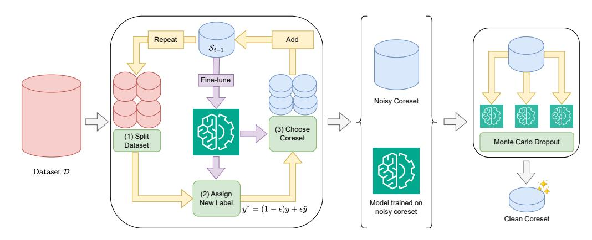
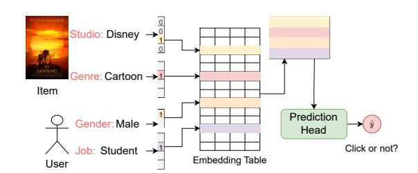
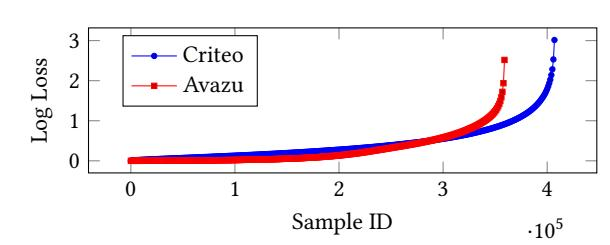
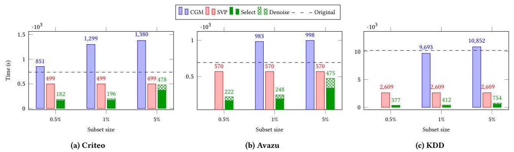
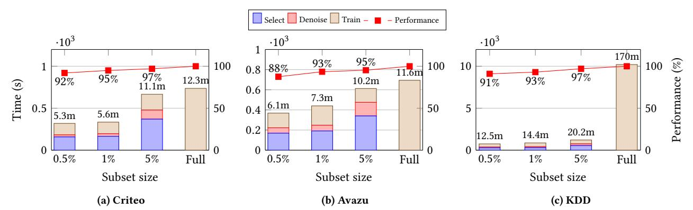
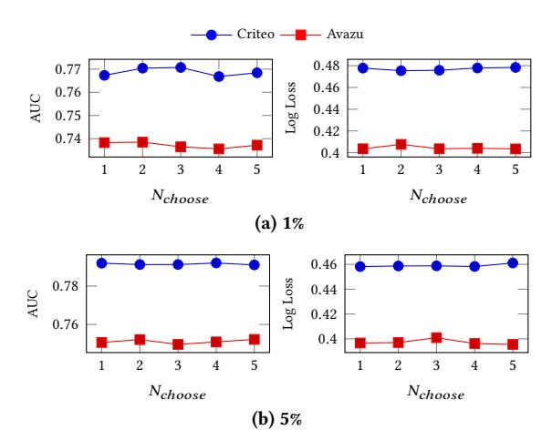
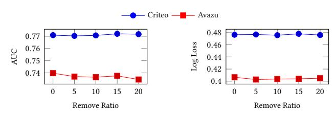
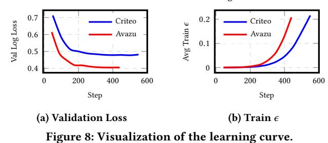

# Efficient Content-based Recommendation Model Training via Noise-aware Coreset Selection

Hung Vinh Tran h.v.tran@uq.edu.au The University of Queensland Brisbane, Queensland, Australia

Tong Chen tong.chen@uq.edu.au The University of Queensland Brisbane, Queensland, Australia

Hechuan Wen h.wen@uq.edu.au The University of Queensland Brisbane, Queensland, Australia

Quoc Viet Hung Nguyen henry.nguyen@griffith.edu.au Griffith University Gold Coast, Queensland, Australia

Bin Cui bin.cui@pku.edu.cn Peking University Beijing, China

Hongzhi Yin∗ h.yin1@uq.edu.au The University of Queensland Brisbane, Queensland, Australia

## Abstract

Content-based recommendation systems (CRSs) utilize content features to predict user-item interactions, serving as essential tools for helping users navigate information-rich web services. However, ensuring the effectiveness of CRSs requires large-scale and even continuous model training to accommodate diverse user preferences, resulting in significant computational costs and resource demands. A promising approach to this challenge is coreset selection, which identifies a small but representative subset of data samples that preserves model quality while reducing training overhead. Yet, the selected coreset is vulnerable to the pervasive noise in user-item interactions, particularly when it is minimally sized. To this end, we propose Noise-aware Coreset Selection (NaCS), a specialized framework for CRSs. NaCS constructs coresets through submodular optimization based on training gradients, while simultaneously correcting noisy labels using a progressively trained model. Meanwhile, we refine the selected coreset by filtering out low-confidence samples through uncertainty quantification, thereby avoid training with unreliable interactions. Through extensive experiments, we show that NaCS produces higher-quality coresets for CRSs while achieving better efficiency than existing coreset selection techniques. Notably, NaCS recovers 93-95% of full-dataset training performance using merely 1% of the training data. The source code is available at [https://github.com/chenxing1999/nacs.](https://github.com/chenxing1999/nacs)

# CCS Concepts

• Information systems → Recommender systems.

# Keywords

Content-based Recommendation, Coreset Selection, Click-through Rate Prediction

#### ACM Reference Format:

Hung Vinh Tran, Tong Chen, Hechuan Wen, Quoc Viet Hung Nguyen, Bin Cui, and Hongzhi Yin. 2026. Efficient Content-based Recommendation

∗Corresponding author.

© 2026 Copyright held by the owner/author(s). ACM ISBN 979-8-4007-2307-0/2026/04 <https://doi.org/10.1145/XXXXXX.XXXXXX>

Model Training via Noise-aware Coreset Selection. In Proceedings of the ACM Web Conference 2026 (WWW '26), April 13–17, 2026, Dubai, United Arab Emirates. ACM, New York, NY, USA, [13](#page-12-0) pages. [https://doi.org/10.1145/](https://doi.org/10.1145/XXXXXX.XXXXXX) [XXXXXX.XXXXXX](https://doi.org/10.1145/XXXXXX.XXXXXX)

# 1 Introduction

With the advent of the information explosion, deep recommender systems have become essential in navigating daily life. These systems are the cores of various online services, such as e-commerce websites [\[42\]](#page-8-0) , social networks [\[38\]](#page-8-1) , and streaming platforms [\[52\]](#page-9-0). Meanwhile, with the increasing diversity of content information available about both users and items, there is a shift from traditional collaborative filtering to content-based recommendation systems (CRSs). CRSs leverage side features such as user genders and movie genres for predictions on user-item interactions to facilitate more accurate recommendations [\[64\]](#page-9-1), where click-through rate (CTR) prediction is a typical task [\[13,](#page-7-0) [33,](#page-8-2) [79\]](#page-9-2).

However, to fully capture diverse user interests, CRS models commonly default to training with large-scale datasets [\[15,](#page-7-1) [72\]](#page-9-3). On the one hand, the massive training dataset, which can involve billions of user-item interaction logs (e.g., the Google Play dataset [\[6\]](#page-7-2)), has placed a heavy burden on time cost, computational resources, and carbon footprint [\[49,](#page-9-4) [50\]](#page-9-5). On the other hand, in a production environment, a recommendation model requires frequent updates with recent data to stay relevant. As per [\[25\]](#page-8-3), a 15% model performance degradation is witnessed if model updates are delayed by a day. Consequently, the efficiency hurdle is amplified by recurrently training CRS models. In addition, in the recent surge of deploying large language models (LLMs) as CRS backbones [\[19,](#page-7-3) [29,](#page-8-4) [74\]](#page-9-6), the time and resource overheads are a major bottleneck for training LLM-based recommenders at scale. As such, these practicality obstacles lead to a strong demand to reduce the computational costs of training CRS models.

In this regard, a natural solution to the efficiency bottleneck is to identify a small, representative subset of the data, known as a coreset, that serves as a proxy of the full dataset. For recommender systems, most data-centric research regarding training efficiency still focuses on classic collaborative filtering tasks [\[47,](#page-8-5) [49,](#page-9-4) [50\]](#page-9-5), which are non-trivial to generalize to content-based recommendation due to the higher level of complexity introduced by user and item feature interactions. Recently, some work [\[43,](#page-8-6) [57\]](#page-9-7) has started exploring data-centric efficient training for CRSs. For example, CGM [\[57\]](#page-9-7) aims

[This work is licensed under a Creative Commons Attribution 4.0 International License.](https://creativecommons.org/licenses/by/4.0) WWW '26, Dubai, United Arab Emirates.

to generate a condensed synthetic dataset via gradient matching to replicate the model's training trajectory with the full dataset. However, to facilitate continuous gradient-based optimization, CGM has to disobey the sparse nature of categorical input features[1](#page-0-0) , and resort to dense input features. Such dense features are hardly representative of reality – one can think of user occupation and product origin country as two examples, where it is impossible to activate all possible values in a single sample. Consequently, the performance of the trained models is suboptimal. Furthermore, the reliance on dense data representations leads to unnecessary computational and storage overheads, counteracting the benefit of reducing the training sample size. More recently, D2K [\[43\]](#page-8-6) provides a data-centric approach for CRSs. However, its focus is on retrieving informative historical samples to better adapt to unseen inputs during inference, where the training process still requires the full dataset. Thus, selecting coresets from raw data for efficient model training remains largely underexplored in CRSs.

This leads to the first challenge of efficiently selecting the most representative samples from a large-scale dataset. To ensure practicality, the coreset selection process itself must be significantly more efficient than training on the full dataset. This requires developing strategies that can scale and avoid costly computations like repetitive full-batch gradient evaluations [\[57\]](#page-9-7), while warranting maximum utility for CRS model training. In the meantime, the second challenge arises from the inherent noise within the implicit user feedback in CRSs. Unlike explicit feedback that carries users' fine-grained preferences via ratings or reviews, implicit feedback like clicks and purchases only provides indirect signals about user preferences, yet is the main label type used in CRSs (e.g., user clicks in CTR prediction tasks). This presents a fundamental issue because implicit feedback does not necessarily reflect the true user intention – for example, a user might click on an item for reasons unrelated to preference, such as curiosity, popularity, or by mistake [\[60\]](#page-9-8), while a lack of interaction does not always indicate disinterest [\[71\]](#page-9-9). This ambiguity introduces noise and bias into the observed data, rendering most general coreset selection methods [\[37\]](#page-8-7) unsuitable for CRSs due to their noise-free assumptions. This is because a coreset is selected by maximizing its capability to replicate a model's training behavior (e.g., gradients or interim accuracy) on the full data, which can be easily misled by the noisy preference labels in CRSs. As a result, the constructed coreset is prone to containing incorrect supervision signals, and risks distorting model training and degrading its recommendation performance.

Motivated by these challenges, we propose Noise-aware Coreset Selection (NaCS), an efficient and accurate coreset selection framework for content-based recommendation. Specifically, to tackle the first challenge regarding efficiency, we frame the coreset selection as a submodular optimization problem [\[37,](#page-8-7) [40,](#page-8-8) [70\]](#page-9-10), which offers a theoretical framework for set optimization problems. In a nutshell, our submodular optimization objective aims to choose a representative subset that maximizes a utility function under budget constraints. For the utility function, a common choice is the similarity between model gradients w.r.t. the full data and coreset [\[37\]](#page-8-7), yet it incurs heavy computations associated with calculating the

derivatives of all model layers. In NaCS, instead of backpropagating the whole model, only the final layer gradients are utilized to efficiently capture the gradient variance. Furthermore, to achieve a linear time complexity w.r.t. the full data size, we solve the submodular optimization objective via a stochastic greedy approach [\[36\]](#page-8-9), thus accelerating the selection process while retaining approximation guarantees. Additionally, we process the stochastic greedy algorithm in concurrent batches, which takes full advantage of GPU parallelization and significantly reduces the execution time compared to outgoing open source libraries [\[12,](#page-7-4) [18\]](#page-7-5).

To tackle the second challenge of noisy user-item interactions, we propose a two-stage data denoising paradigm. The first step denoises the label through a progressive label self-correction approach [\[61,](#page-9-13) [62\]](#page-9-14), where we utilize the model trained on the coreset to gradually assign a new label for each sample. Specifically, starting from a randomly initialized model, we iteratively select samples whose gradient best mimics the whole dataset gradient estimated by the current model. In each iteration of the first stage, the model trained on the current coreset is used to refine the labels of the whole dataset. As the coreset grows and the model becomes more accurate, the corrected labels become correspondingly more reliable, allowing us to mitigate the impact from noisy labels to coreset our selection. After obtaining the initial coreset, the second stage further refines it by estimating each sample's quality via uncertainty estimation [\[59\]](#page-9-15). For this purpose, we employ the Monte Carlo Dropout [\[9\]](#page-7-6), which involves performing multiple forward passes through the network with dropout layers enabled at test time. This process generates a distribution of predictions for each sample, allowing us to quantify sample-specific uncertainty. Then, samples with the highest uncertainty are removed, protecting the recommendation model from outliers in the small coreset.

To demonstrate our method's effectiveness, we conduct extensive experiments on three representative large-scale datasets for content-based recommendation, namely Criteo [\[16\]](#page-7-7), Avazu [\[53\]](#page-9-16), and KDD [\[1\]](#page-7-8). The experiment results show that we can recover up to 93-95% of model performance on three datasets using only 1% of the original dataset size. Additionally, we further verify the versatility of NaCS in a text-based recommendation scenario. Our method showed strong generalization, maintaining competitive performance while significantly reducing data and computational resource requirements. We summarize our contributions as follows:

- (1) We highlight the training efficiency issue from a data-centric perspective and point out the necessity of denoising implicit feedback in coreset selection, which is an essential but overlooked challenge in content-based recommendation systems.
- (2) We design a novel framework, namely NaCS, to select a clean coreset efficiently. Firstly, we employ a submodular optimization and a progressive self-correction approach to gradually build the coreset. Secondly, we apply Monte Carlo dropout to further denoise the coreset from the first step, producing a more compact one.
- (3) Extensive experiments on large-scale datasets verify NaCS's performance and efficiency. The results show that our proposed approach not only can produce a robust coreset efficiently, but also demonstrates competitive performance in text-based recommendation.

1That is, only a few values of one feature field are activated [\[48\]](#page-9-11), e.g., the one-hot encoding for user occupation. Note that CRSs predominantly use categorical features, where numerical features are converted into categorical ones via bucketing [\[78\]](#page-9-12).

Figure 1: The overview of NaCS. First, we progressively construct the coreset while refining the labels. Next, we apply Monte Carlo Dropout to estimate uncertainty and remove highly uncertain samples, resulting in the final clean coreset.

### 2 Related Work

This section summarizes the related work, while we also provide a more extensive discussion in Appendix [A.](#page-9-17)

Coreset Selection: Various heuristics for coreset selection train full [\[4\]](#page-7-9) or proxy models [\[7\]](#page-7-10) to assign scores [\[7,](#page-7-10) [41,](#page-8-10) [54,](#page-9-18) [68\]](#page-9-19), but they require training on the entire dataset and lack a trade-off between performance and efficiency. Following previous work [\[37,](#page-8-7) [40,](#page-8-8) [70\]](#page-9-10), our method adopts submodular optimization, with two key innovations: progressive label correction and a denoise module. Moreover, we implement an efficient stochastic greedy optimization algorithm, enhancing its real-world practicality for CRS training. Dataset Reduction for Recommender Systems: Recently, due to the high cost of training for recommender systems, various dataset reduction methods have been proposed for recommender systems, including both dataset distillation [\[11,](#page-7-11) [49,](#page-9-4) [57,](#page-9-7) [75\]](#page-9-20) and coreset selection [\[28,](#page-8-11) [35\]](#page-8-12). However, they are working on collaborative filtering [\[49\]](#page-9-4), sequential recommendation [\[75\]](#page-9-20), or LLM-based recommendation tasks [\[28,](#page-8-11) [35\]](#page-8-12). CGM [\[57\]](#page-9-7), which was proposed for CRs, employs gradient matching and dense representation, leading to high computational costs.

Implicit Feedback Denoising: Recent studies [\[59\]](#page-9-15) have highlighted the substantial noise in implicit feedback datasets due to their characteristics. To tackle this, initial studies leverage auxiliary information (e.g. "dwell time" [\[22\]](#page-8-13), "like" [\[3\]](#page-7-12)), which can be costly to collect. Wang et al. [\[59\]](#page-9-15) discovered that the noisy samples can be found through the loss values. Although some methods [\[14,](#page-7-13) [77\]](#page-9-21) have been proposed to denoise implicit feedback, they still have an accuracy-oriented focus, with none or limited reduction on the training data size. In contrast, we propose a complementary design between CRS data denoising and coreset selection.

### 3 Preliminaries

In this section, we first introduce the key concepts of content-based recommendation by defining a classic task, namely click-through rate (CTR) prediction. Then, we provide the background for coreset selection approaches, submodular optimization problems, and their solutions – the core theoretical framework for our approach.

Figure 2: Example process of CRSs.

#### 3.1 Content-based Recommendation

In CTR prediction, a dataset D is a set of samples (x, ��), where x is a multi-dimensional vector combining both user, item and context features, and �� is a binary label indicating positive (�� = 1, clicked) or negative (�� = 0, not clicked) user interaction with the item. For x, its features are commonly a collection of sparse binary features from multiple fields (i.e., user occupation and product category) [\[34\]](#page-8-14), called categorical features. These categorical features are typically embedded into dense vectors using randomly initialized embedding tables. This preprocessing facilitates downstream learning by converting heterogeneous raw inputs into a unified, low-dimensional representation. These representations are then fed into a neural network, commonly called model head, to capture feature interactions and predict user engagement signals, represented by the model prediction ��ˆ. Figure [2](#page-2-0) shows an example pipeline of CTR prediction model. The whole model will be trained with log loss:

�� = −�� ln(��ˆ) − (1 − ��) ln(1 − ��ˆ), (1)

which computes the difference between �� and ��ˆ.

# 3.2 Coreset Selection

Existing coreset methods [\[37,](#page-8-7) [70\]](#page-9-10) search for a weighted subset of examples that match the full dataset training gradient. Formally, the target is to find the smallest subset S ⊆ D and corresponding weight ���� for each element that approximate the full gradient with an error at most �� &gt; 0 for all possible values of model weight ���� in

Table 1: Stochastic greedy algorithm implementation comparison. The results are shown in seconds. �� is number of point to select, |D | is the dataset size, and �� denotes the error rate for stochastic greedy algorithm. The second header of Submodlib denotes the similarity kernel implementation. "-" denotes OOM. "B" refers to our batch size. Best result in each line is marked in bold.

| (k, �� ,  D   ) (50, 10 − 3 | Deep Core | Submodlib CPU | GPU    | B=1    | Ours B=4 |
|-----------------------------|-----------|---------------|--------|--------|----------|
| , 10 2                      |           |               |        |        |          |
| )                           | 0.0028    | 0.0015        | 0.0128 | 0.0301 | 0.0073   |
| (50, 10 − 3                 |           |               |        |        |          |
| , 10 3                      |           |               |        |        |          |
| )                           | 0.1610    | 0.0853        | 0.0244 | 0.0316 | 0.0078   |
| (50, 10 − 3                 |           |               |        |        |          |
| , 10 4                      |           |               |        |        |          |
| )                           |           | 10.950        | 5.0140 | 0.0591 | 0.0341   |
| (100, 10 − 3                |           |               |        |        |          |
| , 10 4                      |           |               |        |        |          |
| )                           |           | 10.944        | 4.9948 | 0.0676 | 0.0364   |
| (100, 10 − 4                |           |               |        |        |          |
| , 10 4                      |           |               |        |        |          |
| )                           |           | 12.5461       | 6.5867 | 0.0742 | 0.0434   |
| (200, 10 − 4                |           |               |        |        |          |
| , 10 4                      |           |               |        |        |          |
| )                           |           | 12.6004       | 6.6277 | 0.0893 | 0.0478   |

sample, using the following equation:

������������ = ���������� + 1.96√︂ ���������� ���������������� , (16)

where ���������� and ���������� are the first- and second-order estimation for loss value approximated with ���������������� , which we set to 10, samples for Monte Carlo approximation; the constant 1.96 corresponds to a 95% confidence interval. We remove 10% of samples with the highest estimated loss in our main experiments, while further hyperparameter studies are available in Appendix [D.2.](#page-11-2) Intuitively, if the model exhibits high variance in its predicted loss, it suggests uncertainty or potential noise in that sample. By employing the upper confidence bound on the loss values, we effectively prioritize samples with both high mean loss and high uncertainty. This method serves as a simple denoising strategy, which is demonstrated to have a competitive performance. We leave a deeper exploration of its potential for future work. The pseudo code for our framework is provided in Algorithm [1.](#page-4-2)

### 4.4 Efficient Submodular Optimization Implementation

As mentioned above, we provide a more efficient implementation for submodular optimization. Due to the page constraint, we defer the time complexity analysis in Appendix [B.](#page-10-0) Following the theoretical analysis, we further provide a proof-of-concept experiment to demonstrate our implementation's effectiveness advantage. Specifically, we compare our submodular optimization algorithm with two popular libraries: Submodlib [\[18,](#page-7-5) [24,](#page-8-16) [70\]](#page-9-10) and DeepCore [\[12,](#page-7-4) [68\]](#page-9-19).

For each setting, we execute each algorithm five times and report the average results. We focus on two submodular optimization strategies: the naive and stochastic greedy algorithm. The input consists of 100-dimensional vectors representing gradient information. As initial results show that Submodlib is the more effective library, we implement an alternative that replaces Submodlib's standard similarity kernel with a custom CUDA-based kernel to verify that the performance gains primarily result from the optimization method rather than the score computation.

Table [1](#page-5-1) presents the experiment results for stochastic greedy settings, while naive greedy settings is deferred to Appendix [D.5.](#page-12-1) Among the evaluated methods, DeepCore performs the worst, due

to its Python implementation, which introduces significant overhead. Submodlib demonstrates strong performance on smaller datasets (around 100 items). However, such small datasets are unsuitable for real-world applications. Our method performs less favorably on small datasets due to the high synchronization cost between CPU and GPU, which becomes a bottleneck at smaller scales. Nevertheless, as the dataset size increases, our method exhibits significant gains. When compared to Submodlib using a GPU-based similarity kernel, our approach achieves remarkable speedups – up to 180.74× for the naive greedy algorithm and 138.65× for the stochastic greedy variant – highlighting our efficiency in large-scale scenarios.

#### 5 Experiments

In this section, we conduct experiments to study the effectiveness of our method. Specifically, we are interested in answering the following research questions (RQs):

RQ1: How does the performance of NaCS compare to that of other established methods across various experimental settings? RQ2: What is the computational efficiency of NaCS method compared to previous methods and complete model training? RQ3: What are the effects of the key components? RQ4: To what extent do our identified coresets generalize and perform across different architectural designs? RQ5: Is NaCS compatible with LLM-based CRS models?

### 5.1 Settings

5.1.1 Datasets. We conduct our experiments on three public datasets: Criteo [\[16\]](#page-7-7), Avazu [\[53\]](#page-9-16), and KDD [\[1\]](#page-7-8). In all datasets, we randomly split them into 8:1:1 as the training, validation, and test sets, respectively. The dataset preprocessing is described in Appendix [C.1.](#page-10-1) 5.1.2 Metrics. We evaluate all methods using two commonly used metrics in CTR prediction community [\[79\]](#page-9-2): AUC (Area under the ROC curve) and Log Loss. In CTR prediction, a difference of 0.1% in AUC is generally considered significant [\[79\]](#page-9-2). The lower LogLoss indicates better performance, while a higher AUC suggests more accurate recommendations. 5.1.3 Implementation Details. We compare NaCS against other data reduction methods, namely: Random, SVP-CF [\[50\]](#page-9-5), K-Center [\[51\]](#page-9-23), and CGM [\[57\]](#page-9-7), whose details are specified in Appendix [C.2.](#page-10-2) All methods are tested with two backbones: DeepFM [\[13\]](#page-7-0) and DCNv2 [\[58\]](#page-9-24), whose hyperparameters are specified in Appendix [C.3.](#page-10-3) Following prior studies [\[79\]](#page-9-2), we employ early stopping to prevent overfitting and mitigate error accumulation in our progressive self-

correction approach (Appendix [D.3\)](#page-11-1).

### 5.2 Overall Performance (RQ1)

Table [2](#page-6-0) shows the performance of NaCS compared with other baselines. Across all settings, our method significantly outperforms all other baselines, with a more prominent gap when data availability is limited. As with a smaller coreset size, we require a better selection strategy to achieve a good result. NaCS retains approximately 95% AUC on Criteo and 93% on Avazu and KDD using only 1% of the dataset. These results highlight our strength in selecting informative samples on a compact budget.

Interestingly, while commonly considered the weaker backbone, DeepFM generally outperforms DCNv2 when trained on smaller coresets. One plausible explanation is that simpler architectures,

Table 2: Comparative results with various coreset selection methods on Criteo, Avazu, and KDD under three coreset size budgets. "-" denotes unachievable. The best result in each settings is marked in bold.

| Dataset Backbone Ratio | Random | SVP-CF | AUC K-Center | ↑ CGM  | Ours Whole | data Random | SVP-CF | Log K-Center | Loss ↓ CGM | Ours   | Whole data |
|------------------------|--------|--------|--------------|--------|------------|-------------|--------|--------------|------------|--------|------------|
| 0.5%                   | 0.7353 | 0.7364 | 0.7162       | 0.7320 | 0.7477     |             |        |              |            |        |            |
|                        |        |        |              |        |            | 0.5275      | 0.5192 | 0.5410       | 0.5148     | 0.4951 |            |
| 1%                     | 0.7667 | 0.7673 | 0.7620       | 0.7316 | 0.7706     | 0.4793      | 0.4783 | 0.4859       | 0.5122     | 0.4779 | 0.4436     |
| 5%                     | 0.7790 | 0.7792 | 0.7704       | 0.7321 | 0.7839     | 0.4715      | 0.4719 | 0.4771       | 0.5153     | 0.4655 |            |
| 0.5%                   | 0.7211 | 0.7227 | 0.6983       | 0.7288 | 0.7469     |             |        |              |            |        |            |
|                        |        |        |              |        |            | 0.5514      | 0.5532 | 0.6026       | 0.5160     | 0.5061 |            |
| 1%                     | 0.7673 | 0.7685 | 0.7665       | 0.7261 | 0.7707     | 0.4779      | 0.4776 | 0.4789       | 0.5317     | 0.4758 | 0.4402     |
| 5%                     | 0.7853 | 0.7868 | 0.7730       | 0.7234 | 0.7910     | 0.4634      | 0.4626 | 0.4742       | 0.5301     | 0.4611 |            |
| 0.5%                   | 0.6727 | 0.6894 | 0.6617       |        | 0.7071     |             |        |              |            |        |            |
|                        |        |        |              |        |            | 0.4961      | 0.5733 | 0.5204       |            | 0.4732 |            |
| 1%                     | 0.7145 | 0.7117 | 0.6776       | 0.6980 | 0.7383     | 0.4205      | 0.4179 | 0.4766       | 0.4946     | 0.4049 | 0.3771     |
| 5%                     | 0.7419 | 0.7483 | 0.7197       | 0.7015 | 0.7502     | 0.4027      | 0.3973 | 0.4122       | 0.6169     | 0.3962 |            |
| 0.5%                   | 0.6694 | 0.6781 | 0.6714       |        | 0.6905     |             |        |              |            |        |            |
|                        |        |        |              |        |            | 0.6210      | 0.6138 | 0.6239       |            | 0.4414 |            |
| 1%                     | 0.6953 | 0.7103 | 0.6745       | 0.6872 | 0.7365     | 0.4459      | 0.4359 | 0.5044       | 0.4385     | 0.4036 | 0.3750     |
| 5%                     | 0.7427 | 0.7410 | 0.7145       | 0.6890 | 0.7522     | 0.4003      | 0.4012 | 0.4158       | 0.4798     | 0.3955 |            |
| 0.5%                   | 0.7129 | 0.7127 | 0.7068       |        | 0.7298     |             |        |              |            |        |            |
|                        |        |        |              |        |            | 0.1677      | 0.1682 | 0.1718       |            | 0.1651 |            |
| 1%                     | 0.7242 | 0.7238 | 0.7108       | 0.7042 | 0.7443     | 0.1658      | 0.1659 | 0.1692       | 0.2506     | 0.1633 | 0.1527     |
| 5%                     | 0.7478 | 0.7445 | 0.7364       | 0.7053 | 0.7729     | 0.1621      | 0.1626 | 0.1654       | 0.2111     | 0.1582 |            |
| 0.5%                   | 0.7120 | 0.7107 | 0.6944       |        | 0.7300     |             |        |              |            |        |            |
|                        |        |        |              |        |            | 0.1679      | 0.1685 | 0.1745       |            | 0.1650 |            |
| 1%                     | 0.7242 | 0.7141 | 0.7082       | 0.6911 | 0.7441     | 0.1657      | 0.1675 | 0.1690       | 0.3417     | 0.1630 | 0.1523     |
| 5%                     | 0.7470 | 0.7452 | 0.7346       | 0.7016 | 0.7737     | 0.1624      | 0.1624 | 0.1660       | 0.2650     | 0.1578 |            |

Figure 4: Runtime relative to the full dataset of DCNv2 backbone with various budgets. "Select" and "Denoise" represent the runtime of our two steps. "Original" represents the training time on the original dataset.

such as DeepFM, are less prone to overfitting, generalize better, and lead to more stable coreset selections. This insight emphasizes the necessity of aligning model complexity with the data budget.

Moreover, random is still a competitive baseline compared to other proposed approaches, which is a similar observation to recent studies [\[28,](#page-8-11) [43,](#page-8-6) [57\]](#page-9-7). Additionally, although CGM can use very few samples, each sample encodes a dense representation, which limits its ability to scale under strict data budgets.

# 5.3 Efficiency Analysis (RQ2)

For method efficiency, we conduct the experiments to benchmark the time required to generate and to train on the result coreset. For this experiment, we employ a GPU workstation with an i7-13700K CPU, NVIDIA RTX A5000 GPU, and 32GB RAM.

As shown in Figure [4](#page-6-2) and Appendix [D,](#page-11-3) our method provides substantial gains in training efficiency. In 3-4 minutes, we can select 1% of the data for the Criteo and Avazu datasets, while training on the full datasets requires over 12.5 minutes and 11 minutes. Furthermore, NaCS consistently outperforms previous approaches

in efficiency. This advantage stems from avoiding iterative backpropagation across the entire dataset, unlike these methods, which require either constant-time score assignment (e.g., SVP-CF) over all samples or expensive bi-level optimization schemes (e.g., CGM).

In NaCS, the coreset selection step accounts for a considerable runtime, as it requires forward passes over the entire dataset to compute last-layer gradients, submodular optimization, and progressive training on the coreset. In contrast, the denoising step only requires forward passes on a negligible subset of the data.

# 5.4 Ablation Study (RQ3)

In the below part, we verify the effectiveness of our three main components. For this experiment, we employ 1% coreset size with DCNv2 and DeepFM backbones as 1% subset provides a good tradeoff between efficiency and performance.

5.4.1 Coreset Objective. In this experiment, we employ two additional baselines: Random and set cover [\[8\]](#page-7-15), which aim to maximize the number of features in the coreset. For a fair comparison, we denoise the resulting coresets of these methods similarly to our

proposed approach. As shown in Table [3a](#page-8-17), our proposed approach performs the best on all three datasets. Moreover, the random approach also benefits from the denoising process.

5.4.2 Loss Function. Table [3b](#page-8-17) presents ablation studies for BCE and other loss-based denoising approaches [\[59\]](#page-9-15) compared to our proposed approach. The results show that both our method and R-CE improve the performance over the traditional log loss approach, with our method achieving the best performance. On the other hand, T-CE performs poorly in our settings. One possible hypothesis is that they discard positive interactions too severely, leading to poor recommendations in small datasets.

5.4.3 Denoising Effectiveness. Table [3c](#page-8-17) depicts the ablation study on data denoising. In "Full model", instead of employing the model trained on the coreset as a denoiser, we utilize the model trained on the whole dataset. This "Full model" can be accessed if we have more computing resources to produce a better coreset. The experiment results show that denoising the dataset benefits the model on all datasets. Moreover, we can employ the "Full model" to further enhance the coreset denoising process.

# 5.5 Cross Architecture Performance (RQ4)

Table [4](#page-8-18) presents the AUC performance of various architectures when evaluated with a 1% and 5% dataset budget on three datasets. For this comparison, we further include FinalMLP [\[33\]](#page-8-2) as another backbone in model training. The performance gap between backbones is minor, highlighting our coreset's transferability. At a 1% dataset size, the DeepFM backbone yields a better coreset, while DCNv2 performs better at a 5% size. This may be because DeepFM, as a smaller model, is less prone to overfitting with limited samples, whereas DCNv2's superior representation power becomes advantageous with a larger budget. Generally, stronger backbones outperform weaker ones on the same datasets. Except for the 1% data budget scenario on KDD, FinalMLP consistently outperforms the other baselines.

# 5.6 Compatibility with LLMs (RQ5)

Since our method relies solely on model gradients, it can be easily extended to other recommendation settings. Given the growing interest in LLM-based models, we apply our approach to a textbased recommendation scenario. To this end, we implement our algorithm on the Legommenders [\[30\]](#page-8-19) and evaluate our performance on the MIND dataset. As is standard practice with this dataset, we perform negative sampling, generating four negative samples for each positive instance. Table [5](#page-8-20) shows the experiment results.

In text-based recommendation, our method demonstrates consistent improvement over random selection, despite a smaller amount compared to the traditional recommendation task. One possible explanation is that the influence of pretrain text embedding. Interestingly, despite MIND being a relatively small dataset, the larger model, ONCE, outperforms the smaller model, NAML, across both low and high coreset budget settings, instead of overfitting. This contrasts with trends observed in traditional category-based recommendation tasks. A possible explanation is the stronger generalization capability of pretrained text-based models, particularly

large language models (LLMs), which may reduce overfitting on smaller datasets.

# 6 Conclusion

In this paper, we propose a noise-aware coreset selection framework for content-based recommendation systems. Our proposed approach first selects a small subset of samples to mimic the full dataset gradient by applying submodular optimization. Concurrently, we assign new labels for each sample with a progressive self-correction approach. Then, through Monte Carlo Dropout, we efficiently identify uncertain samples from the coreset, resulting in a clean and performant coreset. Extensive experiments show that our method is not only more efficient but also more accurate than previous state-of-the-art approaches.

# Acknowledgments

The Australian Research Council partially supports this work under Grant No. FT210100624, DE230101033, DP240101108, DP260100326, LP230200892 and LP240200546.

# References

[1] Yi Wang Aden. 2012. KDD Cup 2012, Track 2. [https://kaggle.com/competitions/](https://kaggle.com/competitions/kddcup2012-track2) [kddcup2012-track2](https://kaggle.com/competitions/kddcup2012-track2) [2] Saurabh Agarwal, Chengpo Yan, Ziyi Zhang, and Shivaram Venkataraman. 2023. Bagpipe: Accelerating deep recommendation model training. In SOSP. 348–363. [3] Zhi Bian, Shaojun Zhou, Hao Fu, Qihong Yang, Zhenqi Sun, Junjie Tang, Guiquan Liu, Kaikui Liu, and Xiaolong Li. 2021. Denoising user-aware memory network for recommendation. In RecSys. 400–410. [4] Vighnesh Birodkar, Hossein Mobahi, and Samy Bengio. 2019. Semantic redundancies in image-classification datasets: The 10% you don't need. arXiv preprint arXiv:1901.11409 (2019). [5] Zalán Borsos, Mojmir Mutny, and Andreas Krause. 2020. Coresets via bilevel optimization for continual learning and streaming. NeuRIPS (2020), 14879–14890. [6] Heng-Tze Cheng, Levent Koc, Jeremiah Harmsen, Tal Shaked, Tushar Chandra, Hrishi Aradhye, Glen Anderson, Greg Corrado, Wei Chai, Mustafa Ispir, et al. 2016. Wide & deep learning for recommender systems. In DLRS@RecSys. 7–10. [7] Cody Coleman, Christopher Yeh, Stephen Mussmann, Baharan Mirzasoleiman, Peter Bailis, Percy Liang, Jure Leskovec, and Matei Zaharia. 2020. Selection via proxy: Efficient data selection for deep learning. ICLR (2020). [8] Graham Cormode, Howard Karloff, and Anthony Wirth. 2010. Set cover algorithms for very large datasets. In CIKM. 479–488. [9] Yarin Gal and Zoubin Ghahramani. 2016. Dropout as a bayesian approximation: Representing model uncertainty in deep learning. In international conference on machine learning. PMLR, 1050–1059. [10] Xinyi Gao, Junliang Yu, Tong Chen, Guanhua Ye, Wentao Zhang, and Hongzhi Yin. 2025. Graph condensation: A survey. TKDE (2025). [11] Xinyi Gao, Jingxi Zhang, Lijian Chen, Tong Chen, Lizhen Cui, and Hongzhi Yin. 2026. Relational Database Distillation: From Structured Tables to Condensed Graph Data. WWW (2026). [12] Chengcheng Guo, Bo Zhao, and Yanbing Bai. 2022. Deepcore: A comprehensive library for coreset selection in deep learning. In International Conference on Database and Expert Systems Applications. Springer, 181–195. [13] Huifeng Guo, Ruiming Tang, Yunming Ye, Zhenguo Li, and Xiuqiang He. 2017. DeepFM: A Factorization-Machine based Neural Network for CTR Prediction. In IJCAI, Carles Sierra (Ed.). 1725–1731. [14] Zhuangzhuang He, Yifan Wang, Yonghui Yang, Peijie Sun, Le Wu, Haoyue Bai, Jinqi Gong, Richang Hong, and Min Zhang. 2024. Double correction framework for denoising recommendation. In KDD. [15] Nguyen Quoc Viet Hung, Huynh Huu Viet, Nguyen Thanh Tam, Matthias Weidlich, Hongzhi Yin, and Xiaofang Zhou. 2017. Computing crowd consensus with partial agreement. TKDE (2017). [16] Olivier Chapelle Jean-Baptiste Tien, joycenv. 2014. Display Advertising Challenge. <https://kaggle.com/competitions/criteo-display-ad-challenge> [17] Angelos Katharopoulos and François Fleuret. 2018. Not all samples are created equal: Deep learning with importance sampling. In ICML. PMLR, 2525–2534. [18] Vishal Kaushal, Ganesh Ramakrishnan, and Rishabh Iyer. 2022. Submodlib: A submodular optimization library. arXiv preprint arXiv:2202.10680 (2022). [19] Dang Kieu, Delvin Ce Zhang, Minh Duc Nguyen, Min Xu, Qiang Wu, and Dung D Le. 2025. Enhancing News Recommendation with Hierarchical LLM Prompting.

Table 3: Ablation study results. In each settings, the best result is highlighted in bold and the second best is underlined.

| Section Method          | AUC    | DeepFM Log | Criteo Loss AUC | DCNv2 Log | Loss AUC | DeepFM Log | Avazu Loss AUC | DCNv2 Log | Loss AUC | DeepFM Log | KDD Loss AUC | DCNv2 Log Loss |
|-------------------------|--------|------------|-----------------|-----------|----------|------------|----------------|-----------|----------|------------|--------------|----------------|
| (a) Coreset Set Cover   | 0.7460 | 0.4928     | 0.7520          | 0.4935    | 0.7067   | 0.4168     | 0.7098         | 0.4192    | 0.7229   | 0.1674     | 0.7262       | 0.1671         |
| Objective Random        | 0.7693 | 0.4757     | 0.7696          | 0.4765    | 0.7186   | 0.4141     | 0.6948         | 0.4279    | 0.7281   | 0.1654     | 0.7265       | 0.1659         |
| BCE                     | 0.7611 | 0.4834     | 0.7625          | 0.4811    | 0.7254   | 0.4096     | 0.7246         | 0.4095    | 0.7391   | 0.1632     | 0.7408       | 0.1630         |
| (b) Loss T-CE           | 0.7451 | 0.5597     | 0.7615          | 0.6123    | 0.7185   | 0.5279     | 0.7295         | 0.4812    | 0.7311   | 0.1702     | 0.7320       | 0.1685         |
| R-CE                    | 0.7672 | 0.4812     | 0.7681          | 0.4786    | 0.7298   | 0.4104     | 0.7322         | 0.4076    | 0.7440   | 0.1704     | 0.7435       | 0.1724         |
| (c) Denoise w/o denoise | 0.7675 | 0.4782     | 0.7659          | 0.4785    | 0.7346   | 0.4052     | 0.7308         | 0.4068    | 0.7390   | 0.1634     | 0.7422       | 0.1630         |
| approaches Full model   | 0.7695 | 0.4765     | 0.7705          | 0.4770    | 0.7395   | 0.4025     | 0.7379         | 0.4032    | 0.7506   | 0.1620     | 0.7482       | 0.1628         |
| NaCS                    | 0.7706 | 0.4779     | 0.7707          | 0.4758    | 0.7383   | 0.4049     | 0.7365         | 0.4036    | 0.7443   | 0.1633     | 0.7441       | 0.1630         |

Table 4: Cross-architecture AUC performance with a 1% and

5% dataset budget on the Criteo, Avazu, and KDD datasets. "Backbones" refer to downstream models. Data Backbones Criteo Avazu KDD size DeepFM DCNv2 DeepFM DCNv2 DeepFM DCNv2 1% DeepFM 0.7706 0.7700 0.7383 0.7378 0.7443 0.7435 DCNv2 0.7696 0.7707 0.7396 0.7365 0.7410 0.7441 FinalMLP 0.7717 0.7708 0.7398 0.7388 0.7427 0.7417 5% DeepFM 0.7839 0.7839 0.7502 0.7519 0.7729 0.7735 DCNv2 0.7903 0.7910 0.7493 0.7522 0.7725 0.7737 FinalMLP 0.7910 0.7912 0.7554 0.7547 0.7736 0.7741 Table 5: Performance of coreset selection methods on MIND dataset. "N" is short for NDCG. Backbone Data size Method GAUC MRR N@5 N@10 NAML 100% Whole data 0.6704 0.2931 0.3263 0.3901 1% Random 0.5883 0.2454 0.2658 0.3290 NaCS 0.5984 0.2497 0.2740 0.3364 5% Random 0.6373 0.2733 0.3006 0.3650 NaCS 0.6422 0.2744 0.3060 0.3677 ONCE 100% Whole data 0.6874 0.3106 0.3522 0.4131 1% Random 0.6004 0.2512 0.2720 0.3357 NaCS 0.6273 0.2665 0.2955 0.3562 5% Random 0.6552 0.2879 0.3246 0.3851 NaCS 0.6586 0.2935 0.3321 0.3921 In WWW Companion. 3072–3075. [20] Krishnateja Killamsetty, Durga Sivasubramanian, Ganesh Ramakrishnan, and Rishabh Iyer. 2021. Glister: Generalization based data subset selection for efficient and robust learning. In AAAI. 8110–8118. [21] Krishnateja Killamsetty, Xujiang Zhao, Feng Chen, and Rishabh Iyer. 2021. Retrieve: Coreset selection for efficient and robust semi-supervised learning. NeuRIPS (2021), 14488–14501. [22] Youngho Kim, Ahmed Hassan, Ryen W White, and Imed Zitouni. 2014. Modeling dwell time to predict click-level satisfaction. In WSDM. 193–202. [23] Diederik P Kingma and Jimmy Ba. 2014. Adam: A method for stochastic optimization. arXiv preprint arXiv:1412.6980 (2014). [24] Suraj Kothawade, Vishal Kaushal, Ganesh Ramakrishnan, Jeff Bilmes, and Rishabh Iyer. 2022. Prism: A rich class of parameterized submodular information measures for guided data subset selection. In AAAI, Vol. 36. 10238–10246. [25] Hyunsung Lee, Sungwook Yoo, Dongjun Lee, and Jaekwang Kim. 2023. How Important is Periodic Model Update in Recommender System?. In SIGIR. 2661–2668. [26] Xurong Liang, Tong Chen, Lizhen Cui, Yang Wang, Meng Wang, and Hongzhi Yin. 2024. Lightweight Embeddings for Graph Collaborative Filtering. In SIGIR. 1296–1306. [27] Xurong Liang, Tong Chen, Quoc Viet Hung Nguyen, Jianxin Li, and Hongzhi Yin. 2023. Learning compact compositional embeddings via regularized pruning for recommendation. In ICDM. IEEE, 378–387. [28] Xinyu Lin, Wenjie Wang, Yongqi Li, Shuo Yang, Fuli Feng, Yinwei Wei, and Tat-Seng Chua. 2024. Data-efficient Fine-tuning for LLM-based Recommendation. In SIGIR. 365–374. [29] Qijiong Liu, Nuo Chen, Tetsuya Sakai, and Xiao-Ming Wu. 2024. Once: Boosting content-based recommendation with both open-and closed-source large language models. In WSDM. 452–461. [30] Qijiong Liu, Lu Fan, and Xiao-Ming Wu. 2025. Legommenders: A comprehensive content-based recommendation library with llm support. In Companion Proceedings of the ACM on Web Conference 2025. 753–756. [31] Zheqi Lv, Wenqiao Zhang, Zhengyu Chen, Shengyu Zhang, and Kun Kuang. 2024. Intelligent model update strategy for sequential recommendation. In WWW. 3117–3128. [32] Fuyuan Lyu et al. 2022. OptEmbed: Learning Optimal Embedding Table for Click-through Rate Prediction. In CIKM. 1399–1409. [33] Kelong Mao, Jieming Zhu, Liangcai Su, Guohao Cai, Yuru Li, and Zhenhua Dong. 2023. FinalMLP: an enhanced two-stream MLP model for CTR prediction. In AAAI, Vol. 37. 4552–4560. [34] Matteo Marcuzzo, Alessandro Zangari, Andrea Albarelli, and Andrea Gasparetto. 2022. Recommendation systems: An insight into current development and future research challenges. IEEE Access 10 (2022), 86578–86623. [35] Tiehua Mei, Hengrui Chen, Peng Yu, Jiaqing Liang, and Deqing Yang. 2025. GORACS: Group-level Optimal Transport-guided Coreset Selection for LLMbased Recommender Systems. In KDD. [36] Baharan Mirzasoleiman, Ashwinkumar Badanidiyuru, Amin Karbasi, Jan Vondrák, and Andreas Krause. 2015. Lazier than lazy greedy. In AAAI. [37] Baharan Mirzasoleiman, Jeff Bilmes, and Jure Leskovec. 2020. Coresets for dataefficient training of machine learning models. In ICML. PMLR, 6950–6960. [38] Maxim Naumov, Dheevatsa Mudigere, Hao-Jun Michael Shi, Jianyu Huang, Narayanan Sundaraman, Jongsoo Park, Xiaodong Wang, Udit Gupta, Carole-Jean Wu, Alisson G Azzolini, et al. 2019. Deep learning recommendation model for personalization and recommendation systems. arXiv preprint arXiv:1906.00091 (2019). [39] G. L. Nemhauser, L. A. Wolsey, and M. L. Fisher. 1978. An analysis of approximations for maximizing submodular set functions–I. Math. Program. 14, 1 (Dec. 1978), 265–294. [40] Dang Nguyen, Wenhan Yang, Rathul Anand, Yu Yang, and Baharan Mirzasoleiman. [n. d.]. Mini-batch Coresets for Memory-efficient Language Model Training on Data Mixtures. In ICLR. [41] Mansheej Paul, Surya Ganguli, and Gintare Karolina Dziugaite. 2021. Deep learning on a data diet: Finding important examples early in training. NeuRIPS 34 (2021), 20596–20607. [42] Andreas Pfadler, Huan Zhao, Jizhe Wang, Lifeng Wang, Pipei Huang, and Dik Lun Lee. 2020. Billion-scale recommendation with heterogeneous side information at taobao. In ICDE. IEEE, 1667–1676. [43] Jiarui Qin, Weiwen Liu, Weinan Zhang, and Yong Yu. 2025. D2K: Turning historical data into retrievable knowledge for recommender systems. In WWW. 472–482. [44] Yunke Qu, Tong Chen, Quoc Viet Hung Nguyen, and Hongzhi Yin. 2024. Budgeted Embedding Table For Recommender Systems. In WSDM (WSDM '24). 557–566. [45] Yunke Qu, Tong Chen, Xiangyu Zhao, Lizhen Cui, Kai Zheng, and Hongzhi Yin. 2023. Continuous Input Embedding Size Search For Recommender Systems. In SIGIR. 708–717. [46] Yunke Qu, Liang Qu, Tong Chen, Quoc Viet Hung Nguyen, and Hongzhi Yin. 2025. Efficient Multimodal Streaming Recommendation via Expandable Side Mixture-of-Experts. In Proceedings of the 34th ACM International Conference on Information and Knowledge Management. 2460–2470. [47] Yunke Qu, Liang Qu, Tong Chen, Xiangyu Zhao, Jianxin Li, and Hongzhi Yin. 2024. Sparser Training for On-Device Recommendation Systems. arXiv preprint arXiv:2411.12205 (2024).

| Data Backbones size | DeepFM | Criteo DCNv2 | DeepFM | Avazu DCNv2 | DeepFM | KDD DCNv2 |
|---------------------|--------|--------------|--------|-------------|--------|-----------|
| DeepFM              | 0.7706 | 0.7700       | 0.7383 | 0.7378      | 0.7443 | 0.7435    |
| DCNv2               | 0.7696 | 0.7707       | 0.7396 | 0.7365      | 0.7410 | 0.7441    |
| FinalMLP            | 0.7717 | 0.7708       | 0.7398 | 0.7388      | 0.7427 | 0.7417    |
| DeepFM              | 0.7839 | 0.7839       | 0.7502 | 0.7519      | 0.7729 | 0.7735    |
| DCNv2               | 0.7903 | 0.7910       | 0.7493 | 0.7522      | 0.7725 | 0.7737    |
| FinalMLP            | 0.7910 | 0.7912       | 0.7554 | 0.7547      | 0.7736 | 0.7741    |

| Backbone Data size | Method     | GAUC   | MRR    | N@5    | N@10   |
|--------------------|------------|--------|--------|--------|--------|
| 100%               | Whole data | 0.6704 | 0.2931 | 0.3263 | 0.3901 |
| 1%                 | Random     | 0.5883 | 0.2454 | 0.2658 | 0.3290 |
|                    | NaCS       | 0.5984 | 0.2497 | 0.2740 | 0.3364 |
| 5%                 | Random     | 0.6373 | 0.2733 | 0.3006 | 0.3650 |
|                    | NaCS       | 0.6422 | 0.2744 | 0.3060 | 0.3677 |
| 100%               | Whole data | 0.6874 | 0.3106 | 0.3522 | 0.4131 |
| 1%                 | Random     | 0.6004 | 0.2512 | 0.2720 | 0.3357 |
|                    | NaCS       | 0.6273 | 0.2665 | 0.2955 | 0.3562 |
| 5%                 | Random     | 0.6552 | 0.2879 | 0.3246 | 0.3851 |
|                    | NaCS       | 0.6586 | 0.2935 | 0.3321 | 0.3921 |

[48] Steffen Rendle. 2010. Factorization Machines. In ICDM. 995–1000. [doi:10.1109/](https://doi.org/10.1109/ICDM.2010.127) [ICDM.2010.127](https://doi.org/10.1109/ICDM.2010.127) [49] Noveen Sachdeva, Mehak Dhaliwal, Carole-Jean Wu, and Julian McAuley. 2022. Infinite recommendation networks: A data-centric approach. NeuRIPS 35 (2022), 31292–31305. [50] Noveen Sachdeva, Carole-Jean Wu, and Julian McAuley. 2022. On sampling collaborative filtering datasets. In WSDM. 842–850. [51] Ozan Sener and Silvio Savarese. 2017. Active learning for convolutional neural networks: A core-set approach. arXiv preprint arXiv:1708.00489 (2017). [52] Harald Steck, Linas Baltrunas, Ehtsham Elahi, Dawen Liang, Yves Raimond, and Justin Basilico. 2021. Deep learning for recommender systems: A Netflix case study. AI magazine 42, 3 (2021), 7–18. [53] Will Cukierski Steve Wang. 2014. The Avazu Dataset. [https://kaggle.com/](https://kaggle.com/competitions/avazu-ctr-prediction) [competitions/avazu-ctr-prediction](https://kaggle.com/competitions/avazu-ctr-prediction) [54] Mariya Toneva, Alessandro Sordoni, Remi Tachet des Combes, Adam Trischler, Yoshua Bengio, and Geoffrey J Gordon. 2019. An Empirical Study of Example Forgetting during Deep Neural Network Learning. In ICLR. [55] Hung Vinh Tran, Tong Chen, Quoc Viet Hung Nguyen, Zi Huang, Lizhen Cui, and Hongzhi Yin. 2024. A Thorough Performance Benchmarking on Lightweight Embedding-based Recommender Systems. arXiv preprint arXiv:2406.17335 (2024). [56] Hung Vinh Tran, Tong Chen, Guanhua Ye, Quoc Viet Hung Nguyen, Kai Zheng, and Hongzhi Yin. 2025. On-device content-based recommendation with singleshot embedding pruning: A cooperative game perspective. In Proceedings of the ACM on Web Conference 2025. 772–785. [57] Cheng Wang, Jiacheng Sun, Zhenhua Dong, Ruixuan Li, and Rui Zhang. 2023. Gradient matching for categorical data distillation in CTR prediction. In RecSys. 161–170. [58] Ruoxi Wang et al. 2021. Dcn v2: Improved deep & cross network and practical lessons for web-scale learning to rank systems. In WWW. 1785–1797. [59] Wenjie Wang, Fuli Feng, Xiangnan He, Liqiang Nie, and Tat-Seng Chua. 2021. Denoising Implicit Feedback for Recommendation. In WSDM. [60] Wenjie Wang, Fuli Feng, Xiangnan He, Hanwang Zhang, and Tat-Seng Chua. 2021. Clicks can be cheating: Counterfactual recommendation for mitigating clickbait issue. In SIGIR. 1288–1297. [61] Xinshao Wang, Yang Hua, Elyor Kodirov, David A Clifton, and Neil M Robertson. 2021. Proselflc: Progressive self label correction for training robust deep neural networks. In CVPR. 752–761. [62] Xinshao Wang, Yang Hua, Elyor Kodirov, Sankha Subhra Mukherjee, David A Clifton, and Neil M Robertson. 2022. Proselflc: Progressive self label correction towards a low-temperature entropy state. arXiv preprint arXiv:2207.00118 (2022). [63] Zongwei Wang, Min Gao, Wentao Li, Junliang Yu, Linxin Guo, and Hongzhi Yin. 2023. Efficient bi-level optimization for recommendation denoising. In Proceedings of the 29th ACM SIGKDD conference on knowledge discovery and data mining. 2502–2511. [64] Chenwang Wu, Defu Lian, Yong Ge, Min Zhou, Enhong Chen, and Dacheng Tao. 2024. Boosting factorization machines via saliency-guided mixup. TPAMI 46 (2024). [65] Jiahao Wu, Qijiong Liu, Hengchang Hu, Wenqi Fan, Shengcai Liu, Qing Li, Xiao-Ming Wu, and Ke Tang. 2025. Leveraging ChatGPT to Empower Training-free Dataset Condensation for Content-based Recommendation. In WWW Companion. 1402–1406. [66] Xin Xia, Hongzhi Yin, Junliang Yu, Qinyong Wang, Guandong Xu, and Quoc Viet Hung Nguyen. 2022. On-device next-item recommendation with selfsupervised knowledge distillation. In SIGIR. [67] Xin Xia, Junliang Yu, Qinyong Wang, Chaoqun Yang, Nguyen Quoc Viet Hung, and Hongzhi Yin. 2023. Efficient on-device session-based recommendation. TOIS (2023). [68] Weiwei Xiao, Yongyong Chen, Qiben Shan, Yaowei Wang, and Jingyong Su. 2024. Feature distribution matching by optimal transport for effective and robust coreset selection. In AAAI, Vol. 38. 9196–9204. [69] Bencheng Yan, Pengjie Wang, Kai Zhang, Feng Li, Hongbo Deng, Jian Xu, and Bo Zheng. 2022. Apg: Adaptive parameter generation network for click-through rate prediction. NeuRIPS 35 (2022), 24740–24752. [70] Yu Yang, Hao Kang, and Baharan Mirzasoleiman. 2023. Towards sustainable learning: Coresets for data-efficient deep learning. In ICML. [71] Ziyi Ye, Xiaohui Xie, Yiqun Liu, Zhihong Wang, Xuancheng Li, Jiaji Li, Xuesong Chen, Min Zhang, and Shaoping Ma. 2022. Why Don't You Click: Understanding Non-Click Results in Web Search with Brain Signals. In SIGIR. 633–645. [72] Hongzhi Yin and Bin Cui. 2016. Spatio-temporal recommendation in social media. Springer. [73] Hongzhi Yin, Liang Qu, Tong Chen, Wei Yuan, Ruiqi Zheng, Jing Long, Xin Xia, Yuhui Shi, and Chengqi Zhang. 2025. On-Device Recommender Systems: A Comprehensive Survey. DSE (2025). [74] Wei Yuan, Chaoqun Yang, Guanhua Ye, Tong Chen, Nguyen Quoc Viet Hung, and Hongzhi Yin. 2024. FELLAS: Enhancing Federated Sequential Recommendation with LLM as External Services. TOIS (2024). [75] Jiaqing Zhang, Mingjia Yin, Hao Wang, Yawen Li, Yuyang Ye, Xingyu Lou, Junping Du, and Enhong Chen. 2025. Td3: Tucker decomposition based dataset distillation method for sequential recommendation. In WWW. 3994–4003. [76] Qianru Zhang, Honggang Wen, Wei Yuan, Crystal Chen, Menglin Yang, Siu-Ming Yiu, and Hongzhi Yin. 2025. HMamba: Hyperbolic Mamba for Sequential Recommendation. arXiv preprint arXiv:2505.09205 (2025). [77] Yansen Zhang, Xiaokun Zhang, Ziqiang Cui, and Chen Ma. 2025. Shapley Valuedriven Data Pruning for Recommender Systems. In KDD. [78] Jieming Zhu et al. 2022. BARS: Towards Open Benchmarking for Recommender Systems. In SIGIR. 2912–2923. [79] Jieming Zhu, Jinyang Liu, Shuai Yang, Qi Zhang, and Xiuqiang He. 2021. Open benchmarking for click-through rate prediction. In CIKM. 2759–2769. A Extended Related Work A.1 Recommendation Efficiency Various methods were proposed to improve the recommendation model efficiency, including: storage efficiency [\[26,](#page-8-21) [27,](#page-8-22) [44,](#page-8-23) [45,](#page-8-24) [56\]](#page-9-25), inference efficiency [\[66,](#page-9-26) [76\]](#page-9-27), and training efficiency [\[10,](#page-7-16) [46,](#page-8-25) [47,](#page-8-5) [67\]](#page-9-28). Our work focuses on training efficiency. APG [\[69\]](#page-9-29) dynamically generates parameters based on individual input samples to enhance model adaptability. BAGPIPE [\[2\]](#page-7-17) discovers that the embedding queries and updates are the main bottleneck for training recommendation models. Our proposed framework is orthogonal to these approaches, as it focuses on data efficiency and is not affected by the model structure or how the model weight is updated. Various data-centric strategies were also proposed. IntellectReq [\[31\]](#page-8-26) reduces communication costs for on-device recommendation [\[73\]](#page-9-30) by using a Mis-Recommendation Detector and a variational inference-based Distribution Mapper to predict whether cloudbased model updates will significantly improve performance. Distill-CF [\[49\]](#page-9-4) proposes a dataset distillation for collaborative filtering using bi-level optimization. To reduce the computational cost for the inner loop, they employ a custom backbone that has a closedform solution. Recently, various data-efficient methods for textbased recommendation were also proposed [\[28,](#page-8-11) [65\]](#page-9-31). However, these methods focus on ranking-based recommendation tasks and cannot be directly applied to content-based recommendation. A.2 Coreset Selection Coreset selection is a well-studied topic in both traditional machine learning and deep learning. Various heuristics have also been explored for selecting the coresets. They either attempt to train a full model [\[4\]](#page-7-9) or a smaller proxy model [\[7\]](#page-7-10). Based on this training process, they assign heuristic scores, such as the gradient norm [\[41\]](#page-8-10), the highest uncertainty [\[7\]](#page-7-10), or the number of forgetting events [\[54\]](#page-9-18). However, these methods require training on the whole dataset and cannot perform a trade-off between performance and efficiency, as they commonly require assigning scores for every sample. Coreset selection can be formulated as a bilevel optimization problem, where the outer objective focuses on selecting a subset of data (samples or weights), and the inner objective involves optimizing model parameters on this subset [\[12\]](#page-7-4). Several methods exemplify this framework, including cardinality-constrained bilevel optimization for continual learning [\[5\]](#page-7-18), Retrieve [\[21\]](#page-8-27) for semi-supervised learning, and Glister [\[20\]](#page-8-28) for supervised and active learning. However, these bi-level optimization approaches are costly and are not suitable for large scale dataset. Our method follows the submodular optimization approach. CRAIG [\[37\]](#page-8-7) is one of the first coreset selection methods based on submodular optimization, providing a general framework that

#### Algorithm 2: Torch-based Batch Submodular Optimization

our work builds upon. CREST [\[70\]](#page-9-10) extends this by focusing on when to select the coreset, rather than using a fixed selection step like CRAIG. CoLM [\[40\]](#page-8-8) further explores submodular optimization in the context of LLM-based models. Compared to previous methods, our proposed method involves two novel key components: progressive label correction and denoise module, making it more suitable for noisy recommendation datasets. Moreover, we include a novel implementation for stochastic greedy, resulting in more than 100× speed up than previous implementation.

### A.3 Implicit Feedback Denoising

It is well-known that implicit feedback is noisy. Recent studies [\[59\]](#page-9-15) have highlighted the substantial noise in implicit feedback datasets due to their characteristics. To tackle this problem, numerous approaches have been proposed to denoise implicit feedback. Initial work leverages auxiliary information, namely user behaviors (e.g. "dwell time" [\[22\]](#page-8-13), "like" [\[3\]](#page-7-12)) and item side-information. However, these side features can be costly and challenging to collect, restricting their real-world usage, and creating a large demand for identifying noisy samples without external signals.

Wang et al. [\[59\]](#page-9-15) discovered that the noisy samples can be found through the loss values, and we can efficiently reduce noise by modifying the loss function. BOD [\[63\]](#page-9-22) employs bi-level optimization, learning the sample weight and the model weight at the same time. DCF [\[14\]](#page-7-13) proposes both data pruning and label correction by observing the loss value while training the model. SVV [\[77\]](#page-9-21) applies Shapley values to quantify the contribution of each sample to the overall loss value, effectively identifying low-contribution samples. Although numerous solutions have been proposed to denoise implicit feedback, we are the first to integrate it into the coreset selection framework. While the denoise-focused approaches attempt to remove a small portion of the dataset, we prune most samples from the dataset.

# B Pseudo Code

Our whole framework is summarized in Algorithm [1.](#page-4-2) Algorithm [2](#page-10-4) shows our main submodular algorithm, which corresponding to line 7 in Algorithm [1.](#page-4-2) In the following part, we provide the time complexity analysis for our submodular optimization approaches. First, we compute the similarity between each pair of items in batches (line 1), resulting in an ��(����2 ) time complexity. Then, we initialize various required variables (Lines 2-6). In the stochastic greedy algorithm, at each iteration, we sample a small random subset with the size of �� (line 9), and select the element with the largest marginal gain from this subset (lines 10-12) rather than inspecting all candidates. Due to submodularity, this ensures that with high probability, the sampled subset contains a near-best element, enabling an expected 1−1/�� −�� approximation guarantee with only a time complexity of �� |D | log 1 , independent from the cardinality constraint ��. It is worth noting that, in actual implementation, line 1 and lines 8-15 will be computed in parallel, thus significantly boosting the efficiency.

#### C Experiment Settings

### C.1 Dataset

For Avazu and Criteo dataset, we directly employ the preprocessed dataset from [\[55\]](#page-9-32). Following previous works [\[32,](#page-8-29) [56\]](#page-9-25), we utilize OOV tokens to represent infrequent features (appear less than 10 times) for KDD dataset. Table [6](#page-10-5) shows core statistics of preprocessed datasets.

Table 6: Statistics of the preprocessed datasets.

| Name   | #Interactions | #Features | #Fields |
|--------|---------------|-----------|---------|
| Criteo | 45,840,617    | 1,086,810 | 39      |
| Avazu  | 40,428,967    | 4,428,511 | 22      |
| KDD    | 149,639,105   | 6,019,761 | 11      |

#### C.2 Baselines

We compared our proposed approach with the following baselines:

- Random: We select random samples from the original data.
- SVP-CF [\[50\]](#page-9-5): We train a Factorization Machine model as the proxy model to calculate the importance score (inverse AUC) through the training process. Then we choose the samples with the highest inverse AUC scores.
- K-Center [\[51\]](#page-9-23): The K-Center algorithm selects a coreset by minimizing the maximum distance between any dataset point and its nearest coreset sample. As it is a submodular optimization problem, we apply the stochastic greedy algorithm to smaller dataset subsets for efficiency.
- CGM [\[57\]](#page-9-7): Following the proposed method, we train a synthetic dataset to mimic the original dataset's gradient. For a fair comparison, we calculate the storage required by coresets and set a similar budget for condensed datasets.

#### C.3 Hyperparameters

In each model, we employ a multi-layer perceptron with three layers (100-100-100) with ReLU activation and batch normalization. The dense embedding vector's hidden size is 10. ����ℎ�������� is set to 3 for 0.5% and 1% data size, and 5 for 5% data size. All missing features due to dataset reduction will be mapped to OOV tokens during final training. All methods are trained using the Adam optimizer [\[23\]](#page-8-30) with a learning rate of 0.01 and a batch size of 8192. We employ early

Figure 5: Performance and runtime trade-off between our method and complete dataset training. The red line ("Performance") represents the AUC ratio between the model trained on our result coresets and the original dataset. "m" stands for minutes.

Figure 7: Ablation study results for number of selection steps (����ℎ�������� ) under various data size budgets.

stopping in our experiment, with the patience threshold set to one. Weight decay is searched in {10−7 , 5 × 10−7 , 10−6 , 5 × 10−6 , 10−5 , 5 × 10−5 , 10−4 , 5 × 10−4 }.

### D Additional Experimental Results

### D.1 Further Efficiency Results (RQ2)

Figure [5](#page-11-5) shows the trade-off between performance, runtime, and coreset size of NaCS compared to original dataset training. The experiment results demonstrate that our method can significantly reduce the training time of content-based recommendation on various dataset, while maintaining similar performance, especially in larger datasets (e.g., KDD).

Figure 6: Ablation study results for remove rate.

#### D.2 Hyperparameter Sensitivity

For this experiment, we employ DCNv2 as the backbone to study how our proposed method interacts with various hyperparameters. Remove rate In this experiment, we study how the amount of removed data affects the model performance. To reduce the required compute resource, we fix the noisy dataset size to 1.11% (removing 10% will result in 1% coreset). Figure [6](#page-11-6) shows the results. In the Criteo dataset, the performance remains stable through the denoise process. Interestingly, the performance slightly increases at a 15% remove rate. In contrast, in the Avazu dataset, as we remove more samples, the performance drastically degrades, especially after 15%. Number of selection steps In this experiment, we analyze how the number of selection steps affects the performance. As we want to verify that larger coresets require more selection steps, we conduct the experiment on both 1% and 5% coreset sizes. Figure [7](#page-11-7) shows the results. For both Criteo and Avazu datasets, increasing the number of coreset selection epochs (����ℎ�������� ) generally improves performance up to a point, after which the gains diminish or slightly regress. For instance, at 1% coreset size, the performance modestly improves up to 2-3 epochs. However, further steps yield little benefit or degrade performance, likely due to overfitting to noise. In contrast, at 5% coreset size, the performance is more stable, indicating that larger coresets enable more robust label correction. Moreover, larger coresets have a higher optimal ����ℎ�������� , as more samples minimize the risk of overfitting.

# D.3 Learning Curve

To study the effectiveness of the proposed progressive label selfcorrection, we analyze the validation log loss and the trust value �� on 1% result subsets. As shown in Fig. [8,](#page-12-2) as the training progress, the validation log loss consistently decreases, showing that model predictions become increasingly reliable over time. Additionally, we employ early stopping based on validation performance to mitigate error accumulation during self-correction.

# D.4 Effectiveness of Final Layer Gradient

We perform an ablation study on the effect of using only the gradient from final layer in Table [7.](#page-12-3) The experiments are conducted

Table 7: Ablation study on the effect of gradient used for selecting coresets. Runtime only includes selection time. In short, using the final layer gradient improves both efficiency and accuracy.

| Dataset Gradient Criteo | Final | Layer(s) Layer | AUC 0.7707 | LogLoss 0.4758 | Runtime (s) 165 |
|-------------------------|-------|----------------|------------|----------------|-----------------|
| Last                    | 3     | Layers         | 0.7711     | 0.4759         | 177             |
| Avazu                   | Final | Layer          | 0.7365     | 0.4063         | 191             |
| Last                    | 3     | Layers         | 0.7312     | 0.4182         | 208             |

with the DCNv2 backbone and a 1% subset size. We observe that when using gradient from more layers (the last 3 layers are used), the gradient is sparser due to ReLU and Dropout, leading to more noisy signals for coreset selection.

Table 8: Comparison with naive greedy algorithm implementation. The results are shown in seconds. �� is number of point to select, |D | is the dataset size. The second header of Submodlib denotes the similarity kernel implementation. "-" denotes OOM. "B" refers to our batch size. Best result in each line is marked in bold.

| (k,  D   ) | Deep Core | CPU     | Submodlib GPU | B=1    | Ours B=4 |
|------------|-----------|---------|---------------|--------|----------|
| (50, 10 2  |           |         |               |        |          |
| )          | 0.0033    | 0.0029  | 0.0108        | 0.0249 | 0.0220   |
| (50, 500)  | 0.0662    | 0.0419  | 0.0368        | 0.0248 | 0.0221   |
| (50, 10 3  |           |         |               |        |          |
| )          | 0.2858    | 0.1496  | 0.0946        | 0.0301 | 0.0234   |
| (100, 10 3 |           |         |               |        |          |
| )          | 0.3670    | 0.2624  | 0.2141        | 0.0322 | 0.0252   |
| (50, 10 4  |           |         |               |        |          |
| )          |           | 22.3749 | 15.8574       | 0.1761 | 0.0929   |
| (100, 10 4 |           |         |               |        |          |
| )          |           | 37.6951 | 31.8456       | 0.1931 | 0.1762   |

# D.5 Efficiency of Our Implementation

Table [8](#page-12-4) further compares the naive greedy algorithm implementation with ours, demonstrating efficiency gain from our version.