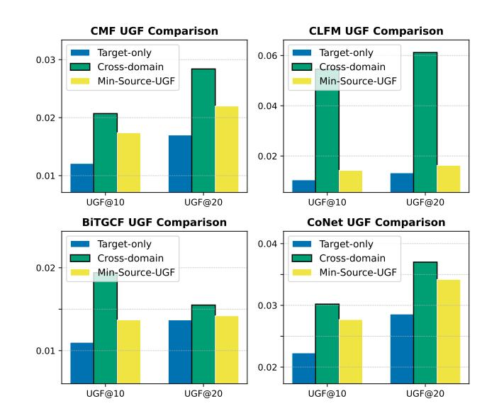
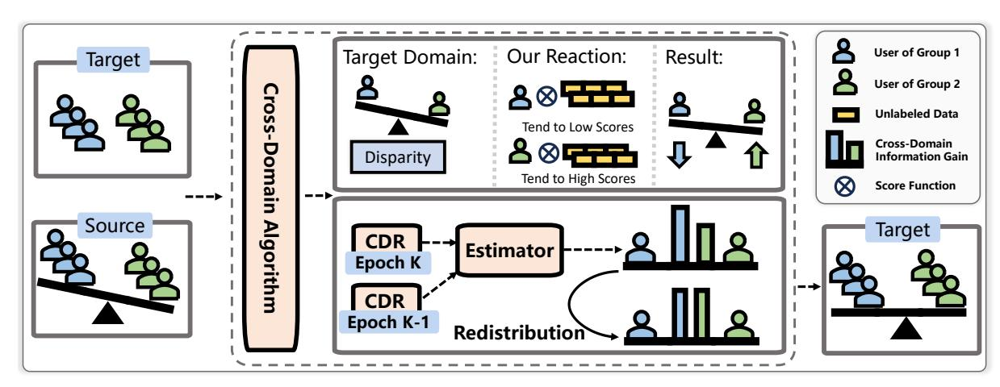
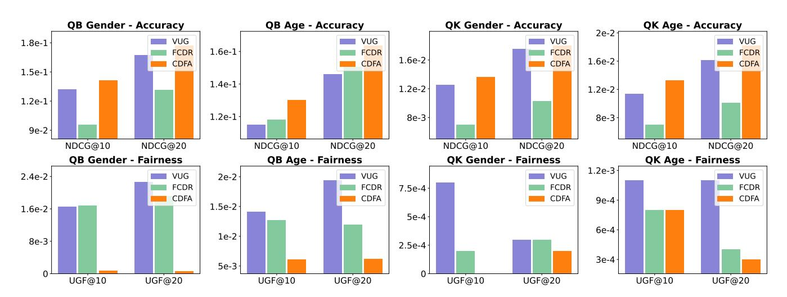
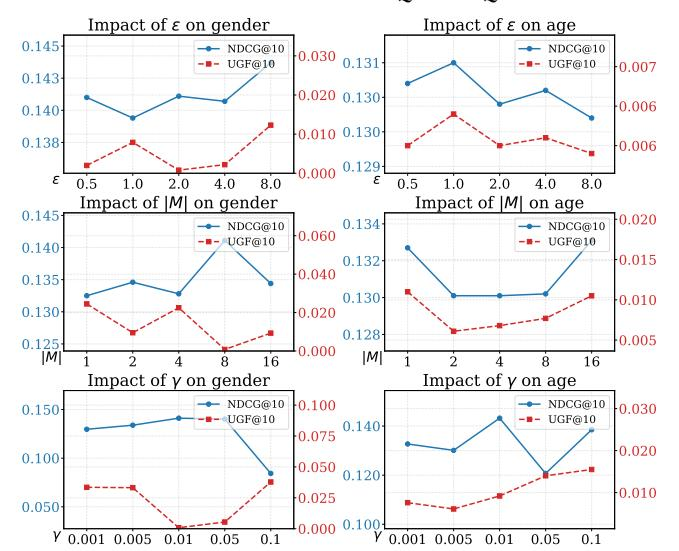

# The Double-Edged Sword of Knowledge Transfer: Diagnosing and Curing Fairness Pathologies in Cross-Domain Recommendation

Yuhan Zhao∗ Hong Kong Baptist University Hong Kong, China csyhzhao@comp.hkbu.edu.hk

Weixin Chen∗ Hong Kong Baptist University Hong Kong, China cswxchen@comp.hkbu.edu.hk

Li Chen Hong Kong Baptist University Hong Kong, China lichen@comp.hkbu.edu.hk

Weike Pan Shenzhen University Shenzhen, China panweike@szu.edu.cn

### Abstract

Cross-domain recommendation (CDR) offers an effective strategy for improving recommendation quality in a target domain by leveraging auxiliary signals from source domains. Nonetheless, emerging evidence shows that CDR can inadvertently heighten group-level unfairness. In this work, we conduct a comprehensive theoretical and empirical analysis to uncover why these fairness issues arise. Specifically, we identify two key challenges: (i) Cross-Domain Disparity Transfer, wherein existing group-level disparities in the source domain are systematically propagated to the target domain; and (ii) Unfairness from Cross-Domain Information Gain, where the benefits derived from cross-domain knowledge are unevenly allocated among distinct groups.

To address these two challenges, we propose a Cross-Domain Fairness Augmentation (CDFA) framework composed of two key components. Firstly, it mitigates cross-domain disparity transfer by adaptively integrating unlabeled data to equilibrate the informativeness of training signals across groups. Secondly, it redistributes cross-domain information gains via an information-theoretic approach to ensure equitable benefit allocation across groups. Extensive experiments on multiple datasets and baselines demonstrate that our framework significantly reduces unfairness in CDR without sacrificing overall recommendation performance, while even enhancing it. Our source code is publicly available at [https:](https://github.com/weixinchen98/CDFA) [//github.com/weixinchen98/CDFA.](https://github.com/weixinchen98/CDFA)

### CCS Concepts

- Information systems → Recommender systems;

# Keywords

Fairness, Cross-domain recommendation

### ACM Reference Format:

Yuhan Zhao, Weixin Chen, Li Chen, and Weike Pan. 2026. The Double-Edged Sword of Knowledge Transfer: Diagnosing and Curing Fairness Pathologies

∗Equal contributions.

© 2026 Copyright held by the owner/author(s). ACM ISBN 979-8-4007-2307-0/2026/04 <https://doi.org/10.1145/3774904.3792703>

in Cross-Domain Recommendation. In Proceedings of the ACM Web Conference 2026 (WWW '26), April 13–17, 2026, Dubai, United Arab Emirates. ACM, New York, NY, USA, [11](#page-10-0) pages.<https://doi.org/10.1145/3774904.3792703>

# 1 Introduction

Cross-domain recommendation (CDR) has emerged as a promising paradigm for enhancing recommendation quality in a target domain by leveraging auxiliary information from source domains [\[20,](#page-8-0) [32,](#page-8-1) [38,](#page-8-2) [46\]](#page-8-3). Despite its proven effectiveness, recent studies have highlighted notable fairness concerns, particularly in the form of exacerbated performance disparities among user groups defined by sensitive attributes [\[5,](#page-8-4) [7,](#page-8-5) [26,](#page-8-6) [31\]](#page-8-7). Consequently, an increasing body of work has begun devising fairness-aware CDR strategies aimed at mitigating these group-level inequities. For instance, Tang et al. [\[26\]](#page-8-6) were the first to identify that certain sensitive attributes can lead to biased outcomes in CDR settings. Likewise, VUG [\[7\]](#page-8-5) showed that users overlapping between domains tend to receive the bulk of advantages, while non-overlapping users gain little or even suffer deteriorated performance.

However, as a relatively nascent research area, current work addresses fairness issues without thoroughly probing the underlying mechanisms and distinctive characteristics of fairness in the CDR process. This gap leaves a fundamental question unanswered: How do fairness issues arise in CDR?

To answer this question, we conduct systematic theoretical analyses and empirical studies. Our findings indicate that, under certain domains and data distributions, CDR does not necessarily exacerbate fairness issues and can even mitigate them. However, such favorable outcomes hinge on highly restricted conditions. In general, CDR presents fairness challenges distinct from those found in single-domain scenarios for two principal reasons, both stemming from its core mechanism of cross-domain information transmission:

- Cross-Domain Disparity Transfer. CDR systems can inadvertently propagate pre-existing group disparities from the source to the target domain. For instance, if the source domain exhibits a pronounced performance gap favoring one demographic group over another, the transfer process may systematically inherit and reinforce these biases in the target domain.
- Unfairness from Cross-Domain Information Gain. The transfer and fusion of information across domains can yield additional insights, but these benefits are not uniformly distributed across all groups. For instance, rural users may have limited exposure to

[This work is licensed under a Creative Commons Attribution 4.0 International License.](https://creativecommons.org/licenses/by/4.0) WWW '26, Dubai, United Arab Emirates

### 4.1 Experimental Setup

Datasets We conduct experiments on two datasets: (i) QB [\[36\]](#page-8-27): Collected from the QQ Browser platform, this dataset includes user interactions from both the Video and Article domains. (ii) QK [\[36\]](#page-8-27): Sourced from the QQ Kan platform, this dataset also covers both Video and Article recommendation scenarios.

Baselines. As our approach is model-agnostic, we validate its effectiveness by integrating CDFA into the following representative CDR methods: CMF [\[24\]](#page-8-28), CLFM [\[10\]](#page-8-29), BiTGCF [\[19\]](#page-8-30), CoNet [\[13\]](#page-8-31), and DTCDR [\[45\]](#page-8-32). Furthermore, we conduct comparisons between CDFA and several representative fairness-aware CDR methods: FairCDR [\[26\]](#page-8-6) and VUG [\[7\]](#page-8-5).

To ensure reproducibility, our experiments are conducted based on the RecBole CDR framework [\[41\]](#page-8-33). Due to space constraints, detailed experimental setups—including dataset statistics, implementation, and descriptions of baselines—are provided in Appendix [C.](#page-9-3)

### 4.2 Overall Performance Comparison

We report the overall performance results in Table [1.](#page-6-0) All reported improvements represent average gains across all evaluation metrics, and all improvements are statistically significant (�� &lt; 0.05) compared to the best-performing baseline(s), as assessed by a two-sided t-test. Key observations include:

- Significant Improvement in Fairness: With the integration of CDFA, all base models exhibit notable improvements in UGFrelated metrics. For example, CMF achieves a performance increase of up to 98.97% on QB. These results demonstrate CDFA's effectiveness in mitigating group unfairness by addressing the two key challenges we identified.
- Preserved or Improved Accuracy: Notably, while CDFA substantially enhances fairness, it also improves accuracy in most scenarios. In rare cases where a decrease occurs, the maximum decline is just 3.04%, which is a negligible compromise. We attribute this to our method's two-part design: the augmentation of information via unlabeled data and the redistribution of information gains. This increases the total information utilized without diminishing any CDR information, thus achieving a balance between fairness and accuracy. Such a property makes CDFA suitable and attractive for real-world industrial applications.
- SOTA Methods and Fairness Trade-off: Interestingly, even state-of-the-art methods underperform on fairness-related metrics, sometimes even lagging behind traditional approaches such as BiTGCF and CLFM. This finding underscores the risk of disregarding fairness during model design: improvements in accuracy may come at the expense of fairness, thereby potentially harming user experience and satisfaction.

### 4.3 Performance Comparison with Other Fairness-aware CDR Methods

As illustrated on Figure [3,](#page-7-0) CDFA consistently outperforms other fairness-aware CDR methods in both accuracy and fairness metrics. Importantly, CDFA does not incur any loss in accuracy. This advantage can be attributed to two main factors: (i) Unlike previous approaches that focus solely on mitigating unfairness, CDFA is designed with a thorough understanding of how fairness is generated and amplified within the CDR context. This principled approach

enables CDFA to more effectively address fairness challenges inherent to CDR. (ii) CDFA has no lost information. The first module leverages CDR to mine informative signals from unlabeled data, thereby introducing additional information. This design facilitates a strong balance between accuracy and fairness.

### 4.4 Ablation Study

We analyze the effectiveness of different components via the following variants: (i) CDFA without ���� (w/o ����), (ii) CDFA without sampling (w/o FS, using random sampling), (iii) CDFA without redistribution loss (w/o L������������ ), where L������������ = ∥Δ˜ �� ��1 ���� − Δ˜ �� ��2 ���� ∥ , and (iv) CDFA without estimator loss (w/o L������ ), where L������ = ∥Estimator(u ��−1 , u ��−1 )−u �� . The results are presented in Table [2.](#page-7-1) They indicate that all components make positive contributions to model fairness, which is expected given that each module in CDFA is explicitly designed to enhance fairness. In terms of accuracy, we observe some performance fluctuations when CDFA is applied without L������. This can be explained by the fact that, during this phase, estimated cross-domain information gain must be redistributed. Since estimation may not be perfectly precise, the redistribution may be suboptimal, resulting in occasional deviations in accuracy.

### 4.5 Hyperparameter Sensitivity Analysis

The three most critical hyperparameters in CDFA are: the size of ��, which denotes the candidate set size during negative sampling (i.e., a larger �� means more unlabeled data considered); ��, which regulates the strength of negative sampling, with higher values favoring harder negative instances; and ��, which determines the extent of gain redistribution, with a larger value yielding a more equitable distribution of gains across groups. The experimental results are shown in Figure [4.](#page-7-2) Three key observations emerge: (i) Within reasonable ranges, all hyperparameters allow CDFA to maintain robust accuracy and fairness, indicating relative stability. (ii) With ��, fairness performance remains consistent, while accuracy exhibits noticeable fluctuations. This is understandable, as increasing �� risks introducing more false negatives into the candidate set, potentially distorting user preference learning. Although fairness is largely preserved, the accuracy may suffer due to incorrect user modeling. (iii) The influence of �� on performance is more pronounced, with accuracy and fairness displaying a degree of mutual exclusivity. This aligns with intuition, as �� mediates the trade-off between fairness-related and accuracy-related loss components. When �� is high, the model prioritizes fairness optimization and may neglect accuracy, while lower values may result in diminished fairness improvements.

### 5 Related Work

# 5.1 Cross-Domain Recommendation

Cross-domain recommendation (CDR) aims to leverage information from a source domain to improve the accuracy of recommendations in a target domain. For example, CMF [\[24\]](#page-8-28) was among the first to jointly factorize multiple rating matrices by sharing latent parameters across domains. PPCDR [\[27\]](#page-8-34) adopts a federated graph learning approach to capture user preferences to ensure privacy. GDCCDR [\[18\]](#page-8-35) achieves personalized transfer through meta-networks and contrastive learning. PCDR [\[11\]](#page-8-36) utilizes users'

Table 1: Experimental results of different CDR models with (w/) or without (w/o) our CDFA. The best results are highlighted in bold, and all improvements over the best-performing baseline(s) are statistically significant (�� &lt; 0.05).

| Datasets  | Metric          | w/o    | CMF w/  | w/o    | CLFM w/  | w/o    | BiTGCF w/ | w/o    | CoNet w/ | w/o    | DTCDR w/ |
|-----------|-----------------|--------|---------|--------|----------|--------|-----------|--------|----------|--------|----------|
| QB gender |                 |        |         |        |          |        |           |        |          |        |          |
|           | Recall@10       | 0.2461 | 0.2715  | 0.2049 | 0.2825   | 0.2677 | 0.2754    | 0.2266 | 0.2381   | 0.2138 | 0.2324   |
|           | Recall@20       | 0.3767 | 0.4139  | 0.3070 | 0.4223   | 0.4062 | 0.4138    | 0.3596 | 0.3801   | 0.3174 | 0.3636   |
|           | NDCG@10         | 0.1241 | 0.1411  | 0.1023 | 0.1464   | 0.1398 | 0.1430    | 0.1133 | 0.1195   | 0.1084 | 0.1167   |
|           | NDCG@20         | 0.1571 | 0.1771  | 0.1281 | 0.1817   | 0.1748 | 0.1779    | 0.1468 | 0.1551   | 0.1347 | 0.1498   |
|           | Acc. Impr.      |        | +11.66% |        | +40.09%  |        | +2.20%    |        | +5.48%   |        | +10.53%  |
|           | UGF (Recall@10) | 0.0381 | 0.0008  | 0.1111 | 0.0015   | 0.0364 | 0.0133    | 0.0513 | 0.0005   | 0.0946 | 0.0388   |
|           | UGF (Recall@20) | 0.0689 | 0.0006  | 0.1365 | 0.0131   | 0.0219 | 0.0133    | 0.0773 | 0.0013   | 0.1312 | 0.0440   |
|           | UGF (NDCG@10)   | 0.0207 | 0.0008  | 0.0546 | 0.0016   | 0.0194 | 0.0025    | 0.0302 | 0.0002   | 0.0541 | 0.0220   |
|           | UGF (NDCG@20)   | 0.0284 | 0.0006  | 0.0612 | 0.0020   | 0.0155 | 0.0023    | 0.0370 | 0.0003   | 0.0636 | 0.0234   |
|           | Fair. Impr.     |        | +97.76% |        | +95.71%  |        | +68.75%   |        | +98.97%  |        | +62.00%  |
| QB age    |                 |        |         |        |          |        |           |        |          |        |          |
|           | Recall@10       | 0.2461 | 0.2511  | 0.2049 | 0.2514   | 0.2677 | 0.2736    | 0.2266 | 0.2276   | 0.2138 | 0.2112   |
|           | Recall@20       | 0.3767 | 0.3842  | 0.3070 | 0.3877   | 0.4062 | 0.4100    | 0.3596 | 0.3628   | 0.3174 | 0.3213   |
|           | NDCG@10         | 0.1241 | 0.1301  | 0.1023 | 0.1284   | 0.1398 | 0.1422    | 0.1133 | 0.1138   | 0.1084 | 0.1083   |
|           | NDCG@20         | 0.1571 | 0.1636  | 0.1281 | 0.1627   | 0.1748 | 0.1766    | 0.1468 | 0.1479   | 0.1347 | 0.1361   |
|           | Acc. Impr.      |        | +3.25%  |        | +25.38%  |        | +1.47%    |        | +0.63%   |        | +0.24%   |
|           | UGF (Recall@10) | 0.0196 | 0.0166  | 0.0195 | 0.0061   | 0.0184 | 0.0057    | 0.0168 | 0.0007   | 0.0129 | 0.0089   |
|           | UGF (Recall@20) | 0.0245 | 0.0160  | 0.0357 | 0.0126   | 0.0315 | 0.0145    | 0.0205 | 0.0122   | 0.0255 | 0.0112   |
|           | UGF (NDCG@10)   | 0.0084 | 0.0061  | 0.0078 | 0.0018   | 0.0129 | 0.0020    | 0.0078 | 0.0029   | 0.0109 | 0.0081   |
|           | UGF (NDCG@20)   | 0.0096 | 0.0062  | 0.0120 | 0.0036   | 0.0164 | 0.0041    | 0.0086 | 0.0059   | 0.0140 | 0.0093   |
|           | Fair. Impr.     |        | +28.20% |        | +70.09%  |        | +70.62%   |        | +57.63%  |        | +36.59%  |
| QK gender |                 |        |         |        |          |        |           |        |          |        |          |
|           | Recall@10       | 0.0210 | 0.0260  | 0.0132 | 0.0277   | 0.0264 | 0.0260    | 0.0129 | 0.0128   | 0.0148 | 0.0145   |
|           | Recall@20       | 0.0384 | 0.0430  | 0.0231 | 0.0430   | 0.0418 | 0.0405    | 0.0237 | 0.0224   | 0.0259 | 0.0262   |
|           | NDCG@10         | 0.0106 | 0.0136  | 0.0067 | 0.0151   | 0.0139 | 0.0138    | 0.0064 | 0.0063   | 0.0071 | 0.0073   |
|           | NDCG@20         | 0.0151 | 0.0180  | 0.0093 | 0.0191   | 0.0180 | 0.0176    | 0.0092 | 0.0088   | 0.0100 | 0.0104   |
|           | Acc. Impr.      |        | +20.82% |        | +106.69% |        | -1.89%    |        | -3.04%   |        | +1.49%   |
|           | UGF (Recall@10) | 0.0014 | 0.0006  | 0.0019 | 0.0002   | 0.0016 | 0.0015    | 0.0013 | 0.0025   | 0.0048 | 0.0007   |
|           | UGF (Recall@20) | 0.0034 | 0.0016  | 0.0017 | 0.0005   | 0.0023 | 0.0037    | 0.0033 | 0.0028   | 0.0058 | 0.0003   |
|           | UGF (NDCG@10)   | 0.0009 | 0.0000  | 0.0004 | 0.0004   | 0.0015 | 0.0007    | 0.0010 | 0.0005   | 0.0023 | 0.0007   |
|           | UGF (NDCG@20)   | 0.0013 | 0.0002  | 0.0003 | 0.0003   | 0.0017 | 0.0001    | 0.0015 | 0.0006   | 0.0026 | 0.0005   |
|           | Fair. Impr.     |        | +73.67% |        | +40.02%  |        | +23.21%   |        | +8.21%   |        | +82.64%  |
| QK age    |                 |        |         |        |          |        |           |        |          |        |          |
|           | Recall@10       | 0.0210 | 0.0282  | 0.0132 | 0.0212   | 0.0264 | 0.0265    | 0.0129 | 0.0131   | 0.0148 | 0.0146   |
|           | Recall@20       | 0.0384 | 0.0455  | 0.0231 | 0.0372   | 0.0418 | 0.0397    | 0.0237 | 0.0238   | 0.0259 | 0.0260   |
|           | NDCG@10         | 0.0106 | 0.0147  | 0.0067 | 0.0110   | 0.0139 | 0.0146    | 0.0064 | 0.0065   | 0.0071 | 0.0071   |
|           | NDCG@20         | 0.0151 | 0.0192  | 0.0093 | 0.0152   | 0.0180 | 0.0181    | 0.0092 | 0.0092   | 0.0100 | 0.0101   |
|           | Acc. Impr.      |        | +29.65% |        | +62.32%  |        | +0.24%    |        | +0.88%   |        | +0.01%   |
|           | UGF (Recall@10) | 0.0018 | 0.0007  | 0.0015 | 0.0001   | 0.0017 | 0.0004    | 0.0025 | 0.0018   | 0.0030 | 0.0010   |
|           | UGF (Recall@20) | 0.0003 | 0.0003  | 0.0059 | 0.0001   | 0.0023 | 0.0024    | 0.0023 | 0.0021   | 0.0045 | 0.0013   |
|           | UGF (NDCG@10)   | 0.0014 | 0.0005  | 0.0010 | 0.0001   | 0.0014 | 0.0006    | 0.0008 | 0.0006   | 0.0014 | 0.0001   |
|           | UGF (NDCG@20)   | 0.0010 | 0.0003  | 0.0022 | 0.0000   | 0.0016 | 0.0001    | 0.0008 | 0.0007   | 0.0018 | 0.0002   |
|           | Fair. Impr.     |        | +48.85% |        | +95.41%  |        | +55.75%   |        | +18.55%  |        | +79.88%  |

interactions on local clients, employs gradient encryption, and harnesses natural language to establish bridges between domains. MACDR [\[30\]](#page-8-37) explores unsupervised utilization of non-overlapping users. MFGSLAE [\[28\]](#page-8-38) proposes a factor selection module with a bootstrapping mechanism to identify domain-specific preferences.

# 5.2 Fairness in Cross-Domain Recommendation

Although CDR has demonstrated substantial effectiveness, recent studies have brought to light notable fairness concerns—particularly the exacerbation of performance disparities among user groups defined by sensitive attributes. FairCDR [\[26\]](#page-8-6) identifies unfair treatment of cold-start users in the target domain and proposes a novel

Figure 3: Comparison of fairness-aware cross-domain recommendation baselines on the Tenrec QB and QK datasets.

Table 2: Ablation study of CDFA, integrated with CMF on the Tenrec QB dataset for gender fairness.

algorithm that models the individual influence of each sample on both fairness and accuracy, thereby facilitating data reweighting. VUG [\[7\]](#page-8-5) reveals a critical bias in CDR: while overlapping users benefit substantially from improved recommendation quality, nonoverlapping users gain minimally and may even experience performance degradation. To address this issue, they introduced a solution that generates virtual source-domain users for non-overlapping target-domain users to enhance the CDR process. FairnessCDR [\[31\]](#page-8-7) ensures fairness using adversarial learning and a mutual learningbased diffusion model.

### 6 Conclusion

In this work, through comprehensive theoretical analysis and empirical evaluation, we identify two fundamental mechanisms underlying fairness concerns in cross-domain recommendation (CDR): (i) cross-domain disparity transfer and (ii) unfairness arising from cross-domain information gain. To address these challenges, we propose the Cross-Domain Fairness Augmentation (CDFA) framework. CDFA first utilizes unlabeled data to balance the informativeness of

Figure 4: Impact of the hyperparameters on our CDFA on the Tenrec QB dataset.

training signals across user groups. It then adopts an informationtheoretic approach to redistribute cross-domain information gains, ensuring equitable benefit across diverse groups. Extensive experiments on multiple datasets and strong baselines demonstrate that CDFA substantially reduces unfairness in CDR, while maintaining or even improving overall recommendation performance. Our approach marks an important step toward making CDR systems fairer and more trustworthy for users. In the future, we also plan to investigate fairness issues in emerging agent-based recommendation paradigms [\[8,](#page-8-39) [33\]](#page-8-40).

# Acknowledgments

This work is supported by Hong Kong Baptist University Key Research Partnership Scheme (KRPS/23-24/02), NSFC/RGC Joint Research Scheme (N\_HKBU214/24), and National Natural Science Foundation of China (62461160311).

### References

- [1] Zhicheng An, Zhexu Gu, Li Yu, Ke Tu, Zhengwei Wu, Binbin Hu, Zhiqiang Zhang, Lihong Gu, and Jinjie Gu. 2024. DDCDR: A Disentangle-based Distillation Framework for Cross-Domain Recommendation. In KDD. 4764–4773. [2] Alex Beutel, Jilin Chen, Tulsee Doshi, Hai Qian, Li Wei, Yi Wu, Lukasz Heldt, Zhe Zhao, Lichan Hong, Ed H Chi, et al. 2019. Fairness in Recommendation Ranking through Pairwise Comparisons. In KDD. 2212–2220. [3] Sebastian Bruch, Masrour Zoghi, Michael Bendersky, and Marc Najork. 2019. Revisiting Approximate Metric Optimization in the Age of Deep Neural Networks. In SIGIR. 1241–1244. [4] Weixin Chen, Li Chen, Yongxin Ni, and Yuhan Zhao. 2025. Causality-Inspired Fair Representation Learning for Multimodal Recommendation. TOIS 43, 6, Article 153 (2025), 29 pages. [5] Weixin Chen, Li Chen, and Yuhan Zhao. 2025. Investigating User-side fairness in outcome and process for multi-type sensitive attributes in recommendations. TORS 4, 2, Article 25 (2025), 29 pages. [6] Weixin Chen, Li Chen, and Yuhan Zhao. 2026. Post-Training Fairness Control: A Single-Train Framework for Dynamic Fairness in Recommendation. In WWW Companion. [7] Weixin Chen, Yuhan Zhao, Li Chen, and Weike Pan. 2025. Leave No One Behind: Fairness-Aware Cross-Domain Recommender Systems for Non-Overlapping Users. In RecSys. 226–236. [8] Weixin Chen, Yuhan Zhao, Jingyuan Huang, Zihe Ye, Clark Mingxuan Ju, Tong Zhao, Neil Shah, Li Chen, and Yongfeng Zhang. 2026. MemRec: Collaborative Memory-Augmented Agentic Recommender System. arXiv preprint arXiv:2601.08816 (2026). [9] Jingtao Ding, Yuhan Quan, Quanming Yao, Yong Li, and Depeng Jin. 2020. Simplify and Robustify Negative Sampling for Implicit Collaborative Filtering. NeurIPS 33 (2020). [10] Sheng Gao, Hao Luo, Da Chen, Shantao Li, Patrick Gallinari, and Jun Guo. 2013. Cross-Domain Recommendation via Cluster-Level Latent Factor Model. In PKDD. 161–176. [11] Lei Guo, Ziang Lu, Junliang Yu, Quoc Viet Hung Nguyen, and Hongzhi Yin. 2024. Prompt-Enhanced Federated Content Representation Learning for Cross-Domain Recommendation. In WWW. 3139–3149. [12] Kaiming He, Xiangyu Zhang, Shaoqing Ren, and Jian Sun. 2016. Deep Residual learning for Image Recognition. In CVPR. 770–778. [13] Guangneng Hu, Yu Zhang, and Qiang Yang. 2018. CoNet: Collaborative Cross Networks for Cross-Domain Recommendation. In CIKM. 667–676. [14] Tinglin Huang, Yuxiao Dong, Ming Ding, Zhen Yang, Wenzheng Feng, Xinyu Wang, and Jie Tang. 2021. MixGCF: An Improved Training Method for Graph Neural Network-based Recommender Systems. In KDD. 665–674. [15] Diederik P. Kingma and Jimmy Ba. 2015. Adam: A Method for Stochastic Optimization. In ICLR. [16] Yunqi Li, Hanxiong Chen, Shuyuan Xu, Yingqiang Ge, and Yongfeng Zhang. 2021. Towards Personalized Fairness based on Causal Notion. In SIGIR. 1054–1063. [17] Xiaolin Lin, Weike Pan, and Zhong Ming. 2025. Towards Interest Drift-driven User Representation Learning in Sequential Recommendation. In SIGIR. 1541–1551. [18] Jing Liu, Lele Sun, Weizhi Nie, Peiguang Jing, and Yuting Su. 2024. Graph Disentangled Contrastive Learning with Personalized Transfer for Cross-Domain Recommendation. In AAAI, Vol. 38. 8769–8777. [19] Meng Liu, Jianjun Li, Guohui Li, and Peng Pan. 2020. Cross Domain Recommendation via Bi-Directional Transfer Graph Collaborative Filtering Networks. In CIKM. 885–894. [20] Weiming Liu, Chaochao Chen, Xinting Liao, Mengling Hu, Jiajie Su, Yanchao Tan, and Fan Wang. 2024. User Distribution Mapping Modelling with Collaborative Filtering for Cross Domain Recommendation. In WWW. 334–343. [21] Weiming Liu, Xiaolin Zheng, Mengling Hu, and Chaochao Chen. 2022. Collaborative Filtering with Attribution Alignment for Review-based Non-overlapped Cross Domain Recommendation. In WWW. 1181–1190. [22] Steffen Rendle, Christoph Freudenthaler, Zeno Gantner, and Schmidt-Thieme. 2009. BPR: Bayesian Personalized Ranking from Implicit Feedback. In UAI. 452–
- 461. [23] Wentao Shi, Jiawei Chen, Fuli Feng, Jizhi Zhang, Junkang Wu, Chongming Gao, and Xiangnan He. 2023. On the Theories behind Hard Negative Sampling for Recommendation. In WWW. 812–822. [24] Ajit P Singh and Geoffrey J Gordon. 2008. Relational Learning via Collective Matrix Factorization. In KDD. 650–658. [25] Ilya Sutskever, James Martens, George Dahl, and Geoffrey Hinton. 2013. On the Importance of Initialization and Momentum in Deep Learning. In ICML. 1139–1147. [26] Jiakai Tang, Xueyang Feng, and Xu Chen. 2024. Fairness-aware Cross-Domain Recommendation. In DASFAA. 293–302. [27] Changxin Tian, Yuexiang Xie, Xu Chen, Yaliang Li, and Xin Zhao. 2024. Privacy-Preserving Cross-domain Recommendation with Federated Graph Learning. TOIS 42, 5 (2024), 1–29. [28] Hao Wang, Mingjia Yin, Luankang Zhang, Sirui Zhao, and Enhong Chen. 2025. MF-GSLAE: A Multi-Factor User Representation Pre-Training Framework for Dual-Target Cross-Domain Recommendation. TOIS 43, 2 (2025). [29] Yifan Wang, Weizhi Ma, Min Zhang, Yiqun Liu, and Shaoping Ma. 2023. A Survey on the Fairness of Recommender Systems. TOIS 41, 3 (2023), 52:1–52:43. [30] Zihan Wang, Yonghui Yang, Le Wu, Richang Hong, and Meng Wang. 2025. Making Non-Overlapping Matters: An Unsupervised Alignment Enhanced Cross-Domain Cold-Start Recommendation. TKDE 37 (2025), 2001–2014. [31] Yongxuan Wu, Yang Liu, Xixun Lin, Hong Zhou, Yanan Cao, Lixin Zou, Yanmin Shang, and Yanbing Liu. 2025. FairCDR: Transferring Fairness and User Preferences for Cross-Domain Recommendation. In KDD. 3261–3272. [32] Ruobing Xie, Qi Liu, Liangdong Wang, Shukai Liu, Bo Zhang, and Leyu Lin. 2022. Contrastive Cross-Domain Recommendation in Matching. In KDD. 4226–4236. [33] Wujiang Xu, Yunxiao Shi, Zujie Liang, Xuying Ning, Kai Mei, Kun Wang, Xi Zhu, Min Xu, and Yongfeng Zhang. 2025. iAgent: LLM Agent as a Shield between User and Recommender Systems. In Findings of ACL. 18056–18084. [34] Zitao Xu, Xiaoqing Chen, Weike Pan, and Zhong Ming. 2025. Heterogeneous Graph Transfer Learning for Category-aware Cross-Domain Sequential Recommendation. In WWW. 1951–1962. [35] Hyunsik Yoo, Zhichen Zeng, Jian Kang, Ruizhong Qiu, David Zhou, Zhining Liu, Fei Wang, Charlie Xu, Eunice Chan, and Hanghang Tong. 2024. Ensuring User-side Fairness in Dynamic Recommender Systems. In WWW. 3667–3678. [36] Guanghu Yuan, Fajie Yuan, Yudong Li, Beibei Kong, Shujie Li, Lei Chen, Min Yang, Chenyun Yu, Bo Hu, Zang Li, et al. 2022. Tenrec: A Large-Scale Multipurpose Benchmark Dataset for Recommender Systems. NeurIPS 35 (2022), 11480–11493. [37] Tianzi Zang, Yanmin Zhu, Haobing Liu, Ruohan Zhang, and Jiadi Yu. 2023. A Survey on Cross-domain Recommendation: Taxonomies, Methods, and Future Directions. TOIS 41, 2 (2023), 42:1–42:39. [38] Ruohan Zhang, Tianzi Zang, Yanmin Zhu, Chunyang Wang, Ke Wang, and Jiadi Yu. 2023. Disentangled Contrastive Learning for Cross-Domain Recommendation. In DASFAA. Springer, 163–178. [39] Weinan Zhang, Tianqi Chen, Jun Wang, and Yong Yu. 2013. Optimizing Top-N Collaborative Filtering via Dynamic Negative Item Sampling. In SIGIR. 785–788. [40] Wayne Xin Zhao, Yupeng Hou, Xingyu Pan, Chen Yang, Zeyu Zhang, Zihan Lin, Jingsen Zhang, Shuqing Bian, Jiakai Tang, Wenqi Sun, et al. 2022. RecBole 2.0: Towards a More Up-to-Date Recommendation Library. In CIKM. 4722–4726. [41] Wayne Xin Zhao, Shanlei Mu, Yupeng Hou, Zihan Lin, Yushuo Chen, Xingyu Pan, Kaiyuan Li, Yujie Lu, Hui Wang, Changxin Tian, et al. 2021. Recbole: Towards a Unified, Comprehensive and Efficient Framework for Recommendation Algorithms. In CIKM. 4653–4664. [42] Yuhan Zhao, Rui Chen, Li Chen, Shuang Zhang, Qilong Han, and Hongtao Song. 2025. From Pairwise to Ranking: Climbing the Ladder to Ideal Collaborative Filtering with Pseudo-Ranking. In AAAI. Article 1489, 9 pages. [43] Yuhan Zhao, Rui Chen, Qilong Han, Hongtao Song, and Li Chen. 2024. Unlocking the Hidden Treasures: Enhancing Recommendations with Unlabeled Data. In RecSys. 247–256. [44] Yuhan Zhao, Rui Chen, Riwei Lai, Qilong Han, Hongtao Song, and Li Chen. 2023. Augmented Negative Sampling for Collaborative Filtering. In RecSys. 256–266. [45] Feng Zhu, Chaochao Chen, Yan Wang, Guanfeng Liu, and Xiaolin Zheng. 2019. Dtcdr: A Framework for Dual-Target Cross-Domain Recommendation. In CIKM. 1533–1542. [46] Feng Zhu, Yan Wang, Chaochao Chen, Jun Zhou, Longfei Li, and Guanfeng Liu. 2021. Cross-Domain Recommendation: Challenges, Progress, and Prospects. arXiv preprint arXiv:2103.01696 (2021). [47] Qiannan Zhu, Haobo Zhang, Qing He, and Zhicheng Dou. 2022. A Gain-Tuning Dynamic Negative Sampler for Recommendation. In WWW. 277–285.

Table 3: Statistics of the cross-domain recommendation datasets used in our experiments, with their available sensitive attributes.

| Dataset QB | Domain Video | #Users 8,682 | #Items 65,216 | #Inter. 539,193 | Attr. gender, |
|------------|--------------|--------------|---------------|-----------------|---------------|
|            | Article      | 21,639       | 1,859         | 93,832          | age           |
| QK         | Video        | 643,446      | 126,555       | 10,579,159      | gender,       |
|            | Article      | 31,544       | 14,285        | 476,678         | age           |

- Tenrec QK [\[36\]](#page-8-27): Sourced from the QQ Kan (QK) platform, this dataset also covers both Video and Article recommendation scenarios, and provides detailed demographic attributes.

It should be noted that fairness-aware CDR methods require datasets containing both cross-domain user behaviors and sensitive attributes (e.g., gender and age), which limits the number of suitable datasets available. Table [3](#page-10-1) summarizes the statistics of the datasets. Following [\[26\]](#page-8-6), for both datasets, we use the video domain as the source and the article domain as the target, since the video domain has more data.

# C.2 Baseline

As our approach is model-agnostic, we validate its effectiveness by integrating CDFA into the following representative CDR methods and comparing performance before and after applying CDFA:

- CMF [\[24\]](#page-8-28) unifies the factorization of multiple rating matrices by sharing latent factors for entities that appear in more than one domain.
- CLFM [\[10\]](#page-8-29) utilizes a cluster-level latent factor scheme to capture both common cross-domain signals and domain-specific nuances.
- BiTGCF [\[19\]](#page-8-30) exploits a graph-based collaborative filtering framework to model higher-order relations, with overlapping users serving as bridges for information flow across domains.
- CoNet [\[13\]](#page-8-31) employs neural cross-connections to transfer knowledge effectively between domains.

- DTCDR [\[45\]](#page-8-32) adopts a dual-target strategy, fusing rating and content information via multi-task learning to enhance both domains concurrently.

Furthermore, we conduct comparisons between CDFA and several representative fairness-aware CDR methods:

- FairCDR [\[26\]](#page-8-6) quantifies the instance-level influence on both utility and fairness, and adaptively reweights training examples accordingly. This approach enables cross-domain knowledge transfer that alleviates distributional biases in sparse data and reduces group disparities.
- VUG [\[7\]](#page-8-5) synthesizes virtual users in the source domain, allowing all target-domain users to benefit from cross-domain transfer, thereby promoting fairness through disparity reduction.

### C.3 Implementation Details

All experiments are conducted in PyTorch on a single NVIDIA Tesla V100 (32GB) GPU. To ensure reproducibility, we build upon the RecBole CDR framework [\[41\]](#page-8-33), adopting its standard preprocessing pipelines, dataset splits, and evaluation protocols [\[40,](#page-8-43) [41\]](#page-8-33). Specifically, we employ an 8:2 train/validation split for the source domain and an 8:1:1 train/validation/test split for the target domain, with splits maintained on a per-user basis. For optimization, we use the Adam optimizer [\[15\]](#page-8-44) with a default learning rate of 0.001 and a minibatch size of 2048. The ��2 regularization coefficient is set to 10−4 The Estimator(·, ·) component is implemented as a three-layer MLP with hidden layers of sizes 128, 64, and 64, respectively, employing ReLU activation and a dropout rate of 0.2. We tune the �� and �� over the range [0, 1], and vary the size of the unlabeled data candidate set |��| from 1 to 16. As the momentum coefficient �� is not central to our method design, we fix its value at 0.9 in all experiments, following standard practice in momentum-based optimization and exponential moving average smoothing [\[12,](#page-8-45) [25\]](#page-8-46). For other baseline hyperparameters, we adopt the adjustment ranges specified in the respective original papers. All hyperparameters are tuned via grid search on the validation sets, and we report the best performance achieved for each baseline.