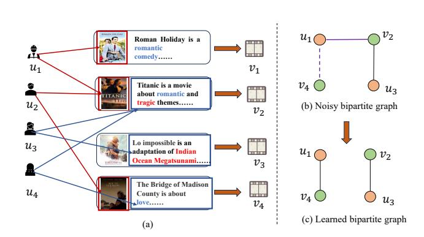
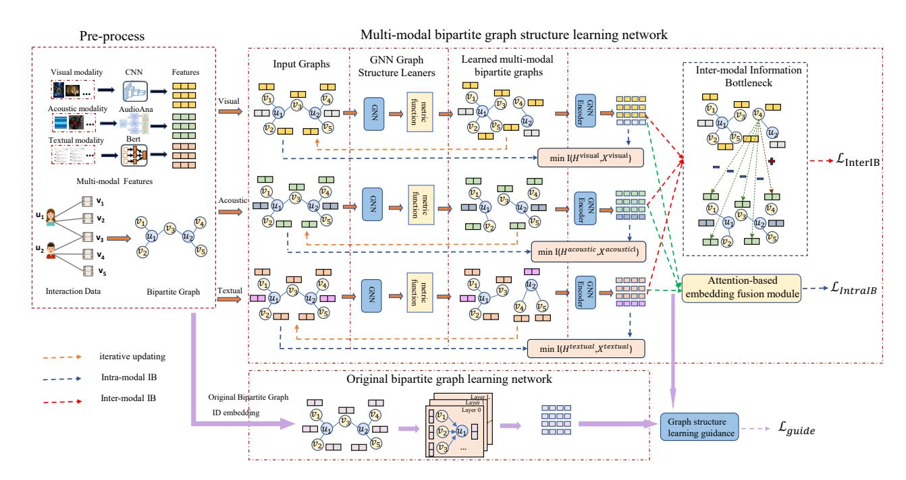
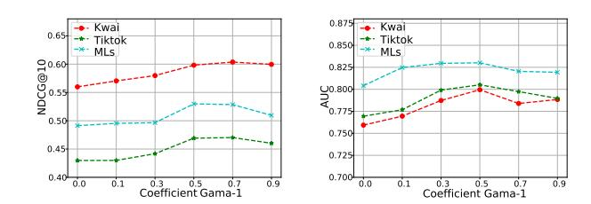
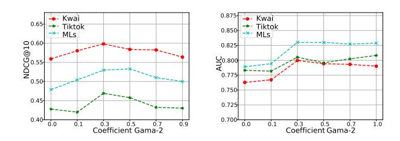
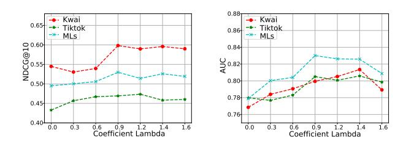
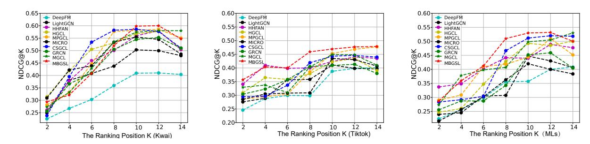
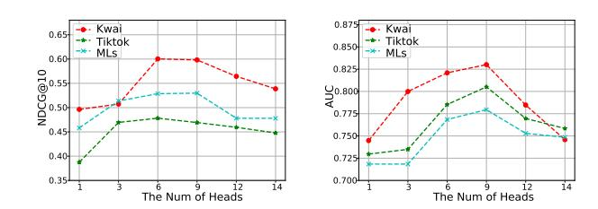

# Multi-modal Bipartite Graph Structure Learning with Information Bottleneck for Micro-video Recommendation

Ying He Tianjin University of Technology Tianjin, China heyingcs@email.tjut.edu.cn

Desheng Cai∗ Tianjin University of Technology Tianjin, China caidsml@gmail.com

Shengsheng Qian Institute of Automation, Chinese Academy of Sciences Beijing, China shengsheng.qian@nlpr.ia.ac.cn

Quan Fang School of Artificial Intelligence, Beijing University of Posts and Telecommunications Beijing, China qfang@bupt.edu.cn

Yinwei Wei Shandong University Jinan, China weiyinwei@hotmail.com

Changsheng Xu Institute of Automation, Chinese Academy of Sciences Beijing, China csxu@nlpr.ia.ac.cn

# Abstract

Graph-based recommender systems have become prevalent in microvideo recommendation by modeling user-item interactions as a bipartite graph. However, these methods face two inherent limitations: (1) their reliance on a fixed, pre-defined graph structure makes them susceptible to noisy interactions, and (2) the multimodal representations they learn often contain redundant information that is not discriminative enough for the recommendation task. To overcome these issues, we propose a novel Multi-modal Bipartite Graph Structure Learning network (MBGSL), which leverages the information bottleneck principle for robust micro-video recommendation. Specifically, MBGSL first learns adaptive graph structures from multi-modal content (e.g., visual, acoustic, textual) through dedicated graph learners to mitigate noise. Then, it applies an intra-modality information bottleneck to learn minimal sufficient representations within each modality and an intermodality information bottleneck to capture distinctive information across modalities, thereby eliminating redundancy. Furthermore, the model incorporates collaborative signals through a contrastive learning objective to guide the graph structure learning process. Extensive experiments on three real-world datasets demonstrate that MBGSL achieves state-of-the-art performance, significantly surpassing existing baselines.

# CCS Concepts

• Information systems → Recommender systems.

# Keywords

Multi-modal Contents; Graph-based Micro-video Recommendation; Graph Structure Learning; Information Bottleneck

∗Corresponding author

[This work is licensed under a Creative Commons Attribution 4.0 International License.](https://creativecommons.org/licenses/by/4.0) WWW '26, Dubai, United Arab Emirates © 2026 Copyright held by the owner/author(s). ACM ISBN 979-8-4007-2307-0/2026/04 <https://doi.org/10.1145/3774904.3792708>

### ACM Reference Format:

Ying He, Desheng Cai, Shengsheng Qian, Quan Fang, Yinwei Wei, and Changsheng Xu. 2026. Multi-modal Bipartite Graph Structure Learning with Information Bottleneck for Micro-video Recommendation. In Proceedings of the ACM Web Conference 2026 (WWW '26), April 13–17, 2026, Dubai, United Arab Emirates. ACM, New York, NY, USA, [11](#page-10-0) pages. [https://doi.org/10.1145/](https://doi.org/10.1145/3774904.3792708) [3774904.3792708](https://doi.org/10.1145/3774904.3792708)

# 1 Introduction

Personalized micro-video recommendation has become a crucial tool in many online micro-video sharing platforms because of the explosive growth of micro-videos. Recently, Graph neural networks (GNNs), such as GCN [\[19\]](#page-8-0), GraphSAGE [\[11\]](#page-8-1), and HetGNN [\[45\]](#page-8-2), have been widely studied for personalized recommendation. Benefiting from the message-passing scheme over user-item interaction graphs, follow-on methods like PinSAGE [\[43\]](#page-8-3) and LightGCN [\[12\]](#page-8-4) have shown promising performance in graph-based collaborative filtering. Subsequent efforts, such as MMGCN [\[36\]](#page-8-5), MICRO [\[49\]](#page-8-6), and LGMRec [\[10\]](#page-8-7), have further integrated multi-modal features to enrich representations. Despite the promising performance of these GNN-based methods, they still face the following limitations.

Sensitivity to Noisy Interactions. Existing GNN-based recommenders typically rely on a fixed, predefined user-item graph for representation learning. This assumption of structural reliability is often violated in practice, as real-world bipartite graphs are inherently noisy (e.g., users may misclick uninterested micro-videos) and incomplete (e.g., some interested micro-videos have not been recommended to users). Consequently, aggregating information directly over this raw graph structure can propagate and amplify noise, ultimately degrading recommendation performance. The key insight is that user preferences are more consistently reflected in the multi-modal content of the items they interact with. As illustrated in Figure 1(a), users may interact with items due to affinities in specific modalities (e.g., for their visual appeal), and an individual user's preference may even vary across modalities for the same item. For example, user ��1 interacts with micro-videos ��1 and ��2 due to an attraction to their romantic visual content. In contrast, user ��3 interacts with ��2 and ��3 because of an interest in their tragic textual descriptions. A standard graph-based model, relying on the

Figure 1: (a) shows the interaction data between users and micro-videos. The red arrow represents the user's interest in the visual modality and the blue arrow represents the user's interest in the textual modality of micro-videos. (b) is a noisy bipartite graph where the purple dashed line represents an incomplete edge and the purple solid line is a noisy edge. (c) is the real bipartite graph based on modality-aware user and micro-video similarity.

observed interaction graph, might detect the shared click on ��2 between ��1 and ��3 and consequently recommend ��3 to ��1. However, this recommendation is mistaken since the underlying multi-modal content reveals that ��1's true preference aligns more closely with consistent romantic themes instead of tragic themes, suggesting that a recommendation of ��4 would be more appropriate. Therefore, a fundamental limitation of existing methods is their inability to leverage multi-modal semantics to dynamically learn clean, taskspecific bipartite graph structures that truly reflect user preferences. (as conceptualized in Figures 1(b) and 1(c)).

Redundancy in Multi-modal Representations. Addressing the first limitation also hinges on learning high-quality, compact representations. While integrating multi-modal content can enhance representations, existing methods often indiscriminately inject all available information, leading to redundant representations that diminish discriminative power. For example, GRCN [\[35\]](#page-8-8) utilizes multi-modal contents to construct modal-specific bipartite graphs and refines the structure of each bipartite graph by the attention mechanism. However, the generated multi-model embeddings are possibly redundant. Although recent efforts like MGGL [\[23\]](#page-8-9) use cleaner signals to guide learning and partially filter out task-irrelevant information, their relatively simple contrastive learning frameworks struggle to yield sufficiently discriminative representations for accurate recommendation. Ideally, representations should be maximally informative for the recommendation task while being minimally redundant—an objective aligned with the information bottleneck (IB) principle. The IB principle aims to learn representations that compress input data by preserving only minimal yet sufficient information for predicting the target. Although applied in other domains, the exploration of IB for graphbased recommendation remains limited. Thus, the second limitation of current approaches is their lack of a principled mechanism to effectively learn discriminative and non-redundant representations for micro-video recommendation.

To address these limitations, we propose a novel Multi-modal Bipartite Graph Structure Learning network (MBGSL), which integrates the information bottleneck principle for robust micro-video recommendation. The framework is designed as follows: To tackle the noise sensitivity (Limitation one), we first construct distinct modal views and employ dedicated graph structure learners. These learners dynamically infer clean, modality-aware bipartite graph structures by measuring the representation similarity between users and micro-videos within each modality, effectively filtering out noisy interactions. To resolve the representation redundancy (Limitation two), we introduce a dual information bottleneck constraint. The intra-modality IB constraint compresses the information flow within each modality by minimizing the mutual information between the original noisy graph and the newly learned graph, while simultaneously maximizing the mutual information between the fused multi-modal representations and the recommendation target. This ensures the learned representations are minimal yet sufficient for the task. Complementarily, the inter-modality IB constraint minimizes the mutual information between different modal views, forcing the model to capture unique, non-redundant information from each modality and enhancing the distinctiveness of the final representations. Furthermore, we guide the structure learning with the original collaborative signals by employing a contrastive learning objective. This regularization prevents the model from generating over-sanitized graphs that diverge from real user interactions, ensuring the denoised graphs are both clean and behaviorally realistic.

The main contributions of this paper are summarized as follows:

- We propose a novel Multi-modal Bipartite Graph Structure Learning (MBGSL) network for micro-video recommendation. Our model dynamically learns clean, modality-specific bipartite graph structures to capture genuine user preferences, effectively mitigating the impact of noisy interactions.
- To learn compact and highly discriminative representations, we introduce a novel dual-constrained information bottleneck framework. This includes an intra-modality constraint to compress redundant information within each modality, and an inter-modality constraint to capture distinctive information across modalities.
- We conduct extensive experiments on three real-world datasets. The experimental results demonstrate that the proposed method achieves significant improvements on 15 state-ofthe-art methods.

# 2 Related Work

# 2.1 GNN Based Recommendation

Graph neural networks (GNNs) have achieved promising performance in recommendation systems due to their powerful capability of representation learning. Early approaches like NGCF [\[31\]](#page-8-10) and PinSAGE [\[30\]](#page-8-11) demonstrate the power of leveraging high-order neighbor information through GNNs. Subsequent efforts such as LightGCN [\[12\]](#page-8-4) and UltraGCN [\[25\]](#page-8-12) further improve the efficiency and scalability of GNN by simplifying the propagation mechanism. To learn more comprehensive representations, recent research integrates multi-modal features into collaborative filtering

signals [\[3,](#page-8-13) [4,](#page-8-14) [10,](#page-8-7) [15,](#page-8-15) [20,](#page-8-16) [36,](#page-8-5) [39\]](#page-8-17). For example, MMGCN [\[36\]](#page-8-5) constructs separate graphs for each modality to learn user preferences. LGMRec [\[10\]](#page-8-7) further models local and global user dependencies for comprehensive representation learning. Although these methods have made progress, they often overlook the inherent noise in multi-modal features. To mitigate the noise issue, several recent works have introduced self-supervised learning (SSL) techniques, such as HGCL [\[2\]](#page-8-18), MPGCL [\[14\]](#page-8-19), and MGCL [\[23\]](#page-8-9).

### 2.2 Graph Structure Learning

Although GNN-based recommenders excel at modeling user-item interaction graphs, their performance is highly sensitive to noisy interactions within the original graph structure. To address this, Graph Structure Learning (GSL) [\[21,](#page-8-20) [33,](#page-8-21) [48,](#page-8-22) [50\]](#page-8-23) has emerged as a promising direction, aiming to learn a refined, optimal graph topology. Existing GSL methods can be broadly categorized into two lines: those that reweight edges [\[35\]](#page-8-8) and those that jointly learn the graph structure and GNN parameters [\[5,](#page-8-24) [7,](#page-8-25) [16,](#page-8-26) [34,](#page-8-27) [40,](#page-8-28) [41\]](#page-8-29).

However, a key limitation of these general GSL methods is their neglect of multi-modal features during the structure learning process. Some recent efforts, such as MICRO [\[49\]](#page-8-6) and CSGCL [\[13\]](#page-8-30), incorporate multi-modal content to construct item-item graphs. Nevertheless, they often fail to adequately filter out the noise inherent in the multi-modal features themselves. In contrast, our work introduces the Information Bottleneck principle into the multimodal graph structure learning process. This approach is distinct in its ability to not only denoise the interaction graph but also explicitly compress intra-modal and inter-modal redundancies. thereby learning more robust and distinctive graph structures under the guidance of original collaborative signals.

### 2.3 Information Bottleneck

The information bottleneck (IB) principle is an approach based on information theory, which aims to learn robust representations by discarding task-irrelevant information and preserving more meaningful information of input data for downstream tasks. Specifically, given the input data �� and its label ��, IB provides a framework for learning minimal sufficient representation ��. Formally, the loss function of standard IB is as follows:

L���� = −��(��, ��) + ����(��, ��), (1)

Where ��(., .) refers to the mutual information between two random variables. �� is a trade-off coefficient of the two parts.

Following IB, Alemi et al. [\[1\]](#page-8-31) firstly introduce IB into the deep learning framework and propose variational IB to make the mutual information easy to calculate. Due to the effectiveness of IB and VIB, they are widely used in computer vision [\[24\]](#page-8-32), natural language processing [\[22,](#page-8-33) [46\]](#page-8-34), and reinforcement learning [\[8\]](#page-8-35). Besides, some works pay attention to utilizing IB and VIB for graph-based data [\[28,](#page-8-36) [44\]](#page-8-37). Recent studies have also explored applying it to recommendation for denoising purposes, such as GBSR [\[42\]](#page-8-38), FairIB [\[38\]](#page-8-39), DVIB [\[51\]](#page-8-40), and HGIB [\[47\]](#page-8-41). However, our work is fundamentally different in both problem focus and technical approach. Our MBGSL framework specifically targets the noise inherent in multi-modal aware user-item interaction graphs and the redundancy within and across multi-modal representations.

### 3 Notations

We consider a multimodal micro-video recommendation scenario. Let G (�� ,�� , E) denote the user-micro-video interaction bipartite graph, where �� = {��1, ��2, . . . , ��|�� | } is the set of user nodes, �� = {��1, ��2, . . . , ��|�� | } is the set of micro-video nodes, and the set E ⊆ �� ×�� represents the observed interactions between users and microvideos, |�� | and |�� | are the numbers of users and micro-videos, respectively. This graph structure can be equivalently represented by an adjacency matrix A ∈ R |�� |× |�� | , where ������ = 1 represents that user �� has interacted with micro-video ��. Each ���� ∈ �� is associated with multi-modal features x�� = {x �� |�� ∈ ��}, where �� = {������������(��), ����������������(��), ��������������(��)} is the modality indicator, and x is the raw feature vector of modality �� for micro-video ���� .

### 4 Method

Figure [2](#page-3-0) illustrates the overall architecture of our proposed MBGSL model. In this section, we analyze its main components in detail.

### 4.1 Multi-modal Bipartite Graph Structure Learning

Feature Initialization: Unlike existing Graph Structure Learning (GSL) methods that fuse multi-modal features into a unified representation, which obscure modality-specific user preferences, our approach learns a distinct bipartite graph structure for each modality. This enables the capture of fine-grained, modality-aware user interests. As depicted in Figure [2,](#page-3-0) we initialize three modalityspecific graphs {G�� = (�� ,�� , X ��, A)}��∈�� , each sharing the original bipartite structure A but retaining only the feature set X �� of the corresponding modality. The initial adjacency matrix for each modality is set as A �� = A, which will be iteratively refined by our graph structure learners based on node representation similarity.

For micro-video nodes, we initialize their modality-specific features using established pre-trained models. For the visual modality, the input raw images are encoded by VGGNet19, which is pretrained on ImageNet[\[27\]](#page-8-42), the acoustic modality is pre-trained by audioAna, and the textual modality is encoded by the pre-trained BERT [\[6\]](#page-8-43). The resulting initialized micro-video embeddings for modality �� are denoted as E �� �� ∈ R |�� |×�� . For user nodes, which lack innate content features, we initialize their embeddings by aggregating the features of their neighboring micro-videos. We employ a summation operation for this purpose: e �� = Í ��∈N�� e �� .

Bipartite Graph Structure Learner: As discussed earlier, realworld user-micro-video interaction graphs are inherently noisy, and the message-passing mechanism of GNNs can amplify these noises, leading to suboptimal recommendations. To mitigate this, we design a metric learning-based structure learner to refine the original graph topology. Recognizing that user preferences are expressed differently across modalities, we learn a distinct graph structure for each modality ��.

We adopt an iterative process where enhanced node embeddings lead to improved graph structures, and vice versa. We first employ a GNN encoder to learn initial node representations. While our framework is compatible with various GNNs, we opt for a Light-GCN [\[12\]](#page-8-4) backbone for its efficiency and effectiveness. Given an initialized modality-aware graph G�� = (�� ,�� , ����), the LightGCN

where sim(·, ·) is the cosine similarity function, and ��1 is the temperature hyper-parameter.

### 4.5 Bipartite Graph Structure Learning Guidance

We employ a contrastive learning framework to align the learned modality-specific representations with those from the original graph. To enhance robustness, we first apply random augmentations to both the modality-aware graphs and the original graph. For modalityaware graphs, we randomly mask a portion of node features and obtain H�� = H�� ⊙ M�� �� , where M�� �� is a binary mask matrix with each entry sampled from a Bernoulli distribution. For the original graph, we randomly do an edge dropout operation and get the new graph structure G ′ = (V, M���� ⊙ A), where M���� is generated by Bernoulli distribution with each matrix entry ������ is similarly sampled from a Bernoulli distribution.

We then maximize the mutual information between corresponding nodes across the augmented modality-aware graphs and the original graph through the following contrastive loss:

L���������� = ∑︁ ��∈�� ∑︁ ��∈�� −log exp(sim(h m v , h o v )/��2) Í ��∈�� exp(sim(h m v , h o i )/��2) , (20)

where ��2 is the temperature hyper-parameter.

### 4.6 Model Optimization

To optimize our model, we combine the graph structure learning guidance loss L���������� with the intra-modal information bottleneck loss L�������������� and the inter-modal information bottleneck loss L���������� ����, which is formulated as the final loss L:

L = ��1L���������� + L�������������� +��2L���������� ���� + ��||Θ||2 , (21)

where ||Θ||2 is the ��2 regularization term to avoid overfitting, ��1, ��2 and �� are their corresponding coefficients.

### 5 Experiments

To comprehensively evaluate the effectiveness of our proposed model, we conduct experiments on three real-world datasets including Kwai, Tiktok and MovieLens (MLs) and compare MBGSL with several representative baselines: Traditional method: DeepFM [\[9\]](#page-8-46); GNN-based methods: PinSAGE [\[43\]](#page-8-3), LightGCN [\[12\]](#page-8-4), HAN [\[32\]](#page-8-47), and HHFAN [\[4\]](#page-8-14); Graph contrastive learning (GCL) based methods: SGL [\[37\]](#page-8-48), HGCL [\[2\]](#page-8-18), MPGCL [\[14\]](#page-8-19); Graph structure learning methods: IDGL [\[5\]](#page-8-24), GRCN [\[35\]](#page-8-8), MICRO [\[49\]](#page-8-6), and CSGCL [\[13\]](#page-8-30); Multimodal method: MGCL [\[23\]](#page-8-9), LGMRec [\[10\]](#page-8-7), and COHESION [\[39\]](#page-8-17). The details of these baselines are described in the Appendix B.

# 5.1 Evaluation Metrics and Implementation

In this work, for each dataset, the split ratios of training set, validation set, and test set are 6:2:2 and 4:3:3, respectively. We leverage three commonly used Top-K recommendation metrics, which are the F value measure at top K (F@K), Normalized Discounted Cumulative Gain at top K (NDCG@K), and Area Under the ROC Curve (AUC), to evaluate our proposed model and baselines. We set �� =10 and report the average performance on the test set. We leverage the Adam[\[17\]](#page-8-49) optimizer to optimize our proposed model. The learnable weights of our proposed model are initialized using a Gaussian

distribution with a mean of 0 and a standard deviation of 0.01. The learning rate �� is chosen from the set {1.0 × 10−1 , 3.0 × 10−1 , 5.0 × 10−1 , 1.0 × 10−2 , 3.0 × 10−2 , 5.0 × 10−2 , 7.0 × 10−2 , 1.0 × 10−3 , 3.0 × 10−3 , 5.0×10−3 , 7.0×10−3 , 1.0×10−4 , 3.0×10−4 , 5.0×10−4 , 7.0×10−4 , } and the regularization coefficient �� with L2 is chosen from the set {3.0×10−2 , 5.0×10−2 , 3.0×10−3 , 5.0×10−3 , 3.0×10−4 , 5.0×10−4 , 3.0× 10−5 , 5.0 × 10−5 }. The hyper-parameters ��1 = 0.5, ��2 = 0.7, �� = 0.9, n = 6 and �� = 0.005. All models, including baselines and our MBGSL, use a fixed embedding size of 200 for fair comparison.

### 5.2 Experimental Analysis

The results for the 6:2:2 and 4:3:3 training ratios are shown in Table [1](#page-6-0) and Appendix Table [3,](#page-10-1) respectively. From these results, we have the following key observations:

Compared with the traditional deep learning based method (i.e., DeepFM), GNN-based methods achieve good performance on three datasets, indicating that capturing complex high-order interactions between users and micro-videos is important for learning highquality user and micro-video embeddings for recommendations. Contrastive learning based recommendation methods significantly outperform the traditional supervised GNN-based methods, showing the importance of introducing contrastive learning into GNN. For example, MPGCL improves the robustness of node representation learning by learning an encoder that is invariant to edge perturbations.

Graph structure learning based methods outperform GNN-based methods with significant performance improvement, validating the importance of adaptively refining graph topology to mitigate noise. Particularly, MICRO and GRCN, which incorporate multi-modal signals, outperform IDGL, highlighting the usefulness of content information in guiding structure learning.

Multi-modal methods, which integrate multi-modal features into graph learning, achieves highly competitive results. Their performances verify the usefulness of aligning multi-modal semantics with collaborative signals. However, their inability to explicitly denoise the graph structure limits further gains.

Our MBGSL consistently achieves the best performance across all datasets. The improvements can be attributed to its integrated design: Compared to GNN-based methods, MBGSL goes beyond message passing on a fixed graph; instead, it dynamically learns clean, modality-aware graph structures. Compared to contrastive learning based methods, it not only enhances robustness but also reconstructs the graph itself in each modality. Compared to graph structure learning methods, our approach not only learns distinct, denoised graph structures for each modality to precisely capture modality-specific user preferences, but also incorporates a dual information bottleneck to compress redundant information, achieving a more comprehensive refinement. Compared to multi-modal methods, it explicitly unifies graph denoising and redundancy reduction, leading to more discriminative and robust representations.

### 5.3 Ablation Studies

To investigate the contribution of each component of our MBGSL model, we conduct several ablation studies. The results are demonstrated in Table [2](#page-6-1) and Appendix Table [4.](#page-10-2)

Table 1: Evaluation experimental results on three datasets in terms of three metrics. (K=10, training\_rate=0.6)

| Method   | F      | Kwai NDCG | AUC    | F      | Tiktok NDCG | AUC    | F      | MLs NDCG | AUC    |
|----------|--------|-----------|--------|--------|-------------|--------|--------|----------|--------|
| DeepFM   | 0.1827 | 0.3425    | 0.6448 | 0.2113 | 0.3376      | 0.6636 | 0.2027 | 0.3771   | 0.6229 |
| PinSage  | 0.2383 | 0.3899    | 0.7037 | 0.2668 | 0.3779      | 0.7071 | 0.2749 | 0.4003   | 0.6441 |
| LightGCN | 0.3093 | 0.4099    | 0.7371 | 0.3019 | 0.4039      | 0.7110 | 0.3084 | 0.4117   | 0.6991 |
| HAN      | 0.3728 | 0.4304    | 0.7441 | 0.3459 | 0.4229      | 0.7309 | 0.3541 | 0.4339   | 0.7200 |
| HHFAN    | 0.4003 | 0.4558    | 0.7658 | 0.3836 | 0.4665      | 0.7613 | 0.4001 | 0.4682   | 0.7499 |
| SGL      | 0.3553 | 0.4299    | 0.7231 | 0.3198 | 0.4119      | 0.7098 | 0.3538 | 0.4358   | 0.7114 |
| HGCL     | 0.4100 | 0.4559    | 0.7704 | 0.3991 | 0.4799      | 0.7747 | 0.4108 | 0.4772   | 0.7601 |
| MPGCL    | 0.4298 | 0.4711    | 0.7803 | 0.4125 | 0.4874      | 0.7871 | 0.4289 | 0.4851   | 0.7863 |
| IDGL     | 0.3154 | 0.4193    | 0.7400 | 0.3291 | 0.4002      | 0.7119 | 0.3358 | 0.4201   | 0.7025 |
| GRCN     | 0.3609 | 0.4301    | 0.7357 | 0.3229 | 0.4011      | 0.7198 | 0.3309 | 0.4289   | 0.7135 |
| MICRO    | 0.3885 | 0.4295    | 0.7536 | 0.3598 | 0.4670      | 0.7438 | 0.3899 | 0.4638   | 0.7502 |
| CSGCL    | 0.4314 | 0.4658    | 0.7794 | 0.4282 | 0.4862      | 0.7907 | 0.4302 | 0.4839   | 0.7874 |
| MGCL     | 0.4281 | 0.4558    | 0.7695 | 0.4194 | 0.4893      | 0.7810 | 0.4229 | 0.4793   | 0.7787 |
| LGMRec   | 0.4305 | 0.4625    | 0.8109 | 0.4257 | 0.4803      | 0.7871 | 0.4362 | 0.4772   | 0.7895 |
| COHESION | 0.4336 | 0.4701    | 0.7985 | 0.4200 | 0.4899      | 0.7905 | 0.4276 | 0.4863   | 0.7886 |
| MBGSL    | 0.4451 | 0.4804    | 0.7937 | 0.4440 | 0.5003      | 0.8043 | 0.4553 | 0.5009   | 0.8002 |

Table 2: Performance comparisons between model variants on three datasets. (K=10, training\_rate=0.6))

5.3.1 Ablation Studies of the Graph Structure Learning. We first study the influence of our proposed modality-aware graph structure learning module, including graph structure learner, multimodal features, and the graph structure learning guidance module. In specific, we perform the following variants. MBGSL\_���� removes the GNN-based graph structure learner, using only the original user-micro-video bipartite graph as input for each modality. MBGSL\_�� �� ignores modality-aware user preferences by directly fusing multi-modal features to learn a unified bipartite graph structure. MBGSL\_���� disables the graph structure learning guidance by removing the contrastive alignment between node embeddings from the original graph and those from the learned graph. Results of MBGSL and its variants across all datasets are summarized in Table [2.](#page-6-1) From the results, we can find that:

Impact of the graph structure learner component: MBGSL\_���� consistently underperforms MBGSL across all settings, confirming that refining the original graph structure effectively mitigates the adverse effect of noisy edges on GNN-based representation learning, thereby enhancing recommendation accuracy.

Impact of the multi-modal features: The significant performance drop in MBGSL\_�� �� reveals the limitation of directly fusing

multi-modal features. Modeling user preferences in a modalityaware manner is essential for capturing fine-grained user intents and improving recommendation performance.

Impact of the graph structure learning guidance component: MBGSL\_���� is dramatically inferior to MBGSL, validating the importance of guiding the structure learning process with original collaborative signals. Without such guidance, the model risks generating over-sanitized graph structures that deviate from real user behavior patterns.

5.3.2 Ablation Studies of Information Bottleneck Objectives. We further analyze the contribution of the inter-modal and intra-modal information bottleneck (IB) constraints using the following ablation studies. MBGSL\_���� removes the inter-modal IB constraint, which means that the redundancy information between modalities and the distinctive characteristic for each modality is ignored. MBGSL\_���� disables the intra-modal IB objective, replacing it with a standard BPR loss [\[26\]](#page-8-50), thereby failing to compress redundant information within each modality. As shown in in Table [2,](#page-6-1) we have the following observations:

Impact of the inter-modal information bottleneck: The performance of MBGSL\_���� sharply decreases compared with MBGSL, 100 150 200 250 300 350 Embedding Dimension

0.40 0.45 0.50 0.55 0.60 0.65

NDCG@10

Kwai Tiktok MLs

> 100 150 200 250 300 350 Embedding Dimension

0.700 0.725 0.750 0.775 0.800 0.825 0.850 0.875 Kwai Tiktok MLs

Figure 3: Performance with varying embedding dimensions Figure 5: Performance with varying parameter Coefficient ��2

Figure 4: Performance with varying parameter Coefficient ��1

which highlights the critical role of the inter-modal IB in encouraging modality-specific encoders to learn distinctive and non-redundant representations in each modality.

Impact of the intra-modal information bottleneck: The performance of MBGSL\_���� greatly drops compared with MBGSL, which confirms the presence of significant redundancy in raw multimodal features. The intra-modal IB effectively compresses this redundancy, leading to more minimal and sufficient representations that are highly beneficial for the recommendation task.

# 5.4 Parameter Sensitivity

We conduct a series of experiments to evaluate the sensitivity of MBGSL's key hyperparameters. After searching a wide range of values, we report the results of MBGSL on representative settings under the 80% training ratio in Figure [3-](#page-7-0)Figure [6.](#page-7-1) From the results, we find that:

(1) Impact of the embedding dimension: We vary the embedding dimension from 100 to 350 and present the results in Figure [3.](#page-7-0) The performance of MBGSL improves as the dimension increases from 100 to 200 and then decreases when it is larger than 200. This suggests that an appropriate dimension enhances model capacity, while an excessively large one may lead to over-smoothing or overfitting, thereby degrading recommendation quality.

(2)Impact of��1 and��2: Parameters��1 and��2 control the strength of the graph structure learning guidance module and the intermodal IB constraint, respectively. As presented in Figure [4](#page-7-2) and Figure [5,](#page-7-3) both ��1 and ��2 gradually make MBGSL achieve the best results and then decline. For ��1, a value too small fails to adequately anchor the learned structures to the original collaborative graph, while a value too large overly constrains the denoising process, preventing effective noise removal. For ��2, a small value limits the model's ability to learn distinctive inter-modal features, while too large values would hurt the common features too much.

Figure 6: Performance with varying parameter Coefficient ��

(3) Impact of ��: We investigate the impact of the trade-off factor �� in Eq. (17). From Figure [6,](#page-7-1) we see that performance improves as �� increases from 0 to 0.9, confirming that compressing redundant information within modalities is beneficial. However, beyond 0.9, performance degrades, likely because an overly strong compression discards valuable task-relevant information along with the redundancy.

# 6 Conclusion

In this paper, we propose a novel multi-modal bipartite graph structure learning network with information bottleneck for micro-video recommendation. To address the problem of noisy interactions, our model dynamically learns clean, modality-aware graph structures by leveraging similarities in multi-modal content, effectively filtering out noisy edges. Furthermore, we introduced a dual information bottleneck constraint, which includes inter-modal and intra-modal information bottleneck objectives, to explicitly reduce redundancy and learn minimal sufficient representations that are highly discriminative for the recommendation task. Extensive experimental results on three real-world datasets verify the effectiveness of MBGSL. In future work, we plan to explore more fine-grained modeling of multi-modal feature relationships and investigate the integration of external knowledge sources to further enhance recommendation performance.

# 7 Acknowledgments

This work is supported by the National Natural Science Foundation of China (No.62402340, No.62522218, No.U25B2076, No.62576047), the National Key Research and Development Program of China (No.2023YFC3310700), the Beijing Natural Science Foundation (L252032, JQ24019).

- References [1] Alexander A. Alemi, Ian Fischer, Joshua V. Dillon, and Kevin Murphy. 2017. Deep Variational Information Bottleneck. In ICLR. OpenReview.net. [2] Desheng Cai, Shengsheng Qian, Quan Fang, Jun Hu, Wenkui Ding, and Changsheng Xu. 2023. Heterogeneous Graph Contrastive Learning Network for Personalized Micro-Video Recommendation. IEEE Trans. Multim. 25 (2023), 2761–2773. [3] Desheng Cai, Shengsheng Qian, Quan Fang, Jun Hu, and Changsheng Xu. 2022. Adaptive Anti-Bottleneck Multi-Modal Graph Learning Network for Personalized Micro-video Recommendation. In MM. ACM, 581–590. [4] Desheng Cai, Shengsheng Qian, Quan Fang, and Changsheng Xu. 2022. Heterogeneous Hierarchical Feature Aggregation Network for Personalized Micro-Video Recommendation. IEEE Trans. Multim. 24 (2022), 805–818. [5] Yu Chen, Lingfei Wu, and Mohammed J. Zaki. 2020. Iterative Deep Graph Learning for Graph Neural Networks: Better and Robust Node Embeddings. In NeurIPS. [6] Jacob Devlin, Ming-Wei Chang, Kenton Lee, and Kristina Toutanova. 2019. BERT: Pre-training of Deep Bidirectional Transformers for Language Understanding. In NAACL-HLT. 4171–4186. [7] Luca Franceschi, Mathias Niepert, Massimiliano Pontil, and Xiao He. 2019. Learning Discrete Structures for Graph Neural Networks. In ICML (Proceedings of Machine Learning Research, Vol. 97). PMLR, 1972–1982. [8] Anirudh Goyal, Riashat Islam, Daniel Strouse, Zafarali Ahmed, Hugo Larochelle, Matthew M. Botvinick, Yoshua Bengio, and Sergey Levine. 2019. InfoBot: Transfer and Exploration via the Information Bottleneck. In ICLR. OpenReview.net. [9] Huifeng Guo, Ruiming Tang, Yunming Ye, Zhenguo Li, and Xiuqiang He. 2017. DeepFM: A Factorization-Machine based Neural Network for CTR Prediction. In IJCAI. ijcai.org, 1725–1731. [10] Zhiqiang Guo, Jianjun Li, Guohui Li, Chaoyang Wang, Si Shi, and Bin Ruan. 2024. LGMRec: Local and Global Graph Learning for Multimodal Recommendation. In AAAI. AAAI Press, 8454–8462. [11] William L. Hamilton, Zhitao Ying, and Jure Leskovec. 2017. Inductive Representation Learning on Large Graphs. In NeurIPS. 1024–1034. [12] Xiangnan He, Kuan Deng, Xiang Wang, Yan Li, Yong-Dong Zhang, and Meng Wang. 2020. LightGCN: Simplifying and Powering Graph Convolution Network for Recommendation. In SIGIR. ACM, 639–648. [13] Ying He, Gongqing Wu, Desheng Cai, and Xuegang Hu. 2023. Cross-View Sample-Enriched Graph Contrastive Learning Network for Personalized Micro-video Recommendation. In ICMR. ACM, 48–56. [14] Ying He, Gongqing Wu, Desheng Cai, and Xuegang Hu. 2023. Meta-path based graph contrastive learning for micro-video recommendation. Expert Syst. Appl. 222 (2023), 119713. [15] Jun Hu, Bryan Hooi, Bingsheng He, and Yinwei Wei. 2025. Modality-Independent Graph Neural Networks with Global Transformers for Multimodal Recommendation. In AAAI. AAAI Press, 11790–11798. [16] Wei Jin, Yao Ma, Xiaorui Liu, Xianfeng Tang, Suhang Wang, and Jiliang Tang. 2020. Graph Structure Learning for Robust Graph Neural Networks. In SIGKDD. ACM, 66–74. [17] Diederik P. Kingma and Jimmy Ba. 2015. Adam: A Method for Stochastic Optimization. In ICLR. [18] Diederik P. Kingma and Max Welling. 2014. Auto-Encoding Variational Bayes. In ICLR. [19] Thomas N. Kipf and Max Welling. 2017. Semi-Supervised Classification with Graph Convolutional Networks. In ICLR. OpenReview.net. [20] Jin Li, Shoujin Wang, Qi Zhang, Shui Yu, and Fang Chen. 2025. Generating with Fairness: A Modality-Diffused Counterfactual Framework for Incomplete Multimodal Recommendations. In WWW, Guodong Long, Michale Blumestein, Yi Chang, Liane Lewin-Eytan, Zi Helen Huang, and Elad Yom-Tov (Eds.). ACM, 2787–2798. [21] Kuan Li, Yang Liu, Xiang Ao, Jianfeng Chi, Jinghua Feng, Hao Yang, and Qing He. 2022. Reliable Representations Make A Stronger Defender: Unsupervised Structure Refinement for Robust GNN. In SIGKDD. ACM, 925–935. [22] Qintong Li, Zhiyong Wu, Lingpeng Kong, and Wei Bi. 2023. Explanation Regeneration via Information Bottleneck. In ACL. Association for Computational Linguistics, 12081–12102. [23] Kang Liu, Feng Xue, Sun Peijie Guo, Dan, Shengsheng Qian, and Richang Hong. 2023. Multimodal Graph Contrastive Learning for Multimedia-Based Recommendation. IEEE Trans. Multim. (2023). [24] Yawei Luo, Ping Liu, Tao Guan, Junqing Yu, and Yi Yang. 2019. Significance-Aware Information Bottleneck for Domain Adaptive Semantic Segmentation. In
- ICCV. IEEE, 6777–6786. [25] Kelong Mao, Jieming Zhu, Xi Xiao, Biao Lu, Zhaowei Wang, and Xiuqiang He. 2021. UltraGCN: Ultra Simplification of Graph Convolutional Networks for Recommendation. In CIKM. ACM, 1253–1262. [26] Steffen Rendle, Christoph Freudenthaler, Zeno Gantner, and Lars Schmidt-Thieme. 2009. BPR: Bayesian Personalized Ranking from Implicit Feedback. In UAI. AUAI Press, 452–461. [27] Karen Simonyan and Andrew Zisserman. 2015. Very Deep Convolutional Networks for Large-Scale Image Recognition. In ICLR. [28] Qingyun Sun, Jianxin Li, Hao Peng, Jia Wu, Xingcheng Fu, Cheng Ji, and Philip S. Yu. 2022. Graph Structure Learning with Variational Information Bottleneck. In AAAI. AAAI Press, 4165–4174. [29] Ashish Vaswani, Noam Shazeer, Niki Parmar, Jakob Uszkoreit, Llion Jones, Aidan N. Gomez, Lukasz Kaiser, and Illia Polosukhin. 2017. Attention is All you Need. In NeurIPS. 5998–6008. [30] Petar Velickovic, Guillem Cucurull, Arantxa Casanova, Adriana Romero, Pietro Liò, and Yoshua Bengio. 2018. Graph Attention Networks. In ICLR. OpenReview.net. [31] Xiang Wang, Xiangnan He, Meng Wang, Fuli Feng, and Tat-Seng Chua. 2019. Neural Graph Collaborative Filtering. In SIGIR. ACM, 165–174. [32] Xiao Wang, Houye Ji, Chuan Shi, Bai Wang, Yanfang Ye, Peng Cui, and Philip S. Yu. 2019. Heterogeneous Graph Attention Network. In WWW. ACM, 2022–2032. [33] Chunyu Wei, Jian Liang, Di Liu, and Fei Wang. 2022. Contrastive Graph Structure Learning via Information Bottleneck for Recommendation. In NeurIPS. [34] Wei Wei, Chao Huang, Lianghao Xia, and Chuxu Zhang. 2023. Multi-Modal Self-Supervised Learning for Recommendation. In WWW. ACM, 790–800. [35] Yinwei Wei, Xiang Wang, Liqiang Nie, Xiangnan He, and Tat-Seng Chua. 2020. Graph-Refined Convolutional Network for Multimedia Recommendation with Implicit Feedback. In MM. ACM, 3541–3549. [36] Yinwei Wei, Xiang Wang, Liqiang Nie, Xiangnan He, Richang Hong, and Tat-Seng Chua. 2019. MMGCN: Multi-modal Graph Convolution Network for Personalized Recommendation of Micro-video. In MM. ACM. [37] Jiancan Wu, Xiang Wang, Fuli Feng, Xiangnan He, Liang Chen, Jianxun Lian, and Xing Xie. 2021. Self-supervised Graph Learning for Recommendation. In SIGIR. ACM, 726–735. [38] Junsong Xie, Yonghui Yang, Zihan Wang, and Le Wu. 2024. Learning Fair Representations for Recommendation via Information Bottleneck Principle. In IJCAI. ijcai.org, 2469–2477. [39] Jinfeng Xu, Zheyu Chen, Wei Wang, Xiping Hu, Sang-Wook Kim, and Edith
  - C. H. Ngai. 2025. COHESION: Composite Graph Convolutional Network with Dual-Stage Fusion for Multimodal Recommendation. In SIGIR. ACM, 1830–1839. [40] Liang Yang, Zesheng Kang, Xiaochun Cao, Di Jin, Bo Yang, and Yuanfang Guo. 2019. Topology Optimization based Graph Convolutional Network. In IJCAI. ijcai.org, 4054–4061. [41] Yonghui Yang, Le Wu, Richang Hong, Kun Zhang, and Meng Wang. 2021. Enhanced Graph Learning for Collaborative Filtering via Mutual Information Maximization. In SIGIR. ACM, 71–80. [42] Yonghui Yang, Le Wu, Zihan Wang, Zhuangzhuang He, Richang Hong, and Meng Wang. 2024. Graph Bottlenecked Social Recommendation. In SIGKDD. ACM, 3853–3862. [43] Rex Ying, Ruining He, Kaifeng Chen, Pong Eksombatchai, William L. Hamilton, and Jure Leskovec. 2018. Graph Convolutional Neural Networks for Web-Scale Recommender Systems. In SIGKDD. ACM, 974–983. [44] Junchi Yu, Jie Cao, and Ran He. 2022. Improving Subgraph Recognition with Variational Graph Information Bottleneck. In CVPR. IEEE, 19374–19383. [45] Chuxu Zhang, Dongjin Song, Chao Huang, Ananthram Swami, and Nitesh V. Chawla. 2019. Heterogeneous Graph Neural Network. In SIGKDD. ACM, 793–
  - 803. [46] Cenyuan Zhang, Xiang Zhou, Yixin Wan, Xiaoqing Zheng, Kai-Wei Chang, and Cho-Jui Hsieh. 2022. Improving the Adversarial Robustness of NLP Models by Information Bottleneck. In ACL. Association for Computational Linguistics, 3588–3598. [47] Hengyu Zhang, Chunxu Shen, Xiangguo Sun, Jie Tan, Yanchao Tan, Yu Rong, Hong Cheng, and Lingling Yi. 2025. Hierarchical Graph Information Bottleneck for Multi-Behavior Recommendation. In RecSys. ACM, 155–164. [48] Jinghao Zhang, Yanqiao Zhu, Qiang Liu, Shu Wu, Shuhui Wang, and Liang Wang. 2021. Mining Latent Structures for Multimedia Recommendation. In MM. ACM, 3872–3880. [49] Jinghao Zhang, Yanqiao Zhu, Qiang Liu, Mengqi Zhang, Shu Wu, and Liang Wang. 2023. Latent Structure Mining With Contrastive Modality Fusion for Multimedia Recommendation. IEEE Trans. Knowl. Data Eng. 35, 9 (2023), 9154–9167. [50] Jianan Zhao, Xiao Wang, Chuan Shi, Binbin Hu, Guojie Song, and Yanfang Ye. 2021. Heterogeneous Graph Structure Learning for Graph Neural Networks. In AAAI. AAAI Press, 4697–4705. [51] Wenkuan Zhao, Shanshan Zhong, Yifan Liu, Wushao Wen, Jinghui Qin, Mingfu Liang, and Zhongzhan Huang. 2025. DVIB: Towards Robust Multimodal Recommender Systems via Variational Information Bottleneck Distillation. In Proceedings of the ACM on Web Conference 2025. 2549–2561.

Table 3: Evaluation experimental results on three datasets in terms of three metrics. (K=10, training\_rate=0.4)

| Method   | F      | Kwai NDCG | AUC    | F      | Tiktok NDCG | AUC    | F      | MLs NDCG | AUC    |
|----------|--------|-----------|--------|--------|-------------|--------|--------|----------|--------|
| DeepFM   | 0.1433 | 0.3073    | 0.6633 | 0.1773 | 0.3629      | 0.6104 | 0.2246 | 0.3541   | 0.6100 |
| PinSage  | 0.2567 | 0.4145    | 0.7458 | 0.2599 | 0.4098      | 0.6994 | 0.2713 | 0.3981   | 0.6559 |
| LightGCN | 0.3988 | 0.4228    | 0.7647 | 0.3618 | 0.4224      | 0.7271 | 0.3284 | 0.4095   | 0.6871 |
| HAN      | 0.3925 | 0.4599    | 0.7691 | 0.3894 | 0.4491      | 0.7535 | 0.3588 | 0.4413   | 0.7014 |
| HHFAN    | 0.4389 | 0.4774    | 0.8003 | 0.4023 | 0.4525      | 0.7551 | 0.3741 | 0.4438   | 0.7399 |
| SGL      | 0.3991 | 0.4413    | 0.7492 | 0.3792 | 0.4001      | 0.7331 | 0.3379 | 0.4300   | 0.7095 |
| HGCL     | 0.4391 | 0.4803    | 0.8052 | 0.4148 | 0.4638      | 0.7599 | 0.3961 | 0.4511   | 0.7448 |
| MPGCL    | 0.4499 | 0.5001    | 0.8102 | 0.4339 | 0.4889      | 0.7613 | 0.4227 | 0.4614   | 0.7641 |
| IDGL     | 0.4008 | 0.4331    | 0.7731 | 0.3882 | 0.4331      | 0.7304 | 0.3635 | 0.4229   | 0.7093 |
| GRCN     | 0.4055 | 0.4639    | 0.7748 | 0.3994 | 0.4389      | 0.7452 | 0.3701 | 0.4569   | 0.7047 |
| MICRO    | 0.4391 | 0.4494    | 0.7795 | 0.4098 | 0.4692      | 0.7628 | 0.3723 | 0.4337   | 0.7558 |
| CSGCL    | 0.4536 | 0.4999    | 0.8145 | 0.4322 | 0.4791      | 0.7713 | 0.4126 | 0.4673   | 0.7681 |
| MGCL     | 0.4545 | 0.5103    | 0.7994 | 0.4284 | 0.4778      | 0.7725 | 0.4303 | 0.4665   | 0.7578 |
| LGMRec   | 0.4492 | 0.5121    | 0.8109 | 0.4331 | 0.4768      | 0.7652 | 0.4241 | 0.4557   | 0.7791 |
| COHESION | 0.4501 | 0.4984    | 0.7985 | 0.4239 | 0.4805      | 0.7794 | 0.4326 | 0.4569   | 0.7683 |
| MBGSL    | 0.4689 | 0.5264    | 0.8259 | 0.4505 | 0.5003      | 0.7896 | 0.4458 | 0.4799   | 0.7886 |

Table 4: Performance comparisons between model variants on three datasets. (K=10, training\_rate=0.4))

Figure 7: Results comparison when varying parameter K of MBGSL under NDCG on datasets

Figure 8: Performance with varying parameter n

generally achieved at 9, revealing that a proper number of heads would improve the performance of recommendation and make the training process more stable.