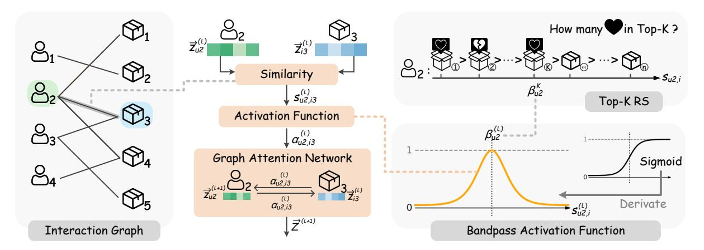
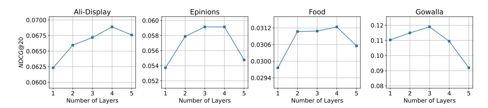
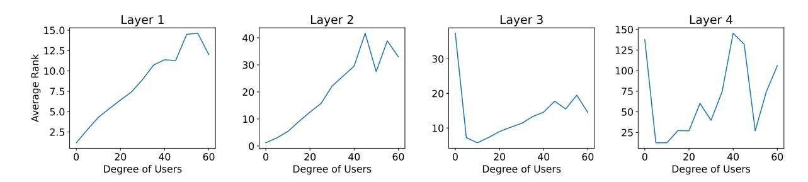
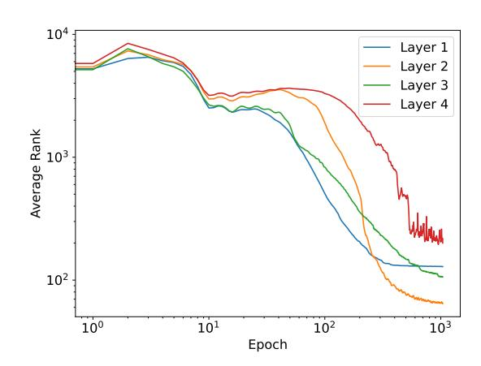

# TopKGAT: A Top-K Objective-Driven Architecture for Recommendation

[Sirui Chen](https://orcid.org/0009-0006-5652-7970)†‡ Zhejiang University Hangzhou, China chenthree@zju.edu.cn

[Jiawei Chen](https://orcid.org/0000-0002-4752-2629)∗†‡§ Zhejiang University Hangzhou, China sleepyhunt@zju.edu.cn

[Canghong Jin](https://orcid.org/0000-0002-9774-9688) Hangzhou City University Hangzhou, China jinch@zucc.edu.cn

[Sheng Zhou](https://orcid.org/0000-0003-3645-1041) Zhejiang University Hangzhou, China zhousheng\_zju@zju.edu.cn

[Jingbang Chen](https://orcid.org/0000-0002-7279-0801) CUHK-Shenzhen & SLAI Shenzhen, China chenjb@cuhk.edu.cn

[Wujie Sun](https://orcid.org/0000-0001-7739-3517) Zhejiang University Hangzhou, China sunwujie@zju.edu.cn

[Can Wang](https://orcid.org/0000-0002-5890-4307)†§ Zhejiang University Hangzhou, China wcan@zju.edu.cn

### Abstract

Recommendation systems (RS) aim to retrieve the top-K items most relevant to users, with metrics such as Precision@K and Recall@K commonly used to assess effectiveness. The architecture of an RS model acts as an inductive bias, shaping the patterns the model is inclined to learn. In recent years, numerous recommendation architectures have emerged, spanning traditional matrix factorization, deep neural networks, and graph neural networks. However, their designs are often not explicitly aligned with the top-K objective, thereby limiting their effectiveness.

To address this limitation, we propose TopKGAT, a novel recommendation architecture directly derived from a differentiable approximation of top-K metrics. The forward computation of a single TopKGAT layer is intrinsically aligned with the gradient ascent dynamics of the Precision@K metric, enabling the model to naturally improve top-K recommendation accuracy. Structurally, TopKGAT resembles a graph attention network and can be implemented efficiently. Extensive experiments on four benchmark datasets demonstrate that TopKGAT consistently outperforms state-of-the-art baselines. The code is available at [https://github.com/StupidThree/TopKGAT.](https://github.com/StupidThree/TopKGAT)

## CCS Concepts

• Information systems → Recommender systems.

© 2026 Copyright held by the owner/author(s). ACM ISBN 979-8-4007-2307-0/2026/04 <https://doi.org/10.1145/3774904.3792717>

### Keywords

Recommendation; Graph; Graph Attention Networks

#### ACM Reference Format:

Sirui Chen, Jiawei Chen, Canghong Jin, Sheng Zhou, Jingbang Chen, Wujie Sun, and Can Wang. 2026. TopKGAT: A Top-K Objective-Driven Architecture for Recommendation. In Proceedings of the ACM Web Conference 2026 (WWW '26), April 13–17, 2026, Dubai, United Arab Emirates. ACM, New York, NY, USA, [11](#page-10-0) pages.<https://doi.org/10.1145/3774904.3792717>

### 1 Introduction

Recommendation systems have become an essential infrastructure in modern online platforms, helping users discover relevant items from vast catalogs of products, videos, music, and other content [\[21,](#page-9-0) [24\]](#page-9-1). In practice, both display space and user attention are severely constrained — whether on a mobile interface showing a handful of products, a streaming platform suggesting a few videos, or an e-commerce homepage featuring selected items. This constraint naturally formulates the top-K recommendation problem. The primary objective is to maximize top-K metrics such as Precision@��, Recall@��, ensuring that the K displayed items are favored by the user, irrespective of those items outside the top-K positions.

The architecture of an RS model plays a decisive role in determining its effectiveness. It is not merely an implementation detail but defines the patterns the model can learn and the inductive bias it introduces during training [\[7\]](#page-8-0). Over the past decade, various architectures for recommendation systems have been proposed, evolving from traditional matrix factorization methods [\[25,](#page-9-2) [26\]](#page-9-3) to recent deep neural networks [\[11,](#page-8-1) [52\]](#page-9-4) and graph neural networks [\[19,](#page-9-5) [44\]](#page-9-6). Despite their success, many of these architectures are misaligned with the top-K ranking goal, thereby limiting their effectiveness. For example, stacking multiple GNN layers can lead to over-smoothing, collapsing node representations, and reducing the model's ability to distinguish positive from negative instances conflicting with the top-K recommendation objective.

∗Corresponding author.

† State Key Laboratory of Blockchain and Data Security, Zhejiang University.

‡College of Computer Science and Technology, Zhejiang University.

§Hangzhou High-Tech Zone (Binjiang) Institute of Blockchain and Data Security.

[This work is licensed under a Creative Commons Attribution 4.0 International License.](https://creativecommons.org/licenses/by/4.0) WWW '26, Dubai, United Arab Emirates.

A notable exception is Rankformer [\[9\]](#page-8-2), which explicitly incorporates the ranking property of RS into its architectural design, achieving state-of-the-art performance. Its improvement stems from a specific neural network structure aligned with the gradient descent step of the Bayesian Personalized Ranking (BPR) objective, which promotes higher scores for positive instances relative to negatives. However, BPR optimizes pairwise comparisons across the entire item set, while the top-K objective (e.g., Precision@K) focuses solely on the quality of the highest-ranked K items [\[12\]](#page-8-3). This mismatch leaves a gap between BPR optimization and top-K performance. Although it adopts a linearization technique to approximate nonlinear activations and a caching mechanism to store intermediate variables for acceleration, these strategies inevitably introduce approximation errors and incur significant memory consumption, thereby hindering its practical application. This raises an important research question: How can we design a recommendation architecture that is directly aligned with the top-K objective?

Towards this end, we propose TopKGAT, a novel recommendation architecture derived directly from a differentiable approximation of top-K metrics. The key idea is to align the forward computation of a single-layer with the gradient ascent dynamics of the top-K objective, so that the architecture inherently drives improvements in top-K performance. Implementing this alignment is challenging because the top-K objective depends on ordinal item ranking positions and is inherently non-continuous. We address this by employing a quantile-based method [\[18\]](#page-9-7) to avoid explicit ranking computation and introducing a sigmoid-based smooth approximation [\[48\]](#page-9-8) to the Heaviside step function. This formulation yields a graph attention structure that aggregates information along user–item interaction edges, with attention weights determined by embedding similarity, while incorporating a custom activation function and a user-dependent bias term. The resulting architecture is concise and efficient, fully aligned with the gradient of the top-K objective, and naturally enhances top-K recommendation accuracy. Extensive experiments on four benchmark datasets demonstrate that TopKGAT consistently outperforms state-of-the-art baselines.

- In summary, our main contributions are as follows:
- We highlight the importance of integrating the top-K objective directly into designing the recommendation model architecture.
- We propose TopKGAT, a novel recommendation model whose architecture is directly derived from the gradient of a top-K metric, thereby enhancing its capability in top-K recommendation.
- We validate the effectiveness of TopKGAT through experiments on four real-world datasets, showing consistent and substantial improvements over state-of-the-art baselines.

#### 2 Preliminary

In this section, we present the background of graph-based recommendation and graph attention networks.

# 2.1 Top-K Recommendation

Problem Formulation. Following previous work [\[19,](#page-9-5) [24,](#page-9-1) [41\]](#page-9-9), we focus on the collaborative filtering scenario, the most general and widely studied setting in recommendation systems. In a recommender system, there is a set of users U and a set of items I. The number of users and items is |U| = �� and |I| = ��, respectively. The

historical interaction data is denoted as D = {(��,��)|�� ∈ U,�� ∈ I}, where each element (��,��) ∈ D indicates that user �� interacted with item �� (e.g., clicked, purchased, or rated positively). For subsequent algorithm development, we further define the set of items that user �� has interacted with as N�� = {�� ∈ I| (��,��) ∈ D} with cardinality ���� = |N�� |, and similarly, the set of users who have interacted with item �� as N�� = {�� ∈ U| (��,��) ∈ D} with cardinality ���� = |N�� |. In practical recommendation scenarios, systems typically present a limited number of items to users. Therefore, the top-K recommendation task aims to recommend �� items that each user is most likely to interact with based on the historical interaction data D.

Modern recommendation models widely adopt the embeddingbased paradigm, which has proven effective for capturing user preferences and item characteristics [\[24,](#page-9-1) [28,](#page-9-10) [35,](#page-9-11) [53\]](#page-9-12). These models typically map each user �� and item �� into ��-dimensional embeddings z��, z�� ∈ R �� through various modeling approaches, so that all embedding vectors constitute a tensor Z ∈ R (��+��)×�� . The predicted preference score between user �� and item �� is then computed as the inner product������ = z �� z�� . The inner product naturally measures similarity in the embedding space and has been shown to be effective for collaborative filtering, widely used in existing work [\[19,](#page-9-5) [32,](#page-9-13) [41\]](#page-9-9). For each user ��, the system will recommend the top-K items with the highest predicted scores: R �� �� = Top-K��∈I\N�� {������ }.

Graph-based Methods. Graph-based recommendation models [\[16,](#page-9-14) [19,](#page-9-5) [44\]](#page-9-6) have emerged as a powerful approach for learning these embeddings by treating the user-item interactions as a bipartite graph G = (U ∪ I, D). These models leverage graph neural networks to propagate information through the interaction structure, capturing collaborative signals that enhance recommendation quality. The embeddings are refined through multiple layers of graph neural networks, allowing the model to incorporate higher-order connectivity patterns in the user-item graph.

Top-K Metrics. The fundamental principle of top-K metrics is to evaluate how well the recommended list R �� �� matches the user's true preferences reflected in T��, where T�� represents the groundtruth set of items that the user �� actually interacted with in the test set. Two of the most widely used top-K metrics are Precision@�� and Recall@��:

Precision@��(��) = |R�� �� ∩ T�� | �� ; Recall@��(��) = |R�� �� ∩ T�� | |T�� | (1)

where Precision@�� measures the fraction of relevant items among the top-K recommendations, while Recall@�� measures the fraction of relevant items that are successfully recommended.

These top-K metrics are particularly important in recommendation, because they reflect the practical constraints of the recommender system. By explicitly considering the top-K metrics in the model architecture, we can better model item and user representations that are more applicable to real-world recommendations.

# 2.2 Graph Attention Networks

Unlike traditional graph convolutional approaches that use fixed or structure-dependent weights, GAT [\[36\]](#page-9-15) learns to assign different importance to different neighbors, enabling more flexible and expressive representation learning, and has been widely adopted in various fields [\[17,](#page-9-16) [33,](#page-9-17) [40,](#page-9-18) [42,](#page-9-19) [54\]](#page-9-20).

Figure 1: The illustration of TopKGAT.

The core of GAT is its attention mechanism, which computes attention coefficients between connected nodes. For a target node �� and its neighbor �� ∈ N�� , the attention mechanism takes their features z��, z�� ∈ R �� as inputs and computes:

������ = softmax�� (��(z��, z��)) (2)

z ′ �� = ∑︁ ��∈N�� ������z�� (3)

where �� is a function to calculate relevance score, and z ′ is the new representation of node �� after aggregation using GAT.

GAT is particularly well-suited for modeling entity representations in recommender systems. The attention mechanism naturally estimates the importance of different neighbors based on their features, which aligns with the fundamental principles of collaborative filtering that more similar users/items should have stronger influence. NGAT4Rec [\[32\]](#page-9-13) represents the application of GAT to recommendation by adapting the attention mechanism for the collaborative filtering setting. It replaces the linear transformation-based relevance calculation in vanilla GAT with a dot-product similarity measure that is more natural for recommendation tasks, and substitutes Softmax normalization with degree-based normalization.

### 2.3 Ranking-Inspired RS Models

Traditional graph-based recommendation methods operate on the principle of making neighboring nodes more similar through iterative aggregation, essentially enhancing graph smoothness during the modeling process. However, this smoothness assumption does not align well with the ranking nature of recommendation tasks, where the goal is to discriminate between items rather than make them more similar. Recent RankFormer [\[9\]](#page-8-2) has attempted to address this misalignment by incorporating ranking objectives directly into neural architectures, proposing a graph transformerbased recommendation model. By introducing specialized global attention mechanisms that capture pairwise ranking relationships, it can model representations that are inherently optimized for producing accurate rankings. This ranking-inspired design enables the model to better capture the comparative nature of user preferences.

Despite its innovations, RankFormer faces several limitations when applied to practical recommendation scenarios. First, while real-world systems focus on top-K recommendation where only a small subset of items is presented to users, RankFormer's inductive biases are designed for full ranking tasks. This mismatch means the model may spend computational resources optimizing for positions beyond the top-K that are irrelevant in practice. Second, the transformer-based architecture introduces additional challenges. While the global receptive field allows the model to consider all user-item interactions simultaneously, this also dilutes the stronger signals from more relevant local neighbors, overshadowing the most reliable collaborative signals from directly connected neighbors with noise from distant nodes. Furthermore, the computational complexity of full attention necessitates oversimplified approximations, resulting in a deviation between what RankFormer actually optimizes and the ideal ranking objectives it was designed to capture. And even with these approximations, the time and space complexity of aggregating information from all nodes remains prohibitive for ultra-large-scale recommendation datasets. This scalability issue prevents its deployment in industrial recommendation systems where efficiency is paramount.

### 3 Methodology

In this section, we first introduce the architecture of our TopKGAT, and then analyze its advantages in recommendation scenarios by comparing it with classic architectures such as GCN and GAT.

# 3.1 TopKGAT

We aim to develop a graph neural network architecture that directly optimizes top-K recommendation metrics, bridging the gap between model design and evaluation objectives. The key challenge in optimizing top-K metrics lies in their discrete and non-differentiable nature, and top-K metrics are difficult to incorporate into the modeling process. To address this challenge, we propose a two-step approach. First, we transform the discrete top-K metric into a continuous and differentiable form by introducing quantile-based thresholds and smooth approximations of indicator functions. Second, we design a graph attention network whose layer-wise updates directly follow the gradient direction of this differentiable metric, ensuring that the model's inductive bias aligns with top-K optimization objectives.

��(·) = 1 (constant function) and �� (��) �� = 0. While the uniform aggregation of LightGCN is effective for general collaborative filtering, it treats all neighbors equally, regardless of their relevance to the top-K recommendation task.

Similarly, GAT-based methods like NGAT4Rec employ attention mechanisms with monotonic activation functions. NGAT4Rec can be viewed as another special case where ��(·) = ReLU(·) and �� (��) �� = 0. The ReLU activation assigns higher weights to items with higher similarity scores, following the intuition that more similar items should contribute more to the aggregation. However, this monotonic weighting may over-emphasize already high-scoring items that are confidently in the top-K set, while neglecting items near the decision boundary that are critical for optimizing the top-K recommendation result.

In contrast, TopKGAT introduces two key innovations that make it particularly suited for top-K recommendation. First, our bandpass activation function ��(·) focuses attention on items near the ranking boundary where improvements have the greatest impact on top-K metrics. Second, our learnable thresholds �� (��) �� allow the model to adaptively determine the relevance boundary for each user at each layer, providing personalized and dynamic attention patterns. These design choices ensure that our architecture directly aligns with top-K optimization objectives, rather than relying on indirect optimization through rating prediction [\[19,](#page-9-5) [41\]](#page-9-9) or pairwise ranking losses [\[12,](#page-8-3) [47,](#page-9-22) [51\]](#page-9-23) as in existing methods.

3.2.2 Bandpass Activation Function. A distinguishing feature of TopKGAT is the activation function ��(·) = 4�� ′ (·) = 4 (1+�� −�� ) (1+�� �� ) , which acts as a band-pass filter in the ranking space. Unlike traditional activation functions that are monotonically increasing (e.g., ReLU, sigmoid, softmax), our activation function exhibits a bellshaped curve centered at zero, as illustrated in Figure [1.](#page-2-0)

This band-pass characteristic has profound implications for top-K recommendation. When applied to the shifted similarity score, the function assigns maximum weights to items whose scores are near the threshold �� (��) �� . Items with very high scores (confidently in the top-K set) or very low scores (clearly outside the top-K set) receive smaller weights, as their ranking positions are already wellestablished and contribute less to improving Precision@��.

From a signal processing perspective, this activation function filters out both high-frequency noise (random fluctuations among clearly irrelevant items) and low-frequency components (stable rankings of highly relevant items), focusing the model's learning capacity on the mid-frequency band where top-K decisions are most uncertain and impactful. This selective attention mechanism ensures efficient use of model capacity by concentrating on the most informative parts of the ranking distribution.

Furthermore, the specific form of ��(·) as the derivative of the sigmoid function is not arbitrary. It emerges naturally from our gradient-based derivation. This mathematical grounding ensures that each layer's update directly follows the gradient direction of the differentiable Precision@��, making the band-pass filtering an inherent consequence of top-K optimization rather than an ad-hoc design choice.

3.2.3 Learnable Top-K Threshold. The threshold parameter �� (��) plays a crucial role in determining which part of the items in the

Table 1: Statistics of datasets

| Dataset     | #User  | #Item   | #Interaction |
|-------------|--------|---------|--------------|
| Ali-Display | 17,730 | 10,036  | 173,111      |
| Epinions    | 17,893 | 17,659  | 301,378      |
| Food        | 14,382 | 31,288  | 456,925      |
| Gowalla     | 55,833 | 118,744 | 1,753,362    |

ranked recommendation list receives the most attention during aggregation. While one could use the actual K-quantile of the score distribution as defined in Eq. [\(4\)](#page-3-0), we instead treat �� (��) �� as learnable parameters. This design choice offers several important advantages.

First, computing exact quantiles during training would require sorting operations that introduce two critical issues: computational complexity and non-differentiability. Sorting has ��(���� log��) complexity for each epoch, which becomes prohibitive when performed repeatedly during training. More fundamentally, the sorting operation is non-differentiable, making it incompatible with gradientbased optimization. Learnable thresholds elegantly sidestep both issues, allowing efficient computation and smooth gradient flow through standard backpropagation.

Second, learnable thresholds provide a flexible mechanism to capture hierarchical and personalized preference patterns. By making �� (��) �� both user-specific and layer-specific, the model can learn sophisticated ranking strategies that vary across users and evolve through network depth. This dual adaptability enables the model to learn more nuanced representations that reflect both individual user characteristics and the multi-scale nature of preference formation, as we demonstrate in Section [4.5.](#page-6-0)

Finally, learnable thresholds enable the model to adapt its focus throughout the training process. As we demonstrate in Section [4.5,](#page-6-0) analyzing the learned threshold values reveals interesting patterns about user preferences and the model's ranking strategy across different layers and training stages.

### 4 Experiments

In this section, we conduct comprehensive experiments to answer the following research questions:

- RQ1: How does TopKGAT perform compared to existing stateof-the-art methods?
- RQ2: What are the impacts of the important components (i.e., benchmark term �� and activation function ��(·)) on TopKGAT?
- RQ3: How do the hyperparameters affect the performance of TopKGAT?
- RQ4: How do different layers of TopKGAT jointly optimize the ranking task in recommendation?

### 4.1 Experimental Settings

4.1.1 Datasets. We conduct experiments on four real-world datasets: Ali-Display[1](#page-4-0) , a dataset provided by Alibaba estimating click-through rates of Taobao display ads; Epinions [\[3,](#page-8-4) [53\]](#page-9-12), a dataset collected from the online consumer review website Epinions.com; Food [\[29\]](#page-9-24), a user rating dataset collected from the recipe website Food.com;

1https://tianchi.aliyun.com/dataset/dataDetail?dataId=56

Table 2: Performance comparison between TopKGAT and baselines. The best result is bolded and the runner-up is underlined. The mark '\*' suggests the improvement is statistically significant with p < 0.05.

|                 |                       | ndcg@20 | Ali-Display recall@20 | ndcg@20 | Epinions recall@20 | ndcg@20 | Food recall@20 | Gowalla ndcg@20 | recall@20 |
|-----------------|-----------------------|---------|-----------------------|---------|--------------------|---------|----------------|-----------------|-----------|
|                 | MF                    | 0.0606  | 0.1114                | 0.0518  | 0.0853             | 0.0186  | 0.0317         | 0.0935          | 0.1334    |
| Non-attention   | LightGCN[SIGIR’20]    | 0.0640  | 0.1201                | 0.0530  | 0.0881             | 0.0301  | 0.0499         | 0.1129          | 0.1594    |
| Methods         | LightGCN++[RecSys’24] | 0.0571  | 0.1058                | 0.0566  | 0.0915             | 0.0299  | 0.0479         | 0.1175          | 0.1642    |
|                 | ReducedGCN[PAKDD’25]  | 0.0654  | 0.1216                | 0.0550  | 0.0922             | 0.0303  | 0.0490         | 0.1136          | 0.1600    |
|                 | GAT                   | 0.0472  | 0.0881                | 0.0427  | 0.0727             | 0.0236  | 0.0390         | 0.0846          | 0.1246    |
| Attention-based | NGAT4Rec[Arxiv’20]    | 0.0631  | 0.1188                | 0.0540  | 0.0888             | 0.0290  | 0.0480         | 0.1078          | 0.1524    |
| Methods         | MGFormer[SIGIR’24]    | 0.0649  | 0.1083                | 0.0542  | 0.0854             | 0.0260  | 0.0394         | 0.0973          | 0.1306    |
|                 | Rankformer[WWW’25]    | 0.0652  | 0.1208                | 0.0554  | 0.0895             | 0.0247  | 0.0424         | 0.1093          | 0.1589    |
| Our Method      | TopKGAT               | 0.0689* | 0.1266*               | 0.0592* | 0.0962*            | 0.0312* | 0.0508*        | 0.1189*         | 0.1660*   |
|                 |                       | 5.33%   | 4.10%                 | 4.51%   | 4.32%              | 3.09%   | 1.80%          | 1.19%           | 1.13%     |

and Gowalla [\[10\]](#page-8-5), a dataset counting user check-ins on a locationbased social platform. We use a standard 5-core setup and randomly split the dataset into training, validation, and test sets in a ratio of 7:1:2. The statistics of the datasets are shown in Table [1.](#page-4-1)

4.1.2 Metrics. We adopt two widely used metrics, Recall@�� and NDCG@��, to evaluate the recommendation accuracy, and refer to most studies on graph-based recommendation systems [\[9,](#page-8-2) [19,](#page-9-5) [27\]](#page-9-25) to simply set �� to 20.

4.1.3 Baselines. 1) Non-attention Methods. The following four representative recommendation methods without attention mechanisms are included:

- MF [\[26\]](#page-9-3): A classical collaborative filtering approach that learns user and item embeddings through factorizing the interaction matrix without utilizing graph structure.
- LightGCN [\[19\]](#page-9-5): A simplified graph convolution method that removes feature transformation and nonlinear activation for recommendation.
- LightGCN++ [\[27\]](#page-9-25): An enhanced version of LightGCN that incorporates layer combination and embedding normalization to improve recommendation performance.
- ReducedGCN [\[23\]](#page-9-26): A recent variant of LightGCN that weakens irrelevant interactions through macro-scale neighborhood reduction and micro-scale edge weight reduction.

2) Attention-based Methods. The following four representative recommendation methods are included:

- GAT [\[36\]](#page-9-15): Applies learnable attention mechanisms to adaptively aggregate neighbor embeddings based on their feature similarities in the graph structure.
- NGAT4Rec [\[32\]](#page-9-13) A neighbor-aware graph attention network for recommendation, which incorporates neighbor sampling and similarity calculation based on the vanilla GAT.
- MGFormer [\[6\]](#page-8-6): A multi-granularity transformer-based approach that captures both local graph structure and global collaborative signals through hierarchical attention mechanisms.
- Rankformer [\[9\]](#page-8-2): A ranking-aware graph transformer that explicitly models the ranking relationships between items through rank-sensitive attention.

For the compared methods, we use the source code provided officially and searched for optimal hyperparameters according to the instructions in the original paper. We extensively traversed the hyperparameter space as recommended by the authors to ensure that all compared methods achieved optimal performance.

# 4.2 Performance Comparison (RQ1)

The performance of our TopKGAT compared to all baseline models in terms of Recall@20 and NDCG@20 is shown in Table [2.](#page-5-0) Overall, TopKGAT outperforms all comparison methods on all datasets, with an average improvement of 3.53% in NDCG@�� and 2.84% in Recall@��. This result demonstrates the effectiveness of our method.

Compared with Non-attention Methods. TopKGAT consistently outperforms all non-attention baselines across all datasets, demonstrating the effectiveness of incorporating attention mechanisms into graph-based recommendation. Unlike non-attention methods that employ fixed aggregation weights (e.g., LightGCN's normalized sum pooling), TopKGAT adaptively learns the importance of different neighbors through attention weights that are directly optimized for top-K ranking objectives. This adaptive aggregation allows our model to distinguish between neighbors with varying relevance to the target user's preferences, capturing more nuanced collaborative signals.

Compared with Attention-based Methods. TopKGAT achieves superior performance compared to all attention-based baselines across all evaluation datasets. Notably, vanilla GAT performs worse than even the basic MF model on most datasets, indicating that the original GAT architecture is ill-suited for recommendation tasks without proper adaptation. In contrast, our method successfully adapts the GAT framework by explicitly connecting the attention mechanism to top-K optimization objectives, resulting in a recommendation-specific GAT architecture. MGFormer and Rank-Former, which employ transformer architectures with global attention mechanisms, achieve performance comparable to state-of-theart GCN-based methods on some datasets, while underperforming LightGCN on others. Their global attention mechanisms expand the receptive field during representation aggregation, but also introduce noise from less relevant nodes. Constrained by computational complexity, they often employ significant approximations, leading

Table 3: The result of the ablation study. The following table shows the ablation results after replacing the modules in TopKGAT with the corresponding modules in the vanilla GAT.

|              | Threshold Term? | Activation Function? ndcg@20 | Ali-Display recall@20 | ndcg@20 | Epinions recall@20 | ndcg@20 | Food recall@20 | ndcg@20 | Gowalla recall@20 |
|--------------|-----------------|------------------------------|-----------------------|---------|--------------------|---------|----------------|---------|-------------------|
| TopKGAT-w/o- | �� & ��         | 0.0512                       | 0.0998                | 0.0313  | 0.0561             | 0.0105  | 0.0186         | 0.0648  | 0.1047            |
| TopKGAT-w/o- | �� ✓            | 0.0493                       | 0.1010                | 0.0291  | 0.0532             | 0.0163  | 0.0273         | 0.0593  | 0.0942            |
| TopKGAT-w/o- | ��              | ✓ 0.0664                     | 0.1243                | 0.0531  | 0.0882             | 0.0304  | 0.0494         | 0.1181  | 0.1648            |
| TopKGAT      | ✓               | ✓ 0.0689                     | 0.1266                | 0.0592  | 0.0962             | 0.0312  | 0.0508         | 0.1189  | 0.1660            |

Figure 2: Performance of TopKGAT in terms of ��������@20 with different number of layers ��.

to reduced computational precision for important nodes compared to non-global aggregation methods. Existing GAT-based methods like NGAT4Rec still employ attention mechanisms designed for general graph tasks, thus maintaining their focus on graph smoothness as the optimization objective, achieving performance similar to LightGCN.

#### 4.3 Ablation Study (RQ2)

To investigate the contribution of each component in our framework, we conduct ablation studies by replacing the modules in TopKGAT with the corresponding modules in the vanilla GAT, as shown in Table [3.](#page-6-1) Specifically, for the threshold term �� (��) �� , we set �� = 0 in the removal experiments; for the activation function ��(·), we replace our sigmoid-derivative-based function with GAT's softmax function.

Impact of Activation Function. The results demonstrate that removing our activation function ��(·) a substantial decline in performance degradation across all datasets. This confirms that the softmax function employed in vanilla GAT is fundamentally incompatible with recommendation tasks. The sigmoid-derivative-based activation used by TopKGAT directly corresponds to the gradient of Precision@��, allowing the aggregated weights passed through the activation function to better optimize the top-K ranking objective for recommendation tasks.

Interaction between Threshold and Activation. An interesting observation is that the threshold term �� (��) �� only improves performance when combined with our activation function ��(·). Comparing TopKGAT-w/o-��&�� with TopKGAT-w/o-��, the threshold term becomes ineffective or even detrimental. This is expected because the threshold term is derived from our Precision@�� optimization framework and designed to work in conjunction with the sigmoid-derivative activation. When the activation function is

misaligned with top-K objectives, the threshold term loses its theoretical foundation and cannot provide meaningful adaptive filtering of neighbors. This interdependence validates our unified framework, where both components work synergistically to optimize recommendation performance.

#### 4.4 Role of the parameters (RQ3)

We investigate the effect of the number of layers �� in TopKGAT on recommendation performance. Figure [2](#page-6-2) shows the model performance across different numbers of layers on all four datasets. A consistent pattern emerges: performance initially improves with increasing the number of layers, then gradually degrades with further depth.

With shallow architectures, the model captures only immediate collaborative signals from direct user-item interactions and their low-hop neighbors, which limits the exploitation of higher-order connectivity patterns. As we increase the number of layers, the model benefits from expanded receptive fields that incorporate multi-hop collaborative signals, enabling a better understanding of complex user preferences through indirect connections. However, excessively deep architectures suffer from over-smoothing, where node representations become increasingly similar as information propagates through multiple layers. Additionally, deeper models aggregate information from exponentially larger neighborhoods, introducing noise from less relevant nodes that dilutes the signal from truly influential user-item interactions. Furthermore, the number of �� parameters also increases with larger ��, making model training more difficult.

#### 4.5 Case Study (RQ4)

To gain deeper insights into how TopKGAT learns to adaptively filter neighbors, we conduct a case study analyzing the learned threshold values �� �� across different layers and user characteristics,

Figure 3: With different degrees of users, the average ranking of �� (��) �� among �� (��) ���� after training on Ali-Display.

Figure 4: The average ranking of �� (��) �� among �� ���� during training on the Ali-Display, plotted on a logarithmic axis.

shown in Figures [3](#page-7-0) and [4.](#page-7-1) For each user �� and layer ��, we compute the ranking of �� (��) �� among all item scores �� (��) ���� = (z (��) �� ) �� z (��) �� , which corresponds to the value of �� in the definition of �� �� in Eq.[\(4\)](#page-3-0). The ranking �� indicates that, within this layer, the model primarily optimizes items ranked near �� in the recommended list for user ��.

Figure [3](#page-7-0) shows how the average ranking of �� �� varies across layer ��. As can be seen from the range of the vertical axis, shallow layers maintain smaller �� values, indicating they focus on optimizing top-ranked items, while deeper layers correspond to larger �� values, indicating that they focus on lower-ranked items. This hierarchical optimization strategy is intuitive: shallow layers establish strong representations by focusing on the most relevant items, while deeper layers further optimize the ranking by considering uncertain items, helping to better distinguish between relevant and irrelevant items in the middle range of the ranking.

Figure [3](#page-7-0) also shows the relationship between the degree (i.e., the number of items interacted with) of users in the training set and the ranking of the threshold. In shallow layers, users with higher degrees tend to have larger �� values, suggesting that for active users, even shallow layers need to consider items beyond the very top rankings to effectively learn preferences from their rich interaction history. However, this correlation becomes more complex in deeper layers. In deeper layers, some users with higher degrees may also focus on higher-ranked positions with smaller ��. This may help avoid being overwhelmed by the exponentially growing neighborhood

information, maintain the quality of top-K recommendations. This adaptive behavior demonstrates TopKGAT's ability to automatically adjust its optimization focus based on both user characteristics and layer depth.

Figure [4](#page-7-1) shows the evolution of the ranking of �� over time during training. The �� values of all layers consistently decrease. It suggests that as recommendation capabilities improve, the model shifts its focus of optimization toward higher-ranked positions in the recommendation list, directly focusing on optimizing the top-ranked positions. This aligns with the ultimate goal of top-K recommendations.

### 5 Related Work

### 5.1 Graph-based Recommendation Systems

The evolution of recommendation system architectures has witnessed several paradigm shifts: from early matrix factorization methods that model user-item interactions in latent spaces [\[25,](#page-9-2) [26\]](#page-9-3), to deep learning approaches that capture non-linear patterns [\[11,](#page-8-1) [52\]](#page-9-4), and more recently to graph-based methods that explicitly model interaction structures [\[19,](#page-9-5) [44\]](#page-9-6), knowledge-graph enhanced systems that incorporate external information [\[39,](#page-9-27) [40\]](#page-9-18), and emerging LLM-based recommenders that leverage pre-trained language understanding [\[13–](#page-8-7)[15,](#page-9-28) [37,](#page-9-29) [38\]](#page-9-30) . Among all these approaches, graphbased methods have gained particular prominence due to their natural ability to model the inherently relational nature of useritem interactions and capture collaborative signals through graph structure without relying on external knowledge.

The development of graph neural networks for recommendation began with adapting general GNN architectures to bipartite useritem graphs. Early work, such as GCMC [\[35\]](#page-9-11) and NGCF [\[41\]](#page-9-9), applies graph convolutional networks to collaborative filtering. LightGCN [\[19\]](#page-9-5) demonstrates that the complex feature transformations and non-linearities in NGCF are unnecessary, achieving superior performance with a simplified architecture that only performs neighborhood aggregation. Subsequent work further makes various improvements based on LightGCN, such as introducing contrastive learning strategies [\[4,](#page-8-8) [50\]](#page-9-31), improving graph structure [\[23,](#page-9-26) [43\]](#page-9-32), and further simplifying GCN [\[30,](#page-9-33) [31\]](#page-9-34). However, these GCN-based methods fundamentally optimize for graph smoothness, encouraging similar representations for connected nodes. They inherently conflict with the discriminative requirements of recommendation, where the model must sharply distinguish between relevant and irrelevant items. Moreover, they suffer from well-known GNN limitations

such as over-smoothing [\[5\]](#page-8-9), over-squashing [\[1\]](#page-8-10), and limitations in expressive power [\[46\]](#page-9-35).

Introducing attention mechanisms into graph-based recommendation systems holds promise for addressing these limitations through adaptive, relevance-aware neighborhood information aggregation patterns. A few attention-based graph recommendation methods adopt the GAT architecture, such as NGAT4Rec [\[32\]](#page-9-13), which replaces the learnable linear transformation in vanilla GAT with cosine similarity to adapt to recommendation scenarios. Most works adopt transformer architectures, adapting transformers to graph structures and recommendation scenarios through specialized positional encoding. However, the computational complexity of global attention in transformers is mismatched with the data scale of recommendation tasks, often necessitating sampling [\[8\]](#page-8-11), masking [\[6\]](#page-8-6), or approximation strategies [\[9\]](#page-8-2) to reduce time and space consumption. More fundamentally, these GAT- and Transformer-based approaches inherit attention mechanisms designed for general machine learning tasks, typically relying on monotonically increasing activation functions such as ReLU and Softmax, which fail to provide the sharp, ranking-aware distinctions near the top-K boundary where recommendation decisions are actually made.

# 5.2 Graph Attention Networks

Graph Attention Networks (GATs) [\[36\]](#page-9-15) revolutionized graph neural networks by introducing attention mechanisms to adaptively weight neighbor contributions during message passing. The original GAT computes attention coefficients through a learnable linear transformation, allowing each node to focus on the most relevant neighbors. This breakthrough inspired numerous extensions: GATv2 [\[2\]](#page-8-12) identified and fixed the static attention problem in the original GAT by modifying the attention computation order; SuperGAT [\[22\]](#page-9-36) introduces self-supervised edge attention to improve attention quality.

Recent work has applied attention mechanisms to graphs in various fields, including heterogeneous graph analysis [\[20,](#page-9-37) [42\]](#page-9-19), traffic flow prediction [\[17,](#page-9-16) [54\]](#page-9-20), molecular prediction [\[45,](#page-9-38) [49\]](#page-9-39), and so on. These methods typically modify the attention mechanism by incorporating domain knowledge into the attention function, normalization schemes, and aggregation strategies. In the recommendation domain, NGAT4Rec [\[32\]](#page-9-13) adapts its attention function for graphbased recommendations. And in the broader recommendation field, several works have explored graph attention network methods with external knowledge, such as KGAT [\[40\]](#page-9-18) for knowledge graph-based recommendations, DGRec [\[33\]](#page-9-17) for session-based recommendations, and MGAT [\[34\]](#page-9-40) for multimodal recommendations. However, all these methods fundamentally inherit the attention design from general graph learning tasks, using monotonically increasing attention weights with respect to similarity and aggregation schemes optimized for traditional graph tasks, resulting in a critical mismatch between these methods and the top-K ranking objective of recommendation.

# 6 Conclusions

We present TopKGAT, a novel graph attention network architecture derived from optimizing the Precision@�� metric. Our key insight is that top-K recommendation fundamentally requires distinguishing items near the relevance boundary, which we achieve through a learnable threshold mechanism and a bandpass activation function. By establishing a direct mathematical connection between ranking metrics and neural architectures, TopKGAT addresses the longstanding mismatch between graph-based recommendation models and their evaluation objectives. Extensive experiments demonstrate that our principled approach not only achieves state-of-the-art performance across multiple datasets but also provides interpretable insights into user preference patterns through the learned threshold dynamics. This work opens new avenues for metric-driven architecture design in recommendation systems, suggesting that future advances may benefit from similar first-principles approaches that align model design with task-specific objectives.

# Acknowledgments

This work is supported by the Zhejiang Province "JianBingLingYan+X" Research and Development Plan (2025C02020). We thank the reviewers for their valuable and insightful suggestions that improve the paper.

# References

[1] Uri Alon and Eran Yahav. 2020. On the Bottleneck of Graph Neural Networks and Its Practical Implications. In International Conference on Learning Representations. [2] Shaked Brody, Uri Alon, and Eran Yahav. 2021. How Attentive Are Graph Attention Networks?. In International Conference on Learning Representations. arXiv[:2105.14491](https://arxiv.org/abs/2105.14491) [3] Chenwei Cai, Ruining He, and Julian McAuley. 2017. SPMC: Socially-Aware Personalized Markov Chains for Sparse Sequential Recommendation. In Proceedings of the 26th International Joint Conference on Artificial Intelligence (IJCAI'17). 1476–1482. [4] Xuheng Cai, Chao Huang, Lianghao Xia, and Xubin Ren. 2023. LightGCL: Simple Yet Effective Graph Contrastive Learning for Recommendation. In The Eleventh International Conference on Learning Representations. arXiv[:2302.08191](https://arxiv.org/abs/2302.08191) [5] Deli Chen, Yankai Lin, Wei Li, Peng Li, Jie Zhou, and Xu Sun. 2020. Measuring and Relieving the Over-Smoothing Problem for Graph Neural Networks from the Topological View. In Proceedings of the AAAI Conference on Artificial Intelligence, Vol. 34. 3438–3445. [6] Huiyuan Chen, Zhe Xu, Chin-Chia Michael Yeh, Vivian Lai, Yan Zheng, Minghua Xu, and Hanghang Tong. 2024. Masked Graph Transformer for Large-Scale Recommendation. In Proceedings of the 47th International ACM SIGIR Conference on Research and Development in Information Retrieval. 2502–2506. [7] Jiawei Chen, Hande Dong, Xiang Wang, Fuli Feng, Meng Wang, and Xiangnan He. 2023. Bias and Debias in Recommender System: A Survey and Future Directions. ACM Transactions on Information Systems 41, 3 (2023), 1–39. [8] Sirui Chen, Jiawei Chen, Sheng Zhou, Bohao Wang, Shen Han, Chanfei Su, Yuqing Yuan, and Can Wang. 2024. SIGformer: Sign-Aware Graph Transformer for Recommendation. In Proceedings of the 47th International ACM SIGIR Conference on Research and Development in Information Retrieval (SIGIR '24). 1274–1284. [9] Sirui Chen, Shen Han, Jiawei Chen, Binbin Hu, Sheng Zhou, Gang Wang, Yan Feng, Chun Chen, and Can Wang. 2025. Rankformer: A Graph Transformer for Recommendation Based on Ranking Objective. In Proceedings of the ACM on Web Conference 2025. 3037–3048. [10] Eunjoon Cho, Seth A. Myers, and Jure Leskovec. 2011. Friendship and Mobility: User Movement in Location-Based Social Networks. In Proceedings of the 17th ACM SIGKDD International Conference on Knowledge Discovery and Data Mining. 1082–1090. [11] Paul Covington, Jay Adams, and Emre Sargin. 2016. Deep Neural Networks for YouTube Recommendations. In Proceedings of the 10th ACM Conference on Recommender Systems (RecSys '16). 191–198. [12] Paolo Cremonesi, Yehuda Koren, and Roberto Turrin. 2010. Performance of Recommender Algorithms on Top-n Recommendation Tasks. In Proceedings of the Fourth ACM Conference on Recommender Systems (RecSys '10). 39–46. [13] Yu Cui, Feng Liu, Jiawei Chen, Canghong Jin, Xingyu Lou, Changwang Zhang, Jun Wang, Yuegang Sun, and Can Wang. 2025. HatLLM: Hierarchical Attention Masking for Enhanced Collaborative Modeling in LLM-based Recommendation. arXiv[:2510.10955](https://arxiv.org/abs/2510.10955) [14] Yu Cui, Feng Liu, Jiawei Chen, Xingyu Lou, Changwang Zhang, Jun Wang, Yuegang Sun, Xiaohu Yang, and Can Wang. 2025. Field Matters: A Lightweight LLM-enhanced Method for CTR Prediction. arXiv[:2505.14057](https://arxiv.org/abs/2505.14057)

- [15] Yu Cui, Feng Liu, Pengbo Wang, Bohao Wang, Heng Tang, Yi Wan, Jun Wang, and Jiawei Chen. 2024. Distillation Matters: Empowering Sequential Recommenders to Match the Performance of Large Language Models. In Proceedings of the 18th ACM Conference on Recommender Systems (RecSys '24). 507–517. [16] Chen Gao, Yu Zheng, Nian Li, Yinfeng Li, Yingrong Qin, Jinghua Piao, Yuhan Quan, Jianxin Chang, Depeng Jin, Xiangnan He, and Yong Li. 2023. A Survey of Graph Neural Networks for Recommender Systems: Challenges, Methods, and Directions. ACM Transactions on Recommender Systems 1, 1 (2023), 1–51. [17] Shengnan Guo, Youfang Lin, Ning Feng, Chao Song, and Huaiyu Wan. 2019. Attention Based Spatial-Temporal Graph Convolutional Networks for Traffic Flow Forecasting. In Proceedings of the AAAI Conference on Artificial Intelligence, Vol. 33. 922–929. [18] Lingxin Hao and Daniel Q. Naiman. 2007. Quantile Regression. Number 149. [19] Xiangnan He, Kuan Deng, Xiang Wang, Yan Li, YongDong Zhang, and Meng Wang. 2020. LightGCN: Simplifying and Powering Graph Convolution Network for Recommendation. In Proceedings of the 43rd International ACM SIGIR Conference on Research and Development in Information Retrieval. 639–648. [20] Ziniu Hu, Yuxiao Dong, Kuansan Wang, and Yizhou Sun. 2020. Heterogeneous Graph Transformer. In Proceedings of The Web Conference 2020. 2704–2710. [21] F. O. Isinkaye, Y. O. Folajimi, and B. A. Ojokoh. 2015. Recommendation Systems: Principles, Methods and Evaluation. Egyptian Informatics Journal 16, 3 (2015), 261–273. [22] Dongkwan Kim and Alice Oh. 2020. How to Find Your Friendly Neighborhood: Graph Attention Design with Self-Supervision. In International Conference on Learning Representations. [23] Eungi Kim, Chanwoo Kim, Kwangeun Yeo, Jinri Kim, Yujin Jeon, Sewon Lee, and Joonseok Lee. 2025. ReducedGCN: Learning to Adapt Graph Convolution for Top-N Recommendation. In Advances in Knowledge Discovery and Data Mining. Vol. 15872. 291–303. [24] Hyeyoung Ko, Suyeon Lee, Yoonseo Park, and Anna Choi. 2022. A Survey of Recommendation Systems: Recommendation Models, Techniques, and Application Fields. Electronics 11, 1 (2022), 141. [25] Yehuda Koren and Robert Bell. 2011. Advances in Collaborative Filtering. In Recommender Systems Handbook. 145–186. [26] Yehuda Koren, Robert Bell, and Chris Volinsky. 2009. Matrix Factorization Techniques for Recommender Systems. Computer 42, 8 (2009), 30–37. [27] Geon Lee, Kyungho Kim, and Kijung Shin. 2024. Revisiting LightGCN: Unexpected Inflexibility, Inconsistency, and A Remedy Towards Improved Recommendation. In 18th ACM Conference on Recommender Systems. 957–962. [28] Siyi Lin, Chongming Gao, Jiawei Chen, Sheng Zhou, Binbin Hu, Yan Feng, Chun Chen, and Can Wang. 2025. How Do Recommendation Models Amplify Popularity Bias? An Analysis from the Spectral Perspective. In Proceedings of the Eighteenth ACM International Conference on Web Search and Data Mining. 659–668. [29] Bodhisattwa Prasad Majumder, Shuyang Li, Jianmo Ni, and Julian McAuley. 2019. Generating Personalized Recipes from Historical User Preferences. In Proceedings of the 2019 Conference on Empirical Methods in Natural Language Processing and the 9th International Joint Conference on Natural Language Processing (EMNLP-IJCNLP). 5976–5982. [30] Kelong Mao, Jieming Zhu, Xi Xiao, Biao Lu, Zhaowei Wang, and Xiuqiang He. 2021. UltraGCN: Ultra Simplification of Graph Convolutional Networks for Recommendation. In Proceedings of the 30th ACM International Conference on Information & Knowledge Management (CIKM '21). 1253–1262. [31] Shaowen Peng, Kazunari Sugiyama, and Tsunenori Mine. 2022. SVD-GCN: A Simplified Graph Convolution Paradigm for Recommendation. In Proceedings of the 31st ACM International Conference on Information & Knowledge Management (CIKM '22). 1625–1634. [32] Jinbo Song, Chao Chang, Fei Sun, Xinbo Song, and Peng Jiang. 2021. NGAT4Rec: Neighbor-Aware Graph Attention Network for Recommendation. arXiv[:2010.12256](https://arxiv.org/abs/2010.12256) [33] Weiping Song, Zhiping Xiao, Yifan Wang, Laurent Charlin, Ming Zhang, and Jian Tang. 2019. Session-Based Social Recommendation via Dynamic Graph Attention Networks. In Proceedings of the Twelfth ACM International Conference on Web Search and Data Mining (WSDM '19). 555–563. [34] Zhulin Tao, Yinwei Wei, Xiang Wang, Xiangnan He, Xianglin Huang, and Tat-Seng Chua. 2020. MGAT: Multimodal Graph Attention Network for Recommendation. Information Processing & Management 57, 5 (2020), 102277. [35] Rianne van den Berg, Thomas N. Kipf, and Max Welling. 2017. Graph Convolutional Matrix Completion. arXiv[:1706.02263](https://arxiv.org/abs/1706.02263) [36] Petar Veličković, Guillem Cucurull, Arantxa Casanova, Adriana Romero, Pietro Liò, and Yoshua Bengio. 2017. Graph Attention Networks. In International Conference on Learning Representations. [37] Bohao Wang, Feng Liu, Jiawei Chen, Xingyu Lou, Changwang Zhang, Jun Wang, Yuegang Sun, Yan Feng, Chun Chen, and Can Wang. 2025. MSL: Not All Tokens Are What You Need for Tuning LLM as a Recommender. In Proceedings of the 48th International ACM SIGIR Conference on Research and Development in Information Retrieval (SIGIR '25). 1912–1922. [38] Bohao Wang, Feng Liu, Changwang Zhang, Jiawei Chen, Yudi Wu, Sheng Zhou, Xingyu Lou, Jun Wang, Yan Feng, Chun Chen, and Can Wang. 2025. LLM4DSR: Leveraging Large Language Model for Denoising Sequential Recommendation. ACM Trans. Inf. Syst. 44, 1 (2025), 6:1–6:32. [39] Hongwei Wang, Miao Zhao, Xing Xie, Wenjie Li, and Minyi Guo. 2019. Knowledge Graph Convolutional Networks for Recommender Systems. In The World Wide Web Conference (WWW '19). 3307–3313. [40] Xiang Wang, Xiangnan He, Yixin Cao, Meng Liu, and Tat-Seng Chua. 2019. KGAT: Knowledge Graph Attention Network for Recommendation. In Proceedings of the 25th ACM SIGKDD International Conference on Knowledge Discovery & Data Mining (KDD '19). 950–958. [41] Xiang Wang, Xiangnan He, Meng Wang, Fuli Feng, and Tat-Seng Chua. 2020. Neural Graph Collaborative Filtering. arXiv[:1905.08108](https://arxiv.org/abs/1905.08108) [42] Xiao Wang, Houye Ji, Chuan Shi, Bai Wang, Yanfang Ye, Peng Cui, and Philip S Yu. 2019. Heterogeneous Graph Attention Network. In The World Wide Web Conference (WWW '19). 2022–2032. [43] Yu Wang, Yuying Zhao, Yi Zhang, and Tyler Derr. 2023. Collaboration-Aware Graph Convolutional Network for Recommender Systems. In Proceedings of the ACM Web Conference 2023. 91–101. arXiv[:2207.06221](https://arxiv.org/abs/2207.06221) [44] Shiwen Wu, Fei Sun, Wentao Zhang, Xu Xie, and Bin Cui. 2022. Graph Neural Networks in Recommender Systems: A Survey. Comput. Surveys 55, 5 (2022), 1–37. [45] Zhaoping Xiong, Dingyan Wang, Xiaohong Liu, Feisheng Zhong, Xiaozhe Wan, Xutong Li, Zhaojun Li, Xiaomin Luo, Kaixian Chen, Hualiang Jiang, and Mingyue Zheng. 2020. Pushing the Boundaries of Molecular Representation for Drug Discovery with the Graph Attention Mechanism. Journal of Medicinal Chemistry 63, 16 (2020), 8749–8760. [46] Keyulu Xu, Weihua Hu, Jure Leskovec, and Stefanie Jegelka. 2019. How Powerful Are Graph Neural Networks? arXiv[:1810.00826](https://arxiv.org/abs/1810.00826) [47] Weiqin Yang, Jiawei Chen, Xin Xin, Sheng Zhou, Binbin Hu, Yan Feng, Can Wang, and Chun Chen. 2024. PSL: Rethinking and Improving Softmax Loss from Pairwise Perspective for Recommendation. In Neural Information Processing Systems (NIPS '24, Vol. 37). 120974–121006. arXiv[:2411.00163](https://arxiv.org/abs/2411.00163) [48] Weiqin Yang, Jiawei Chen, Shengjia Zhang, Peng Wu, Yuegang Sun, Yan Feng, Chun Chen, and Can Wang. 2025. Breaking the Top-K Barrier: Advancing Top-K Ranking Metrics Optimization in Recommender Systems. In Proceedings of the 31st ACM SIGKDD Conference on Knowledge Discovery and Data Mining V.2. 3542–3552. [49] Chengxuan Ying, Tianle Cai, Shengjie Luo, Shuxin Zheng, Guolin Ke, Di He, Yanming Shen, and Tie-Yan Liu. 2021. Do Transformers Really Perform Bad for Graph Representation?. In Thirty-Fifth Conference on Neural Information Processing Systems. [50] Junliang Yu, Xin Xia, Tong Chen, Lizhen Cui, Nguyen Quoc Viet Hung, and Hongzhi Yin. 2023. XSimGCL: Towards Extremely Simple Graph Contrastive Learning for Recommendation. IEEE Transactions on Knowledge and Data Engineering (2023), 1–14. [51] Shengjia Zhang, Jiawei Chen, Changdong Li, Sheng Zhou, Qihao Shi, Yan Feng, Chun Chen, and Can Wang. 2025. Advancing Loss Functions in Recommender Systems: A Comparative Study with a Rényi Divergence-Based Solution. In Proceedings of the AAAI Conference on Artificial Intelligence, Vol. 39. 13286–13294. [52] Shuai Zhang, Lina Yao, Aixin Sun, and Yi Tay. 2019. Deep Learning Based Recommender System: A Survey and New Perspectives. ACM Comput. Surv. 52, 1 (2019), 5:1–5:38. [53] Tong Zhao, Julian McAuley, and Irwin King. 2015. Improving Latent Factor Models via Personalized Feature Projection for One Class Recommendation. In Proceedings of the 24th ACM International on Conference on Information and Knowledge Management. 821–830. [54] Chuanpan Zheng, Xiaoliang Fan, Cheng Wang, and Jianzhong Qi. 2020. GMAN: A Graph Multi-Attention Network for Traffic Prediction. In Proceedings of the AAAI Conference on Artificial Intelligence, Vol. 34. 1234–1241. A Appendices A.1 Derivation of Layer-wise Update First, we split L������@�� into two terms: J������@�� = J�������� + ��J������ (13) J�������� = ∑︁ ��∈U ∑︁ ��∈N�� ��(������ − �� �� ) √ �������� = ∑︁ (��,��) ∈D ��(������ − �� �� ) √ ��������
  - (14) J������ = −∥Z∥
  - (15) The partial derivative of J�������� with respect to ������ is: ��J�������� �������� = ∑︁ (��,��) ∈D �� ′ (������ − �� �� ) √ �������� (16)

