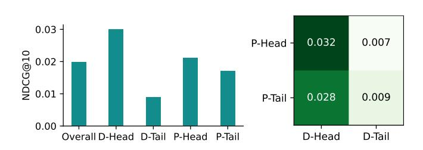
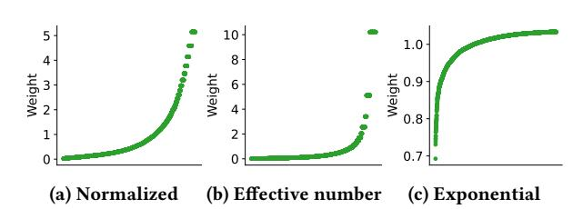
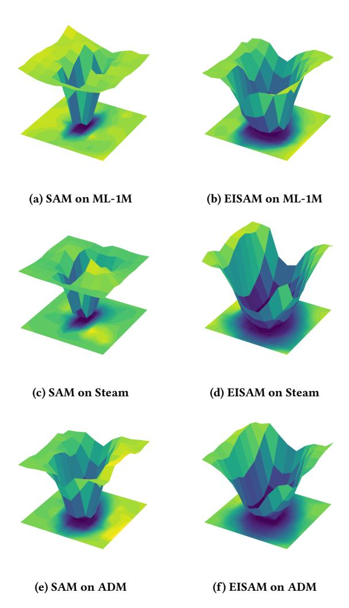
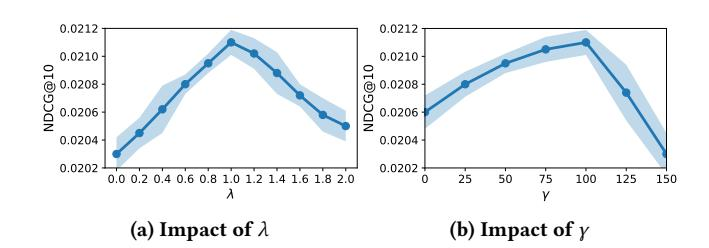

# Taming the Long Tail: Efficient Item-wise Sharpness-Aware Minimization for LLM-based Recommender Systems

Jiaming Zhang jm.zhang@zju.edu.cn Zhejiang University Hangzhou, Zhejiang, China

Yuyuan Li y2li@hdu.edu.cn Hangzhou Dianzi University Hangzhou, Zhejiang, China

Xiaohua Feng fengxiaohua@zju.edu.cn Zhejiang University Hangzhou, Zhejiang, China

Li Zhang zhanglizl80@gmail.com Zhejiang University Hangzhou, Zhejiang, China

Longfei Li longyao.llf@antgroup.com Ant Group Hangzhou, Zhejiang, China

Jun Zhou jun.zhoujun@antgroup.com Ant Group Hangzhou, Zhejiang, China

Chaochao Chen\* zjuccc@zju.edu.cn Zhejiang University Hangzhou, Zhejiang, China

### Abstract

Large Language Model-based Recommender Systems (LRSs) have recently emerged as a new paradigm in sequential recommendation by directly adopting LLMs as backbones. While LRSs demonstrate strong knowledge utilization and instruction-following abilities, they have not been systematically studied under the long-standing long-tail problem. In this paper, we conduct an empirical study and reveal that LRSs face two distinct types of long-tail: i) prior long-tail, inherited implicitly from pretraining corpora, and ii) data long-tail, originating from skewed recommendation datasets. Our analysis shows that both contribute to the performance disparity between head and tail items, with the intersection of the two heads exhibiting an even stronger head effect. Nevertheless, the overall performance distribution in LRSs, especially on the tail, remains dominated by the data long-tail. To address this challenge, we propose Efficient Item-wise Sharpness-Aware Minimization (EISAM), a novel optimization framework that improves tail-item performance by adaptively regularizing the loss landscape at the item level. EISAM introduces an efficient penalty design that captures fine-grained item-specific sharpness while maintaining computational scalability for LLMs. In addition, we derive a generalization bound for EISAM. Our theoretical analysis shows that the bound decreases at a faster rate under our item-wise regularization, offering theoretical support for its effectiveness. Extensive experiments on three real-world datasets

\*Corresponding author.

<https://doi.org/10.1145/nnnnnnn.nnnnnnn>

demonstrate that EISAM significantly boosts tail-item recommendation performance while preserving overall quality, establishing the first systematic solution to the long-tail problem in LRSs.

# CCS Concepts

• Information systems → Recommender systems.

# Keywords

Large Language Model-based Recommendation, Long-tail Recommendation, Sharpness-Aware Minimization

### ACM Reference Format:

Jiaming Zhang, Yuyuan Li, Xiaohua Feng, Li Zhang, Longfei Li, Jun Zhou, and Chaochao Chen\*. 2026. Taming the Long Tail: Efficient Item-wise Sharpness-Aware Minimization for LLM-based Recommender Systems. In . ACM, New York, NY, USA, [10](#page-9-0) pages. [https://doi.org/10.1145/nnnnnnn.](https://doi.org/10.1145/nnnnnnn.nnnnnnn)

# 1 Introduction

Recommender Systems (RSs) have been widely deployed in various domains, including news [\[42\]](#page-8-0), videos [\[63\]](#page-9-1), and medications [\[5\]](#page-8-1). Traditional RSs rely heavily on limited interaction data and singleform inputs [\[44\]](#page-9-2). They lack broad world knowledge and instruction understanding ability, which limits further improvements in recommendation quality and personalization. Large Language Models (LLMs) [\[1,](#page-8-2) [30,](#page-8-3) [41\]](#page-8-4), with strong knowledge and instruction understanding, have recently been integrated into RSs [\[36,](#page-8-5) [52\]](#page-9-3). Particularly in sequential recommendation, LLMs are directly used as new backbone models, referred to as LLM-based RSs (LRSs) [\[3,](#page-8-6) [4\]](#page-8-7).

However, this new LRS paradigm has not fully explored longstanding problems in traditional RSs, i.e., the long-tail problem. Realworld data usually follows a long-tail distribution, while recommendation data is often more skewed, where a very small number of popular items account for the majority of occurrences [\[33,](#page-8-8) [56\]](#page-9-4). Thus, in traditional RSs, a small portion of popular items dominates exposure and accuracy, while tail items receive limited attention [\[14,](#page-8-9) [57,](#page-9-5) [62\]](#page-9-6). Although LLMs have the theoretical potential to

Permission to make digital or hard copies of all or part of this work for personal or classroom use is granted without fee provided that copies are not made or distributed for profit or commercial advantage and that copies bear this notice and the full citation on the first page. Copyrights for components of this work owned by others than the author(s) must be honored. Abstracting with credit is permitted. To copy otherwise, or republish, to post on servers or to redistribute to lists, requires prior specific permission and/or a fee. Request permissions from permissions@acm.org.

Conference'17, Washington, DC, USA

© 2026 Copyright held by the owner/author(s). Publication rights licensed to ACM. ACM ISBN 978-x-xxxx-xxxx-x/YYYY/MM

enhance long-tail performance in traditional RSs via the additional auxiliary information [\[25,](#page-8-10) [26,](#page-8-11) [43,](#page-8-12) [50\]](#page-9-7), the long-tail problem in the LRS paradigm has not been explored.

LRSs are typically obtained by tuning pre-trained LLMs with recommendation data. Consequently, LRSs face two types of long-tail. The first is the long-tail in training data, referred to as data longtail. The second comes from the prior LLM pretraining corpus, referred to as prior long-tail. Since pretraining data are inaccessible or extremely large, and cannot be directly aligned with recommendation data, prior long-tail can only be reflected implicitly through LLM parameters and ultimately manifested in model performance. Accordingly, the prior long-tail introduced by pretraining corpus can be inferred from the model's performance.

To systematically investigate both types of long-tail effects, we first estimate the prior long-tail based on model performance, and then evaluate the impact of the data long-tail through fine-tuned LRS models. Our empirical study shows that both the prior long-tail and the data long-tail affect the final recommendation performance, yet the data long-tail remains the dominant factor. In both cases, head items consistently outperform tail items, and the intersection of the two heads exhibits the strongest head effect, achieving the best overall performance. However, the data long-tail consistently yields the worst performance, regardless of whether it intersects with the prior head or tail. These observations demonstrate that the prior distribution mainly contributes to improving head performance, with little additional negative impact on the tail. This suggests that, to enhance recommendation quality for tail items, studying and addressing the data long-tail remains crucial.

Based on this understanding, we propose Efficient Item-wise Sharpness-Aware Minimization (EISAM) to improve long-tail performance in LRSs. Sharpness-Aware Minimization (SAM) is known to enhance generalization by flattening the loss landscape [\[12,](#page-8-13) [16,](#page-8-14) [19\]](#page-8-15), but its naive adoption in recommendation has two major drawbacks. One is that directly applying SAM to the overall loss [\[9\]](#page-8-16) neglects the distinction between head and tail groups and lacks fine-grained targeted optimization. While this may improve overall performance, it fails to address the inferior performance of tail items. The other is that fine-grained control usually incurs high computational overhead [\[46\]](#page-9-8), which is particularly problematic for LRSs with massive parameter scales. EISAM addresses both issues by introducing an efficient item-wise sharpness penalty that adaptively regularizes loss curvature per item. This design improves tail-item generalization while maintaining computational efficiency. We further provide a theoretical analysis, showing that EISAM admits a tighter generalization bound and decreases at a faster rate compared to other SAM methods. The implementation and reproducible code are publicly available in our anonymous repository at [https://github.com/xiye7lai/samlrs.](https://github.com/xiye7lai/samlrs)

Our main contributions are summarized as follows:

- To the best of our knowledge, we are the first to systematically investigate the long-tail problem in LRSs, distinguishing between the prior long-tail inherited from pretraining and the data longtail in recommendation data.
- We conduct an empirical study and comprehensive analysis to examine the impacts of both prior and data long-tail effects within

the LRS paradigm, revealing that data distribution remains the dominant factor shaping head and tail performance disparities.

- We introduce Efficient Item-wise Sharpness-Aware Minimization (EISAM), an efficient item-level optimization method that adaptively regularizes loss curvature to enhance tail-item generalization while maintaining computational efficiency.
- We provide both theoretical and empirical validations, showing that EISAM achieves consistent improvements on multiple real-world datasets, with significant gains on tail items without sacrificing overall recommendation accuracy.

# 2 Related Work

# 2.1 LLM-based Recommender Systems

Due to LLMs' powerful capabilities, the utilization of them as a novel backbone for RSs has recently emerged as a promising paradigm. LLM-based RSs directly leverage the generative capability of LLMs to produce recommendations, and this paradigm is particularly suitable for sequential recommendation scenarios since the recommendation process can be naturally formulated in a next-item prediction manner, which aligns well with the intrinsic training objective of LLMs. To adapt LLMs for this purpose, early studies focus on enhancing recommendation generation through the design of effective prompt templates or the incorporation of auxiliary information [\[23,](#page-8-17) [29,](#page-8-18) [31,](#page-8-19) [36\]](#page-8-5). Mainstream approaches then explore fine-tuning strategies on recommendation datasets [\[3,](#page-8-6) [55,](#page-9-9) [65\]](#page-9-10), while some works further introduce architectural modifications and special tokens tailored for recommendation tasks [\[21,](#page-8-20) [34\]](#page-8-21). In addition, preference optimization, which is commonly applied to LLMs after supervised fine-tuning, has also been extended to RSs in both online and offline settings [\[2,](#page-8-22) [20,](#page-8-23) [32,](#page-8-24) [35\]](#page-8-25). Beyond aligning LLMs with recommendation objectives, recent efforts further enhance factual accuracy and personalization by integrating techniques such as retrieval-augmented generation [\[40,](#page-8-26) [45\]](#page-9-11), online feedback mechanisms [\[38,](#page-8-27) [39,](#page-8-28) [54\]](#page-9-12), and multi-agent collaboration [\[10,](#page-8-29) [49\]](#page-9-13).

Despite these advances in boosting recommendation performance, several traditional challenges remain underexplored in this new paradigm, such as the long-tail problem. It is worth noting that while some studies investigate fairness in LRSs [\[13,](#page-8-30) [15\]](#page-8-31), their focus is primarily on reducing performance disparities across different groups rather than improving long-tail recommendation quality.

# 2.2 Long-tail in Recommender Systems

Despite the rapid development of RSs, the long-tail phenomenon remains a persistent challenge: a small portion of head items accumulates the majority of interactions, while the vast majority of tail items remain underrepresented, leading to issues in diversity, novelty, and fairness of exposure [\[33,](#page-8-8) [64\]](#page-9-14).

To mitigate this problem, prior research has explored two main directions. The first is knowledge transfer and model design, where information from popular items is propagated to sparse items through shared representations or specialized architectures. Examples include dual-level transfer frameworks linking model- and item-level signals [\[24,](#page-8-32) [27,](#page-8-33) [60\]](#page-9-15), decoupling-based networks that separately handle head and tail dynamics [\[37,](#page-8-34) [58,](#page-9-16) [61\]](#page-9-17), and domain transfer methods tailored for sequential recommendation [\[8,](#page-8-35) [47,](#page-9-18) [51\]](#page-9-19). The second is debiasing through causal inference, which disentangles genuine

user preference from popularity-driven exposure via reweighting, counterfactual estimation, or deconfounded objectives [\[28,](#page-8-36) [53,](#page-9-20) [59\]](#page-9-21).

However, these approaches are largely developed under conventional RS backbones, making them difficult to adapt in the emerging LLM-based paradigm. Techniques such as architectural decoupling or causal reweighting require direct control over model structures, training objectives, or interaction-level sampling, whereas LRSs typically operate in a generative manner with frozen backbones or lightweight tuning. This mismatch limits the applicability of existing long-tail solutions. While some recent studies have attempted to integrate LLMs into traditional RSs through enhanced representations or retrieval-augmented generation [\[18,](#page-8-37) [25,](#page-8-10) [26,](#page-8-11) [50\]](#page-9-7), there has been little to no exploration of how long-tail challenges can be systematically addressed within LRSs.

### 3 Problem Setup

In LRSs, the backbone relies solely on item information, and the recommendation task is formulated as sequential next-item prediction. Since user features are not explicitly modeled, we focus exclusively on the item long-tail problem.

Let the item space be I = {��1,��2, . . . ,��| I | }. Each recommendation instance is an item sequence �� = {��1,��2, . . . ,���� }, where �� denotes the sequence length. Given a prefix sequence ��, the task is to predict the next item from the item space:

ˆ�� = arg max ��∈I �� (�� | ��). (1)

We denote the training dataset as S = {(���� ,����)}�� ��=1 , where ���� is an input sequence and ���� is the corresponding target item. The training loss is denoted as ℓ(��;��,��), which in LRSs typically corresponds to the supervised fine-tuning (SFT) loss with model parameters ��. The empirical training loss over dataset S is then defined as

��S (��) ≜ 1 �� ∑︁�� ��=1 ℓ(��;���� ,����).

In practice, the distribution of target items is highly imbalanced. For each item �� ∈ I, let ���� denote the number of times �� appears as a prediction target in the training set, and define its empirical frequency as ���� = ����/��, where �� = Í ��∈I ���� . Ordering items such that ��1 ≥ ��2 ≥ · · · ≥ ��| I |, the empirical distribution D reveals a long-tailed pattern in which the head items occupy the majority.

Following prior work in long-tailed recognition, we also define an ideal balanced distribution D������ , under which all items occur with equal probability. The expected population loss under D and D������ can be written as

��D (��) = E(��,��)∼D ℓ(��;��,��) , ��D������ (��) = E(��,��)∼D������ ℓ(��;��,��) .

The long-tail challenge in LRSs is therefore to design learning strategies that reduce the gap between ��D (��) and ��D������ (��), so that the RS maintains accuracy on head items while also improving performance on tail items that are severely underrepresented.

### 4 Empirical Study

To investigate the long-tail phenomenon in LRSs, we conduct an empirical analysis using the widely adopted BIGRec [\[3\]](#page-8-6) model. Details can be found in Section [6.](#page-4-0)

Figure 1: Performance across data/prior groups.

To examine the prior long-tail, we first utilize the base LLM to directly generate recommendation results. However, since the raw generation is not aligned with the sequential recommendation input format and lacks an explicit item list for reference, the generated outputs exhibit very low accuracy and extremely high redundancy. To address this issue, we first design prompts that explicitly instruct the base LLM to generate �� distinct recommendation items. To further align the outputs with the sequential recommendation format, we perform a lightweight fine-tuning using a small number of synthetic examples that directly provide �� non-redundant recommendations in the required format. Following the grounding strategy proposed in BIGRec, the generated �� outputs are then mapped to the closest items in the candidate set by comparing their representations with item embeddings obtained from feeding items into the LLM, and the most similar items are selected as the predicted targets. By aggregating these predicted targets across all sequences in the dataset, we obtain the prior long-tail distribution. We report in Figure [1](#page-2-0) the performance (evaluated by NDCG@10) of LRS fine-tuned with recommendation data under both prior long-tail and data long-tail distributions.

From the empirical results, we observe that both the prior longtail (P) and the data long-tail (D) influence LRS performance, yet the data long-tail remains the dominant factor. The best performance occurs in the head–head intersection (��-Head ∩ ��-Head), indicating that these items benefit simultaneously from training bias and the LLM's inherent tendency to answer head items correctly. However, the lowest accuracy does not appear in the tail–tail intersection, but rather in regions involving data-tail items, especially ��-Head ∩ ��-Tail. This shows that once items fall into the data-tail space, the model's ability to recommend them drops sharply, regardless of their prior classification. The prior head category also contains some low-activity items that are actually data-tail in nature, reflecting that the LLM's prior knowledge is only partially aligned with the recommendation domain. When intersecting with the data distribution, these items are still significantly dominated by data-tail effects, and because they participate in training much less frequently, their recommendation quality improves far more slowly than that of true head items.

In summary, we summarize our main findings as follows.

- Within the LRS paradigm, the performance gap between head and tail items is primarily determined by the data distribution.
- The prior head items, especially when interacting with data head items can further amplify head performance.
- The prior long-tail has only a minimal negative effect on tail items during training.

| Dataset | # Items | # Interactions | # Sequences |
|---------|---------|----------------|-------------|
| ML-1M   | 3,883   | 1,000,209      | 939,809     |
| Steam   | 32,135  | 1,307,310      | 138,970     |
| ADM     | 266,414 | 836,006        | 22,982      |

Figure 2: Weight distributions of different weighting functions on the ML-1M dataset, where the x-axis denotes item indices sorted by descending frequency.

Steam video game platform. ADM[3](#page-5-0) : The Amazon Digital Music (ADM) dataset includes ratings for digital music items.

The statistics of these datasets are summarized in Table [1.](#page-4-7) To simulate sequential recommendation scenarios, we construct interaction sequences based on timestamps and split them into training, validation, and testing sets with a ratio of 8:1:1. Following prior work on long-tail recommendation, we remove items with fewer than five interaction records to alleviate sparsity. We set the maximum sequence length to 10 across all datasets. Based on the Pareto principle [\[7\]](#page-8-39), we designate the top 20% most frequent items as head items and the remaining 80% as tail items.

6.1.2 LRS Models. We select two representative LRS backbones: BIGRec [\[3\]](#page-8-6) adopts a two-stage grounding strategy: it first applies supervised fine-tuning (SFT) to align the LLM with the recommendation domain, and then grounds into the item domain by generating embeddings and matching model outputs with item representations. TALLRec [\[4\]](#page-8-7) extends LLMs through lightweight fine-tuning combined with a dual-stage paradigm that incorporates instruction-following and recommendation-specific tuning. In our implementation, we further employ TALLRec to generate multiple items simultaneously and adopt beam search to enhance the diversity and quality of the recommended results.

For the base LLM, we adopt the representative open-source models: Llama2-7B (Llama) [\[41\]](#page-8-4).

6.1.3 Baselines. We compare our proposed approach against the following baselines:

- RW: Re-weighting [\[15\]](#page-8-31) improves long-tail performance by adjusting training weights according to group popularity.
- SAM: Sharpness-Aware Minimization [\[12\]](#page-8-13) is originally introduced to improve the performance of low-degree nodes in graphbased collaborative filtering [\[9\]](#page-8-16). We extend it to LRSs.
- Group SAM: Group-wise Sharpness-Aware Minimization [\[46\]](#page-9-8) is originally proposed to discover the performance of disadvantaged groups. We adapt it to the LRS paradigm.

6.1.4 Evaluation Metrics. To evaluate recommendation performance, we adopt two widely used metrics: Normalized Discounted Cumulative Gain (NDCG@��) and Hit Ratio (HR@��). We set �� = 10.

# 6.2 Implement Details

Following prior work [\[3\]](#page-8-6), we adopt consistent training configurations. For ML-1M and Steam, the number of training epochs is

set to 3, while for ADM we train for 2 epochs. We use the Adam optimizer with a learning rate of 5 × 10−4 and a batch size of 64. All models are fine-tuned with LoRA, where the rank �� is set to 8 and the LoRA scaling factor �� is 16.

For the choice of the weighting function �� (·), we consider three representative forms: (i) a variant based solely on normalized sample frequency [\[15,](#page-8-31) [17\]](#page-8-40), which directly assigns smaller weights to frequent items and larger weights to rare ones, formulated as ��norm(����) = ����+�� , where ���� denotes the empirical frequency of item �� and �� is a small constant to ensure numerical stability.

(ii) the effective number formulation [\[11\]](#page-8-41), which computes the effective contribution of each item by considering its diminishing information gain with repeated occurrences, defined as ��eff(����) = 1−�� 1−�� ���� , where �� ∈ [0, 1) controls the smoothness of frequency attenuation.

(iii) a smoothly attenuated exponential form [\[22\]](#page-8-42), which introduces a soft suppression factor that gradually reduces the influence of high-frequency items, expressed as ��exp (����) = (1 − ����) �� where �� &gt; 0, adjusts the degree of suppression.

These three weighting schemes produce distinct frequency–weight mappings, as illustrated in Figure [2.](#page-5-1) Since sequential recommendation inherently exhibits a long-tailed distribution and each item occurs only a limited number of times, overly aggressive weighting strategies tend to make the model focus excessively on a few noisy tail items while ignoring the head items that contribute substantially to overall performance. Therefore, we adopt the exponential weighting function as a balanced and stable choice.

# 6.3 Overall Performance (RQ1)

Overall Performance. Table [2](#page-6-0) summarizes the overall recommendation performance of all methods across the three datasets. EISAM consistently surpasses the baselines on both NDCG@10 and HR@10 metrics. Specifically, EISAM achieves an average improvement of 3.53% in overall NDCG@10 and 4.54% in HR@10 compared to the strongest baseline.

We observe that SAM consistently improves the overall performance compared with the original LRSs, while Reweight and GroupSAM do not necessarily yield positive gains and often introduce side effects. This is because SAM regularizes the model with respect to the global loss sharpness, thus enhancing the overall generalization capability. In contrast, Reweight and GroupSAM focu on local or group-specific adjustments without such a global guarantee, which may only bring localized optimization improvements. Our proposed EISAM, by introducing a fine-grained weighting mechanism combined with item-wise sharpness regularization, forms a new SAM variant that still optimies the global loss while providing more flexible item-level control. Consequently, EISAM achieves more stable and superior global performance than standard SAM.

Tail Item Performance. We further evaluate the effectiveness of EISAM on tail items, which constitute 80% of the item space. As shown in Table [2,](#page-6-0) EISAM achieves remarkable gains on tail items, with an average improvement of 8.90% in NDCG@10 and 8.44% in HR@10 over the best-performing baseline.

Although SAM contributes to overall performance, it brings little improvement to tail items, indicating that the SAM framework itself still suffers from long-tail bias. GroupSAM provides relatively

Table 2: Performance comparison across datasets and base LRSs. The best results are highlighted in bold, and the second-best results are underlined. For the Overall and Tail metrics, we additionally report the relative improvements (%) of EISAM over the best baseline.

| Dataset Method | NDCG@10        | Overall HR@10  | NDCG@10         | Tail HR@10      | NDCG@10 | Head HR@10 |
|----------------|----------------|----------------|-----------------|-----------------|---------|------------|
| TALLRec        | 0.0197         | 0.0239         | 0.0071          | 0.0101          | 0.0318  | 0.0371     |
| +RW            | 0.0149         | 0.0177         | 0.0087          | 0.0111          | 0.0208  | 0.0240     |
| +SAM           | 0.0202         | 0.0241         | 0.0084          | 0.0108          | 0.0315  | 0.0368     |
| +GroupSAM      | 0.0195         | 0.0235         | 0.0090          | 0.0129          | 0.0295  | 0.0336     |
| +EISAM ML-1M   | 0.0211(+4.46%) | 0.0258(+7.05%) | 0.0101(+12.22%) | 0.0141(+9.30%)  | 0.0316  | 0.0370     |
| BIGRec         | 0.0286         | 0.0337         | 0.0128          | 0.0169          | 0.0437  | 0.0498     |
| +RW            | 0.0282         | 0.0331         | 0.0136          | 0.0162          | 0.0422  | 0.0493     |
| +SAM           | 0.0294         | 0.0347         | 0.0135          | 0.0167          | 0.0446  | 0.0519     |
| +GroupSAM      | 0.0274         | 0.0316         | 0.0149          | 0.0177          | 0.0394  | 0.0449     |
| +EISAM         | 0.0303(+3.06%) | 0.0358(+3.17%) | 0.0160(+7.38%)  | 0.0203(+14.69%) | 0.0440  | 0.0506     |
| TALLRec        | 0.0800         | 0.0889         | 0.0285          | 0.0420          | 0.1206  | 0.1259     |
| +RW            | 0.0811         | 0.0903         | 0.0291          | 0.0430          | 0.1221  | 0.1276     |
| +SAM           | 0.0824         | 0.0919         | 0.0283          | 0.0416          | 0.1250  | 0.1315     |
| +GroupSAM      | 0.0826         | 0.0926         | 0.0295          | 0.0438          | 0.1244  | 0.1311     |
| +EISAM Steam   | 0.0832(+0.73%) | 0.0936(+1.08%) | 0.0308(+4.41%)  | 0.0451(+2.97%)  | 0.1245  | 0.1318     |
| BIGRec         | 0.0840         | 0.1018         | 0.0314          | 0.0462          | 0.1255  | 0.1456     |
| +RW            | 0.0872         | 0.1054         | 0.0391          | 0.0521          | 0.1251  | 0.1474     |
| +SAM           | 0.0875         | 0.1062         | 0.0388          | 0.0518          | 0.1259  | 0.1491     |
| +GroupSAM      | 0.0874         | 0.1059         | 0.0395          | 0.0531          | 0.1251  | 0.1475     |
| +EISAM         | 0.0887(+1.37%) | 0.1098(+3.39%) | 0.0411(+4.05%)  | 0.0564(+6.21%)  | 0.1262  | 0.1519     |
| TALLRec        | 0.0196         | 0.0231         | 0.0058          | 0.0088          | 0.0421  | 0.0464     |
| +RW            | 0.0185         | 0.0224         | 0.0063          | 0.0102          | 0.0384  | 0.0423     |
| +SAM           | 0.0202         | 0.0239         | 0.0050          | 0.0079          | 0.0449  | 0.0499     |
| +GroupSAM      | 0.0190         | 0.0227         | 0.0069          | 0.0107          | 0.0387  | 0.0422     |
| +EISAM ADM     | 0.0216(+6.93%) | 0.0258(+7.95%) | 0.0079(+14.49%) | 0.0116(+8.41%)  | 0.0439  | 0.0489     |
| BIGRec         | 0.0205         | 0.0269         | 0.0075          | 0.0134          | 0.0417  | 0.0489     |
| +RW            | 0.0187         | 0.0243         | 0.0085          | 0.0148          | 0.0353  | 0.0398     |
| +SAM           | 0.0213         | 0.0281         | 0.0081          | 0.0142          | 0.0428  | 0.0507     |
| +GroupSAM      | 0.0215         | 0.0282         | 0.0092          | 0.0154          | 0.0415  | 0.0490     |
| +EISAM         | 0.0225(+4.65%) | 0.0295(+4.61%) | 0.0102(+10.87%) | 0.0168(+9.09%)  | 0.0425  | 0.0502     |

stable improvements on tail items, but its coarse-grained grouplevel control and the heavy computational cost of multiple SAM evaluations per group limit its effectiveness. Moreover, the lack of inter-group interaction is crucial for recommendation tasks, often results in unstable or even degraded overall performance. In contrast, EISAM introduces a novel item-wise sharpness that mitigates these issues, delivering consistent tail improvements with far lower overhead. These findings confirm that EISAM effectively alleviates the long-tail problem.

# 6.4 Loss Landscape (RQ2)

To further investigate EISAM's learning behavior on tail items, we visualize and compare the loss landscapes of EISAM and SAM in Figure [3.](#page-7-0) From both 3D and 2D perspectives, SAM exhibits limited flatness on tail items, indicating restricted generalization in long-tailed scenarios. In contrast, across all three datasets, EISAM

demonstrates a markedly flatter and smoother loss surface, suggesting that its item-wise sharpness regularization effectively mitigates sharp minima and stabilizes optimization. This evidence highlights that, for tail items, EISAM better captures local curvature while preserving global smoothness, thereby improving generalization and robustness under long-tail distributions.

## 6.5 Training Efficiency (RQ3)

Table [3](#page-7-1) compares the computational efficiency among different methods. EISAM exhibits comparable training efficiency to standard SAM, introducing only an average 5.3% overhead per epoch. On the Steam and ADM datasets, the additional computational cost is as low as 0.01%. EISAM achieves fine-grained item-wise sharpness regularization with only a small and acceptable number of additional computations, demonstrating its efficiency in modeling item-level curvature without heavy cost. This efficiency is attributed to our optimized training procedure, which avoids the

Figure 3: visualizations of the loss landscapes of LRS on tail items. Darker colors indicate lower loss values.

group-level looping required by GroupSAM. In contrast, GroupSAM incurs approximately Group× higher time complexity. Therefore, EISAM achieves an optimal balance between accuracy and training cost, making it scalable to large real-world LRS applications.

# 6.6 Impact of Hyperparameter (RQ4)

We analyze the sensitivity of EISAM to two key hyperparameters, �� and ��. �� serves as a weighting coefficient in the smoothly attenuated exponential weighting function ��exp (·) and adjusts the relative importance of tail items when computing item-wise sharpness. We conduct experiments on ML-1M using BIGRec as the base LRS and report the results over five independent runs. Figure [4](#page-7-2) illustrates their effects.

Impact of ��. We notice that increasing �� initially improves model accuracy by promoting flatter minima but leads to degradation when �� becomes overly large (around �� &gt; 1.0). This reflects the trade-off between minimizing training loss and minimizing the

Table 3: Average training time per epoch. Also show the relative factor in parentheses (w.r.t. SAM in the same column).

| Methods  | ML-1M  |       |     |        | Steam |     |       | ADM   |     |
|----------|--------|-------|-----|--------|-------|-----|-------|-------|-----|
| SAM      | 3182s  | (1.00 | × ) | 3897s  | (1.00 | × ) | 949s  | (1.00 | × ) |
| GroupSAM | 12172s | (3.82 | × ) | 15844s | (4.06 | × ) | 3948s | (4.16 | × ) |
| EISAM    | 3652s  | (1.14 | × ) | 3969s  | (1.01 | × ) | 967s  | (1.01 | × ) |

Figure 4: Hyperparameter sensitivity analysis.

sharpness of the loss landscape. Moderate �� values achieve the best compromise, maintaining stability and robustness without excessive regularization. Overall, EISAM demonstrates strong robustness across a wide range of hyperparameter values, showing consistent improvements under the long-tail setting.

Impact of ��. As �� increases, performance first improves, indicating that emphasizing the sharpness of tail items enhances generalization under long-tail distributions. However, when �� exceeds a certain threshold (e.g., �� &gt; 100), the performance begins to decline, suggesting that overemphasizing tail sharpness can lead to over-regularization and hinder learning on head items. This finding implies the necessity of balancing head and tail regularization strengths in the optimization process.

# 7 Conclusion

In this work, we systematically investigated the long-tail problem in LRSs, distinguishing between the prior long-tail from pretraining and the data long-tail in recommendation data. Our empirical analysis shows that both of them affect performance, but the data long-tail remains the dominant factor shaping head and tail disparities. The prior long-tail mainly enhances the performance of head classes, while exerting limited influence on the tail. To mitigate this issue, we propose Efficient Item-wise Sharpness-Aware Minimization (EISAM). EISAM adjusts the loss curvature per item, enabling finer control over head and tail groups. Moreover, we design an efficient optimization procedure to alleviate the high computational overhead, ensuring that EISAM remains both effective and practical for LRSs. Experiments on real-world datasets show that our method improves overall performance, significantly enhances the recommendation quality for tail items, and maintains computational efficiency. Moreover, empirical evidence indicates that our approach successfully reduces the sharpness of tail items.

### Acknowledgments

This work was supported in part by the National Natural Science Foundation of China (No. 62522217, No. 62402148) and Ant Group. References [1] Josh Achiam, Steven Adler, Sandhini Agarwal, Lama Ahmad, Ilge Akkaya, Florencia Leoni Aleman, Diogo Almeida, Janko Altenschmidt, Sam Altman, Shyamal Anadkat, et al. 2023. Gpt-4 technical report. arXiv preprint arXiv:2303.08774 (2023). [2] Zhuoxi Bai, Ning Wu, Fengyu Cai, Xinyi Zhu, and Yun Xiong. 2024. Aligning Large Language Model with Direct Multi-Preference Optimization for Recommendation. In Proceedings of the 33rd CIKM. 76–86. [3] Keqin Bao, Jizhi Zhang, Wenjie Wang, Yang Zhang, Zhengyi Yang, Yanchen Luo, Chong Chen, Fuli Feng, and Qi Tian. 2025. A bi-step grounding paradigm for large language models in recommendation systems. ACM Transactions on Recommender Systems 3, 4 (2025), 1–27. [4] Keqin Bao, Jizhi Zhang, Yang Zhang, Wenjie Wang, Fuli Feng, and Xiangnan He. 2023. Tallrec: An effective and efficient tuning framework to align large language model with recommendation. In Proceedings of the 17th ACM conference on recommender systems. 1007–1014. [5] Youjun Bao and Xiaohong Jiang. 2016. An intelligent medicine recommender system framework. In 2016 IEEE 11Th conference on industrial electronics and applications (ICIEA). IEEE, 1383–1388. [6] Sergei Bernstein. 1924. On a modification of Chebyshev's inequality and of the error formula of Laplace. Ann. Sci. Inst. Sav. Ukraine, Sect. Math 1, 4 (1924), 38–49. [7] George EP Box and R Daniel Meyer. 1986. An analysis for unreplicated fractional factorials. Technometrics 28, 1 (1986), 11–18. [8] Chaochao Chen, Huiwen Wu, Jiajie Su, Lingjuan Lyu, Xiaolin Zheng, and Li Wang. 2022. Differential private knowledge transfer for privacy-preserving cross-domain recommendation. In Proceedings of the ACM web conference 2022. 1455–1465. [9] Huiyuan Chen, Chin-Chia Michael Yeh, Yujie Fan, Yan Zheng, Junpeng Wang, Vivian Lai, Mahashweta Das, and Hao Yang. 2023. Sharpness-aware graph collaborative filtering. In Proceedings of the 46th International ACM SIGIR Conference on Research and Development in Information Retrieval. 2369–2373. [10] Xiaohong Chen, Canran Xiao, and Yongmei Liu. 2024. Confusion-resistant federated learning via diffusion-based data harmonization on non-IID data. In Proceedings of the 38th International Conference on Neural Information Processing Systems. 137495–137520. [11] Yin Cui, Menglin Jia, Tsung-Yi Lin, Yang Song, and Serge Belongie. 2019. Classbalanced loss based on effective number of samples. In Proceedings of the IEEE/CVF conference on computer vision and pattern recognition. 9268–9277. [12] Pierre Foret, Ariel Kleiner, Hossein Mobahi, and Behnam Neyshabur. 2021. Sharpness-aware Minimization for Efficiently Improving Generalization. In 9th International Conference on Learning Representations, ICLR 2021, Virtual Event, Austria, May 3-7, 2021. [13] Chongming Gao, Ruijun Chen, Shuai Yuan, Kexin Huang, Yuanqing Yu, and Xiangnan He. 2025. Sprec: Self-play to debias llm-based recommendation. In Proceedings of the ACM on Web Conference 2025. 5075–5084. [14] Seongwon Jang, Hoyeop Lee, Hyunsouk Cho, and Sehee Chung. 2020. Cities: Contextual inference of tail-item embeddings for sequential recommendation. In 2020 IEEE International Conference on Data Mining (ICDM). IEEE, 202–211. [15] Meng Jiang, Keqin Bao, Jizhi Zhang, Wenjie Wang, Zhengyi Yang, Fuli Feng, and Xiangnan He. 2024. Item-side Fairness of Large Language Model-based Recommendation System. In Proceedings of the ACM on Web Conference 2024. 4717–4726. [16] Ming Li, Xinming Huang, and Ziming Zhang. 2021. Self-supervised geometric features discovery via interpretable attention for vehicle re-identification and beyond. In ICCV. [17] Ming Li, Jun Liu, Ce Zheng, Xinming Huang, and Ziming Zhang. 2021. Exploiting multi-view part-wise correlation via an efficient transformer for vehicle re-identification. TOM (2021). [18] Ming Li, Pan Zhou, Jia-Wei Liu, Jussi Keppo, Min Lin, Shuicheng Yan, and Xiangyu Xu. 2024. Instant3d: instant text-to-3d generation. IJCV (2024). [19] Sicong Li, Qianqian Xu, Zhiyong Yang, Zitai Wang, Linchao Zhang, Xiaochun Cao, and Qingming Huang. 2025. Focal-SAM: Focal Sharpness-Aware Minimization for Long-Tailed Classification. arXiv preprint arXiv:2505.01660 (2025). [20] Jiayi Liao, Xiangnan He, Ruobing Xie, Jiancan Wu, Yancheng Yuan, Xingwu Sun, Zhanhui Kang, and Xiang Wang. 2024. RosePO: Aligning LLM-based Recommenders with Human Values. arXiv preprint arXiv:2410.12519 (2024). [21] Jiayi Liao, Sihang Li, Zhengyi Yang, Jiancan Wu, Yancheng Yuan, Xiang Wang, and Xiangnan He. 2024. Llara: Large language-recommendation assistant. In Proceedings of the 47th International ACM SIGIR Conference on Research and Development in Information Retrieval. 1785–1795. [22] Tsung-Yi Lin, Priya Goyal, Ross Girshick, Kaiming He, and Piotr Dollár. 2017. Focal loss for dense object detection. In Proceedings of the IEEE international conference on computer vision. 2980–2988. [23] Zhiming Lin, Kai Zhao, Sophie Zhang, Peilai Yu, and Canran Xiao. 2025. CEC-Zero: Zero-Supervision Character Error Correction with Self-Generated Rewards. arXiv preprint arXiv:2512.23971 (2025). [24] Dingyuan Liu, Qiannan Shen, and Jiaci Liu. 2026. The Health-Wealth Gradient in Labor Markets: Integrating Health, Insurance, and Social Metrics to Predict Employment Density. Computation 14, 1 (2026), 22. [doi:10.3390/computation14010022](https://doi.org/10.3390/computation14010022) Open Access. [25] Qidong Liu, Xian Wu, Wanyu Wang, Yejing Wang, Yuanshao Zhu, Xiangyu Zhao, Feng Tian, and Yefeng Zheng. 2025. Llmemb: Large language model can be a good embedding generator for sequential recommendation. In Proceedings of the AAAI Conference on Artificial Intelligence, Vol. 39. 12183–12191. [26] Qidong Liu, Xian Wu, Yejing Wang, Zijian Zhang, Feng Tian, Yefeng Zheng, and Xiangyu Zhao. 2024. Llm-esr: Large language models enhancement for longtailed sequential recommendation. Advances in Neural Information Processing Systems 37 (2024), 26701–26727. [27] Weiming Liu, Xiaolin Zheng, Jiajie Su, Longfei Zheng, Chaochao Chen, and Mengling Hu. 2023. Contrastive proxy kernel stein path alignment for crossdomain cold-start recommendation. IEEE Transactions on Knowledge and Data Engineering 35, 11 (2023), 11216–11230. [28] Xu Liu, Tong Yu, Kaige Xie, Junda Wu, and Shuai Li. 2024. Interact with the explanations: Causal debiased explainable recommendation system. In Proceedings of the 17th ACM International Conference on Web Search and Data Mining. 472–481. [29] Yao Lu, Xuguang Chen, Jianyang Gu, Yuchen Zhang, Qi Xuan, and Zhaowei Zhu. 2025. Dataset distillation with pre-trained models: A contrastive approach. Neurocomputing (2025), 132015. [30] Yao Lu, Ji Zhaiyuan, Jiawei Du, Yu Shanqing, Qi Xuan, and Joey Tianyi Zhou. [n. d.]. AutoAnnotator: A Collaborative Annotation Framework for Large and Small Language Models. Transactions on Machine Learning Research ([n. d.]). [31] Hanjia Lyu, Song Jiang, Hanqing Zeng, Yinglong Xia, Qifan Wang, Si Zhang, Ren Chen, Christopher Leung, Jiajie Tang, and Jiebo Luo. 2023. Llm-rec: Personalized recommendation via prompting large language models. arXiv preprint arXiv:2307.15780 (2023). [32] Yu Meng, Mengzhou Xia, and Danqi Chen. 2024. Simpo: Simple preference optimization with a reference-free reward. arXiv preprint arXiv:2405.14734 (2024). [33] Yoon-Joo Park and Alexander Tuzhilin. 2008. The long tail of recommender systems and how to leverage it. In Proceedings of the 2008 ACM conference on Recommender systems. 11–18. [34] Haohao Qu, Wenqi Fan, Zihuai Zhao, and Qing Li. 2024. TokenRec: Learning to Tokenize ID for LLM-based Generative Recommendation. arXiv preprint arXiv:2406.10450 (2024). [35] Rafael Rafailov, Archit Sharma, Eric Mitchell, Christopher D Manning, Stefano Ermon, and Chelsea Finn. 2024. Direct preference optimization: Your language model is secretly a reward model. Advances in Neural Information Processing Systems 36 (2024). [36] Leheng Sheng, An Zhang, Yi Zhang, Yuxin Chen, Xiang Wang, and Tat-Seng Chua. 2025. Language Representations Can be What Recommenders Need: Findings and Potentials. In The Thirteenth International Conference on Learning Representations. [37] Jiajie Su, Chaochao Chen, Weiming Liu, Fei Wu, Xiaolin Zheng, and Haoming Lyu. 2023. Enhancing hierarchy-aware graph networks with deep dual clustering for session-based recommendation. In Proceedings of the ACM web conference 2023. 165–176. [38] Chao Sun, Yaobo Liang, Yaming Yang, Shilin Xu, Tianmeng Yang, and Yunhai Tong. 2024. RLRF4Rec: Reinforcement Learning from Recsys Feedback for Enhanced Recommendation Reranking. arXiv preprint arXiv:2410.05939 (2024). [39] Qianyi Sun and Jiaxuan Li. 2025. A Lightweight YOLOv4-SVM Model for Automated Waste Monitoring in Smart Cities. In Proceedings of the 2025 2nd International Conference on Intelligent Computing and Data Mining (ICDM). IEEE, 32–36. [doi:10.1109/ICDM68174.2025.11309516](https://doi.org/10.1109/ICDM68174.2025.11309516) [40] Yu Tong, Weihai Lu, Zhe Zhao, Song Lai, and Tong Shi. 2024. MMDFND: Multimodal multi-domain fake news detection. In Proceedings of the 32nd ACM International Conference on Multimedia. 1178–1186. [41] Hugo Touvron, Thibaut Lavril, Gautier Izacard, Xavier Martinet, Marie-Anne Lachaux, Timothée Lacroix, Baptiste Rozière, Naman Goyal, Eric Hambro, Faisal Azhar, et al. 2023. Llama: Open and efficient foundation language models. arXiv preprint arXiv:2302.13971 (2023). [42] Jason Turcotte, Chance York, Jacob Irving, Rosanne M Scholl, and Raymond J Pingree. 2015. News recommendations from social media opinion leaders: Effects on media trust and information seeking. Journal of computer-mediated communication 20, 5 (2015), 520–535. [43] Fan Wang, Chaochao Chen, Weiming Liu, Tianhao Fan, Xinting Liao, Yanchao Tan, Lianyong Qi, and Xiaolin Zheng. 2024. CE-RCFR: Robust counterfactual regression for consensus-enabled treatment effect estimation. In Proceedings of the 30th ACM SIGKDD Conference on Knowledge Discovery and Data Mining.

3013–3023. [44] Fan Wang, Chaochao Chen, Weiming Liu, Lianyong Qi, Xuyun Zhang, Yanchao Tan, Mengying Zhu, and Xiaolin Zheng. 2025. Cluster-Enhanced Dual Discrete Collaborative Filtering for Efficient Recommendation. IEEE Transactions on Knowledge and Data Engineering (2025), 1–13. [doi:10.1109/TKDE.2025.3624659](https://doi.org/10.1109/TKDE.2025.3624659) [45] Shijie Wang, Wenqi Fan, Yue Feng, Xinyu Ma, Shuaiqiang Wang, and Dawei Yin. 2025. Knowledge Graph Retrieval-Augmented Generation for LLM-based Recommendation. arXiv preprint arXiv:2501.02226 (2025). [46] Yifan Wang, Peijie Sun, Weizhi Ma, Min Zhang, Yuan Zhang, Peng Jiang, and Shaoping Ma. 2024. Intersectional two-sided fairness in recommendation. In Proceedings of the ACM Web Conference 2024. 3609–3620. [47] Yuenan Wang, Hua Wang, and Fan Zhang. 2025. A Medical image segmentation model with auto-dynamic convolution and location attention mechanism. Computer Methods and Programs in Biomedicine 261 (2025), 108593. [48] Zitai Wang, Qianqian Xu, Zhiyong Yang, Yuan He, Xiaochun Cao, and Qingming Huang. 2023. A unified generalization analysis of re-weighting and logitadjustment for imbalanced learning. Advances in Neural Information Processing Systems 36 (2023), 48417–48430. [49] Zhefan Wang, Yuanqing Yu, Wendi Zheng, Weizhi Ma, and Min Zhang. 2024. MACRec: A Multi-Agent Collaboration Framework for Recommendation. In Proceedings of the 47th International ACM SIGIR Conference on Research and Development in Information Retrieval. 2760–2764. [50] Junda Wu, Cheng-Chun Chang, Tong Yu, Zhankui He, Jianing Wang, Yupeng Hou, and Julian McAuley. 2024. Coral: collaborative retrieval-augmented large language models improve long-tail recommendation. In Proceedings of the 30th ACM SIGKDD Conference on Knowledge Discovery and Data Mining. 3391–3401. [51] Junda Wu, Zhihui Xie, Tong Yu, Handong Zhao, Ruiyi Zhang, and Shuai Li. 2022. Dynamics-aware adaptation for reinforcement learning based cross-domain interactive recommendation. In Proceedings of the 45th international ACM SIGIR conference on research and development in information retrieval. 290–300. [52] Yunjia Xi, Weiwen Liu, Jianghao Lin, Xiaoling Cai, Hong Zhu, Jieming Zhu, Bo Chen, Ruiming Tang, Weinan Zhang, and Yong Yu. 2024. Towards open-world recommendation with knowledge augmentation from large language models. In Proceedings of the 18th ACM Conference on Recommender Systems. 12–22. [53] Yu Xia, Junda Wu, Tong Yu, Sungchul Kim, Ryan A Rossi, and Shuai Li. 2023. User-regulation deconfounded conversational recommender system with bandit feedback. In Proceedings of the 29th ACM SIGKDD conference on knowledge discovery and data mining. 2694–2704. [54] Canran Xiao, Jiabao Dou, Zhiming Lin, Zong Ke, and Liwei Hou. 2025. From Points to Coalitions: Hierarchical Contrastive Shapley Values for Prioritizing Data Samples. arXiv preprint arXiv:2512.19363 (2025). [55] Zhipei Xu, Xuanyu Zhang, Xing Zhou, and Jian Zhang. 2025. AvatarShield: Visual Reinforcement Learning for Human-Centric Video Forgery Detection. arXiv preprint arXiv:2505.15173 (2025). [56] Jiawei Yao, Chuming Li, and Canran Xiao. 2024. Swift sampler: Efficient learning of sampler by 10 parameters. Advances in Neural Information Processing Systems 37 (2024), 59030–59053. [57] Hongzhi Yin, Bin Cui, Jing Li, Junjie Yao, and Chen Chen. 2012. Challenging the long tail recommendation. arXiv preprint arXiv:1205.6700 (2012). [58] Fan Zhang, Gongguan Chen, Hua Wang, Jinjiang Li, and Caiming Zhang. 2023. Multi-scale video super-resolution transformer with polynomial approximation. IEEE Transactions on Circuits and Systems for Video Technology 33, 9 (2023), 4496– 4506. [59] Jingyu Zhang, Wenqing Zhang, Chaoyi Tan, Xiangtian Li, and Qianyi Sun. 2025. YOLO-PPA based Efficient Traffic Sign Detection for Cruise Control in Autonomous Driving. In Proceedings of the 2024 International Conference on Industrial Automation and Robotics (IAR). ACM, 8–13. [doi:10.1145/3707402.3707404](https://doi.org/10.1145/3707402.3707404) [60] Yin Zhang, Derek Zhiyuan Cheng, Tiansheng Yao, Xinyang Yi, Lichan Hong, and Ed H Chi. 2021. A model of two tales: Dual transfer learning framework for improved long-tail item recommendation. In Proceedings of the web conference 2021. 2220–2231. [61] Yin Zhang, Ruoxi Wang, Derek Zhiyuan Cheng, Tiansheng Yao, Xinyang Yi, Lichan Hong, James Caverlee, and Ed H Chi. 2023. Empowering long-tail item recommendation through cross decoupling network (cdn). In Proceedings of the 29th ACM SIGKDD Conference on Knowledge Discovery and Data Mining. 5608– 5617. [62] Puning Zhao, Rongfei Fan, Shaowei Wang, Li Shen, Qixin Zhang, Zong Ke, and Tianhang Zheng. 2024. Contextual bandits for unbounded context distributions. arXiv preprint arXiv:2408.09655 (2024). [63] Renjie Zhou, Samamon Khemmarat, and Lixin Gao. 2010. The impact of YouTube recommendation system on video views. In Proceedings of the 10th ACM SIG-COMM conference on Internet measurement. 404–410. [64] Sifan Zhou, Yichao Cao, Jiahao Nie, Yuqian Fu, Ziyu Zhao, Xiaobo Lu, and Shuo Wang. 2025. CompTrack: Information Bottleneck-Guided Low-Rank Dynamic Token Compression for Point Cloud Tracking. In The Fortieth AAAI Conference on Artificial Intelligence. [65] Sifan Zhou, Liang Li, Xinyu Zhang, Bo Zhang, Shipeng Bai, Miao Sun, Ziyu Zhao, Xiaobo Lu, and Xiangxiang Chu. 2024. Lidar-ptq: Post-training quantization for