# Cardinality is Not Enough: Super Host Detection via Segmented Cardinality Estimation

Yilin Zhao Central South University Changsha, China yilinzhao@csu.edu.cn

Jiawei Huang Central South University Changsha, China jiaweihuang@csu.edu.cn

Xianshi Su Central South University Changsha, China suxianshi@csu.edu.cn

Weihe Li The University of Edinburgh Edinburgh, United Kingdom weihe.li@ed.ac.uk

Xin Li Central South University Changsha, China xinli@csu.edu.cn

Yan Liu Central South University Changsha, China yliu20974@gmail.com

Jiacheng Xie Central South University Changsha, China jiachengxie@csu.edu.cn

Qichen Su Central South University Changsha, China qichensu@csu.edu.cn

Jin Ye Guangxi University Nanning, China qichensu@csu.edu.cn

Wanchun Jiang Central South University Changsha, China jiangwc@csu.edu.cn

Jianxin Wang Central South University Changsha, China jxwang@mail.csu.edu.cn

# Abstract

Accurately detecting super host that establishes connections to a large number of distinct peers is significant for mitigating web attacks and ensuring high quality of web service. Existing sketchbased approaches estimate the number of distinct connections called flow cardinality according to full IP addresses, while ignoring the fact that a malicious or victim super host often communicates with hosts within the same subnet, resulting in high false positive rates and low accuracy. Though hierarchical-structure based approaches could capture flow cardinality in subnet, they inherently suffer from high memory usage. To address these limitations, we propose SegSketch, a segmented cardinality estimation approach that employs a lightweight halved-segment hashing strategy to infer common prefix lengths of IP addresses, and estimates cardinality within subnet to enhance detection accuracy under constrained memory size. Experiments driven by real-world traces demonstrate that, SegSketch improves F1-Score by up to 8.04× compared to stateof-the-art solutions, particularly under small memory budgets.

# CCS Concepts

- Networks → Network measurement.

# Keywords

super host; web anomaly detection; sketch; cardinality; subnet

[This work is licensed under a Creative Commons Attribution 4.0 International License.](https://creativecommons.org/licenses/by/4.0) WWW '26, Dubai, United Arab Emirates © 2026 Copyright held by the owner/author(s). ACM ISBN 979-8-4007-2307-0/2026/04 <https://doi.org/10.1145/3774904.3792071>

### ACM Reference Format:

Yilin Zhao, Jiawei Huang, Xianshi Su, Weihe Li, Xin Li, Yan Liu, Jiacheng Xie, Qichen Su, Jin Ye, Wanchun Jiang, and Jianxin Wang. 2026. Cardinality is Not Enough: Super Host Detection via Segmented Cardinality Estimation. In Proceedings of the ACM Web Conference 2026 (WWW '26), April 13–17, 2026, Dubai, United Arab Emirates. ACM, New York, NY, USA, [12](#page-11-0) pages. <https://doi.org/10.1145/3774904.3792071>

#### Resource Availability:

The source code of this paper has been made publicly available at [https:](https://doi.org/10.5281/zenodo.17284567) [//doi.org/10.5281/zenodo.17284567.](https://doi.org/10.5281/zenodo.17284567)[\[1\]](#page-8-0)

# 1 Introduction

In recent years, super spreader and super receiver (collectively called super host) have become increasingly prevalent in web attacks [\[11,](#page-8-1) [40\]](#page-8-2). A super spreader is typically a host that connects to a large number of distinct destinations and launches various types of attacks such as IP scanning [\[2,](#page-8-3) [13\]](#page-8-4), spam distribution [\[21,](#page-8-5) [28\]](#page-8-6), and Carpet Bombing DDoS attacks [\[6,](#page-8-7) [15,](#page-8-8) [18,](#page-8-9) [22,](#page-8-10) [23,](#page-8-11) [29,](#page-8-12) [41\]](#page-8-13). For instance, the Mirai botnet infected nearly 65,000 IoT devices within the first 20 hours of its outbreak and later stabilized at approximately 200,000 ∼ 300,000 active infections [\[3\]](#page-8-14). In contrast, a super receiver is a host receiving traffic from numerous distinct sources, such as traditional DDoS attacks from botnets [\[10,](#page-8-15) [37,](#page-8-16) [46\]](#page-8-17). These super-host attacks degrade web service quality and inflate operations costs [\[16\]](#page-8-18), but remain difficult to detect under constrained monitoring resources and high traffic load [\[12,](#page-8-19) [31\]](#page-8-20).

Owing to achieving a good trade-off among accuracy, speed and memory usage, sketch has emerged as the canonical solution for approximate flow estimation, especially in identifying super hosts [\[12,](#page-8-19) [24,](#page-8-21) [31,](#page-8-20) [32,](#page-8-22) [39,](#page-8-23) [40\]](#page-8-2). These approaches typically employ cardinality estimators (e.g., Linear Counting [\[48\]](#page-8-24) or HyperLogLog [\[19\]](#page-8-25) estimators) to identify super hosts. For example, SpreadSketch [\[40\]](#page-8-2) finds super hosts by estimating the number of flows (i.e., flow cardinality) from a host to different destinations. However, these approaches struggle to distinguish malicious hosts from benign ones, which may also have large flow cardinality. For instance, some web servers or DNS resolvers also exhibit high flow cardinality due

to their huge number of legitimate connections with diverse peers. Essentially, almost all state-of-the-art theories and practices on super-host detection have focused on single-dimension statistics of flow cardinality in isolation from other informative traffic patterns, causing the false positive problem and low detection accuracy. In this paper, through empirical study, we reveal that the flows sent to or from a super host usually have the same network address in source or destination IP addresses, since attacking flows are usually generated by a large number of zombie hosts within the same subnet or are sent to many victim hosts located in the same subnet. These facts indicate that the number of flows (called subnet cardinality) with the same subnet address can be used to assist super-host detection. For instance, contemporary web services are typically deployed as geographically co-located clusters where hosts share a common network address. Consequently, subnet-oriented attacks are far more devastating than per-IP assaults, disabling the whole set of web-service instances serving a particular application.

However, the IP prefix length is unknown in advance and can vary across networks. The intuitive solution to estimate subnet cardinality is employing the hierarchical structure with multiple layers to cover all possible IP prefix lengths (e.g., /8, /16, /24) and respectively count corresponding subnet cardinality [\[5,](#page-8-26) [8,](#page-8-27) [9,](#page-8-28) [17,](#page-8-29) [35,](#page-8-30) [43\]](#page-8-31). However, this hierarchical structure introduces prohibitive memory overhead, making it impractical in real-world deployments.

To tackle this challenge, we propose a novel super-host detection approach that accurately estimates the subnet cardinality under constrained memory. Our design introduces a halved-segment hashing strategy to map flows with the same prefix into compact region of bitmap, enabling lightweight estimation of subnet length. Moreover, we incorporate the bitmap-based cardinality estimation to quantify the number of distinct connections sharing the same subnet address. Therefore, our approach accurately identifies flows of super host characterized by same network address and high subnet cardinality, while maintaining much lower memory overhead compared to approaches based on the hierarchical structure.

In summary, our contributions are as follows:

- We propose SegSketch, a memory-efficient sketch that integrates cardinality estimation with halved-segment hashing to identify super hosts. It achieves a good balance between memory overhead and detection accuracy for super hosts characterized by same IP prefix and high subnet cardinality (§3).
- We establish a mathematical model to analyze the error bound for subnet cardinality estimation of SegSketch. Furthermore, we prove that using host-address hashing consistently yields smaller error than using full-address hashing (§4).
- We conduct trace-driven evaluation, and deploy SegSketch on a programmable switch using P4 [\[38\]](#page-8-32) with low hardware overhead, requiring only 1.77% of SRAM. SegSketch achieves higher detection accuracy and more efficient memory utilization, reaching up to 8.04× improvement in F1-Score (§5, §6).

# 2 Motivation

# 2.1 Existing Solutions and Limitations

A super host sends or receives a huge number of flows with distinct IP addresses. If the estimated flow cardinality of a host exceeds a given threshold, it will be identified as a super host. To address the challenge of limited memory size, fast processing speed and high accuracy requirement, sketch-based approaches use compact data structures to estimate flow cardinality [\[24,](#page-8-21) [25,](#page-8-33) [31,](#page-8-20) [39,](#page-8-23) [40,](#page-8-2) [47\]](#page-8-34). These approaches typically hash IP addresses into a bitmap. Since the same IP address will only be hashed into one bit in the bitmap, one flow will be recorded in the same bit, no matter how many packets it delivers. Due to hash collisions, however, the flow cardinality may be under-estimated. To address this issue, the advanced algorithms such as Linear Counting [\[48\]](#page-8-24), HyperLogLog [\[19\]](#page-8-25), and Multi-Resolution Bitmap [\[14\]](#page-8-35), employ various mathematical techniques, such as Bernoulli trials, to estimate the true flow cardinality.

However, most super-host detection approaches only focus on the flow cardinality estimation of full IP address, without awareness of the fact that connections of a super host usually share the same subnet address. We measure the percentage of super hosts whose connections are within a single subnet across three attack datasets: SDN-DDoS traffic dataset [\[20\]](#page-8-36), MACCDC2012 dataset [\[36\]](#page-8-37), and UNSW-NB15 dataset [\[44\]](#page-8-38). The results show that nearly every super host establishes connections with a single subnet, with SDN-DDoS exhibiting the highest ratio at 100%, followed by MACCDC2012 at 98.11%, and UNSW-NB15 at 95.45%.

The unawareness of this feature results in low accuracy of super host detection. Specifically, as illustrated in Figure [1,](#page-1-0) host 1 with IP address ������1 connects to many hosts within a single subnet, while host 2 with IP address������2 connects to hosts across different subnets. All the destination IP addresses of each host are hashed in one bitmap. According to the number of hashed bits, the flow cardinality can be estimated. As a result, both hosts have equal estimated flow cardinality and are identified as super hosts. However, host 1 is the real attacker that launches IP scanning in one subnet, while host 2 is the benign host that connects to many destinations in the whole network. This result indicates that, without the subnet information, current flow cardinality estimators easily cause the false positive problem in detection of real attacker.

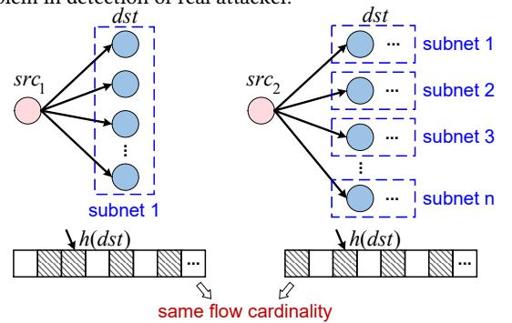

Figure 1: Sketch-based flow cardinality estimation approach.

To address this issue, the hierarchical cardinality estimators [\[5,](#page-8-26) [8,](#page-8-27) [9,](#page-8-28) [17,](#page-8-29) [35,](#page-8-30) [43\]](#page-8-31) have been proposed. For example, Randomized Hierarchical Heavy Hitter (RHHH) [\[5\]](#page-8-26) has a hierarchical structure with multiple layers. As shown in Figure [2,](#page-2-0) each layer uses one cardinality estimator to track the flow cardinality for a specific subnet length. Specifically, for an incoming packet, the host address with different lengths in its destination address is hashed into the corresponding layers. For example, layer 1 estimates subnet cardinality with the last 24 bits of address. Hosts whose flow cardinality exceeds a given threshold in the layer are classified as super hosts.

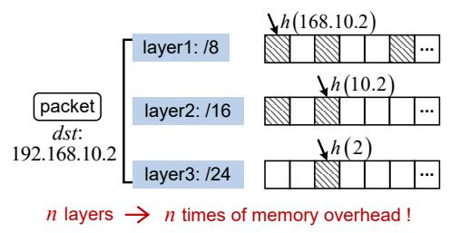

#### Figure 2: Hierarchical approach for cardinality estimation.

Unfortunately, since the subnet length is unknown in advance and can vary across networks, the hierarchical cardinality estimator typically faces a dilemma between detection accuracy and memory usage. Increasing the number of layers can improve detection accuracy by detecting more subnet lengths, but this comes with a dramatic increase in memory usage, making it difficult to be deployed on network devices with small on-chip memory.

### 2.2 Empirical Study

To gain deep insights, we adopt two single-layer cardinality estimation approaches including SpreadSketch [\[40\]](#page-8-2) and Couper [\[39\]](#page-8-23), together with the multi-layer cardinality estimator RHHH to conduct empirical tests on a combined dataset of UNSW-NB15 [\[44\]](#page-8-38) and CAIDA2016 [\[7\]](#page-8-39). This mixed dataset includes realistic normal and attack flows, such as IP scanning and worm propagation.

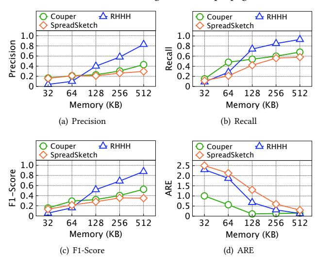

Figure 3: Super spreader detection performance.

The experimental results in Figure [3](#page-2-1) show that all these approaches demonstrate relatively low precision in identifying attack flows across all memory sizes, with RHHH exhibiting higher accuracy compared to the two sketch-based cardinality estimation methods. This is due to the inability of sketch-based cardinality estimation methods to distinguish whether the high-cardinality flows

are within a single subnet or distributed over the entire network. On the other hand, despite its higher precision, RHHH struggles to achieve optimal performance under tight memory budgets due to its high overhead introduced by the multi-layer structure.

Based on the above investigation, we reveal that, under the small memory limitation, it is hard for existing sketch-based or hierarchical cardinality estimation approaches to identify super hosts with huge number of connections sharing the same subnet addresses. These findings motivate us to design a novel approach to accurately identify super hosts based on the common IP prefix identification.

### 3 Design of SegSketch

To address the above challenge, we propose a segmented cardinality estimation scheme called SegSketch that utilizes a compact structure and efficiently identifies super hosts via common IP prefix identification and cardinality estimation.

### 3.1 Data Structure

The data structure of SegSketch is shown in Figure [4,](#page-2-2) which consists of �� rows, each containing �� buckets. Each row is associated with a pairwise-independent hash function ℎ1, ..., ℎ�� . ��(��, ��) represents the bucket at the �� ��ℎ row and �� ��ℎ column, where 1 ≤ �� ≤ �� and 1 ≤ �� ≤ ��. Each bucket consists of three parts: (i) the host key; (ii) the subnet bitmap aiming for estimating the common IP prefix length; and (iii) the host bitmap used to estimate the subnet cardinality.

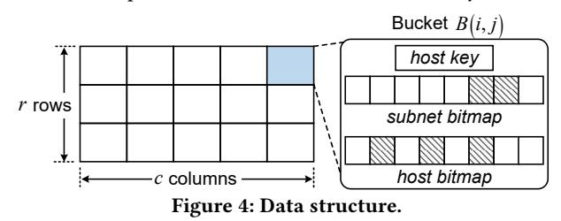

#### 3.2 Key Design

The subnet cardinality is an important feature to assist super-host detection. However, it is hard to get the prior knowledge of subnet information at the measurement nodes, making the subnet cardinality estimation impractical. Different from the hierarchical cardinality estimator requiring large memory usage, the core idea of SegSketch is to leverage a lightweight halved-segment hashing strategy to infer the subnet address length, thereby enabling accurate estimation of flow cardinality within the subnet.

Halved-segment hashing strategy. As shown in Algorithm 1, the halved-segment hashing strategy firstly divides each IP address into �� segments (denoted as ��[1..�� ]) (Lines 1 ∼ 2), each consisting of a fixed length of �� bits. Once a packet arrives, the 2-value hash operation is triggered to hash �� bits in the 1 ���� segment of its IP address to 1 or 0 (Line 7). Then the subnet bitmap is halved into two parts and only one half part is selected according to the hash result (Lines 8 ∼ 9, 14). This operation will be recursively conducted from the 1 ���� to the (�� − 1) ��ℎ segment of IP address (Lines 6, 13, 18 ∼ 19). For all packets of a super host, if one segment of IP addresses across all packets is same, the hash results of this segment will also be the same, leading to selection of the same half in the current subnet bitmap (Line 20). Otherwise, the hash results of this segment across

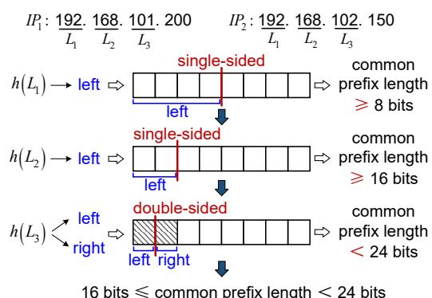

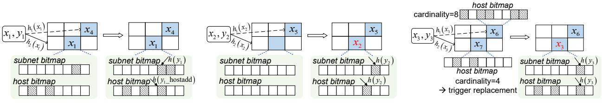

traffic trace captured by MAWI on the trans-Pacific backbone link. (3) The CAIDA dataset consists of anonymized IP traces collected by CAIDA through the Equinix-Chicago monitor.

Since the MAWI and CAIDA datasets do not contain labeled super host attacks, we use the super host attacks from UNSW-NB15 as ground truth, just as same as previous works [\[22,](#page-8-10) [27,](#page-8-41) [29\]](#page-8-12). Using UNSW-NB15 alone limits evaluation to a single benign background, while MAWI and CAIDA offer diverse traffic characteristics, evaluating our method's adaptability to different distributions.

Implementation. SegSketch is compared with Couper [\[39\]](#page-8-23), SpreadSketch [\[40\]](#page-8-2), and RHHH [\[5\]](#page-8-26). All of these schemes are implemented in C++. In the experiments, we focus on super spreader detection by default, where the source IP is used as the host key (4 bytes). For super receiver detection, the destination IP will be used as the host key (4 bytes). The default number of rows is 3 in SegSketch. The threshold scaling factor is set as �� = 0.5 [\[33\]](#page-8-42), with the experiments testing the impact of different �� on detection performance shown in Appendix B.1. The hash functions of SegSketch are implemented using Bob Hash [\[26\]](#page-8-43) with different random seeds. For other schemes, we use their recommended parameter settings.

Methodology. (1) Couper [\[39\]](#page-8-23) proposes a two-layer design. The first layer uses bitmaps to estimate the number of distinct IPs contacted by low-cardinality hosts, while the second layer tracks high-cardinality hosts using Multi-Resolution Bitmaps or Hyper-LogLog estimators. Couper detects super hosts by inserting hosts into a candidate table whenever their estimated cardinalities increase. At the end of each measurement epoch, it reports those whose estimated cardinalities exceed a predefined threshold.

(2) SpreadSketch [\[40\]](#page-8-2) stores candidate host key, Multi-Resolution Bitmap for cardinality estimation, and the maximum number of leading zero bits in the IP hash string for replacement decision. After each epoch, it traverses all buckets and reports any host whose estimated cardinality exceeds the threshold as a super host.

(3) RHHH [\[5\]](#page-8-26) maintains a multi-level prefix hierarchy, where each layer tracks flows with a specific prefix length, and uses Linear Counting to estimate cardinality within the corresponding subnet.

Platform. The experiments are conducted on a Mac laptop with an Intel Core i7 CPU running at 2.30GHz, providing four physical cores and supporting simultaneous multithreading. It is equipped with 32GB of RAM. Each CPU core incorporates a multi-level cache hierarchy that includes a 64KB L1 cache (divided into separate instruction and data caches), a private 256KB L2 cache, and a shared 6MB L3 cache. Ubuntu 18.04.3 is used as the operating system.

Metrics. We evaluate whether SegSketch achieves a favorable balance between accuracy and speed. To assess measurement accuracy, we employ Precision, Recall, F1-Score, and Average Relative Error (ARE). Processing speed is quantified by throughput.

- Precision: the fraction of the number of true super hosts reported over the number of all super hosts reported.
- Recall: the fraction of the number of true super hosts reported over the number of real super hosts.
- F1-Score: 2×Precision×Recall Precision+Recall , the harmonic mean of Precision and Recall.
- Average Relative Error (ARE): 1 Ψ Í ���� ∈Ψ |��(���� )−��ˆ(���� ) | ��(���� ) , where Ψ is the set of reported super hosts, ��(����) and ��ˆ(����) are the real and estimated subnet cardinalities of host ���� , respectively.

- Throughput: the ratio of the number of inserted packets to the entire monitoring time. Million packets inserted per second (Mpps) is used as the unit.

### 5.2 Accuracy of Super Host Detection

Super spreader detection. We evaluate super spreader detection on the mixed MAWI and CAIDA datasets, each combined with UNSW-NB15. The results on the mixed MAWI dataset are provided in Appendix B.2. As shown in Figure [8,](#page-5-0) SegSketch consistently outperforms SpreadSketch, Couper, and RHHH. Under 32KB memory, it achieves Precision improvements of 4.63×, 4.42×, and 21.50×, Recall gains of 2.01×, 1.31×, and 2.84×, and F1-Score increases of 2.73×, 2.18×, and 8.04×, while reducing ARE by 86.08%, 68.00%, and 87.20%, compared to SpreadSketch, Couper, and RHHH, respectively. The performance gains of SegSketch arise from its integration of common prefix inference and subnet cardinality estimation. By adopting a lightweight halved-segment hashing strategy, SegSketch avoids explicit bitwise recording and comparison on IPs, significantly reducing memory overhead and per-packet processing cost.

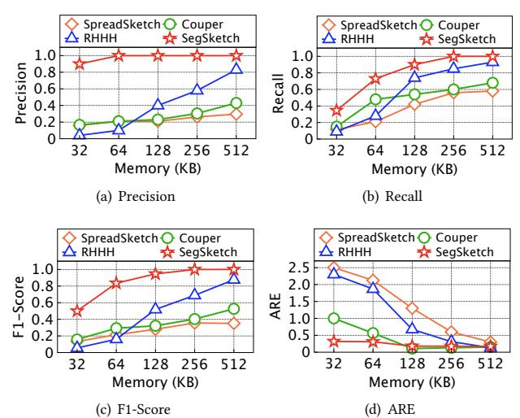

Figure 8: Super spreader detection performance on the dataset mixing UNSW-NB15 with CAIDA2016.

The inferior performance of SpreadSketch and Couper stems from their inability to distinguish whether a host's connections reside within the same subnet. By treating all destination IPs equally, they often misclassify benign hosts communicating with a large number of diverse peers as super hosts, resulting in high false positives and reduced precision. Moreover, their estimation of flow cardinality, rather than subnet cardinality, leads to higher ARE.

RHHH identifies hosts with common prefixes using multiple prefix-level estimators. However, lacking prior knowledge of subnet lengths, it must maintain estimators for all possible prefix lengths per host, resulting in substantial memory overhead and reduced accuracy under limited memory. Increasing the number of estimators shrinks their individual sizes, causing frequent hash collisions within each estimator and inaccurate cardinality estimation, while reducing the number of estimators impairs prefix resolution. Choosing a shorter prefix aggregates unrelated addresses and overestimates cardinality, while the opposite leads to underestimation.

Super receiver detection. To evaluate the performance of different approaches in detecting super receivers, we conduct experiments on the mixed MAWI and CAIDA datasets. The results on the mixed MAWI are in Appendix B.2. All four algorithms are adapted to estimate the cardinality of source IPs. SegSketch still surpasses the baselines. As shown in Figure [9,](#page-6-0) with 32KB memory, SegSketch improves F1-Score by 5.08×, 4.17×, and 2.77× over SpreadSketch, Couper, and RHHH, respectively. Similar to super spreader detection, the gains come from SegSketch's combination of common prefix inference and subnet cardinality estimation. These results validate the effectiveness of SegSketch in detecting super receivers.

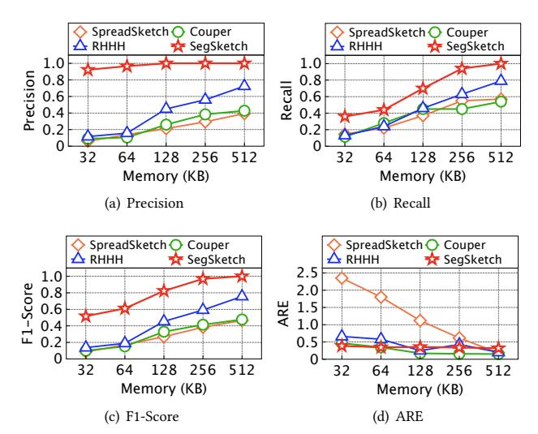

Figure 9: Super receiver detection performance on the dataset mixing UNSW-NB15 with CAIDA2016.

### 5.3 Scalability

To evaluate robustness under varying super host ratios, we test four methods with 64KB memory on the CAIDA2016 dataset, injected with different ratios of super spreaders from UNSW-NB15. The evaluated ratios of super spreaders to benign hosts are approximately 1:20, 1:25, 1:33, and 1:50. Results are shown in Figure [11.](#page-6-1)

The results show that as the ratio of super spreaders increases, Precision, Recall, and F1-Score of all methods decline, while ARE rises due to intensified hash collisions and more frequent evictions. However, SegSketch consistently outperforms other schemes, sustaining an F1-Score of 0.79 and an ARE of 0.32 even at 1:20 ratio. This robustness is attributed to halved-segment hashing in the subnet bitmap and host-address hashing in the host bitmap, which together improve memory efficiency and enhance the accuracy of subnet cardinality estimation. These results demonstrate that SegSketch effectively maintains high detection accuracy under constrained memory even in scenarios with a high ratio of super hosts. The 1:33 ratio is used across the other experiments.

# 5.4 Parameter Evaluation

Varying the IP segment width. To assess the impact of segment width on prefix length estimation, we evaluate SegSketch with �� set to 2, 4, 6, and 8 bits using the mixed MAWI and CAIDA datasets. As shown in Figure [12,](#page-6-2) when �� = 2 or �� = 4, the average absolute estimation error remains near 0.3, demonstrating highly accurate

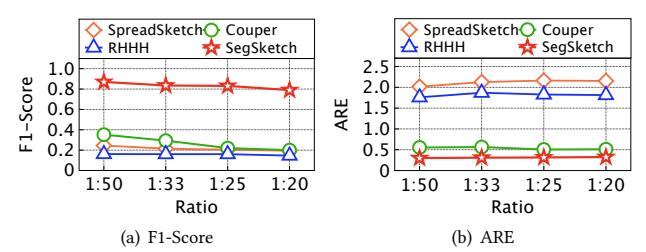

Figure 11: Impact of varying ratios of super spreaders.

inference under fine-grained segmentation. Although the error increases with �� = 6 and �� = 8, it remains below 1.5 across both datasets. This confirms that halved-segment hashing provides robust and accurate prefix estimation across a broad range of segment widths. We further evaluate the effect of varying �� on super host detection, with the results in Appendix B.3. Given the trade-off between accuracy and computational overhead, we set �� = 4.

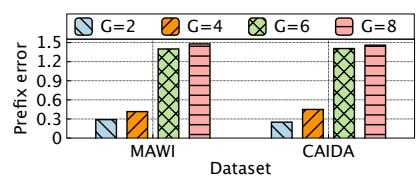

Figure 12: Common prefix length estimation error.

Varying the size of the host bitmap. To evaluate the impact of various host bitmap sizes on super host detection, we configure SegSketch with host bitmap sizes ranging from 0.2KB to 1KB and conduct experiments on the mixed CAIDA dataset.

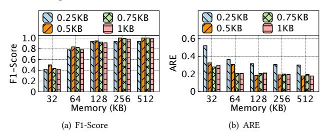

Figure 13: Impact of varying host bitmap size.

As illustrated in Figure [13,](#page-6-3) large host bitmap sizes (e.g., 0.75KB and 1KB) cause insufficient sketch buckets under limited total memory, leading to intense hash collisions among hosts and wrong evictions of true super hosts. For instance, with a total memory of 32KB, a 0.5KB bitmap achieves an F1-Score of 0.5, outperforming the 0.75KB and 1KB settings by 14.67% and 19.04%, respectively. Conversely, a small bitmap size (e.g., 0.25KB) provides too few bitmap cells relative to a host's cardinality, causing severe hash collisions among connections of the same host and degrading cardinality estimation accuracy. This leads to erroneous replacements and hinders correct super host identification, such that even with 512KB memory, the F1-Score remains below 1.0. These results indicate that both excessively small and large bitmap sizes are suboptimal. Therefore, we set each host bitmap as 0.5KB.

### 5.5 Throughput

We evaluate the throughput of all four methods across varying memory sizes using the mixed MAWI and CAIDA datasets. The results for the mixed MAWI are provided in Appendix B.4. As shown

in Figure [14,](#page-7-0) SegSketch consistently achieves the highest throughput, reaching 28 Mpps even under the minimal memory condition of 32KB. This performance is attributed to its lightweight halvedsegment hashing and compact bitmap-based cardinality estimation, reducing overhead compared to RHHH's hierarchical estimators, SpreadSketch's multi-level scanning in Multi-Resolution Bitmap, and Couper's dual-layer design. These results confirm that SegSketch offers both high detection accuracy and processing efficiency, making it well suited for deployment in high-speed networks.

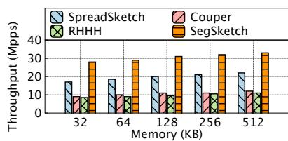

Figure 14: Throughput on the mixed CAIDA dataset.

# 6 Performance on P4

We implement the prototypes of SpreadSketch, Couper, RHHH and SegSketch using P4 [\[38\]](#page-8-32) and deploy them on the Wedge 100BF-32X programmable switch [\[4\]](#page-8-44). Due to the lack of support for complex instructions on the Tofino architecture, certain data structures such as heaps cannot be efficiently implemented in the data plane, and thus we integrate the control plane as assistance. For the halvedsegment hashing strategy of SegSketch on P4, we derive a mask from the hash value of the IP segment and use it to extract the corresponding region of bits from the bitmap. A value greater than zero indicates that at least one bit within the specified region has been set, otherwise the region remains unmarked.

Table 2: P4 usage percentage comparison.

| Resource          | SpreadSketch | Couper | RHHH   | SegSketch |
|-------------------|--------------|--------|--------|-----------|
| Match Crossbar    | 2.66%        | 6.17%  | 9.07%  | 4.12%     |
| Hash Dist Unit    | 12.50%       | 18.06% | 33.33% | 11.11%    |
| Gateways          | 6.77%        | 8.85%  | 15.10% | 4.69%     |
| VLIW Instructions | 3.39%        | 4.43%  | 7.55%  | 2.34%     |
| SRAM              | 1.67%        | 12.60% | 3.65%  | 1.77%     |
| TCAM              | 0.35%        | 0.35%  | 1.74%  | 0.69%     |
| Stateful ALU      | 12.50%       | 12.50% | 25.00% | 8.33%     |

Table [2](#page-7-1) compares the P4 resource usage of SegSketch with SpreadSketch, Couper, and RHHH. SegSketch reduces the hash distribution unit usage to 11.11%, lower than other methods. Couper incurs 18.06% due to frequent hash operations across two register layers, while RHHH shows the highest due to maintaining multiple estimators per host. For on-chip memory, SegSketch and SpreadSketch exhibit lower SRAM usage owing to compact register usage. SegSketch also exhibits the lowest consumption of gateways, VLIW instructions, and stateful ALUs. These results highlight the resource efficiency of SegSketch for deployment on programmable switches.

# 7 Related Work

# 7.1 Sketch-Based Cardinality Estimation

Existing sketch-based cardinality estimation methods fall into two categories. The first focuses on single-host cardinality estimation [\[14,](#page-8-35) [19,](#page-8-25) [48\]](#page-8-24), using compact structures such as bitmaps or register arrays to estimate the cardinality of a single source or destination. The second targets multi-host cardinality estimation [\[30,](#page-8-45) [32,](#page-8-22) [40,](#page-8-2) [45,](#page-8-46) [47,](#page-8-34) [49,](#page-8-47) [50\]](#page-9-0) by combining multiple single-host cardinality estimators such as Multi-Resolution Bitmaps [\[14\]](#page-8-35).

Specifically, SpreadSketch [\[40\]](#page-8-2) stores candidate host key, Multi-Resolution Bitmap, and the maximum number of leading zeros in the IP hash string per bucket, with replacement decided by comparing leading-zero counts. CDS [\[47\]](#page-8-34) and VBF [\[30\]](#page-8-45) employ algebraically reversible hashing based on the Chinese Remainder Theorem to recover high-cardinality hosts. To mitigate inefficiency from uniform memory allocation under skewed cardinality distribution, Couper [\[39\]](#page-8-23) introduces a two-layer structure guided by the coupon collector's principle, retaining small flows in the first layer and transferring large ones to the second layer.

However, these approaches struggle to distinguish malicious super hosts from benign ones that connect to many diverse IPs across the whole network, as they ignore whether connections share the same subnet address, leading to high false positive rates.

# 7.2 Hierarchical Methods for HHH Detection

Hierarchical Heavy Hitters (HHHs) are flows sharing a common IP prefix whose cumulative packet counts exceed a given threshold.

The work of [\[35\]](#page-8-30) maintains a Space Saving [\[34\]](#page-8-48) instance per prefix level, updating all�� layers per packet and estimating frequencies by subtracting sub-prefix contributions, which incurs ��(��) update cost per packet. Other methods, such as [\[9\]](#page-8-28) with ��(�� · log(��/��)) and [\[43\]](#page-8-31) with ��(�� 3/2 /��) complexity, where �� is the allowed relative estimation error for each flow's frequency, also suffer from high processing overhead. RHHH [\[5\]](#page-8-26) reduces the complexity to ��(1) by randomly selecting a prefix level to update for each packet.

Although these hierarchical methods can detect super hosts with common IP prefixes by replacing counters with single-host cardinality estimators, this requires maintaining estimators for all possible prefix lengths since subnet lengths are unknown beforehand and can vary across networks. This leads to rapidly increasing memory overhead, making them unsuitable for on-chip deployment.

### 8 Conclusion

We propose SegSketch, a novel sketch for accurate and efficient super-host detection that accounts for both high cardinality and common subnet address characteristics. SegSketch employs a lightweight halved-segment hashing strategy to infer subnet prefix lengths and utilizes bitmap-based cardinality estimators to estimate cardinality within subnet. Theoretical analysis quantifies the cardinality estimation error of SegSketch. We implement SegSketch on a Barefoot Tofino switch using P4 and conduct trace-driven experiments, confirming that SegSketch outperforms state-of-the-art solutions in detection accuracy, memory efficiency, and throughput.

# Acknowledgment

We thank the anonymous reviewers for their valuable comments. This work was supported by the National Natural Science Foundation of China (U24A20245, 62132022) and the Science and Technology Innovation Program of Hunan Province (2024RC1005). This work was carried out in part using computing resources at the High Performance Computing Center of Central South University. Jiawei Huang is the corresponding author.

### References

[1] 2026. SegSketch Repository. [https://github.com/Elaine-codebase/SegSketch-](https://github.com/Elaine-codebase/SegSketch-Repository)[Repository.](https://github.com/Elaine-codebase/SegSketch-Repository) [2] Qasem Abu Al-Haija, Eyad Saleh, and Mohammad Alnabhan. 2021. Detecting port scan attacks using logistic regression. In Proceedings of IEEE International Symposium on Advanced Electrical and Communication Technologies. 1–5. [3] Manos Antonakakis, Tim April, Michael Bailey, Matt Bernhard, Elie Bursztein, Jaime Cochran, Zakir Durumeric, J Alex Halderman, Luca Invernizzi, Michalis Kallitsis, et al. 2017. Understanding the mirai botnet. In Proceedings of USENIX Security Symposium. 1093–1110. [4] Barefoot Networks. 2016. Barefoot's Tofino. [https://barefootnetworks.com/](https://barefootnetworks.com/products/brief-tofino) pro[ducts/brief-tofino.](https://barefootnetworks.com/products/brief-tofino) [5] Ran Ben Basat, Gil Einziger, Roy Friedman, Marcelo C Luizelli, and Erez Waisbard. 2017. Constant time updates in hierarchical heavy hitters. In Proceedings of the Conference of the ACM Special Interest Group on Data Communication (SIGCOMM). 127–140. [6] Catalin Cimpanu. 2019. Carpet-bombing ddos attack takes down south african isp for an entire day. [https://www.zdnet.com/article/carpet-bombing-ddos-attack](https://www.zdnet.com/article/carpet-bombing-ddos-attack-takes-down-south-african-isp-for-an-entire-day/)[takes-down-south-african-isp-for-an-entire-day/.](https://www.zdnet.com/article/carpet-bombing-ddos-attack-takes-down-south-african-isp-for-an-entire-day/) [7] Center for Applied Internet Data Analysis. 2016. The CAIDA Anonymized Internet Traces Dataset. [https://catalog.caida.org/dataset/passive\\_2016\\_pcap.](https://catalog.caida.org/dataset/passive_2016_pcap) [8] Graham Cormode, Flip Korn, S Muthukrishnan, and Divesh Srivastava. 2004. Diamond in the rough: Finding hierarchical heavy hitters in multi-dimensional data. In Proceedings of ACM SIGMOD International Conference on Management of Data. 155–166. [9] Graham Cormode, Flip Korn, S Muthukrishnan, and Divesh Srivastava. 2008. Finding hierarchical heavy hitters in streaming data. ACM Transactions on Knowledge Discovery from Data 1, 4 (2008), 1–48. [10] Leonardo Henrique De Melo, Gustavo de Carvalho Bertoli, Michele Nogueira, Aldri Luiz Dos Santos, and Lourenço Alves Pereira. 2025. Anomaly-Flow: A Multi-domain Federated Generative Adversarial Network for Distributed Denialof-Service Detection. IEEE Network (2025), 1–1. [11] Damu Ding, Marco Savi, Federico Pederzolli, Mauro Campanella, and Domenico Siracusa. 2021. In-network volumetric DDoS victim identification using programmable commodity switches. IEEE Transactions on Network and Service Management 18, 2 (2021), 1191–1202. [12] Yang Du, He Huang, Yu-E Sun, Kejian Li, Boyu Zhang, and Guoju Gao. 2023. A better cardinality estimator with fewer bits, constant update time, and mergeability. In Proceedings of IEEE International Conference on Computer Communications (INFOCOM). 1–10. [13] Zakir Durumeric, Michael Bailey, and J Alex Halderman. 2014. An Internet-Wide view of Internet-Wide scanning. In Proceedings of USENIX Security Symposium. 65–78. [14] Cristian Estan, George Varghese, and Mike Fisk. 2003. Bitmap algorithms for counting active flows on high speed links. In Proceedings of ACM SIGCOMM Conference on Internet Measurement. 153–166. [15] FastNetMon. 2023. Rise of carpet bombing attacks. [https://fastnetmon.com/2023/](https://fastnetmon.com/2023/10/24/rise-of-carpet-bombing-ddos-attacks-and-ways-to-detect-and-defend-against-them-using-fastnetmon-advanced/) [10/24/rise-of-carpet-bombing-ddos-attacks-and-ways-to-detect-and-defend](https://fastnetmon.com/2023/10/24/rise-of-carpet-bombing-ddos-attacks-and-ways-to-detect-and-defend-against-them-using-fastnetmon-advanced/)[against-them-using-fastnetmon-advanced/.](https://fastnetmon.com/2023/10/24/rise-of-carpet-bombing-ddos-attacks-and-ways-to-detect-and-defend-against-them-using-fastnetmon-advanced/) [16] FS-ISAC. 2025. DDoS Attackers Increase Targeting of Global Financial Sector, According to FS-ISAC and Akamai Report. [https://www.fsisac.com/newsroom/ddos](https://www.fsisac.com/newsroom/ddos-attackers-increase-targeting-of-global-financial-sector-according-to-fsisac-and-akamai-report)[attackers-increase-targeting-of-global-financial-sector-according-to-fsisac](https://www.fsisac.com/newsroom/ddos-attackers-increase-targeting-of-global-financial-sector-according-to-fsisac-and-akamai-report)[and-akamai-report.](https://www.fsisac.com/newsroom/ddos-attackers-increase-targeting-of-global-financial-sector-according-to-fsisac-and-akamai-report) [17] Cormode Graham, Korn Flip, Muthukrishnan Shanmugavelayutham, and Srivastava Divesh. 2003. Finding hierarchical heavy hitters in data streams. In Proceedings of ACM International Conference on Very Large Data Bases (VLDB). 464–475. [18] Tiago Heinrich, Rafael R. Obelheiro, and Carlos A. Maziero. 2021. New kids on the DRDoS block: Characterizing multiprotocol and carpet bombing attacks. In International Conference on Passive and Active Network Measurement. 269–283. [19] Stefan Heule, Marc Nunkesser, and Alexander Hall. 2013. Hyperloglog in practice: Algorithmic engineering of a state of the art cardinality estimation algorithm. In Proceedings of International Conference on Extending Database Technology. 683–692. [20] Hirsi Abdinasir, Audah Lukman, Salh, Adeb. 2024. SDN-DDoS Traffic Dataset. [https://data.mendeley.com/datasets/b7vw628825/1.](https://data.mendeley.com/datasets/b7vw628825/1) [21] Esra Hotoğlu, Sevil Sen, and Burcu Can. 2025. A Comprehensive Analysis of Adversarial Attacks against Spam Filters. arXiv preprint arXiv:2505.03831 (2025). [22] Zhen Huang, Shang Liu, Ke Zhao, and Yong Xiang. 2024. GMCB: An Efficient and Light Graph Analysis Model for Detecting Carpet Bombing DDoS Attacks. In Proceedings of IEEE International Conference on Computer and Communications. 1918–1922. [23] Itay Raviv. 2023. DDoS Carpet-Bombing – Coming In Fast And Brutal. [https://www.radware.com/blog/ddos-protection/ddos-carpet-bombing](https://www.radware.com/blog/ddos-protection/ddos-carpet-bombing-coming-in-fast-and-brutal/)[coming-in-fast-and-brutal/.](https://www.radware.com/blog/ddos-protection/ddos-carpet-bombing-coming-in-fast-and-brutal/) [24] Xuyang Jing, Hui Han, Zheng Yan, and Witold Pedrycz. 2021. SuperSketch: A multi-dimensional reversible data structure for super host identification. IEEE Transactions on Dependable and Secure Computing (TDSC) 19, 4 (2021), 2741–2754. [25] Xuyang Jing, Zheng Yan, Hui Han, and Witold Pedrycz. 2021. ExtendedSketch: Fusing network traffic for super host identification with a memory efficient sketch. IEEE Transactions on Dependable and Secure Computing (TDSC) 19, 6 (2021), 3913–3924. [26] Robert J. Jenkins Jr. 1995. Hash Functions for Hash Table Lookup. [http:](http://burtleburtle.net/bob/hash/evahash.html) [//burtleburtle.net/bob/hash/evahash.html.](http://burtleburtle.net/bob/hash/evahash.html) [27] Sian Kim, Changhun Jung, Rhongho Jang, David Mohaisen, and Dae Hun Nyang. 2023. A robust counting sketch for data plane intrusion detection. In Proceedings of Annual Network and Distributed System Security Symposium. [28] Tatyana Kulikova, Olga Svistunova, Roman Dedenok, Andrey Kovtun, Irina Shimko, and Anna Lazaricheva. 2024. Spam and phishing in 2024. [https://](https://securelist.com/spam-and-phishing-report-2024/115536/) [securelist.com/spam-and-phishing-report-2024/115536/.](https://securelist.com/spam-and-phishing-report-2024/115536/) [29] Qingyang Li, Yihang Zhang, Zhidong Jia, Yannan Hu, Lei Zhang, Jianrong Zhang, Yongming Xu, Yong Cui, Zongming Guo, and Xinggong Zhang. 2024. Dollm: How large language models understanding network flow data to detect carpet bombing ddos. arXiv preprint arXiv:2405.07638 (2024). [30] Weijiang Liu, Wenyu Qu, Jian Gong, and Keqiu Li. 2015. Detection of superpoints using a vector bloom filter. IEEE Transactions on Information Forensics and Security (TIFS) 11, 3 (2015), 514–527. [31] Chaoyi Ma, Shigang Chen, Youlin Zhang, Qingjun Xiao, and Olufemi O Odegbile. 2021. Super spreader identification using geometric-min filter. IEEE/ACM Transactions on Networking (TON) 30, 1 (2021), 299–312. [32] Chaoyi Ma, Olufemi O Odegbile, Dimitrios Melissourgos, Haibo Wang, and Shiping Chen. 2023. From CountMin to Super kJoin Sketches for Flow Spread Estimation. IEEE Transactions on Network Science and Engineering 11, 3 (2023), 2353–2370. [33] Qingxin Mao, Daisuke Makita, Michel van Eeten, Katsunari Yoshioka, and Tsutomu Matsumoto. 2024. Characteristics Comparison between Carpet Bombingtype and Single Target DRDoS Attacks Observed by Honeypot. Journal of Information Processing 32 (2024), 731–747. [34] Ahmed Metwally, Divyakant Agrawal, and Amr El Abbadi. 2005. Efficient computation of frequent and top-k elements in data streams. In Proceedings of Springer International Conference on Database Theory. 398–412. [35] Michael Mitzenmacher, Thomas Steinke, and Justin Thaler. 2012. Hierarchical heavy hitters with the space saving algorithm. In Proceedings of Workshop on Algorithm Engineering and Experiments. 160–174. [36] Netresec. 2012. Capture files from Mid-Atlantic CCDC. [https://www.netresec.](https://www.netresec.com/?page=MACCDC) [com/?page=MACCDC.](https://www.netresec.com/?page=MACCDC) [37] Jorge Pacheco Omer Yoachimik. 2025. Targeted by 20.5 million DDoS attacks, up 358% year-over-year: Cloudflare's 2025 Q1 DDoS Threat Report. [https://blog.](https://blog.cloudflare.com/ddos-threat-report-for-2025-q1/) [cloudflare.com/ddos-threat-report-for-2025-q1/.](https://blog.cloudflare.com/ddos-threat-report-for-2025-q1/) [38] P4 Language Consortium. 2015. P4 Language. [https://p4.org.](https://p4.org) [39] Xun Song, Jiaqi Zheng, Hao Qian, Shiju Zhao, Hongxuan Zhang, Xuntao Pan, and Guihai Chen. 2023. Couper: Memory-Efficient Cardinality Estimation under Unbalanced Distribution. In Proceedings of IEEE International Conference on Data Engineering. 2753–2765. [40] Lu Tang, Yao Xiao, Qun Huang, and Patrick PC Lee. 2022. A high-performance invertible sketch for network-wide superspreader detection. IEEE/ACM Transactions on Networking (TON) 31, 2 (2022), 724–737. [41] Terry Young. 2024. Carpet-bombing attacks highlight the need for intelligent and automated ddos protection. [https://www.a10networks.com/blog/carpet](https://www.a10networks.com/blog/carpet-bombing-attacks-highlight-the-need-for-intelligent-and-automated-ddos-protection)[bombing-attacks-highlight-the-need-for-intelligent-and-automated-ddos](https://www.a10networks.com/blog/carpet-bombing-attacks-highlight-the-need-for-intelligent-and-automated-ddos-protection)[protection.](https://www.a10networks.com/blog/carpet-bombing-attacks-highlight-the-need-for-intelligent-and-automated-ddos-protection) [42] The Measurement and Analysis on the WIDE Internet (MAWI) Working Group. 2000. MAWI Working Group Traffic Archive. [http://mawi.wide.ad.jp/mawi/.](http://mawi.wide.ad.jp/mawi/) [43] Patrick Truong and Fabrice Guillemin. 2009. Identification of heavyweight address prefix pairs in IP traffic. In Proceedings of IEEE International Teletraffic Congress. 1–8. [44] UNSW Canberra at ADFA. 2015. The UNSW-NB15 Dataset. [https://research.](https://research.unsw.edu.au/projects/unsw-nb15-dataset) [unsw.edu.au/projects/unsw-nb15-dataset.](https://research.unsw.edu.au/projects/unsw-nb15-dataset) [45] Haibo Wang, Chaoyi Ma, Olufemi O Odegbile, Shigang Chen, and Jih-Kwon Peir. 2021. Randomized error removal for online spread estimation in data streaming. (2021), 1040—-1052. [46] Jincheng Wang, Le Yu, John Lui, and Xiapu Luo. 2025. Modern DDoS Threats and Countermeasures: Insights into Emerging Attacks and Detection Strategies. arXiv preprint arXiv:2502.19996 (2025). [47] Pinghui Wang, Xiaohong Guan, Tao Qin, and Qiuzhen Huang. 2011. A data streaming method for monitoring host connection degrees of high-speed links. IEEE Transactions on Information Forensics and Security (TIFS) 6, 3 (2011), 1086– 1098. [48] Kyu-Young Whang, Brad T Vander-Zanden, and Howard M Taylor. 1990. A linear-time probabilistic counting algorithm for database applications. ACM Transactions on Database Systems 15, 2 (1990), 208–229. [49] Qingjun Xiao, Shigang Chen, Min Chen, and Yibei Ling. 2015. Hyper-compact virtual estimators for big network data based on register sharing. In Proceedings of the ACM International Conference on Measurement and Modeling of Computer Systems (SIGMETRICS). 417–428.

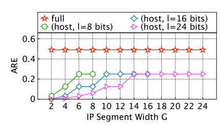

Figure 15: ARE of subnet cardinality estimation through fulladdress and host-address hashing. �� represents subnet length.

Figure [15](#page-10-0) compares the Average Relative Error (ARE) of |��ˆ ℎ������ (��) − ��(��)|/��(��) under varying IP segment width�� with -|��ˆ �� ������ (��) − ��(��)|/��(��) . The increase of ARE for host-address hashing as �� increases indicates that estimating subnet cardinality though host-address hashing yields lower estimation error with finer IP segmentation. Moreover, for all values of ��, host-address hashing consistently achieves lower ARE than full-address hashing.

# B Experimental Results

### B.1 Impact of Threshold Scaling Factor �� on Super Host Detection

The threshold scaling factor �� adjusts the detection threshold for identifying super hosts. Specifically, it ensures that the threshold is proportional to the number of distinct connections a host can make within a subnet. Tuning �� can strike a balance between precision and recall, with the results shown in Table 3.

Table 3: Impact of �� on detection performance.

| Memory (KB) | ��   | Precision | Recall | F1-Score |
|-------------|------|-----------|--------|----------|
|             | 0.35 | 0.45      | 0.36   | 0.40     |
| 32          | 0.50 | 0.90      | 0.35   | 0.50     |
|             | 0.65 | 0.91      | 0.34   | 0.50     |
|             | 0.35 | 0.500     | 0.75   | 0.60     |
| 64          | 0.50 | 1.00      | 0.73   | 0.84     |
|             | 0.65 | 1.00      | 0.38   | 0.55     |
|             | 0.35 | 0.53      | 0.91   | 0.67     |
| 128         | 0.50 | 1.00      | 0.90   | 0.95     |
|             | 0.65 | 1.00      | 0.52   | 0.68     |
|             | 0.35 | 0.57      | 1.00   | 0.73     |
| 256         | 0.50 | 1.00      | 1.00   | 1.00     |
|             | 0.65 | 1.00      | 0.66   | 0.80     |
|             | 0.35 | 0.59      | 1.00   | 0.74     |
| 512         | 0.50 | 1.00      | 1.00   | 1.00     |
|             | 0.65 | 1.00      | 0.68   | 0.81     |

Based on the above results, we recommend using smaller �� to reduce false negatives and prioritize recall, and larger �� to reduce false positives and prioritize precision. Considering these factors, we set �� as 0.5.

### B.2 Accuracy of Super Host Detection

Super spreader detection. We further evaluate the detection performance of SegSketch on the mixed dataset constructed from MAWI2021 and UNSW-NB15, with results presented in Figure [16.](#page-10-1) SegSketch again consistently outperforms all other schemes under all memory configurations. Under the smallest memory budget of 32KB, it achieves higher Precision by 3.53×, 4.45×, and 28.60×, higher Recall by 1.60×, 1.12×, and 2.45×, and higher F1-Score by 2.45×, 2.57×, and 5.29×, while reducing ARE by 88.57%, 18.18%, and 65.38%, compared to SpreadSketch, Couper, and RHHH, respectively.

The advantage of SegSketch becomes more pronounced under lower memory due to its efficient subnet-aware design, which enables accurate super-host detection with minimal resource usage. As memory increases, all methods show improved performance. However, SegSketch maintains a clear lead due to its ability to distinguish hosts targeting a single subnet versus those spreading connections across the whole network. In contrast, SpreadSketch and Couper suffer from high false positives, while RHHH performs poorly under limited memory because of its costly multi-layer estimator structure.

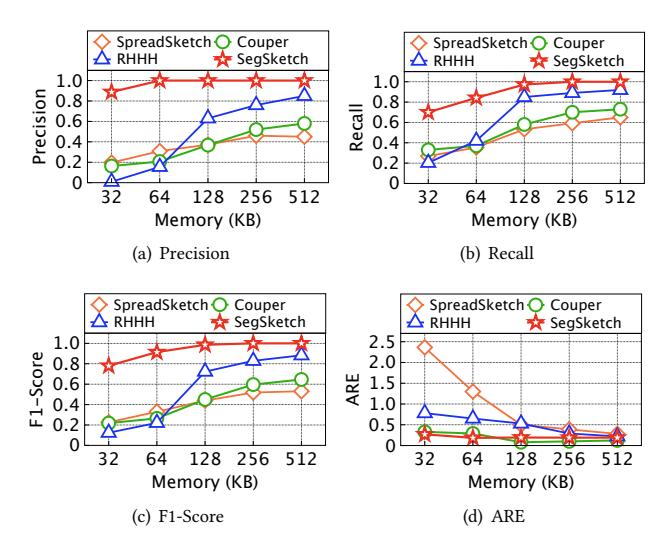

Figure 16: Super spreader detection performance on the dataset mixing UNSW-NB15 with MAWI2021.

Super receiver detection. For super receiver detection, we switch the host key to the destination IP address and conduct evaluation on the mixed MAWI dataset. Results in Figure [17](#page-11-1) exhibit that, under 32KB memory, SegSketch improves F1-Score by 8.97×, 3.74×, and 7.07× over SpreadSketch, Couper, and RHHH, respectively. These improvements highlight SegSketch's advantage.

The primary performance improvement of SegSketch is still attributed to its subnet cardinality estimation mechanism, which reduces false positives by filtering out benign high-cardinality hosts that communicate with many distinct IP addresses across the whole network.

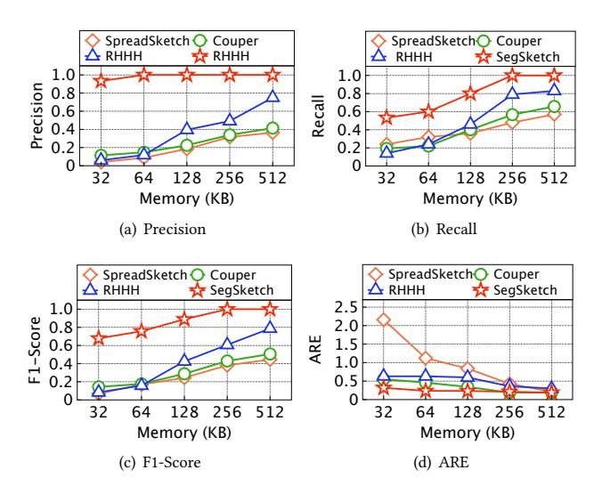

Figure 17: Super receiver detection performance on the dataset mixing UNSW-NB15 with MAWI2021.

### B.3 Impact of IP Segment Width on Super Host Detection

As shown in Figure [18\(a\),](#page-11-2) smaller �� enables finer segmentation and more accurate prefix estimation, leading to improved detection accuracy under limited memory. F1-Score increases as �� decreases from 8 to 2. Figure [18\(b\)](#page-11-3) shows that ARE remains stable across different ��, indicating that prefix estimation error has limited impact on subnet cardinality estimation. Given the trade-off between accuracy and computational overhead, we set �� = 4.

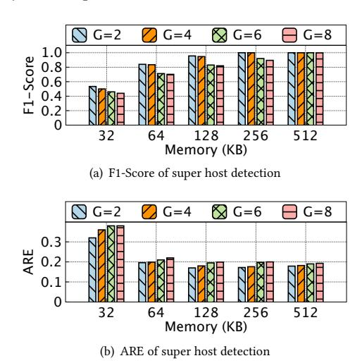

Figure 18: Impact of varying IP segment width ��.

# B.4 Throughput

We further evaluate the throughput of all four methods on the mixed MAWI dataset, with results shown in Figure [19.](#page-11-4) Consistent with the results on the mixed CAIDA dataset, SegSketch achieves the highest throughput across all memory settings. Under the tightest memory constraint of 32KB, it still maintains over 29 Mpps, significantly outperforming SpreadSketch, Couper, and RHHH.

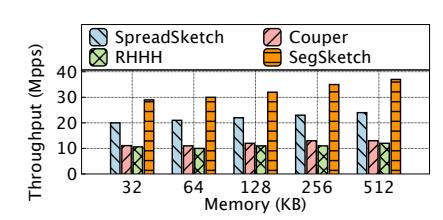

Figure 19: Throughput on the mixed MAWI dataset.

The efficiency of SegSketch stems from its computationally lightweight design, where the halved-segment hashing and the bitmap-based cardinality estimation enables fast updates. Conversely, SpreadSketch incurs extra cost from operations in Multi-Resolution Bitmaps, Couper requires maintaining dual-layer estimators, and RHHH suffers from complex multi-layer estimator updates. These observations further validate that SegSketch is not only memory-efficient and accurate, but also well-suited for online deployment in high-speed network environments.