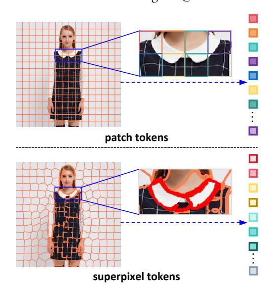
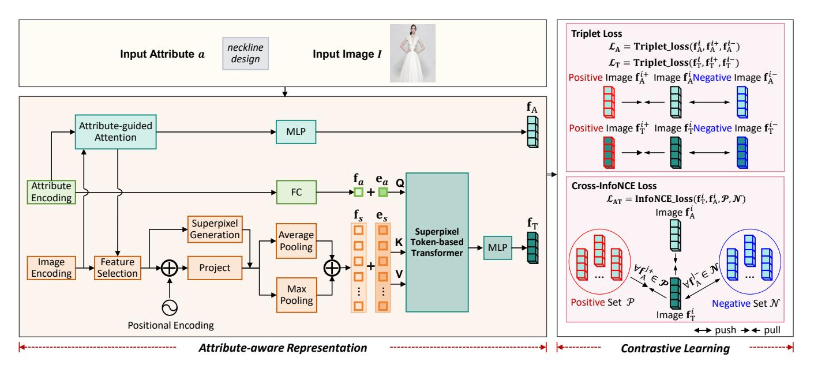
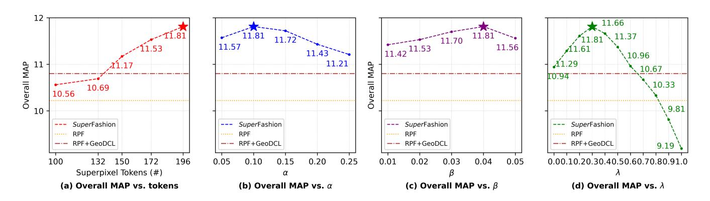
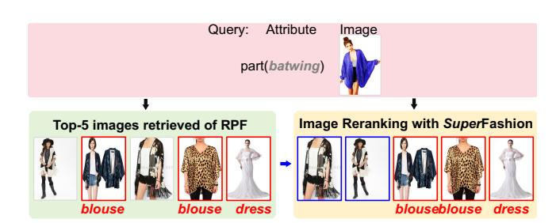
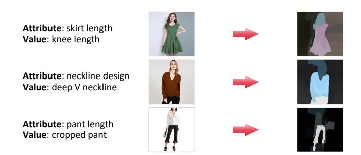

# Beyond Patches: Superpixel Token-based Transformers for Attribute-Specific Fashion Retrieval

Shuili Zhang∗ Hongzhang Mu∗ Institute of Information Engineering, Chinese Academy of Sciences School of Cyber Security, UCAS‡ Beijing, China zhangshuili@iie.ac.cn muhongzhang@iie.ac.cn

Wenyuan Zhang Institute of Information Engineering, Chinese Academy of Sciences School of Cyber Security, UCAS‡ Beijing, China zhangwenyuan@iie.ac.cn

Duohe Ma† Tingwen Liu† Institute of Information Engineering, Chinese Academy of Sciences School of Cyber Security, UCAS‡ Beijing, China maduohe@iie.ac.cn liutingwen@iie.ac.cn

### Abstract

Attribute-Specific Fashion Retrieval (ASFR) aims to improve finegrained image retrieval by focusing on specific attributes. However, existing patch-based attention and Transformer methods often misalign with irregular attribute regions and are prone to background noise, limiting their ability to capture subtle, pixel-level microstructures. To tackle these challenges, we propose SuperFashion., the first ASFR framework that adopts superpixel tokens within a Transformer architecture. SuperFashion initially employs an attributeguided attention mechanism to extract attribute-related features, which in turn guide the cropping of semantically meaningful image regions. Superpixel segmentation is then leveraged on these regions to generate compact, semantically coherent superpixel tokens. By incorporating modality-specific embeddings for both attribute and superpixel tokens, the superpixel token-based Transformer facilitates adaptive interaction and fusion, thereby enhancing attribute localization and discrimination. Extensive experiments on FashionAI, DARN, and DeepFashion demonstrate relative overall MAP improvements of 1.84%, 9.27%, and 9.35% over prior SOTA. SuperFashion offers a new solution for web-based image retrieval.

### CCS Concepts

### • Information systems → Information retrieval; Specialized information retrieval.

### Keywords

Web-Based Fashion Image Search, Attribute-Specific Fashion Retrieval, Text-Image Retrieval, Contrastive Learning

### ACM Reference Format:

Shuili Zhang, Hongzhang Mu, Wenyuan Zhang, Duohe Ma, and Tingwen Liu. 2026. Beyond Patches: Superpixel Token-based Transformers for Attribute-Specific Fashion Retrieval. In Proceedings of the ACM Web Conference 2026

© 2026 Copyright held by the owner/author(s). ACM ISBN 979-8-4007-2307-0/2026/04 <https://doi.org/10.1145/3774904.3792094>

Figure 1: Comparison of patch tokens and superpixel tokens for images with the same attribute: tokenization effects.

(WWW '26), April 13–17, 2026, Dubai, United Arab Emirates. ACM, New York, NY, USA, [10](#page-9-0) pages.<https://doi.org/10.1145/3774904.3792094>

# 1 Introduction

Fashion image retrieval [\[4,](#page-8-0) [27\]](#page-8-1) is a pivotal task in modern Web applications, particularly in the fashion domain, where users demand precise, highly attribute-aware search capabilities. However, conventional retrieval systems often rely on global visual similarity, which struggles to capture fine-grained attribute variations essential for fulfilling user intent (e.g., retrieving dresses with a specific neckline design). To address this, Attribute-Specific Fashion Retrieval (ASFR) has emerged as a paradigm that prioritizes precise attributelevel alignment over coarse global matching [\[6,](#page-8-2) [8,](#page-8-3) [18,](#page-8-4) [21,](#page-8-5) [25,](#page-8-6) [28\]](#page-8-7). The demand for ASFR is especially high in web-based fashion applications and online shopping, as attribute-based retrieval [\[40\]](#page-8-8) helps users quickly find items with specific features, such as a red handbag with chain straps, greatly improving product discoverability and streamlining the shopping experience. Likewise, in fashion communities and social platforms, ASFR empowers users to explore

∗Equal contribution.

†Corresponding author.

‡University of Chinese Academy of Sciences.

[This work is licensed under a Creative Commons Attribution 4.0 International License.](https://creativecommons.org/licenses/by/4.0) WWW '26, Dubai, United Arab Emirates

style variations or identify items with targeted attributes, fostering engagement and creative inspiration. Beyond enhancing retrieval accuracy, ASFR supports interpretable, user-controllable search experiences, aligning with the increasing focus on transparency and personalization in Web-scale systems [\[13,](#page-8-9) [14,](#page-8-10) [30\]](#page-8-11).

The core challenge of the ASFR task lies in accurately localizing attribute-aware features within images according to the specified attribute, and retrieving semantically visually diverse items that consistently manifest these characteristics. This is inherently difficult because attribute-specific cues vary substantially in form: attributes such as neckline design or sleeve length are confined to small, irregular regions, whereas others, such as fabric or texture, are distributed heterogeneously and may appear as fragmented, or subtle patterns across the image. To tackle these challenges, recent studies have explored attribute-guided attention mechanisms, designed to emphasize attribute-related regions and suppress irrelevant context [\[5,](#page-8-12) [21,](#page-8-5) [31,](#page-8-13) [35,](#page-8-14) [36\]](#page-8-15). Extending these studies, more recent approaches incorporate iterative attention refinement and attribute-aware transformers, thereby facilitating richer feature interactions and improving performance [\[6\]](#page-8-2).

Despite recent progress, existing studies still suffer from significant limitations that substantially constrain fine-grained retrieval. As shown in Figure [1,](#page-0-0) patch-level attention mechanisms operate on uniformly partitioned image grids, which are inherently misaligned with the irregular shapes and diverse scales of attribute regions. This coarse partitioning prevents accurate modeling of subtle, pixel-level structures crucial for attribute discrimination. Moreover, patch-based regions frequently encompass irrelevant background content, introducing considerable noise and thereby diluting the distinctiveness of attribute-specific features. These deficiencies underscore a fundamental and persistent gap in current methods and highlight the urgent need for more adaptive and fine-grained solutions to achieve precise attribute localization.

Inspired by superpixel theory, we propose a novel framework, SuperFashion, to address the inherent limitations of patch-based approaches. Notably, unlike conventional patch tokens, which suffer from rigid partitioning and susceptibility to background noise, SuperFashion explicitly introduces superpixel-level tokens that naturally align with irregular attribute regions and preserve finegrained structures. Specifically, the framework first employs an attribute-guided attention mechanism to extract attribute-related features. These features guide the cropping of image regions, ensuring that subsequent superpixel segmentation focuses on meaningful content. The cropped regions are processed through a screening structure to generate compact and semantically coherent superpixel tokens. The superpixel tokens and attribute tokens are individually augmented with modality-specific embeddings before being fed into the Transformer, enabling adaptive interaction and fusion while enhancing both attribute localization and discrimination.

In summary, the main contributions are summarized as follows:

- We propose a new approach for ASFR using superpixel tokens, effectively addressing misalignment and background noise while capturing fine-grained attribute structures.
- We present SuperFashion, the first framework to ingeniously generate superpixel tokens in a Transformer architecture for discriminative attribute-aware representations.

- Extensive experiments on FashionAI, DARN, and DeepFashion demonstrate relative MAP improvements of 1.84%, 9.27%, and 9.35% over state-of-the-art baseline models.

### 2 Related Work

### 2.1 Attribute-Specific Fashion Retrieval

In recent years, attribute-specific fashion retrieval has received growing attention in both academia and industry [\[9,](#page-8-16) [13,](#page-8-9) [31,](#page-8-13) [36\]](#page-8-15). Early methods focused on extracting attribute-relevant regions via attention mechanisms. For example, CSNs [\[30\]](#page-8-11) employed fixed masks to select attribute-specific embedding dimensions from global features, enabling fine-grained similarity measurement. ASEN [\[21\]](#page-8-5) further introduced Attribute-aware Spatial Attention (ASA) and Attribute-aware Channel Attention (ACA) to jointly learn multiple attribute embeddings in an end-to-end manner. Subsequent studies extended these mechanisms, including hierarchical attribute embeddings [\[35\]](#page-8-14) and parallel ASA/ACA modules [\[31\]](#page-8-13), yet the coarse segmentation inherent in these region-based methods often introduces background noise and limits localization precision. To improve granularity, patch-based strategies were proposed. Dong et al. [\[5\]](#page-8-12) extracted patch-level features through repeated applications of ASA and ACA, while RPF [\[6\]](#page-8-2) combined attention-guided patch extraction with Transformer architectures for enhanced attribute localization. Despite reducing noise, these approaches rely on fixed patch partitions, restricting adaptability to diverse attribute shapes and scales and resulting in imprecise boundaries and incomplete feature capture. Recent advances have incorporated complementary techniques such as contrastive learning and knowledge distillation. Methods leveraging weak geometric distortion constraints [\[33\]](#page-8-17) or relational knowledge distillation [\[32\]](#page-8-18) have achieved notable performance gains and enhanced industrial applicability. In summary, while patch-level attention improves attribute-related retrieval, its coarse, grid-based partitioning remains misaligned with irregular attribute regions, limiting fine modeling and introducing background noise. These challenges highlight the need for adaptive and semantically coherent tokenization strategies, which we address.

# 2.2 Visual Tokenization

Most vision Transformer variants have focused on enhancing backbone architectures and attention mechanisms based on square image patches. Recently, research focus has shifted toward more advanced tokenization strategies that adapt dynamically to image content. For instance, Quadformer [\[22\]](#page-8-19) and MSViT [\[11\]](#page-8-20) introduce adaptive tokenization schemes that dynamically adjust token resolution according to local image structures. SPiT [\[1\]](#page-8-21) applies superpixelbased tokenization; however, its primary focus is interpretability rather than performance improvement, and its conversion of superpixels into square patches can distort object structures. Other approaches, such as VCT [\[37\]](#page-8-22), decompose images into unsupervised, disentangled visual concept tokens, while ViTok [\[10\]](#page-8-23) employs autoencoding for latent tokenization in image and video generation, and TexTok [\[39\]](#page-8-24) constrains tokenization to descriptive captions to facilitate semantic learning. SuiT [\[17\]](#page-8-25) introduces a superpixel-based tokenization method that replaces fixed grid patches in ViTs with adaptive superpixel tokens. Despite these recent advances, existing tokenization strategies for general vision tasks have not yet been

Table 1: Comparative results (%) on FashionAI dataset across each attribute and overall MAP metrics.

| Domain                 | Method  | skirt length | sleeve length | coat length | MAP for pant length | each collar design | attribute lapel design | neckline design | neck design | Overall MAP |
|------------------------|---------|--------------|---------------|-------------|---------------------|--------------------|------------------------|-----------------|-------------|-------------|
| Prior SOTA             |         |              |               |             |                     |                    |                        |                 |             |             |
| CSN                    | [30]    | 61.97        | 45.06         | 47.30       | 62.85               | 69.83              | 54.14                  | 46.56           | 54.47       | 53.52       |
| ASEN                   | [21]    | 64.44        | 54.63         | 51.27       | 63.53               | 70.79              | 65.36                  | 59.50           | 58.67       | 61.02       |
| HAEN                   | [35]    | 64.13        | 55.52         | 56.41       | 72.31               | 73.32              | 69.22                  | 62.41           | 59.80       | 64.13       |
| AttnFashion            | [31]    | 65.70        | 56.46         | 54.64       | 71.12               | 74.45              | 69.36                  | 65.69           | 65.54       | 65.37       |
| ISLN                   | [36]    | 65.91        | 58.83         | 56.45       | 71.22               | 74.53              | 70.55                  | 65.71           | 65.61       | 66.10       |
| ASEN++                 | [5]     | 66.34        | 57.53         | 55.51       | 68.77               | 72.94              | 66.95                  | 66.81           | 67.01       | 64.31       |
| RPF                    | [6]     | 66.75        | 67.84         | 59.59       | 73.14               | 75.72              | 73.18                  | 74.40           | 74.98       | 70.10       |
| ASEN_V2+PKD            | [32]    | 69.28        | 62.13         | 59.72       | 73.08               | 80.11              | 74.08                  | 68.98           | 70.04       | 68.48       |
| ASEN_V2+PT+PKD SOTA-KD | [32]    | 68.94        | 62.13         | 60.88       | 73.56               | 78.20              | 77.77                  | 69.94           | 69.32       | 69.14       |
| ASEN+GeoDCL            | [33]    | 65.20        | 53.95         | 50.42       | 67.10               | 76.32              | 70.47                  | 64.60           | 67.55       | 62.81       |
| ASEN_V2+GeoDCL         | [33]    | 68.71        | 59.18         | 55.54       | 70.72               | 77.14              | 73.03                  | 68.49           | 69.25       | 66.48       |
| RPF+GeoDCL             | [33]    | 69.96        | 68.70         | 61.05       | 73.96               | 78.34              | 77.19                  | 70.72           | 80.01       | 71.15       |
| Ours Super             | Fashion | 70.48        | 69.57         | 61.90       | 74.06               | 79.82              | 78.12                  | 70.39           | 80.19       | 72.46       |

Table 2: Comparative results (%) on DARN dataset across each attribute and overall MAP metrics.

| Domain      | Method  | clothes category | clothes button | clothes color | MAP for clothes length | each clothes pattern | attribute clothes shape | collar shape | sleeve length | sleeve shape | Overall MAP |
|-------------|---------|------------------|----------------|---------------|------------------------|----------------------|-------------------------|--------------|---------------|--------------|-------------|
| Prior SOTA  |         |                  |                |               |                        |                      |                         |              |               |              |             |
| CSN         | [30]    | 34.10            | 44.32          | 47.38         | 53.68                  | 54.09                | 56.32                   | 31.82        | 78.05         | 58.76        | 50.86       |
| ASEN        | [21]    | 36.69            | 46.96          | 51.35         | 56.47                  | 54.49                | 60.02                   | 34.18        | 80.11         | 60.04        | 53.31       |
| HAEN        | [35]    | 32.10            | 47.04          | 45.03         | 48.27                  | 49.92                | 51.22                   | 28.05        | 78.29         | 58.47        | 48.70       |
| AttnFashion | [31]    | 34.94            | 48.56          | 48.14         | 54.47                  | 52.65                | 56.36                   | 32.32        | 82.63         | 60.77        | 52.32       |
| ISLN        | [36]    | 38.84            | 51.26          | 52.67         | 56.55                  | 53.85                | 58.34                   | 36.64        | 82.74         | 61.28        | 54.68       |
| ASEN++      | [5]     | 40.15            | 50.42          | 53.78         | 60.38                  | 57.39                | 59.88                   | 37.65        | 83.91         | 60.70        | 55.94       |
| RPF         | [6]     | 44.60            | 55.30          | 54.02         | 63.85                  | 56.91                | 60.15                   | 38.70        | 84.57         | 59.35        | 56.88       |
| Ours Super  | Fashion | 48.66            | 58.10          | 57.52         | 69.80                  | 57.86                | 64.51                   | 39.10        | 86.77         | 62.53        | 62.15       |

LAT = − 1 �� ∑︁�� ��=1 log Z+ Z+ + Z− , (15)

where P and N denote the positive and negative sets of the representations that share or differ in attribute values with ���� , respectively. The partition functions Z+ and Z− are defined as follows:

Z+ = exp(f �� T · f �� A /��) + ∑︁ f ��+ A ∈ P exp(f �� T · f ��+ A /��), Z− = ∑︁ f ��− ∈N exp(f T · f ��− A /��). (16)

Consequently, the final overall loss function is expressed as:

L = LA + ��LT + ��LAT, (17)

where �� and �� are training hyperparameters that balance the contributions of the respective loss components.

During inference, the similarity between a query image �� and a candidate image �� ∗ with respect to a specific attribute is computed as:

sim(��, �� ∗ ) = ����(fA, f ∗ A ) + (1 − ��)��(fT, f ∗ T ), (18)

where �� is a weighting hyperparameter used during inference, and ��(·, ·) denotes the similarity function, such as cosine similarity.

# 4 Experiment

## 4.1 Experimental Setup

4.1.1 Datasets. To ensure a fair and rigorous comparison, following prior studies [\[5,](#page-8-12) [6,](#page-8-2) [13,](#page-8-9) [21,](#page-8-5) [33\]](#page-8-17), we evaluate our proposed framework SuperFashion on three widely used benchmark datasets: FashionAI [\[42\]](#page-9-1), DeepFashion [\[20\]](#page-8-39), and DARN [\[12\]](#page-8-40). The dataset partitioning and preprocessing procedures are kept consistent with those adopted in previous works. It is worth noting that images in the DeepFashion dataset are annotated with multiple attributes, whereas both the DARN and FashionAI datasets provide a single-attribute label for each image.

4.1.2 Baseline Models. We compare our framework with a comprehensive set of representative SOTA methods that have been

Table 3: Comparative results (%) on DeepFashion dataset across each attribute and overall MAP metrics.

| Domain              | Method  | texture | MAP fabric | for each shape | attribute part | style | Overall MAP |
|---------------------|---------|---------|------------|----------------|----------------|-------|-------------|
| Prior SOTA          |         |         |            |                |                |       |             |
| CSN                 | [30]    | 14.09   | 6.39       | 11.07          | 5.13           | 3.49  | 8.01        |
| ASEN                | [21]    | 15.01   | 7.32       | 13.32          | 6.27           | 3.85  | 9.14        |
| AttnFashion         | [31]    | 12.90   | 6.34       | 11.38          | 5.24           | 4.20  | 8.01        |
| ASEN++              | [5]     | 15.60   | 7.67       | 14.31          | 6.60           | 4.07  | 9.64        |
| RPF                 | [6]     | 15.62   | 8.30       | 15.02          | 7.38           | 4.77  | 10.22       |
| ASEN+GeoDCL SOTA-KD | [33]    | 16.09   | 7.84       | 12.80          | 6.27           | 5.25  | 9.41        |
| ASEN_V2+GeoDCL      | [33]    | 15.29   | 7.11       | 11.77          | 5.52           | 3.76  | 8.68        |
| RPF+GeoDCL          | [33]    | 16.69   | 8.95       | 15.47          | 8.02           | 5.19  | 10.80       |
| Ours Super          | Fashion | 17.62   | 9.90       | 16.37          | 8.07           | 5.69  | 11.81       |

Table 4: Cross-dataset evaluation results and performance for FashionAI → DARN and DARN → FashionAI settings. The notation S → T denotes training on dataset S and testing on dataset T. Italicized results indicate in-dataset training and testing.

|        | Method  | sleeve length | FashionAI clothes length | → DARN collar shape | Overall MAP | sleeve length | DARN → coat length | FashionAI neckline design | Overall MAP |
|--------|---------|---------------|--------------------------|---------------------|-------------|---------------|--------------------|---------------------------|-------------|
| ASEN   | [21]    | 65.63         | 43.67                    | 24.08               | 37.46       | 29.36         | 25.08              | 16.86                     | 23.35       |
| ASEN++ | [5]     | 65.68         | 44.35                    | 24.08               | 38.05       | 30.56         | 26.08              | 17.26                     | 24.31       |
| RPF    | [6]     | 66.14         | 44.87                    | 23.62               | 38.81       | 34.93         | 27.96              | 20.89                     | 26.09       |
| Super  | Fashion | 86.77         | 69.80                    | 39.10               | 64.80       | 69.57         | 61.90              | 70.39                     | 63.31       |
|        |         | 67.55         | 46.76                    | 27.30               | 41.57       | 38.51         | 30.84              | 23.41                     | 29.47       |

previously introduced and discussed in Sec. [2.](#page-1-0) These baselines encompass both earlier and more recent studies, including CSN [\[30\]](#page-8-11), ASEN [\[21\]](#page-8-5), HAEN [\[35\]](#page-8-14), ISLN [\[36\]](#page-8-15), ASEN++ [\[5\]](#page-8-12), AttnFashion [\[31\]](#page-8-13), and RPF [\[6\]](#page-8-2). In addition to these foundations, we also incorporate more advanced frameworks such as GeoDCL [\[33\]](#page-8-17), which enhances knowledge distillation by enforcing geometric consistency on prior SOTA models, and PKD [\[32\]](#page-8-18), which leverages progressive knowledge disentanglement to further improve existing approaches.

4.1.3 Implementation Details. Consistent with prior works [\[5,](#page-8-12) [6,](#page-8-2) [13,](#page-8-9) [21,](#page-8-5) [33\]](#page-8-17), we employ mean average precision (MAP) as the evaluation metric across all datasets, reporting MAP for each attribute as well as the overall MAP. For the Transformer, we employ ViT-B/16 network pre-trained on ImageNet and employ ResNet50 pre-trained on ImageNet as the local feature encoder, owing to its effectiveness in capturing spatial structural information from images. Each attribute is represented as a one-hot ID and mapped to a learnable embedding that guides visual feature extraction, following common practice in ASFR. The training procedure consists of two stages, consistent with [\[5\]](#page-8-12):

- (1) The initial learning rate is set to 1 × 10−4 and decays by a factor of 0.3 every three epochs, for a total of 50 epochs.
- (2) The learning rate is then reduced to 1 × 10−5 and decays by a factor of 0.95 at each epoch, for an additional 50 epochs.

We set the hyperparameters as follows:�� = 0.2 for Eq. [\(14\)](#page-3-0), �� = 0.07 for Eq. [\(16\)](#page-4-0), while �� = 0.1 and �� = 0.04 are used in Eq. [\(17\)](#page-4-1), and finally, �� = 0.3 is applied in Eq. [\(18\)](#page-4-2) for all cases as well.

### 4.2 Main Experimental Results and Analysis

4.2.1 Comparison to Baseline Models. Overall, the comparison with baseline models demonstrates that SuperFashion establishes new SOTA performance, delivering consistent and substantial improvements across multiple datasets for ASFR tasks. The gains are largely attributed to the integration of innovative superpixel segmentation with a superpixel token-based Transformer architecture.

As summarized in Tables [1–](#page-4-3)[3,](#page-5-0) SuperFashion consistently and significantly outperforms prior SOTA methods by a substantial margin in terms of overall MAP. Specifically, on the FashionAI and DeepFashion datasets, it achieves relative increases of 1.84% and 9.35%, respectively, compared with the previous leading method RPF+GeoDCL [\[33\]](#page-8-17). Moreover, on the DARN dataset, it substantially surpasses the previous SOTA approach RPF [\[6\]](#page-8-2) by a relative margin of 9.27%, further demonstrating the framework's superior attributespecific fashion retrieval capability and robust generalization.

In addition to its overall performance, SuperFashion exhibits notable advantages in fine-grained attribute-specific fashion retrieval across heterogeneous feature distributions. For instance, on the DeepFashion dataset, the texture and fabric attributes show relative improvements of 5.57% and 10.61%, respectively,

Table 5: Computational time efficiency comparison on FashionAI, DARN, and DeepFashion datasets.

Table 6: Ablation results for the different contributions of SuperFashion's key components on DeepFashion dataset.

|       | Method      | texture | MAP for fabric | each shape | attribute part | style | Overall MAP |
|-------|-------------|---------|----------------|------------|----------------|-------|-------------|
| w/o   | Attention   | 15.22   | 8.57           | 15.28      | 7.61           | 4.23  | 10.28       |
| w/o   | Transformer | 15.01   | 8.23           | 14.96      | 7.01           | 3.89  | 9.65        |
| Super | Fashion     | 17.62   | 9.90           | 16.37      | 8.07           | 5.69  | 11.81       |

over the previous SOTA RPF+GeoDCL [\[33\]](#page-8-17), highlighting the framework's capability to capture intricate micro-structural patterns. These improvements are further emphasized by the observed ability of SuperFashion to handle diverse and challenging attribute variations in fashion data. Similarly, on the DARN dataset, the clothes category and clothes button attributes experience gains of 9.10% and 5.06%, respectively, compared to RPF [\[6\]](#page-8-2). Additionally, on DARN dataset, SuperFashion achieves relative improvements of 6.48% and 9.32% on the clothes color and clothes length attributes, respectively, underscoring its robustness and versatility in capturing discriminative features of local attributes. This consistent trend of improvement across different datasets demonstrates the framework's broad applicability to various fashion-related tasks.

4.2.2 Cross-Dataset Generalization. SuperFashion exhibits robust cross-dataset knowledge transfer and generalization capabilities. To evaluate this property, we assess its performance on corresponding attributes across the DARN and FashionAI datasets, despite differences in attribute values. In this setting, the attributes sleeve length, coat length, and neckline design in the FashionAI dataset correspond to sleeve length, clothes length, and collar shape in the DARN dataset, respectively. As shown in Table [4,](#page-5-1) SuperFashion consistently and significantly outperforms the previous SOTA method RPF [\[6\]](#page-8-2) in cross-dataset transfers, achieving relative improvements in overall MAP of 7.11% when transferring from FashionAI to DARN, and 12.96% when transferring from DARN to FashionAI. These results clearly underscore the framework's superior knowledge transfer capability and its exceptional generalization performance across heterogeneous datasets.

### 4.3 Time Efficiency Analysis

The throughput of SuperFashion experiences a slight reduction compared to RPF [\[6\]](#page-8-2), but this decrease is minor when weighed against the substantial performance gains. We conduct a detailed

Table 7: Ablation results on three datasets for the choice of key component across the overall MAP evaluation metric.

| Method        | FashionAI | DARN  | DeepFashion |
|---------------|-----------|-------|-------------|
| Patch Token   | 70.05     | 56.93 | 10.24       |
| SLIC          | 71.89     | 61.47 | 11.01       |
| Super Fashion | 72.46     | 62.15 | 11.81       |

evaluation of SuperFashion's computational time efficiency, as summarized in Table [5.](#page-6-0) Specifically, the framework exhibits a modest throughput decrease of 0.37 QPS, 0.45 QPS, and 0.26 QPS on the FashionAI, DARN, and DeepFashion datasets compared with RPF [\[6\]](#page-8-2), respectively. This reduction arises primarily from the additional computational overhead incurred by superpixel generation during inference. Importantly, these costs are more than compensated by notable improvements in overall MAP, with relative gains of 3.37%, 9.27%, and 15.56% across the same datasets over RPF. These results indicate that SuperFashion achieves a favorable balance between computational efficiency and retrieval performance, demonstrating its practicality and effectiveness for real-world ASFR tasks.

### 4.4 Ablation Study

4.4.1 Effect of Key Component. Table [6](#page-6-1) illustrates the performance variations of our framework when key components, namely the attribute-guided attention mechanism or the superpixel tokenbased Transformer, are removed. Ablation of either component results in a substantial performance decline. Notably, the removal of the superpixel token-based Transformer leads to the most significant drop, as it impairs the framework's ability to effectively capture fine-grained, micro-structural attribute patterns.

4.4.2 Choice of Key Component. As presented in Table [7,](#page-6-2) replacing superpixel tokens with conventional 16 × 16 patch tokens, as utilized in RPF [\[6\]](#page-8-2), results in a substantial performance decline, with relative reductions in overall MAP of 3.33%, 8.40%, and 13.29% across FashionAI, DARN, and DeepFashion datasets, yielding an overall MAP only marginally above that of RPF [\[6\]](#page-8-2). In contrast, substituting the superpixel generation algorithm with SLIC [\[2\]](#page-8-36) induces only minor performance variations. While employing more sophisticated superpixel generation algorithms or models could potentially enhance performance further, resource constraints must be taken into account.

Figure 3: Overall MAP vs. superpixel tokens and hyperparameters ��, ��, �� on the DeepFashion dataset.

Figure 4: Retrieval case with incorrect retrievals highlighted.

4.4.3 Impact of Superpixel Token Count. Figure [3](#page-7-0) (a) depicts the influence of varying superpixel token counts on the performance of SuperFashion. As the number of superpixel tokens increases, the framework exhibits a consistent and notable performance enhancement. This improvement is likely attributable to the framework's enhanced capability to capture intricate, fine-grained micro-structural patterns of attributes with higher token counts.

### 4.5 Hyperparameter Analysis

We conduct an study on the DeepFashion dataset to assess the impact of hyperparameters ��, ��, and ��, with results shown in Figure [3](#page-7-0) (b)-(d). The results reveal that �� and �� show low sensitivity over the ranges 0.05-0.25 and 0.01-0.05, respectively, while �� is highly sensitive, with MAP peaking at �� = 0.3. The parameter �� balances attribute-related and attribute-aware features during inference, with optimal performance observed for �� in the range 0.0–0.5, outperforming �� values of 0.6–1.0. This is attributed to the Superpixel Token-based Transformer, which enhances fine-grained attribute feature learning after noise-irrelevant features are filtered by attribute-guided attention. Notably, performance at �� = 0 surpasses that at �� = 1, reinforcing the effectiveness of the superpixel token-based Transformer, consistent with ablation study results.

### 4.6 Case Study

4.6.1 Retrieval Case. We present example cases of the ASFR task, comparing SuperFashion with the baseline RPF [\[6\]](#page-8-2). For each query image and specified attribute, the top five retrieved images are displayed. As shown in Figure [4,](#page-7-1) SuperFashion effectively captures

subtle, fine-grained attribute differences, whereas RPF often produces mismatches.

4.6.2 Visualization Analysis. Figure [5](#page-7-2) presents visualization examples of attribute-based superpixel segmentation results. For the attributes skirt length, neckline design, and pant length, the segmentation highlights the relevant attribute-specific features and structures. These results provide robust support for SuperFashion's ability to extract superpixel tokens for effective training.

Figure 5: Attribute-based superpixel segmentation map.

### 5 Conclusion

In this paper, we propose SuperFashion, a novel framework for attribute-specific fashion retrieval. The framework first extracts attribute-related features to guide the cropping of meaningful image regions, and then generates compact, semantically coherent superpixel tokens, which are subsequently aggregated and processed by a superpixel token-based Transformer for adaptive feature interaction and feature fusion. Extensive experiments on multiple datasets clearly demonstrate that SuperFashion effectively captures finegrained attribute microstructures, mitigates background noise, and significantly outperforms existing SOTA methods. The results highlight the critical importance of semantically coherent tokenization for enhancing attribute-specific retrieval. For future work, we plan to explore attribute-guided superpixel segmentation, leveraging pre-trained attribute recognition models to provide semantic cues for precise alignment with attribute boundaries, thereby producing purer, more discriminative features and extending the framework to Web-based attribute-related retrieval across different domains.

### 6 Acknowledgments

- This work was supported by the National Natural Science Foundation of China (Nos. 62406319, 62572465) and the Youth Innovation Promotion Association of CAS (No.2021153). References [1] Marius Aasan, Odd Kolbjørnsen, Anne Schistad Solberg, and Adín Ramírez Rivera. 2024. A Spitting Image: Modular Superpixel Tokenization in Vision Transformers. In European Conference on Computer Vision. Springer, Cham, Switzerland, 124–
- 142. [2] Radhakrishna Achanta, Appu Shaji, Kevin Smith, Aurelien Lucchi, Pascal Fua, and Sabine Süsstrunk. 2012. SLIC Superpixels Compared to State-of-the-Art Superpixel Methods. IEEE Transactions on Pattern Analysis and Machine Intelligence 34, 11 (2012), 2274–2282. [3] Isabela Borlido Barcelos, Felipe De Castro Belém, Leonardo De Melo João, Zenilton KG Do Patrocínio Jr, Alexandre Xavier Falcão, and Silvio Jamil Ferzoli Guimarães. 2024. A Comprehensive Review and New Taxonomy on Superpixel Segmentation. Comput. Surveys 56, 8 (2024), 1–39. [4] Antonio D'Innocente, Nikhil Garg, Yuan Zhang, Loris Bazzani, and Michael Donoser. 2021. Localized Triplet Loss for Fine-Grained Fashion Image Retrieval. In Proceedings of the IEEE/CVF Conference on Computer Vision and Pattern Recognition. 3910–3915. [5] Jianfeng Dong, Zhe Ma, Xiaofeng Mao, Xun Yang, Yuan He, Richang Hong, and Shouling Ji. 2021. Fine-Grained Fashion Similarity Prediction by Attribute-Specific Embedding Learning. IEEE Transactions on Image Processing 30 (2021), 8410–8425. [6] Jianfeng Dong, Xiaoman Peng, Zhe Ma, Daizong Liu, Xiaoye Qu, Xun Yang, Jixiang Zhu, and Baolong Liu. 2023. From Region to Patch: Attribute-Aware Foreground-Background Contrastive Learning for Fine-Grained Fashion Retrieval. In Proceedings of the 46th International ACM SIGIR Conference on Research and Development in Information Retrieval. 1273–1282. [7] Garas Gendy, Guanghui He, and Nabil Sabor. 2023. Lightweight Image Super-Resolution Based on Deep Learning: State-of-the-Art and Future Directions. Information Fusion 94 (2023), 284–310. [8] Xiaoling Gu, Yongkang Wong, Lidan Shou, Pai Peng, Gang Chen, and Mohan S. Kankanhalli. 2019. Multi-Modal and Multi-Domain Embedding Learning for Fashion Retrieval and Analysis. IEEE Transactions on Multimedia 21, 6 (2019), 1524–1537. [9] Yunpeng Han, Lisai Zhang, Qingcai Chen, Zhijian Chen, Zhonghua Li, Jianxin Yang, and Zhao Cao. 2023. FashionSAP: Symbols and Attributes Prompt for Fine-Grained Fashion Vision-Language Pre-Training. In Proceedings of the IEEE/CVF Conference on Computer Vision and Pattern Recognition. 15028–15038. [10] Philippe Hansen-Estruch, David Yan, Ching-Yao Chuang, Orr Zohar, Jialiang Wang, Tingbo Hou, Tao Xu, Sriram Vishwanath, Peter Vajda, and Xinlei Chen. 2025. Learnings from Scaling Visual Tokenizers for Reconstruction and Generation. In Proceedings of the 42nd International Conference on Machine Learning. [11] Jakob Drachmann Havtorn, Amélie Royer, Tijmen Blankevoort, and Babak Ehteshami Bejnordi. 2023. MSViT: Dynamic Mixed-scale Tokenization for Vision Transformers. In Proceedings of the IEEE/CVF International Conference on Computer Vision. 838–848. [12] Junshi Huang, Rogerio S. Feris, Qiang Chen, and Shuicheng Yan. 2015. Cross-Domain Image Retrieval with a Dual Attribute-Aware Ranking Network. In Proceedings of the IEEE International Conference on Computer Vision. 1062–1070. [13] Yang Jiao, Yan Gao, Jingjing Meng, Jin Shang, and Yi Sun. 2023. Learning Attribute and Class-Specific Representation Duet for Fine-Grained Fashion Analysis. In 2023 IEEE/CVF Conference on Computer Vision and Pattern Recognition. 11050– 11059. [14] Yang Jiao, Ning Xie, Yan Gao, Chien-chih Wang, and Yi Sun. 2022. Fine-Grained Fashion Representation Learning by Online Deep Clustering. In Uropean Conference on Computer Vision. 19–35. [15] Sangtae Kim, Daeyoung Park, and Byonghyo Shim. 2023. Semantic-Aware Superpixel for Weakly Supervised Semantic Segmentation. In Proceedings of the AAAI Conference on Artificial Intelligence, Vol. 37. 1142–1150. [16] Suha Kwak, Seunghoon Hong, and Bohyung Han. 2017. Weakly Supervised Semantic Segmentation Using Superpixel Pooling Network. In Proceedings of the AAAI Conference on Artificial Intelligence, Vol. 31. 4111–4117. [17] Jaihyun Lew, Soohyuk Jang, Jaehoon Lee, Seungryong Yoo, Eunji Kim, Saehyung Lee, Jisoo Mok, Siwon Kim, and Sungroh Yoon. 2025. Superpixel Tokenization for Vision Transformers: Preserving Semantic Integrity in Visual Tokens. arXiv[:2412.04680](https://arxiv.org/abs/2412.04680) [18] An-An Liu, Ting Zhang, Dan Song, Wenhui Li, and Ming Zhou. 2021. FRSFN: A Semantic Fusion Network for Practical Fashion Retrieval. Multimedia Tools and Applications 80 (2021), 17169–17181. [19] Ze Liu, Yutong Lin, Yue Cao, Han Hu, Yixuan Wei, Zheng Zhang, Stephen Lin, and Baining Guo. 2021. Swin Transformer: Hierarchical Vision Transformer Using Shifted Windows. In Proceedings of the IEEE/CVF International Conference on Computer Vision. 10012–10022. [20] Ziwei Liu, Ping Luo, Shi Qiu, Xiaogang Wang, and Xiaoou Tang. 2016. DeepFashion: Powering Robust Clothes Recognition and Retrieval with Rich Annotations. In Proceedings of the IEEE Conference on Computer Vision and Pattern Recognition. 1096–1104. [21] Zhe Ma, Jianfeng Dong, Zhongzi Long, Yao Zhang, Yuan He, Hui Xue, and Shouling Ji. 2020. Fine-Grained Fashion Similarity Learning by Attribute-Specific Embedding Network. In Proceedings of the AAAI Conference on Artificial Intelligence. 11741–11748. [22] Tomer Ronen, Omer Levy, and Avram Golbert. 2023. Vision Transformers with Mixed-resolution Tokenization. In Proceedings of the IEEE/CVF Conference on Computer Vision and Pattern Recognition. 4613–4622. [23] Ronghua Shang, Jiyu Zhang, Licheng Jiao, Yangyang Li, Naresh Marturi, and Rustam Stolkin. 2020. Multi-Scale Adaptive Feature Fusion Network for Semantic Segmentation in Remote Sensing Images. Remote Sensing 12, 5 (2020), 872. [24] Jianbing Shen, Xiaopeng Hao, Zhiyuan Liang, Yu Liu, Wenguan Wang, and Ling Shao. 2016. Real-time superpixel segmentation by DBSCAN clustering algorithm. IEEE Transactions on Image Processing 25, 12 (2016), 5933–5942. [25] Chull Hwan Song and Hye Joo Han. 2022. Convolutional Attribute Mask with Two-Step Attention for Fashion Image Retrieval. In Proceedings of the 2022 26th International Conference on Pattern Recognition. 2093–2099. [26] Matthew Tancik, Pratul Srinivasan, Ben Mildenhall, Sara Fridovich-Keil, Nithin Raghavan, Utkarsh Singhal, Ravi Ramamoorthi, Jonathan T Barron, and Ren Ng. 2020. Fourier features let networks learn high frequency functions in low dimensional domains. In Proceedings of the 34th Conference on Neural Information Processing Systems. 7537–7547. [27] Yuxin Tian, Shawn Newsam, and Kofi Boakye. 2023. Fashion Image Retrieval With Text Feedback by Additive Attention Compositional Learning. In Proceedings of the IEEE/CVF Winter Conference on Applications of Computer Vision. 1011–1021. [28] Son Tran, Ming Du, Sampath Chanda, R. Manmatha, and C. J. Taylor. 2019. Searching for Apparel Products from Images in the Wild. In Proceedings of the KDD 2019 Workshop on AI for Fashion. [29] Ashish Vaswani, Noam Shazeer, Niki Parmar, Jakob Uszkoreit, Llion Jones, Aidan N. Gomez, Łukasz Kaiser, and Illia Polosukhin. 2017. Attention Is All You Need. In Advances in Neural Information Processing Systems, Vol. 30. 5998– 6008. [30] Andreas Veit, Serge Belongie, and Theofanis Karaletsos. 2017. Conditional Similarity Networks. In 2017 IEEE Conference on Computer Vision and Pattern Recognition. 1781–1789. [31] Yongquan Wan, Kang Yan, Cairong Yan, and Bofeng Zhang. 2024. Learning Attribute-Guided Fashion Similarity with Spatial and Channel Attention. Journal of Experimental & Theoretical Artificial Intelligence 36, 5 (2024), 703–719. [32] Ling Xiao and Toshihiko Yamasaki. 2024. Boosting Fine-grained Fashion Retrieval with Relational Knowledge Distillation. In Proceedings of the IEEE/CVF Conference on Computer Vision and Pattern Recognition. 8229–8234. [33] Ling Xiao and Toshihiko Yamasaki. 2025. GeoDCL: Weak Geometrical Distortion Based Contrastive Learning for Fine-Grained Fashion Image Retrieval. IEEE Transactions on Artificial Intelligence 6, 3 (2025), 1234–1245. [34] Zhenwei Xie, Bing Wang, Zhanqiang Liu, Liping Jiang, and Yang Liu. 2025. A Novel Superpixel Segmentation Method Based on Adaptive Seed Expansion Random Walk Algorithm for Complex Scene Images. IEEE Transactions on Instrumentation and Measurement 74 (2025), 1–12. [35] Cairong Yan, Anan Ding, Yanting Zhang, and Zijian Wang. 2021. Learning Fashion Similarity Based on Hierarchical Attribute Embedding. In 2021 IEEE 8th International Conference on Data Science and Advanced Analytics. IEEE, 1–8. [36] Cairong Yan, Kang Yan, Yanting Zhang, Yongquan Wan, and Dandan Zhu. 2022. Attribute-Guided Fashion Image Retrieval by Iterative Similarity Learning. In 2022 IEEE International Conference on Multimedia and Expo. 1–6. [37] Tao Yang, Yuwang Wang, Yan Lu, and Nanning Zheng. 2022. Visual Concepts Tokenization. In Advances in Neural Information Processing Systems, Vol. 35. 31571–31582. [38] Yue Yu, Yang Yang, and Kezhao Liu. 2021. Edge-Aware Superpixel Segmentation with Unsupervised Convolutional Neural Networks. In Proceedings of the 2021 IEEE International Conference on Image Processing. 1504–1508. [39] Kaiwen Zha, Lijun Yu, Alireza Fathi, David A. Ross, Cordelia Schmid, Dina Katabi, and Xiuye Gu. 2025. Language-Guided Image Tokenization for Generation. In Proceedings of the IEEE/CVF Conference on Computer Vision and Pattern Recognition. 15713–15722. [40] Shuili Zhang, Hongzhang Mu, Tingwen Liu, Qianqian Tong, and Jiawei Sheng. 2024. MSKR: Advancing Multi-modal Structured Knowledge Representation with Synergistic Hard Negative Samples. In Proceedings of the 33rd ACM International Conference on Information and Knowledge Management, CIKM 2024, Boise, ID, USA, October 21-25, 2024. ACM, 3207–3216. [41] Alex Zihao Zhu, Jieru Mei, Siyuan Qiao, Hang Yan, Yukun Zhu, Liang-Chieh Chen, and Henrik Kretzschmar. 2023. Superpixel Transformers for Efficient Semantic Segmentation. In Proceedings of the 2023 IEEE/RSJ International Conference on Intelligent Robots and Systems. 7651–7658.

[42] Xingxing Zou, Xiangheng Kong, Waikeung Wong, Congde Wang, Yuguang Liu, and Yang Cao. 2019. FashionAI: A Hierarchical Dataset for Fashion Understanding. In Proceedings of the IEEE/CVF Conference on Computer Vision and Pattern

Recognition Workshops.