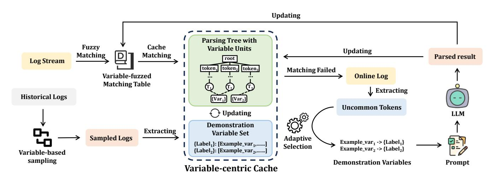
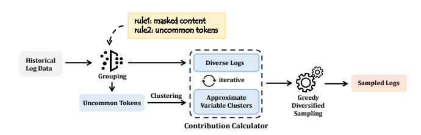
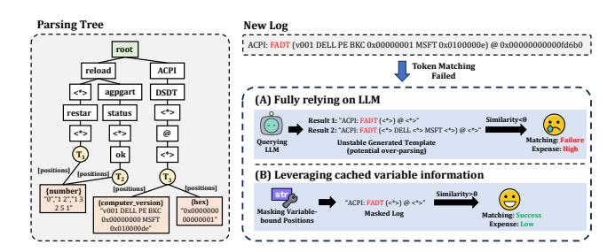
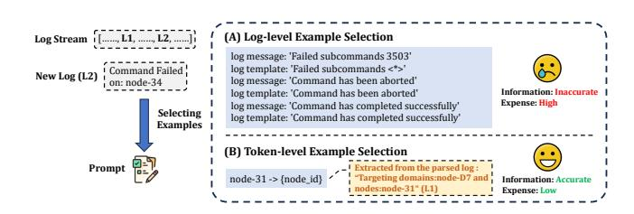
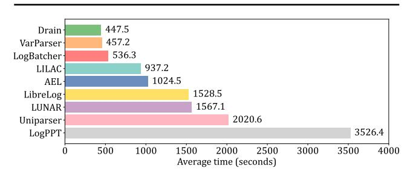
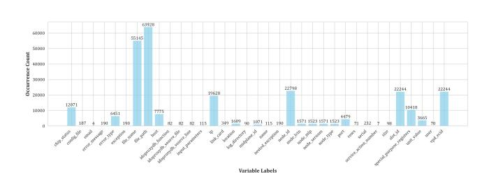

# VarParser: Unleashing the Neglected Power of Variables for LLM-based Log Parsing

Jinrui Sun Peking University Beijing, China jrsun25@stu.pku.edu.cn

Tong Jia∗ Peking University Beijing, China jia.tong@pku.edu.cn

Minghua He Peking University Beijing, China hemh2120@stu.pku.edu.cn

Ying Li Peking University Beijing, China li.ying@pku.edu.cn

#### Abstract

Logs serve as a primary source of information for engineers to diagnose failures in large-scale online service systems. Log parsing, which extracts structured events from massive unstructured log data, is a critical first step for downstream tasks like anomaly detection and failure diagnosis. With advances in large language models (LLMs), leveraging their strong text understanding capabilities has proven effective for accurate log parsing. However, existing LLMbased log parsers all focus on the constant part of logs, ignoring the potential contribution of the variable part to log parsing. This constant-centric strategy brings four key problems. First, inefficient log grouping and sampling with only constant information. Second, a relatively large number of LLM invocations due to constant-based cache, leading to low log parsing accuracy and efficiency. Third, a relatively large number of consumed constant tokens in prompts leads to high LLM invocation costs. At last, these methods only retain placeholders in the results, losing the system visibility brought by variable information in logs.

Facing these problems, we propose a variable-centric log parsing strategy named VarParser. Through variable contribution sampling, variable-centric parsing cache, and adaptive variable-aware in-context learning, our approach can efficiently capture the variable parts of logs and leverage their contributions to parsing. By introducing variable units, we preserve rich variable information, enhancing the integrity of log parsing results. Extensive evaluations on large-scale datasets demonstrate that VarParser achieves higher accuracy compared to existing methods, significantly improving parsing efficiency while reducing the LLM invocation costs.

### CCS Concepts

• Software and its engineering → Software maintenance tools; • Information systems → Web log analysis.

#### Keywords

Log Analysis, Log Parsing, Large Language Models.

∗Corresponding author.

<https://doi.org/10.1145/nnnnnnn.nnnnnnn>

## 1 Introduction

In recent years, online services such as Google Search, Bing, Facebook, and Twitter have grown rapidly, providing 24/7 support to millions of users. Despite significant efforts to ensure service reliability and availability, hardware and software failures remain inevitable in practice, often leading to unplanned outages. To address these incidents, practitioners heavily rely on system logs as a key diagnostic resource. These logs contain rich historical records of events and system states, enabling effective anomaly detection, failure diagnosis, and recovery support. However, with the rapid growth in raw log volume, identifying valuable information from massive log data has become increasingly challenging, even for experienced engineers [\[43\]](#page-9-0). To address this issue, automated log analysis techniques have emerged in recent years. A critical and widely adopted first step in this process is log parsing, which involves converting semi-structured console logs into a structured format. This conversion serves as a crucial preliminary step for automated log analysis tasks such as anomaly detection [\[5,](#page-8-0) [8,](#page-8-1) [13,](#page-8-2) [14,](#page-8-3) [41\]](#page-9-1), root cause analysis [\[1,](#page-7-0) [30,](#page-8-4) [42,](#page-9-2) [44\]](#page-9-3), and failure diagnosis [\[15,](#page-8-5) [16,](#page-8-6) [23,](#page-8-7) [33,](#page-8-8) [40\]](#page-9-4), etc. Typically, raw log messages consist of two parts: (1) Log constants, which represent the constant part describing the main content of the recorded event; (2) Log variables, which contain the dynamic part associated with the event (determined at runtime). Figure [1](#page-0-0) shows the procedure of log parsing.

| Sep 18 08:45:36 LabSZ | sshd[24200] INFO       | Connection closed by 173.234.31.186 [preauth] |
|-----------------------|------------------------|-----------------------------------------------|
| Sep 18 08:45:37 LabSZ | sshd[24200] INFO       | Running task 2.0 in stage 0.0 (TID 1)         |
| Sep 18 08:47:01       | LabSZ sshd[24241] INFO | Connection closed by 212.47.254.145 [preauth] |
| Sep 18 08:47:22 LabSZ | sshd[24265] DEBUG      | Partition rdd_2_1 not found, computing it     |
| Sep 18 08:49:35 LabSZ | sshd[24301] DEBUG      | Partition rdd_2_2 not found, computing it     |

| Timestamp       | Host Process      | Level | Log Constants                           | Log Variables    |
|-----------------|-------------------|-------|-----------------------------------------|------------------|
| Sep 18 08:45:36 | LabSZ sshd[24200] | INFO  | INFO Connection closed by <*> [preauth] | [173.234.31.186] |
| Sep 18 08:45:37 | LabSZ sshd[24200] | INFO  | Running task <*> in stage <*> (TID <*>) | [2.0,0.0,1]      |
| Sep 18 08:47:01 | LabSZ sshd[24241] | INFO  | INFO Connection closed by <*> [preauth] | [212.47.254.145] |
| Sep 18 08:47:22 | LabSZ sshd[24265] | DEBUG | Partition <*> not found, computing it   | [rdd_2_1]        |
| Sep 18 08:49:35 | LabSZ sshd[24301] | DEBUG | Partition <*> not found, computing it   | [rdd_2_2]        |
| Parsed Results  |                   |       | Parsing                                 |                  |

#### **Raw Logs**

Figure 1: An example of log parsing procedure. The red part of raw logs represents timestamps, the brown part represents the host and process information, the blue part represents the log level, and the green part represents the log content.

Existing log parsing methods can be categorized into three types: Syntax-based parsers, Semantic-based parsers, and LLM-based parsers. Syntax-based parsers [\[9,](#page-8-9) [34,](#page-8-10) [37,](#page-8-11) [39\]](#page-9-5) extract templates using strategies such as frequency-based, similarity-based, and heuristic methods, which often struggle to accurately identify templates when log messages deviate from manually defined rules. Semantic-based

Permission to make digital or hard copies of all or part of this work for personal or classroom use is granted without fee provided that copies are not made or distributed for profit or commercial advantage and that copies bear this notice and the full citation on the first page. Copyrights for components of this work owned by others than the author(s) must be honored. Abstracting with credit is permitted. To copy otherwise, or republish, to post on servers or to redistribute to lists, requires prior specific permission and/or a fee. Request permissions from permissions@acm.org.

WWW '26, Dubai, United Arab Emirates. © 2026 Copyright held by the owner/author(s). Publication rights licensed to ACM. ACM ISBN 978-x-xxxx-xxxx-x/YYYY/MM

parsers rely on neural networks to differentiate templates from variables but require large amounts of labeled data for training. LLM-based parsers leverage pre-trained large language models and optimize template extraction through in-context learning (ICL). Many studies have shown that, compared to syntax-based and semantic parsers, LLM-based parsers achieve significantly higher accuracy [\[10,](#page-8-12) [17,](#page-8-13) [28,](#page-8-14) [29,](#page-8-15) [45\]](#page-9-6). LLM-based log parsing methods typically involve three steps: (1) log sampling, where a candidate sampling algorithm selects a small set of diverse and information-rich historical logs to provide effective demonstrations for the LLM; (2) log matching, which matches the already parsed templates with the new logs to avoid redundant LLM invocations; (3) in-context learning, which allows the LLM to learn domain-specific knowledge and generate log templates based on provided log examples.

Existing LLM-based log parsers all focus on the constants of logs, ignoring the potential contribution of variable information in the original logs to log parsing. This constant-centric strategy suffers from four key problems. First, inefficient log grouping and sampling with only constant information. Second, a relatively large number of LLM invocations due to constant-based cache, leading to low log parsing efficiency. Third, a relatively large number of consumed constant tokens in prompts leads to high LLM invocation costs. Lastly, these methods only retain placeholders in the results, losing the system visibility brought by variable information in logs. The specific approach of the existing method [\[10,](#page-8-12) [17,](#page-8-13) [29,](#page-8-15) [36,](#page-8-16) [38,](#page-8-17) [45\]](#page-9-6) is constant-centric in the following way:

- In log sampling: Existing methods are dominated by the constants in logs for grouping criteria (e.g., top-k frequent tokens, log similarity, etc.), aiming to group logs with the same constants together. This results in the number of log groups being approximately equal to the number of templates, thereby limiting sampling efficiency.
- In log matching: Existing methods only store the constants in cache and fail to capture dynamically variable positions, supporting only token matching, which leads to a high frequency of matching failures.
- In in-context learning: Existing methods select log-template pairs as examples based on the similarity of log levels. Since constants typically account for a large proportion of logs, the constant part often dominates the selection of examples. However, as LLMs can understand natural language, the repeated natural language in the examples contributes little to understanding the new logs to be parsed, resulting in token wastage and higher LLM invocation costs.
- Result integrity: Existing log parsing methods only preserve log templates (constants + placeholders), discarding all variable information during parsing. However, log variables often carry critical content such as system states, internal details, and encoded values. Losing this information greatly reduces system visibility and weakens the effectiveness of downstream tasks.

Facing these problems, we demonstrate a new log parsing strategy called the variable-centric strategy. We propose VarParser, a variable-centric log parser with large language models. We focus on the variable part of the logs throughout parsing to fully leverage the contribution of the variables to the log parsing process. Specifically, our approach is variable-centric in the following way:

- In log sampling: VarParser clusters uncommon tokens to group historical logs with the same variables together and introduces a log contribution scoring and sampling method based on variable distributions. Since logs with the same variables cover a broader scope, the number of log groups sampled through this method is much smaller than the number of templates, thereby improving sampling efficiency.
- In log matching: VarParser proposes variable-fuzzed matching table and incorporates variable units into the cache, and proposes mask matching that considers cached variable information. This enables more comprehensive log matching, reduces the number of LLM invocations, and improves parsing efficiency.
- In in-context learning: VarParser adaptively selects tokenlevel variable information as examples, capturing finer-grained information while significantly reducing token consumption.
- Result integrity: By caching variable units, VarParser enables the extraction of variable types, specific instances (including counts and examples), and their occurrence frequencies across the entire log set. This variable-related information offers engineers enhanced system visibility.

The comprehensive experiments on the public large-scale log dataset Loghub-2.0[\[18\]](#page-8-18) show that VarParser achieves the highest average accuracy across all performance metrics, significantly improving parsing efficiency compared to the state-of-the-art baseline LLM-based parser and reducing the LLM invocation costs.

Unlike prior work [\[32\]](#page-8-19) that simply explored the feasibility of efficiency, VarParser performs large-scale experiments and introduces variable-fuzzed matching and a redesigned caching and matching mechanism, achieving the effectiveness and efficiency of variablecentric log parsing. The main contributions of this work are summarized as follows:

- We present a new log parsing strategy called the variable-centric strategy and propose the first variable-centric LLM-based log parser, named VarParser, which fully leverages the neglected power of variable information in the raw logs to log parsing.
- By caching variable units, VarParser preserves variable labels and instances, retaining richer variable-related information and significantly improving result integrity.
- We evaluate VarParser on large-scale public datasets. The results show that VarParser outperforms all existing log parsing methods in accuracy, significantly improving the parsing efficiency of LLM-based log parsers while reducing the overall LLM invocation costs.

## 2 Background and Related Work

## 2.1 Syntax-based Log Parsers

Syntax-based log parsers extract templates by identifying recurring patterns in logs, treating them as constants and other elements as variables. These methods include frequency-based, similaritybased, and heuristic approaches. For instance, Drain [\[9\]](#page-8-9) employs a fixed-depth prefix tree structure to effectively extract common templates using specific heuristics, such as prefix tokens and log length. However, these methods are constrained by predefined rules, and their parsing accuracy drops significantly when log data deviates from these rules.

#### 2.2 Semantic-based Log Parsers

Semantic-based log parsers typically use deep learning models to capture the semantics within log messages. For instance, Uniparser [\[26\]](#page-8-20) formulates log parsing as a token classification problem and uses a Bi-LSTM [\[7\]](#page-8-21) model for training, while VALB [\[22\]](#page-8-22) treats it as a sequence labeling problem and employs a Bi-LSTM-CRF [\[12\]](#page-8-23) model. However, these approaches depend heavily on large amounts of labeled data, and their performance is severely limited when labeled data is scarce or log formats change frequently. This limitation can cause significant performance drops when dealing with complex and large-scale log data.

## 2.3 LLM-based Log Parsers

Large language models demonstrate strong capabilities in understanding programming languages, showing great potential for software engineering applications. However, effectively applying LLMs to domain-specific tasks remains challenging. While fine-tuning on specific datasets can yield good performance, it is computationally expensive and requires large amounts of high-quality labeled data [\[35\]](#page-8-24). This process is also time-consuming and heavily reliant on data availability and quality, making it impractical in data-scarce scenarios. To overcome these limitations, in-context learning has emerged as a key technique, enabling LLMs to adapt to new tasks without explicit retraining [\[4,](#page-8-25) [24\]](#page-8-26). By leveraging examples within prompts, ICL allows models to learn from contextual cues and has proven effective in domain-specific downstream tasks [\[3,](#page-8-27) [31\]](#page-8-28). As a result, recent studies have adopted ICL to develop LLM-based log parsers [\[10,](#page-8-12) [17,](#page-8-13) [36,](#page-8-16) [38,](#page-8-17) [45\]](#page-9-6), which achieve significantly higher accuracy than traditional syntax- or semantics-based methods. However, as noted in Section [1,](#page-0-1) these approaches focus primarily on constants in log sampling, parsing cache, and in-context learning, leading to inefficiency, high LLM invocation costs, and compromised parsing integrity.

#### 3 Methodology

In this section, we propose VarParser, the first variable-centric general-purpose log parsing method based on large language models. VarParser introduces three core modules: Variable contribution sampling, Variable-centric parsing cache, and Adaptive Variableaware in-context learning. Following the pipeline of previous work [\[17,](#page-8-13) [29,](#page-8-15) [45\]](#page-9-6), VarParser first extract a small set of diverse and informationrich log messages and manually label them from historical logs. For the online log stream, our method sequentially parses them one by one. The overall framework of VarParser is shown in Figure [2.](#page-3-0)

## 3.1 Variable Contribution Sampling

To extract a small, diverse, and information-rich set of log messages from a large volume of log data, we propose variable contribution sampling, which consists of three components: Grouping, Contribution Calculating, and Greedy Diversified Sampling.

3.1.1 Grouping. During the log sampling process, redundant log data can significantly increase the complexity and computational cost of data processing. Therefore, eliminating duplicate historical logs is essential to minimizing the size of the sampling pool. To achieve this, we start by masking common dynamic content in the logs (e.g., numbers, IP addresses) to perform preliminary grouping.

Since LLM can understand natural language, the repeated natural language (i.e., constants) included in the examples contribute very little to the understanding of new logs to be parsed. Logs from different templates containing the same type of variables provide roughly equivalent domain-specific knowledge to the LLM. In other words, logs with identical variables, regardless of their template, contribute similarly to the log parsing process. For this purpose, we first tokenize each log into a list of tokens using a delimiter. We then use common words from the NLTK toolkit [\[27\]](#page-8-29) to filter out a set of uncommon tokens for each log. The rationale behind this approach is that log variables typically do not appear in lists of common words. Finally, we group the logs based on these uncommon tokens, ensuring that each log in the sampling pool contains unique variable information.

3.1.2 Contribution Calculating. To evaluate the contribution of each log message to the LLM's parsing of new logs, we first cluster all uncommon tokens to group tokens that belong to the same type of variable. In this method, we mask the digit parts of each token to focus on the non-numeric content, and then use the Jaccard similarity to measure the similarity between tokens. Tokens with a similarity score greater than the threshold are grouped into the same cluster, effectively forming approximate variable clusters. Specifically, we treat each token as a set of characters and calculate the Jaccard similarity based on the intersection and union of these character sets. The formula for Jaccard similarity is ���� = ��∩�� ��∪�� . Tokens with a higher similarity score are considered to belong to the same variable type and are thus clustered together.

Next, we calculate the contribution of each approximate variable cluster. If a cluster appears frequently across different logs, it indicates greater information potential, and its contribution to the parsing of new logs is accordingly greater. Specifically, we quantify the contribution of a cluster by the number of distinct positions it occupies across logs. As illustrated in Figure [7,](#page-10-0) cluster C1 contributes more significantly than cluster C2 due to its presence across more different logs. Finally, we compute the contribution of each log by aggregating the contributions of all approximate variable clusters within that log.

3.1.3 Greedy Diversified Sampling. To make the sampling results more information-rich and diverse, we propose Greedy Diversified Sampling. This algorithm prioritizes sampling the log with the highest contribution and dynamically updates the contribution of each log during the sampling process. Specifically, after sampling a log with the highest contribution, the contribution of all the approximate variable clusters contained in that log is reset to zero, and the contribution of each log is then updated before repeating the process. The comprehensive sampling rule is elucidated in Algorithm [1.](#page-3-1) This algorithm allows unsampled logs to dynamically adjust their priority based on their remaining information potential.

#### 3.2 Variable-Centric Parsing Cache

Following previous work [\[9,](#page-8-9) [17,](#page-8-13) [45\]](#page-9-6), we use a prefix tree structure to store templates generated by the LLM, serving as a parsing cache. In this cache, all generated log templates are tokenized into token

to over-parsing, which leads to low similarity scores and template matching failures. This not only undermines parsing accuracy but also incurs high costs due to repeated LLM invocations. In our approach, since the variable position information is stored in the cache, we can mask the bound variable positions in the corresponding template. This design significantly improves parsing accuracy while reducing redundant LLM invocations. Specifically, since token matching does not reach a leaf node, it terminates at one or more internal nodes. The templates within the subtrees of these stopping nodes are referred to as relevant templates, meaning the unparsed log partially matches these templates. Therefore, we traverse all relevant templates and perform similarity calculations with masking. Since the parsing cache stores the positional information of the variable parts in the template, for each template, we can mask all positions in the log token list that may correspond to variables, thereby achieving a fair match that is not influenced by known variables. The masked token list is then compared with each relevant template using Jaccard similarity. If the similarity exceeds a predefined threshold ��, set to 0.8 in our implementation, it is considered a successful match. In this scenario, VarParser treats the inconsistent tokens as variables, creates a new variable unit with a label starting with 'unknown', and stores these inconsistent tokens within it.

If none of the relevant templates in the cache have a mask similarity with the new log that exceeds the threshold, it indicates that the parsing cache has failed to match the log. In this case, VarParser proceeds with adaptive variable-aware in-context learning to generate the log's template. Once the new template is generated, the prefix tree and the variable units in the cache are updated based on the template and its labeled variables. Specifically, new branches are created in the prefix tree starting from the stopping node, following the token list of the template. For each labeled variable, its corresponding variable unit is identified based on its label, and then the labeled variable information is added to the variable unit. If no matching variable unit is found, a new unit with the given label is created, and the variable's tokens are added to it. Finally, associations between the template and the variable units are established, storing the positional information of the variable parts.

Figure 4: An illustrative case of variable omission in initial parsing, resulting in token matching failure for the log of the same template.

3.2.3 Cache correction. In our experiments, we observed that large language models may misidentify the variable parts of logs due to the hallucination problem [\[11\]](#page-8-30). With the introduction of variable units, VarParser requires the LLM to assign a label to each variable, enabling us to perform preliminary corrections based on the label content. Specifically, whenever a new template is generated and the parsing cache needs to be updated, we validate the label of variable units. As illustrated in Table [7,](#page-10-2) when the label is merely "label," such as "exception in getting events → exception in getting {label}"; when the label is identical to the variable content and is a common word, such as "invalid uri in request → {invalid} uri in request"; and when the label is a punctuation mark, such as "i-cache parity error → i{-}cache parity error." In these three cases, the identification of variables by LLMs is meaningless. Therefore, we corrected and converted them back into constants to ensure the accuracy of the parsing process.

#### 3.3 Adaptive Variable-aware ICL

Logs that fail to match successfully in the parsing cache will be input into this step to obtain their parsing results. In the in-context learning step, existing methods select examples based on log-level similarity and provide log-template pair examples. However, since constants typically account for a large proportion of logs, the constant part often dominates the selection of examples. However, as LLMs can understand natural language, the repeated natural language in the examples contributes little to understanding the new logs to be parsed, resulting in token wastage and higher LLM invocation costs. To address this, we designed a token-level adaptive example selection and prompt format focused on variables. Figure [5](#page-4-1) presents a case study comparing the example selection of constant-centric and variable-centric methods. As shown in part (B), the variable-centric approach not only significantly reduces token usage but also captures finer-grained information.

Figure 5: An illustrative case comparing example selection methods. In token-level selection, examples are extracted from historical logs of different templates (L1).

3.3.1 Token-level example selection. We first use the NLTK toolkit [\[27\]](#page-8-29) to extract the uncommon tokens in the new log. For each uncommon token, we calculate its Jaccard similarity with all tokens within the variable units stored in the parsing cache. The variable unit with the highest similarity is selected as an example, which is then presented to the LLM in the format "variable → {label}". Unlike existing methods that rely on a fixed number of examples, our approach adaptively determines the number of examples based on the number of uncommon tokens. It is important to note that, since labels starting with 'unknown' are meaningless, we exclude variable units with such labels from consideration in this step.

3.3.2 Prompt design. Following previous work [\[17,](#page-8-13) [38,](#page-8-17) [45\]](#page-9-6), we designed and employed the prompt format that consists of the following three parts:

- (1) Instruction. To ensure that the LLM is equipped with taskspecific knowledge, we provide an instruction that briefly introduces the task, expected input and output formats.
- (2) Demonstration Examples. The demonstration examples include variable examples and a format reference. The variable examples are selected using Adaptive Example Selection, guiding the LLM to identify variable parts in unseen logs. The format reference, chosen as the historical output with the highest Jaccard similarity to the new log, helps the LLM understand the context and adhere to the expected output format.
- (3) Queried Log. This is the new log that needs to be parsed.

The specific content of the prompt is shown in figure [8.](#page-10-3) With the guidance of instructions and demonstration examples, the LLM can generate a more accurate parsed result for the queried log while maintaining the correct format.

#### 4 Experiment Setup

## 4.1 Datasets

Our experiments are conducted using Loghub-2.0 [\[18,](#page-8-18) [46\]](#page-9-7), a widely recognized benchmark in the field of log parsing. Loghub-2.0 is a collection of large-scale datasets for log parsing provided by LogPAI [\[47\]](#page-9-8), encompassing 14 log datasets sourced from diverse applications and systems. On average, each dataset in Loghub-2.0 contains approximately 3.69 million logs, all of which are annotated with ground truth log templates.

## 4.2 Baselines and Metrics

Based on recent benchmark studies [\[18,](#page-8-18) [20\]](#page-8-31), we compare VarParser with eight state-of-the-art baselines, including two syntax-based parsers, two semantic-based parsers, and four LLM-based parsers. In Appendix [D.1,](#page-10-4) we briefly discuss all the baselines. Following recent studies [\[10,](#page-8-12) [17,](#page-8-13) [36,](#page-8-16) [45\]](#page-9-6), we evaluate our methods using four metrics: Grouping Accuracy (GA) and Parsing Accuracy (PA) focus on message volume, while F1-score of Group Accuracy (FGA) and F1-score of Template Accuracy (FTA) provide fair template-level evaluation. The detailed definitions of evaluation metrics are listed in Appendix [D.3.](#page-11-0)

#### 4.3 Implementation Details

We perform our experiments on a laptop with an 8-core CPU and 16GB of memory. Apart from LibreLog, which uses Llama3-8b for efficiency, all other LLM-based baselines use gpt-3.5-turbo as the default LLM. To ensure fair evaluation and reproducibility, we use gpt-3.5-turbo via the OpenAI API with the temperature and seed both set to 0 for deterministic outputs. The source code and data can be accessed at https://github.com/mianmaner/VarParser. More specific implementation details are provided in Appendix [D.2.](#page-11-1)

## 5 Evaluation

We evaluate VarParser by answering four research questions.

- RQ1: How does VarParser perform compared to baselines?
- RQ2: How do different modules contribute to VarParser?

- RQ3: How does VarParser perform on different LLMs?
- RQ4: How is the result integrity of VarParser?

#### 5.1 RQ1: Comparative Performance

5.1.1 Accuracy. We evaluate VarParser and all baseline methods across all log datasets. The results are shown in Table [1,](#page-6-0) where the best and second-best results are in bold and underlined, respectively. Notably, the metric of AEL [\[19\]](#page-8-32) on the Spark dataset is marked with a '-' because, according to previous work [\[10,](#page-8-12) [17,](#page-8-13) [20,](#page-8-31) [36\]](#page-8-16), it failed to complete the analysis process in a reasonable time (>240 hours). Specifically, compared to the highest performance of all baselines, VarParser outperforms by 3.9% in GA, 8.5% in PA, and 5.8% in FTA on average. It is worth noting that although LogBatcher slightly outperforms VarParser on FGA, it performs far worse on other metrics. This suggests that while LogBatcher groups most templates correctly, the resulting groups contain very few logs and thus lack coverage. We further analyze the main reasons why VarParser does not surpass other baselines in some projects. Beyond the instability of LLM outputs, certain datasets contain constant values that closely resemble variables. For example, in MAC logs such as "en0: channel changed to 132,+1", the token "en0" is actually a constant, but VarParser mistakenly treated it as an uncommon token and selected "0->number" as an exemplar, leading the LLM to misidentify it as a variable. Nevertheless, VarParser consistently achieves the most favorable accuracy across the majority of datasets. In particular, under the most rigorous and comprehensive metric, FTA, VarParser demonstrates superior performance over all baselines, highlighting its strong capability to accurately separate log templates from variables under strict evaluation criteria.

5.1.2 Efficiency. With the rapid growth in raw log volume, efficiency has always been a weak point for LLM-based parsers, limiting their practicality to some extent. Therefore, VarParser also focuses on improving efficiency. Since log sampling is a one-time process, we evaluated efficiency through experiments on both log sampling and log parsing. Due to fundamental methodological differences, some baselines [\[10,](#page-8-12) [29,](#page-8-15) [36\]](#page-8-16) require splitting complete log datasets into chunks for processing. Therefore, we compared the average sampling time per dataset for VarParser and other LLMbased parsers under different sampling sizes, as shown in Table [2.](#page-6-1) Specifically, in log sampling, compared with LILAC, our approach achieves an average speedup of 2.3× across various sampling sizes. This improvement stems from VarParser reducing the sampling pool from the scale of templates to the scale of variables by grouping logs based on uncommon tokens. In addition, Figure [6](#page-6-2) shows the average log parsing time per dataset for VarParser and the baselines. Compared to LILAC, our method reduces time cost by 51.2%, and compared to LogBatcher, it achieves a 14.8% reduction, reaching efficiency levels very close to the syntax-based parser Drain. While both VarParser and most baselines employ prefix trees to accelerate template queries, VarParser further incorporates a fuzzy matching table to avoid redundant parsing of logs that differ only in common variables. Moreover, by reducing LLM invocation frequency and token usage, VarParser significantly improves log parsing efficiency.

5.1.3 LLM invocation costs. The expensive pricing of LLM APIs, particularly when processing large-scale log data, can significantly impact the economic feasibility and practicality of these methods.

Table 1: Accuracy comparison between VarParser and baselines (%). The best and second-best results are in bold and underlined.

| Method Metric | Proxifier | Apache | OpenSSH | HDFS  | OpenStack | HPC Syntax-based | Zookeeper Log | HealthApp Parsers | Hadoop | Spark | BGL  | Linux | Mac  | Thunderbird | Average |
|---------------|-----------|--------|---------|-------|-----------|------------------|---------------|-------------------|--------|-------|------|-------|------|-------------|---------|
| GA            | 97.4      | 100.0  | 70.5    | 99.9  | 74.3      | 74.8             | 99.6          | 72.5              | 82.3   |       | 91.5 | 91.6  | 79.7 | 78.6        | 85.6    |
| PA AEL        | 67.7      | 72.7   | 36.4    | 62.1  | 2.9       | 74.1             | 84.2          | 31.1              | 53.5   |       | 40.6 | 8.2   | 24.5 | 16.3        | 44.2    |
| FGA           | 66.7      | 100.0  | 68.9    | 76.4  | 68.2      | 20.1             | 78.8          | 0.8               | 11.7   |       | 58.7 | 80.6  | 79.3 | 11.6        | 55.5    |
| FTA           | 41.7      | 51.7   | 33.3    | 56.2  | 16.5      | 13.6             | 46.5          | 0.3               | 5.8    |       | 16.5 | 21.7  | 20.5 | 3.5         | 25.2    |
| GA            | 69.2      | 100.0  | 70.7    | 99.9  | 75.2      | 79.3             | 99.4          | 86.2              | 92.1   | 88.8  | 91.9 | 68.6  | 76.1 | 83.1        | 84.3    |
| PA Drain      | 68.8      | 72.7   | 58.6    | 62.1  | 2.9       | 72.1             | 84.3          | 31.2              | 54.1   | 39.4  | 40.7 | 11.1  | 35.7 | 21.6        | 46.8    |
| FGA           | 20.6      | 100.0  | 87.2    | 93.5  | 0.7       | 30.9             | 90.4          | 1.0               | 78.5   | 86.1  | 62.4 | 77.8  | 22.9 | 23.7        | 55.4    |
| FTA           | 17.6      | 51.7   | 48.7    | 60.9  | 0.2       | 15.2             | 61.4          | 0.4               | 38.4   | 41.2  | 19.3 | 25.9  | 6.9  | 7.1         | 28.2    |
|               |           |        |         |       |           | Semantic-based   | Log           | Parsers           |        |       |      |       |      |             |         |
| GA            | 50.9      | 94.7   | 27.5    | 100.0 | 100.0     | 77.7             | 98.8          | 46.1              | 69.1   | 85.4  | 91.8 | 28.5  | 73.7 | 57.9        | 71.6    |
| PA Uniparser  | 63.4      | 94.2   | 28.9    | 94.8  | 51.6      | 94.1             | 98.8          | 81.7              | 88.9   | 79.5  | 94.9 | 16.4  | 68.8 | 65.4        | 73.0    |
| FGA           | 28.6      | 68.7   | 0.9     | 96.8  | 96.9      | 66.0             | 66.1          | 74.5              | 62.8   | 2.0   | 62.4 | 45.1  | 69.9 | 68.2        | 57.8    |
| FTA           | 45.7      | 26.9   | 0.5     | 58.1  | 28.9      | 35.1             | 51.0          | 46.2              | 47.6   | 1.2   | 21.9 | 23.2  | 28.3 | 29.0        | 31.7    |
| GA            | 98.9      | 78.6   | 27.7    | 72.1  | 53.4      | 78.2             | 96.7          | 99.8              | 48.3   | 47.6  | 24.5 | 20.5  | 54.4 | 56.4        | 61.2    |
| PA LogPPT     | 100.0     | 94.8   | 65.4    | 94.3  | 40.6      | 99.7             | 84.5          | 99.7              | 66.6   | 95.2  | 93.8 | 16.8  | 39.0 | 40.1        | 73.6    |
| FGA           | 87.0      | 60.5   | 8.1     | 39.1  | 87.4      | 78.0             | 91.8          | 94.7              | 52.6   | 37.4  | 25.3 | 71.2  | 49.3 | 21.6        | 57.4    |
| FTA           | 95.7      | 36.8   | 10.5    | 31.2  | 73.8      | 76.8             | 80.9          | 82.2              | 43.4   | 29.9  | 26.1 | 42.8  | 27.4 | 11.7        | 47.8    |
|               |           |        |         |       |           | LLM-based        | Log           | Parsers           |        |       |      |       |      |             |         |
| GA            | 51.0      | 100.0  | 86.8    | 100.0 | 81.1      | 84.4             | 99.3          | 86.2              | 96.3   | 85.9  | 90.2 | 91.2  | 81.4 | 87.0        | 87.2    |
| PA LibreLog   | 89.7      | 99.6   | 49.6    | 100.0 | 83.1      | 97.3             | 85.0          | 97.4              | 87.1   | 88.9  | 92.9 | 90.2  | 65.4 | 69.4        | 85.4    |
| FGA           | 35.3      | 100.0  | 85.3    | 92.9  | 68.9      | 80.5             | 97.4          | 95.8              | 94.0   | 83.2  | 80.3 | 74.1  | 80.4 | 84.3        | 82.3    |
| FTA           | 40.0      | 75.9   | 47.2    | 79.5  | 55.9      | 60.9             | 86.3          | 87.7              | 75.5   | 69.0  | 71.6 | 60.7  | 46.9 | 54.0        | 65.1    |
| GA            | 80.3      | 100.0  | 74.8    | 100.0 | 100.0     | 86.3             | 99.1          | 100.0             | 86.0   | 100.0 | 89.4 | 26.9  | 91.7 | 81.2        | 86.8    |
| PA LILAC      | 91.6      | 99.5   | 96.6    | 99.9  | 100.0     | 92.9             | 82.6          | 55.1              | 83.3   | 99.8  | 94.4 | 30.0  | 69.7 | 57.7        | 82.4    |
| FGA           | 64.0      | 100.0  | 87.7    | 96.8  | 100.0     | 84.9             | 93.0          | 98.1              | 91.8   | 90.8  | 90.8 | 91.4  | 92.4 | 88.7        | 90.7    |
| FTA           | 88.0      | 82.8   | 79.5    | 90.3  | 95.8      | 67.6             | 86.5          | 84.8              | 77.2   | 74.7  | 76.4 | 72.3  | 60.3 | 57.9        | 78.1    |
| GA            | 100.0     | 99.7   | 92.6    | 100.0 | 56.4      | 86.4             | 99.6          | 99.3              | 93.7   | 97.5  | 80.6 | 68.9  | 85.4 | 81.0        | 88.7    |
| PA LogBatcher | 100.0     | 99.5   | 52.8    | 99.9  | 41.7      | 93.9             | 82.2          | 82.7              | 82.8   | 99.7  | 95.8 | 65.3  | 67.1 | 46.7        | 79.3    |
| FGA           | 100.0     | 94.9   | 87.3    | 100.0 | 96.9      | 89.7             | 94.1          | 98.1              | 90.4   | 90.8  | 90.4 | 85.9  | 89.5 | 82.1        | 92.2    |
| FTA           | 100.0     | 81.4   | 59.2    | 94.6  | 76.3      | 85.9             | 83.5          | 86.5              | 73.9   | 73.9  | 55.3 | 65.8  | 55.3 | 46.9        | 74.2    |
| GA            | 98.9      | 100.0  | 69.0    | 87.4  | 96.2      | 84.5             | 99.3          | 99.7              | 92.4   | 85.1  | 95.0 | 64.1  | 86.4 | 81.1        | 88.7    |
| PA LUNAR      | 100.0     | 82.4   | 71.9    | 94.0  | 87.4      | 98.8             | 84.8          | 94.7              | 80.5   | 96.6  | 96.3 | 68.9  | 63.0 | 57.0        | 83.4    |
| FGA           | 87.0      | 100.0  | 68.8    | 85.7  | 25.6      | 72.1             | 88.5          | 95.0              | 78.5   | 81.4  | 86.6 | 80.4  | 75.9 | 82.8        | 79.8    |
| FTA           | 95.7      | 75.9   | 75.0    | 89.8  | 23.8      | 76.5             | 75.2          | 69.8              | 61.3   | 61.6  | 77.7 | 58.2  | 49.9 | 52.0        | 69.1    |
| GA            | 100.0     | 100.0  | 74.8    | 100.0 | 100.0     | 87.0             | 100.0         | 86.5              | 90.3   | 95.5  | 96.9 | 86.1  | 91.0 | 82.0        | 92.2    |
| PA VarParser  | 100.0     | 99.9   | 100.0   | 100.0 | 100.0     | 99.7             | 99.9          | 97.3              | 89.0   | 98.4  | 96.2 | 81.2  | 71.7 | 64.5        | 92.7    |
| FGA           | 100.0     | 100.0  | 89.2    | 100.0 | 100.0     | 85.9             | 100           | 90.5              | 88.8   | 87.0  | 90.6 | 82.5  | 85.6 | 85.6        | 91.8    |
| FTA           | 100.0     | 89.7   | 91.9    | 97.8  | 95.8      | 83.2             | 94.8          | 79.9              | 74.7   | 79.4  | 78.4 | 70.9  | 60.7 | 57.9        | 82.6    |

Table 2: Average sampling time of VarParser and baselines per dataset (seconds).

|           | 8 logs | 16 logs | 32 logs | 64 logs | 128 logs |
|-----------|--------|---------|---------|---------|----------|
| LogPPT    | 284.1  | 629.3   | 1303.9  | 2779.6  | 5396.9   |
| LILAC     | 19.2   | 19.3    | 19.3    | 19.3    | 19.4     |
| VarParser | 8.5    | 8.5     | 8.5     | 8.5     | 8.6      |

Figure 6: Average parsing time per dataset of VarParser and baselines (seconds).

To address this, VarParser is optimized along two key dimensions: reducing the number of LLM invocations and lowering the average token consumption per invocation. The experimental results are presented in Table [3,](#page-7-1) where token usage is reported by the OpenAI API and includes both input and output tokens.

Specifically, compared to LILAC, our method reduces the total token consumption per dataset by an average of 56.1%, making it a more economical and efficient solution for LLM-based log parsing. The latest study, LogBatcher, also lowers LLM invocation costs by processing all logs in batches and performing demonstration-free parsing through comparisons among similar logs. However, this requires collecting logs in advance, leading to system downtime during which newly generated logs cannot be parsed or immediately utilized by downstream tasks. In contrast, both LILAC and VarParser parse logs sequentially, making them more suitable for log stream scenarios. Remarkably, even against LogBatcher, VarParser achieves substantial savings, reducing token usage per invocation by 21.8% and overall token consumption per dataset by 13.0% on average. Such cost reductions are particularly significant for handling massive log volumes in real-world industrial environments.

Table 3: Comparison of the number of Total tokens consumed and Average tokens consumed per invocation between VarParser and other LLM-based Log parsers. The best results are in bold.

|             | Total    | LUNAR Avg. | Total   | LogBatcher Avg. | Total   | LILAC Avg. | Total   | VarParser Avg. |
|-------------|----------|------------|---------|-----------------|---------|------------|---------|----------------|
| Apache      | 17639    | 551.2      | 3497    | 120.6           | 8499    | 294.0      | 1104    | 138.0          |
| BGL         | 247420   | 591.9      | 54583   | 157.3           | 90017   | 285.4      | 38810   | 141.1          |
| Hadoop      | 265317   | 647.1      | 45352   | 173.1           | 88941   | 388.1      | 40897   | 171.8          |
| HDFS        | 64252    | 676.3      | 15693   | 333.9           | 21314   | 453.5      | 4096    | 195.1          |
| HealthAPP   | 90187    | 530.5      | 16208   | 103.9           | 33390   | 315.0      | 11610   | 133.5          |
| HPC         | 85653    | 658.9      | 18052   | 214.9           | 14461   | 242.5      | 5757    | 122.5          |
| Linux       | 229202   | 520.9      | 40518   | 103.1           | 86763   | 265.2      | 52955   | 150.9          |
| Mac         | 1148074  | 699.2      | 153660  | 236.4           | 264647  | 349.6      | 151240  | 214.8          |
| OpenSSH     | 41990    | 567.4      | 5698    | 154.0           | 12535   | 358.1      | 8717    | 170.9          |
| OpenStack   | 200503   | 753.8      | 21609   | 441.0           | 21149   | 440.6      | 2984    | 175.5          |
| Proxifier   | 7058     | 588.2      | 4719    | 429.0           | 5511    | 393.5      | 655     | 218.3          |
| Spark       | 239019   | 627.3      | 42238   | 171.7           | 78058   | 351.6      | 34063   | 153.4          |
| Thunderbird | 969604   | 572.0      | 201599  | 147.8           | 507329  | 349.4      | 191724  | 157.3          |
| Zookeeper   | 46855    | 557.8      | 10068   | 124.3           | 22919   | 248.8      | 6665    | 133.3          |
| Average     | 260912.4 | 601.1      | 45250.0 | 207.9           | 89648.8 | 338.3      | 39377.2 | 162.6          |

#### 5.2 RQ2: Module Contribution Analysis

To analyze the impact of different components on parsing accuracy, we conduct ablation studies on variable contribution sampling, mask matching, cache correction, and adaptive variable-aware ICL. For contribution sampling, we replace it with random sampling, and for variable-aware ICL, we remove the variable demonstration examples. The results of the ablation experiments are shown in Table [4.](#page-7-2) The results indicate that each component positively contributes to the performance of the method.

Table 4: Ablation studies of VarParser (%).

|           |                |            | GA   | FGA  | PA   | FTA  |
|-----------|----------------|------------|------|------|------|------|
| VarParser |                |            | 92.2 | 92.7 | 91.8 | 82.6 |
| w/o       | fuzzy          | matching   | 89.8 | 92.0 | 89.0 | 81.7 |
| w/o       | mask           | matching   | 88.1 | 88.9 | 83.3 | 80.5 |
| w/o       | cache          | correction | 91.3 | 92.7 | 88.9 | 80.1 |
| w/o       | contribution   | sampling   | 87.9 | 81.4 | 80.5 | 70.0 |
| w/o       | variable-aware | ICL        | 83.4 | 76.6 | 75.6 | 73.4 |

When fuzzy matching is removed, VarParser's FTA drops by 1.1% and FGA by 0.8%, indicating that this strategy enables effective simple log matching, while also revealing that the LLM may still produce parsing errors on simple logs. Similarly, removing mask matching leads to a 2.1% drop in FTA and a 2.8% drop in FGA, indicating that mask matching helps the cache achieve more accurate matches and reduces the impact of LLM's unstable output. Furthermore, eliminating variable examples results in a 10.7% decrease in FTA and a 16.3% decrease in FGA, suggesting that LLMs' ability to handle diverse log data remains limited without domain-specific knowledge. Notably, replacing variable contribution sampling with random sampling reduces FTA by 14.8% and FGA by 11.0%, underscoring the importance of high-quality candidate samples and demonstrations in driving LLM performance. Finally, removing cache correction also causes a noticeable accuracy drop, highlighting the necessity of addressing the LLM hallucination problem.

#### 5.3 RQ3: Performance Across LLMs

In our experiments, we utilize gpt-3.5-turbo as the default LLM to evaluate the performance of VarParser. To further investigate the adaptability of VarParser across different LLMs, we also conduct experiments with two additional commonly used LLMs: llama3-70b [\[6\]](#page-8-33) and qwen-plus [\[2\]](#page-8-34). The experimental results are presented in Table [5.](#page-7-3) The results demonstrate that VarParser consistently outperforms all baselines across all four metrics (GA, FGA, PA, and FTA) for each of the tested LLMs. Notably, the performance of VarParser remains relatively stable across different models. Specifically, the FGA metric ranges from 90.7% to 92.7%, while the FTA metric shows values between 78.6% and 82.6%. The results highlight the adaptability of VarParser, suggesting that it can be effectively integrated with various LLMs to achieve high accuracy.

Table 5: Accuracy of VarParser across different LLMs (%).

|               | GA   | FGA  | PA   | FTA  |
|---------------|------|------|------|------|
| gpt-3.5-turbo | 92.2 | 92.7 | 91.8 | 82.6 |
| llama3-70b    | 89.3 | 90.7 | 85.1 | 78.6 |
| qwen-plus     | 91.2 | 92.7 | 88.9 | 80.1 |

#### 5.4 RQ4: Result Integrity

By introducing and caching variable units, VarParser also provides variable-related information across the entire log set. Figure [9](#page-10-5) presents the different types of variables extracted from the variable units after parsing the BGL dataset, along with their frequencies. We observe that variables such as file\_path and file\_name appear most frequently, suggesting that file operations are commonly involved during system operation. Hardware-related variables, including node\_id, chip\_status, and slot\_id, also occur extensively, reflecting their importance in monitoring system states. In contrast, variables such as exception or error\_message are relatively rare, indicating that the system generally operates in a relatively stable state.

#### 6 Conclusion and Future work

In this paper, we introduce VarParser, the first variable-centric LLM-based log parsing approach that emphasizes the variable parts of logs to reveal their contribution to parsing. By integrating variable contribution sampling, the variable-centric parsing cache, and adaptive variable-aware ICL, VarParser improves both accuracy and efficiency, while preserving richer variable-related information to enhance system visibility for engineers. In the future, We aim to follow the idea of our variable-centric strategy and consider combining the abilities of LLMs and small models to further improve the performance of our approach.

### Acknowledgement

This work was supported by the National Natural Science Foundation of China(Grant No. 62502015).

#### References

[1] Anunay Amar and Peter C. Rigby. 2019. Mining Historical Test Logs to Predict Bugs and Localize Faults in the Test Logs. In 2019 IEEE/ACM 41st International Conference on Software Engineering (ICSE). 140–151. [doi:10.1109/ICSE.2019.00031](https://doi.org/10.1109/ICSE.2019.00031)

[2] Jinze Bai, Shuai Bai, Yunfei Chu, Zeyu Cui, Kai Dang, Xiaodong Deng, Yang Fan, Wenbin Ge, Yu Han, Fei Huang, Binyuan Hui, Luo Ji, Mei Li, Junyang Lin, Runji Lin, Dayiheng Liu, Gao Liu, Chengqiang Lu, Keming Lu, Jianxin Ma, Rui Men, Xingzhang Ren, Xuancheng Ren, Chuanqi Tan, Sinan Tan, Jianhong Tu, Peng Wang, Shijie Wang, Wei Wang, Shengguang Wu, Benfeng Xu, Jin Xu, An Yang, Hao Yang, Jian Yang, Shusheng Yang, Yang Yao, Bowen Yu, Hongyi Yuan, Zheng Yuan, Jianwei Zhang, Xingxuan Zhang, Yichang Zhang, Zhenru Zhang, Chang Zhou, Jingren Zhou, Xiaohuan Zhou, and Tianhang Zhu. 2023. Qwen Technical Report. arXiv[:2309.16609](https://arxiv.org/abs/2309.16609) [cs.CL]<https://arxiv.org/abs/2309.16609> [3] Yanda Chen, Chen Zhao, Zhou Yu, Kathleen McKeown, and He He. 2024. On the Relation between Sensitivity and Accuracy in In-context Learning. arXiv[:2209.07661](https://arxiv.org/abs/2209.07661) [cs.CL]<https://arxiv.org/abs/2209.07661> [4] Qingxiu Dong, Lei Li, Damai Dai, Ce Zheng, Jingyuan Ma, Rui Li, Heming Xia, Jingjing Xu, Zhiyong Wu, Tianyu Liu, Baobao Chang, Xu Sun, Lei Li, and Zhifang Sui. 2024. A Survey on In-context Learning. arXiv[:2301.00234](https://arxiv.org/abs/2301.00234) [cs.CL] <https://arxiv.org/abs/2301.00234> [5] Min Du, Feifei Li, Guineng Zheng, and Vivek Srikumar. 2017. DeepLog: Anomaly Detection and Diagnosis from System Logs through Deep Learning. In Proceedings of the 2017 ACM SIGSAC Conference on Computer and Communications Security (Dallas, Texas, USA) (CCS '17). Association for Computing Machinery, New York, NY, USA, 1285–1298. [doi:10.1145/3133956.3134015](https://doi.org/10.1145/3133956.3134015) [6] Aaron Grattafiori and Abhimanyu Dubey etc. 2024. The Llama 3 Herd of Models. arXiv[:2407.21783](https://arxiv.org/abs/2407.21783) [cs.AI]<https://arxiv.org/abs/2407.21783> [7] Alex Graves and Jürgen Schmidhuber. 2005. 2005 Special Issue: Framewise phoneme classification with bidirectional LSTM and other neural network architectures. Neural Netw. 18, 5–6 (June 2005), 602–610. [doi:10.1016/j.neunet.2005.06.](https://doi.org/10.1016/j.neunet.2005.06.042) [042](https://doi.org/10.1016/j.neunet.2005.06.042) [8] Minghua He, Tong Jia, Chiming Duan, Huaqian Cai, Ying Li, and Gang Huang. 2025. Weakly-Supervised Log-Based Anomaly Detection with Inexact Labels via Multi-Instance Learning. In 2025 IEEE/ACM 47th International Conference on Software Engineering (ICSE). 2918–2930. [doi:10.1109/ICSE55347.2025.00189](https://doi.org/10.1109/ICSE55347.2025.00189) [9] Pinjia He, Jieming Zhu, Zibin Zheng, and Michael R. Lyu. 2017. Drain: An Online Log Parsing Approach with Fixed Depth Tree. In 2017 IEEE International Conference on Web Services (ICWS). 33–40. [doi:10.1109/ICWS.2017.13](https://doi.org/10.1109/ICWS.2017.13) [10] Junjie Huang, Zhihan Jiang, Zhuangbin Chen, and Michael R. Lyu. 2024. LUNAR: Unsupervised LLM-based Log Parsing. arXiv[:2406.07174](https://arxiv.org/abs/2406.07174) [cs.SE] [https://arxiv.](https://arxiv.org/abs/2406.07174) [org/abs/2406.07174](https://arxiv.org/abs/2406.07174) [11] Lei Huang, Weijiang Yu, Weitao Ma, Weihong Zhong, Zhangyin Feng, Haotian Wang, Qianglong Chen, Weihua Peng, Xiaocheng Feng, Bing Qin, and Ting Liu. 2024. A Survey on Hallucination in Large Language Models: Principles, Taxonomy, Challenges, and Open Questions. ACM Trans. Inf. Syst. (Nov. 2024). [doi:10.1145/3703155](https://doi.org/10.1145/3703155) Just Accepted. [12] Zhiheng Huang, Wei Xu, and Kai Yu. 2015. Bidirectional LSTM-CRF Models for Sequence Tagging. arXiv[:1508.01991](https://arxiv.org/abs/1508.01991) [cs.CL]<https://arxiv.org/abs/1508.01991> [13] Tong Jia, Ying Li, Yong Yang, and Gang Huang. 2024. Hilogx: noise-aware logbased anomaly detection with human feedback. The VLDB Journal 33 (03 2024), 1–18. [doi:10.1007/s00778-024-00843-2](https://doi.org/10.1007/s00778-024-00843-2) [14] Tong Jia, Ying Li, Yong Yang, Gang Huang, and Zhonghai Wu. 2022. Augmenting Log-based Anomaly Detection Models to Reduce False Anomalies with Human Feedback. In Proceedings of the 28th ACM SIGKDD Conference on Knowledge Discovery and Data Mining (Washington DC, USA) (KDD '22). Association for Computing Machinery, New York, NY, USA, 3081–3089. [doi:10.1145/3534678.](https://doi.org/10.1145/3534678.3539106) [3539106](https://doi.org/10.1145/3534678.3539106) [15] Tong Jia, Yifan Wu, Chuanjia Hou, and Ying Li. 2021. LogFlash: Real-time Streaming Anomaly Detection and Diagnosis from System Logs for Large-scale Software Systems. In 2021 IEEE 32nd International Symposium on Software Reliability Engineering (ISSRE). 80–90. [doi:10.1109/ISSRE52982.2021.00021](https://doi.org/10.1109/ISSRE52982.2021.00021) [16] Tong Jia, Lin Yang, Pengfei Chen, Ying Li, Fanjing Meng, and Jingmin Xu. 2017. LogSed: Anomaly Diagnosis through Mining Time-Weighted Control Flow Graph in Logs. In 2017 IEEE 10th International Conference on Cloud Computing (CLOUD). 447–455. [doi:10.1109/CLOUD.2017.64](https://doi.org/10.1109/CLOUD.2017.64) [17] Zhihan Jiang, Jinyang Liu, Zhuangbin Chen, Yichen Li, Junjie Huang, Yintong Huo, Pinjia He, Jiazhen Gu, and Michael R. Lyu. 2024. LILAC: Log Parsing using LLMs with Adaptive Parsing Cache. Proc. ACM Softw. Eng. 1, FSE, Article 7 (July 2024), 24 pages. [doi:10.1145/3643733](https://doi.org/10.1145/3643733) [18] Zhihan Jiang, Jinyang Liu, Junjie Huang, Yichen Li, Yintong Huo, Jiazhen Gu, Zhuangbin Chen, Jieming Zhu, and Michael R. Lyu. 2024. A Large-Scale Evaluation for Log Parsing Techniques: How Far Are We?. In Proceedings of the 33rd ACM SIGSOFT International Symposium on Software Testing and Analysis (Vienna, Austria) (ISSTA 2024). Association for Computing Machinery, New York, NY, USA, 223–234. [doi:10.1145/3650212.3652123](https://doi.org/10.1145/3650212.3652123) [19] Zhen Ming Jiang, Ahmed E. Hassan, Parminder Flora, and Gilbert Hamann. 2008. Abstracting Execution Logs to Execution Events for Enterprise Applications (Short Paper). In 2008 The Eighth International Conference on Quality Software. 181–186. [doi:10.1109/QSIC.2008.50](https://doi.org/10.1109/QSIC.2008.50) [20] Zanis Ali Khan, Donghwan Shin, Domenico Bianculli, and Lionel Briand. 2022. Guidelines for assessing the accuracy of log message template identification techniques. In Proceedings of the 44th International Conference on Software Engineering (Pittsburgh, Pennsylvania) (ICSE '22). Association for Computing Machinery, New York, NY, USA, 1095–1106. [doi:10.1145/3510003.3510101](https://doi.org/10.1145/3510003.3510101) [21] Van-Hoang Le and Hongyu Zhang. 2023. Log Parsing with Prompt-Based Few-Shot Learning. In Proceedings of the 45th International Conference on Software Engineering (Melbourne, Victoria, Australia) (ICSE '23). IEEE Press, 2438–2449. [doi:10.1109/ICSE48619.2023.00204](https://doi.org/10.1109/ICSE48619.2023.00204) [22] Zhenhao Li, Chuan Luo, Tse-Hsun Chen, Weiyi Shang, Shilin He, Qingwei Lin, and Dongmei Zhang. 2023. Did We Miss Something Important? Studying and Exploring Variable-Aware Log Abstraction. arXiv[:2304.11391](https://arxiv.org/abs/2304.11391) [cs.SE] [https:](https://arxiv.org/abs/2304.11391) [//arxiv.org/abs/2304.11391](https://arxiv.org/abs/2304.11391) [23] Qingwei Lin, Hongyu Zhang, Jian-Guang Lou, Yu Zhang, and Xuewei Chen. 2016. Log Clustering Based Problem Identification for Online Service Systems. In 2016 IEEE/ACM 38th International Conference on Software Engineering Companion (ICSE-C). 102–111. [24] Pengfei Liu, Weizhe Yuan, Jinlan Fu, Zhengbao Jiang, Hiroaki Hayashi, and Graham Neubig. 2022. Pre-train, Prompt, and Predict: A Systematic Survey of Prompting Methods in Natural Language Processing. Comput. Surveys 55 (09 2022). [doi:10.1145/3560815](https://doi.org/10.1145/3560815) [25] Yinhan Liu, Myle Ott, Naman Goyal, Jingfei Du, Mandar Joshi, Danqi Chen, Omer Levy, Mike Lewis, Luke Zettlemoyer, and Veselin Stoyanov. 2019. RoBERTa: A Robustly Optimized BERT Pretraining Approach. arXiv[:1907.11692](https://arxiv.org/abs/1907.11692) [cs.CL] <https://arxiv.org/abs/1907.11692> [26] Yudong Liu, Xu Zhang, Shilin He, Hongyu Zhang, Liqun Li, Yu Kang, Yong Xu, Minghua Ma, Qingwei Lin, Yingnong Dang, Saravan Rajmohan, and Dongmei Zhang. 2022. UniParser: A Unified Log Parser for Heterogeneous Log Data. In Proceedings of the ACM Web Conference 2022 (Virtual Event, Lyon, France) (WWW '22). Association for Computing Machinery, New York, NY, USA, 1893–1901. [doi:10.1145/3485447.3511993](https://doi.org/10.1145/3485447.3511993) [27] Edward Loper and Steven Bird. 2002. NLTK: The Natural Language Toolkit. CoRR cs.CL/0205028 (2002).<https://arxiv.org/abs/cs/0205028> [28] Zeyang Ma, An Ran Chen, Dong Jae Kim, Tse-Hsun Peter Chen, and Shaowei Wang. 2024. LLMParser: An Exploratory Study on Using Large Language Models for Log Parsing . In 2024 IEEE/ACM 46th International Conference on Software Engineering (ICSE). IEEE Computer Society, Los Alamitos, CA, USA, 1209–1221. [doi:10.1145/3597503.3639150](https://doi.org/10.1145/3597503.3639150) [29] Zeyang Ma, Dong Jae Kim, and Tse-Hsun Chen. 2024. LibreLog: Accurate and Efficient Unsupervised Log Parsing Using Open-Source Large Language Models. arXiv[:2408.01585](https://arxiv.org/abs/2408.01585) [cs.SE]<https://arxiv.org/abs/2408.01585> [30] Paolo Notaro, Soroush Haeri, Jorge Cardoso, and Michael Gerndt. 2023. LogRule: Efficient Structured Log Mining for Root Cause Analysis. 20, 4 (June 2023), 4231–4243. [doi:10.1109/TNSM.2023.3282270](https://doi.org/10.1109/TNSM.2023.3282270) [31] Parker Seegmiller, Joseph Gatto, Madhusudan Basak, Diane J. Cook, Hassan Ghasemzadeh, John A. Stankovic, and Sarah Masud Preum. 2023. The Scope of In-Context Learning for the Extraction of Medical Temporal Constraints. (2023). [doi:10.1109/ichi57859.2023.00107](https://doi.org/10.1109/ichi57859.2023.00107) [32] Jinrui Sun, Tong Jia, Minghua He, Yihan Wu, Ying Li, and Gang Huang. 2025. Exploring Variable Potential for LLM-based Log Parsing Efficiency and Reduced Costs. Association for Computing Machinery, New York, NY, USA, 596–600. <https://doi.org/10.1145/3696630.3728506> [33] Lei Tao, Shenglin Zhang, Zedong Jia, Jinrui Sun, Minghua Ma, Zhengdan Li, Sun Yongqian, Canqun Yang, Yuzhi Zhang, and Dan Pei. 2024. Giving Every Modality a Voice in Microservice Failure Diagnosis via Multimodal Adaptive Optimization. In Proceedings of the IEEE/ACM International Conference on Automated Software Engineering. 1107–1119. [doi:10.1145/3691620.3695489](https://doi.org/10.1145/3691620.3695489) [34] Risto Vaarandi and Mauno Pihelgas. 2015. LogCluster - A data clustering and pattern mining algorithm for event logs. In 2015 11th International Conference on Network and Service Management (CNSM). 1–7. [doi:10.1109/CNSM.2015.7367331](https://doi.org/10.1109/CNSM.2015.7367331) [35] Yue Wang, Weishi Wang, Shafiq Joty, and Steven C.H. Hoi. 2021. CodeT5: Identifier-aware Unified Pre-trained Encoder-Decoder Models for Code Understanding and Generation. In Proceedings of the 2021 Conference on Empirical Methods in Natural Language Processing, Marie-Francine Moens, Xuanjing Huang, Lucia Specia, and Scott Wen-tau Yih (Eds.). Association for Computational Linguistics, Online and Punta Cana, Dominican Republic, 8696–8708. [doi:10.18653/v1/2021.emnlp-main.685](https://doi.org/10.18653/v1/2021.emnlp-main.685) [36] Yi Xiao, Van-Hoang Le, and Hongyu Zhang. 2024. Stronger, Cheaper and Demonstration-Free Log Parsing with LLMs. arXiv[:2406.06156](https://arxiv.org/abs/2406.06156) [cs.SE] [https:](https://arxiv.org/abs/2406.06156) [//arxiv.org/abs/2406.06156](https://arxiv.org/abs/2406.06156) [37] Junjielong Xu, Qiuai Fu, Zhouruixing Zhu, Yutong Cheng, Zhijing Li, Yuchi Ma, and Pinjia He. 2023. Hue: A User-Adaptive Parser for Hybrid Logs. In Proceedings of the 31st ACM Joint European Software Engineering Conference and Symposium on the Foundations of Software Engineering (San Francisco, CA, USA) (ESEC/FSE 2023). Association for Computing Machinery, New York, NY, USA, 413–424. [doi:10.1145/3611643.3616260](https://doi.org/10.1145/3611643.3616260) [38] Junjielong Xu, Ruichun Yang, Yintong Huo, Chengyu Zhang, and Pinjia He. 2024. DivLog: Log Parsing with Prompt Enhanced In-Context Learning. In Proceedings of the IEEE/ACM 46th International Conference on Software Engineering (Lisbon, Portugal) (ICSE '24). Association for Computing Machinery, New York, NY, USA, Article 199, 12 pages. [doi:10.1145/3597503.3639155](https://doi.org/10.1145/3597503.3639155)

[39] Siyu Yu, Pinjia He, Ningjiang Chen, and Yifan Wu. 2023. Brain: Log Parsing With Bidirectional Parallel Tree. IEEE Transactions on Services Computing 16, 5 (2023), 3224–3237. [doi:10.1109/TSC.2023.3270566](https://doi.org/10.1109/TSC.2023.3270566) [40] Yue Yuan, Wenchang Shi, Bin Liang, and Bo Qin. 2019. An Approach to Cloud Execution Failure Diagnosis Based on Exception Logs in OpenStack. In 2019 IEEE 12th International Conference on Cloud Computing (CLOUD). 124–131. [doi:10.](https://doi.org/10.1109/CLOUD.2019.00031) [1109/CLOUD.2019.00031](https://doi.org/10.1109/CLOUD.2019.00031) [41] Chenyangguang Zhang, Tong Jia, Guopeng Shen, Pinyan Zhu, and Ying Li. 2024. MetaLog: Generalizable Cross-System Anomaly Detection from Logs with Meta-Learning. In Proceedings of the IEEE/ACM 46th International Conference on Software Engineering (Lisbon, Portugal) (ICSE '24). Association for Computing Machinery, New York, NY, USA, Article 154, 12 pages. [doi:10.1145/3597503.3639205](https://doi.org/10.1145/3597503.3639205) [42] Shenglin Zhang, Xiaoyu Feng, Runzhou Wang, Minghua Ma, Wenwei Gu, Yongqian Sun, Zedong Jia, Jinrui Sun, and Dan Pei. 2025. Too Many Cooks: Assessing the Need for Multi-Source Data in Microservice Failure Diagnosis. In 2025 IEEE 36th International Symposium on Software Reliability Engineering (ISSRE). 1–12. [doi:10.1109/ISSRE66568.2025.00014](https://doi.org/10.1109/ISSRE66568.2025.00014) [43] Xu Zhang, Yong Xu, Si Qin, Shilin He, Bo Qiao, Ze Li, Hongyu Zhang, Xukun Li, Yingnong Dang, Qingwei Lin, Murali Chintalapati, Saravanakumar Rajmohan, and Dongmei Zhang. 2021. Onion: identifying incident-indicating logs for cloud systems. In Proceedings of the 29th ACM Joint Meeting on European Software Engineering Conference and Symposium on the Foundations of Software Engineering (Athens, Greece) (ESEC/FSE 2021). Association for Computing Machinery, New York, NY, USA, 1253–1263. [doi:10.1145/3468264.3473919](https://doi.org/10.1145/3468264.3473919) [44] Yingying Zhang, Zhengxiong Guan, Huajie Qian, Leili Xu, Hengbo Liu, Qingsong Wen, Liang Sun, Junwei Jiang, Lunting Fan, and Min Ke. 2021. CloudRCA: A Root Cause Analysis Framework for Cloud Computing Platforms. In Proceedings of the 30th ACM International Conference on Information & Knowledge Management (Virtual Event, Queensland, Australia) (CIKM '21). Association for Computing Machinery, New York, NY, USA, 4373–4382. [doi:10.1145/3459637.3481903](https://doi.org/10.1145/3459637.3481903) [45] Aoxiao Zhong, Dengyao Mo, Guiyang Liu, Jinbu Liu, Qingda Lu, Qi Zhou, Jiesheng Wu, Quanzheng Li, and Qingsong Wen. 2024. LogParser-LLM: Advancing Efficient Log Parsing with Large Language Models. In Proceedings of the 30th ACM SIGKDD Conference on Knowledge Discovery and Data Mining (Barcelona, Spain) (KDD '24). Association for Computing Machinery, New York, NY, USA, 4559–4570. [doi:10.1145/3637528.3671810](https://doi.org/10.1145/3637528.3671810) [46] Jieming Zhu, Shilin He, Pinjia He, Jinyang Liu, and Michael R. Lyu. 2023. Loghub: A Large Collection of System Log Datasets for AI-driven Log Analytics . In 2023 IEEE 34th International Symposium on Software Reliability Engineering (ISSRE). IEEE Computer Society, Los Alamitos, CA, USA, 355–366. [doi:10.1109/ISSRE59848.](https://doi.org/10.1109/ISSRE59848.2023.00071) [2023.00071](https://doi.org/10.1109/ISSRE59848.2023.00071) [47] Jieming Zhu, Shilin He, Jinyang Liu, Pinjia He, Qi Xie, Zibin Zheng, and Michael R. Lyu. 2019. Tools and benchmarks for automated log parsing. In Proceedings of the 41st International Conference on Software Engineering: Software Engineering in Practice (Montreal, Quebec, Canada) (ICSE-SEIP '19). IEEE Press, 121–130. [doi:10.1109/ICSE-SEIP.2019.00021](https://doi.org/10.1109/ICSE-SEIP.2019.00021)

#### A Additional Demonstrations

Table 6: The demonstration of variable-fuzzing strategy.

| Raw Log Content                              | Variable-fuzzed Log Content               |
|----------------------------------------------|-------------------------------------------|
| "Reopen Block blk_7008279672769077211"       | "Reopen Block blk_{Variables}"            |
| "BLOCK* ask 10.250.14.224:50010 to replicate |                                           |
| blk_-1608999687919862906 to datanode(s)      |                                           |
| 10.251.215.16:50010 10.251.71.193:50010"     |                                           |
|                                              | "BLOCK* ask {Variable} to replicate       |
|                                              | blk_{Variable} to datanode(s) {Variable}" |

Table 7: The demonstration of three cache correction scenarios.

| Queried Log Content           | LLM Output                        | Feature              |
|-------------------------------|-----------------------------------|----------------------|
| "i-cache parity error 13"     | "i{-}cache parity error {number}" | punctuation mark     |
| "exception in getting events" | "exception in getting {label}"    | merely "label"       |
| "invalid uri in request"      | "invalid {uri} in request"        | identical to content |

**(Importances: C1>C2)**

Received block blk\_3587508140051953248 from /10.251.42.84 Verification succeeded for blk\_-4980916519894289629

PacketResponder 1 for block blk\_-5073870177832699716 terminating Got exception while serving blk\_8466246428293623262 to /10.251.106.37

Served block blk\_-6520030462660619051 to /10.251.215.70

#### **Uncommon Token Clusters**

> Common sense: Constants are natural language that LLM can understand, while variables are professional knowledge that needs prompts. > Common sense: The more variables appear in different logs, the more important they are in the system. **Greedy Diversified Sampling** Privacy Concerns. Privacy concerns are also paramount for enterprises, as logs often contain detailed customer and service information. Processing internal log data using external LLMs could potentially compromise privacy and security. However, VarParser is designed as a flexible framework that can integrate various LLMs. Users can integrate their own LLMs into VarParser, thereby mitigating privacy risks and ensuring data confidentiality.

#### **Logs from 5 different templates**

C1: blk\_3587508140051953248, blk\_-4980916519894289629, …

C2: /10.251.42.84, /10.251.106.37, /10.251.215.70

Figure 7: The demonstration of diverse logs and clusters.

As a log parsing expert, refer to historical examples and output, replace variables with the corresponding label (no spaces in curly brackets) in the log if present. Just return

only the parsed log in backtick and nothing else.

Format Reference: Received block {block\_id} of size {number} from {ip}

Variable Examples: 10.251.73.220:50010 -> {ip}, blk\_9212264480425680329 -> {block\_id}

Please parsing the following log:

'Served block blk\_750348333420247304 to /10.250.19.102'

Served block {block\_id} to {ip}

**Extract** {block\_id}: ('blk\_750348333420247304', [2]) {ip}: ('/10.250.19.102', [4]) Served block <\*> to <\*>

#### **LLM Output**

#### **Prompt**

Figure 8: The demonstration of the prompt design.

Figure 9: The demonstration of different variable labels and their frequencies in the BGL dataset (For a intuitive analysis, we exclude the label "number").

#### B Result Integrity of Log Parsing

Existing log parsing methods typically produce outputs in the form of log templates (constant + placeholder), where variables are replaced with placeholders. This substitution inevitably leads to the loss of original variable information. In practice, however, log variables often carry critical content such as system component states, internal details, and encoded values. Losing this information significantly reduces system observability for engineers and weakens the effectiveness of downstream tasks.

Following log parsing conventions, our method also outputs log templates (constant + placeholder). Yet, to enhance result quality, we adopt a variable-centric design that preserves richer variablerelated information. By storing variable units in cache, our approach captures variable types, specific instances (counts and examples), and their occurrence frequencies across the log set—details entirely discarded in constant-centric designs that retain only placeholders. Since variables represent the dynamic behavior of system modules, this preserved information offers engineers superior visibility into applications and system operations and delivers substantial value for both system analysis and downstream tasks.

## C Threats to Validity

We have identified the following major threats to validity.

Data Leakage. Data leakage is a potential concern given that large language models are trained on extensive datasets. For instance, the LLM used in VarParser might have been trained on open-source log datasets, which theoretically could lead to the memorization of specific templates. However, our experiments reveal that VarParser's performance in zero-shot scenarios significantly lags behind its performance in few-shot scenarios. This suggests that direct memorization is unlikely. Additionally, in most experiments, VarParser utilized the gpt-turbo-3.5-0125 model, which was no longer updated before the release of the Loghub-2.0 dataset. Therefore, the possibility of data leakage is negligible.

#### D Evaluation Supplement

## D.1 Evaluation Baselines

We select eight state-of-the-art baselines, including two syntaxbased parsers, two semantic-based parsers, and four LLM-based parsers. In syntax-based parsers, AEL [\[19\]](#page-8-32) uses common formats in log content to capture variables, while Drain [\[9\]](#page-8-9) extracts templates based on prefix tokens and log length. In semantic-based parsers, UniParser [\[26\]](#page-8-20) achieves token classification by training a Bi-LSTM [\[7\]](#page-8-21), while LogPPT [\[21\]](#page-8-35) fine-tunes a pre-trained language model (e.g., RoBERTa [\[25\]](#page-8-36)) for log parsing. Among the LLM-based parsers, LILAC [\[17\]](#page-8-13) helps LLM in parsing by proposing a caching mechanism, while LogBatcher [\[36\]](#page-8-16) and LUNAR [\[10\]](#page-8-12) help LLM in

parsing by grouping similar logs, both of which are selected for their leading performance and efficiency. To pursue efficiency and costeffectiveness, Librelog [\[29\]](#page-8-15) uses the small-scale open-source LLM Llama3-8b for log parsing, albeit at the expense of some accuracy in log parsing.

#### D.2 Implementation Details

For semantic-based log parsers that require fine-tuning, we adhere to the community consensus by using their default settings for comparison. In addition, we rigorously follow the configuration of all the LLM-based baselines: using the first 20% of logs as historical data, setting the default number of candidate logs to 32, and maintaining a consistent Jaccard similarity threshold of 0.8.

#### D.3 Evaluation Metrics

The detailed definitions of evaluation metrics are listed as follows.

- Grouping Accuracy (GA): GA is a log-level metric that measures the number of log messages of the same template grouped by the parser. It is computed as the ratio of correctly grouped log messages to the total number of log messages. A log message is considered correctly grouped if and only if its template is aligned with the same set of log messages as the ground truth.

- Parsing Accuracy (PA): PA is a log-level metric that measures the ability to correctly extract constants and dynamic variables for each log message. It is computed as the ratio of the number of correctly parsed log messages to the total number of log messages. A log message is considered correctly parsed if and only if all the tokens of templates and variables are correctly recognized.
- F1 score of Grouping Accuracy (FGA): FGA is a template-level metric that focuses on the proportion of correctly grouped templates rather than log messages. Specifically, let ���� be the number of templates that are correct in fact and ���� be the number of templates generated by the log parser. If ���� is the number of templates correctly parsed by the log parser, we define grouping accuracy precision (PGA) as ���� ���� and grouping accuracy recall (RGA) as ���� ���� . Then, FGA is equal to their harmonic mean, which is 2������������ ������+������ .
- F1 score of Template Accuracy (FTA): FTA is a template-level metric, calculated based on the proportion of correctly recognized templates. It is calculated as the harmonic mean of the precision and recall of the template accuracy. The difference is that a template is considered correctly recognized if and only if the log messages of the parsed template share the same true template and all the tokens of the template are the same as those of the true template.