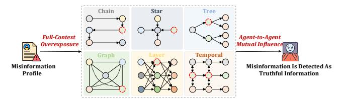
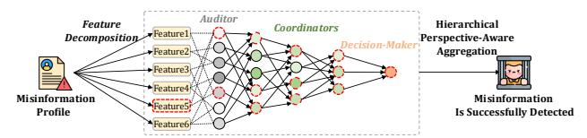
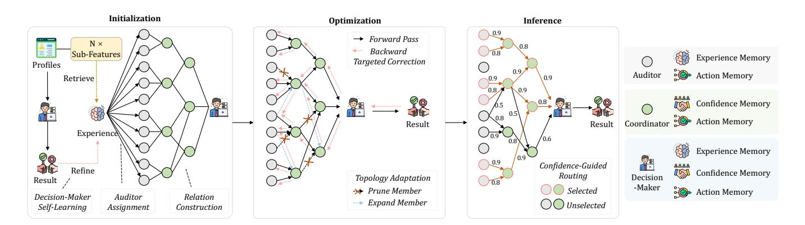
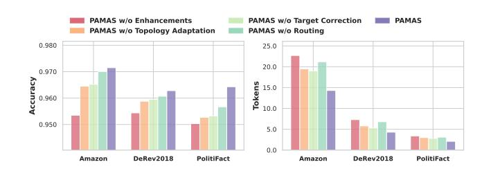
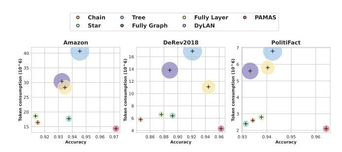

# PAMAS: Self-Adaptive Multi-Agent System with Perspective Aggregation for Misinformation Detection

Zongwei Wang zongwei@cqu.edu.cn Chongqing University Chongqing, China

Min Gao∗† gaomin@cqu.edu.cn Chongqing University Chongqing, China

Junliang Yu junl.yu@outlook.com Griffith University Brisbane, Australia

Tong Chen tong.chen@uq.edu.au The University of Queensland Brisbane, Australia

Chenghua Lin chenghua.lin@manchester.ac.uk University of Manchester Manchester, United Kingdom

### Abstract

Misinformation on social media poses a critical threat to information credibility, as its diverse and context-dependent nature complicates detection. Large language model–empowered multi-agent systems (MAS) present a promising paradigm that enables cooperative reasoning and collective intelligence to combat this threat. However, conventional MAS suffer from an information-drowning problem, where abundant truthful content overwhelms sparse and weak deceptive cues. With full input access, agents tend to focus on dominant patterns, and inter-agent communication further amplifies this bias. To tackle this issue, we propose PAMAS, a multi-agent framework with perspective aggregation, which employs hierarchical, perspective-aware aggregation to highlight anomaly cues and alleviate information drowning. PAMAS organizes agents into three roles: Auditors, Coordinators, and a Decision-Maker. Auditors capture anomaly cues from specialized feature subsets; Coordinators aggregate their perspectives to enhance coverage while maintaining diversity; and the Decision-Maker, equipped with evolving memory and full contextual access, synthesizes all subordinate insights to produce the final judgment. Furthermore, to improve the efficiency in multi-agent collaboration, PAMAS incorporates self-adaptive mechanisms for dynamic topology optimization and routing-based inference, enhancing both efficiency and scalability. Extensive experiments on multiple benchmark datasets demonstrate that PA-MAS achieves superior accuracy and efficiency, offering a scalable and trustworthy way for misinformation detection.

#### CCS Concepts

• Computing methodologies → Natural language processing.

ACM ISBN \*\*\*\*\*\*\*\*\*\*\*\*\* [https://doi.org/\\*\\*\\*\\*\\*\\*\\*\\*\\*\\*](https://doi.org/**********)

### Keywords

Multi-Agent Systems, Large Language Models, Misinformation Detection, Agents

#### ACM Reference Format:

Zongwei Wang, Min Gao, Junliang Yu, Tong Chen, and Chenghua Lin. 2026. PAMAS: Self-Adaptive Multi-Agent System with Perspective Aggregation for Misinformation Detection. In Proceedings of the ACM Web Conference 2026 (WWW '26), April 13–17, 2026, Dubai, United Arab Emirates. ACM, New York, NY, USA, [12](#page-11-0) pages. [https://doi.org/\\*\\*\\*\\*\\*\\*\\*\\*\\*\\*](https://doi.org/**********)

## 1 Introduction

Misinformation on social media has emerged as a serious threat to information credibility. It manifests in diverse forms, such as fake user accounts [\[33\]](#page-8-0), deceptive product reviews [\[39\]](#page-8-1), and manipulated news [\[23\]](#page-8-2), all of which distort public perceptions and erode trust in digital ecosystems. To contain these risks, in the early stages, platforms primarily relied on human auditors to identify and remove harmful content. Yet as platforms expand and the volume of user-generated content grows exponentially, the capacity of human auditors alone is quickly outpaced [\[3\]](#page-8-3). Deep learning models have therefore been adopted to assist auditors, but their opaque decisions often lack interpretability and fail to provide credible explanations [\[22,](#page-8-4) [32\]](#page-8-5). As a result, auditors still need to re-examine many cases to ensure accountability, which further increases their workload, leaving large amounts of harmful content unchecked.

Given these limitations, large language models (LLMs) provide new avenues for improving content moderation [\[12,](#page-8-6) [29\]](#page-8-7). Unlike conventional deep learning models, LLMs exhibit strong reasoning and contextual understanding capabilities, enabling more transparent and interpretable decisions [\[1,](#page-7-0) [2\]](#page-7-1). Building upon these strengths, recent research shows that multi-agent systems (MAS) can outperform single agents on complex tasks by fostering cooperative reasoning across diverse collaboration topologies [\[27\]](#page-8-8), such as chain [\[19\]](#page-8-9), star [\[37\]](#page-8-10), tree [\[8\]](#page-8-11), graph [\[43\]](#page-8-12), layer [\[45\]](#page-8-13), and temporal structure [\[14\]](#page-8-14). These advances naturally motivate MAS frameworks that collaborate with human auditors, where LLM-based agents not only generate automated judgments but also offer interpretable reasoning to support human oversight.

However, conventional MAS suffer from an information-drowning problem in misinformation detection, where abundant truthful content overwhelms sparse, fragmented and weak deceptive signals. As illustrated in Fig. [1a,](#page-1-0) existing MAS typically expose each agent to

∗Corresponding author. The code is available at [https://github.com/CoderWZW/](https://github.com/CoderWZW/PAMAS) [PAMAS](https://github.com/CoderWZW/PAMAS)

†Also with Key Laboratory of Dependable Service Computing in Cyber Physical Society (Chongqing University), Ministry of Education of China.

[This work is licensed under a Creative Commons Attribution 4.0 International License.](https://creativecommons.org/licenses/by/4.0) WWW '26, Dubai, United Arab Emirates

© 2026 Copyright held by the owner/author(s).

(a) Existing MAS suffer from the information-drowning problem. The agents marked by red dashed boxes may initially detect anomalies, but their signals are later overwhelmed and disappear during aggregation.

(b) Multi-Agent System with Perspective Aggregation (PAMAS). The agents marked by red dashed boxes detect anomaly cues that are preserved and transmitted to the Decision-Maker for the final correct judgment.

Figure 1: Comparison between the existing MAS design and our proposed PAMAS.

the complete input context of the target information to ensure comprehensive reasoning, yet this approach inadvertently amplifies the dominance of normal signals, causing agents to converge toward overly benign decisions. The problem is further intensified during agent-to-agent communication and debates, where correlated judgments reinforce one another, suppressing minority anomaly evidence and leaving misinformation even more deeply concealed.

To overcome the information-drowning problem, we design PA-MAS, a novel MAS framework with Perspective Aggregation for misinformation detection, which employs hierarchical perspectiveaware aggregation to actively highlight anomaly cues and mitigate information drowning. As shown in Fig. [1b,](#page-1-1) the information is first decomposed in a perspective-aware manner, where different feature subsets are extracted to emphasize distinct aspects of the content. Building on these specialized perspectives, PAMAS progressively aggregates the resulting judgments through a hierarchical structure of three roles, including Auditors, Coordinators, and a Decision-Maker. Auditors serve as the first layer of observation, each specializing in a specific feature subset to capture amplified anomalies. Their independent perspectives ensure diversity in detection and prevent the dominance of any single interpretation. Coordinators operate at the intermediate level, each responsible for supervising a subset of Auditors and integrating their reports into more comprehensive judgments. Through localized aggregation, they broaden the analytical scope while preserving the independence of underlying Auditor outputs, ensuring that amplified anomaly cues are retained through intermediate reasoning. At the top of the hierarchy, the Decision-Maker synthesizes its own direct judgment with the refined insights from all Coordinators. Equipped with self-evolving memory and full contextual access, it continuously enhances its reasoning capability, reconciles conflicting views across subordinates, preserves minority yet high-risk signals, and delivers the final decision.

Although this hierarchical perspective-aware aggregation enhances robustness in misinformation detection, operating PAMAS under conventional optimization and inference mechanisms would be both time-consuming and token-intensive. On the one hand, within each layer, every agent of the same role independently performs judgments, leading to repeated LLM calls and redundant token consumption. On the other hand, across layers, complex interagent interactions require extensive exchanges of inputs and outputs, further increasing inference time and token usage. To improve efficiency, we enhance PAMAS with self-adaptive mechanisms at both the optimization and inference stages, enabling the system to dynamically adjust its topology and refine agent capabilities over training. In the optimization stage, a topology adaptation strategy prunes redundant or overly similar agents to reduce wasted computation, while introducing new agents when existing structures exhibit correlated failures; subsequently, a targeted correction strategy enables misclassification-driven self-improvement, where only agents responsible for erroneous judgments are updated: Auditors refine their memory to improve localized experience, Coordinators adjust trust weights over their supervised subordinates, and the Decision-Maker consolidates these refinements into higher-level experiential guidance to prevent repeated mistakes. In the inference stage, a confidence-guided routing strategy selectively activates the most reliable branches instead of traversing the entire hierarchy, thereby substantially lowering computational overhead while preserving decision quality.

The contributions of this paper are four-fold:

- To the best of our knowledge, we are the first to systematically incorporate LLM-empowered MAS into misinformation detection and reveal the inherent information-drowning problem within this setting.
- We propose PAMAS, which performs hierarchical perspectiveaware aggregation to amplify anomaly cues and consolidate heterogeneous judgments.
- We design efficiency-oriented self-adaptive strategies for PAMAS, including dynamic topology adaptation, targeted agent refinement, and confidence-guided routing, which jointly improve the effectiveness and scalability.
- We extensively validate our method across multiple benchmark datasets covering diverse misinformation scenarios, including abnormal users, misleading reviews, and fake news, where our method consistently outperforms strong baselines in terms of accuracy, efficiency, and interpretability.

#### 2 Preliminaries

We begin by formalizing the setting of a single agent for misinformation detection. Each agent �� is equipped with three essential components: a profile P�� that defines its persona and perspective for making judgments, a memory M�� that records its historical experiences and past decisions, and a reasoning function ���� that performs inference.

Given an input instance �� ∈ X, agent �� produces a binary judgment and an associated explanation:

(����, ����) ∼ ���� (��, P��,M��), (1)

where ���� ∈ {0, 1} indicates whether �� is classified as misinformation, and ���� ∈ R is the natural-language explanation.

Then, we extend to a multi-agent system A = {��1, ��2, . . . , ���� }, in which agents operate with heterogeneous profiles and distinct memories. Importantly, agents are not isolated: there exist relations among them such that the output of certain agents becomes part of the input to others.

Formally, if ���� is related to a set of agents N (��) ⊆ A, then ���� takes into account both the external input �� and the results of all related agents when performing inference:

(������ , ������ ) ∼ ������ ��, {(������ , ������ ) | ���� ∈ N (��)}, P���� ,M���� . (2)

At the system level, the collective inference function Φ aggregates the outputs of multiple agents:

(��, ��) ∼ Φ {(������ , ������ )}�� ��=1 , (3)

yielding the decision �� ∈ {0, 1} and a synthesized explanation ��.

#### 3 PAMAS: Self-Adaptive Multi-Agent System with Perspective Aggregation

In this section, we introduce the PAMAS, which hierarchically organizes agents and aggregates their perspectives through a selfadaptive mechanism, thereby enhancing robustness and efficiency in misinformation detection. We first describe the distinct responsibilities of these roles (Sec. 3.1), followed by the system initialization and topology construction (Sec. 3.2), and the proposed selfadaptive strategies applied during optimization (Sec. 3.3) and inference (Sec. 3.4). The corresponding prompt designs used in PAMAS are provided in Appendix [B.](#page-9-0)

#### 3.1 Agent Roles

PAMAS organizes agents into clear relations across three roles: Auditors, Coordinators, and a Decision-Maker.

3.1.1 Auditor. Auditors are the fundamental detection units, and also serve as the basic building block of the input layer in PAMAS. To ensure diversity of perspectives, we extract multiple dimensions of characteristics from each instance to be examined (e.g., statistical ratings, textual semantics such as sentiment polarity or consistency across statements, and temporal dynamics). Each Auditor �� is assigned a distinct profile P��, which restricts its observation to a particular subset of characteristics rather than the full set of dimensions. By doing so, different Auditors develop complementary profiles, each focusing on specific aspects of the target detected information. More details on the characteristic dimensions used for profiling Auditors are provided in Appendix [D.](#page-9-1)

The memory of an Auditor �� is divided into two components:

- Experience memory Mexp �� , which summarizes detection experience distilled from accumulated cases. This forms the agent's evolving knowledge base for identifying misinformation.

- Action memory Mact �� , which logs the concrete decisions the agent has made on past inputs, together with the reasoning statements that supported them. This enables backtracking of how specific judgments were reached.

Auditor Memories

Experience memory sample: "Misinformation accounts often reuse identical textual templates across items while maintaining abnormally high sentiment intensity." Action memory sample: {user\_id: 1327, decision: 1, reason: "reviews are excessively repetitive and sentimentally exaggerated"}

Given an input ��, the Auditor produces a decision–reason pair:

(����, ����) ∼ ���� (��, P��,Mact �� ,Mexp �� ), (4)

where ���� ∈ {0, 1} is the predicted label, and ���� ∈ R is the explanation. The output (����, ����) is simultaneously stored in action memory for accountability.

3.1.2 Coordinator. A Coordinator acts as the intermediate organizer, considering outputs from subordinate Auditors or lower-level Coordinators, and structurally corresponds to the hidden layer of PAMAS. While Auditors are responsible for making first-order judgments from restricted feature subsets, Coordinators focus on aggregating these heterogeneous perspectives into more reliable decisions. This hierarchical relationship ensures that anomaly cues identified by individual Auditors are properly amplified, and consolidated before being passed upward for higher-level reasoning.

The memory of a Coordinator �� is divided into two components: - Confidence memory Mconf �� , which records the trust weights ���� assigned to each subordinate. These weights evolve with optimization, reflecting the reliability of different subordinates over time.

- Action memory Mact �� , which logs the aggregated decisions made by ��, along with the subordinate votes that contributed to them.

Coordinator Memories

Confidence memory sample: {subordinate\_id: 2, weight: 0.73; subordinate\_id: 15, weight: 0.41 } Action memory sample: { decision: 1, votes: [ (1,0.73), (0,0.41) ] }

Given subordinate outputs {(���� , ����)}, the Coordinator aggregates them by weighted voting:

���� = I ∑︁ �� ∈S (��) ���� · (2���� − 1) &gt; 0 , (5)

where S (��) is the subordinates of Coordinator ��, and stores both the decision and vote distribution into its action memory.

Coordinators can themselves be recursively organized into multiple layers, whose depth can be flexibly adjusted to fit task complexity, forming a scalable hierarchy. At the top of this hierarchy, the highest-level Coordinator interacts directly with the Decision-Maker, which synthesizes the final decision.

3.1.3 Decision-Maker. At the top of the hierarchy, the Decision-Maker serves as the final arbiter, synthesizing its own direct judgment ���� (��) with the aggregated outputs of all top-level Coordinators. It maintains three memories: confidence memory Mconf �� toward Coordinators, experience memory Mexp �� distilled from repeated interactions, and action memory Mact �� archiving final decisions and

Figure 2: The framework of PAMAS, including the process of initialization, optimization, and inference.

supporting reasons. Its inference rule is defined as:

(����, ���� ) ∼ ���� ��, {(������ , ������ , ���� )}��, P��,Mconf ,Mexp �� ,Mact �� , (6)

where (������ , ������ , ���� ) are the outputs and trust weights of top-level Coordinators. Since a Coordinator does not independently generate reasoning, ������ is inherited from its subordinates and taken as the explanation provided by the highest-weight Auditor whose decision aligns with the Coordinator's aggregated output. ���� combines them with the Decision-Maker's profile P�� and memories to yield the final decision ���� and explanation ���� . Here, P�� specifies the task of the Decision-Maker integrating all highest-level Coordinator outputs while leveraging the full set of dimensions and accumulated memories to derive the final judgment.

#### 3.2 Initialization of PAMAS

Although the three roles are defined, how to initialize these agents and how to determine the relations between agents remain unresolved. This section describes the initialization of PAMAS. At first, all memories are created in empty form, and all trust weights (e.g., confidence weights ���� between superiors and subordinates) are initialized to 1 to provide an unbiased starting point. Then, the process begins with the Decision-Maker, which first undergoes selflearning to establish an initial experience memory. Building on this foundation, Auditors are assigned profile-specific feature subsets and initialize their own experience through Decision-Maker-guided retrieval and self-reflection. Finally, relations between agents are established via hierarchical clustering, where each upper-level agent selects a subset of lower-level agents to form localized groups, defining the multi-layer structure.

3.2.1 Decision-Maker Self-Learning. We first initialize the system by training the Decision-Maker through a self-learning process. Given an input instance �� with ground-truth label ��, the Decision-Maker forms a preliminary judgment ( ˆ����,��ˆ�� ) based on Equation [\(6\)](#page-3-0) and then performs self-reflection by contrasting it with �� to distill new experience:

Mexp �� ← Mexp �� ∪ SelfRef�� ��, ˆ����,��ˆ��, �� , (7)

where SelfRef�� (·) summarizes generalized experience from the input (��, ˆ����,��ˆ��, ��) and appends them to the experience memory. This establishes the initial experience memory of the Decision-Maker, forming a knowledge base for subsequent training of Auditors.

3.2.2 Auditor Assignment. To transfer knowledge effectively while avoiding homogeneous behaviors, each input is decomposed into multiple feature dimensions, and every Auditor is assigned a distinct profile P�� that restricts its observation to a subset of these dimensions. This ensures that Auditors specialize in complementary perspectives rather than sharing identical views.

However, feature allocation alone is coarse, since all agents would otherwise start with identical experience memories, undermining their diversity. To address this, we introduce a Decision-Maker-Guided Auditor Training, in which the Decision-Maker provides experiential knowledge to each Auditor. Inspired by retrievalaugmented generation (RAG) [\[11\]](#page-8-15), Auditors learn from the Decision-Maker's experience memory by retrieving fragments most relevant to their profiles.

Formally, given Auditor ��'s observable feature subset F (��)��, we encode its textual description into an embedding vector z��. Each experience fragment e ∈ Mexp is represented both by its raw description and corresponding embedding representation. Auditor �� then retrieves the top-�� relevant fragments:

���� = TopK�� Sim(z��, e) , (8)

where Sim(·, ·) denotes cosine similarity.

The textual content corresponding to retrieved fragments ���� is distilled by Auditor �� through a local self-reflection process:

Mexp �� ← SelfRef�� (����), (9)

where SelfRef�� (·) summarizes the fragments into generalizable heuristics. This completes the initialization of each Auditor's profile and experience memory.

3.2.3 Relation Construction. After Auditors are assigned, we establish the relations among the three roles of agents, grouping those with similar behaviors into organized teams and thereby defining the structure. Specifically, Auditors are first clustered [\[16\]](#page-8-16) based on the similarity of their label prediction vectors on the validation

set. For each cluster G, one Coordinator �� is designated to manage it. The Coordinator's anchor Auditor is selected as the member achieving the highest validation F1-score:

�� ∗ = arg max ��∈ G F1(��). (10)

After the anchor is determined, the corresponding group for this Coordinator is expanded by randomly sampling additional Auditors from G until the predefined group size is reached. If the number of available Auditors in G is insufficient, the nearest neighboring cluster is used for supplementary sampling. Each resulting group thus defines the subordinates of a Coordinator:

S (��) = {�� ∗ , ��2, . . . , ���� }, �� ≤ ��max, (11)

where ��max is the maximum allowable group size set for each coordinator. This procedure is recursively applied: newly formed Coordinators are clustered in the same manner, anchors are selected, and higher-level groups are built until the Decision-Maker sits at the top.

As a result, PAMAS forms a hierarchical structure that embeds diversity, where each Auditor focuses on a distinct feature-based perspective and each Coordinator supervises a unique subset of members, jointly ensuring heterogeneous viewpoints across the structure.

#### 3.3 The Optimization of PAMAS

Once initialized, PAMAS operates an iterative refinement process, which consists of three connected stages. The forward pass first generates decisions in a bottom-up manner. Based on these results, topology adaptation adjusts the hierarchy by pruning redundant agents and expanding new ones when failures occur. Finally, under the adapted structure, backward targeted correction updates agent memories for misclassified cases.

3.3.1 Forward Pass. Given an input instance ��, each Auditor generates a decision–reason pair following Eq. [\(4\)](#page-2-0), leveraging both its action and experience memories. Coordinators then aggregate the outputs of their subordinates by weighted voting as defined in Eq. [\(5\)](#page-2-1), using trust weights stored in their confidence memories. Finally, the Decision-Maker synthesizes the top-level decision and explanation according to Eq. [\(6\)](#page-3-0), integrating both its own profile and the aggregated results from top-level leaders. All decisions produced at each level are simultaneously logged into the corresponding agents' action memories, ensuring accountability and enabling subsequent refinement.

3.3.2 Topology Adaptation. After each batch of forward pass, the topology of PAMAS adapts to balance efficiency and robustness through two complementary operations, pruning redundant members and expanding complementary members, both conducted within the scope of each Coordinator's subordinate group.

In pruning redundant members, each subordinate �� ∈ S (��) of Coordinator �� is evaluated by a score:

Score�� = -Acc(S (��)) − Acc(S (��) \ {��}) | {z } marginal accuracy improvement − �� · 1 |S (��)| − 1 ∑︁ �� ∈S (��)\{�� } cos(v�� , v��) average redundancy with peers , (12)

| {z } where v�� denotes the prediction vector of agent �� on the validation set. �� controls the balance of accuracy and redundancy. If Score�� &lt; 0, the agent is considered unhelpful and removed.

In expanding complementary members, when a group S (��) exhibits correlated failures on borderline samples, we evaluate each candidate �� drawn from the lower layer but not belonging to S (��):

Gain�� = ΔAcc(S (��) ∪ {��}) | {z } expected accuracy improvement −�� · 1 |S (��)| ∑︁ �� ∈S (��) cos(v�� , v��) | {z } similarity penalty , (13)

where ΔAcc(S (��) ∪ {��}) denotes the improvement after adding ��, and the second term penalizes overlap with existing members based on their prediction vectors. Candidates with the highest gain are incorporated as new subordinates under Coordinator ��.

3.3.3 Backward Targeted Correction. Following topology adaptation, agents update their memories under the guidance of groundtruth labels, and this update is applied only to those agents that made incorrect judgments. This process proceeds in a top-down manner, from the Decision-Maker to Coordinators and finally to Auditors. The Decision-Maker first performs self-reflection, updating both its experience memory and its confidence in subordinates. For updating the experience memory:

Mexp �� ← Mexp �� ∪ SelfRef�� (��, ˆ����,��ˆ��, ��). (14)

For confidence updates, Decision-Maker updates its confidence memory for each subordinate ��:

Mconf[��] ← (1 − ��) · Mconf[��] + �� · h ��ref(��, ����) self-reflection term + #{���� =��} #samples historical accuracy term , (15)

| {z } | {z } where the first term ��ref(��, ����) captures the outcome of the agent's self-reflection process, i.e., the value extracted from its reasoning that reflects how the prediction–ground truth discrepancy influences subsequent weight adjustment. The second term represents the long-term reliability of agent ��, quantified as its historical accuracy on validation data. The �� controls the balance between short-term reflective adjustment and long-term statistical evidence.

The same refinement logic is subsequently applied to Coordinators: each Coordinator updates its confidence memory in its own subordinates following the above procedure.

Auditors, as the most numerous and token-intensive role, do not perform costly self-reflection for each error. Instead, at the end of each epoch, Auditors update their experience memory by retrieving new fragments from the Decision-Maker's experience memory, guided by the fragments already stored in their own memory. Specifically, Auditor �� uses its existing fragments to query Mexp �� , retrieves the top-�� relevant fragments ���� according to cosine similarity, and then applies the same self-reflection process to summarize them:

Mexp �� ← Mexp �� ∪ SelfRef�� (����). (16)

This incremental update enables Auditors to continually enrich their experience with Decision-Maker knowledge while avoiding costly per-instance reflection.

#### 3.4 Routing Inference of PAMAS

After the optimization of PAMAS, the system can be deployed for inference. A straightforward deployment would require every agent to evaluate every incoming instance, which introduces substantial unnecessary computation: many simple instances can already be resolved with high agreement among lower-level agents, making further evaluations by higher-level agents redundant. To avoid such inefficiency, PAMAS employs a top-down, confidence-guided routing strategy, enabling the system to terminate inference early when subordinate consensus is sufficiently strong and to escalate only those contentious instances that require higher-level judgment.

Suppose the Decision-Maker �� supervises subordinates S (��) with confidences ���� recorded inMconf �� . Routing begins by activating the top-2 subordinates:

{ ��1, ��2} = arg max �� ∈S (��) ���� , (17)

where arg max(2) returns the two indices with the highest confidences.

If their predictions agree, finalize ���� = ����1 . Otherwise, activate more subordinates in descending confidence. At step ��, the active set is:

A�� = { ��1, ��2, ��3, ��4, . . . , ��2��+1, ��2��+2}. (18)

Define the majority margin over the active set:

��(A�� ) = ∑︁ �� ∈A�� (2���� − 1), (19)

where we early stop as soon as a non-tie majority emerges, i.e., ��(A�� ) ≠ 0. Denote the minimal active set achieving this by A★, with majority decision:

���� = I[��(A★ ) &gt; 0 ]. (20)

The same routing recursively proceeds top-down for all Coordinators, propagating until the lowest-level Auditors. At this stage, the Decision-Maker itself constructs its own minimal majorityactive set A★. Each Coordinator selected into A★ produces a routed decision ������ , which is then weighted by the Decision-Maker's confidence ���� ∈ Mconf �� . Finally, the Decision-Maker integrates these routed summaries together with its own experience memory and the full feature set F (��) to produce the final decision and explanation:

(����, ���� ) ∼ ���� F (��), {(������ , ������ , ���� )}�� ∈A★, Mconf �� , Mexp , Mact . (21)

A complete view of the algorithmic workflow is provided in the Appendix, referred to Algorithm [1,](#page-10-0) and further analysis of PAMAS about interpretability and efficiency can be found in Appendix [E.](#page-10-1)

#### 4 Experiments

This section evaluates the effectiveness of PAMAS. Specifically, we aim to answer the following questions: (Q1) How does PAMAS perform compared to existing deep learning methods, as well as MAS methods? (Q2) What is the impact of the proposed topology adaptation, targeted correction, and confidence-guided routing strategies on detection performance? (Q3) How efficient is PAMAS in terms of token consumption compared to other multi-agent methods? (Q4) How does PAMAS behave in case studies involving both correctly classified and misclassified instances? Experimental settings can be found in Appendix [A.](#page-9-2)

#### 4.1 Performance Comparison

We evaluate the proposed PAMAS against traditional and representative deep learning models, as well as state-of-the-art MAS methods. The results are reported in Table [1,](#page-6-0) where we consider multiple evaluation metrics across three benchmark datasets. From the experimental results, we derive the following observations:

- Compared with traditional deep learning methods and existing MAS baselines, PAMAS achieves the best performance across nearly all metrics and datasets, demonstrating the effectiveness of perspective-aware aggregation in misinformation detection.
- The Vanilla setup achieves performance comparable to or even worse than the simple MLP baseline, and falls far behind multiagent systems. This indicates that directly invoking an LLM for detection performs even worse. Although equipping it with domain-specific knowledge and evolved memory brings slight improvement, both LLM-based detection and relying on a single agent remain insufficient to handle the deceptive and contextdependent nature of misinformation.
- Existing multi-agent topologies do not always outperform strong deep learning models. While simple multi-agent structures such as Chain, and Star achieve comparable or slightly better performance than MLP, they often underperform advanced deep learning methods tailored for specific tasks. Nevertheless, more sophisticated designs such as Graph, Layer, and DyLAN show performance improvements, highlighting that complex structural design is important in misinformation detection.

#### 4.2 Ablation Study

We further evaluate the contribution of each proposed efficiencyoriented strategy, including topology adaptation, target correction, and confidence-guided routing. Specifically, we design five variants: PAMAS w/o Enhancements, which disables all three strategies; PAMAS w/o Topology Adaptation, which retains target correction and routing but removes topology adaptation; PAMAS w/o Target Correction, which disables target correction while keeping the other two strategies; PAMAS w/o Routing, which removes confidence-guided routing but preserves the other strategies; and the full PAMAS, which integrates all three strategies. The results are summarized in Figure [3,](#page-6-1) from which the following observations can be drawn:

- Even without any enhancement, PAMAS achieves competitive performance while consuming fewer tokens than complex multiagent structures such as Fully Graph, Fully Layer, and DyLAN.

Table 1: Performance comparison of PAMAS against deep learning and multi-agent baselines on three misinformation detection datasets. The best results are in bold, and the runners-up are underlined.

| Method        |               | Accuracy | Precision | Amazon Recall | F1     | AUC    | Accuracy | Precision | DeRev2018 Recall | F1     | AUC    | Accuracy | Precision | PolitiFact Recall | F1     | AUC    |
|---------------|---------------|----------|-----------|---------------|--------|--------|----------|-----------|------------------|--------|--------|----------|-----------|-------------------|--------|--------|
| Deep Learning |               |          |           |               |        |        |          |           |                  |        |        |          |           |                   |        |        |
|               | MLP           | 0.9235   | 0.9023    | 0.8823        | 0.8913 | 0.9224 | 0.7947   | 0.7825    | 0.8135           | 0.7945 | 0.8524 | 0.9148   | 0.8900    | 0.9106            | 0.8994 | 0.9136 |
|               | NFGCN-TIA     | 0.9412   | 0.9324    | 0.9543        | 0.9445 | 0.9464 |          |           |                  |        |        |          |           |                   |        |        |
| Method        | SIPUL         |          |           |               |        |        | 0.9074   | 0.8884    | 0.9130           | 0.8995 | 0.9285 |          |           |                   |        |        |
|               | BREAK         |          |           |               |        |        |          |           |                  |        |        | 0.9465   | 0.9478    | 0.9493            | 0.9502 | 0.9425 |
|               | Vanilla-LLM   | 0.8956   | 0.8765    | 0.8856        | 0.8788 | 0.8832 | 0.8157   | 0.8066    | 0.8226           | 0.8182 | 0.8281 | 0.8723   | 0.8529    | 0.8751            | 0.8637 | 0.8765 |
|               | Vanilla-Agent | 0.9123   | 0.9047    | 0.8976        | 0.8987 | 0.9135 | 0.8376   | 0.8223    | 0.8453           | 0.8303 | 0.8684 | 0.9265   | 0.8834    | 0.9026            | 0.8985 | 0.9084 |
|               | Chain         | 0.9151   | 0.9234    | 0.9025        | 0.9124 | 0.9584 | 0.8463   | 0.8535    | 0.8849           | 0.8685 | 0.8735 | 0.9343   | 0.9238    | 0.9478            | 0.9383 | 0.9305 |
| Multi-Agent   | Star          | 0.9135   | 0.9337    | 0.9186        | 0.9234 | 0.9653 | 0.8764   | 0.8834    | 0.8949           | 0.8839 | 0.9036 | 0.9378   | 0.9432    | 0.9385            | 0.9436 | 0.9427 |
| Method        | Tree          | 0.9375   | 0.9484    | 0.9274        | 0.9355 | 0.9535 | 0.8925   | 0.8885    | 0.9054           | 0.9025 | 0.9134 | 0.9314   | 0.9282    | 0.9402            | 0.9393 | 0.9332 |
|               | Graph         | 0.9325   | 0.9473    | 0.9599        | 0.9527 | 0.9696 | 0.8885   | 0.8985    | 0.9085           | 0.9043 | 0.9112 | 0.9332   | 0.9456    | 0.9325            | 0.9374 | 0.9686 |
|               | Layer         | 0.9347   | 0.9385    | 0.9464        | 0.9389 | 0.9683 | 0.9255   | 0.9082    | 0.9174           | 0.9112 | 0.9331 | 0.9404   | 0.9285    | 0.9496            | 0.9353 | 0.9625 |
|               | DyLAN         | 0.9454   | 0.9456    | 0.9696        | 0.9535 | 0.9635 | 0.9314   | 0.9135    | 0.9328           | 0.9242 | 0.9425 | 0.9424   | 0.9329    | 0.9523            | 0.9475 | 0.9604 |
|               | PAMAS         | 0.9715   | 0.9477    | 0.9852        | 0.9661 | 0.9735 | 0.9628   | 0.9427    | 0.9739           | 0.9621 | 0.9648 | 0.9643   | 0.9553    | 0.9706            | 0.9594 | 0.9733 |

- Each of the three strategies provides measurable improvements, both in terms of accuracy and token efficiency. Topology adaptation enhances robustness and accuracy by dynamically adjusting the number of active agents; target correction further strengthens detection by selectively retraining agents with a history of misjudgments, enabling precise correction of systematic weaknesses; and confidence-guided routing improves inference efficiency by focusing communication on the most reliable signals.
- Among the three, topology adaptation delivers the largest accuracy gains across datasets, whereas target correction achieves the greatest reduction in token consumption. Confidence-guided routing adds a further efficiency boost with a modest but consistent accuracy lift, placing the full PAMAS on the best accuracy–efficiency frontier.

Figure 3: Impact of topology adaptation, target correction, and confidence-guided routing on accuracy–efficiency tradeoffs across three datasets.

#### 4.3 Token Efficiency Comparison

We further compare PAMAS with existing multi-agent collaboration topologies in terms of token consumption, as shown in Figure [4.](#page-7-2) From the results, two main findings emerge:

- PAMAS achieves the lowest token consumption while maintaining the best performance. Due to its topology adaptation, target correction, and confidence-guided routing mechanisms, PAMAS avoids unnecessary updates and redundant activations, leading to a substantial reduction in tokens without sacrificing accuracy. This demonstrates its suitability for large-scale misinformation detection tasks where efficiency is critical.
- Complex MAS generally incur higher token costs but yield better performance than simpler ones. Topologies such as fully connected graphs, layered organizations, or DyLAN exhibit stronger

detection performance compared to basic chain or star structures, but at the expense of significantly higher token usage. While such designs may be reasonable for general-purpose reasoning tasks, they are inefficient for misinformation detection, where the combination of robustness and scalability is essential. PAMAS strikes a better balance by introducing structural hierarchy and adaptive mechanisms tailored to this domain.

#### 4.4 Case Studies

We present three representative cases to demonstrate how PAMAS performs: one successful case and two unsuccessful ones.

#### Successful Case (Ground-truth: 1, Prediction: 1)

User23898, Decision: 1 Reason: All coordinators unanimously predict malicious (1) with high confidence. The user's metrics, including abnormally high posting frequency, overly extreme sentiment, and repetitive suspicious content, strongly support a malicious classification. There is no conflicting evidence to suggest benign activity.

Analysis: This case succeeds because both the coordinators and the decision-maker are fully aligned. The user's features strongly indicate malicious behavior, and the absence of contradictory signals ensures a reliable prediction.

Unsuccessful Case 1: Coordinator Disagreement (Groundtruth: 0, Prediction: 1)

User18284, Decision: 1 Reason: Votes are split: 5 out of 8 coordinators predict malicious (1), while the rest predict benign (0). Malicious votes are driven by inconsistent rating patterns and sentiment fluctuations, whereas benign votes emphasize overall positive sentiment and stable review frequency. Conflicting evidence prevents a clear consensus, leading the decision-maker to side with the majority malicious vote.

Analysis: This case fails because the coordinators produced conflicting judgments. The decision-maker was forced to arbitrate between divided evidence, which reduced confidence and resulted in a misclassification.

Unsuccessful Case 2: Coordinator–Decision Mismatch (Ground-truth: 0, Prediction: 1) User7430, Decision: 1 Reason: Most coordinators unanimously predict benign (0), citing high avg\_rating, positive sentiment, and consistent review length. However, I override, highlighting abnormal interaction frequency, and suspicious review, which together suggest malicious behavior.

Analysis: This case fails because the decision-maker's independent assessment contradicted the unanimous coordinator consensus. Although surface-level metrics suggested benign behavior, deeper anomaly signals led the decision-maker to predict malicious, creating a misalignment between consensus and final decision.

Figure 4: Comparative results of various MAS in terms of accuracy and token consumption across three datasets.

# 5 Related Work

Misinformation Detection. Misinformation manifests in multiple forms, including abnormal user behaviors [\[31,](#page-8-17) [34,](#page-8-18) [35\]](#page-8-19), deceptive online reviews [\[7,](#page-8-20) [10,](#page-8-21) [24\]](#page-8-22), and fabricated news content [\[9,](#page-8-23) [42,](#page-8-24) [44\]](#page-8-25). Early research relied heavily on feature engineering and manual rule construction, focusing on linguistic cues, sentiment markers, or propagation patterns to distinguish truthful from deceptive content [\[17\]](#page-8-26). With the rise of deep learning, neural architectures such as CNNs, RNNs, and GCNs [\[5,](#page-8-27) [40\]](#page-8-28) became dominant, learning highdimensional semantic and structural representations directly from text or graph-structured data [\[4,](#page-8-29) [21,](#page-8-30) [36\]](#page-8-31). Recent advances further explore hybrid methods, such as PU learning for streaming reviews [\[38\]](#page-8-32) or graph-based denoising frameworks for fake news [\[41\]](#page-8-33). Despite these progressions, misinformation detection has largely been studied through single-model or monolithic paradigms, and to date no work has systematically investigated the use of multi-agent collaboration for this domain. This leaves open the question of whether multiple agents, each specialized in different perspectives, can more effectively capture the multifaceted nature of deception. Multi-Agent Collaboration with LLMs. Recent research has highlighted the promise of multi-agent collaboration, showing that a team of LLM-based agents can outperform individual ones in reasoning, planning, and decision-making tasks [\[18\]](#page-8-34). Various topologies have been explored to structure inter-agent communication. Sequential chain-based pipelines allow information to be passed step by step (e.g., ChatDev [\[19\]](#page-8-9), MetaGPT [\[6\]](#page-8-35)). Centralized star structures rely on a hub agent to coordinate subordinates (e.g., AutoGen [\[37\]](#page-8-10)). Hierarchical tree organizations introduce multiple

layers of coordination (e.g., SoA [\[8\]](#page-8-11)). Graph-based structures employ fully connected or random edges to maximize information sharing, while more recent frameworks such as GPTSwarm [\[45\]](#page-8-13) and DyLAN [\[14\]](#page-8-14) explicitly encode agent interactions in layered organizations where different levels play specialized roles.

These designs demonstrate the potential of collective intelligence but remain limited when applied to misinformation detection. The key challenge is that misinformation is deliberately deceptive: no single perspective can reliably capture all its forms. Effective detection thus requires diverse perspectives and systematic aggregation mechanisms. Existing topologies rarely enforce perspective diversity at the agent level or provide structured aggregation across agents. Moreover, they lack adaptive structural mechanisms to balance robustness with efficiency, a critical requirement when auditing massive streams of content. These gaps motivate the need for a new framework that enforces role differentiation, adapts its structure dynamically, and consolidates heterogeneous perspectives into reliable judgments.

#### 6 Conclusion

In this paper, we presented PAMAS, a hierarchical self-adaptive perspective aggregation system that brings LLM-based multi-agent collaboration into misinformation detection. By explicitly differentiating the roles of Auditors, Coordinators, and a Decision-Maker, PAMAS addresses the dual challenge of input-level and structural information drowning, ensuring that weak anomalies are amplified and preserved through progressive judgment aggregation. Beyond robustness, the framework enhances efficiency through adaptive mechanisms that simplify the structure and strengthen agent capabilities during both optimization and inference. Our extensive experiments confirm that PAMAS delivers consistent improvements over strong baselines, advancing not only accuracy but also efficiency and interpretability.

Looking forward, several directions remain open. First, extending PAMAS to handle multimodal misinformation would broaden its applicability to real-world platforms. Second, integrating adaptive human-in-the-loop strategies could further enhance accountability and trust in high-stakes auditing scenarios.

### Acknowledgments

This work is supported by the National Natural Science Foundation of China (Grant No. 62176028), the Natural Science Foundation of Chongqing, China (Grant No.CSTB2024NSCQ-MSX0617), the Program of China Scholarship Council (Grant No. 202406050164), the Australian Research Council (Grant No. DE230101033, DE250100613, LP230200892, and DP240101814), Project to Attract Foreign Experts (Grant No. H20251055), and the Royal Society International Exchange Grant (IEC\NSFC\242347) through Royal Society and NSFC. Coauthor Kai Shu consulted on this paper on unpaid weekends for personal interest.

#### References

[1] Mark Chen, Jerry Tworek, Heewoo Jun, Qiming Yuan, Henrique Ponde De Oliveira Pinto, Jared Kaplan, Harri Edwards, Yuri Burda, Nicholas Joseph, Greg Brockman, et al. 2021. Evaluating large language models trained on code. arXiv preprint arXiv:2107.03374 (2021). [2] Karl Cobbe, Vineet Kosaraju, Mohammad Bavarian, Mark Chen, Heewoo Jun, Lukasz Kaiser, Matthias Plappert, Jerry Tworek, Jacob Hilton, Reiichiro Nakano,

et al. 2021. Training verifiers to solve math word problems. arXiv preprint arXiv:2110.14168 (2021). [3] Anass Fahfouh, Jamal Riffi, Mohamed Adnane Mahraz, Ali Yahyaouy, and Hamid Tairi. 2022. A contextual relationship model for deceptive opinion spam detection. IEEE Transactions on Neural Networks and Learning Systems 35, 1 (2022), 1228– 1239. [4] Xinyi Gao, Guanhua Ye, Tong Chen, Wentao Zhang, Junliang Yu, and Hongzhi Yin. 2025. Rethinking and accelerating graph condensation: A training-free approach with class partition. In Proceedings of the ACM on Web Conference 2025. 4359–4373. [5] Xinyi Gao, Junliang Yu, Tong Chen, Guanhua Ye, Wentao Zhang, and Hongzhi Yin. 2025. Graph condensation: A survey. IEEE Transactions on Knowledge and Data Engineering (2025). [6] Sirui Hong, Mingchen Zhuge, Jonathan Chen, Xiawu Zheng, Yuheng Cheng, Ceyao Zhang, Jinlin Wang, Zili Wang, Steven Ka Shing Yau, Zijuan Lin, et al. 2024. MetaGPT: Meta programming for a multi-agent collaborative framework. International Conference on Learning Representations, ICLR. [7] Yinqiu Huang, Min Gao, Kai Shu, Chenghua Lin, Jia Wang, and Wei Zhou. 2024. EML: Emotion-Aware Meta Learning for Cross-Event False Information Detection. ACM Transactions on Knowledge Discovery from Data 18, 8 (2024), 1–25. [8] Yoichi Ishibashi and Yoshimasa Nishimura. 2024. Self-organized agents: A llm multi-agent framework toward ultra large-scale code generation and optimization. arXiv preprint arXiv:2404.02183 (2024). [9] Wei Jiang, Tong Chen, Xinyi Gao, Wentao Zhang, Lizhen Cui, and Hongzhi Yin. 2025. Epidemiology-informed network for robust rumor detection. In Proceedings of the ACM on Web Conference 2025. 3618–3627. [10] Wei Jiang, Tong Chen, Wei Yuan, Xiangyu Zhao, Quoc Viet Hung Nguyen, and Hongzhi Yin. 2025. Towards Propagation-aware Representation Learning for Supervised Social Media Graph Analytics. arXiv preprint arXiv:2509.01124 (2025). [11] Patrick Lewis, Ethan Perez, Aleksandra Piktus, Fabio Petroni, Vladimir Karpukhin, Naman Goyal, Heinrich Küttler, Mike Lewis, Wen-tau Yih, Tim Rocktäschel, et al. 2020. Retrieval-augmented generation for knowledge-intensive nlp tasks. Advances in neural information processing systems 33 (2020), 9459–9474. [12] Tian Liang, Zhiwei He, Wenxiang Jiao, Xing Wang, Yan Wang, Rui Wang, Yujiu Yang, Shuming Shi, and Zhaopeng Tu. 2023. Encouraging divergent thinking in large language models through multi-agent debate. arXiv preprint arXiv:2305.19118 (2023). [13] Aixin Liu, Bei Feng, Bing Xue, Bingxuan Wang, Bochao Wu, Chengda Lu, Chenggang Zhao, Chengqi Deng, Chenyu Zhang, Chong Ruan, et al. 2024. Deepseek-v3 technical report. arXiv preprint arXiv:2412.19437 (2024). [14] Zijun Liu, Yanzhe Zhang, Peng Li, Yang Liu, and Diyi Yang. 2024. A dynamic llmpowered agent network for task-oriented agent collaboration. In First Conference on Language Modeling. [15] Mahmoud Mohammadi, Yipeng Li, Jane Lo, and Wendy Yip. 2025. Evaluation and benchmarking of llm agents: A survey. In Proceedings of the 31st ACM SIGKDD Conference on Knowledge Discovery and Data Mining V. 2. 6129–6139. [16] Fionn Murtagh and Pedro Contreras. 2012. Algorithms for hierarchical clustering: an overview. Wiley interdisciplinary reviews: data mining and knowledge discovery 2, 1 (2012), 86–97. [17] Myle Ott, Yejin Choi, Claire Cardie, and Jeffrey T Hancock. 2011. Finding deceptive opinion spam by any stretch of the imagination. In Proceedings of the 49th Annual Meeting of the Association for Computational Linguistics: Human Language Technologies-Volume 1. [18] Joon Sung Park, Joseph O'Brien, Carrie Jun Cai, Meredith Ringel Morris, Percy Liang, and Michael S Bernstein. 2023. Generative agents: Interactive simulacra of human behavior. In Proceedings of the 36th annual acm symposium on user interface software and technology. [19] Chen Qian, Wei Liu, Hongzhang Liu, Nuo Chen, Yufan Dang, Jiahao Li, Cheng Yang, Weize Chen, Yusheng Su, Xin Cong, et al. 2024. ChatDev: Communicative Agents for Software Development. In Proceedings of the 62nd Annual Meeting of the Association for Computational Linguistics (Volume 1: Long Papers). 15174– 15186. [20] Chen Qian, Zihao Xie, Yifei Wang, Wei Liu, Kunlun Zhu, Hanchen Xia, Yufan Dang, Zhuoyun Du, Weize Chen, Cheng Yang, et al. 2024. Scaling large language model-based multi-agent collaboration. arXiv preprint arXiv:2406.07155 (2024). [21] Natali Ruchansky, Sungyong Seo, and Yan Liu. 2017. Csi: A hybrid deep model for fake news detection. In Proceedings of the 2017 ACM on Conference on Information and Knowledge Management. 797–806. [22] Shivam Sharma, Firoj Alam, Md Shad Akhtar, Dimitar Dimitrov, Giovanni Da San Martino, Hamed Firooz, Alon Halevy, Fabrizio Silvestri, Preslav Nakov, and Tanmoy Chakraborty. 2022. Detecting and Understanding Harmful Memes: A Survey. In 31st International Joint Conference on Artificial Intelligence, IJCAI 2022. International Joint Conferences on Artificial Intelligence, 5597–5606. [23] Kai Shu, Limeng Cui, Suhang Wang, Dongwon Lee, and Huan Liu. 2019. defend: Explainable fake news detection. In Proceedings of the 25th ACM SIGKDD international conference on knowledge discovery & data mining. 395–405. [24] Kai Shu, Amy Sliva, Suhang Wang, Jiliang Tang, and Huan Liu. 2017. Fake news detection on social media: A data mining perspective. ACM SIGKDD explorations newsletter (2017). [25] Zhang Shunxiang, Zhu Aoqiang, Zhu Guangli, Wei Zhongliang, and Li KuanChing. 2023. Building fake review detection model based on sentiment intensity and PU learning. IEEE Transactions on Neural Networks and Learning Systems (2023). [26] Hind Taud and Jean-Franccois Mas. 2017. Multilayer perceptron (MLP). In Geomatic approaches for modeling land change scenarios. Springer, 451–455. [27] Khanh-Tung Tran, Dung Dao, Minh-Duong Nguyen, Quoc-Viet Pham, Barry O'Sullivan, and Hoang D Nguyen. 2025. Multi-agent collaboration mechanisms: A survey of llms. arXiv preprint arXiv:2501.06322 (2025). [28] Jia Wang, Min Gao, Zongwei Wang, Chenghua Lin, Wei Zhou, and Junhao Wen. 2022. Ada: Adversarial learning based data augmentation for malicious users detection. Applied Soft Computing (2022). [29] Junlin Wang, Jue Wang, Ben Athiwaratkun, Ce Zhang, and James Zou. 2024. Mixture-of-agents enhances large language model capabilities. arXiv preprint arXiv:2406.04692 (2024). [30] Shilei Wang, Peng Zhang, Hui Wang, Hongtao Yu, and Fuzhi Zhang. 2022. Detecting shilling groups in online recommender systems based on graph convolutional network. Information Processing & Management (2022). [31] Zongwei Wang, Min Gao, Jundong Li, Junwei Zhang, and Jiang Zhong. 2022. Gray-box shilling attack: An adversarial learning approach. ACM Transactions on Intelligent Systems and Technology (TIST) 13, 5 (2022), 1–21. [32] Zongwei Wang, Min Gao, Wentao Li, Junliang Yu, Linxin Guo, and Hongzhi Yin. 2023. Efficient bi-level optimization for recommendation denoising. In Proceedings of the 29th ACM SIGKDD conference on knowledge discovery and data mining. 2502–2511. [33] Zongwei Wang, Min Gao, Junliang Yu, Xinyi Gao, Quoc Viet Hung Nguyen, Shazia Sadiq, and Hongzhi Yin. 2025. Id-free not risk-free: Llm-powered agents unveil risks in id-free recommender systems. In Proceedings of the 48th International ACM SIGIR Conference on Research and Development in Information Retrieval. 1902–1911. [34] Zongwei Wang, Min Gao, Junliang Yu, Shazia Sadiq, Hongzhi Yin, and Ling Liu. 2026. When Graph Contrastive Learning Backfires: Spectral Vulnerability and Defense in Recommendation. ACM Transactions on Information Systems 44, 2 (2026), 1–30. [35] Zongwei Wang, Junliang Yu, Min Gao, Hongzhi Yin, Bin Cui, and Shazia Sadiq. 2024. Unveiling vulnerabilities of contrastive recommender systems to poisoning attacks. In Proceedings of the 30th ACM SIGKDD conference on knowledge discovery and data mining. 3311–3322. [36] Junfei Wu, Weizhi Xu, Qiang Liu, Shu Wu, and Liang Wang. 2023. Adversarial contrastive learning for evidence-aware fake news detection with graph neural networks. IEEE Transactions on Knowledge and Data Engineering 36, 11 (2023), 5591–5604. [37] Qingyun Wu, Gagan Bansal, Jieyu Zhang, Yiran Wu, Beibin Li, Erkang Zhu, Li Jiang, Xiaoyun Zhang, Shaokun Zhang, Jiale Liu, et al. 2024. Autogen: Enabling next-gen LLM applications via multi-agent conversations. In First Conference on Language Modeling. [38] Zhiang Wu, Jie Cao, Yaqiong Wang, Youquan Wang, Lu Zhang, and Junjie Wu. 2018. hPSD: a hybrid PU-learning-based spammer detection model for product reviews. IEEE transactions on cybernetics (2018). [39] Xiaoyu Yang, Yuefei Lyu, Tian Tian, Yifei Liu, Yudong Liu, and Xi Zhang. 2021. Rumor detection on social media with graph structured adversarial learning. In Proceedings of the twenty-ninth international conference on international joint conferences on artificial intelligence. 1417–1423. [40] Yonghui Yang, Le Wu, Zihan Wang, Zhuangzhuang He, Richang Hong, and Meng Wang. 2024. Graph bottlenecked social recommendation. In Proceedings of the 30th ACM SIGKDD Conference on Knowledge Discovery and Data Mining. 3853–3862. [41] Junwei Yin, Min Gao, Kai Shu, Wentao Li, Yinqiu Huang, and Zongwei Wang. 2025. Graph with Sequence: Broad-Range Semantic Modeling for Fake News Detection. In Proceedings of the ACM on Web Conference 2025. [42] Junwei Yin, Min Gao, Kai Shu, Zehua Zhao, Yinqiu Huang, and Jia Wang. 2025. Emulating reader behaviors for fake news detection. IEEE Transactions on Big Data (2025). [43] Guibin Zhang, Yanwei Yue, Xiangguo Sun, Guancheng Wan, Miao Yu, Junfeng Fang, Kun Wang, Tianlong Chen, and Dawei Cheng. [n. d.]. G-Designer: Architecting Multi-agent Communication Topologies via Graph Neural Networks. In ICLR 2025 Workshop on Foundation Models in the Wild. [44] Xinyi Zhou and Reza Zafarani. 2020. A survey of fake news: Fundamental theories, detection methods, and opportunities. ACM Computing Surveys (CSUR) (2020). [45] Mingchen Zhuge, Wenyi Wang, Louis Kirsch, Francesco Faccio, Dmitrii Khizbullin, and Jürgen Schmidhuber. 2024. Gptswarm: Language agents as optimizable graphs. In Forty-first International Conference on Machine Learning.

# A Experimental Setting

Datasets. We use three commonly used public benchmark datasets in our experiments: Amazon [\[28\]](#page-8-36), DeRev2018[1](#page-9-3) , and PolitiFact [\[41\]](#page-8-33). The Amazon dataset represents the e-commerce scenario, where the task is to detect fake or abnormal user accounts that engage in manipulative behaviors such as spam posting or coordinated review injection. DeRev2018 is a product reviews dataset with ground-truth veracity labels, specifically designed for deceptive review detection. PolitiFact is a widely used fact-checking dataset that focuses on fake news and political misinformation labeled by professional journalists. The dataset statistics are presented in Table [2.](#page-9-4)

Table 2: Statistics of datasets.

| Datasets   | #All  | #True | #False | Domain     |        |
|------------|-------|-------|--------|------------|--------|
| Amazon     | 4,904 | 2,989 | 1,915  | Abnormal   | User   |
| DeRev2018  | 1,552 | 776   | 776    | Misleading | Review |
| PolitiFact | 670   | 348   | 322    | Fake       | News   |

Baselines. We compare PAMAS against two categories of baselines: multi-agent collaboration topologies, and representative deep learning and rule-based methods. For Multi-agent baselines:

- Vanilla-LLM [\[13\]](#page-8-37): A direct LLM API invocation to detect misinformation without any agent structure.
- Vanilla-Agent [\[15\]](#page-8-38): A single agent with the simplest profile and action memory, serving as the minimal baseline.
- Chain, Star, Tree [\[20\]](#page-8-39): Classical collaboration structures where agents are connected sequentially (chain), through a central hub (star), or hierarchically (tree).
- Graph [\[43\]](#page-8-12): A fully connected graph where each node is an agent and all pairs exchange information.
- Layer [\[45\]](#page-8-13): A fully connected layered structure, where each layer contains agents with different roles.
- DyLAN [\[14\]](#page-8-14): A temporal layered design where agents evaluate each other and iteratively update mutual trust weights. We also compare with representative neural baselines:
- MLP [\[26\]](#page-8-40): A standard multilayer perceptron model for detection.
- NFGCN-TIA (For Abnormal User) [\[30\]](#page-8-41): A graph convolutional model that highlights suspicious user interactions through corating relations.
- SIPUL (Misleading Review) [\[25\]](#page-8-42): A sentiment-intensity-guided positive–unlabeled learning framework for review detection.
- BREAK (Fake News) [\[41\]](#page-8-33): A bi-level semantic modeling framework that denoises and integrates structural and feature semantics for fake news detection.

Basic Settings. We divide the datasets into three parts: training set, validation set, and test set, following a 7:1:2 ratio. For commonly used evaluation metrics, Accuracy, Precision, Recall, F1, and AUC, are employed. Each metric is calculated 5 times, and the average results are reported. Besides, we implement PAMAS using PyTorch. The backbone LLMs are drawn from three representative models: DeepseekV3.1-Chat[2](#page-9-5) , GPT-5 mini[3](#page-9-6) , and Qwen3-8B[4](#page-9-7) . For

all baseline multi-agent methods, unless otherwise specified, we use DeepseekV3.1-Chat as the default backbone with 32 agents. For PAMAS, we construct a hierarchy of 32 agents, consisting of 16 Auditors, 6 first-level, 5 second-level, 4 third-level Coordinators, and 1 Decision-Maker. For Auditors and Coordinators, each agent randomly selects one model from the three backbone options, introducing diversity at the foundation level. This design aligns with our core objective of enhancing perspective diversity for reliable misinformation detection. Unless otherwise stated, the Decision-Maker defaults to DeepseekV3.1-Chat.

# B Detailed Prompts of Three Agents

Auditor Prompts

Reasoning Prompt (����): You are a detection expert. Given user's <Sub-Features> and your own <Experience>, decide if the user is malicious (1) or normal (0). Output is <User, Decision, Reason>.

Refine Prompt (SelfRef��): You are a detection expert. Based on your <Current Experience>. You have now studied <Other Agent's Experience>. Please integrate both by summarizing them into one concise sentence as your updated experience. Output is <New Experience>.

#### Coordinator Prompts

Refine Prompt (SelfRef��): You are a team coordinator. Your current weight assignments for the members are <Current Weights>. Based on their historical <Decisions> and <Reasons>, slightly adjust each subordinate's weight. Output is <New Weights>.

#### Decision-Maker Prompts

Reasoning Prompt (���� ): You are the final decision expert. Given the user's <Full Features> and all <Coordinators' Judgments> together with your own <Experience>, decide if the user is malicious (1) or normal (0). Output is <User, Decision, Reason>.

Refine Prompt (SelfRef�� ): You are the final decision expert. Your current experience is <Current Experience>. You have now received <Coordinators' Judgments and Reasons>. Please integrate both, adjust each coordinator's weight slightly, and summarize your updated experience in one concise sentence. Output is <New Weights, New Experience>.

### C Algorithm

The algorithm of PAMAS is referred to as Algorithm [1.](#page-10-0)

# D Dimensions of Characteristics

To enable perspective diversity in PAMAS, we design 20 characteristic dimensions for each dataset. These dimensions cover two main categories: (1) statistical features, which capture distributional or behavioral patterns such as ratings and activity frequencies, and (2) textual semantics, which capture linguistic properties such as sentiment, style, and consistency. Each Auditor's profile P�� specifies only a subset of these dimensions, ensuring complementary perspectives.

For abnormal user detection:

1<https://fornaciari.netlify.app/dataset/derev18/>

2<https://platform.deepseek.com/>

3<https://platform.openai.com/docs/models/gpt-5-mini>

4<https://huggingface.co/Qwen/Qwen3-8B>

