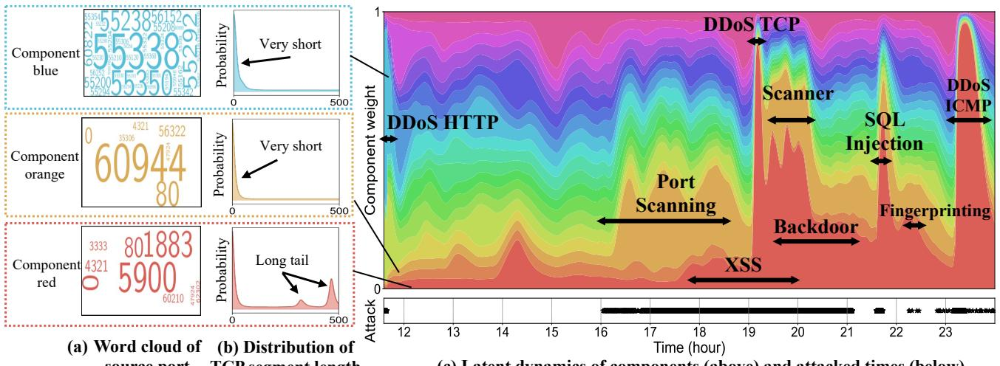
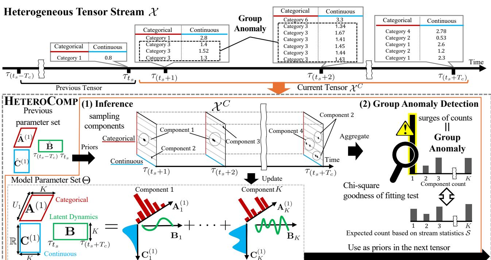
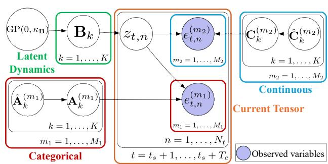
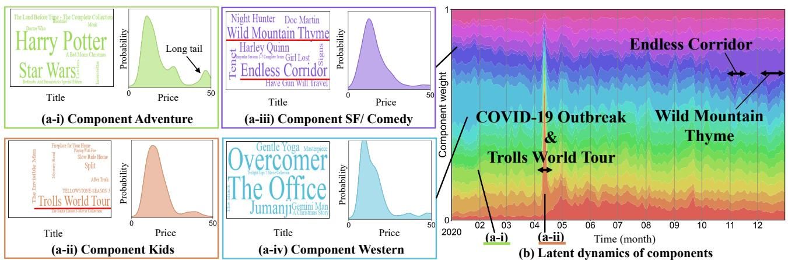
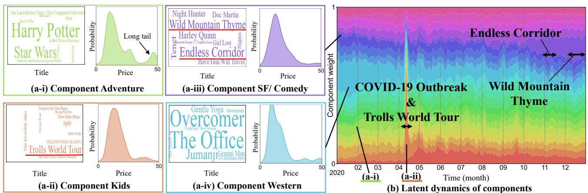
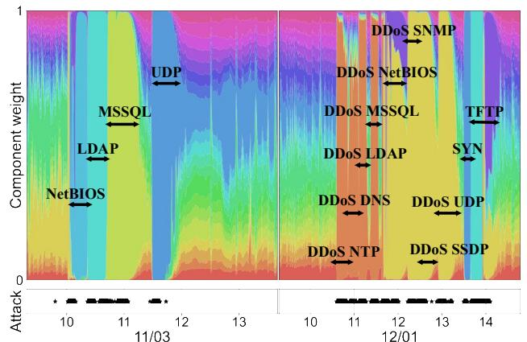
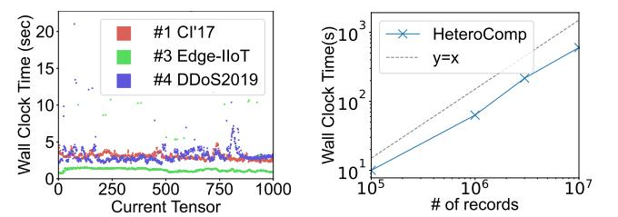
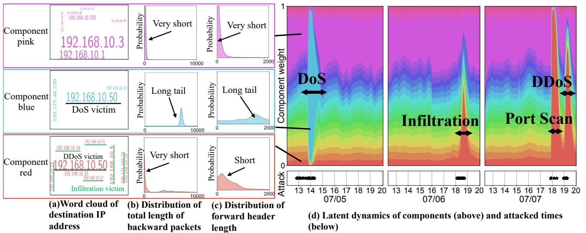
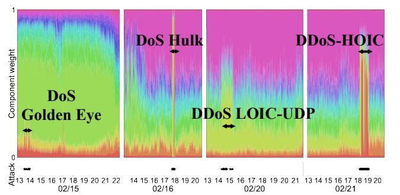

# Multi-Aspect Mining and Anomaly Detection for Heterogeneous Tensor Streams

Soshi Kakio SANKEN, The University of Osaka Osaka, Japan skakio88@sanken.osaka-u.ac.jp

Yasuko Matsubara SANKEN, The University of Osaka Osaka, Japan yasuko@sanken.osaka-u.ac.jp

Ren Fujiwara SANKEN, The University of Osaka Osaka, Japan r-fujiwr88@sanken.osaka-u.ac.jp

Yasushi Sakurai SANKEN, The University of Osaka Osaka, Japan yasushi@sanken.osaka-u.ac.jp

### Abstract

Analysis and anomaly detection in event tensor streams consisting of timestamps and multiple attributes —such as communication logs (time, IP address, packet length)—are essential tasks in data mining. While existing tensor decomposition and anomaly detection methods provide useful insights, they face the following two limitations. (i) They cannot handle heterogeneous tensor streams, which comprises both categorical attributes (e.g., IP address) and continuous attributes (e.g., packet length). They typically require either discretizing continuous attributes or treating categorical attributes as continuous, both of which distort the underlying statistical properties of the data. Furthermore, incorrect assumptions about the distribution family of continuous attributes often degrade the model's performance. (ii) They discretize timestamps, failing to track the temporal dynamics of streams (e.g., trends, abnormal events), which makes them ineffective for detecting anomalies at the group level, referred to as "group anomalies" (e.g, DoS attacks). To address these challenges, we propose HeteroComp, a method for continuously summarizing heterogeneous tensor streams into "components " representing latent groups in each attribute and their temporal dynamics, and detecting group anomalies. Our method employs Gaussian process priors to model unknown distributions of continuous attributes, and temporal dynamics, which directly estimate probability densities from data. Extracted components give concise but effective summarization, enabling accurate group anomaly detection. Extensive experiments on real datasets demonstrate that HeteroComp outperforms the state-of-the-art algorithms for group anomaly detection accuracy, and its computational time does not depend on the data stream length.

# CCS Concepts

• Information systems → Data stream mining; • Computing methodologies → Factorization methods.

[This work is licensed under a Creative Commons Attribution 4.0 International License.](https://creativecommons.org/licenses/by/4.0) WWW '26, Dubai, United Arab Emirates

© 2026 Copyright held by the owner/author(s). ACM ISBN 979-8-4007-2307-0/2026/04 <https://doi.org/10.1145/3774904.3792175>

# Keywords

Bayesian tensor decomposition, Data stream, Anomaly detection, Gaussian process

### ACM Reference Format:

Soshi Kakio, Yasuko Matsubara, Ren Fujiwara, and Yasushi Sakurai. 2026. Multi-Aspect Mining and Anomaly Detection for Heterogeneous Tensor Streams. In Proceedings of the ACM Web Conference 2026 (WWW '26), April 13–17, 2026, Dubai, United Arab Emirates.ACM, New York, NY, USA, [12](#page-11-0) pages. <https://doi.org/10.1145/3774904.3792175>

### 1 Introduction

The rapid development of information systems has made it possible to obtain a variety of multi-aspect event data streams, which consist of a timestamp and multiple attributes (e.g., price, user ID, item name). Crucially, the effective analysis and anomaly detection of such streams have numerous real-world applications [\[27\]](#page-8-0), including online marketing analytics [\[23\]](#page-8-1), location-based services [\[11,](#page-8-2) [15,](#page-8-3) [29\]](#page-8-4), and cybersecurity systems [\[3](#page-8-5)[–5,](#page-8-6) [26,](#page-8-7) [41\]](#page-9-0). For example, marketers want to discover hidden groups of each attribute and their trends from user's review data. Furthermore, in cybersecurity systems, analyzing and detecting anomalies (e.g., DDoS attacks) from access logs as quickly as possible is crucial to minimize the damage from them. Since there is no anomaly label in streaming settings, in this work, we focus on the analysis and unsupervised anomaly detection of multi-aspect data streams.

These multi-aspect data streams are represented as high dimensional tensor streams, which are inherently sparse [\[27\]](#page-8-0), where the number of present records is much smaller than the tensor size. Despite the wide success of existing tensor decomposition algorithms [\[16\]](#page-8-8), which aim to reveal hidden structures and relationships of tensors, this sparsity derails typical tensor decomposition methods because they are designed for dense tensors. Recent studies focused on the streaming decomposition of sparse tensors [\[11,](#page-8-2) [15,](#page-8-3) [17,](#page-8-9) [55\]](#page-9-1), with an effective strategy being the components-based methods [\[23,](#page-8-1) [26,](#page-8-7) [27\]](#page-8-0) that capture hidden groups in each attribute and their relationships. However, most existing methods can handle only categorical attributes (e.g., IP address, port, user ID), and cannot handle continuous attributes (e.g., price, flow duration, packet size). Here, we refer to such tensor streams that consist of both categorical attributes and continuous attributes as heterogeneous tensor stream. To handle heterogeneous tensor streams, existing methods require discretizing continuous attributes, which disrupts the continuity

**(c) Latent dynamics of components (above) and attacked times (below) source port TCP segment length** Figure 1: Modeling power of HeteroComp over (#3) Edge-IIoT dataset. Our proposed method can find the hidden components which represents different characteristics in both (a) categorical attribute (source port) and (b) continuous attribute (TCP segment length), and (c) component weight exhibit significant changes when cyber-attacks occurs.

of continuous attributes. Furthermore, in real-world scenarios, we often have no information about the continuous attributes; that is, we do not know the distributions of continuous attributes. Incorrect assumptions about the distribution family often degrade the model's performance.

Typical streaming unsupervised anomaly detection methods [\[6,](#page-8-10) [10,](#page-8-11) [22\]](#page-8-12) are effective at identifying anomalous records (point anomalies). However, as they ignore the temporal relationships between records, they cannot effectively detect group anomalies (also referred to as collective anomalies), which may not be anomalies by themselves, but their occurrence together as a collection exhibits unusual patterns that deviate from the entire data set [\[8\]](#page-8-13). A canonical example of group anomalies is a DoS attack: an individual request could possibly be normal, but their high-frequency aggregation over a short duration constitutes a critical threat. Although methods for detecting group anomalies [\[5,](#page-8-6) [41,](#page-9-0) [53\]](#page-9-2) have been developed, they cannot handle heterogeneous tensor streams; they enforce data homogeneity by either discretizing continuous attributes or treating categorical attributes as continuous, both of which distort the underlying statistical properties of the data. Furthermore, by discretizing timestamps, they fail to preserve their continuity. In summary of the above discussion, we wish to solve the following problem: Given a heterogeneous tensor stream, how can we find hidden structures of the stream without restricting to any specific parameterized form of continuous attributes, and quickly and accurately detect group anomalies?

In this paper, to tackle the above challenging problems, we propose HeteroComp[1](#page-1-0) , for continuously summarizing heterogeneous tensor streams into components and their temporal dynamics, and detect group anomalies based on the components without restricting to any specific parameterized form. Specifically, to model the unknown distribution of continuous attributes, HeteroComp uses

logistic Gaussian process priors [\[35\]](#page-8-14), which directly estimate probability densities from data, thus HeteroComp can treat continuous attributes uniformly. In addition, HeteroComp models the components' latent dynamics using the Gaussian process, which utilizes the continuity of timestamps and captures complex temporal evolutions(changes) of components linked to external events. Extracted components naturally represent latent groups in both categorical and continuous attributes, and relationship between attributes, which provide an easy-to-understand summary of data. Similar records tend to cluster into the same component, which enables accurate group anomaly detection by aggregating abnormal records. The framework further admits streaming updates without retraining from scratch, making it suitable for long-running deployments where heterogeneous tensor streams arrive continuously, and enabling low computational cost incorporation of new records.

### 1.1 Preview of Our Result

Fig. [1](#page-1-1) shows an example of the analysis of heterogeneous tensor stream (i.e., (#3) Edge-IIoT) using HeteroComp. This dataset consists of records with categorical attributes, continuous attributes, and timestamps. Our method captures the following properties:

- Modeling Heterogeneity: Fig. [1\(](#page-1-1)a)(b) shows the characteristics of three components blue, orange, and red. First, Fig. [1\(](#page-1-1)a) shows the word clouds of source port attribute. A larger size in the word cloud denote a stronger relationship with the component. Component blue is associated with records sent from ports 55338 and 55350 whereas component orange is dominated by records on port 60944, and component Red have records sent from ports 5900 and 1883. Next, Fig. [1\(](#page-1-1)b) shows the distribution of the length of the TCP segment attribute. Component blue and orange encompass records featuring short TCP segments, while component red primarily represents records with long TCP segments.
- Latent Dynamics: Fig. [1\(](#page-1-1)c) visualizes the latent dynamics of components, where the area of each color represents the component assignment probability at each time. The dynamics of

1Our source code is publicly available in [https://github.com/kaki005/HeteroComp.](https://github.com/kaki005/HeteroComp)

Table 1: Capabilities of approaches.

|                     | RRCF [10]   |               |              |              |                |                  |   |
|---------------------|-------------|---------------|--------------|--------------|----------------|------------------|---|
|                     | MStream [3] |               |              |              |                |                  |   |
|                     |             | MemStream [4] |              |              |                |                  |   |
|                     |             |               | Anograph [5] |              |                |                  |   |
|                     |             |               |              | Trimine [23] |                |                  |   |
|                     |             |               |              |              | CubeScope [27] |                  |   |
|                     |             |               |              |              |                | CyberCScope [26] |   |
| Anomaly detection   | ✓ ✓         | ✓             | ✓            |              | ✓              | ✓                | ✓ |
| Multi-aspect mining |             |               |              | ✓            | ✓              | ✓                | ✓ |
| Stream processing   | ✓ ✓         | ✓             | ✓            |              | ✓              | ✓                | ✓ |
| Heterogeneous       | ✓           |               |              |              |                | ✓                | ✓ |
| Latent dynamics     |             |               |              |              |                |                  | ✓ |

these latent components exhibit significant changes when cyberattacks occurs. Specifically, component blue becomes dominant over others when a DDoS HTTP attack occurs, while component orange becomes dominant during an attack originating from a different source port, such as Port Scanning and Vulnerability Scanner. Similarly, component red tends to increase during attacks characterized by the transmission of many packets with large TCP segment sizes, such as DDoS TCP, DDoS ICMP.

Contributions. In this paper, we propose HeteroComp, which has the following desirable properties:

- Effective: : Our proposed model summarizes heterogeneous tensor streams without restricting to any specific parameterized form, which extracts interpretable latent components and their latent dynamic (i.e., Fig. [1\)](#page-1-1).
- Accurate: Extensive experiments on real-world datasets shows that HeteroComp outperforms baseline approaches for detecting group anomalies accurately.
- Scalable: Our proposed algorithm is fast and its computation time does not depend on the entire stream length.

### 2 Related Work

In this section, we briefly describe investigations related to this research. Table [1](#page-2-0) shows the relative advantages of our method, and only HeteroComp meets all the requirements.

Sparse Tensor Decomposition. A wide range of studies have been conducted on analyzing sparse tensors, including probabilistic generative models[\[23,](#page-8-1) [37,](#page-8-16) [44,](#page-9-3) [46,](#page-9-4) [47,](#page-9-5) [54\]](#page-9-6) and neural-based models[\[1\]](#page-7-0). In particular, streaming algorithms have become more critical in terms of processing a substantial amount of data under time/memory limitations, and they have proved highly significant to the data mining and database community [\[7,](#page-8-17) [17,](#page-8-9) [42,](#page-9-7) [55\]](#page-9-1). CubeScope [\[27\]](#page-8-0) can summarize an event tensor stream interpretably, such as distinct patterns that change over time or major trends in categorical attributes. However, they can handle only categorical attributes, so they enforce data homogeneity by discretizing continuous attributes, which disrupts the continuity of continuous attributes. Only CyberCScope [\[26\]](#page-8-7) can handle heterogeneous tensor streams by distinguishing between categorical attributes and continuous attributes, but it only supports the case where the continuous attributes follow Gamma distributions, which may diminish component diversity. Furthermore, it uses Multinomial distribution to

model component evolution over time, failing to capture complex dynamics.

Streaming Anomaly Detection. Over decades, popular anomaly detection methods have been extended to work online on a data stream[\[25,](#page-8-18) [30,](#page-8-19) [36,](#page-8-20) [50,](#page-9-8) [52\]](#page-9-9), including One Class SVM [\[38\]](#page-8-21), isolation forest [\[6,](#page-8-10) [10\]](#page-8-11), and deep learning methods [\[51\]](#page-9-10). However, they are designed for point anomaly detection, failing to detect group anomalies. Although MemStream [\[4\]](#page-8-15) can handle the time-varying data distribution known as concept drift [\[21\]](#page-8-22) and robust to group anomalies, it cannot handle categorical attributes. Recent methods for group anomaly detection of multi-aspect data stream are mainly categorized into graph-based methods[\[2,](#page-8-23) [5,](#page-8-6) [8\]](#page-8-13) which aim to detect node/edge/graph anomalies in graph streams, and tensor-based methods [\[14,](#page-8-24) [41,](#page-9-0) [53\]](#page-9-2) which aim to detect suddenly appearing dense subtensors in sparse tensor streams. However, they are designed for categorical attributes, failing to handle heterogeneous tensor streams. Although Mstream [\[3\]](#page-8-5) can detect group anomalies from multi-aspect data involving categorical and continuous attributes, it discretizes timestamps, which degrades detection accuracy. Furthermore, they cannot summarize the streams interpretably.

Deep Generative Models. Although many deep generative models have been proposed to model heterogeneous tabular data[\[28,](#page-8-25) [48\]](#page-9-11) and non-parametric distributions [\[34\]](#page-8-26), they are computationally expensive for streaming scenarios.

# 3 Proposed Method

# 3.1 Problem Settings

We continuously monitor a stream of records {e1, e2, . . . }, arriving in a streaming manner. Each record e�� consists of timestamps ���� , ��1 categorical attributes {�� (��1 ) } ��1 ��1=1 , and ��2 continuous attributes {�� (��2 ) �� ��2 ��2=1 . For the ��1-th categorical attribute, we assume a finite ����1 -th dimensional space, whereas for the ��2-th continuous attribute, we assume a real space R. This stream takes the form of a (1 + ��1 + ��2)-th order tensor X ∈ N �� × Î��1 ��1=1 ����1 × Î��2 ��2=1 , where �� is the number of timestamps up to the current time. For each of the non-overlapping ���� ≪ �� timestamps, we can obtain X�� ∈ N ���� × Î��1 ��1=1 ����1 × Î��2 ��2=1 as the partial tensor of X. Our goal is to summarize continuously growing X and detect group anomalies by processing it incrementally as subtensor X��.

### 3.2 Gaussian Process

To model the latent dynamics of component and the distribution of continuous attributes, we use Gaussian processes [\[33\]](#page-8-27), which are distributions over functions, fully specified by a kernel covariance function ��, such that any finite set of function values is jointly Gaussian. Specifically, for a finite set of inputs �� = {��1, . . . , ���� }, the function values are distributed as

�� ∼ ���� (0, ��) def ⇐⇒ (�� (��1), . . . , �� (����)) ∼ Normal(0, K), (1)

where K��,�� = ��(���� , ����) is a covariance matrix.

### 3.3 Model

We now present our model in detail. We assume that there are �� major trends behind the event collections and refer to such trends

Figure 4: Market analysis of HeteroComp in the #6 Amazon Movie&TV dataset. (a) The characteristics of four components (Adventure, Kids, SF/Comedy, Western) in categorical attribute (Title) and continuous attribute (price in US dollars). (b) Component weight exhibit significant changes in relation to the film's release.

hypothesis cannot be rejected, so we judge X�� as normal, and add ���� , N (��) , {N (��1 ) } ��1 , {N (��2 ) } ��2 to S.

��1=1 ��2=1 Time complexity of HeteroComp. Lemma [4.2](#page-6-0) indicates that our proposed algorithm requires only constant computational time for the entire data stream length �� , thus HeteroComp is practical for semi-infinite data streams in terms of execution speed.

Lemma 4.2 (Proof in Appendix [A.3\)](#page-9-14). The time complexity HeteroComp for the current tensor X�� is ��(����������������(��1 + ��2) + ���������� 3 + ��1 ��1=1 ����1�� + ���� ��2 ��2=1 ����2 �� 3 ), where �� is the epoch count of component sampling, ������������ = ���� ��=1 ���� is the number of records, and �� is the L-BFGS iteration count.

### 5 Experiments

In this section, we evaluate the performance of HeteroComp. The experimental settings are detailed in Appendix [B.1.](#page-10-0) We answer the following questions through the experiments.

(Q1) Effectiveness: How successfully does it discover interpretable summarization of real datasets? (Q2) Accuracy: How accurately does it detect group anomalies from real datasets? (Q3) Scalability: How does it scale in terms of computational time?

Datasets. We used five real network traffic/intrusion datasets, namely (#1) CI'17 [\[39\]](#page-9-15), (#2) CCI'18 [\[13\]](#page-8-31), (#3) Edge-IIoT [\[9\]](#page-8-32), (#4) DDos2019 [\[40\]](#page-9-16),(#5) CUPID [\[18\]](#page-8-33), and one user-review dataset, namely (#6) Amazon Movie&TV [\[12\]](#page-8-34).

Baselines. We undertook comparisons with the following competitors for streaming anomaly detection: OneClassSVM [\[38\]](#page-8-21), iForestASD [\[6\]](#page-8-10), RRCF [\[10\]](#page-8-11), ARCUS [\[51\]](#page-9-10), Mstream [\[3\]](#page-8-5), MemStream [\[4\]](#page-8-15), Anograph [\[5\]](#page-8-6), CubeScope [\[27\]](#page-8-0), and CyberCScope [\[26\]](#page-8-7).

# 5.1 Q1: Effectiveness

We first demonstrate how effectively HeteroComp discovers interpretable summarization on real datasets.

User Review Analysis. Fig. [4](#page-6-1) shows our mining result for (#6) Amazon Movie&TV dataset. First, Fig. [4\(](#page-6-1)a) shows the characteristics of four components, where we manually named them "Adventure",

Figure 5: Dynamics of B (above) and attacked time (below) in (#4) DDos2019 dataset.

"Kids", "SF/Comedy", "Western", in title (i.e., A) and price (i.e., C). From the word clouds, Adventure is associated with blockbuster franchises such as Harry Potter and Star Wars. It exhibits a rightskewed price distribution with a high-price tail, whereas Kids (e.g., Trolls World Tour) concentrates in the low–to–mid price range. SF/Comedy (e.g., Endless Corridor, Wild Mountain Thyme, Tenet) and Western (e.g., The Office, Overcomer, Jumanji) films also appear at relatively low prices, with Western having the lowest median price. These observations indicate that each component captures coherent semantics in A while exhibiting distinct regimes in the continuous attribute C. Next, Fig. [4\(](#page-6-1)b) shows the latent dynamics (i.e., B), namely, which components the users are interested in 2020. In April, a spike of component Kids is observed, which is due to the closure of movie theaters caused by the COVID-19 pandemic and Universal's release of the animation film "Trolls World Tour" via streaming starting on April 10, 2020. Similarly, the release of "Endless Corridor" and "Wile Mountain Thyme" increase the users' attention to component SF/Comedy.

Table 2: Anomaly detection results. Best results are in bold, and second-best results are underlined (higher is better). The rightmost column shows the average value for each metric.

|            |                  |          |     |   |     | #1  | CI’17 | [39] | AUC-PR |     |     |   |     |   |     | #2  | CCI’18 | [13] | AUC-PR |     |     |   |     |   | #3  |     |   |     | [9] AUC-PR |     |     |   |     |   | #4  |     |   |     | [40] AUC-PR |     |     |   |     |   |     | #5  | CUPID | [18] | AUC-PR |     |     |   |     | Average | AUC-PR |
|------------|------------------|----------|-----|---|-----|-----|-------|------|--------|-----|-----|---|-----|---|-----|-----|--------|------|--------|-----|-----|---|-----|---|-----|-----|---|-----|------------|-----|-----|---|-----|---|-----|-----|---|-----|-------------|-----|-----|---|-----|---|-----|-----|-------|------|--------|-----|-----|---|-----|---------|--------|
|            | OneClassSVM [38] |          |     | 0 | 587 |     |       |      | 0      | 082 |     |   |     | 0 | 594 |     |        |      | 0      | 146 |     |   |     | 0 | 662 |     |   |     | 0          | 601 |     |   |     | 0 | 900 |     |   |     | 0           | 913 |     |   |     | 0 | 467 |     |       |      | 0      | 016 |     | 0 | 642 | 0       | 352    |
| iForestASD | [6]              | 0        | 844 | ± | 0   | 001 | 0     | 540  | ±      | 0   | 003 | 0 | 781 | ± | 0   | 001 | 0      | 428  | ±      | 0   | 005 | 0 | 700 | ± | 0   | 009 | 0 | 680 | ±          | 0   | 008 | 0 | 881 | ± | 0   | 001 | 0 | 912 | ±           | 0   | 001 | 0 | 957 | ± | 0   | 004 | 0     | 608  | ±      | 0   | 003 | 0 | 833 | 0       | 634    |
| RRCF       | [10]             | 0        | 877 | ± | 0   | 002 | 0     | 679  | ±      | 0   | 004 | 0 | 763 | ± | 0   | 009 | 0      | 337  | ±      | 0   | 010 | 0 | 927 | ± | 0   | 002 | 0 | 919 | ±          | 0   | 003 | 0 | 896 | ± | 0   | 002 | 0 | 922 | ±           | 0   | 001 | 0 | 974 | ± | 0   | 004 | 0     | 705  | ±      | 0   | 013 | 0 | 888 | 0       | 712    |
| ARCUS      | [51]             | 0        | 500 | ± | 0   | 002 | 0     | 028  | ±      | 0   | 002 | 0 | 503 | ± | 0   | 004 | 0      | 153  | ±      | 0   | 010 | 0 | 501 | ± | 0   | 001 | 0 | 586 | ±          | 0   | 178 | 0 | 500 | ± | 0   | 002 | 0 | 280 | ±           | 0   | 014 | 0 | 497 | ± | 0   | 008 | 0     | 013  | ±      | 0   | 000 | 0 | 500 | 0       | 212    |
| MStream    | [3]              | 0        | 905 | ± | 0   | 000 | 0     | 736  | ±      | 0   | 000 | 0 | 779 | ± | 0   | 000 | 0      | 363  | ±      | 0   | 000 | 0 | 928 | ± | 0   | 000 | 0 | 927 | ±          | 0   | 000 | 0 | 899 | ± | 0   | 000 | 0 | 925 | ±           | 0   | 000 | 0 | 991 | ± | 0   | 000 | 0     | 734  | ±      | 0   | 000 | 0 | 900 | 0       | 737    |
|            | MemStream [4]    | 0        | 893 | ± | 0   | 000 | 0     | 713  | ±      | 0   | 000 | 0 | 781 | ± | 0   | 000 | 0      | 366  | ±      | 0   | 000 | 0 | 935 | ± | 0   | 000 | 0 | 935 | ±          | 0   | 000 | 0 | 950 | ± | 0   | 002 | 0 | 956 | ±           | 0   | 001 | 0 | 977 | ± | 0   | 000 | 0     | 678  | ±      | 0   | 000 | 0 | 907 | 0       | 730    |
| Anograph   | [5]              | 0        | 921 | ± | 0   | 000 | 0     | 741  | ±      | 0   | 000 | 0 | 776 | ± | 0   | 001 | 0      | 419  | ±      | 0   | 005 | 0 | 928 | ± | 0   | 000 | 0 | 920 | ±          | 0   | 000 | 0 | 974 | ± | 0   | 000 | 0 | 970 | ±           | 0   | 000 | 0 | 994 | ± | 0   | 000 | 0     | 814  | ±      | 0   | 001 | 0 | 915 | 0       | 773    |
| CubeScope  | [27]             | 0        | 921 | ± | 0   | 001 | 0     | 545  | ±      | 0   | 003 | 0 | 490 | ± | 0   | 002 | 0      | 123  | ±      | 0   | 001 | 0 | 294 | ± | 0   | 004 | 0 | 421 | ±          | 0   | 004 | 0 | 684 | ± | 0   | 013 | 0 | 715 | ±           | 0   | 010 | 0 | 986 | ± | 0   | 000 | 0     | 872  | ±      | 0   | 004 | 0 | 675 | 0       | 535    |
|            | CyberCScope [26] | 0        | 625 | ± | 0   | 037 | 0     | 302  | ±      | 0   | 096 | 0 | 659 | ± | 0   | 090 | 0      | 202  | ±      | 0   | 047 | 0 | 771 | ± | 0   | 054 | 0 | 633 | ±          | 0   | 056 | 0 | 502 | ± | 0   | 176 | 0 | 574 | ±           | 0   | 127 | 0 | 940 | ± | 0   | 034 | 0     | 785  | ±      | 0   | 116 | 0 | 699 | 0       | 499    |
|            | HeteroComp       | (ours) 0 | 990 | ± | 0   | 006 | 0     | 931  | ±      | 0   | 037 | 0 | 788 | ± | 0   | 005 | 0      | 644  | ±      | 0   | 008 | 0 | 935 | ± | 0   | 003 | 0 | 931 | ±          | 0   | 003 | 0 | 963 | ± | 0   | 003 | 0 | 970 | ±           | 0   | 002 | 0 | 999 | ± | 0   | 000 | 0     | 959  | ±      | 0   | 001 | 0 | 935 | 0       | 887    |

Cybersecurity systems. As discussed in Section [1,](#page-0-0) Fig. [1](#page-1-1) showed that HeteroComp can effectively estimate components with various distributional characteristics and their temporal changes (dynamics). Additionally, Fig. [5](#page-6-2) contrasts the temporal variation of the estimated B with the actual time of the cyberattack in the (#4) DDos2019 dataset. During the attacks, a specific components increases sharply. Please also see the results in (#1) CI'17 and (#2) CCI'18 datasets in Appendix [B.2.](#page-11-1)

These results show that HeteroComp can capture the interpretable components and their temporal dynamics consistent with external events, such as movie releases or cyber-attacks.

### 5.2 Q2: Accuracy

We next evaluate the accuracy of HeteroComp in terms of group anomaly detection. We defined a current tensor as anomalous if it contains more than one hundred anomalous records. For pointanomaly detection methods, the anomaly score of a current tensor was defined as the sum of the anomaly scores of the records contained within it. Table [2](#page-7-1) shows AUC-ROC and AUC-PR for each method, where a higher value indicates better detection accuracy. All results are averaged over three runs with random seeds. Our proposed method HeteroComp achieves the highest average detection accuracy across the datasets, which demonstrates that HeteroComp is effective for group anomaly detection. Point-anomaly detection methods (One Class SVM, iForestASD, RRCF, ARCUS) exhibit low performance in detecting group anomalies. MStream and MemStream achieve high detection accuracy, but since they cannot exploit the continuity of timestamps, they suffer from many false positives, resulting in low AUC-PR, especially on (#2) CCI'18 dataset. Although Anograph obtains better performance with (#4) DDos2019, it underperforms HeteroComp across other datasets because it is a graph-based method and cannot handle multi-aspect data. CubeScope discretizes continuous attributes, and CyberC-Scope assumes continuous attributes follow only a Gamma distribution, which limit their abilities to represent diverse attribute distributions and degrade detection performance.

# 5.3 Q3: Scalability

Finally, we verify the computation time of HeteroComp. The left part of Fig. [6](#page-7-2) shows the average wall clock time of an experiment performed on three datasets, (#1) CI'17, (#3) Edge-IIoT, (#4) DDos2019. Although there are slight variations due to differences in the number of records, thanks to the incremental update, Hetero-Comp can maintain stable computational performance independent

Figure 6: Complexity analysis of HeteroComp: (Left) Average wall clock time vs. current tensor. (Right) Wall clock time vs. # of records in X��. The algorithm scales linearly (i.e., slope = 1 in log-log scale).

of the overall stream length. The right part of Fig. [6](#page-7-2) shows the computational time of HeteroComp when varying the number of records in X��. Since HeteroComp achieves fast model estimation for ��(������������ ) time (as discussed in Lemma [4.2\)](#page-6-0), its computation time is linear with respect to the number of records (i.e., slope = 1 in log-log scale).

### 6 Conclusion

In this paper, we propose HeteroComp, which summarizes heterogeneous tensor streams and detects anomalies in real-time. HeteroComp can simultaneously components and their temporal dynamics without restricting to any specific parameterized form of continuous attributes, and immediately detect anomalous behavior based on them. Our approach exhibits all of the following desirable properties that we listed in the introduction. (a) Effective: It discovers latent components and their latent dynamics. (b) Accurate: Our experiments demonstrated that HeteroComp detects group anomalies accurately. (c) Scalable: The computational time does not depend on the data stream length.

# Acknowledgments

We would like to thank the anonymous referees for their valuable and helpful comments. This work was supported by JSPS KAK-ENHI Grant-in-Aid for Scientific Research Number JP24KJ1618, JST CREST JPMJCR23M3, JST START JPMJST2553, JST CREST JP-MJCR20C6, JST K Program JPMJKP25Y6, JST COI-NEXT JPMJPF2009, JST COI-NEXT JPMJPF2115, the Future Social Value Co-Creation Project - Osaka University.

### References

[1] Dawon Ahn, Uday Singh Saini, Evangelos E. Papalexakis, and Ali Payani. 2024. Neural Additive Tensor Decomposition for Sparse Tensors. In Proceedings of the 33rd ACM International Conference on Information and Knowledge Management

(Boise, ID, USA) (CIKM '24). Association for Computing Machinery, New York, NY, USA, 14–23. [doi:10.1145/3627673.3679833](https://doi.org/10.1145/3627673.3679833) [2] Siddharth Bhatia, Bryan Hooi, Minji Yoon, Kijung Shin, and Christos Faloutsos. 2020. Midas: Microcluster-Based Detector of Anomalies in Edge Streams. In The Thirty-Fourth AAAI Conference on Artificial Intelligence, AAAI 2020, The Thirty-Second Innovative Applications of Artificial Intelligence Conference, IAAI 2020, The Tenth AAAI Symposium on Educational Advances in Artificial Intelligence, EAAI 2020, New York, NY, USA, February 7-12, 2020. AAAI Press, New York, NY, USA, 3242–3249. [doi:10.1609/AAAI.V34I04.5724](https://doi.org/10.1609/AAAI.V34I04.5724) [3] Siddharth Bhatia, Arjit Jain, Pan Li, Ritesh Kumar, and Bryan Hooi. 2021. MStream: Fast Anomaly Detection in Multi-Aspect Streams. In Proceedings of the Web Conference 2021 (Ljubljana, Slovenia) (WWW '21). Association for Computing Machinery, New York, NY, USA, 3371–3382. [doi:10.1145/3442381.3450023](https://doi.org/10.1145/3442381.3450023) [4] Siddharth Bhatia, Arjit Jain, Shivin Srivastava, Kenji Kawaguchi, and Bryan Hooi. 2022. MemStream: Memory-Based Streaming Anomaly Detection. In Proceedings of the ACM Web Conference 2022 (WWW '22). Association for Computing Machinery, New York, NY, USA, 610–621. [doi:10.1145/3485447.3512221](https://doi.org/10.1145/3485447.3512221) [5] Siddharth Bhatia, Mohit Wadhwa, Kenji Kawaguchi, Neil Shah, Philip S. Yu, and Bryan Hooi. 2023. Sketch-Based Anomaly Detection in Streaming Graphs. In Proceedings of the 29th ACM SIGKDD Conference on Knowledge Discovery and Data Mining (Long Beach, CA, USA) (KDD '23). Association for Computing Machinery, New York, NY, USA, 93–104. [doi:10.1145/3580305.3599504](https://doi.org/10.1145/3580305.3599504) [6] Zhiguo Ding and Minrui Fei. 2013. An Anomaly Detection Approach Based on Isolation Forest Algorithm for Streaming Data using Sliding Window. IFAC Proceedings Volumes 46, 20 (2013), 12–17. [doi:10.3182/20130902-3-CN-3020.00044](https://doi.org/10.3182/20130902-3-CN-3020.00044) 3rd IFAC Conference on Intelligent Control and Automation Science ICONS 2013. [7] Yishuai Du, Yimin Zheng, Kuang-chih Lee, and Shandian Zhe. 2018. Probabilistic Streaming Tensor Decomposition. In 2018 IEEE International Conference on Data Mining (ICDM). IEEE Computer Society, Singapore, Singapore, 99–108. [doi:10.](https://doi.org/10.1109/ICDM.2018.00025) [1109/ICDM.2018.00025](https://doi.org/10.1109/ICDM.2018.00025) [8] Ocheme Anthony Ekle and William Eberle. 2024. Anomaly Detection in Dynamic Graphs: A Comprehensive Survey. ACM Trans. Knowl. Discov. Data 18, 8, Article 192 (July 2024), 44 pages. [doi:10.1145/3669906](https://doi.org/10.1145/3669906) [9] Mohamed Amine Ferrag, Othmane Friha, Djallel Hamouda, Leandros Maglaras, and Helge Janicke. 2022. Edge-IIoTset: A New Comprehensive Realistic Cyber Security Dataset of IoT and IIoT Applications: Centralized and Federated Learning. [doi:10.21227/mbc1-1h68](https://doi.org/10.21227/mbc1-1h68) [10] Sudipto Guha, Nina Mishra, Gourav Roy, and Okke Schrijvers. 2016. Robust Random Cut Forest Based Anomaly Detection on Streams. In Proceedings of The 33rd International Conference on Machine Learning (Proceedings of Machine Learning Research, Vol. 48), Maria Florina Balcan and Kilian Q. Weinberger (Eds.). PMLR, New York, New York, USA, 2712–2721. [https://proceedings.mlr.press/](https://proceedings.mlr.press/v48/guha16.html) [v48/guha16.html](https://proceedings.mlr.press/v48/guha16.html) [11] Bryan Hooi, Kijung Shin, Shenghua Liu, and Christos Faloutsos. 2019. SMF: Drift-Aware Matrix Factorization with Seasonal Patterns. In Proceedings of the 2019 SIAM International Conference on Data Mining (SDM). Society for Industrial and Applied Mathematics, Calgary, Alberta, Canada, 621–629. arXiv[:https://epubs.siam.org/doi/pdf/10.1137/1.9781611975673.70](https://arxiv.org/abs/https://epubs.siam.org/doi/pdf/10.1137/1.9781611975673.70) [doi:10.1137/1.](https://doi.org/10.1137/1.9781611975673.70) [9781611975673.70](https://doi.org/10.1137/1.9781611975673.70) [12] Yupeng Hou, Jiacheng Li, Zhankui He, An Yan, Xiusi Chen, and Julian McAuley. 2024. Bridging Language and Items for Retrieval and Recommendation. [https:](https://amazon-reviews-2023.github.io/) [//amazon-reviews-2023.github.io/](https://amazon-reviews-2023.github.io/) [13] Sharafaldin Iman, Lashkari Arash, Habibi, and Ghorbani Ali, A. 2018. CSE-CIC-IDS2018 on AWS.<https://www.unb.ca/cic/datasets/ids-2018.html> [14] Meng Jiang, Alex Beutel, Peng Cui, Bryan Hooi, Shiqiang Yang, and Christos Faloutsos. 2015. A General Suspiciousness Metric for Dense Blocks in Multimodal Data. In Proceedings of the 2015 IEEE International Conference on Data Mining (ICDM) (ICDM '15). IEEE Computer Society, USA, 781–786. [doi:10.1109/ICDM.](https://doi.org/10.1109/ICDM.2015.61) [2015.61](https://doi.org/10.1109/ICDM.2015.61) [15] Koki Kawabata, Siddharth Bhatia, Rui Liu, Mohit Wadhwa, and Bryan Hooi. 2021. SSMF: Shifting Seasonal Matrix Factorization. In Advances in Neural Information Processing Systems 34, Vol. 34. Curran Associates, Inc., 3863–3873. [16] Tamara G. Kolda and Brett W. Bader. 2009. Tensor Decompositions and Applications. SIAM Rev. 51, 3 (2009), 455–500. arXiv[:https://doi.org/10.1137/07070111X](https://arxiv.org/abs/https://doi.org/10.1137/07070111X) [doi:10.1137/07070111X](https://doi.org/10.1137/07070111X) [17] Taehyung Kwon, Inkyu Park, Dongjin Lee, and Kijung Shin. 2021. SliceNStitch: Continuous CP Decomposition of Sparse Tensor Streams . In 2021 IEEE 37th International Conference on Data Engineering (ICDE), Vol. 1. IEEE Computer Society, Los Alamitos, CA, USA, 816–827. [doi:10.1109/ICDE51399.2021.00076](https://doi.org/10.1109/ICDE51399.2021.00076) [18] Heather Lawrence, Uchenna Ezeobi, Orly Tauil, Jacob Nosal, Owen Redwood, Yanyan Zhuang, and Gedare Bloom. 2022. CUPID: A labeled dataset with Pentesting for evaluation of network intrusion detection. Journal of Systems Architecture 129 (2022), 102621. [doi:10.1016/j.sysarc.2022.102621](https://doi.org/10.1016/j.sysarc.2022.102621) [19] {Dong C.} Liu and Jorge Nocedal. 1989. On the limited memory BFGS method for large scale optimization. Mathematical Programming 45, 1-3 (Aug. 1989), 503–528. [doi:10.1007/BF01589116](https://doi.org/10.1007/BF01589116) [20] Lisa Liu, Gints Engelen, Timothy Lynar, Daryl Essam, and Wouter Joosen. 2022. Error Prevalence in NIDS datasets: A Case Study on CIC-IDS-2017 and CSE-CIC-IDS-2018. 2022 IEEE Conference on Communications and Network Security (CNS) 00 (2022), 254–262. [21] Jie Lu, Anjin Liu, Fan Dong, Feng Gu, João Gama, and Guangquan Zhang. 2017. Learning under Concept Drift: A Review. IEEE Transactions on Knowledge and Data Engineering 31, 12 (2017), 2346–2363. arXiv[:2004.05785](https://arxiv.org/abs/2004.05785) [22] Emaad Manzoor, Hemank Lamba, and Leman Akoglu. 2018. xStream: Outlier Detection in Feature-Evolving Data Streams. Proceedings of the 24th ACM SIGKDD International Conference on Knowledge Discovery & Data Mining (2018), 1963– 1972. [23] Yasuko Matsubara, Yasushi Sakurai, Christos Faloutsos, Tomoharu Iwata, and Masatoshi Yoshikawa. 2012. Fast mining and forecasting of complex time-stamped events. In Proceedings of the 18th ACM SIGKDD International Conference on Knowledge Discovery and Data Mining (Beijing, China) (KDD '12). Association for Computing Machinery, New York, NY, USA, 271–279. [doi:10.1145/2339530.2339577](https://doi.org/10.1145/2339530.2339577) [24] Jacob Montiel, Max Halford, Saulo Martiello Mastelini, Geoffrey Bolmier, Raphael Sourty, Robin Vaysse, Adil Zouitine, Heitor Murilo Gomes, Jesse Read, Talel Abdessalem, and Albert Bifet. 2021. River: machine learning for streaming data in Python. Journal of Machine Learning Research 22, 110 (2021), 1–8. [http:](http://jmlr.org/papers/v22/20-1380.html) [//jmlr.org/papers/v22/20-1380.html](http://jmlr.org/papers/v22/20-1380.html) [25] Gyoung S Na, Donghyun Kim, and Hwanjo Yu. 2018. DILOF: Effective and Memory Efficient Local Outlier Detection in Data Streams. Proceedings of the 24th ACM SIGKDD International Conference on Knowledge Discovery and Data Mining (2018), 1993–2002. [26] Kota Nakamura, Koki Kawabata, Shungo Tanaka, Yasuko Matsubara, and Yasushi Sakurai. 2025. CyberCScope: Mining Skewed Tensor Streams and Online Anomaly Detection in Cybersecurity Systems. In Companion Proceedings of the ACM on Web Conference 2025 (Sydney NSW, Australia) (WWW '25). Association for Computing Machinery, New York, NY, USA, 1214–1218. [doi:10.1145/3701716.3715476](https://doi.org/10.1145/3701716.3715476) [27] Kota Nakamura, Yasuko Matsubara, Koki Kawabata, Yuhei Umeda, Yuichiro Wada, and Yasushi Sakurai. 2023. Fast and Multi-aspect Mining of Complex Time-stamped Event Streams. In Proceedings of the ACM Web Conference 2023 (Austin, TX, USA) (WWW '23). Association for Computing Machinery, New York, NY, USA, 1638–1649. [doi:10.1145/3543507.3583370](https://doi.org/10.1145/3543507.3583370) [28] Alfredo Nazábal, Pablo M. Olmos, Zoubin Ghahramani, and Isabel Valera. 2020. Handling incomplete heterogeneous data using VAEs. Pattern Recognition 107 (2020), 107501. [doi:10.1016/j.patcog.2020.107501](https://doi.org/10.1016/j.patcog.2020.107501) [29] Maya Okawa, Tomoharu Iwata, Takeshi Kurashima, Yusuke Tanaka, Hiroyuki Toda, and Naonori Ueda. 2019. Deep Mixture Point Processes: Spatio-temporal Event Prediction with Rich Contextual Information. In Proceedings of the 25th ACM SIGKDD International Conference on Knowledge Discovery & Data Mining (Anchorage, AK, USA) (KDD '19). Association for Computing Machinery, New York, NY, USA, 373–383. [doi:10.1145/3292500.3330937](https://doi.org/10.1145/3292500.3330937) [30] Dragoljub Pokrajac, Aleksandar Lazarevic, and Longin Jan Latecki. 2007. Incremental Local Outlier Detection for Data Streams. 2007 IEEE Symposium on Computational Intelligence and Data Mining (2007), 504–515. [31] Nicholas G. Polson, James G. Scott, and Jesse Windle. 2013. Bayesian Inference for Logistic Models Using Pólya–Gamma Latent Variables. J. Amer. Statist. Assoc. 108, 504 (2013), 1339–1349. arXiv[:https://doi.org/10.1080/01621459.2013.829001](https://arxiv.org/abs/https://doi.org/10.1080/01621459.2013.829001) [doi:10.1080/01621459.2013.829001](https://doi.org/10.1080/01621459.2013.829001) [32] Ian Porteous, David Newman, Alexander Ihler, Arthur Asuncion, Padhraic Smyth, and Max Welling. 2008. Fast collapsed gibbs sampling for latent dirichlet allocation. In Proceedings of the 14th ACM SIGKDD International Conference on Knowledge Discovery and Data Mining (Las Vegas, Nevada, USA) (KDD '08). Association for Computing Machinery, New York, NY, USA, 569–577. [doi:10.1145/1401890.1401960](https://doi.org/10.1145/1401890.1401960) [33] Carl Edward Rasmussen and Christopher K. I. Williams. 2005. Gaussian Processes for Machine Learning. The MIT Press, Cambridge, MA. [doi:10.7551/mitpress/](https://doi.org/10.7551/mitpress/3206.001.0001) [3206.001.0001](https://doi.org/10.7551/mitpress/3206.001.0001) [34] Danilo Jimenez Rezende and Shakir Mohamed. 2015. Variational inference with normalizing flows. In Proceedings of the 32nd International Conference on International Conference on Machine Learning - Volume 37 (Lille, France) (ICML'15). JMLR.org, 1530–1538. [35] Jaakko Riihimäki and Aki Vehtari. 2012. Laplace Approximation for Logistic Gaussian Process Density Estimation and Regression. Bayesian Analysis 9 (11 2012). [doi:10.1214/14-BA872](https://doi.org/10.1214/14-BA872) [36] Mahsa Salehi, Christopher Leckie, James C. Bezdek, Tharshan Vaithianathan, and Xuyun Zhang. 2016. Fast Memory Efficient Local Outlier Detection in Data Streams. IEEE Transactions on Knowledge and Data Engineering 28, 12 (2016), 3246–3260. [doi:10.1109/TKDE.2016.2597833](https://doi.org/10.1109/TKDE.2016.2597833) [37] Aaron Schein, John Paisley, David M. Blei, and Hanna Wallach. 2015. Bayesian Poisson Tensor Factorization for Inferring Multilateral Relations from Sparse Dyadic Event Counts. In Proceedings of the 21th ACM SIGKDD International Conference on Knowledge Discovery and Data Mining (Sydney, NSW, Australia) (KDD '15). Association for Computing Machinery, New York, NY, USA, 1045–1054. [doi:10.1145/2783258.2783414](https://doi.org/10.1145/2783258.2783414) [38] Bernhard Schölkopf, Robert C Williamson, Alex Smola, John Shawe-Taylor, and John Platt. 1999. Support Vector Method for Novelty Detection. In Advances in Neural Information Processing Systems, S. Solla, T. Leen, and K. Müller (Eds.),

Table 4: Dataset description. Here, 'fwd' and 'bwd' denote 'forward' and 'backward,' respectively.

| Dataset Categorical         | �� 1 Continuous �� 2                  |
|-----------------------------|---------------------------------------|
| #1 CI’17 [39] (Src/ Dst)    | IP address 4 Flow duration 6          |
| Protocol                    | Total length of (fwd /bwd) packet     |
| Dst                         | port (Fwd /Bwd) header length         |
|                             | Flow IAT mean                         |
| #2 CCI’18 [13]              | ” 4 ” 6                               |
| #3 Edge-IIoT [9] (Src/ Dst) | IP address 6 TCP length 1             |
| (Src/                       | Dst) port                             |
| TCP                         | flag                                  |
| #4 DDos2019 [40] (Src/ Dst) | IP address 3 Flow duration 6          |
| Protocol                    | Total length of fwd packet            |
|                             | Fwd header length                     |
|                             | ACK flag count                        |
|                             | Flow bytes/s                          |
|                             | Flow packets/s                        |
| #5 CUPID [18] (Src/ Dst)    | IP address 5 Flow duration 7          |
| (Src/                       | Dst) Pport Total length of fwd packet |
| Protocol                    | Bwd header length                     |
|                             | Flow IAT mean                         |
|                             | Flow bytes/s                          |
|                             | Flow packets/s                        |
|                             | Minimum fwd seg size                  |
| #6 Amazon Movie&TV [12]     | Title 23 Price 1                      |
| Category                    | flag(Action,                          |
| Adventure,                  | Anime,                                |
| Arts,                       | Cerebral                              |
| Christmas,                  | Classical,                            |
| Comedy,                     | Documentary,                          |
| Fantasy,                    | Fitness,                              |
| Horror,                     | Kids,                                 |
| Military,                   | Music,                                |
| Musicals,                   | Mystery,                              |
| Religion,                   | Romance,                              |
| SF, Thriller,               | Westerns)                             |

In the estimation of C, the computation of the gradient [\(26\)](#page-5-2) requires��(����2 �� 3 ) for the Forward-Backward algorithm [\(16\)](#page-5-0)-[\(23\)](#page-5-1). We repeat this computation for each iteration, for each component, and for each continuous attribute, so the total cost is��(���� ��2 ��2=1 ����2 �� 3 ).

In the anomaly detection, the computation of Equation [\(30\)](#page-5-4) requires ��(�� + ��1 ����1�� + ��2 ��2=1 ����2��).

��1=1 Aggregating these, the total computational complexity is ��(�� ��������������(��1+��2) +���������� 3+ Í��1 ��1=1 ����1�� +���� Í��2 ��2=1 ����2 �� 3 ). □

# B Experimental Evaluation

# B.1 Experimental Setup

In this section, we describe the experimental setup in detail. We conducted all our experiments on an Intel Xeon Gold 6444Y 3.6GHz quad core CPU with 768GB of memory and running Linux.

Hyperparameter. We use the Matern-3/2 kernel function as a ��B, ��C. We set the number of components�� to 20. We set the number of grids �� = 300 for all continuous attributes, and epoch count �� = 30. We set the current tensor size ���� to 30 for (#1) CI'17, (#2) CCI'18, (#3) Edge-IIoT, (#4) DDos2019, (#5) CUPID datasets, and 14 for (#6) Amazon Movie&TV dataset.

Datasets. Table [4](#page-10-1) summarizes the features employed in the experiments.

- (#1) CI'17 [\[39\]](#page-9-15): It consists of up to 18 million event logs, in which various types of intrusions occur over time. Normal user behavior is executed through scripts. The data set contains a wide range of attack types like SSH brute force, heartbleed, botnet, DoS, DDoS, web and infiltration attacks. A previous study [\[20\]](#page-8-35) reported errors in this dataset and released improved versions [4](#page-10-2) , which we used throughout the experiments.

- (#2) CCI'18 [\[13\]](#page-8-31): It includes seven different attack scenarios: Bruteforce, Heartbleed, Botnet, DoS, DDoS, Web attacks, and infiltration of the network from inside. The attacking infrastructure includes 50 machines and the victim organization has 5 departments and includes 420 machines and 30 servers. The dataset includes the captures network traffic and system logs of each machine, along with 80 features extracted from the captured traffic using CICFlowMeter-V3. A previous study [\[20\]](#page-8-35) reported errors in this dataset and released improved versions [5](#page-10-3) , which we used throughout the experiments.
- (#3) Edge-IIoT [\[9\]](#page-8-32): It is a new comprehensive cybersecurity dataset for IoT and IIoT applications, designed for intrusion detection systems[6](#page-10-4) .
- (#4) DDos2019 [\[40\]](#page-9-16): It is a realistic and comprehensive dataset for evaluating Distributed Denial of Service (DDoS) attack detection systems, as existing datasets have significant shortcomings [7](#page-10-5) .
- (#5) CUPID [\[18\]](#page-8-33): It emulates a small physical network with several virtualized systems [8](#page-10-6) . Its main objective is to provide both scripted and human-generated traffic produced by professional penetration testers, allowing researchers to investigate the differences between the two.

<https://intrusion-detection.distrinet-research.be/CNS2022/CICIDS2017.html> <https://intrusion-detection.distrinet-research.be/CNS2022/CSECICIDS2018.html> [https://ieee-dataport.org/documents/edge-iiotset-new-comprehensive-realistic](https://ieee-dataport.org/documents/edge-iiotset-new-comprehensive-realistic-cyber-security-dataset-iot-and-iiot-applications)[cyber-security-dataset-iot-and-iiot-applications](https://ieee-dataport.org/documents/edge-iiotset-new-comprehensive-realistic-cyber-security-dataset-iot-and-iiot-applications)

7<https://www.unb.ca/cic/datasets/ddos-2019.html> 8<https://www.kaggle.com/datasets/dhoogla/cupid-2022>

- (#6) Amazon Movie&TV [\[12\]](#page-8-34): It is a large-scale Amazon Reviews dataset, collected in 2023 by McAuley Lab [9](#page-10-7) .

Baselines. The details of the baselines we used throughout our extensive experiments are summarized as follows:

- OneClassSVM(One Class Solid Vector Machine) [\[38\]](#page-8-21): It is a classification principled data stream anomaly detection algorithm. We set an upper bound on the fraction to 0.1, and the learning rate to 0.01.
- iForestASD [\[6\]](#page-8-10): An Anomaly Detection Approach Based on Isolation Forest Algorithm for Streaming Data using Sliding Window. Following [\[4\]](#page-8-15), we set the window size to 2048 and the number of estimators to 100.
- RRCF(Robust Random Cut Forest) [\[10\]](#page-8-11): Isolation Forest-based method designed for the high-dimensional data anomaly detection problem. Following [\[4\]](#page-8-15), we set the number of trees to 4, and shingle size to 4, and size of tree to 256.
- ARCUS [\[51\]](#page-9-10): A deep online anomaly detection framework, which uses an adaptive model pool to manage multiple classification models to handle multiple temporal concept drifts. We use DAGMM [\[56\]](#page-9-18) as instances of ARCUS. Following the original paper, we set the batch size to 512, the learning rate to 0.0001, the number of layers in AE to 3, the latent dimensionality of AE to 24, and the minimum batch size to 32.
- MStream [\[3\]](#page-8-5): A streaming multi-aspect data anomaly detection framework using locality sensitive hashing. We set the temporal decay factor to �� = 0.5.
- MemStream [\[4\]](#page-8-15): Streaming approach using a denoising AutoEncoder and a memory module. We set the memory size �� = 64 and the threshold for concept drift �� = 0.01.

9<https://amazon-reviews-2023.github.io/>

Figure 7: Modeling power of HeteroComp over (#1) CI'17 dataset. Our proposed method can find the hidden components which represents different characteristics in both (a) categorical attribute and (b) (c)continuous attributes, and (d) component weight exhibit significant changes when cyber-attacks occurs.

Figure 8: Dynamics of B in (#2) CCI'18. The area of each color represents the component assignment probability at each time.

- Anograph [\[5\]](#page-8-6): Graph based streaming anomaly detection method. Following the original paper, we set the number of buckets to 32, edge thresholds to 100, and time window to 60.
- CubeScope [\[27\]](#page-8-0): An online tensor factorization method based on probabilistic generative models. We set component size to �� = 48, as used in [\[26\]](#page-8-7).
- CyberCScope [\[26\]](#page-8-7): A tensor decomposition method which detects time-varying anomaly patterns while distinguishing between categorical attributes and continuous attributes. We set component size to �� = 48, as used in the original paper.

We used open-sourced implementations of ARCUS [\[51\]](#page-9-10), MStream [\[3\]](#page-8-5), MemStream [\[4\]](#page-8-15), CubeScope [\[27\]](#page-8-0), CyberCScope [\[26\]](#page-8-7), provided by the authors. For iForestASD [\[6\]](#page-8-10) and RRCF [\[10\]](#page-8-11), we use the opensource library PySAD [\[49\]](#page-9-19) implementation. We also used the opensource implementation of OneClassSVM [\[38\]](#page-8-21) in the river library [\[24\]](#page-8-36). For Anograph [\[5\]](#page-8-6), we use the open-source implementation [\[45\]](#page-9-20) because the original code is implemented in C.

### B.2 Effectiveness

We also demonstrate how effectively HeteroComp works on datasets different from the ones presented in Section [5.1.](#page-6-3) Fig. [7](#page-11-2) shows the analysis of (#1) CI'17 dataset. Fig. [7\(](#page-11-2)a)(b)(c) shows the characteristics of three components pink, blue, red. First, Fig. [7\(](#page-11-2)a) shows the word clouds of destination IP address attribute (i.e., A). A larger size in the word cloud denote a stronger relationship with the component. Component pink contains records sent to IP address 192.168.10.3 and 192.168.10.3, while Component blue consists of records sent to 192.168.10.50, the victim of the DoS attack. Component red consists of the victims of the Infiltration attack (green underlined) and the victim of DDoS attack (i.e., 192.168.10.50). Next, Fig. [7\(](#page-11-2)b) and Fig. [7\(](#page-11-2)c) show the probability density of the total length of backward packets and the probability distribution of the forward header length, respectively (i.e., C). In Fig. [7\(](#page-11-2)b), component pink and red follow exponential-like distributions, whereas component blue shows a long-tailed distribution, indicating that records in pink and red have shorter total backward packet lengths, while those in blue tend to have longer ones. These results show that HeteroComp can flexibly represent various distributions of continuous attributes according to the data. Fig. [7](#page-11-2) (d) visualizes the latent dynamics of components (i.e., B) in the (#1) CI'17 dataset. During DoS attacks, component blue dominates, whereas component red increases sharply during Infiltration and Port Scan attacks.

Similarly, Fig. [8](#page-11-3) visualizes the latent dynamics of components (i.e., B) and attacked times in the (#2) CCI'18 dataset. The proportions of components red and green increased sharply during periods of cyber-attacks (e.g., DoS Golden Eye, DoS Hulk, DDoS LOIC-UDP, DDoS-HOIC).

These results show that HeteroComp can capture the interpretable components in both categorical and continuous attributes, and their temporal dynamics consistent with external events, such as cyber-attacks.