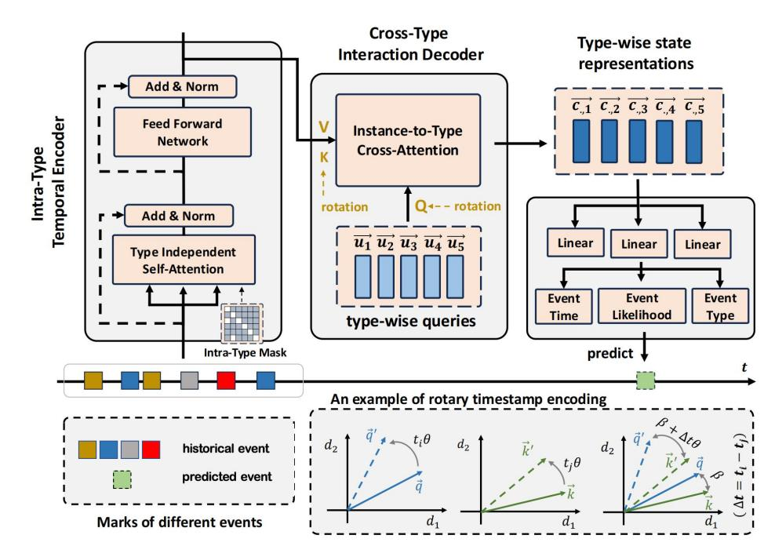
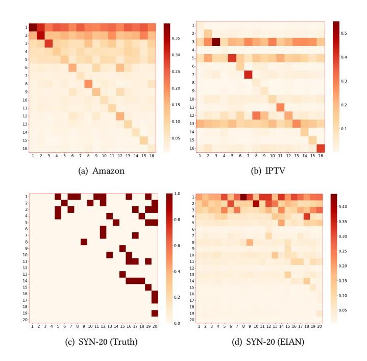
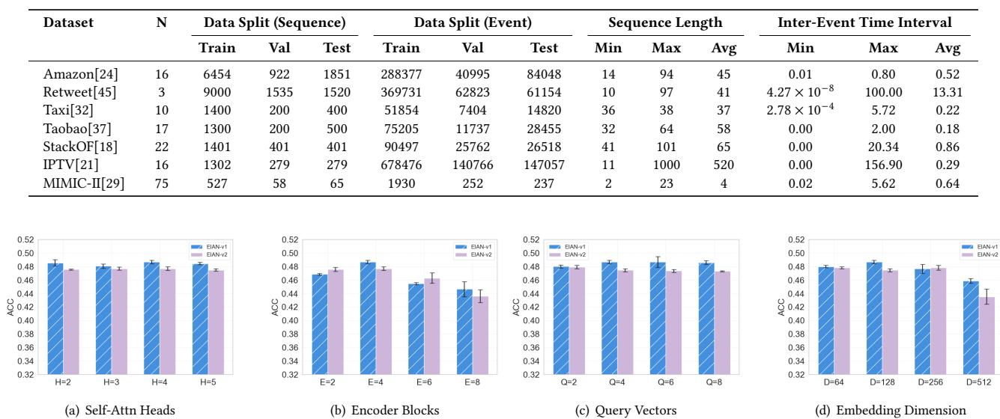
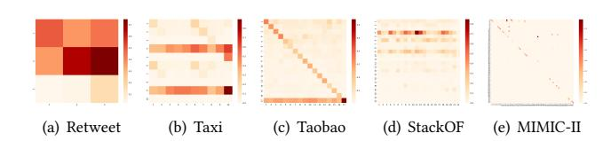
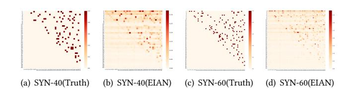

# EIAN: Explicit Interaction-aware Attention Network for Interpretable Event Modeling

| Jiping Zhang ∗                     |        |                                    |
|------------------------------------|--------|------------------------------------|
| Huazhong University of Science and |        |                                    |
| Wuhan, Hubei, China                |        |                                    |
| Hua                                | Zhu    | ∗                                  |
| Huazhong University                |        | of Science and                     |
| Wuhan,                             | Hubei, | China                              |
|                                    |        | Hong Huang †                       |
|                                    |        | Huazhong University of Science and |
|                                    |        | Wuhan, Hubei, China                |
| Yongkang Zhou                      |        |                                    |
| Huazhong University of Science and |        |                                    |
| Wuhan, Hubei, China                |        |                                    |
| Kehan                              | Yin    | ‡                                  |
| Huazhong University                |        | of Science and                     |
| Wuhan,                             | Hubei, | China                              |
|                                    |        | Bang Liu                           |
|                                    |        | University of Montreal             |
|                                    |        | Montreal, Quebec, Canada           |

# Abstract

Event sequences are integral to domains such as e-commerce, social networks, and healthcare. Traditional point process models, like Poisson and Hawkes processes, are foundational but limited by rigid parametric assumptions, constraining their flexibility in complex real-world scenarios. Neural point processes offer a more adaptable alternative, but typically perform implicit sequence modeling, which does not fully exploit critical event interaction patterns and limits transparency. To address these challenges, we introduce the Explicit Interaction-aware Attention Network (EIAN), a novel model that enhances event modeling by explicitly capturing both intra-type and cross-type event interactions. Specifically, EIAN employs two key components: an intra-type temporal encoder that preserves the unique temporal dynamics within each event type, and a cross-type interaction decoder that highlights interactions across event types. Furthermore, two temporal encoding mechanisms are integrated into the interaction decoder to handle irregular inter-event intervals in diverse temporal scenarios. Extensive experiments show that EIAN consistently outperforms existing models in predictive performance and provides deeper insights into event interaction patterns, advancing both flexibility and interpretability. Our code is available at https://github.com/CGCL-codes/EIAN.git.

# CCS Concepts

### • Information systems → Data stream mining.

ACM ISBN 979-8-4007-2307-0/2026/04 <https://doi.org/10.1145/3774904.3792194>

### Keywords

Event Modeling, Interpretability, Point Process

### ACM Reference Format:

Jiping Zhang, Hua Zhu, Hong Huang, Yongkang Zhou, Kehan Yin, and Bang Liu. 2026. EIAN: Explicit Interaction-aware Attention Network for Interpretable Event Modeling. In Proceedings of the ACM Web Conference 2026 (WWW '26), April 13–17, 2026, Dubai, United Arab Emirates. ACM, New York, NY, USA, [12](#page-11-0) pages.<https://doi.org/10.1145/3774904.3792194>

# 1 Introduction

Event sequence data are prevalent in various online applications, where understanding interactions among events is essential for accurate predictions and informed decision-making. For example, on e-commerce platforms like Amazon, interactions among customers, sellers, and products generate complex sequences that reflect user behavior and market trends [\[37\]](#page-8-0). In online social networks such as Twitter and StackOverflow, user activities—like comments, likes, and shares—form interconnected sequences that capture social influence and information diffusion [\[18,](#page-8-1) [43\]](#page-8-2). Similarly, in healthcare, the temporal patterns between symptoms, diagnoses, and treatments offer critical information on patient care and timely interventions [\[39\]](#page-8-3). Therefore, understanding these intricate interactions is crucial.

To model event sequences, temporal point processes provide a robust mathematical framework [\[28\]](#page-8-4). The Poisson process [\[26\]](#page-8-5) assumes that events occur independently at a constant rate, making it suitable for random and uncorrelated events, but limited in capturing dependencies between events. The Hawkes process [\[11\]](#page-8-6) extends this by incorporating self-exciting mechanisms, where an event can increase the likelihood of subsequent events. This approach has proven useful for applications such as modeling social network activity, financial markets, and aftershocks in seismic activity. Despite its advantages, the Hawkes process lacks flexibility, as it relies on predefined kernel functions and decay rates.

Recent advances in deep learning have led to neural point process models, providing a more flexible framework. These models commonly employ recurrent neural networks (RNNs) [\[7,](#page-8-7) [12\]](#page-8-8) or attention mechanisms [\[31\]](#page-8-9) to learn intricate event dependencies directly from data, eliminating the need for predefined functional forms. For example, [\[8\]](#page-8-10) and [\[22\]](#page-8-11) utilize continuous-time RNNs

∗Both authors contributed equally to this research.

†Hong Huang is the corresponding author.

Jiping Zhang, Hua Zhu, Hong Huang, Yongkang Zhou and Kehan Yin are affiliated with the National Engineering Research Center for Big Data Technology and System, Services Computing Technology and System Lab, Cluster and Grid Computing Lab, School of Computer Science and Technology, Huazhong University of Science and Technology.

[This work is licensed under a Creative Commons Attribution 4.0 International License.](https://creativecommons.org/licenses/by/4.0) WWW '26, Dubai, United Arab Emirates

© 2026 Copyright held by the owner/author(s).

to dynamically model the intensity function, adapting based on past events. Recent models incorporate self-attention mechanisms [\[38,](#page-8-12) [39,](#page-8-3) [46\]](#page-8-13), which enhance the ability to capture long-term dependencies across sequences, improving model performance in diverse event prediction tasks. In addition, some methods attempt to utilize neural differential equations (NDEs) for event modeling [\[6,](#page-8-14) [40\]](#page-8-15).

Although neural point processes have demonstrated impressive results in various real-world applications [\[36\]](#page-8-16), most still fall short in fully leveraging and explaining the underlying event interaction patterns. Unlike traditional point process models, such as the Hawkes process, which explicitly captures the influence of past events on future occurrences using triggering kernels and excitation matrices, current neural point processes generally employ an implicit sequence modeling. Specifically, these models often compress all historical event information into a hidden representation centered on the latest event, used to predict future events [\[22,](#page-8-11) [46\]](#page-8-13). This approach is largely inspired by sequence modeling techniques in natural language processing (NLP) [\[5,](#page-8-17) [31\]](#page-8-9), where future tokens are predicted based on the hidden representation of the latest token.

However, such a paradigm overlooks critical distinctions between event sequences and language sequences. In NLP, words within the same context are often semantically interconnected, whereas in event sequences, a future event might be influenced by only a few past events of certain types, with others being irrelevant [\[23,](#page-8-18) [41\]](#page-8-19). Consequently, this implicit approach may fail to accurately capture event dependencies, thus limiting the model's ability in event modeling. Additionally, the black-box neural networks are limited in interpretability, making it challenging to discern the underlying event interaction patterns. Therefore, while traditional Hawkes processes are widely-used to reveal event interactions and even infer causal relationships [\[27,](#page-8-20) [35\]](#page-8-21), neural point processes have seen limited application in such tasks due to the difficulties in extracting interpretable interaction insights from implicit models. Recent efforts, such as [\[23\]](#page-8-18), attempt explicit interaction modeling, though often at the expense of simplifying the attention mechanism.

To address the challenges, we proposes an Explicit Interactionaware Attention Network (EIAN), which simultaneously overcomes the flexibility issues of traditional point processes and interpretability issues of neural point processes. The first key innovation in EIAN is the intra-type temporal encoder, which captures the unique temporal dynamics of each event type independently. To achieve this, the encoder incorporates a type-independent self-attention module that uses a special intra-type mask, ensuring each event attends only to prior events of the same type as itself. This isolates intra-type temporal patterns, preserving type-specific dynamics and preventing cross-type information mixing for interpretability.

Complementing the encoder, the cross-type interaction decoder explicitly models interactions between different type events. In this module, type-wise query vectors are assigned to each event type, facilitating the instance-to-type cross-attention between these vectors and the outputs of the temporal encoder. This approach aggregates relevant historical information across event types, generating type-wise state representations at each timestamp and directly capturing the nuanced influence of past events on potential future events of each type, thereby enhancing interpretability.

Specially, to handle irregular inter-event time intervals in diverse temporal scenarios, we incorporate two temporal encoding

mechanisms into the cross-attention module. While the vanilla query vectors are suitable for most settings, it degrades in settings where the underlying event interactions are sensitive to the change of inter-event time intervals. Therefore, we further introduce the time-encoded queries with a rotary timestamp encoding, which explicitly encodes irregular inter-event time intervals, allowing a more flexible adaption to event timing dynamics. By enriching the model's temporal representations, this design ensures a more precise capture of the underlying event interactions.

Moreover, leveraging the explicit cross-type attention weights, EIAN can recover an interpretable type-to-type influence matrix from raw event sequences without any supervision. Extensive qualitative and quantitative analyses on both real-world and synthetic datasets demonstrate that the recovered interaction patterns align closely with ground-truth causal graphs, validating that EIAN's predictions are not only accurate but also explainable.

The main contributions of this study are listed as follows:

- We propose a novel model that explicitly captures event interactions, providing both enhanced flexibility and interpretability for understanding these interactions.
- We incorporate two temporal encoding mechanisms for the cross-type interaction decoder, enabling us to handle scenarios with diverse inter-event interval distributions.
- We conduct extensive experiments on seven real-world datasets, demonstrating the superior predictive performance of the proposed model.
- We evaluate the interpretability of our model through both qualitative and quantitative analyses, highlighting its capacity to reveal the underlying event interaction patterns.

# 2 Related Work

# 2.1 Statistical Temporal Point Processes

Point processes provide a powerful framework for capturing the occurrence and interaction patterns of asynchronous event sequences [\[28\]](#page-8-4). The Poisson process [\[26\]](#page-8-5), which assumes events occur independently at a constant rate, is suitable for scenarios involving random, uncorrelated events. However, it falls short in representing the dependencies that commonly exist between events in real-world settings, where an event's occurrence is often influenced by previous events. The Hawkes process [\[11\]](#page-8-6) addresses this limitation by introducing the concept of self-excitation, allowing an event to increase the likelihood of subsequent occurrences. Widely applied to systems such as social networks, financial markets, and earthquake aftershocks [\[25\]](#page-8-22), the Hawkes process effectively models self-excitatory behaviors. However, its flexibility is limited by the use of predefined kernel functions and constant decay rates, which impose strong parametric assumptions on the model. Other methods, e.g., the self-correcting process [\[14\]](#page-8-23), in contrast, focuses on inhibitory effects, where past events suppress future events.

# 2.2 Neural Temporal Point Processes

However, the simplified assumptions about statistical temporal point processes' complex dynamics come at the expense of practical utility. To overcome these constraints, neural point processes [\[36\]](#page-8-16), leveraging neural networks, have been proposed for greater

Table 1: EIAN's next-event prediction performance on 7 real-world datasets. For each dataset, the best and second-best results are highlighted in bold and underlined, respectively. Higher ACC and lower RMSE indicate better performance. The results reported are averaged over 5 independent runs with different initialization seeds.

| Dataset Metric |    |      | RMTPP |      |        |      | NHP |      |    |      |     |      |        |      | THP |      |    |      | Model AttNHP |      |    |      | NJDTPP |             | ITHP            |      |     |      |         |     |      |
|----------------|----|------|-------|------|--------|------|-----|------|----|------|-----|------|--------|------|-----|------|----|------|--------------|------|----|------|--------|-------------|-----------------|------|-----|------|---------|-----|------|
| Amazon ACC     | 0  | 2731 | ± 0   | 0177 | 0      | 2660 | 0   | 0024 | 0  | 3249 | ± 0 | 0082 | 0      | 3508 | ± 0 | 0021 | 0  | 2861 | ± 0          | 0408 | 0  | 3412 | ± 0    | 0010 0 3195 | ± 0 0009 0.4945 |      | ± 0 | 0017 | 0 4895  | ± 0 | 0037 |
| RMSE           | 0  | 6196 | ± 0   | 0002 | 0      | 6208 | ± 0 | 0001 | 0  | 6122 | ± 0 | 0003 | 0      | 6210 | ± 0 | 0000 | 1  | 7576 | ± 1          | 1978 | 0  | 3416 | ± 0    | 0004        | 0               | 2948 | ± 0 | 0084 | 0.2648  | ± 0 | 0099 |
| ACC Retweet    | 0  | 5462 | ± 0   | 0051 | 0      | 5952 | ± 0 | 0043 | 0  | 5553 | ± 0 | 0655 | 0      | 4917 | ± 0 | 0964 | 0  | 5877 | ± 0          | 0077 | 0  | 5596 | ± 0    | 0516 0 5697 | ± 0 0016 0.7699 |      | ± 0 | 0041 | 0 7422  | ± 0 | 0046 |
| RMSE           | 22 | 3126 | ± 0   | 0005 | 22     | 3002 | ± 0 | 0231 | 19 | 1291 | ± 7 | 1169 | 22     | 2340 | ± 0 | 1064 | 21 | 9880 | ± 0          | 1841 | 18 | 7906 | ± 3    | 0783        | 11              | 9549 | ± 0 | 1394 | 10.3416 | ± 0 | 3383 |
| Taxi ACC       | 0  | 9110 | ± 0   | 0004 | 0      | 9030 | ± 0 | 0003 | 0  | 8968 | ± 0 | 0056 | 0      | 9134 | ± 0 | 0010 | 0  | 8224 | ± 0          | 0659 | 0  | 9049 | ± 0    | 0003 0 8944 | ± 0 0010 0      | 9225 | ± 0 | 0022 | 0.9397  | ± 0 | 0012 |
| RMSE           | 0  | 3708 | ± 0   | 0000 | 0      | 3697 | ± 0 | 0016 | 0  | 3955 | ± 0 | 0532 | 0      | 3708 | ± 0 | 0000 | 0  | 3968 | ± 0          | 0229 | 0  | 2936 | ± 0    | 0007        | 0               | 2900 | ± 0 | 0039 | 0.2835  | ± 0 | 0077 |
| Taobao ACC     | 0  | 4357 | ± 0   | 0000 | 0.6023 |      | ± 0 | 0006 | 0  | 4530 | ± 0 | 0146 | 0      | 5907 | ± 0 | 0017 | 0  | 4543 | ± 0          | 0116 | 0  | 4570 | ± 0    | 0099 0 5105 | ± 0 0024 0      | 5519 | ± 0 | 0017 | 0 5975  | ± 0 | 0029 |
| RMSE           | 0  | 1337 | ± 0   | 0000 | 0      | 1337 | ± 0 | 0000 | 0  | 1359 | ± 0 | 0025 | 0.1336 |      | ± 0 | 0000 | 0  | 1386 | ± 0          | 0038 | 0  | 2400 | ± 0    | 1584        | 0               | 4599 | ± 0 | 1370 | 0 5139  | ± 0 | 0726 |
| StackOF ACC    | 0  | 4250 | ± 0   | 0000 | 0      | 4490 | ± 0 | 0010 | 0  | 3675 | ± 0 | 1534 | 0      | 4532 | ± 0 | 0009 | 0  | 3537 | ± 0          | 1233 | 0  | 4432 | ± 0    | 0008 0 4357 | ± 0 0002 0      | 4753 | ± 0 | 0011 | 0.4770  | ± 0 | 0015 |
| RMSE           | 1  | 3745 | ± 0   | 0000 | 1      | 3739 | ± 0 | 0001 | 2  | 0898 | ± 1 | 4551 | 1      | 3742 | ± 0 | 0002 | 1  | 3735 | ± 0          | 0014 | 1  | 0397 | ± 0    | 0021        | 0               | 9826 | ± 0 | 0154 | 0.9824  | ± 0 | 0211 |
| ACC IPTV       | 0  | 3704 | ± 0   | 2564 | 0.7314 |      | ± 0 | 0011 | 0  | 4017 | ± 0 | 0073 | 0      | 6971 | ± 0 | 0155 |    | OOM  |              |      | 0  | 4675 | ± 0    | 0924 0 5168 | ± 0 0005 0      | 5417 | ± 0 | 0048 | 0 7032  | ± 0 | 0016 |
| RMSE           | 2  | 4446 | ± 1   | 2778 | 1      | 8171 | ± 0 | 0000 | 2  | 0845 | ± 0 | 2323 | 1      | 8032 | ± 0 | 0181 |    | OOM  |              |      | 1  | 7855 | ± 0    | 0071        | 1               | 7478 | ± 0 | 0057 | 1.7446  | ± 0 | 0043 |
| MIMIC-II ACC   | 0  | 8023 | ± 0   | 0142 | 0      | 8244 | ± 0 | 0068 | 0  | 6357 | ± 0 | 1144 | 0      | 8372 | ± 0 | 0176 | 0  | 8151 | ± 0          | 0100 | 0  | 8217 | ± 0    | 0033 0 5628 | ± 0 0068 0.8605 |      | ± 0 | 0037 | 0 8581  | ± 0 | 0059 |
| RMSE           | 1  | 0043 | ± 0   | 0001 | 1      | 0044 | ± 0 | 0000 | 1  | 8085 | ± 1 | 5960 | 1      | 0040 | ± 0 | 0001 | 0  | 9979 | ± 0          | 0009 | 0  | 8587 | ± 0    | 0014        | 0.8217          |      | ± 0 | 0229 | 0 8330  | ± 0 | 0197 |

Table 2: Goodness-of-fit evaluation.

| Dataset  | THP     | EIAN-v1 | EIAN-v2 |
|----------|---------|---------|---------|
| Amazon   | -2.3118 | -1.1715 | -1.2387 |
| Retweet  | -4.1465 | -3.3831 | -3.4118 |
| Taxi     | -0.2452 | 0.3970  | 0.3878  |
| Taobao   | -0.5134 | -0.0824 | 0.0746  |
| StackOF  | -2.3319 | -2.2235 | -2.2486 |
| IPTV     | -0.3802 | -0.6728 | -0.3271 |
| MIMIC-II | -6.0089 | -4.1322 | -4.6834 |

# 5.2 Interpretability Analysis

This section evaluate the proposed model's interpretability of the underlying event interaction patterns from both qualitative and quantitative perspectives under the setting of Section [4.5.](#page-5-0) Although both EIAN-v1 and EIAN-v2 support this analysis, we consistently use EIAN-v2 to construct cross-attention maps in the following due to its explicit handling of temporal information.

5.2.1 Qualitative Analysis. Since the ground-truth event interaction patterns for real-world datasets are not available, we conduct a qualitative analysis. Figure [2](#page-6-2) provides the results on three datasets. The element at the ��-th row and �� ′ -th column represents the corresponding element in the normalized cross-attention map ��ˆ.

Amazon. Figure [2\(a\)](#page-6-3) highlights two key patterns. First, diagonal elements have high weights. Second, the first two rows also have relatively high weights. These two points reflect user behavior patterns well. The former indicates that users tend to review products of the same category, suggesting that once a user has reviewed a product of certain category, they are likely to review similar products in the future. The latter reveals that users who have reviewed products of other categories also tend to review products from the first and second categories. In fact, the two categories represent

Figure 2: Visualization of the normalized cross-attention maps.

"Clothing" and "Shoes", two most popular product categories in this dataset.

For another e-commerce dataset, Taobao, Figure [4\(c\)](#page-11-1) exhibits similar results, reflecting cross-platform similarities among users.

IPTV. Figure [2\(b\)](#page-6-4) shows that most diagonal elements have high weights, which means a user tends to watch TV programs of the same categories frequently. Most elements in rows {3,5,13} also

Table 3: Attention map v.s. True event interaction patterns.

| Dataset | TPR    | THP ↑ FPR | (self-attention) ↓ AUROC | ↑ TPR  | EIAN ↑ FPR | (explict-attention) ↓ AUROC ↑ |
|---------|--------|-----------|--------------------------|--------|------------|-------------------------------|
| SYN-20  | 0.9250 | 0.1889    | 0.9128                   | 0.9750 | 0.1639     | 0.9621                        |
| SYN-40  | 1.0000 | 0.2980    | 0.9506                   | 1.0000 | 0.2645     | 0.9771                        |
| SYN-60  | 0.9917 | 0.2503    | 0.9655                   | 0.9917 | 0.2227     | 0.9815                        |
| SYN-80  | 1.0000 | 0.2237    | 0.9732                   | 0.9938 | 0.2136     | 0.9794                        |
| SYN-100 | 0.9950 | 0.2410    | 0.9843                   | 0.9950 | 0.2247     | 0.9891                        |

exhibit high weights, where these rows denote "drama", "entertainment", and "others", respectively. This observation highlights similar preferences among most users, reflecting their shared interest in watching programs categorized as "drama" and "entertainment". In addition, we find some interesting details, such as: (1) programs of category-10 ("movie") have a significant positive impact on programs of category-3 ("drama"); (2) programs of categories 6 ("finance"), 8 ("laws"), and 9 ("military") all exhibit a notable influence on programs of category-12 ("news").

5.2.2 Quantitative Analysis. To conduct further quantitative analysis, we generate several synthetic datasets via the Hawkes process [\[3\]](#page-8-37). The generation process involved creating a random graph �� (each node represents an event type) with weighted edges to represent event interaction patterns among event types and using it as the excitation matrix for a Hawkes process to generate event sequences. Specially, we name the synthetic datasets based on the number of event types. For example, SYN-20 represents a dataset with 20 types of events. To evaluate the model interpretability, we compare the normalized cross-attention map ��ˆ with the ground-truth graph �� using TPR, FPR, and AUROC, which are standard metrics to measure graph similarities [\[9\]](#page-8-28). We compared the attention map of our proposed model with the attention map of THP, which employs a standard self-attention. As shown in Table [3,](#page-7-0) across all datasets with different number of event types (from 20 to 100), our model achieves high TPR and AUROC values with relatively low FPR values, suggesting its strong ability to explain the underlying event interaction patterns among event types. We present the ground-truth event interaction maps and cross-attention maps for SYN-20 in Figure [2\(](#page-6-2)c-d).

### 5.3 Intrinsic Evaluation

Cross-Attention Settings: In this section, we compare two versions of our model, which differ in the cross-attention module (Section [4.3\)](#page-3-1). As shown in Tables [1](#page-6-0) and [2,](#page-6-1) both versions perform competitively on most datasets, except Amazon and IPTV. EIAN-v1 outperforms on Amazon, whereas EIAN-v2 excels on IPTV. According to statistics (Appendix [B.1\)](#page-10-0), Amazon has the narrowest time interval range among these datasets, while IPTV has the widest. Typically, a narrow time interval range indicates less fluctuation in time intervals, making the dataset less sensitive to them, while a wider time interval range has the opposite effect. This suggests that EIAN-v1 suits scenarios less sensitive to time intervals, while EIAN-v2 is more effective for time-interval-sensitive scenarios.

Hyper-Parameter Analysis: Appendix [B.2](#page-10-1) studies the effect of hyper-parameter settings, including the number of self-attention

Table 4: Results of ablation study.

| Dataset  | EIAN-v2 ACC | w/o ↑ RMSE | enc EIAN-v2 ↓ ACC | w/o ↑ RMSE | lin ↓ ACC | EIAN-v2 ↑ RMSE ↓ |
|----------|-------------|------------|-------------------|------------|-----------|------------------|
| Amazon   | 0.3549      | 0.3309     | 0.4346            | 2.0995     | 0.4895    | 0.2648           |
| Retweet  | 0.5974      | 15.9322    | 0.6301            | 4.6749     | 0.7422    | 10.3416          |
| Taxi     | 0.9156      | 0.2835     | 0.9246            | 0.3677     | 0.9397    | 0.2835           |
| Taobao   | 0.5822      | 0.9433     | 0.5516            | 0.1348     | 0.5975    | 0.5139           |
| StackOF  | 0.4564      | 1.0216     | 0.4687            | 1.3555     | 0.4770    | 0.9824           |
| IPTV     | 0.6809      | 1.7814     | 0.6685            | 1.8137     | 0.7032    | 1.7446           |
| MIMIC-II | 0.8546      | 0.8926     | 0.8453            | 1.0438     | 0.8581    | 0.8330           |

heads for each temporal encoder block, the number of temporal encoder blocks, the number of query vectors for each event type, the dimension of the initial event embedding, and auxiliary loss weighting factors.

### 5.4 Ablation Studies

In this section, we conduct ablation studies on two modules of our framework and summarize the result in Table [4.](#page-7-1) Firstly, we derive a variant, EIAN-v2 w/o enc, by discarding the encoder and directly feeding the initial event embeddings (Section [4.2\)](#page-2-1) into the downstream layers. This consistently degrades performance on all datasets, corroborating the necessity of modeling intra-type temporal dynamics. Secondly, we substitute our linear-layer predictor with the intensity-function module adopted in EasyTPP [\[36\]](#page-8-16), yielding EIAN-v2 w/o lin. The resulting performance drop across most datasets is statistically significant. The deterioration can be attributed to the numerical integration and sampling steps inherent to intensity-based formulations, whose performance is bounded by sampling frequency and range. These ablations underscore the critical role of both the intra-type temporal encoder and the linear prediction heads in our design.

### 6 Conclusion

This paper addresses the challenge of modeling and interpreting the event interactions in event sequences, a critical task for understanding user behavior in online applications. We propose EIAN, an explicit interaction-aware attention network that enhances both flexibility and interpretability in event sequence modeling. By integrating an intra-type temporal encoder and a cross-type interaction decoder, EIAN effectively captures intra-type temporal dynamics and cross-type interactions. Besides, two temporal encoding mechanisms are integrated to improve the model to handle scenarios with diverse inter-event time interval distributions. Extensive experiments demonstrate that EIAN outperforms existing models, providing superior predictive performance and clearer insights into the underlying event interactions.

### 7 Acknowledge

This work was supported by the Major Program (JD) of Hubei Province (2023BAA024). The computation is completed in the HPC Platform of Huazhong University of Science and Technology.

- References [1] Massil Achab, Emmanuel Bacry, Stéphane Gaïffas, Iacopo Mastromatteo, and Jean-François Muzy. 2017. Uncovering Causality from Multivariate Hawkes Integrated Cumulants. In Proceedings of the ICML 2017. 1–10. [2] Arthur Asuncion, David Newman, et al. 2007. UCI machine learning repository. [3] Emmanuel Bacry, Martin Bompaire, Stéphane Gaïffas, and Soren Poulsen. 2018. Tick: a Python library for statistical learning, with a particular emphasis on time-dependent modelling. The Journal of Machine Learning Research 18, 214 (2018), 1–5. [4] Debarun Bhattacharjya, Dharmashankar Subramanian, and Tian Gao. 2018. Proximal graphical event models. In proceedings of the NeurIPS 2018. 8147–8156. [5] Tom Brown, Benjamin Mann, Nick Ryder, Melanie Subbiah, Jared D Kaplan, Prafulla Dhariwal, Arvind Neelakantan, Pranav Shyam, Girish Sastry, Amanda Askell, et al. 2020. Language models are few-shot learners. In proceedings of the NeurIPS 2020. 1877–1901. [6] Ricky TQ Chen, Brandon Amos, and Maximilian Nickel. 2021. Neural spatiotemporal point processes. In proceedings of the ICLR 2021. 1–19. [7] Kyunghyun Cho, Bart van Merriënboer, Dzmitry Bahdanau, and Yoshua Bengio. 2014. On the Properties of Neural Machine Translation: Encoder-decoder Approaches. In Proceedings of SSST-8. 103–111. [8] Nan Du, Hanjun Dai, Rakshit Trivedi, Utkarsh Upadhyay, Manuel Gomez-Rodriguez, and Le Song. 2016. Recurrent marked temporal point processes: Embedding event history to vector. In proceedings of the KDD 2016. 1555–1564. [9] Chang Gong, Chuzhe Zhang, Di Yao, Jingping Bi, Wenbin Li, and Yongjun Xu. 2024. Causal discovery from temporal data: An overview and new perspectives. Comput. Surveys 57, 4 (2024), 1–38. [10] Clive WJ Granger. 1969. Investigating causal relations by econometric models and cross-spectral methods. Econometrica: journal of the Econometric Society (1969), 424–438. [11] Alan G Hawkes. 1971. Spectra of some self-exciting and mutually exciting point processes. Biometrika 58, 1 (1971), 83–90. [12] S Hochreiter. 1997. Long Short-term Memory. Neural computation 9, 8 (1997), 1735–1780. [13] Matthew D Hoffman, David M Blei, Chong Wang, and John Paisley. 2013. Stochastic variational inference. Journal of Machine Learning Research 14 (2013), 1303–1347. [14] Valerie Isham and Mark Westcott. 1979. A self-correcting point process. Stochastic processes and their applications 8, 3 (1979), 335–347. [15] Eric Jang, Shixiang Gu, and Ben Poole. 2016. Categorical Reparameterization with Gumbel-Softmax. In proceedings of the ICLR 2016. 1–13. [16] Junteng Jia and Austin R Benson. 2019. Neural jump stochastic differential equations. Advances in Neural Information Processing Systems 32 (2019). [17] Solomon Kullback and Richard A Leibler. 1951. On information and sufficiency. The annals of mathematical statistics 22, 1 (1951), 79–86. [18] Jure Leskovec and Rok Sosič. 2016. Snap: A general-purpose network analysis and graph-mining library. ACM Transactions on Intelligent Systems and Technology 8, 1 (2016), 1–20. [19] Shuang Li, Shuai Xiao, Shixiang Zhu, Nan Du, Yao Xie, and Le Song. 2018. Learning temporal point processes via reinforcement learning. In proceedings of the NeurIPS 2018. 8428–8438. [20] Rafael Lima and Jaesik Choi. 2017. Make Hawkes Processes Explainable by Decomposing Self-Triggering Kernels. arXiv preprint arXiv:1703.09068 (2017). [21] Dixin Luo, Hongteng Xu, Yi Zhen, Xia Ning, Hongyuan Zha, Xiaokang Yang, and Wenjun Zhang. 2015. Multi-task multi-dimensional hawkes processes for modeling event sequences. In proceedings of the IJCAI 2015. 3685–3691. [22] Hongyuan Mei and Jason M Eisner. 2017. The neural hawkes process: A neurally self-modulating multivariate point process. In proceedings of the NeurIPS 2017. 6757–6767. [23] Zizhuo Meng, Ke Wan, Yadong Huang, Zhidong Li, Yang Wang, and Feng Zhou. 2024. Interpretable Transformer Hawkes Processes: Unveiling Complex Interactions in Social Networks. In proceedings of the KDD 2024. 2200–2211. [24] Jianmo Ni, Jiacheng Li, and Julian McAuley. 2019. Justifying recommendations using distantly-labeled reviews and fine-grained aspects. In proceedings of the EMNLP-IJCNLP 2019. 188–197. [25] Yosihiko Ogata. 1988. Statistical models for earthquake occurrences and residual analysis for point processes. Journal of the American Statistical association 83, 401 (1988), 9–27. [26] Conny Palm. 1943. Intensitatsschwankungen im fernsprechverker. Ericsson technics (1943). [27] Jie Qiao, Ruichu Cai, Siyu Wu, Yu Xiang, Keli Zhang, and Zhifeng Hao. 2023. Structural Hawkes processes for learning causal structure from discrete-time event sequences. In proceedings of the IJCAI 2023. 5702–5710. [28] Jakob Gulddahl Rasmussen. 2018. Lecture notes: Temporal point processes and the conditional intensity function. arXiv preprint arXiv:1806.00221 (2018). [30] Jianlin Su, Murtadha Ahmed, Yu Lu, Shengfeng Pan, Wen Bo, and Yunfeng Liu. 2024. Roformer: Enhanced transformer with rotary position embedding. Neurocomputing 568 (2024), 127063. [31] A Vaswani. 2017. Attention is all you need. In proceedings of the NeurIPS 2017. 6000–6010. [32] Chris Whong. 2014. FOILing NYC's taxi trip data. FOILing NYCs Taxi Trip Data. Np 18 (2014), 14. [33] Dongxia Wu, Tsuyoshi Idé, Georgios Kollias, Jiri Navratil, Aurelie Lozano, Naoki Abe, Yian Ma, and Rose Yu. 2024. Learning Granger Causality from Instance-wise Self-attentive Hawkes Processes. In proceedings of the International Conference on Artificial Intelligence and Statistics. 415–423. [34] Shuai Xiao, Junchi Yan, Mehrdad Farajtabar, Le Song, Xiaokang Yang, and Hongyuan Zha. 2019. Learning Time Series Associated Event Sequences With Recurrent Point Process Networks. IEEE Transactions on Neural Networks and Learning Systems 30, 10 (2019), 3124–3136. [35] Hongteng Xu, Mehrdad Farajtabar, and Hongyuan Zha. 2016. Learning granger causality for hawkes processes. In proceedings of the ICML 2016. 1717–1726. [36] Siqiao Xue, Xiaoming Shi, Zhixuan Chu, Yan Wang, Hongyan Hao, Fan Zhou, Caigao JIANG, Chen Pan, James Y Zhang, Qingsong Wen, et al. 2024. EasyTPP: Towards Open Benchmarking Temporal Point Processes. In proceedings of the ICLR 2024. 1–22. [37] Siqiao Xue, Xiaoming Shi, James Y Zhang, and Hongyuan Mei. 2022. HYPRO: a hybridly normalized probabilistic model for long-horizon prediction of event sequences. In proceedings of the NeurIPS 2022. 34641–34650. [38] Chenghao Yang, Hongyuan Mei, and Jason Eisner. 2022. Transformer embeddings of irregularly spaced events and their participants. In proceedings of the ICLR 2022. 1–22. [39] Qiang Zhang, Aldo Lipani, Omer Kirnap, and Emine Yilmaz. 2020. Self-attentive Hawkes process. In proceedings of the ICML 2020. 11183–11193. [40] Shuai Zhang, Chuan Zhou, Yang Aron Liu, Peng Zhang, Xixun Lin, and Zhi-Ming Ma. 2024. Neural Jump-Diffusion Temporal Point Processes. In proceedings of the ICML 2024. 60541–60557. [41] Wei Zhang, Thomas Panum, Somesh Jha, Prasad Chalasani, and David Page. 2020. Cause: Learning granger causality from event sequences using attribution methods. In proceedings of the ICML 2020. 11235–11245. [42] Yunhao Zhang and Junchi Yan. 2021. Neural Relation Inference for Multidimensional Temporal Point Processes via Message Passing Graph.. In proceedings of the IJCAI 2021. 3406–3412. [43] Qingyuan Zhao, Murat A Erdogdu, Hera Y He, Anand Rajaraman, and Jure Leskovec. 2015. Seismic: A self-exciting point process model for predicting tweet popularity. In proceedings of the KDD 2015. 1513–1522. [44] Ke Zhou, Hongyuan Zha, and Le Song. 2013. Learning social infectivity in sparse low-rank networks using multi-dimensional hawkes processes. In proceedings of the Artificial intelligence and statistics. 641–649. [45] Ke Zhou, Hongyuan Zha, and Le Song. 2013. Learning triggering kernels for multi-dimensional hawkes processes. In proceedings of the ICML 2013. 1301–1309. [46] Simiao Zuo, Haoming Jiang, Zichong Li, Tuo Zhao, and Hongyuan Zha. 2020. Transformer hawkes process. In proceedings of the ICML 2020. 11692–11702. Appendix A Recovering event interaction patterns A.1 Correlation Identification via Cross-Attention Map We construct a normalized cross-attention map to recover correlations between event types. Given an event sequence with �� events, we can define the normalized cross-attention map as follows: ��ˆ ��,��′ = Í��−1 ��=1 Í�� ��=1 I(���� = �� ′ )I(���� = ��)F (�� ′ , ��, ��,�� + 1) Í��−1 ��=1 I(���� = �� ′ )
  - (21) The denominator normalizes for varying event type frequencies. F (�� ′ , ��, ��,�� + 1) is a function that computes the contribution of a type-�� ′ event at ���� on a type-�� event at ����+1. For EIAN-v1 (vanilla query), we can formulate F (�� ′ , ��, ��,�� + 1) as follows:

[29] Mohammed Saeed, Christine Lieu, Greg Raber, and Roger G Mark. 2002. MIMIC II: a massive temporal ICU patient database to support research in intelligent patient monitoring. In proceedings of the Computers in cardiology. 641–644.

F (�� ′ , ��, ��,�� + 1) = �������� ( ®����, ��®��) Í�� ��=1 �������� ( ®����, ��®��) (22)

the prediction of the conditional intensity value for event type-�� (Eq[\(17\)](#page-5-1)). Furthermore, according to Definition I, we can deduce that event type-�� ′ is Granger non-causal for event type-�� if and only if P��,��′ = 0. Similarly, we can prove that event type-�� ′ is Granger causal for event type-�� if and only if P��,��′ = 1.

A.2.4 Post-Processing. After optimization, we threshold the learned probability graph P to obtain a binary adjacency matrix ��ˆ:

��ˆ ′ ,�� = I(P�� ′ ,�� &gt; ��) (31)

where �� is a hyper-parameter controlling the pruning process. Edges with probability P�� ′ ,�� ≤ �� are removed.

# B Additional Experiments: Event Modeling

# B.1 Dataset Statistics

Table [5](#page-11-2) summarizes statistics of the 7 real-world datasets.

# B.2 Hyper-parameter Analysis

Figure [3](#page-11-3) shows the effect of key hyper-parameters: number of attention heads per encoder block (��), number of encoder blocks (��), number of query vectors per type (��), and embedding dimension (��).

For ��, EIAN-v1 peaks at �� = 4. EIAN-v2 is stable for �� ≤ 4, but drops slightly at �� = 5. Regarding parameter ��, both versions peaks at �� = 4, with lower performance at �� = 2 (underfitting) and �� &gt; 4 (overfitting). For ��, EIAN-v1 stabilizes with increasing ��, while EIAN-v2 peaks at �� = 2. As for ��, EIAN-v1 performs best at �� = 128. EIAN-v2 maintains stable for �� ≤ 256, but degrades at �� = 512.

Table [7](#page-11-4) analyzes auxiliary loss weights: with ��1 = 1, we gridsearch ��2 and ��3 ∈ {0.5, 1, 2}. The ACC/RMSE trade-off confirms the benefit of multi-task learning, where different objectives (type, time, intensity) are balanced for robust performance.

# B.3 Implementation Details

Experiments ran on NVIDIA Tesla V100 GPUs (32 GB) with Ubuntu 18.04 and CUDA 11.8. The parameter settings of EIAN for each real-world dataset are provided in the ".yaml" files located in the "./model/configs" directory of the code repository.

# B.4 Cross-attention Maps

Figure [4](#page-11-5) shows normalized cross-attention maps for real-world datasets. Element at (i,j) represents the average influence weight from event type-�� to event type-��. Beyond Amazon, Taobao, and IPTV datasets analyzed in Section [5.2.1,](#page-6-5) we also observe some interesting phenomena on Retweet, Taxi, and MIMIC-II:

Retweet. In Figure [4\(a\),](#page-11-6) row weights (2nd > 3rd > 1st) indicate middle users are most influenced by others' retweets, large users least. Column weights (1st lower, 3rd higher) show small users have minimal influence, while large users have the most, consistent with follower-count dynamics.

Taxi. In Figure [4\(b\),](#page-11-7) rows {4,9} ("drop-off" and "pickup" in Manhattan) show high weights. Given Manhattan's high activity share (>42% drop-off, 44% pickup [\[23\]](#page-8-18)), events in other boroughs often lead to subsequent Manhattan events.

StackOF. In Figure [4\(d\),](#page-11-8) weights are mostly low. High weights in rows {4,6,9} (badges: "Popular Question", "Nice Answer", "Notable Question") suggest badge recipients are more likely to earn these specific badges later, aligning with the platform's incentive design.

MIMIC-II. In Figure [4\(e\),](#page-11-9) The map is notably sparser compared to the results on other datasets, indicating limited inter-type influence. This likely stems from the dataset's characteristics (Table [5\)](#page-11-2): most event types, but few short sequences, capturing only sparse interaction patterns.

Figure [2\(c\),](#page-6-6) [2\(d\)](#page-6-7) and [5](#page-11-10) show ground-truth and learned maps for three synthetic datasets. The close alignment demonstrates EIAN's capacity to recover true interaction patterns.

### B.5 Results on time-interval-sensitive datasets

We test on five synthetic Hawkes process datasets (20-100 event types), where influence decays exponentially with time, making them interval-sensitive. Table [8](#page-11-11) shows EIAN-v2 (with rotary encoding) outperforms EIAN-v1 in ACC across all settings, confirming its effectiveness for interval-sensitive scenarios.

### C Additional Experiments: Causal Discovery for Event Sequences

# C.1 Baseline Models

For the causal discovery task, we compare the proposed model (Appendix [A.2\)](#page-9-0) with seven baselines: HExp [\[11\]](#page-8-6), ADM4 [\[44\]](#page-8-42), NPHC [\[1\]](#page-8-43), RPPN [\[34\]](#page-8-44), CAUSE [\[41\]](#page-8-19), SHP [\[27\]](#page-8-20) and ISAHP [\[33\]](#page-8-45).

# C.2 Dataset Statistics

We use two benchmark datasets: Diabetes [\[2\]](#page-8-46) (real-world, daily events of 70 patients) and PGEM [\[4\]](#page-8-25) (synthetic, generated via Proximal Graphical Event Model).

# C.3 Results for Causal Discovery

We use five metrics: True Positive Rate (TPR), False Positive Rate (FPR), F1 score (F1), Area Under the Receiver Operating Characteristic Curve (AUROC), and Kendall's ��. Results in Table [6](#page-11-12) show: Diabetes: Both EIAN versions significantly outperform baselines, showing high TPR and low FPR. PGEM: ADM4 has best F1, but EIAN-v2 achieves highest AUROC and Kendall's ��, indicating strong ranking reliability. Overall, EIAN proves to be a reliable and generalizable solution for causal discovery.

# C.4 Limitation and Future Work

EIAN enhances predictive performance and interpretability. Limitations and future directions include:

Global vs. Local Causal Graphs: For causal discovery, we assumed a shared global graph due to dataset constraints, yielding a coarsegrained view. Learning sequence-specific causal graphs could offer finer-grained insights.

Application to Recommendation: Event sequence modeling methods could be adapted for recommendation tasks in the future.

Table 5: Statistics of the real-world datasets.

| Dataset  |      | N  | Data Train | Split Val | (Sequence) Test | Train  | Data Split Val | (Event) Test | Min | Sequence Max | Length Avg | Inter-Event Min | Time Max | Interval Avg |
|----------|------|----|------------|-----------|-----------------|--------|----------------|--------------|-----|--------------|------------|-----------------|----------|--------------|
| Amazon   | [24] | 16 | 6454       | 922       | 1851            | 288377 | 40995          | 84048        | 14  | 94           | 45         | 0.01            | 0.80     | 0.52         |
| Retweet  | [45] | 3  | 9000       | 1535      | 1520            | 369731 | 62823          | 61154        | 10  | 97           | 41         | 4 27 × 10 − 8   | 100.00   | 13.31        |
| Taxi     | [32] | 10 | 1400       | 200       | 400             | 51854  | 7404           | 14820        | 36  | 38           | 37         | 2 78 × 10 − 4   | 5.72     | 0.22         |
| Taobao   | [37] | 17 | 1300       | 200       | 500             | 75205  | 11737          | 28455        | 32  | 64           | 58         | 0.00            | 2.00     | 0.18         |
| StackOF  | [18] | 22 | 1401       | 401       | 401             | 90497  | 25762          | 26518        | 41  | 101          | 65         | 0.00            | 20.34    | 0.86         |
| IPTV     | [21] | 16 | 1302       | 279       | 279             | 678476 | 140766         | 147057       | 11  | 1000         | 520        | 0.00            | 156.90   | 0.29         |
| MIMIC-II | [29] | 75 | 527        | 58        | 65              | 1930   | 252            | 237          | 2   | 23           | 4          | 0.02            | 5.62     | 0.64         |

Figure 3: Hyper-parameter analysis on the StackOF dataset.

Table 6: Performance comparison about Causal Discovery on the Diabetes and PGEM datasets.

| Model   | TPR ↑  | FPR ↓  | F1 ↑   | Diabetes AUROC ↑ | Kendall’s �� | ↑ TPR ↑ | FPR ↓  | F1 ↑   | PGEM AUROC ↑ | Kendall’s �� ↑ |
|---------|--------|--------|--------|------------------|--------------|---------|--------|--------|--------------|----------------|
| HExp    | 0.3636 | 0.1772 | 0.1860 | 0.6007           | 0.0711       | 1.0000  | 0.3085 | 0.2927 | 0.9557       | 0.3079         |
| ADM4    | 0.1818 | 0.1772 | 0.0976 | 0.5567           | 0.0451       | 1.0000  | 0.0319 | 0.8000 | 0.9787       | 0.3255         |
| NPHC    | N/A    | N/A    | N/A    | N/A              | N/A          | 0.5000  | 0.4043 | 0.1277 | 0.5053       | 0.0036         |
| RPPN    | 0.6364 | 0.5127 | 0.1414 | 0.4856           | -0.0101      | 0.8333  | 0.7128 | 0.1282 | 0.8298       | 0.2226         |
| CAUSE   | 0.4545 | 0.2595 | 0.1754 | 0.6720           | 0.1204       | 1.0000  | 0.7234 | 0.1500 | 0.9255       | 0.2873         |
| SHP     | 0.2727 | 0.1582 | 0.1538 | 0.5506           | 0.0641       | 0.8333  | 0.3723 | 0.2173 | 0.8182       | 0.2680         |
| ISAHP   | 0.7273 | 0.5886 | 0.1429 | 0.5693           | 0.0698       | 1.0000  | 0.2979 | 0.3000 | 0.9362       | 0.2945         |
| EIAN-v1 | 0.7273 | 0.1456 | 0.3810 | 0.8291           | 0.2309       | 1.0000  | 0.0851 | 0.6000 | 0.9929       | 0.3343         |
| EIAN-v2 | 0.7273 | 0.1329 | 0.4000 | 0.8446           | 0.2418       | 1.0000  | 0.0426 | 0.7500 | 1.0000       | 0.3391         |

Figure 4: Visualization of the normalized cross-attention maps on four representative real-world datasets.

Table 7: Loss factors analysis on Amazon dataset(ACC/RMSE)

Figure 5: Visualization of the normalized cross-attention maps on two representative synthetic datasets.

Table 8: Performance comparison of two temporal encoding mechanisms on five synthetic datasets.

| #Types  | 20     | 40     | 60     | 80     | 100    |
|---------|--------|--------|--------|--------|--------|
| EIAN-v1 | 0.3617 | 0.2559 | 0.2625 | 0.2540 | 0.1903 |
| EIAN-v2 | 0.4688 | 0.4013 | 0.4202 | 0.4327 | 0.3688 |