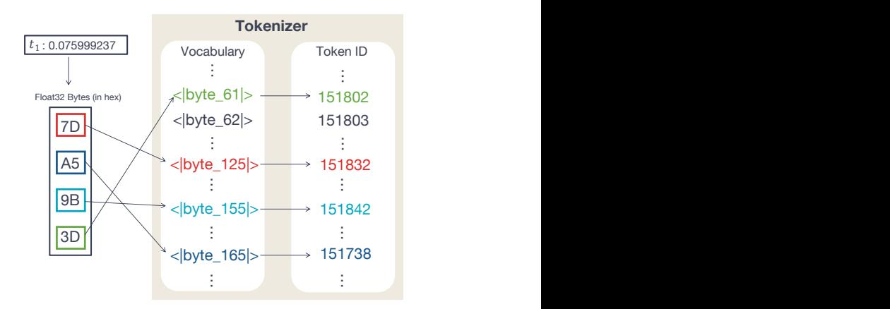
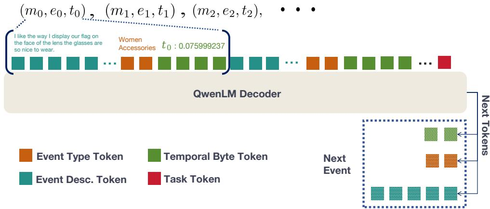
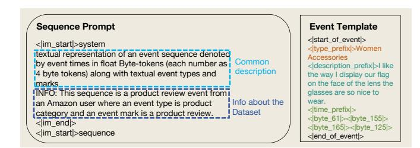
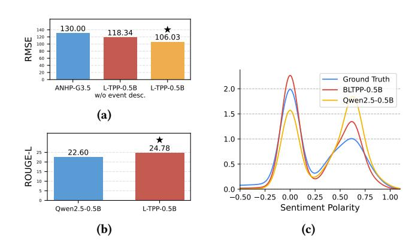
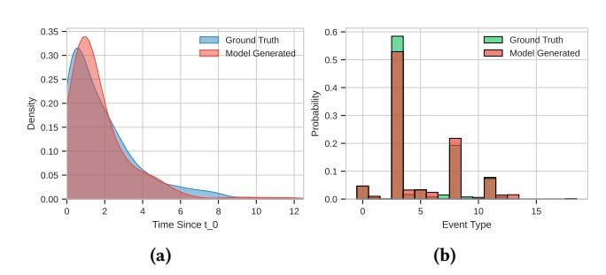

# Byte-token Enhanced Language Models for Temporal Point Processes Analysis

Quyu Kong kongquyu@gmail.com Independent Researcher Hangzhou, China

Yixuan Zhang zh1xuan@hotmail.com Southeast University Nanjing, China

Yang Liu lyng\_95@zju.edu.cn Independent Researcher Hangzhou, China

Panrong Tong tongpanrong@hotmail.com Independent Researcher Hangzhou, China

Enqi Liu leq627@126.com Independent Researcher Hangzhou, China

Feng Zhou∗ feng.zhou@ruc.edu.cn Center for Applied Statistics and School of Statistics, Renmin University of China Beijing, China

### Abstract

Temporal Point Processes (TPPs) have been widely used for modeling event sequences on the Web, such as user reviews, social media posts, and online transactions. However, traditional TPP models often struggle to effectively incorporate the rich textual descriptions that accompany these events, while Large Language Models (LLMs), despite their remarkable text processing capabilities, lack mechanisms for handling the temporal dynamics inherent in Web-based event sequences. To bridge this gap, we introduce Language-TPP, a unified framework that seamlessly integrates TPPs with LLMs for enhanced Web event sequence modeling. Our key innovation is a novel temporal encoding mechanism that converts continuous time intervals into specialized byte-tokens, enabling direct integration with standard language model architectures for TPP modeling without requiring TPP-specific modifications. This approach allows Language-TPP to achieve state-of-the-art performance across multiple TPP benchmarks, including event time prediction and type prediction, on real-world Web datasets spanning e-commerce reviews, social media and online Q&A platforms. More importantly, we demonstrate that our unified framework unlocks new capabilities for TPP research: incorporating temporal information improves the quality of generated event descriptions, as evidenced by enhanced ROUGE-L scores, and better aligned sentiment distributions. Through comprehensive experiments, including qualitative analysis of learned distributions and scalability evaluations on long sequences, we show that Language-TPP effectively captures both temporal dynamics and textual patterns in Web user behavior, with important implications for content generation, user behavior understanding, and Web platform applications. Code is available at [https://github.com/qykong/Language-TPP.](https://github.com/qykong/Language-TPP)

[This work is licensed under a Creative Commons Attribution 4.0 International License.](https://creativecommons.org/licenses/by/4.0) WWW '26, Dubai, United Arab Emirates © 2026 Copyright held by the owner/author(s). ACM ISBN 979-8-4007-2307-0/2026/04 <https://doi.org/10.1145/3774904.3792197>

# CCS Concepts

• Computing methodologies → Natural language processing; Temporal reasoning; • Theory of computation → Social networks.

# Keywords

Temporal Point Processes, Large Language Models, Event Sequence Modeling, Web User Behavior, Text Generation

### ACM Reference Format:

Quyu Kong, Yixuan Zhang, Yang Liu, Panrong Tong, Enqi Liu, and Feng Zhou. 2026. Byte-token Enhanced Language Models for Temporal Point Processes Analysis. In Proceedings of the ACM Web Conference 2026 (WWW '26), April 13–17, 2026, Dubai, United Arab Emirates. ACM, New York, NY, USA, [11](#page-10-0) pages.<https://doi.org/10.1145/3774904.3792197>

### 1 Introduction

Temporal Point Processes (TPPs) provide a statistical framework for modeling sequences of events occurring in continuous time on the Web. Traditional TPP models have been proven effective in capturing temporal dynamics and event types across diverse Web applications, including social media information diffusion [\[9,](#page-8-0) [27\]](#page-8-1), online user behavior modeling [\[15\]](#page-8-2), and e-commerce platforms [\[44\]](#page-8-3). However, these models have primarily focused on temporal and categorical aspects while the rich multi-modal information inherent in real-world online events has been under-explored.

Many Web events are accompanied by textual information that provides essential context beyond timestamps and event types. For example, product reviews on e-commerce platforms like Amazon [\[29\]](#page-8-4) contain detailed user opinions, posts on social media platforms like Twitter include rich textual content [\[16\]](#page-8-5), and questions on community Q&A sites like Stack Overflow provide technical descriptions. The ability to model and, more importantly, generate such multi-modal event descriptions represents a significant opportunity for understanding Web user behavior and improving Web content generation—aspects that have been under-explored in previous TPP research.

Meanwhile, Large Language Models (LLMs) have achieved success in understanding and generating textual modality across numerous domains [\[13,](#page-8-6) [23,](#page-8-7) [42\]](#page-8-8). This advancement allows to develop a unified framework between TPPs and LLMs that jointly models

∗Corresponding author.

both temporal dynamics and textual information in event sequences. In this work, we aim to address the following two open questions.

While prior works have successfully incorporated self-attention mechanism into TPP models following modern LLM practices [\[25,](#page-8-9) [50,](#page-9-0) [53\]](#page-9-1), they rely on TPP-specific encoding strategies, including temporal positional encoding for event times and randomly initialized embeddings for event types. This raises the first question: how can we coherently integrate standard LLM architectures with TPPs? We address this by modeling event types and descriptions as textual information and introducing a novel temporal encoding approach using specialized byte-tokens for event time intervals as shown in Fig. [1.](#page-1-0) By converting continuous time intervals to discrete byte-tokens, we can utilize a text template to combine all event information for prompting the LLM. We adapt Qwen2.5 [\[48\]](#page-9-2), a widely used open-source LLM, for this framework. This approach enables straightforward encoding and decoding of event times, types, and descriptions through a language tokenizer.

Recent work, LAMP [\[34\]](#page-8-10), has demonstrated performance improvements through LLM-based event information reasoning, highlighting the value of textual description information. More recently, TPP-LLM [\[22\]](#page-8-11) has shown that integrating LLMs with TPPs can improve prediction accuracy by leveraging textual event descriptions. This leads to the second question: what are the benefits of unifying temporal and textual modalities in a unified framework? We investigate this through two categories of tasks: conventional TPP tasks and LLM-oriented tasks, specifically event description generation. For TPP tasks — including next event time prediction and type prediction — we demonstrate state-of-the-art performance through extensive experiments on real-world datasets, comparing against strong baseline models. Notably, on a dataset containing textual event description, our unified framework outperforms LAMP. Furthermore, we find that augmenting temporal information improves event description generation compared to a fine-tuned LLM without temporal information, indicating the benefits of incorporating temporal dynamics into LLMs.

In summary, our key contributions are as follows:

(1) We introduce a multi-modal framework, Language-TPP, that unifies TPPs and LLMs, enabling downstream tasks including event time prediction, type prediction and description generation.

(2) We propose a novel temporal encoding approach using specialized byte-tokens for event time, providing seamless integration with LLM tokenizers.

(3) Through extensive experiments on real-world Web datasets (including AmazonReview, Twitter, StackOverflow, and Taobao), we demonstrate state-of-the-art performance across multiple tasks, with particular emphasis on event description generation—enabling better understanding of Web content and user interactions, a previously unexplored aspect in TPP research.

### 2 Related Work

Deep TPPs. Recent advances in TPP modeling have mainly been driven by deep learning-based methods [\[2,](#page-8-12) [8,](#page-8-13) [15,](#page-8-2) [24,](#page-8-14) [25,](#page-8-9) [28,](#page-8-15) [33\]](#page-8-16). Deep learning-based TPP models have seen significant evolution since [\[8\]](#page-8-13), which first introduced recurrent neural networks (RNNs) for TPP modeling. Early approaches primarily relied on such recurrent architectures, with notable improvements including long

Figure 1: Temporal tokenization procedure in Language-TPP. The diagram illustrates how event times are converted into temporal byte tokens for processing by the model.

short-term memory (LSTM) based models [\[24\]](#page-8-14) and dual-LSTM frameworks [\[41\]](#page-8-17). Since the rising popularity of the Transformer architectures [\[38\]](#page-8-18), attention-based TPPs [\[50,](#page-9-0) [53\]](#page-9-1) were introduced, resulting in better modeling of long-range dependencies. Subsequent improvements include non-linear attention score [\[52\]](#page-9-3), sparse attention mechanism [\[18\]](#page-8-19), and enhanced interpretability through alignment with statistical nonlinear Hawkes processes [\[26\]](#page-8-20).

LLM-augmented TPPs. The integration of LLMs with TPPs represents an emerging frontier in TPP domain. While this direction is still in its early stages, several works demonstrated promising results. Xue et al. [\[46\]](#page-8-21) introduced PromptTPP, which leverages continual learning principles to enable TPPs to efficiently adapt to streaming event sequences. The fusion of LLMs with TPPs was further advanced by Shi et al. [\[34\]](#page-8-10), which developed a framework that harnesses LLMs' abductive reasoning capabilities to enhance future event prediction. Concurrent to our work, Liu and Quan [\[22\]](#page-8-11) also explored combining LLMs with TPPs through incorporating textual event description and temporal information into pre-trained LLMs. While we share similar high-level goals, our work differentiates itself through a novel temporal encoding strategy using specialized byte-tokens and extends the capability of TPP models to textual event description generation, a previously unexplored direction in TPPs literature.

### 3 Preliminaries

This section introduces key concepts and background knowledge for the proposed model, including LLMs and TPPs.

# 3.1 Autoregressive Language Model

State-of-the-art LLMs, such as GPT-4 [\[1\]](#page-8-22), Qwen2.5 [\[48\]](#page-9-2) and Gemini 1.5 [\[36\]](#page-8-23), are built on causal Transformer architectures that process and generate content as discrete tokens. While these models are designed to process textual data via tokenization, handling continuous multi-modal inputs [\[10,](#page-8-24) [11,](#page-8-25) [49\]](#page-9-4), e.g., images, audio, video, presents unique challenges. To address this, modern architectures typically employ specialized encoders that discretize continuous

Table 1: Dataset statistics. Train/Dev/Test shows the number of sequences in each split, �� is the number of event types, �������� represents the average sequence length.

TPP datasets. We also examine the impact of different model components and training protocol through an ablation study.

### 5.1 Baselines

We employ several previous works as baselines for comparison.

- Neural Hawkes Process (NHP)[\[24\]](#page-8-14): NHP employs a continuoustime LSTM to encode the temporal and type information of historical events. The resulting history embedding is used to model the conditional intensity function. This model cannot handle or generate event descriptions.
- Self-Attentive Hawkes Process (SAHP) [\[50\]](#page-9-0), Transformer Hawkes Process (THP) and Attentive Neural Hawkes Process (AttNHP) [\[53\]](#page-9-1): SAHP, THP and AttNHP all encode historical events through self-attention mechanism, and uses the history embedding to model the conditional intensity function. They cannot handle or generate event descriptions.
- Intensity-free TPP (IFTPP) [\[33\]](#page-8-16): IFTPP directly modeling the conditional distribution of inter-event intervals similar to our work. This model cannot handle event descriptions or generate event descriptions.
- TPP-LLM (TinyLlama-1.1B) [\[22\]](#page-8-11): TPP-LLM integrates LLMs with TPPs by directly utilizing textual event type descriptions and incorporating temporal embeddings with parameter-efficient fine-tuning. While it can process textual descriptions for prediction tasks, it cannot generate future event descriptions.
- GPT-3.5-turbo enhanced Attentive Neural Hawkes Process (ANHP-G3.5) [\[34\]](#page-8-10): the best performing baseline in their proposed LAMP, a method that leverages pre-trained LLMs for abductive reasoning to improve event prediction. This model can handle historical event descriptions but cannot generate future event descriptions.
- Qwen2.5-0.5B [\[47\]](#page-8-32): As far as we know, no existing TPPs baseline can generate future event descriptions. To evaluate the quality of event description generation, we compare our method with the vanilla language model Qwen2.5-0.5B, fine-tuned on the same dataset without temporal information.

### 5.2 Datasets

We use five real-world datasets to evaluate the performance of our method and the baselines.

- Retweet [\[51\]](#page-9-6): A dataset of time-stamped user retweet event sequences. Events are categorized into three types based on user

follower counts: small (&lt; 120 followers), medium (120 − 1363 followers), and large (&gt; 1363 followers).

- Stackoverflow [\[14\]](#page-8-36): Two years of user award records from Stackoverflow, where each sequence represents events of granting badges to a user. There are in total 22 different badges.
- Taobao [\[45\]](#page-8-37): Time-stamped user click behaviors on Taobao ecommerce platform, collected over a nine-day period. Events represent item clicks, with types corresponding to item categories.
- Taxi [\[40\]](#page-8-38): Time-stamped taxi pick-up and drop-off events across the five boroughs of New York City. Each combination (borough, pick-up or drop-off) defines an event type, resulting in 10 distinct event types.
- Amazon Review [\[29\]](#page-8-4): A dataset of product reviews from Amazon, containing sequences from the 2,500 most active users. Events represent product reviews, with types corresponding to product categories. The 23 most frequent categories were preserved as distinct types, with remaining categories merged into one. Each event includes a text description containing the review.

We note that among the five datasets, the first four are traditional TPP datasets that include only event times and types, while Amazon Review is the only dataset containing textual event descriptions. Therefore, we use this dataset for event description evaluations. The splitting and statistics of all datasets are provided in Table [1.](#page-4-0)

### 5.3 Metrics

We employ the following metrics across different TPP tasks:

- For event time prediction, we use root-mean squared error (RMSE) to measure the temporal prediction accuracy, i.e., √︃Í�� ��=1 (���� − ��ˆ��) 2/��, ��ˆ�� is the predicted time interval.
- For event type prediction, we report the prediction accuracy (ACC), i.e., Í�� ��=1 1����=��ˆ�� /��, where ��ˆ�� is the predicted event type.
- We evaluate the quality of generated event descriptions as a standard NLP task, employing ROUGE-L scores [\[19\]](#page-8-39). These scores assess the overlap between model-generated and groundtruth text based on ��-grams, providing a comprehensive measure of both precision and recall.
- We analyze the sentiment of generated descriptions using VADER scores [\[12\]](#page-8-40), which provide compound polarity scores ranging from −1 (most negative) to +1 (most positive) in sentiment.

# 5.4 Experimental Setup

Our proposed model is built on top of Qwen2.5-0.5B [\[48\]](#page-9-2). We utilize the base model variant rather than its instruction-tuned version, as our implementation employs a different prompting template from the standard chat template. We use a single NVIDIA A40 for model training and experiments. At each stage, we train the model for 5 epochs with learning rate 1�� −4 and select checkpoints achieving best validation losses. Details about hyperparameters used in training can be found in Section [C.](#page-9-7) We sample 50k promptresponse pairs for next-event fine-tuning (stage 2). The baseline models are implemented using the open source frameworks, including EasyTPP [\[44\]](#page-8-3) and LAMP [\[34\]](#page-8-10) with default configurations. We reuse partial experimental results from [\[34,](#page-8-10) [44\]](#page-8-3).

Table 2: Prediction performance comparison on real-world datasets for event times and types. Results reported in terms of RMSE and ACC with standard deviations. Best results are in bold.

| Dataset       |       | NHP      |       | SAHP     |       | RMSE THP (↓) | / ACC | (↑) IFTPP   |       |       | AttNHP      |       |       | TPP-LLM |       |         |
|---------------|-------|----------|-------|----------|-------|--------------|-------|-------------|-------|-------|-------------|-------|-------|---------|-------|---------|
| Retweet       | 21.8  | / 54.0   | 21.7  | / 54.0   | 25.3  | / 58.5       | 22.2  | /           | 60.3  | 22.2  | /           | 59.9  | 21.3  | / 54.1  | 18.1  | / 59.7  |
|               | 0.184 | / 0.002  | 0.301 | / 0.002  | 0.188 | / 0.003      |       | 0.180/0.003 |       | 0.204 | /           | 0.003 | 0.002 | / 0.002 | 0.002 | / 0.001 |
| StackOverflow | 1.37  | / 45.0   | 1.38  | / 43.9   | 1.37  | / 45.0       | 1.37  | /           | 44.9  | 1.37  | /           | 44.8  | 1.17  | / 41.9  | 1.12  | / 45.5  |
|               | 0.011 | / 0.006  | 0.013 | / 0.005  | 0.021 | / 0.006      | 0.010 | /           | 0.005 |       | 0.019/0.003 |       | 0.002 | / 0.000 | 0.001 | / 0.002 |
| Taobao        | 0.55  | / 57.0   | 0.53  | / 50.3   | 0.34  | / 57.9       | 0.53  | /           | 56.6  | 0.30  | /           | 46.3  | 0.32  | / 43.57 | 0.21  | / 59.7  |
|               | 0.005 | / 0.006  | 0.004 | / 0.002  | 0.003 | / 0.004      | 0.005 | /           | 0.004 |       | 0.005/0.001 |       | 0.001 | / 0.002 | 0.002 | / 0.002 |
| Taxi          | 0.37  | / 91.5   | 0.37  | / 90.3   | 0.37  | / 91.3       | 0.38  | /           | 91.4  | 0.37  | /           | 91.3  | 0.43  | / 91.2  | 0.32  | / 90.5  |
|               | 0.003 | / 0.0003 | 0.003 | / 0.0005 | 0.003 | / 0.0008     | 0.003 | /           | 0.006 |       | 0.003/0.000 |       | 0.001 | / 0.000 | 0.002 | / 0.000 |

Figure 4: Results on Amazon Review dataset: (a) The RMSE(↓) on event time prediction; (b) the ROUGE-L(↑) score on textual event description generation; (c) comparison of sentiment polarity distribution of generated event descriptions.

# 5.5 Results and Analysis

Performance on type-marked TPP: In this experiment, we study the conventional TPP tasks on type-marked TPPs in terms of event time prediction and type prediction. Table [2](#page-5-0) presents the results for event prediction tasks, including time and type predictions. Language-TPP-0.5B demonstrates superior or competitive performance on both RMSE and ACC metrics, with notably low standard deviations across all datasets.

For event time prediction, Language-TPP-0.5B shows substantial improvements on RMSE across most datasets. On Retweet, Language-TPP-0.5B achieves 18.1, significantly outperforming all baselines including the recent TPP-LLM (21.3) and AttNHP (22.2), as well as traditional methods (ranging from 21.7 to 25.3). Similar improvements are observed on Stackoverflow (1.12 versus 1.17–1.38) and Taobao (0.21 versus 0.30–0.55), where Language-TPP-0.5B substantially outperforms both the LLM-based baseline TPP-LLM and attention-based methods. On Taxi, Language-TPP-0.5B achieves the best RMSE of 0.32, outperforming TPP-LLM (0.43) and matching or exceeding traditional TPP methods. For event type prediction, Language-TPP-0.5B achieves the highest ACC on Stackoverflow (45.5%) and Taobao (59.7%), surpassing both TPP-LLM (41.9% and

Table 3: Ablation study of the impact of tokenization approaches, training strategies, and LLM sizes. Results reported in terms of RMSE and ACC.

|                   | Models           |      | Retweet |      | RMSE Stackoverflow (↓) | / ACC | (↑) Taobao |      | Taxi   |
|-------------------|------------------|------|---------|------|------------------------|-------|------------|------|--------|
| Language-TPP-1.5B | (Qwen2.5)        | 18.3 | / 56.4  | 1.10 | / 44.1                 | 0.26  | / 58.2     | 0.33 | / 90.4 |
| Language-TPP-1B   | (Gemma-3)        | 18.8 | / 58.6  | 1.17 | / 41.2                 | 0.20  | / 58.8     | 0.31 | / 90.4 |
| Language-TPP-0.5B | (Qwen2.5)        | 18.1 | / 59.7  | 1.12 | / 45.5                 | 0.21  | / 59.7     | 0.32 | / 90.5 |
| w/o               | Stage 1 training | 19.2 | / 58.5  | 1.20 | / 44.3                 | 0.28  | / 57.8     | 0.34 | / 89.8 |
| w/o               | byte tokens      | 21.8 | / 57.4  | 1.34 | / 44.1                 | 0.35  | / 59.4     | 0.34 | / 90.4 |

43.57% respectively) and AttNHP (44.8% and 46.3% respectively). On Retweet, Language-TPP-0.5B (59.7%) shows competitive performance compared to IFTPP's best result (60.3%) and AttNHP (59.9%), while substantially outperforming TPP-LLM (54.1%). On the Taxi dataset, Language-TPP-0.5B (90.5%) performs slightly below NHP's (91.5%) but remains competitive with other baselines including AttNHP (91.3%) and TPP-LLM (91.2%).

These results demonstrate that Language-TPP-0.5B provides robust improvements in temporal prediction while maintaining or enhancing event type prediction capabilities across diverse real-world datasets. Notably, Language-TPP-0.5B consistently outperforms TPP-LLM, another LLM-based approach, highlighting the effectiveness of our byte-token temporal encoding mechanism. We note that the consistently low standard deviations of Language-TPP-0.5B results are due to the low temperature (0.0) during inference.

Performance on description-marked TPP: In this part, we design a new type of experiment for description-marked TPPs. We use Language-TPP-0.5B to process the time, type, and description of historical events, and attempt to predict the time, type, and description of future events. We present results on the Amazon Review dataset in Fig. [4](#page-5-1) where each event is marked with a product review. Specifically, we use the summary of the review as the textual description in the experiments. We first investigate the prediction performance in Fig. [4a](#page-5-1) where we compare Language-TPP-0.5B against the recent LLM-augmented model ANHP-G3.5 [\[34\]](#page-8-10). The results show that Language-TPP-0.5B performs significantly better than the baseline model, achieving an RMSE of 106.03 compared to 130.00 for ANHP-G3.5. In particular, we also present RMSE

Figure 5: Comparison of ground-truth and model-generated distributions for StackOverflow with ��0 = 3 and ��0 = 0: (a) Dist. of event interval ��1; (b) Dist. of event type ��1.

for Language-TPP-0.5B trained without event description, which achieves 118.34, demonstrating that incorporating event description enhances the model's temporal prediction capability.

In Fig. [4b,](#page-5-1) we study a novel event description generation task, where we evaluate Language-TPP-0.5B's ability to generate review summaries using the ROUGE-L metric. Language-TPP-0.5B achieves a ROUGE-L score of 24.78, surpassing the baseline Qwen2.5- 0.5B that is fine-tuned on the same dataset without temporal information, which scores 22.60. This improvement suggests that jointly learning temporal dynamics and textual information leads to better quality in generated review summaries.

To further assess the quality of generated event descriptions, we provide both concrete examples and systematic sentiment analysis. For instance, for a product in the "Children Accessories" category, Language-TPP-0.5B generates contextually appropriate descriptions such as "Perfect for my 3 year old" which aligns with both the product category and typical review patterns.

While individual examples demonstrate the model's capability to generate reasonable descriptions, we conduct a more comprehensive evaluation through sentiment polarity analysis using a rule-based sentiment analyzer [\[12\]](#page-8-40), as shown in Fig. [4c.](#page-5-1) The results exhibit a consistent bimodal distribution across all three models, with dominant peaks at neutral and positive sentiments. Notably, Qwen2.5-0.5B underestimates neutral sentiment while overestimating positive sentiment. In contrast, Language-TPP-0.5B yields a distribution that more closely aligns with the ground truth, indicating a better preservation of the natural sentiment patterns inherent in the review data—likely due to its modeling of temporal dynamics.

### 5.6 Ablation Studies

In this section, we present an ablation study on Language-TPP by removing or altering key components and settings, as shown in Table [3.](#page-5-2) We analyze the impact of tokenization approaches, training strategies, and LLM sizes.

Tokenization approaches: We first study the contribution of byte-tokens to model performance. In this experiment, we replace temporal byte tokens with standard tokenization, where time intervals are rounded to three decimal places and represented as strings. All other configurations, including prompting templates and hyperparameters, remain constant. When using standard string tokenization, we observe consistent performance degradation across all datasets. Most notably, on the Retweet dataset, RMSE increased

significantly from 18.1 to 21.8, while ACC dropped by 2.26%. This demonstrates that byte-token representation enables more precise temporal pattern learning compared to standard tokenization.

Training strategies: Given that our goal is to predict future events based on observed event sequences — a task directly addressed in next-event fine-tuning (stage 2) — a natural question arises: is stage 1 pre-training necessary? To answer this, we conduct an ablation study where we maintain identical model architectures and hyperparameters while varying the training procedure. The base model (w/o Stage 1 training) is directly fine-tuned on downstream tasks without continued pre-training on temporal sequences. Comparing this to the full model with all training stages, we observe consistent improvements across all datasets. The addition of Stage 1 training leads to substantial improvements, particularly in the Retweet dataset (RMSE decrease from 19.2 to 18.1) and Taobao dataset (RMSE decrease from 0.28 to 0.21). These results validate the importance of our staged training approach in enhancing the model's temporal understanding.

LLM variants and sizes: We experiment with two model sizes (0.5B and 1.5B) with Qwen2.5 [\[48\]](#page-9-2) and one for Gemma-3 from Google [\[37\]](#page-8-41) (1B). Interestingly, the smaller models often achieve better performance than their larger counterparts across different datasets. The Qwen2.5-0.5B model shows strong performance on Retweet (RMSE: 18.1, ACC: 59.7%) and Stackoverflow (ACC: 45.5%), while the Gemma-3-1B model outperforms others on Taobao (RMSE: 0.20) and Taxi (RMSE: 0.31). The Qwen2.5-1.5B model performs best only on Stackoverflow RMSE (1.10). This counter-intuitive result might be attributed to the mismatch between model capacity and dataset size. While larger language models perform well at general language tasks, the relatively limited size of TPP datasets may not provide sufficient supervision for effectively adapting larger models to this specialized temporal modeling task. We hypothesize that smaller models might achieve better parameter efficiency in learning task-specific patterns from limited data while maintaining good generalization capability.

These ablation studies demonstrate that our design choices, particularly the byte-token representation and staged training strategy, are crucial for the model's performance. We also show that relatively small model architectures are sufficiently effective for TPP modeling tasks.

## 5.7 Qualitative Analysis

To further evaluate Language-TPP's capability in capturing underlying data distributions from Web event sequences, we examine the conditional distributions of event intervals and types. This analysis is particularly relevant for understanding how well the model captures user behavior on Web platforms, where temporal dynamics and event type distributions reflect real user interactions.

Specifically, we visualize the conditional distribution of the second event—given a fixed first event at ��0 = 0—for both ground-truth data and model-generated samples, as shown in Fig. [5a](#page-6-0) and Fig. [5b.](#page-6-0) We focus on the second event because all sequences in the dataset share the same event history at this point, i.e., (��0, ��0). As a result, the second event across sequences follows the same conditional distribution, making it suitable for reliable comparison. In contrast, later events are conditioned on diverse historical contexts, resulting

in heterogeneous conditional distributions that are less amenable to aggregated analysis.

Using the Stackoverflow dataset and conditioning on ��0 = 3 (corresponding to a specific question category), we generate 2,000 samples with Language-TPP-0.5B. The resulting conditional distributions show excellent alignment with those of the ground truth across both temporal and categorical dimensions:

Temporal distribution (Fig. [5a\)](#page-6-0): The distribution of interevent times exhibits a characteristic right-skewed pattern common in Web user activity, with most events occurring within a short time window after the initial event. Language-TPP accurately captures this temporal pattern, including the peak density around 1-2 time units and the long tail extending to 12+ time units. This demonstrates the model's ability to learn realistic temporal dynamics of user engagement on Q&A platforms, where follow-up activities (e.g., answers, comments) typically occur soon after a question is posted, with occasional delayed responses.

Event type distribution (Fig. [5b\)](#page-6-0): The categorical distribution shows strong alignment between generated and ground-truth samples across all event types. The model correctly identifies the dominant event type (type 4, with probability ∼0.6) and accurately reproduces the relative frequencies of less common event types. Notably, Language-TPP captures the multi-modal nature of the distribution, with secondary peaks at types 9 and 0, reflecting the diverse types of user interactions that follow an initial question post on Stackoverflow.

The close match between model-generated and ground-truth distributions underscores Language-TPP's effectiveness in modeling both the temporal dynamics and mark distributions of real-world Web event sequences. This capability is crucial for applications such as user behavior prediction, content recommendation timing, and understanding engagement patterns on Web platforms. Unlike traditional TPP models that may struggle with complex, multi-modal distributions, our LLM-based approach leverages the representational power of large language models to capture nuanced patterns in Web user behavior.

# 5.8 Scalability to Long Event Sequences

A practical consideration for deploying Language-TPP on Web platforms is its ability to handle long event sequences, which are common in real-world scenarios such as long-term customer purchase histories. With Qwen2.5-0.5B's context window of 32k tokens, our method can handle sequences of up to 3,000 events in a single forward pass. For longer sequences, standard techniques like sliding windows can be employed. A key advantage of our bytetoken encoding strategy is its compatibility with existing LLM inference optimization frameworks (e.g., vLLM [\[17\]](#page-8-42), FlashAttention [\[7\]](#page-8-43)), allowing us to leverage state-of-the-art acceleration techniques without customization.

To evaluate potential performance degradation on longer sequences, we employ perplexity, a standard metric for assessing long-context capabilities of LLMs [\[4,](#page-8-44) [5\]](#page-8-45), to measure sequence modeling performance across different token lengths. Table [4](#page-7-0) presents the perplexity scores on the Amazon Review test set, stratified by content length. The results demonstrate a gradual performance degradation as sequence length increases, with perplexity rising

Table 4: Perplexity (PPL) of Language-TPP on Amazon Review sequences with varying content lengths. Lower perplexity indicates better performance.

from 5.74 for short sequences (0-300 tokens) to 9.36 for longer sequences (900-1200 tokens). This trend is consistent with the behavior of standard LLMs on long-context tasks [\[21\]](#page-8-46). Despite this degradation, the perplexity remains at reasonable levels even for sequences approaching 1,200 tokens, indicating that Language-TPP maintains effective modeling capabilities.

### 6 Conclusions

In this paper, we presented Language-TPP, a unified framework that bridges TPPs with LLMs for modeling event sequences with both temporal and textual information on Web platforms. By introducing specialized byte-tokens for temporal encoding and leveraging text templates for event representation, our framework enables seamless integration of TPPs with standard LLM architectures. Extensive experiments on real-world Web datasets—including ecommerce reviews, social media posts, and online community interactions—demonstrate that Language-TPP achieves state-of-the-art performance on conventional TPP tasks while enabling high-quality event description generation, a capability previously unexplored in TPP literature. Our results highlight the mutual benefits of combining temporal dynamics with LLMs, offering new opportunities for understanding and analyzing temporal patterns in Web-scale data. The implications of this work extend to various Web applications, including personalized recommendation systems, content moderation, and user behavior analysis. By jointly modeling temporal dynamics and textual content, Language-TPP provides a more comprehensive understanding of how events unfold on Web platforms, which can inform the design of more responsive and context-aware Web services.

Limitations and future work: One limitation of the proposed model is the potential context length explosion when processing events with lengthy textual descriptions. Additionally, the current framework may face scalability issues when handling extremely large-scale event sequences with other modalities, such as images and audio. Future work could address these limitations through more sophisticated encoding strategies and attention mechanisms, while also exploring more complex multi-modal information and investigating the framework's applicability to larger datasets. In particular, the development of large-scale multi-modal datasets for TPP research remains an important future direction.

# Acknowledgments

This work was supported by the NSFC Project (No.62576346), the MOE Project of Key Research Institute of Humanities and Social Sciences (22JJD110001), the fundamental research funds for the central universities, and the research funds of Renmin University of China (24XNKJ13), and Beijing Advanced Innovation Center for Future Blockchain and Privacy Computing.

### References

[1] Josh Achiam, Steven Adler, Sandhini Agarwal, Lama Ahmad, Ilge Akkaya, Florencia Leoni Aleman, Diogo Almeida, Janko Altenschmidt, Sam Altman, Shyamal Anadkat, et al. 2023. Gpt-4 technical report. arXiv preprint arXiv:2303.08774 (2023). [2] Wonho Bae, Mohamed Osama Ahmed, Frederick Tung, and Gabriel L Oliveira. 2023. Meta temporal point processes. In International conference on learning representations. [3] Fan Bao, Shen Nie, Kaiwen Xue, Chongxuan Li, Shi Pu, Yaole Wang, Gang Yue, Yue Cao, Hang Su, and Jun Zhu. 2023. One transformer fits all distributions in multi-modal diffusion at scale. In International Conference on Machine Learning. PMLR, 1692–1717. [4] Guanzheng Chen, Xin Li, Zaiqiao Meng, Shangsong Liang, and Lidong Bing. 2023. Clex: Continuous length extrapolation for large language models. arXiv preprint arXiv:2310.16450 (2023). [5] Shouyuan Chen, Sherman Wong, Liangjian Chen, and Yuandong Tian. 2023. Extending context window of large language models via positional interpolation. arXiv preprint arXiv:2306.15595 (2023). [6] Daryl J Daley and David Vere-Jones. 2008. Conditional Intensities and Likelihoods. In An introduction to the theory of point processes. Vol. I. Springer, Chapter 7.2. [7] Tri Dao, Daniel Y. Fu, Stefano Ermon, Atri Rudra, and Christopher Ré. 2022. FlashAttention: Fast and Memory-Efficient Exact Attention with IO-Awareness. In Advances in Neural Information Processing Systems (NeurIPS). [8] Nan Du, Hanjun Dai, Rakshit Trivedi, Utkarsh Upadhyay, Manuel Gomez-Rodriguez, and Le Song. 2016. Recurrent marked temporal point processes: Embedding event history to vector. In International Conference on Knowledge Discovery and Data Mining. [9] Mehrdad Farajtabar, Yichen Wang, Manuel Gomez Rodriguez, Shuang Li, Hongyuan Zha, and Le Song. 2015. COEVOLVE: A Joint Point Process Model for Information Diffusion and Network Co-evolution. In NeurIPS. [10] Chaoyou Fu, Haojia Lin, Xiong Wang, Yi-Fan Zhang, Yunhang Shen, Xiaoyu Liu, Yangze Li, Zuwei Long, Heting Gao, Ke Li, et al. 2025. VITA-1.5: Towards GPT-4o Level Real-Time Vision and Speech Interaction. arXiv preprint arXiv:2501.01957 (2025). [11] Aaron Hurst, Adam Lerer, Adam P Goucher, Adam Perelman, Aditya Ramesh, Aidan Clark, AJ Ostrow, Akila Welihinda, Alan Hayes, Alec Radford, et al. 2024. Gpt-4o system card. arXiv preprint arXiv:2410.21276 (2024). [12] Clayton Hutto and Eric Gilbert. 2014. Vader: A parsimonious rule-based model for sentiment analysis of social media text. In Proceedings of the international AAAI conference on web and social media, Vol. 8. 216–225. [13] Ming Jin, Shiyu Wang, Lintao Ma, Zhixuan Chu, James Y Zhang, Xiaoming Shi, Pin-Yu Chen, Yuxuan Liang, Yuan-Fang Li, Shirui Pan, and Qingsong Wen. 2024. Time-LLM: Time series forecasting by reprogramming large language models. In International Conference on Learning Representations. [14] Leskovec Jure. 2014. SNAP Datasets: Stanford large network dataset collection. Retrieved December 2021 from http://snap. stanford. edu/data (2014). [15] Quyu Kong, Pio Calderon, Rohit Ram, Olga Boichak, and Marian-Andrei Rizoiu. 2023. Interval-censored transformer hawkes: Detecting information operations using the reaction of social systems. In Proceedings of the ACM Web Conference 2023. 1813–1821. [16] Quyu Kong, Marian-Andrei Rizoiu, and Lexing Xie. 2020. Describing and predicting online items with reshare cascades via dual mixture self-exciting processes. In CIKM. [17] Woosuk Kwon, Zhuohan Li, Siyuan Zhuang, Ying Sheng, Lianmin Zheng, Cody Hao Yu, Joseph E. Gonzalez, Hao Zhang, and Ion Stoica. 2023. Efficient Memory Management for Large Language Model Serving with PagedAttention. In Proceedings of the ACM SIGOPS 29th Symposium on Operating Systems Principles. [18] Zhuoqun Li and Mingxuan Sun. 2023. Sparse Transformer Hawkes Process for Long Event Sequences. In Joint European Conference on Machine Learning and Knowledge Discovery in Databases. [19] Chin-Yew Lin. 2004. Rouge: A package for automatic evaluation of summaries. In Text summarization branches out. 74–81. [20] Haotian Liu, Chunyuan Li, Qingyang Wu, and Yong Jae Lee. 2024. Visual instruction tuning. Advances in neural information processing systems 36 (2024). [21] Nelson F. Liu, Kevin Lin, John Hewitt, Ashwin Paranjape, Michele Bevilacqua, Fabio Petroni, and Percy Liang. 2023. Lost in the Middle: How Language Models Use Long Contexts. arXiv:2307.03172. [22] Zefang Liu and Yinzhu Quan. 2024. TPP-LLM: Modeling Temporal Point Processes by Efficiently Fine-Tuning Large Language Models. arXiv preprint (2024). [23] Andres M. Bran, Sam Cox, Oliver Schilter, Carlo Baldassari, Andrew D White, and Philippe Schwaller. 2024. Augmenting large language models with chemistry tools. Nature Machine Intelligence (2024), 1–11. [24] Hongyuan Mei and Jason Eisner. 2017. The Neural Hawkes Process: A Neurally Self-Modulating Multivariate Point Process. In Advances in Neural Information Processing Systems. [25] Hongyuan Mei, Chenghao Yang, and Jason Eisner. 2021. Transformer embeddings of irregularly spaced events and their participants. In International conference on learning representations. [26] Zizhuo Meng, Ke Wan, Yadong Huang, Zhidong Li, Yang Wang, and Feng Zhou. 2024. Interpretable Transformer Hawkes processes: Unveiling complex interactions in social networks. In International Conference on Knowledge Discovery and Data Mining. [27] Swapnil Mishra, Marian-Andrei Rizoiu, and Lexing Xie. 2016. Feature driven and point process approaches for popularity prediction. In Proceedings of the 25th ACM international on conference on information and knowledge management. 1069–1078. [28] Swapnil Mishra, Marian-Andrei Rizoiu, and Lexing Xie. 2018. Modeling popularity in asynchronous social media streams with recurrent neural networks. In Proceedings of the International AAAI Conference on Web and Social Media, Vol. 12. [29] Jianmo Ni, Jiacheng Li, and Julian McAuley. 2019. Justifying recommendations using distantly-labeled reviews and fine-grained aspects. In Proceedings of the 2019 conference on empirical methods in natural language processing and the 9th international joint conference on natural language processing (EMNLP-IJCNLP). 188–197. [30] OpenAI. 2022. Introducing Chatgpt.<https://openai.com/index/chatgpt> [31] Artidoro Pagnoni, Ram Pasunuru, Pedro Rodriguez, John Nguyen, Benjamin Muller, Margaret Li, Chunting Zhou, Lili Yu, Jason Weston, Luke Zettlemoyer, et al. 2024. Byte Latent Transformer: Patches Scale Better Than Tokens. arXiv preprint arXiv:2412.09871 (2024). [32] Jakob Gulddahl Rasmussen. 2018. Lecture notes: Temporal point processes and the conditional intensity function. arXiv preprint arXiv:1806.00221 (2018). [33] Oleksandr Shchur, Marin Bilos, and Stephan Günnemann. 2020. Intensity-Free Learning of Temporal Point Processes. In International Conference on Learning Representations. [34] Xiaoming Shi, Siqiao Xue, Kangrui Wang, Fan Zhou, James Zhang, Jun Zhou, Chenhao Tan, and Hongyuan Mei. 2024. Language models can improve event prediction by few-shot abductive reasoning. Advances in Neural Information Processing Systems 36 (2024). [35] Zineng Tang, Ziyi Yang, Chenguang Zhu, Michael Zeng, and Mohit Bansal. 2024. Any-to-any generation via composable diffusion. Advances in Neural Information Processing Systems 36 (2024). [36] Gemini Team, Petko Georgiev, Ving Ian Lei, Ryan Burnell, Libin Bai, Anmol Gulati, Garrett Tanzer, Damien Vincent, Zhufeng Pan, Shibo Wang, et al. 2024. Gemini 1.5: Unlocking multimodal understanding across millions of tokens of context. arXiv preprint arXiv:2403.05530 (2024). [37] Gemma Team, Aishwarya Kamath, Johan Ferret, Shreya Pathak, Nino Vieillard, Ramona Merhej, Sarah Perrin, Tatiana Matejovicova, Alexandre Ramé, Morgane Rivière, et al. 2025. Gemma 3 technical report. arXiv preprint arXiv:2503.19786 (2025). [38] Ashish Vaswani, Noam Shazeer, Niki Parmar, Jakob Uszkoreit, Llion Jones, Aidan N Gomez, Łukasz Kaiser, and Illia Polosukhin. 2017. Attention is all you need. NeurIPS (2017). [39] Peng Wang, Shuai Bai, Sinan Tan, Shijie Wang, Zhihao Fan, Jinze Bai, Keqin Chen, Xuejing Liu, Jialin Wang, Wenbin Ge, et al. 2024. Qwen2-vl: Enhancing vision-language model's perception of the world at any resolution. arXiv preprint arXiv:2409.12191 (2024). [40] Chris Whong. 2014. FOILing NYC's taxi trip data. [41] Shuai Xiao, Junchi Yan, Xiaokang Yang, Hongyuan Zha, and Stephen M Chu. 2017. Modeling the intensity function of point process via recurrent neural networks. In AAAI. [42] Qi Xin, Quyu Kong, Hongyi Ji, Yue Shen, Yuqi Liu, Yan Sun, Zhilin Zhang, Zhaorong Li, Xunlong Xia, Bing Deng, et al. 2024. BioInformatics Agent (BIA): Unleashing the Power of Large Language Models to Reshape Bioinformatics Workflow. bioRxiv (2024), 2024–05. [43] Linting Xue, Aditya Barua, Noah Constant, Rami Al-Rfou, Sharan Narang, Mihir Kale, Adam Roberts, and Colin Raffel. 2022. Byt5: Towards a token-free future with pre-trained byte-to-byte models. Transactions of the Association for Computational Linguistics 10 (2022), 291–306. [44] Siqiao Xue, Xiaoming Shi, Zhixuan Chu, Yan Wang, Fan Zhou, Hongyan Hao, Caigao Jiang, Chen Pan, Yi Xu, James Y Zhang, et al. 2023. Easytpp: Towards open benchmarking the temporal point processes. arXiv preprint arXiv:2307.08097 (2023). [45] Siqiao Xue, Xiaoming Shi, James Zhang, and Hongyuan Mei. 2022. Hypro: A hybridly normalized probabilistic model for long-horizon prediction of event sequences. Advances in Neural Information Processing Systems 35 (2022), 34641– 34650. [46] Siqiao Xue, Yan Wang, Zhixuan Chu, Xiaoming Shi, Caigao Jiang, Hongyan Hao, Gangwei Jiang, Xiaoyun Feng, James Zhang, and Jun Zhou. 2023. Promptaugmented temporal point process for streaming event sequence. In Advances in Neural Information Processing Systems. [47] An Yang, Baosong Yang, Binyuan Hui, Bo Zheng, Bowen Yu, Chang Zhou, Chengpeng Li, Chengyuan Li, Dayiheng Liu, Fei Huang, et al. 2024. Qwen2 technical report. arXiv preprint arXiv:2407.10671 (2024).

| Dataset       |             | Information |                |        |          |          |        |          |         |           |
|---------------|-------------|-------------|----------------|--------|----------|----------|--------|----------|---------|-----------|
| StackOverflow | This        | sequence    | is             | a      | sequence | of       | badges |          | awarded | to a      |
|               | user        | in          | StackOverflow. |        |          | There    | are 22 | event    | types.  |           |
| Retweet       | This        | sequence    |                | is     | a        | sequence | of     | retweets | of a    | tweet.    |
|               |             | There are   | 3 event        |        | types.   |          |        |          |         |           |
| Taobao        | This        | sequence    | is             | a      | sequence | of       | clicks | on a     | product | in        |
|               |             | Taobao.     | There          | are    | 20       | event    | types. |          |         |           |
| Taxi          | This        | sequence    |                | tracks | taxi     | pick-up  | and    | drop-off |         | events.   |
|               |             | There are   | 10 event       |        | types.   |          |        |          |         |           |
| Amazon        | Review This |             | sequence       | is     | a        | product  | review | event    | from    | an        |
|               |             | Amazon      | user           | where  | event    | type     | is     | product  |         | category. |

| Hyperparameter Learning Rate | Stage 1 1e-4 | Stage 2 1e-4 | Stage 3 1e-4 |
|------------------------------|--------------|--------------|--------------|
| Batch Size                   | 4            | 4            | 32           |
| Weight Decay                 | 0.01         | 0.01         | 0.01         |
| Number of Epochs             | 5            | 5            | 5            |
| Gradient Accumulation Steps  | 4            | 4            | 4            |

