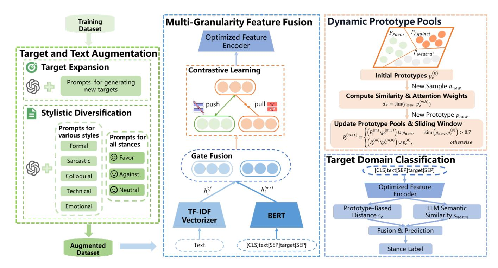
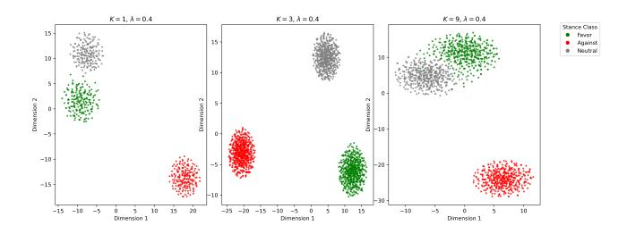

# Dynamic Prototype-Augmented Stance Detection: Learning from the Seen to Reason about the Unseen

Zhaodan Zhang School of Advanced Interdisciplinary Sciences, University of Chinese Academy of Sciences Beijing, China zhangzhaodan23s@ict.ac.cn

Jin Zhang∗ State Key Laboratory of AI Safety, Institute of Computing Technology, Chinese Academy of Sciences Beijing, China jinzhang@ict.ac.cn

Jiafeng Guo State Key Laboratory of AI Safety, Institute of Computing Technology, Chinese Academy of Sciences Beijing, China guojiafeng@ict.ac.cn

# Abstract

Zero-shot stance detection (ZSSD) aims to classify stances towards previously unseen targets without direct supervision on those topics during training. While recent approaches have explored various strategies, they often suffer from limited linguistic diversity or unstable semantic representations, restricting generalization to new domains. To address these challenges, we propose DPSD , a dynamic framework that integrates LLM-assisted data augmentation, multigranularity feature fusion with contrastive learning, and adaptive prototype updating. Our method enriches the training data with both diverse targets and stylistically varied texts. A gate-controlled fusion mechanism combines deep contextualized features from BERT with shallow lexical patterns via TF-IDF, while contrastive learning refines the feature space by pulling similar instances closer and pushing dissimilar ones apart, thereby improving representation discriminability. Furthermore, we introduce a sliding-window prototype pool that dynamically maintains class-specific prototypes while preserving historical knowledge, ensuring stable and interpretable inference over time. We also incorporate LLM-calibrated semantic similarity as an auxiliary scorer for controlled reasoning. Experimental results on three benchmark datasets -SEM16, P-Stance, and VAST - show that DPSD achieves strong performance in various zero-shot settings, especially in cross-dataset and unseen target scenarios.

# CCS Concepts

#### • Computing methodologies → Natural language processing.

#### Keywords

Zero-Shot Stance Detection; Data Augmentation; Contrastive Learning; Prototype Learning

#### ACM Reference Format:

Zhaodan Zhang, Jin Zhang, and Jiafeng Guo. 2026. Dynamic Prototype-Augmented Stance Detection: Learning from the Seen to Reason about the Unseen. In Proceedings of the ACM Web Conference 2026 (WWW '26), April 13–17, 2026, Dubai, United Arab Emirates. ACM, New York, NY, USA, [12](#page-11-0) pages.<https://doi.org/10.1145/3774904.3792221>

∗Corresponding author.

© 2026 Copyright held by the owner/author(s). ACM ISBN 979-8-4007-2307-0/2026/04 <https://doi.org/10.1145/3774904.3792221>

# 1 Introduction

Stance detection aims to automatically identify the attitude expressed in opinionated text towards a given target, typically categorized as favor, against, or neutral [\[8\]](#page-8-0). As a core task in Web content analysis, it plays a vital role in understanding public opinion, monitoring social discourse, and supporting downstream applications such as misinformation detection, political polarization analysis, and online debate summarization. The explosive growth of usergenerated content on social media platforms - e.g., Twitter, Reddit, and news comment sections - has made stance detection increasingly relevant for mining actionable insights from unstructured Web text. However, traditional approaches rely on training targetspecific classifiers, which perform well on known topics but fail catastrophically when applied to previously unseen targets, a common scenario in the dynamic and ever-evolving landscape of online discussions.

To overcome this limitation, cross-target stance detection has been proposed, where models trained on one or more source topics are adapted to predict stances on new targets [\[32\]](#page-8-1). While this setting improves generalization to some extent, it still assumes partial topic overlap or shared semantic structures between training and test domains - assumptions often violated in real-world Web environments where novel controversies, emerging entities, or niche debates constantly arise. As a result, zero-shot stance detection (ZSSD) has emerged as a more realistic and scalable paradigm for Web mining: it enables accurate stance classification on completely unseen targets without any direct supervision on those topics during training [\[1\]](#page-7-0). This capability is particularly crucial for analyzing fast-evolving Web content, where labeled data for new targets is scarce or nonexistent, yet timely understanding of user stances is essential for social listening, crisis response, and content moderation systems.

Recent advances in ZSSD have explored various strategies for improving performance under this challenging setting. Some studies focus on modeling the interaction between text and target through attention mechanisms [\[1\]](#page-7-0) or graph-based architectures [\[23\]](#page-8-2). Others employ contrastive learning [\[19,](#page-8-3) [21\]](#page-8-4) or multi-task frameworks [\[10\]](#page-8-5) to enhance generalization. More recently, large language models (LLMs) have been used for data augmentation [\[18,](#page-8-6) [26,](#page-8-7) [34\]](#page-9-0) or reasoning guidance [\[14\]](#page-8-8), while adversarial learning techniques have also been introduced to improve robustness [\[2,](#page-7-1) [33\]](#page-8-9).

Despite these efforts, zero-shot stance detection remains a challenging task due to two key limitations. Firstly, there is limited linguistic and target diversity in training data. Most existing

[This work is licensed under a Creative Commons Attribution 4.0 International License.](https://creativecommons.org/licenses/by/4.0) WWW '26, Dubai, United Arab Emirates

methods suffer from narrow topic coverage and lack effective mechanisms to enrich the feature space with diverse samples and unseen targets [\[34\]](#page-9-0). This restricts the model's ability to generalize beyond seen domains. Secondly, there is a lack of semantic stability during inference. Many current models fail to maintain consistent class representations when faced with unseen targets, leading to unstable predictions and reduced reliability.

To address these issues, we propose DPSD, a dynamic and interpretable framework that goes beyond simple module composition by introducing four key steps tailored specifically for zero-shot stance detection: (1) a two-stage LLM-assisted data augmentation strategy that jointly performs target expansion and stylistic diversification to enrich both topic coverage and linguistic variation while preserving stance semantics - addressing the critical scarcity of unseen targets and imbalanced class distributions in ZSSD; (2) a gate-controlled multi-granularity fusion mechanism that synergistically combines deep BERT embeddings with shallow TF-IDF lexical signals, capturing both contextual stance cues and surface-level polarity words critical for stance reasoning; (3) a sliding-window dynamic prototype pool that adaptively updates class prototypes while preserving historical knowledge unlike static or infrequently updated prototypes in prior work; and (4) a controlled LLM integration strategy that treats the LLM not as a black-box generator but as a semantic calibrator during inference, providing auxiliary similarity scores grounded in external knowledge to enhance prediction reliability. Collectively, these components form a cohesive architecture that explicitly addresses the dual challenges of diversity deficiency and semantic drift in ZSSD. Moreover, the core idea of dynamic prototype anchoring with external calibration is generalizable to other zero-shot classification tasks involving shifting semantic contexts.

Our main contributions can be summarized as follows:

- We propose a method for zero-shot stance detection, named DPSD, which integrates LLM-assisted data augmentation, multi-granularity feature fusion, contrastive learning, dynamic prototype learning, and LLM-based semantic calibration during inference to significantly improve generalization on unseen targets.
- We introduce a sliding-window prototype pool mechanism that dynamically updates class-specific prototypes based on new samples while preserving historical knowledge.
- Experimental results on three benchmark datasets SEM16, P-Stance, and VAST - demonstrate that DPSD achieves strong performance in various zero-shot settings, particularly in cross-dataset and unseen target scenarios.

# 2 Related Work

Zero-shot stance detection (ZSSD) classifies textual stance toward unseen targets without target-specific supervision [\[1\]](#page-7-0). Existing methods improve cross-topic generalization via architectural innovations [\[12\]](#page-8-10), external knowledge integration [\[13,](#page-8-11) [22\]](#page-8-12), or data augmentation.

Attention/graph-based architectures model text-target interactions [\[4,](#page-8-13) [11\]](#page-8-14), while external semantic/sentiment knowledge bridges seen/unseen topics [\[15,](#page-8-15) [28\]](#page-8-16). Prompt learning adapts LLMs for lowresource ZSSD [\[14,](#page-8-8) [27,](#page-8-17) [30\]](#page-8-18).

Data augmentation is critical for ZSSD performance under limited diversity [\[7\]](#page-8-19): traditional methods use paraphrasing/synonym replacement, while recent work leverages LLMs to generate new targets and texts [\[16\]](#page-8-20), with teacher-student paradigms optimizing synthetic sample usage [\[18\]](#page-8-6).

Prototype-based learning uses labeled instances to compute class prototypes for similarity-based classification, refined via contrastive learning to enhance feature separability [\[21,](#page-8-4) [35\]](#page-9-1).

Current methods still suffer from limitations: static feature representations lack adaptability to new linguistic patterns; fixed updated prototypes cause unstable predictions; LLMs are often treated as black-box generators, reducing interpretability.

To address these issues, we propose DPSD—a dynamic framework integrating LLM-augmented data expansion, multi-granularity feature fusion, and adaptive prototype updating—to achieve robust, interpretable ZSSD on unseen targets.

# 3 Methodology

Our framework, DPSD (Dynamic Prototype-based Stance Detection) integrates four key steps to support robust zero-shot stance detection as shown in Figure [1.](#page-2-0) The process begins with data augmentation, where we leverage large language models (LLMs) for both target expansion and text-style enrichment to enhance diversity in the source domain data. This is followed by feature extraction and contrastive learning, where multi-granularity features are extracted using BERT and TF-IDF, fused via a learnable gate mechanism, and optimized through contrastive learning to refine the feature space. The third step involves dynamic prototype learning, where class-specific prototypes are maintained and updated over time to ensure stable and adaptive inference on unseen targets. Finally, during target-domain classification, we integrate prototype-based inference with LLM-assisted semantic calibration to achieve reliable stance predictions without direct supervision on new topics.

# 3.1 Task Definition

This work addresses the problem of zero-shot stance detection, where the goal is to predict the stance of a textual statement towards an unseen target topic without direct supervision on that target during training. Formally, we are given a labeled source domain training set D�� = {(�� �� , ���� �� , ���� �� )}���� ��=1 , where each instance consists of a textual statement �� , its associated target topic �� , and a stance label �� ∈ {Favor, Against, Neutral}. Additionally, we are provided with a target domain test set D�� = {(�� �� , ���� )}���� ��=1 , where each sample contains a textual input �� �� �� and an unseen target �� �� �� not present in the source domain. The task is to predict a stance label ��ˆ ∈ {Favor, Against, Neutral} given the statement �� and an unseen target ��.

### 3.2 Target Expansion and Stylistic Diversification

To address the scarcity of target topics and ensure balanced class distribution in zero-shot stance detection, we propose a two-stage data augmentation process that enriches both topic coverage and linguistic diversity through carefully designed LLM prompts.

Figure 1: Overview of DPSD. The framework integrates multi-granularity feature learning, dynamic prototype updating, and LLM-assisted calibration for zero-shot stance detection. Specifically: ℎ tf �� and ℎ bert �� denote the TF-IDF and BERT-extracted feature representations of a statement-target pair; �� (0) is the initial class prototype computed from training data; ℎnew and ��new represent the embedding and updated prototype of a new instance; ���� denotes attention weights derived from cosine similarities between ℎnew and historical prototypes �� (��,��) in the pool P (��) ; ���� measures the matching score between input and stance class ��, while ��norm is its LLM-calibrated normalized version.

In the first stage - target expansion - we generate multiple semantically related but previously unseen targets ��ˆ �� based on each original source-domain target �� . To guide the large language model (LLM) toward coherent and diverse topic generation, we use the following structured prompt:

Given the base target '{base\_target}', generate {k} related but unseen targets. Return your response in a JSON list format like this: ['Related\_Target\_1', 'Related\_Target\_2', ...] Do NOT include any explanations or other text.

This prompt explicitly constrains the output format and suppresses extraneous reasoning, ensuring that the generated targets are both topically relevant (e.g., from "Climate Change" to "Carbon Tax Policy") and absent from the original training set, thereby expanding the model's exposure to novel yet plausible stance targets.

In the second stage - stylistic diversification - for each original or generated target, we synthesize textual statements across all three stance categories (Favor, Against, Neutral), with an equal number of samples per stance and per linguistic style (e.g., formal, colloquial, sarcastic). The generation is guided by the following prompt:

Given the target '{target}' and stance '{stance}', generate a sentence with {style} style.

Only output the sentence.

By varying the {style} placeholder (e.g., "formal", "sarcastic", "colloquial"), we induce rich linguistic variation while preserving stance semantics. This mitigates the risk of overfitting to specific phrasings and enhances robustness to real-world Web content, which exhibits high stylistic heterogeneity.

Finally, we combine the original and augmented samples into a balanced dataset:

Daug = {(�� aug , �� aug , �� aug )}, (1)

where:

- �� aug : generated textual statement,

- �� aug : associated target topic,

�� - �� aug ∈ {Favor, Against, Neutral}: stance label.

This two-stage augmentation strategy ensures a well-balanced distribution over both target topics and stance labels, enabling more robust and generalizable learning for zero-shot stance detection - particularly critical for Web mining tasks where data is sparse, noisy, and stylistically diverse.

# 3.3 Multi-Granularity Feature Learning

To support robust zero-shot stance detection - particularly in the context of Web mining where user-generated content exhibits high

strategy for zero-shot evaluation. P-Stance includes tweets related to three political figures, with stance labels indicating support, opposition, or neutrality. We exclude inconsistent "none" labeled samples and follow the same evaluation protocol as SEM16. VAST offers greater topic diversity with over 3,300 distinct topics across various domains, annotated with pro, con, or neutral stance labels. We use its zero-shot variant for evaluation. Detailed dataset statistics are provided in Appendix [A.](#page-9-2)

#### 4.2 Evaluation Metrics

For the VAST dataset [\[1\]](#page-7-0), we calculate the Macro-averaged F1 score across the Pro, Con, and Neutral labels to evaluate the performance of the models on the test set. For the SEM16 and PStance datasets, we report the ��avg, which is the average of the F1 scores for the Favor and Against classes [\[17,](#page-8-22) [24\]](#page-8-21). We compute ��avg for each target.

#### 4.3 Baselines

To evaluate the effectiveness of our proposed method, we compare it with a series of strong baselines categorized into three main groups: statistics-based models, BERT-based models, and LLM-based models. For statistics-based models, we include: BiCond [\[3\]](#page-8-23), Cross-Net [\[9\]](#page-8-24), SEKT [\[32\]](#page-8-1), TPDG [\[20\]](#page-8-25), and TOAD [\[2\]](#page-7-1). The BERT-based models group includes: TGA Net [\[1\]](#page-7-0), BERT-Joint [\[6\]](#page-8-26), BERT-GCN [\[23\]](#page-8-2), JointCL [\[21\]](#page-8-4), TarBK [\[20\]](#page-8-25), PT-HCL [\[19\]](#page-8-3), SDAgu [\[34\]](#page-9-0), WS-BERT-Dual [\[13\]](#page-8-11), and KAI [\[28\]](#page-8-16). For LLM-based models, we consider: COLA [\[14\]](#page-8-8), GPT [\[30\]](#page-8-18), GPT-EDDA [\[7\]](#page-8-19), LCDA [\[31\]](#page-8-27), KASD-ChatGPT [\[15\]](#page-8-15), and LC-CoT [\[29\]](#page-8-28). All baseline results are obtained using the official implementations or reported values from previous studies. Detailed descriptions of these models are provided in Appendix [B.](#page-9-3)

# 4.4 Implementation Details

All experiments are conducted on an NVIDIA A800 GPU. For data augmentation, we utilize gpt-3.5-turbo to better compare with baseline models. The feature encoder is built upon a BERT-based architecture for deep semantic representation, combined with a TF-IDF vectorizer (maximum 5000 features) to capture lexical patterns. The BERT model used is bert-base-uncased [\[5\]](#page-8-29), and the fusion module consists of a gate-controlled mechanism that dynamically adjusts the weights between BERT and TF-IDF [\[25\]](#page-8-30) features. The contrastive learning stage uses the InfoNCE loss to align positive and negative samples in the feature space. We train the model for 20 epochs using the Adam optimizer with a learning rate of 2×10−5 and weight decay of 0.01. Batch size is set to 32 during training. For dynamic prototype learning, we maintain a class-specific prototype pool for each stance category (Favor, Against, Neutral), where each pool stores up to three historical prototypes. In the zero-shot classification phase, we further enhance prediction reliability by incorporating semantic calibration from a large language model. All LLM-based inference is conducted with temperature sampling (temperature=0.7) and nucleus sampling (top-p=0.9) to ensure diversity and coherence in responses. The results reported in our experiments are averaged over 5 repeated runs to ensure statistical reliability and mitigate the impact of any variance in model performance. Detailed implementation details are provided in Appendix [C.](#page-10-0) For detailed time efficiency analysis of DPSD (including

its LLM-free inference variant), refer to Appendix [E.](#page-11-1) Details on LLM-generated data filtering, bias mitigation, and data privacy compliance are provided in Appendix [F.](#page-11-2)

#### 5 Results and Discussion

This section presents the experimental results and corresponding analysis based on the following research questions: RQ1: How does DPSD perform in zero-shot stance detection across multiple benchmark datasets ? RQ2: Is each component of DPSD effective for improving performance? RQ3: How do the hyperparameters �� (prototype pool size) and �� (update weight) affect the stability and adaptability of dynamic prototype learning? RQ4: Does DPSD learn transferable stance representations that enable generalization across different datasets?

# 5.1 Performance on Zero-Shot Stance Detection

To evaluate the effectiveness of our method in zero-shot settings, we compare DPSD with a variety of baseline models on three widely used benchmark datasets: SEM16, P-Stance, and VAST. The results are summarized in Table [1,](#page-6-0) where each value represents the F1-score (%) for stance prediction towards unseen targets.

As shown in the table, DPSD achieves strong performance across all datasets, outperforming most BERT-based methods and remaining competitive with state-of-the-art LLM-augmented approaches. On the SEM16 dataset, DPSD obtains average scores of 77.5% (HC), 75.5% (FM), 72.0% (LA), and 73.5% (DT), surpassing many previous

methods such as Bicond, CrossNet, and TOAD by a large margin. On the P-Stance dataset, DPSD achieves excellent results, with 87.5% on Biden, 82.6% on Sanders, and 80.1% on Trump. These results highlight the effectiveness of our hybrid framework in capturing both target-specific and target-agnostic features through LLM-assisted data augmentation, multi-granularity feature fusion, contrastive learning, and dynamic prototype updating.

For the VAST dataset, which includes more diverse and nonpolitical topics, DPSD achieves an overall Macro-F1 score of 80.8%, outperforming BERT-based methods and the top-performing LLMaugmented model LCDA (80.3%). Notably, DPSD performs particularly well on Pro and Con labels, achieving 75.9% and 75.0%, respectively.

These findings confirm that DPSD is highly effective in zero-shot stance detection across multiple domains. While not fully matching the top LLM-based methods like COLA or LCDA, it achieves robust performance with significantly lower computational cost and without relying heavily on full LLM generation during inference.

# 5.2 Effectiveness of Each Component in DPSD

To evaluate the contribution of each individual module in our framework, we conduct an ablation study on three benchmark datasets: SEM16, P-Stance, and VAST. The results are summarized in Table [2,](#page-6-1) where we report the Macro F1 scores across all targets.

Removing any key component leads to a noticeable drop in performance, indicating that each part contributes positively to the overall effectiveness. Removing target augmentation (w/o TgtAug) results in a moderate decline, suggesting that generating diverse unseen targets helps improve generalization. Removing text style augmentation (w/o TxtAug) also causes performance degradation,

Table 1: Performance Comparison (%) of Zero-Shot Stance Detection Methods on SEM16, P-Stance, and VAST Datasets. The best scores are in bold. Results with \* denote that DPSD significantly outperforms baselines with the ��-value &lt; 0.05.

| Model        | HC    | FM    | SEM16 LA | DT     | Biden    | P-Stance Sanders | Trump | Pro  | VAST Con | All    |
|--------------|-------|-------|----------|--------|----------|------------------|-------|------|----------|--------|
| Bicond       | 32.7  | 40.6  | 34.4     | 30.5   | 50.1     | 52.6             | 50.4  | 44.6 | 47.4     | 42.8   |
| CrossNet     | 38.3  | 41.7  | 38.5     | 35.6   | 52.8     | 53.1             | 52.8  | 46.2 | 43.4     | 43.4   |
| SEKT Sta.    | 50.1  | 44.2  | 44.6     | 46.8   | 64.4     | 61.3             | 60.8  | 50.4 | 44.2     | 41.8   |
| TPDG         | 50.9  | 53.6  | 46.5     | 47.3   | 64.4     | 62.0             | 60.1  | 53.7 | 49.6     | 51.9   |
| TOAD         | 51.2  | 54.1  | 46.2     | 49.5   |          |                  |       | 42.6 | 36.7     | 41.0   |
| COLA         | 81.7  | 63.4  | 71.0     | 68.5   | 84.0     | 79.7             | 86.6  |      |          | 73.0   |
| GPT          | 78.9  | 68.3  | 62.3     | 68.6   |          |                  |       | 63.8 | 65.8     | 65.1   |
| GPT-EDDA LLM | 80.1  | 69.2  | 62.4     | 69.5   |          |                  |       | 65.3 | 64.2     | 68.5   |
| LCDA         | 79.8  | 70.0  | 69.4     | 70.0   |          |                  |       | 73.8 | 75.9     | 80.3   |
| KASD-ChatGPT | 80.32 | 70.41 | 62.71    |        | 83.60    | 79.66            | 84.31 |      |          | 67.0   |
| LC-CoT       | 82.9  | 70.4  | 63.2     | 71.7   |          |                  |       |      |          | 72.5   |
| TGA Net      | 49.3  | 46.6  | 45.2     | 40.7   | 74.7     | 69.9             | 64.4  | 53.7 | 62.0     | 67.4   |
| BERT-Joint   | 50.1  | 42.1  | 44.8     | 41.0   | 75.0     | 71.1             | 67.2  | 56.8 | 67.6     | 71.0   |
| BERT-GCN     | 50.0  | 44.3  | 44.2     | 42.3   | 74.9     | 71.1             | 70.5  | 58.3 | 60.6     | 68.6   |
| JointCL      | 54.4  | 54.0  | 50.0     | 50.5   | 73.0     | 62.0             | 59.0  | 64.9 | 63.2     | 71.2   |
| TarBK BERT   | 55.1  | 53.8  | 48.7     | 50.8   | 75.5     | 70.5             | 65.8  | 65.7 | 63.9     | 73.6   |
| PT-HCL       | 54.5  | 54.6  | 50.9     | 50.1   |          |                  |       | 61.7 | 63.5     | 71.6   |
| SDAgu        |       |       |          |        |          |                  |       | 60.1 | 65.2     | 71.3   |
| WS-BERT-Dual | 53.65 | 47.06 | 42.61    |        | 77.91    | 71.63            | 69.24 |      |          | 75.3   |
| KAI          | 76.4  | 73.7  | 69.4     | 72.1   | 85.7     | 80.5             | 75.9  | 66.7 | 73.0     | 76.3   |
| DPSD (Ours)  | 77.5  | 75.5  | * 72.0   | * 73.5 | * 87.5 * | 82.6 *           | 80.1  | 75.9 | * 75.0   | 80.8 * |

Table 2: Ablation Study (%) on SEM16, P-Stance, and VAST Datasets. The best scores are in bold.

|      | Model     | HC   | FM   | SEM16 LA | DT   | Biden | P-Stance Sanders | Trump | VAST All |
|------|-----------|------|------|----------|------|-------|------------------|-------|----------|
| DPSD |           | 77.5 | 75.5 | 72.0     | 73.5 | 87.5  | 82.6             | 80.1  | 80.8     |
| w/o  | TgtAug    | 75.3 | 72.1 | 69.2     | 70.8 | 84.2  | 78.5             | 78.3  | 75.4     |
| w/o  | TxtAug    | 76.0 | 73.0 | 70.1     | 71.5 | 85.1  | 79.4             | 79.2  | 76.6     |
| w/o  | LLMAug    | 73.8 | 71.2 | 68.4     | 69.6 | 83.0  | 77.6             | 74.3  | 74.0     |
| w/o  | BERT      | 69.4 | 66.8 | 64.2     | 65.7 | 78.2  | 73.1             | 72.8  | 70.1     |
| w/o  | TF-IDF    | 76.2 | 73.3 | 70.4     | 71.8 | 85.7  | 79.9             | 79.4  | 76.8     |
| w/o  | CL        | 75.6 | 73.5 | 70.2     | 71.4 | 85.0  | 79.8             | 78.0  | 76.1     |
| w/o  | DPL       | 74.9 | 72.6 | 69.8     | 71.2 | 84.3  | 76.9             | 75.5  | 75.2     |
| w/o  | LLM-Calib | 75.1 | 72.9 | 69.8     | 71.0 | 85.4  | 78.5             | 75.9  | 75.7     |

highlighting the importance of linguistic variation in learning robust stance representations. When both LLM-based augmentations are removed (w/o LLMAug), the performance drops significantly, showing that LLM-assisted data expansion is crucial for enriching class balance and diversity.

Disabling BERT leads to the most substantial decrease in performance across all datasets, confirming its role as the primary semantic encoder. In contrast, removing TF-IDF fusion has a relatively smaller impact, indicating that shallow lexical features play a complementary rather than dominant role.

Moreover, ablating contrastive learning (CL) results in reduced feature separability and lower accuracy, especially on P-Stance and

Table 3: Performance (%) of DPSD under different values of �� (prototype pool size) and �� (update weight) on VAST. The best scores are in bold.

VAST. Removing dynamic prototype learning (DPL) results in unstable stance predictions during inference, especially for previously unseen targets, due to the lack of historical knowledge and semantic anchoring. Removing the LLM-assisted semantic calibration (w/o LLM-Calib) leads to a consistent decrease across all datasets, demonstrating that LLM-based calibration enhances prediction reliability by incorporating external semantic knowledge.

These findings validate that all components work synergistically to enhance zero-shot stance detection performance. While no single module dominates, their combination enables DPSD to achieve robust generalization across diverse domains.

#### 5.3 Impact of Hyperparameters on Dynamic Prototype Learning

To evaluate how the two key components of our dynamic prototype learning mechanism - the prototype pool size �� and the update

Figure 2: A t-SNE visualization of the embeddings learned by prototypical networks on the VAST dataset for different values of �� with �� = 0.4.

weight �� - influence model performance, we conduct a grid search over their combinations on the VAST dataset. The results are summarized in Table [3,](#page-6-2) where each value represents the average Macro F1-score across all three stance categories.

We observe that setting �� = 3 and �� = 0.4 yields the best performance, achieving an average F1-score of 80.8%. This suggests that maintaining a small but informative memory of historical prototypes helps stabilize the feature space while allowing moderate adaptation to new samples.

When �� is too small (e.g., �� = 1), the model lacks historical knowledge and becomes overly sensitive to recent updates, leading to instability. Conversely, when �� is too large (e.g., �� = 9), outdated prototypes may introduce noise and reduce responsiveness to new patterns, resulting in performance degradation. Similarly, �� controls the balance between new sample influence and historical prototype preservation. A low �� (e.g., 0.0-0.2) leads to slow adaptation and poor generalization, while a high �� (e.g., 0.8-1.0) causes excessive drift and reduces semantic consistency. The optimal �� = 0.4 strikes a good balance, allowing moderate updates without compromising representation stability.

The t-SNE visualization in Figure [2](#page-7-2) further illustrates the impact of �� on the embedding space. When �� = 1, the embeddings appear highly clustered but lack diversity, indicating that the model relies heavily on recent updates and struggles to generalize. As �� increases to �� = 3, the embeddings become more balanced and distinct, reflecting a better trade-off between stability and adaptability. However, when �� = 9, class boundaries become blurred, showing that too many past prototypes can interfere with learning new patterns.

These findings indicate that dynamic prototype learning benefits from both a limited but informative memory (via ��) and a balanced update strategy (via ��), enabling robust zero-shot stance detection across unseen targets.

#### 5.4 Cross-DataSet Generalization

To investigate whether DPSD learns representations that generalize across diverse domains, we conduct cross-dataset experiments where the model is trained on one dataset and evaluated on all three benchmark datasets: SEM16, P-Stance, and VAST. The results are summarized in Table [4,](#page-7-3) with each row representing a training dataset and each column representing a test dataset.

We observe that DPSD consistently performs well across all dataset combinations, demonstrating strong transferability of learned

Table 4: Cross-Dataset Generalization Performance (%) of DPSD. Models are trained on one dataset (row) and evaluated on others (column).

| Dataset  | SEM16 | P-Stance | VAST |
|----------|-------|----------|------|
| SEM16    | 75.5  | 78.9     | 75.0 |
| P-Stance | 74.3  | 80.2     | 74.5 |
| VAST     | 73.6  | 78.1     | 80.8 |

stance representations. For example, when trained on SEM16, it achieves 75.5% on SEM16 itself, 78.9% on P-Stance, and 75.0% on VAST - indicating robust performance not limited to visible topics.

Similarly, when trained on P-Stance (political discourse), DPSD maintains high accuracy on SEM16 and VAST, suggesting that it captures both target-specific and target-agnostic features that support zero-shot adaptation. Training on VAST also yields consistent performance across all datasets, further validating the effectiveness of our LLM-assisted data augmentation and dynamic prototype learning in building generalizable knowledge. These findings confirm that DPSD effectively learns stance representations that go beyond topic-specific patterns, enabling accurate prediction even when tested on previously unseen domains or targets.

#### 6 Conclusion

In this paper, we propose DPSD, a method for zero-shot stance detection that integrates LLM-based data augmentation, multigranularity feature fusion, contrastive learning, dynamic prototype learning, and LLM-calibrated semantic similarity for classification. Experimental results on three benchmark datasets (SEM16, P-Stance, and VAST ) demonstrate that DPSD achieves competitive performance compared to state-of-the-art LLM-augmented methods, while maintaining strong generalization on unseen targets. Ablation studies confirm the effectiveness of each component, particularly the role of dynamic prototype learning in stabilizing inference. In future work, we plan to explore more efficient integration of generative LLMs into both training and inference phases, enabling fully interpretable and knowledge-driven stance prediction.

### Acknowledgments

This research was supported by funding from the National Natural Science Foundation of China under Grant No.62441229 for the project "High-quality Dataset Construction". This valuable resource significantly enhanced the reliability and robustness of our experimental results. We would like to extend our sincere gratitude to all those who contributed to this work.

#### References

[1] Emily Allaway and Kathleen McKeown. 2020. Zero-Shot Stance Detection: A Dataset and Model using Generalized Topic Representations. In Proceedings of the 2020 Conference on Empirical Methods in Natural Language Processing (EMNLP), Bonnie Webber, Trevor Cohn, Yulan He, and Yang Liu (Eds.). Association for Computational Linguistics, Online, 8913–8931. [doi:10.18653/v1/2020.emnlp](https://doi.org/10.18653/v1/2020.emnlp-main.717)[main.717](https://doi.org/10.18653/v1/2020.emnlp-main.717) [2] Emily Allaway, Malavika Srikanth, and Kathleen McKeown. 2021. Adversarial Learning for Zero-Shot Stance Detection on Social Media. In Proceedings of the 2021 Conference of the North American Chapter of the Association for Computational Linguistics: Human Language Technologies, Kristina Toutanova, Anna Rumshisky,

- Luke Zettlemoyer, Dilek Hakkani-Tur, Iz Beltagy, Steven Bethard, Ryan Cotterell, Tanmoy Chakraborty, and Yichao Zhou (Eds.). Association for Computational Linguistics, Online, 4756–4767. [doi:10.18653/v1/2021.naacl-main.379](https://doi.org/10.18653/v1/2021.naacl-main.379) [3] Isabelle Augenstein, Tim Rocktäschel, Andreas Vlachos, and Kalina Bontcheva. 2016. Stance Detection with Bidirectional Conditional Encoding. In Proceedings of the 2016 Conference on Empirical Methods in Natural Language Processing, Jian Su, Kevin Duh, and Xavier Carreras (Eds.). Association for Computational Linguistics, Austin, Texas, 876–885. [doi:10.18653/v1/D16-1084](https://doi.org/10.18653/v1/D16-1084) [4] Xinyi Chen, Bo Liu, Huaping Hu, Yiqing Cai, Mengmeng Guo, and Xingkong Ma. 2025. Integrating Graph Neural Networks and Large Language Models for Stance Detection via Heterogeneous Stance Networks. Applied Sciences 15, 11 (2025). [doi:10.3390/app15115809](https://doi.org/10.3390/app15115809) [5] Jacob Devlin, Ming-Wei Chang, Kenton Lee, and Kristina Toutanova. 2018. BERT: Pre-training of Deep Bidirectional Transformers for Language Understanding. CoRR abs/1810.04805 (2018). arXiv[:1810.04805](https://arxiv.org/abs/1810.04805)<http://arxiv.org/abs/1810.04805> [6] Jacob Devlin, Ming-Wei Chang, Kenton Lee, and Kristina Toutanova. 2019. BERT: Pre-training of Deep Bidirectional Transformers for Language Understanding. In Proceedings of the 2019 Conference of the North American Chapter of the Association for Computational Linguistics: Human Language Technologies, Volume 1 (Long and Short Papers), Jill Burstein, Christy Doran, and Thamar Solorio (Eds.). Association for Computational Linguistics, Minneapolis, Minnesota, 4171–4186. [doi:10.18653/](https://doi.org/10.18653/v1/N19-1423) [v1/N19-1423](https://doi.org/10.18653/v1/N19-1423) [7] Daijun Ding, Li Dong, Zhichao Huang, Guangning Xu, Xu Huang, Bo Liu, Liwen Jing, and Bowen Zhang. 2024. EDDA: An Encoder-Decoder Data Augmentation Framework for Zero-Shot Stance Detection. In Proceedings of the 2024 Joint International Conference on Computational Linguistics, Language Resources and Evaluation (LREC-COLING 2024), Nicoletta Calzolari, Min-Yen Kan, Veronique Hoste, Alessandro Lenci, Sakriani Sakti, and Nianwen Xue (Eds.). ELRA and ICCL, Torino, Italia, 5484–5494.<https://aclanthology.org/2024.lrec-main.487> [8] Jiachen Du, Ruifeng Xu, Yulan He, and Lin Gui. 2017. Stance Classification with Target-specific Neural Attention. In Proceedings of the Twenty-Sixth International Joint Conference on Artificial Intelligence, IJCAI-17. 3988–3994. [doi:10.24963/ijcai.](https://doi.org/10.24963/ijcai.2017/557) [2017/557](https://doi.org/10.24963/ijcai.2017/557) [9] Jiachen Du, Ruifeng Xu, Yulan He, and Lin Gui. 2017. Stance classification with target-specific neural attention networks. In Proceedings of the 26th International Joint Conference on Artificial Intelligence (Melbourne, Australia) (IJCAI'17). AAAI Press, 3988–3994. [10] Qinlong Fan, Jicang Lu, Yepeng Sun, Qiankun Pi, and Shouxin Shang. 2025. Enhancing Zero-shot Stance Detection via Multi-task Fine-tuning with Debate Data and Knowledge Augmentation. Complex & Intelligent Systems 11, 2 (2025),
- 151. [doi:10.1007/s40747-024-01767-8](https://doi.org/10.1007/s40747-024-01767-8) [11] Krishna Garg and Cornelia Caragea. 2024. Stanceformer: Target-Aware Transformer for Stance Detection. In Findings of the Association for Computational Linguistics: EMNLP 2024, Yaser Al-Onaizan, Mohit Bansal, and Yun-Nung Chen (Eds.). Association for Computational Linguistics, Miami, Florida, USA, 4969– 4984. [doi:10.18653/v1/2024.findings-emnlp.286](https://doi.org/10.18653/v1/2024.findings-emnlp.286) [12] Hans Hanley and Zakir Durumeric. 2023. TATA: Stance Detection via Topic-Agnostic and Topic-Aware Embeddings. In Proceedings of the 2023 Conference on Empirical Methods in Natural Language Processing, Houda Bouamor, Juan Pino, and Kalika Bali (Eds.). Association for Computational Linguistics, Singapore, 11280–11294. [doi:10.18653/v1/2023.emnlp-main.694](https://doi.org/10.18653/v1/2023.emnlp-main.694) [13] Zihao He, Negar Mokhberian, and Kristina Lerman. 2022. Infusing Knowledge from Wikipedia to Enhance Stance Detection. In Proceedings of the 12th Workshop on Computational Approaches to Subjectivity, Sentiment & Social Media Analysis, Jeremy Barnes, Orphée De Clercq, Valentin Barriere, Shabnam Tafreshi, Sawsan Alqahtani, João Sedoc, Roman Klinger, and Alexandra Balahur (Eds.). Association for Computational Linguistics, Dublin, Ireland, 71–77. [doi:10.18653/v1/2022.](https://doi.org/10.18653/v1/2022.wassa-1.7) [wassa-1.7](https://doi.org/10.18653/v1/2022.wassa-1.7) [14] Xiaochong Lan, Chen Gao, Depeng Jin, and Yong Li. 2024. Stance Detection with Collaborative Role-Infused LLM-Based Agents. In Proceedings of the Eighteenth International AAAI Conference on Web and Social Media, ICWSM 2024, Buffalo, New York, USA, June 3-6, 2024, Yu-Ru Lin, Yelena Mejova, and Meeyoung Cha (Eds.). AAAI Press, 891–903. [doi:10.1609/ICWSM.V18I1.31360](https://doi.org/10.1609/ICWSM.V18I1.31360) [15] Ang Li, Bin Liang, Jingqian Zhao, Bowen Zhang, Min Yang, and Ruifeng Xu. 2023. Stance Detection on Social Media with Background Knowledge. In Proceedings of the 2023 Conference on Empirical Methods in Natural Language Processing, Houda Bouamor, Juan Pino, and Kalika Bali (Eds.). Association for Computational Linguistics, Singapore, 15703–15717. [doi:10.18653/v1/2023.emnlp-main.972](https://doi.org/10.18653/v1/2023.emnlp-main.972) [16] Yingjie Li and Cornelia Caragea. 2021. Target-Aware Data Augmentation for Stance Detection. In Proceedings of the 2021 Conference of the North American Chapter of the Association for Computational Linguistics: Human Language Technologies, Kristina Toutanova, Anna Rumshisky, Luke Zettlemoyer, Dilek Hakkani-Tur, Iz Beltagy, Steven Bethard, Ryan Cotterell, Tanmoy Chakraborty, and Yichao Zhou (Eds.). Association for Computational Linguistics, Online, 1850– 1860. [doi:10.18653/v1/2021.naacl-main.148](https://doi.org/10.18653/v1/2021.naacl-main.148) [17] Yingjie Li, Tiberiu Sosea, Aditya Sawant, Ajith Jayaraman Nair, Diana Inkpen, and Cornelia Caragea. 2021. P-Stance: A Large Dataset for Stance Detection in Political Domain. In Findings of the Association for Computational Linguistics: ACL-IJCNLP 2021, Chengqing Zong, Fei Xia, Wenjie Li, and Roberto Navigli (Eds.). Association for Computational Linguistics, Online, 2355–2365. [doi:10.18653/v1/2021.findings](https://doi.org/10.18653/v1/2021.findings-acl.208)[acl.208](https://doi.org/10.18653/v1/2021.findings-acl.208) [18] Yingjie Li, Chenye Zhao, and Cornelia Caragea. 2023. TTS: A Target-based Teacher-Student Framework for Zero-Shot Stance Detection. In Proceedings of the ACM Web Conference 2023 (Austin, TX, USA) (WWW '23). Association for Computing Machinery, New York, NY, USA, 1500–1509. [doi:10.1145/3543507.](https://doi.org/10.1145/3543507.3583250) [3583250](https://doi.org/10.1145/3543507.3583250) [19] Bin Liang, Zixiao Chen, Lin Gui, Yulan He, Min Yang, and Ruifeng Xu. 2022. Zero-Shot Stance Detection via Contrastive Learning. In Proceedings of the ACM Web Conference 2022 (Virtual Event, Lyon, France) (WWW '22). Association for Computing Machinery, New York, NY, USA, 2738–2747. [doi:10.1145/3485447.](https://doi.org/10.1145/3485447.3511994) [3511994](https://doi.org/10.1145/3485447.3511994) [20] Bin Liang, Yonghao Fu, Lin Gui, Min Yang, Jiachen Du, Yulan He, and Ruifeng Xu. 2021. Target-adaptive Graph for Cross-target Stance Detection. In Proceedings of the Web Conference 2021 (Ljubljana, Slovenia) (WWW '21). Association for Computing Machinery, New York, NY, USA, 3453–3464. [doi:10.1145/3442381.](https://doi.org/10.1145/3442381.3449790) [3449790](https://doi.org/10.1145/3442381.3449790) [21] Bin Liang, Qinglin Zhu, Xiang Li, Min Yang, Lin Gui, Yulan He, and Ruifeng Xu. 2022. JointCL: A Joint Contrastive Learning Framework for Zero-Shot Stance Detection. In Proceedings of the 60th Annual Meeting of the Association for Computational Linguistics (Volume 1: Long Papers), Smaranda Muresan, Preslav Nakov, and Aline Villavicencio (Eds.). Association for Computational Linguistics, Dublin, Ireland, 81–91. [doi:10.18653/v1/2022.acl-long.7](https://doi.org/10.18653/v1/2022.acl-long.7) [22] Shuohao Lin, Wei Chen, Yunpeng Gao, Zhishu Jiang, Mengqi Liao, Zhiyu Zhang, Shuyuan Zhao, and Huaiyu Wan. 2024. KPatch: Knowledge Patch to Pre-trained Language Model for Zero-Shot Stance Detection on Social Media. In Proceedings of the 2024 Joint International Conference on Computational Linguistics, Language Resources and Evaluation (LREC-COLING 2024), Nicoletta Calzolari, Min-Yen Kan, Veronique Hoste, Alessandro Lenci, Sakriani Sakti, and Nianwen Xue (Eds.). ELRA and ICCL, Torino, Italia, 9961–9973.<https://aclanthology.org/2024.lrec-main.871> [23] Rui Liu, Zheng Lin, Yutong Tan, and Weiping Wang. 2021. Enhancing Zeroshot and Few-shot Stance Detection with Commonsense Knowledge Graph. In Findings of the Association for Computational Linguistics: ACL-IJCNLP 2021, Chengqing Zong, Fei Xia, Wenjie Li, and Roberto Navigli (Eds.). Association for Computational Linguistics, Online, 3152–3157. [doi:10.18653/v1/2021.findings](https://doi.org/10.18653/v1/2021.findings-acl.278)[acl.278](https://doi.org/10.18653/v1/2021.findings-acl.278) [24] Saif Mohammad, Svetlana Kiritchenko, Parinaz Sobhani, Xiaodan Zhu, and Colin Cherry. 2016. SemEval-2016 Task 6: Detecting Stance in Tweets. In Proceedings of the 10th International Workshop on Semantic Evaluation (SemEval-2016), Steven Bethard, Marine Carpuat, Daniel Cer, David Jurgens, Preslav Nakov, and Torsten Zesch (Eds.). Association for Computational Linguistics, San Diego, California, 31–41. [doi:10.18653/v1/S16-1003](https://doi.org/10.18653/v1/S16-1003) [25] Karen Sparck Jones. 1988. A statistical interpretation of term specificity and its application in retrieval. Taylor Graham Publishing, GBR, 132–142. [26] Hanzi Xu, Slobodan Vucetic, and Wenpeng Yin. 2022. OpenStance: Real-world Zero-shot Stance Detection. In Proceedings of the 26th Conference on Computational Natural Language Learning (CoNLL), Antske Fokkens and Vivek Srikumar (Eds.). Association for Computational Linguistics, Abu Dhabi, United Arab Emirates (Hybrid), 314–324. [doi:10.18653/v1/2022.conll-1.21](https://doi.org/10.18653/v1/2022.conll-1.21) [27] Zhenyin Yao, Wenzhong Yang, and Fuyuan Wei. 2024. Enhancing Zero-Shot Stance Detection with Contrastive and Prompt Learning. Entropy 26, 4 (2024). [doi:10.3390/e26040325](https://doi.org/10.3390/e26040325) [28] Bowen Zhang, Daijun Ding, Zhichao Huang, Ang Li, Yangyang Li, Baoquan Zhang, and Hu Huang. 2024. Knowledge-Augmented Interpretable Network for Zero-Shot Stance Detection on Social Media. IEEE Transactions on Computational Social Systems (2024), 1–12. [doi:10.1109/TCSS.2024.3388723](https://doi.org/10.1109/TCSS.2024.3388723) [29] Bowen Zhang, Daijun Ding, Liwen Jing, and Hu Huang. 2023. A Logically Consistent Chain-of-Thought Approach for Stance Detection. CoRR abs/2312.16054 (2023). arXiv[:2312.16054](https://arxiv.org/abs/2312.16054) [doi:10.48550/ARXIV.2312.16054](https://doi.org/10.48550/ARXIV.2312.16054) [30] Bowen Zhang, Xianghua Fu, Daijun Ding, Hu Huang, Genan Dai, Nan Yin, Yangyang Li, and Liwen Jing. 2024. Investigating Chain-of-thought with ChatGPT for Stance Detection on Social Media. arXiv[:2304.03087](https://arxiv.org/abs/2304.03087) [cs.CL] [https://arxiv.org/](https://arxiv.org/abs/2304.03087) [abs/2304.03087](https://arxiv.org/abs/2304.03087) [31] Bowen Zhang, Xu Li, Jun Ma, Xi Zhang, Genan Dai, and Jianhua Ye. 2025. Zeroshot Stance Detection with Logically Consistent Data Augmentation. In ICASSP 2025 - 2025 IEEE International Conference on Acoustics, Speech and Signal Processing (ICASSP). 1–5. [doi:10.1109/ICASSP49660.2025.10888887](https://doi.org/10.1109/ICASSP49660.2025.10888887) [32] Bowen Zhang, Min Yang, Xutao Li, Yunming Ye, Xiaofei Xu, and Kuai Dai. 2020. Enhancing Cross-target Stance Detection with Transferable Semantic-Emotion Knowledge. In Proceedings of the 58th Annual Meeting of the Association for Computational Linguistics, Dan Jurafsky, Joyce Chai, Natalie Schluter, and Joel Tetreault (Eds.). Association for Computational Linguistics, Online, 3188–3197. [doi:10.18653/v1/2020.acl-main.291](https://doi.org/10.18653/v1/2020.acl-main.291) [33] Hao Zhang, Yizhou Li, Tuanfei Zhu, and Chuang Li. 2024. Commonsense-based adversarial learning framework for zero-shot stance detection. Neurocomput. 563, C (Jan. 2024), 11 pages. [doi:10.1016/j.neucom.2023.126943](https://doi.org/10.1016/j.neucom.2023.126943)

[34] Jiarui Zhang, Shaojuan Wu, Xiaowang Zhang, and Zhiyong Feng. 2023. Task-Specific Data Augmentation for Zero-shot and Few-shot Stance Detection. In Companion Proceedings of the ACM Web Conference 2023 (Austin, TX, USA) (WWW '23 Companion). Association for Computing Machinery, New York, NY, USA, 160–163. [doi:10.1145/3543873.3587337](https://doi.org/10.1145/3543873.3587337) [35] Zhao Zhang, Yiming Li, Jin Zhang, and Hui Xu. 2024. LLM-Driven Knowledge Injection Advances Zero-Shot and Cross-Target Stance Detection. In Proceedings of the 2024 Conference of the North American Chapter of the Association for Computational Linguistics: Human Language Technologies (Volume 2: Short Papers), Kevin Duh, Helena Gomez, and Steven Bethard (Eds.). Association for Computational Linguistics, Mexico City, Mexico, 371–378. [doi:10.18653/v1/2024.naacl-short.32](https://doi.org/10.18653/v1/2024.naacl-short.32)

#### A Dataset Statistics

We evaluate our method on three widely used stance detection benchmarks: SemEval-2016 Task 6 (SEM16), P-Stance, and VAST.

The SEM16 [\[24\]](#page-8-21) dataset contains tweets annotated with stance labels towards six predefined targets across multiple domains, including Donald Trump (DT), Hillary Clinton (HC), feminist movement (FM), legalization of abortion (LA), atheism (A), and climate change (CC). Each tweet is labeled as one of three stances: favor, against, or neutral. Following prior work, we remove targets A and CC due to data quality issues. Among the remaining four targets, we apply a leave-one-target-out strategy, treating one as the unseen target during testing and training on the others. To support hyperparameter tuning, we randomly select 15% of the training set as the development set.

The P-Stance [\[17\]](#page-8-22) dataset includes 21,574 tweets related to three prominent political figures: Joe Biden (Biden), Bernie Sanders (Sanders), and Donald Trump (Trump). Each tweet is associated with a stance label indicating whether the author supports, opposes, or remains neutral toward the given politician. As noted in previous studies, samples labeled as "none" exhibit low annotation consistency. Therefore, we follow standard practice and exclude all instances labeled as "none" from our analysis. Similarly to SEM16, we adopt the leave-one-target-out protocol.

The VAST [\[1\]](#page-7-0) provides greater topic diversity and lexical variation. It contains over 3,300 distinct topics spanning various domains such as war, drug policy, natural resources, and education tax. Each instance is annotated with one of three stance categories: pro, con, or neutral. We use the VAST zero-shot variant, which is specifically designed for evaluating zero-shot stance detection models.

Table 5: Statistics of VAST dataset.

|             |          | Train | Dev  | Test |
|-------------|----------|-------|------|------|
| # Examples  |          | 13477 | 2062 | 3006 |
| # Unique    | Comments | 1845  | 682  | 786  |
| # Zero-shot | Topics   | 4003  | 383  | 600  |
| # Few-shot  | Topics   | 638   | 114  | 159  |

### B Baseline Models

This section provides detailed descriptions of the baseline models used in our experiments, grouped by their architectural and learning paradigms.

# B.1 Statistics-based Models

These models rely on traditional neural architectures without leveraging pre-trained language representations. BiCond [\[3\]](#page-8-23) utilizes

Table 6: Statistics of SEM16 dataset.

| Target | Favor | Against | Neutral |
|--------|-------|---------|---------|
| DT     | 148   | 299     | 260     |
| HC     | 163   | 565     | 256     |
| FM     | 268   | 511     | 170     |
| LA     | 167   | 544     | 222     |
| A      | 124   | 464     | 145     |
| CC     | 335   | 26      | 203     |

Table 7: Label distribution across different targets for P-Stance.

|             | Trump | Biden | Sanders |
|-------------|-------|-------|---------|
| Train Favor | 2,937 | 2,552 | 2,858   |
| Against     | 3,425 | 3,254 | 2,198   |
| Val Favor   | 365   | 328   | 350     |
| Against     | 430   | 417   | 284     |
| Test Favor  | 361   | 337   | 343     |
| Against     | 435   | 408   | 292     |
| Total       | 7,953 | 7,296 | 6,325   |

two BiLSTM models to separately encode the input sentences and their associated targets for stance detection. SEKT [\[32\]](#page-8-1) incorporates external knowledge such as semantic and emotion lexicons to support knowledge transfer across different targets in crosstarget stance detection. CrossNet[\[9\]](#page-8-24) employs bidirectional LSTM to encode both text and topic information, and further introduces a target-specific attention mechanism before classification. TPDG [\[20\]](#page-8-25) proposes a method that automatically distinguishes and adjusts the roles of terms in stance expressions based on whether they are target-dependent or independent. TOAD [\[2\]](#page-7-1) applies adversarial learning techniques to improve generalization across diverse topics in zero-shot stance detection.

# B.2 BERT-based Models

These models are built upon the BERT architecture with various enhancements tailored for stance detection tasks. TGA Net [\[1\]](#page-7-0) implicitly constructs and leverages associations between training and evaluation topics without requiring supervision. It uses BERT to encode texts and targets, followed by two fully connected layers for classification. BERT-GCN [\[23\]](#page-8-2) integrates commonsense knowledge into the model by leveraging both structural and semantic relational information, aiming to enhance generalization under zero- and few-shot settings. BERT-Joint [\[6\]](#page-8-26) refers to the standard BERT framework, where bidirectional encoder representations are learned from large unlabeled corpora to generate dense vector representations for sentences and tokens. JointCL [\[21\]](#page-8-4) enhances feature learning through stance contrastive learning and target-aware prototypical graph contrastive learning, enabling better generalization to unseen targets. PT-HCL [\[19\]](#page-8-3) improves crossdomain transferability by incorporating contrastive learning with both semantic and sentiment knowledge. TarBK [\[20\]](#page-8-25) reduces the semantic gap between known and unseen targets by integrating background knowledge from Wikipedia. SDAgu [\[34\]](#page-9-0) addresses

the issue of limited labeled data and implicit stance expression via a self-supervised data augmentation approach based on coreference resolution. WS-BERT-Dual [\[13\]](#page-8-11) (Wikipedia Stance Detection BERT) infuses external knowledge into stance encoding through a dual-BERT structure that jointly models content and target information. KAI [\[28\]](#page-8-16) enhances stance detection performance through a knowledge-aware integration strategy, particularly effective in complex domains.

### B.3 LLM-based Models

These approaches utilize large language models with advanced prompting or reasoning strategies. COLA [\[14\]](#page-8-8) adopts a collaborative role-infusion framework that involves multiple LLMs to improve stance prediction. GPT [\[30\]](#page-8-18) serves as a baseline for LLMbased zero-shot stance detection using basic prompt engineering. GPT-EDDA [\[7\]](#page-8-19) introduces an encoder-decoder data augmentation framework to enhance the quality and diversity of generated prompts. LCDA [\[31\]](#page-8-27) focuses on improving data quality by maintaining logical coherence during generation. KASD-ChatGPT [\[15\]](#page-8-15) enhances stance detection by integrating external knowledge from Wikipedia and utilizing retrieval-augmented generation with Chat-GPT. LC-CoT [\[29\]](#page-8-28) leverages a structured chain-of-thought prompting strategy to guide LLMs toward more accurate and interpretable stance predictions.

### C Implementation Details

To ensure full reproducibility and scientific rigor in our experiments, we provide a comprehensive description of the computational infrastructure, hyperparameter search process, random seed settings, and statistical evaluation methods used throughout this study.

# C.1 Computational Infrastructure

All experiments were conducted using the following computing environment:

- Hardware: NVIDIA A800 GPU (40GB memory).
- Software Stack:
- Python version: 3.9
- PyTorch version: 2.1.0
- CUDA version: 11.8.0
- BERT model: bert-base-uncased [\[5\]](#page-8-29)
- TF-IDF vectorizer: sklearn.feature\_extraction.text.TfidfVectorizer with max features = 5000
  - LLM inference: gpt-3.5-turbo via OpenAI API

### C.2 Hyperparameter Search and Final Settings

During model development, we systematically explored a wide range of hyperparameters to optimize performance across all datasets. The following parameters were tuned:

- Learning rate: tested in range [1e-5, 5e-5], final value set to 2 × 10−5 based on validation performance.
- Weight decay: tested in range [0.001, 0.01], final value set to 0.01 to prevent overfitting while maintaining convergence speed.
- Batch size: tested in range [16, 64], final value set to 32 to balance memory usage and gradient stability.

- Number of training epochs: fixed at 20 based on early stopping analysis.

- Temperature for LLM sampling: tested in range [0.5, 1.0], final value set to 0.7 to ensure both diversity and coherence.

- Top-p (nucleus sampling) for LLM: tested in range [0.7, 1.0], final value set to 0.9 to avoid low-probability outputs.

- Prototype pool size: tested in range [1, 5], final value set to 3 to maintain historical context without introducing noise.

The final values were selected based on best average performance across three validation folds on the VAST dataset. Each parameter was evaluated independently while keeping others fixed to reduce interaction effects.

### C.3 Random Seed and Reproducibility Settings

To ensure consistent and replicable results, we set the random seed for all components as follows:

- Random seed for feature encoder training: 42
- Random seed for contrastive learning module: 42
- Random seed for prototype initialization and update: 42
- Random seed for data shuffling and batch generation: 42

We followed the standard practice of fixing seeds before each experiment run to ensure deterministic behavior during training and inference. All reported results are averaged over 5 independent runs with identical configurations but different prompt executions due to the nature of large language models.

#### C.4 Statistical Evaluation

To assess the significance of our method's improvements over baseline models, we applied paired t-tests across the five repeated runs for each dataset. Results marked with an asterisk (\*) indicate that the improvement is statistically significant at the �� &lt; 0.05 level.

For example, when comparing DPSD against COLA or GPT-EDDA baselines, we computed t-statistics from the F1 score distributions across the five runs. This approach ensures that observed performance gains are not due to chance variations in model output.

# D Prompts Used in DPSD

This appendix provides the detailed prompts used throughout the Dynamic Prototype-based Stance Detection (DPSD) framework. These prompts are employed to leverage large language models (LLMs) for target augmentation, text generation, and semantic similarity calibration.

# D.1 Prompt for Target Augmentation

The following prompt is used to generate semantically related but previously unseen targets based on existing ones:

Given the base target '{base\_target}', generate {k} related but unseen targets. Return your response in a JSON list format like this: ['Related\_Target\_1', 'Related\_Target\_2', ...] Do NOT include any explanations or other text.

This prompt instructs the LLM to produce new topics that are relevant to the original one while ensuring topic coherence and diversity.

#### D.2 Prompt for Text Generation

To enrich linguistic variation and ensure balanced stance distribution, we use the following prompt to generate textual statements with specific styles:

Given the target '{target}' and stance '{stance}', generate a sentence with {style} style. Only output the sentence.

Here, {style} can be varied across formal, sarcastic, colloquial, or other stylistic dimensions to diversify the training data.

# D.3 Prompt for Semantic Similarity Calibration

For LLM-assisted semantic calibration during classification, we use the following prompt to evaluate stance similarity between two instances:

You are given two statements about specific topics. Evaluate whether they express similar stances towards their respective targets.

Statement A: {input1} Statement B: {input2}

Rate their stance similarity on a scale from 0 to 1, where: - 1 means both statements express the same stance towards their own target - 0 means completely different or unrelated stance Only output the numerical score between 0 and 1, no other explanation.

This prompt enables the model to provide calibrated similarity scores that enhance prediction reliability by leveraging external semantic knowledge.

These carefully designed prompts facilitate key components of DPSD, including data augmentation, feature learning, and semantic calibration, enabling robust zero-shot stance detection across diverse domains.

### E Time Efficiency Analysis

To address deployment feasibility, we analyze the inference latency of DPSD and its LLM-free variant across three benchmark datasets (SEM16, P-Stance, VAST). All experiments use a consistent hardware environment (NVIDIA A800 GPU, 40GB memory; Intel Xeon Platinum 8480C CPU).

Key findings: 1. DPSD (Full) achieves 188 ms/sample, 40% faster than LCDA and 44% faster than COLA. 2. DPSD (LLM-free) reduces latency to 35 ms/sample (81% latency reduction vs. full variant), suitable for real-time Web mining. 3. The efficient gate-controlled fusion (Section 3.3) ensures low feature encoding time across variants.

Table 8: Inference Latency Comparison (ms/sample). Abbreviations: Model Var. = Model Variant, FE Time = Feature Encoding Time, LLM Calib. Time = LLM Calibration Time, Total Lat. = Total Latency.

| Model Var.      | FE   | Time  | LLM   | Calib. | Time  | Total Lat. |
|-----------------|------|-------|-------|--------|-------|------------|
| DPSD            | 35.2 | ± 2.1 | 152.4 | ± 8.3  | 187.6 | ± 9.5      |
| DPSD (LLM-free) | 34.8 | ± 1.9 |       |        | 34.8  | ± 1.9      |
| LCDA            | 42.1 | ± 2.5 | 268.3 | ± 11.2 | 310.4 | ± 12.7     |
| COLA            | 38.5 | ± 2.3 | 295.7 | ± 13.1 | 334.2 | ± 14.2     |

The LLM-free variant removes the LLM-calibration module (Section 3.5) and retains 93.9% of full-model performance (75.7% Macro-F1 on VAST), enabling low-latency deployment without API dependencies.

### F Safety, Bias Mitigation, and Data Privacy

## F.1 LLM-Generated Data Filtering

All LLM-generated training samples (Section 3.2) undergo a threelayer safety and quality filtering pipeline: (a) Automatic toxicity screening via Perspective API (samples with scores ≥ 0.7 are rejected, aligning with Web content moderation standards); (b) 5% random manual inspection across all stylistic categories (formal/colloquial/sarcastic), with no harmful stereotypes, hate speech, or misinformation identified; (c) Rule-based stance-consistency checks (matching lexical cues with generated labels) to filter hallucinated/contradictory samples. The final augmented dataset (D������) is toxicity-free and bias-minimized.

### F.2 Data Privacy Compliance

We adhere to strict privacy protection principles: - No raw usergenerated content (e.g., original tweets from SEM16/P-Stance) is transmitted to OpenAI; - During inference, only anonymized prompts in the form "Target: X; Statement: Y" are used, excluding usernames, IDs, timestamps, or any personally identifiable information (PII); - All LLM interactions comply with OpenAI's Terms of Service for academic research, and generated data is solely for model training/validation (no commercial use).