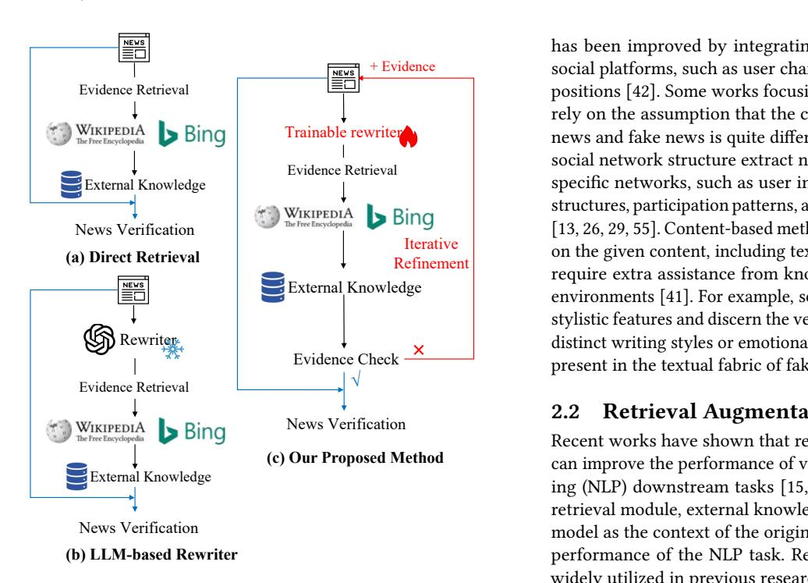
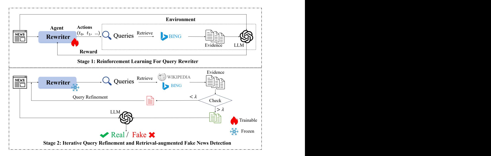
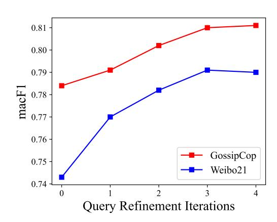
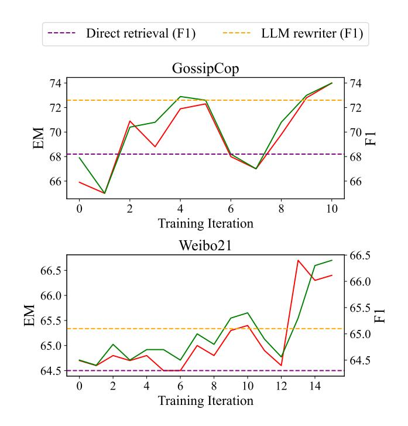
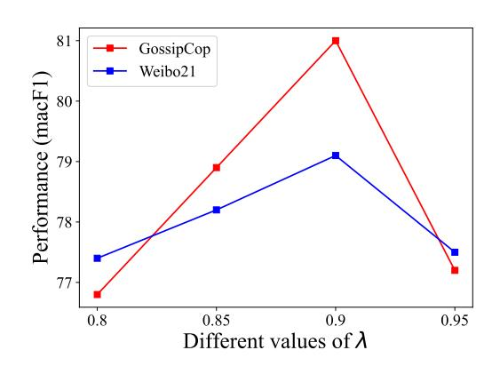

# Triple-R: Iterative Query Rewriting and Refinement for Retrieval-Augmented Fake News Detection

Jie Li Beijing University of Posts and Telecommunications Beijing, China jli@bupt.edu.cn

[Jinrui Wang](https://orcid.org/0009-0003-9653-5252) Beijing University of Posts and Telecommunications Beijing, China wangjinrui@bupt.edu.cn

Linmei Hu∗ Beijing Institute of Technology Beijing, China hulinmei@bit.edu.cn

Yuqiu Deng Beijing University of Posts and Telecommunications Beijing, China dyqiu@bupt.edu.cn

# Abstract

The rapid spread of online misinformation poses a serious threat to public trust and social stability, making automatic fake news detection increasingly critical. In this work, we propose a novel retrievalaugmented fake news detection framework, Triple-R (Rewriting, Retrieval, and iterative Refinement), which emphasizes optimizing the retrieval query. Unlike prior retrieval-augmented methods that adapt either the retriever or the verification module, often overlooking the gap between news text and the evidence needed for verification, our approach focuses on adapting the search query to retrieve the most relevant evidence. Specifically, we employ a small language model as a trainable query rewriter, optimized via reinforcement learning with feedback from a frozen LLM-based fake news detector, to transform the original news text into effective retrieval queries. To further enhance evidence relevance, we introduce an iterative query refinement mechanism, which progressively updates rewritten queries based on previously retrieved results. Finally, the original news text and the evidence retrieved through refined queries are integrated for verification. Experiments on two real-world datasets demonstrate consistent improvements, validating the effectiveness of our approach.

# CCS Concepts

• Computing methodologies → Natural language processing; • Information systems → Information retrieval.

# Keywords

Fake News Detection, Retrieval-Augmentation, Web Mining, Content Analysis

#### ACM Reference Format:

Jie Li, Jinrui Wang, Linmei Hu, and Yuqiu Deng. 2026. Triple-R: Iterative Query Rewriting and Refinement for Retrieval-Augmented Fake News Detection. In Proceedings of the ACM Web Conference 2026 (WWW '26), April

∗Corresponding author

© 2026 Copyright held by the owner/author(s). ACM ISBN 979-8-4007-2307-0/2026/04 <https://doi.org/10.1145/3774904.3792246>

13–17, 2026, Dubai, United Arab Emirates.ACM, New York, NY, USA, [10](#page-9-0) pages. <https://doi.org/10.1145/3774904.3792246>

# 1 Introduction

The rapid spread of fake news on social media poses significant risks to individuals and society. Automatic fake news detection, which aims to identify inaccurate or deliberately misleading content, has emerged as a promising countermeasure [\[5,](#page-8-0) [12,](#page-8-1) [16\]](#page-8-2). Recent research has increasingly focused on retrieval-augmented frameworks for fake news detection [\[22,](#page-8-3) [33,](#page-8-4) [45,](#page-9-1) [53\]](#page-9-2). These approaches typically follow a two-stage paradigm: (1) evidence retrieval, which identifies key evidential sentences from large Wikipedia corpora or the Web, and (2) news verification, which assesses the credibility of news texts based on the retrieved evidence (Figure [1](#page-1-0) a). Most existing works have concentrated on the verification stage [\[8,](#page-8-5) [14,](#page-8-6) [50,](#page-9-3) [54,](#page-9-4) [59,](#page-9-5) [62,](#page-9-6) [66\]](#page-9-7). However, focusing solely on verification can be suboptimal, as its effectiveness heavily depends on the quality of the retrieved evidence [\[9,](#page-8-7) [60\]](#page-9-8).

Some studies [\[14,](#page-8-6) [54,](#page-9-4) [59\]](#page-9-5) attempt to improve evidence relevance by summarizing news articles with large language models (LLMs) to form search queries (Figure [1](#page-1-0) b). Nevertheless, such approaches remain limited in bridging the gap between the news content and the evidence needed for verification. Traditional query rewriting techniques often fail to align fully with downstream retrieval systems and may not capture the nuanced semantics of the news, resulting in suboptimal evidence retrieval and verification performance.

In this paper, we propose a framework for retrieval-augmented fake news detection, termed Triple-R (Rewriting, Retrieval, and iterative Refinement), which emphasizes query optimization to retrieve the most relevant evidence for accurate verification. Specifically, we introduce a trainable query rewriter, built on a small language model, that transforms news articles into search queries. The rewriter is trained via reinforcement learning, with feedback from an LLM-based fake news detector serving as the reward signal. Motivated by the observation that humans often iteratively refine search queries based on initial results to better align retrieved information with their needs [\[2\]](#page-8-8), we design an iterative query refinement mechanism that progressively updates queries using evidence obtained in previous iterations. Finally, the news article and the retrieved evidence are aggregated to produce the final verification result. Extensive experiments on two real-world datasets demonstrate that our framework consistently outperforms

[This work is licensed under a Creative Commons Attribution 4.0 International License.](https://creativecommons.org/licenses/by/4.0) WWW '26, Dubai, United Arab Emirates

Iterative Refinement Evidence Check × + Evidence has been improved by integrating contextual information from social platforms, such as user characteristics, comments [\[26\]](#page-8-11), and positions [\[42\]](#page-8-12). Some works focusing on communication structure rely on the assumption that the communication structure of real news and fake news is quite different [\[29,](#page-8-13) [46\]](#page-9-12). Others focusing on social network structure extract network features by constructing specific networks, such as user interaction networks, user social structures, participation patterns, and news dissemination networks [\[13,](#page-8-14) [26,](#page-8-11) [29,](#page-8-13) [55\]](#page-9-13). Content-based methods focus on finding hints based on the given content, including text [\[34\]](#page-8-15) and images [\[35\]](#page-8-16), and may require extra assistance from knowledge bases [\[8,](#page-8-5) [33\]](#page-8-4) and news environments [\[41\]](#page-8-17). For example, some approaches pay attention to stylistic features and discern the veracity of news by identifying the distinct writing styles or emotional tones that are characteristically present in the textual fabric of fake news [\[34\]](#page-8-15).

**(c) Our Proposed Method** Recent works have shown that retrieving additional information can improve the performance of various natural language processing (NLP) downstream tasks [\[15,](#page-8-18) [17,](#page-8-19) [21,](#page-8-20) [57\]](#page-9-14). By incorporating a retrieval module, external knowledge is provided to the language model as the context of the original input, thereby enhancing the performance of the NLP task. Retrieval augmentation has been widely utilized in previous research for fake news detection, as it provides a knowledge foundation for news verification to ensure the accuracy of verification results [\[8,](#page-8-5) [8,](#page-8-5) [19,](#page-8-21) [31,](#page-8-22) [44,](#page-9-15) [47,](#page-9-16) [53,](#page-9-2) [61\]](#page-9-17). These methods generally follow a two-stage paradigm: evidence retrieval and news verification. Different from the aforementioned studies, we propose a retrieval-augmented fake news detection framework focusing on the adaptation of the search query, thereby improving the evidence retrieval and detection performance.

Figure 1: Three different retrieval-augmented fake news detection methods: (a) direct retrieval, (b) frozen LLM as a query rewriter for retrieval, and (c) our proposed method.

existing baselines, validating the effectiveness of our query-centric approach. Overall, our contributions can be summarized as follows:

- We introduce the first retrieval-augmented fake news detection framework that emphasizes query adaptation. Unlike prior work focusing primarily on verification, our approach iteratively adapts search queries to retrieve more relevant evidence, thereby enhancing detection accuracy.
- We develop a trainable query rewriter based on a small language model, optimized via reinforcement learning with feedback from an LLM-based fake news detector. This enables the query rewriting process to better align with retrievalaugmented verification. Furthermore, we design an iterative refinement mechanism to improve subsequent query updates.
- We conduct extensive experiments on two benchmark datasets, showing that our method substantially outperforms baselines, validating the effectiveness of our framework for fake news detection.

### 2 Related Work

# 2.1 Fake News Detection

Fake news detection is generally formulated as a classification task between real and fake news items. Research on this task could be roughly categorized into two groups: social context-based and content-based methods [\[7,](#page-8-9) [20,](#page-8-10) [56,](#page-9-9) [64\]](#page-9-10). Social context-based methods consider the fact that social media platforms are instrumental in detecting fake news [\[67\]](#page-9-11). The performance of fake news detection

# 2.2 Retrieval Augmentation

### 2.3 Reinforcement Learning

Reinforcement learning has been widely explored in previous works to solve NLP tasks, such as summarization [\[32\]](#page-8-23), question-answering [\[51\]](#page-9-18), and dialog generation [\[18\]](#page-8-24). These approaches first optimize a reward model to align with a preference dataset, then fine-tune a task-specific policy model to maximize the given reward using reinforcement learning algorithms such as REINFORCE [\[49\]](#page-9-19), proximal policy optimization (PPO) [\[40\]](#page-8-25), or their variants [\[38\]](#page-8-26). More recently, several studies have leveraged the powerful capabilities of LLMs by using them directly as reward models or for generating substantial amounts of preference data [\[23,](#page-8-27) [63\]](#page-9-20). For example, some methods use an LLM to provide feedback that guides a task-specific model with reasonable or feasible actions toward a specific goal [\[1,](#page-8-28) [10\]](#page-8-29). In this work, our method focuses on leveraging the feedback of an LLM-based fake news detector as a reward to optimize the query rewriter, which creates an easier way to learn the query rewriting preference.

# 3 Our Triple-R

As shown in Figure [2,](#page-3-0) our proposed Triple-R framework focuses on iteratively adapting the search query to retrieve relevant evidence, thereby improving news verification. We first introduce a trainable query rewriter, optimized via reinforcement learning using feedback from a frozen LLM-based fake news detector, which guides the

Figure 2: Overview of our proposed Triple-R.

Given a news article xi , the query x˜i generated by the rewriter is submitted to the retriever to obtain a set of candidate passages:

���� = {k1, k2, . . . , kn}.

We leverage two types of external knowledge for fake news detection: 1. Web search via the BING engine, providing up-todate information; 2. Wikipedia, an authoritative knowledge base known for its accuracy and reliability.

For Wikipedia retrieval, we adopt the off-the-shelf Contriever-MS MARCO model [\[11\]](#page-8-32), retrieving one passage per query. By combining these two sources, we aim to construct high-quality evidence that is both current and authoritative.

From the retrieved passages, evidence sentences kj are selected if their relevance scores ��ℎ������ (xi , kj) exceed a predefined threshold ��:

d y i = {kj ∈ ���� | ��ℎ������ (xi , kj) ≥ ��}.

Here, sentence selection is formulated as a semantic matching problem, where each sentence in the retrieved passages is compared to the news article, and the relevance score is computed as the dot product between their embeddings.

If no sentence meets the threshold, the retrieval process is repeated with a refined query. Specifically, we select the most relevant sentence from the previous retrieval step:

fragmenti = arg max kj ∈���� ��ℎ������ (xi , kj),

and append it directly to the original news article to form the new query context:

x˜ new i = ����������������( [xi , fragmenti]).

The iterative refinement continues until either the retrieved evidence satisfies the threshold �� or a maximum number of iterations is reached.

# 3.3 News Verification

Once multiple pieces of evidence are obtained through iterative query refinement and retrieval, we integrate the original news article with the retrieved evidence to produce the final verification result. Specifically, given a news article x and the set of retrieved evidence �� �� = {d y 1 , d y 2 , . . . , d y m}, the model generates the predicted label ��ˆ:

��ˆ = �� ������ �� ������(x, ���� ). (12)

Here, the �� ������ �� ������ can be any LLM-based or task-specific classification model that aggregates the input news and supporting evidence to output a final judgment on the veracity of the news.

# 4 Experiment

# 4.1 Experimental Settings

Datasets. We conduct experiments on public datasets, including the Chinese dataset Weibo21 [\[28\]](#page-8-33) and the English dataset Gossip-Cop [\[43\]](#page-8-34). Following existing works [\[6\]](#page-8-35), we preprocess the datasets with de-duplication and temporal data split to simulate real-world scenarios.

Baselines. We compare our method with two groups of baseline methods, including content-only methods (GPT-3.5-turbo [\[30\]](#page-8-36), BERT [\[4\]](#page-8-37), EANNT [\[48\]](#page-9-21), Publisher-Emo [\[58\]](#page-9-22), ENDEF [\[65\]](#page-9-23), and BERT+Rationale) and retrieval-augmentation methods (GET [\[53\]](#page-9-2),

Table 1: Performance of our method and the baseline methods. The best two results in macro F1 and accuracy are respectively bolded and underlined. Our method yields statistically significant improvements over the strongest baselines, with significance levels of �� ≤ 0.001, across all settings.

| Method                         | macF1 | GossipCop Acc. | Weibo21 macF1 | Acc.    |
|--------------------------------|-------|----------------|---------------|---------|
| GPT-3.5-turbo                  | 0.702 | 0.813          | 0.725         | 0.734   |
| BERT                           | 0.765 | 0.862          | 0.753         | 0.754   |
| EANN T Content-only            | 0.763 | 0.864          | 0.754         | 0.756   |
| Publisher-Emo                  | 0.766 | 0.868          | 0.761         | 0.763   |
| ENDEF                          | 0.768 | 0.865          | 0.765         | 0.766   |
| BERT + Rationale               | 0.777 | 0.870          | 0.767         | 0.769   |
| GET                            | 0.773 | 0.849          | 0.756         | 0.761   |
| SuperICL                       | 0.736 | 0.864          | 0.757         | 0.759   |
| MUSER Retrival-augmentation    | 0.776 | 0.873          | 0.778         | 0.787   |
| ARG                            | 0.790 | 0.878          | 0.784         | 0.786   |
| Triple-R                       | 0.810 | 0.905          | 0.791         | 0.794   |
| (Relative Impr. over Baseline) | (+2%) | (+2.7%)        | (+0.7%)       | (+0.7%) |

SuperICL [\[52\]](#page-9-24), MUSER [\[19\]](#page-8-21), and ARG [\[6\]](#page-8-35)). The details of baselines can be found in Appendix [A.](#page-9-25)

Implementation Details. GPT-3.5-turbo [\[30\]](#page-8-36) is used as the�� ������ �� ������, and its verification outputs serve as the reward to optimize the query rewriter through reinforcement learning. To ensure maximal reproducibility, the temperature parameter of the LLM is set to 0. In our prompt, following the brief instructions and the demonstrations, the input is the news article x. For the trainable rewriter, we employ the pre-trained T5-large (770M) [\[37\]](#page-8-30). We evaluate models every 500 steps and select the best one on the validation set based on the Exact Match score. We generate predictions by using greedy decoding. As for the other hyperparameters of reinforcement learning, we follow the prior work [\[24\]](#page-8-38). For the Wikipedia retriever model, we use off-the-shelf Contriever-MS MARCO [\[11\]](#page-8-32) by default and retrieve one passage for each input. For the threshold ��, we fit it as 0.9 by default. With the threshold parameter �� fixed, we set a maximum number of iterations for the query refinement process, which is set to 3.

# 4.2 Performance Results

We compare our model to 10 baselines, including 6 content-only methods and 4 retrieval-augmentation methods. Results in Table [1](#page-4-0) demonstrate that retrieval-augmentation methods tend to predict more accurately than content-only methods, indicating the additional value of incorporating more evidential information, which can effectively compensate for the insufficiency of news content features alone. In particular, SuperICL exhibits superior performance compared to the content-only GPT-3.5-turbo, as it leverages external knowledge to extract predictions and confidence. However, it still fails to outperform some other content-only based baselines. We speculate that this is due to the complexity of fake news detection, where injecting prediction and confidence from a small language model may not always provide sufficient knowledge.

Our method shows an average improvement of over 3% on F1- Macro and Accuracy compared to content-only methods across

both datasets. Notably, Triple-R outperforms ENDEF on the Weibo dataset, with an average improvement of 4% in terms of both F1- Macro and Accuracy. Furthermore, when compared to retrievalaugmentation methods for fake news detection, our proposed method achieves the best performance in both metrics. Specifically, it achieves an average improvement of 2% on F1-Macro and Accuracy over the best baseline ARG on the Gossip dataset. This enhancement reflects the effectiveness of our framework.

Table 2: Detection performance with different rewriters on two datasets.

| Model                           | macF1 | Acc.  |
|---------------------------------|-------|-------|
| Trainable rewriter              | 0.810 | 0.905 |
| LLM as rewriter                 | 0.795 | 0.897 |
| w/o rewriter (direct retrieval) | 0.765 | 0.872 |
| Weibo 21                        |       |       |
| Trainable rewriter              | 0.791 | 0.794 |
| LLM as rewriter                 | 0.785 | 0.790 |
| w/o rewriter (direct retrieval) | 0.775 | 0.779 |

### 4.3 Analysis of Query Rewriter

We propose a trainable language model as the query rewriter in our framework to generate queries based on the news for relevant evidence retrieval. The query rewriter is optimized using the feedback of an LLM-based fake news detector by reinforcement learning. In this subsection, we study the impact of different query rewriters, including our trainable rewriter, LLM-based rewriter, and w/o rewriter (using the original news as a query for retrieval), on fake news detection. For the frozen LLM-based rewriter in this experiment, we prompt an LLM to rewrite the query with fewshot in-context learning, following the previous work [\[27\]](#page-8-39). Our

prompt follows the formulation of [instruction, demonstrations, input], where the input is the news article ��. The demonstrations are random examples from training sets.

We show the final detection performance results of each method in Table [2.](#page-4-1) As we can see from Table [2,](#page-4-1) using the original news text directly as a query (w/o rewriter) to retrieve evidence for fake news detection enhancement yields the worst results. This demonstrates a gap between the input news and the needed knowledge in retrieval, which can lead to task-irrelevant evidence and undesirable retrieval outcomes, showing that long news texts are ineffective for evidence collection. The result is consistent with the conclusions of the previous study [\[25\]](#page-8-40).

Based on the experimental results, both the frozen LLM as a rewriter and the trainable rewriter can enhance the retrieval scores compared to direct retrieval. This indicates that the rewriter can bridge the gap between the long input texts and the retrieval need, helping to retrieve more relevant evidence that improves news detection. Furthermore, in comparison to frozen LLM employed as a rewriter, the trainable rewriter is more effective than an LLM rewriter. The results show that our trainable rewriter is better suited for task-related retrieval, which may be attributed to its alignment with the objectives of the detection task. That is to say, this superior performance could be ascribed to the introduction of task-relevant rewards during the training stage.

# 4.4 Analysis of Query Refinement

In this subsection, we first investigate the impact of the query refinement mechanism in our retrieval-augmented fake news detection framework. Then, we analyze how the number of iterations for the iterative query refinement affects the retrieval-augmented fake news detection. We tried different numbers of iterations for query refinement in the retrieval process.

Figure 3: Detection performances with query refinement of different iterations. The performance scores at '0 query refinement iteration' denote the method removing the query refinement.

Figure [3](#page-5-0) shows the performance (macro F1) of our framework on two datasets with different numbers of query refinement iterations. Zero iteration indicates removing the query refinement and using the query directly generated by our trainable query rewriter based

Figure 4: Reinforcement learning scores on two validation datasets. The solid lines show EM (red) and F1 (green) scores through training iterations. The dashed lines represent the F1 scores of the direct retrieval method (purple) and the LLMbased rewriter method (orange).

on the news article to conduct retrieval. As shown in Figure [3,](#page-5-0) we observe that enabling query refinement results in improved performance on both two datasets, compared to the scenario where query refinement is removed.

As we can see clearly, the performance of fake news detection reaches its peak around 3 to 4 query refinement iterations. Beyond this point, increasing the number of iterations does not yield significant benefits and, in fact, leads to a degradation in performance. This may be attributed to the redundant information contained in the evidence retrieved through multiple query refinements, which leads to a decrease in detection performance. Interestingly, despite variations in the difficulty level of the datasets, the optimal number of query refinement iterations remains consistent.

Table 3: Detection performances with rewriters trained using different algorithms.

| dataset   | training algorithm | macF1 | Acc.  |
|-----------|--------------------|-------|-------|
|           | PPO                | 0.810 | 0.905 |
| GossipCop | DPO                | 0.782 | 0.875 |
|           | BPO                | 0.791 | 0.882 |
|           | PPO                | 0.791 | 0.794 |
| Weibo21   | DPO                | 0.773 | 0.775 |
|           | BPO                | 0.785 | 0.786 |

#### 4.5 Analysis of Reinforcement Learning

In this subsection, we first explore the alternative training algorithms that can replace reinforcement learning for optimizing the rewriter. Then, we analyze the changes in metric scores across different training iterations during the reinforcement learning.

4.5.1 Impact of Different Alignment Algorithms. We conduct experiments to study alternative training algorithms for optimizing the rewriter to align with rewriting preferences. As shown in Table [3,](#page-5-1) we test the performance of retrieval-augmented fake news detection with query rewriter optimized with Direct Preference Optimization (DPO) [\[36\]](#page-8-41) and Black-Box Prompt Optimization (BPO) [\[3\]](#page-8-42). Specifically, DPO is implemented by directly aligning the model's outputs with preference data. This process involves collecting preference data in the form of paired outputs (preferred response and Non-preferred response). The model is then trained to optimize the likelihood of generating the preferred output based on the preference data. While DPO focuses on aligning the model's outputs with rewriting preferences through preference data, BPO further enhances this process by optimizing the preference data construction in a black-box manner. We adopt the GPT-3.5-turbo to construct the preference data and the optimized preference data for DPO and BPO, respectively. We utilize the same T5-Large model optimized as the rewriter.

The experimental results shown in Table [3](#page-5-1) indicate that, compared to the other alignment methods, the rewriter optimized with reinforcement learning achieves the best performance in the framework of retrieval-augmented fake news detection. This superior performance could be attributed to that reinforcement learning can more effectively guide the rewriter training by using the performance of an LLM-based fake news detector as the feedback. Meanwhile, as shown in Table [3,](#page-5-1) the rewriter optimized with BPO outperforms the one optimized with DPO in the retrieval-augmented fake news detection framework. Furthermore, both the DPO and BPO require a large amount of preference data, which is inefficient for data acquisition, as obtaining sufficient data is often challenging in practical applications.

Table 4: Study on the impact of the evidence retrieval source.

| Model                            | macF1 | Acc.  |
|----------------------------------|-------|-------|
| Vanilla (both Web and Wikipedia) | 0.810 | 0.905 |
| w/o Web search                   | 0.804 | 0.902 |
| w/o Wikipedia                    | 0.795 | 0.898 |
| Weibo 21                         |       |       |
| Vanilla (both Web and Wikipedia) | 0.791 | 0.794 |
| w/o Web search                   | 0.787 | 0.790 |
| w/o Wikipedia                    | 0.784 | 0.786 |

4.5.2 Training Iterations. This section shows the validation scores of the datasets in the training process of reinforcement learning. Figure [4](#page-5-2) presents the metric scores of the LLM-based fake news detector through training iterations in the process of reinforcement learning. Since the rewriting model is pre-trained before RL, scores

at "0 iteration" denote the ability acquired from the pre-training. It can be observed that the curves show upward trends with some fluctuations for both datasets. On GossipCop, our method surpasses the baselines after several iterations. This indicates that the RL training stage can compensate for the insufficiency of the pre-training. For the Chinese dataset Weibo21, the standard retrieval is relatively weaker. The LLM rewriter brings a significant improvement in retrieval-augmented detection. Experiments indicate that the rewriter trained with reinforcement learning surpasses the baseline of the LLM rewriter after a larger number of training iterations.

### 4.6 The impact of evidence retrieval sources

From the experimental results shown in Table [1,](#page-4-0) we can observe that retrieval-augmentation methods significantly outperform contentonly methods (3%-10% improvements on both GossipCop and Weibo21 datasets), indicating that the incorporation of external evidence significantly enhances fake news detection. Thus, in this section, we explore the impact of different evidence retrieval sources on the enhancement of fake news detection. Our fake news detection methods consider both authoritative sources like Wikipedia and real-time sources like Web data (BING Search). We remove one of the evidence retrieval sources each time and retain the other one.

As we can see from Table [4,](#page-6-0) removing evidence from web data (i.e., w/o Web search) leads to a slight performance drop. If we remove the evidence from the authoritative source (i.e., w/o Wikipedia), the performance decreases by around 0.8% on macro F1 and accuracy. The experiment results demonstrate that incorporating evidence from both sources provides the greatest enhancement for news detection. When considering external evidence from a single source, Wikipedia, as an external knowledge source, has a greater enhancement effect on fake news detection.

# 4.7 The Impact of Refinement Threshold ��

Figure 5: The comparison results with different �� values.

In this subsection, we explore the impact of the refinement threshold ��. �� essentially serves as an evaluation metric for the correlation between the news article and the retrieved passage text. To investigate the effect of �� value, we conduct experiments to analyze its impact on the retrieved evidence. The comparison results with different �� values are given in Figure [5.](#page-6-1) As we can see clearly,

#### **The original news article**

**France has apparently become the first country in the world to ban plastic plates,cups and utensils, passing a law ..**. The general idea behind the law following the landmark conference held in Paris last fall on curbing global warming is to promote a

circular economy ... Not all share the enthusiasm of France Socialist government, which has made environmental progress one of itsmain goals. In Brussels, some argue that the laws violate existing European Union legislation regarding the free movement of goods and the protection of manufacturers ...

# **Query: generated by frozen LLM-based rewriter**

**Has France become the first country in the world to ban plastic plates,cups, and utensils, with a law set to take effectin 2020?** How does this ban align with the country's Energy Transition for Green Growth Act, and what exceptions are allowed for compostable and biosourced materials? How does the ban fit into France's broader environmental goals, and what are the concerns raised by critics, including potential conflicts with European Union laws?

# **Query: key words extracted from original news**

**Plastic Ban; France;** Energy Transition for Green Growth Act; Compostable and Biosourced Materials; European Union Legislation

# **Query: generated by our proposed method**

**Retrieved evidence:** France passed a plastic ban law that will take effectin 2020. Exceptions will be made for items ...

**france has apparently become first country in world to ban plastic plates cups and utensils?**

*(by trainable rewriter)*

**france has apparently become first country in world to ban plastic plates cups and utensils and passed a law?**

*(after refinement)*

Figure 6: A Case study of the query. For various types of queries, the red section represents the content directly related to the core theme of the news, while the blue section contains content that is less directly related to the main topic.

the detection performance on macro F1 first consistently rises with the increase of �� and then drops when �� is larger than 0.9. This may be attributed that a low �� value tends to introduce more noise in the retrieved evidence, whereas a high �� value may inadvertently exclude critical evidence.

# 4.8 Case Study

To further illustrate how our query rewriting bridges the gap between news and evidence, we present four query examples from the GossipCop set, including (1) taking the original news article as the query, (2) query generated from the frozen LLM-based rewriter, (3) taking the keywords extracted from the news text as the query, and (4) query generated by our proposed method. As we can see from Figure [6,](#page-7-0) the original news article is titled "Plastic Ban in France", focusing on "France has become the first country in the world to ban plastic", but it also includes a lot of other content, such as comments from EU officials. The lengthy news text may overwhelm the specific information for evidence retrieval. Similarly, the queries generated by the frozen LLM-based rewriter contain not only the most relevant content but also queries regarding the less relevant parts. The keywords extracted from the original news text indeed simplify the core content of the news, but also include some secondary relevant terms. Meanwhile, the overly simplified keywords may reduce the effectiveness of the retrieval. In contrast, the query generated by our proposed method completely focuses on the 'first country for the plastic ban' in the original news, making it concise and intuitive, thus avoiding meaningless retrieval. Furthermore, our query refinement progressively enriches the query generated by the trainable rewriter with the content of "passed a law". We

believe that the retrieval-augmented fake news detection benefits from our framework of query rewriting and refinement.

# 5 Conclusion

This paper presents a novel retrieval-augmented fake news detection framework, Rewriting, Retrieval, and iterative Refinement (Triple-R), which emphasizes query adaptation. The framework focuses on query rewriting and refinement to iteratively modify the search query, enhancing the retrieval of relevant evidence and thereby improving fake news detection performance. Specifically, we employ a trainable language model as a query rewriter, optimized via reinforcement learning with feedback from an LLM-based fake news detector. To further improve evidence relevance, we introduce an iterative query refinement mechanism that progressively updates queries based on previously retrieved results. The original news article and the evidence retrieved through refined queries are then integrated for final verification. Experiments on two real-world datasets demonstrate consistent performance gains, validating the effectiveness of our approach. In future work, we will explore extending the Triple-R framework to other retrieval-augmented web mining tasks.

# Acknowledgments

This work was supported by the National Science Foundation of China (No. 62276029), Beijing Institute of Technology Research Fund Program for Young Scholars (No.6120220261), CIPSC-SMP-Zhipu Large Model Cross-Disciplinary Fund (No. ZPCG20241111371).

#### References

[1] Michael Ahn, Anthony Brohan, Noah Brown, Yevgen Chebotar, Omar Cortes, Byron David, Chelsea Finn, Chuyuan Fu, Keerthana Gopalakrishnan, Karol Hausman, et al. 2022. Do as i can, not as i say: Grounding language in robotic affordances. arXiv preprint arXiv:2204.01691 (2022). [2] Xinran Chen, Xuanang Chen, Ben He, Tengfei Wen, and Le Sun. 2024. Analyze, generate and refine: Query expansion with LLMs for zero-shot open-domain QA. In Findings of the Association for Computational Linguistics ACL 2024. 11908– 11922. [3] Jiale Cheng, Xiao Liu, Kehan Zheng, Pei Ke, Hongning Wang, Yuxiao Dong, Jie Tang, and Minlie Huang. 2023. Black-box prompt optimization: Aligning large language models without model training. arXiv preprint arXiv:2311.04155 (2023). [4] Jacob Devlin. 2018. Bert: Pre-training of deep bidirectional transformers for language understanding. arXiv preprint arXiv:1810.04805 (2018). [5] Yi R Fung, Kung-Hsiang Huang, Preslav Nakov, and Heng Ji. 2022. The battlefront of combating misinformation and coping with media bias. In Proceedings of the 28th ACM SIGKDD Conference on Knowledge Discovery and Data Mining. 4790– 4791. [6] Beizhe Hu, Qiang Sheng, Juan Cao, Yuhui Shi, Yang Li, Danding Wang, and Peng Qi. 2024. Bad actor, good advisor: Exploring the role of large language models in fake news detection. In Proceedings of the AAAI Conference on Artificial Intelligence, Vol. 38. 22105–22113. [7] Linmei Hu, Siqi Wei, Ziwang Zhao, and Bin Wu. 2022. Deep Learning for Fake News Detection: A Comprehensive Survey. AI Open 3 (Jan. 2022), 133–155. [doi:10.1016/j.aiopen.2022.09.001](https://doi.org/10.1016/j.aiopen.2022.09.001) [8] Linmei Hu, Tianchi Yang, Luhao Zhang, Wanjun Zhong, Duyu Tang, Chuan Shi, Nan Duan, and Ming Zhou. 2021. Compare to The Knowledge: Graph Neural Fake News Detection with External Knowledge. In Proceedings of the 59th Annual Meeting of the Association for Computational Linguistics and the 11th International Joint Conference on Natural Language Processing (Volume 1: Long Papers). Association for Computational Linguistics, Online, 754–763. [doi:10.](https://doi.org/10.18653/v1/2021.acl-long.62) [18653/v1/2021.acl-long.62](https://doi.org/10.18653/v1/2021.acl-long.62) [9] Xuming Hu, Zhaochen Hong, Zhijiang Guo, Lijie Wen, and Philip Yu. 2023. Read it twice: Towards faithfully interpretable fact verification by revisiting evidence. In Proceedings of the 46th International ACM SIGIR Conference on Research and Development in Information Retrieval. 2319–2323. [10] Wenlong Huang, Pieter Abbeel, Deepak Pathak, and Igor Mordatch. 2022. Language models as zero-shot planners: Extracting actionable knowledge for embodied agents. In International conference on machine learning. PMLR, 9118–9147. [11] Gautier Izacard, Mathilde Caron, Lucas Hosseini, Sebastian Riedel, Piotr Bojanowski, Armand Joulin, and Edouard Grave. 2021. Unsupervised dense information retrieval with contrastive learning. arXiv preprint arXiv:2112.09118 (2021). [12] Yiqiao Jin, Yeon-Chang Lee, Kartik Sharma, Meng Ye, Karan Sikka, Ajay Divakaran, and Srijan Kumar. 2023. Predicting information pathways across online communities. In Proceedings of the 29th ACM SIGKDD Conference on Knowledge Discovery and Data Mining. 1044–1056. [13] Yiqiao Jin, Xiting Wang, Ruichao Yang, Yizhou Sun, Wei Wang, Hao Liao, and Xing Xie. 2022. Towards fine-grained reasoning for fake news detection. In Proceedings of the AAAI Conference on Artificial Intelligence, Vol. 36. 5746–5754. [14] Jiho Kim, Sungjin Park, Yeonsu Kwon, Yohan Jo, James Thorne, and Edward Choi. 2023. FactKG: Fact verification via reasoning on knowledge graphs. arXiv preprint arXiv:2305.06590 (2023). [15] Angeliki Lazaridou, Elena Gribovskaya, Wojciech Stokowiec, and Nikolai Grigorev. 2022. Internet-augmented language models through few-shot prompting for open-domain question answering. arXiv preprint arXiv:2203.05115 (2022). [16] David MJ Lazer, Matthew A Baum, Yochai Benkler, Adam J Berinsky, Kelly M Greenhill, Filippo Menczer, Miriam J Metzger, Brendan Nyhan, Gordon Pennycook, David Rothschild, et al. 2018. The science of fake news. Science 359, 6380 (2018), 1094–1096. [17] Patrick Lewis, Ethan Perez, Aleksandra Piktus, Fabio Petroni, Vladimir Karpukhin, Naman Goyal, Heinrich Küttler, Mike Lewis, Wen-tau Yih, Tim Rocktäschel, et al. 2020. Retrieval-augmented generation for knowledge-intensive nlp tasks. Advances in Neural Information Processing Systems 33 (2020), 9459–9474. [18] Jiwei Li, Will Monroe, Alan Ritter, Michel Galley, Jianfeng Gao, and Dan Jurafsky. 2016. Deep reinforcement learning for dialogue generation. arXiv preprint arXiv:1606.01541 (2016). [19] Hao Liao, Jiahao Peng, Zhanyi Huang, Wei Zhang, Guanghua Li, Kai Shu, and Xing Xie. 2023. MUSER: A multi-step evidence retrieval enhancement framework for fake news detection. In Proceedings of the 29th ACM SIGKDD Conference on Knowledge Discovery and Data Mining. 4461–4472. [20] Hu Linmei, Tianchi Yang, Chuan Shi, Houye Ji, and Xiaoli Li. 2019. Heterogeneous graph attention networks for semi-supervised short text classification. In Proceedings of the 2019 conference on empirical methods in natural language processing and the 9th international joint conference on natural language processing (EMNLP-IJCNLP). 4821–4830. [21] Man Luo, Xin Xu, Zhuyun Dai, Panupong Pasupat, Mehran Kazemi, Chitta Baral, Vaiva Imbrasaite, and {Vincent Y.} Zhao. 2024. Dr.ICL: Demonstration-Retrieved In-context Learning. Data Intelligence 6, 4 (1 Dec. 2024), 909–922. [doi:10.](https://doi.org/10.3724/2096-7004.di.2024.0012) [3724/2096-7004.di.2024.0012](https://doi.org/10.3724/2096-7004.di.2024.0012) Publisher Copyright: © 2024 Chinese Academy of Sciences.. [22] Jing Ma, Wei Gao, Shafiq Joty, and Kam-Fai Wong. 2019. Sentence-level evidence embedding for claim verification with hierarchical attention networks. Association for Computational Linguistics. [23] Jiatong Ma, Linmei Hu, Rang Li, and Wenbo Fu. 2025. LoCal: Logical and Causal Fact-Checking with LLM-Based Multi-Agents. In Proceedings of the ACM on Web Conference 2025 (WWW '25). Association for Computing Machinery, New York, NY, USA, 1614–1625. [doi:10.1145/3696410.3714748](https://doi.org/10.1145/3696410.3714748) [24] Xinbei Ma, Yeyun Gong, Pengcheng He, Hai Zhao, and Nan Duan. 2023. Query Rewriting in Retrieval-Augmented Large Language Models. In Proceedings of the 2023 Conference on Empirical Methods in Natural Language Processing. 5303–5315. [25] Alex Mallen, Akari Asai, Victor Zhong, Rajarshi Das, Hannaneh Hajishirzi, and Daniel Khashabi. 2022. When not to trust language models: Investigating effectiveness and limitations of parametric and non-parametric memories. arXiv preprint arXiv:2212.10511 7 (2022). [26] Erxue Min, Yu Rong, Yatao Bian, Tingyang Xu, Peilin Zhao, Junzhou Huang, and Sophia Ananiadou. 2022. Divide-and-conquer: Post-user interaction network for fake news detection on social media. In Proceedings of the ACM web conference 2022. 1148–1158. [27] Sewon Min, Xinxi Lyu, Ari Holtzman, Mikel Artetxe, Mike Lewis, Hannaneh Hajishirzi, and Luke Zettlemoyer. 2022. Rethinking the role of demonstrations: What makes in-context learning work? arXiv preprint arXiv:2202.12837 (2022). [28] Qiong Nan, Juan Cao, Yongchun Zhu, Yanyan Wang, and Jintao Li. 2021. MD-FEND: Multi-domain fake news detection. In Proceedings of the 30th ACM International Conference on Information & Knowledge Management. 3343–3347. [29] Van-Hoang Nguyen, Kazunari Sugiyama, Preslav Nakov, and Min-Yen Kan. 2020. Fang: Leveraging social context for fake news detection using graph representation. In Proceedings of the 29th ACM international conference on information & knowledge management. 1165–1174. [30] OpenAI. 2023. ChatGPT: Optimizing Language Models for Dialogue. arXiv preprint arXiv:2303.08774 (2023).<https://arxiv.org/abs/2303.08774> [31] Liangming Pan, Xiaobao Wu, Xinyuan Lu, Anh Tuan Luu, William Yang Wang, Min-Yen Kan, and Preslav Nakov. 2023. Fact-Checking Complex Claims with Program-Guided Reasoning. In Proceedings of the 61st Annual Meeting of the Association for Computational Linguistics (Volume 1: Long Papers). 6981–7004. [32] R Paulus. 2017. A deep reinforced model for abstractive summarization. arXiv preprint arXiv:1705.04304 (2017). [33] Kashyap Popat, Subhabrata Mukherjee, Andrew Yates, and Gerhard Weikum. 2018. Declare: Debunking fake news and false claims using evidence-aware deep learning. arXiv preprint arXiv:1809.06416 (2018). [34] Piotr Przybyla. 2020. Capturing the style of fake news. In Proceedings of the AAAI conference on artificial intelligence, Vol. 34. 490–497. [35] Peng Qi, Juan Cao, Xirong Li, Huan Liu, Qiang Sheng, Xiaoyue Mi, Qin He, Yongbiao Lv, Chenyang Guo, and Yingchao Yu. 2021. Improving fake news detection by using an entity-enhanced framework to fuse diverse multimodal clues. In Proceedings of the 29th ACM International Conference on Multimedia. 1212–1220. [36] Rafael Rafailov, Archit Sharma, Eric Mitchell, Christopher D Manning, Stefano Ermon, and Chelsea Finn. 2024. Direct preference optimization: Your language model is secretly a reward model. Advances in Neural Information Processing Systems 36 (2024). [37] Colin Raffel, Noam Shazeer, Adam Roberts, Katherine Lee, Sharan Narang, Michael Matena, Yanqi Zhou, Wei Li, and Peter J Liu. 2020. Exploring the limits of transfer learning with a unified text-to-text transformer. Journal of machine learning research 21, 140 (2020), 1–67. [38] Rajkumar Ramamurthy, Prithviraj Ammanabrolu, Kianté Brantley, Jack Hessel, Rafet Sifa, Christian Bauckhage, Hannaneh Hajishirzi, and Yejin Choi. 2022. Is reinforcement learning (not) for natural language processing: Benchmarks, baselines, and building blocks for natural language policy optimization. arXiv preprint arXiv:2210.01241 (2022). [39] John Schulman, Philipp Moritz, Sergey Levine, Michael Jordan, and Pieter Abbeel. 2015. High-dimensional continuous control using generalized advantage estimation. arXiv preprint arXiv:1506.02438 (2015). [40] John Schulman, Filip Wolski, Prafulla Dhariwal, Alec Radford, and Oleg Klimov. 2017. Proximal policy optimization algorithms. arXiv preprint arXiv:1707.06347 (2017). [41] Qiang Sheng, Juan Cao, Xueyao Zhang, Rundong Li, Danding Wang, and Yongchun Zhu. 2022. Zoom out and observe: News environment perception for fake news detection. arXiv preprint arXiv:2203.10885 (2022). [42] Kai Shu, Limeng Cui, Suhang Wang, Dongwon Lee, and Huan Liu. 2019. defend: Explainable fake news detection. In Proceedings of the 25th ACM SIGKDD international conference on knowledge discovery & data mining. 395–405. [43] Kai Shu, Deepak Mahudeswaran, Suhang Wang, Dongwon Lee, and Huan Liu. 2020. Fakenewsnet: A data repository with news content, social context, and

spatiotemporal information for studying fake news on social media. Big data 8, 3 (2020), 171–188. [44] Zhuoran Jin Hongbang Yuan Yubo Chen Kang Liu Sujian Li Suifeng Zhao, Tong Zhou. 2024. AWeCita: Generating Answer with Appropriate and Wellgrained Citations Using LLMs. Data Intelligence 6, 4 (2024), 1134–1157. [doi:10.](https://doi.org/10.3724/2096-7004.di.2024.0035) [3724/2096-7004.di.2024.0035](https://doi.org/10.3724/2096-7004.di.2024.0035) [45] Nguyen Vo and Kyumin Lee. 2021. Hierarchical multi-head attentive network for evidence-aware fake news detection. arXiv preprint arXiv:2102.02680 (2021). [46] Soroush Vosoughi, Deb Roy, and Sinan Aral. 2018. The spread of true and false news online. science 359, 6380 (2018), 1146–1151. [47] Haoran Wang and Kai Shu. 2023. Explainable Claim Verification via Knowledge-Grounded Reasoning with Large Language Models. In Findings of the Association for Computational Linguistics: EMNLP 2023. 6288–6304. [48] Yaqing Wang, Fenglong Ma, Zhiwei Jin, Ye Yuan, Guangxu Xun, Kishlay Jha, Lu Su, and Jing Gao. 2018. Eann: Event adversarial neural networks for multi-modal fake news detection. In Proceedings of the 24th acm sigkdd international conference on knowledge discovery & data mining. 849–857. [49] Ronald J Williams. 1992. Simple statistical gradient-following algorithms for connectionist reinforcement learning. Machine learning 8 (1992), 229–256. [50] Lianwei Wu, Yuan Rao, Ling Sun, and Wangbo He. 2021. Evidence inference networks for interpretable claim verification. In Proceedings of the AAAI conference on artificial intelligence, Vol. 35. 14058–14066. [51] Caiming Xiong, Victor Zhong, and Richard Socher. 2017. Dcn+: Mixed objective and deep residual coattention for question answering. arXiv preprint arXiv:1711.00106 (2017). [52] Canwen Xu, Yichong Xu, Shuohang Wang, Yang Liu, Chenguang Zhu, and Julian McAuley. 2023. Small models are valuable plug-ins for large language models. arXiv preprint arXiv:2305.08848 (2023). [53] Weizhi Xu, Junfei Wu, Qiang Liu, Shu Wu, and Liang Wang. 2022. Evidenceaware fake news detection with graph neural networks. In Proceedings of the ACM web conference 2022. 2501–2510. [54] Hao Yan, Chaozhuo Li, Ruosong Long, Chao Yan, Jianan Zhao, Wenwen Zhuang, Jun Yin, Peiyan Zhang, Weihao Han, Hao Sun, et al. 2023. A Comprehensive Study on Text-attributed Graphs: Benchmarking and Rethinking. In NeurIPS. [55] Ruichao Yang, Xiting Wang, Yiqiao Jin, Chaozhuo Li, Jianxun Lian, and Xing Xie. 2022. Reinforcement subgraph reasoning for fake news detection. In Proceedings of the 28th ACM SIGKDD Conference on Knowledge Discovery and Data Mining. 2253–2262. [56] Tianchi Yang, Linmei Hu, Chuan Shi, Houye Ji, Xiaoli Li, and Liqiang Nie. 2021. HGAT: Heterogeneous Graph Attention Networks for Semi-supervised Short Text Classification. ACM Trans. Inf. Syst. 39, 3 (May 2021), 32:1–32:29. [doi:10.](https://doi.org/10.1145/3450352) [1145/3450352](https://doi.org/10.1145/3450352) [57] Shunyu Yao, Jeffrey Zhao, Dian Yu, Nan Du, Izhak Shafran, Karthik Narasimhan, and Yuan Cao. 2022. React: Synergizing reasoning and acting in language models. arXiv preprint arXiv:2210.03629 (2022). [58] Xueyao Zhang, Juan Cao, Xirong Li, Qiang Sheng, Lei Zhong, and Kai Shu. 2021. Mining dual emotion for fake news detection. In Proceedings of the web conference 2021. 3465–3476. [59] Jianan Zhao, Meng Qu, Chaozhuo Li, Hao Yan, Qian Liu, Rui Li, Xing Xie, and Jian Tang. 2022. Learning on large-scale text-attributed graphs via variational inference. arXiv preprint arXiv:2210.14709 (2022). [60] Liwen Zheng, Chaozhuo Li, Xi Zhang, Yu-Ming Shang, Feiran Huang, and Haoran Jia. 2024. Evidence Retrieval is almost All You Need for Fact Verification. In Findings of the Association for Computational Linguistics ACL 2024. 9274–9281. [61] Tao Chen Zhongwei Zhang Zhisheng Huang, Xudong Jia. 2025. A General Scalable Approach for Knowledge Selection based on Iterative Hybrid Encoding and Re-ranking. Data Intelligence 7, 1 (2025), 124–142. [doi:10.3724/2096-7004.di.](https://doi.org/10.3724/2096-7004.di.2025.0006) [2025.0006](https://doi.org/10.3724/2096-7004.di.2025.0006) [62] Wanjun Zhong, Jingjing Xu, Duyu Tang, Zenan Xu, Nan Duan, Ming Zhou, Jiahai Wang, and Jian Yin. 2019. Reasoning over semantic-level graph for fact checking. arXiv preprint arXiv:1909.03745 (2019). [63] Nana Zhu, Caihai Zhu, Qingfu Zhu, and Yuanxing Liu. 2025. Style Rewriter: A Three-Stage Approach for Stylistic Generation of Open-domain Conversational Responses. Data Intelligence 7, 2 (2025), 397–415. [doi:10.3724/2096-7004.di.2025.](https://doi.org/10.3724/2096-7004.di.2025.0022) [0022](https://doi.org/10.3724/2096-7004.di.2025.0022) [64] Yiyuan Zhu, Yongjun Li, Jialiang Wang, Ming Gao, and Jiali Wei. 2024. FaKnow: A Unified Library for Fake News Detection. arXiv[:2401.16441](https://arxiv.org/abs/2401.16441) [cs] [65] Yongchun Zhu, Qiang Sheng, Juan Cao, Shuokai Li, Danding Wang, and Fuzhen Zhuang. 2022. Generalizing to the future: Mitigating entity bias in fake news detection. In Proceedings of the 45th International ACM SIGIR Conference on Research and Development in Information Retrieval. 2120–2125. [66] Anni Zou, Zhuosheng Zhang, and Hai Zhao. 2023. Decker: Double check with heterogeneous knowledge for commonsense fact verification. arXiv preprint arXiv:2305.05921 (2023). [67] Arkaitz Zubiaga, Ahmet Aker, Kalina Bontcheva, Maria Liakata, and Rob Procter. 2018. Detection and resolution of rumours in social media: A survey. Acm Computing Surveys (Csur) 51, 2 (2018), 1–36.

#### A Details of Baselines

We compare our method with two groups of baseline methods:

#### Content-only Methods

- GPT-3.5-turbo [\[30\]](#page-8-36): The closed-source LLM possesses strong inferential capabilities. We employ few-shot CoT in both datasets.
- BERT [\[4\]](#page-8-37): The vanilla pre-trained BERT-base model.
- EANNT [\[48\]](#page-9-21): A model that learns effective signals using auxiliary adversarial training, aiming at removing eventrelated features as much as possible. We used publication year as the label for the auxiliary task.
- Publisher-Emo [\[58\]](#page-9-22): A model that fuses a series of emotional features with textual features for fake news detection.
- ENDEF [\[65\]](#page-9-23): A model that removes entity bias via causal learning for better generalization on distribution-shifted fake news data. All methods in this group used the same BERT as the text encoder.
- BERT+Rationale: A method that extracts rationales from LLM as external evidence. It concatenates features from the news encoder and rationale encoder and feeds them into an MLP for prediction.

#### Retrival-augmentation Methods

- GET [\[53\]](#page-9-2): GET models news text and pieces of evidence from Wikipedia or Web search as graph-structured data to explore complex semantic structures, and reduces information redundancy through the semantic structure refinement layer.
- • SuperICL [\[52\]](#page-9-24): It leverages the in-context learning of the LLM by injecting the prediction and the confidence for each testing sample into the prompt as the external knowledge.
- • MUSER [\[19\]](#page-8-21): A method for fake news detection based on multi-step evidence retrieval enhancement.
- • ARG [\[6\]](#page-8-35): An adaptive rationale guidance network for fake news detection, in which the language model selectively acquires insights on news analysis from the LLMs' rationales.