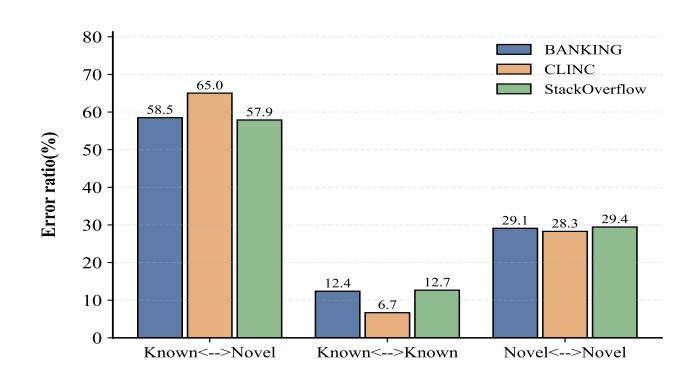
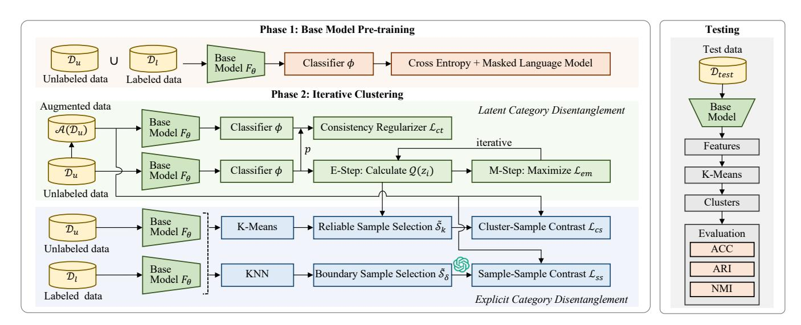
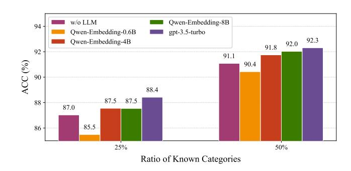
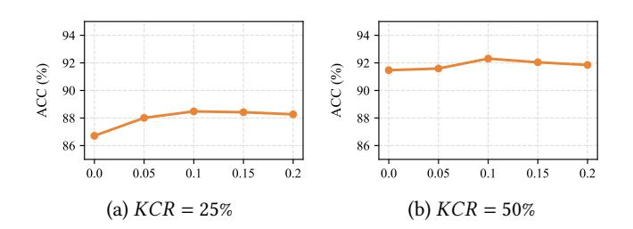
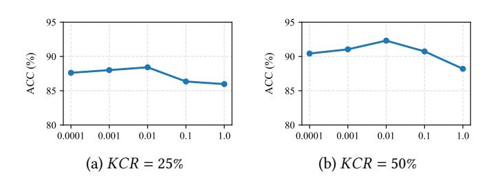

# Expectation-Maximization Driven Contrastive Disentanglement for Generalized Category Discovery

[Weiyi Yang](https://orcid.org/0009-0009-9166-1739) School of Computer Science and Engineering, Beihang University Beijing, China yangweiyi@buaa.edu.cn

[Richong Zhang](https://orcid.org/0000-0002-1207-0300)∗ School of Computer Science and Engineering, Beihang University Beijing, China zhangrc@act.buaa.edu.cn

[Junfan Chen](https://orcid.org/0000-0001-6807-0089) School of Software, Beihang University Beijing, China chenjf@act.buaa.edu.cn

[Jiawei Sheng](https://orcid.org/0000-0002-4865-982X) Institute of Information Engineering, Chinese Academy of Sciences Beijing, China shengjiawei@iie.ac.cn

[Lihong Wang](https://orcid.org/0000-0003-0179-2364) National Computer Network Emergency Response Technical Team / Coordination Center of China Beijing, China wlh@isc.org.com

# Abstract

Generalized Category Discovery (GCD) is a critical task in openworld computing scenarios, aiming to automatically classify partially labeled data by recognizing both known and novel categories. However, existing GCD methods usually suffer from inherent bias toward known categories due to the exclusive pretraining on them and the absence of labeled data of novel categories. This bias can lead to significant misclassification and clustering errors for novel categories. Although recent approaches leverage pseudo-label training and contrastive learning to address this, they still lack explicit supervision to disentangle novel and known categories, resulting in performance bottlenecks. To address these limitations, we propose an Expectation-Maximization-driven Contrastive Disentanglement (EMCD) framework designed to explicitly disentangle novel and known categories. We particularly formulate the identification of novel categories as a latent variable estimation problem. Specifically, it incorporates an EM-disentangling regularization to softly identify novel category samples and a consistency regularization to enhance generalization. In addition, we leverage dual contrastive constraints, including a cluster-sample contrastive constraint and a sample-sample contrastive contrastive, to pull close samples of novel categories while pushing apart ambiguous samples near decision boundaries. Empirical results on 3 commonly used datasets demonstrate that our model is effective and outperforms previous state-of-the-art methods. Our code is available at [https://github.com/YWY-only/EMCD.](https://github.com/YWY-only/EMCD)

### CCS Concepts

• Computing methodologies → Natural language processing; Semi-supervised learning settings.

∗Corresponding authors.

[This work is licensed under a Creative Commons Attribution 4.0 International License.](https://creativecommons.org/licenses/by/4.0) WWW '26, Dubai, United Arab Emirates © 2026 Copyright held by the owner/author(s). ACM ISBN 979-8-4007-2307-0/2026/04 <https://doi.org/10.1145/3774904.3792255>

# Keywords

Generalized Category Discovery, Expectation-Maximization, Contrastive Learning, Category Disentanglement

### ACM Reference Format:

Weiyi Yang, Richong Zhang, Junfan Chen, Jiawei Sheng, and Lihong Wang. 2026. Expectation-Maximization Driven Contrastive Disentanglement for Generalized Category Discovery. In Proceedings of the ACM Web Conference 2026 (WWW '26), April 13–17, 2026, Dubai, United Arab Emirates. ACM, New York, NY, USA, [10](#page-9-0) pages.<https://doi.org/10.1145/3774904.3792255>

# 1 Introduction

Generalized Category Discovery (GCD) serves as a central task in open-world computing scenarios [\[16,](#page-8-0) [26\]](#page-8-1), with the aim of automating the classification of partially labeled data. Specifically, the task aims not only to recognize known categories, but also to discover completely novel categories, using a mix of small labeled data and large unlabeled data [\[4,](#page-8-2) [15\]](#page-8-3). This capability mirrors the dynamic evolution of real-world data, where emerging categories require adaptive continuous learning frameworks.

Most existing GCD methods [\[1,](#page-8-4) [2,](#page-8-5) [16,](#page-8-0) [26\]](#page-8-1) follow a two-stage pipeline: First, they pre-train a model (e.g., BERT [\[9\]](#page-8-6)) using both supervised learning on labeled data and self-supervised learning on unlabeled data. Then, clustering algorithms (e.g., K-Means) are applied to group samples into known and novel categories. However, as illustrated in Figure [1,](#page-1-0) this paradigm suffers from three types of critical error, particularly within novel categories. A fundamental challenge stems from the model's inherent bias toward known categories, due to the exclusive pre-training on them, coupled with the absence of supervision for novel categories. Consequently, samples from novel categories are frequently misclassified as known categories or incorrectly clustered with other novel categories, which severely impedes the effective discovery of novel categories.

To address model bias and acquire knowledge about novel categories from unlabeled data, previous studies explore pseudo-label training [\[16,](#page-8-0) [25,](#page-8-7) [28\]](#page-8-8) and contrastive learning methods [\[13,](#page-8-9) [26,](#page-8-1) [29\]](#page-8-10). Among them, contrastive learning-based methods become a dominant GCD paradigm, which learn discriminative representations through minimizing intra-class variance and maximizing inter-class

Figure 1: Error ratios (%) of a pre-trained classifier on three datasets. **Known**↔**Novel** denotes samples from known categories and novel categories are misclassified. **Known**↔**Known** denotes internal misclassification of samples within known categories. **Novel**↔**Novel** denotes internal misclassification of samples within novel categories.

separation. To further distinguish different categories, An et al. [\[1\]](#page-8-4) implement neighborhood contrastive learning with LLMs, focusing on unlabeled samples near decision boundaries. Moreover, An et al. [\[2\]](#page-8-5) employ category prototypes to measure category similarities and facilitate knowledge transfer. Nevertheless, these methods lack an explicit distinction supervision between novel and known categories, which can still suffer from the bias towards known categories, leading to tangling and confusion between them.

Unlike the previous methods, we propose an explicit learning framework to disentangle novel and known categories. Specifically, we formulate the identification of novel categories as a latent variable estimation problem. We initially separate novel and known categories using an entropy-based criterion, where samples from novel categories typically exhibit higher predictive entropy under the classifier trained solely on known categories. This entropy measure is then used as a supervision signal to guide the learning of the latent variable. The above learning process is achieved by an Expectation-Maximization (EM) algorithm, which iteratively refines the latent variable estimation by maximizing the expected likelihood of novel category identification. In this way, the model explicitly learns to discriminate between novel and known categories, thereby alleviating the confusion between them.

Following the above idea, we propose an EM-driven Contrastive Disentanglement framework for GCD, namely EMCD. Based on the pre-trained base model, we propose a latent category disentanglement module to distinguish novel and known categories. In particular, it contains an EM-disentangling regularization to softly identify samples of novel categories, and an imposed consistency regularization to improve the generalizability of the EM disentanglement. On the other hand, we also propose an explicit category disentanglement module to further improve representation clustering. Specifically, we devise a cluster-sample contrastive constraint to pull close the samples of novel categories, and a sample-sample contrastive constraint is also imposed on the samples near category decision boundaries, pulling apart different categories. The main contributions of this work can be summarized as follows:

- We propose an EM-driven contrastive disentanglement GCD framework, EMCD, to disentangle novel and known categories, which alleviates the critical bias towards known categories.
- To further disentangle different categories in clustering, we devise a cluster-sample contrastive constraint and a sample-sample contrastive constraint, pulling close the samples of novel categories and pulling apart between different categories.
- Empirical studies indicate that our model outperforms previous state-of-the-art methods on 3 commonly-used benchmarks, and our model version without LLMs can even achieve competitive results with existing LLM-based methods.

### 2 Related Work

In this section, we introduce the background of the generalized category discovery and the expectation-maximization algorithm.

### 2.1 Generalized Category Discovery

Generalized Category Discovery (GCD) was proposed and widely studied in both NLP [\[3,](#page-8-11) [26\]](#page-8-1)and computer vision [\[21,](#page-8-12) [22\]](#page-8-13). GCD is a recently emerged task that addresses a realistic scenario where only limited labeled data are available and novel categories may emerge, with the goal of automatically clustering all unlabeled data from both known and novel categories. Pioneering works [\[1,](#page-8-4) [15,](#page-8-3) [21,](#page-8-12) [22\]](#page-8-13) mainly employ a two-stage scheme involving base model pretraining and iterative optimization followed by clustering methods such as K-Means. To address model bias and enhance the acquisition of knowledge about novel categories from unlabeled data, there exist two major practices:

- Pseudo-labeling based methods [\[16,](#page-8-0) [25,](#page-8-7) [28\]](#page-8-8) pseudo labels for unlabeled data based on pretrained embeddings. For example, [\[18\]](#page-8-14) proposed transferring knowledge from known to novel categories through label adjustment.
- Contrastive learning based methods [\[1,](#page-8-4) [13,](#page-8-9) [14,](#page-8-15) [26,](#page-8-1) [27,](#page-8-16) [29\]](#page-8-10) learn text sample embeddings by different clustering strategies. For example, Zhang et al. [\[26\]](#page-8-1) addresses the clustering inconsistency problem by using an alignment strategy to learn text embeddings.

Although these methods are all aimed at alleviating the bias of novel categories towards known categories, they implicitly enhance the distinguishability between known and unknown categories. Due to persistent bias, suboptimal results are achieved in novel categories. However, our method converts this problem into an explicit solvable one through the hope maximization of latent variables.

# 2.2 Expectation-Maximization Algorithm

The Expectation-Maximization (EM) algorithm is an iterative approach for parameter estimation in statistical models that incorporate latent variables. In cases where the true values of these latent variables remain unknown, maximum likelihood estimation (MLE) cannot be used to identify the model parameters. Instead, the EM algorithm uses Jensen's inequality to maximize the lower bound of

where L���� = L���� + L���� is the contrastive loss in explicit disentanglement, and �� and �� are harmonious factors to balance losses. For prediction, we obtain representations of all samples, and perform K-mean clustering to assign categories.

Table 1: Statistics of the benchmark datasets.

| Dataset       | Domain       | ��  | Samples |
|---------------|--------------|-----|---------|
| BANKING       | BANKING      | 77  | 13,083  |
| CLINC         | Multi-Domain | 150 | 22500   |
| StackOverflow | Programming  | 20  | 22000   |

### 5 Experiment Setup

In this section, we conduct experiments to evaluate our proposed EMCD model with existing state-of-the-art methods.

### 5.1 Datasets

We evaluate our proposed model on three standard Generalized Category Discovery (GCD) benchmarks:

- BANKING [\[6\]](#page-8-26) is a fine-grained intent dataset constructed from banking domain user dialogues, comprising over 13,000 utterances across 77 distinct categories.
- CLINC [\[12\]](#page-8-27) is a multi-domain dataset spanning 10 domains, containing 22,500 utterances over 150 intent categories.
- StackOverflow [\[23\]](#page-8-28) is a technical Q&A dataset sourced from Kaggle, including 20,000 questions categorized into 20 topics.

Following the established experimental protocol [\[15\]](#page-8-3), we treat 25% or 50% of the categories as the known category rate (KCR), with 10% of the data serving as labeled samples. We use all data for testing. The detailed dataset statistics and splits are summarized in Table [1.](#page-5-0)

# 5.2 Baselines

We conduct a comprehensive comparison of our model against a range of state-of-the-art methods, which we group into two primary categories based on their core methodologies: Contrastive Learning-based Models:

- DeepAligned [\[26\]](#page-8-1) addresses clustering inconsistency through a text embedding alignment strategy in semi-supervised learning.
- MTP-CLNN [\[29\]](#page-8-10) employs a two-stage approach using multitask pre-training and nearest-neighbor contrastive learning to identify new categories.
- USNID [\[27\]](#page-8-16) utilizes a centroid initialization strategy leveraging historical clustering information to improve cluster representations in both semi-supervised and unsupervised settings.
- CsePL [\[13\]](#page-8-9) introduces a two-level contrastive learning framework with label semantic alignment and soft prompting for novel intent discovery.
- LOOP [\[1\]](#page-8-4) uses refined neighborhood contrastive learning to enhance sample proximity and clustering-friendly representations.
- SynCID [\[14\]](#page-8-15) uses LLMs to refine utterances and intent labels, improving semantic depth and correcting cluster distortions in feature space.

Pseudo-labeling-based Models:

- ProbNID [\[31\]](#page-8-20) proposes a probabilistic framework to assign intent pseudo-labels as latent variables.
- ALUP [\[15\]](#page-8-3) integrates LLM feedback into active learning, with uncertainty propagation selecting high-uncertainty samples for comparison-based labeling.

All the experimental results in Table [2](#page-6-0) for these baseline models are obtained from the benchmark dataset reported in Liang et al. [\[15\]](#page-8-3). For a fair comparison, we use the same base model and K-means clustering as the baselines.

## 5.3 Evaluation Metrics

We evaluate our model, EMCD using three standard metrics: Accuracy (ACC) via the Hungarian algorithm, Adjusted Rand Index (ARI), and Normalized Mutual Information (NMI). Detailed definitions are provided in Appendix [A.1,](#page-8-29) with ACC serving as the primary metric where higher values indicate better performance.

# 5.4 Implementation Details

For the fair comparison, we use the pre-trained bert-base-uncased model [\[10\]](#page-8-30), featuring a 12-layer transformer architecture, as the foundational SLM for training. The GPT3.5 Turbo API and Qwen3- Embedding are used as the LLM and random token replace is used for data augmentation, following previous works [\[1,](#page-8-4) [29\]](#page-8-10). The pretraining epoch is set to 100 and the training epoch is set to 50. The learning rate for pretraining and training is set to 5�� − 5 and 1�� − 5, respectively. For masked language modeling, the mask probability is set to 0.15. For hyper-parameters of the second training process, the threshold �� is tuned in [0, 1]. The temperature parameters ��1 and ��2 are tuned in [0.01, 0.09]. The harmonic factor �� is tuned in {0.0001, 0.001, 0.01, 0.1, 1} and �� is tuned in [0,1]. Note that the hyper-parameter settings are tuned on the test data by grid search with 3 trials. The detailed optimal hyper-parameters are provided in Appendix [A.2](#page-9-1) for re-implementation.

# 6 Overall Results

# 6.1 Main Results

Table [2](#page-6-0) presents the principal results of our proposed model compared to the existing baseline methods on GCD. We evaluated the performance of our framework across multiple datasets, including the single-domain, fine-grained BANKING and Stack Overflow datasets, and the multi-domain CLINC dataset. The results demonstrate that our model achieves superior performance in the majority of datasets and evaluation metrics, confirming its overall effectiveness. Specifically, our approach consistently outperforms all existing baselines by a considerable margin in most scenarios. Comparing to NMI that quantifies clustering consistency, EMCD has a large improvement in NMI via EM-driven contrastive disentanglement. This indicates that our model exhibits enhanced capability in novel category discovery and effectively mitigates the bias towards known categories. We analyze the results as follows:

- Comparison of different traditional methods: EMCD (��/�� LLMs) denotes the results of our model without incorporating large language modules, ensuring a fair comparison with traditional methods. Our model was evaluated against two major categories of representative mainstream methods. The results demonstrate

Table 2: Main performance results (%) on GCD across three public datasets: clinc, banking and stackoverflow. KCR denotes the known category rate. Results are averaged over three random runs. The state-of-the-art (SOTA) results of the existing methods are underlined. † denotes that the method uses LLM.

| KCR Method           | ACC     | CLINC ARI | NMI   | ACC   | BANKING ARI | NMI   | ACC   | StackOverflow ARI | NMI   | AVG ACC |
|----------------------|---------|-----------|-------|-------|-------------|-------|-------|-------------------|-------|---------|
| DeepAligned          | 74.07   | 64.63     | 88.97 | 49.08 | 37.62       | 70.50 | 54.50 | 37.96             | 50.86 | 59.22   |
| MTP_CLNN             | 83.26   | 76.20     | 93.17 | 65.06 | 52.91       | 80.04 | 74.70 | 54.80             | 73.35 | 74.34   |
| ProbNID              | 71.56   | 63.25     | 89.21 | 55.75 | 44.25       | 74.37 | 54.10 | 38.10             | 53.70 | 60.47   |
| USNID                | 83.12   | 77.95     | 94.17 | 65.85 | 56.53       | 81.94 | 75.76 | 65.45             | 74.91 | 74.91   |
| CsePL                | 86.16   | 79.65     | 94.07 | 71.06 | 60.36       | 83.22 | 79.47 | 64.92             | 74.88 | 78.90   |
| Loop †               |         |           |       |       |             |       |       |                   |       |         |
|                      | 86.58   | 80.67     | 94.38 | 71.40 | 60.95       | 83.37 | 82.20 | 66.29             | 79.10 | 80.06   |
| ALUP †               |         |           |       |       |             |       |       |                   |       |         |
|                      | 88.40   | 82.44     | 94.84 | 74.61 | 62.64       | 84.06 | 82.20 | 64.54             | 76.58 | 81.73   |
| SynCID †             |         |           |       |       |             |       |       |                   |       |         |
|                      | 87.85   | 82.39     | 94.85 | 75.41 | 65.40       | 85.39 | 87.86 | 76.11             | 82.46 | 83.71   |
| Ours ( �� / �������� | ) 86.84 | 81.00     | 94.43 | 72.24 | 60.49       | 83.84 | 86.70 | 72.94             | 81.98 | 81.93   |
| Ours †               | 88.42   | 82.49     | 94.99 | 75.83 | 64.74       | 86.32 | 88.11 | 76.76             | 83.64 | 84.12   |
| DeepAligned          | 80.70   | 72.56     | 91.59 | 59.38 | 47.95       | 76.67 | 74.52 | 57.62             | 68.28 | 71.53   |
| MTP_CLNN             | 86.18   | 80.17     | 94.30 | 70.97 | 60.17       | 83.42 | 80.36 | 62.24             | 76.66 | 79.17   |
| ProbNID              | 82.62   | 75.27     | 92.72 | 63.02 | 50.42       | 77.95 | 73.20 | 62.46             | 74.54 | 72.95   |
| USNID                | 87.22   | 82.87     | 95.45 | 73.27 | 63.77       | 85.05 | 82.06 | 71.63             | 78.77 | 80.85   |
| CsePL                | 88.66   | 83.14     | 95.09 | 76.94 | 66.66       | 85.65 | 85.68 | 71.99             | 80.28 | 83.76   |
| Loop †               |         |           |       |       |             |       |       |                   |       |         |
|                      | 90.98   | 85.15     | 95.59 | 75.06 | 65.70       | 85.43 | 85.90 | 72.45             | 80.56 | 83.98   |
| ALUP †               |         |           |       |       |             |       |       |                   |       |         |
|                      | 90.53   | 84.84     | 95.97 | 79.45 | 68.78       | 86.79 | 86.70 | 73.85             | 81.45 | 85.56   |
| SynCID †             |         |           |       |       |             |       |       |                   |       |         |
|                      | 90.64   | 85.96     | 95.91 | 77.83 | 67.67       | 86.33 | 88.40 | 77.24             | 83.34 | 85.62   |
| Ours ( �� / �������� | ) 91.08 | 86.57     | 96.17 | 77.42 | 67.31       | 86.05 | 86.64 | 76.64             | 82.53 | 85.05   |
| Ours †               | 92.31   | 87.41     | 96.44 | 78.25 | 67.72       | 86.34 | 89.40 | 78.92             | 85.04 | 86.65   |

that our method surpasses all traditional baselines; particularly in the CLINC dataset, it outperforms the conventional CesPL method by a margin of 2.42% in accuracy, even exceeding the sota result, which leverages large language models.

- Comparison of different methods with LLMs: EMCD demonstrates significantly superior performance compared to its variant without large language models (EMCD w/o LLM). When utilizing the same base large language model, our approach outperforms other LLM-enhanced baseline methods, including Loop, ALUP, and SynCID. This indicates that our Expectation-Maximization (EM) disentanglement process effectively enhances the model's capability in novel category discovery tasks. Notably, even without employing any large language model, our method surpasses the LLM-based approaches Loop and SynCID across all three datasets when the known category ratio (KCR) is set to 50%.

### 6.2 Ablation Study

To assess the contribution of each component, an ablation study was conducted on the CLINC dataset through the individual removal of constituent modules. The corresponding results, averaged over three independent runs on test dateset under the conditions of ������ = 25% and ������ = 50%, are summarized in Table [3.](#page-6-1)

Since existing methods [\[2,](#page-8-5) [4,](#page-8-2) [15\]](#page-8-3) have established that base model pre-training is fundamental to GCD, our experiments are confined to the ablation of subsequent modules. The architecture incorporates two primary modules: Latent Category Disentanglement module and Explicit Category Disentanglement module. Notably, the

Table 3: Ablation results on the CLINC dataset.

| KCR  | Ablation       | ACC   | CLINC ARI | NMI   |
|------|----------------|-------|-----------|-------|
| EMCD |                | 88.42 | 82.49     | 94.99 |
| w/o  | EM             | 80.04 | 73.90     | 92.66 |
| w/o  | sample-sample  | 84.93 | 78.99     | 93.92 |
| w/o  | cluster-sample | 86.71 | 81.14     | 93.54 |
| EMCD |                | 92.31 | 87.41     | 96.44 |
| w/o  | EM             | 90.49 | 86.68     | 96.32 |
| w/o  | sample-sample  | 89.42 | 85.63     | 96.04 |
| w/o  | cluster-sample | 91.47 | 87.62     | 96.42 |

Explicit Category Disentanglement module is composed of two constituent components: the Cluster-Sample Contrastive Constraint module and the Sample-Sample Contrastive Constraint module. As evidenced by the results, the performance declined after the removal of each individual module, regardless of whether under the ������ = 25% or 50% setting. Notably, under the ������ = 25% condition, removing the Expectation-Maximization Driven Contrastive Disentanglement module, led to a performance decrease of 8.38%.

# 6.3 Effect of Different LLMs

To vertify different selection strategies, we evaluates three strategic implementations within the sample-to-sample contrastive learning

Figure 3: Results of different stategies to select refined samples on CLINC.

module on the CLINC benchmark: a baseline without large language model integration, an approach incorporating a lightweight clustering LLM, and a method utilizing a proprietary LLM. The superior performance of state-of-the-art GCD techniques stems from their use of LLMs to supply supervisory signals for novel categories, which are inherently unlabeled. Accordingly, we compare our framework against the dominant paradigm of API-based access to proprietary LLMs. To maintain comparability, the widelyused GPT-3.5 Turbo serves as the reference proprietary model in our experiments. For the lightweight LLM, we adopt the Qwen-Embedding model [\[24\]](#page-8-25), fine-tuned specifically for our task.

As shown in Figure [3,](#page-7-0) the variant employing the proprietary LLM achieves the best performance under all KCR settings. Notably, even without any LLM, our baseline remains competitive with LLMbased variants. In particular, under ������ = 50%, the gap between the lightweight Qwen-Embedding-8B and proprietary GPT-3.5 Turbo is only 0.3%, underscoring the practical efficiency of our approach.

Table 4: Error Rates across Different Data Types on CLINC.

| KCR | Method   | Known | Novel | K ↔ N |
|-----|----------|-------|-------|-------|
|     | Pretrain | 16.32 | 35.12 | 26.50 |
|     | CsePL    | 7.42  | 15.98 | 10.54 |
| 25% | LOOP     | 6.36  | 15.69 | 9.63  |
|     | Ours     | 7.76  | 14.71 | 6.48  |
|     | Pretrain | 13.24 | 26.67 | 19.91 |
|     | CsePL    | 6.76  | 16.71 | 8.53  |
| 50% | LOOP     | 3.91  | 15.56 | 8.59  |
|     | Ours     | 5.51  | 9.47  | 4.90  |

### 6.4 Error Analysis

In this section, we perform an error analysis to examine the bias toward known categories and to evaluate the effectiveness of our proposed method. As shown in Table [4,](#page-7-1) we present the ratio of novel samples that are misclassified as known samples by the model. In Table [4,](#page-7-1) "Known" denotes the error rate for known categories, "Novel" indicates the error rate for novel categories, and "K↔N" denotes the entanglement error between known and novel categories.

For comparison, we include state-of-the-art methods CsePL (without LLM) and LOOP on CLINC. Results indicate that the GCD task has novel error 35.12% and and "known and novel" distanglement error 26.5% due to the lack of supervision for novel categories. Even LLM-based methods show no significant improvement in disentanglement errors between known and novel categories. In contrast, our approach achieves consistently lower error rates for novel categories and for disentanglement between known and novel categories, under both ������ = 25% and ������ = 50% settings.

### 6.5 Impact of Selected Samples Center Ratio ��

The hyper-parameter �� controls the representation sampling ratio, which will used to compute category prototypes. Specifically, a higher �� encourages selecting more samples as center and a lower �� encourages less samples as center. �� is an essential hyper-parameter for our framework to guarantee the accurate categories prototypes. To examine its impact on performance, we conduct experiments with three independent runs under varying known category ratios (KCRs). As shown in Figure [4\(](#page-7-2)a) and (b), results across different KCRs indicate that �� = 0.1 yields the best performance.

Figure 4: Results of different �� on CLINC.

### 7 Conclusion

In this paper, we present an EM driven contrastive disentanglement framework, EMCD, for the GCD task. Existing studies usually suffer from an inherent bias toward known categories, which can lead to significant misclassification and cluster errors for novel categories. To mitigate this limitation, we propose a latent category disentanglement module with EM-disentangling regularization, which explicitly models the distinction between novel and known categories. Besides, we leverage an explicit category disentanglement module, which pulls close samples within the cluster of novel categories, and pushes apart different clusters. Experimental results demonstrate that EMCD outperforms state-of-the-art models, and our model without LLM can even achieve competitive results with existing LLM-based methods. Our future work would further leverage LLMs to enhance the discrimination of novel category samples.

### Acknowledgements

This work was supported by the National Natural Science Foundation of China (No. U23B2056), in part by the National Science and Technology Major Project (No. 2022ZD0120202), in part by Fundamental Research Funds for Central Universities, and in part by the State Key Laboratory of Complex & Critical Software Environment.

References [1] Wenbin An, Wenkai Shi, Feng Tian, Haonan Lin, Qianying Wang, Yaqiang Wu, Mingxiang Cai, Luyan Wang, Yan Chen, Haiping Zhu, et al. 2024. Generalized Category Discovery with Large Language Models in the Loop. In Findings of the Association for Computational Linguistics ACL 2024. 8653–8665. [2] Wenbin An, Feng Tian, Wenkai Shi, Yan Chen, Yaqiang Wu, Qianying Wang, and Ping Chen. 2024. Transfer and alignment network for generalized category discovery. In Proceedings of the AAAI Conference on Artificial Intelligence, Vol. 38. 10856–10864. [3] Wenbin An, Feng Tian, Wenkai Shi, Yan Chen, Qinghua Zheng, Qianying Wang, and Ping Chen. 2023. DNA: Denoised Neighborhood Aggregation for Finegrained Category Discovery. In Proceedings of the 2023 Conference on Empirical Methods in Natural Language Processing. 12292–12302. [4] Wenbin An, Feng Tian, Qinghua Zheng, Wei Ding, QianYing Wang, and Ping Chen. 2023. Generalized category discovery with decoupled prototypical network. In Proceedings of the AAAI conference on artificial intelligence, Vol. 37. 12527– 12535. [5] Philip Bachman, Ouais Alsharif, and Doina Precup. 2014. Learning with pseudoensembles. Advances in neural information processing systems 27 (2014). [6] Iñigo Casanueva, Tadas Temčinas, Daniela Gerz, Matthew Henderson, and Ivan Vulić. 2020. Efficient intent detection with dual sentence encoders. arXiv preprint arXiv:2003.04807 (2020). [7] Olivier Chapelle and Alexander Zien. 2005. Semi-supervised classification by low density separation. In International workshop on artificial intelligence and statistics. PMLR, 57–64. [8] Junfan Chen, Richong Zhang, Junchi Chen, Chunming Hu, and Yongyi Mao. 2023. Open-set semi-supervised text classification with latent outlier softening. In Proceedings of the 29th ACM SIGKDD Conference on Knowledge Discovery and Data Mining. 226–236. [9] Jacob Devlin, Ming-Wei Chang, Kenton Lee, and Kristina Toutanova. 2019. BERT: Pre-training of Deep Bidirectional Transformers for Language Understanding. In Proceedings of the 2019 Conference of the North American Chapter of the Association for Computational Linguistics: Human Language Technologies, Volume 1 (Long and Short Papers). Association for Computational Linguistics, Minneapolis, Minnesota, 4171–4186. [doi:10.18653/v1/N19-1423](https://doi.org/10.18653/v1/N19-1423) [10] Yixiao Ge, Dapeng Chen, and Hongsheng Li. 2020. Mutual mean-teaching: Pseudo label refinery for unsupervised domain adaptation on person re-identification. arXiv preprint arXiv:2001.01526 (2020). [11] Diederik P Kingma and Jimmy Ba. 2014. Adam: A method for stochastic optimization.. In International Conference on Learning Representations. [12] Stefan Larson, Anish Mahendran, Joseph J Peper, Christopher Clarke, Andrew Lee, Parker Hill, Jonathan K Kummerfeld, Kevin Leach, Michael A Laurenzano, Lingjia Tang, et al. 2019. An evaluation dataset for intent classification and out-of-scope prediction. arXiv preprint arXiv:1909.02027 (2019). [13] Jinggui Liang and Lizi Liao. 2023. ClusterPrompt: Cluster Semantic Enhanced Prompt Learning for New Intent Discovery. In Findings of the Association for Computational Linguistics: EMNLP 2023. 10468–10481. [14] Jinggui Liang, Lizi Liao, Hao Fei, and Jing Jiang. 2024. Synergizing large language models and pre-trained smaller models for conversational intent discovery. In Findings of the Association for Computational Linguistics ACL 2024. 14133–14147. [15] Jinggui Liang, Lizi Liao, Hao Fei, Bobo Li, and Jing Jiang. 2024. Actively learn from llms with uncertainty propagation for generalized category discovery. In Proceedings of the 2024 Conference of the North American Chapter of the Association for Computational Linguistics: Human Language Technologies (Volume 1: Long Papers). 7838–7851. [16] Ting-En Lin, Hua Xu, and Hanlei Zhang. 2020. Discovering new intents via constrained deep adaptive clustering with cluster refinement. In Proceedings of the AAAI Conference on Artificial Intelligence, Vol. 34. 8360–8367. [17] Douglas Reynolds. 2015. Gaussian mixture models. In Encyclopedia of biometrics. Springer, 827–832. [18] Wenkai Shi, Wenbin An, Feng Tian, Yan Chen, Yaqiang Wu, Qianying Wang, and Ping Chen. 2024. A unified knowledge transfer network for generalized category discovery. In Proceedings of the AAAI Conference on Artificial Intelligence, Vol. 38. 18961–18969. [19] He Sun, N Jeremy Kasdin, and Robert Vanderbei. 2018. Identification and adaptive control of a high-contrast focal plane wavefront correction system. Journal of Astronomical Telescopes, Instruments, and Systems 4, 4 (2018), 049006–049006. [20] Tim Van Erven and Peter Harremos. 2014. Rényi divergence and Kullback-Leibler divergence. IEEE Transactions on Information Theory 60, 7 (2014), 3797–3820. [21] Sagar Vaze, Kai Han, Andrea Vedaldi, and Andrew Zisserman. 2022. Generalized category discovery. In Proceedings of the IEEE/CVF conference on computer vision and pattern recognition. 7492–7501. [22] Xin Wen, Bingchen Zhao, and Xiaojuan Qi. 2023. Parametric classification for generalized category discovery: A baseline study. In Proceedings of the IEEE/CVF international conference on computer vision. 16590–16600. [23] Jiaming Xu, Peng Wang, Guanhua Tian, Bo Xu, Jun Zhao, Fangyuan Wang, and Hongwei Hao. 2015. Short text clustering via convolutional neural networks. In Proceedings of the 1st Workshop on Vector Space Modeling for Natural Language Processing. 62–69. [24] An Yang, Anfeng Li, Baosong Yang, Beichen Zhang, Binyuan Hui, Bo Zheng, Bowen Yu, Chang Gao, Chengen Huang, Chenxu Lv, et al. 2025. Qwen3 technical report. arXiv preprint arXiv:2505.09388 (2025). [25] Weihao Zeng, Keqing He, Zechen Wang, Dayuan Fu, Guanting Dong, Ruotong Geng, Pei Wang, Jingang Wang, Chaobo Sun, Wei Wu, et al. 2022. Semi-Supervised Knowledge-Grounded Pre-training for Task-Oriented Dialog Systems. In Proceedings of the Towards Semi-Supervised and Reinforced Task-Oriented Dialog Systems (SereTOD). 39–47. [26] Hanlei Zhang, Hua Xu, Ting-En Lin, and Rui Lyu. 2021. Discovering new intents with deep aligned clustering. In Proceedings of the AAAI Conference on Artificial Intelligence, Vol. 35. 14365–14373. [27] Hanlei Zhang, Hua Xu, Xin Wang, Fei Long, and Kai Gao. [n. d.]. USNID: A framework for unsupervised and semi-supervised new intent discovery. ([n. d.]). [28] Jiacheng Zhang, Jiaming Li, Xiangru Lin, Wei Zhang, Xiao Tan, Junyu Han, Errui Ding, Jingdong Wang, and Guanbin Li. 2024. Decoupled pseudo-labeling for semi-supervised monocular 3d object detection. In Proceedings of the IEEE/CVF Conference on Computer Vision and Pattern Recognition. 16923–16932. [29] Yuwei Zhang, Haode Zhang, Li-Ming Zhan, Xiao-Ming Wu, and Albert Lam. 2022. New Intent Discovery with Pre-training and Contrastive Learning. In Proceedings of the 60th Annual Meeting of the Association for Computational Linguistics (Volume 1: Long Papers). 256–269. [30] Zhun Zhong, Enrico Fini, Subhankar Roy, Zhiming Luo, Elisa Ricci, and Nicu Sebe. 2021. Neighborhood contrastive learning for novel class discovery. In Proceedings of the IEEE/CVF conference on computer vision and pattern recognition. 10867–10875. [31] Yunhua Zhou, Guofeng Quan, and Xipeng Qiu. 2023. A probabilistic framework for discovering new intents. In Proceedings of the 61st Annual Meeting of the Association for Computational Linguistics (Volume 1: Long Papers). 3771–3784. A Appendix In this appendix, we provide: (i) the evaluation protocol, and (ii) optimal hyper-parameters. A.1 Evaluation Protocol We evaluate the GCD performance using three standard metrics: Accuracy (ACC) with Hungarian algorithm mapping, Adjusted Rand Index (ARI), and Normalized Mutual Information (NMI) [\[15,](#page-8-3) [29\]](#page-8-10). Accuracy (ACC) measures the proportion of correctly classified samples after resolving label permutations via the Hungarian algorithm as follows: ������ = Í�� ��=1 I���� = ������(��ˆ��) �� , (18) where ���� ,��ˆ�� denote the ground-truth and predicted labels for sample ���� , and ������(·) aligns predicted labels to ground-truth labels using the Hungarian algorithm. Besides, ARI assesses pairwise clustering similarity by comparing agreements against chance, which is defined as: ������ = Í ���� ���� �� 2 − hÍ �� ( ���� ) Í �� ( ���� ) ( ) hÍ ���� + Í ���� 2 i − hÍ �� ( ���� ) Í �� ( ���� ) ( ) , (19) where ���� = Í �� ����,�� , and ���� = Í �� ����,�� . �� denotes the number of all samples. ����,�� is the number of sample pairs that are both assigned to ��th predicted cluster and ��th ground-truth cluster. NMI quantifies clustering consistency via information theory: ������(��, �� ˆ ) = 2 · ��( ˆ (��), ��) ��(��ˆ) + ��(��) , (20) where ��(��, �� ˆ ) is the mutual information between ��ˆ and ��. ��() rep-

resents the entropy function.

Table 5: Detailed hyper-parameters of our EMCD model.

### A.2 Optimal Hyper-parameters

We implement our model with Pytorch[1](#page-9-2) . Experiments are conducted on a server with NVIDIA V100 GPUs. The optimal model is selected according to the average ACC on all datasets by grid-search with three trials. We use Adam [\[11\]](#page-8-31) to learn the model. The tuning ranges of hyper-parameters are reported in the main text. Here, we report the hyper-parameters used in Table [5.](#page-9-3)

### A.3 Impact of Hyper-parameter Correlation Coefficient ��

In our methodology, the hyper-parameter �� is employed as a correlation coefficient to regulate the expectation-maximization (EM)

disentanglement ratio, which governs the balance between prior knowledge integration and data-driven optimization during the disentanglement process. To ensure statistical reliability, all experiments were conducted three times independently on the test set, with consistent outcomes observed across repetitions. As illustrated in Figure [5,](#page-9-4) the results demonstrate that an �� value of 0.01 consistently achieves optimal performance under both scenarios where the known category proportion is set to 25% or 50%. This result indicates that by iteratively refining the estimation of latent variables with a minimal ��, the EM procedure promotes alignment with the latent data structure, thereby alleviating biases towards known categories.

Figure 5: Results of different �� on CLINC.

1https://docs.pytorch.org/docs/stable/index.html