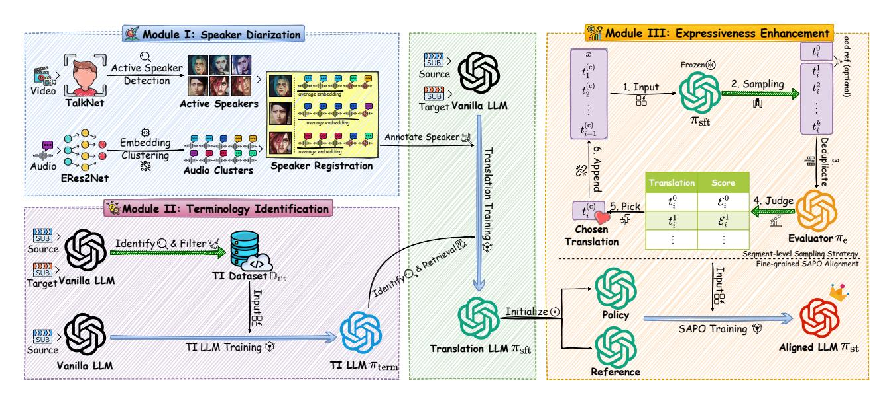
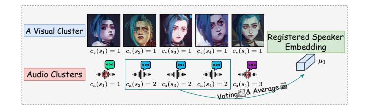
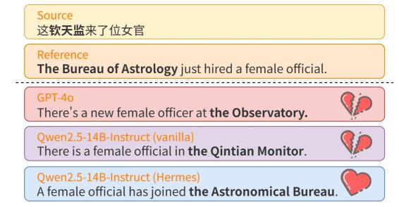
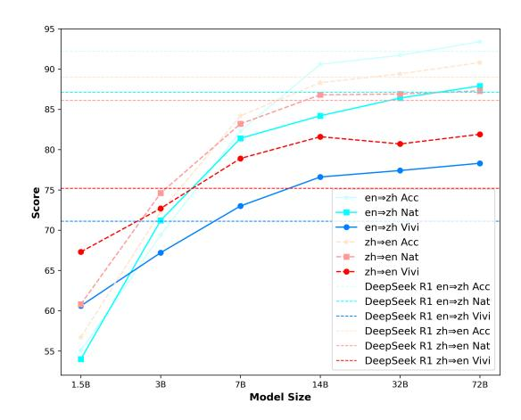
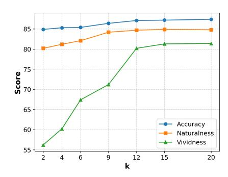
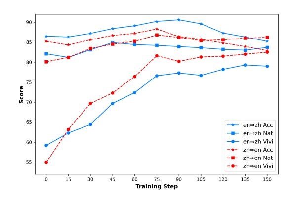
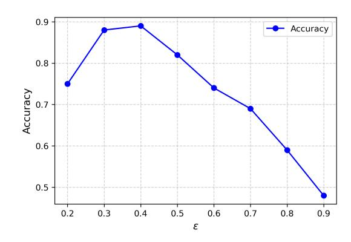
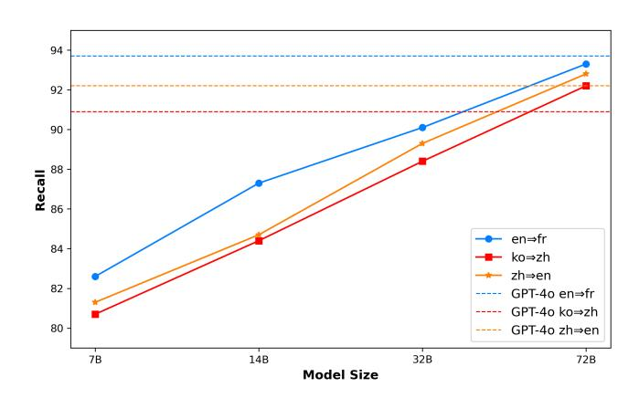
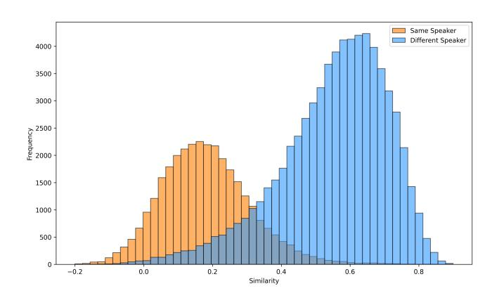

# Hermes the Polyglot: A Unified Framework to Enhance Expressiveness for Multimodal Interlingual Subtitling

Chaoqun Cui MAIS, Institute of Automation, Chinese Academy of Sciences Beijing, China School of AI, University of Chinese Academy of Sciences Beijing, China cuichaoqun2025@ia.ac.cn

Shijing Wang Beijing Jiaotong University Beijing, China Hujing Digital Media & Entertainment Group Beijing, China shijingwang@bjtu.edu.cn

Liangbin Huang Hujing Digital Media & Entertainment Group Beijing, China huangliangbin.hlb@alibaba-inc.com

Qingqing Gu Geely AI lab Ningbo, Zhejiang, China Qingqing.gu3@geely.com

Zhaolong Huang Hujing Digital Media & Entertainment Group Beijing, China zhaolong.hzl@alibaba-inc.com

Xiao Zeng Hujing Digital Media & Entertainment Group Beijing, China zengxiao@alibaba-inc.com

Wenji Mao∗ MAIS, Institute of Automation, Chinese Academy of Sciences Beijing, China School of AI, University of Chinese Academy of Sciences Beijing, China wenji.mao@ia.ac.cn

#### Abstract

Interlingual subtitling, which translates subtitles of visual media into a target language, is essential for entertainment localization but has not yet been explored in machine translation. Although Large Language Models (LLMs) have significantly advanced the general capabilities of machine translation, the distinctive characteristics of subtitle texts pose persistent challenges in interlingual subtitling, particularly regarding semantic coherence, pronoun and terminology translation, and translation expressiveness. To address these issues, we present Hermes, an LLM-based automated subtitling framework. Hermes integrates three modules: Speaker Diarization, Terminology Identification, and Expressiveness Enhancement, which effectively tackle the above challenges. Experiments demonstrate that Hermes achieves state-of-the-art diarization performance and generates expressive, contextually coherent translations, thereby advancing research in interlingual subtitling.

© 2026 Copyright held by the owner/author(s). ACM ISBN 979-8-4007-2307-0/2026/04 <https://doi.org/10.1145/3774904.3792262>

#### CCS Concepts

• Computing methodologies → Machine translation; Discourse, dialogue and pragmatics; Computer vision tasks.

### Keywords

Interlingual Subtitling, Speaker Diarization, Translation Expressiveness

#### ACM Reference Format:

Chaoqun Cui, Shijing Wang, Liangbin Huang, Qingqing Gu, Zhaolong Huang, Xiao Zeng, and Wenji Mao. 2026. Hermes the Polyglot: A Unified Framework to Enhance Expressiveness for Multimodal Interlingual Subtitling. In Proceedings of the ACM Web Conference 2026 (WWW '26), April 13–17, 2026, Dubai, United Arab Emirates. ACM, New York, NY, USA, [12](#page-11-0) pages.<https://doi.org/10.1145/3774904.3792262>

#### 1 Introduction

The interlingual subtitling task aims to translate the subtitles of visual media programs such as films or TV series into the target language, serving as a crucial component of online entertainment program localization [\[20,](#page-8-0) [39,](#page-8-1) [52\]](#page-9-0), while also being a relatively underexplored subfield in machine translation. In recent years, with the rise of streaming and online video platforms such as Netflix and Disney+, along with the globalization and diversification of the visual media industry, the demand for advanced interlingual subtitling technologies has grown substantially. However, despite the rapid development of Large Language Models (LLMs), which has

∗Corresponding author.

[This work is licensed under a Creative Commons Attribution 4.0 International License.](https://creativecommons.org/licenses/by/4.0) WWW '26, Dubai, United Arab Emirates

significantly improved the general capabilities of machine translation [\[18,](#page-8-2) [21\]](#page-8-3), they reveal clear limitations when applied to in-depth tasks like subtitle translation, including insufficient professional terminology translation [\[2,](#page-8-4) [26\]](#page-8-5), deviations from industry standard expressions [\[35,](#page-8-6) [41\]](#page-8-7), and weak style adaptability [\[35,](#page-8-6) [57\]](#page-9-1).

The characteristics of subtitles are: 1) subtitles are composed of dialogues between characters in a program; 2) subtitle lines are short texts with strong contextual connections; 3) subtitle texts are closely tied to video and speech. These features pose specific challenges for subtitle translation: 1) semantic coherence: the limited input token capacity of LLMs prevents feeding an entire subtitle at once, and how multiple lines are segmented directly affects the integrity of LLM's input boundary and the translation coherence; 2) pronoun reference: due to cultural differences, different languages may have distinct pronoun systems (e.g., honorifics in Japanese and Korean, or omission of pronouns in some languages); 3) terminology translation: programs contain numerous specialized terms in visual media, requiring accurate and consistent translation; 4) translation quality: besides accuracy, audiences prefer expressive translations.

In this study, to address these challenges, we present Hermes, an LLM-based interlingual subtitling framework. Hermes integrates three modules: 1) Speaker Diarization (SD): combining visual and speech modalities to annotate speakers (characters) in visual media scenarios, thereby addressing line segmentation and pronoun translation; 2) Terminology Identification (TI): employing LLM knowledge distillation to identify and translate proper nouns in subtitles; 3) Expressiveness Enhancement (EE): proposing Segment-wise Adaptive Preference Optimization (SAPO) method with LLM-as-a-Judge to enhance the translation expressiveness. Expressiveness refers to that, on the premise of conveying the original meaning (accuracy), the translation should also conform to the grammatical and cultural conventions of the target language (naturalness), and be able to convey stylistic information such as the emotion, tone, and atmosphere of the original text (vividness) [\[14,](#page-8-8) [44\]](#page-8-9).

In summary, the contributions of this study are as follows:

- We define interlingual subtitling as a multimodal machine translation task and systematically identify the unique challenges this task faces in practical applications.
- We propose Hermes, an LLM-based subtitling framework supported by prior information from visual and audio modalities and specific preference optimization technique.
- We construct a multidimensional evaluation framework based on LLM-as-a-Judge for interlingual subtitling.
- Experimental results demonstrate the excellent performance of Hermes on the interlingual subtitling task.

### 2 Task Definition and Notations

The interlingual subtitling task aims to translate subtitles of visual media programs from the source language into the target language, playing a crucial role in making multimedia content more searchable, comprehensible, and shareable in the global web environment. It takes video, speech, and subtitle lines as input and outputs subtitle lines in the target language. A bilingual dataset D for subtitle translation encompasses source language line set Lsrc and target language line set Ltgt from multiple programs, expressed as D ≡ {(��, ��) ∈ Lsrc × Ltgt}. We collect and release multilingual parallel subtitle corpora from the online video platform Youku. See Appendix [C](#page-10-0) for details of this dataset.

Hermes leverages the dataset D to train a subtitle translation LLM ��st. The input prompt �� to ��st comprises a context C and a set of �� source lines {���� | �� = 1, · · · , ��} to be translated, formally expressed as �� ≡ C ⊕ {���� }. Beyond introduction and instruction text, C also includes prescribed term translations and character feature descriptions, which are the outputs of SD and TI modules. The response �� generated by ��st consists of translations corresponding to each line, represented as {���� | �� = 1, · · · , ��}, i.e., �� ≡ {���� }. Detailed examples of prompt and response are provided in our [Supplementary Material](https://github.com/CcQunResearch/Hermes/blob/main/Reproducibility%20Supplementary%20Material.pdf) (2.1).

### 3 Proposed Framework

We present the overall design of Hermes in Figure [1.](#page-2-0) Speaker Diarization and Terminology Identification modules provide essential prior information. Subsequently, in Expressiveness Enhancement module, we employ SAPO technique to enhance the expressiveness of the translations, thereby obtaining the final translation LLM ��st.

#### 3.1 Speaker Diarization

3.1.1 Overview. In most genres of visual media programs such as film and TV series, subtitles consist of dialogues between multiple characters, and annotating the speaker for each line helps improve the accuracy of translating personal pronouns. Moreover, lines are closely contextually connected [\[36,](#page-8-10) [55\]](#page-9-2), so when performing subtitle translation, it is preferable to feed LLMs with consecutive lines rather than translating them sentence by sentence. However, given that the input length of LLMs is usually limited, it is challenging to feed the complete subtitles of a program into the LLM all at once; thus, properly segmenting the lines is crucial to maintaining contextual completeness in LLM input. Through SD module of Hermes, we can: (1) improve the accuracy of personal pronouns; and

(2) segment lines while ensuring contextual integrity and coherence. The visual modality can leverage high-accuracy face-related technologies but faces the audio-visual asynchrony problem, where a portion of lines (about 35% in our test set) are delivered while the speaker is not visible on screen. In contrast, the speech modality does not suffer from this issue, but speech technologies generally have lower accuracy compared to face-related techniques. Moreover, in existing studies, speaker diarization [\[10,](#page-8-11) [53\]](#page-9-3) typically assumes predefined speaker information, whereas in our scenario the exact number of speakers is uncertain. Therefore, SD module aims to integrate both visual and speech modalities of the lines to perform speaker registration and annotation.

3.1.2 Feature Clustering. For visual modality, we utilize subtitle timing notes in dataset D for a given line �� ∈ Lsrc (example subtitle format in Table [10\)](#page-10-1) to extract its corresponding video segment. We employ TalkNet [\[49\]](#page-9-4) to detect and extract the active speaker from the video frames. Lines for which no active speaker is detected are reserved for subsequent processing. For lines where an active speaker is detected, we extract the face embedding ��v (��) (produced by CurricularFace model [\[27\]](#page-8-12)) and perform clustering (e.g., spectral clustering [\[50\]](#page-9-5)) to assign each line a visual cluster label ��v (��) ∈ {1, · · · , ��v}, where ��v denotes the number of visual clusters. For the speech modality, we similarly use the subtitle

Table 1: The new speaker supplementation process. Similarity represents the timbre embedding similarity of adjacent lines.

| Group | Line                                                     | Similarity  | Active | �� ( �� )   | �� ( �� ) | Operation                     |
|-------|----------------------------------------------------------|-------------|--------|-------------|-----------|-------------------------------|
|       | I’m always with you.                                     |             | ✓      | 1.0         |           |                               |
|       | Even when we’re worlds apart.                            | 0.632       | ✓      | 1.0         | 1.0       |                               |
|       | They want better lives, but emotion clashes with reason. | 0.231 0.673 | ✗ ✗    | 0.179 0.244 | 0.216     | Register new speaker          |
| 3     | There is beauty in imperfections.                        | 0.179       | ✓      | 1.0         | 1.0       |                               |
|       | I admired about you.                                     | 0.215       | ✗      | 0.303       |           |                               |
|       |                                                          |             |        |             |           | Register new speaker or merge |
|       | There is no prize to perfection.                         | 0.731       | ✗      | 0.257       |           | with existing new speakers    |

program are crucial for the viewing experience. As a specialized domain corpus, a visual media program often includes rare words or proper nouns whose meanings are highly dependent on the context. Therefore, we leverage bilingual parallel corpora and the incontext learning (ICL) capability of LLMs to construct a terminology identification training set, which is then used to train an LLM to understand and translate proper nouns in subtitles.

3.2.2 Terminology LLM Training. We employ an off-the-shelf LLM �� (Qwen-Max) to one-shot detect terms, their types, and translations from bilingual lines (��, ��) in the dataset D. Using the speaker turns annotated by SD module as boundaries, we segment the lines into groups, where a group contains �� lines���� and their translations ���� .The input of �� is ��ˆ ≡ C ⊕ {���� , ���� }, where C includes text such as the introduction, instructions, and one-shot examples that guide the LLM to identify terms. The output of the LLM consists of the identified term �� from ���� , ���� , its type tp(��), and its translation tr(��).

In a program, a given term may appear multiple times, with its type varying due to the randomness of LLM generation, and its translation differing because of factors such as abbreviations or aliases in the line. Therefore, for the raw candidate results identified by the LLM, Traw ≡ {(��, tp(��), tr(��))}, we apply filtering and voting to determine the type and translation of each term, yielding Tfilter ≡ {(��, tp(c)(��), tr(c)(��))}. Next, we use a Trie (prefix tree) to retrieve the terms appearing in the source language lines Lsrc from Tfilter, and then construct the dataset Dˆ for training the terminology LLM ��term (Qwen2.5-14B). The input of ��term is ��ˆ ≡ C ⊕ {���� }, and its response is the terminology retrieved from {���� }, i.e., ��ˆ ≡ {(��, tp(c)(��), tr(c)(��))}. Algorithm [1](#page-3-1) provides a detailed description of the entire training process of ��term. The prompt and response of the LLM are presented in [Supplementary Material](https://github.com/CcQunResearch/Hermes/blob/main/Reproducibility%20Supplementary%20Material.pdf) (2.2).

In practice, ICL can identify terms in subtitles with a high recall (96.9% on a test set containing 20 programs with annotated terms), but it cannot provide suitable translations (note that only monolingual subtitles are available during inference). This is because certain rare nouns appear in special types of programs (e.g., Fantasy, Sci-Fi, Period Drama). Our TI module, which adopts a knowledge distillation-like approach, can effectively enhance the LLM's ability to translate terminology in visual media domain (as shown in Figure [3\)](#page-3-2). See [Supplementary Material](https://github.com/CcQunResearch/Hermes/blob/main/Reproducibility%20Supplementary%20Material.pdf) (1.2) for more details of TI.

### 3.3 Expressiveness Enhancement

3.3.1 Overview. Subtitle translation places customized requirements on translation quality. Existing studies[\[14,](#page-8-8) [44,](#page-8-9) [45\]](#page-8-14) show that the degree of literal and liberal translation in human translated corpora varies significantly across domains. Domains like visual

Figure 3: A **zh**⇒**en** terminology example. "钦天监" is an ancient Chinese institution responsible for astronomical observations, calendar compilation, and weather prediction.

media, literature, and religion exhibit a stronger tendency toward liberal translation compared to legislation, news, and medicine. The former emphasize the expressiveness of the translation, while the latter, containing more technical or formal texts, emphasize accuracy. Therefore, our goal is to enhance the expressiveness of translations. Previous studies [\[22,](#page-8-15) [31\]](#page-8-16) have shown that LLMs can serve as reliable evaluators of translation accuracy. Based on the previous work [\[16\]](#page-8-17), we propose SAPO to enhance the expressiveness of subtitle translation. We employ DeepSeek-V3.1 as the reward model and leverage segment-wise sampling and a fine-grained alignment loss to train an expressive translation model ��st.

3.3.2 Translation Model Training. SD and TI modules provide prior information for lines, such as character annotations and terminology translations. We then train a subtitle translation model ��sft

| Line                                                                        | Score |
|-----------------------------------------------------------------------------|-------|
| 越 是 光 芒 万丈 的 人 ， 越 会 更 快 地 燃 尽 生 命 的 能 量 。                                  |       |
| People who shine brightly will use up their life energy quickly.            | 70    |
| The brighter one shines, the faster one burns out.                          | 90    |
| The more dazzling a person is, the sooner they exhaust their life’s energy. | 85    |
| Those who radiate the brightest light consume their life force the fastest. | 88    |
| The greater the brilliance, the swifter the flame fades.                    | 92    |

- MADLAD-10B [\[32\]](#page-8-23), released by Google Research, supports translation across more than 450 languages.
- Google Translate [\[24\]](#page-8-24), a multilingual machine translation service provided by Google.
- GPT-4o, Qwen-Max, and DeepSeek-V3.1, which represent current SOTA chat LLMs.
- GPT-5 Thinking and DeepSeek-R1, which represent current SOTA reason LLMs. We employ the prompts in [Sup](https://github.com/CcQunResearch/Hermes/blob/main/Reproducibility%20Supplementary%20Material.pdf)[plementary Material](https://github.com/CcQunResearch/Hermes/blob/main/Reproducibility%20Supplementary%20Material.pdf) (2.1) to drive these frontier models for subtitle translation.
- Qwen2.5-14B [\[54\]](#page-9-6), which serves as the backbone of Hermes.

Details of the experimental setup are provided in Appendix [B.](#page-9-7) The source code of Hermes and our dataset is available at [https:](https://github.com/CcQunResearch/Hermes) [//github.com/CcQunResearch/Hermes.](https://github.com/CcQunResearch/Hermes)

#### 4.2 Translation Quality Evaluation

Unlike the strict emphasis on accuracy in legal and technical translation, subtitle translation prioritizes localized expression. We construct an LLM-as-a-Judge-based evaluation framework to assess translation quality, replacing traditional semantic-agnostic metrics such as BLEU. Following existing subtitle translation studies [\[14,](#page-8-8) [44\]](#page-8-9), we focus on two primary dimensions: Accuracy and Expressiveness. Accuracy is assessed in three aspects: 1) pronoun accuracy (PA), where GPT-4o extracts pronouns and their ground-truth translations from the test set to verify accuracy of the compared methods; 2) terminology consistency (TC), where we perform retrieval-based matching to verify whether the LLM adopts the specified terminology translations (from TI results) and evaluate the consistency ratio; and 3) translation accuracy, evaluating whether the translation faithfully conveys the original line's meaning. Expressiveness is evaluated in two aspects: 1) Naturalness, assessing whether the translation is fluent and conforms to the grammar and usage of the target language or culture; and 2) Vividness, examining whether the translation is vivid and effectively conveys the emotion, tone, and atmosphere of the original line. We employ DeepSeek-V3.1, Claude Sonnet 4, and GPT-5 as evaluators to score each subtitle segment in the test set from 0 to 100 on translation accuracy, naturalness, and vividness. Table [3](#page-6-0) show the average of these models' scores.

The results show that Hermes and frontier LLMs such as GPT-5 significantly outperform traditional translation models like MAD-LAD, achieving higher performance than human in terms of accuracy and naturalness. However, human translations excel in vividness, which may indicate that human translators often incorporate video context to perform more liberal translation. Reason models achieve better vividness scores compared to chat models, though their accuracy and naturalness are slightly lower in certain directions. Models trained with SAPO not only achieve substantial improvements in vividness over SFT but also show clear gains in accuracy and naturalness. Hermes achieves the highest vividness scores across all directions and occasionally surpasses frontier LLMs on other dimensions, particularly excelling across all dimensions in relatively low-resource directions such as ko⇒zh and zh⇒th. Moreover, the trained 14B model demonstrates significantly better performance than other LLMs in PA and TC. See [Supplementary](https://github.com/CcQunResearch/Hermes/blob/main/Reproducibility%20Supplementary%20Material.pdf) [Material](https://github.com/CcQunResearch/Hermes/blob/main/Reproducibility%20Supplementary%20Material.pdf) (2.4) for the prompt for LLM evaluators.

#### 4.3 Human Evaluation of Translation Quality

We present the human evaluation of Hermes translation quality on en⇒zh and zh⇒th in Table [4.](#page-6-1) Considering the subjective preferences of different evaluators, we do not adopt a scoring scheme but instead conduct pairwise comparisons of translations to assess the win rate. Hermes is compared with four baselines along the dimensions of accuracy, naturalness, and vividness, as well as in a comprehensive evaluation. The human evaluation results are consistent with those in Table [3,](#page-6-0) validating the reliability of our evaluation framework based on LLM-as-a-Judge. The detailed setup is provided in Appendix [B.2.](#page-10-2)

#### 4.4 Speaker Diarization Evaluation

We compare the performance of SD module in Hermes with existing speaker diarization baselines in Table [5.](#page-6-2) Two audio clustering methods, VBx and spectral clustering, are adopted for experiments, and we report their audio-only clustering results. Additionally, we compare our approach with the current tri-modal SOTA method, E2CP [\[10\]](#page-8-11). The evaluation metrics include DER, JER, and Text DER. Experiments are conducted on three manually annotated test sets: 1) five Chinese programs; 2) three challenging Chinese programs (mainly dialectal shows); and 3) five English programs. Results show that Hermes' SD module, which leverages both speech and video modalities, achieves superior overall performance, even surpassing the tri-modal E2CP method in difficult visual media scenarios. Moreover, spectral clustering outperforms VBx.

#### 4.5 Ablation Study

4.5.1 Adaptive Strategy. We validate the impact of adaptive strategies in SAPO on model performance in Table [6.](#page-6-3) The results show that the gating function 1(����) has the largest effect, indicating that the gating mechanism can significantly reduce the noise from lowdiversity, irrelevant lines (e.g., simple lines such as "Good morning") during optimization. In addition, removing strategies importance score �� (����) also leads to a performance degradation, highlighting the necessity of fine-grained control in the training process.

4.5.2 Backbone Models. Table [7](#page-6-4) compares the performance of models using different backbones. The results show that SAPO training leads to significant improvements across all backbones compared to the SFT model. Among them, the larger-parameter Qwen2.5-14B model achieves superior and more stable results. Due to its weaker performance in Chinese, the LLaMA-3.1-8B model performs worse than the other two models in the en⇒zh and zh⇒en directions, but still demonstrates a clear improvement over the SFT model.

4.5.3 Alignment Loss in Lsapo. We compare the performance of SAPO under different preference alignment losses Lpo in Table [8.](#page-7-0) The results show that all losses yield substantial improvements over the SFT model, confirming the broad compatibility of SAPO. Among them, the DPO loss demonstrates consistently stable and superior performance across multiple directions. GRPO effectively leverages all sampled results rather than focusing only on preference pairs; nevertheless, it achieves the best performance only in the en⇒zh direction. Overall, we recommend the simple yet effective DPO loss as the primary choice for Lpo.

Table 3: Hermes quality evaluation. The 1st and 2nd best results are denoted as blue and orange. ST for supervised training.

| Models                 | Training | PA (%) | Accuracy TC (%) | en ⇒ de Trans. | Nat            | Expressiveness Vivi | PA (%) | Accuracy TC (%) | en ⇒ fr Trans. | Nat            | Expressiveness Vivi | PA (%) | Accuracy TC (%) | en ⇒ zh Trans. | Nat  | Expressiveness Vivi |
|------------------------|----------|--------|-----------------|----------------|----------------|---------------------|--------|-----------------|----------------|----------------|---------------------|--------|-----------------|----------------|------|---------------------|
| Gold Reference         | Human    |        |                 | 84.8           | 83.8           | 73.1                |        |                 | 83.5           | 85.0           | 74.8                |        |                 | 83.6           | 82.6 | 71.5                |
| VideoDubber            |          |        |                 | 41.5           | 35.5           | 41.0                |        |                 | 48.2           | 47.3           | 48.5                |        |                 | 46.9           | 51.9 | 49.7                |
| NLLB-3.3B              | ST       |        |                 | 75.8           | 70.1           | 59.2                |        |                 | 76.9           | 74.6           | 61.8                |        |                 | 61.4           | 54.0 | 43.7                |
| MADLAD-10B             |          |        |                 | 73.2           | 65.6           | 54.5                |        |                 | 73.6           | 67.8           | 57.4                |        |                 | 59.7           | 55.5 | 46.3                |
| Google Translate       |          |        |                 | 89.9           | 80.6           | 62.6                |        |                 | 91.9           | 84.8           | 64.3                |        |                 | 84.2           | 79.7 | 54.4                |
|                        | ICL (C)  |        |                 |                |                |                     |        |                 |                |                |                     |        |                 |                |      |                     |
| GPT-4o                 |          | 70.2   | 79.3            | 94.1           | 86.7           | 66.9                | 68.4   | 85.4            | 93.2           | 88.8           | 69.5                | 82.7   | 87.3            | 89.3           | 82.3 | 59.8                |
| Qwen-Max               |          | 72.1   | 82.1            | 95.5           | 89.2           | 68.9                | 67.3   | 88.2            | 94.1           | 89.9           | 71.6                | 86.7   | 88.4            | 91.9           | 84.4 | 61.3                |
| DeepSeek-V3.1          |          | 75.3   | 84.2            | 94.8           | 89.2           | 67.4                | 66.2   | 87.3            | 94.9           | 90.7           | 72.3                | 84.3   | 92.3            | 91.2           | 85.3 | 63.5                |
| DeepSeek-R1            | ICL (R)  | 78.2   | 88.4            | 92.8           | 87.4           | 70.0                | 69.2   | 89.2            | 93.6           | 90.0           | 73.4                | 86.4   | 90.3            | 90.5           | 85.7 | 70.8                |
| GPT-5                  |          | 79.3   | 90.1            | 93.6           | 88.6           | 72.7                | 74.3   | 91.0            | 92.2           | 90.4           | 75.8                | 91.3   | 91.2            | 92.4           | 87.0 | 71.1                |
| Qwen2.5-14B ( �� sft ) | SFT      | 84.7   | 95.4            | 87.5           | 83.6           | 64.4                | 77.2   | 93.9            | 86.2           | 85.4           | 67.7                | 89.7   | 95.3            | 86.4           | 82.0 | 59.1                |
| Qwen2.5-14B ( �� st )  | SAPO     | 84.3   | 96.2            | 95.4           | 88.4           | 74.8                | 78.0   | 94.2            | 94.1           | 89.2           | 78.8                | 88.2   | 94.6            | 90.6           | 84.3 | 76.6                |
|                        |          |        |                 | ko ⇒ zh        |                |                     |        |                 | zh ⇒ en        |                |                     |        |                 | zh ⇒ th        |      |                     |
| Models                 | Training |        | Accuracy        |                | Expressiveness |                     |        | Accuracy        |                | Expressiveness |                     |        | Accuracy        |                |      | Expressiveness      |
|                        |          | PA (%) | TC (%)          | Trans.         | Nat            | Vivi                | PA (%) | TC (%)          | Trans.         | Nat            | Vivi                | PA (%) | TC (%)          | Trans.         | Nat  | Vivi                |
| Gold Reference         | Human    |        |                 | 78.0           | 77.8           | 65.8                |        |                 | 83.0           | 80.3           | 73.3                |        |                 | 76.6           | 75.1 | 66.3                |
| VideoDubber            |          |        |                 | 39.6           | 45.2           | 48.2                |        |                 | 53.6           | 54.8           | 50.1                |        |                 | 34.1           | 34.9 | 41.5                |
| NLLB-3.3B              | ST       |        |                 | 33.1           | 26.1           | 25.4                |        |                 | 29.1           | 21.7           | 20.8                |        |                 | 42.6           | 33.9 | 40.5                |
| MADLAD-10B             |          |        |                 | 44.9           | 42.9           | 46.7                |        |                 | 45.1           | 38.9           | 37.6                |        |                 | 47.9           | 50.8 | 51.0                |
| Google Translate       |          |        |                 | 54.9           | 52.8           | 52.0                |        |                 | 79.8           | 66.3           | 50.2                |        |                 | 55.2           | 56.2 | 54.5                |
|                        | ICL (C)  |        |                 |                |                |                     |        |                 |                |                |                     |        |                 |                |      |                     |
| GPT-4o                 |          | 76.2   | 86.3            | 80.0           | 79.9           | 58.1                | 87.1   | 90.4            | 88.5           | 83.0           | 64.6                | 73.4   | 85.3            | 88.0           | 84.4 | 67.9                |
| Qwen-Max               |          | 72.3   | 87.3            | 83.7           | 82.5           | 61.8                | 85.3   | 91.3            | 90.0           | 85.0           | 66.8                | 72.1   | 86.2            | 91.3           | 85.8 | 69.1                |
| DeepSeek-V3.1          |          | 70.2   | 88.4            | 83.1           | 82.2           | 57.2                | 86.4   | 90.2            | 89.5           | 84.1           | 63.0                | 75.5   | 86.2            | 89.9           | 84.6 | 67.1                |
| DeepSeek-R1            | ICL (R)  | 75.3   | 91.3            | 79.8           | 81.6           | 65.6                | 87.2   | 93.4            | 88.5           | 85.6           | 73.5                | 76.3   | 87.3            | 87.6           | 84.0 | 71.0                |
| GPT-5                  |          | 75.3   | 90.2            | 84.5           | 82.6           | 65.0                | 90.3   | 92.3            | 89.1           | 86.1           | 75.2                | 80.2   | 88.4            | 88.7           | 83.9 | 73.0                |
| Qwen2.5-14B ( �� sft ) | SFT      | 81.3   | 95.9            | 80.9           | 76.1           | 53.9                | 91.2   | 95.3            | 85.2           | 80.1           | 54.8                | 84.2   | 92.7            | 87.3           | 82.6 | 66.0                |
| Qwen2.5-14B ( �� st )  | SAPO     | 80.2   | 94.2            | 84.3           | 83.3           | 70.5                | 88.4   | 96.4            | 88.3           | 86.8           | 81.7                | 85.6   | 93.2            | 91.9           | 84.7 | 74.2                |

Table 4: Human win rate (win:tie:loss) on translation quality. The winning and losing contrasts are marked in blue and orange.

| Challenger | Competitors      | Accuracy | en ⇒ zh Naturalness Vividness | Comprehensive | Accuracy | zh ⇒ th Naturalness Vividness | Comprehensive |
|------------|------------------|----------|-------------------------------|---------------|----------|-------------------------------|---------------|
|            | Gold Reference   | 29:49:22 | 28:50:22 32:42:26             | 31:46:23      | 28:48:24 | 26:52:22 32:39:29             | 29:49:22      |
|            | SFT Model �� sft | 26:50:24 | 31:48:21 38:41:21             | 37:43:20      | 26:55:19 | 27:51:22 39:42:19             | 30:50:20      |
|            | GPT-4o           | 22:54:24 | 20:57:23 29:51:20             | 26:54:23      | 23:57:20 | 23:51:26 36:37:27             | 30:45:25      |
|            | DeepSeek-R1      | 22:55:23 | 19:57:24 22:58:20             | 20:59:21      | 23:55:22 | 18:62:20 28:50:22             | 27:47:24      |

Table 5: Speaker diarization evaluation with baseline methods.

| Method       | Modality | DER     | Chinese JER | Text    | DER DER | Chinese-Hard JER | Text    | DER DER | English JER | Text DER |
|--------------|----------|---------|-------------|---------|---------|------------------|---------|---------|-------------|----------|
| VBx          | A        | 0.13982 | 0.45223     | 0.13280 | 0.20679 | 0.57714          | 0.19021 | 0.12481 | 0.41017     | 0.11624  |
| SC           | A        | 0.14945 | 0.47114     | 0.14240 | 0.22255 | 0.65194          | 0.21177 | 0.20116 | 0.43402     | 0.19699  |
| E2CP         | AVT      | 0.13595 | 0.41524     | 0.12912 | 0.21125 | 0.58984          | 0.19982 | 0.11951 | 0.39785     | 0.11098  |
| Hermes (VBx) | AV       | 0.08528 | 0.41847     | 0.07827 | 0.10585 | 0.55233          | 0.09481 | 0.10554 | 0.31771     | 0.10258  |
| Hermes (SC)  | AV       | 0.08325 | 0.41444     | 0.07628 | 0.10180 | 0.55392          | 0.09039 | 0.10272 | 0.31331     | 0.09418  |

Table 6: Impact of adaptive strategies.

Table 7: Impact of backbone models. The 1st and 2nd best results are marked as blue and orange.

| Method | Backbone     | Acc  | en ⇒ de Nat | Vivi | Acc  | en ⇒ zh Nat | Vivi | Acc  | zh ⇒ en Nat | Vivi |
|--------|--------------|------|-------------|------|------|-------------|------|------|-------------|------|
| SFT    |              | 87.7 | 83.4        | 64.4 | 86.5 | 82.1        | 59.2 | 85.2 | 80.1        | 54.9 |
|        | LLaMA-3.1-8B | 94.7 | 87.2        | 73.9 | 88.0 | 83.2        | 72.3 | 87.2 | 85.3        | 77.6 |
| SAPO   | GLM4-9B      | 93.2 | 86.1        | 73.2 | 88.2 | 84.4        | 74.4 | 89.2 | 85.7        | 78.2 |
|        | Qwen2.5-14B  | 95.2 | 88.3        | 74.8 | 90.6 | 84.2        | 76.6 | 88.3 | 86.8        | 81.6 |

4.5.4 Sampling Size. The sampling size of SAPO directly affects the diversity of sampled translations. We investigate the impact of

Table 8: Impact of Lpo on translation quality.

| Method L po | Acc  | en ⇒ Nat | de Vivi | Acc  | en ⇒ Nat | zh Vivi | Acc  | zh ⇒ Nat | en Vivi |
|-------------|------|----------|---------|------|----------|---------|------|----------|---------|
| SFT         | 87.7 | 83.4     | 64.4    | 86.5 | 82.1     | 59.2    | 85.2 | 80.1     | 54.9    |
| DPO         | 95.2 | 88.3     | 74.8    | 90.6 | 84.2     | 76.6    | 88.3 | 86.8     | 81.6    |
| SimPO SAPO  | 93.2 | 87.4     | 73.9    | 90.7 | 83.9     | 74.3    | 86.2 | 84.2     | 80.9    |
| GRPO        | 94.6 | 87.9     | 74.3    | 91.2 | 85.0     | 77.1    | 87.2 | 84.9     | 81.3    |

sampling size �� in the zh⇒en direction, as shown in Figure [4.](#page-7-1) The results indicate that as �� increases, translation quality improves across multiple dimensions, with the most pronounced gain observed in vividness, which stabilizes around �� = 12. During SAPO training, adaptive parameters such as ��(����) and ���� are computed based on the number and quality variance of sampled translations; hence, a larger sampling size leads to higher-quality training samples and more appropriate ��(����) values. Since the SAPO loss depends on the relative quality between chosen and rejected translations, its performance tends to stabilize once the sampling size becomes sufficient. Based on these findings, we set �� = 15 in all other experiments.

Figure 4: Impact of sampling size on translation quality.

4.5.5 Model Size. We investigate the impact of the backbone model size in SAPO in Figure [5.](#page-7-2) We employ Qwen2.5 models ranging from 1.5B to 72B parameters as the base models for SAPO and evaluate their translation quality on the en⇒zh and zh⇒en directions. The results show that as the model size increases, performance improves across multiple dimensions, though the growth trend gradually plateaus. Using a 14B or 32B model generally reaches the performance level of DeepSeek-R1, further confirming the effectiveness of SAPO in improving translation quality. SAPO autonomously performs preference annotation on alignment data, enabling costefficient training of high-quality subtitle translation models. Overall, a 14B base model offers a balanced trade-off between cost and performance, while for subtitle translation (an offline task) larger models can be adopted when pursuing maximal performance.

4.5.6 Data Volume. We illustrate in Figure [6](#page-7-3) how translation quality scores vary with training steps to examine the effect of training data scale on translation quality. The results show that as the amount of training data increases, model accuracy first rises and then declines, naturalness improves slightly, while vividness increases significantly but with a diminishing growth rate. Although using more training data yields higher vividness scores, we observe

Figure 5: Impact of model size on translation quality.

evident hallucination phenomena in the model outputs, which explains the drop in accuracy. Overall, training for 75 steps proves to be the most appropriate configuration, corresponding to 7,000 prompts when the batch size is set to 96. This configuration serves as the default setting in all our experiments.

Figure 6: Impact of training data volume on performance.

#### 5 Conclusion

In this study, we propose Hermes, a unified framework for multimodal interlingual subtitling that integrates speaker diarization, terminology identification, and expressiveness enhancement to tackle coherence, consistency, and vividness challenges. Experiments on our dataset demonstrate Hermes's superiority over existing baselines, achieving accurate, natural, and expressive subtitle translations across diverse languages.

#### Acknowledgments

This work is supported in part by the National Natural Science Foundation of China under Grants #72293575 and #62206287. We thank the anonymous reviewers for the valuable comments.

#### References

[1] Atef Odeh AbuSa'aleek. 2016. The adequacy and acceptability of machine translation in translating the Islamic texts. Int. J. Engl. Linguist 6 (2016), 185–193. [2] Zhiyu An, Xianzhong Ding, Yen-Chun Fu, Cheng-Chung Chu, Yan Li, and Wan Du. 2024. Golden-Retriever: High-Fidelity Agentic Retrieval Augmented Generation for Industrial Knowledge Base. arXiv preprint arXiv:2408.00798 (2024). [3] Marcin Andrychowicz, Anton Raichuk, Piotr Stańczyk, Manu Orsini, Sertan Girgin, Raphaël Marinier, Leonard Hussenot, Matthieu Geist, Olivier Pietquin, Marcin Michalski, et al. 2021. What matters for on-policy deep actor-critic methods? a large-scale study. In International conference on learning representations. [4] Mohammad Gheshlaghi Azar, Zhaohan Daniel Guo, Bilal Piot, Remi Munos, Mark Rowland, Michal Valko, and Daniele Calandriello. 2024. A general theoretical paradigm to understand learning from human preferences. In International Conference on Artificial Intelligence and Statistics. PMLR, 4447–4455. [5] Martina Bajčić and Dejana Golenko. 2024. Applying Large Language Models in Legal Translation: The State-of-the-Art. International Journal of Language & Law (JLL) 13 (2024), 171–196. [6] Susan Bassnett. 2013. Translation studies. routledge. [7] Dongping Chen, Ruoxi Chen, Shilin Zhang, Yaochen Wang, Yinuo Liu, Huichi Zhou, Qihui Zhang, Yao Wan, Pan Zhou, and Lichao Sun. [n. d.]. Mllm-as-ajudge: Assessing multimodal llm-as-a-judge with vision-language benchmark. In Forty-first International Conference on Machine Learning. [8] Daoyuan Chen, Yilun Huang, Zhijian Ma, Hesen Chen, Xuchen Pan, Ce Ge, Dawei Gao, Yuexiang Xie, Zhaoyang Liu, Jinyang Gao, et al. 2024. Data-juicer: A one-stop data processing system for large language models. In Companion of the 2024 International Conference on Management of Data. 120–134. [9] Yafeng Chen, Siqi Zheng, Hui Wang, Luyao Cheng, Qian Chen, Shiliang Zhang, and Junjie Li. 2024. ERes2NetV2: Boosting Short-Duration Speaker Verification Performance with Computational Efficiency. In Proc. Interspeech 2024. 3245–3249. [10] Luyao Cheng, Hui Wang, Chong Deng, Siqi Zheng, Yafeng Chen, Rongjie Huang, Qinglin Zhang, Qian Chen, Xihao Li, and Wen Wang. 2025. Integrating Audio, Visual, and Semantic Information for Enhanced Multimodal Speaker Diarization on Multi-party Conversation. In Proceedings of the 63rd Annual Meeting of the Association for Computational Linguistics (Volume 1: Long Papers). 19914–19928. [11] Luyao Cheng, Siqi Zheng, Zhang Qinglin, Hui Wang, Yafeng Chen, and Qian Chen. 2023. Exploring speaker-related information in spoken language understanding for better speaker diarization. arXiv preprint arXiv:2305.12927 (2023). [12] Wei-Lin Chiang, Zhuohan Li, Zi Lin, Ying Sheng, Zhanghao Wu, Hao Zhang, Lianmin Zheng, Siyuan Zhuang, Yonghao Zhuang, Joseph E Gonzalez, et al. 2023. Vicuna: An open-source chatbot impressing gpt-4 with 90%\* chatgpt quality. See https://vicuna. lmsys. org (accessed 14 April 2023) 2, 3 (2023), 6. [13] Joon Son Chung, Bong-Jin Lee, and Icksang Han. 2019. Who said that?: Audiovisual speaker diarisation of real-world meetings. arXiv preprint arXiv:1906.10042 (2019). [14] Jorge Díaz Cintas and Aline Remael. 2014. Audiovisual translation: subtitling. Routledge. [15] Marta R Costa-jussà, James Cross, Onur Çelebi, Maha Elbayad, Kenneth Heafield, Kevin Heffernan, Elahe Kalbassi, Janice Lam, Daniel Licht, Jean Maillard, et al. 2022. No language left behind: Scaling human-centered machine translation. arXiv preprint arXiv:2207.04672 (2022). [16] Chaoqun Cui, Liangbin Huang, Shijing Wang, Zhe Tong, Zhaolong Huang, Xiao Zeng, and Xiaofeng Liu. 2025. Fine-grained video dubbing duration alignment with segment supervised preference optimization. In Proceedings of the 63rd Annual Meeting of the Association for Computational Linguistics (Volume 1: Long Papers). 4524–4546. [17] Logan Engstrom, Andrew Ilyas, Shibani Santurkar, Dimitris Tsipras, Firdaus Janoos, Larry Rudolph, and Aleksander Madry. 2020. Implementation Matters in Deep Policy Gradients: A Case Study on PPO and TRPO. In International Conference on Learning Representations. [18] Maxim Enis and Mark Hopkins. 2024. From llm to nmt: Advancing low-resource machine translation with claude. arXiv preprint arXiv:2404.13813 (2024). [19] Kawin Ethayarajh, Winnie Xu, Niklas Muennighoff, Dan Jurafsky, and Douwe Kiela. 2024. Kto: Model alignment as prospect theoretic optimization. arXiv preprint arXiv:2402.01306 (2024). [20] Marcello Federico, Robert Enyedi, Roberto Barra-Chicote, Ritwik Giri, Umut Isik, Arvindh Krishnaswamy, and Hassan Sawaf. 2020. From Speech-to-Speech Translation to Automatic Dubbing. In Proceedings of the 17th International Conference on Spoken Language Translation. 257–264. [21] Zhaopeng Feng, Ruizhe Chen, Yan Zhang, Zijie Meng, and Zuozhu Liu. 2024. Ladder: A Model-Agnostic Framework Boosting LLM-based Machine Translation to the Next Level. In Proceedings of the 2024 Conference on Empirical Methods in Natural Language Processing. 15377–15393. [22] Patrick Fernandes, Daniel Deutsch, Mara Finkelstein, Parker Riley, André FT Martins, Graham Neubig, Ankush Garg, Jonathan H Clark, Markus Freitag, and Orhan Firat. 2023. The Devil Is in the Errors: Leveraging Large Language Models for Fine-grained Machine Translation Evaluation. In Proceedings of the Eighth Conference on Machine Translation. 1066–1083. [23] Yusuke Fujita, Naoyuki Kanda, Shota Horiguchi, Kenji Nagamatsu, and Shinji Watanabe. 2019. End-to-end neural speaker diarization with permutation-free objectives. arXiv preprint arXiv:1909.05952 (2019). [24] Google LLC. 2023. Google Translate.<https://translate.google.com> Accessed: 2025-05-15. [25] Jiawei Gu, Xuhui Jiang, Zhichao Shi, Hexiang Tan, Xuehao Zhai, Chengjin Xu, Wei Li, Yinghan Shen, Shengjie Ma, Honghao Liu, et al. 2024. A survey on llm-as-a-judge. arXiv preprint arXiv:2411.15594 (2024). [26] Kaiyu Huang, Fengran Mo, Xinyu Zhang, Hongliang Li, You Li, Yuanchi Zhang, Weijian Yi, Yulong Mao, Jinchen Liu, Yuzhuang Xu, et al. 2024. A survey on large language models with multilingualism: Recent advances and new frontiers. arXiv preprint arXiv:2405.10936 (2024). [27] Yuge Huang, Yuhan Wang, Ying Tai, Xiaoming Liu, Pengcheng Shen, Shaoxin Li, Jilin Li, and Feiyue Huang. 2020. Curricularface: adaptive curriculum learning loss for deep face recognition. In proceedings of the IEEE/CVF conference on computer vision and pattern recognition. 5901–5910. [28] Yunjie Ji, Yong Deng, Yan Gong, Yiping Peng, Qiang Niu, Baochang Ma, and Xiangang Li. 2023. Belle: Be everyone's large language model engine. [29] Immanuel Kant. 1908. Critique of pure reason. 1781. Modern Classical Philosophers, Cambridge, MA: Houghton Mifflin (1908), 370–456. [30] Immanuel Kant. 1987. Critique of judgment. Hackett Publishing. [31] Tom Kocmi and Christian Federmann. 2023. Large Language Models Are Stateof-the-Art Evaluators of Translation Quality. In Proceedings of the 24th Annual Conference of the European Association for Machine Translation. 193–203. [32] Sneha Kudugunta, Isaac Caswell, Biao Zhang, Xavier Garcia, Derrick Xin, Aditya Kusupati, Romi Stella, Ankur Bapna, and Orhan Firat. 2024. Madlad-400: A multilingual and document-level large audited dataset. Advances in Neural Information Processing Systems 36 (2024). [33] Federico Landini, Ján Profant, Mireia Diez, and Lukáš Burget. 2022. Bayesian hmm clustering of x-vector sequences (vbx) in speaker diarization: theory, implementation and analysis on standard tasks. Computer Speech & Language 71 (2022), 101254. [34] Junlong Li, Shichao Sun, Weizhe Yuan, Run-Ze Fan, Pengfei Liu, et al. [n. d.]. Generative Judge for Evaluating Alignment. In The Twelfth International Conference on Learning Representations. [35] Chen Ling, Xujiang Zhao, Jiaying Lu, Chengyuan Deng, Can Zheng, Junxiang Wang, Tanmoy Chowdhury, Yun Li, Hejie Cui, Xuchao Zhang, et al. 2023. Domain specialization as the key to make large language models disruptive: A comprehensive survey. arXiv preprint arXiv:2305.18703 (2023). [36] Yang Liu, Volkan Kılıç, Jian Guan, and Wenwu Wang. 2019. Audio–visual particle flow smc-phd filtering for multi-speaker tracking. IEEE Transactions on Multimedia 22, 4 (2019), 934–948. [37] Zhiwu Lu and Yuxin Peng. 2013. Exhaustive and efficient constraint propagation: A graph-based learning approach and its applications. International journal of computer vision 103, 3 (2013), 306–325. [38] Yu Meng, Mengzhou Xia, and Danqi Chen. 2024. Simpo: Simple preference optimization with a reference-free reward. arXiv preprint arXiv:2405.14734 (2024). [39] Shivam Mhaskar, Nirmesh Shah, Mohammadi Zaki, Ashishkumar Gudmalwar, Pankaj Wasnik, and Rajiv Shah. 2024. Isometric Neural Machine Translation using Phoneme Count Ratio Reward-based Reinforcement Learning. In Findings of the Association for Computational Linguistics: NAACL 2024. 3966–3976. [40] Long Ouyang, Jeffrey Wu, Xu Jiang, Diogo Almeida, Carroll Wainwright, Pamela Mishkin, Chong Zhang, Sandhini Agarwal, Katarina Slama, Alex Ray, et al. 2022. Training language models to follow instructions with human feedback. Advances in neural information processing systems 35 (2022), 27730–27744. [41] Jianhui Pang, Fanghua Ye, Derek Fai Wong, Dian Yu, Shuming Shi, Zhaopeng Tu, and Longyue Wang. 2025. Salute the classic: Revisiting challenges of machine translation in the age of large language models. Transactions of the Association for Computational Linguistics 13 (2025), 73–95. [42] Rafael Rafailov, Archit Sharma, Eric Mitchell, Christopher D Manning, Stefano Ermon, and Chelsea Finn. 2024. Direct preference optimization: Your language model is secretly a reward model. Advances in Neural Information Processing Systems 36 (2024). [43] Eman Rashed Alkatheery. 2023. Google translate errors in legal texts: Machine translation quality assessment. AWEJ for Translation & Literary Studies 7, 1 (2023). [44] Kevin Johan Halim Saputra and Julia Eka Rini. 2021. Assessment of accuracy and naturalness in the subtitle translation of Supernatural TV series. Kata Kita: Journal of Language, Literature, and Teaching 9, 2 (2021), 144–149. [45] Susan Sarcevic et al. 1997. New approach to legal translation. Kluwer Law International BV. [46] Gregory Sell and Daniel Garcia-Romero. 2014. Speaker diarization with PLDA i-vector scoring and unsupervised calibration. In 2014 IEEE Spoken Language Technology Workshop (SLT). IEEE, 413–417. [47] Zhihong Shao, Peiyi Wang, Qihao Zhu, Runxin Xu, Junxiao Song, Xiao Bi, Haowei Zhang, Mingchuan Zhang, YK Li, Y Wu, et al. 2024. Deepseekmath: Pushing the limits of mathematical reasoning in open language models. arXiv preprint arXiv:2402.03300 (2024).

[48] Nisan Stiennon, Long Ouyang, Jeffrey Wu, Daniel Ziegler, Ryan Lowe, Chelsea Voss, Alec Radford, Dario Amodei, and Paul F Christiano. 2020. Learning to summarize with human feedback. Advances in Neural Information Processing Systems 33 (2020), 3008–3021. [49] Ruijie Tao, Zexu Pan, Rohan Kumar Das, Xinyuan Qian, Mike Zheng Shou, and Haizhou Li. 2021. Is someone speaking? exploring long-term temporal features for audio-visual active speaker detection. In Proceedings of the 29th ACM international conference on multimedia. 3927–3935. [50] Ulrike Von Luxburg. 2007. A tutorial on spectral clustering. Statistics and computing 17, 4 (2007), 395–416. [51] Tianlu Wang, Ilia Kulikov, Olga Golovneva, Ping Yu, Weizhe Yuan, Jane Dwivedi-Yu, Richard Yuanzhe Pang, Maryam Fazel-Zarandi, Jason Weston, and Xian Li. 2024. Self-taught evaluators. arXiv preprint arXiv:2408.02666 (2024). [52] Yihan Wu, Junliang Guo, Xu Tan, Chen Zhang, Bohan Li, Ruihua Song, Lei He, Sheng Zhao, Arul Menezes, and Jiang Bian. 2023. Videodubber: Machine translation with speech-aware length control for video dubbing. In Proceedings of the AAAI Conference on Artificial Intelligence, Vol. 37. 13772–13779. [53] Eric Zhongcong Xu, Zeyang Song, Satoshi Tsutsui, Chao Feng, Mang Ye, and Mike Zheng Shou. 2022. Ava-avd: Audio-visual speaker diarization in the wild. In Proceedings of the 30th ACM International Conference on Multimedia. 3838–3847. [54] An Yang, Baosong Yang, Beichen Zhang, Binyuan Hui, Bo Zheng, Bowen Yu, Chengyuan Li, Dayiheng Liu, Fei Huang, Haoran Wei, et al. 2024. Qwen2.5 technical report. arXiv preprint arXiv:2412.15115 (2024). [55] Cha Zhang, Pei Yin, Yong Rui, Ross Cutler, Paul Viola, Xinding Sun, Nelson Pinto, and Zhengyou Zhang. 2008. Boosting-based multimodal speaker detection for distributed meeting videos. IEEE Transactions on Multimedia 10, 8 (2008), 1541–1552. [56] Hongjing Zhang, Tianyang Zhan, Sugato Basu, and Ian Davidson. 2021. A framework for deep constrained clustering. Data Mining and Knowledge Discovery 35, 2 (2021), 593–620. [57] Ran Zhang, Wei Zhao, and Steffen Eger. 2024. How good are llms for literary translation, really? literary translation evaluation with humans and llms. arXiv preprint arXiv:2410.18697 (2024). [58] Lianmin Zheng, Wei-Lin Chiang, Ying Sheng, Siyuan Zhuang, Zhanghao Wu, Yonghao Zhuang, Zi Lin, Zhuohan Li, Dacheng Li, Eric Xing, et al. 2023. Judging llm-as-a-judge with mt-bench and chatbot arena. Advances in Neural Information Processing Systems 36 (2023), 46595–46623. [59] Rui Zheng, Shihan Dou, Songyang Gao, Yuan Hua, Wei Shen, Binghai Wang, Yan Liu, Senjie Jin, Qin Liu, Yuhao Zhou, et al. 2023. Secrets of rlhf in large language models part i: Ppo. arXiv preprint arXiv:2307.04964 (2023).

### A Related Work

### A.1 Speaker Diarization

Traditional speaker diarization methods predominantly rely on acoustic information, using pipelines composed of voice activity detection, speaker embedding extraction, and clustering [\[33,](#page-8-25) [46\]](#page-8-26). Although end-to-end neural diarization [\[23\]](#page-8-27) has improved performance, it often struggles with real-world recordings containing overlapping speech or background noise. To overcome these limitations, audio-visual approaches [\[13,](#page-8-28) [53\]](#page-9-3) incorporate facial and lip-motion cues to link visual activity with vocal segments, achieving better speaker attribution in multi-speaker scenes. Meanwhile, audio-textual diarization [\[11\]](#page-8-29) leverages linguistic or semantic information extracted from transcriptions to detect speaker turns and refine boundaries. Recent research has also explored constrained clustering [\[37,](#page-8-30) [56\]](#page-9-8), introducing weakly supervised multimodal cues into the clustering process to enhance robustness.

## A.2 LLM-as-a-Judge

The capacity of LLMs to emulate human reasoning and evaluate specific inputs against a set of predefined rules has paved the way for "LLM-as-a-Judge" [\[25,](#page-8-31) [58\]](#page-9-9). Existing studies demonstrate that LLMs' scalability, adaptability, and cost-effectiveness render them particularly suitable for handling increasing volumes of assessment tasks that humans conventionally performed [\[8,](#page-8-32) [34\]](#page-8-33). These capabilities are crucial for deploying LLMs flexibly across diverse evaluation

objectives, driving their rapid adoption in practical evaluation scenarios [\[7,](#page-8-34) [51\]](#page-9-10). Originally developed for language generation and comprehension tasks, LLMs have evolved significantly through advanced training methodologies such as Reinforcement Learning from Human Feedback (RLHF) [\[40\]](#page-8-18), enhancing their alignment with human values. This has allowed LLMs to transition from generative tasks to evaluative roles. Fundamentally, LLM-as-a-Judge refers to the deployment of LLMs to assess objects, actions, or decisions according to predefined rules or criteria [\[29,](#page-8-35) [30\]](#page-8-36).

#### A.3 Language Model Preference Optimization

Reinforcement learning provides an effective solution for aligning LLMs with human values and controlling text generation [\[12,](#page-8-37) [28\]](#page-8-38). To this end, RLHF framework based on human feedback reward models has been established [\[48,](#page-9-11) [59\]](#page-9-12). However, despite its effectiveness, the complexity, instability, and hyperparameter sensitivity of RLHF remain insufficiently addressed [\[3,](#page-8-39) [17\]](#page-8-40). Recently proposed method named DPO [\[42\]](#page-8-19) simplifies the RLHF framework by eliminating the need for explicit reward model construction or reinforcement learning procedures, thereby avoiding dependence on reward models. Several variants have subsequently emerged, such as SimPO, KTO, and IPO [\[4,](#page-8-41) [19\]](#page-8-42). Nevertheless, when applied to local preference alignment task, these methods still exhibit limitations, including coarse granularity and gradient dilution.

# B More Details on Experimental Settings

#### B.1 Main Settings

We primarily employ the PyTorch, vllm, and Transformers libraries to implement our approach, while utilizing DeepSpeed for multi-GPU parallel training. All experiments are conducted on a single machine equipped with eight A800 80GB SXM GPUs. The SAPO sampling phase for each translation direction takes approximately 1.5 hours, while the training phase requires about 2 hours. To ensure fairness and consistency in comparisons, we maintain identical irrelevant parameters across the main experiments, ablation studies, and extended experiments wherever possible. All critical hyperparameter settings are presented in Table [9.](#page-9-13)

Table 9: Hyperparameter configuration in experiments.

| Phase Hyperparameter | Value Remark                              |
|----------------------|-------------------------------------------|
| n                    | 35 number of lines in a prompt ��         |
| optimizer            | AdamW                                     |
| learning rate        | 1e-6                                      |
| epoch                | 4                                         |
| batch size           | 96                                        |
| ��                   | 15 sampling size                          |
| temperature          | 1.0                                       |
| k                    | sampling generation hyperparameterstop 40 |
| top p                | 0.9                                       |
| optimizer            | AdamW                                     |
| learning rate        | 1e-6                                      |
| epoch                | 1                                         |
| batch size           | 96 segment-level batch size               |

We re-implemented the VideoDubber method and utilized paid APIs from Alibaba Cloud, DeepSeek, OpenAI, and Anthropic to obtain experimental and evaluation results for models such as Qwen, DeepSeek, GPT, and Claude. When eliciting translations from these models on the test set via ICL, we employed prompt in [Supplemen](https://github.com/CcQunResearch/Hermes/blob/main/Reproducibility%20Supplementary%20Material.pdf)[tary Material](https://github.com/CcQunResearch/Hermes/blob/main/Reproducibility%20Supplementary%20Material.pdf) (2.1), with a one-shot example to ensure structured output formatting. All LLMs used in our experiments were the latest versions as of Sep 1, 2025, specifically: qwen-max-2025-01-25[1](#page-10-3) , DeepSeek-V3.1[2](#page-10-4) , gpt-4o-2024-08-06[3](#page-10-5) , GPT-5[4](#page-10-6) , and Claude 4/4.1[5](#page-10-7) .

For translation quality evaluation, we reserve 10% of each dataset's programs as the test set. Due to constraints including paid API costs and inference time, we perform sampling-based evaluation rather than full-scale assessment. From these test programs, we randomly select 2,000 subtitle segments, each containing 35 lines of subtitles, thereby constructing a test set of approximately 70,000 sentences per direction. The final evaluation results represent the average scores across these 2,000 segments.

#### B.2 Human Translation Quality Evaluation

We conducted human evaluation of Hermes translation quality on en⇒zh and zh⇒th. For each direction, we recruited four evaluators, all native Chinese speakers with undergraduate or master's training in English or Thai translation. Hermes was compared against four baselines—gold reference, the SFT model ��sft, GPT-4o, and DeepSeek-R1—across accuracy, naturalness, and vividness, as well as through a comprehensive evaluation. The instructions provided for the comprehensive evaluation are detailed in [Supple](https://github.com/CcQunResearch/Hermes/blob/main/Reproducibility%20Supplementary%20Material.pdf)[mentary Material](https://github.com/CcQunResearch/Hermes/blob/main/Reproducibility%20Supplementary%20Material.pdf) (2.4), with other dimensions following a similar format. Across the two directions, the multidimensional evaluation consisted of 32 tasks, with each evaluator assigned four tasks. In each task, evaluators were given challenger and competitor translations for 400 line segments from the test set, where each segment contained 20 lines. For each segment, evaluators were asked to choose the better translation or mark them as "no significant difference". The line segments used in different tasks were sampled as disjoint subsets from the test set.

### C Dataset Construction

#### C.1 Data Sources

In this study, we conduct experiments using the dataset from the visual media program of the online video platform Youku. The dataset contains both the source language subtitles and their multilingual translated subtitles from programs on the platform. Table [10](#page-10-1) presents examples of English and Chinese subtitles from the dataset (in ASS file format), where the "Start" and "End" columns indicate the start and end times of a line in the program. We use these time markers to extract the corresponding audio and video segments for each line. The translation directions covered include en⇒de, en⇒fr, en⇒zh, ko⇒zh, zh⇒en, and zh⇒th. These translation directions involve both cross language family and cross language branch pairs. As subtitle translation is a data-rich task, top online video platforms can easily collect multilingual subtitle corpora at sufficient scale. In the dataset, each translation direction contains

over 100 programs, covering various genres such as films, TV series, documentaries, and animations, spanning multiple years. The statistics of the dataset are shown in Table [11.](#page-10-8)

Unlike serious texts in domains such as legislation and medicine, which require a high degree of accuracy in translation [\[1,](#page-8-43) [5,](#page-8-44) [43\]](#page-8-45), the dialogue in visual media programs is text that is deeply bound to the visual and speech modalities. In translation, a certain degree of accuracy loss can be tolerated; however, the translated lines must precisely convey the emotions, tone, atmosphere, cultural background, and other information present in the original lines. Therefore, human translation is not a direct literal translation of the original lines, but rather involves polishing, rewriting, and free translation to meet the localization needs of the target audience [\[6,](#page-8-46) [14\]](#page-8-8). As a result, the gold reference translations produced by human translators are polished versions based on the original text, meaning that the parallel corpus we use for training is not truly "parallel"; the original text and the translation are not fully equivalent in information (see Table [10](#page-10-1) for an example). Consequently, when constructing the training set, each direction's program is a native program in the source language.

Table 10: Examples of multilingual subtitles in the dataset.

| Start      | End        | Text |           |            |            |           |         |             |                |
|------------|------------|------|-----------|------------|------------|-----------|---------|-------------|----------------|
| 0:17:47.50 | 0:17:50.25 | My   | son       | isn’t in   | his        | right     | mind.   |             |                |
| 0:17:51.04 | 0:17:53.95 | His  | entire    | life,      | he’s       | chased    | an      | impossible  | dream.         |
| 0:17:59.83 | 0:18:04.20 | But  | he        | has a      | good       | heart.    | Please, | let         | him come home. |
| 0:18:04.29 | 0:18:08.66 | A    | crime     | like       | this       | can’t be  |         | overlooked. |                |
| 0:18:08.75 | 0:18:12.16 | A    | violation | of         | the        | Ethos     | calls   | for         | banishment,    |
| 0:18:12.25 | 0:18:16.25 |      |           |            |            |           |         |             |                |
|            |            | but  | I can     |            | sympathize | with      | a       | young man’s | dream to       |
|            |            |      | change    | the world. |            |           |         |             |                |
| 0:18:12.25 | 0:18:16.25 |      |           |            |            |           |         |             |                |
|            |            |      | Perhaps   | in this    |            | matter, a | lesser  | sentence    | may            |
| 0:17:47.00 | 0:17:50.25 | 我    | 这 儿 子     | 确 实 犯      | 了不 可       | 饶 恕 的     | 错 误     |             |                |
| 0:17:51.04 | 0:17:53.95 | 他    | 这辈 子      | 都 在 追      | 逐          | 一个不 可     | 能 实 现   | 的 梦 想       |                |
| 0:17:59.83 | 0:18:04.25 | 但    | 他 并 没     | 有 坏 心      | 求 你        | 们 放 他     | 回 家 吧   |             |                |
| 0:18:04.33 | 0:18:06.70 | 这    | 样 严 重     | 的 罪 行      | 不 能 轻      | 易 放 过     |         |             |                |
| 0:18:08.75 | 0:18:12.20 | 违    | 反 社 会     | 共 识 的      | 人 确 实      | 应 该 遭     | 到 驱     | 逐           |                |
| 0:18:12.29 | 0:18:16.25 | 但    | 我 也 能     | 体会 一个      | 年 轻        | 人 梦 想     | 改 变     | 世 界 的 雄     | 心              |
| 0:18:16.33 | 0:18:20.58 | 就    | 这 个 案     | 子 来 说      | 还 是        | 酌 情 予以    | 轻 判     | 为 好         |                |

Table 11: Statistics of the dataset. F, T, D, and A are abbreviations for film, TV series, documentary, and animation.

| Statistic cross lang. family cross lang. branch period | en ⇒ de ✗ ✗ 2013-2024 | en ⇒ fr ✗ ✓ 2015-2024 | en ⇒ zh ✓ ✓ 2020-2024 | ko ⇒ zh ✓ ✓ 2017-2024 | zh ⇒ en ✓ ✓ 2021-2024 | zh ⇒ th ✓ ✓ 2021-2024 |
|--------------------------------------------------------|-----------------------|-----------------------|-----------------------|-----------------------|-----------------------|-----------------------|
| # programs                                             | 210                   | 207                   | 161                   | 139                   | 225                   | 218                   |
| program types                                          | F,T,A                 | F,T,A                 | F,T,A                 | T                     | F,T,D                 | F,T,D                 |
| # lines                                                | 1.87M                 | 1.72M                 | 1.02M                 | 1.54M                 | 1.26M                 | 1.21M                 |
| total length (h)                                       | 1156                  | 1033                  | 852                   | 802                   | 501                   | 479                   |
| # avg source token                                     | 7.82                  | 7.67                  | 7.77                  | 9.87                  | 6.19                  | 6.08                  |
| # avg target token                                     | 10.83                 | 10.64                 | 6.41                  | 6.51                  | 8.17                  | 21.11                 |

#### C.2 Bilingual Parallel Corpus Construction

Typically, the multilingual subtitles of the same program are not aligned on a sentence-by-sentence basis, primarily because the information density varies across languages, leading human translators to merge or split the original lines. In addition, subtitle files may contain noise such as scene titles or annotation information. To automatically achieve sentence-level alignment of multilingual

1<https://help.aliyun.com/zh/model-studio/what-is-qwen-llm>

2<https://api-docs.deepseek.com/news/news250821>

3<https://platform.openai.com/docs/models>

4<https://openai.com/gpt-5>

5<https://docs.anthropic.com/en/api/models-list>

subtitles, we design a subtitle alignment algorithm that leverages the timing of the lines.

For the source and target language line sets Lsrc and Ltgt, we first determine their line count margin M = abs(|Lsrc | − |Ltgt|), and then, for each line �� in Lsrc, we search within a window of size 2M centered around the corresponding index in Ltgt for a line whose start time differs from that of �� by no more than 0.7 seconds, to serve as the corresponding translation ��. The threshold of 0.7 seconds is chosen because, among various languages, the duration of the shortest single sentence (e.g., "Hello") is typically around 0.7 seconds. Through the above process, we can automatically obtain the dataset D ≡ {(��, ��) ∈ Lsrc × Ltgt} from bilingual subtitles in programs. The complexity of this process is ��(��).

#### D Additional Experiments

#### D.1 Speaker Turn Threshold ��

The experiments were conducted on a dataset containing Chinese subtitles and audio from 10 programs, which are not included in the training data of any translation direction. The dataset comprises a total of 100,473 lines, with speaker turn labels manually annotated for each pair of adjacent lines. We extracted the timbre features of each line using ERes2NetV2 and computed the cosine similarity for every adjacent line pair. Figure [7](#page-11-1) shows the similarityfrequency distribution of the two labels on the test set. We investigated the effect of the hyperparameter �� on speaker turn accuracy in Figure [8](#page-11-2) to determine the optimal value. The results show that as �� increases, accuracy first rises and then declines. Therefore, we set �� = 0.35 as the optimal hyperparameter.

Figure 7: Label frequency distribution on Chinese program test set.

#### D.2 Terminology Identification Model Size

The TIT module utilizes an off-the-shelf LLM to identify terms, their types, and translations in D, which are then used for training ��term. Consequently, the recall of ��term for actual terms in program source lines directly depends on the identification quality of the off-the-shelf LLM. Figure [9](#page-11-3) illustrates the impact of different sizes of off-the-shelf LLMs on the term identification recall of ��term. The experimental results indicate that using larger LLMs results in a more

Figure 8: Impact of �� on speaker turn accuracy.

comprehensive identification of terms within dialogues, thereby enabling ��term to more effectively identify terms in the test programs. In practice, we use Qwen-Max for terminology identification.

Figure 9: The impact of model size on term recall.