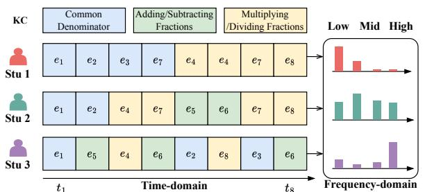
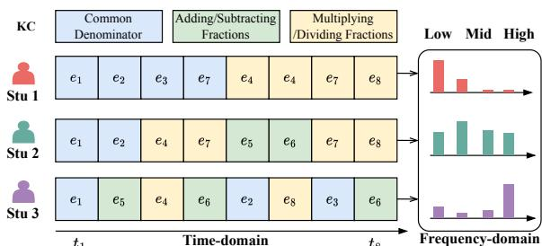
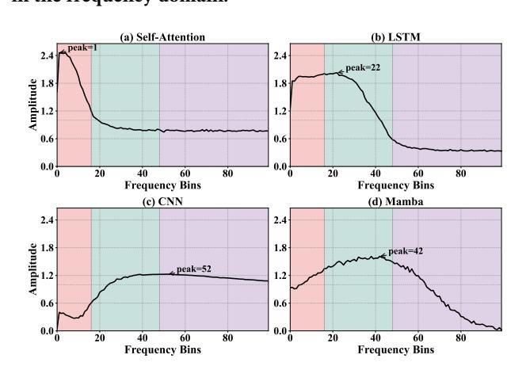
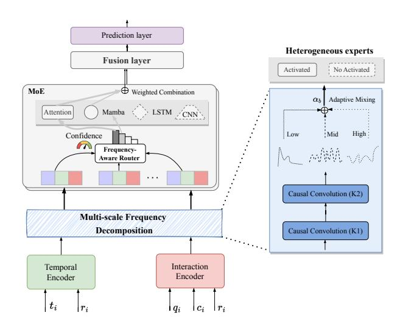
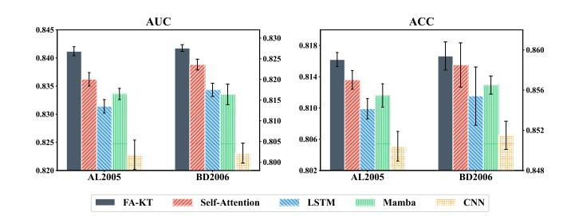
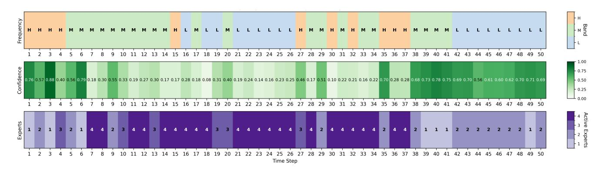
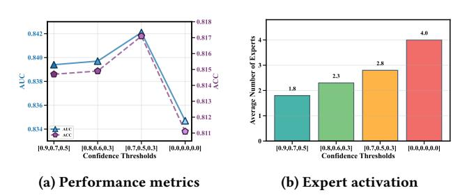

# A Frequency-Aware Mixture of Heterogeneous Experts Framework for Knowledge Tracing

Youheng Bai baiyouheng@outlook.com Guangdong Institute of Smart Education, Jinan University Guangzhou, Guangdong, China

Mingliang Hou TAL Education Group Beijing, China teemohold@outlook.com

Teng Guo∗ Guangdong Institute of Smart Education, Jinan University Guangzhou, Guangdong, China tengguo@jnu.edu.cn

Zitao Liu Guangdong Institute of Smart Education, Jinan University Guangzhou, Guangdong, China liuzitao@jnu.edu.cn

Weiqi Luo

Guangdong Institute of Smart Education, Jinan University Guangzhou, Guangdong, China lwq@jnu.edu.cn

### Abstract

Knowledge tracing (KT) aims to personalize online education on large-scale web-based platforms by modeling students' evolving knowledge states from their interaction sequences. However, most KT models rely on a single encoder architecture (e.g., self-attention or RNN), with fixed inductive biases that fails to capture the diversity of learning behaviors. Specifically, student learning unfolds across multiple timescales, and interaction sequences contain diverse frequency components ranging from short-term variations to long-term trends. Our data-driven analysis reveals that existing encoders exhibit characteristic frequency biases (e.g., self-attention tends to emphasize low-frequency patterns), highlighting the limitations of any single architecture. To address this problem, we propose FA-KT, a frequency-aware mixture of heterogeneous experts framework. FA-KT combines self-attention, Mamba, CNN, and LSTM experts, each with complementary frequency biases. A frequencyaware router analyzes each sequence's frequency characteristics and adaptively combines experts to create dynamic, personalized encoders for individual students. Across five benchmark datasets, FA-KT consistently outperforms 20 strong KT baselines in predicting future performance. Code is available at [https://pykt.org/.](https://pykt.org/)

# CCS Concepts

• Applied computing → Learning management systems; • Information systems → Web log analysis; • Social and professional topics → Student assessment.

# Keywords

Knowledge Tracing, Mixture of Experts, Frequency Analysis, AI for Education

∗Corresponding author.

[This work is licensed under a Creative Commons Attribution 4.0 International License.](https://creativecommons.org/licenses/by/4.0) WWW '26, Dubai, United Arab Emirates © 2026 Copyright held by the owner/author(s). ACM ISBN 979-8-4007-2307-0/2026/04 <https://doi.org/10.1145/3774904.3792272>

### ACM Reference Format:

Youheng Bai, Mingliang Hou, Teng Guo, Zitao Liu, and Weiqi Luo. 2026. A Frequency-Aware Mixture of Heterogeneous Experts Framework for Knowledge Tracing. In Proceedings of the ACM Web Conference 2026 (WWW '26), April 13–17, 2026, Dubai, United Arab Emirates. ACM, New York, NY, USA, [11](#page-10-0) pages.<https://doi.org/10.1145/3774904.3792272>

# 1 Introduction

Accurately modeling how students' knowledge evolves over time is central to intelligent tutoring systems and online learning platforms. This task, known as knowledge tracing (KT), involves inferring a learner's latent mastery of knowledge components[1](#page-0-0) (KCs) based on historical interactions and predicting future performance. Effective KT enables critical downstream applications such as adaptive content sequencing, early identification of struggling students, and targeted remedial interventions [\[26,](#page-8-0) [29,](#page-8-1) [36\]](#page-8-2). Moreover, large-scale web-based platforms (e.g., MOOCs and learning management systems) generate massive interaction logs, creating opportunities for more sophisticated KT models. Consequently, developing robust and personalized KT models that can effectively leverage these large-scale datasets has become a critical research question in educational data mining.

Recent advances have transformed KT from traditional Markov chains [\[51\]](#page-9-0) to deep learning KT models, particularly recurrent neural networks (RNNs) [\[32,](#page-8-3) [36,](#page-8-2) [49\]](#page-8-4). Subsequently, the Transformer architecture [\[43\]](#page-8-5) has gained attention, with various models adopting it as the primary sequence encoder [\[10,](#page-8-6) [16,](#page-8-7) [34\]](#page-8-8). In these KT models, self-attention mechanisms effectively capture long-range dependencies in interaction sequences [\[43\]](#page-8-5), achieving state-of-the-art performance [\[16,](#page-8-7) [28\]](#page-8-9). Despite their success, existing KT models rely on a single encoder architecture, either RNN-based or attentionbased, which limits their ability to capture the diverse learning behaviors exhibited by different students.

Our key insight is that student learning behaviors are inherently multi-scale, operating across different temporal frequencies. These range from stable low-frequency mastery patterns to rapid high-frequency skill alternations [\[23\]](#page-8-10). However, existing KT models process sequences exclusively in the time domain, where these multi-scale patterns are entangled. A single encoder architecture,

1A KC is a generalization of everyday terms such as concept, principle, fact, or skill.

Figure 1: The heterogeneity of student interaction patterns in the frequency domain.

Figure 2: Frequency response of different KT encoders on the NIPS34 dataset. Each curve shows the learned filter response, revealing encoder-specific frequency preferences. Shaded regions indicate low (red), mid (green), and high (purple) frequency bands.

whether emphasizing local transitions (RNNs) or global knowledge dependencies (self-attention), inherently favors certain temporal scales while under-representing others. A frequency-domain perspective naturally disentangles these patterns by decomposing sequences into distinct frequency components. Figure [1](#page-1-0) illustrates this heterogeneity through three representative students. Stu 1 exhibits low-frequency patterns (systematic skill consolidation), Stu 2 exhibits mid-frequency oscillations (modular learning), and Stu 3 exhibits high-frequency alternations (exploratory behavior). The frequency spectra reveal these distinct signatures that remain obscured in the time domain.

A further complication is that different encoder architectures exhibit inherent frequency biases. To quantify these biases, we conducted a controlled experiment on the NIPS34 dataset. We evaluated four architectures, including self-attention [\[43\]](#page-8-5), LSTM, CNN, and Mamba [\[19\]](#page-8-11), each with a learnable frequency filter preceding the encoder. Through end-to-end training, each filter learns to amplify the frequency components most beneficial for its corresponding encoder. As shown in Figure [2,](#page-1-1) each architecture exhibits distinct frequency responses. Self-attention (a) favors low frequencies, emphasizing long-term trends, while CNN (c) emphasizes high frequencies, capturing local patterns. LSTM (b) and Mamba (d) learn to function as distinct band-pass filters for mid-frequency sequential

patterns. These observations lead to a key insight: leveraging multiple encoders with complementary frequency biases and dynamically combining them based on each sequence's frequency characteristics can better capture diverse learning patterns.

To address these challenges, we propose FA-KT (Frequency-Aware knowledge tracing), a mixture of experts framework for knowledge tracing. FA-KT leverages heterogeneous expert encoders with complementary frequency biases, dynamically combined via an adaptive frequency-aware router. Specifically, FA-KT introduces two key components. First, we employ four heterogeneous experts (self-attention, LSTM, CNN, and Mamba), each with distinct frequency biases. This design enables FA-KT to effectively capture diverse student learning patterns, from low-frequency mastery trends to high-frequency skill alternations. Second, we introduce a frequency-aware router that analyzes each sequence's frequency characteristics to dynamically select and weight the most suitable experts. This router selects both the type and number of experts per sequence, balancing personalization with computational efficiency. Our contributions can be summarized as follows:

- We reveal the diverse frequency characteristics of student learning sequences and show that single encoder KT models, due to their inherent frequency biases, cannot adequately capture this diversity, providing a new lens for understanding model architecture limitations.
- We propose FA-KT, a novel mixture of experts architecture that combines heterogeneous encoders with a frequency-aware router for personalized sequence modeling in KT modeling.
- Extensive experiments on five public datasets demonstrate that FA-KT consistently outperforms 20 strong baselines in terms of AUC and accuracy evaluation metrics.

### 2 Related Work

### 2.1 Knowledge Tracing

Knowledge tracing has evolved through several distinct architectural paradigms, each aiming to more effectively model student learning sequences. Early deep learning approaches applied recurrent neural networks, such as LSTMs and GRUs, to capture temporal dependencies in student interactions. DKT [\[36\]](#page-8-2) pioneered this direction, followed by various extensions [\[24,](#page-8-12) [32,](#page-8-3) [40,](#page-8-13) [49\]](#page-8-4). To better model dynamic learning processes, another line of research developed memory-augmented models. For example, DKVMN [\[53\]](#page-9-1) employs external memory networks to maintain and update knowledge states, enabling more structured representations of student mastery [\[1,](#page-8-14) [48\]](#page-8-15). Concurrently, graph-based models were developed to explore the relational structure of learning processes. For instance, GKT [\[33\]](#page-8-16) represents student-question interactions as graphs and leverages graph neural networks to capture knowledge dependencies [\[4,](#page-8-17) [46\]](#page-8-18). More recently, the field has shifted toward attention-based KT models following the success of the Transformer [\[43\]](#page-8-5). Models such as AKT [\[16\]](#page-8-7), SAINT [\[10\]](#page-8-6), and SAKT [\[34\]](#page-8-8) leverage self-attention mechanisms to capture long-range dependencies in interaction sequences, achieving state-of-the-art performance [\[28,](#page-8-9) [35,](#page-8-19) [50\]](#page-9-2). Despite their success, these models rely on single encoder architectures, each exhibiting inherent frequency biases that limit adaptability to diverse learning patterns.

### 2.2 Mixture of Experts

Mixture of experts (MoE) enables conditional computation by using a router to activate a small subset of specialized subnetworks for each input [\[13,](#page-8-20) [22\]](#page-8-21). At a large scale, Switch Transformer leverages sparse routing to efficiently train billion-parameter language models [\[15\]](#page-8-22), while GShard demonstrates that expert specialization improves multilingual translation [\[25\]](#page-8-23). In computer vision, V-MoE routes image patches to specialized experts [\[37\]](#page-8-24), with subsequent work exploring task-aware routing mechanisms [\[12\]](#page-8-25). However, most MoE systems employ homogeneous experts and learn routing strategies purely from data, without explicitly leveraging taskspecific structural information such as frequency characteristics.

Beyond MoE research, work on heterogeneous ensembles has demonstrated the value of combining diverse model architectures, though not within the MoE framework [\[38\]](#page-8-26). Similarly, research on neural architecture search has shown that different architectures naturally specialize in different data patterns [\[14\]](#page-8-27), further motivating architectural diversity [\[9,](#page-8-28) [42\]](#page-8-29). Despite this evidence, the integration of heterogeneous experts within an MoE framework remains underexplored for sequential modeling tasks such as knowledge tracing. Moreover, existing MoE approaches do not explicitly leverage frequency characteristics for routing, a gap we address by introducing frequency-aware routing that dynamically combines heterogeneous experts based on each sequence's frequency profile.

### 2.3 Frequency Decomposition

Frequency decomposition is a fundamental signal processing technique that separates time-series data into distinct frequency components, revealing patterns operating at different temporal scales [\[5,](#page-8-30) [17,](#page-8-31) [21\]](#page-8-32). This approach enables the analysis of complex signals by isolating slow-changing trends, periodic patterns, and rapid fluctuations, each potentially carrying distinct semantic information about the underlying process [\[47,](#page-8-33) [54\]](#page-9-3). Methods for frequency decomposition include classical Fourier transforms that provide global frequency information [\[7\]](#page-8-34) and wavelets that preserve time-frequency localization [\[11,](#page-8-35) [18\]](#page-8-36). More recently, learnable filters have been developed to adapt to specific data characteristics [\[52\]](#page-9-4).

In the KT task, frequency decomposition offers a principled approach to disentangling different aspects of learning dynamics. Long-term knowledge mastery manifests as low-frequency components, periodic practice patterns appear in mid-frequency bands, and exploratory or guessing behaviors emerge in high-frequency signals. This multi-scale perspective aligns with educational theories recognizing learning as a process occurring across multiple timescales, from immediate responses to long-term retention [\[8\]](#page-8-37). Building on this insight, we decompose student interaction sequences into frequency components and employ a frequency-aware router to dynamically combine heterogeneous experts, each specialized for specific frequency bands.

### 3 The FA-KT Framework

Problem Statement. Given a learner with a chronologically ordered sequence of �� historical interactions S = {���� } �� ��=1 , where each interaction ���� = (���� , ���� , ���� , ���� ) consists of a question ID ���� , a set of associated KCs ���� , a binary response ���� ∈ {0, 1} (1 for correct, 0 for incorrect), and a timestamp ���� with ���� &lt; ����+1. Let S1:�� = {��1, . . . , ���� }

denote the interaction history up to time ��. The goal of KT is to learn a prediction function �� that estimates the probability of a correct response:

����+1 = �� (S1:�� , ����+1, ����+1) (1)

where �� approximates the true probability �� (����+1 = 1 | S1:�� , ����+1, ����+1).

Figure 3: Overview of the FA-KT framework.

Overview. Motivated by the diverse frequency patterns in student learning in Figure [1](#page-1-0) and the inherent frequency biases of architectures in Figure [2,](#page-1-1) we propose FA-KT to adaptively combine heterogeneous experts. Figure [3](#page-2-0) illustrates our architecture with four components. First, frequency-enhanced input encoding (Section [3.1\)](#page-2-1) decomposes student interactions into low-, mid-, and high-frequency bands, explicitly separating mastery trends, practice cycles, and behavioral fluctuations. Second, a frequency-aware router (Section [3.2\)](#page-3-0) analyzes these spectral patterns to dynamically select experts, using routing confidence to adapt both the choice and number of activated architectures. Third, a heterogeneous expert mixture (Section [3.3\)](#page-3-1) employs four complementary architectures, including self-attention for low-frequency trends, LSTM for midfrequency cycles, CNN for high-frequency fluctuations, and Mamba for mid-to-high patterns, processing temporal and exercise features through separate branches. Finally, a prediction layer (Section [3.4\)](#page-4-0) fuses branch outputs to estimate student performance on the next interaction.

### 3.1 Frequency-Enhanced Input Encoding

To expose the frequency patterns that distinguish learning behaviors, we decompose interactions into low-, mid-, and high-frequency bands via dual encoders and multi-scale filtering.

3.1.1 Temporal Encoder and Exercise Encoder. Prior work has shown that temporal dynamics, such as practice frequency and spacing intervals, strongly correlate with knowledge retention [\[32\]](#page-8-3). We extract three temporal signals per step ��: KC attempts (KA) counts the cumulative practice attempts for each KC, while KC gap (KG) and Interaction gap (IG) measure time intervals in minutes since the

| Dataset       | AL2005  | BD2006    | NIPS34    | XES3G5M   | POJ     |
|---------------|---------|-----------|-----------|-----------|---------|
| #Students     | 574     | 1,146     | 4,918     | 18,066    | 22,916  |
| #KCs          | 112     | 493       | 57        | 865       | 2,750   |
| #Questions    | 210,710 | 207,856   | 948       | 7,652     |         |
| #Interactions | 809,694 | 3,679,199 | 1,382,727 | 5,549,635 | 996,240 |
| Avg. KCs      | 1.3634  | 1.0136    | 1.0148    | 1.16      |         |

Table 2: Comparison of FA-KT and 20 KT models on five datasets in terms of AUC. Best results in bold, next best underlined.

| Model        |        | AL2005   |        | BD2006   |        | AUC NIPS34 |        | XES3G5M  |        | POJ      |
|--------------|--------|----------|--------|----------|--------|------------|--------|----------|--------|----------|
| DKT          | 0.8149 | ± 0.0011 | 0.8015 | ± 0.0008 | 0.7689 | ± 0.0002   | 0.7852 | ± 0.0006 | 0.6089 | ± 0.0009 |
| DKT+         | 0.8156 | ± 0.0011 | 0.8020 | ± 0.0004 | 0.7696 | ± 0.0002   | 0.7861 | ± 0.0002 | 0.6173 | ± 0.0007 |
| DKT-F        | 0.8147 | ± 0.0013 | 0.7985 | ± 0.0013 | 0.7733 | ± 0.0003   | 0.7940 | ± 0.0006 | 0.6030 | ± 0.0023 |
| KQN          | 0.8207 | ± 0.0015 | 0.7936 | ± 0.0014 | 0.7684 | ± 0.0003   | 0.7793 | ± 0.0006 | 0.6080 | ± 0.0015 |
| DKVMN        | 0.8054 | ± 0.0011 | 0.7983 | ± 0.0009 | 0.7673 | ± 0.0004   | 0.7792 | ± 0.0004 | 0.6056 | ± 0.0022 |
| ATKT         | 0.7995 | ± 0.0023 | 0.7889 | ± 0.0008 | 0.7665 | ± 0.0001   | 0.7783 | ± 0.0004 | 0.6075 | ± 0.0012 |
| GKT          | 0.8110 | ± 0.0009 | 0.8046 | ± 0.0008 | 0.7689 | ± 0.0024   | 0.7727 | ± 0.0006 | 0.6070 | ± 0.0036 |
| SAKT         | 0.7880 | ± 0.0063 | 0.7740 | ± 0.0008 | 0.7517 | ± 0.0005   | 0.7693 | ± 0.0008 | 0.6095 | ± 0.0013 |
| SAINT        | 0.7775 | ± 0.0017 | 0.7781 | ± 0.0013 | 0.7873 | ± 0.0007   | 0.8074 | ± 0.0007 | 0.5563 | ± 0.0012 |
| AKT          | 0.8306 | ± 0.0019 | 0.8208 | ± 0.0007 | 0.8033 | ± 0.0003   | 0.8207 | ± 0.0008 | 0.6281 | ± 0.0013 |
| HawkesKT     | 0.8210 | ± 0.0012 | 0.8068 | ± 0.0010 | 0.7767 | ± 0.0010   | 0.7921 | ± 0.0007 |        |          |
| LPKT         | 0.8268 | ± 0.0004 | 0.8056 | ± 0.0008 | 0.8004 | ± 0.0003   | 0.8163 | ± 0.0002 |        |          |
| DIMKT        | 0.8277 | ± 0.0009 | 0.8167 | ± 0.0008 | 0.8030 | ± 0.0002   | 0.8220 | ± 0.0002 |        |          |
| AT-DKT       | 0.8246 | ± 0.0019 | 0.8104 | ± 0.0009 | 0.7816 | ± 0.0002   | 0.7932 | ± 0.0004 |        |          |
| simpleKT     | 0.8254 | ± 0.0003 | 0.8160 | ± 0.0006 | 0.8035 | ± 0.0000   | 0.8163 | ± 0.0006 | 0.6252 | ± 0.0005 |
| RKT          | 0.7761 | ± 0.0010 | 0.7631 | ± 0.0013 | 0.7966 | ± 0.0011   | 0.8224 | ± 0.0007 | 0.6175 | ± 0.0008 |
| DTransformer | 0.8188 | ± 0.0025 | 0.8093 | ± 0.0009 | 0.7944 | ± 0.0003   | 0.8144 | ± 0.0006 | 0.6180 | ± 0.0012 |
| HD-KT        | 0.8229 | ± 0.0006 | 0.8039 | ± 0.0014 | 0.7932 | ± 0.0004   | 0.8078 | ± 0.0012 |        |          |
| LefoKT       | 0.8317 | ± 0.0021 | 0.8110 | ± 0.0009 | 0.8045 | ± 0.0003   | 0.8200 | ± 0.0008 | 0.6262 | ± 0.0011 |
| csKT         | 0.8307 | ± 0.0008 | 0.8211 | ± 0.0009 | 0.8055 | ± 0.0001   | 0.8203 | ± 0.0008 | 0.6282 | ± 0.0009 |
| FA-KT        | 0.8412 | ± 0.0008 | 0.8276 | ± 0.0008 | 0.8084 | ± 0.0005   | 0.8247 | ± 0.0021 | 0.6280 | ± 0.0012 |

Table 3: Comparison of FA-KT and 20 KT models on five datasets in terms of ACC. Best results in bold, next best underlined.

| Model        |        | AL2005   |        | BD2006   |        | ACC NIPS34 |        | XES3G5M  |        | POJ      |
|--------------|--------|----------|--------|----------|--------|------------|--------|----------|--------|----------|
| DKT          | 0.8097 | ± 0.0005 | 0.8553 | ± 0.0002 | 0.7032 | ± 0.0004   | 0.8173 | ± 0.0002 | 0.6328 | ± 0.0020 |
| DKT+         | 0.8097 | ± 0.0007 | 0.8553 | ± 0.0003 | 0.7039 | ± 0.0004   | 0.8178 | ± 0.0001 | 0.6482 | ± 0.0021 |
| DKT-F        | 0.8090 | ± 0.0005 | 0.8536 | ± 0.0004 | 0.7076 | ± 0.0002   | 0.8209 | ± 0.0003 | 0.6371 | ± 0.0030 |
| KQN          | 0.8025 | ± 0.0006 | 0.8532 | ± 0.0006 | 0.7028 | ± 0.0001   | 0.8152 | ± 0.0002 | 0.6435 | ± 0.0017 |
| DKVMN        | 0.8027 | ± 0.0007 | 0.8545 | ± 0.0002 | 0.7016 | ± 0.0005   | 0.8155 | ± 0.0001 | 0.6393 | ± 0.0015 |
| ATKT         | 0.7998 | ± 0.0019 | 0.8511 | ± 0.0004 | 0.7013 | ± 0.0002   | 0.8145 | ± 0.0002 | 0.6332 | ± 0.0023 |
| GKT          | 0.8088 | ± 0.0008 | 0.8555 | ± 0.0002 | 0.7014 | ± 0.0028   | 0.8135 | ± 0.0004 | 0.6117 | ± 0.0147 |
| SAKT         | 0.7954 | ± 0.0020 | 0.8461 | ± 0.0005 | 0.6879 | ± 0.0004   | 0.8124 | ± 0.0002 | 0.6407 | ± 0.0035 |
| SAINT        | 0.7791 | ± 0.0016 | 0.8411 | ± 0.0065 | 0.7180 | ± 0.0006   | 0.8177 | ± 0.0006 | 0.6476 | ± 0.0003 |
| AKT          | 0.8124 | ± 0.0011 | 0.8587 | ± 0.0005 | 0.7323 | ± 0.0005   | 0.8273 | ± 0.0007 | 0.6492 | ± 0.0010 |
| HawkesKT     | 0.8115 | ± 0.0009 | 0.8559 | ± 0.0005 | 0.7110 | ± 0.0007   | 0.8188 | ± 0.0003 |        |          |
| LPKT         | 0.8154 | ± 0.0008 | 0.8547 | ± 0.0005 | 0.7309 | ± 0.0006   | 0.8264 | ± 0.0001 |        |          |
| DIMKT        | 0.8109 | ± 0.0005 | 0.8579 | ± 0.0001 | 0.7312 | ± 0.0005   | 0.8291 | ± 0.0006 |        |          |
| AT-DKT       | 0.8144 | ± 0.0008 | 0.8560 | ± 0.0005 | 0.7146 | ± 0.0002   | 0.8198 | ± 0.0004 |        |          |
| simpleKT     | 0.8083 | ± 0.0005 | 0.8579 | ± 0.0003 | 0.7328 | ± 0.0001   | 0.8246 | ± 0.0005 | 0.6522 | ± 0.0008 |
| RKT          | 0.7964 | ± 0.0021 | 0.8468 | ± 0.0005 | 0.7264 | ± 0.0010   | 0.8294 | ± 0.0004 | 0.6507 | ± 0.0003 |
| DTransformer | 0.8043 | ± 0.0021 | 0.8555 | ± 0.0007 | 0.7295 | ± 0.0007   | 0.8248 | ± 0.0004 | 0.6511 | ± 0.0033 |
| HD-KT        | 0.8120 | ± 0.0007 | 0.8542 | ± 0.0005 | 0.7237 | ± 0.0007   | 0.8238 | ± 0.0004 |        |          |
| LefoKT       | 0.8110 | ± 0.0009 | 0.8605 | ± 0.0012 | 0.7340 | ± 0.0004   | 0.8263 | ± 0.0010 | 0.6511 | ± 0.0028 |
| csKT         | 0.8118 | ± 0.0013 | 0.8591 | ± 0.0004 | 0.7344 | ± 0.0005   | 0.8253 | ± 0.0015 | 0.6495 | ± 0.0025 |
| FA-KT        | 0.8162 | ± 0.0009 | 0.8594 | ± 0.0014 | 0.7372 | ± 0.0006   | 0.8286 | ± 0.0006 | 0.6553 | ± 0.0006 |

- FA-KT consistently outperforms models using single encoder types: attention-based KT methods (AKT: +1.06% on AL2005,

csKT: +1.05% on AL2005), sequence-based KT methods (LPKT:

Table 4: Ablation study results in terms of AUC and ACC.

| Model |     |               |               | AUC           |               |               |               |               | ACC           |               |               |
|-------|-----|---------------|---------------|---------------|---------------|---------------|---------------|---------------|---------------|---------------|---------------|
|       |     | AL2005        | BD2006        | NIPS34        | XES3G5M       | POJ           | AL2005        | BD2006        | NIPS34        | XES3G5M       | POJ           |
| -w/o  | QA  | 0.8408±0.0016 | 0.8252±0.0003 | 0.8057±0.0005 | 0.8200±0.0006 | 0.6273±0.0012 | 0.8184±0.0014 | 0.8584±0.0009 | 0.7348±0.0011 | 0.8267±0.0006 | 0.6550±0.0005 |
| -w/o  | TA  | 0.8352±0.0022 | 0.8230±0.0014 | 0.8050±0.0002 | 0.8194±0.0012 | 0.6245±0.0012 | 0.8137±0.0006 | 0.8585±0.0012 | 0.7331±0.0008 | 0.8238±0.0009 | 0.6542±0.0008 |
| -w/o  | FD  | 0.8401±0.0008 | 0.8254±0.0017 | 0.8073±0.0006 | 0.8196±0.0029 | 0.6231±0.0015 | 0.8158±0.0009 | 0.8593±0.0011 | 0.7363±0.0008 | 0.8271±0.0016 | 0.6514±0.0046 |
| -w/o  | MoE | 0.8362±0.0012 | 0.8236±0.0013 | 0.8079±0.0008 | 0.8206±0.0027 | 0.6269±0.0008 | 0.8136±0.0012 | 0.8585±0.0022 | 0.7367±0.0007 | 0.8269±0.0007 | 0.6551±0.0013 |
| FA-KT |     | 0.8412±0.0008 | 0.8276±0.0008 | 0.8084±0.0005 | 0.8247±0.0021 | 0.6280±0.0012 | 0.8162±0.0009 | 0.8594±0.0014 | 0.7372±0.0006 | 0.8286±0.0006 | 0.6553±0.0006 |

+1.44% on AL2005). This validates our hypothesis that combining complementary architectures captures diverse learning patterns more effectively than any single architecture.

- Unlike specialized models that use fixed architectures or simple attention mechanisms, FA-KT employs confidence-driven expert selection that dynamically adapts to sequence-specific frequency characteristics. This explains the consistent gains across datasets with different scales (884K to 6.4M interactions) and varying complexity (57 to 2,748 KCs), demonstrating that frequency-aware routing generalizes beyond dataset-specific patterns.
- FA-KT achieves notably stable performance across all five folds (e.g., 0.8412±0.0008 on AL2005), indicating that improvements are systematic rather than dataset-dependent. The model handles both question-level (AL2005, BD2006) and KC-level data (POJ) seamlessly, while some baselines (HawkesKT, LPKT, DIMKT) fail on KC-only datasets.

These results establish FA-KT as a robust and generalizable solution for knowledge tracing across diverse learning scenarios. While the AUC increase in Table [2](#page-5-0) and Table [3](#page-5-1) is less than 1% in some datasets, this improvement is significant at a context window size of 200. Recent benchmark studies indicate that many reported performance gains are unreliable due to flawed evaluation processes, with only a 3.5% improvement in overall KT prediction performance since 2015. In our study, we rigorously followed the evaluation protocol proposed in pyKT [\[29\]](#page-8-1) and conducted a thorough hyperparameter search for each baseline.

4.2.2 Ablation Study. We systematically examine the contribution of each key component in FA-KT through ablation studies. We construct four model variants by removing specific modules:

- w/o QA: Removes the exercise branch, retaining only the temporal branch.
- w/o TA: Removes the temporal branch, retaining only the exercise branch.
- w/o FD: Removes multi-scale frequency decomposition, using raw features directly.
- w/o MoE: Removes mixture of experts, using only a single selfattention expert.

Table [4](#page-6-0) presents results across five datasets. First, removing the mixture of experts (-w/o MoE) causes the most significant degradation (-0.50% AUC in AL2005), validating that heterogeneous experts capture diverse learning patterns more effectively than any single architecture. Second, both branches provide complementary contribution: the temporal branch (-w/o TA) impacts datasets with rich temporal dynamics more (XES3G5M: -0.53% AUC), while the exercise branch (-w/o QA) matters more for question-specific datasets

(XES3G5M: -0.47% AUC, NIPS34: -0.27% AUC). Third, frequency decomposition (-w/o FD) provides consistent gains across all datasets (-0.22% AUC in BD2006, -0.51% AUC in XES3G5M), demonstrating that separating multi-scale patterns helps experts focus on preferred frequency bands. These results confirm that each component addresses a distinct modeling challenge: dual branches capture complementary aspects, frequency decomposition exposes multiscale patterns, and heterogeneous experts leverage architectural diversity.

4.2.3 Effects of Expert Heterogeneity. To assess the contribution of expert heterogeneity, we construct four homogeneous MoE variants—self-attention-only, LSTM-only, Mamba-only, and CNNonly—that retain the same frequency-aware router and training setup as FA-KT. Any performance change thus isolates the effect of replacing our heterogeneous mixture with a single architecture. We evaluate on AL2005 and BD2006, with hyperparameters tuned separately for each variant. Figure [4](#page-6-1) summarizes the results.

Figure 4: Performance comparison of homogeneous-expert MoE variants (Self-Attention- / LSTM- / Mamba- / CNN-only) against FA-KT with heterogeneous experts.

FA-KT consistently outperforms all homogeneous variants across both datasets and metrics. Notably, self-attention-only achieves the best performance among single architectures (-0.46% avg AUC compared to FA-KT), consistent with its dominance in recent KT literature. Mamba-only ranks second (-0.63% AUC), followed by LSTM-only (-0.98% AUC), while CNN-only significantly underperforms (-1.88% AUC). Self-attention excels at low-frequency patterns prevalent in learning sequences, while CNN struggles with the long-range dependencies. Importantly, even the strongest single architecture (self-attention) falls short of FA-KT, validating that heterogeneous experts with complementary biases capture diverse learning patterns more effectively than relying on any single architecture's strengths.

Figure 6: Frequency-aware routing behavior across a 50-step learning sequence. From top to bottom: dominant frequency bands (H: high, M: mid, L: low), routing confidence scores, and the number of activated experts.

4.2.4 Sensitivity to Confidence Thresholds. The confidence thresholds {��1, ��2, ��3} in Eq. [\(9\)](#page-3-2) control adaptive expert activation. We evaluate four settings on AL2005 using a single fold: aggressive [0.9, 0.7, 0.5], moderate [0.8, 0.6, 0.3], conservative [0.7, 0.5, 0.3], and a fixed top-4 baseline [0.0, 0.0, 0.0] that always activates all experts.

Figure 5: Sensitivity analysis of confidence thresholds on AL2005. (a) AUC/ACC performance. (b) Average number of activated experts.

As shown in Figure [5,](#page-7-0) the fixed baseline achieves the lowest performance even though it uses all experts, demonstrating that indiscriminate activation leads to overfitting. In contrast, the adaptive routing strategies consistently improve both performance and efficiency. The conservative setting [0.7, 0.5, 0.3] achieves the best results (AUC: 0.8421) using only 2.8 experts, a 30% reduction with 0.74% improvement over the baseline. Even the aggressive setting [0.9, 0.7, 0.5], which uses 55% fewer experts outperforms the fixed approach. These results validate two key design choices: (1) confidence-driven selection effectively identifies when fewer experts suffice, and (2) selective activation prevents noise introduced by unnecessary expert involvement.

4.2.5 Frequency-Aware Router Visualization. Figure [6](#page-7-1) illustrates the adaptive behavior of routing on a 50-step student learning sequence sampled from the BD2006 training set. The figure shows three aligned panels: dominant frequency band (top), routing confidence (middle), and number of activated experts (bottom). To produce this visualization, we first obtain frequency-decomposed representations as described in Section [3.1,](#page-2-1) calculate confidence scores via the entropy-based measure in Eq. [\(8\)](#page-3-3), and then apply the

adaptive top-�� thresholds in Eq. [\(9\)](#page-3-2). At each step, the dominant band (H/M/L) corresponds to the component with the largest magnitude among the high-, mid-, and low-frequency decompositions.

The sequence exhibits two characteristic phases that align with our routing hypothesis. During the initial unstable phase (roughly steps 1–30), frequent switches among H/M/L bands are accompanied by highly variable confidence scores (ranging from ≈0.08 to ≈0.88), leading the router to activate between 1 and 4 experts across steps. This indicates complex, rapidly changing temporal patterns that benefit from multi-expert aggregation. In the subsequent stable phase (steps 40–50), sustained low-frequency dominance is accompanied by more stable, mid-to-high confidence (typically 0.60–0.80), and the router consistently activates only 1–2 experts. This confirms that our mechanism responds primarily to pattern stability rather than frequency magnitude alone, allocating more experts under uncertainty to maintain robustness and fewer experts when patterns stabilize to improve computational efficiency.

### 5 Conclusion and Future Work

We presented FA-KT, a frequency-aware mixture of heterogeneous experts for knowledge tracing. By decomposing interactions into multi-scale frequency bands and routing these bands to experts (selfattention, LSTM, CNN, Mamba) with complementary frequency biases, FA-KT overcomes the single-encoder limitation of modeling diverse student behaviors. Across five real-world datasets and 20 baselines, FA-KT consistently improves AUC and ACC, with ablations and visualizations confirming that frequency-aware representations and adaptive routing are the key drivers of the performance gains. These results demonstrate a promising approach to robust, personalized KT on large-scale online learning platforms.

For future work, we plan to extend FA-KT with additional expert architectures, such as more efficient linear attention models, and investigate soft routing strategies that jointly optimize both accuracy and computational cost to enable scalable deployment.

# Acknowledgments

This work was supported in part by NFSC under Grant No. 62477025; in part by Key Laboratory of Smart Education of Guangdong Higher Education Institutes, Jinan University (2022LSYS003) and in part by Beijing Natural Science Foundation under Grant No. L252010.

References [1] Ghodai Abdelrahman and Qing Wang. 2019. Knowledge tracing with sequential key-value memory networks. In Proceedings of the 42nd International ACM SIGIR Conference on Research and Development in Information Retrieval. 175–184. [2] Youheng Bai, Xueyi Li, Zitao Liu, Yaying Huang, Teng Guo, Mingliang Hou, Feng Xia, and Weiqi Luo. 2025. csKT: Addressing cold-start problem in knowledge tracing via kernel bias and cone attention. Expert Systems with Applications 266 (2025), 125988. [3] Youheng Bai, Xueyi Li, Zitao Liu, Yaying Huang, Mi Tian, and Weiqi Luo. 2025. Rethinking and improving student learning and forgetting processes for attention based knowledge tracing models. In Proceedings of the AAAI Conference on Artificial Intelligence, Vol. 39. 27822–27830. [4] Youheng Bai, Zitao Liu, Teng Guo, Mingliang Hou, and Kui Xiao. 2025. Prerequisite relation learning: A survey and outlook. Comput. Surveys 57, 11 (2025), 1–28. [5] Gregory A Baxes. 1994. Digital image processing: principles and applications. John Wiley & Sons, Inc. [6] Yoshua Bengio, Nicholas Léonard, and Aaron Courville. 2013. Estimating or propagating gradients through stochastic neurons for conditional computation. arXiv preprint arXiv:1308.3432 (2013). [7] E Oran Brigham. 1988. The fast Fourier transform and its applications. Prentice-Hall, Inc. [8] Ethan S Bromberg-Martin, Masayuki Matsumoto, Hiroyuki Nakahara, and Okihide Hikosaka. 2010. Multiple timescales of memory in lateral habenula and dopamine neurons. Neuron 67, 3 (2010), 499–510. [9] Gavin Brown, Jeremy Wyatt, Rachel Harris, and Xin Yao. 2005. Diversity creation methods: a survey and categorisation. Information fusion 6, 1 (2005), 5–20. [10] Youngduck Choi, Youngnam Lee, Junghyun Cho, Jineon Baek, Byungsoo Kim, Yeongmin Cha, Dongmin Shin, Chan Bae, and Jaewe Heo. 2020. Towards an appropriate query, key, and value computation for knowledge tracing. In Proceedings of the 7th ACM Conference on Learning at Scale. 341–344. [11] Ronald R Coifman and Mauro Maggioni. 2006. Diffusion wavelets. Applied and Computational Harmonic Analysis 21, 1 (2006), 53–94. [12] Damai Dai, Li Dong, Shuming Ma, Bo Zheng, Zhifang Sui, Baobao Chang, and Furu Wei. 2022. StableMoE: Stable routing strategy for mixture of experts. In Proceedings of the 60th Annual Meeting of the Association for Computational Linguistics. 7085–7095. [13] David Eigen, Marc'Aurelio Ranzato, and Ilya Sutskever. 2013. Learning factored representations in a deep mixture of experts. arXiv preprint arXiv:1312.4314 (2013). [14] Thomas Elsken, Jan Hendrik Metzen, and Frank Hutter. 2019. Neural architecture search: A survey. The Journal of Machine Learning Research 20, 1 (2019), 1997– 2017. [15] William Fedus, Barret Zoph, and Noam Shazeer. 2022. Switch transformers: Scaling to trillion parameter models with simple and efficient sparsity. Journal of Machine Learning Research 23, 120 (2022), 1–39. [16] Aritra Ghosh, Neil Heffernan, and Andrew S Lan. 2020. Context-aware attentive knowledge tracing. In Proceedings of the 26th ACM SIGKDD International Conference on Knowledge Discovery and Data Mining. 2330–2339. [17] Himadri Ghosh, RK Paul, and Prajneshu. 2010. Wavelet frequency domain approach for statistical modeling of rainfall time-series data. Journal of Statistical Theory and Practice 4, 4 (2010), 813–825. [18] Amara Graps. 1995. An introduction to wavelets. IEEE Computational Science and Engineering 2, 2 (1995), 50–61. [19] Albert Gu and Tri Dao. 2023. Mamba: Linear-time sequence modeling with selective state spaces. arXiv preprint arXiv:2312.00752 (2023). [20] Xiaopeng Guo, Zhijie Huang, Jie Gao, Mingyu Shang, Maojing Shu, and Jun Sun. 2021. Enhancing knowledge tracing via adversarial training. In Proceedings of the 29th ACM International Conference on Multimedia. 367–375. [21] Norden E Huang, Zheng Shen, Steven R Long, Manli C Wu, Hsing H Shih, Quanan Zheng, Nai-Chyuan Yen, Chi Chao Tung, and Henry H Liu. 1998. The empirical mode decomposition and the Hilbert spectrum for nonlinear and nonstationary time series analysis. Proceedings of the Royal Society of London. Series A: mathematical, physical and engineering sciences 454, 1971 (1998), 903–995. [22] Robert A Jacobs, Michael I Jordan, Steven J Nowlan, and Geoffrey E Hinton. 1991. Adaptive mixtures of local experts. Neural computation 3, 1 (1991), 79–87. [23] John S Kinnebrew, Kirk M Loretz, and Gautam Biswas. 2013. A contextualized, differential sequence mining method to derive students' learning behavior patterns. Journal of Educational Data Mining 5, 1 (2013), 190–219. [24] Jinseok Lee and Dit-Yan Yeung. 2019. Knowledge query network for knowledge tracing: How knowledge interacts with skills. In Proceedings of the 9th International Conference on Learning Analytics and Knowledge. 491–500. [25] Dmitry Lepikhin, HyoukJoong Lee, Yuanzhong Xu, Dehao Chen, Orhan Firat, Yanping Huang, Maxim Krikun, Noam Shazeer, and Zhifeng Chen. 2021. GShard: Scaling giant Models with conditional computation and automatic sharding. In International Conference on Learning Representations. [26] Qi Liu, Shuanghong Shen, Zhenya Huang, Enhong Chen, and Yonghe Zheng. 2021. A survey of knowledge tracing. arXiv preprint arXiv:2105.15106 (2021). [27] Zitao Liu, Qiongqiong Liu, Jiahao Chen, Shuyan Huang, Boyu Gao, Weiqi Luo, and Jian Weng. 2023. Enhancing deep knowledge tracing with auxiliary tasks. In Proceedings of the 32th International Conference on World Wide Web. 4178–4187. [28] Zitao Liu, Qiongqiong Liu, Jiahao Chen, Shuyan Huang, and Weiqi Luo. 2022. simpleKT: A Simple But Tough-to-Beat Baseline for Knowledge Tracing. In Proceedings of the 11th International Conference on Learning Representations. [29] Zitao Liu, Qiongqiong Liu, Jiahao Chen, Shuyan Huang, Jiliang Tang, and Weiqi Luo. 2022. pyKT: a python library to benchmark deep learning based knowledge tracing models. Advances in Neural Information Processing Systems 35 (2022), 18542–18555. [30] Zitao Liu, Qiongqiong Liu, Teng Guo, Jiahao Chen, Shuyan Huang, Xiangyu Zhao, Jiliang Tang, Weiqi Luo, and Jian Weng. 2024. XES3G5M: A knowledge tracing benchmark dataset with auxiliary information. Advances in Neural Information Processing Systems 36 (2024). [31] Haiping Ma, Yong Yang, Chuan Qin, Xiaoshan Yu, Shangshang Yang, Xingyi Zhang, and Hengshu Zhu. 2024. HD-KT: Advancing robust knowledge tracing via anomalous learning interaction detection. In Proceedings of the ACM on Web Conference. 4479–4488. [32] Koki Nagatani, Qian Zhang, Masahiro Sato, Yan-Ying Chen, Francine Chen, and Tomoko Ohkuma. 2019. Augmenting knowledge tracing by considering forgetting behavior. In Proceedings of the 28th International Conference on World Wide Web. 3101–3107. [33] Hiromi Nakagawa, Yusuke Iwasawa, and Yutaka Matsuo. 2019. Graph-based knowledge tracing: modeling student proficiency using graph neural network. In IEEE/WIC/ACM International Conference on Web Intelligence. 156–163. [34] Shalini Pandey and George Karypis. 2019. A self-attentive model for knowledge tracing. In Proceedings of the 12th International Conference on Educational Data Mining. 384–389. [35] Shalini Pandey and Jaideep Srivastava. 2020. RKT: Relation-aware self-attention for knowledge tracing. In Proceedings of the 29th ACM International Conference on Information and Knowledge Management. 1205–1214. [36] Chris Piech, Jonathan Bassen, Jonathan Huang, Surya Ganguli, Mehran Sahami, Leonidas J. Guibas, and Jascha Sohl-Dickstein. 2015. Deep Knowledge Tracing. Advances in Neural Information Processing Systems (2015), 505–513. [37] Carlos Riquelme, Joan Puigcerver, Basil Mustafa, Maxim Neumann, Rodolphe Jenatton, André Susano Pinto, Daniel Keysers, and Neil Houlsby. 2021. Scaling vision with sparse mixture of experts. Advances in Neural Information Processing Systems 34 (2021), 8583–8595. [38] Omer Sagi and Lior Rokach. 2018. Ensemble learning: A survey. Wiley Interdisciplinary Reviews: Data Mining and Knowledge Discovery 8, 4 (2018), e1249. [39] Shuanghong Shen, Zhenya Huang, Qi Liu, Yu Su, Shijin Wang, and Enhong Chen. 2022. Assessing student's dynamic knowledge state by exploring the question difficulty effect. In Proceedings of the 45th international ACM SIGIR Conference on Research and Development in Information Retrieval. 427–437. [40] Shuanghong Shen, Qi Liu, Enhong Chen, Zhenya Huang, Wei Huang, Yu Yin, Yu Su, and Shijin Wang. 2021. Learning process-consistent knowledge tracing. In Proceedings of the 27th ACM SIGKDD Conference on Knowledge Discovery and Data Mining. 1452–1460. [41] John Stamper and Zachary A Pardos. 2016. The 2010 KDD Cup Competition Dataset: Engaging the machine learning community in predictive learning analytics. Journal of Learning Analytics 3, 2 (2016), 312–316. [42] Linh Tran, Bastiaan S Veeling, Kevin Roth, Jakub Swiatkowski, Joshua V Dillon, Jasper Snoek, Stephan Mandt, Tim Salimans, Sebastian Nowozin, and Rodolphe Jenatton. 2020. Hydra: Preserving ensemble diversity for model distillation. arXiv preprint arXiv:2001.04694 (2020). [43] Ashish Vaswani, Noam Shazeer, Niki Parmar, Jakob Uszkoreit, Llion Jones, Aidan N Gomez, Łukasz Kaiser, and Illia Polosukhin. 2017. Attention is all you need. Advances in Neural Information Processing Systems 30 (2017), 6000–6010. [44] Chenyang Wang, Weizhi Ma, Min Zhang, Chuancheng Lv, Fengyuan Wan, Huijie Lin, Taoran Tang, Yiqun Liu, and Shaoping Ma. 2021. Temporal cross-effects in knowledge tracing. In Proceedings of the 14th ACM International Conference on Web Search and Data Mining. 517–525. [45] Zichao Wang, Angus Lamb, Evgeny Saveliev, Pashmina Cameron, Yordan Zaykov, José Miguel Hernández-Lobato, Richard E Turner, Richard G Baraniuk, Craig Barton, Simon Peyton Jones, et al. 2020. Instructions and guide for diagnostic questions: The neurips 2020 education challenge. arXiv preprint arXiv:2007.12061 (2020). [46] Feng Xia, Ke Sun, Shuo Yu, Abdul Aziz, Liangtian Wan, Shirui Pan, and Huan Liu. 2021. Graph learning: A survey. IEEE Transactions on Artificial Intelligence 2, 2 (2021), 109–127. [47] Kai Xu, Minghai Qin, Fei Sun, Yuhao Wang, Yen-Kuang Chen, and Fengbo Ren. 2020. Learning in the frequency domain. In Proceedings of the IEEE/CVF Conference on Computer Vision and Pattern Recognition. 1740–1749. [48] Chun-Kit Yeung. 2019. Deep-IRT: Make deep learning based knowledge tracing explainable using item response theory. arXiv e-prints (2019), arXiv–1904. [49] Chun-Kit Yeung and Dit-Yan Yeung. 2018. Addressing two problems in deep knowledge tracing via prediction-consistent regularization. In Proceedings of the 15th Annual ACM Conference on Learning at Scale. 1–10.

[50] Yu Yin, Le Dai, Zhenya Huang, Shuanghong Shen, Fei Wang, Qi Liu, Enhong Chen, and Xin Li. 2023. Tracing knowledge instead of patterns: Stable knowledge tracing with diagnostic transformer. In Proceedings of the 32th International Conference on World Wide Web. 855–864. [51] Michael V Yudelson, Kenneth R Koedinger, and Geoffrey J Gordon. 2013. Individualized bayesian knowledge tracing models. In Artificial Intelligence in Education: 16th International Conference. 171–180. [52] Neil Zeghidour, Nicolas Usunier, Iasonas Kokkinos, Thomas Schatz, Gabriel Synnaeve, and Emmanuel Dupoux. 2018. Learning filterbanks from raw speech for phone recognition. In 2018 IEEE International Conference on Acoustics, Speech and Signal Processing (ICASSP). 5509–5513. [53] Jiani Zhang, Xingjian Shi, Irwin King, and Dit-Yan Yeung. 2017. Dynamic keyvalue memory networks for knowledge tracing. In Proceedings of the 26th International Conference on World Wide Web. 765–774. [54] Bo Zhou, Yang Song, and Jie Ai. 2024. Time-frequency analysis of non-stationary signals based on short-time Fourier transform. In Proceedings of the 2nd International Conference on Signal Processing, Computer Networks and Communications. 245–248.

### A Appendix

# A.1 Computational Complexity Analysis

We analyze the computational complexity of FA-KT for sequences of length �� , hidden dimension ��, and �� = 4 expert architectures. The adaptive routing mechanism activates fewer experts per step across benchmark datasets, significantly reducing computational cost compared to fixed expert ensembles.

A.1.1 Time Complexity Breakdown. Table [5](#page-9-6) presents the complexity of each FA-KT component. Frequency encoding and routing incur linear cost ��(����). Expert processing complexity varies by architecture: Self-Attention requires ��(�� 2��) due to pairwise interactions, LSTM requires ��(����2 ) for recurrent computations, while CNN and Mamba achieve ��(����) through local or linear operations. Branch fusion and prediction add linear overhead.

Table 5: Time complexity of FA-KT components.

The overall complexity depends on which experts are activated. Best case occurs when routing selects only linear-complexity experts (CNN and Mamba), yielding ��(����). Worst case activates all experts for ��(�� 2�� +����2 ), dominated by Self-Attention's quadratic term. With empirical average �� = 2.8, typical complexity falls between these bounds, adapting to sequence-specific patterns.

A.1.2 Efficiency Comparison. Table [6](#page-9-7) compares FA-KT against baseline methods. Unlike fixed MoE architectures that always process all experts, our adaptive approach achieves variable complexity

based on routing confidence. Single-encoder baselines (AKT, DKT, CNN) have fixed complexity regardless of sequence characteristics.

Table 6: Complexity comparison with baselines.

Key advantages: (1) Adaptive efficiency: FA-KT reduces computation when high-confidence routing selects fewer or lighter experts, unlike fixed MoE that always incurs worst-case cost. (2) Graceful scaling: Complexity automatically adapts from single-encoder cost (�� = 1) to full ensemble (�� = 4) based on sequence difficulty. (3) Linear parameter storage: Space complexity is ��(����2 ) for expert weights, independent of routing decisions.

The key innovation is computational adaptivity—sequences with clear patterns trigger efficient routing to lightweight experts, while complex sequences benefit from multiple experts at higher cost. This contrasts with fixed architectures that either underfit complex patterns (single-encoder) or waste computation on simple patterns (full ensemble).

### A.2 Baseline Models

To assess the performance of FA-KT, we compared it with 20 the state-of-art KT models as follows:

- DKT [\[36\]](#page-8-2): An RNN-based knowledge tracing model that captures students' temporal learning dynamics and models complex learning behaviors over sequences.
- DKT+ [\[49\]](#page-8-4): Enhances DKT by introducing regularization to address prediction inconsistency over time and improve reconstruction of observed interactions.
- DKT-F [\[32\]](#page-8-3): Extends DKT by incorporating forgetting-related factors such as lag time and practice frequency to better model students' memory decay.
- KQN [\[24\]](#page-8-12): KQN represents students' knowledge states and skill relationships using probabilistic skill vectors, enabling interpretable modeling of skill similarities.
- DKVMN [\[53\]](#page-9-1): The DKVMN model enhances KT by dynamically updating a student's mastery level of concepts using two memory matrices—one static (key) for storing concepts and one dynamic (value) for storing and updating mastery levels—allowing for more accurate tracing and better performance than existing models like BKT and DKT.
- ATKT [\[27\]](#page-8-45): ATKT enhances KT performance by using adversarial training to improve generalization, particularly on small datasets, and introduces an efficient attentive-LSTM backbone to robustly model student knowledge with new state-of-the-art results.
- GKT [\[33\]](#page-8-16): GKT applies graph neural networks (GNN) to KT by modeling coursework as a graph, reformulating the task as a nodelevel classification problem in GNNs, leading to improved student performance prediction and better interpretability compared to previous methods.

- • SAKT [\[34\]](#page-8-8): SAKT introduces a self-attention mechanism to identify relevant KCs from a student's past activities, addressing the data sparsity issue in KT by focusing on a few relevant KCs, which improves prediction accuracy compared to recurrent neural network-based models like DKT and DKVMN.
- SAINT [\[10\]](#page-8-6): SAINT introduces a novel Transformer-based KT model that uses an encoder-decoder structure to separately apply deep self-attentive layers to exercises and responses, improving prediction performance and capturing complex relations in students' learning activities more effectively than previous approaches.
- AKT [\[16\]](#page-8-7): AKT introduces an attention-based neural network model for KT, combining interpretability with a novel monotonic attention mechanism inspired by cognitive and psychometric models, outperforming existing methods in predicting learner responses while offering insights for personalized learning and automated feedback.
- HawkesKT [\[44\]](#page-8-43): HawkesKT introduces a novel KT model that explicitly captures fine-grained temporal cross-effects between skills using a Hawkes process, improving the modeling of timesensitive impacts on skill mastery and outperforming state-ofthe-art KT methods across multiple datasets.
- LPKT [\[40\]](#page-8-13): LPKT introduces a new approach to KT by directly modeling the learning process, capturing both knowledge gains and forgetting over time, and outperforming existing KT models in both interpretability and student performance prediction.
- DIMKT [\[39\]](#page-8-44): DIMKT introduces question difficulty as a key factor in assessing students' knowledge states, using an adaptive sequential neural network to model students' interaction with questions of varying difficulty, and improves both prediction accuracy and interpretability compared to existing KT models.
- AT-DKT [\[27\]](#page-8-45): AT-DKT enhances the DKT model by introducing two auxiliary learning tasks: question tagging (QT) and individualized prior knowledge (IK) prediction, improving prediction performance on student outcomes by leveraging question-KC relations and students' historical performance, outperforming sequential KT models in accuracy.
- simpleKT [\[28\]](#page-8-9): SimpleKT introduces a straightforward baseline for KT, inspired by the Rasch model [\[51\]](#page-9-0), that models questionspecific variations and uses dot-product attention to capture time-aware information from student interactions, achieving competitive performance against deep learning KT models across multiple datasets.
- RKT [\[35\]](#page-8-19): RKT introduces a self-attention model that incorporates both exercise relations and student forgetting behavior, using contextual information and an exponentially decaying kernel function, to improve prediction accuracy in KT, outperforming state-of-the-art methods.
- DTransformer [\[50\]](#page-9-2): DTransformer introduces a novel architecture and training paradigm for KT, focusing on diagnosing learners' evolving knowledge states from question mastery levels and using contrastive learning to ensure stability in knowledge state tracing, resulting in improved prediction accuracy and more reliable knowledge state monitoring.
- HD-KT [\[31\]](#page-8-46): HD-KT is a robust KT framework that improves predictive accuracy by using hybrid learning interactions denoising through anomaly detection based on knowledge states and student profiles.

- csKT [\[2\]](#page-8-47): csKT addresses the cold-start problem in KT by introducing kernel bias to guide learning from short interaction sequences and maintain prediction accuracy as sequences grow longer. It further incorporates cone attention to capture hierarchical relations among knowledge components in cold-start scenarios.
- LefoKT [\[3\]](#page-8-48): LefoKT introduces an attention-based forgetting model that simulates individual forgetting trends by combining multiple decaying positional encodings with attention scores, thereby improving the performance prediction ability of longterm learning.

It is important to note that the baseline models selected in this paper are mostly derived from articles published in top venues on AI/ML or education. Furthermore, when comparing these baseline models, the implementations were based on the authors' publicly available code and reproduced following the configuration settings in pyKT [\[29\]](#page-8-1). All methods underwent optimal hyperparameter tuning using Weights&Bias [2](#page-10-3) , ensuring the fairness of the comparison results.

### A.3 Hyperparameter Setting

Table [7](#page-10-1) presents the hyperparameter search ranges for FA-KT. The confidence thresholds (��1, ��2, ��3) control adaptive expert selection in our frequency-aware router (Section [3.2\)](#page-3-0), determining how many experts to activate based on routing certainty.

For frequency decomposition (Section [3.1\)](#page-2-1), kernel\_s1 (��1) and kernel\_s2 (��2) define the temporal receptive fields for cascaded filtering in Eq. [\(4\)](#page-3-4), extracting multi-scale frequency bands. The Mamba expert uses mamba\_d\_state for state dimension, mamba\_d\_conv for

local convolution size, and mamba\_expand for expansion factor. Architecture dimensions include input\_dim (embedding dimension ��), hidden\_dim (expert hidden size), num\_attn\_heads (Self-Attention heads), and final\_fc\_dim/final\_fc\_dim2 (prediction layer dimensions in Section [3.4\)](#page-4-0). Standard training parameters learning\_rate and dropout are tuned via grid search on validation sets across all five datasets.

Table 7: FA-KT Hyperparameter Search Ranges.

| Parameter        | Search                                    |         | Range             |
|------------------|-------------------------------------------|---------|-------------------|
| confi_thresholds | [0.9,0.7,0.5],[0.8,0.6,0.3],[0.7,0.5,0.3] |         |                   |
| mamba_d_state    | [8,                                       | 16, 32, | 64]               |
| mamba_d_conv     | [2,                                       | 3, 4]   |                   |
| mamba_expand     | [1,                                       | 2, 3]   |                   |
| kernel_s1        | [3,                                       | 5, 7,   | 9]                |
| kernel_s2        | [11,                                      | 13,     | 15, 17, 19]       |
| input_dim        | [128,                                     | 256,    | 512]              |
| hidden_dim       | [128,                                     | 256,    | 512]              |
| num_attn_heads   | [2,                                       | 4, 8]   |                   |
| final_fc_dim     | [128,                                     | 256,    | 512]              |
| final_fc_dim2    | [128,                                     | 256,    | 512]              |
| learning_rate    | [1e-5,                                    | 5e-5,   | 1e-4, 5e-4, 1e-3] |
| dropout          | [0.0,                                     | 0.1,    | 0.2, 0.3, 0.5]    |

2https://wandb.ai/site/