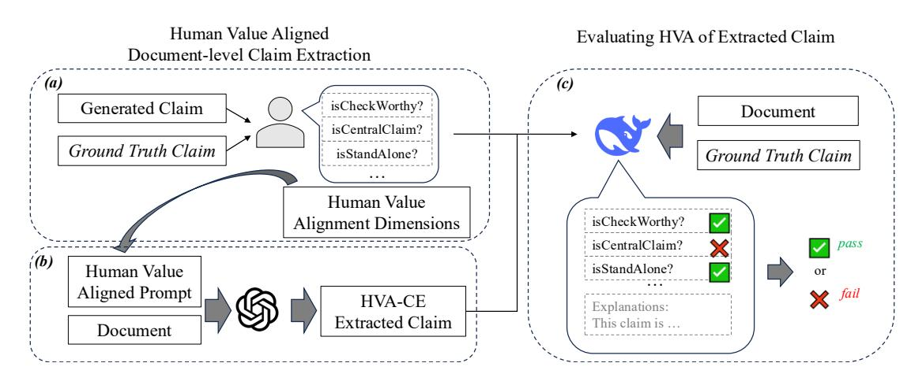
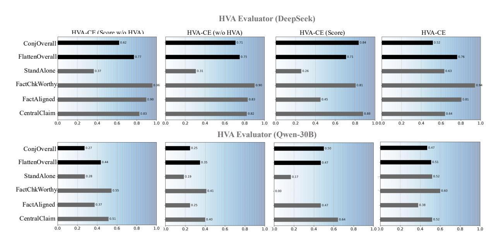
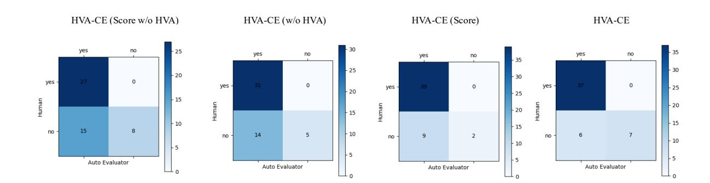

# Measuring and Enhancing Human Value Alignment in Zero-Shot Document-Level Claim Extraction

Yuanzhen Hao University of Chinese Academy of Sciences Beijing, China haoyuanzhen22@mails.ucas.ac.cn

Desheng Wu∗ University of Chinese Academy of Sciences Beijing, China dwu@ucas.ac.cn

#### Abstract

Identifying central claims from long documents is a fundamental yet challenging task in automated fact-checking pipelines. Manual extraction at the document level is costly and requires domain expertise, while existing automatic methods for claim extraction and evaluation tend to overlook critical dimensions that human fact-checkers consider essential for determining claim quality. In this paper, we propose a novel Human Value-Aligned framework that enables zero-shot document-level claim extraction and evaluation by aligning with expert preferences. We first elicit a structured set of Human Value Alignment (HVA) dimensions from expert annotations and incorporate them into prompt design, instructing large language models (LLMs) to extract high-quality claims that align with expert values. To assess the quality of extracted claims, we further introduce an LLM-based automatic evaluator that scores claims across HVA dimensions and quantifies alignment with expert-written claims. Furthermore, we propose a multilevel agreement metric to evaluate the reliability of automatic HVA evaluator. Experiment results show that our method significantly improves central claim extraction performance, achieving stateof-the-art chrF and P@N scores. Moreover, the proposed HVA evaluator achieves high agreement with human judgments and offers interpretable dimension-level assessments of extracted claims. The HVA framework establishes a reliable and scalable way for human-aligned document-level claim extraction and evaluation in real-world scenarios.

# CCS Concepts

# • Information systems → Information retrieval.

# Keywords

Claim Extraction, Evaluation, Value Alignment

#### ACM Reference Format:

Yuanzhen Hao and Desheng Wu. 2026. Measuring and Enhancing Human Value Alignment in Zero-Shot Document-Level Claim Extraction. In Proceedings of the ACM Web Conference 2026 (WWW '26), April 13–17, 2026, Dubai, United Arab Emirates. ACM, New York, NY, USA, [12](#page-11-0) pages. <https://doi.org/10.1145/3774904.3792299>

∗Corresponding author.

© 2026 Copyright held by the owner/author(s). ACM ISBN 979-8-4007-2307-0/2026/04 <https://doi.org/10.1145/3774904.3792299>

#### 1 Introduction

Claim extraction from long documents is a critical step in supporting fact-checkers by identifying central fact-check-worthy assertions for downstream verification [\[6,](#page-8-0) [10\]](#page-8-1). Manual claim extraction, especially at the document level, is not only labor-intensive and time-consuming but also demands domain expertise from professional fact-checkers, as claims are often embedded across multiple sentences and require contextual understanding. With the explosive growth of online documents such as social media posts and web news articles, the importance of automatic claim extraction has become increasingly prominent. As a result, developing documentlevel claim extraction methods is important, yet it remains a highly challenging task.

This challenge has motivated the development of automated systems capable of extracting high-quality claims [\[8\]](#page-8-2), with existing methods categorized into sentence-level and document-level approaches. Sentence-level models treat individual sentences as extraction candidates and often classify them as claims or non-claims [\[9\]](#page-8-3), but they fall short when claims are embedded within documents. In contrast, the document-level methods adopt multi-step pipelines to first summarize salient content, extract contextual information, and finally rewrite extracted sentences into standalone claims [\[6\]](#page-8-0). The emergence of LLMs[\[1,](#page-8-4) [20\]](#page-8-5) has enabled zero-shot claim extraction by prompting the model to directly identify claims from raw documents. While these approaches are flexible and supervisionfree, they tend to rely heavily on shallow linguistic patterns and overlook deeper dimensions of what professional fact-checkers consider high-quality claims, such as claim centrality and fact check worthiness.

Moreover, current evaluation metrics for document-level claim extraction provide limited insight into the detailed dimensions that align with human values. These automatic metrics—such as character-level similarity (e.g., chrF [\[17\]](#page-8-6)), semantic similarity (e.g., BERTScore [\[24\]](#page-8-7)), or textual entailment-based scores (e.g., RoBER-Ta [\[15\]](#page-8-8)) that focus primarily on surface-level overlap or general textual consistency between extracted and ground truth claims. They lack the interpretability needed to assess whether the extracted claims meet expert expectations across distinct quality dimensions.

We posit that effective claim extraction need to go beyond surfacelevel heuristics and incorporate alignment with human values—a set of principles that guide annotators when identifying central claims in documents. To this end, we propose a novel Human Value Aligned framework for document-level claim extraction and evaluation.

First, we abstract a structured set of Human Value Alignment (HVA) dimensions from human annotations of comparison between

[This work is licensed under a Creative Commons Attribution 4.0 International License.](https://creativecommons.org/licenses/by/4.0) WWW '26, Dubai, United Arab Emirates.

extracted claims and expert-written claims. These dimensions (centrality, fact-check worthiness, factual alignment, and stand-alone clarity) are then explicitly integrated into prompt design to instruct LLMs toward generating claims that are better aligned with expert standards.

Second, to evaluate the quality of extracted claims, we propose a novel automatic HVA evaluator that uses LLM-based reasoning to compare extracted claims with ground truth claims across the HVA dimensions. This involves alignment score outcomes and generating explanations, resulting in both fine-grained HVA scores and interpretable evaluation. Furthermore, we propose a multilevel agreement metric to evaluate the reliability of automatic HVA evaluator, including all HVA dimensions and overall fine-grained and conjunctive agreement.

To validate our approach, we conducted experiments on the AVeriTeC-DCE dataset [\[6\]](#page-8-0), which contains documents from social medias and web news, and quantified the chrF score between the extracted claims and the ground truth claims. Empirical results demonstrate that our framework significantly improves claim extraction quality, achieving state-of-the-art chrF and improved P@N when extracting central claim sentence. We also evaluate the HVA metrics of extracted claims via our automatic evaluator. Furthermore, the multi-level agreement evaluation shows strong reliability and practical feasibility of HVA evaluator, offering a credible and promising direction for evaluation research on claim extraction.

### 2 Related Work

# 2.1 Document-Level Claim Extraction

In real-world fact-checking scenarios, claims often need to be extracted from long, unstructured documents rather than isolated sentences. This task requires identifying the central, fact-checkworthy claim from potentially multiple relevant sentences dispersed throughout the document [\[6\]](#page-8-0).

Schlichtkrull et al. [\[19\]](#page-8-9) introduced the AVeriTeC dataset, which compiles real-world claims and corresponding verification sourced from multiple fact-checking organizations. This dataset highlights the practical challenges of claim extraction in real scenarios, where professional fact-checkers must manually identify, distill, and rewrite claims from large volumes of information. Such manual effort is expensive and time-consuming, motivating the need for automated document-level claim extraction methods.

To address this challenge, Deng et al. [\[6\]](#page-8-0) proposed AVeriTeC-DCE, a benchmark specifically tailored for Document-Level Claim Extraction (DCE). They introduced a zero-shot method that first uses a summarization-based encoder BERTSum [\[14\]](#page-8-10) to aggregate contextual information, followed by a question-answering style mechanism to locate context, and finally rewrites the extracted information into a claim.

Recently, LLMs have demonstrated strong capabilities across a wide range of NLP tasks, including document understanding, generation, and instruction [\[1,](#page-8-4) [18,](#page-8-11) [22,](#page-8-12) [23\]](#page-8-13). Given their great ability to understand long-range contexts and follow instructions, LLMs offer significant potential for advancing document-level claim extraction, particularly in zero-shot or low-resource settings.

# 2.2 Human Value Alignment of LLMs

Human values and preferences encompass a wide range of principles, including universal ethical norms, culturally grounded priorities, and domain-specific expectations [\[4\]](#page-8-14). In the context of claim extraction, aligning model behavior with the preferences of professional fact-checkers is essential for generating useful and trustworthy outputs, especially when dealing with diverse and noisy document sources.

LLMs have demonstrated strong capabilities in language understanding and generation through prompt-based instruction [\[3\]](#page-8-15). Prior work shows that modifying or optimizing prompts can significantly influence model performance across tasks [\[12\]](#page-8-16). Promptbased alignment has therefore emerged as an effective approach for guiding LLM behavior toward human-preferred outputs without modifying model weights.

Trivedi et al. [\[21\]](#page-8-17) propose optimizing prompt formulations as a scalable and interpretable method for aligning LLMs with human values. Moreover, Kraus and Kroll [\[11\]](#page-8-18) investigate the use of human–model label disagreements as a learning signal to align model behavior with nuanced human preferences.

Recent advances have demonstrated that LLMs can serve not only as generators but also as effective evaluators across a wide range of NLP and NLG tasks [\[2,](#page-8-19) [7\]](#page-8-20). A common strategy for validating LLM-based evaluation is to measure agreement with human annotations [\[13\]](#page-8-21).

These advancements highlight the growing potential of leveraging prompt engineering and preference modeling to ensure that LLMs behave in ways that align with real-world human values.

# 3 Methodology

We propose a novel framework for Human Value-Aligned Document-Level Claim Extraction (HVA-CE), illustrated in Figure [1,](#page-2-0) which consists of three major components: (a) Human Value Elicitation: We abstract a set of core HVA dimensions by collecting fine-grained annotations from professional fact checkers regarding claim quality. They form the foundation for both the construction of prompts and the evaluation of extracted claims. (b) Human Value-Aligned Document-Level Claim Extraction: We integrate HVA dimensions into prompt design strategies to guide LLMs in producing claims that align with the preferences of professional fact checkers. This enables the model to extract more accurate and contextually appropriate claims. (c) Evaluating Human Value Alignment of Extracted Claims: To assess whether extracted claims reflect human value expectations, we propose a novel LLM-based automatic evaluator. This module produces dimension-wise judgments and provides interpretable analysis for each claim. Furthermore, we propose a multi-level agreement for evaluating the reliability of the automatic HVA evalutor across fine-grain dimensions and conjunctive overall judgment.

This unified framework enables both the enhancement and measurement of document-level claim extraction by systematically aligning the generation and evaluation processes with human values.

Figure 1: Overview of the proposed Human Value-Aligned Claim Extraction (HVA-CE) framework.

#### 3.1 Problem Definition

Given a long document �� consisting of a sequence of sentences �� = {��1, ��2, . . . , ���� }, the goal of document-level claim extraction is to identify a single, central claim �� ∗ that best summarizes the document's fact-check-worthy assertion. Formally, we define the task as learning a function:

�� : �� → �� ∗ (1)

where �� maps a document �� to its corresponding central claim �� ∗ ∈ C, the space of all plausible claims.

### 3.2 Human Value Elicitation

To align model generations with expert-level human judgments, we propose to abstract the alignment dimensions from human evaluations of comparison between generated claims and expert-written claims. Our design builds upon the previous human evaluation work in document-level claim extraction [\[6\]](#page-8-0), which asked a professional fact-checker to evaluate candidate sentences along two dimensions: IsCheckWorthy (whether the sentence is worth fact-checking) and IsCentralClaim (whether the sentence expresses the main idea of the article).

In our preliminary study, we asked annotators with research background in fact-checking to label a set of 50 random samples using previous labels: IsCheckWorthy and IsCentralClaim. However, analysis of the annotation results revealed that these two dimensions alone were insufficient to capture the full quality of claims. The evaluation of claim quality requires assessing whether an extracted claim contains the complete content compared to expert-written claims. We discovered several cases where these dimensions were insufficient to accurately capture claim quality. Several examples highlight such limitation:

Example 1. Ground Truth Claim: U.S. birth certificates are federal bank notes valued between \$650,000 and \$750,000. Extracted Claim: Your birth certificate is really a bank note, which means you, the citizen, are what is known in the stock market as a commodity.

Annotation: {IsCheckWorthy: Yes, IsCentralClaim: Yes}

Observation: The extracted claim omits the essential context "U.S." for "birth certificate," leading to a loss of contextual information.

Example 2. Ground Truth Claim: MPs are not following workplace Covid guidance by wearing masks.

Extracted Claim: MPs are immune.

Annotation: {IsCheckWorthy: No, IsCentralClaim: No}

Observation: Despite the annotation, the extracted claim

maintains factual consistency with the document context.

Example 3. Ground Truth Claim: Scotland's youth unemployment rate fell by 0.3 percentage points over 2019.

Extracted Claim: Scotland's youth unemployment rate fell by 0.3 percentage points over the year.

Annotation: {IsCheckWorthy: Yes, IsCentralClaim: Yes}

Observation: The extracted claim fails to align precisely with the document content, as it omits the temporal reference "2019". This highlights the need for evaluating semantic alignment between claims and documents.

The above examples show that the existing human evaluation dimensions (IsCheckWorthy and IsCentralClaim) are not sufficient to fully capture claim quality. Specifically, certain errors include missing critical context, implicit factual consistency overlooked by the original dimensions, or semantic misalignment with the source document.

To address this limitation, we introduced two additional dimensions, thereby enabling a more fine-grained and comprehensive evaluation of claim quality: isFactAligned: whether the extracted claim is semantically consistent with the content of the source document; isStandAlone: whether the extracted claim contains sufficient contextual information to function independently for downstream fact-checking. From these evaluations, we collect a set of human value dimensions V that reflect key criteria for high-quality claim extraction. For document-level claims, the dimensions ���� ∈ V include:

��1 : Fact check-worthiness (isFactCheckWorthy) ��2 : Semantic consistency with the document (isFactAligned) ��3 : Standalone completeness (isStandAlone) ��4 : Central claim in the document (isCentralClaim)

(2) Fine-grained Flattened Agreement. We flatten the automatic and human label sets across all dimensions and concatenate them across all examples into two long vectors:

V gen flat = Concat {Vgen �� ���� ��=1 (8)

Vhuman flat = Concat {Vhuman �� ���� ��=1 (9)

Then we compute:

��flat = CohenKappa V gen flat , Vhuman flat (10)

This metric evaluates the overall fine-grained consistency of value label predictions across the full dataset.

(3) Conjunctive Agreement. We define a conjunctive score as a binary decision variable ���� ∈ {1, 0} for each example, where ���� = 1 indicates that all four value dimensions are judged as positive (yes), and ���� = 0 otherwise. It is computed as:

�� gen = I "Û4 ��=1 gen ��,�� = yes # (11)

�� human �� = I "Û4 ��=1 human ��,�� = yes (12)

where I[·] is the indicator function, returning 1 if all four value dimensions are labeled as yes, and 0 otherwise. The conjunction Ó4 ��=1 (����,�� = yes) ensures that the claim satisfies every human value dimension simultaneously. This conjunctive result defines a strict pass condition: a claim passes only if all value dimensions are positive.

We then compute the conjunctive agreement on these binary outcomes:

��conj = CohenKappa {�� gen �� } ���� ��=1 , {�� human �� } ���� ��=1 (13)

The multi-level agreement measures are aggregated into a unified metric set:

AHVA = {���� | ���� ∈ V} ∪ ��flat, ��conj (14)

where AHVA serves as the evaluation backbone for analyzing the consistency, reliability, and credibility of automatic evaluators under human value alignment.

# 4 Experiments

#### 4.1 Dataset

To evaluate our framework on real Internet website documents, we conduct our experiments on the AVeriTeC-DCE dataset [\[6\]](#page-8-0), which serves as the primary benchmark for evaluating both our HVA-CE method and the HVA-based evaluator. AVeriTeC-DCE is specifically designed for the zero-shot document-level claim extraction task, which contains documents from over 200 different web sources including news websites and social medias. All the documents are paired with professionally verified claims aggregated from 50 reputable fact-checking organizations [\[19\]](#page-8-9). This diverse sourcing provides expert-annotated ground truth claims in real-world factchecking practice.

AVeriTeC-DCE extends AVeriTeC by retrieving the original source documents for each claim, resulting in a dataset of 1,231 documentclaim pairs used as a test set. These documents span a wide range of domains and media types, including news articles, blogs, and social media contents, offering a real-world and generalizable scenario for evaluating document-level claim extraction.

#### 4.2 Experimental Setup

We evaluate our proposed HVA document-level claim extraction framework based on different LLMs: GPT-4.1 (refered to HVA-CE), GPT-4o-mini[1](#page-4-0) (refered to HVA-CE-mini) and Qwen3-235B-A22B-Instruct[2](#page-4-1) (an open-source model, refered to HVA-CE-Q).

For GPT-4.1, GPT-4o-mini and Qwen3-235B-A22B-Instruct, we apply two extraction strategies: (1) Direct Prompting Generation, which generates claims in one step, and (2) Score-Dec Prompting Generation, which ranks candidate sentences using an LLM-based scoring model and then decontextualizes the top-scoring sentence into a standalone claim.

We evaluate the extracted claims using both conventional similarity based metrics and our proposed human value alignment-based metrics:

- chrF [\[17\]](#page-8-6): A character-level F-score capturing lexical overlap between predicted claims�� ∗ and ground truth claims��, which is used in AVeriTeC-DCE benchmark.
- Precision@N (P@N): Measures the proportion of central claim sentences among the top-�� highest-score extractions.
- HVA metric: Evaluate the claim quality on HVA dimensions via the automatic HVA evaluator. We use the DeepSeek-V3[3](#page-4-2) and Qwen3-30B-A3B-Instruct as the evaluator LLM, both are advanced open-source models.

All LLMs are applied with the temperature set to 0.2 and top-p set to 0.1 to reduce randomness in generation. Prompt templates are standardized across models to ensure fair comparisons. More implementation details are given in Appendix [D.](#page-9-1)

#### 4.3 Baselines

We use the following claim extraction methods as baselines:

- ClaimBuster [\[9\]](#page-8-3): A sentence-level claim extraction method that assigns check-worthiness scores to each sentence.
- DCE [\[6\]](#page-8-0): A zero-shot document-level claim extraction framework that uses pre-trained models to extract central claims with multiple steps.
- Lead Sentence: A baseline that selects the first sentence of the document ��1 as the central claim, because the first sentence is mostly considered as a salient sentence in news articles [\[16\]](#page-8-24).

### 4.4 Results Analysis

We used the AVeriTeC-DCE benchmark evaluation methods to compare the quality of extracted claims (chrF) and central claim sentence extraction precision (P@N). Table [1](#page-5-0) presents the chrF scores of various claim extraction methods on the AVeriTeC-DCE

1https://platform.openai.com/docs/models

2https://qwen.ai

3https://www.deepseek.com

Table 1: Results of chrF scores on the AVeriTeC-DCE dataset comparing methods with and without decontextualization (Dec.).

| Method Lead Sentence        | w/o Dec. 0.239 | w/ Dec. – |
|-----------------------------|----------------|-----------|
| ClaimBuster                 | 0.243          | 0.245     |
| DCE                         | 0.259          | 0.264     |
| HVA-CE-Q (Score w/o HVA)    | 0.247          | –         |
| HVA-CE-Q (Score)            | 0.254          | 0.301     |
| HVA-CE-mini (Score w/o HVA) | 0.242          | –         |
| HVA-CE-mini (Score)         | 0.251          | 0.291     |
| HVA-CE (Score w/o HVA)      | 0.253          | –         |
| HVA-CE (Score)              | 0.261          | 0.308     |
| HVA-CE-Q (w/o HVA)          | –              | 0.261     |
| HVA-CE-Q                    | –              | 0.317     |
| HVA-CE-mini (w/o HVA)       | –              | 0.241     |
| HVA-CE-mini                 | –              | 0.319     |
| HVA-CE (w/o HVA)            | –              | 0.262     |
| HVA-CE                      | –              | 0.319     |

Table 2: Precision@N scores for extraction of central claim sentences. '(Score)' refers to the Score-Dec Strategy.

|             | Method Lead Sentence | P@1 0.423 | P@3   | P@5   | P@10  |
|-------------|----------------------|-----------|-------|-------|-------|
| ClaimBuster |                      | 0.378     | 0.591 | 0.657 | 0.714 |
| DCE         |                      | 0.478     | 0.631 | 0.686 | 0.738 |
| HVA-CE-Q    | (Score)              |           |       |       |       |
| w/o         | HVA                  | 0.465     | 0.636 | 0.691 | 0.750 |
| w/          | HVA                  | 0.482     | 0.651 | 0.697 | 0.761 |
| HVA-CE-mini |                      | (Score)   |       |       |       |
| w/o         | HVA                  | 0.434     | 0.627 | 0.678 | 0.749 |
| w/          | HVA                  | 0.452     | 0.634 | 0.685 | 0.758 |
| HVA-CE      | (Score)              |           |       |       |       |
| w/o         | HVA                  | 0.474     | 0.638 | 0.701 | 0.762 |
| w/          | HVA                  | 0.491     | 0.654 | 0.704 | 0.773 |

dataset, comparing performance with and without decontextualization. Overall, our methods (HVA-CE and HVA-CE-mini) outperform all baselines.

In all baselines, DCE achieves the highest chrF score (0.264) when using decontextualization. HVA-CE achieves a chrF score of 0.319 with direct prompting extraction and 0.308 using Score-Dec extraction, both exceeding the best-performing baseline by a significant margin.

We further observe that incorporating HVA into prompts improves claim quality. For instance, the comparison between HVA-CE-mini (Score w/o HVA: 0.242) and HVA-CE-mini (Score: 0.251) without decontextualization demonstrates that adding HVA dimensions into the prompt enhances the accuracy of extracting central claims. Similar results are observed with the model HVA-CE, where the score improves from 0.253 (w/o HVA) to 0.261 (with HVA), and the decontextualized output increases to 0.308. Additionally, HVA-CE achieves a chrF of 0.319, notably surpassing its counterpart

Table 3: Ablation study on different human value dimensions in HVA-CE.

| Model  | Variant         | chrF(%)    |
|--------|-----------------|------------|
| HVA-CE | (full)          | 31.9       |
| w/o    | StandAlone      | 30.6(-1.3) |
| w/o    | FactAligned     | 31.4(-0.5) |
| w/o    | FactCheckWorthy | 31.6(-0.3) |
| w/o    | CentralClaim    | 31.4(-0.5) |

without HVA (0.262). These consistent improvements across configurations confirm the effectiveness of integrating human values into prompt design and model reasoning for document-level claim extraction.

Central Sentence Extraction Evaluation: We conducted the central sentence extraction experiment in AVeriTeC-DCE benchmark to evaluate the precision of extracting sentence aligned with the central claim in the document. We report P@N metrics in Table [2,](#page-5-1) which reflect the the probability that the central sentence is contained among the top-�� ranked candidates, where higher values indicate better identification of central claims.

Across all values of ��, our proposed HVA-CE models consistently outperform their counterparts (w/o HVA). In particular, HVA-CE (Score) achieves the highest P@1 score of 0.491, significantly surpassing HVA-CE (Score w/o HVA) at 0.474. The performance gain confirms that integrating HVA into the prompt enables the model to more effectively identify central claims.

The effect is consistent as �� increases: HVA-CE (Score) maintains top performance at P@3 (0.654), P@5 (0.704), and P@10 (0.773). These results suggest that not only are the highest-ranked sentences improved, but the overall quality of the top candidate set is enhanced by HVA integration.

Ablation: In Table [3,](#page-5-2) we present an ablation study on the HVA-CE framework by removing individual value dimensions. The results show that excluding any of the dimensions (StandAlone, Fact-CheckWorthy, or CentralClaim) reduces the chrF score compared to the full method. Notably, the removal of the StandAlone dimension results in the largest drop (from 31.9% to 30.6%), suggesting that StandAlone plays a crucial role in capturing document-level context for improving the quality of extracted claims.

### 4.5 Human Evaluation

To assess claim quality beyond automatic metrics, we conduct a human evaluation on 50 randomly selected samples. A human annotator with fact-checking expertise rates each extracted claim across four HVA dimensions: central claim, fact aligned, fact check worthy, and standalone. The overall evaluation uses the conjunctive score and a claim is considered fully correct if it get "yes" on all HVA dimensions. The results are summarized in Table [4.](#page-6-0)

Our best-performing model, HVA-CE, achieves the highest accuracy across most dimensions, with 0.500 on CentralClaim, 0.840 on FactAligned, 0.760 on CheckWorthy, and 0.740 on StandAlone quality. Notably, the overall accuracy of HVA-CE is 0.460, outperforming its counterpart (w/o HVA).

Similarly, the Score-Dec HVA-CE method achieves an overall accuracy of 0.400, outperforming both w/o HVA methods by large

Table 4: Human evaluation results on 50 randomly selected samples. Each method is scored on four HVA dimensions and overall correctness (conjunctive score).

| Method                 | CentralClaim | FactAligned | CheckWorthy | StandAlone | Overall |
|------------------------|--------------|-------------|-------------|------------|---------|
| HVA-CE (Score w/o HVA) | 0.360        | 0.760       | 0.600       | 0.540      | 0.260   |
| HVA-CE (w/o HVA)       | 0.320        | 0.800       | 0.700       | 0.620      | 0.220   |
| HVA-CE (Score)         | 0.440        | 0.840       | 0.800       | 0.780      | 0.400   |
| HVA-CE                 | 0.500        | 0.840       | 0.760       | 0.740      | 0.460   |

Figure 3: Agreement between the automatic HVA evaluator and human annotator across four HVA dimensions and two overall metrics.

Table 5: Automatic HVA evaluation on full test dataset of extracted claims and the corresponding agreement scores (Averaged) across each dimension and conjunctive overall correctness.

| Method                        | CentralClaim | FactAligned | CheckWorthy | StandAlone | Overall |
|-------------------------------|--------------|-------------|-------------|------------|---------|
| HVA-CE-mini (w/o HVA)         | 34.4%        | 81.1%       | 63.8%       | 91.0%      | 30.1%   |
| HVA-CE-mini                   | 43.2%        | 84.8%       | 94.2%       | 94.4%      | 39.6%   |
| HVA-CE (w/o HVA)              | 38.4%        | 80.0%       | 70.0%       | 90.7%      | 33.9%   |
| HVA-CE                        | 43.4%        | 81.9%       | 86.2%       | 91.5%      | 39.7%   |
| Agreement Score (Reliability) | 0.79         | 0.74        | 0.90        | 0.39       | 0.67    |

margins. This confirms that integrating human values into both generation and scoring leads to more accurate claims.

Furthermore, we observe that CentralClaim is the most challenging dimension, with lower scores across all methods. This highlights the importance of identifying central claims in documents to enhance claim extraction.

#### 4.6 Evaluation of HVA Evaluator

We applied our automatic HVA evaluator on the Human Evaluation examples and computed multi-level agreement to evaluate its reliability. Agreements across four HVA dimensions and two overall scores are calculated using Cohen's Kappa (��) compared on

four different methods' generations. The results are illustrated in Figure [3.](#page-6-1) A comparison between the dimension-wise agreement and the overall agreement clearly shows that the HVA evaluator (DeepSeek) demonstrates higher reliability and stability than the one based on Qwen-30B. This finding suggests that the effectiveness of the HVA automatic evaluator is highly dependent on the underlying LLM: stronger LLMs yield more accurate and consistent evaluation results. Consequently, for further experiments and analyses, we adopt DeepSeek as the backbone model. In the following, we provide a more detailed examination of the HVA Evaluator (DeepSeek).

Dimension-wise Agreement. Across all configurations, the automatic HVA evaluator achieves consistently high agreement with human annotations on three key dimensions: CentralClaim, FactAligned, and FactCheckWorthy, with �� values generally exceeding or closely to 0.80. These results indicate strong alignment and provide a high degree of reliability for automated evaluation in these dimensions.

In contrast, the StandAlone dimension shows substantially lower agreement across all evaluations, with �� scores ranging from 0.26 to 0.63. Upon further analysis, we find that our LLM-based HVA evaluator tend to over-predict positive labels (i.e., assign "yes") when judging whether a claim is standalone without extra context (more analysis is in Appendix [C\)](#page-9-2). This optimistic bias leads to decreased consistency with human annotators, who are more precise in assessing standalone completeness.

These results highlight both the robustness and the limitations of automatic HVA evaluation: while the evaluator performs reliably on most human value dimensions, it is underscored when evaluating and interpreting the claim standalone independence.

Overall Agreement: We also report two overall measures: Flattened Agreement and Conjunctive Agreement.

As shown in Figure [3,](#page-6-1) our automatic evaluation framework achieves high flattened agreement, with all the �� scores reaching over 0.7. These results indicate that the LLM-based evaluator maintains strong overall consistency with human annotations across HVA dimensions.

The conjunctive agreement imposes a strict overall score judgment by requiring all HVA dimensions to be simultaneously satisfied "yes". Most configurations achieve �� values exceeding 0.6, with the highest reaching 0.8361 and the lowest reaching 0.5169—still falling within the moderate agreement range. These results indicate that even under strict overall evaluation, the automatic evaluator aligns well with human judgments on average. The conjunctive agreement results affirm that our evaluator is not only consistent at the dimension level but also capable of producing reliable overall HVA judgments, making it a trustworthy tool for comprehensive claim quality assessment.

These results confirm that our automatic HVA evaluation achieves strong alignment with human judgment across major HVA dimensions and overall HVA score.

### 4.7 Automatic HVA Evaluation Results

Table [5](#page-6-2) presents the results of automatic HVA evaluation (Deepseek) on the full test dataset of extracted claims across the four human value dimensions and conjunctive overall score. These evaluations are produced using the HVA evaluator (based on DeepSeek-V3) that generated the assessment aligned with each HVA dimension. To quantify the reliability of these scores, we also report the average multi-level agreement (�� score) between LLM-based and human annotations from previous experimental results: overall (�� = 0.67), CentralClaim (�� = 0.79), FactAligned (�� = 0.74), Fact CheckWorthy (�� = 0.90), and StandAlone (�� = 0.39).

Across all experimental configurations, HVA-CE methods perform well on FactAligned, FactCheckWorthy, and StandAlone dimensions, with the HVA-CE-mini achieving the highest scores

(0.8481, 0.9423, and 0.9446 respectively). The CentralClaim dimension remains the most challenging, with accuracies ranging from 0.3444 to 0.4338. This finding aligns with human evaluation trends, where CentralClaim is typically harder for claim extraction methods.

Comparing full-capacity method (HVA-CE) with the smaller HVA-CE-mini, we observe that the HVA-CE-mini variant achieves comparable or even higher scores in some dimensions, suggesting robustness of the HVA framework under lightweight deployment settings.

Finally, the prompting strategy without HVA underperforms the full HVA-CE framework across all methods and dimensions, particularly in FactCheckWorthy and Overall Accuracy, affirming the importance of integrating structured HVA guidance for claim extraction and evaluation.

These results demonstrate that automatic HVA evalutor can reliably assess claim quality guided by HVA dimensions, with high agreement in most dimensions. The lower agreement in standalone quality highlights a key challenge for future work on improving model reasoning in claim standalone completeness judgment.

#### 5 Conclusion

In this paper, we present a novel zero-shot framework for documentlevel claim extraction that explicitly incorporates Human Value Alignment (HVA) into both extraction and evaluation. By abstracting key human value dimensions and encoding them into prompt design, our HVA-CE method enables LLMs to extract claims that better align with expert-written claims. Furthermore, we introduce an automatic HVA evaluator to assess the quality and consistency of extracted claims, along with new multi-level agreement metrics to evaluate the reliability of the evaluator.

Extensive experiments demonstrate that our approach significantly outperforms existing sentence-level and document-level baselines in automatic metrics. The proposed HVA evaluation framework further proves to be reliable and interpretable, achieving high agreement with human annotations and providing a more insightful metric for claim evaluation.

Our work highlights the importance of human value alignment in Document-level claim extraction and offers a generalizable path forward for aligning LLM-extracted claims with real-world human values. We hope that the automatic HVA evaluator can be extended to broader applications in open-domain claim extraction and automated fact-checking pipelines. The multi-level agreement metric provides a comprehensive and quantifiable measure of evaluator reliability, capturing both strict and fine-grained agreement, offering an evaluation metric for future LLM-based evaluators. By integrating HVA into both extraction and evaluation, our framework provides a method for more effective and human-aligned document-level claim extraction.

# Acknowledgments

This work was supported by the National Social Science Fund of China (Major Program, Grant No. 25&ZD161): Research on Risk Monitoring and Prevention of Green Transition Based on Multi-Source Spatiotemporal Heterogeneous Big Data.

#### References

[1] Josh Achiam, Steven Adler, Sandhini Agarwal, Lama Ahmad, Ilge Akkaya, Florencia Leoni Aleman, Diogo Almeida, Janko Altenschmidt, Sam Altman, Shyamal Anadkat, et al. 2023. Gpt-4 technical report. arXiv preprint arXiv:2303.08774 (2023). [2] Anna Bavaresco, Raffaella Bernardi, Leonardo Bertolazzi, Desmond Elliott, Raquel Fernández, Albert Gatt, Esam Ghaleb, Mario Giulianelli, Michael Hanna, Alexander Koller, Andre Martins, Philipp Mondorf, Vera Neplenbroek, Sandro Pezzelle, Barbara Plank, David Schlangen, Alessandro Suglia, Aditya K Surikuchi, Ece Takmaz, and Alberto Testoni. 2025. LLMs instead of Human Judges? A Large Scale Empirical Study across 20 NLP Evaluation Tasks. In Proceedings of the 63rd Annual Meeting of the Association for Computational Linguistics (Volume 2: Short Papers), Wanxiang Che, Joyce Nabende, Ekaterina Shutova, and Mohammad Taher Pilehvar (Eds.). Association for Computational Linguistics, Vienna, Austria, 238–255.<https://aclanthology.org/2025.acl-short.20/> [3] Tom B. Brown, Benjamin Mann, Nick Ryder, Melanie Subbiah, Jared Kaplan, Prafulla Dhariwal, Arvind Neelakantan, Pranav Shyam, Girish Sastry, Amanda Askell, Sandhini Agarwal, Ariel Herbert-Voss, Gretchen Krueger, Tom Henighan, Rewon Child, Aditya Ramesh, Daniel M. Ziegler, Jeffrey Wu, Clemens Winter, Christopher Hesse, Mark Chen, Eric Sigler, Mateusz Litwin, Scott Gray, Benjamin Chess, Jack Clark, Christopher Berner, Sam McCandlish, Alec Radford, Ilya Sutskever, and Dario Amodei. 2020. Language Models are Few-Shot Learners. In Advances in Neural Information Processing Systems 33: Annual Conference on Neural Information Processing Systems 2020, NeurIPS 2020, December 6-12, 2020, virtual, Hugo Larochelle, Marc'Aurelio Ranzato, Raia Hadsell, Maria-Florina Balcan, and Hsuan-Tien Lin (Eds.). [https://proceedings.neurips.cc/paper/2020/](https://proceedings.neurips.cc/paper/2020/hash/1457c0d6bfcb4967418bfb8ac142f64a-Abstract.html) [hash/1457c0d6bfcb4967418bfb8ac142f64a-Abstract.html](https://proceedings.neurips.cc/paper/2020/hash/1457c0d6bfcb4967418bfb8ac142f64a-Abstract.html) [4] Samuel Cahyawijaya, Delong Chen, Yejin Bang, Leila Khalatbari, Bryan Wilie, Ziwei Ji, Etsuko Ishii, and Pascale Fung. 2025. High-Dimension Human Value Representation in Large Language Models. In Proceedings of the 2025 Conference of the Nations of the Americas Chapter of the Association for Computational Linguistics: Human Language Technologies, NAACL 2025 - Volume 1: Long Papers, Albuquerque, New Mexico, USA, April 29 - May 4, 2025, Luis Chiruzzo, Alan Ritter, and Lu Wang (Eds.). Association for Computational Linguistics, 5303–5330. [doi:10.18653/V1/2025.NAACL-LONG.274](https://doi.org/10.18653/V1/2025.NAACL-LONG.274) [5] Jacob Cohen. 1960. A coefficient of agreement for nominal scales. Educational and psychological measurement 20, 1 (1960), 37–46. [6] Zhenyun Deng, Michael Sejr Schlichtkrull, and Andreas Vlachos. 2024. Documentlevel Claim Extraction and Decontextualisation for Fact-Checking. In Proceedings of the 62nd Annual Meeting of the Association for Computational Linguistics (Volume 1: Long Papers), ACL 2024, Bangkok, Thailand, August 11-16, 2024, Lun-Wei Ku, Andre Martins, and Vivek Srikumar (Eds.). Association for Computational Linguistics, 11943–11954. [doi:10.18653/V1/2024.ACL-LONG.645](https://doi.org/10.18653/V1/2024.ACL-LONG.645) [7] Jiawei Gu, Xuhui Jiang, Zhichao Shi, Hexiang Tan, Xuehao Zhai, Chengjin Xu, Wei Li, Yinghan Shen, Shengjie Ma, Honghao Liu, et al. 2024. A survey on llm-as-a-judge. arXiv preprint arXiv:2411.15594 (2024). [8] Zhijiang Guo, Michael Schlichtkrull, and Andreas Vlachos. 2022. A Survey on Automated Fact-Checking. Transactions of the Association for Computational Linguistics 10 (2022), 178–206. [doi:10.1162/tacl\\_a\\_00454](https://doi.org/10.1162/tacl_a_00454) [9] Naeemul Hassan, Gensheng Zhang, Fatma Arslan, Josue Caraballo, Damian Jimenez, Siddhant Gawsane, Shohedul Hasan, Minumol Joseph, Aaditya Kulkarni, Anil Kumar Nayak, Vikas Sable, Chengkai Li, and Mark Tremayne. 2017. ClaimBuster: The First-ever End-to-end Fact-checking System. Proc. VLDB Endow. 10, 12 (2017), 1945–1948. [doi:10.14778/3137765.3137815](https://doi.org/10.14778/3137765.3137815) [10] Lev Konstantinovskiy, Oliver Price, Mevan Babakar, and Arkaitz Zubiaga. 2021. Toward Automated Factchecking: Developing an Annotation Schema and Benchmark for Consistent Automated Claim Detection. Digital Threats 2, 2, Article 14 (April 2021), 16 pages. [doi:10.1145/3412869](https://doi.org/10.1145/3412869) [11] Kelsey Kraus and Margaret Kroll. 2025. Maximizing Signal in Human-Model Preference Alignment. In AAAI-25, Sponsored by the Association for the Advancement of Artificial Intelligence, February 25 - March 4, 2025, Philadelphia, PA, USA, Toby Walsh, Julie Shah, and Zico Kolter (Eds.). AAAI Press, 27392– 27400. [doi:10.1609/AAAI.V39I26.34950](https://doi.org/10.1609/AAAI.V39I26.34950) [12] Brian Lester, Rami Al-Rfou, and Noah Constant. 2021. The Power of Scale for Parameter-Efficient Prompt Tuning. In Proceedings of the 2021 Conference on Empirical Methods in Natural Language Processing, EMNLP 2021, Virtual Event / Punta Cana, Dominican Republic, 7-11 November, 2021, Marie-Francine Moens, Xuanjing Huang, Lucia Specia, and Scott Wen-tau Yih (Eds.). Association for Computational Linguistics, 3045–3059. [doi:10.18653/V1/2021.EMNLP-MAIN.243](https://doi.org/10.18653/V1/2021.EMNLP-MAIN.243) [13] Zhen Li, Xiaohan Xu, Tao Shen, Can Xu, Jia-Chen Gu, Yuxuan Lai, Chongyang Tao, and Shuai Ma. 2024. Leveraging Large Language Models for NLG Evaluation: Advances and Challenges. In Proceedings of the 2024 Conference on Empirical Methods in Natural Language Processing, Yaser Al-Onaizan, Mohit Bansal, and Yun-Nung Chen (Eds.). Association for Computational Linguistics, Miami, Florida, USA, 16028–16045. [doi:10.18653/v1/2024.emnlp-main.896](https://doi.org/10.18653/v1/2024.emnlp-main.896) [14] Yang Liu and Mirella Lapata. 2019. Text Summarization with Pretrained Encoders. In Proceedings of the 2019 Conference on Empirical Methods in Natural Language Processing and the 9th International Joint Conference on Natural Language Processing, EMNLP-IJCNLP 2019, Hong Kong, China, November 3-7, 2019, Kentaro Inui, Jing Jiang, Vincent Ng, and Xiaojun Wan (Eds.). Association for Computational Linguistics, 3728–3738. [doi:10.18653/V1/D19-1387](https://doi.org/10.18653/V1/D19-1387) [15] Yinhan Liu, Myle Ott, Naman Goyal, Jingfei Du, Mandar Joshi, Danqi Chen, Omer Levy, Mike Lewis, Luke Zettlemoyer, and Veselin Stoyanov. 2019. RoBERTa: A Robustly Optimized BERT Pretraining Approach. CoRR abs/1907.11692 (2019). arXiv[:1907.11692](https://arxiv.org/abs/1907.11692)<http://arxiv.org/abs/1907.11692> [16] Shashi Narayan, Shay B. Cohen, and Mirella Lapata. 2018. Don't Give Me the Details, Just the Summary! Topic-Aware Convolutional Neural Networks for Extreme Summarization. In Proceedings of the 2018 Conference on Empirical Methods in Natural Language Processing, Ellen Riloff, David Chiang, Julia Hockenmaier, and Jun'ichi Tsujii (Eds.). Association for Computational Linguistics, Brussels, Belgium, 1797–1807. [doi:10.18653/v1/D18-1206](https://doi.org/10.18653/v1/D18-1206) [17] Maja Popovic. 2015. chrF: character n-gram F-score for automatic MT evaluation. In Proceedings of the Tenth Workshop on Statistical Machine Translation, WMT@EMNLP 2015, 17-18 September 2015, Lisbon, Portugal. The Association for Computer Linguistics, 392–395. [doi:10.18653/V1/W15-3049](https://doi.org/10.18653/V1/W15-3049) [18] Chengwei Qin, Aston Zhang, Zhuosheng Zhang, Jiaao Chen, Michihiro Yasunaga, and Diyi Yang. 2023. Is ChatGPT a General-Purpose Natural Language Processing Task Solver?. In Proceedings of the 2023 Conference on Empirical Methods in Natural Language Processing, EMNLP 2023, Singapore, December 6-10, 2023, Houda Bouamor, Juan Pino, and Kalika Bali (Eds.). Association for Computational Linguistics, 1339–1384. [doi:10.18653/V1/2023.EMNLP-MAIN.85](https://doi.org/10.18653/V1/2023.EMNLP-MAIN.85) [19] Michael Sejr Schlichtkrull, Zhijiang Guo, and Andreas Vlachos. 2023. AVeriTeC: A Dataset for Real-world Claim Verification with Evidence from the Web. In Advances in Neural Information Processing Systems 36: Annual Conference on Neural Information Processing Systems 2023, NeurIPS 2023, New Orleans, LA, USA, December 10 - 16, 2023, Alice Oh, Tristan Naumann, Amir Globerson, Kate Saenko, Moritz Hardt, and Sergey Levine (Eds.). [http://papers.nips.cc/paper\\_files/paper/2023/hash/](http://papers.nips.cc/paper_files/paper/2023/hash/cd86a30526cd1aff61d6f89f107634e4-Abstract-Datasets_and_Benchmarks.html) [cd86a30526cd1aff61d6f89f107634e4-Abstract-Datasets\\_and\\_Benchmarks.html](http://papers.nips.cc/paper_files/paper/2023/hash/cd86a30526cd1aff61d6f89f107634e4-Abstract-Datasets_and_Benchmarks.html) [20] Hugo Touvron, Louis Martin, Kevin Stone, Peter Albert, Amjad Almahairi, Yasmine Babaei, Nikolay Bashlykov, Soumya Batra, Prajjwal Bhargava, Shruti Bhosale, et al. 2023. Llama 2: Open foundation and fine-tuned chat models. arXiv preprint arXiv:2307.09288 (2023). [21] Prashant Trivedi, Souradip Chakraborty, Avinash Reddy, Vaneet Aggarwal, Amrit Singh Bedi, and George K. Atia. 2025. Align-Pro: A Principled Approach to Prompt Optimization for LLM Alignment. In AAAI-25, Sponsored by the Association for the Advancement of Artificial Intelligence, February 25 - March 4, 2025, Philadelphia, PA, USA, Toby Walsh, Julie Shah, and Zico Kolter (Eds.). AAAI Press, 27653–27661. [doi:10.1609/AAAI.V39I26.34979](https://doi.org/10.1609/AAAI.V39I26.34979) [22] Zhiheng Xi, Wenxiang Chen, Xin Guo, Wei He, Yiwen Ding, Boyang Hong, Ming Zhang, Junzhe Wang, Senjie Jin, Enyu Zhou, Rui Zheng, Xiaoran Fan, Xiao Wang, Limao Xiong, Yuhao Zhou, Weiran Wang, Changhao Jiang, Yicheng Zou, Xiangyang Liu, Zhangyue Yin, Shihan Dou, Rongxiang Weng, Wenjuan Qin, Yongyan Zheng, Xipeng Qiu, Xuanjing Huang, Qi Zhang, and Tao Gui. 2025. The rise and potential of large language model based agents: a survey. Sci. China Inf. Sci. 68, 2 (2025). [doi:10.1007/S11432-024-4222-0](https://doi.org/10.1007/S11432-024-4222-0) [23] Jingfeng Yang, Hongye Jin, Ruixiang Tang, Xiaotian Han, Qizhang Feng, Haoming Jiang, Shaochen Zhong, Bing Yin, and Xia Hu. 2024. Harnessing the power of llms in practice: A survey on chatgpt and beyond. ACM Transactions on Knowledge Discovery from Data 18, 6 (2024), 1–32. [24] Tianyi Zhang, Varsha Kishore, Felix Wu, Kilian Q. Weinberger, and Yoav Artzi. 2020. BERTScore: Evaluating Text Generation with BERT. In 8th International Conference on Learning Representations, ICLR 2020, Addis Ababa, Ethiopia, April 26-30, 2020. OpenReview.net.<https://openreview.net/forum?id=SkeHuCVFDr> A HVA-CE Prompt Strategies To effectively extract central claims from long-form documents in alignment with human value dimensions, our proposed HVA-CE framework adopts two distinct prompting strategies: Direct Prompting and Score-Dec Prompting. Direct Prompting. The Direct Prompt approach directly queries the language model to extract the central claim from a document in a single step, while incorporating Human Value Alignment (HVA) criteria into the instruction. This strategy enables the model to identify the salient and fact-check-worthy claim. An example prompt is shown in Table [7.](#page-10-0) Score-Dec Prompting. The Score-Dec strategy decomposes the

central claim extraction into two sub-tasks to enhance reliability

and controllability. First, the model applies a Score Prompt (see Table [8\)](#page-10-1) to individually score each sentence in the document based on its alignment with central claim. The sentence with the highest score is selected as the candidate central claim sentence. In the second step, a Decontextualization Prompt (Table [9\)](#page-10-2) is used to supplement necessary context and rewrite the selected sentence into a standalone and fully informative central claim.

The full process of the Score-Dec prompt strategy is summarized in Algorithm [1.](#page-9-3) The procedure takes a document as input, segments it into sentences, and iteratively applies scoring and rewriting steps to output a final central claim.

#### B HVA Evaluator for Automatic Claim Assessment

To enable fine-grained and interpretable evaluation of extracted claims, we introduce the HVA Evaluator, an automatic assessment module built upon LLMs. This evaluator systematically scores claims based on four HVA dimensions.

As illustrated in Table [10,](#page-11-1) the evaluator is guided by a carefully designed prompt that incorporates detailed instructions and definitions for each HVA dimension. The prompt explicitly specifies the criteria for "yes" or "no" judgments, along with a structured output format, which ensures consistent and standardized annotation across claims. This structured design not only improves scoring reliability but also facilitates downstream metric computation such as multi-level agreement analysis and alignment diagnostics.

By leveraging the reasoning capabilities of LLMs and aligning them with expert-derived evaluation dimensions, the HVA Evaluator serves as a scalable alternative to manual annotation in benchmarking the quality of claim extraction.

# C Analysis of HVA Evaluator Agreement

This error pattern reveals a limitation of our current automatic evaluator: it tends to misjudge the contextual dependency of claims, especially when shallow surface cues (e.g., grammatically complete sentences) are mistaken for semantic independence. As shown in Figure [4,](#page-10-3) the confusion matrices across all four datasets consistently demonstrate a bias toward "yes" predictions by the LLM-based evaluator compared to human annotators. This leads to low agreement scores whenever the gold labels contain a significant proportion of "no" instances.

In particular, the relatively high agreement on the HVA-CE dataset can be attributed to its label distribution being toward "yes," thereby aligning more closely with the evaluator's prediction tendency.

This finding suggests that further refinement is necessary for the StandAlone dimension. Overall, the StandAlone dimension remains a challenging but essential target for improving the robustness and interpretability of automatic HVA evaluation.

# D Experimental Implementation

In our experiments, we evaluate the HVA evaluator under different LLM backbones. For the models based on OpenAI GPT, we invoke the official OpenAI API. For the DeepSeek-based experiments, we rely on the API service officially provided by DeepSeek. For Qwen models, we adopt two different deployment settings: the 235B model

is accessed via the cloud service provided by Siliconflow[4](#page-9-4) , while the 30B model is executed locally on a single NVIDIA A100-80GB GPU.

The experimental parameters are standardized across models to ensure comparability: the temperature is set to 0.2 and top-p to 0.1 to reduce randomness in generation, and the maximum output length is fixed at 4096 tokens. All other parameters remain at their default settings.

# E LLM Usage Cost

We give a statistical analysis about the average LLM cost of the HVA-CE framework in Table [6.](#page-9-5)

Table 6: Average LLM tokens usage statistics per claim.

| Claim  | Extraction | Value | Evaluator |        | Value |
|--------|------------|-------|-----------|--------|-------|
| Total  | tokens     | 1762  | Total     | tokens | 2226  |
| Output | tokens     | 30    | Output    | tokens | 238   |
| Input  | tokens     | 1732  | Input     | tokens | 1998  |

4<https://www.siliconflow.com/>

Figure 4: Confusion matrices for the Standalone dimension across four datasets.

## Table 7: Prompt of the HVA-CE direct strategy.

Please read the document below and output one self-contained sentence that best represents the most important fact-check-worthy claim.

- Decontextualise the output sentence to make it precise and able to stand alone as the subject of a fact-check:
- 1. No ambiguous pronouns;
- 2. Include full names or clear descriptions of people, organizations, or places if mentioned in the article. Only output the final claim. Do not include explanations: \*\*\* DOCUMENT \*\*\*

#### Table 8: The Score Prompt of the HVA-CE Score-Dec strategy.

Please score each sentence based on how well it aligns with the fact-check-worthy central claim of the document. The following JSON dictionary are all the sentences from the document after segmentation.

Use a high-precision floating-point score (ranged from 0.0 to 1.0) to ensure fine-grained distinction between sentences.

Only output scores in a dictionary in JSON format: \*\*\* SPLIT SENTENCES of DOCUMENT \*\*\*

### Table 9: The Decontextualization Prompt of the HVA-CE Score-Dec strategy.

Please read the Document below and decontextualise the given Claim Sentence to make it precise and able to

stand alone as the subject of a fact-check:

1. No ambiguous pronouns;

2. Include full names or clear descriptions of people, organizations, or places if mentioned in the article.

Only output the final claim. Do not include explanations:

Claim Sentence: \*\*\* CLAIM \*\*\*

Document: \*\*\* DOCUMENT \*\*\*

#### Table 10: The Prompt of the HVA evaluator.

Please evaluate each claim based on how well it aligns with the fact-check-worthy central claim of the document.

- For each claim, you must evaluate the following four aspects, each answered "yes" or "no" and its explanation:
- 1. CentralClaim: Does this claim capture the central fact-check-worthy message of the full document?
- 2. FactAligned: Is this claim semantically faithful to the original document? Does it correctly reflect the meaning of the document?
- 3. FactCheckWorthy: Is the claim check-worthy i.e., does it express a clear, specific, verifiable factual assertion
- 4. StandAlone: Can the claim stand alone without requiring additional context (no ambiguous pronouns, missing subjects, or unclear references)?

The following JSON dictionary are all the claims extracted from the document. And the document is given below.

Output your results in the following format example. Only output this JSON dictionary:

"'json

"0": {

"CentralClaim": ["yes", "explanation..."], "FactAligned": ["no", "explanation..."], "FactCheckWorthy": ["yes", "explanation..."], "StandAlone": ["no", "explanation..."]

}, "1": { ...

> }, ...

"'

Claim Sentence: \*\*\* CLAIM \*\*\*

Document: \*\*\* DOCUMENT \*\*\*