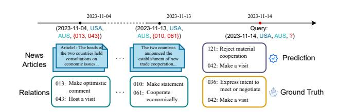
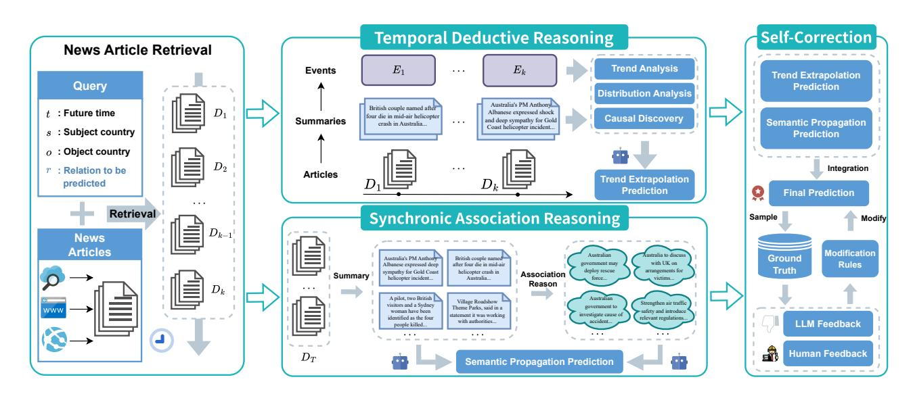
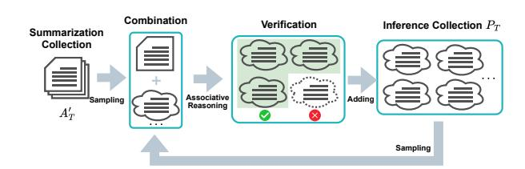
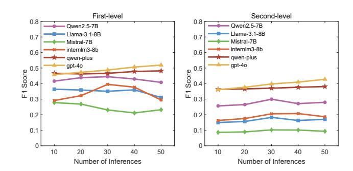
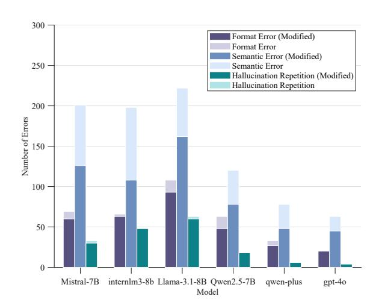
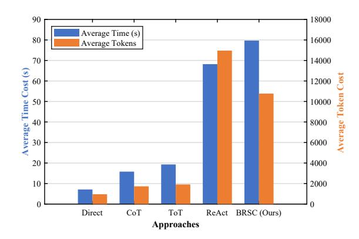

# Thinking Bidirectionally: A Reasoning and Self-Correction Approach for Text-Based Event Prediction with Large Language Models

[Liwei Qian](https://orcid.org/0000-0001-8913-9620)∗ National University of Defense Technology Changsha, China qianliwei21@163.com

[Hang Zhang](https://orcid.org/0000-0003-2514-0811)∗ National University of Defense Technology Changsha, China zhanghang13@nudt.edu.cn

[Yiheng Wu](https://orcid.org/0009-0000-8020-3569) National University of Defense Technology Changsha, China whyntd@163.com

[Yanmin Li](https://orcid.org/0000-0002-9836-582X) National University of Defense Technology Changsha, China yanminli@nudt.edu.cn

[Mengna Zhu](https://orcid.org/0000-0003-3022-8324) National University of Defense Technology Changsha, China zhumengna16@nudt.edu.cn

[Lihua Liu](https://orcid.org/0000-0002-5774-951X) National University of Defense Technology Changsha, China gogonudt@126.com

[Jibing Wu](https://orcid.org/0000-0002-4016-0901)† National University of Defense Technology Changsha, China wujibing@nudt.edu.cn

## Abstract

Using Web Mining and Content Analysis to find and understand clues from the massive amount of unstructured text online is very important for predicting future events and providing early risk warnings in important fields like finance and public safety. While Large Language Models (LLMs) exhibit potential in processing and understanding text, current text-based event prediction faces two primary challenges: first, an insufficient utilization of potential information within the text, such as causal relationships and latent associations, and second, limited predictive reliability constrained by issues like the LLM's own ability and hallucinations. To address these challenges, we propose a novel event prediction framework, Bidirectional Reasoning with Self-Correction (BRSC). BRSC comprises two complementary reasoning dimensions: temporal deductive reasoning, which analyzes the trajectory of historical events along the timeline to enable accurate trend extrapolation, and synchronic associative reasoning, which deeply mines details and latent connections from documents within a specific time window to extended semantic information. In addition, we use a self-correction mechanism that identifies and rectifies potential hallucinations and errors during the reasoning process. Extensive experiments on international relations event prediction demonstrate that BRSC achieves significant improvements over several leading LLM-based methods.

## CCS Concepts

### • Computing methodologies → Information extraction.

© 2026 Copyright held by the owner/author(s). ACM ISBN 979-8-4007-2307-0/2026/04 <https://doi.org/10.1145/3774904.3792306>

## Keywords

Event Prediction, Large Language Models, Bidirectional Reasoning, Self-Correction

### ACM Reference Format:

Liwei Qian, Hang Zhang, Yiheng Wu, Yanmin Li, Mengna Zhu, Lihua Liu, and Jibing Wu. 2026. Thinking Bidirectionally: A Reasoning and Self-Correction Approach for Text-Based Event Prediction with Large Language Models. In Proceedings of the ACM Web Conference 2026 (WWW '26), April 13– 17, 2026, Dubai, United Arab Emirates. ACM, New York, NY, USA, [12](#page-11-0) pages. <https://doi.org/10.1145/3774904.3792306>

### 1 Introduction

The World Wide Web serves as an unprecedented real-time sensor of societal dynamics, yielding a continuous deluge of heterogeneous data from online news, social media, and institutional reports. Distilling this vast data stream into predictive models of future events, a task known as event prediction [\[3,](#page-7-0) [48\]](#page-8-0), represents a grand challenge at the intersection of temporal modeling and causal inference. Success in this endeavor provides invaluable anticipatory intelligence, enabling proactive decision-making in high-stakes domains such as public safety [\[24,](#page-8-1) [43\]](#page-8-2), finance [\[34\]](#page-8-3), and public healthcare [\[25,](#page-8-4) [38,](#page-8-5) [40\]](#page-8-6).

A main approach in event prediction uses structured data, such as knowledge graphs [\[9,](#page-8-7) [10,](#page-8-8) [24\]](#page-8-1). The basic idea of these methods is a trade-off: giving up the rich details of raw text to get a clear structure and logical consistency. Even though these methods are well-developed, they face built-in limitations from this data structuring process. Most real-world event information is found in unstructured text formats, like online news articles and official reports. As a result, changing the text into structured formats unavoidably loses important meaning and contextual links, leading to significant information loss [\[34\]](#page-8-3). This shows the strong need for methods that can work directly on the original source texts.

To circumvent the information loss from structured conversion, some research has shifted towards direct text-based prediction. However, many current approaches, which primarily leverage Large Language Models (LLMs), engage in only a superficial analysis. They use methods like summarization or multi-agent systems for a

∗Both authors contributed equally to this research. †Corresponding author.

[This work is licensed under a Creative Commons Attribution 4.0 International License.](https://creativecommons.org/licenses/by/4.0) WWW '26, Dubai, United Arab Emirates.

Figure 1: Event prediction example. Based on historical event tuples and news articles (left), the model predicts future event relations for a query. These predictions are then compared with the ground truth.

preliminary pass over the source documents but fail to deeply mine fine-grained information [\[12,](#page-8-9) [17\]](#page-8-10), such as the associations between event elements and causal logic. Consequently, their performance improvements remain limited [\[13\]](#page-8-11). Furthermore, the promise of using LLMs for prediction is hampered by their inherent limitations. The model's propensity for hallucination, coupled with its failure to adhere to specified instructions and output formats, leads to unstable performance in complex reasoning, making it difficult to ensure the accuracy and consistency of the final predictions [\[40\]](#page-8-6).

To overcome these aforementioned limitations, we introduce Bidirectional Reasoning with Self-Correction (BRSC), a novel framework inspired by the human investigative process of "sequentially tracing evidence, associating related facts, and iteratively correcting conclusions". This method primarily consists of bidirectional reasoning and self-correction. The bidirectional reasoning part is divided into two complementary dimensions: Temporal Deductive Reasoning (TDR) and Synchronic Associative Reasoning (SAR). TDR performs a longitudinal analysis, tracing event evolution along a timeline to extrapolate future trends. SAR conducts a detailed documents analysis, connecting disparate information within specific time windows to generate new and insightful predictions via semantic propagation. The Self-Correction (SC) module is designed to identify and modify model-induced hallucinations and errors that arise during both the reasoning and final prediction phases.

To summarize our main contributions:

- We introduce BRSC, a novel prediction framework designed for text-based event prediction that emulates the human "trace-associate-correct" reasoning model.
- We propose TDR, a method designed to analyze the trajectory of events in historical texts for the purpose of trend extrapolation.
- We propose SAR, a method designed to mine fine-grained details from texts within the same time window, enabling prediction through semantic propagation.
- Our experimental results demonstrate that the proposed method significantly outperforms existing approaches using LLMs on the task of text-based event prediction.

## 2 Related Work

## 2.1 Event Prediction

To understand and anticipate future event trajectories, research has long focused on the structured representation of event sequences [\[31\]](#page-8-12) and the task of event prediction. Early work utilized script narrative chains to structure events [\[7\]](#page-7-1) and employed foundational language models to comprehend and predict event elements [\[11,](#page-8-13) [29\]](#page-8-14). Contemporary research in event prediction can be broadly categorized into three main streams. The first is event schema induction, which involves constructing and completing event frameworks [\[9,](#page-8-7) [18,](#page-8-15) [21,](#page-8-16) [22,](#page-8-17) [30\]](#page-8-18). The second focuses on knowledge graph completion, aiming to fill in missing elements within event-centric knowledge graphs [\[19,](#page-8-19) [24,](#page-8-1) [32,](#page-8-20) [39,](#page-8-21) [44\]](#page-8-22). The third encompasses question-andanswer (QA) prediction tasks, where predictions are formulated by constructing and answering questions about future event elements [\[12,](#page-8-9) [13,](#page-8-11) [17,](#page-8-10) [47,](#page-8-23) [50\]](#page-8-24). From a technical standpoint, knowledge graph prediction tasks have primarily relied on various neural network models, whereas text-based prediction research has burgeoned with the advent of LLMs.

Current text-based event prediction focuses on multi-agent methods and prediction system construction. Some studies [\[12,](#page-8-9) [13,](#page-8-11) [17\]](#page-8-10) established "retrieval-prediction" processes, while MIRAI [\[43\]](#page-8-2) utilized multi-agent document understanding. However, existing methods fail to fully mine profound textual knowledge or provide reasoning frameworks for accurate prediction, lagging behind human performance. Thus, novel methods for deeper text mining are essential to improve prediction accuracy.

### 2.2 Large Language Model Reasoning Enhancement

In order to make up for the logical fragility of large language models (LLMs) in complex reasoning tasks due to their probabilistic nature, reasoning enhancement technology has emerged. Its core is to optimize the intermediate process of model generation. The mainstream technology paradigm is evolving in three directions: 1. Striving to optimize the internal reasoning structure of the model and improve the logic and exploratory nature of its thinking process. [\[4,](#page-7-2) [5,](#page-7-3) [8,](#page-7-4) [15,](#page-8-25) [35,](#page-8-26) [36,](#page-8-27) [41,](#page-8-28) [46\]](#page-8-29) 2. Using tool learning methods to call on external senses to break through the performance bottleneck of the model itself. [\[26,](#page-8-30) [28,](#page-8-31) [42\]](#page-8-32) 3. Using the strategy of structural decomposition and multi-agent collaboration, complex problems are broken down into subtasks and handled collaboratively by professional agents [\[14,](#page-8-33) [37,](#page-8-34) [45,](#page-8-35) [49\]](#page-8-36).

Event prediction features rich spatiotemporal relationships and logical details, offering significant potential for deep reasoning and mining. However, these elements remain underexplored. Developing novel methods to explicitly leverage these connections could thus lead to substantial performance gains.

### 3 Task Definition

We define an event as consisting of a quadruple �� = (��, ��, ��, ��), where �� is the daily timestamp, ��, �� ∈ E are the subject and object, and �� ∈ R is their relationship (event content). Let �� = {��1, ��2, · · · , ����} be the set of historical events, ���� denotes events at time ��, and all historical events occurring before �� can be recorded as ��<�� . A news article is �� = (��, ��), where �� represents the text content of news. The original news article library of all recorded events is recorded as D, and the set of news articles before time �� is recorded as ��<��

The primary objective of this research is to predict the set of entire relations ���� that will hold between a subject entity �� and an object entity �� at a specified future time �� ′ . We formalize this task as follows: given the historical context provided by both events ��<�� and articles ��<�� and a query of the form�� = (�� ′ , ��, ?, ��) , the ultimate goal is to infer the set of relations ���� that will be instantiated at time �� ′

### 4 Method

By emulating the human reasoning path of 'trace, associate, and correct,' our proposed method (BRSC) establishes a multi-stage process to perform predictions. The process commences with news article retrieval, which filters news texts based on the subject and object entities from the given query �� = (�� ′ , ��, ?, ��) to compile a relevant collection of articles {��1, ��2, · · · ���� ′−1}, providing a sufficient evidence base for the prediction. Subsequently, this collection of articles is processed by three core modules: Temporal Deductive Reasoning (TDR), Synchronic Associative Reasoning (SAR), and Self-Correction (SC). Figure [2](#page-3-0) illustrates how these four modules collaborate, and we will detail each module in the following sections.

## 4.1 Temporal Deductive Reasoning

This module is responsible for the trace analysis within our process, analyzing the trajectory of events along the timeline to extrapolate future trends.

4.1.1 Key Point Summary and Event Tuple Construction. Given that the volume of historical news articles for a query can be substantial, a key challenge is to distill the essential event development trends. We first filter the news article set ���� at time point ��, removing redundant articles and irrelevant information. The filtered articles are then summarized to create a text summary set ���� From these summaries, we extract key information and formalize it into a four-tuple event description, yielding the event set ���� . This process provides the historical event set ��<�� and the summary set ��<��required for our analysis.

4.1.2 Temporal Deductive Analysis. Given the historical event set ��<�� and summary set ��<�� , we employ LLMs to identify underlying evolutionary trends, event distribution patterns, and causal associations.

- Evolution trend analysis: The LLM is tasked with constructing the evolutionary timeline of events from historical data, summarizing the overall trajectory, and analyzing key event points by incorporating background knowledge to identify their likely driving factors. Based on the established trends, the model then proposes several potential future developments, ranked by their probability.
- Distribution pattern analysis: This analysis examines the historical frequency and distribution of each event relation type. We investigate event occurrence rates within specific time periods to identify both periodic patterns and anomalous phenomena. By summarizing these temporal characteristics, we can infer the most probable event types for the given prediction time.
- Causal association analysis: This analysis discovers causal relationships by inspecting key correlating factors in the historical event set ��<�� and summary set ��<�� . We then leverage

these identified causal laws, in conjunction with pre-query events, to derive potential future events.

We synthesize these findings by prompting the LLM with the analytical information ��<�� and ��<�� . The model's output provides the primary evidence for the final prediction.

4.1.3 Trend Extrapolation Prediction. The analysis of evolutionary trends, distribution patterns, and causal associations from the LLM are used as a prompt. By integrating this information with the relation types in CAMEO, we infer the prediction result �� �� ���� via temporal deductive reasoning.

### 4.2 Synchronic Associative Reasoning

This module aims to generate divergent possibilities from a single time period by analyzing combinations of textual clues to infer novel insights, thereby expanding the scope of event prediction.

4.2.1 Articles Screening and Summarization. Historical articles retrieved for a query often cover extensive time spans (months or even years), yet our data possesses daily granularity. Consequently, analyzing every single time point is impractical and would introduce significant noise into the prediction process. To address this, we group articles into temporal intervals for analysis. For a given interval �� = {������������, · · · , �������� } , the corresponding article set is ���� . We employ LLMs to evaluate and rank the articles in ���� based on four criteria: predictive significance, informational richness, relevance and coverage of the period's key events. The top-ranked set of documents is denoted as �� ′ �� . Finally, each article in �� ′ �� is concisely summarized, preserving its essential information, to produce the summary set �� ′ ��

4.2.2 Association Reasoning. Associative reasoning simulates the human analytical model of combining multiple clues, as seen in investigation. By deeply mining textual details, it establishes profound semantic connections between seemingly unrelated entities and events, forming a more comprehensive and insightful understanding of complex situations.

We perform associative reasoning on the summary set �� ′ �� derived from a single time interval. This process involves analyzing combinations of abstracts from �� ′ �� to synthesize novel, predictively significant insights that emerge from integrating their details, thereby generating several potential inferences. These generated inferences are then validated by an LLMs to filter out any that are illogical or redundant with existing information. Finally, validated inferences constitute the inference set ���� .

This process is iterative. The newly generated inferences in ���� are incorporated into a feedback loop for subsequent rounds of reasoning. In each new round, we jointly sample from both the original summary set �� ′ �� and the updated inference set ���� . These samples are combined to perform further associative reasoning, and any resulting novel inferences are validated and used to augment the set ���� . The associative reasoning process is illustrated in Figure [3.](#page-3-1)

4.2.3 Semantic Propagation Prediction. Associative reasoning expands the key semantics of the original text, enriching it with additional details. These resulting inferences are used to construct a prompt, which yields the prediction set �� ������.

Figure 2: BRSC architecture. The left section retrieves news documents based on a query. The upper TDR module extracts event tuples for prediction, while the lower SAR module performs associative reasoning on summaries. On the right, the self-correction module aggregates predictions and refines them using ground truth feedback.

Figure 3: Associative reasoning process. An initial inference set, derived and validated from summary combinations, is iteratively expanded by sampling from both summaries and existing inferences for further relational deduction.

### 4.3 Self-Correction

This module then verifies and corrects the initial predictions, yielding a more accurate final result.

4.3.1 Error Type Analysis. Combining TDR and SAR yields the overall prediction ���� = ���� ���� ∪ ��������. Through sample analysis involving LLMs and human feedback, we identified three common error types: (1) Format Errors, where codes are undefined or violate CAMEO standards; (2) Semantic Errors, where codes contradict event meanings; and (3) Hallucinatory Repetition, involving duplicated codes, prompt examples, or excessive output.

4.3.2 Error Modification. Our correction methodology comprises two approaches. First, for general formatting errors, we employ targeted cleaning functions based on identified common error patterns. Second, to address semantic errors and hallucinatory repetitions, we compared a small sample of the model's predictions against the ground truth. Through a collaborative analysis by human experts and the LLMs, we identified the root causes of these errors and

formulated correction strategies. These strategies are encoded into prompts, enabling the LLMs to self-correct and generate optimized predictions.

Semantic errors primarily stemmed from the LLMs' misalignment between relation codes and their meanings. We mitigated this by supplementing prompts with CAMEO code documentation. Conversely, hallucinatory repetitions often appeared as the recycling of examples or meaningless output, particularly in smaller open-source models. This was addressed by instructing the LLM to strictly prohibit example duplication and filter for meaningful results.

Human feedback is strictly confined to the initial prompt engineering and sample analysis phases. Regarding sample analysis, we empirically identified a 5% sampling rate as the optimal threshold based on tests from 1% to 10%. Our results show diminishing returns beyond this point: the F1-score improved significantly from 72.4% (at 1%) to 85.1% (at 5%), with a negligible gain to 85.3% at 10%. Consequently, the subsequent self-correction operates as a fully automated pipeline by the LLM, requiring no further human intervention.

## 5 Experiments

## 5.1 Experimental Setup

Dataset. We validate our approach using the MIRAI [\[43\]](#page-8-2) and GDELT-500 [\[20,](#page-8-37) [23\]](#page-8-38) datasets. MIRAI is a recently constructed event prediction dataset derived from the Global Database of Events, Language, and Tone (GDELT). GDELT-500 is a benchmark dataset in the fields of knowledge graph completion and event prediction, which we have partially modified for our task by retrieving related historical documents from the web and selecting a suitable set of queries for validation.

Table 1: Statistics of the MIRAI and GDELT-500 datasets.

Table [1](#page-4-0) presents the statistics for the two datasets. Historical events and news articles form the basis for prediction, while the query set—rigorously filtered and multi-source validated for accuracy—serves to evaluate the performance of event prediction methods.

5.1.1 Compared Approaches. We conducted our experiments on a set of 705 queries using Qwen2.5-7B-Instruct as the foundation model. The LLM's temperature was set to 0.4 for all experiments, and we report the average results over 3 independent runs to ensure stability. The specific method of comparison is as follows:

- Direct IO: Directly prompt the LLM with the query. This will test the model's capacity to predict events using only its pre-trained knowledge.
- CoT [\[36\]](#page-8-27): This approach involves providing basic task steps to instruct the LLM in completing the event prediction task.
- ToT [\[41\]](#page-8-28): Instead of being confined to the single, linear path of CoT, this approach utilizes a tree structure to simultaneously explore multiple different reasoning branches.
- ReAct [\[42,](#page-8-32) [43\]](#page-8-2): This is a multi-agent tool-learning approach that completes tasks via a cyclical "Think-Act-Observe" process.
- BRSC: Our approach, which uses bidirectional reasoning for document analysis and a self-correction mechanism to ensure reliable results.

5.1.2 Evaluation Metrics. The CAMEO framework uses two-digit codes for first-level relations. Second-level relations branch from these, adding a third digit to create a more specific, three-digit code. The final output is a set of relations ����, consisting of three-digit codes that correspond to second-level CAMEO event types [\[43\]](#page-8-2). See Appendix [C](#page-10-0) for event code details.

We evaluated the performance of our relational predictions using macro-averaged Precision, Recall, and F1 scores. To achieve this, the metrics were first computed for each query individually against the ground truth and then averaged across all queries. For the binary and quadratic classes predictions, we additionally employed Kullback-Leibler (KL) Divergence to measure the difference between the predicted and true event distributions. For specific calculation methods, please refer to the Appendix [D.](#page-10-1)

## 5.2 Main Results

We evaluated our approach against baselines across six LLMs, comprising four open-source models (Qwen2.5-7B-Instruct [\[33\]](#page-8-39), Llama-3.1-8B-Instruct [\[27\]](#page-8-40), internlm3-8b-instruct [\[6\]](#page-7-5), Mistral-7B-Instructv0.2 [\[16\]](#page-8-41)) and two commercial models (GPT-4o [\[1\]](#page-7-6), qwen-plus [\[2\]](#page-7-7)). Open-source models were deployed via vLLM (v0.9.1) on a dual NVIDIA RTX 4090 (24GB) system running Ubuntu 22.04. Tables [2](#page-5-0) and [3](#page-6-0) present the results, leading to the following conclusions:

5.2.1 Overall Performance Comparison. Our approach significantly outperforms baselines across most settings. Performance on MI-RAI generally exceeds GDELT-500, attributed to the latter's older events and lower text quality, highlighting the impact of data source reliability. Specifically, our method achieves the lowest KL Divergence in Binary and Quad class prediction tasks, closely matching the ground-truth distribution. For first-level and second-level prediction tasks, despite ReAct's occasional higher Precision, our method consistently secures superior overall F1 scores.

5.2.2 Model Performance Comparison. While commercial models generally perform better, our method significantly boosts opensource models. For instance, using Qwen2.5-7B on MIRAI, our approach improved the Binary F1 score by 13% over ReAct, reaching 81.00%. This demonstrates our method as a general framework for structured prediction, enabling smaller open-source models to effectively handle complex tasks without relying solely on largescale architectures.

5.2.3 Approach Performance Comparison. Approaches relying solely on internal knowledge (Direct, CoT) prove insufficient for complex event prediction. While the tool-augmented ReAct framework offers high Precision, its low Recall limits the overall F1 score. In contrast, our BRSC approach resolves this trade-off by substantially boosting Recall while maintaining high Precision, resulting in a superior F1 score. For second-level prediction, our method achieves over 40% Recall on numerous models—surpassing others by more than 10 percentage points. This enhanced recall ensures broader coverage of potential scenarios, making it highly effective for decision support.

5.2.4 Performance Analysis of Complex Tasks. Our approach's advantage grows with task complexity. While all methods degrade on harder tasks (Binary to Second-level), baselines (Direct, CoT) suffer sharp losses on first- and second-level tasks. In contrast, BRSC's performance degrades far more gradual, amplifying its relative lead where challenges are greatest. This underscores our framework's superior robustness and scalability for complex, structured prediction.

5.2.5 Special Findings. We observed a notable anomaly where internlm3-8b-instruct suffered a precipitous performance decline on first- and second-level tasks using ReAct, primarily due to its inability to effectively utilize retrieval tools. This indicates that Agent-based capabilities are not uniformly robust across LLMs, a limitation our approach successfully circumvents.

## 5.3 Ablation Study

We conducted an ablation study to quantify the contribution of each component within our BRSC framework: the TDR, SAR, and SC modules. By systematically removing each module from the full model, we measured its respective impact on performance. Table [4](#page-6-1) summarizes these results, and all of them are tested for statistical significance (��-value ≤ 0.01) using the t-test.

5.3.1 w/o TDR. Removing the TDR module causes the most significant performance degradation. As the primary module capturing temporal dynamics and event trends, TDR is critical for overall performance. Its removal eliminates the ability to reason over the

Table 2: Performance comparison of 5 prediction approaches across 6 LLMs on the MIRAI dataset. For metrics with an up-arrow (↑), higher is better, and for those with a down-arrow (↓), lower is better. The best score for each model is indicated in bold, \* means statistically significant results (��-value ≤ 0.01) using the paired-t-test compared with the best baseline.

| Type Model Approach     | F1 ↑  | Binary KL | ↓ F1  | Quad ↑ KL | ↓ Pre.  | First-level ↑ Rec. | ↑ F1 ↑ | Pre.    | Second-level ↑ Rec. | ↑ F1 ↑  |
|-------------------------|-------|-----------|-------|-----------|---------|--------------------|--------|---------|---------------------|---------|
| Direct                  | 58.66 | 10.04     | 39.42 | 13.42     | 26.98   | 18.68              | 14.86  | 13.81   | 6.58                | 6.59    |
| CoT                     | 66.00 | 8.61      | 46.30 | 12.27     | 32.08   | 15.20              | 16.39  | 10.71   | 5.72                | 5.82    |
| ToT Qwen2.5-7B-Instruct | 67.66 | 8.17      | 45.56 | 12.18     | 31.21   | 15.63              | 17.41  | 11.85   | 7.51                | 7.44    |
| ReAct                   | 67.56 | 6.91      | 51.03 | 9.92      | 36.09   | 36.54              | 29.26  | 25.02   | 28.96               | 20.85   |
| BRSC                    | 81.00 | ∗ 1.12 ∗  | 64.56 | ∗ 2.74    | ∗       |                    |        |         |                     |         |
|                         |       |           |       |           | 35.62   | 68.07              | 38.11  | ∗       |                     |         |
|                         |       |           |       |           |         |                    |        | 19.09   | 52.02               | 22.64 ∗ |
| Direct                  | 59.66 | 9.80      | 40.40 | 13.63     | 23.18   | 11.97              | 11.93  | 9.95    | 5.57                | 4.75    |
| CoT                     | 62.66 | 9.42      | 41.76 | 13.51     | 28.83   | 13.78              | 14.24  | 11.36   | 6.55                | 6.39    |
| ToT                     | 63.66 | 9.20      | 43.83 | 13.14     | 29.33   | 13.85              | 14.36  | 11.69   | 6.57                | 6.47    |
| ReAct                   | 70.00 | 7.39      | 46.43 | 12.23     | 45.62   | 22.69              | 23.88  | 18.68   | 18.31               | 12.98   |
| BRSC                    | 77.16 | ∗ 2.63 ∗  | 59.33 | ∗ 6.15    | ∗       |                    |        |         |                     |         |
|                         |       |           |       |           | 33.96   | 41.27              | 29.68  | ∗       |                     |         |
| Open-Source             |       |           |       |           |         |                    |        | 15.35   | 24.65               | 13.66 ∗ |
| Direct                  | 66.66 | 8.63      | 45.20 | 12.83     | 31.50   | 6.34               | 9.38   | 5.91    | 3.08                | 3.73    |
| CoT                     | 66.33 | 8.60      | 44.93 | 12.62     | 30.00   | 12.64              | 13.87  | 12.56   | 6.09                | 6.69    |
| ToT                     | 65.33 | 8.83      | 44.26 | 12.89     | 30.00   | 12.39              | 13.67  | 11.36   | 5.46                | 5.90    |
| ReAct                   | 66.67 | 8.63      | 32.23 | 16.89     | 6.00    | 3.63               | 3.86   | 1.60    | 1.93                | 1.36    |
| BRSC                    | 73.22 | ∗ 3.83 ∗  | 57.22 | ∗ 5.98    | ∗ 36.18 | 49.38              | 29.53  | ∗ 13.95 | 42.16               | 15.26 ∗ |
| Direct                  | 65.00 | 8.66      | 43.60 | 12.65     | 32.71   | 13.04              | 15.14  | 10.10   | 3.71                | 4.83    |
| CoT                     | 70.66 | 7.11      | 46.68 | 11.95     | 30.66   | 10.51              | 11.99  | 7.21    | 4.63                | 4.08    |
| ToT                     | 69.33 | 7.30      | 47.85 | 11.77     | 27.70   | 12.63              | 13.55  | 5.78    | 3.76                | 3.44    |
| ReAct                   | 63.77 | 8.49      | 42.96 | 12.61     | 36.97   | 21.74              | 20.32  | 23.87   | 12.34               | 11.67   |
| BRSC                    | 70.44 | 5.45 ∗    | 52.16 | ∗ 8.35    | ∗       |                    |        |         |                     |         |
|                         |       |           |       |           | 29.61   | 30.19              | 22.57  | ∗       |                     |         |
|                         |       |           |       |           |         |                    |        | 12.38   | 14.17               | 9.04    |
| Direct                  | 73.66 | 4.03      | 54.83 | 8.68      | 29.80   | 17.47              | 18.07  | 11.92   | 9.81                | 8.14    |
| CoT                     | 78.33 | 1.42      | 53.38 | 8.88      | 32.91   | 19.80              | 20.37  | 17.34   | 11.82               | 10.81   |
| ToT Qwen-Plus           | 78.99 | 1.28      | 54.49 | 8.47      | 32.41   | 20.73              | 21.05  | 16.56   | 12.04               | 10.95   |
| ReAct                   | 83.66 | 1.12      | 64.09 | 6.20      | 50.47   | 48.91              | 41.47  | 35.81   | 41.83               | 31.49   |
| BRSC                    | 83.66 | ∗ 1.07 ∗  | 66.85 | ∗ 2.36    | ∗       |                    |        |         |                     |         |
|                         |       |           |       |           | 46.41   | 61.28              | 46.63  | ∗       |                     |         |
| Commercial              |       |           |       |           |         |                    |        | 33.71   | 51.67               | 34.69 ∗ |
| Direct                  | 83.33 | 2.57      | 64.70 | 5.99      | 29.13   | 31.74              | 25.36  | 10.94   | 13.43               | 9.75    |
| CoT                     | 81.00 | 2.58      | 62.02 | 5.69      | 31.40   | 38.13              | 28.62  | 12.02   | 17.78               | 10.72   |
| ToT GPT-4o              | 82.33 | 2.34      | 63.41 | 5.20      | 31.68   | 38.81              | 29.21  | 12.49   | 17.95               | 10.95   |
| ReAct                   | 82.66 | 2.12      | 64.62 | 5.31      | 46.05   | 52.14              | 40.85  | 34.52   | 47.46               | 32.06   |
| BRSC                    | 83.33 | ∗ 1.11 ∗  | 70.64 | ∗ 2.12    | ∗ 58.46 | 52.98              | 45.07  | ∗ 48.15 | 53.85               | 40.25 ∗ |

temporal dimension, leading to substantial information and performance loss.

5.3.2 w/o SAR. Removing the SAR module causes a moderate overall performance decline. For first-level and second-level tasks, precision slightly increases, but Recall drops sharply, lowering the F1 score. This is expected, as SAR supplements predictions by mining textual associations. Losing these supplementary insights naturally leads to a significant Recall drop, thereby impacting overall performance.

5.3.3 w/o SC. Ablating the SC module causes a comprehensive performance decline, most notably on simpler tasks. By correcting systematic errors, SC effectively boosts error-prone open-source models. The drop is steepest in Binary and Quad tasks, where removing SC's noise-filtering capability causes a substantial decline.

## 5.4 Detailed Analysis

We further conduct a detailed analysis to identify the critical factors that influence each module's behavior.

5.4.1 Analysis-1: Impact of Historical Event Quantity. To understand the impact of data volume on our trend-dependent TDR

module, we conducted an experiment on 42 queries with extensive event histories (>8,000 events). Using Qwen2.5-7B-Instruct and GPT-4o, we made predictions by randomly sampling different quantities of historical events. Each sampling condition was averaged over 20 runs. The results for first-level and second-level prediction are shown in Table [5.](#page-6-2)

Results show that increasing historical events significantly improves performance on first-level and second-level tasks, demonstrating the model's ability to extract key events even near maximum context length. Our method is robust to data loss: omitting up to 50% of historical events degrades performance by less than 10%. Furthermore, larger historical data volumes enhance stability, evidenced by lower prediction variance across runs.

5.4.2 Analysis-2: Impact of Number of Inferences. We analyzed the impact of varying the number of inferences on model performance using 60 queries rich in historical articles. Figure [4](#page-7-8) visualizes the results for the different models.

Results indicate that the number of inference impacts models differently. For open-source models, more inferences do not necessarily improve results, as excessive low-quality inferences can

Table 3: Performance comparison of 5 prediction approaches across 6 LLMs on the GDELT-500 dataset. For metrics with an up-arrow (↑), higher is better, and for those with a down-arrow (↓), lower is better. The best score for each model is indicated in bold, \* means statistically significant results (��-value ≤ 0.01) using the paired-t-test compared with the best baseline.

| Type Model Approach     | F1 ↑  | Binary KL | ↓ F1 ↑ | Quad KL | ↓ Pre.  | First-level ↑ Rec. | ↑ F1 ↑ | Pre.    | Second-level ↑ Rec. | ↑ F1 ↑  |
|-------------------------|-------|-----------|--------|---------|---------|--------------------|--------|---------|---------------------|---------|
| Direct                  | 68.66 | 7.05      | 49.06  | 11.37   | 18.40   | 8.39               | 9.24   | 7.03    | 4.94                | 4.44    |
| CoT                     | 70.66 | 5.86      | 51.26  | 11.04   | 16.96   | 14.91              | 11.04  | 11.13   | 7.65                | 6.18    |
| ToT Qwen2.5-7B-Instruct | 66.66 | 6.82      | 40.13  | 9.36    | 14.06   | 11.83              | 9.88   | 5.47    | 8.47                | 4.81    |
| ReAct                   | 72.66 | 4.40      | 55.86  | 8.42    | 15.23   | 15.44              | 12.72  | 9.50    | 12.65               | 8.76    |
| BRSC                    | 76.44 | ∗ 1.70 ∗  | 56.53  | ∗ 3.61  | ∗ 27.02 | 70.67              | 33.18  | ∗ 14.41 | 55.25               | 19.02 ∗ |
| Direct                  | 58.0  | 9.68      | 42.26  | 13.32   | 10.00   | 9.85               | 7.72   | 4.40    | 8.69                | 4.12    |
| CoT                     | 63.33 | 8.36      | 48.26  | 11.70   | 14.90   | 10.97              | 9.56   | 6.43    | 5.91                | 5.00    |
| ToT                     | 70.66 | 6.73      | 52.4   | 10.88   | 17.90   | 13.41              | 11.62  | 7.63    | 8.18                | 6.06    |
| ReAct                   | 73.77 | 5.45      | 51.33  | 11.07   | 40.66   | 33.01              | 32.10  | 12.91   | 25.26               | 13.27   |
| BRSC                    | 76.00 | ∗ 2.95 ∗  | 56.09  | ∗ 5.42  | ∗       |                    |        |         |                     |         |
| Open-Source             |       |           |        |         | 23.57   | 50.49              | 28.45  | 9.45    | 31.68               | 13.30   |
| Direct                  | 69.33 | 7.17      | 50.78  | 11.35   | 18.00   | 7.79               | 8.63   | 3.50    | 6.97                | 3.61    |
| CoT                     | 72.66 | 6.15      | 51.79  | 10.43   | 23.01   | 13.79              | 14.55  | 7.16    | 6.15                | 4.97    |
| ToT                     | 70.44 | 6.28      | 53.73  | 10.86   | 21.00   | 11.81              | 12.57  | 6.43    | 5.48                | 4.35    |
| ReAct                   | 72.66 | 6.25      | 31.4   | 16.47   | 4.00    | 2.40               | 2.66   | 1.33    | 2.25                | 1.36    |
| BRSC                    | 73.33 | ∗ 3.84 ∗  | 54.73  | ∗ 6.01  | ∗       |                    |        |         |                     |         |
|                         |       |           |        |         | 21.84   | 52.31              | 24.96  | ∗ 8.92  | 47.97               | 12.45 ∗ |
| Direct                  | 56.66 | 9.94      | 44.40  | 12.64   | 18.16   | 12.63              | 12.08  | 5.77    | 8.93                | 5.48    |
| CoT                     | 67.77 | 5.46      | 47.92  | 9.45    | 21.21   | 23.13              | 14.99  | 5.15    | 9.52                | 5.18    |
| ToT                     | 69.99 | 6.32      | 51.86  | 9.86    | 20.66   | 11.61              | 12.46  | 5.70    | 5.72                | 5.09    |
| ReAct                   | 73.99 | 5.69      | 52.39  | 10.33   | 19.0    | 9.84               | 10.34  | 13.0    | 4.42                | 4.77    |
| BRSC                    | 75.33 | ∗ 5.36 ∗  | 57.51  | ∗ 8.81  | ∗       |                    |        |         |                     |         |
|                         |       |           |        |         | 18.41   | 27.27              | 16.98  | ∗       |                     |         |
|                         |       |           |        |         |         |                    |        | 8.42    | 14.29               | 7.25 ∗  |
| Direct                  | 63.33 | 4.35      | 51.26  | 7.76    | 18.83   | 21.58              | 16.92  | 8.45    | 14.33               | 8.13    |
| CoT                     | 69.33 | 4.31      | 54.44  | 7.54    | 22.5    | 23.50              | 19.42  | 12.55   | 18.86               | 12.06   |
| ToT Qwen-Plus           | 77.99 | 1.73      | 58.73  | 7.14    | 26.83   | 21.53              | 20.47  | 13.19   | 16.69               | 12.11   |
| ReAct                   | 79.55 | 1.59      | 64.11  | 4.19    | 43.11   | 66.24              | 45.47  | 28.15   | 56.15               | 31.68   |
| BRSC                    | 82.00 | ∗ 1.43 ∗  |        |         |         |                    |        |         |                     |         |
|                         |       |           | 58.34  | 2.92    | ∗       |                    |        |         |                     |         |
| Commercial              |       |           |        |         | 36.76   | 70.81              | 43.58  | 26.29   | 59.87               | 31.90 ∗ |
| Direct                  | 78.00 | 3.11      | 57.89  | 5.34    | 19.86   | 30.82              | 20.41  | 6.20    | 20.76               | 7.34    |
| CoT                     | 78.66 | 2.46      | 59.79  | 4.53    | 22.47   | 40.04              | 24.83  | 8.59    | 15.43               | 7.95    |
| ToT GPT-4o              | 81.98 | 1.89      | 61.71  | 4.03    | 23.21   | 38.21              | 25.52  | 7.53    | 20.59               | 8.56    |
| ReAct                   | 80.66 | 1.41      | 59.97  | 3.55    | 30.83   | 59.84              | 35.21  | 21.79   | 57.15               | 26.88   |
| BRSC                    | 84.00 | ∗ 0.84 ∗  | 62.25  | ∗ 2.66  | ∗ 38.33 | 73.97              | 44.90  | ∗ 23.68 | 55.96               | 28.31 ∗ |

Table 4: Ablation results for BRSC (full approach) vs. variants without TDR, SAR, or SC. Bolded values in parentheses denote performance drops.

|      | Approach | Binary Quad. First-level Second-level KL ↓ KL ↓ F1 ↑ F1 ↑ |
|------|----------|-----------------------------------------------------------|
| BRSC |          | 1.12 2.74 38.11 22.64                                     |
| w/o  | TDR      | 3.58                                                      |
| w/o  | SAR      | 2.42                                                      |
| w/o  | SC       | 4.14                                                      |

be misleading. In contrast, commercial models generally show performance proportional to inference count. Overall, our approach demonstrates considerable stability, maintaining consistent performance despite these variations.

5.4.3 Analysis-3: LLM Error Distribution and Self-Correction Analysis. We conducted three rounds of experiments on 705 data entries

Table 5: Impact of historical event frequency on prediction performance across different models. Values are presented as mean F1-score ± standard deviation (%).

| Events |       | First-level |       |         |       | First-level | GPT-4o |        |
|--------|-------|-------------|-------|---------|-------|-------------|--------|--------|
| 100    | 34.46 | ± 27.13     | 13.19 | ± 12.05 | 40.04 | ± 13.46     | 32.04  | ± 9.72 |
| 1000   | 36.77 | ± 12.18     | 15.94 | ± 7.09  | 44.37 | ± 7.33      | 35.92  | ± 5.86 |
| 2000   | 37.33 | ± 8.63      | 16.09 | ± 4.03  | 47.24 | ± 5.67      | 38.52  | ± 3.62 |
| 4000   | 44.75 | ± 7.79      | 19.20 | ± 3.78  | 48.53 | ± 4.85      | 40.37  | ± 3.05 |
| 6000   | 47.18 | ± 6.84      | 20.25 | ± 3.18  | 49.61 | ± 4.41      | 41.09  | ± 2.86 |
| > 8000 | 47.83 | ± 5.86      | 21.58 | ± 3.03  | 50.36 | ± 4.30      | 41.71  | ± 2.64 |

to analyze the performance of our self-correction module, with results presented in the Figure [5.](#page-7-9)

Results show significant error rate variation across models. Commercial models substantially outperform open-source ones, indicating a clear correlation between model scale and accuracy. Semantic errors were the most prevalent. While our self-correction method resolves over 90% of format and repetition errors, semantic errors

Figure 4: Performance comparison of various LLMs on firstlevel (left) and second-level (right) prediction tasks with varying numbers of inferences.

Figure 5: Analysis of error distribution and self-correction performance across various LLMs. The three colors categorize the errors: darker shades for corrected errors and lighter shades for uncorrected ones.

remain the hardest to fix. Nevertheless, we rectified over half of them, with commercial models performing exceptionally well.

5.4.4 Analysis-4: Resource Consumption and Computational Complexity. Due to the complex inference process of LLMs, we use resource consumption to measure the algorithm's computational complexity. We measured inference latency and resource consumption on the MIRAI dataset across 6 models. Figure [6](#page-7-10) illustrates the results averaged over 5 runs per query.

Compared to ReAct, agent-based BRSC has similar latency but superior token efficiency and performance, indicating that our approach does not significantly increase overhead relative to other agent-based methods. While agentic approaches generally incur higher costs than non-agent baselines, this is justified by their substantial improvements in accuracy.

## 6 Conclusion

In this work, we focus on comprehensively mining and analyzing rich information from the web text content to enhance the overall

Figure 6: Comparison of average time and token costs across approaches. Blue bars indicate time (left axis), while orange bars denote tokens (right axis).

event prediction capabilities of LLMs. To this end, we now propose the BRSC framework, which systematically integrates two complementary dimensions of reasoning: the evolutionary trends of historical events and the rich details found within contemporaneous texts. By also leveraging the LLM's own inherent self-correction capabilities to reduce errors, our framework is able to significantly enhances its predictive performance. Extensive experiments we conducted strongly demonstrate the superiority of our approach, while also revealing that substantial room for future research remains. Our future work will focus on further leveraging event relationships and adapting our inference logic to handle more complex prediction tasks over longer time spans.

### Acknowledgments

We thank all the anonymous reviewers and meta reviewers for their valuable comments, as well as all of our team members for their support and assistance.

### References

[1] Josh Achiam, Steven Adler, Sandhini Agarwal, Lama Ahmad, Ilge Akkaya, Florencia Leoni Aleman, Diogo Almeida, Janko Altenschmidt, Sam Altman, Shyamal Anadkat, et al. 2023. GPT-4 Technical Report. arXiv preprint arXiv:2303.08774 (2023). [2] Jinze Bai, Shuai Bai, Yunfei Chu, Zeyu Cui, Kai Dang, Xiaodong Deng, Yang Fan, Wenbin Ge, Yu Han, Fei Huang, et al. 2023. Qwen Technical Report. arXiv preprint arXiv:2309.16609 (2023). [3] Janik-Vasily Benzin and Stefanie Rinderle-Ma. 2025. A Survey on Event Prediction Methods from a Systems Perspective: Bringing Together Disparate Research Areas. Comput. Surveys 57, 12 (2025), 1–37. [doi:10.1145/3743672](https://doi.org/10.1145/3743672) [4] Maciej Besta, Nils Blach, Ales Kubicek, Robert Gerstenberger, Michal Podstawski, Lukas Gianinazzi, Joanna Gajda, Tomasz Lehmann, Hubert Niewiadomski, Piotr Nyczyk, et al. 2024. Graph of Thoughts: Solving Elaborate Problems with Large Language Models. In Proceedings of the AAAI conference on artificial intelligence, Vol. 38. 17682–17690. [5] Paul C Bogdan, Uzay Macar, Neel Nanda, and Arthur Conmy. 2025. Thought Anchors: Which LLM Reasoning Steps Matter? arXiv preprint arXiv:2506.19143 (2025). [6] Zheng Cai, Maosong Cao, Haojiong Chen, Kai Chen, Keyu Chen, Xin Chen, Xun Chen, Zehui Chen, Zhi Chen, Pei Chu, et al. 2024. Internlm2 Technical Report. arXiv preprint arXiv:2403.17297 (2024). [7] Nathanael Chambers and Dan Jurafsky. 2008. Unsupervised Learning of Narrative Event Chains. In Proceedings of ACL-08: HLT. 789–797. [8] Wenhu Chen, Xueguang Ma, Xinyi Wang, and William W Cohen. 2022. Program of Thoughts Prompting: Disentangling Computation from Reasoning for Numerical Reasoning Tasks. arXiv preprint arXiv:2211.12588 (2022).

[9] Xinya Du, Zixuan Zhang, Sha Li, Pengfei Yu, Hongwei Wang, Tuan Lai, Xudong Lin, Ziqi Wang, Iris Liu, Ben Zhou, et al. 2022. RESIN-11: Schema-Guided Event Prediction for 11 Newsworthy Scenarios. In Proceedings of the 2022 Conference of the North American Chapter of the Association for Computational Linguistics: Human Language Technologies: System Demonstrations. 54–63. [10] Alberto Garcia-Duran, Sebastijan Dumančić, and Mathias Niepert. 2018. Learning Sequence Encoders for Temporal Knowledge Graph Completion. In Proceedings of the 2018 Conference on Empirical Methods in Natural Language Processing. 4816–4821. [11] Mark Granroth-Wilding and Stephen Clark. 2016. What Happens Next? Event Prediction Using a Compositional Neural Network Model. In Proceedings of the AAAI Conference on Artificial Intelligence, Vol. 30. [12] Yong Guan, Hao Peng, Xiaozhi Wang, Lei Hou, and Juanzi Li. 2024. OpenEP: Open-Ended Future Event Prediction. arXiv preprint arXiv:2408.06578 (2024). [13] Danny Halawi, Fred Zhang, Chen Yueh-Han, and Jacob Steinhardt. 2024. Approaching Human-Level Forecasting with Language Models. In Proceedings of the 38th International Conference on Neural Information Processing Systems. 50426– 50468. [14] Sirui Hong, Mingchen Zhuge, Jonathan Chen, Xiawu Zheng, Yuheng Cheng, Ceyao Zhang, Jinlin Wang, Zili Wang, Steven Ka Shing Yau, Zijuan Lin, et al. 2024. MetaGPT: Meta Programming for a Multi-Agent Collaborative Framework. In 12th International Conference on Learning Representations, ICLR 2024. [15] Jiaxin Huang, Shixiang Gu, Le Hou, Yuexin Wu, Xuezhi Wang, Hongkun Yu, and Jiawei Han. 2023. Large Language Models Can Self-Improve. In Proceedings of the 2023 conference on empirical methods in natural language processing. 1051–1068. [16] Albert Q. Jiang, Alexandre Sablayrolles, Arthur Mensch, Chris Bamford, Devendra Singh Chaplot, Diego de las Casas, Florian Bressand, Gianna Lengyel, Guillaume Lample, Lucile Saulnier, Lélio Renard Lavaud, Marie-Anne Lachaux, Pierre Stock, Teven Le Scao, Thibaut Lavril, Thomas Wang, Timothée Lacroix, and William El Sayed. 2023. Mistral 7B. arXiv preprint arXiv:2310.06825 (2023). [17] Woojeong Jin, Rahul Khanna, Suji Kim, Dong-Ho Lee, Fred Morstatter, Aram Galstyan, and Xiang Ren. 2021. ForecastQA: A Question Answering Challenge for Event Forecasting with Temporal Text Data. In Proceedings of the 59th Annual Meeting of the Association for Computational Linguistics and the 11th International Joint Conference on Natural Language Processing (Volume 1: Long Papers). 4636– 4650. [18] Xiaomeng Jin, Manling Li, and Heng Ji. 2022. Event Schema Induction with Double Graph Autoencoders. In Proceedings of the 2022 conference of the North American chapter of the Association for Computational Linguistics: human language technologies. 2013–2025. [19] Dong-Ho Lee, Kian Ahrabian, Woojeong Jin, Fred Morstatter, and Jay Pujara. 2023. Temporal Knowledge Graph Forecasting Without Knowledge Using In-Context Learning. In Proceedings of the 2023 Conference on Empirical Methods in Natural Language Processing. 544–557. [20] Kalev Leetaru and Philip A Schrodt. 2013. GDELT: Global Data on Events, Location, and Tone, 1979–2012. In ISA annual convention, Vol. 2. Citeseer, 1–49. [21] Manling Li, Sha Li, Zhenhailong Wang, Lifu Huang, Kyunghyun Cho, Heng Ji, Jiawei Han, and Clare Voss. 2021. The Future is not One-dimensional: Complex Event Schema Induction by Graph Modeling for Event Prediction. In Proceedings of the 2021 Conference on Empirical Methods in Natural Language Processing. 5203–5215. [22] Sha Li, Ruining Zhao, Manling Li, Heng Ji, Chris Callison-Burch, and Jiawei Han. 2023. Open-Domain Hierarchical Event Schema Induction by Incremental Prompting and Verification. In Proceedings of the 61st Annual Meeting of the Association for Computational Linguistics (Volume 1: Long Papers). 5677–5697. [23] Xueyuan Lin, Haihong E, Chengjin Xu, Gengxian Zhou, Haoran Luo, Tianyi Hu, Fenglong Su, Ningyuan Li, and Mingzhi Sun. 2023. TFLEX: Temporal Feature-Logic Embedding Framework for Complex Reasoning over Temporal Knowledge Graph. In Proceedings of the 37th International Conference on Neural Information Processing Systems. 73039–73081. [24] Yunshan Ma, Chenchen Ye, Zijian Wu, Xiang Wang, Yixin Cao, Liang Pang, and Tat-Seng Chua. 2023. SCTc-TE: A Comprehensive Formulation and Benchmark for Temporal Event Forecasting. arXiv preprint arXiv:2312.01052 (2023). [25] Matthew BA McDermott, Bret Nestor, Peniel Argaw, Ye Jin, and Isaac Kohane. 2023. Event Stream GPT: A Data Pre-Processing and Modeling Library for Generative, Pre-Trained Transformers over Continuous-Time Sequences of Complex Events. In Proceedings of the 37th International Conference on Neural Information Processing Systems. 24322–24334. [26] Shishir G Patil, Tianjun Zhang, Xin Wang, and Joseph E Gonzalez. 2024. Gorilla: Large Language Model Connected with Massive APIs. In Proceedings of the 38th International Conference on Neural Information Processing Systems. 126544– 126565. [27] David Patterson, Joseph Gonzalez, Urs Hölzle, Quoc Le, Chen Liang, Lluis-Miquel Munguia, Daniel Rothchild, David R So, Maud Texier, and Jeff Dean. 2022. The Carbon Footprint of Machine Learning Training Will Plateau, Then Shrink. Computer 55, 7 (2022), 18–28. [28] Yujia Qin, Shihao Liang, Yining Ye, Kunlun Zhu, Lan Yan, Yaxi Lu, Yankai Lin, Xin Cong, Xiangru Tang, Bill Qian, et al. 2024. ToolLLM: Facilitating Large Language Models to Master 16000+ Real-World APIs. In The Twelfth International Conference on Learning Representations. [29] Kira Radinsky, Sagie Davidovich, and Shaul Markovitch. 2012. Learning Causality for News Events Prediction. In Proceedings of the 21st international conference on World Wide Web. 909–918. [30] Huan Rong, Zhongfeng Chen, Zhenyu Lu, Xiao-ke Xu, Kai Huang, and Victor S Sheng. 2025. Pred-ID: Future Event Prediction Based on Event Type Schema Mining by Graph Induction and Deduction. Information Fusion 117 (2025), 102819. [31] Roger C Schank and Robert P Abelson. 2013. Scripts, Plans, Goals and Understanding, an Inquiry into Human Knowledge Structures. Psychology press. [32] Xiaoming Shi, Siqiao Xue, Kangrui Wang, Fan Zhou, James Y Zhang, Jun Zhou, Chenhao Tan, and Hongyuan Mei. 2023. Language Models Can Improve Event Prediction by Few-Shot Abductive Reasoning. In Proceedings of the 37th International Conference on Neural Information Processing Systems. 29532–29557. [33] Qwen Team. 2024. Qwen2 Technical Report. arXiv preprint arXiv:2407.10671 (2024). [34] Xinlei Wang, Maike Feng, Jing Qiu, Jinjin Gu, and Junhua Zhao. 2024. From News to Forecast: Integrating Event Analysis in LLM-Based Time Series Forecasting with Reflection. Advances in Neural Information Processing Systems 37 (2024), 58118–58153. [35] Xuezhi Wang, Jason Wei, Dale Schuurmans, Quoc V Le, Ed H Chi, Sharan Narang, Aakanksha Chowdhery, and Denny Zhou. 2023. Self-Consistency Improves Chain of Thought Reasoning in Language Models. In The Eleventh International Conference on Learning Representations. [36] Jason Wei, Xuezhi Wang, Dale Schuurmans, Maarten Bosma, Brian Ichter, Fei Xia, Ed H Chi, Quoc V Le, and Denny Zhou. 2022. Chain-of-Thought Prompting Elicits Reasoning in Large Language Models. In Proceedings of the 36th International Conference on Neural Information Processing Systems. 24824–24837. [37] Qingyun Wu, Gagan Bansal, Jieyu Zhang, Yiran Wu, Beibin Li, Erkang Zhu, Li Jiang, Xiaoyun Zhang, Shaokun Zhang, Jiale Liu, et al. 2024. AutoGen: Enabling Next-Gen LLM Applications via Multi-Agent Conversation. In ICLR 2024 Workshop on Large Language Model (LLM) Agents. [38] Tingsong Xiao, Zelin Xu, Wenchong He, Zhengkun Xiao, Yupu Zhang, Zibo Liu, Shigang Chen, My T Thai, Jiang Bian, Parisa Rashidi, et al. 2025. XTSFormer: Cross-Temporal-Scale Transformer for Irregular-Time Event Prediction in Clinical Applications. In Proceedings of the AAAI Conference on Artificial Intelligence, Vol. 39. 28502–28510. [39] Wenjie Xu, Ben Liu, Miao Peng, Xu Jia, and Min Peng. 2023. Pre-Trained Language Model with Prompts for Temporal Knowledge Graph Completion. In Findings of the Association for Computational Linguistics: ACL 2023. 7790–7803. [40] Zhichao Yang, Avijit Mitra, Weisong Liu, Dan Berlowitz, and Hong Yu. 2023. TransformEHR: Transformer-Based Encoder-Decoder Generative Model to Enhance Prediction of Disease Outcomes Using Electronic Health Records. Nature communications 14, 1 (2023), 7857. [41] Shunyu Yao, Dian Yu, Jeffrey Zhao, Izhak Shafran, Tom Griffiths, Yuan Cao, and Karthik Narasimhan. 2023. Tree of Thoughts: Deliberate Problem Solving with Large Language Models. Advances in neural information processing systems 36 (2023), 11809–11822. [42] Shunyu Yao, Jeffrey Zhao, Dian Yu, Nan Du, Izhak Shafran, Karthik Narasimhan, and Yuan Cao. 2023. ReAct: Synergizing Reasoning and Acting in Language Models. In 11th International Conference on Learning Representations, ICLR 2023. [43] Chenchen Ye, Ziniu Hu, Yihe Deng, Zijie Huang, Mingyu Derek Ma, Yanqiao Zhu, and Wei Wang. 2024. MIRAI: Evaluating LLM Agents for Event Forecasting. arXiv preprint arXiv:2407.01231 (2024). [44] Xuanqing Yu, Wangtao Sun, Jingwei Li, Kang Liu, Chengbao Liu, and Jie Tan. 2024. ONSEP: A Novel Online Neural-Symbolic Framework for Event Prediction Based on Large Language Model. In Findings of the Association for Computational Linguistics ACL 2024. 6335–6350. [45] Yifan Zhang, Jingqin Yang, Yang Yuan, and Andrew Chi-Chih Yao. 2023. Cumulative Reasoning with Large Language Models. arXiv preprint arXiv:2308.04371 (2023). [46] Yifan Zhang, Yang Yuan, and Andrew Chi-Chih Yao. 2024. On the Diagram of Thought. arXiv preprint arXiv:2409.10038 (2024). [47] Zhihan Zhang, Yixin Cao, Chenchen Ye, Yunshan Ma, Lizi Liao, and Tat-Seng Chua. 2024. Analyzing Temporal Complex Events with Large Language Models? A Benchmark towards Temporal, Long Context Understanding. In Proceedings of the 62nd Annual Meeting of the Association for Computational Linguistics (Volume 1: Long Papers). 1588–1606. [48] Liang Zhao. 2021. Event Prediction in the Big Data Era: A Systematic Survey. Comput. Surveys 54, 5 (2021), 1–37. [49] Denny Zhou, Nathanael Schärli, Le Hou, Jason Wei, Nathan Scales, Xuezhi Wang, Dale Schuurmans, Claire Cui, Olivier Bousquet, Quoc Le, et al. 2022. Least-to-Most Prompting Enables Complex Reasoning in Large Language Models. arXiv preprint arXiv:2205.10625 (2022). [50] Andy Zou, Tristan Xiao, Ryan Jia, Joe Kwon, Mantas Mazeika, Richard Li, Dawn Song, Jacob Steinhardt, Owain Evans, and Dan Hendrycks. 2022. Forecasting Future World Events with Neural Networks. In Proceedings of the 36th International Conference on Neural Information Processing Systems. 27293–27305.

Causal Relationship Analysis: Investigate the potential causal links between different events or a series of events. Determine what earlier events might have triggered subsequent events. This information will be used to make predictions for the future, so please use it for this purpose and analyze as much as possible.

## B.2 SAR Prompt

The prompt for generating new inferences based on available information is as follows:

### Generate Inferences Prompt

You are a top AI scientist, logician, linguist, and intelligence ana-

lyst. Please think step by step.

The 'news summaries' you will be processing are sourced from a professional news database containing reports on international events from January 1, 2023, to the present. Each summary accurately describes a specific event, where the countries involved are represented by ISO 3166-1 alpha-3 codes, and the relations (interactions) between them are defined by codes from the CAMEO (Conflict and Mediation Event Observations) verb ontology. These summaries encapsulate key information, including the main countries involved, the nature of their interaction, and any important

context or outcomes.

Based on the "summaries" of two news articles, use logical reasoning to derive a new "proposition" of intelligence. In other words, you need to reasonably deduce a new piece of information from

the content of two news summaries.

Please ensure that the "proposition" is logically correct. Please ensure that the "proposition" is not a repetition of the

"summaries".

Please ensure your reasoning is directly deduced from the "summaries" and does not introduce unsourced common knowledge

or external information.

Remember, your "proposition" should help determine whether

the "conclusion" is True, False, or Unknown.

Carefully study the following examples to understand how to generate a "proposition" from "summaries". Each time, use only two "summaries" to generate one "proposition". The proposition should help in judging the conclusion. The "explanation" in the examples is only for learning the reasoning process; do not provide

explanations in the formal output. Here are some examples: {gen\_proposition\_examples}

This is the input for the proposition generation task:

"summaries": {summaries}

Do not output the judgment of the conclusion. Strictly follow the example format and only present a single new proposition after "proposition:". Do not include the "\*" symbol, and do not repeat the "summaries" or "conclusion". You need to learn the reasoning style from the examples, but do not output explanations or any

other information in the formal output. Do not repeat existing cases and prompts. Please give your proposition: "proposition":

## B.3 SC Prompt

The prompt for using an LLM to correct the prediction results is as follows:

|      | Correction      |                          | Prompt     |                  |               |                 |                |            |             |             |
|------|-----------------|--------------------------|------------|------------------|---------------|-----------------|----------------|------------|-------------|-------------|
| You  | are             | a senior                 |            | intelligence     | analyst       |                 | responsible    | for        | the         | final re   |
| view | and             |                          | correction | of an            | AI            | model’s output. | You            | are        |             | processing  |
| a    | large           | dataset                  | of         | international    |               | events where    | each           |            | event has   | been        |
|      | classified      | using                    | a          | CAMEO            | code.         |                 |                |            |             |             |
| Your | task            | is to                    |            | perform a        | systematic    |                 | correction     | of         | the         | entire set  |
| of   | predicted       |                          | results,   | guided           | by a          | pre-existing    |                | analysis   | of          | common      |
| You  | are             | now                      | provided   | with             | two           | key inputs:     |                |            |             |             |
| A    | detailed        |                          |            | {error_summary}, | which         |                 | systematically |            | outlines    | the         |
|      | typical         | error                    | types      | and              | correction    | principles      |                | identified |             | from the    |
|      | model’s         | earlier                  |            | predictions.     |               |                 |                |            |             |             |
| The  |                 | complete                 | set        | of raw           | predictions   | that            | require        |            | correction, | {to        |
| Your |                 | mission                  | is to      |                  | meticulously  | review          | every          | single     | entry       | in {to     |
|      |                 | tal_prediction_results}. |            |                  | Using the     | principles      | and            | insights   |             | from the    |
|      | {error_summary} |                          | as         | your             | guide,        | you must        | identify       | and        |             | correct all |
| po   | tential         | errors.                  | You        | should           |               | generalize      | from the       | error      |             | summary,    |
|      | applying        | its                      | logic      | to rectify       | similar       | mistakes,       |                | even if    | they        | aren’t      |
|      | explicitly      | identical                |            | to the           | examples      | in the          | summary.       |            |             |             |
|      | Please          | output                   | a          | new,             | fully revised | version         | of             | the        | output.     | The         |
|      | format          | of your                  |            | output           | should        | be identical    | to             | the        | input       | {to        |
|      |                 | tal_prediction_results}, |            |                  | containing    | only            | the clean,     |            | corrected   | data.       |

## C Description of Event Codes

The CAMEO ontology organizes event relations into a hierarchical structure, primarily divided into a binary classification of Mediation and Conflict. These are further categorized into four quadratic classes, each containing specific first-level relations defined by two-digit codes.

Under the Mediation category, Verbal Cooperation includes the following relations: "01: Make public statement", "02: Appeal", "03: Expressintent to cooperate", and "04: Consult". The Material Cooperation class involves more tangible actions: "05: Engage in diplomatic cooperation", "06: Engage in material cooperation", "07: Provide aid", and "08: Yield".

The Conflict category is similarly subdivided. Verbal Conflict encompasses interactions such as: "09: Investigate", "10: Demand", "11: Disapprove", "12: Reject", "13: Threaten", and "14: Protest". Finally, Material Conflict describes severe or physical hostile actions: "15: Exhibit military posture", "16: Reduce relations", "17: Coerce", "18: Assault", "19: Fight", and "20: Engage in unconventional mass violence".

The ontology further refines these interactions into three-digit second-level codes to capture specific nuances. In this structure, the first two digits identify the parent relation, while the third digit specifies the precise nature of the interaction. For instance, the category "01: Make public statement" contains sub-events such as "010: Make statement, not specified", "011: Decline comment", "012: Make pessimistic comment", etc.

## D Details of Evaluation Metrics

Let P and G denote the sets of predicted and ground-truth relation codes. We evaluate performance using Precision (��), Recall (��), and F1-score:

### **Summaries:**

- 1. Australian comedian Tim Minchin announced the passing of his mother Ros, who died at 74 after a three-year battle with blood cancer. Minchin, known for his work on "Matilda the Musical," shared the news during a show in Sydney, where he also performed songs about his mother. This event highlights the close bond between Minchin and his family, and his ability to connect with audiences through personal and emotional storytelling.
- 2. In an interview for GQ's 2023 Men of the Year issue, Jacob Elordi criticized the "Kissing Booth" franchise, describing it as "ridiculous" and detrimental to his career. Elordi emphasized the importance of maintaining high standards in his work and expressed shock at those who do not share this perspective. He is currently starring in "Priscilla" as Elvis Presley and "Saltburn," showcasing his commitment to more substantial roles.

### 3. ... **Inferences:**

### **Query : (2023-11-14, AUS, ?, USA)**

- 1. The cybersecurity incident at DP World Australia is expected to affect the operations of ports managed by French Polynesia through the Asia-Pacific region.
- 2. The extension of Russell Balding's term as chair of Racing NSW contradicts the standard public service commission's tenure limit, suggesting a potential political motivation.
- 3. The music competition victory by Fijian rapper Ju Ben is likely to increase his visibility and opportunities in the international music scene.
- 4. The extension of Russell Balding's term as chair of Racing NSW to 14 years may set a precedent for longer board terms in other state government bodies.

5. ...

Figure 8: Summaries and inferences output.

### **News Summaries and Inferences Analysis:**

### **1. Tim Minchin's Mother's Passing:**

**Summary:** Australian comedian Tim Minchin announced the passing of his mother Ros, who died at 74 after a three-year battle with blood cancer. **Inference:** This event highlights the close bond between Minchin and his family, and his ability to connect with audiences through personal and emotional storytelling. **CAMEO Codes:** 010 Make statement: Minchin making a statement about his mother's passing. 019 Express accord: Expressing the close bond and emotional connection.

### **2. Jacob Elordi Criticizes "Kissing Booth" Franchise:**

**Summary:** Jacob Elordi criticized the "Kissing Booth" franchise, describing it as "ridiculous" and detrimental to his career. **Inference:** Elordi emphasized the importance of maintaining high standards in his work and expressed shock at those who do not share this perspective. **CAMEO Codes:** 011 Decline comment: Elordi declining to comment positively on the franchise. 013 Rally opposition against: Rallying opposition against the franchise.

Based on the analysis, we have obtained the final prediction results.

### **Query : (2023-11-14, AUS, ?, USA)**

To analyze the content of the news summaries and the logical propositions and determine the most appropriate CAMEO codes, we will break down each summary and proposition and identify the key relations and actions described.

**Prediction : {"01": ["010", "019"], "07": ["071"], "05": ["051"]}**

**3. ...**

### Figure 9: SAR analysis and prediction.

**Justification for Corrections: 1. Removal of Categories '05', and '07':**

**Query : (2023-11-14, AUS, ?, USA)**

**Modified Prediction : {'01': ['010', '019'], '04': ['042']}**

The model's predictions of "Engage in diplomatic cooperation" (050), "Praise or endorse" (051), and "Provide economic aid" (071) are all incorrect judgments. These events are not present in the ground truth and should therefore be removed. This may have happened because the model misinterpreted contextual text, such as courteous remarks or discussions during the visit, as primary events.

### **2. Refinement of Category '04':**

This requires removing '043' (Host a visit) from your prediction of ['042', '043']. In event annotation, the label often corresponds to the action of the active party or the most central action. In this case, "making a visit" is the core action, while "hosting a visit" is the corresponding action of the passive party. Your model may have failed to distinguish the primary action or the active/passive roles, necessitating this correction for improved precision.

**Prediction : {'01': ['010', '019'], '04': ['042', '043'], '05': ['050', '051'], '07': ['071']}**

**Ground Truth : {'04': ['042']}**

### **Key Insights:**

- **1. High Frequency of 'Make a Visit' (042) and 'Host a Visit' (043) Events:** Both countries frequently engage in high-level visits, indicating a strong diplomatic relationship. The USA and Australia are likely to continue hosting and making visits to each other, possibly for meetings, negotiations, or other high-level engagements.
- **2. Statement and Intent to Cooperate:** Both 'Make a statement, not specified' (043) and 'Express intent to cooperate, not specified' (030) are common.

### **Predictions for the Future:**

- **1. Increased Diplomatic Visits:** Given the high frequency of 'Make a visit' (042) and 'Host a visit' (043) events, we can predict that both countries will continue to engage in high-level diplomatic visits.
- **2. Enhanced Cooperation and Agreements:** The frequent occurrence of 'Express intent to cooperate' (030) and 'Engage in diplomatic cooperation' (050) suggests that both countries are likely to continue working on enhancing their cooperative relationship. We can expect to see more formal agreements and joint initiatives in areas such as trade, defense, and security.
- **3. ...**

### **Recommendations:**

- **1. Enhance Diplomatic Engagement:** Continue to facilitate high-level visits and meetings to strengthen the relationship. Organize regular diplomatic dialogues to address current and emerging issues.
- **2. Promote Joint Initiatives:** Encourage the development of joint projects and initiatives in areas such as trade, defense, and security. Work towards formalizing existing agreements and creating new ones. By leveraging these insights and predictions, we can better understand the dynamics between the

USA and Australia and make informed decisions to enhance their relationship in the future. **Prediction : {"04": ["042", "043"], "05": ["050", "051"]}**

### **Query : (2023-11-14, AUS, ?, USA)**

 Based on the historical data provided, we can derive several insights and make predictions about the future dynamics between the United States (USA) and Australia (AUS). Here's a detailed analysis:

**3. ...**

Figure 7: TDR analysis and prediction.

�� = |P ∩ G| |P | , �� = |P ∩ G| |G| , ��1 = 2 · �� · �� �� + �� . (1)

Furthermore, to measure the distributional discrepancy, we employ the Kullback-Leibler (KL) divergence:

��KL(��G ∥ ��P) = ∑︁ ��G (��) log ��G (��) ��P (��) . (2)

�� Here, ��G and ��P represent the frequency distributions of the ground-truth and predicted relations, respectively. A lower value of ��KL indicates a closer alignment between the predicted distribution and the ground truth.

## E Case Study

We demonstrate our process with a case study predicting events between the United States and Australia for the query (2023-11-14, AUS, ?, USA). The outputs are presented sequentially: the TDR analysis (Figure [7\)](#page-11-1), SAR reasoning (Figure [8\)](#page-11-2), their combined result (Figure [9\)](#page-11-3), and the final self-corrected output (Figure [10\)](#page-11-4). This process yields the final prediction: "{'01': ['010', '019'], '04': ['042']}".