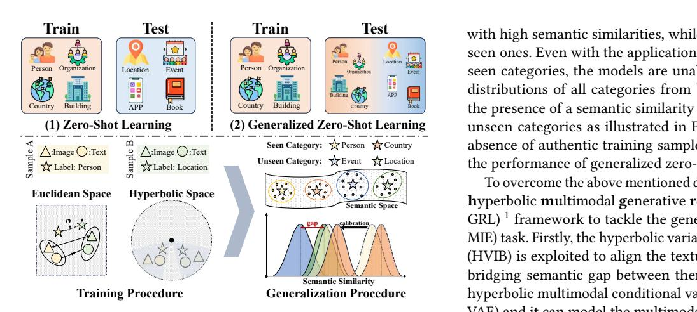
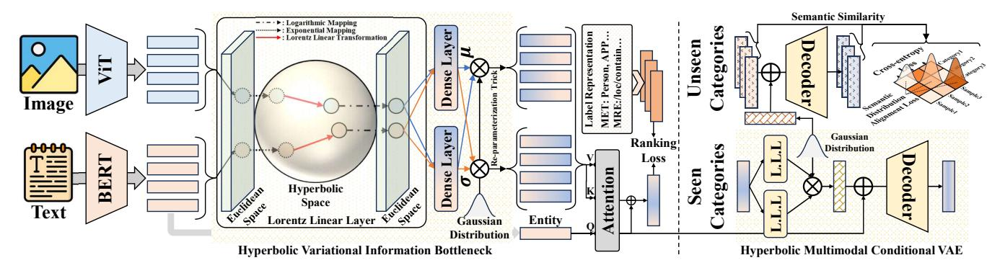
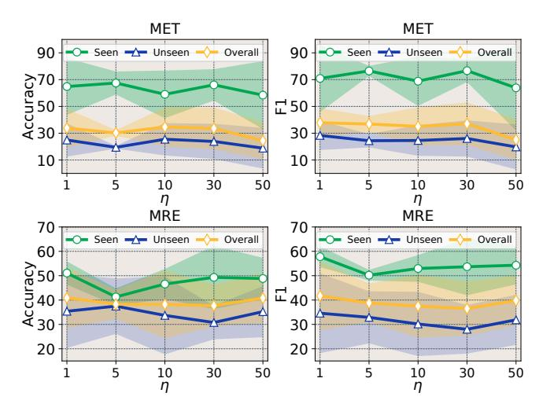
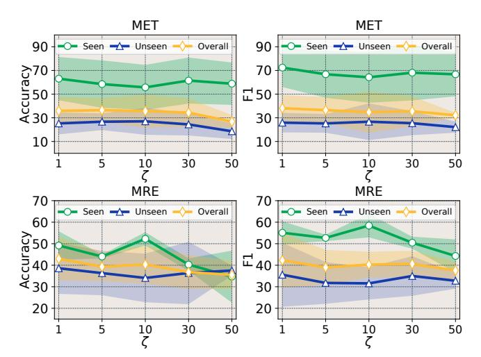
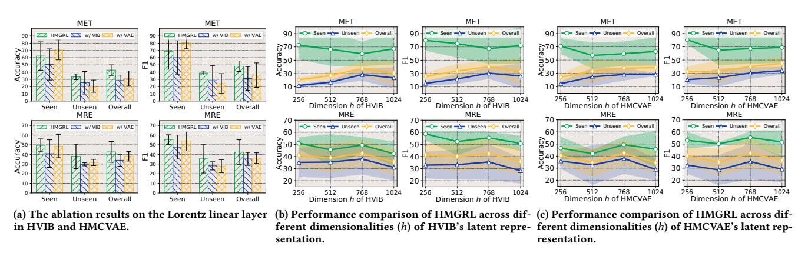
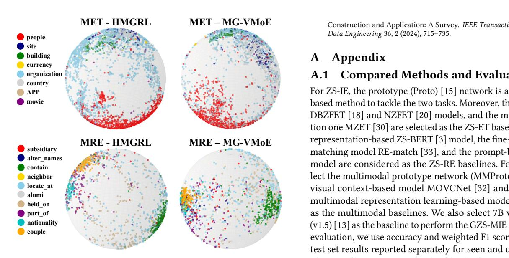

# Hyperbolic Multimodal Generative Representation Learning for Generalized Zero-Shot Multimodal Information Extraction

Baohang Zhou School of Software Tiangong University Tianjin, China zhoubaohang@tiangong.edu.cn

Kehui Song∗ School of Software Tiangong University Tianjin, China songkehui@tiangong.edu.cn

Rize Jin School of Software Tiangong University Tianjin, China jinrize@tiangong.edu.cn

Yu Zhao College of Computer Science VCIP, DISSec, TMCC, TBI Center Nankai University Tianjin, China zhaoyu@dbis.nankai.edu.cn

Xuhui Sui College of Computer Science VCIP, DISSec, TMCC, TBI Center Nankai University Tianjin, China suixuhui@dbis.nankai.edu.cn

Xinying Qian College of Computer Science VCIP, DISSec, TMCC, TBI Center Nankai University Tianjin, China qianxinying@dbis.nankai.edu.cn

Xingyue Guo College of Computer Science VCIP, DISSec, TMCC, TBI Center Nankai University Tianjin, China guoxingyue@dbis.nankai.edu.cn

Ying Zhang College of Computer Science VCIP, DISSec, TMCC, TBI Center Nankai University Tianjin, China yingzhang@nankai.edu.cn

## Abstract

Multimodal information extraction (MIE) constitutes a set of essential tasks aimed at extracting structural information from Web texts with integrating images, to facilitate the structural construction of Web-based semantic knowledge. To address the expanding category set including newly emerging entity types or relations on websites, prior research proposed the zero-shot MIE (ZS-MIE) task which aims to extract unseen structural knowledge with textual and visual modalities. However, the ZS-MIE models are limited to recognizing the samples that fall within the unseen category set, and they struggle to deal with real-world scenarios that encompass both seen and unseen categories. The shortcomings of existing methods can be ascribed to two main aspects. On one hand, these methods construct representations of samples and categories within Euclidean space, failing to capture the hierarchical semantic relationships between the two modalities within a sample and their corresponding category prototypes. On the other hand, there is a notable gap in the distribution of semantic similarity between seen and unseen category sets, which impacts the generative capability of the ZS-MIE models. To overcome the above disadvantages, we delve into the generalized zero-shot MIE (GZS-MIE) task and propose the hyperbolic multimodal generative representation learning framework (HMGRL). The variational information bottleneck and autoencoder

∗Corresponding author.

[This work is licensed under a Creative Commons Attribution](https://creativecommons.org/licenses/by/4.0/) [International 4.0 License.](https://creativecommons.org/licenses/by/4.0/)

WWW '26, April 13–17, 2026, Dubai, United Arab Emirates. © 2026 Copyright held by the owner/author(s). ACM ISBN 979-8-4007-2307-0/2026/04 <https://doi.org/10.1145/3774904.3792311>

networks are reconstructed with hyperbolic space for modeling the multi-level hierarchical semantic correlations among samples and prototypes. Furthermore, the proposed model is trained with the unseen samples generated by the decoder, and we introduce the semantic similarity distribution alignment loss to enhance the model's generalization performance. Experimental evaluations on two benchmark datasets underscore the superiority of HMGRL compared to existing baseline methods.

# CCS Concepts

### • Information systems → Multimedia and multimodal retrieval; • Computing methodologies → Information extraction.

## Keywords

generalized zero-shot learning, multimodal information extraction, multimodal hyperbolic representation learning

### ACM Reference Format:

Baohang Zhou, Kehui Song, Rize Jin, Yu Zhao, Xuhui Sui, Xinying Qian, Xingyue Guo, and Ying Zhang. 2026. Hyperbolic Multimodal Generative Representation Learning for Generalized Zero-Shot Multimodal Information Extraction . In Proceedings of the ACM Web Conference 2026 (WWW '26), April 13–17, 2026, Dubai, United Arab Emirates. ACM, New York, NY, USA, [10](#page-9-0) pages.<https://doi.org/10.1145/3774904.3792311>

# 1 Introduction

Multimodal information extraction (MIE) [\[41\]](#page-9-1) encompasses a set of core tasks aimed at extracting structured information from texts in combination with images to build a multimodal knowledge graph [\[34,](#page-8-0) [35\]](#page-8-1). The MIE tasks are specifically crafted to achieve distinct goals, such as multimodal named entity typing (MET) [\[38\]](#page-9-2)

Test Person Country Location with high semantic similarities, while assigning low scores to unseen ones. Even with the application of a calibration factor to the seen categories, the models are unable to prevent the similarity distributions of all categories from becoming dispersed. Due to the presence of a semantic similarity distribution disparity among unseen categories as illustrated in Figure [1,](#page-1-0) stemming from the absence of authentic training samples, this gap adversely affects the performance of generalized zero-shot learning approaches.

Semantic Space Semantic Similarity gap calibration To overcome the above mentioned disadvantages, we propose the hyperbolic multimodal generative representation learning (HM-GRL) [1](#page-1-1) framework to tackle the generalized zero-shot MIE (GZS-MIE) task. Firstly, the hyperbolic variational information bottleneck (HVIB) is exploited to align the textual and visual modalities for bridging semantic gap between them. Moreover, we design the hyperbolic multimodal conditional variational autoencoder (HMC-VAE) and it can model the multimodal representations of samples and the correlation between them and label prototypes. Based on the above two components, the framework can capture the multi-level hierarchical semantic correlations among samples and prototypes with the advantage of hyperbolic space. During the training procedure, the prototypical knowledge of unseen categories is regarded as a condition to generate samples by the decoder of HMCVAE and the model is trained with real and synthetic samples. To mitigate the numerical disparity in similarity scores inner samples of unseen categories, we introduce a semantic similarity distribution alignment loss, thereby enhancing the generalization capability of the GZS-MIE model. The contributions of this manuscript can be summarized as follows:

Figure 1: The upper part shows the comparison of the zeroshot learning and generalized zero-shot learning. The lower part represents the key challenges of the generalized zeroshot multimodal information extraction.

and multimodal relation extraction (MRE) [\[36\]](#page-8-2). Compared to information extraction (IE) models, multimodal methods are exploited to utilize the interconnections between textual and visual information using various fusion strategies, ultimately boosting performance on different tasks [\[39\]](#page-9-3). To address the challenge posed by the continuously emerging new types of entities or relations, incorporating zero-shot learning into text-based information extraction (ZS-IE) models has enabled the recognition of unseen entity types or relations without the need for further training. Current ZS-IE methods focus on the textual modality and extract entity features for building representations of type or relation prototypes. The names of types or relations are regarded as prototypical knowledge for bridging semantic correlation between samples and categories [\[3,](#page-8-3) [15\]](#page-8-4). To identify novel categories implied in multimodal data, Zhou et al. [\[40\]](#page-9-4) firstly proposed the zero-shot MIE (ZS-MIE) task and introduced the specific architecture and training strategy. Previous studies are grounded in the zero-shot learning [\[19\]](#page-8-5) where the category sets of the training set and the test set are disjoint.

The current ZS-IE and ZS-MIE models are confined to identifying samples solely within the unseen category set. Zhou et al. incorporated zero-shot learning into MET and MRE tasks, enabling the recognition exclusively of unseen entity types or relations during the testing phase [\[38,](#page-9-2) [40\]](#page-9-4). In practical situations, nevertheless, the contents on social media encompass both knowledge that the model has encountered and knowledge that remains novel to it. Therefore, the existing methods face difficulties in handling the above situation. On one hand, the present models rely entirely on Euclidean space throughout the training procedure. Consequently, when modeling samples that exhibit similar texts but dissimilar images, the prototypes representing different labels tend to become closer in proximity as shown in Figure [1.](#page-1-0) On the other hand, the zero-shot learning based methods are limited to training solely with samples from seen categories, aiming to establish the semantic correlation between samples and their corresponding labels. When generalized to a test set that encompasses both seen and unseen categories, the models tend to assign the sample as seen categories

- We are the first one to investigate the generalized zero-shot multimodal information extraction (GZS-MIE) task and analyze the disadvantages of the existing ZS-IE and ZS-MIE models for this new task.
- We propose the hyperbolic multimodal generative representation learning (HMGRL) framework to tackle the GZS-MIE task. The framework does not only contain the HVIB and HMCVAE networks to capture the hierarchical semantic correlations of samples and prototypes but also employs synthetic samples to train the model with a semantic similarity distribution alignment loss, thereby gaining the better generalization ability.
- We carry out comprehensive experiments on two standard MIE benchmark datasets, and the results illustrate that our proposed framework outperforms the baseline methods.

# 2 Related Work

# 2.1 Mulitmodal Information Extraction

With the ever-increasing volume of multimodal data, researchers have come to realize the necessity of extracting the complex semantic information embedded within such data. As a result, they have expanded traditional information extraction (IE) tasks to include multimodal IE, aiming to build a multimodal knowledge graph [\[41\]](#page-9-1). Moon et al. [\[17\]](#page-8-6) first expanded the traditional realm of text-based named entity recognition to incorporate multimodal named entity

1<https://github.com/ZovanZhou/HMGRL>

recognition (MER). To tackle this task, the various fusion strategies including the modality attention mechanism [\[17\]](#page-8-6), the unified multimodal transformer [\[27\]](#page-8-7) or the span-based variational autoencoder [\[37\]](#page-9-5) were proposed to fuse textual and visual data, ultimately improving the performance on sequence label predictions. Zheng et al. [\[36\]](#page-8-2) proposed the multimodal relation extraction (MRE) task, utilizing visual information to enhance the semantic understanding of textual content and accurately identify relations among entities. Furthermore, to jointly model the above two tasks, Yuan et al. [\[28\]](#page-8-8) introduced the multimodal entity-relation extraction (MERE) task and exploited the word-pair relation tagging strategy. To ensure that the extracted multimodal entities are consistent with the human knowledge framework, Zhang et al. [\[32\]](#page-8-9) introduced the multimodal named entity typing (MET) task and employed a cross-modal transformer to analyze visual objects.

The above multimodal information extraction tasks are grounded in supervised learning paradigm, with the goal of directly mapping multimodal data to predefined labels. Nevertheless, our research centers on generalized zero-shot multimodal information extraction (GZS-MIE), which could identify not only seen but also unseen categories without the need for extra training. Generalized zeroshot learning emphasizes the creation of adaptable representations for both samples and semantic labels, facilitating the classification of samples into categories that have not been trained before.

### 2.2 Zero-Shot Information Extraction

Information extraction encompasses a range of tasks aimed at distilling structural information from unstructured texts for constructing knowledge graphs. To enable the extraction of novel knowledge like: the identification of unseen categories including entity types or relations, without requiring further training, the zero-shot learning was introduced into IE and MIE tasks. The vital challenge for them is to learn generalizable representations of entities and prototypical knowledge of categories. For zero-shot named entity typing (ZS-ET), the prototypical knowledge of types was encoded by the label embedding method and Ma et al. [\[15\]](#page-8-4) introduced it to strengthen the semantic connection between the representations of entity mentions and their corresponding types. In terms of data, Chen et al. [\[4\]](#page-8-10), Obeidat et al. [\[18\]](#page-8-11) incorporated supplementary information, such as descriptions of entity mentions and types gathered from websites, into the ZS-ET model to enhance the representations of both entity mentions and their corresponding types. To extract the fine-grained features of contexts relevant to the types, the attention mechanism [\[20\]](#page-8-12) or the knowledge memory capabilities [\[30\]](#page-8-13) were introduced into the ZS-ET models. To address the challenge of zeroshot relation extraction (ZS-RE), entities and relations were input into a pre-trained language model, and Chen and Li [\[3\]](#page-8-3) mapped them into an embedding space by simultaneously optimizing the semantic similarities among them. Zhao et al. [\[33\]](#page-8-14) and Gong and Eldardiry [\[8\]](#page-8-15) respectively proposed the semantic matching method and the prompt-based one for improving the performance on the ZS-RE task. Except for the above text-based IE tasks, Zhou et al. [\[40\]](#page-9-4) investigated the zero-shot multimodal information extraction (ZS-MIE) task and presented the fine-grained representation learning framework including the variational mixture of experts network and the multimodal graph-based virtual adversarial learning.

To sum up, existing ZS-IE and ZS-MIE methods are based on zero-shot learning. These approaches are limited to identifying samples exclusively from unseen categories and struggle to effectively recognize both seen and unseen categories simultaneously. In contrast to these existing studies, our research centers on the GZS-MIE task, which seeks to extract base and novel structural knowledge embedded in multimodal data originating from social media platforms.

### 3 Lorentz Linear Transformation

We introduce the hyperbolic space to model the hierarchical semantic correlations of the samples and prototype representations. There are two effective hyperbolic geometries including the Poincare ball [\[7\]](#page-8-16) and the Lorentz model [\[12\]](#page-8-17) which are utilized to describe hyperbolic space. Considering the advantages of the Lorentz model [\[11\]](#page-8-18), we exploit it to define the linear transformation operation in the hyperbolic space. The ��-dimensional Lorentz model L �� is the Riemannian manifold that satisfying: L �� = {x ∈ R ��+1 | &lt; x, x &gt;L= 1 , ��0 &gt; 0}, where �� is the negative curvature, and &lt; ·, · &gt;L is the Lorentz scalar product. Each point in the Riemannian manifold L �� has the form of x = [��0, x�� ], where ��0 ∈ R and x�� ∈ R . The Lorentz scalar product of the point x and y is defined as follows:

&lt; x, y &gt;L= −��0��0 + ∑︁�� ��=1 ��������

Therefore, the orthogonal space of the Riemannian manifold L at the point x can be defined as: TxL �� = {y ∈ R ��+1 | &lt; x, y &gt;L= 0} where TxL �� is a Euclidean subspace. And T0L �� represents the tangent space at the origin.

The exponential mapping is utilized to map the feature vectors from the Euclidean space to the hyperbolic space. To map the point x ∈ TxL to L by moving along the geodesic, the exponential map can be represented as:

exp�� x (z) = cosh(��)x + sinh(��) z ��

where �� = √ −�� ∥z∥L and ∥z∥L = √ &lt; z, z &gt;L. As the reversed mapping, the logarithmic map is exploited to map the vectors back to the Euclidean space. Given the point y ∈ L in hyperbolic space, the logarithmic map can be defined as:

log�� x (y) = cosh−1 (��) √︁ �� 2 − 1 (y − ��x)

where �� = �� &lt; x, y &gt;L. Based on the above mapping functions, the Lorentz model provides the linear transformation from L �� to L �� for the two points x ∈ L and v ∈ T0L . Given a linear map M : R �� → �� with the weight matrix, the Lorentz linear transformation is defined as:

M�� (x) = exp�� 0 (M ( ˆ log�� 0 (x))),Mˆ = [0,M (v�� )]

where v�� = [��1, ��2, . . . , ����], exp�� 0 : T0L �� → L �� and log�� 0 : L �� → T0L . To model the hierarchical semantic correlations of samples and prototypes, we define the Lorentz linear layer to map the learned features into the hyperbolic space and then use the Lorentz linear transformation in the hyperbolic space. Eventually, we utilize logarithm mapping to map the transformed features back to Euclidean space for tackling the MIE tasks. The process of the Lorentz

| Model   |      | Accuracy | Seen | F1     |      | Named Accuracy | Entity Unseen | Typing F1 |      | Accuracy | Overall | F1     | Model    |      | Accuracy | Seen | F1     |      | Relation Accuracy | Unseen | Extraction F1 |      | Accuracy | Overall | F1     |
|---------|------|----------|------|--------|------|----------------|---------------|-----------|------|----------|---------|--------|----------|------|----------|------|--------|------|-------------------|--------|---------------|------|----------|---------|--------|
| Proto   | 67.9 | ± 27.2   | 73.3 | ± 23.5 | 15.3 | ± 10.0         | 14.2          | ± 6.4     | 21.9 | ± 9.0    | 22.5    | ± 8.9  | Proto    | 43.6 | ± 3.3    | 51.0 | ± 5.3  | 31.6 | ± 18.5            | 29.6   | ± 15.5        | 34.6 | ± 15.2   | 36.2    | ± 14.9 |
| DBZFET  | 76.7 | ± 7.1    | 82.4 | ± 7.2  | 19.8 | ± 14.2         | 20.8          | ± 14.1    | 29.4 | ± 15.7   | 31.2    | ± 16.5 | ZS-BERT  | 53.1 | ± 15.3   | 59.7 | ± 15.3 | 17.3 | ± 2.8             | 20.7   | ± 3.0         | 25.7 | ± 3.4    | 30.6    | ± 4.9  |
| NZFET   | 63.3 | ± 32.8   | 66.2 | ± 33.1 | 7.4  | ± 5.6          | 7.5           | ± 5.2     | 11.6 | ± 7.6    | 12.9    | ± 8.8  | RE-match | 49.9 | ± 6.8    | 56.0 | ± 4.8  | 26.9 | ± 16.3            | 28.7   | ± 14.1        | 31.9 | ± 14.7   | 36.3    | ± 13.4 |
| MZET    | 19.8 | ± 18.9   | 20.4 | ± 19.4 | 29.1 | ± 20.0         | 31.2          | ± 20.6    | 14.5 | ± 11.4   | 16.1    | ± 13.0 | ZS-SKA   | 53.7 | ± 8.8    | 60.3 | ± 7.2  | 24.6 | ± 12.9            | 23.6   | ± 14.6        | 32.6 | ± 14.3   | 32.3    | ± 16.9 |
| MMProto | 62.4 | ± 30.9   | 68.9 | ± 29.2 | 18.2 | ± 11.3         | 21.6          | ± 11.9    | 24.0 | ± 12.9   | 30.3    | ± 15.3 | MMProto  | 54.8 | ± 0.8    | 62.5 | ± 1.1  | 29.1 | ± 14.8            | 28.8   | ± 10.8        | 36.5 | ± 13.0   | 38.6    | ± 10.8 |
| MOVCNet | 65.5 | ± 32.8   | 68.6 | ± 34.4 | 14.0 | ± 3.2          | 15.5          | ± 8.5     | 21.5 | ± 2.9    | 25.2    | ± 13.6 | MOVCNet  | 35.1 | ± 8.6    | 42.6 | ± 3.4  | 31.2 | ± 9.1             | 27.4   | ± 6.1         | 31.5 | ± 2.7    | 32.9    | ± 3.9  |
| MG-VMoE | 55.7 | ± 25.8   | 61.6 | ± 28.1 | 25.3 | ± 21.4         | 29.4          | ± 25.1    | 30.2 | ± 20.8   | 36.0    | ± 24.4 | MG-VMoE  | 32.4 | ± 6.8    | 37.5 | ± 11.1 | 26.4 | ± 18.7            | 26.5   | ± 16.2        | 26.1 | ± 14.6   | 30.1    | ± 14.7 |
| Ours    | 62.3 | ± 19.6   | 68.8 | ± 24.7 | 33.4 | ± 3.9          | 38.8          | ± 2.6     | 42.8 | ± 7.3    | 48.2    | ± 7.3  | Ours     | 49.5 | ± 6.7    | 55.4 | ± 5.0  | 37.9 | ± 12.6            | 35.5   | ± 14.7        | 42.6 | ± 10.8   | 42.4    | ± 12.7 |
| LLaVA   | 54.6 | ± 12.7   | 61.2 | ± 17.0 | 37.8 | ± 31.1         | 41.6          | ± 23.8    | 57.7 | ± 15.7   | 49.5    | ± 16.2 | LLaVA    | 20.6 | ± 3.6    | 18.4 | ± 8.2  | 12.2 | ± 3.7             | 15.2   | ± 1.7         | 14.9 | ± 2.1    | 15.7    | ± 3.1  |

Figure 3: A comparative analysis to the performance of HM-GRL across different hyper-parameter �� values.

the remaining 10% are designated for the validation set. The test set includes the remaining 30% of instances from seen categories and all instances from unseen categories. The dimensionality �� of hidden representations and the learning rate are set to 768 and 1e-5 respectively. We configure 20 epochs and a batch size of 14 for MET, and 25 epochs with a batch size of 8 for MRE. The dimensionality ℎ of latent representations undergoes search across {256, 512, 768, 1024}, whereas hyper-parameters �� and �� are searched in {1, 5, 10, 30, 50}. For �� selection, we evaluate the model on the validation set following each training epoch. We run each experiment three times with different random seeds and report the mean and standard deviation of performance metrics. All experiments are expedited using NVIDIA GTX A6000 devices. The compared methods and evaluation metrics are described in Appendix [A.1.](#page-9-6)

### 5.2 Experimental Results

The HMGRL framework is evaluated alongside baseline models on the MET and MRE benchmark datasets, and the detailed experimental results are shown in Table [1.](#page-5-1) Multimodal-based methods outperform text-based ones across most evaluation metrics on the two tasks, thereby confirming the efficacy of incorporating visual modalities. Our model achieves the highest performance in terms of both accuracy and F1 scores on the "Unseen" and "Overall" items of the MET dataset, surpassing the second-best results by 12.6% and 12.2% for overall F1 and accuracy, respectively. The aforementioned findings also underscore the efficacy of the proposed framework in identifying novel entity types although it entails a minor reduction in performance for the seen categories. On the MRE dataset, our model surpasses the baseline methods in both accuracy and F1 scores of the "Unseen" and "Overall" items, attaining an accuracy improvement of 6.1% and an F1 score enhancement of 3.8% over the second-best performance. When it comes to employing a large language model for zero-shot inference without any training, LLaVA demonstrates superior performance compared to our model on the MET dataset; however, it falls short on the MRE dataset. Because the backbone model LLaMA [\[22\]](#page-8-31) of LLaVA was trained with the Wikipedia pages and the entities in the MET

Figure 4: A comparative analysis to the performance of HM-GRL across different hyper-parameter �� values.

Table 2: The ablation study results of HMGRL on the MET and MRE benchmark datasets.

dataset were stored on them. To sum up, our model surpasses both text-based and multimodal baselines, thanks to the utilization of multimodal representation alignment facilitated by the HVIB network, along with the development of HMCVAE. This approach effectively models the multimodal representations of samples and generates synthetic data, ultimately enhancing the performance.

### 5.3 Ablation Study

An ablation study was conducted to thoroughly evaluate the impact of the various modules incorporated in HMGRL, with the results presented in Table [2.](#page-6-0) Notably, omitting the loss function for HM-CVAE led to a significant drop in performance, highlighting the critical role of modeling multimodal representations of samples and generating synthetic samples for unseen categories. To evaluate the influence of multimodal representation alignment, we individually removed HVIB and the loss term L���� , and observed that the models lacking these components all suffered from performance declines to varying extents. HVIB exerts a greater impact than the loss L���� on the MET dataset, but the opposite is true on the MRE dataset. Additionally, we assess the impact of exploiting the unseen categories with the losses L���� and L����������. Our findings indicate that the utilization of the unseen categories plays a crucial role in boosting the model's final performance. The corresponding results demonstrate that the classification on the synthetic samples of unseen

Figure 5: Experimental results on the influence of Lorentz linear layer to the HMGRL framework.

categories is important to enhancing the model's final performance. Compared with the cross-entropy loss, the semantic distribution alignment loss contributes to a certain degree of improvement in the generalization capability of our proposed framework. To summarize, the results of the ablation study validate that integrating HVIB and HMCVAE in conjunction with auxiliary losses for modeling multimodal representations of samples can improve model performance on GZS-MIE tasks.

### 5.4 Influence of Hyper-parameters �� and ��

In the proposed framework, the utilization of unseen categories encompasses both classification and semantic distribution alignment. To strike a balance between the utilization of real and synthetic samples, we introduce the hyper-parameters �� and �� . To assess the impact of the hyper-parameter ��, we perform parameter sensitive experiments as shown in Figure [3.](#page-6-1) The hyper-parameter �� governs the extent to which HMGRL emphasizes the classification of unseen categories. As the model allocates more focus to classifying unseen categories, the performance on seen categories may decline due to the varying quality of synthetic samples. An excessively large �� value substantially impairs the overall performance of HMGRL on the MET dataset, as the model's capability for seen categories is adversely affected by its focus on unseen categories. Besides, the hyper-parameter �� influences the degree of semantic distribution alignment, we also perform parameter sensitive experiments to assess the impact of it as shown in Figure [4.](#page-6-2) As the �� value rises, the model's performance declines, and overemphasis on semantic distribution alignment results in a certain level of semantic matching failure, attributable to the continuous nature of the semantic representation space.

### 5.5 Influence of Lorentz Linear Layer

In order to evaluate the effect of the Lorentz linear layer on the proposed framework, the comprehensive experiments were conducted to analyze HVIB and HMCVAE. Firstly, we reduced the Lorentz linear layers in HVIB and HMCVAE respectively and the ablation results are shown in Figure [5a.](#page-7-0) The proposed framework is capable of attaining superior results compared to those achieved by models incorporating VIB or VAE, specifically in the "Unseen" and "Overall" items. The aforementioned findings highlight the

significant role the Lorentz linear layer plays in contributing to the final outcomes. Furthermore, given that the Lorentz linear layer is employed for encoding latent representations, we carried out experiments to investigate the influence of the dimensionality of these latent representations on HMGRL. As shown in Figure [5b,](#page-7-1) the performance of HMGRL exhibits a trend where it initially improves and subsequently declines as the dimension of the latent representation in HVIB increases. Besides, as illustrated in Figure [5c,](#page-7-2) the performance of HMGRL is notably impacted by the increase of the latent representation dimension in HMCVAE, as it directly influences to model multimodal representations and produce synthetic training samples. The experimental results mentioned earlier provide additional evidence to support the role of the Lorentz linear layer in influencing generative representation learning within the framework we have proposed.

### 6 Conclusion

This study delves into generalized zero-shot multimodal information extraction (GZS-MIE) tasks, with the objective of tackling the challenges posed by hierarchical semantic representation and the gap in semantic similarity distribution. To overcome the disadvantages, we propose the hyperbolic multimodal generative representation learning (HMGRL) framework. The HMGRL framework consists of the hyperbolic variational information bottleneck (HVIB) and hyperbolic multimodal conditional variational autoencoder (HMCVAE) with the auxiliary losses. The HVIB network leverages Lorentz linear layers (L.L.L) to capture the hierarchical semantic interconnections among diverse modalities, facilitating the extraction of aligned multimodal representations. The HMCVAE network can capture the hierarchical semantic correlation between samples and prototypes with L.L.L, thereby empowering it to model the representations of samples and generate synthetic instances of unseen categories. This facilitates training HMGRL with the semantic distribution alignment loss for enhanced performance. Experimental results demonstrate the superiority of HMGRL on GZS-MIE tasks.

### Acknowledgments

This research was supported by the National Natural Science Foundation of China (No. 72342017) and the Fundamental Research Funds for the Central Universities, Nankai University (63253232).

### References

[1] Hangbo Bao, Wenhui Wang, Li Dong, Qiang Liu, Owais Khan Mohammed, Kriti Aggarwal, Subhojit Som, Songhao Piao, and Furu Wei. 2022. VLMo: Unified Vision-Language Pre-Training with Mixture-of-Modality-Experts. In Advances in Neural Information Processing Systems 35: Annual Conference on Neural Information Processing Systems 2022, NeurIPS 2022, New Orleans, LA, USA, November 28 - December 9, 2022. [2] Wei-Lun Chao, Soravit Changpinyo, Boqing Gong, and Fei Sha. 2016. An Empirical Study and Analysis of Generalized Zero-Shot Learning for Object Recognition in the Wild. In Computer Vision - ECCV 2016 - 14th European Conference (Lecture Notes in Computer Science, Vol. 9906). Springer, 52–68. [3] Chih-Yao Chen and Cheng-Te Li. 2021. ZS-BERT: Towards Zero-Shot Relation Extraction with Attribute Representation Learning. In Proceedings of the 2021 Conference of the North American Chapter of the Association for Computational Linguistics: Human Language Technologies. Association for Computational Linguistics, Online. [4] Yi Chen, Haiyun Jiang, Lemao Liu, Shuming Shi, Chuang Fan, Min Yang, and Ruifeng Xu. 2021. An Empirical Study on Multiple Information Sources for Zero-Shot Fine-Grained Entity Typing. In Proceedings of the 2021 Conference on Empirical Methods in Natural Language Processing, EMNLP 2021, Virtual Event / Punta Cana, Dominican Republic, 7-11 November, 2021. Association for Computational Linguistics, 2668–2678. [5] Shiyao Cui, Jiangxia Cao, Xin Cong, Jiawei Sheng, Quangang Li, Tingwen Liu, and Jinqiao Shi. 2024. Enhancing Multimodal Entity and Relation Extraction With Variational Information Bottleneck. IEEE ACM Trans. Audio Speech Lang. Process. 32 (2024), 1274–1285. [6] Alexey Dosovitskiy, Lucas Beyer, Alexander Kolesnikov, Dirk Weissenborn, Xiaohua Zhai, Thomas Unterthiner, Mostafa Dehghani, Matthias Minderer, Georg Heigold, Sylvain Gelly, Jakob Uszkoreit, and Neil Houlsby. 2021. An Image is Worth 16x16 Words: Transformers for Image Recognition at Scale. In 9th International Conference on Learning Representations, ICLR 2021, Virtual Event, Austria, May 3-7, 2021. [7] Octavian-Eugen Ganea, Gary Bécigneul, and Thomas Hofmann. 2018. Hyperbolic Neural Networks. In Advances in Neural Information Processing Systems 31: Annual Conference on Neural Information Processing Systems 2018, NeurIPS 2018, December 3-8, 2018, Montréal, Canada. 5350–5360. [8] Jiaying Gong and Hoda Eldardiry. 2024. Prompt-based Zero-shot Relation Extraction with Semantic Knowledge Augmentation. In Proceedings of the 2024 Joint International Conference on Computational Linguistics, Language Resources and Evaluation, LREC/COLING 2024, 20-25 May, 2024, Torino, Italy. ELRA and ICCL, 13143–13156. [9] Diederik P. Kingma and Jimmy Ba. 2015. Adam: A Method for Stochastic Optimization. In 3rd International Conference on Learning Representations. [10] Diederik P. Kingma and Max Welling. 2014. Auto-Encoding Variational Bayes. In 2nd International Conference on Learning Representations, ICLR 2014, Banff, AB, Canada, April 14-16, 2014, Conference Track Proceedings. [11] Qiuyu Liang, Weihua Wang, Feilong Bao, and Guanglai Gao. 2024. L\2GC: Lorentzian Linear Graph Convolutional Networks for Node Classification. In Proceedings of the 2024 Joint International Conference on Computational Linguistics, Language Resources and Evaluation. ELRA and ICCL, 9988–9998. [12] Qiuyu Liang, Weihua Wang, Cunda Wang, Feilong Bao, and Jie Yu. 2025. Hyperbolic Multimodal Knowledge Graph Embedding. In 2025 IEEE International Conference on Acoustics, Speech and Signal Processing. IEEE, 1–5. [13] Haotian Liu, Chunyuan Li, Qingyang Wu, and Yong Jae Lee. 2023. Visual Instruction Tuning. In Advances in Neural Information Processing Systems 36: Annual Conference on Neural Information Processing Systems 2023, NeurIPS 2023, New Orleans, LA, USA, December 10 - 16, 2023. [14] Yang Liu, Lei Zhou, Xiao Bai, Yifei Huang, Lin Gu, Jun Zhou, and Tatsuya Harada. 2021. Goal-Oriented Gaze Estimation for Zero-Shot Learning. In IEEE Conference on Computer Vision and Pattern Recognition. Computer Vision Foundation / IEEE, 3794–3803. [15] Yukun Ma, Erik Cambria, and Sa Gao. 2016. Label Embedding for Zero-shot Finegrained Named Entity Typing. In COLING 2016, 26th International Conference on Computational Linguistics, Proceedings of the Conference: Technical Papers, December 11-16, 2016, Osaka, Japan. ACL, 171–180. [16] Laurens Van Der Maaten and Hinton Geoffrey. 2008. Visualizing Data using t-SNE. Journal of Machine Learning Research 9, 2605 (2008), 2579–2605. [17] Seungwhan Moon, Leonardo Neves, and Vitor Carvalho. 2018. Multimodal Named Entity Recognition for Short Social Media Posts. In Proceedings of the 2018 Conference of the North American Chapter of the Association for Computational Linguistics: Human Language Technologies, NAACL-HLT 2018, New Orleans, Louisiana, USA, June 1-6, 2018, Volume 1 (Long Papers). Association for Computational Linguistics, 852–860. [18] Rasha Obeidat, Xiaoli Z. Fern, Hamed Shahbazi, and Prasad Tadepalli. 2019. Description-Based Zero-shot Fine-Grained Entity Typing. In Proceedings of the 2019 Conference of the North American Chapter of the Association for Computational Linguistics: Human Language Technologies, NAACL-HLT 2019, Minneapolis, MN, USA, June 2-7, 2019, Volume 1 (Long and Short Papers). Association for Computational Linguistics, 807–814. [19] Farhad Pourpanah, Moloud Abdar, Yuxuan Luo, Xinlei Zhou, Ran Wang, Chee Peng Lim, Xi-Zhao Wang, and Q. M. Jonathan Wu. 2023. A Review of Generalized Zero-Shot Learning Methods. IEEE Trans. Pattern Anal. Mach. Intell. 45, 4 (2023), 4051–4070. [20] Yankun Ren, Jianbin Lin, and Jun Zhou. 2020. Neural Zero-Shot Fine-Grained Entity Typing. In Companion of The 2020 Web Conference 2020, Taipei, Taiwan, April 20-24, 2020. ACM / IW3C2, 846–847. [21] Naftali Tishby and Noga Zaslavsky. 2015. Deep learning and the information bottleneck principle. In 2015 IEEE Information Theory Workshop, ITW 2015, Jerusalem, Israel, April 26 - May 1, 2015. IEEE, 1–5. [22] Hugo Touvron, Thibaut Lavril, Gautier Izacard, Xavier Martinet, Marie-Anne Lachaux, Timothée Lacroix, Baptiste Rozière, Naman Goyal, Eric Hambro, Faisal Azhar, Aurélien Rodriguez, Armand Joulin, Edouard Grave, and Guillaume Lample. 2023. LLaMA: Open and Efficient Foundation Language Models. CoRR abs/2302.13971 (2023). [23] Hai Wan, Manrong Zhang, Jianfeng Du, Ziling Huang, Yufei Yang, and Jeff Z. Pan. 2021. FL-MSRE: A Few-Shot Learning based Approach to Multimodal Social Relation Extraction. In Thirty-Fifth AAAI Conference on Artificial Intelligence, AAAI 2021, Thirty-Third Conference on Innovative Applications of Artificial Intelligence, IAAI 2021, The Eleventh Symposium on Educational Advances in Artificial Intelligence, EAAI 2021, Virtual Event, February 2-9, 2021. AAAI Press, 13916–13923. [24] Xuwu Wang, Junfeng Tian, Min Gui, Zhixu Li, Rui Wang, Ming Yan, Lihan Chen, and Yanghua Xiao. 2022. WikiDiverse: A Multimodal Entity Linking Dataset with Diversified Contextual Topics and Entity Types. In Proceedings of the 60th Annual Meeting of the Association for Computational Linguistics (Volume 1: Long Papers). Association for Computational Linguistics, Dublin, Ireland, 4785–4797. [25] Yongqin Xian, Christoph H. Lampert, Bernt Schiele, and Zeynep Akata. 2019. Zero-Shot Learning - A Comprehensive Evaluation of the Good, the Bad and the Ugly. IEEE Trans. Pattern Anal. Mach. Intell. 41, 9 (2019), 2251–2265. [26] Bo Xu, Shizhou Huang, Chaofeng Sha, and Hongya Wang. 2022. MAF: A General Matching and Alignment Framework for Multimodal Named Entity Recognition. In WSDM '22: The Fifteenth ACM International Conference on Web Search and Data Mining, Virtual Event / Tempe, AZ, USA, February 21 - 25, 2022. ACM, 1215–1223. [27] Jianfei Yu, Jing Jiang, Li Yang, and Rui Xia. 2020. Improving Multimodal Named Entity Recognition via Entity Span Detection with Unified Multimodal Transformer. In Proceedings of the 58th Annual Meeting of the Association for Computational Linguistics. Association for Computational Linguistics, Online, 3342–3352. [28] Li Yuan, Yi Cai, Jin Wang, and Qing Li. 2023. Joint Multimodal Entity-Relation Extraction Based on Edge-Enhanced Graph Alignment Network and Word-Pair Relation Tagging. In Thirty-Seventh AAAI Conference on Artificial Intelligence. AAAI Press, 11051–11059. [29] Masoumeh Zareapoor, Pourya Shamsolmoali, and Yue Lu. 2025. BiMAC: Bidirectional Multimodal Alignment in Contrastive Learning. In AAAI-25. AAAI Press, 22290–22298. [30] Tao Zhang, Congying Xia, Chun-Ta Lu, and Philip S. Yu. 2020. MZET: Memory Augmented Zero-Shot Fine-grained Named Entity Typing. In Proceedings of the 28th International Conference on Computational Linguistics, COLING 2020, Barcelona, Spain (Online), December 8-13, 2020. International Committee on Computational Linguistics, 77–87. [31] Xiaotong Zhang, Qianru Zhou, Han Liu, and Hong Yu. 2025. Pairwise Prompt-Based Tuning with Parameter Efficient Fast Adaptation for Generalized Zero-Shot Intent Detection. In Findings of the Association for Computational Linguistics: NAACL 2025. Association for Computational Linguistics, 917–929. [32] Ying Zhang, Wenbo Fan, Kehui Song, Yu Zhao, Xuhui Sui, and Xiaojie Yuan. 2023. Incorporating Object-Level Visual Context for Multimodal Fine-Grained Entity Typing. In Findings of the Association for Computational Linguistics: EMNLP 2023. Association for Computational Linguistics, Singapore, 15380–15390. [33] Jun Zhao, WenYu Zhan, Xin Zhao, Qi Zhang, Tao Gui, Zhongyu Wei, Junzhe Wang, Minlong Peng, and Mingming Sun. 2023. RE-Matching: A Fine-Grained Semantic Matching Method for Zero-Shot Relation Extraction. In Proceedings of the 61st Annual Meeting of the Association for Computational Linguistics (Volume 1: Long Papers), ACL 2023, Toronto, Canada, July 9-14, 2023. Association for Computational Linguistics, 6680–6691. [34] Yu Zhao, Ying Zhang, Xuhui Sui, Baohang Zhou, Haoze Zhu, Jeff Z. Pan, and Xiaojie Yuan. 2025. Dark Side of Modalities: Reinforced Multimodal Distillation for Multimodal Knowledge Graph Reasoning. CoRR abs/2507.20738 (2025). [35] Yu Zhao, Ying Zhang, Baohang Zhou, Xinying Qian, Kehui Song, and Xiangrui Cai. 2024. Contrast then Memorize: Semantic Neighbor Retrieval-Enhanced Inductive Multimodal Knowledge Graph Completion. In Proceedings of the 47th International ACM SIGIR Conference on Research and Development in Information Retrieval, SIGIR 2024, Washington DC, USA, July 14-18, 2024. ACM, 102–111. [36] Changmeng Zheng, Junhao Feng, Ze Fu, Yi Cai, Qing Li, and Tao Wang. 2021. Multimodal Relation Extraction with Efficient Graph Alignment. In MM '21: ACM Multimedia Conference, Virtual Event, China, October 20 - 24, 2021. ACM, 5298–5306.

Figure 6: Visualization of multimodal features e˜ from GZS-MIE models via t-SNE projection onto a spherical manifold.

[37] Baohang Zhou, Ying Zhang, Kehui Song, Wenya Guo, Guoqing Zhao, Hongbin Wang, and Xiaojie Yuan. 2022. A Span-based Multimodal Variational Autoencoder for Semi-supervised Multimodal Named Entity Recognition. In Proceedings of the 2022 Conference on Empirical Methods in Natural Language Processing. Association for Computational Linguistics, Abu Dhabi, United Arab Emirates, 6293–6302. [38] Baohang Zhou, Ying Zhang, Kehui Song, Xuhui Sui, Yu Zhao, and Xiaojie Yuan. 2025. ZS-MNET: A zero-shot learning based approach to multimodal named entity typing. Neural Networks 186 (2025), 107264. [39] Baohang Zhou, Ying Zhang, Kehui Song, Hongru Wang, Yu Zhao, Xuhui Sui, and Xiaojie Yuan. 2024. MCIL: Multimodal Counterfactual Instance Learning for Low-resource Entity-based Multimodal Information Extraction. In Proceedings of the 2024 Joint International Conference on Computational Linguistics, Language Resources and Evaluation (LREC-COLING 2024). ELRA and ICCL, Torino, Italia, 11101–11110. [40] Baohang Zhou, Ying Zhang, Yu Zhao, Xuhui Sui, and Xiaojie Yuan. 2025. Multimodal Graph-Based Variational Mixture of Experts Network for Zero-Shot Multimodal Information Extraction. In Proceedings of the ACM on Web Conference 2025, WWW 2025, Sydney, NSW, Australia, 28 April 2025- 2 May 2025. ACM, 4823–4831. [41] Xiangru Zhu, Zhixu Li, Xiaodan Wang, Xueyao Jiang, Penglei Sun, Xuwu Wang, Yanghua Xiao, and Nicholas Jing Yuan. 2024. Multi-Modal Knowledge Graph

Construction and Application: A Survey. IEEE Transactions on Knowledge and Data Engineering 36, 2 (2024), 715–735.

### A Appendix

### A.1 Compared Methods and Evaluation Metrics

For ZS-IE, the prototype (Proto) [\[15\]](#page-8-4) network is a label embeddingbased method to tackle the two tasks. Moreover, the attention-based DBZFET [\[18\]](#page-8-11) and NZFET [\[20\]](#page-8-12) models, and the memory augmentation one MZET [\[30\]](#page-8-13) are selected as the ZS-ET baselines. Besides, the representation-based ZS-BERT [\[3\]](#page-8-3) model, the fine-grained semantic matching model RE-match [\[33\]](#page-8-14), and the prompt-based ZS-SKA [\[8\]](#page-8-15) model are considered as the ZS-RE baselines. For ZS-MIE, we select the multimodal prototype network (MMProto) [\[23\]](#page-8-32), the object visual context-based model MOVCNet [\[32\]](#page-8-9) and the fine-grained multimodal representation learning-based model MG-VMoE [\[40\]](#page-9-4) as the multimodal baselines. We also select 7B version of LLaVA (v1.5) [\[13\]](#page-8-33) as the baseline to perform the GZS-MIE tasks. For method evaluation, we use accuracy and weighted F1 score as metrics, with test set results reported separately for seen and unseen categories. The overall metrics are calculated by the harmonic means of accuracy and F1 scores on seen and unseen categories [\[25\]](#page-8-34).

# A.2 Visualization Analysis

To assess the effectiveness of representation learning for GZS-MIE tasks, we visualize the representations e˜ extracted by the HMGRL and MG-VMoE models, as shown in Figure [6.](#page-9-7) The samples from both seen and unseen categories of the test set were fed into the two models to obtain their respective multimodal representations. These features are then projected onto a spherical manifold using t-SNE [\[16\]](#page-8-35) for dimensionality reduction. The results demonstrate that HMGRL produces more cohesively clustered representations within specific categories than MG-VMoE. For example, on the MET dataset, multimodal representations for categories such as "people" and "country" exhibit tighter intra-category grouping. Additionally, when compared to MG-VMoE on the MRE dataset, HMGRL's representations show stronger category-level distinguishability. Hence, the visualization analysis confirms the efficacy of HMGRL in modeling multimodal representations for GZS-MIE tasks.