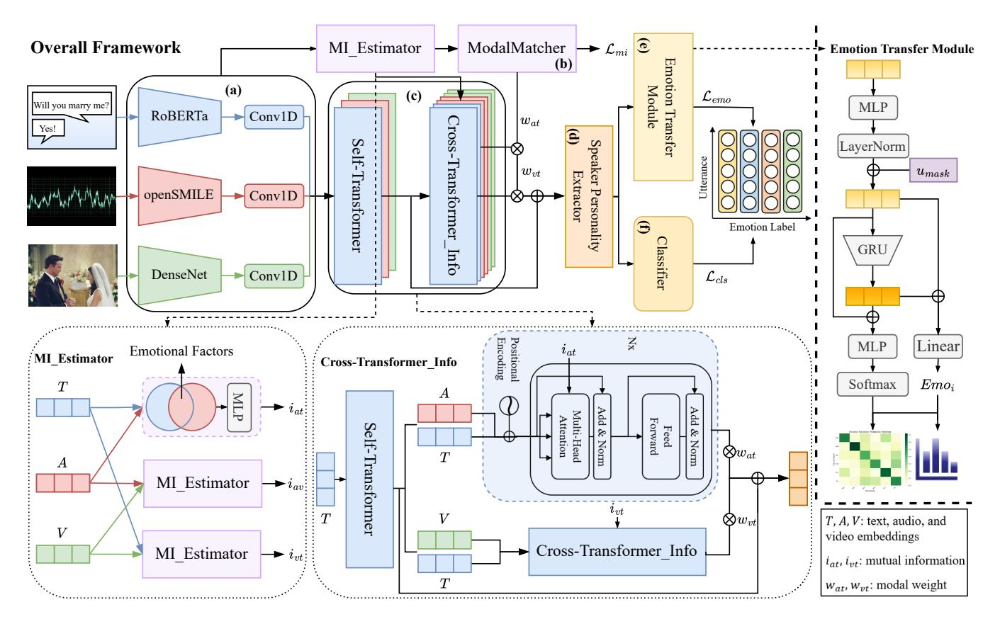
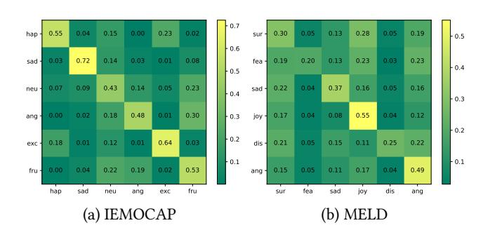
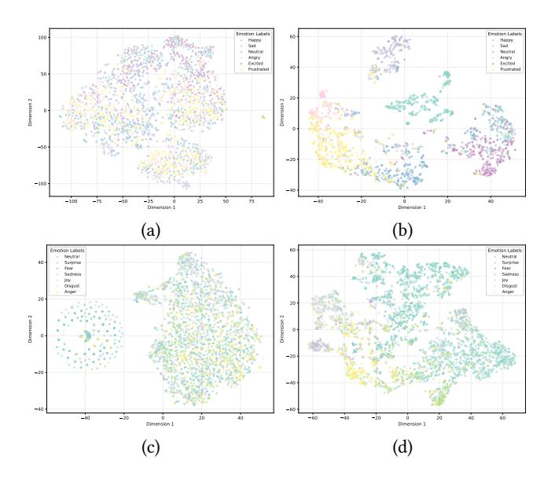

# MIDE: Multimodal Dialogue Emotion Recognition via Mutual Information Enhancement and Dynamic Modality Selection

[Zhibo Zhang](https://orcid.org/0009-0003-4270-8226) School of Computer Science and Technology, Huazhong University of Science and Technology Wuhan, China zhibo\_zhang@hust.edu.cn

[Jianjun Li](https://orcid.org/0000-0002-5265-7624)∗

School of Computer Science and Technology, Huazhong University of Science and Technology Wuhan, China jianjunli@hust.edu.cn

[Zhiyuan Ma](https://orcid.org/0009-0006-3756-5621) School of Computer Science and Technology, Huazhong University of Science and Technology Wuhan, China mzyth@hust.edu.cn

### Abstract

Multimodal dialogue emotion recognition seeks to integrate information from text, audio, and video to accurately determine the emotional state of each utterance. However, prevailing approaches often depend on fixed fusion strategies, failing to account for quality variations across modalities. Consequently, noise from less informative modalities can degrade overall performance. Moreover, most models treat utterances as independent units for static classification, overlooking the dynamic evolution of emotions throughout a dialogue. To overcome these limitations, we propose MIDE, a novel approach that leverages mutual information enhancement and dynamic modality selection for multimodal emotion recognition. Our approach dynamically selects high-quality modality pairs for fusion, minimizing interference from noisy or redundant sources. Specifically, it employs mutual information maximization to achieve cross-modal semantic alignment and incorporates an autonomous modality selection mechanism to assess inter-modal compatibility. Furthermore, an emotion transition prediction module, implemented with a Gated Recurrent Unit (GRU), captures temporal emotional dependencies, enabling joint optimization of static emotion classification and dynamic emotion trajectory prediction. Extensive experiments on the IEMOCAP and MELD datasets demonstrate that MIDE significantly surpasses existing models in accuracy and robustness, highlighting its strength in adaptive fusion for complex dialogue scenarios.

# CCS Concepts

• Computing methodologies → Artificial intelligence; • Information systems → Multimedia information systems.

# Keywords

Sentiment Analysis and Opinion Mining; Dialogue Emotion Recognition; Multimodal; Mutual Information

### ACM Reference Format:

Zhibo Zhang, Jianjun Li, and Zhiyuan Ma. 2026. MIDE: Multimodal Dialogue Emotion Recognition via Mutual Information Enhancement and Dynamic Modality Selection. In Proceedings of the ACM Web Conference 2026 (WWW

∗Corresponding author.

© 2026 Copyright held by the owner/author(s). ACM ISBN 979-8-4007-2307-0/2026/04 <https://doi.org/10.1145/3774904.3792320>

'26), April 13–17, 2026, Dubai, United Arab Emirates. ACM, New York, NY, USA, [9](#page-8-0) pages.<https://doi.org/10.1145/3774904.3792320>

# 1 Introduction

With the rapid advancement of artificial intelligence, multimodal dialogue emotion recognition (MDER) [\[3,](#page-8-1) [13\]](#page-8-2) has emerged as a critical research area at the intersection of natural language processing, computer vision, and audio analysis. The core objective of MDER is to integrate cross-modal information for accurate identification of emotional states (e.g., happiness, anger) in dialogue utterances, overcoming the limitations of unimodal approaches that overlook inter-modal emotional correlations. Beyond advancing fundamental AI research in multimodal fusion, MDER holds significant practical value in applications such as empathetic human-computer interaction, intelligent customer service, and mental health monitoring, attracting growing interest from both academia and industry [\[24,](#page-8-3) [26\]](#page-8-4).

Existing studies generally confirm that multimodal fusion (e.g., text, audio, and video) can compensate for the shortcomings of unimodal methods, thereby improving recognition performance. However, multimodal dialogue emotion recognition still faces several core challenges. First, modality fusion strategies remain rigid: most methods adopt fixed weights or manually preset combinations to uniformly integrate multimodal information, failing to account for variations in modality quality and relevance. This inflexibility limits their adaptability to real-world scenarios where modality quality fluctuates dynamically (e.g., due to noise, occlusion, or semantic absence). Such "forced fusion" often introduces redundant or even detrimental features, degrading overall recognition performance. Second, cross-modal semantic gaps persist: text, audio, and video modalities differ substantially in feature distributions and forms of semantic expression. Most existing fusion methods rely on superficial feature concatenation, lacking effective mechanisms to quantify inter-modal semantic associations, which hinders deep semantic alignment. Third, temporal characteristics of dialogues are overlooked: emotions in dialogue exhibit strong contextual dependencies. Yet, most current approaches process utterances independently, disrupting the dynamic transitions of emotional states and leading to incoherent predictions in longer dialogues.

To address these challenges, this paper proposes MIDE, a novel multimodal dialogue emotion recognition method that integrates mutual information enhancement with dynamic modality selection. Our approach introduces innovations in three key aspects: First, it employs a mutual information maximization strategy to quantify semantic relevance between modality pairs, serving as

[This work is licensed under a Creative Commons Attribution 4.0 International License.](https://creativecommons.org/licenses/by/4.0) WWW '26, Dubai, United Arab Emirates.

the foundation for dynamic modality selection. This enables the model to adaptively prioritize high-value modalities during fusion. Second, it incorporates mutual information-guided attention within a Transformer-based cross-modal fusion framework, balancing self-attention within individual modalities and cross-attention between modalities to enhance semantic alignment. Third, it designs an emotion transition prediction module based on Gated Recurrent Units (GRUs) to explicitly model the temporal evolution of emotions, enabling joint optimization of static emotion classification and dynamic transition prediction. Extensive experiments on the IEMOCAP and MELD datasets demonstrate that our method significantly outperforms state-of-the-art baselines in recognition accuracy, robustness, and temporal modeling capability, underscoring its research value and application potential in complex dialogue scenarios. The main contributions of this work can be summarized as follows:

- We propose a dynamic modality selection mechanism based on mutual information enhancement, which overcomes the limitations of fixed fusion strategies by enabling the model to adaptively focus on highly correlated modality pairs.
- We design a cross-modal Transformer fusion framework that incorporates mutual information weights into crossattention mechanisms, significantly improving cross-modal semantic alignment.
- We introduce an emotion transition prediction module that facilitates joint optimization of static emotion recognition and dynamic emotion trajectory prediction, effectively capturing temporal emotional dependencies in dialogues.
- Extensive experiments demonstrate that our model not only achieves state-of-the-art performance but also exhibits superior generalization and robustness across datasets and emotion categories.

# 2 Related Work

Emotional Recognition in Conversations (ERC) research can be divided into two categories: unimodal and multimodal. The former focuses on modeling context and speakers within a single modality, while the latter breaks through the limitations of unimodal methods by fusing multimodal information.

# 2.1 Unimodal Dialogue Emotion Recognition

Unimodal ERC primarily employs two technical frameworks: Recurrent Neural Networks (RNs) and Graph Convolutional Networks (GCNs). RNN-based methods pioneered effective context modeling. For example, DialogueRNN [\[17\]](#page-8-5) introduced three specialized GRU variants—global, speaker-specific, and emotion-specific—enabling simultaneous modeling of dialogue context, speaker states, and emotional dynamics. DialogueCRN [\[7\]](#page-8-6) incorporated cognitive principles, using bidirectional LSTM to capture scenario and speaker context, building global memory, and iteratively integrating emotion cues via multi-turn reasoning, advancing ERC from context understanding to cognitive reasoning. Subsequent work focused on semantic enhancement and long-range dependencies: SCCL [\[29\]](#page-8-7) enriched context with external knowledge, EmoTransKG [\[33\]](#page-8-8) used fine-grained attention for emotion-relevant cues, CoE [\[22\]](#page-8-9) modeled

long-range dependencies with sparse attention, and DVL-CER [\[30\]](#page-8-10) simulated interactions through speaker-listener role modeling.

In parallel, GCN-based methods have enhanced interaction modeling through graph-structured representations. DialogueGCN [\[4\]](#page-8-11) and DAG-ERC [\[21\]](#page-8-12) represented utterances as graph nodes, defining edges based on speaker identity and temporal relationships, then aggregated inter-utterance and speaker interaction contexts via graph convolutional operations. BLC [\[27\]](#page-8-13) constructed heterogeneous graphs incorporating "utterance-speaker-emotion event" relationships and modeled "belief-desire" interactions through graph convolutional message passing to improve fine-grained recognition accuracy. LECM [\[14\]](#page-8-14) derived graph structures directly from acoustic representations and optimized audio-only modeling through multi-stage learning.

# 2.2 Multimodal Dialogue Emotion Recognition

Multimodal ERC centers on the principle of "modality complementarity" and has evolved through three distinct developmental phases: basic fusion, scenario adaptation, and knowledge enhancement. In the basic fusion stage, SDT [\[16\]](#page-8-15) employed intra-modality and inter-modality Transformer architectures to capture interactions, enhancing representations through hierarchical gating and self-distillation. JOYFUL [\[11\]](#page-8-16) combined Transformer networks with graph contrastive learning to mitigate GNN over-smoothing. CMCF-SRNet [\[32\]](#page-8-17) refined semantic representations using cross-modal constrained Transformers and semantic graphs, while MPLMM [\[6\]](#page-8-18) enabled fine-grained, element-wise interactions across text, audio, and video modalities. The scenario adaptation stage introduced more flexible fusion strategies. Frame-SCN [\[23\]](#page-8-19) employed adaptive weighted fusion to accommodate specific scenarios. PCDS [\[20\]](#page-8-20) addressed speaker-unknown scenarios by combining modal query attention with clustering techniques. HiMul-LGG [\[2\]](#page-8-21) filtered features based on modal relevance and optimized cross-modal alignment, while TopicDiff [\[15\]](#page-8-22) overcame multilingual barriers through shared subspace learning. The current knowledge enhancement stage has focused on incorporating external knowledge and sophisticated learning paradigms. UniMSE [\[8\]](#page-8-23) established a knowledge-sharing framework with cross-modal contrastive learning for representation alignment. MultiDAG+CL [\[18\]](#page-8-24) constructed multimodal Directed Acyclic Graphs (DAGs) integrated with curriculum learning. MAGTKD [\[12\]](#page-8-25) enhanced modalities through prompt learning and knowledge distillation, aggregating information via anchor-gated Transformers. ECERC [\[31\]](#page-8-26) adopted an "evidence-cause" perspective, implementing multimodal causal reasoning through evidence gating and attention mechanisms.

Compared to previous multimodal ERC approaches, methods in both the basic fusion (e.g., SDT, JOYFUL) and scenario adaptation (e.g., Frame-SCN, PCDS) stages typically employ fixed-weight fusion strategies, making them susceptible to modality quality fluctuations (such as noise in low-quality videos) or addressing cross-modal semantic gaps through limited module/loss designs. In contrast, our approach introduces mutual information as a core innovation, with a dynamic modality selection module that evaluates inter-modal relevance in real-time and adaptively assigns fusion weights, effectively addressing the vulnerability of fixed-weight schemes to low-quality modality interference.

Table 2: Comparison of Experimental Results. Data from the original paper are quoted directly in this paper. In each dataset, the best results are shown in bold, and dashes ("—") are used to mark unreported results.

Baselines. We compare the proposed method with several competitive baselines, which can be grouped into four categories:

1. Unimodal Methods: These approaches leverage only textual context and speaker information for emotion recognition, primarily based on recurrent neural networks (e.g., DialogueRNN [\[17\]](#page-8-5), DialogueCRN [\[7\]](#page-8-6)) or graph convolutional networks (e.g., DAG-ERC [\[21\]](#page-8-12), BLC [\[27\]](#page-8-13)).

2. Multimodal Methods: These models integrate text, audio, and visual modalities to enhance emotion understanding, including JOYFUL [\[11\]](#page-8-16), CMCF-SRNet [\[32\]](#page-8-17), SCMM [\[28\]](#page-8-29), MultiDAG+CL [\[18\]](#page-8-24), MAGTKD [\[12\]](#page-8-25), PCDS [\[20\]](#page-8-20), and ECERC [\[31\]](#page-8-26).

3. Large Language Models (LLMs): We also include GPT-4o [\[9,](#page-8-30) [22\]](#page-8-9), which supports cross-modal input and output for multilingual and audiovisual emotion tasks, and DeepSeek-R1 [\[5,](#page-8-31) [22\]](#page-8-9), which employs a Mixture of Experts (MoE) architecture and reinforcement learning to improve emotional reasoning and domain-specific knowledge processing.

4. Other Models: This category includes MHGT+ECoK [\[25\]](#page-8-32), which augments emotional reasoning with a commonsense knowledge graph containing over 140K triples, and ML-ERC [\[10\]](#page-8-33), a multilabel framework that employs pseudo multi-labels and MulWCL loss to address emotion shift and label confusion while preserving performance across single-label and multi-label scenarios.

Evaluation Metrics. We use Accuracy (ACC) and Weighted-F1 (F1) for evaluation, giving priority to Weighted-F1 as it more effectively reflects comprehensive performance across all emotion categories by accounting for class imbalance.

Implementation Details. To ensure reproducibility, we detail the preprocessing and training configurations. The input channel size of the 1D convolutional layer is adjusted according to the modalityspecific feature dimensions of each dataset: for IEMOCAP, text = 1024, acoustic = 1582, visual = 342; for MELD, acoustic = 300, while text and visual dimensions remain consistent with IEMOCAP. The

model is trained with a batch size of 16, dropout rate of 0.5, and the Adam optimizer with a learning rate of 1 × 10−4 . All reported results are averaged over five independent runs.

### 4.2 Performance Analysis

The main experimental results are summarized in Table [2.](#page-5-0) Our proposed MIDE model achieves substantial improvements over all baseline categories on both IEMOCAP and MELD datasets, demonstrating its effectiveness in multimodal emotion recognition. Among unimodal approaches, text-based state-of-the-art methods like DAG-ERC and BLC show competitive performance, yet their accuracy and F1-scores remain considerably lower than MIDE. This performance gap highlights the inherent limitations of relying on a single modality to capture the complex affective dynamics in conversational data. Multimodal baselines, while integrating information from multiple sources, consistently fall short of MIDE's performance. For instance, recent models like ECERC and MAGTKD show improved results over earlier multimodal approaches, but still underperform compared to our method. The superior performance of MIDE suggests that its dynamic modality selection and mutual information enhancement mechanisms more effectively leverage cross-modal interactions than fixed fusion strategies employed in these baselines. Notably, LLM-based approaches (GPT-4o and DeepSeek-R1) demonstrate relatively weak performance, indicating that generalpurpose large language models struggle with fine-grained emotion recognition in dialogues without specialized architectural support. This contrasts sharply with MIDE's strong results, which benefit from targeted components designed specifically for emotional dynamics. Evaluation against models in the "Other Models" category confirms MIDE's favorable position. Overall, MIDE achieves the highest scores across all metrics, attaining 74.86% accuracy and 74.80% F1-score on IEMOCAP, and 67.74% accuracy and 66.76% F1-score on MELD. These results validate the effectiveness of our integrated framework—particularly its dynamic modality selection,

Table 3: Display Performance Metrics on IEMOCAP and MELD. (We report precision, recall, f1-score (per class), accuracy, macro average, and weighted average.)

|              | (a) precision | IEMOCAP recall | f1-score | support |
|--------------|---------------|----------------|----------|---------|
| Happy        | 0.6403        | 0.6181         | 0.6290   | 144     |
| Sad          | 0.8208        | 0.8041         | 0.8124   | 245     |
| Neutral      | 0.7410        | 0.8047         | 0.7715   | 384     |
| Angry        | 0.7261        | 0.6706         | 0.6972   | 170     |
| Excited      | 0.8188        | 0.8161         | 0.8174   | 299     |
| Frustrated   | 0.7043        | 0.6877         | 0.6959   | 381     |
| accuracy     | —             | —              | 0.7486   | 1623    |
| macro avg    | 0.7419        | 0.7335         | 0.7372   | 1623    |
| weighted avg | 0.7483        | 0.7486         | 0.7480   | 1623    |
|              | (b)           | MELD           |          |         |
|              | precision     | recall         | f1-score | support |
| Neutral      | 0.7710        | 0.8392         | 0.8037   | 1256    |
| Surprise     | 0.5978        | 0.5765         | 0.5870   | 281     |
| Fear         | 0.2759        | 0.1600         | 0.2025   | 50      |
| Sadness      | 0.6087        | 0.3365         | 0.4334   | 208     |
| Joy          | 0.6613        | 0.6169         | 0.6384   | 402     |
| Disgust      | 0.4000        | 0.2353         | 0.2963   | 68      |
| Anger        | 0.5085        | 0.6087         | 0.5541   | 345     |
| accuracy     | —             | —              | 0.6774   | 2610    |
| macro avg    | 0.5462        | 0.4819         | 0.5022   | 2610    |
| weighted avg | 0.6687        | 0.6774         | 0.6676   | 2610    |

Table 4: Results of Ablation Experiment

| Models |       | ACC   | IEMOCAP F1 | ACC   | MELD F1 |
|--------|-------|-------|------------|-------|---------|
| w/o    | DMS   | 69.69 | 70.32      | 66.05 | 65.14   |
| w/o    | MIE   | 70.73 | 71.25      | 66.59 | 65.26   |
| w/o    | ETM   | 73.94 | 74.07      | 67.01 | 66.18   |
| w/o    | SPE   | 71.97 | 72.23      | 66.17 | 65.62   |
| Full   | Model | 74.86 | 74.80      | 67.74 | 66.76   |

mutual information enhancement, and explicit modeling of speaker characteristics and emotion transitions—in addressing the complex challenges of multimodal dialogue emotion.

Furthermore, as shown in Table [3,](#page-6-0) our method offers a finegrained breakdown of precision and F1-score per emotion category on both IEMOCAP and MELD datasets. This category-level analysis provides clearer visualization of our approach's strengths across diverse emotion types and data distributions, while enabling direct comparison with other methods at the emotion-specific level to support targeted model optimization.

### 4.3 Ablation Study

To evaluate the contribution of each core component in our method, we conduct a series of ablation experiments. By progressively removing key modules and observing the corresponding performance

Table 5: Results of Fixed Modality Comparative Experiments

| Models                | ACC   | IEMOCAP F1 | ACC   | MELD F1 |
|-----------------------|-------|------------|-------|---------|
| Text                  | 65.37 | 65.61      | 66.21 | 64.78   |
| Audio                 | 58.78 | 58.88      | 47.93 | 35.32   |
| Visual                | 36.35 | 35.42      | 48.12 | 31.27   |
| Text + Audio          | 71.16 | 71.58      | 66.74 | 65.50   |
| Text + Visual         | 70.18 | 70.69      | 66.51 | 65.34   |
| Audio + Visual        | 62.97 | 62.54      | 47.93 | 37.49   |
| Text + Audio + Visual | 70.73 | 71.25      | 66.59 | 65.26   |
| Ours                  | 74.86 | 74.80      | 67.74 | 66.76   |

changes, we quantitatively assess the role of each proposed mechanism. The results are summarized in Table [4,](#page-6-1) from which we can observe:

1) Removing Dynamic Modality Selection (DMS) causes noticeable degradation, particularly on IEMOCAP. This module adaptively evaluates inter-modal correlations via mutual information and assigns dynamic fusion weights, effectively suppressing noisy modalities. In contrast, fixed fusion strategies lack adaptability to modality quality variations.

2) Ablating Mutual Information Enhancement (MIE) significantly reduces F1-score on both datasets, especially on IEMOCAP. The module integrates mutual information maximization across modality selection, attention allocation, and loss optimization, enhancing semantic alignment while reducing modality heterogeneity through adaptive temperature adjustment.

3) Removing Emotion Transfer Module (ETM) hurts performance. By modeling temporal dependencies via GRUs and emotion transition probabilities, it enables coherent dialogue-level recognition—addressing a key limitation of utterance-isolated approaches.

4) Without Speaker Personality Extractor (SPE), performance consistently declines. The module uses bidirectional LSTMs to encode speaker-specific patterns, improving consistency in multispeaker scenarios with minimal overhead, whereas conventional methods overlook such individuality.

Overall, the ablation study confirms that each proposed module contributes distinctively to the model's performance. The synergy among these components enables robust, accurate, and contextaware emotion recognition.

### 4.4 Fixed Modality Comparative Experiments

To examine the assumption that "more modalities lead to better performance" in multimodal dialogue emotion recognition, and to validate the effectiveness of our dynamic modality selection mechanism, we conduct comparative experiments with fixed modality combinations. We systematically compare unimodal, bimodal, and trimodal settings using equal-weight fusion to assess the actual contribution of each modality combination.

Results in Table [5](#page-6-2) show that in unimodal settings, text modality significantly outperforms audio and visual modalities on both datasets, confirming that emotional understanding in dialogues relies primarily on textual semantics, while audio and visual cues are more susceptible to noise and offer limited discriminative power

Figure 2: Emotional transfer probability heatmap. (The vertical axis represents the emotion of the current utterance, while the horizontal axis represents the emotion of subsequent utterances.)

alone. Among bimodal combinations, Text+Audio achieves the best performance, indicating strong complementarity between textual content and acoustic features. In contrast, Audio+Visual performs poorly, suggesting high redundancy and weak complementarity between these two modalities. Notably, the trimodal combination (Text+Audio+Visual) fails to surpass the best bimodal setup (Text+Audio), demonstrating that incorporating all modalities can introduce noise and redundancy, thereby challenging the assumption that "more modalities are always better".

Our method substantially outperforms all fixed fusion strategies across both datasets. This advantage stems from the dynamic modality selection mechanism, which adaptively adjusts fusion weights based on modality quality and complementarity. By effectively leveraging complementary information while suppressing noisy or redundant modalities, our approach achieves a significant performance improvement.

### 4.5 Emotional Transfer Matrix Visualization

Figure [2](#page-7-0) presents the emotion transition probability heatmaps for the IEMOCAP and MELD datasets, demonstrating that our proposed emotion transition module effectively captures dynamic emotion patterns in conversations. The visualization reveals several key findings: 1) In the IEMOCAP heatmap, the module accurately identifies strongly correlated emotion transitions that align with real-world emotional logic. For example, when the current emotion is excitement (exc), the probability of remaining excited reaches 64%, significantly higher than the 1% transition probability to sadness (sad). The module also effectively suppresses improbable transitions, such as the zero probability of happiness (hap) transitioning to anger (ang), demonstrating its capability to filter out spurious temporal dependencies. 2) The MELD heatmap shows that the module maintains robust performance even with different emotion categories, including surprise (sur) and fear (fea). This indicates strong generalization ability across diverse emotional contexts and dataset characteristics. 3) By leveraging GRU-based temporal modeling, our module not only captures semantically reasonable emotion transitions but also effectively suppresses illogical emotional jumps. This approach addresses a key limitation of traditional methods that ignore temporal emotional dependencies, while enabling dynamic emotion prediction based on static classification results. The

Figure 3: (a) and (c) show the initial utterance vectors for the IEMOCAP and MELD datasets, respectively; (b) and (d) display the vectors processed by our model.

demonstrated capability provides crucial support for coherent emotion recognition in extended dialogues, validating the effectiveness of our emotion transition modeling strategy.

### 4.6 Result Visualization

Figure [3](#page-7-1) demonstrates that our model effectively reorganizes utterance representations in the embedding space. Before processing, emotion vectors (labeled as "sad", "neu", "hap", etc.) appear randomly scattered without clear clustering patterns. After transformation by our model, vectors of the same emotion category form compact, well-separated clusters. This structural enhancement indicates that our approach successfully captures discriminative emotional features and maps semantically similar utterances to proximal regions in the latent space. The observed clustering quality provides visual evidence of the model's superior capability in emotion feature extraction and representation learning, which directly contributes to its recognition performance.

### 5 Conclusion

This paper addresses key limitations in multimodal dialogue emotion recognition, including rigid fusion strategies, cross-modal semantic gaps, and inadequate modeling of temporal dependencies. We propose MIDE, a novel framework that integrates mutual information enhancement with dynamic modality selection to enable adaptive, quality-aware fusion of multimodal signals. Through mutual information-guided attention mechanisms and dedicated emotion transition modeling with GRUs, our approach achieves deeper semantic alignment and captures contextual emotional dynamics effectively. Comprehensive evaluations on IEMOCAP and MELD datasets demonstrate that MIDE consistently outperforms state-ofthe-art methods across all metrics, validating its effectiveness in handling complex dialogue scenarios.

References [1] Carlos Busso, Murtaza Bulut, Chi-Chun Lee, Abe Kazemzadeh, Emily Mower, Samuel Kim, Jeannette N Chang, Sungbok Lee, and Shrikanth S Narayanan. 2008. IEMOCAP: Interactive emotional dyadic motion capture database. Language resources and evaluation 42, 4 (2008), 335–359. [2] Changzeng Fu, Fengkui Qian, Kaifeng Su, Yikai Su, Ze Wang, Jiaqi Shi, Zhigang Liu, Chaoran Liu, and Carlos Toshinori Ishi. 2025. HiMul-LGG: A hierarchical decision fusion-based local–global graph neural network for multimodal emotion recognition in conversation. Neural Networks 181 (2025), 106764. [3] Shiping Ge, Zhiwei Jiang, Zifeng Cheng, Cong Wang, Yafeng Yin, and Qing Gu. 2023. Learning robust multi-modal representation for multi-label emotion recognition via adversarial masking and perturbation. In Proceedings of the ACM Web Conference 2023. 1510–1518. [4] Deepanway Ghosal, Navonil Majumder, Soujanya Poria, Niyati Chhaya, and Alexander Gelbukh. 2019. DialogueGCN: A Graph Convolutional Neural Network for Emotion Recognition in Conversation. In Proceedings of the 2019 Conference on Empirical Methods in Natural Language Processing and the 9th International Joint Conference on Natural Language Processing (EMNLP-IJCNLP). 154–164. [5] Daya Guo, Dejian Yang, Haowei Zhang, Junxiao Song, Ruoyu Zhang, Runxin Xu, Qihao Zhu, Shirong Ma, Peiyi Wang, Xiao Bi, et al. 2025. Deepseek-r1: Incentivizing reasoning capability in llms via reinforcement learning. arXiv preprint arXiv:2501.12948 (2025). [6] Zirun Guo, Tao Jin, and Zhou Zhao. 2024. Multimodal Prompt Learning with Missing Modalities for Sentiment Analysis and Emotion Recognition. In Proceedings of the 62nd Annual Meeting of the Association for Computational Linguistics (Volume 1: Long Papers). 1726–1736. [7] Dou Hu, Lingwei Wei, and Xiaoyong Huai. 2021. DialogueCRN: Contextual Reasoning Networks for Emotion Recognition in Conversations. In Proceedings of the 59th Annual Meeting of the Association for Computational Linguistics and the 11th International Joint Conference on Natural Language Processing (Volume 1: Long Papers). 7042–7052. [8] Guimin Hu, Ting-En Lin, Yi Zhao, Guangming Lu, Yuchuan Wu, and Yongbin Li. 2022. UniMSE: Towards Unified Multimodal Sentiment Analysis and Emotion Recognition. In Proceedings of the 2022 Conference on Empirical Methods in Natural Language Processing. 7837–7851. [9] Aaron Hurst, Adam Lerer, Adam P Goucher, Adam Perelman, Aditya Ramesh, Aidan Clark, AJ Ostrow, Akila Welihinda, Alan Hayes, Alec Radford, et al. 2024. Gpt-4o system card. arXiv preprint arXiv:2410.21276 (2024). [10] Yujin Kang and Yoon-Sik Cho. 2025. Beyond Single Emotion: Multi-label Approach to Conversational Emotion Recognition. In Proceedings of the AAAI Conference on Artificial Intelligence, Vol. 39. 24321–24329. [11] Dongyuan Li, Yusong Wang, Kotaro Funakoshi, and Manabu Okumura. 2023. Joyful: Joint Modality Fusion and Graph Contrastive Learning for Multimoda Emotion Recognition. In Proceedings of the 2023 Conference on Empirical Methods in Natural Language Processing. 16051–16069. [12] Jie Li, Shifei Ding, Lili Guo, and Xuan Li. 2025. Multi-modal Anchor Gated Transformer with Knowledge Distillation for Emotion Recognition in Conversation. arXiv preprint arXiv:2506.18716 (2025). [13] Zhiyu Liu, Junchen Fu, Kaiwen Zheng, and Joemon M Jose. 2025. Exploring Multimodal Pre-trained Models for Speech Emotion Recognition. In Companion Proceedings of the ACM on Web Conference 2025. 2176–2180. [14] Wenxuan Lu, Zhongtian Hu, Jiashi Lin, and Lifang Wang. 2025. LECM: A model leveraging emotion cause to improve real-time emotion recognition in conversations. Knowledge-Based Systems 309 (2025), 112900. [15] Jiamin Luo, Jingjing Wang, and Guodong Zhou. 2024. TopicDiff: A Topic-enriched Diffusion Approach for Multimodal Conversational Emotion Detection. In Proceedings of the 2024 Joint International Conference on Computational Linguistics, Language Resources and Evaluation (LREC-COLING 2024). 16304–16314. [16] Hui Ma, Jian Wang, Hongfei Lin, Bo Zhang, Yijia Zhang, and Bo Xu. 2023. A transformer-based model with self-distillation for multimodal emotion recognition in conversations. IEEE Transactions on Multimedia 26 (2023), 776–788. [17] Navonil Majumder, Soujanya Poria, Devamanyu Hazarika, Rada Mihalcea, Alexander Gelbukh, and Erik Cambria. 2019. Dialoguernn: An attentive rnn for emotion detection in conversations. In Proceedings of the AAAI conference on artificial intelligence, Vol. 33. 6818–6825. [18] Cao-Bach Nguyen, Duc-Trong Le, Quang Thuy Ha, et al. 2024. Curriculum Learning Meets Directed Acyclic Graph for Multimodal Emotion Recognition. In Proceedings of the 2024 Joint International Conference on Computational Linguistics, Language Resources and Evaluation (LREC-COLING 2024). 4259–4265. [19] Soujanya Poria, Devamanyu Hazarika, Navonil Majumder, Gautam Naik, Erik Cambria, and Rada Mihalcea. 2019. MELD: A Multimodal Multi-Party Dataset for Emotion Recognition in Conversations. In Proceedings of the 57th Annual Meeting of the Association for Computational Linguistics. 527–536. [20] Siyuan Shen, Feng Liu, Hanyang Wang, and Aimin Zhou. 2025. Towards Speaker-Unknown Emotion Recognition in Conversation Via Progressive Contrastive Deep Supervision. IEEE Transactions on Affective Computing 01 (2025), 1–13. [21] Weizhou Shen, Siyue Wu, Yunyi Yang, and Xiaojun Quan. 2021. Directed Acyclic Graph Network for Conversational Emotion Recognition. In Proceedings of the 59th Annual Meeting of the Association for Computational Linguistics and the 11th International Joint Conference on Natural Language Processing (Volume 1: Long Papers). 1551–1560. [22] Zhiyu Shen, Yunhe Pang, Yanghui Rao, and Jianxing Yu. 2025. CoE: A Clue of Emotion Framework for Emotion Recognition in Conversations. In Proceedings of the 63rd Annual Meeting of the Association for Computational Linguistics (Volume 1: Long Papers). 23548–23563. [23] Jiandong Shi, Ming Li, Yuting Chen, Lixin Cui, and Lu Bai. 2025. Multimodal graph learning with framelet-based stochastic configuration networks for emotion recognition in conversation. Information Sciences 686 (2025), 121393. [24] Geng Tu, Bingbing Wang, Erik Cambria, Wenjie Li, and Ruifeng Xu. 2025. SupportPlay: A Multi-Agent Role-Playing System for Personalized and Sustained Multimodal Emotional Support Conversation. In Companion Proceedings of the ACM on Web Conference 2025. 2915–2918. [25] Zhunheng Wang, Xiaoyi Liu, Mengting Hu, Rui Ying, Ming Jiang, Jianfeng Wu, Yalan Xie, Hang Gao, and Renhong Cheng. 2024. Ecok: Emotional commonsense knowledge graph for mining emotional gold. In Findings of the Association for Computational Linguistics ACL 2024. 8055–8074. [26] Henrique S Xavier, Diogo Cortiz, Mateus Silvestrin, Ana Luísa Freitas, Letícia Yumi Nakao Morello, Fernanda Naomi Pantaleão, and Gabriel Gaudencio do Rêgo. 2024. A Bayesian framework for measuring association and its application to emotional dynamics in Web discourse. In Companion Proceedings of the ACM Web Conference 2024. 1450–1458. [27] Bo Xu, Longjiao Li, Wei Luo, Mehdi Naseriparsa, Zhehuan Zhao, Hongfei Lin, and Feng Xia. 2024. Beyond linguistic cues: Fine-grained conversational emotion recognition via belief-desire modelling. In Proceedings of the 2024 Joint International Conference on Computational Linguistics, Language Resources and Evaluation (LREC-COLING 2024). 2318–2328. [28] Haozhe Yang, Xianqiang Gao, Jianlong Wu, Tian Gan, Ning Ding, Feijun Jiang, and Liqiang Nie. 2023. Self-adaptive context and modal-interaction modeling for multimodal emotion recognition. In Findings of the association for computational linguistics: ACL 2023. 6267–6281. [29] Kailai Yang, Tianlin Zhang, Hassan Alhuzali, and Sophia Ananiadou. 2023. Cluster-level contrastive learning for emotion recognition in conversations. IEEE Transactions on Affective Computing 14, 4 (2023), 3269–3280. [30] Xupeng Zha, Huan Zhao, Guanghui Ye, and Zixing Zhang. 2025. Dual-View Learning for Conversational Emotion Recognition Through Context and Emotion-Shift Modeling. In Proceedings of the AAAI Conference on Artificial Intelligence, Vol. 39. 25823–25831. [31] Tao Zhang and Zhenhua Tan. 2025. ECERC: Evidence-Cause Attention Network for Multi-Modal Emotion Recognition in Conversation. In Proceedings of the 63rd Annual Meeting of the Association for Computational Linguistics (Volume 1: Long Papers). 2064–2077. [32] Xiaoheng Zhang and Yang Li. 2023. A cross-modality context fusion and semantic refinement network for emotion recognition in conversation. In Proceedings of the 61st Annual Meeting of the Association for Computational Linguistics (Volume 1: Long Papers). 13099–13110. [33] Huan Zhao, Xupeng Zha, and Zixing Zhang. 2024. Emotranskg: An innovative emotion knowledge graph to reveal emotion transformation. In Findings of the Association for Computational Linguistics ACL 2024. 12098–12110.