# JitterSketch: Finding Jittery Flows in Network Streams

Zhongxian Liang∗ Harbin Institute of Technology Shenzhen, China liangzhx@pcl.ac.cn

Qilong Shi∗ Tsinghua University Beijing, China sql23@mails.tsinghua.edu.cn

Xiyan Liang Nankai University Tianjin, China 2212207@mail.nankai.edu.cn

Zihan Li National University of Defense Technology, Changsha, China lizihan23@nudt.edu.cn

Wenjun Li†B Pengcheng Laboratory Shenzhen, China wenjunli@pku.org.cn

Tong Yang‡ Peking University Beijing, China yangtong@pku.edu.cn

Yangyang Wang Tsinghua University Beijing, China wangyy-13@tsinghua.edu.cn

Mingwei Xu Tsinghua University Beijing, China xumw@tsinghua.edu.cn

Weizhe Zhang‡ Harbin Institute of Technology Shenzhen, China wzzhang@hit.edu.cn

# Abstract

In the modern internet, with the proliferation of real-time applications such as online gaming and video conferencing, the timely detection of network jitter has become a critical task in network measurement. Network jitter is defined as the abrupt fluctuations in packet inter-arrival times within network flows, which severely degrade the Quality of Service for these applications. Traditional jitter detection methods primarily focus on macro-level end-to-end or hop-by-hop latency variations, neglecting the fine-grained jitter that occurs within specific flows. In this paper, we present JitterSketch, the first sketch-based algorithm specifically designed for detecting jittery flows. JitterSketch employs a novel three-stage structure to efficiently filter out infrequent and stable flows, thereby identifying and reporting the jittery flows that have the most significant impact on network quality. Extensive experiments demonstrate that JitterSketch achieves an improvement of up to 50 percentage points in both recall and precision rates compared to baseline solutions, while maintaining high processing throughput. Furthermore, we deployed JitterSketch in a QoS simulation system, where it yielded significant improvements in QoS.

### CCS Concepts

• Information systems → Data stream mining; • Networks → Network measurement.

# Keywords

Network stream processing, Packet delay, Jitter flows, Sketch, QoS.

†Wenjun Li also serves as a Ph.D. co-supervisor at Harbin Institute of Technology. This work was conducted at Pengcheng Laboratory. The first four authors are students and carried out this work under the guidance of the corresponding author, Wenjun Li. ‡Co-corresponding authors. Weizhe Zhang is also with Pengcheng Laboratory.

[This work is licensed under a Creative Commons Attribution 4.0 International License.](https://creativecommons.org/licenses/by/4.0) WWW '26, Dubai, United Arab Emirates

© 2026 Copyright held by the owner/author(s). ACM ISBN 979-8-4007-2307-0/2026/04 <https://doi.org/10.1145/3774904.3792328>

### ACM Reference Format:

Zhongxian Liang, Qilong Shi, Xiyan Liang, Zihan Li, Wenjun Li, Tong Yang, Yangyang Wang, Mingwei Xu, and Weizhe Zhang. 2026. JitterSketch: Finding Jittery Flows in Network Streams. In Proceedings of the ACM Web Conference 2026 (WWW '26), April 13–17, 2026, Dubai, United Arab Emirates. ACM, New York, NY, USA, [12](#page-11-0) pages.<https://doi.org/10.1145/3774904.3792328>

### Resource Availability:

The source code of this paper has been made publicly available at [https:](https://doi.org/10.5281/zenodo.18300502) [//doi.org/10.5281/zenodo.18300502.](https://doi.org/10.5281/zenodo.18300502)

# 1 Introduction

As internet applications become increasingly popular and diverse, from high-definition video streaming and online gaming to realtime voice and video communication (VoIP) [\[19\]](#page-8-0), user expectations for Quality of Service (QoS) [\[34\]](#page-8-1) have reached unprecedented heights. Network latency and its stability are key metrics for measuring QoS. However, in complex network environments, data packets experience varying queuing, forwarding, and propagation delays during transmission, which leads to dynamic changes in end-to-end latency—a phenomenon known as network jitter. Severe network jitter can seriously disrupt the internal temporal relationship within a data flow, causing multimedia applications to suffer from issues like video freezing and audio-video desynchronization. It can even interfere with the congestion control mechanisms of transport protocols like TCP, leading to a decrease in network throughput.

Traditional end-to-end jitter metrics are too coarse, masking the micro-dynamics within individual data flows. We therefore focus on Intra-Flow Packet Delay (IFPD)—the time interval between consecutive packets of a flow at a network device. By monitoring significant IFPD changes (sudden increases, decreases, or mixed patterns), we can identify micro-burst behaviors in what we term "jittery flows". Detecting these flows is crucial for QoS optimization, congestion detection, and security.

• QoS Optimization: Applications like video streaming, multiplayer games and VoIP are highly sensitive to jitter [\[5,](#page-8-2) [13,](#page-8-3) [16,](#page-8-4) [21,](#page-8-5) [26,](#page-8-6) [29,](#page-8-7) [31,](#page-8-8) [37,](#page-8-9) [50,](#page-8-10) [53\]](#page-8-11), which degrades user experience by causing lag and interruptions. This instability leads to buffer underruns or overflows at the receiver, halting playback or causing packet loss.

∗Co-first authors. Zhongxian Liang is also with Pengcheng Laboratory.

Real-time IFPD monitoring provides immediate feedback, enabling operators to dynamically adjust buffering policies and ensure a smooth, high-quality user experience.

- Network Congestion Detection: A sharp increase in IFPD, or "deceleration jitter", is a strong, proactive indicator of queuing delay caused by network congestion [\[6,](#page-8-12) [18,](#page-8-13) [35,](#page-8-14) [46\]](#page-8-15). Unlike loss-based signals, it allows for early detection. Conversely, a subsequent drop in IFPD, or "acceleration jitter", signals that congestion has subsided. This delay-based principle is fundamental to congestion control.
- APT Detection: APT [\[15,](#page-8-16) [20,](#page-8-17) [23,](#page-8-18) [49,](#page-8-19) [52\]](#page-8-20) attacks often evade detection by using "low-and-slow" communication for command and control (C2) or data exfiltration. This strategy creates a distinct compound jitter pattern: a sharp drop in IFPD followed immediately by a sharp rise. Identifying this specific signature offers a powerful

method to uncover otherwise hidden malicious channels.

However, detecting IFPD jitter in high-speed networks is a challenging task. Existing solutions are often limited to end-hosts [\[12,](#page-8-21) [35\]](#page-8-14), are protocol-specific [\[11,](#page-8-22) [28,](#page-8-23) [29,](#page-8-7) [51\]](#page-8-24), or rely on coarse-grained metrics [\[24,](#page-8-25) [54\]](#page-8-26). Even advanced techniques typically measure singular delay events rather than the complex, dynamic patterns characteristic of threats like APTs. Moreover, above approaches are not designed for the scale and resource constraints of core switches. This creates a clear and significant research gap: the need for an online, efficient, and universal algorithm that combines universality, complex pattern detection, and resource efficiency.

To fill this gap, we propose JitterSketch, a lightweight, highprecision algorithm for resource-constrained core networks. Its novel multi-stage pipeline minimizes overhead by progressively filtering flows, performing detailed jitter analysis only on the most relevant candidates. This resource-efficient approach enables identifying jittery behavior at scale. Our main contributions are:

- (1) We shift the focus from traditional delay metrics to the dynamic patterns of IFPD, defining acceleration, deceleration, and hybrid jitter. This offers a more granular dimension for analyzing QoS and security threats, filling a key gap in network measurement.
- (2) We present JitterSketch, the first online and lightweight algorithm that delivers high-precision identification of diverse jittery flows in high-speed networks. Its unique architecture achieves this by strategically concentrating computational resources on the most critical data flows.
- (3) We evaluate JitterSketch on real-world backbone traffic, where it demonstrates exceptional performance. It improves both precision and recall by approximately 50 percentage points and achieves 10x the throughput of baseline solutions, all while using significantly less memory. Its effectiveness is further proven in QoS simulations, highlighting its practical value.

The rest of this paper is organized as follows. We review background work in Section [2](#page-1-0) and detail the JitterSketch algorithm in Section [3.](#page-3-0) We present our theoretical analysis in Appendix [A](#page-9-0) and experimental results in Section [4,](#page-5-0) before concluding in Section [5.](#page-7-0)

# 2 Preliminary

This section introduces the preliminary knowledge essential for our work. This includes the formal definition of Intra-Flow Packet Delay (IFPD), the concept of IFPD jitter, the implications of our modeling choices, and a review of related work.

### 2.1 Problem Definition

We formally define the core concepts for our study. We model the inbound traffic at a network device as a stream of packets. Each packet is represented by a tuple (��, ��), where �� denotes the flow key (e.g., a source/destination IP address pair or a 5-tuple), and �� represents the packet's arrival timestamp. A sequence of packets sharing the same flow key constitutes a flow, denoted as ���� = {(��, ��1), (��, ��2), . . . , (��, ���� )}, where the timestamps are chronologically ordered (i.e., ���� &lt; ���� for all �� &lt; ��). The frequency of the flow is denoted by ���� = ��. For convenience, we assume an idealized scenario without packet loss or out-of-order delivery.

2.1.1 Intra-Flow Packet Delay (IFPD). Based on this model, we define the Intra-Flow Packet Delay (IFPD) for the ��-th packet in flow ���� , denoted as �� �� , as the time interval between its arrival and that of its immediate predecessor. This is mathematically expressed as �� �� = �� �� �� − �� ��−1 for �� &gt; 1. By convention, the IFPD for the first packet in a flow is defined as zero (�� 1 = 0).

2.1.2 IFPD Jitter. Based on the IFPD, we formally define an IFPD jitter event as a significant and abrupt fluctuation in the inter-arrival times of a flow. A flow ���� is identified as a jittery flow if it satisfies the following three conditions at some point during its lifecycle:

- (1) Significant Relative Change: There must be a sharp relative change between two consecutive IFPDs, �� �� and �� ��+1 . For a given jitter factor �� &gt; 1, this condition is met if either of the following occurs:
  - Deceleration: Sharp increase in delay, where �� ��+1 ≥ �� · ��
  - Acceleration: Sharp decrease in delay, where �� ��+1 ≤ �� · �� �� .
- (2) Bounded Absolute Change: The fluctuation must be large enough to be significant but not so large as to represent a prolonged transmission pause. This is enforced with lower and upper thresholds, ��min and ��max:

��min &lt; |�� �� ��+1 − �� | &lt; ��max

The lower bound filters noise, while the upper bound distinguishes jitter from intentional idle periods.

- (3) Minimum Flow Size: To focus on meaningful data flows and avoid noise from very short-lived connections, the flow's total packet count ���� must exceed a certain threshold ��:

���� ≥ ��

# 2.2 Rationale for the Jitter Definition

To substantiate our definition of IFPD jitter, we conducted an empirical analysis of real-world network traffic. Our primary finding is that the distribution of IFPD is neither uniform nor normal; instead, it exhibits a pronounced heavy-tailed characteristic. As illustrated in Figure [1a,](#page-2-0) this implies that while the vast majority of packet delays are concentrated within a relatively small and stable range, a small fraction of packets experiences delays that are orders of magnitude larger (e.g., in the sampled flow, 5% of packets have an IFPD of 3ms or more). These "long-tail" delays are symptomatic of network anomalies such as congestion, route flapping, or processing bottlenecks. Capturing these packets that constitute the long tail of the delay distribution is the goal of our algorithm.

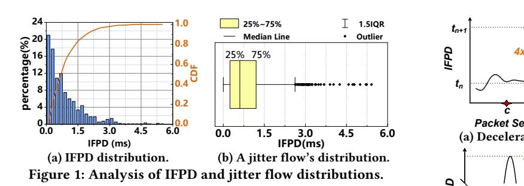

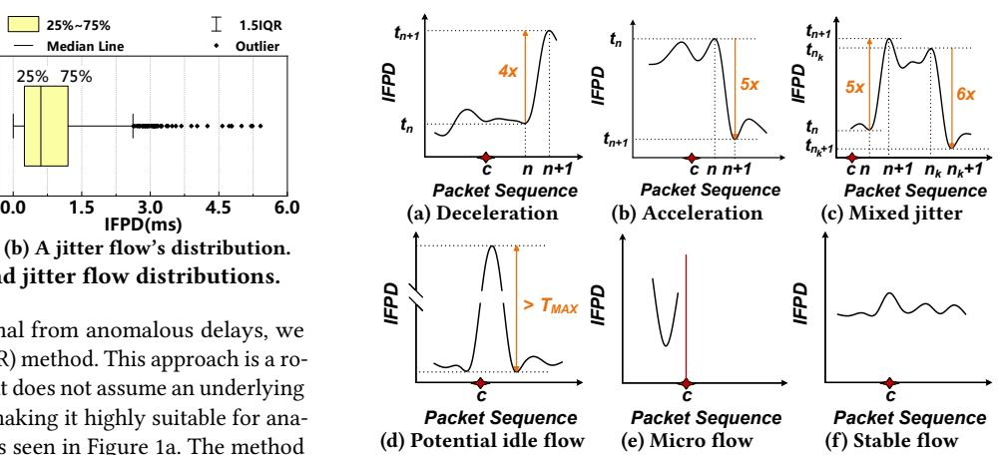

To statistically demarcate normal from anomalous delays, we employ the Interquartile Range (IQR) method. This approach is a robust outlier detection technique that does not assume an underlying data distribution (e.g., Gaussian), making it highly suitable for analyzing skewed, heavy-tailed data as seen in Figure [1a.](#page-2-0) The method defines the central 50% of data—from the first quartile (��1) to the third quartile (��3)—as the normal range. Outliers are then identified as data points falling beyond ��3 + 1.5 × IQR, where IQR = ��3 −��1. The box plot in Figure [1b](#page-2-0) provides a visual representation of this principle: the box itself represents the flow's typical delay range, whereas the discrete points outside the whisker are identified as delay anomalies. In this specific sample, the lower bound for an anomalous delay is approximately four times the median delay, with an absolute difference approaching 5ms, thereby quantifying the magnitude of a "significant" deviation. Our objective is to reliably detect packets corresponding to these outliers.

However, a fixed jitter threshold is impractical because IFPD distributions vary significantly across flows (Figure [2\)](#page-2-1). This heterogeneity necessitates a relative definition of jitter. We therefore define a jitter event using two conditions: a multiplicative factor between consecutive IFPDs to ensure relativity, and an absolute difference threshold to filter out negligible fluctuations in otherwise low-latency flows. This dual-condition definition naturally leads to two jitter categories: Deceleration Jitter (a sharp IFPD increase), often linked to congestion, and Acceleration Jitter (a sharp decrease), which may indicate congestion relief or routing improvements.

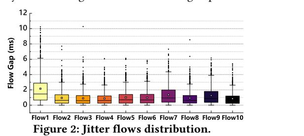

Finally, it is crucial to note that our jitter detection is not applied to all flows. We strategically filter out flows with insufficient traffic volume. For such flows, the small number of packet samples precludes the formation of a statistically stable delay distribution, rendering any statistical anomaly detection unreliable. By focusing on persistent flows that contain enough packets to establish a meaningful statistical profile, we ensure the accuracy of our detection and avoid misinterpreting random volatility as genuine jitter. Example: To provide a more intuitive understanding of our jitter definitions, Figure [3](#page-2-2) presents six typical IFPD sequence patterns captured from real-world network traffic. In each plot, the x-axis

Figure 3: Examples of typical IFPD sequence patterns. (a)-(c) show detectable jitter, (d)-(f) show patterns that are ignored.

represents the packet sequence index, and the y-axis shows the corresponding IFPD. The first three patterns (Fig. [3a-3c\)](#page-2-2) are targets for detection, while the last three (Fig. [3d-3f\)](#page-2-2) are patterns our algorithm is designed to ignore.

- Deceleration Jitter (Figure [3a\)](#page-2-2): This plot depicts a classic deceleration jitter event. A sharp spike in the IFPD occurs between two consecutive packets (e.g., packets �� and �� + 1). This abrupt deterioration in latency is a hallmark of deceleration jitter, often associated with increased congestion along the network path.
- Acceleration Jitter (Figure [3b\)](#page-2-2): This figure illustrates a typical acceleration jitter event, characterized by a precipitous drop in the IFPD. The change satisfies both the multiplicative condition (e.g., being several times smaller than the preceding IFPD, far exceeding a typical threshold like �� = 4) and the absolute difference threshold, clearly constituting a detectable event.
- Mixed Jitter (Figure [3c\)](#page-2-2): This pattern describes a sequence containing both deceleration and acceleration jitter events, where the order and interval between these opposing events are not constrained. For instance, Figure [3c](#page-2-2) illustrates a representative example where a sharp deceleration event (between packets �� and �� + 1) is immediately followed by an acceleration event (between packets ���� and ���� + 1). Our algorithm is designed to identify and report these as distinct events, regardless of their specific arrangement.
- Potential Idle Flow (Figure [3d\)](#page-2-2): This plot illustrates a potential idle flow, characterized by an abnormally large spike in IFPD—so large that the difference between its peak and baseline exceeds the upper threshold �������� . Such a spike typically occurs when a flow has been idle for an extended period and resumes transmission. Since this behavior stems from flow inactivity rather than network timing instability, our algorithm excludes it from jitter detection.
- Micro Flow (Figure [3e\)](#page-2-2): This plot represents the highly erratic IFPD pattern of a micro, non-persistent flow. Although the IFPD fluctuates, such flows lack the statistical stability necessary for reliable analysis and are therefore intentionally filtered out by our algorithm, not being subject to jitter detection.
- Stable Flow (Figure [3f\)](#page-2-2): This figure shows the ideal pattern of a stable, healthy flow. The IFPD remains consistently within a narrow band, indicating reliable network conditions. This pattern serves as the "healthy" baseline against which jittery flows are identified.

# 2.3 Related Work

Research on packet delay jitter can be categorized into three main areas based on deployment and objective: end-host delay variation, traffic-specific jitter detection, and in-network IFPD detection.

End-Host Packet Delay Variation Detection: A significant body of research focuses on measuring delay jitter from an end-to-end perspective, utilizing metrics such as One-Way Delay Variation (OWDV) [\[4\]](#page-8-27) or Round-Trip Time (RTT) [\[35\]](#page-8-14). Technically, some of these methods are based on Inter-Packet Delay (IPD) [\[7\]](#page-8-28) calculations, while others employ predictive models like Autoregressive (AR) processes or adaptive filtering algorithms such as the Normalized Least Mean Square (NLMS) [\[38\]](#page-8-29) to assess network delay. The main limitation of these end-host approaches is they cannot pinpoint the source of the jitter; they only observe the cumulative end-to-end result, not the specific node or link causing it. Furthermore, their focus on macroscopic characteristics, such as OWD or RTT, differs in analytical granularity from this paper's concern with intra-flow, microscopic IFPD jitter.

Traffic-Specific Jitter Detection: A second category of works is dedicated to tailoring jitter detection algorithms for specific types of network traffic or protocols. For example, in the context of multimedia streaming, certain strategies implement active buffer management mechanisms at the gateway to identify and discard packets exhibiting excessive jitter [\[11\]](#page-8-22), thereby preserving playback quality. Similarly, there are methods strictly oriented towards Real-time Transport Protocol (RTP) sessions [\[51\]](#page-8-24). These approaches evaluate network congestion by parsing the specific jitter feedback fields embedded within Real-time Transport Control Protocol (RTCP) reports. Other researchers have focused on analyzing the Inter-Packet Delay Variation (IPDV) within TCP connections to model its impact on transmission throughput [\[28\]](#page-8-23). While these specialized methods often yield high precision within their respective domains, their inherent dependency on specific traffic features, payload inspection, or protocol headers severely limits their universality across diverse, multi-protocol network environments.

In-Network IFPD Detection: To achieve lightweight, line-rate delay monitoring on network devices like switches, researchers have proposed various schemes based on compact data structures such as sketches [\[9,](#page-8-30) [10,](#page-8-31) [14,](#page-8-32) [17,](#page-8-33) [25,](#page-8-34) [27,](#page-8-35) [30,](#page-8-36) [36,](#page-8-37) [39–](#page-8-38)[42,](#page-8-39) [44,](#page-8-40) [45,](#page-8-41) [47,](#page-8-42) [48\]](#page-8-43). The primary goal of these schemes is to monitor the value of IFPD. Prominent examples include DelaySketch [\[54\]](#page-8-26) and FD-Filter [\[24\]](#page-8-25). They use sophisticated data structures to record the approximate arrival time of a flow's previous packet with minimal memory, thereby enabling an estimation of the current packet's IFPD. However, these methods are designed for IFPD estimation, not jitter detection, as they do not store consecutive IFPD values. Adapting them for jitter detection would require building more complex modules, such as hash tables, to track IFPD changes over time, which would introduce significant memory overhead.

In summary, existing solutions exhibit clear gaps: end-host methods lack the necessary in-network visibility for fault localization; traffic-specific solutions are, by definition, not protocol-agnostic; and current in-network approaches focus on singular IFPD estimations rather than capturing dynamic, consecutive jitter patterns. Consequently, developing a lightweight, universal solution capable of detecting complex jitter patterns directly within the network infrastructure remains an open and significant challenge.

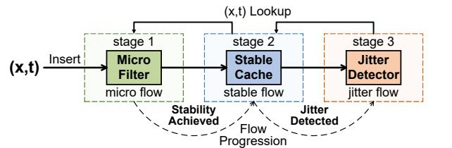

Figure 4: JitterSketch data structure.

### 3 JitterSketch Design

This section details the design of JitterSketch. We first present its three-stage architecture, then describe the design and implementation of each stage. A running example is provided at the end to illustrate the algorithm's operational flow.

## 3.1 Algorithm Framework Overview

To detect network jitter efficiently, JitterSketch utilizes a three-stage pipeline architecture, as illustrated in Figure [4.](#page-3-1) The pipeline begins with the Micro Filter, which screens incoming traffic based on flow size to discard negligible, low-frequency flows. The surviving flows are passed to the Stable Cache, which measures IFPDs and flags flows that show signs of instability. These potential jittery flows are then handed over to the final stage, the Jitter Detector, which monitors them closely to verify and report actual jitter events.

When a packet (��, ��) arrives, JitterSketch first performs a reverse lookup, searching from Stage 3 back to Stage 1. This ensures that an existing flow is always found in its most advanced monitoring stage. If the flow �� is found, it is updated directly within that stage. Otherwise, it is treated as a new flow and processed by Stage 1.

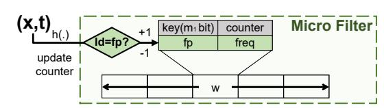

Figure 5: Stage one data structure.

# 3.2 Micro Filter (Stage 1)

As depicted in Figure [5,](#page-3-2) the data structure for the Micro Filter is an array of �� buckets. Each bucket stores two fields: a fingerprint of a flow's key (�� ��) and its frequency counter (�� ������). To conserve memory, the fingerprint is generated by a dedicated function, fingerprint�� (), and is significantly shorter than the original flow key (e.g., 8 bits). The processing in this stage is divided into lookup and insert operations.

Operation: lookup1 (��, ��). This operation is performed as part of the reverse lookup to check if flow �� is currently tracked in Stage 1. It traverses the bucket ��1 [ℎ(��)].

(1) Fingerprint Match: If the bucket's stored fingerprint matches fingerprint�� (��), the flow's frequency counter is incremented (i.e., ��1 [ℎ(��)].�� ������++). If the frequency reaches the threshold �� (i.e., �� ������≥��), the flow is promoted to Stage 2 via the insert2 (��, ��) operation, and the bucket is cleared. Otherwise, the operation concludes. (2) No Match: If the fingerprint does not match (i.e., the bucket is empty or occupied by another flow), the insert1 (��, ��) operation is called to handle the insertion.

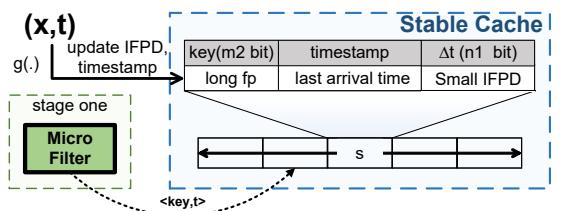

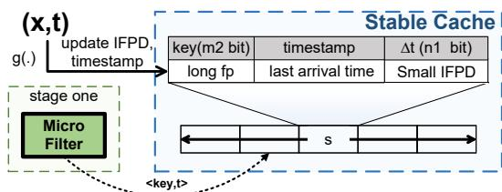

Figure 6: Stage two data structure.

Operation: insert1 (��, ��). This operation handles the insertion of a new flow in bucket ��1 [ℎ(��)].

(1) Empty Bucket: If the bucket is empty, the new flow's fingerprint, fingerprint�� (��), is stored and its frequency is set to 1.

(2) Occupied Bucket: If the bucket is occupied by another flow, the frequency counter of the existing flow is decremented. If the counter drops to 0 as a result, the bucket is cleared.

This mechanism effectively acts as a filter, retaining a vast number of flows with a frequency less than �� within this stage, thereby significantly reducing the processing load on the subsequent stages.

Optimization: To further enhance accuracy, the Micro Filter can be extended to use �� hash functions (�� ≥ 1), mapping each flow to �� candidate buckets across parallel arrays. Since most network flows are filtered within this stage, providing multiple placement options mitigates the impact of hash collisions and improves tracking fidelity. We denote the variant with this optimization as JitterSketch-Opt. This enhancement, however, introduces a direct trade-off between higher precision and the computational cost of the additional hash calculations.

# 3.3 Stable Cache (Stage 2)

Figure [6](#page-4-0) illustrates the data structure of the Stable Cache, which consists of an array of �� buckets. Each bucket contains three fields: a long fingerprint (generated by �� ���������������������� ), a timestamp (denoting the last-seen time), and the stored small IFPD (e.g., 4bits). This stage employs a longer fingerprint (e.g., 16 bits) than that in Stage 1, though it is still much shorter than the full flow key. This is because flows that reach Stage 2 have already surpassed the frequency threshold �� and are considered more significant. The process is also divided into lookup and insert operations here.

Operation: lookup2 (��, ��). This operation checks bucket ��2 [ℎ(��)] during the reverse-lookup process.

(1) Fingerprint Match: If the bucket's stored fingerprint matches fingerprint�� (��), the algorithm checks for a jitter event. A jitter event is detected if the ratio of the current IFPD (�� − timestamp) to the previously stored IFPD satisfies the following condition:

�� − timestamp IFPD ≥ �� or �� − timestamp IFPD ≤ 1 ��

This condition identifies deceleration or acceleration jitter.

- If jitter is detected, the flow information is passed to Stage 3 by calling insert3 (��, ��, �� − timestamp), and ��2 [ℎ(��)] is cleared.
- If no jitter is detected, the bucket is updated by setting IFPD = �� − timestamp and timestamp = ��. If the IFPD exceeds the maximum value representable by its designated ��1-bit field, the flow will be promoted to Stage 3.

(2) No Match: If the fingerprint does not match, it means flow �� is not currently in this bucket. The reverse lookup process then continues to Stage 1 to search for the flow there (i.e., lookup1 (��, ��)).

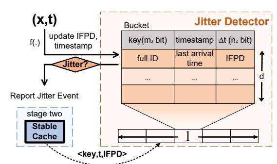

Figure 7: Stage three data structure.

Operation: insert2 (��, ��) This operation handles a flow's promotion from Stage 1. It unconditionally overwrites the contents of bucket ��2 [ℎ(��)] with the new flow's information: its 16-bit fingerprint, the current timestamp ��, and an initial IFPD of zero.

This design creates a clear separation: potentially unstable flows exhibiting even a single jitter event are immediately escalated to Stage 3 for more detailed analysis. Meanwhile, stable flows are efficiently monitored in Stage 2 using their compact fingerprint.

### 3.4 Jitter Detector (Stage 3)

Figure [7](#page-4-1) illustrates the Jitter Detector. It is structured as an array of �� buckets, where each bucket contains �� entries. Unlike the previous stages, each entry stores the full flow key, timestamp, and IFPD. The use of full keys is justified as flows promoted to this stage are considered potentially jittery and require precise tracking. The process is also divided into lookup and insert operations.

Operation: lookup3 (��, ��). This operation traverses the bucket

��3 [ℎ(��)] to find an entry matching the flow key. (1) Key Match: If an entry with key x is found, its jitter status is reevaluated using the same condition as in Stage 2. If the flow exhibits

jitter, an event is reported. Otherwise, if the flow is currently stable, its IFPD and timestamp are updated with the new values.

(2) No Match: If the key is not found after checking all �� entries, the reverse lookup process continues to Stage 2 by performing the lookup2 (��, ��) operation.

Operation: insert3 (��, ��, IFPD). This operation is executed when a flow is promoted from Stage 2. It traverses the bucket ��3 [ℎ(��)]. (1) Empty Entry: If the bucket has an empty entry, the new flow information (��, ��, IFPD) is stored there.

(2) Bucket Full: If all entries in the bucket are occupied, an existing entry must be evicted. The entry chosen for replacement is the one that maximizes the value of ��−entry.timestamp entry.IFPD .

The eviction policy is designed to identify and replace the flow that is most likely to be inactive. A simple least-recently-seen (LRU) approach, which would evict the entry with the oldest timestamp, is unfair to stable flows that have a naturally large IFPD. Such flows might be mistaken as inactive simply because their inter-packet delay is large. To address this, our eviction metric considers both the time elapsed since the last arrival and the flow's typical IFPD. The ratio ��−entry.timestamp entry.IFPD can be interpreted as the number of expected packet arrivals that have been missed, assuming a stable IFPD. This approach, which we call the delay-fair replacement strategy, is therefore fairer to flows with varying IFPDs and is more effective at identifying truly inactive flows for eviction.

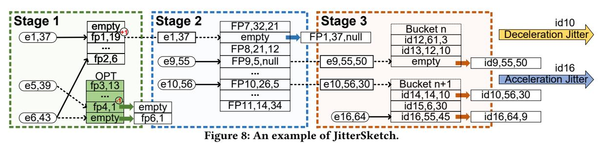

### 3.5 Running Example

The complete pseudo code can be found in Appendix [B.3.](#page-11-1) Figure [8](#page-5-1) shows a running example of JitterSketch. In this example, we set the jitter detection parameter �� = 4 and the stability threshold �� = 20. The bucket depth in Stage 3 is �� = 3, and the number of hash functions in Stage 1 is �� = 2.

Stage 1: Micro Flow Filter.

- Case 1: Packet ��1 arrives. Its fingerprint matches the one in its hashed entry, and the counter increments from 19 to 20, reaching the stability threshold �� = 20. Consequently, flow ��1 is promoted to Stage 2. The corresponding entry in Stage 2 is empty, so it is populated with the long fingerprint of ��1 and its timestamp, 37.
- Case 2: Packet ��5 hashes to an occupied entry in Stage 1, causing a collision. The existing entry's counter is decremented to 0, leading to its eviction.
- Case 3: Packet ��6 uses�� = 2 hash functions. Its first hash location is a collision, but the second is empty. The fingerprint for ��6 is therefore inserted into the empty slot with a counter of 1.

Stage 2: Stable Flow Cache.

- Case 4: Packet ��9 arrives at Stage 2. Its newly calculated IFPD (50) is large, flagging it as potentially jittery. The flow is promoted and inserted into an available slot in Stage 3.
- Case 5: Packet ��10 arrives at Stage 2. Its new IFPD (30) is more than �� = 4 times its old IFPD (5), triggering a deceleration jitter event. The flow is promoted to a full bucket in Stage 3. Our eviction policy calculates inactivity metrics for the existing flows (4.2 for ����14, 1.67 for ����15, and 0.02 for ����16) and replaces the one with the highest score (����14). A jitter event for ��10 is reported.

Stage 3: Jitter Detector.

- Case 6: Packet ��16 arrives, which is already monitored in this stage. Its IFPD is calculated as 9 (64-55). Compared to its recorded IFPD of 45, the new IFPD is less than the old IFPD divided by �� (i.e., 9 &lt; 45/4), indicating an acceleration jitter event. The system reports an acceleration jitter event (��16, 45, 9) and updates the flow's recorded IFPD to 9.

# 4 Performance Evaluation

### 4.1 Experiment Setup

4.1.1 Platform. Experiments ran on a Linux server (Intel i7-13700KF, 32GB DRAM). We implemented JitterSketch, its optimized version (JitterSketch-Opt), and baselines (DelaySketch and FDFilter, augmented with hashtables) in C++ using Bob Hash [\[1\]](#page-8-44). To ensure consistency, we disabled CPU frequency scaling and pinned processes to dedicated cores. The source code is also available at [\[2,](#page-8-45) [3\]](#page-8-46).

4.1.2 Datasets. We evaluate our algorithm on CAIDA [\[8\]](#page-8-47) and MAWI [\[33\]](#page-8-48) datasets, see Appendix [B.1](#page-10-0) for details.

4.1.3 Metrics. To evaluate the performance of our proposed algorithms on jitter detection for network streams, we employ the following metrics. The evaluation covers three distinct scenarios: deceleration jitter, acceleration jitter, and mixed jitter.

Precision Rate (PR): This metric measures the fraction of cor-

rectly identified jitter events among all events reported as jitter.

Recall (RR): This metric measures the fraction of correctly identified jitter events among all actual jitter events.

F1 Score (F1): This metric represents the harmonic mean of PR and RR, providing a balanced measure of the overall performance. It is calculated as 2·RR·PR RR+PR .

Throughput (TP): The processing rate in million packets per second (Mpps), calculated as �� �� , where �� is the total number of items and �� is the total processing time.

# 4.2 Parameter Settings

We tuned four key JitterSketch parameters on the CAIDA dataset: the Stage 1 memory proportion (��1), the Stage 2/3 memory ratio (��2), the Stage 3 bucket depth (��), and the Stage 1 hash count (��). A detailed analysis is in Appendix [B.2.](#page-10-1) Our final configuration allocates memory evenly (��1 = 0.5, ��2 = 0.5) for all tasks. To optimize performance, we set bucket depth ��=6 for mixed jitter (��=4 otherwise) and the hash count �� = 3 for acceleration jitter (�� = 2 otherwise).

# 4.3 Deceleration Jitter Detection

For deceleration jitter detection (Figure [9\)](#page-6-0), JitterSketch consistently outperforms baselines, maintaining near-perfect precision (≈1.0) across all memory sizes due to its robustness against hash collisions. Its recall on the CAIDA dataset scales from 0.64 to 0.93—significantly higher than DelaySketch's 0.47—with JitterSketch-Opt providing a further 5–10% improvement. In terms of efficiency, JitterSketch achieves an F1 score of 0.99 on MAWI2020 (200KB), far surpassing DelaySketch (0.65) and FDFilter (0.20), while delivering a stable throughput of 13.48 Mpps (4.3x and 10.3x faster than baselines, respectively); even the accuracy-optimized JitterSketch-Opt (8.01 Mpps) exceeds baseline speeds. This performance is driven by a multi-stage architecture where a lightweight Stage 1 filter discards non-jittery flows, and a collision-free final stage eliminates false positives to ensure high precision.

# 4.4 Acceleration Jitter Detection

In detecting acceleration jitter (Figure [10\)](#page-6-1), JitterSketch demonstrates significant advantages, achieving perfect precision (1.0) where baselines prove volatile against bursty patterns. Its recall improves

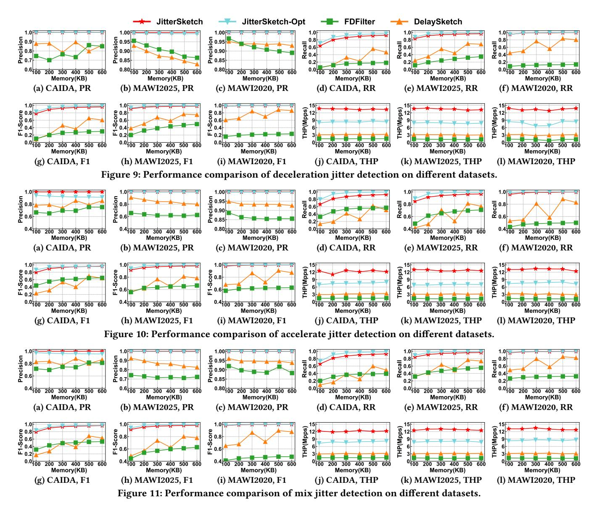

dramatically with memory, with JitterSketch-Opt notably achieving 0.997 recall on MAWI2020 with just 200KB, whereas baselines fail to saturate even at 600KB. High memory efficiency is confirmed by an F1 score of 0.98 on the CAIDA dataset (100KB)—drastically outperforming DelaySketch (0.68) and FDFilter (0.58)—alongside an outstanding throughput of 12.71 Mpps (4.0x and 9.6x faster than baselines). These results stem from the algorithm's innovative design, where the lightweight first-stage filter effectively absorbs traffic spikes and decouples initial processing from detailed statetracking, thereby preventing the bottlenecks typical of baselines.

# 4.5 Mixed Jitter Detection

For mixed jitter detection (Figure [11\)](#page-6-2), JitterSketch establishes comprehensive superiority by maintaining perfect precision (1.0) and high stability, even as baseline methods become highly unstable. On MAWI2020 (600KB), its recall reaches 0.996, far surpassing FDFilter

(0.32) and DelaySketch (0.82), with JitterSketch-Opt consistently outperforming the standard version by roughly 5%. The algorithm exhibits "fast convergence", reaching an F1 score above 0.9 with minimal memory, and maintains a stable throughput of 12.67 Mpps despite traffic complexity. This robustness is attributed to our delayfair replacement strategy, which ensures unbiased monitoring of diverse latency characteristics, preventing bias toward any single jitter type when acceleration and deceleration events coexist.

### 4.6 Practical Application

4.6.1 Background. In Quality of Service (QoS) networks, delay jitter—the variance in packet delay—is a critical metric [\[22,](#page-8-49) [43\]](#page-8-50). To mitigate this, we employ an optimized framework leveraging JitterSketch, benchmarked against the classic On-Line Delay-Jitter Control (OLDC) algorithm [\[32\]](#page-8-51). OLDC utilizes a buffer of size 2�� to regularize output. It accumulates �� packets before computing

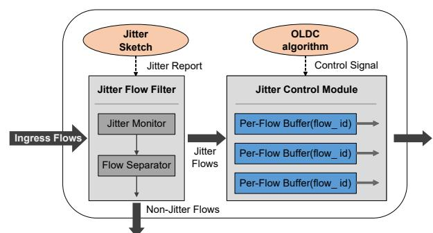

Figure 12: Optimized jitter control framework.

a periodic release schedule, subject to two key constraints: the Arrival Constraint, ensuring a packet is not released before its actual arrival; and the Overflow Constraint, which mandates the ��-th packet be released by the time the (�� + 2��)-th packet arrives to prevent buffer overflows.

4.6.2 Jitter Flow Optimization Framework. Since device memory and computational resources are finite, providing unlimited jitter control for all flows is infeasible. It is therefore essential to prioritize resources for flows exhibiting significant jitter. To address this, we propose an optimized framework that integrates JitterSketch for real-time jitter detection as shown in Figure [12.](#page-7-1)

The workflow of the optimized framework is as follows:

- (1) Jitter Flow Filter: Ingress flows are directed to a Jitter Flow Filter. A Jitter Monitor component, powered by the JitterSketch algorithm, analyzes traffic in real-time to identify jittery flows. A Flow Separator then divides the traffic into Jitter Flows and Non-Jitter Flows. Non-jittery flows are forwarded directly without further processing.
- (2) Jitter Control: The identified Jitter Flows are sent to a Jitter Control Module. Guided by the OLDC algorithm, this module uses its limited per-flow buffers to shape the flows and suppress jitter before outputting the processed traffic.

This targeted approach ensures that valuable resources are allocated precisely to the flows most in need of traffic shaping, maximizing resource efficiency and overall network QoS.

4.6.3 Performance Evaluation Metrics. We adopt metrics from the original OLDC paper, starting with the Flow Delay Variation (���� ). Unlike instantaneous IFPD, ���� measures macroscopic stability by calculating the maximum deviation between actual release times (���� ) and the ideal period based on average inter-arrival time (����):

���� = max 0≤��,��≤�� {|���� − ���� − (�� − ��)���� |} (1)

From ���� , we derive two network-wide metrics: the Sum of Delay Variations (�������� = Í �� ∈�� ���� ), where a lower sum indicates better overall service quality; and the Number of Variation Flows (���� ������ = |{�� ∈ �� | ���� &gt; 0}|), which counts persistent flows with non-zero variation to measure the scope of jitter impact.

4.6.4 Experimental Results. Sum of Delay Variations (��������): As shown in Figure [13,](#page-7-2) our JitterSketch-optimized (OLDC+JitterSketch) framework consistently outperforms the standard OLDC algorithm. In Figure [13a,](#page-7-2) with a fixed buffer of 4000, increasing the OLDC parameter �� from 1 to 6 reduces �������� for our framework from

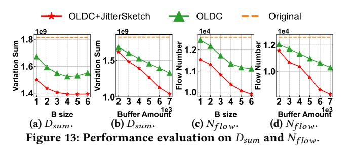

1.50 × 109 to 1.39 × 109 , significantly outperforming OLDC. In Figure [13b,](#page-7-2) with �� fixed at 4, increasing the buffer amount from 2000 to 7000 lowers the �������� for our framework to 1.04 × 109 , compared to 1.33 × 109 for OLDC.

Number of Variation Flows (���� ������): As shown in Figure [13c,](#page-7-2) [13d.](#page-7-2) Our framework also reduces the scope of jitter-affected services more effectively. By either increasing the B size (reducing variation flows from 11,538 to 9,905) or the buffer amount (reducing them from 11,577 to 8,250), our framework eliminates jitter entirely for more flows than the OLDC algorithm across all configurations.

Summary: The results confirm the superiority of our JitterSketchoptimized framework. Its advantage lies in intelligent resource allocation. The traditional OLDC algorithm treats all flows indiscriminately, wasting limited buffer resources on flows that exhibit little to no jitter. In contrast, our framework uses JitterSketch to first identify problematic flows and then concentrates resources where they are most needed. This targeted approach leads to a greater reduction in both �������� and ���� ������ under identical resource constraints. As resources increase, the performance of both methods improves, but the efficiency gap widens, further highlighting the superiority of our optimized framework.

### 5 Conclusion

This paper introduces JitterSketch, the first sketch-based algorithm specifically designed for high-precision detection of diverse jittery flows. Its resource-efficient, multi-stage architecture filters nonessential traffic, enabling it to outperform baselines with a ∼50% point improvement in both precision and recall, and a 10x higher throughput. The practical value of JitterSketch was further validated in a QoS system, where it yielded significant improvements in quality of service. This work establishes JitterSketch as a powerful solution for modern network quality and jitter monitoring.

### Acknowledgments

We sincerely thank the anonymous reviewers for their constructive comments. This work was conducted under the leadership of the corresponding authors, Wenjun Li, Weizhe Zhang, and Tong Yang, and was supported in part by the National Key Research and Development Program of China (No. 2025YFE0200100), the Major Key Project of Peng Cheng Laboratory (No. PCL2025A07), the National Natural Science Foundation of China (NSFC) / Research Grants Council (RGC) Collaborative Research Scheme (No. 62461160332 & CRS\_HKUST602/24), the National Natural Science Foundation of China (No. 62221003, 62132004, 62472246, 62102203), the Young Topnotch Talent Project of Guangdong Province (No. 2023TQ07X362), the Basic Research Enhancement Program (No. 2021-JCJQ-JJ-0483), and the Shenzhen Postdoctoral Fund (No. DZ31000010).

- References [1] Bob Hash Website. [http://burtleburtle.net/bob/hash/evahash.html.](http://burtleburtle.net/bob/hash/evahash.html) [2] JitterSketch GitHub. [https://github.com/wenjunpaper/JitterSketch.](https://github.com/wenjunpaper/JitterSketch) [3] JitterSketch Website. [https://turbonet.team/JitterSketch.](https://turbonet.team/JitterSketch) [4] Makoto Aoki, Eiji Oki, and Roberto Rojas-Cessa. 2010. Scheme to measure oneway delay variation with detection and removal of clock skew. in IEEE HPSR (2010). [5] Anastasiia Beznosyk, Peter Quax, Karin Coninx, and Wim Lamotte. 2011. Influence of network delay and jitter on cooperation in multiplayer games. In Proceedings of the 10th international conference on virtual reality continuum and its applications in industry. 351–354. [6] Lawrence S Brakmo, Sean W O'malley, and Larry L Peterson. 1994. TCP Vegas: New techniques for congestion detection and avoidance. In Proceedings of the conference on Communications architectures, protocols and applications. 24–35. [7] Dinh Thai Bui, Arnaud Dupas, and Michel Le Pallec. 2009. Packet delay variation management for a better IEEE1588V2 performance. In 2009 International Symposium on Precision Clock Synchronization for Measurement, Control and Communication. IEEE, 1–6. [8] CAIDA. 2025. The CAIDA Anonymized Internet Traces. [http://www.caida.org/](http://www.caida.org/data/overview/) [data/overview/.](http://www.caida.org/data/overview/) [9] Lu Cao, Qilong Shi, Yuxi Liu, Hanyue Zheng, Yao Xin, et al. 2024. Bubble Sketch: A High-performance and Memory-efficient Sketch for Finding Top-k Items in Data Streams. in ACM CIKM (2024). [10] Lu Cao, Qilong Shi, Weiqiang Xiao, Nianfu Wang, Wenjun Li, Zhijun Li, Weizhe Zhang, and Mingwei Xu. 2025. Hypersistent Sketch: Enhanced Persistence Estimation via Fast Item Separation. in IEEE ICDE (2025). [11] Siu-Ping Chan, C-W Kok, and Albert K Wong. 2005. Multimedia streaming gateway with jitter detection. IEEE Transactions on Multimedia 7, 3 (2005), 585–
- 592. [12] Baek-Young Choi, Sue Moon, Zhi-Li Zhang, Konstantina Papagiannaki, and Christophe Diot. 2007. Analysis of point-to-point packet delay in an operational network. Computer Networks 51, 13 (2007), 3812–3827. [13] Mark Claypool and Jonathan Tanner. 1999. The effects of jitter on the peceptual quality of video. In Proceedings of the seventh ACM international conference on Multimedia (Part 2). 115–118. [14] Shuang Cui, Kai Han, Jing Tang, He Huang, Xueying Li, and Zhiyu Li. 2023. Streaming algorithms for constrained submodular maximization. in ACM SIG-METRICS (2023). [15] Michael K Daly. 2009. Advanced persistent threat. Usenix, Nov 4, 4 (2009), 2013–2016. [16] Edward J Daniel, Christopher M White, and Keith A Teague. 2003. An interarrival delay jitter model using multistructure network delay characteristics for packet networks. In The Thrity-Seventh Asilomar Conference on Signals, Systems & Computers, 2003, Vol. 2. IEEE, 1738–1742. [17] Zhuochen Fan, Zhongxian Liang, Zirui Liu, Dayu Wang, Dong Wen, Wenjun Li, Tong Yang, Yuzhou Liu, and Weizhe Zhang. 2026. PSSketch: Finding Persistent and Sparse Flow with High Accuracy and Efficiency. in ACM SIGKDD (2026). [18] Domenico Ferrari. 1992. Delay jitter control scheme for packet-switching internetworks. Computer communications 15, 6 (1992), 367–373. [19] Bur Goode. 2002. Voice over internet protocol (VoIP). Proc. IEEE 90, 9 (2002), 1495–1517. [20] Rong Gu, Simian Li, Haipeng Dai, Hancheng Wang, Yili Luo, et al. 2023. Adaptive online cache capacity optimization via lightweight working set size estimation at scale. in USENIX ATC (2023). [21] Stephen R Gulliver and Gheorghita Ghinea. 2007. The perceptual and attentive impact of delay and jitter in multimedia delivery. IEEE Transactions on Broadcasting 53, 2 (2007), 449–458. [22] Karim Hammad, Abdallah Moubayed, Abdallah Shami, and Serguei Primak. 2016. Analytical approximation of packet delay jitter in simple queues. IEEE Wireless Communications Letters 5, 6 (2016), 564–567. [23] Thoufique Haq, Jinjian Zhai, and Vinay K Pidathala. 2017. Advanced persistent threat (APT) detection center. US Patent 9,628,507. [24] Jintao He, Jie Gui, Tian Lv, Jiaqi Zhu, and Qun Huang. 2025. FD-Filter: A Compact Data Structure for Fine-Grained Intra-Flow Packet Delay Monitoring. in IEEE INFOCOM (2025). [25] He Huang, Jiakun Yu, Yang Du, Jia Liu, Haipeng Dai, and Yu-E Sun. 2023. Memory-Efficient and Flexible Detection of Heavy Hitters in High-Speed Networks. in ACM SIGMOD (2023). [26] Sofiene Jelassi, Habib Youssef, and Guy Pujolle. 2009. Parametric speech quality models for measuring the perceptual effect of network delay jitter. In 2009 IEEE 34th Conference on Local Computer Networks. IEEE, 193–200. [27] Peng Jia, Pinghui Wang, Rundong Li, Junzhou Zhao, Junlan Feng, Xidian Wang, and Xiaohong Guan. 2024. A Compact and Accurate Sketch for Estimating a Large Range of Set Difference Cardinalities. in IEEE ICDE (2024). [28] Martin E Jobst, Stephan M Gunther, Maximilian Riemensbergery, Georg Carle, and Wolfgang Utschicky. 2015. Adaptive suppression of inter-packet delay variations in coded packet networks. in IEEE NetCod (2015). [29] Mansour J Karam and Fouad A Tobagi. 2002. Analysis of delay and delay jitter of voice traffic in the Internet. Computer Networks 40, 6 (2002), 711–726. [30] Jiaqian Liu, Ran Ben Basat, Louis De Wardt, Haipeng Dai, and Guihai Chen. 2024. DISCO: A Dynamically Configurable Sketch Framework in Skewed Data Streams. in IEEE ICDE (2024). [31] Aneeq Mahmood, Reinhard Exel, and Thilo Sauter. 2014. Delay and jitter characterization for software-based clock synchronization over WLAN using PTP. IEEE Transactions on industrial informatics 10, 2 (2014), 1198–1206. [32] Yishay Mansour and Boaz Patt-Shamir. 2002. Jitter control in QoS networks. IEEE/ACM Transactions On Networking 9, 4 (2002), 492–502. [33] MAWI Working Group. 2024. MAWI Working Group Traffic Archive. [http:](http://mawi.wide.ad.jp/mawi/ ) [//mawi.wide.ad.jp/mawi/.](http://mawi.wide.ad.jp/mawi/ ) [34] Daniel A Menasce. 2002. QoS issues in web services. IEEE internet computing 6, 6 (2002), 72–75. [35] Radhika Mittal, Vinh The Lam, Nandita Dukkipati, Emily Blem, Hassan Wassel, Monia Ghobadi, Amin Vahdat, Yaogong Wang, David Wetherall, and David Zats. 2015. TIMELY: RTT-based congestion control for the datacenter. ACM SIGCOMM Computer Communication Review 45, 4 (2015), 537–550. [36] Yiyan Qi, Pinghui Wang, Yuanming Zhang, Qiaozhu Zhai, Chenxu Wang, Guangjian Tian, John CS Lui, and Xiaohong Guan. 2020. Streaming algorithms for estimating high set similarities in loglog space. IEEE Transactions on Knowledge and Data Engineering 33, 10 (2020), 3438–3452. [37] Peter Quax, Patrick Monsieurs, Wim Lamotte, Danny De Vleeschauwer, and Natalie Degrande. 2004. Objective and subjective evaluation of the influence of small amounts of delay and jitter on a recent first person shooter game. In ACM SIGCOMM workshop on Network and system support for games. [38] Aziz Shallwani and Peter Kabal. 2003. An adaptive playout algorithm with delay spike detection for real-time VoIP. In CCECE 2003-Canadian Conference on Electrical and Computer Engineering. Toward a Caring and Humane Technology (Cat. No. 03CH37436), Vol. 2. IEEE, 997–1000. [39] Qilong Shi, Chengjun Jia, Wenjun Li, Zaoxing Liu, Tong Yang, Jianan Ji, Gaogang Xie, Weizhe Zhang, and Minlan Yu. 2024. BitMatcher: Bit-level Counter Adjustment for Sketches. in IEEE ICDE (2024). [40] Qilong Shi, Xirui Li, Hanyue Zheng, Tong Yang, Yangyang Wang, and Mingwei Xu. 2025. HeavyLocker: Lock Heavy Hitters in Distributed Data Streams. in ACM SIGKDD (2025). [41] Qilong Shi, Yuchen Xu, Jiuhua Qi, Wenjun Li, Tong Yang, Yang Xu, and Yi Wang. 2023. Cuckoo Counter: Adaptive Structure of Counters for Accurate Frequency and Top-k Estimation. IEEE/ACM Transactions on Networking (2023). [42] Lu Tang, Qun Huang, and Patrick PC Lee. 2019. Mv-sketch: A fast and compact invertible sketch for heavy flow detection in network data streams. IEEE INFOCOM (2019). [43] Dinesh C Verma, Hui Zhang, and Domenico Ferrari. 1991. Delay jitter control for real-time communication in a packet switching network. International Computer Science Institute. [44] Jiayao Wang, Qilong Shi, Xiyan Liang, Han Wang, Wenjun Li, Ziling Wei, Weizhe Zhang, and Shuhui Chen. 2025. PBSketch: Finding Periodic Burst Items in Data Streams. in ACM SIGKDD (2025). [45] Pinghui Wang, Yiyan Qi, Yuanming Zhang, Qiaozhu Zhai, Chenxu Wang, John CS Lui, and Xiaohong Guan. 2019. A memory-efficient sketch method for estimating high similarities in streaming sets. in ACM SIGKDD (2019). [46] EH-K Wu and Mei-Zhen Chen. 2004. JTCP: Jitter-based TCP for heterogeneous wireless networks. IEEE Journal on Selected Areas in Communications 22, 4 (2004), 757–766. [47] Yuhan Wu, Zhuochen Fan, Qilong Shi, Yixin Zhang, Tong Yang, Cheng Chen, Zheng Zhong, Junnan Li, Ariel Shtul, and Yaofeng Tu. 2022. She: A generic framework for data stream mining over sliding windows. in ACM ICPP (2022). [48] Kaicheng Yang, Sheng Long, Qilong Shi, Yuanpeng Li, Zirui Liu, Yuhan Wu, Tong Yang, and Zhengyi Jia. 2023. Sketchint: Empowering int with towersketch for per-flow per-switch measurement. IEEE Transactions on Parallel and Distributed Systems (2023). [49] Minlan Yu, Lavanya Jose, and Rui Miao. 2013. Software Defined Traffic Measurement with OpenSketch. in USENIX NSDI (2013). [50] Liren Zhang, Li Zheng, and Koh Soo Ngee. 2002. Effect of delay and delay jitter on voice/video over IP. Computer Communications 25, 9 (2002), 863–873. [51] Quanxin Zhang, Hanxiao Gong, Xiaosong Zhang, Chen Liang, and Yu-an Tan. 2019. A sensitive network jitter measurement for covert timing channels over interactive traffic. Multimedia Tools and Applications 78, 3 (2019), 3493–3509. [52] Yinda Zhang, Peiqing Chen, and Zaoxing Liu. 2024. OctoSketch: Enabling Real-Time, Continuous Network Monitoring over Multiple Cores. in USENIX NSDI (2024). [53] Li Zheng, Liren Zhang, and Dong Xu. 2001. Characteristics of network delay and delay jitter and its effect on voice over IP (VoIP). In ICC 2001. IEEE International Conference on Communications. Conference Record (Cat. No. 01CH37240), Vol. 1. IEEE, 122–126. [54] Jiaqi Zhu, Kai Zhang, and Qun Huang. 2021. A sketch algorithm to monitor high packet delay in network traffic. in ACM APNet (2021).

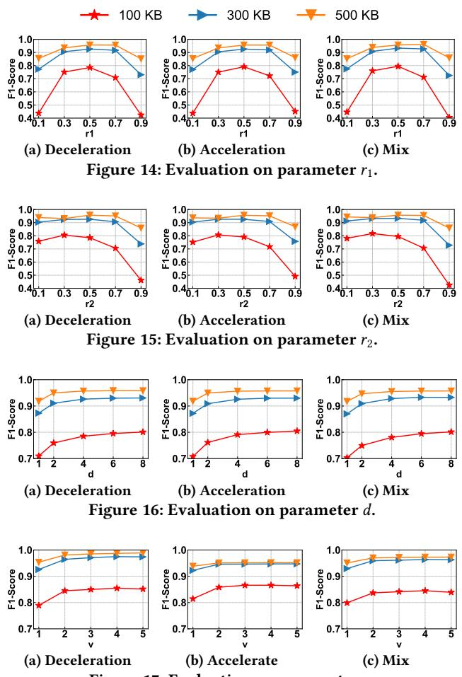

