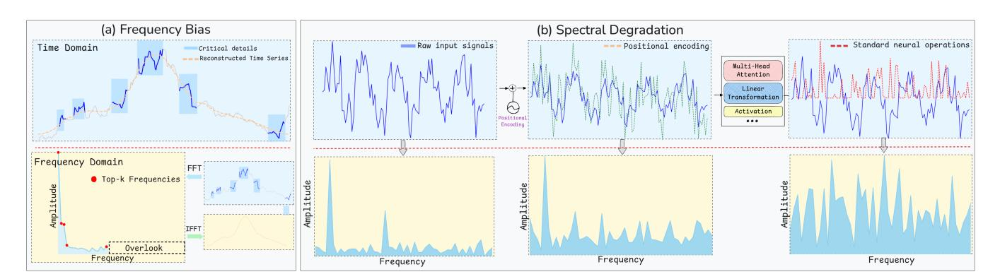
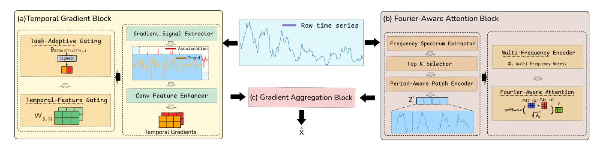
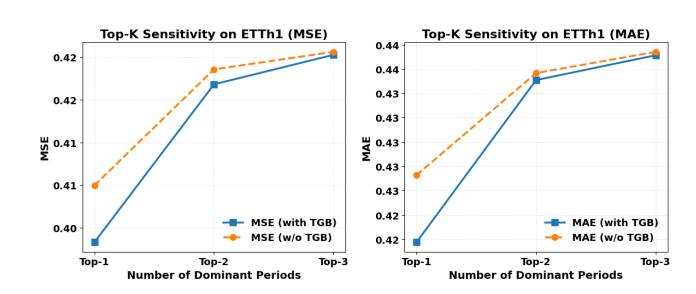

# GFMixer: Decoupled Temporal Gradient and Fourier-Aware Attention for Time Series Forecasting

[Lin Zhang](https://orcid.org/0009-0002-3375-2981)∗ School of Finance Southwestern University of Finance and Economics Chengdu, Sichuan, China 1230202j1001@smail.swufe.edu.cn

[Qing Li](https://orcid.org/0000-0002-3209-0149)∗† School of Management Science and Engineering Southwestern University of Finance and Economics Chengdu, Sichuan, China liq\_t@swufe.edu.cn

[Jingmei Zhao](https://orcid.org/0000-0003-4436-3308)∗† School of Finance Southwestern University of Finance and Economics Chengdu, Sichuan, China zhaojingmei@swufe.edu.cn

# Abstract

Multivariate time series forecasting is fundamental to web-scale systems. However, frequency-domain forecasters face two structural challenges: (i) frequency bias, where low-amplitude yet informative temporal cues are often submerged in noise and neglected during training; (ii) spectral degradation, where standard neural transformations distort high-amplitude periodic structures, thereby weakening the predictive signal. To address both issues, we propose GFMixer, a decoupled dual-path architecture. GFMixer first applies a Temporal Gradient Block (TGB) to capture low-amplitude information through adaptive selection based on temporal-geometric evidence. Subsequently, a Fourier-Aware Attention Block (FAB) represents high-amplitude, multi-frequency information to mitigate spectral degradation. Finally, both information streams are integrated via time-aligned residual connections within a Gradient Aggregation Block (GAB) for the final forecasting task. Extensive evaluations across seven standard benchmarks (ETT, Weather, Electricity, and Traffic) demonstrate GFMixer's superiority, securing 37 first-place rankings and the lowest average MSE overall. Beyond standalone performance, GFMixer serves as a versatile plug-andplay module that consistently enhances mainstream backbones. Code is available at: [https://github.com/superlin30/GFMixer.](https://github.com/superlin30/GFMixer)

# CCS Concepts

### • Mathematics of computing → Time series analysis.

# Keywords

Time Series Forecasting, Frequency Bias, Spectral Degradation

### ACM Reference Format:

Lin Zhang, Qing Li, and Jingmei Zhao. 2026. GFMixer: Decoupled Temporal Gradient and Fourier-Aware Attention for Time Series Forecasting. In Proceedings of the ACM Web Conference 2026 (WWW '26), April 13–17, 2026, Dubai, United Arab Emirates. ACM, New York, NY, USA, [11](#page-10-0) pages. <https://doi.org/10.1145/3774904.3792345>

†Corresponding authors:liq\_t,zhaojingmei@swufe.edu.cn.

[This work is licensed under a Creative Commons Attribution-NonCommercial-](https://creativecommons.org/licenses/by-nc-nd/4.0)[NoDerivatives 4.0 International License.](https://creativecommons.org/licenses/by-nc-nd/4.0)

WWW '26, Dubai, United Arab Emirates © 2026 Copyright held by the owner/author(s). ACM ISBN 979-8-4007-2307-0/2026/04 <https://doi.org/10.1145/3774904.3792345>

# 1 Introduction

As the Web operates increasingly as a real-time, data-driven infrastructure, time series forecasting has become a core capability for forecasting user demand and system dynamics, spanning energy management [\[23\]](#page-8-0), weather prediction [\[7\]](#page-8-1), and finance [\[2,](#page-8-2) [8,](#page-8-3) [19\]](#page-8-4). While traditional models focus on temporal dependencies, an increasing amount of research highlights that key predictive structures are often more clearly revealed in the frequency domain [\[3,](#page-8-5) [10,](#page-8-6) [24\]](#page-8-7). Real-world series typically consist of (i) low-frequency, highamplitude components that capture long-term or seasonal regularities, and (ii) high-frequency, low-amplitude fluctuations that encode rapid trend reversals and fine-grained accelerations [\[11\]](#page-8-8). These weak signals may be small in energy, but they often carry earlywarning information that is vital for timely decision-making [\[5\]](#page-8-9).

However, current frequency-domain modeling pipelines still face two unresolved challenges: The first challenge is frequency bias toward high amplitude components [\[12\]](#page-8-10). Mainstream frequencydomain models tend to amplify dominant peaks and suppress lowamplitude components (e.g., top-�� selection), causing models to ignore weak but meaningful predictive cues [\[17\]](#page-8-11). As shown in Figure [1\(](#page-1-0)a), low-amplitude components often encode high-frequency key temporal patterns such as rapid trend reversals and fine-grained acceleration changes [\[11\]](#page-8-8). Prior attempts to "bring back" weak components either equalize attention across bands [\[12\]](#page-8-10) or amplify low-energy components [\[5\]](#page-8-9). Both "overlooking" and "boosting" methods face a fundamental trade-off between signal recovery and stability. Low-amplitude regions mix informative signal with noise, thus equal treatment fragments attention, while indiscriminate amplification boosts noise and induces instability.

The second challenge is spectral degradation. Theoretically, we have proven that, when high-amplitude periodic components are transformed by neural encoders, nonlinear operations (e.g., additive positional encodings and projections) often destroy spectral coherence and blur periodic cues, undermining long-term generalization. As shown in Figure [1\(](#page-1-0)b), these nonlinear operations inherently lack frequency awareness or inductive bias toward periodicity. They inject positional noise, mix spectral bases, and introduce harmonic distortions [\[6\]](#page-8-12). Empirically, we demonstrate that periodic protection significantly improves generalization and stability across benchmarks in energy, weather, and financial forecasting tasks.

Even after decoupling low-amplitude cues to mitigate frequency bias and preserving high-amplitude periodicity against spectral degradation, truly separating meaningful cues from noise still requires a shared time coordinate with stable, recurring windows.

∗All authors contributed equally to this research.

Figure 1: (a) illustrates that top-�� frequency selection overlooks low-amplitude components, which leads to frequency bias. We visualize the key pattern loss in the time domain; (b) simulates and visualizes spectral degradation from the time domain and its corresponding frequency domain, illustrating how positional encoding and neural transformations disrupt periodic components.

High-frequency fluctuations comprise two types: (a) random, unanchored impulses that occur idiosyncratically along the time axis, and (b) recurrent, window-specific transients whose probability or intensity systematically varies across within-cycle time slots (e.g., evening load spikes, weekday commute peaks, market open/close windows). Only (b) recurs relative to these windows and thus carries stable predictive value. When temporal alignment is lost, the coordinate that distinguishes (b) from (a) collapses; recurrent transients can no longer bind to their windows and become statistically indistinguishable from noise.

Therefore, a credible time series forecasting framework must jointly treat these two complementary carriers along the shared time axis: (i) preserving backbone periodicity (amplitude and timeaxis information) across layers, and (ii) modeling low-amplitude cues decoupled from the backbone stream and injecting them selectively into the backbone along the shared time axis. Theoretically, we formalize the above challenges and prove several structural results that motivate our decoupled design. Our approach, GFMixer, implements our principle with a dual-path architecture. As illustrated in Figure [2,](#page-2-0) GFMixer consists of three main components:

First, we introduce a Temporal Gradient Block (TGB) to capture weak yet predictive local trends and turning points that are commonly overlooked by frequency-domain forecasters. TGB extracts low-amplitude components from the signal by computing multi-scale causal geometric features, specifically temporal slopes and curvatures, which highlight local variations that become informative only when aligned to a unified time axis. TGB operates in parallel with the periodic backbone to avoid distorting dominant frequency components and injects gradient information through a two-level gating mechanism. A task-adaptive gate controls the relative importance of slope-based versus curvature-based evidence, enabling the model to adjust to different dataset characteristics and training stages. A temporal–feature gate further modulates these signals across time steps and variables using recurring temporal patterns inferred from the backbone's seasonal and positional encodings, amplifying contributions during historically relevant periods and suppressing them elsewhere.

Second, we introduce a Fourier-Aware Attention Block (FAB) that embeds positional information into a multi-frequency Fourier representation, enabling the attention mechanism to preserve spectral integrity and mitigate the spectral degradation commonly induced by deep neural transformations.

Finally, we design a Gradient Aggregation Block (GAB) to refine the backbone output through a residual correction pathway. GAB enhances low-amplitude temporal variations without disturbing the high-amplitude structures learned by the backbone by injecting fused gradient signals that capture geometric dynamics into the final prediction along the unified time axis.

Importantly, this gradient aggregation is structurally decoupled from the backbone, enabling stable and plug-and-play integration of TGB and FAB with diverse forecasting architectures. The unique contributions of our study are threefold:

- We identify and formalize two fundamental challenges in frequency-domain forecasting: frequency bias, which hinders the modeling of low-amplitude yet informative components, and spectral degradation, where high-amplitude periodic structures are distorted by neural transformations. We show how positional encodings, projections, and nonlinearities induce cross-frequency mixing that exacerbates the issue.
- We propose GFMixer, a decoupled dual-path framework comprising (i) a Temporal Gradient Block (TGB) with taskadaptive and temporal–feature gating to extract weak geometric signals, (ii) a Fourier-Aware Attention Block (FAB) to preserve multi-frequency periodic structures, and (iii) a Gradient Aggregation Block (GAB) for residual, window-aware correction.
- Extensive experiments on seven benchmarks (ETT, Weather, Electricity, and Traffic) show that GFMixer achieves 37 best results and the lowest average MSE. It also serves as a lightweight plug-and-play module that consistently improves mainstream backbones. Code is available at [https:](https://github.com/superlin30/GFMixer) [//github.com/superlin30/GFMixer.](https://github.com/superlin30/GFMixer)

Gradient Signal Extractor. Let X ∈ R ��×�� ×�� represent the input sequence, we calculate the Trend and Acceleration signals as firstand second-order differences:

T(��) = X(��) − X(�� − 1), (15)

A(��) = T(��) − T(�� − 1). (16)

Conv Feature Enhancer. A convolutional layer is applied to the stacked trend and acceleration signals to enhance meaningful temporal features:

TG(��,��) = Conv (Stack (T(��), A(��))) . (17)

Task-Adaptive Gating. To adaptively prioritize trend or acceleration signals across forecasting tasks, a learnable strategy vector �� is used to compute a global weighting, ���� = Softmax(��). This global gating mechanism enables the model to dynamically adjust its focus on trend or acceleration signals depending on the task at hand.

Temporal-Feature Gating. A learnable weight tensor W[��,��] is introduced, encoding the importance of trend or acceleration for each time step and feature.

Finally, the fused gradient signal is computed as:

TGfused (��, ��) = ∑︁2 ��=1 ���� · W��,��,�� · TG(��, ��,��). (18)

### 4.4 Gradient Aggregation Block

The Gradient Aggregation Block (GAB) serves as the critical bridge that unifies the complementary carriers along the shared time axis. While the FAB directly generates predictions in the forecast horizon ��, the gradient signals extracted by the TGB are derived from the historical context window ��. We employ a learnable projection via a one-dimensional convolution with kernel size 1 to bridge the temporal mismatch between the historical context window �� and the prediction horizon ��. Let TGfused ∈ R ��×�� be the aggregated historical gradient features. We employ a temporal projection matrix Wproj ∈ R ��×�� to translate these historical dynamics into future corrections, which are residually added to the backbone prediction Xˆ base:

Xˆ = Xˆ base + WprojTGfused. (19)

This mechanism directly maps historical acceleration trends (length ��) to the forecast horizon (length ��). This design ensures that the correction is strictly aligned with the prediction timeline. The fused signals are added directly without undergoing additional transformations. Furthermore, this design supports lightweight structural modularity that can be directly integrated into existing encoderbased forecasting models. In our experiments, it is seamlessly integrated into PatchTST [\[10\]](#page-8-6), the FAB replaces standard attention without major architectural changes, and TGB is applied as an external residual path, independent of the backbone model. This design demonstrates the versatility and interoperability of our modules.

# 5 Experiments

Datasets. We conduct experiments on seven popular real-world datasets [\[18,](#page-8-14) [24\]](#page-8-7): Electricity Transformer Temperature (ETT) with four sub-datasets (ETTh1, ETTh2, ETTm1, ETTm2), Weather, Electricity, and Traffic. The train/val/test splits follow the protocol established by [\[24\]](#page-8-7) for the ETT datasets, and the protocol from [\[17\]](#page-8-11) for the remaining datasets.

Baselines. To comprehensively evaluate the effectiveness of our model, we compare it with a wide range of state-of-the-art models in long-term time series forecasting, categorized as follows:

- Time-Domain Modeling: TimeMixer++ [\[15\]](#page-8-22), FEDformer [\[25\]](#page-8-15), PatchTST [\[10\]](#page-8-6), DLinear [\[22\]](#page-8-13), and CARD [\[21\]](#page-8-23).
- Frequency-Domain Modeling: TimesNet [\[17\]](#page-8-11), PDF [\[4\]](#page-8-17), and Times2D [\[9\]](#page-8-16).
- Low-Amplitude Components Modeling: Fredformer [\[12\]](#page-8-10) and Amplifier [\[5\]](#page-8-9).

Setups. We use Mean Square Error (MSE) and Mean Absolute Error (MAE) as evaluation metrics, consistent with previous work [\[16\]](#page-8-24). All models follow the forecasting setting proposed by TimesNet [\[17\]](#page-8-11), with a common prediction length �� = {96, 192, 336, 720}. For the look-back window ��, we adopt the officially reported configurations or the best-performing settings from official open-source codes. For instance, Times2D and PDF employ �� = 720, while PatchTST and DLinear utilize �� ∈ {336, 512}. Our objective is to demonstrate the competitiveness of GFMixer against these advanced models. Experiments were conducted using PyTorch on NVIDIA A100-PCIE-40GB GPUs, following the training and optimization settings of Times-Net [\[17\]](#page-8-11): Adam optimizer (initial learning rate 1 × 10−3 ), batch size 128, and early stopping with a patience of 10 epochs. We report the mean results averaged over three runs with different random seeds. Statistical tests verify that GFMixer achieves robust and significant improvements (�� &lt; 0.05) compared to the baselines.

### 5.1 Main Results

In Table [1,](#page-6-0) we report multivariate long-term forecasting results across seven benchmark datasets (ETTh1, ETTh2, ETTm1, ETTm2, Weather, Electricity and Traffic) and four prediction horizons �� ∈ {96, 192, 336, 720}. GFMixer consistently achieves strong performance and displays remarkable consistency across all datasets and horizons. On average, it obtains the lowest MSE on all seven datasets and the lowest MAE on four out of seven, outperforming state-ofthe-art baselines. GFMixer improves MSE by 11.3% and MAE by 8.1% compared to the classic transformer-based baselines (FEDformer and PatchTST), and outperforms linear models like DLinear by over 6.5% in MSE and 5.4% in MAE. Even compared with recently proposed models such as TimeMixer++ (2025), Amplifier (2025) and Times2D (2025), GFMixer achieves comparable performance in certain cases, while achieving advantages in average performance on all datasets. These comprehensive results highlight GFMixer as a new state-of-the-art model for multivariate long-term time series forecasting, capable of maintaining predictive accuracy across various datasets and horizons.

# 5.2 Ablation Studies

Impact of the Temporal Gradient Block. To evaluate the benefit of incorporating low-amplitude signals via gradients, we compare the full model with three variants: (i) w/o TGB, which removes the Temporal Gradient Block entirely; (ii) w/o Acc, which retains only the

Table 1: Multivariate long-term forecasting full results with different prediction lengths �� ∈ {96, 192, 336, 720}. Best results are in bold and second best are underlined.

| Models Metric H | MSE   | GFMixer (Ours) MAE | MSE   | TimeMixer++ (2025) MAE | MSE   | Amplifier (2025) MAE | MSE   | Times2D (2025) MAE | MSE   | PDF (2024) MAE | MSE   | Fredformer (2024) MAE | MSE   | CARD (2024) MAE | MSE   | TimesNet (2023) MAE | MSE   | DLinear (2023) MAE | MSE   | PatchTST (2023) MAE | MSE   | FEDformer (2022) MAE |
|-----------------|-------|--------------------|-------|------------------------|-------|----------------------|-------|--------------------|-------|----------------|-------|-----------------------|-------|-----------------|-------|---------------------|-------|--------------------|-------|---------------------|-------|----------------------|
| 96              | 0.353 | 0.390              | 0.361 | 0.403                  | 0.371 | 0.392                | 0.362 | 0.395              | 0.359 | 0.393          | 0.373 | 0.392                 | 0.383 | 0.391           | 0.384 | 0.402               | 0.375 | 0.399              | 0.370 | 0.399               | 0.376 | 0.419                |
| 192             | 0.391 | 0.414              | 0.416 | 0.441                  | 0.426 | 0.422                | 0.405 | 0.423              | 0.390 | 0.413          | 0.433 | 0.420                 | 0.435 | 0.420           | 0.436 | 0.429               | 0.405 | 0.416              | 0.413 | 0.416               | 0.420 | 0.448                |
| 336             | 0.402 | 0.421              | 0.430 | 0.434                  | 0.448 | 0.434                | 0.423 | 0.433              | 0.420 | 0.431          | 0.470 | 0.437                 | 0.479 | 0.442           | 0.491 | 0.469               | 0.439 | 0.443              | 0.422 | 0.436               | 0.459 | 0.465                |
| 720             | 0.446 | 0.463              | 0.467 | 0.451                  | 0.476 | 0.464                | 0.446 | 0.467              | 0.474 | 0.485          | 0.467 | 0.456                 | 0.471 | 0.461           | 0.521 | 0.500               | 0.472 | 0.490              | 0.447 | 0.466               | 0.506 | 0.507                |
| Avg             | 0.398 | 0.422              | 0.419 | 0.432                  | 0.430 | 0.428                | 0.409 | 0.430              | 0.411 | 0.431          | 0.435 | 0.426                 | 0.442 | 0.429           | 0.458 | 0.450               | 0.422 | 0.437              | 0.413 | 0.429               | 0.440 | 0.460                |
| 96              | 0.270 | 0.332              | 0.276 | 0.328                  | 0.279 | 0.337                | 0.270 | 0.334              | 0.271 | 0.333          | 0.293 | 0.342                 | 0.281 | 0.330           | 0.340 | 0.374               | 0.289 | 0.353              | 0.274 | 0.336               | 0.358 | 0.397                |
| 192             | 0.335 | 0.374              | 0.342 | 0.379                  | 0.359 | 0.389                | 0.337 | 0.381              | 0.337 | 0.379          | 0.371 | 0.389                 | 0.363 | 0.381           | 0.402 | 0.414               | 0.383 | 0.418              | 0.339 | 0.379               | 0.429 | 0.439                |
| 336             | 0.324 | 0.380              | 0.346 | 0.398                  | 0.377 | 0.406                | 0.329 | 0.385              | 0.325 | 0.382          | 0.382 | 0.409                 | 0.411 | 0.418           | 0.452 | 0.452               | 0.448 | 0.465              | 0.329 | 0.380               | 0.496 | 0.487                |
| 720             | 0.380 | 0.425              | 0.392 | 0.415                  | 0.420 | 0.432                | 0.376 | 0.422              | 0.383 | 0.428          | 0.415 | 0.434                 | 0.416 | 0.431           | 0.462 | 0.468               | 0.605 | 0.551              | 0.379 | 0.422               | 0.463 | 0.474                |
| Avg             | 0.327 | 0.378              | 0.339 | 0.380                  | 0.359 | 0.391                | 0.328 | 0.381              | 0.329 | 0.380          | 0.365 | 0.393                 | 0.368 | 0.390           | 0.414 | 0.427               | 0.431 | 0.446              | 0.330 | 0.379               | 0.436 | 0.449                |
| 96              | 0.276 | 0.338              | 0.310 | 0.334                  | 0.316 | 0.355                | 0.285 | 0.340              | 0.277 | 0.337          | 0.326 | 0.361                 | 0.316 | 0.347           | 0.338 | 0.375               | 0.299 | 0.343              | 0.290 | 0.342               | 0.379 | 0.419                |
| 192             | 0.314 | 0.361              | 0.348 | 0.362                  | 0.361 | 0.381                | 0.323 | 0.364              | 0.317 | 0.365          | 0.363 | 0.380                 | 0.363 | 0.370           | 0.327 | 0.387               | 0.335 | 0.365              | 0.332 | 0.369               | 0.426 | 0.441                |
| 336             | 0.349 | 0.380              | 0.376 | 0.391                  | 0.393 | 0.402                | 0.350 | 0.381              | 0.346 | 0.382          | 0.395 | 0.403                 | 0.392 | 0.390           | 0.410 | 0.411               | 0.369 | 0.386              | 0.366 | 0.392               | 0.445 | 0.459                |
| 720             | 0.406 | 0.409              | 0.440 | 0.423                  | 0.455 | 0.440                | 0.411 | 0.411              | 0.413 | 0.412          | 0.453 | 0.438                 | 0.458 | 0.425           | 0.478 | 0.450               | 0.425 | 0.421              | 0.416 | 0.420               | 0.543 | 0.490                |
| Avg             | 0.336 | 0.372              | 0.369 | 0.378                  | 0.381 | 0.394                | 0.337 | 0.374              | 0.338 | 0.374          | 0.384 | 0.395                 | 0.383 | 0.384           | 0.400 | 0.406               | 0.357 | 0.378              | 0.351 | 0.380               | 0.448 | 0.452                |
| 96              | 0.163 | 0.253              | 0.170 | 0.245                  | 0.176 | 0.258                | 0.165 | 0.258              | 0.162 | 0.253          | 0.177 | 0.259                 | 0.169 | 0.248           | 0.187 | 0.267               | 0.167 | 0.269              | 0.166 | 0.255               | 0.203 | 0.287                |
| 192             | 0.217 | 0.293              | 0.229 | 0.291                  | 0.239 | 0.300                | 0.221 | 0.295              | 0.218 | 0.293          | 0.243 | 0.301                 | 0.234 | 0.292           | 0.249 | 0.309               | 0.224 | 0.303              | 0.223 | 0.296               | 0.269 | 0.328                |
| 336             | 0.271 | 0.330              | 0.303 | 0.343                  | 0.297 | 0.338                | 0.271 | 0.331              | 0.270 | 0.328          | 0.302 | 0.340                 | 0.294 | 0.339           | 0.321 | 0.351               | 0.281 | 0.342              | 0.274 | 0.329               | 0.325 | 0.366                |
| 720             | 0.348 | 0.379              | 0.373 | 0.399                  | 0.393 | 0.396                | 0.347 | 0.381              | 0.349 | 0.379          | 0.397 | 0.396                 | 0.390 | 0.388           | 0.408 | 0.403               | 0.397 | 0.421              | 0.362 | 0.385               | 0.421 | 0.415                |
| Avg             | 0.250 | 0.314              | 0.269 | 0.320                  | 0.276 | 0.323                | 0.251 | 0.316              | 0.250 | 0.313          | 0.279 | 0.324                 | 0.272 | 0.317           | 0.291 | 0.333               | 0.267 | 0.333              | 0.255 | 0.315               | 0.304 | 0.349                |
| 96              | 0.146 | 0.196              | 0.155 | 0.205                  | 0.156 | 0.204                | 0.145 | 0.195              | 0.145 | 0.195          | 0.163 | 0.207                 | 0.150 | 0.188           | 0.172 | 0.220               | 0.176 | 0.237              | 0.149 | 0.198               | 0.217 | 0.296                |
| 192             | 0.192 | 0.241              | 0.201 | 0.245                  | 0.209 | 0.249                | 0.191 | 0.241              | 0.192 | 0.241          | 0.211 | 0.251                 | 0.202 | 0.238           | 0.219 | 0.261               | 0.220 | 0.282              | 0.194 | 0.241               | 0.276 | 0.336                |
| 336             | 0.242 | 0.279              | 0.237 | 0.265                  | 0.264 | 0.290                | 0.243 | 0.282              | 0.243 | 0.281          | 0.267 | 0.292                 | 0.260 | 0.282           | 0.280 | 0.306               | 0.265 | 0.319              | 0.245 | 0.282               | 0.339 | 0.380                |
| 720             | 0.307 | 0.328              | 0.312 | 0.334                  | 0.343 | 0.342                | 0.315 | 0.336              | 0.307 | 0.328          | 0.343 | 0.341                 | 0.343 | 0.353           | 0.365 | 0.359               | 0.333 | 0.362              | 0.314 | 0.334               | 0.403 | 0.428                |
| Avg             | 0.221 | 0.261              | 0.226 | 0.262                  | 0.243 | 0.271                | 0.223 | 0.263              | 0.222 | 0.261          | 0.246 | 0.272                 | 0.239 | 0.261           | 0.259 | 0.287               | 0.248 | 0.300              | 0.225 | 0.263               | 0.309 | 0.360                |
| 96              | 0.130 | 0.227              | 0.135 | 0.222                  | 0.147 | 0.243                | 0.128 | 0.221              | 0.127 | 0.221          | 0.147 | 0.241                 | 0.141 | 0.233           | 0.168 | 0.272               | 0.197 | 0.282              | 0.190 | 0.296               | 0.193 | 0.308                |
| 192             | 0.144 | 0.241              | 0.147 | 0.235                  | 0.157 | 0.251                | 0.145 | 0.227              | 0.145 | 0.240          | 0.165 | 0.258                 | 0.160 | 0.250           | 0.184 | 0.298               | 0.196 | 0.285              | 0.199 | 0.304               | 0.201 | 0.315                |
| 336             | 0.161 | 0.259              | 0.164 | 0.245                  | 0.174 | 0.269                | 0.165 | 0.252              | 0.160 | 0.256          | 0.177 | 0.273                 | 0.173 | 0.263           | 0.198 | 0.300               | 0.209 | 0.301              | 0.217 | 0.319               | 0.214 | 0.329                |
| 720             | 0.193 | 0.289              | 0.212 | 0.310                  | 0.206 | 0.296                | 0.194 | 0.295              | 0.195 | 0.288          | 0.213 | 0.304                 | 0.197 | 0.284           | 0.220 | 0.320               | 0.245 | 0.333              | 0.258 | 0.352               | 0.246 | 0.355                |
| Avg             | 0.157 | 0.254              | 0.165 | 0.253                  | 0.171 | 0.265                | 0.158 | 0.249              | 0.157 | 0.251          | 0.175 | 0.269                 | 0.168 | 0.258           | 0.193 | 0.295               | 0.212 | 0.300              | 0.216 | 0.318               | 0.214 | 0.327                |
| 96              | 0.353 | 0.242              | 0.392 | 0.253                  | 0.455 | 0.298                | 0.358 | 0.244              | 0.352 | 0.240          | 0.406 | 0.277                 | 0.419 | 0.269           | 0.593 | 0.321               | 0.410 | 0.282              | 0.360 | 0.249               | 0.587 | 0.366                |
| 192             | 0.364 | 0.249              | 0.402 | 0.258                  | 0.470 | 0.316                | 0.375 | 0.255              | 0.364 | 0.249          | 0.426 | 0.290                 | 0.443 | 0.276           | 0.617 | 0.336               | 0.423 | 0.287              | 0.375 | 0.256               | 0.604 | 0.373                |
| 336             | 0.377 | 0.257              | 0.428 | 0.263                  | 0.479 | 0.316                | 0.386 | 0.272              | 0.378 | 0.257          | 0.432 | 0.281                 | 0.460 | 0.283           | 0.629 | 0.336               | 0.436 | 0.296              | 0.392 | 0.264               | 0.621 | 0.383                |
| 720             | 0.421 | 0.281              | 0.441 | 0.282                  | 0.523 | 0.328                | 0.427 | 0.290              | 0.422 | 0.283          | 0.463 | 0.300                 | 0.490 | 0.299           | 0.640 | 0.350               | 0.466 | 0.315              | 0.432 | 0.286               | 0.626 | 0.382                |
| Avg             | 0.379 | 0.258              | 0.416 | 0.264                  | 0.482 | 0.315                | 0.387 | 0.265              | 0.379 | 0.257          | 0.431 | 0.287                 | 0.453 | 0.282           | 0.620 | 0.336               | 0.434 | 0.295              | 0.390 | 0.269               | 0.609 | 0.376                |

Table 2: Ablation study for GFMixer. "w/o Acc" removes the acceleration gate in TGB; "w/o Trend" removes the trend gate; "w/o TGB" removes the entire TGB path. Best results are in bold and second-best in underlined."

|         | Datasets Method | MSE   | ETTh1 MAE | MSE   | ETTh2 MAE | MSE   | ETTm1 MAE | MSE   | Weather MAE |
|---------|-----------------|-------|-----------|-------|-----------|-------|-----------|-------|-------------|
| GFMixer |                 | 0.398 | 0.422     | 0.327 | 0.378     | 0.336 | 0.372     | 0.221 | 0.261       |
| w/o     | TGB             | 0.410 | 0.428     | 0.333 | 0.382     | 0.338 | 0.374     | 0.226 | 0.262       |
| w/o     | Acc             | 0.408 | 0.428     | 0.334 | 0.384     | 0.337 | 0.378     | 0.227 | 0.271       |
| w/o     | Trend           | 0.404 | 0.427     | 0.332 | 0.379     | 0.340 | 0.375     | 0.229 | 0.269       |
| w/o     | FAB             | 0.409 | 0.428     | 0.335 | 0.385     | 0.341 | 0.375     | 0.229 | 0.282       |

trend signal (first-order gradient) and excludes the acceleration signal (second-order gradient); and (iii) w/o Trend, which retains only the acceleration signal. The results in Table [2](#page-6-1) show that removing the entire TGB (w/o TGB) consistently leads to performance drops across all datasets, confirming that TGB provides tangible benefits. Interestingly, retaining either the trend (w/o Acc) or acceleration (w/o Trend) signals alone sometimes yields results comparable to those of GFMixer. However, on datasets like ETTh2 and Weather, these one-sided gradients perform worse than the version without TGB. This suggests that isolated non-task-adapted gradient features may introduce noise rather than informative patterns. These results emphasize the importance of adaptively incorporating gradient signals based on the Task-Adaptive Gating mechanism.

Effect of Fourier-Aware Attention Block. We further examine the contribution of the Fourier-Aware Attention Block (FAB) by replacing it with a standard attention mechanism (w/o FAB). As shown in Table [2,](#page-6-1) removing FAB consistently results in degraded performance across all datasets, with particularly large drops on ETTh1 and ETTh2. Given that these datasets exhibit strong periodic patterns, this degradation is especially significant, suggesting that FAB plays a crucial role in preserving frequency-specific structures essential for accurate long-term forecasting. These results confirm that FAB enhances the model's ability to capture and retain critical frequency components, mitigating spectral degradation during deep representation learning. Importantly, while our main experiments focus on datasets with visible periodicity, GFMixer imposes no architectural assumptions specific to periodic signals. The FAB module serves as a general-purpose attention mechanism applicable to arbitrary temporal sequences. GFMixer's consistent

Table 3: Plug-and-Play test for GFMixer. A \* denotes backbones augmented with GFMixer. Within each backbone group, values are compared pairwise, and the better result is marked in bold.

| Model Datasets | MSE   | Transformer* MAE | MSE   | Transformer MAE | MSE   | Autoformer* MAE | MSE   | Autoformer MAE | MSE   | DLinear* MAE | MSE   | DLinear MAE |
|----------------|-------|------------------|-------|-----------------|-------|-----------------|-------|----------------|-------|--------------|-------|-------------|
| ETTh1          | 0.926 | 0.773            | 0.949 | 0.768           | 0.501 | 0.489           | 0.547 | 0.507          | 0.460 | 0.457        | 0.462 | 0.458       |
| ETTh2          | 3.968 | 1.598            | 4.257 | 1.639           | 0.467 | 0.468           | 0.580 | 0.499          | 0.560 | 0.518        | 0.562 | 0.519       |
| ETTm1          | 0.840 | 0.678            | 0.933 | 0.720           | 0.544 | 0.498           | 0.563 | 0.514          | 0.435 | 0.474        | 0.423 | 0.464       |
| ETTm2          | 1.537 | 0.881            | 1.388 | 0.848           | 0.357 | 0.373           | 0.385 | 0.379          | 0.340 | 0.391        | 0.344 | 0.395       |

performance improvements on datasets with weaker periodicity, such as Weather, demonstrate its ability to generalize across both periodic and non-periodic time series forecasting tasks.

### 5.3 Top-K Hyperparameter and TGB Effectiveness

Figure 3: Sensitivity analysis of Top-�� for GFMixer on the ETTh1 dataset with an averaged prediction horizon. We compare forecasting performance with and without the Temporal Gradient Block (TGB) under varying numbers of retained frequency components.

We study the sensitivity of frequency-domain forecasters to the number of retained frequencies (Top-��) and its interaction with TGB, following prior practice [\[9,](#page-8-16) [17\]](#page-8-11). As shown in Figure [3,](#page-7-0) on ETTh1, a small �� leaves more low-amplitude residual signals unmodeled by the frequency path, so TGB delivers sizable gains by compensating for those cues; as �� increases and the spectral path captures more content, the gap narrows. Beyond an optimal ��, adding additional low-amplitude components introduces spectral noise, slightly degrading accuracy and reducing TGB's marginal benefit. These results support our design: TGB acts as a residual compensator for patterns missed by the dominant periodic structure, while a modest �� strikes a better signal-to-noise trade-off.

### 5.4 Plug-and-Play Transferability across Heterogeneous Backbones

Beyond achieving strong standalone results, a key promise of our design is composability: TGB, FAB, and GAB should act as dropin modules that consistently improve diverse forecasters without bespoke re-engineering. This section quantitatively validates

such plug-and-play transferability. We select representative models spanning linear, decomposition, and frequency-centric families: Transformer [\[14\]](#page-8-25), Autoformer [\[18\]](#page-8-14) and DLinear [\[22\]](#page-8-13). Experiments follow the same benchmarks and official splits used throughout the paper (ETTh1/2, ETTm1/2) with prediction horizons �� ∈ {96, 192, 336, 720} [4](#page-7-1)

To ensure a fair comparison, we adopt a minimal-intrusion policy. For Attention-based backbones (e.g., Transformer and Autoformer), we replace the native attention with FAB. Meanwhile, the TGB and GAB modules compute trend and acceleration evidence in parallel and inject them as a residual correction, ensuring that the backbone's forward and training loops remain intact. For linear backbones like DLinear, we apply TGB and GAB only, as there is no attention mechanism to swap. As Table [3](#page-7-2) shows, our modules can be connected to different backbone networks with minimal modifications, achieving overall steady improvements in MSE and MAE, particularly on Autoformer and Transformer. DLinear models also yield consistent benefits, validating our core proposition of "decoupling and plug-and-play."

### 6 Conclusions

We present GFMixer, a dual-path, decoupled framework for longterm multivariate time series forecasting. GFMixer tackles two structural issues in frequency-domain modeling: frequency bias and spectral degradation. The Temporal Gradient Block (TGB) injects temporal-geometric residuals along the time axis, while the Fourier-Aware Attention Block (FAB) parameterizes attention over multifrequency representations to preserve spectral integrity. Across diverse benchmarks, GFMixer consistently surpasses strong baselines and delivers plug-and-play gains on mainstream backbones; ablations confirm that TGB and FAB contribute independently and synergistically.

# Acknowledgments

This study was supported by the National Natural Science Foundation of China (NSFC) (72571222, 72401235), the Natural Science Foundation of Sichuan Province (2024NSFSC1061, 2025ZNSFSC0041), the FinTech Innovation Center of Southwestern University of Finance and Economics (FIC2023E007), and the Artificial Intelligence & Digital Finance Key Laboratory of Sichuan Province. We also thank Zilin Li for his valuable assistance with partial implementation, error checking, and manuscript polishing during his internship.

4All plug-and-play experiments use the official implementations and settings from [https://github.com/thuml/Time-Series-Library.](https://github.com/thuml/Time-Series-Library)

- References [1] Chris Chatfield and Haipeng Xing. 2019. The analysis of time series: an introduction with R. Chapman and hall/CRC, Boca Raton, FL. [2] Yan Chen, Lin Zhang, Zhilong Xie, Wenjie Zhang, and Qing Li. 2025. Unraveling asset pricing with AI: A systematic literature review. Applied Soft Computing 175 (2025), 112978. [3] Rui Cheng, Xiangfei Jia, Qing Li, Rong Xing, Jiwen Huang, Yu Zheng, and Zhilong Xie. 2025. FAT: Frequency-Aware Pretraining for Enhanced Time-Series Representation Learning. In Proceedings of the 31st ACM SIGKDD Conference on Knowledge Discovery and Data Mining V.2 (KDD '25). Association for Computing Machinery, New York, NY, USA, 310–321. [4] Tao Dai, Beiliang Wu, Peiyuan Liu, Naiqi Li, Jigang Bao, Yong Jiang, and Shu-Tao Xia. 2024. Periodicity Decoupling Framework for Long-term Series Forecasting. In The Twelfth International Conference on Learning Representations (ICLR '24). [5] Jingru Fei, Kun Yi, Wei Fan, Qi Zhang, and Zhendong Niu. 2025. Amplifier: Bringing Attention to Neglected Low-Energy Components in Time Series Forecasting. In Proceedings of the AAAI Conference on Artificial Intelligence (AAAI '25, Vol. 39). 11645–11653. [6] Ermo Hua, Che Jiang, Xingtai Lv, Kaiyan Zhang, Youbang Sun, Yuchen Fan, Xuekai Zhu, Biqing Qi, Ning Ding, and Bowen Zhou. 2025. Fourier Position Embedding: Enhancing Attention's Periodic Extension for Length Generalization. In Proceedings of the 42nd International Conference on Machine Learning (ICML '25, Vol. 267). PMLR, 24932–24949. [7] Jiahao Ji, Jingyuan Wang, Chao Huang, Junjie Wu, Boren Xu, Zhenhe Wu, Junbo Zhang, and Yu Zheng. 2023. Spatio-temporal self-supervised learning for traffic flow prediction. In Proceedings of the AAAI conference on artificial intelligence (AAAI '23, Vol. 37). 4356–4364. [8] Qing Li, Yan Chen, Jun Wang, Yuanzhu Chen, and Hsinchun Chen. 2018. Web Media and Stock Markets : A Survey and Future Directions from a Big Data Perspective. IEEE Transactions on Knowledge and Data Engineering 30, 02 (2018), 381–399. [9] Reza Nematirad, Anil Pahwa, and Balasubramaniam Natarajan. 2025. Times2d: Multi-period decomposition and derivative mapping for general time series forecasting. In Proceedings of the AAAI Conference on Artificial Intelligence (AAAI '25, Vol. 39). 19651–19658. [10] Yuqi Nie, Nam H Nguyen, Phanwadee Sinthong, and Jayant Kalagnanam. 2023. A Time Series is Worth 64 Words: Long-term Forecasting with Transformers. In The Eleventh International Conference on Learning Representations (ICLR '23). [11] Alan V Oppenheim. 1999. Discrete-time signal processing. Pearson Education India. [12] Xihao Piao, Zheng Chen, Taichi Murayama, Yasuko Matsubara, and Yasushi Sakurai. 2024. Fredformer: Frequency Debiased Transformer for Time Series Forecasting. In Proceedings of the 30th ACM SIGKDD Conference on Knowledge Discovery and Data Mining (KDD '24). Association for Computing Machinery, New York, NY, USA, 2400–2410. [13] Jianlin Su, Murtadha Ahmed, Yu Lu, Shengfeng Pan, Wen Bo, and Yunfeng Liu. 2024. Roformer: Enhanced transformer with rotary position embedding. Neurocomputing 568 (2024), 127063. [14] Ashish Vaswani, Noam Shazeer, Niki Parmar, Jakob Uszkoreit, Llion Jones, Aidan N Gomez, Ł ukasz Kaiser, and Illia Polosukhin. 2017. Attention is All you Need. In Advances in Neural Information Processing Systems (NeurIPS '17, Vol. 30). Curran Associates, Inc., Red Hook, NY, USA. [15] Shiyu Wang, Jiawei LI, Xiaoming Shi, Zhou Ye, Baichuan Mo, Wenze Lin, Ju Shengtong, Zhixuan Chu, and Ming Jin. 2025. TimeMixer++: A General Time Series Pattern Machine for Universal Predictive Analysis. In The Thirteenth International Conference on Learning Representations (ICLR '25). [16] Yuxuan Wang, Haixu Wu, Jiaxiang Dong, Yong Liu, Chen Wang, Mingsheng Long, and Jianmin Wang. 2025. Deep Time Series Models: A Comprehensive Survey and Benchmark. arXiv[:2407.13278](https://arxiv.org/abs/2407.13278) [17] Haixu Wu, Tengge Hu, Yong Liu, Hang Zhou, Jianmin Wang, and Mingsheng Long. 2023. TimesNet: Temporal 2D-Variation Modeling for General Time Series Analysis. In The Eleventh International Conference on Learning Representations (ICLR '23). [18] Haixu Wu, Jiehui Xu, Jianmin Wang, and Mingsheng Long. 2021. Autoformer: Decomposition transformers with auto-correlation for long-term series forecasting. Advances in neural information processing systems 34 (2021), 22419–22430. [19] Sanchuan Xiao, Qing Li, Xiaoyue Gong, Jingmei Zhao, Lingyun Gu, and Long Peng. 2025. Unveiling Risk Propagation: A Lead-Lag-Aware Framework for Financial Market Prediction. Expert Systems with Applications 288 (2025), 128143. [20] Rong Xing, Rui Cheng, Jiwen Huang, Qing Li, and Jingmei Zhao. 2024. Learning to Understand the Vague Graph for Stock Prediction With Momentum Spillovers. IEEE Transactions on Knowledge and Data Engineering 36, 4 (2024), 1698–1712. [21] Wang Xue, Tian Zhou, QingSong Wen, Jinyang Gao, Bolin Ding, and Rong Jin. 2024. CARD: Channel Aligned Robust Blend Transformer for Time Series Forecasting. In The Twelfth International Conference on Learning Representations (ICLR '24). [22] Ailing Zeng, Muxi Chen, Lei Zhang, and Qiang Xu. 2023. Are transformers effective for time series forecasting?. In Proceedings of the AAAI conference on artificial intelligence (AAAI '23, Vol. 37). 11121–11128. [23] Yao Zhang, Jianxue Wang, and Xifan Wang. 2014. Review on probabilistic forecasting of wind power generation. Renewable and Sustainable Energy Reviews 32 (2014), 255–270. [24] Haoyi Zhou, Shanghang Zhang, Jieqi Peng, Shuai Zhang, Jianxin Li, Hui Xiong, and Wancai Zhang. 2021. Informer: Beyond efficient transformer for long sequence time-series forecasting. In Proceedings of the AAAI conference on artificial intelligence (AAAI '21, Vol. 35). 11106–11115. [25] Tian Zhou, Ziqing Ma, Qingsong Wen, Xue Wang, Liang Sun, and Rong Jin. 2022. Fedformer: Frequency enhanced decomposed transformer for long-term series forecasting. In Proceedings of the 39th International Conference on Machine Learning (ICML '22). PMLR, 27268–27286. A Theoretical Guarantee of GFMixer Framework This section provides theoretical guarantees tailored to GFMixer:
  - (1) Frequency-bias gap: We lower-bound the irrecoverable loss for top-�� spectral truncation, explaining why weak components are lost; (2) Stability–gain tension: We show that stable in-backbone amplification limits recoverable transient energy to ��(��/Ω); (3) Spectral degradation: We prove that standard layers suffer from cross-frequency leakage and harmonic dilution; (4) Preservation condition: We demonstrate that the FAB's decoupled residual path preserves backbone periodic energy with a bounded correction. A.1 Frequency Bias Gap A.1.1 Notation and Transient Class definition. Let �� ∈ R �� and �� ∈ C �� ×�� be the unitary DFT (�� ∗ �� = ��), ��b = ���� (Parseval: ∥�� ∥2 = ∥��b∥2). Decompose �� = �� + �� + ��, ��b= ����, b�� = ����, b�� = ����, where �� is a high-energy (few-line) backbone, �� a low-energy transient, and �� noise. For Ω�� ⊆ {0, . . . , �� − 1}, |Ω�� | = ��, define V�� ≜ {�� ∈ C �� : supp(��) ⊆ Ω�� } and the orthogonal projector ���� ≜ �� ∗ΠΩ�� �� . Definition A.1 (Class R (��, Ω, ��)). For integers ��, Ω ≥ 1 and �� ≥ 1, we say �� ∈ R (��, Ω, ��) if
    - (1) (Time-local) | supp(��)| ≤ ��;
    - (2) (Spectral spread) with �� ≜ supp(b��), we have |�� | ≥ Ω;
  - (3) (Weak flatness) max��∈�� |b���� | ≤ �� ∥�� ∥2/ √︁ |�� | = �� ∥�� ∥2/ √ Ω. Remark A.1 (Uncertainty). By the Donoho–Stark uncertainty principle, | supp(��)| · | supp(b��)| ≥ ��, hence short transients imply broad spectra: |�� | ≳ ��/��. A.1.2 Frequency Bias. Lemma A.2 (Retained transient energy under �� lines). If �� ∈ R (��, Ω, ��), then for any Ω�� with |Ω�� | = ��, ∥������ ∥ 2 = ∑︁ ��∈Ω�� |b���� | 2 ≤ �� max ��∈�� |b���� | 2 ≤ �� �� Ω ∥�� ∥ Theorem A.3 (Unavoidable loss). For �� ∈ R (��, Ω, ��) and any ��-line projector ���� , ∥ (�� − ���� )�� ∥ 2 ≥ max 0, 1 − �� �� Ω ∥�� ∥

In particular, if Ω ≫ �� (typical short-transient regime), a constant fraction 1 − O (��/Ω) of transient energy is inevitably discarded.

| Tasks Datasets | Channels | Series           | Length Samples       | Information    |      | Freqency |
|----------------|----------|------------------|----------------------|----------------|------|----------|
| ETTH1,ETTH2    | 7        | {96,192,336,720} | 8,545/2,881/2,881    | Electricity    |      | Hourly   |
| ETTM1,ETTM2    | 7        | {96,192,336,720} | 34,465/11,521/11,521 | Electricity    | 15   | Mins     |
| Weather        | 21       | {96,192,336,720} | 36,792/5,271/10,540  | Weather        | 10   | Mins     |
| Exchange       | 8        | {96,192,336,720} | 5,120/665/1,422      | Exchange       | rate | Daily    |
| Electricity    | 321      | {96,192,336,720} | 18,317/2,633/5,261   | Electricity    |      | Hourly   |
| Traffic        | 862      | {96,192,336,720} | 12,185/1,757/3,509   | Transportation |      | Hourly   |
| Solar-Energy   | 137      | {96,192,336,720} | 36,601/5,161/10,417  | Energy         | 10   | Mins     |

