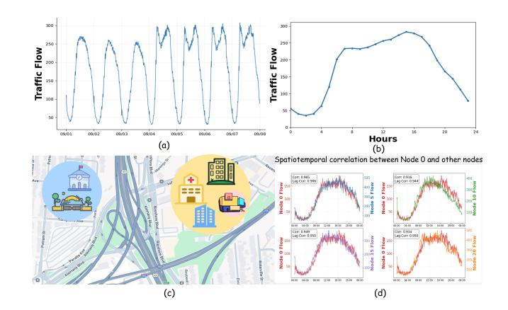
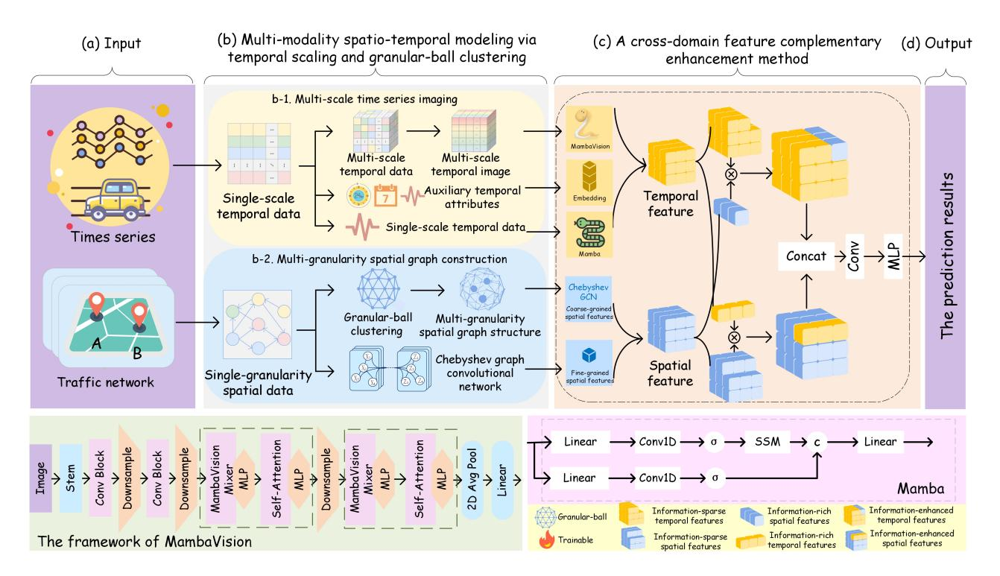
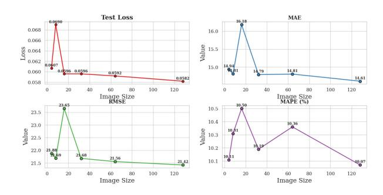
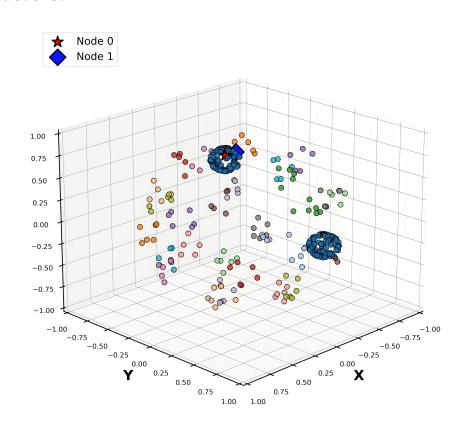
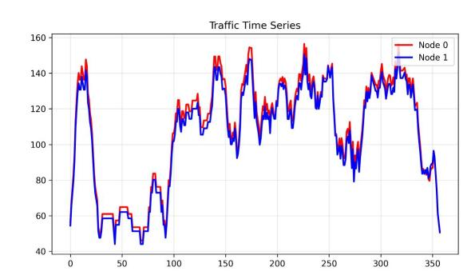

# MIGC-CMamba: Cross-Domain Mamba with Multi-Scale Imaging and Granular-Ball Computing for Traffic Flow Prediction

Wenxia Chang Shanxi University Taiyuan, China 18536202190@163.com

Chao Zhang∗ Shanxi University Taiyuan, China czhang@sxu.edu.cn

Wentao Li Southwest University Chongqing, China drliwentao@swu.edu.cn

Deyu Li Shanxi University Taiyuan, China lidy@sxu.edu.cn

# Abstract

With the increasing relevance of web mining and content analysis in uncovering mobility patterns from large-scale online data, traffic flow prediction plays a crucial role in proactive urban planning and enhancing the responsiveness of intelligent transportation systems. However, existing traffic flow prediction methods often fail to explicitly capture correlations in continuous multivariate sequences that are naturally suited for trend and periodic pattern extraction by vision models and rely on fixed spatial graphs that neglect the cognitive advantages of granular-ball structures, which limits their ability to model interactions and strengthen spatiotemporal dependencies. To address these challenges, this paper proposes a Cross-domain Mamba framework that integrates Multi-scale Imaging and Granular-ball Computing for traffic flow prediction (MIGC-CMamba). First, a multi-scale sequence imaging method is presented, which converts the original time series into image modality and leverages MambaVision to capture both local and global dependencies. Second, a multi-granularity spatial graph is constructed via granular-ball clustering, which balances global trend representation and local detail preservation. Third, a crossdomain enhancement mechanism adaptively integrates temporal and spatial domains, strengthening spatiotemporal dependencies. Lastly, extensive experiments demonstrate superior performance over state-of-the-art baselines, highlighting how vision-based imaging, cognition-inspired granular-ball modeling, and content-aware mining jointly advance the modeling of spatiotemporal dependencies in traffic flow prediction.

# CCS Concepts

• Computing methodologies → Artificial intelligence; • Information systems → Spatial-temporal systems.

# Keywords

Traffic Flow Prediction; Multi-Scale Imaging; Granular-Ball Computing; Mamba; Cross-Domain Enhancement

### ACM Reference Format:

Wenxia Chang, Chao Zhang, Wentao Li, and Deyu Li. 2026. MIGC-CMamba: Cross-Domain Mamba with Multi-Scale Imaging and Granular-Ball Computing for Traffic Flow Prediction . In Proceedings of the ACM Web Conference 2026 (WWW '26), April 13–17, 2026, Dubai, United Arab Emirates. ACM, New York, NY, USA, [11](#page-10-0) pages.<https://doi.org/10.1145/3774904.3792359>

# 1 Introduction

In the era of rapidly evolving information technology, vast amounts of unstructured traffic-related data have emerged in cyberspace, including social media posts, news reports, navigation records, and user reviews. Web mining and content analysis techniques make it possible to transform these heterogeneous sources into structured knowledge, revealing travel behaviors, road usage patterns, and emerging traffic events [\[14\]](#page-8-0). By integrating such insights with traditional sensing data, traffic flow prediction can be more effectively advanced, providing crucial support for alleviating congestion, optimizing resource allocations, and improving travel efficiencies in intelligent transportation systems [\[21,](#page-8-1) [36\]](#page-8-2).

A key challenge in traffic flow prediction involves accurately capturing complex spatiotemporal dynamics. Traditional sequence models such as recurrent neural networks (RNNs) and long shortterm memory (LSTM) capture short-term temporal dependencies but experience vanishing gradients and struggle to model longrange modeling [\[23\]](#page-8-3). To overcome these drawbacks, Transformers have become mainstream by leveraging self-attention, which enables parallel computation and effectively captures long-range temporal dependencies, thereby improving training efficiency and predictive accuracy [\[29\]](#page-8-4). However, Transformers face two critical issues. First, their quadratic computational complexity ��(�� 2 ), where �� represents the input sequence length, results from the pairwise attention operation between all tokens. This leads to high computational and memory costs, severely limiting scalability in long-sequence modeling. Second, their ability to effectively capture localized spatial or temporal dependencies remains limited [\[15\]](#page-8-5). In contrast, state space models (SSMs) reduce complexity to ��(��) via linear recurrence, making them highly efficient for long sequences, yet their linear nature constrains their ability to model nonlinear interactions and complex spatial correlations that are essential in

∗Corresponding author

[This work is licensed under a Creative Commons Attribution-NonCommercial-](https://creativecommons.org/licenses/by-nc-nd/4.0)[NoDerivatives 4.0 International License.](https://creativecommons.org/licenses/by-nc-nd/4.0)

WWW '26, Dubai, United Arab Emirates. © 2026 Copyright held by the owner/author(s). ACM ISBN 979-8-4007-2307-0/2026/04 <https://doi.org/10.1145/3774904.3792359>

traffic data [\[22\]](#page-8-6). To address this issue, the recently proposed Mamba architecture introduces a dynamic selection mechanism combined with attention mechanism, enabling more expressive spatiotemporal fusion while preserving linear complexity [\[10\]](#page-8-7). Nevertheless, even with these improvements, sequence models including Mamba struggle to explicitly capture multivariate correlations and long-term periodicity. Since traffic flow exhibits strong trends and peaks, image-based representations provide a promising complementary solution, as they naturally encode continuous temporal patterns and allow vision models to leverage pre-trained knowledge of structural regularities. Building on this intuition, MambaVision extends Mamba into the visual domain, where multi-scale imaging enhances spatiotemporal representation learning, making it particularly suitable for traffic flow prediction, which requires the accurate modeling of both spatial dependencies and long-range temporal dynamics [\[9\]](#page-8-8).

Although recent advances have enhanced spatiotemporal representation learning, traffic flow prediction still faces several challenges.

- Single-scale temporal modeling fails to capture multiscale patterns. Modeling multi-scale temporal patterns is difficult, as traffic exhibits both rapid fluctuations and longterm periodic trends.
- Fixed-topology spatial modeling struggles to represent multi-granularity dependencies. Spatial dependencies span multiple granularities, from local segments to regional clusters, demanding adaptive clustering beyond fixed topologies.
- Independent spatiotemporal modeling lacks effective cross-domain interaction. Effective prediction requires not only separate temporal and spatial modeling but also their dynamic interaction to capture cross-domain complementarities.

To this end, this paper proposes three modules: multi-scale time series imaging for temporal dynamics, granular-ball clustering for adaptive multi-granularity spatial modeling, and a cross-domain complementary enhancement module for fusing spatial and temporal features.

Firstly, traffic flow exhibits complex temporal patterns characterized by rapid short-term fluctuations and recurring long-term periodicity, posing significant challenges for effective temporal modeling, as illustrated in Fig. [1](#page-1-0) (a,b) [\[18,](#page-8-9) [25\]](#page-8-10). To address this limitation, multi-scale modeling captures patterns across multiple time scales, enabling the representation of both fine-grained local variations and overarching long-term trends. Furthermore, images naturally provide a structured representation of traffic data, which facilitates the extraction of local patterns as well as global trends. Taking advantage of this structured representation, MambaVision employs structured SSMs to efficiently capture long-range temporal dependencies, making it well suited for multi-scale temporal feature extraction. Accordingly, this paper designs multi-scale time series imaging to represent temporal dynamics and applies MambaVision to extract multi-modal temporal features.

Secondly, traffic networks inherently exhibit hierarchical spatial structures, where local roads interact within subregions and regional flows reflect broader connectivity patterns, as illustrated

Figure 1: Traffic flow prediction modules. (a) visualizes weekly traffic periodicity, (b) shows daily flow fluctuations, (c) presents multi-granularity spatial topology, and (d) illustrates spatiotemporal dependencies.

in Fig. [1](#page-1-0) (c) [\[34\]](#page-8-11). Effectively modeling such multi-granularity dependencies requires adaptive representations that can balance local detail with global coherence. The granular-ball framework naturally provides this advantage as it adaptively groups data points into hierarchically organized balls based on similarity, allowing flexible granularity control without relying on predefined thresholds or fixed topology. Accordingly, this paper constructs the granular-ball clustering method to adaptively aggregate traffic network nodes across multiple granularities, preserving spatial topology while reducing graph complexity.

Thirdly, temporal and spatial dependencies in traffic flow exhibit inherently complementary characteristics, where temporal features reflect sequential evolution and periodic patterns, while spatial features capture structural correlations and regional interactions [\[12\]](#page-8-12). As illustrated in Fig. [1](#page-1-0) (d), the spatial correlation of traffic flow across different nodes further demonstrates the coupled nature of spatiotemporal dependencies. Effectively integrating these two domains is crucial for modeling complex spatiotemporal dynamics. The cross-domain complementary enhancement mechanism naturally facilitates effective information integration by enabling bidirectional interaction and mutual reinforcement among heterogeneous feature domains. Accordingly, this paper suggests a crossdomain complementary enhancement module that dynamically fuses temporal and spatial feature channels, thereby strengthening inter-domain interactions and improving the overall modeling of spatiotemporal dependencies.

In summary, this paper proposes the MIGC-CMamba model, which integrates multi-modal with multi-granularity information for spatiotemporal modeling, effectively enhancing feature interactions and improving the representation of complex spatiotemporal relationships. The key innovations of this paper are summarized as follows:

- Multi-scale sequence imaging enhances multi-range temporal modeling.A multi-scale sequence imaging method is designed, leveraging the advantages of image processing

of future time steps �� set to 1. In addition, multi-scale sequence imaging is employed to generate 64×64 temporal representations, and granular-ball clustering is used to construct multi-granularity spatial graphs.

Experiments are conducted on a high-performance platform with an NVIDIA H100 PCIe GPU with 80 GB of memory using CUDA 12.8 and cuDNN, enabling efficient training of large spatiotemporal models like MIGC-CMamba. Three evaluation metrics are used, with definitions provided in Appendix [C,](#page-9-1) and all datasets and code are publicly available at<https://github.com/changwenx/MIGC-CMmaba.> to ensure reproducibility.

### 4.3 Baselines (RQ1)

To provide a comprehensive evaluation, this paper selects representative baseline models spanning diverse methodological paradigms in traffic flow prediction, as detailed in Appendix [D.](#page-9-2)

(1) Statistical methods: Classical and interpretable baselines that capture linear temporal dependencies.

(2) RNN-based architectures: Sequence learning models widely adopted for traffic prediction tasks.

(3) Graph neural network (GNN)-based architectures: Models that explicitly incorporate spatial topology, reflecting the mainstream of spatiotemporal modeling.

(4) Transformer and attention-based models: Models using attention to capture long-range spatiotemporal dependencies, reflecting recent research trends.

(5) Mamba-based models: Emerging approaches designed for efficient modeling of long sequences with improved scalability.

As shown in Table [1,](#page-7-0) our model achieves the best performance on most datasets and metrics, while remaining competitive elsewhere.

# 4.4 Ablation Study (RQ2)

To further verify the effectiveness of each component in our model, this paper conduct ablation experiments by progressively removing the proposed modules:

(1) w/o Multi-Scale Imaging: removing the multi-scale sequence imaging, where the original traffic time series is directly fed into the model without visual feature extraction.

(2) w/o Granular-Ball Clustering: replacing granular-ball clustering with fixed spatial graphs, which ignores the adaptive cognitive advantages of multi-granularity structures.

(3) w/o Complementary Enhancement: discarding the crossdomain complementary enhancement module and relying solely on single-domain representations for spatiotemporal modeling.

Table 2: The ablation study on PeMS03. The best performance is highlighted in bold and the second-best is underlined.

|      | Variants      |             | MAE   | RMSE  | MAPE  | (%) LOSS |
|------|---------------|-------------|-------|-------|-------|----------|
| w/o  | Multi-Scale   | Imaging     | 28.19 | 38.68 | 23.41 | 0.20     |
| w/o  | Granular-Ball | Clustering  | 28.04 | 38.59 | 23.05 | 0.20     |
| w/o  | Complementary | Enhancement | 28.22 | 38.71 | 23.41 | 0.19     |
| Full | model         | (Ours)      | 13.35 | 19.98 | 14.29 | 0.06     |

As shown in Table [2,](#page-6-0) removing any of the proposed modules leads to a clear performance drop, demonstrating that each part plays an indispensable role. Among them, multi-scale imaging has the most significant impact on capturing trend and periodic patterns, granular-ball clustering improves spatial adaptability, and complementary enhancement further strengthens cross-domain spatiotemporal interactions.

### 4.5 Parameter Sensitivity Study (RQ3)

To assess the effect of image resolution in the multi-scale sequence imaging module, this paper performs a parameter sensitivity analysis by testing image sizes of 4×4, 8×8, 16×16, 32×32, 64×64, 128×128.

Figure 3: The impact of image resolution on test loss and prediction performance.

As shown in Figure [3,](#page-6-1) overly low resolutions (e.g., 4×4) lose finegrained spatial-temporal details and degrade accuracy, while very high resolutions (e.g., 128×128) offer marginal gains at substantial computational cost. Overall, 64×64 provides the best balance between performance and efficiency.

# 4.6 Visualization (RQ4)

Visualization helps interpret the model by revealing the patterns it captures. This paper evaluates the spatial feature extraction strategy by examining whether clustering produces meaningful partitions and groups nodes with similar traffic dynamics. The analysis examines two aspects: network topology and temporal consistency within clusters.

Table 1: The performance comparison on PeMS03, PeMS-Bay, METR-LA, JiNan. The best performance is highlighted in bold and the second-best is underlined.

| Models       | MAE      | PeMS03 RMSE | MAPE  | (%) MAE | PeMS-Bay RMSE | MAPE  | (%) MAE | METR-LA RMSE | MAPE  | (%) MAE | JiNan RMSE | MAPE (%) |
|--------------|----------|-------------|-------|---------|---------------|-------|---------|--------------|-------|---------|------------|----------|
| HA           | 31.59    | 52.40       | 33.79 | 4.51    | 7.83          | 15.62 | 4.68    | 8.24         | 17.41 | 13.25   | 22.86      | 46.84    |
| ARIMA        | 35.32    | 47.51       | 32.67 | 4.01    | 7.21          | 13.11 | 4.16    | 7.96         | 14.81 | 14.90   | 26.23      | 48.54    |
| VAR          | 23.64    | 38.24       | 24.53 | 1.76    | 3.15          | 3.61  | 4.43    | 7.82         | 13.01 | 12.57   | 20.61      | 40.55    |
| LSTM         | 20.97    | 47.60       | 20.77 | 3.03    | 5.74          | 9.82  | 3.26    | 6.57         | 11.83 | 11.31   | 19.41      | 38.01    |
| GRU          | 20.20    | 35.09       | 20.89 | 3.02    | 5.74          | 9.72  | 3.26    | 6.54         | 11.72 | 12.11   | 19.40      | 36.95    |
| STGCN        | 17.54    | 30.41       | 17.33 | 2.89    | 5.88          | 5.16  | 3.23    | 7.54         | 9.83  | 9.42    | 16.10      | 36.41    |
| ASTGCN       | 17.24    | 29.51       | 17.23 | 2.72    | 5.49          | 4.83  | 3.36    | 7.06         | 9.34  | 10.08   | 17.21      | 38.92    |
| DCRNN        | 18.01    | 30.32       | 18.32 | 1.40    | 2.96          | 3.21  | 2.78    | 5.39         | 7.31  | 11.41   | 20.55      | 41.75    |
| HSTGNN       | 14.55    | 24.18       | 13.76 | 1.32    | 2.78          | 2.70  | 2.68    | 5.36         | 6.51  | 9.65    | 15.65      | 38.62    |
| STDN         | 17.06    | 28.54       | 16.54 | 2.61    | 2.87          | 3.65  | 2.65    | 5.24         | 6.56  | 8.39    | 14.58      | 32.29    |
| PDFormer     | 14.92    | 25.36       | 15.85 | 1.33    | 2.84          | 2.78  | 2.79    | 5.46         | 7.79  | 8.52    | 13.56      | 32.26    |
| DTRformer    | 14.51    | 25.46       | 14.95 | 1.32    | 2.80          | 2.76  | 2.67    | 5.12         | 7.05  | 8.61    | 14.24      | 34.56    |
| MDPM         | 14.33    | 24.83       | 15.55 | 1.35    | 2.74          | 2.83  | 2.71    | 5.11         | 7.02  | 9.64    | 13.65      | 33.42    |
| ST-Mamba     | 15.29    | 27.31       | 15.15 | 1.31    | 2.88          | 2.93  | 2.67    | 5.18         | 6.62  | 9.12    | 13.58      | 33.62    |
| ST-MambaSync | 15.32    | 27.48       | 15.21 | 1.31    | 2.76          | 2.71  | 2.64    | 5.05         | 6.80  | 9.21    | 13.61      | 33.59    |
| Ours         | 13.67    | 20.21       | 15.20 | 1.20    | 1.81          | 2.30  | 2.40    | 4.15         | 5.87  | 8.00    | 12.98      | 32.19    |
| Improvement  | (%) 4.60 | 16.41       |       | 8.40    | 33.94         | 14.81 | 9.09    | 18.79        | 9.83  | 4.65    | 4.28       | 0.21     |

As shown in Fig. [4,](#page-6-2) the granular-ball clustering generates compact and spatially coherent regions while effectively preserving the overall topology, thereby reducing graph complexity. To further illustrate its spatial coherence, two nodes within the same cluster are selected for analyzing their traffic flow patterns.

Figure 5: The traffic flow trajectories of two nodes within the same cluster.

Fig. [5](#page-7-1) illustrates that nodes within the same cluster exhibit consistent temporal patterns, including synchronized peak hours, fluctuation amplitudes, and overall trends, confirming that the clustering strategy effectively groups nodes with similar traffic dynamics and underlying functional correlations within the network.

# 5 Conclusion and Future Work

This paper presents a novel MIGC-CMamba framework that unifies multi-scale sequence imaging, granular-ball-based multi-granularity spatial graph construction, and cross-domain complementary enhancement for traffic flow prediction. The framework encodes temporal sequences as images to capture both local and global temporal trends, employs granular-ball clustering to enable adaptive multigranularity spatial modeling, and further enhances spatial-temporal interactions to overcome the inherent limitations of static graph structures and single-scale modeling methods. The detailed algorithm of MIGC-CMamba is provided in Appendix E. Experiments on real-world datasets demonstrate its consistent superiority over strong baselines, while future work will focus on improving efficiency, scalability, and sensitivity analysis.

# Acknowledgments

The paper was supported by grants from the National Natural Science Foundation of China (62272284, 62473241, 12201518), the Central Government Guides Local Science and Technology Innovation (YDZJSX2024D015), the Science and Technology Cooperation and Exchange Special Projects of Shanxi (Research on Privacy Enhancement Technology for Trusted Data Space Based on Quantum Multi-Granularity Group Consensus), the Top Young Talents of Shanxi "Three Jin" Talents Program, the Sichuan Science and Technology Program (2025ZNSFSC0806), the Wenying Young Scholars of Shanxi University, and the Project of Science and Technology Research Program of Chongqing Education Commission (KJZD-K20250020).

References [1] Jinyoung Ahn, Eunjeong Ko, and Eun Yi Kim. 2016. Highway traffic flow prediction using support vector regression and Bayesian classifier. In 2016 International Conference On Big Data and Smart Computing (BigComp). IEEE, 239–244. [2] Lingxiao Cao, Bin Wang, Guiyuan Jiang, Yanwei Yu, and Junyu Dong. 2025. Spatiotemporal-aware trend-seasonality decomposition network for traffic flow forecasting. In Proceedings of the AAAI Conference on Artificial Intelligence, Vol. 39. 11463–11471. [3] Jing Chen, Haocheng Ye, Zhian Ying, Yuntao Sun, and Wenqiang Xu. 2025. Dynamic trend fusion module for traffic flow prediction. Applied Soft Computing 174 (2025), 112979. [4] Kyunghyun Cho, Bart Van Merriënboer, Caglar Gulcehre, Dzmitry Bahdanau, Fethi Bougares, Holger Schwenk, and Yoshua Bengio. 2014. Learning phrase representations using RNN encoder-decoder for statistical machine translation. arXiv preprint arXiv:1406.1078 (2014). [5] Andrew Chu, Xi Jiang, Shinan Liu, Arjun Bhagoji, Francesco Bronzino, Paul Schmitt, and Nick Feamster. 2024. Feasibility of state space models for network traffic generation. In Proceedings of the 2024 SIGCOMM Workshop on Networks for AI Computing. 9–17. [6] Yanjie Duan, Yisheng Lv, Yu-Liang Liu, and Fei-Yue Wang. 2016. An efficient realization of deep learning for traffic data imputation. Transportation Research Part C: Emerging Technologies 72 (2016), 168–181. [7] Rui Fu, Zuo Zhang, and Li Li. 2016. Using LSTM and GRU neural network methods for traffic flow prediction. In 2016 31st Youth Academic Annual Conference of Chinese Association of Automation (YAC). IEEE, 324–328. [8] Shengnan Guo, Youfang Lin, Ning Feng, Chao Song, and Huaiyu Wan. 2019. Attention based spatial-temporal graph convolutional networks for traffic flow forecasting. In Proceedings of the AAAI Conference on Artificial Intelligence, Vol. 33. 922–929. [9] Ali Hatamizadeh and Jan Kautz. 2025. Mambavision: A hybrid mambatransformer vision backbone. In Proceedings of the Computer Vision and Pattern Recognition Conference. 25261–25270. [10] Sicheng He, Junzhong Ji, and Minglong Lei. 2025. Decomposed Spatio-Temporal Mamba for Long-Term Traffic Prediction. In Proceedings of the AAAI Conference on Artificial Intelligence, Vol. 39. 11772–11780. [11] Jiawei Jiang, Chengkai Han, Wayne Xin Zhao, and Jingyuan Wang. 2023. Pdformer: Propagation delay-aware dynamic long-range transformer for traffic flow prediction. In Proceedings of the AAAI Conference on Artificial Intelligence, Vol. 37. 4365–4373. [12] Di Jin, Cuiying Huo, Jiayi Shi, Dongxiao He, Jianguo Wei, and Philip S Yu. 2025. LLGFormer: Learnable long-range graph transformer for traffic flow prediction. In Proceedings of the ACM on Web Conference 2025. 2860–2871. [13] S Vasantha Kumar and Lelitha Vanajakshi. 2015. Short-term traffic flow prediction using seasonal ARIMA model with limited input data. European Transport Research Review 7, 3 (2015), 21. [14] Chenxi Liu, Kethmi Hirushini Hettige, Qianxiong Xu, Cheng Long, Shili Xiang, Gao Cong, Ziyue Li, and Rui Zhao. 2025. ST-LLM+: Graph Enhanced Spatio-Temporal Large Language Models for Traffic Prediction. IEEE Transactions on Knowledge and Data Engineering 37, 8 (2025), 4846–4859. [15] Qingyao Liu, Jianwu Li, and Zhaoming Lu. 2021. ST-Tran: Spatial-temporal transformer for cellular traffic prediction. IEEE Communications Letters 25, 10 (2021), 3325–3329. [16] Tongbin Liu, Yong Wang, Hongyu Zhou, Jian Luo, and Fangming Deng. 2024. Distributed short-term traffic flow prediction based on integrating federated learning and TCN. IEEE Access 12 (2024), 148026–148036. [17] Qinzhi Lv, Lijuan Liu, Ruotong Yang, and Yan Wang. 2025. Multimodal urban traffic flow prediction based on multi-scale time series imaging. Pattern Recognition 164 (2025), 111499. [18] Jiaming Ma, Binwu Wang, Pengkun Wang, Zhengyang Zhou, Xu Wang, and Yang Wang. 2025. Bist: A lightweight and efficient bi-directional model for spatiotemporal prediction. Proceedings of the VLDB Endowment 18, 6 (2025), 1663–1676. [19] H Zare Moayedi and MA Masnadi-Shirazi. 2008. Arima model for network traffic prediction and anomaly detection. In 2008 International Symposium on Information Technology, Vol. 4. IEEE, 1–6. [20] Duo Qin. 2011. Rise of VAR modelling approach. Journal of Economic Surveys 25, 1 (2011), 156–174. [21] Dong-Hyuk Seo, Hyomin Shin, and Sang-Wook Kim. 2025. Exploring Search Volumes of Terms in Web Portals for Accurate Event-Aware Traffic Prediction. In Companion Proceedings of the ACM on Web Conference 2025. 1293–1297. [22] Zhiqi Shao, Michael GH Bell, Ze Wang, D Glenn Geers, Haoning Xi, and Junbin Gao. 2024. ST-Mamba: Spatial-temporal selective state space model for traffic flow prediction. arXiv preprint arXiv:2404.13257 (2024). [23] Manchun Tan, Szechun Wong, Jianmin Xu, Zhanrong Guan, and Peng Zhang. 2009. An aggregation approach to short-term traffic flow prediction. IEEE Transactions on Intelligent Transportation Systems 10, 1 (2009), 60–69. [24] Ran Tian, Chu Wang, Jia Hu, and Zhongyu Ma. 2023. Multi-scale spatial-temporal [25] Peng Wang, Longxi Feng, Yijie Zhu, and Haopeng Wu. 2025. Hybrid spatial– temporal graph neural network for traffic forecasting. Information Fusion 118 (2025), 102978. [26] Senzhang Wang, Meiyue Zhang, Hao Miao, Zhaohui Peng, and Philip S Yu. 2022. Multivariate correlation-aware spatio-temporal graph convolutional networks for multi-scale traffic prediction. ACM Transactions on Intelligent Systems and Technology 38 (2022). [27] Shuyin Xia, Yunsheng Liu, Xin Ding, Guoyin Wang, Hong Yu, and Yuoguo Luo. 2019. Granular ball computing classifiers for efficient, scalable and robust learning. Information Sciences 483 (2019), 136–152. [28] Qin Xie, Qinghua Zhang, Shuyin Xia, Fan Zhao, Chengying Wu, Guoyin Wang, and Weiping Ding. 2024. GBG++: A fast and stable granular ball generation method for classification. IEEE Transactions on Emerging Topics in Computational Intelligence 8, 2 (2024), 2022–2036. [29] Mingxing Xu, Wenrui Dai, Chunmiao Liu, Xing Gao, Weiyao Lin, Guojun Qi, and Hongkai Xiong. 2020. Spatial-temporal transformer networks for traffic flow forecasting. arXiv preprint arXiv:2001.02908 (2020). [30] Bing Yu, Haoteng Yin, and Zhanxing Zhu. 2017. Spatio-temporal graph convolutional networks: A deep learning framework for traffic forecasting. arXiv preprint arXiv:1709.04875 (2017). [31] Yong Yu, Xiaosheng Si, Changhua Hu, and Jianxun Zhang. 2019. A review of recurrent neural networks: LSTM cells and network architectures. Neural Computation 31, 7 (2019), 1235–1270. [32] Lotfi A Zadeh. 1997. Toward a theory of fuzzy information granulation and its centrality in human reasoning and fuzzy logic. Fuzzy Sets and Systems 90, 2 (1997), 111–127. [33] Qinghua Zhang, Chengying Wu, Shuyin Xia, Fan Zhao, Man Gao, Yunlong Cheng, and Guoyin Wang. 2023. Incremental learning based on granular ball rough sets for classification in dynamic mixed-type decision system. IEEE Transactions on Knowledge and Data Engineering 35, 9 (2023), 9319–9332. [34] Xinru Zhao, Wenhao Yu, and Yifan Zhang. 2025. MST-GNN: graph neural network with multi-granularity in space and time for traffic prediction. GeoInformatica 29, 3 (2025), 377–401. [35] Jie Zhou and Qian Yu. 2023. Dcrnn: A deep cross approach based on rnn for partial parameter sharing in multi-task learning. arXiv preprint arXiv:2310.11777 (2023). [36] Tian Zhou, Lixin Gao, and Daiheng Ni. 2014. Road traffic prediction by incorporating online information. In Proceedings of the ACM on Web Conference 2014. 1235–1240. [37] Zhuang Zhuang, Lingbo Liu, Kan Guo, Xingtong Yu, Heng Qi, Yanming Shen, and Baocai Yin. 2025. MDPM: Modulating domain-specific prompt memory for multi-domain traffic flow prediction with transformers. Knowledge-Based Systems 325 (2025), 113881. A Related Work This section reviews related studies on traffic flow prediction from three perspectives: traditional traffic flow prediction methods, multiscale time series imaging, and multi-granularity spatial graph construction based on granular-balls. These three research directions collectively reflect the evolution of traffic prediction from statistical modeling to deep learning approaches capable of capturing complex temporal and spatial dependencies. A.1 Traditional Traffic Flow Prediction Methods Research on traffic flow prediction has transitioned from traditional statistical and machine learning approaches to modern deep learning and structured sequence models, increasing the capacity to represent complex temporal dynamics and their interactions across the spatial network. Early research on time series prediction rely on statistical models such as Autoregressive Integrate Moving Average (ARIMA) and Vector Autoregression (VAR) [\[19\]](#page-8-13), which are interpretable and parameter-efficient but limited in capturing nonlinear patterns and long-term dependencies. To address these limitations, machine learning methods including support vector regression and ensemble learning are explored [\[1\]](#page-8-14), though they depend on handcrafted features and cannot automatically model temporal dynamics. With the rise of deep learning, RNNs and their variants

such as LSTM and Gated Recurrent Unit (GRU) [\[7\]](#page-8-15) enable nonlinear sequence modeling but suffer from sequential computation and vanishing gradients. Convolutional architectures such as Convolutional Neural Networks (CNNs) and Temporal Convolutional Networks (TCNs) [\[16\]](#page-8-16) improve parallelism and receptive fields, yet remain insufficient for capturing global dependencies. Transformerbased models [\[15\]](#page-8-5) further address long-range dependencies via self-attention, but their quadratic complexity limits scalability to ultra-long sequences. Recently, structured SSMs emerge as efficient alternatives for long-term dependency modeling [\[22\]](#page-8-6), and Mamba and its variants [\[5\]](#page-8-17) demonstrate strong scalability and effectiveness on ultra-long sequences. Compared with traditional approaches, incorporating multi-scale temporal modeling and multi-granularity spatial representation offers a more comprehensive understanding of traffic dynamics by jointly capturing both fine-grained variations and global structural patterns. Despite these advances, effectively modeling multi-scale temporal dependencies and multi-granularity spatial correlations remains a significant challenge.

# A.2 Multi-Scale Time Series Imaging

Traffic flow exhibits complex temporal dynamics, including shortterm fluctuations and long-term periodicity, which are difficult to capture using single-scale sequence modeling. Multi-scale modeling has proven effective in capturing temporal dependencies at different resolutions, allowing both fine- and coarse-grained patterns to be represented [\[24,](#page-8-18) [26\]](#page-8-19). Furthermore, transforming one-dimensional traffic sequences into two-dimensional image-like representations enables the exploitation of spatially structured feature extraction and the application of powerful neural network operators, such as CNNs, to capture richer temporal correlations [\[17\]](#page-8-20). Despite these advantages, existing imaging-based methods often suffer from high computational costs and struggle to preserve fine-grained temporal information, limiting their ability to efficiently capture multi-scale temporal dependencies.

# A.3 Multi-Granularity Spatial Graph Construction Based on Granular-balls

Spatial dependencies in traffic networks exhibit heterogeneity across multiple granularities, from individual nodes and road segments to broader regional clusters, making effective multi-granularity modeling essential for accurate prediction [\[34\]](#page-8-11). Existing methods often rely on manually designed partitions or fixed rules, which are inflexible and lack a unified theoretical foundation. Granular computing (GC) [\[32\]](#page-8-21) provides a natural paradigm for organizing information into hierarchical granules, enabling efficient and scalable multi-granularity representation. Early GC-based methods treated granules mainly as auxiliary feature-processing tools without fundamentally modifying underlying classifiers. To improve integration, Xia et al. [\[27\]](#page-8-22) introduced granular-ball, leveraging the symmetry and simplicity of spheres to better incorporate granules into classifiers. Subsequent studies refined granular-ball generation by considering factors such as radius, sample size [\[33\]](#page-8-23), and distributionbased methods for unlabeled data [\[28\]](#page-8-24), enhancing robustness and

adaptive multi-granularity representation. Granular-ball clustering offers an adaptive and scalable approach to multi-granularity modeling, capable of automatically determining cluster boundaries based on data distribution rather than fixed rules. It achieves a balance between global structural integrity and local detail preservation, enhancing robustness against noise and uneven data density. Despite these advances, applying granular-ball-based modeling to traffic flow prediction remains underexplored, and effectively capturing multi-granularity spatial dependencies in large-scale traffic networks continues to pose a significant challenge.

### B Dataset

This paper evaluates the MIGC-CMamba model on four real-world traffic datasets: PeMS03, PeMS-BAY, METR-LA, and JiNan. PeMS03 and PeMS-BAY reflect traffic flow on different highway networks in California, METR-LA represents complex urban traffic conditions in Los Angeles, and JiNan captures inner-city traffic dynamics in China. Together, these datasets provide representative benchmarks across diverse traffic scenarios, as summarized in Table [3.](#page-9-3)

Table 3: The summary of traffic datasets

| Datasets | Nodes | Time   | steps Time      | ranges Days |
|----------|-------|--------|-----------------|-------------|
| PeMS03   | 358   | 26,208 | 09/2018–11/2018 | 91          |
| PeMS-BAY | 325   | 52,116 | 01/2017–05/2017 | 151         |
| METR-LA  | 207   | 34,272 | 03/2012–06/2012 | 122         |
| JiNan    | 406   | 8,928  | 08/2016–09/2016 | 31          |

### C Evaluation Metrics

This paper adopt three evaluation metrics: mean absolute error (MAE), root mean squared error (RMSE), and mean absolute percentage error (MAPE). Lower values indicate superior predictive performance. The definitions of the three metrics are given as follows.

������ = 1 �� ∑︁�� ��=1 |��ˆ �� − ���� |, �������� = vt 1 �� ∑︁�� ��=1 (��ˆ �� − ����) 2 , �������� = 100 �� ∑︁�� ��=1 ��ˆ �� − ���� ���� , (28)

where�� denotes the number of predicted values, ��ˆ is the predicted traffic flow, and ���� is the ground truth.

### D Baselines

Representative baseline models covering various methodological paradigms and recent advances in traffic flow prediction are selected for evaluation, ensuring a comprehensive comparison across statistical, machine learning, and deep learning approaches from recent years.

