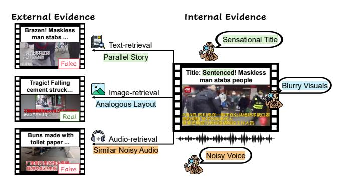
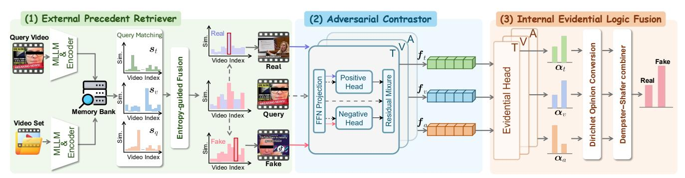
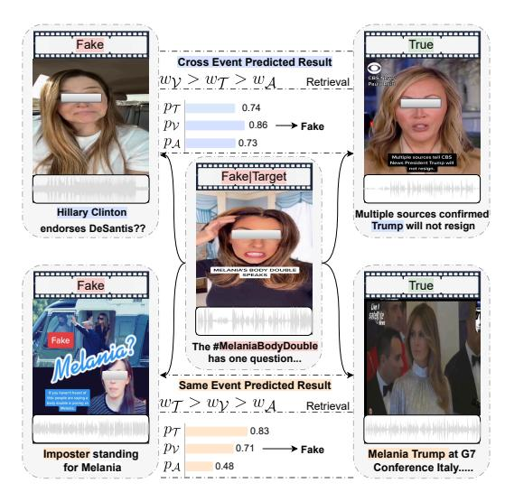
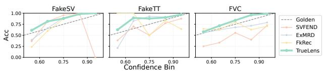
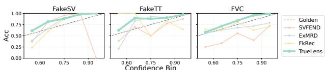
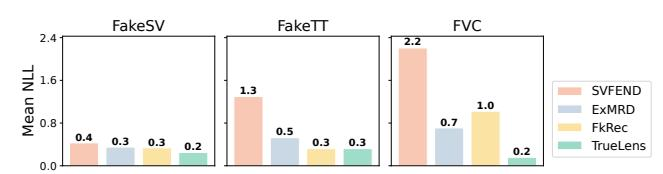

# TrueLens: Video Fake News Detection with Dual Level Evidence Gathering and Consolidation

Junyi Chen junyi.chen@auckland.ac.nz University of Auckland New Zealand

Qian Liu∗ liu.qian@auckland.ac.nz University of Auckland New Zealand

Jing Sun jing.sun@auckland.ac.nz University of Auckland New Zealand

Yi Zhang yi.zhang@uts.edu.au University of Technology Sydney Australia

### Abstract

The proliferation of misinformation on video-sharing platforms demands robust detection of video fake news. Existing methods struggle to integrate external world knowledge with internal multimodal cues, limiting their generalization and robustness. In this work, we propose TrueLens, a new framework for video fake news detection that gathers and consolidates dual-level evidence through three primary components, i.e., External Precedent Retriever, Adversarial Contrastor, and Internal Evidential Logic Fusion. At the external level, the External Precedent Retriever first decomposes the query video into textual, visual, and audio queries while leveraging multimodal large language models (MLLMs) to enhance the overall semantic representation. It then applies an entropy-guided multimodal retrieval mechanism to identify the two most similar reference videos from a gallery of real and fake samples, i.e., one real and one fake video. The Adversarial Contrastor integrates these references with the input video through contrastive attention, enhancing contextual reasoning. At the internal level, our Evidential Logic Fusion module aggregates multimodal signals from the Adversarial Contrastor to produce consistent, robust predictions. Extensive experiments on three benchmarks show that the proposed TrueLens consistently surpasses competitive baselines under both temporal and event settings by a clear margin, yielding up to a +21.60% F1 improvement under the event setting and achieving 93.73%, 90.64%, and 98.83% accuracy on the FakeSV, FakeTT, and FVC datasets under the temporal setting. The code for our project is available at https://github.com/JunyiChen-ai/TrueLens.

## CCS Concepts

• Information systems → Data mining; Online analytical processing.

© 2026 Copyright held by the owner/author(s). ACM ISBN 979-8-4007-2307-0/2026/04 <https://doi.org/10.1145/3774904.3792362>

## Keywords

Video Fake News Detection, Multimodal Fusion, Multimodal Large Language Models (MLLMs), Evidential Deep Learning

### ACM Reference Format:

Junyi Chen, Qian Liu, Jing Sun, and Yi Zhang. 2026. TrueLens: Video Fake News Detection with Dual Level Evidence Gathering and Consolidation . In Proceedings of the ACM Web Conference 2026 (WWW '26), April 13–17, 2026, Dubai, United Arab Emirates. ACM, New York, NY, USA, [11](#page-10-0) pages. <https://doi.org/10.1145/3774904.3792362>

### 1 Introduction

The rapid rise of video platforms has profoundly transformed online communication, offering users engaging, accessible, and highly efficient means to consume and share information [\[6,](#page-8-0) [41,](#page-8-1) [50\]](#page-9-0). Their visual appeal and interactive features make them particularly effective in capturing attention and disseminating knowledge at scale. However, alongside these benefits, short videos have also become a powerful medium for spreading fake news. According to recent analyses[1](#page-0-0) , about one in five TikTok videos likely contains misinformation. Compared with traditional text-image-based multimodal misinformation [\[17,](#page-8-2) [24,](#page-8-3) [58\]](#page-9-1), fake news in video form poses greater risks, as it combines visual, auditory, and emotional cues that can amplify persuasion and accelerate virality [\[26,](#page-8-4) [28,](#page-8-5) [54\]](#page-9-2). This highlights the emergent public demands for developing effective methods for the challenge of video fake news detection.

Existing video fake news detection approaches can be broadly divided into two categories based on their utilization of multimodal large language models (MLLMs). Before the availability of MLLMs, the first line of methods typically extends traditional image-text multimodal fake news detection approaches by hand-crafted features [\[1,](#page-8-6) [15,](#page-8-7) [31,](#page-8-8) [32,](#page-8-9) [53\]](#page-9-3) and cross-attention modules [\[44,](#page-8-10) [56\]](#page-9-4). Furthermore, some works focus on designing more advanced deep neural networks [\[5,](#page-8-11) [34\]](#page-8-12) that perform feature fusion to verify video authenticity. The second category mainly leverages the common knowledge and reasoning ability of MLLMs. For instance, some studies [\[14,](#page-8-13) [16,](#page-8-14) [41,](#page-8-1) [42\]](#page-8-15) employ MLLMs to generate rationales that assist neural-network-based classifiers in decision-making, while others [\[43,](#page-8-16) [59\]](#page-9-5) directly fine-tune MLLMs within the detection pipeline.

We notice that there are two key challenges remaining underexplored. C1: Lack of External Evidence Gathering. Current video fake news detection systems predominantly operate in an

∗Corresponding author.

[This work is licensed under a Creative Commons Attribution 4.0 International License.](https://creativecommons.org/licenses/by/4.0) WWW '26, Dubai, United Arab Emirates

1https://www.newsguardtech.com/misinformation-monitor/september-2022/

Image-retrieval Analogous Layout Figure 1: Motivation of our work. We argue that external and internal evidence are complementary for video fake news detection, facilitating contextual reasoning. Left: External evidence is obtained by leveraging the video's multimodal content (text, image, audio) as queries to retrieve related video references. Right: Internal evidence is mined from intrinsic cues within the video itself, such as sensationalist text, visual artifacts (e.g., low quality), and audio distortions (e.g., noisy speech).

instance-isolated manner, relying exclusively on the input video for decision-making. These approaches lack a mechanism for retrieving corroborating or refuting evidence from external sources, which limits their scalability and renders them vulnerable to deception. This oversight neglects the potential of leveraging the vast array of precedent videos readily accessible as reference material. Furthermore, even when external evidence is available, effectively utilizing it presents significant challenges. As illustrated in Figure [1,](#page-1-0) retrieved videos, which vary in modality, exhibit differing levels of evidential strength. Given that each video possesses unique characteristics and that modality quality often fluctuates, a key challenge lies in dynamically adjusting modality weights during the retrieval process. This adjustment accounts for both the specific query and the pre-constructed video gallery to identify the most relevant and valuable external evidence during the gathering process. C2: Lack of Internal Evidence Consolidation. Given the inherently multimodal nature of video content, effectively extracting finegrained details from each modality is critical. However, existing approaches, such as those in [\[5,](#page-8-11) [14,](#page-8-13) [33,](#page-8-17) [34\]](#page-8-12), predominantly emphasize global alignment across modalities. These methods typically employ coarse-grained concatenation or fine-grained cross-/co-attention mechanisms [\[46\]](#page-8-18) to align feature semantics across modalities. Such strategies often fail to capture modality-specific fake patterns comprehensively and risk allowing high-quality modality features to be compromised by noisy ones. Consequently, these approaches are more susceptible to scenarios where multimodal semantics appear aligned, yet the video is deceptive. Moreover, they are prone to deeper issues, including modality dominance [\[3,](#page-8-19) [4\]](#page-8-20) and modality collapse [\[7\]](#page-8-21). Insufficient attention to modality-specific evidential distributions further undermines prediction reliability, frequently leading to overconfident or underconfident probability estimates. For instance, as shown in Figure [1,](#page-1-0) despite high semantic alignment across modalities, certain modalities exhibit distinct fake news cues, such as sensational titles, blurred visuals, or noisy speech.

To this end, we propose TrueLens, a dual-level evidential framework for video fake news detection, consisting of three specialized modules: the External Precedent Retriever, the Adversarial Contrastor, and the Internal Evidential Logic Fusion. (1) To gather outward evidence, the External Precedent Retriever extracts relevant and contrastive video pairs, preparing the evidential basis for subsequent decision-making by informing how highly similar events are portrayed in truthful versus deceptive videos. To mitigate semantic loss in audio and visual modalities, it leverages the abstractive summarization capability of MLLMs for each video to generate textual descriptions from two complementary aspects: theme (the primary content) and storyline (how the content unfolds over time). These generated descriptions are appended to the original textual modality, along with the encoded audio and visual representations, to enhance overall expressiveness. An entropy-aware retrieval mechanism is then applied to dynamically adjust the contributions of the decomposed multimodal queries and emphasize the most salient ones for integration, jointly considering the characteristics of the current query video and the pre-constructed video memory bank. (2) The Adversarial Contrastor refines the original modality-specific features of the query video with external retrieved videos using contrastive attention. Therefore, the external evidence is effectively absorbed to enrich internal modality-specific evidence. (3) Finally, to consolidate evidence within each modality for the final decision, the Internal Evidential Logic Fusion module attaches evidential heads to the text, audio, and visual features to output Dirichlet concentration parameters [\[20,](#page-8-22) [29\]](#page-8-23) as modality-specific internal evidence. These evidential representations are converted into modalityspecific opinions with corresponding uncertainties, and then fused using a theoretically guaranteed combination rule [\[48\]](#page-9-6) to obtain the final unified opinion. Unlike previous multimodal fusion approaches, this module first models evidential distributions over real/fake classes as second-order probabilities, and then progressively and adaptively aggregates shared opinions across modalities while prioritizing trustworthy signals. Our contributions can be summarized in four aspects:

- (1) We propose TrueLens, a new paradigm for the challenging task of video fake news detection that effectively gathers and consolidates both external and internal evidence.
- (2) We design the External Precedent Retriever, which leverages powerful MLLMs to generate expressive textual descriptions that compensate for information loss in visual and audio modalities, and employs an entropy-guided mechanism to optimize retrieval for the precedent videos to gather external evidence.
- (3) We introduce a novel multimodal fusion strategy, Internal Evidential Logic Fusion, which aligns multimodal features from an evidential perspective, consolidating internal evidence across modalities in a more reliable manner.
- (4) Extensive experiments on three public datasets show that our method outperforms strong baselines under both temporal and event splits, with gains up to +21.60% regarding F1 over the best competitor. Further empirical analysis validates that True-Lens not only retrieves precedent videos that provide valuable external evidence, but produces more trustworthy predictions through refined internal evidence.

Figure 2: Overview of the proposed method, TrueLens. (1) External Precedent Retriever first decomposes the query video �� as three sub-queries, i.e., text, visual and audio queries, while enhancing the text query with the theme and storyline extracted by the MLLM. To fuse different ranking lists by modality-specific query, we introduce an entropy-aware weighting mechanism. Finally, we sort the fused similarity and obtain the most relevant video reference pairs from both real and fake video galleries (i.e., one real and one fake) as external evidence; (2) Adversarial Contrastor considers the positive context of the original query and real query via the positive head, while fusing the original query with fake video via the negative head. Then we jointly take the positive and negative context into consideration, and output modality-specific internal representations through contrastive attention heads; (3) Internal Evidential Logic Fusion first models internal modality-specific evidence separately via independent evidential heads, and then integrates them using a theoretically guaranteed rule to produce trustworthy final predictions.

#### 2 Method

Problem Formulation. Let �� denote a short video on online platforms. Each video �� is represented by its multimodal content, including textual, visual, and audio modalities. For each video, we extract textual, visual, and audio information. For text, we directly use the video's metadata ��, including title and keywords. For visual content, we uniformly sample �� frames from the video, denoted as �� = {��1, .., ���� }. For audio, we derive aligned audio clips �� = {��1, .., ���� } and obtain a global transcript ���� using automatic speech recognition (ASR). The task is to determine whether the video �� contains fake news by jointly modeling all modalities ��, ��, ��. Overview. Our method is shown in Fig. [2,](#page-2-0) which consists of three steps: (1) the External Precedent Retriever leverages advanced MLLMs to generate the theme and storyline of each video, which are appended to the video text and combined with encoded visual and audio features for entropy-guided retrieval to gather external evidence on a per-query basis; (2) the Adversarial Contrastor attends to the retrieved contrastive samples and refines features in a modalityspecific manner, integrating external and internal evidence; (3) the Internal Evidential Logic Fusion module consolidates the three modalities from an evidential perspective to produce the final classification.

#### 2.1 External Precedent Retriever

This module is responsible for retrieving the most relevant contrastive samples for the current video under detection. To achieve this, two key problems should be explicitly addressed: (1) semantic loss, particularly in encoded audio and visual features, since audio contains both acoustic and semantic cues that are difficult to model simultaneously, while multiple visual frames convey the event from an evolving perspective; and (2) optimal determination of each modality's contribution during retrieval adaptively.

To tackle the first issue, we leverage MLLMs with proven reasoning and abstractive summarization capabilities to recover key information from videos by integrating signals from all three modalities. In particular, we define two complementary textual descriptions generated by MLLMs: theme, which captures the major event depicted in the video, and storyline, which describes how the event unfolds over time through temporal progression. Formally, given extracted video information, we input metadata, sampled frames, and transcripts into an MLLM:

���� = MLLM [��;����;��], �������� , (1)

where ���� denotes the summarized theme with storyline by the MLLM, and �������� is a carefully designed prompt: "Given a short video with the following information: title and keywords��, transcript ����, and sampled frames ��, summarize: (i) Theme — a concise description of the video content; and (ii) Storyline — how the content evolves across frames." Following previous work [\[14\]](#page-8-13), visual frames are grouped into composite frames, where each composite frame contains 4 consecutive frames, thus reducing the number of inputs to ��/4 per video for prompting MLLMs efficiently. Based on the enhanced description ����, we now map each modality input into latent features using the corresponding off-the-shelf encoders, including a pretrained language model (LM), visual transformer (VT), and audio transformer (AT) as:

���� = LM( [��;����]), ���� = VT(��), ���� = AT(��), (2)

where ���� , ����, ���� are the encoded feature tensors for each modality and �� is the hidden dimension. ���� , ����, ���� denotes the corresponding aggregated feature after pooling for the three modalities ��, and are then stored in a multimodal memory bank built from the training set.

To further fuse the different contributions of the three modalities, we, inspired by the entropy theory [\[12,](#page-8-24) [13,](#page-8-25) [18,](#page-8-26) [22\]](#page-8-27), propose an entropy-guided retrieval mechanism that is gradient-free and can be performed offline once. For each modality �� ∈ {��, ��, ��}, we calculate the cosine similarity ������(�� �� ��, �� �� ��) between the query video �� and each candidate �� in the memory bank using the feature vector ����. These similarity scores are then normalized into a probability

Table 1: Statistics of three datasets for evaluation.

| Dataset | Time Range      | AVG Duration | (s) #Fake | #Real | #All  |
|---------|-----------------|--------------|-----------|-------|-------|
| FakeSV  | 2017/10–2022/02 | 39.88        | 1,810     | 1,814 | 3,624 |
| FakeTT  | 2019/05–2024/03 | 47.69        | 1,172     | 819   | 1,991 |
| FVC     | 2016/01-2018/01 | 87.73        | 1,407     | 1,150 | 2,557 |

���� ���� = ���� ����/(�� 1 �� ���� + �� 2 �� ����). Similarly, for every modality, we also conduct the modality-specific prediction as ���� = ����/(�� 1 �� + �� 2 ��). Optimization. We divide the overall loss into a fused loss and per-modality losses for model optimization. Intuitively, we expect the model to provide strong evidence for the correct class while avoiding evidence for the incorrect one. The fused loss is defined as:

Ltva = −��������(���� ����) − �� KL Dir(��˜ �� ����) Dir(1) , (14)

where �� is the one-hot label vector, and ��˜ �� ���� replaces the concentration of the true class with 1, penalizing excessive evidence assigned to the incorrect class via the Kullback–Leibler (KL) divergence between the two Dirichlet distributions. �� is an annealed weight that increases from 0 to 1 during global optimization. On the other hand, when strong evidence for the correct class cannot be obtained, the optimal strategy for minimizing loss is to reduce the second term, leading the model to express higher uncertainty.

Similarly, we can derive the per-modality loss by replacing the joint Dirichlet distribution with the modality-specific one, ���� ∼ Dir(����), which can be readily computed after Eq. [10.](#page-3-0) The permodality loss is defined as:

L�� = −��������(����) − �� KL Dir ��˜ �� Dir(1) , (15)

based on which the overall loss function is expressed as:

Loverall = Ltva + ∑︁ ��∈ {��,��,��} L��. (16)

## 3 Experiment

Datasets. We conduct experimental evaluation on three publicly available benchmarks, FakeSV [\[33\]](#page-8-17), FakeTT [\[5\]](#page-8-11) and FVC [\[31\]](#page-8-8). FakeSV is the largest publicly available Chinese dataset for fake news detection on short video platforms, featuring samples from Douyin and Kuaishou, two of the most popular short video platforms in China. FakeTT is curated from TikTok and follows a similar collection process to [\[33\]](#page-8-17), focusing on videos related to events reported by the fact-checking website Snopes. FVC contains user-generated videos from YouTube, Facebook and Twitter. To ensure comparability with prior work [\[5,](#page-8-11) [14,](#page-8-13) [33,](#page-8-17) [43\]](#page-8-16), we adopt the official temporal and event splits provided by each dataset. The statistical distribution of the data is summarized in Table [1.](#page-4-0)

Competitive Baselines. We compare our method against three groups of advanced baselines: (1) Uni-modal approaches, including BERT [\[10\]](#page-8-30), ViT [\[11\]](#page-8-31), and Wav2Vec [\[38\]](#page-8-32); (2) Multimodal detection methods that incorporate all modalities to improve precision in video fake news detection, including TikTec [\[39\]](#page-8-33), FANVM [\[9\]](#page-8-34), CAFE [\[8\]](#page-8-35), SV-FEND [\[33\]](#page-8-17), and FakingRec [\[5\]](#page-8-11); and (3) MLLM-based methods that leverage recently released advanced multimodal large language models, including REAL [\[25\]](#page-8-36), and ExMRD [\[14\]](#page-8-13).

Implementation details. We use CLIP (Chinese version [\[51\]](#page-9-7) and English version [\[55\]](#page-9-8)) to encode textual and visual content, wav2vec [\[38\]](#page-8-32) to extract audio features, Whisper [\[36\]](#page-8-37) to conduct ASR and GPT-4o-mini [\[2\]](#page-8-38) as the MLLM. For additional hyperparameter settings, please refer to Appendix [B.](#page-9-9)

Metrics. Consistent with previous works [\[5,](#page-8-11) [14,](#page-8-13) [33,](#page-8-17) [43\]](#page-8-16), we employ four metrics to evaluate performance: ACC (Accuracy), M-F1 (Macro F1 score), M-P (Macro Precision), and M-R (Macro Recall). To ensure robust evaluation, we assess all methods under both temporal and event split settings in the main performance comparison. Unless otherwise specified, all subsequent experimental results are reported under the event split.

## 3.1 Comparison with SOTA

We report the performance comparison in Table [2](#page-5-0) and [3,](#page-5-1) from which three key findings emerge. (1) Across both settings, performance generally follows the trend Uni-modal < Multimodal < MLLM-based, which is expected given the need to mine clues from multiple modalities. Notably, MLLMs provide a significant boost when used as intermediate reasoners (e.g., ExMRD), highlighting their promise for this task. (2) When shifting from temporal to event split, most methods suffer severe drops, revealing limited cross-event generalization of baselines. This is largely due to the absence of outward cross-instance reference and the reliance on attentive feature-alignment fusion, which is fragile and less robust under distribution shifts. (3) Our method effectively addresses these issues in two ways: outwardly, by mining valuable clues as external evidence to enhance modality-specific features; and inwardly, by designing a more robust inter-modal fusion strategy that consolidates features from an evidential perspective, making the learning process more generalizable and effective.

### 3.2 Ablation Studies and Further Discussion

To verify the contribution of each design choice to the final performance, we evaluate several model variants from different perspectives, with results summarized in Table [4](#page-6-0) for event-split setting. The results for temporal-split setting are generally consistent and can be found in Appendix [C.](#page-10-1)

Effect of Retriever. (1) No-MLLM: omits the MLLM summarization step, relying only on encoded textual, visual, and audio features; (2) Text-Only: uses only text features; (3) Vis-Only: uses only visual features; (4) Aud-Only: uses only audio features; (5) No-Entropy: replaces entropy-guided retrieval with static averaging across modalities. Results show that removing MLLM summarization leads to a significant drop in performance, as missing semantic information hinders both outward and inward learning. Using a single modality is also insufficient, since evidence for fake news can vary across modalities. Finally, static averaging is suboptimal, as modality contributions differ across videos.

Effect of Adversarial Contrastor. (1) No-Contra: retrieves the two most similar videos without considering contrastive labels; (2) Shared-Atten: applies a single attention head to all contrastively labeled samples rather than using distinct heads; (3) Joint-Modal: concatenates all modalities for attention processing, instead of refining them separately. The results highlight three points. First, retrieving contrastive samples helps the model capture differences in close yet truth-divergent contextualized scenarios. Second, assigning distinct attentions improves discrimination by examining contrasting

Table 2: Performance comparison under the Event split across three datasets, i.e., FakeSV [\[33\]](#page-8-17), FakeTT [\[5\]](#page-8-11), and FVC [\[31\]](#page-8-8).

| Model Uni-modal | ACC Approaches | M-F1    | FakeSV M-P | M-R     | ACC     | M-F1    | FakeTT M-P | M-R     | ACC      | M-F1     | FVC M-P  | M-R        |
|-----------------|----------------|---------|------------|---------|---------|---------|------------|---------|----------|----------|----------|------------|
| BERT            | 75.83          | 75.42   | 76.01      | 76.03   | 68.67   | 67.56   | 67.85      | 67.41   | 63.82    | 63.45    | 64.40    | 63.21      |
| ViT             | 72.94          | 72.90   | 72.97      | 72.01   | 70.24   | 68.15   | 69.54      | 68.61   | 63.21    | 61.25    | 63.04    | 63.21      |
| Wav2Vec         | 62.94          | 62.90   | 63.00      | 62.96   | 68.93   | 65.41   | 68.03      | 65.73   | 53.04    | 57.41    | 58.63    | 59.24      |
| Multimodal      | Approaches     |         |            |         |         |         |            |         |          |          |          |            |
| TikTec          | 60.59          | 60.01   | 60.42      | 59.49   | 60.69   | 60.32   | 60.20      | 60.37   | 54.23    | 54.16    | 54.34    | 54.27      |
| FANVM           | 76.54          | 76.49   | 76.53      | 76.52   | 75.43   | 73.42   | 74.51      | 74.52   | 69.13    | 67.21    | 72.31    | 66.37      |
| CAFE            | 75.23          | 75.01   | 75.20      | 75.29   | 72.79   | 71.01   | 71.77      | 70.13   | 69.66    | 65.42    | 66.06    | 69.79      |
| SV-FEND         | 78.81          | 78.80   | 78.54      | 78.68   | 76.68   | 75.42   | 75.32      | 77.66   | 62.34    | 61.06    | 60.32    | 62.41      |
| FakingRec       | 80.53          | 80.52   | 80.54      | 80.61   | 75.25   | 73.90   | 75.34      | 74.24   | 75.90    | 72.76    | 75.20    | 73.24      |
| MLLM-based      | Approaches     |         |            |         |         |         |            |         |          |          |          |            |
| REAL            | 73.00          | 73.04   | 73.13      | 73.06   | 69.78   | 66.82   | 69.01      | 62.05   | 62.52    | 61.50    | 62.11    | 62.54      |
| ExMRD           | 79.90          | 79.06   | 79.35      | 79.09   | 78.14   | 74.90   | 78.73      | 73.76   | 71.90    | 71.50    | 71.49    | 71.89      |
| TrueLens        | 90.01          | 90.02   | 90.06      | 90.02   | 81.14   | 80.35   | 81.34      | 80.01   | 94.56    | 94.36    | 94.34    | 94.62      |
| Improv.         | 9 48%          | ↑ 9 50% | ↑ 9 52%    | ↑ 9 41% | ↑ 3 00% | ↑ 4 93% | ↑ 2 61%    | ↑ 2 35% | ↑ 18 66% | ↑ 21 60% | ↑ 19 14% | ↑ 21 38% ↑ |
| �� -val.        | 5 69e −        | 4       |            |         |         |         |            |         |          |          |          |            |
|                 |                | 4 48e − | 4          |         |         |         |            |         |          |          |          |            |
|                 |                |         | 1 01e −    | 3       |         |         |            |         |          |          |          |            |
|                 |                |         |            | 5 69e − | 4       |         |            |         |          |          |          |            |
|                 |                |         |            |         | 9 24e − | 3       |            |         |          |          |          |            |
|                 |                |         |            |         |         | 8 41e − | 3          |         |          |          |          |            |
|                 |                |         |            |         |         |         | 4 42e −    | 3       |          |          |          |            |
|                 |                |         |            |         |         |         |            | 3 16e − | 3        |          |          |            |
|                 |                |         |            |         |         |         |            |         | 3 28e −  | 4        |          |            |
|                 |                |         |            |         |         |         |            |         |          | 2 21e −  | 4        |            |
|                 |                |         |            |         |         |         |            |         |          |          | 3 13e −  | 4          |
|                 |                |         |            |         |         |         |            |         |          |          |          | 2 05e − 4  |

Table 3: Performance comparison under the Temporal split across three datasets, i.e., FakeSV [\[33\]](#page-8-17), FakeTT [\[5\]](#page-8-11), and FVC [\[31\]](#page-8-8).

| Model Uni-modal | ACC Approaches | M-F1    | FakeSV M-P | M-R     | ACC     | M-F1    | FakeTT M-P | M-R     | ACC     | M-F1    | FVC M-P | M-R       |
|-----------------|----------------|---------|------------|---------|---------|---------|------------|---------|---------|---------|---------|-----------|
| BERT            | 77.43          | 77.40   | 77.03      | 77.69   | 70.79   | 68.96   | 69.21      | 70.88   | 70.32   | 69.31   | 68.63   | 70.51     |
| ViT             | 71.34          | 71.04   | 70.57      | 71.71   | 64.32   | 64.15   | 65.58      | 66.41   | 79.21   | 78.49   | 79.04   | 77.83     |
| Wav2Vec         | 69.58          | 68.95   | 69.32      | 69.01   | 67.54   | 65.79   | 68.06      | 65.03   | 64.03   | 62.01   | 63.23   | 63.99     |
| Multimodal      | Approaches     |         |            |         |         |         |            |         |         |         |         |           |
| TikTec          | 72.21          | 72.03   | 72.02      | 72.49   | 66.23   | 66.02   | 65.89      | 66.07   | 74.01   | 74.04   | 73.39   | 73.69     |
| FANVM           | 78.89          | 78.41   | 78.99      | 79.01   | 73.24   | 72.29   | 73.54      | 73.51   | 78.24   | 77.31   | 76.45   | 77.38     |
| CAFE            | 71.99          | 71.01   | 71.54      | 71.29   | 70.81   | 71.19   | 71.89      | 70.13   | 82.24   | 82.48   | 83.04   | 82.19     |
| SV-FEND         | 80.83          | 80.34   | 80.23      | 80.69   | 77.14   | 75.68   | 75.69      | 76.32   | 85.99   | 86.06   | 85.38   | 86.46     |
| FakingRec       | 85.01          | 85.00   | 84.99      | 85.05   | 80.01   | 78.23   | 78.19      | 79.31   | 89.91   | 89.89   | 89.78   | 90.21     |
| MLLM-based      | Approaches     |         |            |         |         |         |            |         |         |         |         |           |
| REAL            | 77.49          | 77.44   | 77.12      | 78.10   | 72.24   | 70.10   | 69.97      | 71.35   | 94.17   | 94.15   | 94.28   | 94.10     |
| ExMRD           | 86.34          | 85.99   | 86.12      | 86.50   | 85.01   | 84.12   | 83.29      | 85.55   | 93.98   | 93.96   | 94.04   | 93.92     |
| TrueLens        | 93.73          | 93.59   | 93.99      | 93.31   | 90.64   | 89.53   | 89.17      | 89.94   | 98.83   | 98.83   | 98.83   | 98.83     |
| Improv.         | 7 39%          | ↑ 7 60% | ↑ 7 87%    | ↑ 6 81% | ↑ 5 63% | ↑ 5 41% | ↑ 5 88%    | ↑ 4 39% | ↑ 4 66% | ↑ 4 68% | ↑ 4 55% | ↑ 4 73% ↑ |
| �� -val.        | 1 89e −        | 3       |            |         |         |         |            |         |         |         |         |           |
|                 |                | 1 18e − | 3          |         |         |         |            |         |         |         |         |           |
|                 |                |         | 1 01e −    | 3       |         |         |            |         |         |         |         |           |
|                 |                |         |            | 1 84e − | 3       |         |            |         |         |         |         |           |
|                 |                |         |            |         | 3 25e − | 4       |            |         |         |         |         |           |
|                 |                |         |            |         |         | 8 24e − | 4          |         |         |         |         |           |
|                 |                |         |            |         |         |         | 6 23e −    | 4       |         |         |         |           |
|                 |                |         |            |         |         |         |            | 1 01e − | 3       |         |         |           |
|                 |                |         |            |         |         |         |            |         | 6 45e − | 4       |         |           |
|                 |                |         |            |         |         |         |            |         |         | 4 48e − | 4       |           |
|                 |                |         |            |         |         |         |            |         |         |         | 3 72e − | 4         |
|                 |                |         |            |         |         |         |            |         |         |         |         | 4 56e − 4 |

samples from different perspectives. Third, per-modality refinement is necessary to preserve fine-grained information and avoid misaligning noisy signals in cross-modal aggregation.

Effect of Evidential Logic Fusion. (1) Co-Atten: replaces evidential fusion with a co-attention module for final feature aggregation; (2) Concat: directly concatenates all modality features before classification. The results show that both alternatives underperform compared to our full method, demonstrating that evidential-level fusion consolidates reliable information more effectively than either coarse concatenation or fine-grained attentive fusion at the superficial semantic level.

Comparison of Retrieval Mechanism. To provide deeper insights into our retriever design, we conduct a quantitative analysis

using the following metrics inspired by prior works [\[14,](#page-8-13) [37,](#page-8-39) [52\]](#page-9-10): (1) Informativeness (I) — whether the retrieved instance provides background knowledge useful for verifying the query; (2) Contextualization (C) — whether it depicts similar events that help interpret the query event; (3) Evidence Specificity (E) — whether it provides direct supporting or refuting evidence; and (4) Hit@1 — whether the retrieved instance matches the query video's event label under temporal split. For the first three metrics, we use GPT-4o, a state-ofthe-art MLLM, as the judge with a 1–5 scoring scale. The analysis is conducted with our method, several of its ablation variants, and the baseline REAL.

Table 4: Ablation study under the Event split across three datasets, with variants showing notable performance drops highlighted in each category.

| Method Effect | Acc of Retriever | FakeSV M-F1  | Acc   | FakeTT M-F1 | Acc   | FVC M-F1 |
|---------------|------------------|--------------|-------|-------------|-------|----------|
| No-MLLM       | 85.34            | 85.77        | 77.03 | 76.14       | 85.90 | 85.54    |
| Text-Only     | 88.96            | 88.56        | 79.09 | 77.96       | 88.35 | 88.04    |
| Vis-Only      | 87.56            | 87.08        | 78.31 | 77.54       | 89.23 | 89.15    |
| Aud-Only      | 84.71            | 84.93        | 76.99 | 76.01       | 82.31 | 80.34    |
| No-Entropy    | 85.42            | 85.03        | 77.94 | 75.91       | 88.05 | 86.99    |
| Effect        | of Adversarial   | Contrastor   |       |             |       |          |
| No-Contra     | 86.93            | 86.53        | 78.31 | 76.95       | 87.93 | 86.43    |
| Shared-Atten  | 88.54            | 87.96        | 79.01 | 77.52       | 89.27 | 88.05    |
| Joint-Modal   | 88.78            | 88.51        | 78.63 | 76.94       | 88.34 | 86.98    |
| Effect        | of Evidential    | Logic Fusion |       |             |       |          |
| Co-Atten      | 87.52            | 87.34        | 78.54 | 77.03       | 89.31 | 89.01    |
| Concat        | 88.13            | 88.01        | 80.13 | 77.92       | 90.04 | 88.59    |
| TrueLens      | 90.01            | 90.92        | 81.14 | 80.35       | 94.56 | 94.36    |

Table 5: Quantitative retrieval quality comparison. �� = informativeness,�� = contextual relevance, �� = evidence specificity.

As shown in Table [5,](#page-6-1) we observe that: (1) Uni-modal retrieval usually fails to yield optimal results. However, due to our complementary textual descriptions that compensate for information loss, the text-only variant still performs reasonably well. In contrast, REAL also relies solely on MLLM-generated summaries for retrieval, but it only provides MLLMs with static frame captions instead of evolving frames, and the summaries are coarse-grained. (2) Forcing fixed-weight modality retrieval can underperform even uni-modal retrieval, as weaker modalities in certain cases override the useful signals from stronger ones. (3) Our method consistently outperforms others by a large margin, owing to its strategy of mitigating information loss during feature modeling and dynamically assigning weights to modalities.

Case Study. In Fig. [3,](#page-6-2) we provide a case study to illustrate why our method is effective under both temporal and cross-event settings. (1) From the retrieval perspective, we observe that even for the same query video, the assigned modality weights vary (more reliance on textual cues under same-event retrieval, and more reliance on visual and audio cues under cross-event retrieval), indicating that our retrieval mechanism is dynamic and adaptive to different

Figure 3: Case study of a query video and its retrieved videos under temporal and event settings, with related clues highlighted. ��∗ denotes modality weight during retrieval and ��∗ denotes fake-related probability per modality.

Figure 4: Calibration diagram. Curves closer to the golden dashed line indicate better calibration.

memory bank environments. Moreover, the retrieved videos show distinct patterns between true and fake cases concerning discussion of political figures. True videos, regardless of whether the storyline is identical, typically come from official news segments and avoid sensational titles or frames. The audio waveform also appears stable, indicating calm background or speech sounds and reflecting an objective tone. In contrast, fake videos, although also discussing political figures, often feature sensational titles (e.g., "body double," "imposter") and self-recorded reactions with poor visual quality and exaggerated facial expressions. In addition, their audio waveforms appear abnormal, with densely packed peaks, indicating frequent fluctuations in volume and tone — a sign of emotional agitation or exaggerated expression. (2) These distinct patterns provide effective modality-specific external evidence to further refine internal evidence. More concretely, we observe that the fake probabilities for the textual and visual modalities are notably high, as the pattern differences are clear and distinctive. In contrast, the audio modality produces a confident prediction only under the cross-event setting but a moderate one under the temporal setting, as its features are somewhat consistent with the relatively ambiguous audio waveforms. Despite this, the final decision is then made by aggregating the strength of fake-related evidence expressed in each modality to consolidate shared opinions with high confidence.

Figure 5: Proper scoring rule risk. Lower NLL values indicate higher trustworthiness with fewer overconfident errors.

#### 3.3 Trustworthiness

We further evaluate our method from the perspective of trustworthiness, which assesses whether the produced predictions are well calibrated and whether the model avoids assigning overly high confidence to incorrect predictions.

Trustworthiness-Calibration. This measures whether prediction confidence aligns with true accuracy. We split the model's confidence scores into bins and calculate the corresponding accuracy. As shown in Fig. [4,](#page-6-3) strong baselines tend to be overconfident in lower-confidence bins and underconfident in higher ones, leading to unsatisfying calibration. In contrast, our method achieves higher accuracy across bins and aligns more closely with empirical correctness, resulting in better calibration. This is attributed to our design, which first models evidential distributions separately for each modality and then combines them using theoretically guaranteed rules, enabling a more precise assessment of fake probabilities. Trustworthiness-Proper Scoring Rule Risk. We further assess prediction quality using negative log-likelihood (NLL), a widely adopted metric in trustworthy machine learning [\[22,](#page-8-27) [30\]](#page-8-40) that penalizes incorrect predictions with high confidence. As shown in Fig. [5,](#page-7-0) our method avoids overconfident errors more effectively than baselines. This stems from the penalty term intentionally introduced in Eq. [14,](#page-4-1) which imposes higher loss on incorrect evidence attributed to the wrong class within each modality and fused opinions. This property makes our method more suitable for real-world deployment, particularly in high-stakes scenarios where misclassification carries substantial cost and risk, and predictions should serve as reliable guidance for human verification.

### 4 Related Work

The task of video fake news detection involves identifying fake content by analyzing multimodal data within videos, including textual descriptions [\[49\]](#page-9-11), visual content, and audio information. Early methods primarily relied on single-modal features to assess video authenticity [\[10,](#page-8-30) [11\]](#page-8-31). However, given the inherently multimodal nature of videos, where text, vision, and audio provide complementary perspectives, single-modal approaches are insufficient for accurate detection. To address this limitation, multimodal fake news detection has attracted broad attention in both research and industry communities [\[5,](#page-8-11) [9,](#page-8-34) [14,](#page-8-13) [33,](#page-8-17) [35,](#page-8-41) [57\]](#page-9-12). For example, SV-FEND [\[33\]](#page-8-17) captures multimodal correlations within videos and leverages social context to assist detection, while FakingRecipe [\[5\]](#page-8-11) models publisher operational intention. NEED [\[34\]](#page-8-12) integrates both explicit and implicit neighborhood relationships to enhance detection performance. On the other hand, the rapid advancement of MLLMs [\[2,](#page-8-38) [23,](#page-8-42) [45\]](#page-8-43) has led to their widespread application across various domains [\[14,](#page-8-13) [27,](#page-8-44) [40,](#page-8-45) [47,](#page-9-13) [60\]](#page-9-14) that necessitate complex reasoning from multimodal inputs. As a result, recent studies further

explore their potential in the task of video fake news detection. This can be divided into two lines. The first line of research leverages the reasoning capabilities of MLLMs, using their generated outputs to enrich semantic context and representations, which are then distilled into smaller models for training. For example, ExMRD [\[14\]](#page-8-13) employs MLLMs for chain-of-reasoning to assist a downstream parameterized classifier, a paradigm of utilizing powerful pretrained knowledge also adopted in [\[16\]](#page-8-14). REAL similarly leverages MLLMs to unify multimodal queries into a single textual query for retrieval augmentation. More recently, when sufficient computational resources are available, another line of work directly fine-tunes MLLMs. For instance, FakeSV-VLM [\[43\]](#page-8-16) fine-tunes MLLMs within a mixture-of-experts framework, while VMID [\[59\]](#page-9-5) adopts a hierarchical fusion strategy to enable deep modeling of video fake news.

Despite these advances, existing methods still struggle with two key aspects: outward learning, which requires cross-instance references to mine relevant clues, and inward learning, which demands effective and robust multimodal fusion. In this work, we introduce a new paradigm that leverages MLLMs to build a contextual retriever, enabling the model to effectively attend to contrastively labeled samples for clue mining, together with evidential logic fusion to achieve robust multimodal integration. This design leads to significant improvements in detection performance. Meanwhile, we explicitly note that the line of directly modifying and fine-tuning MLLMs is orthogonal to our contribution. Our use of MLLMs is solely limited to semantic representation enhancement, while we focus on designing a general dual-level evidential paradigm that is both effective and efficient to train.

#### 5 Conclusion

In this work, we propose TrueLens, a novel framework grounded in both external and internal evidence learning for the challenging task of video fake news detection. We find that (1) precedent videos correlated with the current video can provide informative external evidence, but effective use requires careful design to mitigate modality information loss and to dynamically determine each modality's contribution during retrieval, and (2) shifting fusion from conventional semantic-alignment-based attentive aggregation to evidential fusion across modalities not only improves detection performance but also yields more trustworthy results, providing a stronger foundation for subsequent human verification. We believe our work can serve as a valuable tool in an era of massive online video content dissemination. In future work, we plan to explore leveraging MLLMs throughout the pipeline for fine-grained reasoning and generating human-readable, reliable rationales to support transparent decision-making.

## Acknowledgement

We would like to thank the anonymous reviewers for their valuable feedback. This work was supported by the Australian Commonwealth Scientific and Industrial Research Organization (CSIRO) in conjunction with the National Science Foundation (NSF) of the United States, under grant CSIRO-NSF #2303037.

#### References

[1] Javad Abbasi Aghamaleki and Alireza Behrad. 2017. Malicious inter-frame video tampering detection in MPEG videos using time and spatial domain analysis of quantization effects. Multimedia Tools and Applications 76, 20 (2017), 20691– 20717. [2] Josh Achiam, Steven Adler, Sandhini Agarwal, Lama Ahmad, Ilge Akkaya, Florencia Leoni Aleman, Diogo Almeida, Janko Altenschmidt, Sam Altman, Shyamal Anadkat, et al. 2023. Gpt-4 technical report. arXiv:2303.08774 (2023). [3] Vedika Agarwal, Rakshith Shetty, and Mario Fritz. 2020. Towards causal vqa: Revealing and reducing spurious correlations by invariant and covariant semantic editing. In CVPR. 9690–9698. [4] Aishwarya Agrawal, Dhruv Batra, Devi Parikh, and Aniruddha Kembhavi. 2018. Don't just assume; look and answer: Overcoming priors for visual question answering. In CVPR. 4971–4980. [5] Yuyan Bu, Qiang Sheng, Juan Cao, Peng Qi, Danding Wang, and Jintao Li. 2024. Fakingrecipe: Detecting fake news on short video platforms from the perspective of creative process. In Proceedings of the 32nd ACM International Conference on Multimedia. 1351–1360. [6] Qingpeng Cai, Zhenghai Xue, Chi Zhang, Wanqi Xue, Shuchang Liu, Ruohan Zhan, Xueliang Wang, Tianyou Zuo, Wentao Xie, Dong Zheng, et al. 2023. Twostage constrained actor-critic for short video recommendation. In Proceedings of the ACM web conference 2023. 865–875. [7] Abhra Chaudhuri, Anjan Dutta, Tu Bui, and Serban Georgescu. 2025. A Closer Look at Multimodal Representation Collapse. arXiv:2505.22483 (2025). [8] Yixuan Chen, Dongsheng Li, Peng Zhang, Jie Sui, Qin Lv, Lu Tun, and Li Shang. 2022. Cross-modal ambiguity learning for multimodal fake news detection. In Proceedings of the ACM web conference. [9] Hyewon Choi and Youngjoong Ko. 2021. Using topic modeling and adversarial neural networks for fake news video detection. In Proceedings of the 30th ACM international conference on information & knowledge management. 2950–2954. [10] Jacob Devlin, Ming-Wei Chang, Kenton Lee, and Kristina Toutanova. 2019. Bert: Pre-training of deep bidirectional transformers for language understanding. In Proceedings of the 2019 conference of the North American chapter of the association for computational linguistics: human language technologies, volume 1 (long and short papers). 4171–4186. [11] Alexey Dosovitskiy, Lucas Beyer, Alexander Kolesnikov, Dirk Weissenborn, Xiaohua Zhai, Thomas Unterthiner, Mostafa Dehghani, Matthias Minderer, Georg Heigold, Sylvain Gelly, et al. 2020. An image is worth 16x16 words: Transformers for image recognition at scale. arXiv:2010.11929 (2020). [12] Yves Grandvalet and Yoshua Bengio. 2004. Semi-supervised learning by entropy minimization. NeurIPS 17 (2004). [13] Dan Hendrycks and Kevin Gimpel. 2017. A Baseline for Detecting Misclassified and Out-of-Distribution Examples in Neural Networks. In ICLR. [14] Rongpei Hong, Jian Lang, Jin Xu, Zhangtao Cheng, Ting Zhong, and Fan Zhou. 2025. Following clues, approaching the truth: Explainable micro-video rumor detection via chain-of-thought reasoning. In Proceedings of the ACM on Web Conference 2025. 4684–4698. [15] Rui Hou, Verónica Pérez-Rosas, Stacy Loeb, and Rada Mihalcea. 2019. Towards automatic detection of misinformation in online medical videos. In 2019 International conference on multimodal interaction. 235–243. [16] Lingtong Hu, Zituo Wang, Jiayi Zhu, Yifan Hu, and Xianbing Wang. 2025. MAGEfend: Multimodal Adaptive Fusion with Guidance from LLM Expertise for Fake News Detection on Short Video Platforms. Knowledge-Based Systems (2025), 114298. [17] Yue Huang, Kai Shu, Philip S Yu, and Lichao Sun. 2024. From creation to clarification: ChatGPT's journey through the fake news quagmire. In Companion Proceedings of the ACM Web Conference 2024. 513–516. [18] Yatai Ji, Junjie Wang, Yuan Gong, Lin Zhang, Yanru Zhu, Hongfa Wang, Jiaxing Zhang, Tetsuya Sakai, and Yujiu Yang. 2023. Map: Multimodal uncertainty-aware vision-language pre-training model. In CVPR. [19] Audun Jøsang. 2001. A logic for uncertain probabilities. International Journal of Uncertainty, Fuzziness and Knowledge-Based Systems 9, 03 (2001), 279–311. [20] Audun Jøsang. 2016. Subjective logic. Vol. 3. Springer. [21] Audun Jøsang and Zied Elouedi. 2007. Interpreting belief functions as Dirichlet distributions. In European Conference on Symbolic and Quantitative Approaches to Reasoning and Uncertainty. Springer, 393–404. [22] Balaji Lakshminarayanan, Alexander Pritzel, and Charles Blundell. 2017. Simple and scalable predictive uncertainty estimation using deep ensembles. NeurIPS 30 (2017). [23] Bo Li, Yuanhan Zhang, Dong Guo, Renrui Zhang, Feng Li, Hao Zhang, Kaichen Zhang, Peiyuan Zhang, Yanwei Li, Ziwei Liu, et al. 2024. Llava-onevision: Easy visual task transfer. arXiv:2408.03326 (2024). [24] Yupeng Li, Haorui He, Jin Bai, and Dacheng Wen. 2024. MCFEND: a multi-source benchmark dataset for Chinese fake news detection. In Proceedings of the ACM Web Conference 2024. 4018–4027. [25] Yili Li, Jian Lang, Rongpei Hong, Qing Chen, Zhangtao Cheng, Jia Chen, Ting Zhong, and Fan Zhou. [n. d.]. REAL: Retrieval-Augmented Prototype Alignment for Improved Fake News Video Detection. ([n. d.]). [26] Chen Ling, Krishna P Gummadi, and Savvas Zannettou. 2023. " Learn the Facts About COVID-19": Analyzing the Use of Warning Labels on TikTok Videos. In Proceedings of the International AAAI Conference on Web and Social Media, Vol. 17. 554–565. [27] Qian Liu, Hang Yu, Qiqi Wang, Qi Xu, Jinpeng Li, Zhuoqun Zou, Rui Mao, and Erik Cambria. 2026. Legal knowledge infusion for large language models: A survey. Information Fusion 125 (2026), 103426. [doi:10.1016/j.inffus.2025.103426](https://doi.org/10.1016/j.inffus.2025.103426) [28] Angela Molem, Stephann Makri, and Dana Mckay. 2024. Keepin'it Reel: Investigating how short videos on TikTok and Instagram reels influence view change. In Proceedings of the 2024 Conference on Human Information Interaction and Retrieval. 317–327. [29] Kai Wang Ng, Guo-Liang Tian, and Man-Lai Tang. 2011. Dirichlet and related distributions: Theory, methods and applications. (2011). [30] Yaniv Ovadia, Emily Fertig, Jie Ren, Zachary Nado, David Sculley, Sebastian Nowozin, Joshua Dillon, Balaji Lakshminarayanan, and Jasper Snoek. 2019. Can you trust your model's uncertainty? evaluating predictive uncertainty under dataset shift. NeurIPS 32 (2019). [31] Olga Papadopoulou, Markos Zampoglou, Symeon Papadopoulos, and Ioannis Kompatsiaris. 2019. A corpus of debunked and verified user-generated videos. Online information review 43, 1 (2019), 72–88. [32] Olga Papadopoulou, Markos Zampoglou, Symeon Papadopoulos, and Yiannis Kompatsiaris. 2017. Web video verification using contextual cues. In Proceedings of the 2nd international workshop on multimedia forensics and security. 6–10. [33] Peng Qi, Yuyan Bu, Juan Cao, Wei Ji, Ruihao Shui, Junbin Xiao, Danding Wang, and Tat-Seng Chua. 2023. Fakesv: A multimodal benchmark with rich social context for fake news detection on short video platforms. In Proceedings of the AAAI Conference on Artificial Intelligence, Vol. 37. 14444–14452. [34] Peng Qi, Yuyang Zhao, Yufeng Shen, Wei Ji, Juan Cao, and Tat-Seng Chua. 2023. Two heads are better than one: Improving fake news video detection by correlating with neighbors. arXiv:2306.05241 (2023). [35] Shengsheng Qian, Jinguang Wang, Jun Hu, Quan Fang, and Changsheng Xu. 2021. Hierarchical multi-modal contextual attention network for fake news detection. In Proceedings of the 44th international ACM SIGIR conference on research and development in information retrieval. [36] Alec Radford, Jong Wook Kim, Tao Xu, Greg Brockman, Christine McLeavey, and Ilya Sutskever. 2023. Robust speech recognition via large-scale weak supervision. In ICML. [37] Jon Saad-Falcon, Omar Khattab, Christopher Potts, and Matei Zaharia. 2024. ARES: An Automated Evaluation Framework for Retrieval-Augmented Generation Systems. In Proceedings of the 2024 Conference of the North American Chapter of the Association for Computational Linguistics: Human Language Technologies (Volume 1: Long Papers). 338–354. [38] Steffen Schneider, Alexei Baevski, Ronan Collobert, and Michael Auli. 2019. wav2vec: Unsupervised pre-training for speech recognition. arXiv:1904.05862 (2019). [39] Lanyu Shang, Ziyi Kou, Yang Zhang, and Dong Wang. 2021. A multimodal misinformation detector for covid-19 short videos on tiktok. In IEEE international conference on big data (big data). 899–908. [40] Xingwei Tan, Yuxiang Zhou, Gabriele Pergola, and Yulan He. 2024. Set-Aligning Framework for Auto-Regressive Event Temporal Graph Generation. In Proceedings of the 2024 Conference of the North American Chapter of the Association for Computational Linguistics: Human Language Technologies (Volume 1: Long Papers), Kevin Duh, Helena Gomez, and Steven Bethard (Eds.). Association for Computational Linguistics, Mexico City, Mexico, 3872–3892. [doi:10.18653/v1/2024.naacl](https://doi.org/10.18653/v1/2024.naacl-long.214)[long.214](https://doi.org/10.18653/v1/2024.naacl-long.214) [41] Khoa-Dang Tran. 2025. Explainable Manipulated Videos Detection Using Multimodal Large Language Models. In Companion Proceedings of the ACM on Web Conference 2025. 725–728. [42] Junxi Wang, Jize Liu, Na Zhang, and Yaxiong Wang. 2025. Consistency-Aware Fake Videos Detection on Short Video Platforms. In International Conference on Intelligent Computing. Springer, 200–210. [43] Junxi Wang, Yaxiong Wang, Lechao Cheng, and Zhun Zhong. 2025. FakeSV-VLM: Taming VLM for Detecting Fake Short-Video News via Progressive Mixture-Of-Experts Adapter. arXiv:2508.19639 (2025). [44] Jiandong Wang, Hongguang Zhang, Chun Liu, and Xiongjun Yang. 2024. Fake news detection via multi-scale semantic alignment and cross-modal attention. In Proceedings of the 47th international ACM SIGIR conference on research and development in information retrieval. 2406–2410. [45] Peng Wang, Shuai Bai, Sinan Tan, Shijie Wang, Zhihao Fan, Jinze Bai, Keqin Chen, Xuejing Liu, Jialin Wang, Wenbin Ge, et al. 2024. Qwen2-vl: Enhancing visionlanguage model's perception of the world at any resolution. arXiv:2409.12191 (2024). [46] Xiaohan Wang, Linchao Zhu, Zhedong Zheng, Mingliang Xu, and Yi Yang. 2022. Align and tell: Boosting text-video retrieval with local alignment and fine-grained supervision. IEEE Transactions on Multimedia 25 (2022), 6079–6089.

- [47] Jiahao Wen, Hang Yu, and Zhedong Zheng. [n. d.]. WeatherPrompt: Multi-modality Representation Learning for All-Weather Drone Visual Geo-Localization. In The Thirty-ninth Annual Conference on Neural Information Processing Systems. [48] Fuyuan Xiao. 2020. Generalization of Dempster–Shafer theory: A complex mass function. Applied Intelligence 50, 10 (2020), 3266–3275. [49] Liang Xiao, Qi Zhang, Chongyang Shi, Shoujin Wang, Usman Naseem, and Liang Hu. 2024. Msynfd: Multi-hop syntax aware fake news detection. In Proceedings of the ACM web conference. 4128–4137. [50] Qingzheng Xu, Heming Du, Szymon Łukasik, Tianqing Zhu, Sen Wang, and Xin Yu. 2025. MDAM3: A Misinformation Detection and Analysis Framework for Multitype Multimodal Media. In Proceedings of the ACM on Web Conference 2025 (Sydney NSW, Australia) (WWW '25). 5285–5296. [doi:10.1145/3696410.3714498](https://doi.org/10.1145/3696410.3714498) [51] An Yang, Junshu Pan, Junyang Lin, Rui Men, Yichang Zhang, Jingren Zhou, and Chang Zhou. 2022. Chinese CLIP: Contrastive Vision-Language Pretraining in Chinese. arXiv:2211.01335 (2022). [52] Hao Yu, Aoran Gan, Kai Zhang, Shiwei Tong, Qi Liu, and Zhaofeng Liu. 2024. Evaluation of retrieval-augmented generation: A survey. In CCF Conference on Big Data. Springer, 102–120. [53] Markos Zampoglou, Foteini Markatopoulou, Gregoire Mercier, Despoina Touska, Evlampios Apostolidis, Symeon Papadopoulos, Roger Cozien, Ioannis Patras, Vasileios Mezaris, and Ioannis Kompatsiaris. 2018. Detecting tampered videos with multimedia forensics and deep learning. In International conference on multimedia modeling. Springer, 374–386. [54] Savvas Zannettou, Olivia Nemes-Nemeth, Oshrat Ayalon, Angelica Goetzen, Krishna P Gummadi, Elissa M Redmiles, and Franziska Roesner. 2024. Analyzing user engagement with TikTok's short format video recommendations using data donations. In Proceedings of the 2024 CHI Conference on Human Factors in Computing Systems. 1–16. [55] Beichen Zhang, Pan Zhang, Xiaoyi Dong, Yuhang Zang, and Jiaqi Wang. 2024. Long-CLIP: Unlocking the Long-Text Capability of CLIP. arXiv:2403.15378 (2024). [56] Litian Zhang, Xiaoming Zhang, Chaozhuo Li, Ziyi Zhou, Jiacheng Liu, Feiran Huang, and Xi Zhang. 2024. Mitigating social hazards: Early detection of fake news via diffusion-guided propagation path generation. In Proceedings of the 32nd ACM International Conference on Multimedia. 2842–2851. [57] Ruiyang Zhang, Hu Zhang, and Zhedong Zheng. 2024. Vl-uncertainty: Detecting hallucination in large vision-language model via uncertainty estimation. arXiv:2411.11919 (2024). [58] Yuchen Zhang, Xiaoxiao Ma, Jia Wu, Jian Yang, and Hao Fan. 2024. Heterogeneous subgraph transformer for fake news detection. In Proceedings of the ACM web conference 2024. 1272–1282. [59] Weihao Zhong, Yinhao Xiao, Minghui Xu, and Xiuzhen Cheng. 2024. VMID: A Multimodal Fusion LLM Framework for Detecting and Identifying Misinformation of Short Videos. arXiv:2411.10032 (2024). [60] Yuxiang Zhou, Hainiu Xu, Desmond C. Ong, Maria Liakata, Petr Slovak, and Yulan He. 2025. Modeling Subjectivity in Cognitive Appraisal with Language Models. In Findings of the Association for Computational Linguistics: EMNLP 2025, Christos Christodoulopoulos, Tanmoy Chakraborty, Carolyn Rose, and Violet Peng (Eds.). Association for Computational Linguistics, Suzhou, China, 13811–13833. [doi:10.18653/v1/2025.findings-emnlp.744](https://doi.org/10.18653/v1/2025.findings-emnlp.744)
- TikTec [\[39\]](#page-8-33) is a multimodal framework designed for video fake news detection by analyzing visual, audio, and textual content on platforms like TikTok.
- FANVM [\[9\]](#page-8-34) is a multimodal detection model for video fake news in micro-videos. It leverages cross-modal correlations and social context information to identify informative features for detection.
- CAFE [\[8\]](#page-8-35) is an ambiguity-aware multimodal video fake news detection method. It aligns unimodal features, estimates crossmodal ambiguity, and adaptively fuses information based on ambiguity strength.
- SV-FEND [\[33\]](#page-8-17) is a multimodal detection model for video fake news in micro-videos. It exploits cross-modal correlations and social context information to enhance detection performance.
- FakingRec [\[5\]](#page-8-11) is a creative process-aware model for video fake news detection. It analyzes material selection and editing patterns, considering sentimental, semantic, spatial, and temporal aspects.
- REAL [\[25\]](#page-8-36) is an RAG-based framework for video fake news detection, utilizing a prototype learning strategy to pull videos from the same class closer and push others apart. In constructing the memory bank, it leverages LLMs to summarize each video's content based on pre-annotated captions, titles, and transcripts. The LLM-generated summary is concatenated with the video's textual information, and retrieval is then performed solely on the textual modality.
- ExMRD [\[14\]](#page-8-13) leverages MLLMs to perform chain-of-thought reasoning on given videos, using the reasoning output as augmented context and signals to train a parameterized smaller language model. Note that we strictly adhere to the released official code and optimal hyperparameter and model configurations to reproduce the results of above methods.

## A Baseline Descriptions

Below are descriptions of the involved baselines:

- BERT [\[10\]](#page-8-30) is a language representation model pre-trained for deep bidirectional representations from unlabeled text. It is used to extract features, specifically the [CLS] token, from textual inputs including the video title, description, and on-screen text. These extracted features form a 768-dimensional vector space, which is subsequently fed into a two-layer MLP to generate the final prediction.
- ViT [\[11\]](#page-8-31) leverages the Transformer architecture for direct feature extraction from image patches. ViT is used to extract 768 dimensional feature vectors from 16 key frames of each video. These vectors are then passed through a two-layer MLP to generate the final prediction.
- Wav2Vec [\[38\]](#page-8-32) is a pre-trained model for speech representation learning, which we use to extract audio features from video content for classification.

## B Implementation Details

We implement our framework using PyTorch, and the main details are summarized below.

Data Preprocessing. For each video, we perform uniform temporal sampling and set �� = 16 following previous work [\[14\]](#page-8-13), obtaining consecutive visual and audio frames �� = {��1, . . . , ��16} and �� = {��1, . . . , ��16}. If a video contains fewer than 16 frames, dummy frames are added to ensure dimensional consistency. Each video (mp4) is converted into a wav file, and an ASR tool is applied to generate a global transcript. This setting is consistent across all evaluated datasets.

Model Configurations. We use CN-CLIP-L14 for the Chinese dataset FakeSV and LongCLIP-L14 for the English datasets FakeTT and FVC to encode textual and visual frames. The audio features are extracted using Wav2Vec, and transcripts are obtained with Whisper. For the MLLM component, we adopt GPT-4o-mini.

Hyperparameter Settings. The hidden dimension is set to 256, batch size to 32, learning rate to 5e-5, and weight decay to 5e-4 for all datasets. We use DummyLR as the learning rate scheduler and AdamW as the optimizer. Early stopping is applied if the validation performance does not improve for 5 consecutive epochs.

Table 7: Efficiency comparison on FakeSV and FakeTT per fold using one H200. Darker red marks slower training or higher memory.

| Model     | Training FakeSV | Time (m) FakeTT | GPU Mem. (G) |
|-----------|-----------------|-----------------|--------------|
| CAFE      | 6               | 3               | 0.7          |
| TikTec    | 13              | 8               | 20.9         |
| FANVM     | 40              | 23              | 15.9         |
| SVFEND    | 10              | 8               | 5.8          |
| FakingRec | 26              | 20              | 16.8         |
| REAL      | 12              | 10              | 18.6         |
| ExMRD     | 9               | 6               | 21.3         |
| TrueLens  | 8               | 4               | 15.2         |

Table 6: Ablation study under the Temporal split across three datasets, with variants showing notable performance drops highlighted in each category.

| Method Effect | Acc of Retriever | FakeSV M-F1  | Acc   | FakeTT M-F1 | Acc   | FVC M-F1 |
|---------------|------------------|--------------|-------|-------------|-------|----------|
| No-MLLM       | 88.86            | 88.86        | 86.65 | 86.40       | 94.57 | 94.08    |
| Text-Only     | 89.99            | 90.01        | 88.69 | 87.96       | 96.99 | 97.04    |
| Vis-Only      | 89.31            | 89.32        | 87.32 | 86.69       | 96.01 | 95.48    |
| Aud-Only      | 86.32            | 86.31        | 84.99 | 84.67       | 91.01 | 91.00    |
| No-Entropy    | 88.43            | 88.43        | 86.29 | 85.96       | 94.01 | 93.98    |
| Effect        | of Adversarial   | Contrastor   |       |             |       |          |
| No-Contra     | 89.99            | 90.01        | 87.36 | 86.99       | 95.99 | 96.00    |
| Shared-Atten  | 91.23            | 91.25        | 87.34 | 87.31       | 96.57 | 96.55    |
| Joint-Modal   | 90.23            | 90.21        | 88.32 | 87.54       | 96.12 | 95.99    |
| Effect        | of Evidential    | Logic Fusion |       |             |       |          |
| Co-Atten      | 89.01            | 88.99        | 85.42 | 85.00       | 95.31 | 95.00    |
| Concat        | 89.26            | 89.65        | 86.23 | 84.32       | 95.34 | 95.00    |
| TrueLens      | 93.73            | 93.59        | 90.64 | 89.53       | 98.83 | 98.83    |

## C Ablation Study under Temporal Split

We present the ablation study under the temporal split in Table [6.](#page-10-2) The results show that, within the External Precedent Retriever, summarizing video content from two complementary perspectives using MLLMs and applying the entropy-guided mechanism to dynamically weight multiple modalities during retrieval are both crucial. For the Adversarial Contrastor, leveraging contrastive video pairs and refining internal features with external evidence on a permodality basis also proves essential. Finally, the Internal Evidential Logic Fusion module introduces a new and more effective way to unify multimodal features into accurate and trustworthy predictions. These findings are highly consistent with the ablation results presented in the main body of the paper.

## D Efficiency

We analyze the efficiency of different methods in terms of training time and resource requirements. As shown in Table [7,](#page-10-3) our method ranks second overall, which significantly improves the detection performance while remaining highly efficient. This efficiency stems from the simplicity of our design: the retriever is adaptive yet parameter-free, and the multimodal fusion is performed at the evidential decision layer rather than through complex featurealignment attention mechanisms, thereby greatly reducing training duration and GPU memory usage.