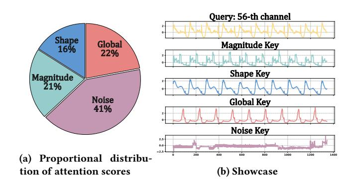
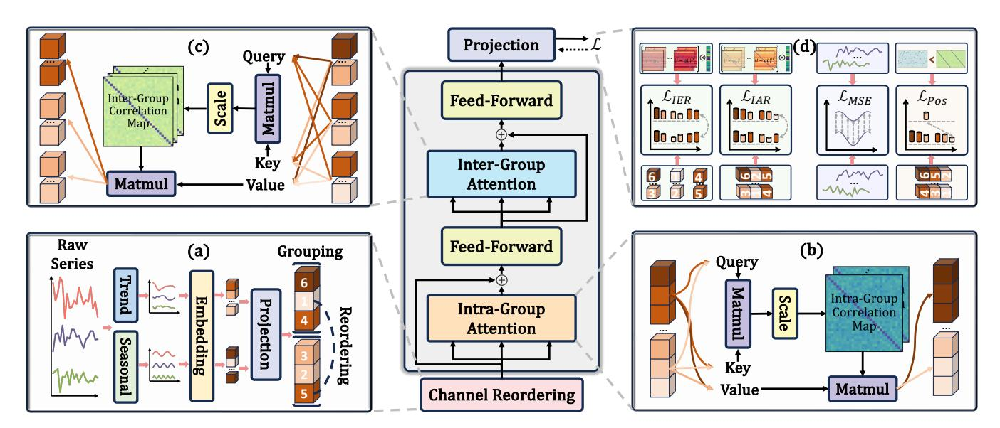
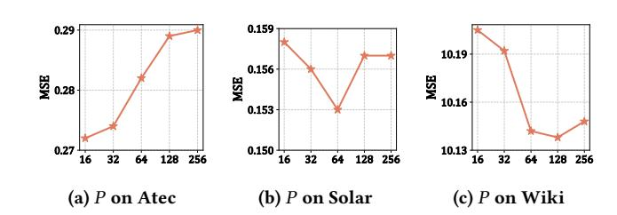
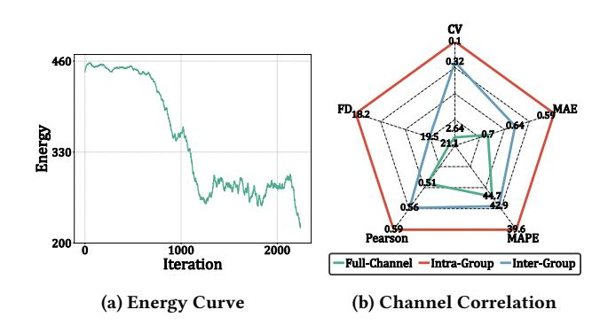
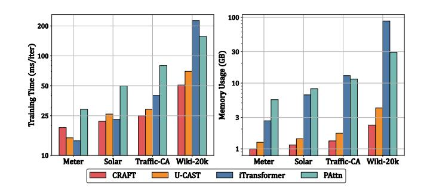
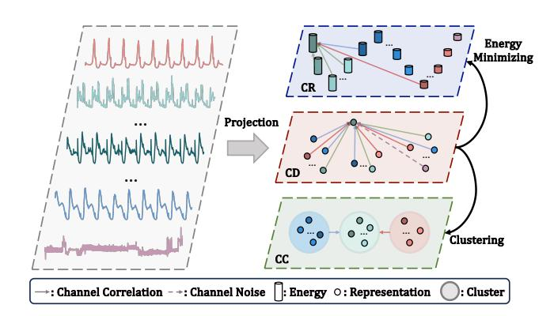
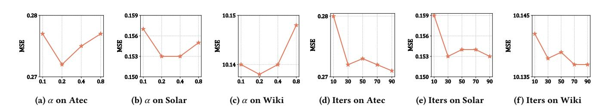

# Efficient High-Dimensional Time Series Forecasting with Transformers: A Channel Reordering Perspective

Yuchen Fang University of Electronic Science and Technology of China Chengdu, China ByteDance China Hangzhou, China fangyuchen@std.uestc.edu.cn

Shiyu Wang∗ ByteDance China Hangzhou, China kwuking@gmail.com

Yuxuan Liang Hong Kong University of Science and Technology (Guangzhou) Guangzhou, China yuxliang@outlook.com

Zhou Ye Yang Xiang ByteDance China Hangzhou, China {yezhou199032,y.xiang1005}@gmail.com

Yan Zhao† Shenzhen Institute for Advanced Study, University of Electronic Science and Technology of China Shenzhen, China zhaoyan@uestc.edu.cn

Kai Zheng† University of Electronic Science and Technology of China Chengdu, China zhengkai@uestc.edu.cn

# Abstract

Time series forecasting is crucial for the development of sophisticated web technologies, driving smarter, more responsive, and data-driven web applications. A key to accurate forecasting lies in effectively capturing the intricate dependencies among different variables (channels). While existing channel-dependent methods have shown strong performance by explicitly modeling inter-channel relationships, they face two critical challenges when applied to high-dimensional datasets with thousands of channels. First, the computational complexity of them grows quadratically with the number of channels, leading to significant scalability issues. Second, attention weights reveal that inter-channel dependencies exhibit both local clusters and global structures, yet current methods fail to disentangle these heterogeneous patterns, resulting in mutual interference and degraded forecasting accuracy. To address these challenges, we propose a novel Channel Reordering-Aligned group Fusion Transformer (CRAFT) for high-dimensional time series forecasting. Specifically, we design an energy-based channel reordering mechanism that reorganizes channels into a minimal-energy state, preserving inherent local-global structures. Building on reordered structure, we introduce a group fusion Transformer that explicitly separates local and global dependencies, significantly reducing computational complexity while enhancing representational clarity. Experiments on high-dimensional datasets demonstrate that CRAFT consistently outperforms baselines, achieving higher forecasting accuracy with lower computational overhead.

© 2026 Copyright held by the owner/author(s). ACM ISBN 979-8-4007-2307-0/2026/04 <https://doi.org/10.1145/3774904.3792392>

### CCS Concepts

• Mathematics of computing → Time series analysis.

# Keywords

Time Series Forecasting, High-Dimensional Data

### ACM Reference Format:

Yuchen Fang, Shiyu Wang, Yuxuan Liang, Zhou Ye, Yang Xiang, Yan Zhao, and Kai Zheng. 2026. Efficient High-Dimensional Time Series Forecasting with Transformers: A Channel Reordering Perspective. In Proceedings of the ACM Web Conference 2026 (WWW '26), April 13–17, 2026, Dubai, United Arab Emirates. ACM, New York, NY, USA, [12](#page-11-0) pages. [https://doi.org/10.1145/](https://doi.org/10.1145/3774904.3792392) [3774904.3792392](https://doi.org/10.1145/3774904.3792392)

# 1 Introduction

Time series forecasting stands at the core of numerous missioncritical applications, and its significance is further amplified in the context of modern web technologies [\[24\]](#page-8-0). The World Wide Web, as a dynamic and ever-evolving ecosystem, generates massive and complex data streams from diverse sources, such as user interactions, service logs, and content delivery networks [\[16,](#page-8-1) [19\]](#page-8-2). These data streams typically consist of multiple interdependent variables, a.k.a channels, whose intricate temporal dynamics and intervariable relationships present substantial modeling challenges [\[44\]](#page-8-3). Recent advances have shown that explicitly modeling these interchannel dependencies (i.e., channel-dependent) is crucial for unlocking the predictive potential of multivariate time series forecasting, thereby enabling smarter web services and more adaptive user experiences [\[35\]](#page-8-4). However, as the number of variables in multivariate time series continues to grow from hundreds to thousands, the problem naturally evolves into high-dimensional time series forecasting [\[31,](#page-8-5) [46\]](#page-8-6). This escalation introduces several fundamental challenges for existing channel-dependent methods, particularly in web scenarios where scalability, real-time responsiveness, and predictive accuracy are paramount for applications.

Challenge I: Scalability Bottleneck of Channel-Dependent Models. First, whether employing dense attention mechanisms [\[26\]](#page-8-7),

∗Project lead: Shiyu Wang

†Corresponding author: Yan Zhao and Kai Zheng. Kai Zheng is with Yangtze Delta Region Institute (Quzhou), School of Computer Science and Engineering, UESTC. He is also with Shenzhen Institute for Advanced Study, UESTC.

[This work is licensed under a Creative Commons Attribution 4.0 International License.](https://creativecommons.org/licenses/by/4.0) WWW '26, Dubai, United Arab Emirates.

Figure 1: Analysis of the inter-channel attention scores produced by the iTransformer [\[26\]](#page-8-7) on the Atec [\[15\]](#page-8-8) dataset, with the showcase of the 56-��ℎ channel.

adaptive graph neural networks [\[17\]](#page-8-9), or fully-connected MLP-based channel mixers [\[8\]](#page-8-10), these methods invariably rely on explicit pairwise interactions between channels, causing their computational complexity to scale quadratically with the number of channels. This quadratic cost not only imposes severe computational and memory burdens but also fundamentally limits the scalability of such models in real-world applications, rendering them ill-suited for deployment in latency-sensitive high-dimensional time series forecasting tasks where efficiency is paramount. Although channel clustering offers a promising avenue for complexity reduction, hard clustering approaches introduce substantial computational overhead due to their reliance on complex modules and iterative procedures [\[27\]](#page-8-11). In contrast, neural-based soft clustering, while computationally efficient, often sacrifices local specificity for global smoothness, leading to the loss of critical information required for accurate high-dimensional time series forecasting [\[7,](#page-8-12) [14\]](#page-8-13).

Challenge II: Undifferentiated Modeling of Heterogeneous Dependencies. Second, existing methods suffer from a critical modeling limitation: they fail to recognize the heterogeneous nature of channel dependencies. As illustrated in Figure [1,](#page-1-0) analysis of the attention weights uncovers a heterogeneous landscape of channel dependencies. Some channels form tightly coupled local groups, exhibiting strong mutual influence, that is, channels with similar temporal evolution and value magnitude tend to receive higher attention scores. Conversely, few channels demonstrate more distributed and global dependencies, reflected by relatively uniform attention weights, i.e., they share more commonalities in both shape and value. Current approaches typically homogenize these heterogeneous channel interactions, failing to explicitly disentangle these local-global patterns. Such an entanglement between fundamentally different dependency types leads to mutual interference during model learning, undermining the capacity to capture either structure effectively and degrading forecasting accuracy.

To address these challenges from an efficient and undistorted manner, we draw inspiration from physical sciences, where entities in a system such as crystalline solids, protein folding, and even large-scale cosmic structures often evolve towards minimalenergy orders to manifest local cohesion nested within global structures [\[33,](#page-8-14) [34,](#page-8-15) [37\]](#page-8-16). Motivated by this observation, we propose a novel Channel Reordering-Aligned group Fusion Transformer (CRAFT)

for high-dimensional time series forecasting. Specifically, we design an energy-based channel reordering (CR) mechanism that seeks to reorganize channels into a low-energy configuration, wherein the inherent local-global structures are naturally surfaced and preserved. The detailed differences between channel reordering, channel clustering, and conventional channel-dependent paradigms are provided in Appendix [A.](#page-9-0) This reordering effectively aligns locally correlated channels into cohesive neighborhoods while positioning globally interactive channels in structurally meaningful locations. Building upon this reordered structure, we explicitly separate neighbored channels into the same group and thus preserve the local cohesion nested in the global structures is disentangled (solving Challenge II). By designing a group fusion Transformer to restrict fine-grained local modeling within groups and employing coarse-grained global interactions across groups, our method dramatically reduces the computational complexity from quadratic to linear, achieving both scalability and interpretability in highdimensional time series forecasting (solving Challenge I). Experimental results on several datasets consistently demonstrate that our approach outperforms state-of-the-art baselines in forecasting accuracy, while significantly reducing computational complexity and memory overhead compared with conventional channel-dependent methods. Furthermore, we provide comprehensive analyses to validate the effectiveness of our energy-based reordering and group fusion Transformer in preserving and utilizing the intrinsic localglobal dependencies within high-dimensional time series.

In summary, this paper makes the following key contributions:

- We propose a novel Channel Reordering-Aligned group Fusion Transformer (CRAFT) for high-dimensional time series forecasting, which can explicitly separates local and global dependencies, enabling substantial reductions in computational complexity while enhancing the model's interpretability and effectiveness.
- We propose an energy-based channel reordering mechanism for high-dimensional time series, rooted in physical principles, that reorganizes channels into a low-energy configuration, thereby preserving intrinsic hierarchical structures.
- Extensive experiments on 14 high-dimensional datasets (up to 20,000 channels) show that CRAFT achieves the best forecasting performance in 14/14 (MSE) and 13/14 (MAE) cases. Compared to iTransformer, our model reduces GPU memory usage by 92% and training time by 75% on the largest Wiki-20k dataset highlighting its scalability under extreme dimensionality.

# 2 Preliminaries

# 2.1 High-Dimensional Time Series Forecasting

High-dimensional time series (HDTS) consists of thousands of observation sequences collected over discrete time intervals from variables (also referred to as channels), far exceeding ordinary multivariate time series. Formally, HDTS is represented as:

�� = [��1, ��2, . . . , ���� ] ∈ R ��×�� , (1)

where ���� = [�� (1) , �� , . . . , �� (��) ⊤ ∈ R �� denotes the observations from all �� channels at time ��. Given an observed ��, the objective of high-dimensional time series forecasting (HDTSF) is to predict future values over a horizon of ��ˆ time steps by a learned mapping

Figure 2: Overall architecture of CRAFT. (a) Channel Reordering Module. (b) Group Fusion Transformer Module: Intra-Group Attention. (c) Group Fusion Transformer Module: Inter-Group Attention. (d) Triple-Loss Optimization Module.

function �� (·) based on historical data:

��ˆ = �� (��) = [����+1, ����+2, . . . , ����+��ˆ ] ∈ R ��×��ˆ , (2)

where ��ˆ denotes the predicted values, and each ����+��ˆ ∈ R �� represents the predicted values at future time �� + ��ˆ.

### 2.2 Energy Minimizing of HDTS

To formalize the notion of energy in the context of HDTS, we adopt a commonly used form of energy function from graph theory and manifold learning, which aims to minimize the differences between adjacent elements after reordering [\[3,](#page-8-17) [13\]](#page-8-18). Such formulations encourage channels with strong dependencies to be positioned closely together, leading to natural clusters of local correlations. Specifically, given a channel similarity matrix �� ∈ R ��×��, where ����,�� measures the dependency between channels �� and ��, a classic form of the energy function is defined as follows:

��(��) = − ��∑︁−1 ��=1 �� (�� ,�� (��+1) . (3)

Here, �� = [�� (1) , �� (2) , . . . , �� (��) ] denotes a permutation of channel indices, representing the reordered channel sequence. It is worth noting that such an energy minimization problem is closely related to spectral ordering techniques, where the Fiedler vector corresponding to the second smallest eigenvalue of the Laplacian is widely used to derive such low-energy reorderings, as it captures the global structure while preserving local connectivity [\[2\]](#page-8-19).

### 3 Methodology

The overall framework of our proposed method is presented in Figure [2.](#page-2-0) First, we utilize a channel reordering module to not only reorganize channels into a low-energy configuration based on the energy-aligned trend and seasonal scores but also partition neighbored channels into groups. Second, a group fusion Transformer

module is used on the grouped data, i.e., intra-group attention captures fine-grained local dependencies within a group, while inter-group attention models global relationships across groups. Finally, in the triple-loss optimization module, we introduce an energy-based reordering loss, along with a position regularization term, encourage the learned permutations to approximate low-energy, structured configurations. Moreover, standard MSE loss supervises forecasting accuracy. We offer a detailed description of each module in the following.

### 3.1 Channel Reordering Module

Motivation. In physical sciences, it is well-established that complex systems tend to evolve toward configurations that minimize energy [\[37\]](#page-8-16). Such energy-minimized states naturally reflect the system's underlying structure, revealing both local interactions (e.g., molecular bonds) and global organization (e.g., crystal lattices). These principles inspire our perspective on HDTSF. Many HDTS data, particularly in climate science and hydrology, inherently stem from physical systems where channels are interconnected through physical laws. For example, in the Meter dataset [\[31\]](#page-8-5), downstream energy measurements are influenced by upstream conditions via physical transfer mechanisms. From this view, we posit that channels in HDTS also admit an optimal ordering that minimizes the energy function, which encodes the cost or disorder of interactions among channels.

3.1.1 Channel Reordering. A straightforward solution for minimizing energy is to precompute a static channel correlation matrix (e.g., Pearson matrix) and obtain a fixed spectral ordering via the Fiedler vector. However, as shown in Figure [1,](#page-1-0) predefined correlation measures cannot capture the complex, heterogeneous, and often nonlinear channel dependencies prevalent in HDTS. Moreover, computing and storing the full correlation matrix incurs undesirable quadratic complexity and additional preprocessing overhead.

attention or MLP mixers, our method achieves linear complexity while decoupling local-global dependencies.

Table 1: Dataset statistics.

| Datasets   |      | Domain         | Length  | Channel | Horizon | Frequency |      |
|------------|------|----------------|---------|---------|---------|-----------|------|
| Air        | [21] | Environment    | 15,461  | 1,105   | 28      | 6 Hours   |      |
| Measles    | [28] | Healthcare     | 1,330   | 1,161   | 7       | 1         | Day  |
| SP500      | [31] | Finance        | 7,553   | 1,475   | 7       |           | 1 D  |
| Atec       | [15] | Web            | 8,928   | 1,569   | 336     | 10        | Mins |
| Neurolib   | [5]  | Healthcare     | 60,000  | 2,000   | 336     | 1         | ms   |
| Meter      | [31] | Energy         | 28,512  | 2,898   | 336     | 30        | Mins |
| SIRS       | [4]  | Healthcare     | 9,000   | 2,994   | 7       | 1         | Day  |
| M5         | [29] | Finance        | 1,941   | 3,049   | 7       | 1         | Day  |
| Temp       | [42] | Weather        | 17,544  | 3,850   | 168     | 1         | Hour |
| Wind       | [42] | Weather        | 17,544  | 3,850   | 168     | 1         | Hour |
| Solar      | [20] | Energy         | 105,120 | 5,162   | 336     | 5         | Mins |
| Mobility   | [1]  | Transportation | 974     | 5,826   | 7       | 1         | Day  |
| Traffic-CA | [25] | Transportation | 43,824  | 7,491   | 168     | 1         | Hour |
| Wiki-20k   | [35] | Web            | 2,557   | 20,000  | 7       | 1         | Day  |

### 4 Experiments

This section aims to address the following five essential research questions by conducting comprehensive experiments.

- RQ1: How does CRAFT perform when compared to current models in HDTSF?
- RQ2: Do main components of CRAFT are effective?
- RQ3: How does group size �� impact CRAFT?
- RQ4: How efficient is CRAFT in high-dimensional datasets?
- RQ5: Does CRAFT output sensible groupings?

# 4.1 Experimental Setup

4.1.1 Datasets. To comprehensively evaluate the scalability and efficiency of models, we conduct experiments on 14 high-dimensional time series datasets with high channel correlations. These datasets are carefully selected from diverse domains, where the number of channels ranges from 1, 105 to 20, 000, far exceeding the scale of commonly used multivariate time series benchmarks [\[41,](#page-8-23) [48\]](#page-8-35). Such high-dimensional settings pose significant challenges for existing methods, providing a more rigorous testbed to verify our model's ability to handle complex and large-scale dependencies while maintaining computational efficiency. For each dataset, the time series is chronologically split into training, validation, and test sets following a 7:1:2 ratio. Additionally, the forecasting horizon ��ˆ for each dataset is aligned with realistic temporal scales in each domain. The detailed statistics of these datasets are summarized in Table [1.](#page-5-0)

4.1.2 Evaluation Metrics. We employ a variety of metrics to comprehensively evaluate both the forecasting performance and the computational efficiency of the proposed method. For prediction accuracy, we employ two widely used metrics: mean absolute error (MAE) and mean squared error (MSE), which quantify the differences between predicted and ground truth values. Detailed descriptions of these metrics are provided in Appendix [D.](#page-10-0) For evaluating model efficiency, we report the wall-clock time and GPU memory consumption of models in the training phase.

4.1.3 Baselines. To comprehensively evaluate the effectiveness of our CRAFT, we compare it against a diverse set of 8 baselines, which we categorize into three classes according to their channel modeling strategies. 1) Channel-independent (CI) DLinear [\[45\]](#page-8-21), PatchTST [\[32\]](#page-8-36), and PAttn [\[38\]](#page-8-37), which treat each channel as an independent univariate time series and model them separately. 2) Channel-dependent (CD) TimesNet [\[40\]](#page-8-38), TSMixer [\[8\]](#page-8-10), and iTransformer [\[26\]](#page-8-7), which explicitly model interactions across all channels. 3) Channel clustering (CC) DUET [\[36\]](#page-8-39) and U-CAST [\[31\]](#page-8-5), which attempt to reduce the complexity of full channel interactions through soft clustering strategies based on masking or prototype. Detailed descriptions of these baselines are provided in Appendix [E.](#page-11-1)

4.1.4 Implementation Details. To better reproduce experiments, we summarize all default settings as follows. During training, our CRAFT is optimized by the Adam optimizer with a learning rate of 0.001 and the batch size is initially set to 32. If an out-of-memory error occurs, the batch size is automatically halved until the issue is resolved. The latent model feature �� and group size �� of our CRAFT are searched from [128, 256, 512] and [16, 32, 64, 128, 256] for different datasets. For baselines, they are trained using their default configurations as reported in their respective papers. Moreover, input length �� of our CRAFT and baselines is searched from[3 × �� , ˆ 4 ×�� , ˆ 5 ×��ˆ].

# 4.2 Performance Comparisons (RQ1)

The forecasting results on 14 HDTS datasets are reported in Table [2.](#page-6-0) We summarize the following key observations:

Necessity of Dynamic Channel Dependency. The channeldependent iTransformer achieves superior performance over channelindependent baselines across most datasets. In contrast, TSMixer and TimesNet do not demonstrate clear improvements over their channel-independent counterparts. This underscores the critical advantage of the Transformer architecture in dynamically capturing time-evolving channel dependencies.

Limitations of Channel Clustering. While channel clustering strategies like DUET and U-CAST aim to reduce modeling complexity, they sometimes underperform compared to channel-dependent models. This is because prototype-based U-CAST may lose finegrained local information, while mask-based DUET are prone to mistakenly suppress informative channels, leading to degraded performance. These results highlight the trade-off between efficiency and fidelity in HDTSF designs.

Consistent Performance Superiority. Our CRAFT consistently achieves the best performance on 14 datasets in terms of MSE and 13 datasets in terms of MAE, demonstrating its scalability across diverse domains. This consistent superiority stems from our design, which explicitly disentangles and captures both local (intra-group) and global (inter-group) channel dependencies through energyaligned channel reordering and group fusion Transformer.

# 4.3 Model Analysis

4.3.1 Ablation Study (RQ2). To verify the contribution of each key component in our model, we conduct ablation studies on five crucial modules:

- w/o Dec: without the trend-seasonal decomposition.

Table 2: High-dimensional MTSF performance comparison between our CRAFT and the baselines. Bold font indicates the best performance, underline denotes the second-best performance, and '—' indicates that the model ran out of memory.

| Methods Metrics | MSE    | DLinear (2023) MAE | MSE    | CI PatchTST (2023) MAE | MSE    | PAttn (2024) MAE | MSE    | TimesNet (2023) MAE | MSE    | CD TSMixer (2023) MAE | MSE    | iTransformer (2024) MAE | MSE    | DUET (2025) MAE | CC MSE | U-CAST (2025) MAE | MSE    | CR CRAFT (ours) MAE |
|-----------------|--------|--------------------|--------|------------------------|--------|------------------|--------|---------------------|--------|-----------------------|--------|-------------------------|--------|-----------------|--------|-------------------|--------|---------------------|
| Air             | 0.449  | 0.446              | 0.448  | 0.432                  | 0.449  | 0.432            | 0.457  | 0.438               | 0.447  | 0.438                 | 0.447  | 0.431                   | 0.452  | 0.444           | 0.446  | 0.430             | 0.413  | 0.408               |
| Measles         | 0.128  | 0.252              | 0.013  | 0.058                  | 0.011  | 0.048            | 0.018  | 0.060               | 0.569  | 0.547                 | 0.010  | 0.048                   | 0.015  | 0.064           | 0.010  | 0.042             | 0.010  | 0.039               |
| SP500           | 0.630  | 0.367              | 0.523  | 0.313                  | 0.516  | 0.309            | 0.611  | 0.343               | 2.674  | 1.120                 | 0.511  | 0.306                   | 0.568  | 0.335           | 0.555  | 0.328             | 0.441  | 0.274               |
| Atec            | 0.318  | 0.314              | 0.298  | 0.298                  | 0.299  | 0.275            | 0.493  | 0.429               | 0.398  | 0.387                 | 0.345  | 0.319                   | 0.330  | 0.339           | 0.287  | 0.280             | 0.272  | 0.260               |
| Neurolib        | 1.793  | 0.381              | 2.395  | 0.438                  | 2.458  | 0.445            | 2.475  | 0.458               | 2.240  | 0.532                 | 1.718  | 0.347                   | 2.519  | 0.451           | 1.750  | 0.350             | 1.640  | 0.333               |
| Meter           | 0.944  | 0.549              | 1.254  | 0.706                  | 0.941  | 0.552            | 1.034  | 0.586               | 0.987  | 0.564                 | 0.949  | 0.556                   | 1.308  | 0.731           | 0.943  | 0.551             | 0.925  | 0.543               |
| SIRS            | 0.058  | 0.168              | 0.033  | 0.129                  | 0.025  | 0.109            | 0.162  | 0.327               | 0.016  | 0.078                 | 0.028  | 0.113                   | 0.095  | 0.236           | 0.007  | 0.052             | 0.003  | 0.041               |
| M5              | 3.688  | 0.870              | 3.655  | 0.872                  | 3.650  | 0.867            | 4.490  | 0.919               | 6.863  | 1.623                 | 3.549  | 0.853                   | 3.768  | 0.880           | 3.501  | 0.849             | 3.309  | 0.819               |
| Temp            | 0.272  | 0.391              | 0.279  | 0.396                  | 0.278  | 0.395            | 0.287  | 0.408               | 0.266  | 0.389                 | 0.265  | 0.386                   | 0.435  | 0.511           | 0.262  | 0.383             | 0.258  | 0.381               |
| Wind            | 1.128  | 0.697              | 1.254  | 0.757                  | 1.256  | 0.758            | 1.161  | 0.708               | 1.346  | 0.742                 | 1.116  | 0.699                   | 1.227  | 0.746           | 1.104  | 0.692             | 1.080  | 0.688               |
| Solar           | 0.174  | 0.255              | 0.416  | 0.469                  | 0.604  | 0.582            | 0.157  | 0.224               | 0.155  | 0.216                 | 0.343  | 0.427                   | —      | —               | 0.172  | 0.246             | 0.153  | 0.217               |
| Mobility        | 0.344  | 0.359              | 0.344  | 0.341                  | 0.337  | 0.336            | 0.410  | 0.388               | 1.165  | 0.787                 | 0.312  | 0.314                   | 0.439  | 0.410           | 0.315  | 0.317             | 0.287  | 0.297               |
| Traffic-CA      | 0.063  | 0.141              | 0.295  | 0.417                  | 0.491  | 0.554            | 0.101  | 0.205               | 0.082  | 0.186                 | 0.271  | 0.391                   | —      | —               | 0.061  | 0.131             | 0.054  | 0.126               |
| Wiki-20k        | 10.740 | 0.394              | 10.291 | 0.305                  | 10.290 | 0.306            | 10.586 | 0.325               | 10.446 | 0.332                 | 10.933 | 0.405                   | 10.278 | 0.304           | 10.273 | 0.302             | 10.138 | 0.290               |
| 1st Count       | 0      | 0                  | 0      | 0                      | 0      | 0                | 0      | 0                   | 0      | 1                     | 0      | 0                       | 0      | 0               | 0      | 0                 | 14     | 13                  |

Table 3: Ablation study of CRAFT on all datasets with MSE.

| Methods    | Air   | Measles | SP500 | Atec  | Neurolib | Meter | SIRS  | M5    | Temp  | Wind  | Solar | Mobility | Traffic-CA | Wiki-20k |
|------------|-------|---------|-------|-------|----------|-------|-------|-------|-------|-------|-------|----------|------------|----------|
| w/o Dec    | 0.419 | 0.011   | 0.445 | 0.277 | 1.646    | 0.929 | 0.004 | 3.312 | 0.261 | 1.088 | 0.155 | 0.289    | 0.055      | 10.232   |
| w/o Intra  | 0.419 | 0.011   | 0.446 | 0.283 | 1.649    | 0.930 | 0.005 | 3.386 | 0.263 | 1.085 | 0.158 | 0.291    | 0.057      | 10.239   |
| w/o Inter  | 0.425 | 0.014   | 0.477 | 0.294 | 1.706    | 0.946 | 0.010 | 3.534 | 0.283 | 1.082 | 0.167 | 0.326    | 0.062      | 10.380   |
| w/o L Pos  | 0.415 | 0.011   | 0.444 | 0.283 | 1.700    | 0.926 | 0.003 | 3.312 | 0.259 | 1.088 | 0.154 | 0.289    | 0.054      | 10.154   |
| w/o L Rank | 0.493 | 0.012   | 0.443 | 0.682 | 1.705    | 0.939 | 0.005 | 3.466 | 0.264 | 1.187 | 0.284 | 0.292    | 0.206      | 10.159   |
| CRAFT      | 0.413 | 0.010   | 0.441 | 0.272 | 1.640    | 0.925 | 0.003 | 3.309 | 0.258 | 1.080 | 0.153 | 0.287    | 0.054      | 10.138   |

Figure 3: The influence of channel number in the group.

- w/o Intra: without the intra-group attention.
- w/o Inter: without the inter-group attention.
- w/o Lpos: without the position regularization loss.
- w/o Lrank: without the energy-based reordering loss.

The key observations of Table [3](#page-6-1) are as follows.

Benefits Brought by Decomposition. Eliminating the trendseasonal decomposition also leads to noticeable performance drops. This confirms that explicitly disentangling temporal patterns helps stabilize the training of the reordering module, as raw time series contain complex dynamics that are harder to align for effective permutation learning.

Benefits Brought by Local-Global Modeling. Both w/o Intra and w/o Inter exhibit a substantial drop in performance compared to group fusion Transformer that jointly leverages dual attentions. This significant degradation highlights the necessity of modeling both local and global dependencies, demonstrating that their synergistic integration is critical to capture intricate channel correlations and achieving superior accuracy.

Effectiveness of Energy-Based Reordering Loss. Removing the reordering loss leads to severe performance degradation across all datasets, in some cases causing near collapse. This demonstrates that hierarchical attention across groups fundamentally relies on the channel ordering to preserve the inherent local-global structure. Effectiveness of Position Regularization Loss. Removing the position regularization loss consistently results in degraded performance, though less dramatically than removing the reordering loss. This highlights the importance of correcting cross-group misalignments. While Lrank effectively captures intra- and inter-group hierarchy, it cannot approximate global ordering perfectly due to the alternating mechanism.

4.3.2 Group Size Sensitivity Analysis (RQ3). We further analyze the sensitivity of our model to the group size ��, which controls the granularity of local dependency modeling and affects computational efficiency. Experiments are conducted on three datasets

Figure 4: Visualization of energy and correlations.

with increasing channel scales. The results show that the optimal group size grows with the number of channels, which validates the design intuition. Smaller datasets benefit from smaller group size to capture finer local structures, while larger datasets require larger group size to balance between local modeling and global scalability. As group size increases with channel count, the complexity reduction is more pronounced, avoiding redundant local interactions while preserving global information flow.

4.3.3 Case Study (RQ4). In this section, we visualize both the energy minimization process during training and the statistical properties of channel correlations, as shown in Figure [4.](#page-7-0)

Energy Convergence Behavior. Figure [4a](#page-7-0) presents the curve of the energy value as training proceeds. The energy decreases rapidly in the early stages, reflecting the model's ability to quickly learn coarse global structure. As training progresses, the energy curve stabilizes and enters a phase of low-amplitude oscillations, indicating a convergence to locally optimal configurations. These fluctuations likely capture fine-grained adjustments to preserve local-global dependency balance under dynamic attention shifts, supporting the hypothesis of a data-driven stable structure. Local-Global Patterns. Figure [4b](#page-7-0) compares five key metrics (detailed in Appendix [D\)](#page-10-0) across channels of the intra-group, intergroup, and full dataset: 1) CV (Coefficient of Variation) reflects the heterogeneity of attention weights [\[12\]](#page-8-40). 2) FD (Frequency Distance) measures shape-level dissimilarity of channels [\[6\]](#page-8-41). 3) Pearson, MAE, and MAPE quantify pairwise similarity of channels. The intra-group channels exhibits the best FD, Pearson, MAE, and MAPE, confirming that our adaptive grouping mechanism effectively partitions closely related channels into the same group and thus preserves local dependencies. Meanwhile, inter-group channels maintain lower CV of its attention weights (i.e., uniform attention weights) while preserving similar MAPE and FD with full setting, indicating that global dependencies as illustrated in Figure [1](#page-1-0) are captured with reduced redundancy.

# 4.4 Efficiency Comparisons (RQ5)

To assess scalability and computational efficiency, we compare our model with superior baselines in Table [2](#page-6-0) across four datasets with increasing channel dimensions. As shown in Figure [5,](#page-7-1) channelindependent PAttn avoids modeling inter-channel dependencies but suffers from redundant per-channel temporal processing, which

Figure 5: Efficiency comparison of four models on four datasets with increasing scale.

results in growing resource consumption on high-dimensional datasets. Second, channel-dependent model iTransformer incurs quadratic complexity with respect to the number of channels. While effective on small datasets, they demand near 100 GB of memory at the ultra high-dimensional wiki-20k dataset, which exceeds the capacity of common GPU hardware and leads to out-of-memory failures. Despite our CRAFT may exhibit slightly higher training time due to additional reordering and feed-forward networks. As the number of channels increases, our method shows superior training time and memory usage based on group fusion Transformer. Finally, compared to U-CAST, a recent HDTS-oriented efficient model, CRAFT achieves lower memory consumption and training time while maintaining a more expressive dependency structure. This highlights the strength of our structure-aware channel grouping in balancing performance and scalability. In conclusion, CRAFT offers a compelling solution for HDTSF, with practical efficiency benefits validated under diverse scenarios.

# 5 Conclusion

We propose a novel CRAFT for high-dimensional time series forecasting that addresses quadratic complexity and entangled localglobal dependencies. Inspired by energy minimization in physical systems, we formulate the reordering of channels as an adaptive energy optimization task, which efficiently aligns with Laplaciansmoothing approximated spectral sorting. By reorganizing channels into groups, our model applies a group fusion Transformer to decouple intra- and inter-group modeling that capture both local and global dependencies. We further design a three-part loss—comprising energy-based reordering, positional regularization, and forecasting objectives—to jointly guide structure formation and predictive accuracy. Experiments on 14 real-world datasets with up to 20,000 channels demonstrate that our CRAFT consistently outperforms state-of-the-art baselines in both accuracy and efficiency. In future work, we aim to extend CRAFT to industrial-grade applications involving hundreds of thousands or even millions of channels.

# Acknowledgments

This work is partially supported by NSFC (No. 62472068), Municipal Government of Quzhou under Grant (No. 2024D036), DFF Inge Lehmann grant (No. 4303-00014) and NSFC (No. 62402414).

References [1] Ahmet Aktay, Shailesh Bavadekar, Gwen Cossoul, John Davis, Damien Desfontaines, Alex Fabrikant, Evgeniy Gabrilovich, Krishna Gadepalli, Bryant Gipson, Miguel Guevara, et al. 2020. Google COVID-19 community mobility reports: anonymization process description (version 1.1). arXiv preprint arXiv:2004.04145 (2020). [2] Jonathan E Atkins, Erik G Boman, and Bruce Hendrickson. 1998. A spectral algorithm for seriation and the consecutive ones problem. SIAM J. Comput. (1998), 297–310. [3] Mikhail Belkin and Partha Niyogi. 2001. Laplacian eigenmaps and spectral techniques for embedding and clustering. In NeurIPS, Vol. 14. [4] Yongli Cai, Yun Kang, Malay Banerjee, and Weiming Wang. 2015. A stochastic SIRS epidemic model with infectious force under intervention strategies. Journal of Differential Equations (2015), 7463–7502. [5] Caglar Cakan, Nikola Jajcay, and Klaus Obermayer. 2023. neurolib: A simulation framework for whole-brain neural mass modeling. Cognitive Computation (2023), 1132–1152. [6] Elsa Cazelles, Arnaud Robert, and Felipe Tobar. 2020. The Wasserstein-Fourier distance for stationary time series. IEEE Transactions on Signal Processing (2020), 709–721. [7] Jialin Chen, Jan Eric Lenssen, Aosong Feng, Weihua Hu, Matthias Fey, Leandros Tassiulas, Jure Leskovec, and Rex Ying. 2024. From similarity to superiority: Channel clustering for time series forecasting. In NeurIPS. 130635–130663. [8] Si-An Chen, Chun-Liang Li, Sercan O Arik, Nathanael Christian Yoder, and Tomas Pfister. 2024. TSMixer: An All-MLP Architecture for Time Series Forecast-ing. Transactions on Machine Learning Research (2024). [9] Alexey Dosovitskiy, Lucas Beyer, Alexander Kolesnikov, Dirk Weissenborn, Xiaohua Zhai, Thomas Unterthiner, Mostafa Dehghani, Matthias Minderer, Georg Heigold, Sylvain Gelly, et al. 2021. An Image is Worth 16x16 Words: Transformers for Image Recognition at Scale. In ICLR. [10] Yuchen Fang, Yuxuan Liang, Bo Hui, Zezhi Shao, Liwei Deng, Xu Liu, Xinke Jiang, and Kai Zheng. 2025. Efficient large-scale traffic forecasting with transformers: A spatial data management perspective. In SIGKDD. 307–317. [11] Yuchen Fang, Hao Miao, Yuxuan Liang, Liwei Deng, Yue Cui, Ximu Zeng, Yuyang Xia, Yan Zhao, Torben Bach Pedersen, Christian S Jensen, et al. 2025. Unraveling Spatio-Temporal Foundation Models via the Pipeline Lens: A Comprehensive Review. Transactions on Knowledge and Data Engineering (2025). [12] Yuchen Fang, Jiandong Xie, Yan Zhao, Lu Chen, Yunjun Gao, and Kai Zheng. 2024. Temporal-frequency masked autoencoders for time series anomaly detection. In ICDE. 1228–1241. [13] Fajwel Fogel, Alexandre d'Aspremont, and Milan Vojnovic. 2016. Spectral ranking using seriation. Journal of Machine Learning Research (2016), 1–45. [14] Lu Han, Xu-Yang Chen, Han-Jia Ye, and De-Chuan Zhan. 2024. Softs: Efficient multivariate time series forecasting with series-core fusion. In NeurIPS. 64145– 64175. [15] Hongyan Hao, Zhixuan Chu, Shiyi Zhu, Gangwei Jiang, Yan Wang, Caigao Jiang, James Y Zhang, Wei Jiang, Siqiao Xue, and Jun Zhou. 2023. Continual learning in predictive autoscaling. In CIKM. 4616–4622. [16] Min Hou, Chang Xu, Zhi Li, Yang Liu, Weiqing Liu, Enhong Chen, and Jiang Bian. 2022. Multi-granularity residual learning with confidence estimation for time series prediction. In WWW. 112–121. [17] Yifan Hu, Guibin Zhang, Peiyuan Liu, Disen Lan, Naiqi Li, Dawei Cheng, Tao Dai, Shu-Tao Xia, and Shirui Pan. 2025. TimeFilter: Patch-specific spatial-temporal graph filtration for time series forecasting. In ICML. [18] Xinke Jiang, Wentao Zhang, Yuchen Fang, Xiaowei Gao, Hao Chen, Haoyu Zhang, Dingyi Zhuang, and Jiayuan Luo. 2025. Time series supplier allocation via deep black-litterman model. In AAAI. 11870–11878. [19] Harshavardhan Kamarthi, Lingkai Kong, Alexander Rodríguez, Chao Zhang, and B Aditya Prakash. 2022. CAMul: calibrated and accurate multi-view time-series forecasting. In WWW. 3174–3185. [20] Guokun Lai, Wei-Cheng Chang, Yiming Yang, and Hanxiao Liu. 2018. Modeling long-and short-term temporal patterns with deep neural networks. In SIGIR. 95–104. [21] Yuxuan Liang, Yutong Xia, Songyu Ke, Yiwei Wang, Qingsong Wen, Junbo Zhang, Yu Zheng, and Roger Zimmermann. 2023. Airformer: Predicting nationwide air quality in china with transformers. In AAAI. 14329–14337. [22] Chenxi Liu, Qianxiong Xu, Hao Miao, Sun Yang, Lingzheng Zhang, Cheng Long, Ziyue Li, and Rui Zhao. 2025. Timecma: Towards llm-empowered multivariate time series forecasting via cross-modality alignment. In AAAI. 18780–18788. [23] Chenxi Liu, Shaowen Zhou, Qianxiong Xu, Hao Miao, Cheng Long, Ziyue Li, and Rui Zhao. 2025. Towards Cross-Modality Modeling for Time Series Analytics: A Survey in the LLM Era. arXiv preprint arXiv:2505.02583 (2025). [24] Xu Liu, Junfeng Hu, Yuan Li, Shizhe Diao, Yuxuan Liang, Bryan Hooi, and Roger Zimmermann. 2024. Unitime: A language-empowered unified model for crossdomain time series forecasting. In WWW. 4095–4106. [25] Xu Liu, Yutong Xia, Yuxuan Liang, Junfeng Hu, Yiwei Wang, Lei Bai, Chao Huang, Zhenguang Liu, Bryan Hooi, and Roger Zimmermann. 2023. Largest: A benchmark dataset for large-scale traffic forecasting. In NeurIPS. 75354–75371. [26] Yong Liu, Tengge Hu, Haoran Zhang, Haixu Wu, Shiyu Wang, Lintao Ma, and Mingsheng Long. 2024. iTransformer: Inverted Transformers Are Effective for Time Series Forecasting. In ICLR. [27] Yipu Liu, Zheng Wang, and Qinghua Hu. 2025. Influence-Based Channel Reweighting for Multivariate Time Series Forecasting. In ICASSP. 1–5. [28] Wyatt G Madden, Wei Jin, Benjamin Lopman, Andreas Zufle, Benjamin Dalziel, C Jessica E. Metcalf, Bryan T Grenfell, and Max SY Lau. 2024. Deep neural networks for endemic measles dynamics: Comparative analysis and integration with mechanistic models. PLoS computational biology (2024), e1012616. [29] Spyros Makridakis, Evangelos Spiliotis, and Vassilios Assimakopoulos. 2022. M5 accuracy competition: Results, findings, and conclusions. International journal of forecasting (2022), 1346–1364. [30] Hao Miao, Ziqiao Liu, Yan Zhao, Chenjuan Guo, Bin Yang, Kai Zheng, and Christian S Jensen. 2024. Less is more: Efficient time series dataset condensation via two-fold modal matching. In VLDB. 226–238. [31] Juntong Ni, Shiyu Wang, Zewen Liu, Xiaoming Shi, Xinyue Zhong, Zhou Ye, and Wei Jin. 2025. Are We Overlooking the Dimensions? Learning Latent Hierarchical Channel Structure for High-Dimensional Time Series Forecasting. arXiv preprint arXiv:2507.15119 (2025). [32] Yuqi Nie, Nam H Nguyen, Phanwadee Sinthong, and Jayant Kalagnanam. 2023. A Time Series is Worth 64 Words: Long-term Forecasting with Transformers. In ICLR. [33] Artem R Oganov and Mario Valle. 2009. How to quantify energy landscapes of solids. The Journal of chemical physics (2009). [34] José Nelson Onuchic, Zaida Luthey-Schulten, and Peter G Wolynes. 1997. Theory of protein folding: the energy landscape perspective. Annual review of physical chemistry (1997), 545–600. [35] Xiangfei Qiu, Jilin Hu, Lekui Zhou, Xingjian Wu, Junyang Du, Buang Zhang, Chenjuan Guo, Aoying Zhou, Christian S Jensen, Zhenli Sheng, et al. 2024. Tfb: Towards comprehensive and fair benchmarking of time series forecasting methods. In VLDB. [36] Xiangfei Qiu, Xingjian Wu, Yan Lin, Chenjuan Guo, Jilin Hu, and Bin Yang. 2025. Duet: Dual clustering enhanced multivariate time series forecasting. In SIGKDD. [37] Collin M Stultz. 2006. Cosmology and proteins: landscape of possibilities. Nature Physics (2006), 357–357. [38] Mingtian Tan, Mike Merrill, Vinayak Gupta, Tim Althoff, and Tom Hartvigsen. 2024. Are language models actually useful for time series forecasting?. In NeurIPS. 60162–60191. [39] Ulrike Von Luxburg. 2007. A tutorial on spectral clustering. Statistics and computing (2007), 395–416. [40] Haixu Wu, Tengge Hu, Yong Liu, Hang Zhou, Jianmin Wang, and Mingsheng Long. 2023. TimesNet: Temporal 2D-Variation Modeling for General Time Series Analysis. In ICLR. [41] Haixu Wu, Jiehui Xu, Jianmin Wang, and Mingsheng Long. 2021. Autoformer: Decomposition transformers with auto-correlation for long-term series forecasting. In NeurIPS. 22419–22430. [42] Haixu Wu, Hang Zhou, Mingsheng Long, and Jianmin Wang. 2023. Interpretable weather forecasting for worldwide stations with a unified deep model. Nature Machine Intelligence (2023), 602–611. [43] Mingyuan Xia, Chunxu Zhang, Zijian Zhang, Hao Miao, Qidong Liu, Yuanshao Zhu, and Bo Yang. 2025. TimeEmb: A Lightweight Static-Dynamic Disentanglement Framework for Time Series Forecasting. arXiv preprint arXiv:2510.00461 (2025). [44] Yongzheng Xie, Hongyu Zhang, and Muhammad Ali Babar. 2025. Multivariate Time Series Anomaly Detection by Capturing Coarse-Grained Intra-and Inter-Variate Dependencies. In WWW. 697–705. [45] Ailing Zeng, Muxi Chen, Lei Zhang, and Qiang Xu. 2023. Are transformers effective for time series forecasting?. In AAAI. 11121–11128. [46] Ximu Zeng, Liwei Deng, Penghao Chen, Xu Chen, Han Su, and Kai Zheng. 2025. LIRA: A Learning-based Query-aware Partition Framework for Large-scale ANN Search. In WWW. 2729–2741. [47] Lifan Zhao and Yanyan Shen. 2024. Rethinking Channel Dependence for Multivariate Time Series Forecasting: Learning from Leading Indicators. In ICLR. 1–19. [48] Haoyi Zhou, Shanghang Zhang, Jieqi Peng, Shuai Zhang, Jianxin Li, Hui Xiong, and Wancai Zhang. 2021. Informer: Beyond efficient transformer for long sequence time-series forecasting. In AAAI. 11106–11115. [49] Tian Zhou, Ziqing Ma, Qingsong Wen, Xue Wang, Liang Sun, and Rong Jin. 2022. Fedformer: Frequency enhanced decomposed transformer for long-term series forecasting. In ICML. 27268–27286. [50] Ziyu Zhou, Yiming Huang, Yanyun Wang, Yuankai Wu, James Kwok, and Yuxuan Liang. 2026. Revitalizing Canonical Pre-Alignment for Irregular Multivariate Time Series Forecasting. In AAAI. 1–9. [51] Ziyu Zhou, Gengyu Lyu, Yiming Huang, Zihao Wang, Ziyu Jia, and Zhen Yang. 2024. Sdformer: transformer with spectral filter and dynamic attention for multivariate time series long-term forecasting. In IJCAI. 3–9.

Figure 6: Sketch of conventional channel-dependent (CD), advanced channel-clustering (CC), and our channel reordering (CR) paradigms in HDTSF.

# A Channel Strategies

In high-dimensional time series forecasting (HDTSF), the complexity and heterogeneity of channel dependencies pose significant challenges for both predictive performance and computational scalability. Over the years, two primary paradigms have emerged for channel modeling: channel-dependent approaches and channel clustering approaches. However, both methods have notable limitations in terms of complexity, information preservation, and adaptability to heterogeneous channel structures. To address these challenges, we propose a novel channel reordering paradigm, which leverages energy minimization to reorganize channels, maintaining both local and global structures while simplifying modeling. Figure [6](#page-9-2) provides a conceptual overview of these three paradigms.

- Channel-Dependent (CD): Conventional CD methods explicitly model the dependencies between every pair of channels, resulting in a quadratic complexity with respect to the number of channels. As illustrated in Figure [6,](#page-9-2) each channel is connected to all others, capturing intricate correlations but also potentially introducing noise. This is because CD approaches are unable to distinguish between meaningful and spurious inter-channel associations, which can lead to the inclusion of irrelevant information and the omission of critical relationships. This limitation is particularly pronounced in web-scale scenarios, where channels may represent vastly different types of data streams.
- Channel Clustering (CC): CC methods aim to reduce computational complexity by grouping channels into clusters based on similarity, as shown in Figure [6.](#page-9-2) This approach can be implemented via hard clustering algorithms, which require additional steps and may impose rigid group boundaries, or through neural soft clustering, which can blur local channel distinctions and result in the loss of fine-grained information. Although clustering effectively lowers the number of channel interactions, it often relies on external algorithms or neural mechanisms that may not fully preserve the nuanced structures inherent in the data.
- Channel Reordering (CR): To overcome the limitations of both CD and CC paradigms, we introduce a CR approach. This method employs energy minimization to reorganize channel order, ensuring that both local and global channel structures are preserved. By reordering channels in this manner, the resulting sequence can be

efficiently grouped using simple reshape operations, eliminating the need for explicit clustering algorithms. This not only reduces computational complexity but also maintains the integrity of meaningful channel relationships, enabling more effective modeling of high-dimensional time series data.

### B Related Work

Beyond modeling temporal dependencies within each univariate series [\[22,](#page-8-42) [23,](#page-8-43) [30,](#page-8-44) [43\]](#page-8-45), modeling the complex dependencies among channels is a core challenge in multivariate time series forecasting [\[11,](#page-8-46) [35,](#page-8-4) [50,](#page-8-47) [51\]](#page-8-48). To capture such dependencies, a variety of channel-dependent methods have been proposed, typically extending attention mechanisms [\[26,](#page-8-7) [42\]](#page-8-31) or graph neural networks [\[17\]](#page-8-9) to explicitly model inter-channel relationships. More recently, MLPbased architectures such as TSMixer [\[8\]](#page-8-10) utilize global channel mixing layers to capture inter-variable relationships. These models have demonstrated strong performance on datasets where inter-channel correlations are significant, highlighting the necessity of explicitly modeling cross-channel interactions. However, as the number of channels increases, the computational cost of these models becomes prohibitive on high-dimensional datasets. To alleviate this issue, a line of work has explored channel clustering strategies to reduce computational overhead. Some methods leverage conventional clustering methods such as spectral and KMeans clustering to partition channels into smaller, locally correlated groups [\[27\]](#page-8-11). These methods reduce computational complexity within clusters but introduce additional modules, which often require iterative optimization and increase the overall model overhead. An alternative direction involves soft clustering via learnable masks to approximate grouping behavior. For instance, TimeFilter [\[17\]](#page-8-9) employs graph structures with soft adjacency matrices, while DUET [\[36\]](#page-8-39) applies probabilistic matrix to implicitly capture group-wise structures. However, these approaches still involve dense channel-wise computations, failing to fundamentally break the quadratic complexity bottleneck. Recently, prototype-based soft clustering has emerged as a promising solution to reduce complexity. For example, CCM [\[7\]](#page-8-12), SOFTS [\[14\]](#page-8-13), and LIFT [\[47\]](#page-8-49) leverage latent prototypes to abstract channels into fewer representations, thereby reducing the computational burden. These methods replace dense channel interactions with prototypeto-channel interactions, which scales linearly with the number of prototypes. While this effectively reduces complexity, it inevitably sacrifices fine-grained local information, which is crucial for accurate time series forecasting. In this work, we focus on seeking a more principled solution that can both reduce complexity and preserve local-global dependencies.

# C Convergence Analysis

Let �� ∈ R ��×�� be the normalized Laplacian matrix derived from a symmetric, fully-connected attention correlation matrix ��, with eigenvalues 0 = ��1 &lt; ��2 ≤ ��3 ≤ · · · ≤ ���� and corresponding orthonormal eigenvectors ��1, ��2, . . . , ����. In dense graphs, such as those arising from attention mechanisms in high-dimensional time series, the spectrum of �� may exhibit small gaps between consecutive nontrivial eigenvalues, i.e., ��2 ≈ ��3. Consider the iterative Laplacian smoothing process:

����+1 = (�� − ����) ��0, (20)

Figure 7: The influence of the number of Laplacian smoothing iterations and the smoothing coefficient.

# E Baseline Details

To rigorously assess the effectiveness of our proposed CRAFT framework, we benchmark it against a comprehensive set of eight baseline models. These baselines are selected to represent a wide range of channel modeling strategies and are grouped into three main categories: channel-independent, channel-dependent, and channel clustering methods. Below, we provide detailed descriptions of each baseline within these categories.

- DLinear: A linear forecasting model that applies independent linear transformations to each channel, focusing solely on temporal patterns within individual series.
- PatchTST: Utilizes patch-based transformers for time series, processing each channel separately to capture temporal features.
- PAttn: Employs a patch attention mechanism, modeling each channel independently to extract relevant temporal information.
- TimesNet: TimesNet is a CNN-based model that revolutionizes time series analysis by transforming 1D time series into 2D tensors based on learned multi-periodicity.
- TSMixer: Applies mixing operations across channels and time steps, enabling direct modeling of complex interactions.
- iTransformer: Rethinks the application of Transformer architecture by inverting the input dimensions. Instead of treating time steps as tokens, iTransformer treats channels as tokens.
- DUET: Introduces dual clustering on both the temporal and channel dimensions. It designs a Temporal Clustering Module to handle heterogeneous temporal patterns and a Channel Clustering Module to capture relationships among channels.
- U-CAST: Learns latent hierarchical channel structures through an innovative query-based attention mechanism. To prevent correlated representations from becoming entangled, U-CAST incorporates a full-rank regularization term during training.

# F Hyperparameter Studies

To evaluate the robustness and effectiveness of our proposed channel reordering method, we conduct a comprehensive parameter sensitivity analysis on two key hyperparameters: the number of Laplacian smoothing iterations and the smoothing coefficient. This analysis helps to understand how these parameters influence the forecasting performance and guides the selection of optimal values in practical applications.

- Effect of Iterations (iters): We systematically vary the number of iters (�� = 10, 30, 50, 70, 90) and observe its impact on prediction accuracy. The results show that as the iteration number increases, forecasting performance improves initially but gradually plateaus. This indicates that a moderate number of iterations is sufficient to achieve near-optimal channel reordering, while excessive iterations yield diminishing returns. The convergence behavior suggests that the iterative process effectively extracts the dominant spectral structure after a certain point, and further iterations have limited additional benefit.
- Effect of Smoothing Coefficient (��): We also investigate the influence of the smoothing coefficient (�� = 0.1, 0.2, 0.4, 0.8) on model performance. The analysis reveals a non-monotonic trend: as �� increases, forecasting accuracy initially improves, reaches a peak, and then declines. This pattern suggests that an appropriately chosen smoothing coefficient enhances the extraction of meaningful channel relationships, while an excessively large �� may over-smooth the data, leading to loss of important structural information and reduced performance. Therefore, selecting an optimal �� is crucial for balancing smoothing effects and preserving relevant channel dependencies.