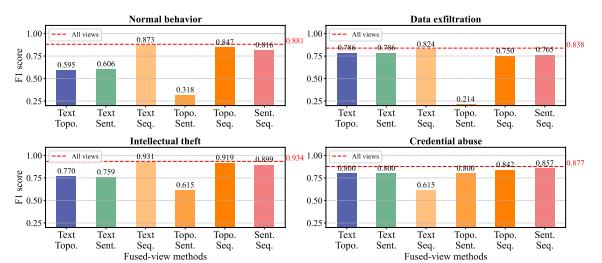
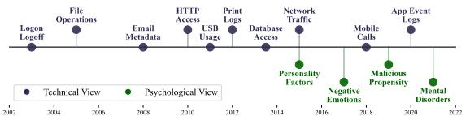
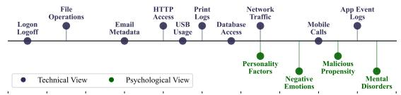
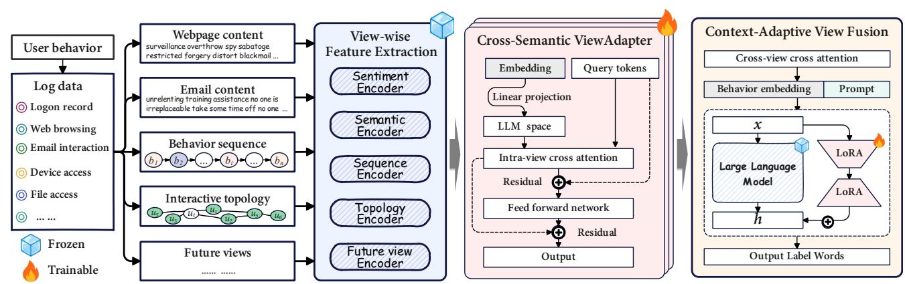
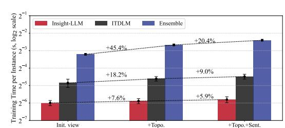
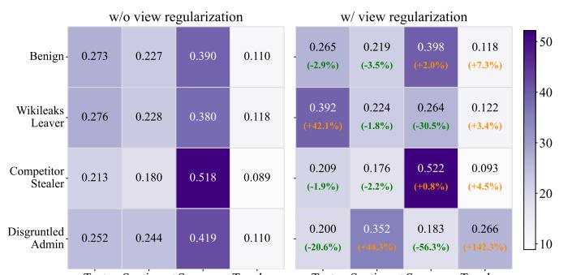
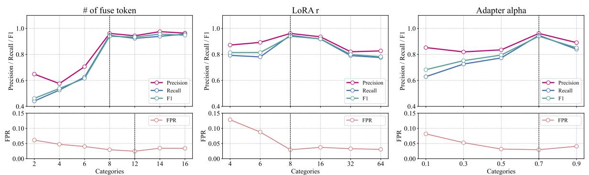
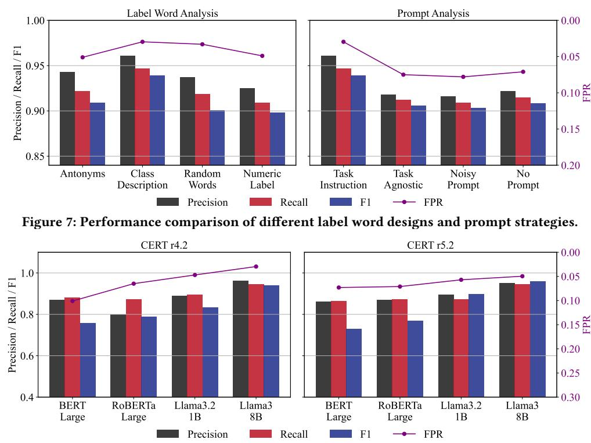

# Fusion Is Not A Simple Ensemble! Towards The Evolving Views in Insider Threat Detection

[Chengyu Song](https://orcid.org/0000-0001-7020-7603)∗ Systems Engineering Institute, Academy of Military Sciences Beijing, China songchengyu@alumni.nudt.edu.cn

Lin Yang Systems Engineering Institute, Academy of Military Sciences Beijing, China

[Jianming Zheng](https://orcid.org/0000-0002-5594-256X)∗ Laboratory for Advanced Computing and Intelligent Engineering Wuxi, China zhengjianming12@nudt.edu.cn

Jingjing Zhang Systems Engineering Institute, Academy of Military Sciences Beijing, China

Hongyu Kuang† Systems Engineering Institute, Academy of Military Sciences Beijing, China khy\_y@qq.com

[Jinzhi Liao](https://orcid.org/0000-0002-2898-6559) Laboratory for Big Data and Decision, National University of Defense Technology Changsha, China

[Mengchun Zhao](https://orcid.org/0000-0002-8822-5137) School of Information Resource Management, Renmin University of China Beijing, China

### Abstract

Insider threat detection (ITD) is notoriously difficult: malicious actions are rare, context-dependent, and deliberately hidden within massive volumes of legitimate user behavior. Existing ITD methods rely on single- or fused-view models, which lack extensibility and therefore fail to leverage the supervisory signals from newly introduced complementary views. While ensembling is a natural next step, its direct application to ITD confronts three core obstacles: scalability bottlenecks from independently trained sub-models, semantic misalignment across heterogeneous feature spaces, and view imbalance, where strong views overshadow weaker yet informative ones. In this work, we propose Insight-LLM, the first extensible multi-view fusion framework tailored for ITD. Insight-LLM encodes each view with frozen pre-trained backbones and aligns heterogeneous representations into a unified semantic space via a lightweight ViewAdapter, enabling coherent cross-view reasoning without incurring additional training overhead. A contextadaptive fusion module dynamically re-weights views to emphasize subtle yet semantically consistent threat signals, and the fused representation is integrated with task prompts for lightweight LLM fine-tuning. Experiments on CERT datasets show that Insight-LLM improves F1 by up to 4.8% and reduces false positives by 61%, while decreasing training time per newly added view by up to 83.2% compared with the simple Ensemble method.

# CCS Concepts

- Information systems → Web mining.

© 2026 Copyright held by the owner/author(s). ACM ISBN 979-8-4007-2307-0/2026/04 <https://doi.org/10.1145/3774904.3792398>

# Keywords

Insider Threat, Large Language Models, Multi-view Learning

#### ACM Reference Format:

Chengyu Song, Lin Yang, Jianming Zheng, Jingjing Zhang, Hongyu Kuang, Jinzhi Liao, and Mengchun Zhao. 2026. Fusion Is Not A Simple Ensemble! Towards The Evolving Views in Insider Threat Detection. In Proceedings of the ACM Web Conference 2026 (WWW '26), April 13–17, 2026, Dubai, United Arab Emirates. ACM, New York, NY, USA, [12](#page-11-0) pages. [https://doi.org/10.1145/](https://doi.org/10.1145/3774904.3792398) [3774904.3792398](https://doi.org/10.1145/3774904.3792398)

#### 1 Introduction

Insider threats are a critical challenge in modern online ecosystems and enterprises. Originating from legitimate users with authorized access, they are far harder to detect and mitigate than external attacks. Industry reports indicate that a single incident takes over 80 days to contain, with annual losses exceeding \$17.4 million per organization [\[21,](#page-8-0) [22,](#page-8-1) [39,](#page-8-2) [41\]](#page-8-3). Consequently, researchers have increasingly turned to deep learning methods to reduce the cost and improve the efficiency of insider threat detection (ITD).

Existing deep learning–based ITD models can be categorized into single-view and fused-view approaches. Single-view methods train specialized networks to capture a single aspect of user behavior, such as sequence-based anomaly detection [\[7,](#page-8-4) [29,](#page-8-5) [55\]](#page-8-6). With increased modeling capacity, fused-view methods combine multiple views to capture more subtle threat behaviors. For instance, free-text information can be incorporated as node attributes in user–item interaction graphs [\[8,](#page-8-7) [27,](#page-8-8) [36,](#page-8-9) [52\]](#page-8-10). By leveraging complementary cues, fused-view methods can exploit supervisory signals distributed across views and achieve state-of-the-art performance.

Motivation. Albeit much progress, this naturally raises a question: does an optimal set of views exist for the ITD fusion? According to the No Free Lunch theorem [\[18\]](#page-8-11), no single algorithm can outperform all others across every possible task; by analogy, in the ITD domain, there may not exist a fixed combination of views capable of comprehensively detecting all forms of threat behavior. To examine this hypothesis, we conducted pilot experiments on six pairwise combinations of four representative views, together with a

∗These authors contributed equally to this work.

†Corresponding author.

[This work is licensed under a Creative Commons Attribution 4.0 International License.](https://creativecommons.org/licenses/by/4.0) WWW '26, Dubai, United Arab Emirates

Figure 1: Performance of view combinations across threat types from CERT r4.2 [\[15\]](#page-8-12) (see Appendix [A.1](#page-9-0) for details).

Figure 2: Growth of available ITD views over time (see Appendix [A.2](#page-9-1) for details).

late-fusion baseline [\[58\]](#page-8-13), evaluating their ability to detect different threat types. As illustrated in Fig. [1,](#page-1-0) no single view combination consistently outperforms others in detecting all four threat types and invariably underperforms the fusion of all views. In this light, another question arises: does integrating as many relevant views as practicable yield superior ITD performance? However, with the advancement of user instrumentation, the available data views have spanned from the simple log information to ten domains with over forty features in the past twenty years [\[14,](#page-8-14) [54\]](#page-8-15) (see Fig. [2\)](#page-1-1). Existing fused-view methods have failed to keep pace with this proliferation of views. The inherent infeasibility of determining a perfect view assemblage or achieving exhaustive integration under realistic constraints motivates a shift in ITD towards an extensible multi-view paradigm, which is purposefully designed to be readily adaptable to new and diverse data views.

Challenges A seemingly natural remedy for extensible multi-view ITD is to adopt a loosely coupled ensemble of per-view models, such as bagging [\[28\]](#page-8-16), stacking [\[30\]](#page-8-17), AdaBoost [\[11\]](#page-8-18). Although ensemble methods are widely employed for multimodal data fusion [\[26,](#page-8-19) [51,](#page-8-20) [53,](#page-8-21) [56\]](#page-8-22), the security-critical nature of ITD, combined with the sparsity of its threat signals, often causes such ensembles to miss subtle but crucial anomalies. Specifically, three key challenges arise:

- 1. Ever-increasing parameters vs. resource-intensive deployments. Traditional multi-view fusion methods typically train a separate sub-model for each view and apply a late-fusion strategy (e.g., isolation forest [\[9\]](#page-8-23)). While feasible for homogeneous views, ITD involves heterogeneous views, which inflate parameter size and inference cost, making existing approaches resourceintensive and impractical for real-world deployment.
- 2. Misaligned views vs. disjoint behavior traces. Fusion strategies assuming temporal and semantic alignment suit tasks like audio-visual event detection, where views co-occur consistently. In ITD, however, views like email content, access logs, and network topology are generated independently, with heterogeneous granularities and weak correlations. This misalignment hampers the association of subtle threat cues across views, reducing the effectiveness of conventional fusion methods.

- 3. Matthew effect vs. vital few matters. In many multi-view tasks, balanced class distributions enable models to learn categories evenly. By contrast, ITD suffers from extreme class imbalance: benign behaviors dominate, while threats are rare yet diverse. This skew induces a Matthew Effect, where models are biased toward benign patterns and neglect sparse but critical threats. Thus, conventional multi-view methods often fail to capture the "vital few" anomalies that matter most for security.

Our Proposals. In this paper, we propose Insight-LLM, an extensible multi-view fusion framework for ITD that integrates viewwise encoders, a cross-semantic ViewAdapter for alignment, and a context-adaptive fusion module for dynamic integration. To address Challenge 1, Insight-LLM adopts a modular design in which each view, such as free text, behavior sequences, or interaction graphs, is encoded by a frozen pre-trained model, preserving representation quality while avoiding model duplication and enabling efficient scaling to new views. To mitigate Challenge 2, we introduce a crosssemantic ViewAdapter, a lightweight query-based cross-attention module inspired by CLIP-style alignment [\[33,](#page-8-24) [37\]](#page-8-25), which embeds heterogeneous views into a shared semantic space while retaining salient intra-view characteristics and aligning feature dimensions to facilitate cross-view threat reasoning. To tackle Challenge 3, we further design a context-adaptive fusion module that dynamically re-weights views conditioned on the input sample.

Experiments and Contributions. Experiments conducted on CERT datasets [\[15\]](#page-8-12) demonstrate that the proposed Insight-LLM achieves up to a 4.8% improvement in F1 and a 61% reduction in false positive rate over the best-performing baselines, while reducing training time per newly added view by up to 83.2% compared with the simple Ensemble method, highlighting its superior scalability for multi-view extension. The main contributions of our work are summarized as follows:

- To the best of our knowledge, Insight-LLM is the first systematic study on extensible multi-view amalgamation for ITD, enabling cost-effective joint fusions toward emerging ITD views.
- We design a modular ViewAdapter that maps heterogeneous view features into a unified semantic manifold, preserving intra-view characteristics while eliminating inter-view misalignment.
- By integrating a context-adaptive view fusion mechanism with an information-theoretic view regularization term, subtle but important threat signals can be effectively captured.
- Experiments on two datasets show that Insight-LLM efficiently integrates multi-view data to capture weak threat signals with high scalability, achieving state-of-the-art performance.

#### 2 Related work

# 2.1 Log-based insider threat detection

Insider threat detection has gained significant research attention over the last decade due to its critical role in cybersecurity [\[40\]](#page-8-26). Existing approaches fall into two categories: rule-based methods and machine-learning-based methods. Rule-based matching is among the earliest and most widely adopted approaches. For example, early tools such as Addamark LMS [\[38\]](#page-8-27) and Splunk [\[17\]](#page-8-28) leveraged rule-matching mechanisms to flag suspicious behavior. Further, Milajerdi et al. [\[32\]](#page-8-29) incorporated MITRE ATT&CK TTPs [\[1\]](#page-8-30) to map

low-level audit logs to higher-level attack stages, thus broadening detection scope. Although effective for specific, well-understood threats, such methods require extensive domain expertise and offer limited adaptability to dynamic threat landscapes [\[48\]](#page-8-31).

To address the generalization shortcomings of static rules, research efforts have increasingly turned to machine-learning-based approaches, which use customized neural networks to model user activity and detect anomalies. For example, DeepLog [\[7\]](#page-8-4) uses LSTMs to flag deviations in log sequences. Tuor et al. [\[45\]](#page-8-32) proposed a stacked LSTM model that computes anomaly scores based on the log-likelihood of user activity sequences. Complementing these, Yuan et al. [\[49\]](#page-8-33) modeled event types and timestamps via hierarchical temporal point processes to score behavioral anomalies. Moreover, Oka et al. [\[35\]](#page-8-34) built user–system bipartite graphs to detect latent threats from anomalous interactions. In addition, Log2vec [\[29\]](#page-8-5) embeds event semantics in a heterogeneous graph and applies unsupervised clustering to surface abnormal behavior patterns.

However, existing machine learning-based ITD methods design specialized architectures for single or specific view combinations, requiring network redesigns when expanding views, which limits scalability. In contrast, our proposed Insight-LLM achieves costeffective and efficient extensible multi-view fusion ITD through unsupervised feature extraction and a cross-semantic ViewAdapter.

### 2.2 Multi-view representation fusion

Multi-view representation fusion aims to exploit complementary cues from heterogeneous sources by integrating them into unified representations [\[57,](#page-8-35) [58\]](#page-8-13). From the neural network perspective, multi-view representation learning techniques can be categorized : multi-modal deep autoencoders, multi-view convolutional neural networks, and multi-modal recurrent neural networks [\[27\]](#page-8-8). Early works leveraged deep autoencoders: Ngiam et al. [\[34\]](#page-8-36) designed a bimodal architecture that projects audio and video into a shared latent space, while Cadena et al. [\[3\]](#page-8-37) fused RGB and depth views for missing data recovery. These approaches highlight the potential of latent space alignment, but are less effective in dynamic or noisy settings. Within CNNs, Su et al. [\[43\]](#page-8-38) proposed a multi-view CNN for aggregating 2D projections of 3D objects via view pooling, and Feichtenhofer et al. [\[10\]](#page-8-39) explored spatiotemporal fusion for action recognition. Although effective for structured visual views, such methods struggle with heterogeneous behavioral signals. For sequence modeling, Cho et al. [\[6\]](#page-8-40) introduced an encoder–decoder for cross-view sequence mapping, Karpathy and Fei-Fei [\[23\]](#page-8-41) extended RNNs for image–text alignment, and Venugopalan et al. [\[46\]](#page-8-42) advanced this toward video captioning.

However, existing multi-view representation algorithms typically focus on tasks like audio-visual co-occurrence, making it difficult to handle heterogeneous and misaligned user behavior views in ITD tasks. In contrast, Insight-LLM achieves joint representation of different views by mapping their features onto a shared manifold, enabling the discovery of more subtle threat signals.

# 3 Approach

# 3.1 Task definition

Goal of ITD. Let L = {��1,��2, . . . ,����} denote a set of user behavior logs, where each ���� comprises structured attributes (e.g., timestamp, activity type) and unstructured activity content (e.g., free-text payloads). ITD is a task to build a model M that distinguishes malicious behaviors from benign ones, yielding a suspicious subset L�� ⊆ L:

L�� = {M (����) = malicious | ���� ∈ L}, (1)

Approaches of ITD. Among behavior logs L, a single log entry may simultaneously contribute to multiple views, each capturing a distinct aspect of the underlying user behavior. For each view, a mapping function �� (·) extracts view-specific information from L and organizes it into:

V = {�� (��1), �� (��2), · · · , �� (����)}. (2)

For single-view ITD approaches, its model M�� is exclusively trained on a specific view �� (i.e., the data input is V�� ):

M�� = arg max �� M��(V��), (3)

where �� is the parameters of M�� .

For fused-view ITD approaches, they jointly consider �� views to capture complementary and correlated aspects of user behavior, with alignment and fusion of the view representations formalized as:

M�� = arg max �� M�� (V1, · · · , V��) = arg max M�� Ê�� ��=1 ���� (V��) ! , (4)

where ���� maps each view into a shared semantic space, ⊕ denotes a cross-view fusion operator (e.g., attention, gating), and M�� is the fused-view detection model. The objective of extensible ITD is to train a model M�� that can not only fuse the existing views, but also readily and quickly adapt to the newly emerging views.

### 3.2 View-wise feature extraction

Although numerous ITD views have been explored in prior studies, the scope of views available in existing datasets is limited [\[14\]](#page-8-14). For illustration, we only present four views extracted from the CERT dataset [\[15\]](#page-8-12): textual, sentiment, sequential, and topological. It should be noted that placeholders are retained in our framework to facilitate potential future extensions with additional views.

Each view is mapped into a latent representation using a publicly available pre-trained feature extractor selected to match its intrinsic characteristics:

- Textual view. To capture message semantics in emails or web content, which may reveal user intent or policy violations, we employ a vanilla RoBERTa model [\[31\]](#page-8-43).
- Sentiment view. Since affective cues such as frustration or hostility can signal insider risk, we adopt a sentiment-adapted RoBERTa [\[5\]](#page-8-44) to extract emotion-aware representations.
- Sequential view. To characterize temporal dynamics in user activities and identify abnormal routines, we use TS2Vec [\[50\]](#page-8-45), an unsupervised time-series encoder. Following [\[20\]](#page-8-46), activities are mapped to unique identifiers based on type and hour.
- Topological view. To model structural relations such as user–asset and user–user interactions, we leverage Node2Vec [\[16\]](#page-8-47), whose biased random walks preserve graph connectivity patterns indicative of lateral movement or collusion.
- Future view. To accommodate future views such as network flow or device traces, we adopt frozen pre-trained backbones

leverages pretrained semantic priors while enabling efficient and stable domain adaptation, particularly under limited labeled data.

#### 4 Experiments

#### 4.1 Experiments setup

We list several research questions (RQs) to guide the experiments and verify the effectiveness of our proposal.

RQ1: For overall performance, does the proposed Insight-LLM outperform state-of-the-art baselines on log-based ITD?

RQ2: For challenge 1, we evaluate how well Insight-LLM scales compared to existing methods when incorporating new views.

RQ3: For challenge 2, we investigate whether Insight-LLM can effectively align multiple views and perform joint analysis.

RQ4: For challenge 3, we evaluate which components contribute most to overall performance under severe class imbalance.

RQ5: For parameter analysis, how robust is Insight-LLM to variations in parameters, including Fuse tokens and LoRA tuning?

4.1.1 Model configurations. The experiments are conducted with an Intel Xeon(R) Gold 5218R CPU, 256 GB of RAM, and four Nvidia RTX A6000 (48 GB) GPUs. All experiments use Meta-Llama-3- 8B [\[13,](#page-8-52) [44\]](#page-8-53) as the backbone (hidden size �� = 4096), with LoRA (�� = 8, �� = 16, dropout 0.05). Each ViewAdapter employs �� = 4 query tokens and intra-view multi-head attention with 8 heads; inter-view fusion uses ���� = 8 learnable fusion tokens and a 8 head MultiheadAttention. Training uses batch size 16, 30 epochs, AdamW (learning rate 5 × 10−5 , weight decay 0.01) with StepLR (step size 2, gamma 0.5). Unless noted, we optimize cross-entropy with inverse-frequency class weights, and the prompt "Classify user behavior types:" with label-word verbalizers.

4.1.2 Baselines. To rigorously evaluate Insight-LLM, we compare it against nine representative baselines covering both fused-view and single-view ITD approaches. The fused-view baselines span a diverse set of fusion paradigms, including shallow models, textcentric frameworks, image-driven designs, transformer-based architectures, and graph-based methods. For single-view evaluation, we select representative models for each modality to ensure fair comparison, encompassing topological, sequential, textual, and sentiment-based approaches. Collectively, these baselines include both classical and state-of-the-art methods, providing a comprehensive benchmark for assessing the effectiveness of Insight-LLM. Detailed descriptions of all baselines are provided in Appendix [A.4.](#page-10-0)

# 4.2 Overall performance

To answer RQ1, we evaluate the performance of our proposed Insight-LLM and six competitive baselines for the insider threat detection task. We present the results in Table [1.](#page-6-0) Higher Precision, Detection Rate (DR), and F1 indicate better performance, while lower FPR reduces false alarms.

Insight-LLM consistently outperforms the strongest baseline (LAN) across both datasets. On CERT r4.2, Precision improves from 0.9258 to 0.9631 (+4.0%), DR from 0.9478 to 0.9683 (+2.2%), F1 from 0.9492 to 0.9712 (+2.3%), and FPR decreases sharply from 0.1222 to 0.0476 (-61.0%). On CERT r5.2, Precision rises from 0.9349 to 0.9512 (+1.7%), DR from 0.9024 to 0.9466 (+4.9%), F1 from 0.9156 to 0.9594 (+4.8%), and FPR drops from 0.0865 to 0.0496 (-42.7%). These improvements indicate that Insight-LLM not only enhances the ability to detect insider threats accurately but also substantially reduces false alarms, which is crucial for operational deployment. Analyzing the trends across datasets, Insight-LLM maintains stable performance: although CERT r5.2 is more challenging, FPR remains below 5%, and DR stays above 94%, showing robustness to dataset variations. Compared with single-view methods (e.g., RoBERTa or GRU), Insight-LLM achieves significantly higher DR and lower FPR, confirming that multi-view fusion effectively leverages heterogeneous signals to improve discrimination between normal and malicious behaviors. Furthermore, the relative improvements in FPR are particularly notable: Insight-LLM reduces false positives by 42–61% compared with LAN, while also improving Precision and DR. This demonstrates that the model not only captures more true positives but also avoids unnecessary alarms, striking a better balance between sensitivity and specificity. Overall, Insight-LLM provides substantial gains in both accuracy and reliability, highlighting the value of integrating multi-view representations for insider threat detection.

#### 4.3 Efficiency analysis

To answer RQ3, we compare the efficiency of Insight-LLM and ITDLM (both can accommodate additional views without changing the model architecture) from theoretical and empirical angles. Before model training, ITDLM uses template filling and light augmentation with a preprocessing cost of�� ���� �� ������ = ��(1), while Insight-LLM runs view-wise feature extraction plus lightweight ViewAdapters with �� ������ ������ = ��(|V | · ����������) + ��(|V | · ��2 · ��), where |�� | is view count, ���������� per-view encoding cost, �� fused token length and �� hidden dim. When fine-tuning the LLM with LoRA, ITDLM employs pairwise contrastive learning, leading to a training complexity of O (�� 2 �� 2��), whereas Insight-LLM, with negligible one-time feature extraction cost, requires only O (����2�� + ����2��), as summarized in Table [2.](#page-6-1) Since in practice �� ≫ �� (with �� often exceeding one hundred), and the computational cost of LLMs is dominated by attention operations, the additional complexity of both Insight-LLM and ITDLM under increasing views is mainly driven by the growth of ��. For each added view, simple ensemble introduces R X������ tokens (refer to Eq. [\(5\)](#page-3-0)), Insight-LLM contributes only 8–12 fusion tokens, whereas ITDLM adds conservatively 20–30 tokens because each new view must be converted into a natural language description—for example, the topology view is appended as "User is central in the collaboration graph, with degree=20, clustering=0.35." To empirically validate the above complexity analysis, we measured the per-sample training time of ITDLM, Insight-LLM, and Ensemble (Insight-LLM w/o ViewAdapter) under three settings: initial view, adding the topology view, and adding both topology and sentiment views. As shown in Fig. [4,](#page-6-2) compared with the simple Ensemble method, Insight-LLM reduces training time by up to 83.2% per newly added view, and by up to 57.9% compared with the baseline ITDLM, confirming its superior scalability for future view extensions and effectively addressing challenge 1.

### 4.4 Weight allocation

To answer RQ2, we take CERT r4.2 as a case study and visualize how the model allocates view weights across four representative categories of insider behavior under view regularization in Fig. [5.](#page-6-3)

Table 1: Performance comparison of Insight-LLM with six baselines for insider threat detection. The best and second-best results are boldfaced and underlined, respectively. ↑: higher is better, ↓: lower is better.

| Category Method      |      | Prec ↑ | DR ↑   | CERT r4.2 FPR ↓ | F1 ↑   | Prec ↑ | DR ↑   | CERT r5.2 FPR ↓ | F1 ↑   |
|----------------------|------|--------|--------|-----------------|--------|--------|--------|-----------------|--------|
| GRU                  | [50] | 0.8531 | 0.8032 | 0.1996          | 0.8392 | 0.8427 | 0.8131 | 0.1359          | 0.8221 |
| TS2Vec               | [50] | 0.8710 | 0.7800 | 0.2013          | 0.8155 | 0.8436 | 0.7454 | 0.2419          | 0.7934 |
| Node2Vec Single-view | [16] | 0.9154 | 0.7987 | 0.7333          | 0.8530 | 0.8835 | 0.7549 | 0.7615          | 0.8249 |
| RoBERTa              | [31] | 0.8988 | 0.8437 | 0.2569          | 0.8632 | 0.8746 | 0.8258 | 0.2696          | 0.8441 |
| TweetEval            | [5]  | 0.8786 | 0.8341 | 0.3349          | 0.8597 | 0.8452 | 0.7942 | 0.3663          | 0.8144 |
| Transformers         | [4]  | 0.7815 | 0.8005 | 0.2112          | 0.7946 | 0.7992 | 0.7958 | 0.2386          | 0.8259 |
| LMTracker            | [8]  | 0.7931 | 0.8824 | 0.1032          | 0.8961 | 0.7546 | 0.8418 | 0.1532          | 0.8637 |
| ITDLM Fused-view     | [42] | 0.8825 | 0.9471 | 0.1276          | 0.9241 | 0.8627 | 0.8957 | 0.1458          | 0.8842 |
| ITDBERT              | [20] | 0.8754 | 0.9211 | 0.1153          | 0.9046 | 0.8459 | 0.8853 | 0.1596          | 0.8645 |
| LaAeb                | [9]  | 0.9153 | 0.8934 | 0.1072          | 0.9002 | 0.8972 | 0.8791 | 0.1244          | 0.8815 |
| LAN                  | [4]  | 0.9258 | 0.9478 | 0.1222          | 0.9492 | 0.9349 | 0.9024 | 0.0865          | 0.9156 |
| Ours Insight-LLM     |      | 0.9631 | 0.9683 | 0.0476          | 0.9712 | 0.9512 | 0.9466 | 0.0496          | 0.9594 |
| Improvements         |      | 4.0%   | 2.2%   | 61.0%           | 2.3%   | 1.7%   | 4.9%   | 42.7%           | 4.8%   |

Table 2: Estimated complexities of ITDLM, Insight-LLM and Ensemble, with key variables: �� (input token length), �� (batch size), �� (hidden dim), |V | (views), �� (query tokens per view), and R X������ (view feature dimension refer to Eq. [\(5\)](#page-3-0)).

Figure 4: Training time variation with increasing views.

Compared with the model without view regularization, the modality weights are redistributed in a behaviour-sensitive manner, with reduced reliance on Sequence and increased contribution of complementary modalities. For Disgruntled Admins, Sequence drops from 41.90% to 18.30% (–23.60 pts, –56.3%), while Topology rises from 10.97% to 26.57% (+15.60 pts, +142.3%) and Sentiment from 24.38% to 35.18% (+10.80 pts, +44.3%). This aligns with the fact that this class involves abnormal email structures and negative sentiment, making structural and affective cues more discriminative once sequence dominance is reduced. For Wikileaks Leavers, Text increases from 27.56% to 39.16% (increase = 11.60 percentage points, +42.1%) and Sequence decreases from 38.02% to 26.42% (decrease = 11.60 percentage points, -30.5%), consistent with anomalies driven by access to prohibited or sensitive web content that is better captured by lexical cues. For Competitor Stealers, Sequence remains the dominant modality (51.78% to 52.18%, change = +0.40 percentage points, +0.8%), reflecting anomalies that manifest primarily as abrupt device-usage sequences. These results indicate that view

Text Sentiment Sequence Topology Text Sentiment Sequence Topology Figure 5: Heatmap of the average weights assigned to different behavioral views across user types.

regularization reduces excessive reliance on the Sequence modality and enables the model to allocate weights in a behaviour-sensitive manner, thereby improving the balance, robustness, and generalization of view fusion and effectively addressing challenge 2.

### 4.5 Ablation study

For RQ4, we perform an ablation study to evaluate the marginal effect of each view on overall performance and to assess the contribution of each component of Insight-LLM. The variants include removing individual views (text, sequence, topology, or sentiment), eliminating intra-view adaptation, inter-view fusion, or the feedforward projector, and altering LLM tuning by removing the MLP head or using a random verbalizer. Results are shown in Table [3.](#page-7-0)

Removing the text view causes the most severe degradation, with precision on r4.2 dropping from 0.9631 to 0.6753 and FPR rising from 0.0476 to 0.3622; r5.2 shows similar trends with FPR increasing to 0.4779. The sequence view is the next most important, reducing precision and detection rate by about 0.16 and 0.15 respectively, while raising FPR by more than 0.20. Fusion and tuning modules also contribute notably: removing intra-view adaptation lowers precision by 0.08, inter-view fusion by 0.11, and both increase FPR. The feed-forward projector and MLP head yield moderate declines, whereas replacing the verbalizer produces smaller but consistent

Figure 6: Performance of Insight-LLM under different log characteristics.

Table 3: Ablation study results of Insight-LLM on CERT r4.2 and r5.2. The biggest drop in each column is appended with ↓.

| Model w/o       | Variants Text     | Prec 0.6753   | DR ↓ 0.6934 | CERT r4.2 FPR ↓ 0.3622 | F1 ↓ 0.6755 | Prec ↓ 0.6593 | DR ↓ 0.6757 | CERT r5.2 FPR ↓ 0.4779 | F1 ↓ 0.6651 ↓ |
|-----------------|-------------------|---------------|-------------|------------------------|-------------|---------------|-------------|------------------------|---------------|
| w/o View-wise   | Sequence          | 0.7972        | 0.8131      | 0.2508                 | 0.7837      | 0.7749        | 0.7924      | 0.2903                 | 0.7606        |
| w/o             | Topology          | 0.8992        | 0.9149      | 0.0962                 | 0.8847      | 0.8647        | 0.8911      | 0.1125                 | 0.8761        |
| w/o             | Sentiment         | 0.9407        | 0.9458      | 0.0582                 | 0.9344      | 0.9298        | 0.9328      | 0.0663                 | 0.9217        |
| w/o             | Intra-view        | Adapt. 0.8813 | 0.8889      | 0.1205                 | 0.8846      | 0.8397        | 0.8459      | 0.1569                 | 0.8419        |
| w/o View-fusion | Inter-view        | Fusion 0.8556 | 0.8719      | 0.0692                 | 0.8676      | 0.8429        | 0.8557      | 0.0819                 | 0.8537        |
| w/o             | FNN Projector     | 0.9036        | 0.9106      | 0.0982                 | 0.8981      | 0.8845        | 0.9011      | 0.1215                 | 0.8984        |
| LLM Tuning w/o  | MLP Head          | 0.8515        | 0.8557      | 0.0756                 | 0.8536      | 0.8316        | 0.8457      | 0.0913                 | 0.8428        |
| w/              | Random Verbalizer | 0.9317        | 0.9389      | 0.0657                 | 0.9217      | 0.9198        | 0.9203      | 0.0752                 | 0.9223        |
| Insight-LLM     | (original)        | 0.9631        | 0.9683      | 0.0476                 | 0.9712      | 0.9512        | 0.9466      | 0.0496                 | 0.9594        |

losses. By contrast, topology and sentiment views provide incremental benefits, with performance changes typically below 0.06.

Overall, text and sequence views are indispensable for accurate detection, while fusion and tuning modules maintain robustness, and topology and sentiment supply complementary benefits. These results also highlight Insight-LLM's ability to address challenge 3: by aligning multi-view features via the ViewAdapters, the model preserves rare but critical threats, as shown by the 0.288 drop in precision and 0.315 rise in FPR on r4.2 when the text view is removed. Combined with context-adaptive fusion, this mitigates the Matthew Effect and enables reliable detection of sparse anomalies.

# 4.6 Parameter efficiency

To answer RQ5, we conducted a controlled sensitivity study of Insight-LLM in which three single-factor sweeps were performed while holding other components fixed. The first sweep varied the number of fuse tokens ��, that is, the number of condensed tokens produced for each view, using the values {2 − 14}. The second sweep varied the LoRA rank r across the values {4 − 64}. The third sweep varied the adapter residual fusion weight �� across the values {0.1, 0.3, 0.5, 0.7, 0.9}. For every configuration, we computed macro-averaged precision, recall, F1, and FPR.

The results reveal consistent trends across all three parameter sweeps. For the number of fuse tokens ��, performance improves rapidly when increasing �� from small values, indicating that additional condensed tokens enable richer cross-view representation. Once �� reaches a moderate range, the model achieves strong and stable performance, after which further increases yield diminishing

returns. Varying the LoRA rank �� exposes a clear trade-off between adaptation capacity and generalization. Small ranks provide insufficient flexibility, while excessively large ranks degrade performance, suggesting overfitting. An intermediate rank consistently delivers the best overall balance between accuracy and false positive control. A similar pattern is observed for the adapter residual fusion weight ��. Performance improves steadily as �� increases, reflecting more effective utilization of fused representations, but deteriorates at high values, where excessive reliance on adapter outputs amplifies noise. Overall, these results suggest that Insight-LLM benefits from sufficient cross-view interaction, controlled parameterization of adaptation capacity, and a balanced fusion strength.

# 5 Conclusion

In this study, we propose Insight-LLM, an extensible fused-view framework for log-based insider threat detection. Insight-LLM integrates view-wise feature extraction, cross-semantic ViewAdapters, and context-adaptive fusion to align heterogeneous behavioral views into a unified representation space while remaining extensible to new modalities. The fused representation is combined with task prompts and processed by a LoRA-adapted LLM, enabling effective behavior classification while preserving pretrained semantic reasoning. Experiments on CERT datasets demonstrate that Insight-LLM captures subtle and dispersed threat signals, consistently outperforms existing baselines, and maintains robustness and efficiency as additional views are incorporated. Overall, Insight-LLM provides a scalable and extensible solution for insider threat detection in complex enterprise environments.

#### References

- [1] [n. d.]. MITRE ATT&CK&AE; — attack.mitre.org. [https://attack.mitre.org/.](https://attack.mitre.org/) [Accessed 16-07-2025]. [2] Maaz Bin Ahmad, Adeel Akram, M Asif, and Saeed Ur-Rehman. 2014. Using genetic algorithm to minimize false alarms in insider threats detection of information misuse in windows environment. MPE 2014 (2014). [3] Cesar Cadena, Anthony R. Dick, and Ian D. Reid. 2016. Multi-modal Auto-Encoders as Joint Estimators for Robotics Scene Understanding. In Robotics: Science and Systems. [4] Xiangrui Cai, Yang Wang, Sihan Xu, et al. 2024. LAN: Learning Adaptive Neighbors for Real-Time Insider Threat Detection. IEEE TIFS 19 (2024), 10157–10172. [5] Jose Camacho-collados, Kiamehr Rezaee, Talayeh Riahi, et al. 2022. TweetNLP: Cutting-Edge Natural Language Processing for Social Media. In EMNLP. Association for Computational Linguistics, Abu Dhabi, UAE, 38–49. [6] Kyunghyun Cho, Bart van Merrienboer, Çaglar Gülçehre, et al. 2014. Learning Phrase Representations using RNN Encoder-Decoder for Statistical Machine Translation. In EMNLP. ACL, 1724–1734. [7] Min Du, Feifei Li, Guineng Zheng, and Vivek Srikumar. 2017. DeepLog: Anomaly Detection and Diagnosis from System Logs through Deep Learning. In ACM CCS. ACM, 1285–1298. [8] Yong Fang, Congshuang Wang, et al. 2022. LMTracker: Lateral movement path detection based on heterogeneous graph embedding. Neurocomputing 474 (2022), 37–47. [9] Kexiong Fei, Jiang Zhou, Yucan Zhou, et al. 2025. LaAeb: A comprehensive log-text analysis based approach for insider threat detection. Comput. Secur. 148 (2025), 104126. [10] Christoph Feichtenhofer, Axel Pinz, and Andrew Zisserman. 2016. Convolutional Two-Stream Network Fusion for Video Action Recognition. In CVPR. IEEE Computer Society, 1933–1941. [11] Yoav Freund and Robert E. Schapire. 1996. Experiments with a New Boosting Algorithm. In ICML, Lorenza Saitta (Ed.). Morgan Kaufmann, 148–156. [12] Bent Fuglede and Flemming Topsøe. 2004. Jensen-Shannon divergence and Hilbert space embedding. In ISIT. IEEE, 31. [13] Xinyang Geng and Hao Liu. 2023. OpenLLaMA: An Open Reproduction of LLaMA. [https://github.com/openlm-research/open\\_llama](https://github.com/openlm-research/open_llama) [14] Iffat A Gheyas and Ali E Abdallah. 2016. Detection and prediction of insider threats to cyber security: a systematic literature review and meta-analysis. Big data analytics 1, 1 (2016), 6. [15] Joshua Glasser and Brian Lindauer. 2013. Bridging the Gap: A Pragmatic Approach to Generating Insider Threat Data. In 2013 IEEE SP. IEEE Computer Society, 98–
- 104. [16] Aditya Grover and Jure Leskovec. 2016. node2vec: Scalable Feature Learning for Networks. In SIGKDD. ACM, 855–864. [17] Michael Hanley and Joji Montelibano. 2011. Insider Threat Control: Using Centralized Logging to Detect Data Exfiltration Near Insider Termination. Technical Report CMU/SEI-2011-TN-024.<https://doi.org/10.1184/R1/6574472.v1> Accessed: 2025-Jul-16. [18] Michikazu Hirata. 2025. No-free-lunch theorem for machine learning. Arch. Formal Proofs 2025 (2025). [19] Edward J. Hu, Yelong Shen, Phillip Wallis, et al. 2022. LoRA: Low-Rank Adaptation of Large Language Models. In ICLR. OpenReview.net. [20] Weiqing Huang, He Zhu, Ce Li, et al. 2021. ITDBERT: Temporal-semantic Representation for Insider Threat Detection. In ISCC. IEEE, 1–7. [21] Ponemon Institute. 2023. 2023 Ponemon Cost of Insider Threats Global Report. Technical Report. Ponemon Institute, Traverse City, MI, USA. [https://](https://ponemonsullivanreport.com/2023/10/cost-of-insider-risks-global-report-2023/) [ponemonsullivanreport.com/2023/10/cost-of-insider-risks-global-report-2023/](https://ponemonsullivanreport.com/2023/10/cost-of-insider-risks-global-report-2023/) [22] Ponemon Institute. 2025. 2025 Ponemon Cost of Insider Threats Global Report. Technical Report. Ponemon Institute, Traverse City, MI, USA. [https://ponemon.](https://ponemon.dtexsystems.com/) [dtexsystems.com/](https://ponemon.dtexsystems.com/) [23] Andrej Karpathy and Li Fei-Fei. 2017. Deep Visual-Semantic Alignments for Generating Image Descriptions. IEEE Trans. Pattern Anal. Mach. Intell. 39, 4 (2017), 664–676. [24] Philip A. Legg, Oliver Buckley, Michael Goldsmith, et al. 2017. Automated Insider Threat Detection System Using User and Role-Based Profile Assessment. IEEE Syst. J. 11, 2 (2017), 503–512. [25] Jan Lewandowsky and Gerhard Bauch. 2024. Theory and Application of the Information Bottleneck Method. Entropy 26, 3 (2024), 187. [26] Yunxin Li, Shenyuan Jiang, Baotian Hu, et al. 2025. Uni-MoE: Scaling Unified Multimodal LLMs With Mixture of Experts. IEEE Trans. Pattern Anal. Mach. Intell. 47, 5 (2025), 3424–3439. [27] Yingming Li, Ming Yang, and Zhongfei Zhang. 2019. A Survey of Multi-View Representation Learning. IEEE Trans. Knowl. Data Eng. 31, 10 (2019), 1863–1883. [28] Guohua Liang. 2012. An Investigation of Sensitivity on Bagging Predictors: An Empirical Approach. In AAAI, Jörg Hoffmann and Bart Selman (Eds.). AAAI Press, 2439–2440. [29] Fucheng Liu, Yu Wen, Dongxue Zhang, et al. 2019. Log2vec: A Heterogeneous Graph Embedding Based Approach for Detecting Cyber Threats within Enterprise. In CCS. ACM, 1777–1794. [30] Xiaoyang Liu and Xiang Li. 2022. A Social Network Link Prediction Method Based on Stacked Generalization. Comput. J. 65, 10 (2022), 2693–2708. [31] Yinhan Liu, Myle Ott, Naman Goyal, et al. 2019. RoBERTa: A Robustly Optimized BERT Pretraining Approach. CoRR abs/1907.11692 (2019). arXiv[:1907.11692](https://arxiv.org/abs/1907.11692) <http://arxiv.org/abs/1907.11692> [32] Sadegh Momeni Milajerdi, Rigel Gjomemo, Birhanu Eshete, et al. 2019. HOLMES: Real-Time APT Detection through Correlation of Suspicious Information Flows. In SP. IEEE, 1137–1152. [33] Medhini Narasimhan, Anna Rohrbach, and Trevor Darrell. 2021. CLIP-It! Language-Guided Video Summarization. In NIPS. 13988–14000. [34] Jiquan Ngiam, Aditya Khosla, Mingyu Kim, et al. 2011. Multimodal Deep Learning. In ICML. Omnipress, 689–696. [35] Mizuki Oka, Yoshihiro Oyama, and Kazuhiko Kato. 2004. Eigen co-occurrence matrix method for masquerade detection. JSSST (2004). [36] Zhiqiang Pan, Chen Gao, Fei Cai, et al. 2025. On the Cross-Graph Transferability of Dynamic Link Prediction. In WWW. ACM, 4101–4110. [37] Alec Radford, Jong Wook Kim, Chris Hallacy, et al. 2021. Learning Transferable Visual Models From Natural Language Supervision. In ICML (Proceedings of Machine Learning Research, Vol. 139). PMLR, 8748–8763. [38] Adam Sah. 2002. A New Architecture for Managing Enterprise Log Data. In LISA, Alva L. Couch (Ed.). USENIX, 121–132. [39] Chengyu Song, Linru Ma, Jianming Zheng, et al. 2024. Audit-LLM: Multi-Agent Collaboration for Log-based Insider Threat Detection. arXiv[:2408.08902](https://arxiv.org/abs/2408.08902) [cs.CR] <https://arxiv.org/abs/2408.08902> [40] Chengyu Song, Lin Yang, Jianming Zheng, et al. 2025. Parse-LLM: A Prior-Free LLM Parser for Unknown System Logs. In CIKM5. ACM, 2718–2728. [41] Chengyu Song, Jingjing Zhang, Linru Ma, et al. 2024. Insider Threat Defense Strategies: Survey and Knowledge Integration. In KSEM (Lecture Notes in Computer Science, Vol. 14888). Springer, 106–122. [42] Shuang Song, Yifei Zhang, and Neng Gao. 2025. Confront Insider Threat: Precise Anomaly Detection in Behavior Logs Based on LLM Fine-Tuning. In COLING. ACL, 8589–8601. [43] Hang Su, Subhransu Maji, Evangelos Kalogerakis, and Erik G. Learned-Miller. 2015. Multi-view Convolutional Neural Networks for 3D Shape Recognition. In
  - ICCV. IEEE Computer Society, 945–953. [44] Hugo Touvron, Thibaut Lavril, Gautier Izacard, Xavier Martinet, Marie-Anne Lachaux, Timothée Lacroix, Baptiste Rozière, Naman Goyal, Eric Hambro, Faisal Azhar, et al. 2023. Llama: Open and efficient foundation language models. arXiv preprint arXiv:2302.13971 (2023). [45] Aaron Tuor, Samuel Kaplan, Brian Hutchinson, et al. 2017. Deep Learning for Unsupervised Insider Threat Detection in Structured Cybersecurity Data Streams. In AAAI (AAAI Technical Report, Vol. WS-17). AAAI Press. [46] Subhashini Venugopalan, Marcus Rohrbach, Jeffrey Donahue, et al. 2015. Sequence to Sequence - Video to Text. In ICCV. IEEE Computer Society, 4534–4542. [47] Jing Wang, Zhenyue Zhang, and Hongyuan Zha. 2004. Adaptive Manifold Learning. In NIPS. 1473–1480. [48] Junchao Xiao, Lin Yang, Fuli Zhong, et al. 2023. Robust Anomaly-Based Insider Threat Detection Using Graph Neural Network. IEEE Trans. Netw. Serv. Manag. 20, 3 (2023), 3717–3733. [49] Shuhan Yuan, Panpan Zheng, Xintao Wu, and Qinghua Li. 2019. Insider Threat Detection via Hierarchical Neural Temporal Point Processes. In IEEE BigData. IEEE, 1343–1350. [50] Zhihan Yue, Yujing Wang, Juanyong Duan, et al. 2022. TS2Vec: Towards Universal Representation of Time Series. In AAAI. AAAI Press, 8980–8987. [51] Xin Zhang, Fei Cai, Xuejun Hu, et al. 2022. A Contrastive learning-based Task Adaptation model for few-shot intent recognition. Inf. Process. Manag. 59, 3 (2022), 102863. [52] Xin Zhang, Fei Cai, Jianming Zheng, et al. 2025. Triangle Matters! TopDyG: Topology-aware Transformer for Link Prediction on Dynamic Graphs. In WWW. ACM, 3607–3617. [53] Xin Zhang, Wanyu Chen, Fei Cai, et al. 2025. Information bottleneck-driven prompt on graphs for unifying downstream few-shot classification tasks. Inf. Process. Manag. 62, 4 (2025), 104092. [54] Xin Zhang, Miao Jiang, Honghui Chen, et al. 2022. Incorporating geometry knowledge into an incremental learning structure for few-shot intent recognition. Knowl. Based Syst. 251 (2022), 109296. [55] Xin Zhang, Jianming Zheng, Fei Cai, and othersn. 2025. Tide: A Time-Wise Causal Debiasing Framework for Generative Dynamic Link Prediction. In CIKM. ACM, 4232–4241. [56] Yunhe Zhang, Jinyu Cai, Zhihao Wu, et al. 2025. Mixture of Experts as Representation Learner for Deep Multi-View Clustering. In AAAI. AAAI Press, 22704–22713. [57] Jianming Zheng, Fei Cai, Jun Liu, et al. 2024. Multistructure Contrastive Learning for Pretraining Event Representation. IEEE TNNLS 35, 1 (2024), 842–854. [https:](https://doi.org/10.1109/TNNLS.2022.3177641) [//doi.org/10.1109/TNNLS.2022.3177641](https://doi.org/10.1109/TNNLS.2022.3177641) [58] Lihua Zhou, Guowang Du, Kevin Lü, et al. 2024. A Survey and an Empirical Evaluation of Multi-View Clustering Approaches. ACM Comput. Surv. 56, 7 (2024), 187:1–187:38.

# A Appendix

# A.1 Pilot Experiment Settings

To investigate whether any subset of views can outperform the full concatenation of all views, we conduct pilot experiments on four representative views of insider threat detection: textual, sentiment, sequential, and topological. All six pairwise combinations of the four views, along with a late-fusion baseline [\[58\]](#page-8-13), are evaluated to assess their effectiveness across different threat categories. RoBERTa [\[31\]](#page-8-43) is adopted for textual data, TweetEval [\[5\]](#page-8-44) for sentiment analysis, TS2Vec [\[50\]](#page-8-45) for capturing temporal dependencies, and Node2Vec [\[16\]](#page-8-47) for representing structural relationships. Each feature vector is adjusted to a fixed dimensionality, with missing values replaced or padded as necessary, concatenated, and standardized before classification. Multinomial logistic regression with the lbfgs solver and a maximum of 1000 iterations is employed as the classifier.

# A.2 Data views for ITD

With advances in enterprise monitoring and logging systems, diverse data views of user behavior have become pervasive in insider threat detection. Existing research on insider threat detection and prediction has primarily relied on two categories of data views, namely the psychological view and the technical view [\[14\]](#page-8-14). Psychological view refers to the underlying reasons or triggers for insiders to engage in malicious actions, including predisposition toward delinquent behavior, mental disorders, personality traits, and current emotional states. Such data can be collected from interactions with honeypots, social networking sites, employees' criminal history, and dynamic emotion assessments [\[2,](#page-8-56) [24\]](#page-8-57). Compared with the psychological view, the technical view is more widely available and has therefore become the dominant foundation for ITD research. Log files serve as the primary source of technical information, providing real-time insights into resource usage, user activity, roles, and other relevant details. They are mainly generated by sensors embedded in various applications or devices. These logs capture activity-related features across multiple domains, such as file, database, email, HTTP, network traffic, and other application-specific domains [\[4,](#page-8-54) [8\]](#page-8-7). Consequently, the ever-increasing number of data views has motivated the development of an extensible multi-view fusion framework for insider threat detection. To provide a comprehensive overview, we summarize representative technical and psychological views that have been explored in prior insider threat research.

- Logon/Logoff: Authentication events recording timestamps, source hosts, login outcomes, and session durations, typically harvested from domain controllers and authentication services to monitor access patterns.
- File Operations: Records of file creation, read, modification, and deletion activities, obtained from file-server audit logs and endpoint agents, providing insight into resource usage and potential data exfiltration.
- Email Metadata: Message-level metadata such as sender/recipient, timestamp, subject, and attachment details, extracted from mail servers and gateways to capture communication patterns and unusual correspondence.

- HTTP Access: Web access records including visited URLs, useragent strings, and response codes, collected from proxy servers or web access logs to analyze browsing behavior and potential policy violations.
- USB Usage: Peripheral connection and data-transfer events for removable devices, captured by endpoint management systems and host audit trails to detect unauthorized data transfers.
- Print Logs: Print job submissions and printer-access records, retrieved from print servers or endpoint audits, revealing potentially sensitive information dissemination.
- Database Access: Connection attempts and query logs with user identifiers and timestamps, sourced from database auditing tools or specialized agents, supporting monitoring of privileged operations and abnormal queries.
- Network Traffic: Flow-level metadata including source/destination endpoints, ports, protocols, and traffic volumes, derived from NetFlow/IPFIX collectors, network probes, or mirrored traffic, aiding detection of lateral movement or anomalous communications.
- Mobile Calls: Enterprise mobile call and SMS metadata, often obtained via MDM platforms or carrier summaries, providing insights into external communications and potential insider collusion (subject to regulatory constraints).
- Application Event Logs: Application-instrumented events and operational traces, aggregated through centralized logging or SIEM systems, reflecting system usage patterns and abnormal behavior within enterprise software.
- Personality Factors: Longitudinal or survey-derived personality trait estimates, inferred from behavioral logs or structured assessments, providing context for predispositions toward risktaking or rule violations.
- Negative Emotions: Indicators of transient negative affect inferred via sentiment analysis of internal communications, social interactions, or textual data, capturing emotional triggers that may influence insider behavior.
- Malicious Propensity: Risk scores representing predisposition to harmful actions, computed from prior disciplinary records, anomalous activity patterns, and corroborating reports, guiding early-warning detection.
- Mental-health Indicators: Voluntary self-reports or clinically derived mental-health information, treated as sensitive data under strict privacy and consent protocols, helping identify potential behavioral vulnerabilities. While not all of these views are directly incorporated in this work, their evolution over time illustrates the increasing richness and diversity of data sources that motivate the design of extensible

multi-view fusion frameworks.

# A.3 Datasets

The CERT datasets, provided by Carnegie Mellon University [\[15\]](#page-8-12), are widely recognized in log-based insider threat detection [\[4,](#page-8-54) [8,](#page-8-7) [9,](#page-8-23) [20,](#page-8-46) [42\]](#page-8-55). CERT r4.2 includes activity logs from 1,000 users and 1,003 computers, while CERT r5.2 simulates an organization with 2,000 employees over 18 months. The data statistics are summarized in Table [4.](#page-10-1) Both datasets encompass diverse multi-source activity logs, including user login/logoff events, emails, file access, website visits, device usage, and organizational structure data. Each malicious insider in the CERT datasets is categorized into one of four prevalent insider threat scenarios:

- Data exfiltration after abnormal working hours: A user who did not previously work after hours begins logging in at night, using removable drives, and uploading data to external websites (e.g., wikileaks.org), before leaving the organization. Prominent features: sequential patterns (temporal shifts in work hours), device usage, and textual content of data transfers.
- Job-seeking driven data theft: A user actively searches job websites and contacts competitors, while increasingly relying on removable drives to steal data before departure. Prominent features: sequential device usage frequency, textual evidence from web browsing and emails, and emotional signals related to job change.
- Administrator sabotage: A disgruntled system administrator installs a keylogger via a removable drive, collects credentials, impersonates a supervisor, and sends mass emails to cause panic before resigning. Prominent features: topological anomalies in account access, sequential behavior deviations, and textual/semantic content of malicious emails.
- Unauthorized access and data exfiltration: A user compromises another's machine, repeatedly searching for and emailing files to a personal account, with increasing frequency over several months. Prominent features: topological irregularities in cross-user access, sequential escalation of file activities, and textual content of exfiltrated emails.

Table 4: Statistics of the datasets. The imbalance ratio is calculated by �������� /��������, where �������� and �������� are the sample sizes of the majority class and the minority class.

| Dataset     |            | CERT             | r4.2 CERT r5.2       |
|-------------|------------|------------------|----------------------|
| # Benign    | employees  | 930              | 1,901                |
| # Malicious | employees  | 70               | 99                   |
| # Normal    | activities | 32,762,906       | 79,846,358           |
| # Abnormal  | activities | 7,316            | 10,306               |
| Imbalance   | Ratio of   | activities 4,478 | 7,748                |
| Duration    |            | 18               | months               |
| Data        | source     | logon,           | email, device, http, |
|             |            | file,            | psychometric         |

#### A.4 Baselines for comparison

We divide the baselines used for performance comparison into two categories: single-view and multi-view methods. Single-view baselines target an individual perspective and are used as feature extractors for the corresponding view:

- Node2Vec [\[16\]](#page-8-47) learns topological embeddings from interaction graphs (e.g., user–asset or user–host) via biased random walks and skip-gram training, capturing structural patterns and neighborhood similarity for the topological view.
- GRU & TS2Vec [\[50\]](#page-8-45) represent the sequential view: GRU models temporal dynamics in user behavior sequences, while TS2Vec

yields robust, contextualized time-series embeddings suitable for downstream anomaly detection and contrastive learning.

- RoBERTa [\[31\]](#page-8-43) encodes the textual view by mapping email content and web-browsing text to semantic embeddings (optionally fine-tuned), providing language-level signals for detection.
- TweetEval [\[5\]](#page-8-44) supplies the affective view via an off-the-shelf sentiment/emotion classifier applied to communications, producing emotion scores or labels that augment behavioral and textual features.

Multi-view baselines perform explicit fusion of heterogeneous signals:

- LAN [\[4\]](#page-8-54) fuses textual, sequential, and topological information through a sequence encoder for temporal dependencies, a graphstructure learner for inter-sequence relations, and a graph neural network for neighbor aggregation.
- ITDLM [\[42\]](#page-8-55) embeds text into natural-language behavior sequences via topic specification and template transformation, and enhances temporal distributions with user-adaptive time slicing to enable multi-view fusion.
- LMTracker [\[8\]](#page-8-7) constructs a heterogeneous authentication graph from users, hosts, and events, and fuses multi-view relations via graph embedding to learn unified path representations for anomaly detection.
- LaAeb [\[9\]](#page-8-23) extracts attention (operation targets), emotion (communications), and statistical behavioral cues from logs, fusing them into unified log embeddings that feed anomaly detectors.
- ITDBERT [\[20\]](#page-8-46) models temporal–semantic user representations by combining temporal-frequency decomposition with semantic encodings, capturing long-term dependencies via a temporal encoder and fusing the resulting views into unified user embeddings for detection.

### A.5 Evaluation metrics

Like previous studies [\[4,](#page-8-54) [8,](#page-8-7) [9\]](#page-8-23), we report Precision, Recall, False Positive Rate (FPR), and F1-score to quantify the detection quality of each insider-threat detector. Accuracy is not considered, since insider threat detection is typically a highly imbalanced task where normal activities far outnumber malicious ones; in such cases, accuracy may appear deceptively high while failing to reflect the model's ability to correctly identify rare but critical threats. Precision and Recall are defined as Precision = �� ��/(�� �� + ����) and Recall = �� ��/(�� �� + ����), and the false positive rate is defined as FPR = ����/(���� + �� ��), where �� ��, ����, ���� and �� �� denote the numbers of true positives, false negatives, false positives and true negatives, respectively. We further compute the harmonic mean of Precision and Recall as the F1-score: F1 = (2 · Precision · Recall)/(Precision + Recall). As in practical deployments, a fixed decision threshold must be chosen, we select thresholds using two complementary criteria: (1) the threshold that maximizes the F1-score (to balance precision and recall for detection quality) and (2) the threshold with the maximum Youden index, computed as Youden = Recall − FPR, to emphasize the trade-off between detection and false alarms.

# A.6 Prompt and Label Word Analysis

In this subsection, we investigate how different prompt strategies and label word designs influence model performance. For label

Figure 8: Performance comparison of different base models on two datasets.

words, we consider four variants: Antonyms (opposite terms of the ground-truth labels), Class Description (semantic phrases describing the class meaning), Random Words (arbitrarily selected words unrelated to the task), and Numeric Label (numerical identifiers such as "0" or "1"). For prompt strategies, we include Task Instruction (explicit task descriptions), Task Agnostic (generic prompts without task-specific information), Noisy Prompt (irrelevant or misleading instructions), and No Prompt (direct prediction without any prompting). The comparative results are summarized in Figure [7.](#page-11-1)

For label word selection, the Class Description setting yields the best overall performance, achieving the highest precision, recall, and F1 score, while also maintaining the lowest false positive rate. In contrast, the Numeric Label strategy performs the worst across all metrics, with noticeably lower F1 score and a relatively high FPR. This suggests that semantically meaningful label words provide stronger supervision signals, whereas arbitrary or numeric tokens hinder discriminative capability. Regarding prompt strategies, incorporating Task Instruction leads to the most robust results, with F1 score of 0.9394 and the lowest FPR of 0.0296, clearly outperforming all other configurations. By comparison, removing task-specific guidance (No Prompt) or introducing irrelevant information (Noisy Prompt) causes performance degradation, reflected in lower precision and higher false positive rates (0.071-0.078). The Task Agnostic prompts show moderate effectiveness but still lag behind explicit instructions. These findings demonstrate that both prompt informativeness and semantically aligned label words are critical factors in optimizing detection accuracy while minimizing false alarms.

#### A.7 Impact of Base Model

In this subsection, we examine the influence of different base language models on system performance. Two representative datasets, CERT4.2 and CERT5.2, are used, and the comparative results across BERT-Large, RoBERTa-Large, LLaMA3.2-1B, and LLaMA3-8B are reported in Fig. [8.](#page-11-2)

On CERT4.2, the results indicate a noticeable performance gap between traditional transformer-based models and the more recent LLaMA family. BERT-Large and RoBERTa-Large achieve F1-scores of 0.759 and 0.789, respectively, with moderate precision (0.871 and 0.801) and recall (0.882 and 0.874). LLaMA3.2-1B provides a clear improvement, yielding an F1 of 0.834 along with a precision of 0.890 and a recall of 0.894. The best performance is obtained by LLaMA3-8B, which attains an F1 of 0.9394, precision of 0.9612, and recall of 0.9466, while also reducing the false positive rate (FPR) to 0.0296, indicating strong detection accuracy and stability. The trend is similar on CERT5.2. BERT-Large and RoBERTa-Large show moderate performance with F1-scores of 0.730 and 0.769, respectively. LLaMA3.2-1B improves the F1 to 0.898, and LLaMA3- 8B achieves the highest F1 of 0.9594, coupled with a precision of 0.9512, a recall 0.9466, and a low FPR of 0.0496. These results demonstrate that the larger LLaMA3-8B consistently provides both high accuracy and low false positives across datasets.

Overall, these findings suggest that employing larger models as the base substantially enhances system performance and stability. In particular, the results indicate that Insight-LLM exhibits a certain degree of model robustness, maintaining high detection accuracy across different datasets and base model choices.