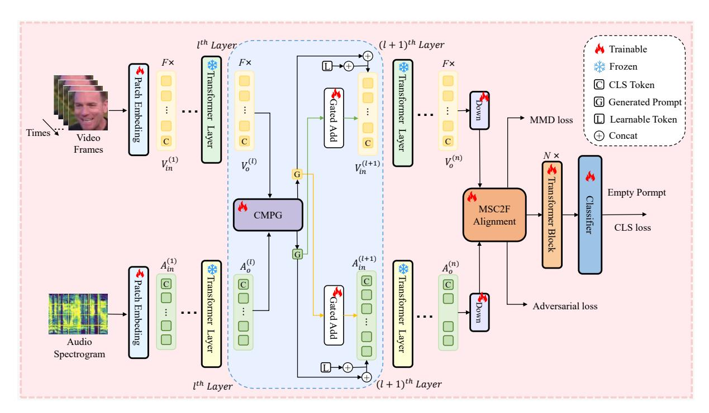
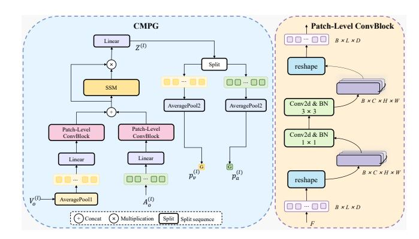
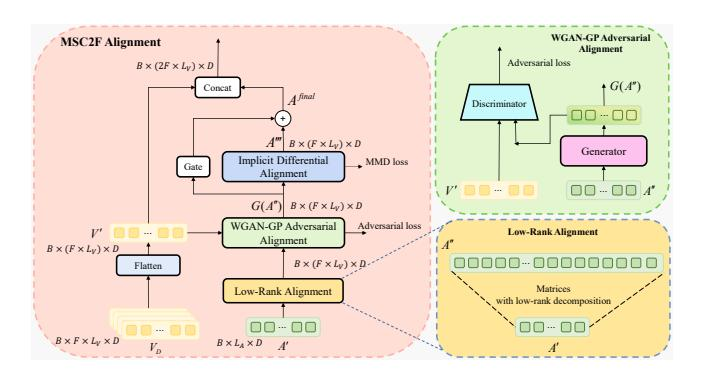
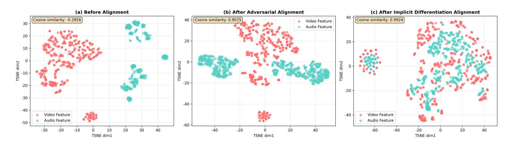

# BHGap: A Deep Iterative Prompting and Multi-stage Alignment Framework for Dynamic Facial Expression Recognition

Yichi Zhang

Shanghai Key Laboratory of Trustworthy Computing East China Normal University Shanghai, China 51285902110@stu.ecnu.edu.cn

Yunqi Han

Shanghai Key Laboratory of Trustworthy Computing East China Normal University Shanghai, China 51275902170@stu.ecnu.edu.cn

Jiayue Ding

Shanghai Key Laboratory of Trustworthy Computing East China Normal University Shanghai, China 51285902128@stu.ecnu.edu.cn

Liangyu Chen∗

Shanghai Key Laboratory of Trustworthy Computing East China Normal University Shanghai, China lychen@sei.ecnu.edu.cn

# Abstract

Dynamic Facial Expression Recognition (DFER), as a crucial part of affective computing, has broad applications in many areas such as human-computer interaction and social media content analysis. Effectively integrating multimodal information, particularly audio-visual signals, remains the core challenge. However, existing approaches are generally constrained by two major challenges: (1) shallow and static fusion mechanisms, which fail to capture the dynamic co-evolution of audio-visual features during deep interaction; (2) implicit and coarse alignment strategies, which are insufficient to bridge the modality gap caused by heterogeneous feature distributions. To address these issues, we propose a novel framework, BHGap, which integrates deep iterative prompt generation with multi-stage feature alignment and fusion. The key idea is to reformulate audio-visual collaboration from a one-shot fusion event into a continuous, reciprocal generation process that spans every layer of frozen backbone encoders. Specifically, we design a State Space Model (SSM)-based cross-modal prompt generator that dynamically produces "guidance prompts" for the counterpart modality at each encoding layer, thereby enabling deep and fine-grained feature coevolution. Beyond encoding, we further introduce a coarse-to-fine multi-stage alignment module: at the macro level, low-rank adversarial alignment is employed to establish spatio-temporal congruity between audio and video while reducing global distributional discrepancies; at the micro level, Maximum Mean Discrepancy (MMD) constraints combined with implicit differentiation optimization ensure fine-grained statistical consistency and semantic alignment. Extensive experiments on the public DFEW and MAFW datasets demonstrate that our method achieves state-of-the-art performance, offering a new paradigm of deep iterative fusion and explicit alignment for multimodal emotion recognition. Code is available at [https://github.com/NDYZD666/-public-BHGap.](https://github.com/NDYZD666/-public-BHGap)

∗Corresponding author.

© 2026 Copyright held by the owner/author(s). ACM ISBN 979-8-4007-2307-0/2026/04 <https://doi.org/10.1145/3774904.3792417>

# CCS Concepts

• Computing methodologies → Artificial intelligence; • Information systems → Multimedia and multimodal retrieval.

# Keywords

Dynamic Facial Expression Recognition, Audio-Visual Emotion Recognition, Multimodal Learning, Modality Alignment

#### ACM Reference Format:

Yichi Zhang, Yunqi Han, Jiayue Ding, and Liangyu Chen. 2026. BHGap: A Deep Iterative Prompting and Multi-stage Alignment Framework for Dynamic Facial Expression Recognition. In Proceedings of the ACM Web Conference 2026 (WWW '26), April 13–17, 2026, Dubai, United Arab Emirates. ACM, New York, NY, USA, [12](#page-11-0) pages.<https://doi.org/10.1145/3774904.3792417>

# 1 Introduction

Dynamic Facial Expression Recognition (DFER) has evolved from static facial expression recognition to complex emotional states conveyed through human facial dynamics in video sequences. This task is of great significance across diverse applications, including mental health assessment [\[15\]](#page-8-0), web-based social media content analysis [\[11\]](#page-8-1), intelligent education [\[17\]](#page-8-2), and human-computer interaction [\[26\]](#page-8-3). Early studies primarily leveraged the intuitively visual properties of the DFER task, exploring approaches that extended from "static" images to "dynamic" sequences, and achieved promising results [\[41\]](#page-8-4). More recently, a growing body of research has highlighted that emotional expression in real-world contexts is inherently multimodal [\[21\]](#page-8-5), typically manifested not only through facial muscle movements but also through auditory cues such as prosody and intonation. As a result, audio-visual emotion recognition (AVER) has emerged as a mainstream paradigm, where the effective integration of audio and visual modalities has become a core driving force for achieving good DFER systems.

However, achieving effective audio-visual synergy remains challenging due to the inherent modality gap. Visual signals are spatially dense pixel representations, whereas auditory signals are temporally dense feature sequences, making naive fusion strategies inadequate. Simple concatenation or shallow fusion often fails to capture deep semantic correlations and may even degrade performance due to modality conflicts. Existing fusion methods are

[This work is licensed under a Creative Commons Attribution 4.0 International License.](https://creativecommons.org/licenses/by/4.0) WWW '26, Dubai, United Arab Emirates

typically categorized into early, late, and hybrid fusion [\[2\]](#page-8-6). Early fusion integrates low-level features but is susceptible to heterogeneity and noise amplification [\[28\]](#page-8-7). Late fusion operates at the decision level but neglects intermediate cross-modal interactions [\[1\]](#page-8-8). Hybrid fusion methods introduce interactions via concatenation or crossattention [\[33\]](#page-8-9), yet these "one-shot" static paradigms are insufficient for modeling continuous and fine-grained multimodal cooperation. Moreover, most existing approaches rely on implicit alignment driven solely by the final classification loss [\[25,](#page-8-10) [38\]](#page-8-11), which often leads to suboptimal solutions. Furthermore, most existing models rely on implicit alignment driven by the final classification loss [\[25,](#page-8-10) [38\]](#page-8-11). This constraint often traps models in suboptimal solutions. In summary, three bottlenecks in current audio-visual recognition research are concluded: (1) Shallow and static fusion mechanisms — lacking deep, dynamic interactions throughout the feature extraction process. (2) Implicit and coarse alignment strategies — unable to explicitly bridge cross-modal feature distributions and guarantee fine-grained semantic consistency. (3) Insufficient spatio-temporal synergy modeling — ineffective in capturing joint temporal-spatial correspondences and co-evolution across modalities.

To address these challenges, we propose a novel framework BHGap, that integrates Deep Iterative Prompt Generation with Multi-Stage Feature Alignment. The central idea is to transform cross-modal synergy from a one-time fusion event into a continuous, mutually guided generation process spanning every layer of the audio and visual encoders. Moreover, prior to the final classification stage, we introduce a carefully designed coarse-to-fine alignment module that explicitly calibrates the feature distributions of both modalities. Specifically, to address the insufficiency of cross-modal interactions and the limitations of static fusion, for deep dynamic fusion, we design an innovative layer-wise iterative prompt generator embedded after each Transformer block of the frozen audio-visual encoders. Leveraging the strong sequence modeling capacity of State Space Model (SSM) [\[14\]](#page-8-12), the generator produces guidance prompts tailored to each modality, informed by the complementary modality. This iterative process establishes a tightly coupled "dialogue" mechanism that enables mutual learning through recurrent feedback across layers. We propose a two-stage strategy that simultaneously tackles the problem of multimodal spatio-temporal cooperative modeling and achieves explicit finegrained cross-modal alignment to eliminate modality gaps. In the first stage, a low-rank adversarial training mechanism enforces macro-level spatio-temporal congruity between video and audio modalities; in the second stage, implicit differentiation with Maximum Mean Discrepancy (MMD) [\[13\]](#page-8-13) loss further narrows the feature gap at the statistical moment level, ensuring semantic consistency.

The main contributions of this paper are as follows:

- To overcome the limitations of shallow and insufficiency of cross-modal interactions, we propose an SSM-based deep iterative cross-modal co-evolution framework (SDIC) embedded throughout the feature extraction process. By dynamically generating cross-modal prompts at each encoder layer, our approach transforms the conventional shallow, static

fusion paradigm into a deep, dynamic, and fine-grained coevolution paradigm.

- We design a multi-stage, coarse-to-fine alignment module (MSC2F) that innovatively combines adversarial alignment with implicit differentiation. By leveraging low-rank transformations and MMD loss, this module achieves dual alignment at both macro distribution and micro statistical levels, effectively bridging the modality gap.
- To the best of our knowledge, we are the first to introduce SSM into cross-modal guidance generation, providing an efficient and effective architecture for handling multimodal interactions.
- Extensive experiments conducted on the DFEW and MAFW datasets demonstrate that our model achieves state-of-theart performance, validating the effectiveness of our proposed framework.

The structure of this paper is arranged as follows. Section 2 reviews related work on DFER. Section 3 details our model BHGap. Section 4 shows the experiments and the results. Section 5 is the conclusion. The technical details of SDIC and MSC2F, as well as the model hyperparameter experiments, are presented in the Appendix section.

# 2 Related Work

Multimodal Dynamic Facial Expression Recognition. Human emotional expressions are inherently multimodal, involving both facial movements and vocal cues. Consequently, recent DFER studies have shifted from unimodal video inputs to multimodal frameworks, such as audio-visual emotion recognition [\[40\]](#page-8-14). A central challenge is the effective integration of heterogeneous modalities, and existing methods are generally categorized into early fusion, late fusion, and hybrid fusion.

Early fusion combines multimodal features at the input level. For example, MV-LSTM [\[30\]](#page-8-15) concatenates raw features, while TFN [\[39\]](#page-8-16) models interactions via tensor fusion. Despite their simplicity, these methods often suffer from modality interference caused by structural and distributional discrepancies.

Late fusion independently processes each modality and integrates high-level representations. Representative approaches include T-ESFL [\[25\]](#page-8-10), which concatenates features; AMH [\[38\]](#page-8-11), which employs cross-modal attention; and CLIP-based models [\[29\]](#page-8-17), such as DFER-CLIP [\[42\]](#page-8-18), which aligns visual and textual features via contrastive learning. While alleviating low-level incompatibility, these methods typically overlook deeper semantic interactions.

Hybrid fusion introduces cross-modal interactions during feature extraction. Methods such as TMEP [\[40\]](#page-8-14) adopt layer-wise crossmodal attention, and MMA-DFER [\[7\]](#page-8-19) employs a bottleneck-based interaction mechanism. Although hybrid approaches better capture complementary information, most rely on static or coarse interactions, limiting their ability to model dynamic synergy and finegrained correspondences, and may even suppress weaker modalities.

These limitations are closely related to the modality gap problem. In AVER tasks, visual features emphasize spatial structures, whereas auditory features focus on temporal and spectral patterns, leading

to substantial distributional and semantic discrepancies. Many studies rely on implicit alignment through classification loss, resulting in pseudo-alignment dominated by information-rich modalities. Inspired by CLIP, methods such as CLIPER [\[23\]](#page-8-20), DK-CLIP [\[24\]](#page-8-21), and DFER-CLIP [\[42\]](#page-8-18) employ contrastive learning for semantic alignment, while HiCMAE [\[32\]](#page-8-22) further introduces hierarchical alignment from low- to high-level features. Nevertheless, most approaches remain limited to global alignment and neglect fine-grained spatiotemporal correspondences, which are critical for distinguishing subtle expressions in DFER.

Temporal Modeling in Dynamic Facial Expression Recognition. DFER extends static facial expression recognition from single images to continuous video sequences, introducing the temporal dimension into emotion recognition and making temporal modeling a core research problem.

Early studies commonly employed recurrent neural networks (RNNs, LSTMs) to model temporal dependencies, but these approaches suffer from gradient vanishing and limited efficiency. The advent of the Transformer has largely mitigated these issues. Representative methods such as Former-DFER [\[41\]](#page-8-4), DFER-CLIP [\[42\]](#page-8-18), and MMA-DFER [\[7\]](#page-8-19) leverage Transformer architectures for effective temporal modeling. Other works, including M3DFEL [\[34\]](#page-8-23) and DK-CLIP [\[24\]](#page-8-21), decompose frame sequences and apply local and global temporal attention, while FineCLIPER [\[4\]](#page-8-24) introduces temporal adapters into frozen pretrained encoders. Additionally, selfsupervised approaches such as MAE-DFER [\[31\]](#page-8-25) employ temporal masking to learn spatio-temporal representations.

Nevertheless, many existing methods still model temporal and spatial features independently, limiting their ability to capture the continuity and co-evolution of emotions, which are inherently influenced by dynamic dependencies across adjacent time steps.

### 3 Methodology

# 3.1 Problem Formulation

Given a video segment V containing �� ordered frames and its corresponding audio spectrogram A, each annotated with an emotion label �� ∈ {1, 2, . . . , ��}, the goal of DFER is to learn a mapping function F�� such that:

F�� : (A, V) → ��, (1)

where �� denotes the model parameters, and �� is the total number of emotion categories. This task requires joint representation learning over heterogeneous modalities under spatio-temporal constraints, aiming at accurate emotion recognition.

# 3.2 Model Overview

This section presents an overview of our BHGap model, a novel multimodal audio-visual emotion recognition framework tailored for the DFER task. As illustrated in Fig. [1,](#page-3-0) BHGap consists of three components: (1) Frozen Audio-Visual Backbone Encoders (Section [3.3\)](#page-2-0), which independently extract modality-specific features for audio and video inputs; (2) SSM-based Deep Iterative Crossmodal Co-evolution Framework (SDIC) (Section [3.4\)](#page-2-1), which facilitates dynamic, fine-grained co-evolution between modalities; (3) Multi-Stage Coarse-to-Fine Feature Alignment (MSC2F) (Section [3.5\)](#page-3-1), designed to mitigate the heterogeneity gap during

fusion. The video and audio features are first fed into their respective frozen encoders for feature extraction. Through the SDIP module, interactive co-learning and domain transfer are performed at each encoder layer. The output features from the dual-branch encoders are then passed into the MSC2F module for cross-modal alignment, which further eliminates modality discrepancies. After alignment, the multimodal features are integrated within a stack of Transformer layers for deep feature fusion. Finally, the fused representation is fed into a classifier to produce the recognition results. Audio-Visual Backbone Encoders, SDIC, and MSC2F are expanded in Sections [3.3,](#page-2-0) [3.4,](#page-2-1) and [3.5,](#page-3-1) respectively. The loss functions of the proposed model will be detailed in Section [3.6.](#page-4-0)

# 3.3 Audio-Visual Backbone Encoders

Since the Vision Transformer (ViT) architecture has demonstrated strong generalization across both visual and auditory classification tasks, our framework adopts two independent, pre-trained ViT models as frozen backbones for video and audio modalities, respectively. The video input V ∈ R ��×�� ×���� ×���� and the audio input A ∈ R ��×����×���� are embedded into modality-specific sequences, where �� is the batch size, �� is the frame count, ���� and ���� are the sequence lengths for video patches and audio spectrogram tokens, and ����, ���� are the corresponding feature dimensions.

Considering that DFER datasets are typically limited in scale and exhibit noise, inspired by prior works such as S2D [\[5\]](#page-8-26) and MMA-DFER [\[7\]](#page-8-19), we select the approach of leveraging ViT [\[9\]](#page-8-27) pre-trained on large-scale datasets from domains closely related to DFER, followed by transfer learning through fine-tuning on the DFER dataset. For simplicity, we employ the pre-trained weights from MAE-Face [\[27\]](#page-8-28) and AudioMAE [\[18\]](#page-8-29) to initialize the visual and audio encoders, respectively. The potential of other, more powerful pre-training models can be explored in subsequent work. Importantly, all parameters of the backbone encoders remain frozen during training.

This design ensures that BHGap leverages robust and transferable pre-trained features, allowing the subsequent modules to concentrate on fine-grained cross-modal interaction and feature alignment, rather than re-learning modality-specific representations from limited DFER data.

### 3.4 SSM-based Deep Iterative Co-evolution (SDIC)

Conventional audio-visual models often adopt static fusion strategies, such as concatenating features or applying cross-attention only at the top layers of the encoders. However, these models overlook the necessity of cross-modal information exchange during the deeper stages of feature extraction. In contrast, emotional perception is a dynamic process where visual and auditory cues continuously influence and co-evolve with each other over time.

To emulate this dynamic process, we design a fine-grained deep iterative co-evolution framework, whose core is a Cross-Modal Prompt Generator (CMPG) based on SSM [\[14\]](#page-8-12), embedded between each pair of consecutive layers of the frozen backbone encoders. This framework transforms cross-modal fusion from a one-time operation into a continuous, mutually guided generative process across all encoder layers. Specifically, instead of directly passing the output of the ℓ-th encoder layer into the (ℓ +1)-th layer, the feature

Table 1: Performance comparison on the DFEW dataset. The best results are highlighted in bold, and the runner-up results are underlined. The symbol "-" indicates that the original result was not reported or could not be reproduced. The acronyms V, A, and T denote the Visual, Audio, and Text modalities, respectively.

| Methods            | Venues                 | Modalities | Hap.  | Sad   | Accuracy Neu. | of Each Ang. | Emotion(%) Sur. | Dis.  | Fea.  | WAR   | Metrics(%) UAR |
|--------------------|------------------------|------------|-------|-------|---------------|--------------|-----------------|-------|-------|-------|----------------|
| IAL [22]           | AAAI 2023              | V          | 87.95 | 67.21 | 70.10         | 76.06        | 62.22           | 0.00  | 36.44 | 69.24 | 55.71          |
| M3DFEL [34]        | CVPR 2023              | V          | 89.59 | 68.38 | 67.88         | 74.24        | 59.69           | 0.00  | 31.63 | 69.25 | 56.10          |
| MAE-DFER [31]      | ACM MM 2023            | V          | 92.92 | 77.46 | 74.56         | 76.94        | 60.99           | 18.62 | 42.35 | 74.43 | 63.41          |
| S2D [5]            | Affective Comput. 2024 | V          | 93.87 | 83.25 | 75.31         | 84.19        | 64.33           | 0.00  | 37.07 | 75.98 | 62.57          |
| HDF [8]            | ACM MM 2025            | V          | 89.67 | 71.20 | 67.42         | 73.03        | 64.44           | 12.41 | 41.63 | 71.60 | 60.40          |
| ViT_LSTM+D2SP [35] | CVPR 2025              | V          |       |       |               |              |                 |       |       | 69.20 | 55.61          |
| DFER-CLIP [42]     | BMVC 2023              | V+T        | 91.12 | 75.34 | 71.15         | 74.09        | 56.30           | 11.72 | 37.81 | 71.25 | 59.61          |
| EmoCLIP [10]       | FG 2024                | V+T        |       |       |               |              |                 |       |       | 62.12 | 58.04          |
| DK-CLIP [24]       | ACM MM 2024            | V+T        | 94.61 | 76.19 | 75.06         | 78.65        | 63.61           | 23.60 | 42.63 | 75.41 | 64.95          |
| FineCLIPER [4]     | ACM MM 2024            | V+T        | 93.95 | 83.92 | 76.24         | 84.23        | 64.35           | 20.47 | 38.72 | 76.21 | 65.98          |
| TMEP [40]          | TCSVT 2023             | V+A        |       |       |               |              |                 |       |       | 68.85 | 57.16          |
| HiCMAE-S [32]      | INFORM FUSION 2024     | V+A        |       |       |               |              |                 |       |       | 74.33 | 63.05          |
| HiCMAE-B [32]      | INFORM FUSION 2024     | V+A        |       |       |               |              |                 |       |       | 75.01 | 63.76          |
| MMA-DFER [7]       | CVPR 2024              | V+A        |       |       |               |              |                 |       |       | 77.51 | 67.01          |
| AVF-MAE++(B) [36]  | CVPR 2025              | V+A        |       |       |               |              |                 |       |       | 75.42 | 63.74          |
| AVF-MAE++(L) [36]  | CVPR 2025              | V+A        |       |       |               |              |                 |       |       | 76.24 | 65.14          |
| VAEmo [6]          | arXiv 2025             | V+A        |       |       |               |              |                 |       |       | 75.78 | 64.02          |
| BHGap(ours)        |                        | V+A        | 95.46 | 82.47 | 77.51         | 81.59        | 67.45           | 28.96 | 49.57 | 78.80 | 69.03          |

### 4 Experiments

In this section, we conduct experiments to assess the performance of our model in the task of DFER. Specifically, we aim to answer the following three research questions:

- RQ1: How does the method proposed in this study perform on the main multimodal DFER datasets?
- RQ2: What influences do various core modules exert on the overall performance of the model?
- RQ3: How do the key hyperparameters in the model impact its performance?

# 4.1 Datasets

Following prior studies, two widely used datasets, DFEW [\[20\]](#page-8-37) and MAFW [\[25\]](#page-8-10), are selected for evaluation. Both are collected from real-world Web videos across different countries and contain rich environmental interference, making them highly challenging benchmarks. Their basic information is listed as follows.

- DFEW consists of 16,372 video-audio clips, covering 7 basic emotion categories: happiness, sadness, anger, neutral, surprise, disgust, and fear.
- MAFW contains 10,045 video-audio clips with annotations for 11 more fine-grained emotion categories, including anger, disgust, fear, happiness, neutral, sadness, surprise, contempt, anxiety, and helplessness.

# 4.2 Evaluation Metrics

We adopt Weighted Average Recall (WAR) and Unweighted Average Recall (UAR) as metrics, consistent with the dataset benchmarks. We adopted the definitions of these two metrics in accordance with

prior work [\[20,](#page-8-37) [25\]](#page-8-10). The detailed setup of the experiments can be found in [Appendix C: Experimental Setup](#page-10-0).

# 4.3 Results and Analysis

### 4.3.1 Performance Comparison (RQ1).

Results on the DFEW dataset. Table [1](#page-5-0) reports the comparison results on DFEW. BHGap consistently outperforms existing approaches in both WAR and UAR. Specifically, compared with the previous best multimodal model MMA-DFER, BHGap achieves improvements of +1.3% WAR and +2.0% UAR. Compared with the strongest vision-text model FineCLIPER, BHGap gains +2.6% WAR and +3.0% UAR. Compared with visual-only methods, our approach achieves even larger margins, demonstrating the necessity of leveraging the audio modality.

It is noteworthy that some competing methods, such as VAEmo and FineCLIPER, additionally employ MLLMs for video understanding and auxiliary descriptions, while others, like FineCLIPER and S2D, rely on external visual models for landmark detection. In contrast, BHGap operates solely on raw audio-visual inputs yet achieves state-of-the-art performance.

We also report class-wise recognition accuracy. For low-resource categories such as Disgust (1.22% samples) and Fear (8.14% samples), where prior methods suffer from poor recognition (sometimes near-zero accuracy), BHGap improves accuracy by +3.2% and +6% , respectively, compared to the second-best method, demonstrating stronger learning and representational capability in imbalanced settings.

Results on the MAFW dataset. As shown in Table [2,](#page-6-0) BHGap again outperforms all competitors. Compared with VAEmo, the previous best multimodal model, BHGap improves WAR and UAR by +1% and +2%, respectively. Given that MAFW contains more

Table 2: Performance comparison on the MAFW dataset.

|               |      |            |       | Metrics(%) |
|---------------|------|------------|-------|------------|
| Methods       |      | Modalities | WAR   | UAR        |
| Former-DFER   | [41] | V          | 43.27 | 31.16      |
| MAE-DFER      | [31] | V          | 54.31 | 41.62      |
| S2D           | [5]  | V          | 57.37 | 43.40      |
| ViT_LSTM+D2SP | [35] | V          | 42.58 | 29.85      |
| DFER-CLIP     | [42] | V+T        | 52.55 | 39.89      |
| EmoCLIP       | [10] | V+T        | 41.46 | 34.24      |
| DK-CLIP       | [24] | V+T        | 56.56 | 43.01      |
| FineCLIPER    | [4]  | V+T        | 56.91 | 45.01      |
| T-ESFL        | [25] | V+A        | 48.18 | 33.35      |
| TMEP          | [40] | V+A        | 51.15 | 37.17      |
| HiCMAE-S      | [32] | V+A        | 54.45 | 41.66      |
| HiCMAE-B      | [32] | V+A        | 56.17 | 42.65      |
| MMA-DFER      | [7]  | V+A        | 58.52 | 44.11      |
| AVF-MAE++(B)  | [36] | V+A        | 57.50 | 43.10      |
| AVF-MAE++(L)  | [36] | V+A        | 59.13 | 45.36      |
| VAEmo         | [6]  | V+A        | 58.91 | 45.67      |
| BHGap(ours)   |      | V+A        | 59.97 | 47.68      |

fine-grained categories (11 emotions), these results confirm the superior generalization ability of BHGap across diverse emotion categories.

#### 4.3.2 Ablation Study (RQ2).

Table [3](#page-6-1) reports the results of ablation on each module: SDIC (SSMbased deep iterative co-evolution strategy), LRA (Low-rank adversarial alignment), IDA (MMD-driven implicit differentiation alignment), and Fusion network (Transformer stack).

It can be observed that, among all modules, the fusion network exerts the most significant impact on the overall model. When the fusion module is removed, the performance drops below that of certain unimodal models. This is attributed to the fact that the final fusion network serves as the core of the multimodal framework, facilitating large-scale interaction and integration of audio-visual features. Furthermore, we observe that removing all cross-modal alignment strategies (Model G) leads to a considerable decline in performance. This underscores that heterogeneous modalities exhibit inherent feature distribution discrepancies and semantic disparities. Direct large-scale feature fusion without alignment often fails to leverage the strengths of each modality and may even introduce interference between differently structured features.

Adding either LRA or IDA to Model G improves cross-modal alignment quality to some extent, yielding noticeable performance gains. Moreover, based on the results of Models A, B, and C, it is evident that incorporating only the SDIC strategy—even in the absence of any multimodal alignment or fusion structures—still brings about an approximate 2.0+% improvement over the baseline. This can be attributed to SDIC's cross-modal prompting and interaction mechanism, which enables a certain degree of multimodal information exchange and supports adaptive transfer from pre-training data to the target dataset, thereby enhancing suitability for the audio-visual emotion recognition task. A slight performance drop is observed when SDIC is ablated, further validating the necessity of

Table 3: Ablation study on different modules.

| Models | SDIC LRA | IDA Fusion | WAR(%) | UAR(%) |
|--------|----------|------------|--------|--------|
| A      | × ×      | × ×        | 72.34  | 59.43  |
| B      |  ×      | × ×        | 74.52  | 62.01  |
| C      | ×       |          | 78.30  | 68.11  |
| D      |        | ×         | 78.21  | 68.27  |
| E      |  ×      |          | 78.03  | 68.15  |
| F      |  ×      | ×         | 77.57  | 67.12  |
| G      |        |  ×        | 74.99  | 62.55  |
| H      |        |          | 78.80  | 69.03  |

Table 4: Comparison of different prompting methods.

early-stage shallow interaction in multimodal emotion recognition.

Comparison of Prompting Methods. We further investigate different prompting strategies. For fair comparison, all methods were evaluated on DFEW Fold1 under identical conditions. To better isolate the effect of prompting, all approaches employed the same backbone network with fixed pre-trained weights, excluded any cross-modal alignment structures, and fused features from different modalities solely via simple averaging. Detailed results are presented in Table [4.](#page-6-2)

Specifically, ILM-VP fine-tunes the model by adding "small patches" to the original input images; Mona is a plug-and-play fine-tuning domain adaptation adapter inserted into frozen Transformer layers for tuning; MMA-DFER employs a progressive prompting strategy combined with a Bottleneck structure for fine-tuning and crossmodal interaction; SDIC w/o CMPG ablates the cross-modal prompt generator at each layer from the current model, effectively reducing it to the classical VPT (Visual Prompt Tuning) [\[19\]](#page-8-40) approach.

As shown in Table [4,](#page-6-2) methods enabling layer-wise cross-modal interaction consistently outperform those without information flow (ILM-VP, Mona, SDIC w/o CMPG). This confirms the importance of deep iterative cross-modal co-evolution. This underscores the importance of deep, iterative multimodal co-evolution in audiovisual Dynamic Facial Expression Recognition (DFER) tasks, which facilitates collaborative learning between the auditory and visual modalities. Although MMA-DFER incorporates layer-wise interaction via a Bottleneck structure, it simply adds large volumes of cross-modal features to the current modality's features without adequately addressing the challenge of heterogeneous modality alignment. This likely contributes to its suboptimal performance. Further Analysis of Alignment Modules. To more intuitively examine the effectiveness of our proposed multi-stage multimodal feature alignment strategy, we visualize the feature distributions using a representative example from the happy expression category,

Figure 4: t-SNE visual analysis of multi-stage alignment strategies. Red represents video features, green represents audio features, and the top left corner of each figure shows the cosine similarity between the two modalities. (a) Features after encoder feature extraction and before modal alignment. (b) Features after the low-rank adversarial alignment module. (c) The aligned features. MSC2F obviously narrows the distance between modalities, reduces the difference between modalities, and increases the fine-grained semantic consistency of the two modalities.

while other emotion categories exhibit consistent trends. Specifically, we perform a t-SNE dimensionality reduction on features from different stages of the BHGap and measure the semantic consistency between the two modalities using cosine similarity. Fig. [4\(](#page-7-0)a) shows the feature distributions of the audio and video modalities before alignment, where the two modalities are clearly separated in the shared space and even demonstrate a negative cosine correlation, indicating that early fusion may introduce mutual interference. Fig. [4\(](#page-7-0)b) illustrates the distributions after Low-Rank Adversarial alignment, in which the macro-level calibration substantially reduces the modality gap and leads to highly consistent semantic representations. Fig. [4\(](#page-7-0)c) presents the final aligned features, where both modalities are closely clustered within the same semantic space, reflecting strong cross-modal compatibility. Notably, although cosine similarity is not explicitly optimized as a loss function, our multi-stage alignment framework effectively calibrates semantic consistency and significantly mitigates the discrepancy between audio and video modalities.

We further examine the effects of the residual gating mechanism and Low-Rank Spatio-Temporal Transformation (LowRank-STT) in the MSC2F module. As shown in Table [5,](#page-7-1) removing the residual gate results in purely sequential alignment, where audio features overfit video features under MMD-driven implicit alignment, losing modality-specific characteristics, particularly distinctive emotional cues. Retaining the residual connection propagates coarse-aligned audio features and preserves modality uniqueness. We also observe performance drops in WAR and UAR when LowRank-STT is ablated, as this component aligns audio sequence length with video features that merge spatial and temporal dimensions. Without it, audio sequences become much shorter, compressing temporal information and impairing the ability to capture subtle emotional dynamics, ultimately degrading recognition accuracy.

### 4.3.3 Hyperparameter Test (RQ3).

In our experiments concerning hyperparameters, we investigated the effects of the following aspects on the results: (1) the method of multimodal aggregation, (2) the number of randomly sampled

Table 5: Ablation of low-rank spatio-temporal transformation and gating strategy in MSC2F.

points used for approximating the MMD loss, (3) the dimensionality of the hidden space for multimodal alignment and fusion, (4) the rank of the low-rank matrices in the low-rank spatiotemporal transformation, and (5) the number of layers in the stacked Transformer blocks for multimodal fusion. Through comprehensive hyperparameter experiments, we identify the optimal model and experimental configuration. Detailed experimental results and analysis are provided in [Appendix D: Hyperparameter Analysis](#page-10-1).

#### 5 Conclusion

Dynamic facial expression recognition (DFER) plays an important role in media content mining and human–computer interaction. In this work, we propose BHGap, a novel framework that addresses key challenges in DFER by emphasizing shallow cross-modal interactions and integrating deep iterative prompt generation with a multi-stage coarse-to-fine alignment strategy. An SSM-based crossmodal prompt generator enables dynamic and fine-grained cooperative learning between audio-visual features, while the alignment module explicitly bridges the modality gap at both macro and micro levels. Extensive experiments on the DFEW and MAFW datasets demonstrate the effectiveness of our framework and its state-of-theart performance. Future work will explore extending this paradigm to other multimodal affective computing tasks and broader multimodal scenarios.

# 6 Acknowledgements

This work was supported by NSFC (No. 62272416), and National Education Sciences Planning Project (No. BCA240048).

### References

[1] Pradeep K Atrey, M Anwar Hossain, Abdulmotaleb El Saddik, and Mohan S Kankanhalli. 2010. Multimodal fusion for multimedia analysis: a survey. Multimedia Systems 16, 6 (2010), 345–379. [2] Tadas Baltrušaitis, Chaitanya Ahuja, and Louis-Philippe Morency. 2018. Multimodal machine learning: A survey and taxonomy. IEEE Transactions on Pattern Analysis and Machine Intelligence 41, 2 (2018), 423–443. [3] Aochuan Chen, Yuguang Yao, Pin-Yu Chen, Yihua Zhang, and Sijia Liu. 2023. Understanding and improving visual prompting: A label-mapping perspective. In Proceedings of the 2023 IEEE/CVF Conference on Computer Vision and Pattern Recognition. 19133–19143. [4] Haodong Chen, Haojian Huang, Junhao Dong, Mingzhe Zheng, and Dian Shao. 2024. Finecliper: Multi-modal fine-grained clip for dynamic facial expression recognition with adapters. In Proceedings of the 32nd ACM International Conference on Multimedia. 2301–2310. [5] Yin Chen, Jia Li, Shiguang Shan, Meng Wang, and Richang Hong. 2024. From static to dynamic: Adapting landmark-aware image models for facial expression recognition in videos. IEEE Transactions on Affective Computing 16, 2 (2024), 624–638. [6] Hao Cheng, Zhiwei Zhao, Yichao He, Zhenzhen Hu, Jia Li, Meng Wang, and Richang Hong. 2025. VAEmo: Efficient Representation Learning for Visual-Audio Emotion with Knowledge Injection. arXiv preprint arXiv:2505.02331 (2025). [7] Kateryna Chumachenko, Alexandros Iosifidis, and Moncef Gabbouj. 2024. MMA-DFER: MultiModal Adaptation of unimodal models for Dynamic Facial Expression Recognition in-the-wild. In Proceedings of the 2024 IEEE/CVF Conference on Computer Vision and Pattern Recognition. 4673–4682. [8] Feng-Qi Cui, Anyang Tong, Jinyang Huang, Jie Zhang, Dan Guo, Zhi Liu, and Meng Wang. 2025. Learning from heterogeneity: Generalizing dynamic facial expression recognition via distributionally robust optimization. arXiv preprint arXiv:2507.15765 (2025). [9] Alexey Dosovitskiy, Lucas Beyer, Alexander Kolesnikov, Dirk Weissenborn, Xiaohua Zhai, Thomas Unterthiner, Mostafa Dehghani, Matthias Minderer, Georg Heigold, Sylvain Gelly, et al. 2020. An image is worth 16x16 words: Transformers for image recognition at scale. arXiv preprint arXiv:2010.11929 (2020). [10] Niki Maria Foteinopoulou and Ioannis Patras. 2024. Emoclip: A vision-language method for zero-shot video facial expression recognition. In Proceedings of the 18th International Conference on Automatic Face and Gesture Recognition. 1–10. [11] Bharat Gaind, Varun Syal, and Sneha Padgalwar. 2019. Emotion detection and analysis on social media. arXiv preprint arXiv:1901.08458 (2019). [12] Jonathan Gillard and Konstantin Usevich. 2022. Hankel low-rank approximation and completion in time series analysis and forecasting: a brief review. arXiv preprint arXiv:2206.05103 (2022). [13] Arthur Gretton, Karsten M Borgwardt, Malte J Rasch, Bernhard Schölkopf, and Alexander Smola. 2012. A kernel two-sample test. The Journal of Machine Learning Research 13, 1 (2012), 723–773. [14] Albert Gu and Tri Dao. 2023. Mamba: Linear-time sequence modeling with selective state spaces. arXiv preprint arXiv:2312.00752 (2023). [15] Yu Gu, Xiang Zhang, Huan Yan, Jingyang Huang, Zhi Liu, Mianxiong Dong, and Fuji Ren. 2023. WiFE: WiFi and vision based unobtrusive emotion recognition via gesture and facial expression. IEEE Transactions on Affective Computing 14, 4 (2023), 2567–2581. [16] Ishaan Gulrajani, Faruk Ahmed, Martin Arjovsky, Vincent Dumoulin, and Aaron C Courville. 2017. Improved training of wasserstein gans. In Proceedings of the 31st International Conference on Neural Information Processing Systems. 5769 – 5779. [17] Qiaoping Hu, Chuanneng Mei, Fei Jiang, Ruimin Shen, Yitian Zhang, Ce Wang, and Junpeng Zhang. 2020. RFAU: A database for facial action unit analysis in real classrooms. IEEE Transactions on Affective Computing 13, 3 (2020), 1452–1465. [18] Po-Yao Huang, Hu Xu, Juncheng Li, Alexei Baevski, Michael Auli, Wojciech Galuba, Florian Metze, and Christoph Feichtenhofer. 2022. Masked autoencoders that listen. In Proceedings of the 36th International Conference on Neural Information Processing System. 28708–28720. [19] Menglin Jia, Luming Tang, Bor-Chun Chen, Claire Cardie, Serge Belongie, Bharath Hariharan, and Ser-Nam Lim. 2022. Visual prompt tuning. In Proceedings of the 17th European Conference on Computer Vision. 709–727. [20] Xingxun Jiang, Yuan Zong, Wenming Zheng, Chuangao Tang, Wanchuang Xia, Cheng Lu, and Jiateng Liu. 2020. Dfew: A large-scale database for recognizing dynamic facial expressions in the wild. In Proceedings of the 28th ACM International Conference on Multimedia. 2881–2889. [21] Jean Kossaifi, Robert Walecki, Yannis Panagakis, Jie Shen, Maximilian Schmitt, Fabien Ringeval, Jing Han, Vedhas Pandit, Antoine Toisoul, Björn Schuller, et al. 2019. Sewa db: A rich database for audio-visual emotion and sentiment research in the wild. IEEE Transactions on Pattern Analysis and Machine Intelligence 43, 3 (2019), 1022–1040. [22] Hanting Li, Hongjing Niu, Zhaoqing Zhu, and Feng Zhao. 2023. Intensity-aware loss for dynamic facial expression recognition in the wild. In Proceedings of the 37th AAAI Conference on Artificial Intelligence. 67–75. [23] Hanting Li, Hongjing Niu, Zhaoqing Zhu, and Feng Zhao. 2024. Cliper: A unified vision-language framework for in-the-wild facial expression recognition. In Proceedings of the 2024 IEEE International Conference on Multimedia and Expo. 1–6. [24] Liupeng Li, Yuhua Zheng, Shupeng Liu, Xiaoyin Xu, and Taihao Li. 2024. Domain knowledge enhanced vision-language pretrained model for dynamic facial expression recognition. In Proceedings of the 32nd ACM International Conference on Multimedia. 5673–5682. [25] Yuanyuan Liu, Wei Dai, Chuanxu Feng, Wenbin Wang, Guanghao Yin, Jiabei Zeng, and Shiguang Shan. 2022. Mafw: A large-scale, multi-modal, compound affective database for dynamic facial expression recognition in the wild. In Proceedings of the 30th ACM International Conference on Multimedia. 24–32. [26] Zhentao Liu, Min Wu, Weihua Cao, Luefeng Chen, Jianping Xu, Ri Zhang, Mengtian Zhou, and Junwei Mao. 2017. A facial expression emotion recognition based human-robot interaction system. IEEE/CAA Journal of Automatica Sinica 4, 4 (2017), 668–676. [27] Bowen Ma, Wei Zhang, Feng Qiu, and Yu Ding. 2023. A unified approach to facial affect analysis: the mae-face visual representation. In Proceedings of the 2023 IEEE/CVF Conference on Computer Vision and Pattern Recognition. 5924–5933. [28] Jiquan Ngiam, Aditya Khosla, Mingyu Kim, Juhan Nam, Honglak Lee, Andrew Y Ng, et al. 2011. Multimodal deep learning. In Proceedings of the 28th International Conference on Machine Learning. 689–696. [29] Alec Radford, Jong Wook Kim, Chris Hallacy, Aditya Ramesh, Gabriel Goh, Sandhini Agarwal, Girish Sastry, Amanda Askell, Pamela Mishkin, Jack Clark, et al. 2021. Learning transferable visual models from natural language supervision. In Proceedings of the 38th International Conference on Machine Learning. 8748– 8763. [30] Shyam Sundar Rajagopalan, Louis-Philippe Morency, Tadas Baltrusaitis, and Roland Goecke. 2016. Extending long short-term memory for multi-view structured learning. In Proceedings of the 14th European Conference on Computer Vision. 338–353. [31] Licai Sun, Zheng Lian, Bin Liu, and Jianhua Tao. 2023. Mae-dfer: Efficient masked autoencoder for self-supervised dynamic facial expression recognition. In Proceedings of the 31st ACM International Conference on Multimedia. 6110–6121. [32] Licai Sun, Zheng Lian, Bin Liu, and Jianhua Tao. 2024. Hicmae: Hierarchical contrastive masked autoencoder for self-supervised audio-visual emotion recognition. Information Fusion 108 (2024), 102382. [33] Yao-Hung Hubert Tsai, Shaojie Bai, Paul Pu Liang, J Zico Kolter, Louis-Philippe Morency, and Ruslan Salakhutdinov. 2019. Multimodal transformer for unaligned multimodal language sequences. In Proceedings of the 57th Annual Meeting of the Association for Computational Linguistics. 6558–6569. [34] Hanyang Wang, Bo Li, Shuang Wu, Siyuan Shen, Feng Liu, Shouhong Ding, and Aimin Zhou. 2023. Rethinking the learning paradigm for dynamic facial expression recognition. In Proceedings of the 2023 IEEE/CVF Conference on Computer Vision and Pattern Recognition. 17958–17968. [35] Haoran Wang, Xinji Mai, Zeng Tao, Xuan Tong, Junxiong Lin, Yan Wang, Jiawen Yu, Shaoqi Yan, Ziheng Zhou, and Wenqiang Zhang. 2025. D2SP: Dynamic Dual-Stage Purification Framework for Dual Noise Mitigation in Vision-based Affective Recognition.. In Proceedings of the 2025 IEEE/CVF Conference on Computer Vision and Pattern Recognition. 19218–19229. [36] Xuecheng Wu, Heli Sun, Yifan Wang, Jiayu Nie, Jie Zhang, Yabing Wang, Junxiao Xue, and Liang He. 2025. AVF-MAE++: Scaling Affective Video Facial Masked Autoencoders via Efficient Audio-Visual Self-Supervised Learning. In Proceedings of the 2025 IEEE/CVF Conference on Computer Vision and Pattern Recognition. 9142–9153. [37] Dongshuo Yin, Leiyi Hu, Bin Li, Youqun Zhang, and Xue Yang. 2025. 5%> 100%: Breaking performance shackles of full fine-tuning on visual recognition tasks. In Proceedings of the 2025 IEEE/CVF Conference on Computer Vision and Pattern Recognition. 20071–20081. [38] Seunghyun Yoon, Subhadeep Dey, Hwanhee Lee, and Kyomin Jung. 2020. Attentive modality hopping mechanism for speech emotion recognition. In Proceedings of the 2000 IEEE International Conference on Acoustics, Speech and Signal Processing. 3362–3366. [39] Amir Zadeh, Minghai Chen, Soujanya Poria, Erik Cambria, and Louis-Philippe Morency. 2017. Tensor fusion network for multimodal sentiment analysis. arXiv preprint arXiv:1707.07250 (2017). [40] Xiaoqin Zhang, Min Li, Sheng Lin, Hang Xu, and Guobao Xiao. 2023. Transformerbased multimodal emotional perception for dynamic facial expression recognition in the wild. IEEE Transactions on Circuits and Systems for Video Technology 34, 5 (2023), 3192–3203. [41] Zengqun Zhao and Qingshan Liu. 2021. Former-dfer: Dynamic facial expression recognition transformer. In Proceedings of the 29th ACM International Conference on Multimedia. 1553–1561. [42] Zengqun Zhao and Ioannis Patras. 2023. Prompting visual-language models for dynamic facial expression recognition. arXiv preprint arXiv:2308.13382 (2023).

# Appendix A : More Details of SDIC

Conventional audio-visual fusion models usually perform one-shot fusion (e.g., concatenation or top-layer cross-attention), neglecting deep-layer interactions. To emulate the natural co-evolution of human perceptual cues, our framework establishes a fine-grained deep iterative co-evolution mechanism, in which each layer of the frozen encoders exchanges information via a Cross-Modal Prompt Generator (CMPG) based on State Space Models (SSM).

#### A.1 Design Motivation

Since the Vision Transformer (ViT) flattens visual and audio spectrogram inputs into 1D patch sequences, it loses spatial locality. To restore local inductive bias before cross-modal dependency modeling, CMPG includes a Patch-Level ConvBlock, which reshapes the sequence into a pseudo-2D map, applies depthwise separable convolution (1×1 pointwise + 3×3 depthwise), and projects back to the original dimension. This produces locally enhanced features ��˜ (ℓ) and ��˜(ℓ) for each layer.

### A.2 State Space Modeling within CMPG

The enhanced features from both modalities are concatenated and fed into an SSM for long-range dependency modeling. The continuous form of SSM is:

¤ℎ(��) = ��ℎ(��) + ����(��), ��(��) = ��ℎ(��) + ����(��), (7)

where ��(��) denotes input sequence, ��(��) is the output, and �� represents the state transition matrix.

Through zero-order hold discretization, this model can be transformed into a discrete parallel form. We employ the selective scan mechanism of Mamba, where the transition matrix �� and step size Δ are dynamically generated based on the input, enabling the model to selectively attend to informative temporal segments while ignoring redundant ones. This ensures efficient sequence modeling and captures long-term dependencies critical for emotional co-evolution.

#### A.3 Role of CMPG in Iterative Co-evolution

The SSM output �� (ℓ) is decomposed into modality-specific guidance prompts �� (ℓ) �� and �� (ℓ) �� , which are injected into the next encoder layer to guide subsequent representations. Through the cyclic process of feature encoding → prompt generation → guided update, audiovisual features engage in continuous, bidirectional adaptation. This mechanism transforms fusion into a layer-wise dynamic dialogue, mitigating early-fusion noise and laying the foundation for the multi-stage alignment in Section [3.5.](#page-3-1)

# Appendix B: More Details of MSC2F

This appendix provides additional clarification of the two-stage alignment process described in Section 3.5. The proposed Multi-Stage Coarse-to-Fine Feature Alignment (MSC2F) aims to bridge the inherent heterogeneity between visual and auditory representations through global-to-local alignment. Specifically, it consists of Stage 1: Low-Rank Adversarial Alignment (LRA) and Stage 2: Implicit Differentiation-based Alignment (IDA).

#### B.1: Low-Rank Adversarial Alignment for Spatio-Temporal Congruity

This stage aims to address two core challenges at the macro level: (1) aligning the overall feature distributions of audio and video sequences, and (2) establishing spatio-temporal congruity between

modalities. We achieve this by combining low-rank transformations with adversarial training.

Low-rank Spatio-Temporal Transformation. To construct flexible correspondences between audio and video sequences of varying lengths, we abandon rigid one-to-one alignment and instead design a soft transformation mechanism based on low-rank decomposition. The underlying assumption is that although the temporal mapping between audio and video can be complex, their intrinsic correlations can be effectively approximated within a low-dimensional subspace, which also improves robustness. This hypothesis is grounded in extensive research indicating that correlations among temporal signals are often concentrated in a few dominant directions, which can be effectively approximated by a low-rank subspace [\[12\]](#page-8-41). Such mapping not only suppresses noise and redundant features but also enhances the generalization capability under few-shot learning conditions.

Formally, given video features �� (��) �� and audio features �� (��) , we first project both modalities into a shared lower-dimensional space and flatten the temporal dimension of video features, yielding spatio-temporally adjusted video features �� ′ and audio features �� ′ . Next, we introduce two learnable low-rank basis matrices �� ∈ R ��×�� and �� ∈ R ��×�� , where �� is a predefined rank much smaller than the sequence lengths �� and ��. By dynamically slicing these matrices according to actual sequence lengths in each batch, we construct a transformation matrix:

�� = ����, (8)

where each element ������ represents the importance of the ��-th audio timestep to the ��-th video frame. Using �� , we linearly resample and align audio features to the video sequence:

�� ′′ =����′ . (9)

This low-rank parameterization not only reduces the number of learnable parameters but also reformulates the temporal alignment task as learning a low-dimensional latent correlation space, thereby enabling explicit and efficient modeling of spatio-temporal congruity.

Adversarial Distribution Alignment. Although the above transformation aligns sequence lengths, the distributions of �� ′′ and �� ′ still differ significantly. A naive solution, such as mean squared error, would force direct point-wise alignment, but this tends to yield blurred, averaged solutions and ignores one-to-many mappings in real emotional expressions (e.g., the same sad expression may co-occur with either sobbing or humming). To overcome this limitation, we adopt a Generative Adversarial Network (GAN) paradigm.

Specifically, we employ the WGAN-GP framework, which minimizes the Wasserstein distance between distributions, thereby ensuring stable training and mitigating mode collapse—problems that often arise in vanilla GANs. Compared with other GAN variants, WGAN-GP with gradient penalty guarantees the 1-Lipschitz constraint of the discriminator, making it particularly suitable for tasks with substantial cross-modal distribution gaps.

In our implementation, the generator�� (a lightweight multilayer perceptron) maps audio features �� ′′ into an aligned space, while the discriminator �� (a deep network with linear layers, LeakyReLU, and Dropout) distinguishes real video features �� ′ from generated features ��(�� ′′). To further encourage semantic consistency, we

Table 6: Comparison of multimodal feature aggregation using different methods. The Transformer architecture yields the best results.

| Aggregation | Methods WAR(%) | UAR(%) | Params(M) |
|-------------|----------------|--------|-----------|
| Add         | 74.99          | 62.55  | 0.00      |
| Concat      | 74.49          | 62.09  | 0.00      |
| Linear      | 76.52          | 65.74  | 6.30      |
| Mamba       | 78.25          | 68.34  | 5.10      |
| Transformer | 78.80          | 69.03  | 9.46      |

Table 7: Comparison of different latent space dimensions during multimodal alignment and fusion. The best performance is achieved with hidden\_dim=512.

| hidden_dim | WAR(%) | UAR(%) | Params(M) |
|------------|--------|--------|-----------|
| 64         | 75.96  | 64.55  | 0.25      |
| 128        | 77.32  | 64.55  | 0.81      |
| 256        | 78.25  | 67.76  | 2.83      |
| 512        | 78.80  | 69.03  | 10.51     |
| 768        | 78.55  | 67.20  | 23.04     |

fuse the concatenated features from different modalities. It can be observed that the simple Add and Concat methods, which lack sophisticated multi-modal information modeling capabilities, perform relatively poorly. The fusion method using a linear layer is inferior to the attention-based Mamba and Transformer architectures. In the complex task of audiovisual dynamic facial expression recognition, Transformer's attention modeling for long sequences is marginally superior to that of Mamba. However, the parameter count of Mamba is reduced by 46% compared to a Transformer with the same number of layers, and is even lower than that of the linear layer fusion method. Considering the acceptable parameter cost, we select the Transformer as the final fusion structure and designate the Mamba fusion as a faster version of the model.

Effect of Hidden Dimension. A comparative study on the dimensionality of the hidden layer used for multimodal alignment and fusion was conducted, with the results presented in Table [7.](#page-11-2) Optimal hidden dimension for multimodal fusion is 512. An excessively low-dimensional space, while significantly reducing the number of parameters, may incur an unacceptable loss of feature information. Conversely, an excessively high dimensionality renders the representations of different modalities in the shared space more complex. This increased complexity of modal information can compromise the model's ability to effectively discover inter-modal relationships, thereby imposing limitations on the performance of multimodal alignment and fusion.

Effect of MMD Sampling. To reduce the computational overhead associated with calculating the MMD loss, we employ a random sampling strategy. In Table [8,](#page-11-3) we compare the impact of the number of samples per training step on the final performance. It can be observed that when the number of samples per step reaches 256 or more, the final results are nearly identical. This indicates that the MMD loss computed using a sufficient number of random samples can effectively approximate the loss calculated on the entire batch.

Table 8: Comparison of the effect of different sample sizes on the results when calculating MMD loss. The best performance is achieved with sample\_size=1024.

| sampling | size WAR(%) | UAR(%) |
|----------|-------------|--------|
| 128      | 78.22       | 68.13  |
| 256      | 78.47       | 68.53  |
| 512      | 78.62       | 68.91  |
| 1,024    | 78.80       | 69.03  |
| 2,048    | 78.59       | 68.71  |

Table 9: Comparison of the influence of the rank of the lowrank matrix on the results in low-rank spatio-temporal transformation. The best performance is achieved with rank=8.

| rank | WAR(%) | UAR(%) |
|------|--------|--------|
| 4    | 78.27  | 68.64  |
| 8    | 78.80  | 69.03  |
| 16   | 78.34  | 68.73  |
| 32   | 78.50  | 68.79  |
| 64   | 78.59  | 68.82  |

Table 10: Compare the effect of the number of Transformer layers on the results. Optimal performance is achieved when the network is configured with 3 layers.

| Number of layers | WAR(%) | UAR(%) |
|------------------|--------|--------|
| 1                | 78.44  | 68.33  |
| 2                | 78.52  | 68.73  |
| 3                | 78.80  | 69.03  |
| 4                | 78.31  | 68.92  |
| 5                | 78.34  | 68.69  |

Effect of the Rank of Low-Rank Matrix. In Table [9,](#page-11-4) we compare the impact of employing different ranks for the low-rank matrix in the Low-Rank Spatio-Temporal Transformation on the experimental results. We find that the rank of the low-rank matrix has less influence on the overall result. Optimal performance across all metrics is achieved when the rank of the matrix is set to 8. The low-rank matrix compels the model to perform the cross-modal temporal alignment task in a highly compressed manner; however, an excessively low rank may limit the model's capacity to fit the underlying feature transformations. Conversely, setting the rank higher allows the model to learn more complex alignment relationships, but this increases susceptibility to overfitting.

Effect of the Number of Transformer Layers. Table [10](#page-11-5) presents the results of employing Transformer Blocks with varying numbers of layers for feature fusion. Our analysis indicates that performance reaches its optimum with the layer count set to 3. An inadequate number of layers results in deficient fusion modeling, while an excessive count introduces superfluous parameters, complicating optimization and demanding more intricate tuning. This robustness is not only a consequence of the Transformer's formidable sequence modeling capabilities but also serves as a testament to the efficacy of the proposed architectural framework.