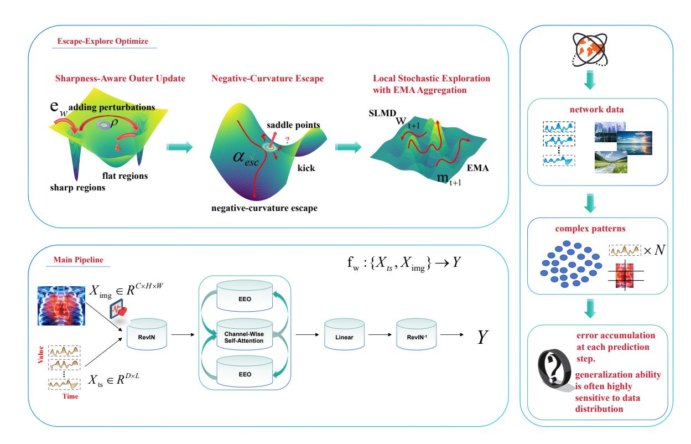
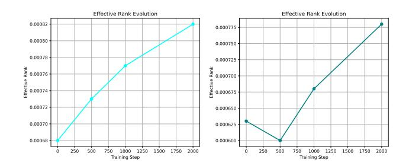
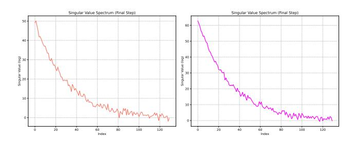
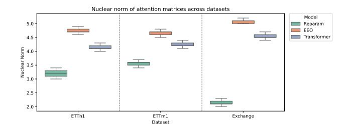
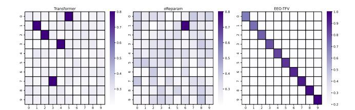

# EEO-TFV: Escape-Explore Optimizer for Web-Scale Time-Series Forecasting and Vision Analysis

[Hua Wang](https://orcid.org/0000-0002-8844-9667) School of Computer and Artificial Intelligence, Ludong University Yantai, Shandong, China hwa229@163.com

[Jinghao Lu](https://orcid.org/0009-0003-9608-3380) School of Computer and Artificial Intelligence, Ludong University Yantai, Shandong, China ljh@m.ldu.edu.cn

[Fan Zhang](https://orcid.org/0000-0002-0343-3499)∗ School of Computer Science and Technology, Shandong Technology and Business University Yantai, Shandong, China zhangfan@sdtbu.edu.cn

# Abstract

Transformer-based foundation models have achieved remarkable progress in tasks such as time-series forecasting and image segmentation. However, they frequently suffer from error accumulation in multivariate long-sequence prediction and exhibit vulnerability to out-of-distribution samples in image-related tasks. Furthermore, these challenges become particularly pronounced in large-scale Web data analysis tasks, which typically involve complex temporal patterns and multimodal features. This complexity substantially increases optimization difficulty, rendering models prone to stagnation at saddle points within high-dimensional parameter spaces. To address these issues, we propose a lightweight Transformer architecture in conjunction with a novel Escape-Explore Optimizer (EEO). The optimizer enhances both exploration and generalization while effectively avoiding sharp minima and saddle-point traps. Experimental results show that, in representative Web data scenarios, our method achieves performance on par with state-of-the-art models across 11 time-series benchmark datasets and the Synapse medical image segmentation task. Moreover, it demonstrates superior generalization and stability, thereby validating its potential as a versatile cross-task foundation model for Web-scale data mining and analysis.

### CCS Concepts

• Computing methodologies → Neural networks; Image segmentation; • Applied computing → Forecasting.

# Keywords

Time-Series Forecasting, Image Segmentation, Foundation Model, Saddle Point Escape, Rank Collapse Diagnosis

### ACM Reference Format:

Hua Wang, Jinghao Lu, and Fan Zhang. 2026. EEO-TFV: Escape-Explore Optimizer for Web-Scale Time-Series Forecasting and Vision Analysis. In Proceedings of the ACM Web Conference 2026 (WWW '26), April 13–17, 2026, Dubai, United Arab Emirates. ACM, New York, NY, USA, [12](#page-11-0) pages. [https:](https://doi.org/10.1145/3774904.3792434) [//doi.org/10.1145/3774904.3792434](https://doi.org/10.1145/3774904.3792434)

© 2026 Copyright held by the owner/author(s). ACM ISBN 979-8-4007-2307-0/2026/04 <https://doi.org/10.1145/3774904.3792434>

# 1 Introduction

In recent years, Transformer-based foundation models have achieved remarkable breakthroughs across diverse domains, including image segmentation and time-series forecasting [\[14,](#page-8-0) [19\]](#page-8-1). Owing to their powerful representational capacity and unified architectural design, these models have become a cornerstone for multimodal learning and cross-task modeling [\[29,](#page-8-2) [39\]](#page-8-3). However, as applications extend from localized scenarios to Web-scale data ecosystems [\[21\]](#page-8-4), conventional Transformers face substantial challenges in modeling high-dimensional, non-stationary, and multi-source heterogeneous data [\[10\]](#page-8-5). In particular, for multivariate long-horizon forecasting, autoregressive or sliding-window stepwise prediction schemes are prone to error accumulation, wherein minor early-stage deviations are gradually magnified and propagated through subsequent steps, resulting in a rapid degradation of performance with increasing prediction horizons [\[30,](#page-8-6) [40\]](#page-8-7). In Web-scale applications—including power load forecasting, traffic flow prediction, and cloud resource scheduling—such cumulative errors can critically undermine system stability and degrade resource allocation efficiency. Mitigating error propagation and achieving highly stable long-horizon modeling under open and dynamic Web data environments have thus emerged as central challenges in advancing Web intelligence and analytical systems [\[36,](#page-8-8) [42\]](#page-8-9).

This challenge becomes particularly pronounced in Web-scale scenarios. Web platforms host multi-source data streams that exhibit complex temporal dependencies and highly dynamic characteristics, encompassing network traffic, user interaction behaviors, recommendation system logs, and distributed service performance metrics [\[17\]](#page-8-10). Such tasks demand models that can capture nonstationary temporal patterns over extended horizons while maintaining robustness and generalizability under distribution shifts and heterogeneous streaming environments. Accumulated prediction errors may induce resource allocation imbalances, latency spikes, or system bottlenecks, ultimately undermining the overall intelligence and scalability of Web systems [\[4\]](#page-8-11). Consequently, within the realms of Web-scale time-series analysis and intelligent resource optimization, the design of efficient Transformer architectures capable of simultaneously mitigating error propagation and adapting to distributional drift has emerged as a pressing and central research challenge [\[15,](#page-8-12) [38\]](#page-8-13).

In computer vision and image segmentation tasks, although Transformers have demonstrated outstanding performance on largescale datasets such as ImageNet, their generalization capability remains highly sensitive to distributional shifts. When the distribution

∗Corresponding author.

[This work is licensed under a Creative Commons Attribution 4.0 International License.](https://creativecommons.org/licenses/by/4.0) WWW '26, Dubai, United Arab Emirates

of test samples diverges from that of the training data, model performance degrades substantially [\[31\]](#page-8-14). For instance, a classification model trained on ImageNet may suffer a marked decline in accuracy when the test set introduces even minor distribution shifts, such as subsets of CIFAR-100, natural perturbations, or blurred samples. This vulnerability to out-of-distribution (OOD) samples manifests not only as reduced classification accuracy but also as severe instability in the presence of adversarial perturbations. More critically, such vulnerability undermines the robustness of Transformers in real-world applications—for instance, in autonomous driving, where variations in lighting or weather conditions can induce uncontrollable deviations in model predictions [\[13\]](#page-8-15). In Web data analysis, analogous challenges emerge, including distribution shifts in user-uploaded images and noisy multimodal content on social media, both of which necessitate models with enhanced robustness [\[32,](#page-8-16) [35,](#page-8-17) [40\]](#page-8-7).

Furthermore, the optimization landscape of Web-scale multimodal learning is highly intricate and non-trivial. High-dimensional non-convex objectives render models susceptible to saddle points, whereas over-parameterization often drives convergence toward sharp minima, thereby impairing cross-domain generalization [\[43,](#page-8-18) [44\]](#page-8-19). Existing approaches, such as Sharpness-Aware Minimization (SAM), aim to steer optimization toward flatter minima to enhance generalization; however, they remain limited in escaping negative curvature and exploring complex landscapes under Web-scale multimodal optimization [\[34\]](#page-8-20). Meanwhile, Transformers are prone to training degeneration phenomena—including entropy collapse and rank collapse—during long-range dependency modeling [\[33\]](#page-8-21), which severely compromise their trainability and representational capacity. Although recent studies have introduced normalization and regularization-based remedies, achieving stable training and scalable optimization for high-dimensional models in open Web environments remains an open and fundamental challenge.

To address the aforementioned challenges, we introduce a lightweight, toy-scale Transformer architecture together with the Escape-Explore Optimizer (EEO), a novel and general-purpose optimization method. EEO incorporates two key mechanisms within the SAM framework. The first is negative-curvature escape, which leverages finite-difference Hessian–vector products and power iteration to detect sharp saddle points, and subsequently applies an "escape kick" along negative-curvature directions, thereby preventing the model from prolonged stagnation at suboptimal points. The second is stochastic exploration with EMA smoothing, which introduces controlled noise via localized Stochastic Gradient Langevin Dynamics (SGLD) to facilitate exploration, and integrates an exponential moving average (EMA) to suppress fluctuations, thereby enhancing generalization while preserving training stability. Extensive experiments on large-scale time-series forecasting, medical image segmentation, and Web data scenarios demonstrate that EEO yields substantial improvements in mitigating rank collapse, as well as enhancing both generalization and stability [\[38\]](#page-8-13).

- Lightweight Architecture: We adopt a toy-scale channelattention Transformer to alleviate entropy collapse in attention matrices during training, thereby improving the generalization ability of foundation models in multimodal domains.

- Optimizer Innovation: We propose the Escape-Explore Optimizer (EEO), which leverages flat-region optimization, negative-curvature escape, and SGLD-based exploration to enable the model to escape saddle points and converge toward flatter optima, significantly enhancing training stability and convergence quality.
- Cross-Domain Superiority: EEO-TFV demonstrates superior generalization across both time-series forecasting and medical image segmentation, with particularly strong performance in modeling long-range dependencies and preserving boundary details.

Through extensive large-scale experiments conducted under typical Web data environments, we empirically validate the stability, generalization, and scalability of EEO-TFV across multimodal tasks, thereby demonstrating its promise as a foundation model for Webscale intelligence.

## 2 Related Work

### 2.1 Web Scale Foundation Models for Time-Series Forecasting and Medical Image Segmentation

In recent years, foundation models have advanced rapidly in timeseries forecasting and image segmentation, becoming key building blocks for Web-scale data intelligence systems. In time-series modeling, TimesFM [\[27\]](#page-8-22) adopts a large-scale patchified decoder-style attention architecture with strong zero-/few-shot transfer, while Chronos [\[1\]](#page-8-23) tokenizes time series and follows a language-modeling paradigm to enable probabilistic forecasting via sampling, improving the modelability of complex temporal signals in Web-scale settings. These successes motivate time-series foundation models for dynamic Web applications such as traffic prediction, service scheduling, and trend analysis. In medical image segmentation, the Segment Anything line introduced promptable segmentation [\[12\]](#page-8-24), inspiring foundation-model development in medical imaging; Med-SAM [\[45\]](#page-8-25) scales training to tens of millions of image–mask pairs across modalities and anatomies, and SAM2 [\[3\]](#page-8-26) extends segmentation to video streams with a memory mechanism. Subsequent studies further validate transferability and robustness across 2D/3D and multimodal medical tasks. Building on this backdrop, we propose EEO-TFV, a lightweight Transformer framework motivated by a unified optimization perspective, and introduce the Escape– Explore Optimizer (EEO) as a general-purpose optimizer. Different from task-specific foundation models, EEO-TFV connects foundation modeling with optimization, offering a scalable optimization paradigm for multimodal Web data modeling.

### 2.2 Efficient Transformer Design in Web-Scale Intelligent Environments

Computational efficiency and resource consumption remain major concerns in scientific practice, as large and complex models are often hard to train and deploy in resource-constrained settings. Meanwhile, Transformers can be difficult to optimize and may overfit due to architectural complexity, motivating a shift toward lightweight architectures coupled with stronger optimization. For example, SAMformer [\[10\]](#page-8-5) combines a shallow, channel-focused

attention design with Sharpness-Aware Minimization (SAM), yielding clear gains on real-world multivariate time-series datasets and illustrating the effectiveness of "structural simplification + flatnessaware training." TSMixer [\[6\]](#page-8-27) removes self-attention and relies on temporal/channel mixing, showing that lightweight designs can remain competitive for long-horizon forecasting. In medical segmentation, MedFormer [\[28\]](#page-8-28) reduces layers and attention heads while using sparse attention to cut computation without sacrificing accuracy. Related lines of work further improve efficiency via more efficient attention mechanisms or alternative formulations such as dimension-inversion modeling (iTransformer [\[18\]](#page-8-29)), collectively highlighting the promise of lightweight designs for balancing efficiency and performance across tasks.

# 2.3 Entropy Collapse and Rank Collapse

In recent years, the trainability of Transformers has drawn growing attention, especially regarding entropy collapse and rank collapse in attention. Zhai et al. [\[37\]](#page-8-30) analyzed attention entropy and found that attention can quickly become near-identity early in training, after which entropy changes little, compressing information and reducing expressive capacity; they further linked entropy decay to training instability and proposed stabilizing it by constraining the attention Lipschitz constant [\[37\]](#page-8-30). In parallel, Dong et al. [\[5\]](#page-8-31) showed theoretically and empirically that pure attention (without MLPs or skip connections) suffers severe rank degradation with depth, undermining representation, while LKA [\[7\]](#page-8-32) mitigates rank decay via regularization or low-rank constraints. Motivated by these findings, we propose an optimization-level remedy via the Escape–Explore Optimizer (EEO): flat-region exploration mitigates over-convergence associated with entropy collapse; escaping along negative-curvature directions helps avoid saddle regions related to rank collapse; and SGLD-style smoothing preserves diversity and stabilizes attention distributions, collectively alleviating the harmful training dynamics induced by entropy/rank degradation.

### 2.4 Optimizers and Convergence: Flatness, Escape, and Stochastic Exploration

Recent advances in optimizer theory have clarified convergence behaviors for flatness- and noise-aware training. In 2024, prior work established fundamental convergence properties of SAM and characterized its behavior near critical points [\[10\]](#page-8-5), while GSAM was shown to admit convergence guarantees under increasing batch sizes or decaying learning rates [\[24\]](#page-8-33). Complementary analyses from the "edge of stability" perspective further delineate the regimes in which SAM operates effectively [\[16\]](#page-8-34). In non-convex optimization, theory also supports escaping strict saddles via small-step updates or perturbations along negative-curvature directions; for example, [\[41\]](#page-8-35) provided efficiency and constant-factor analyses that strengthen the "detection–escape" paradigm. Finally, SGLD admits a distributional view: under small step sizes it converges to a Gibbs distribution, equivalently minimizing a Gaussian-smoothed objective [\[46\]](#page-8-36), with subsequent work refining non-convex convergence rates and bounds.

### 3 Methodology

Numerous studies have demonstrated that Transformer-based models are frequently prone to converging to sharp minima or saddle points during optimization, which leads to significant generalization deficiencies on test datasets. Furthermore, in long-sequence forecasting or multimodal tasks, Transformers often suffer from entropy collapse, a phenomenon where the model progressively converges to degenerate solutions, thereby severely constraining its representational capacity and robustness. These challenges become particularly pronounced in Web-scale heterogeneous optimization environments, where models must jointly manage complex dynamic temporal dependencies and cross-modal feature alignment; under such conditions, conventional optimization schemes frequently lead to performance collapse or local oscillations. Avoiding undesirable convergence trajectories during optimization constitutes a central challenge in improving Transformer performance on time-series and vision tasks. To address these challenges, we propose an integrated optimization–modeling framework, termed EEO-TFV (Figure [1\)](#page-3-0). This framework preserves the generality of the Transformer architecture while introducing a novel Escape–Explore Optimizer (EEO), which delivers two key improvements:

- (1) Escape phase: Through active perturbation and energy landscape reshaping, the optimizer drives the model out of sharp minima regions, thereby avoiding convergence to degenerate solutions.
- (2) Explore phase: A diversity-driven exploration mechanism is introduced, leveraging Stochastic Gradient Langevin Dynamics (SGLD) together with Exponential Moving Average (EMA). This allows the optimizer to search for robust solutions within broader parameter regions, enhancing both generalization and stability.

This optimization paradigm not only provides Transformers with a unified and efficient training pathway but also offers new theoretical and practical guarantees for achieving stable convergence in complex time-series and vision tasks.

### 3.1 Notation

We denote scalars with regular letters (e.g., parameter ��), vectors with bold lowercase letters (e.g., ��), and matrices with bold uppercase letters (e.g., ��). The transpose of a matrix is written as ���� . The Frobenius norm is denoted by ∥��∥�� , the nuclear norm by ∥��∥∗ = Í �� ����(��), and the spectral norm by ∥��∥2 = ��max (��). This design establishes a unified modeling framework that scales seamlessly to Web-scale multi-source data.

## 3.2 Problem Formulation Extension

The tasks under investigation include multivariate short-sequence time-series forecasting and medical image segmentation. To enable a unified modeling framework, we formalize the two types of inputs as follows:

- Time-series input: X���� ∈ R ��×�� , where �� denotes the number of variables and �� denotes the sequence length.
- Image input: X������ ∈ R ��×�� ×�� , where ��, ��, and �� represent the number of channels, height, and width, respectively.

In addition, we integrate Exponential Moving Average (EMA) aggregation into the parameter update process. This design smooths the gradient updates, reduces variance induced by noise, and further improves the stability of convergence. Here, �� denotes the smoothing coefficient, and ���� represents the exponential moving average of the parameters:

����+1 = ������ + (1 − ��)����+1. (13)

In summary, SGLD provides global exploration capability, while EMA ensures stable convergence at the parameter level. The final model parameters are updated as �� ← ��final, thus achieving the dual benefit of exploration-induced diversity and robustness against noise-induced instability.

3.6.4 Redefinition of the Training Objective. Under EEO, the training objective is reformulated as:

L ������ train (��) = min �� E�� ∈�� [Ltrain (�� + ��)] , (14)

where the perturbation set �� incorporates directions from outer updates, escape directions from negative curvature, and noise injected via randomized exploration (SGLD). This new objective emphasizes minimizing the loss over a broader neighborhood in the parameter space rather than focusing on a single solution, thereby significantly enhancing stability and generalization in non-convex optimization landscapes. The proposed framework enhances exploratory flexibility and convergence stability, providing theoretical and methodological support for reliable optimization in Web-scale multimodal learning systems.

Lemma 3.4 (Expected Descent of the Robust Objective under EEO). Under the assumptions of Lemmas A and B, and with the incorporation of stochastic exploration and EMA, the EEO update satisfies E -���� (����+1) | ���� ≤ ���� (���� ) − �� 1 − ���� ∥∇���� (���� ) ∥2 + ������ +��(���� +�� 3 ���� ),where �� denotes the temperature parameter and �� the dimensionality. When �� is sufficiently small and �� is moderate, EEO guarantees, in expectation, a descent in the robust objective.

### 4 Experiments

Baselines. To validate the universality and robustness of the proposed EEO–TFV framework under multimodal Web-scale tasks, we conducted systematic evaluations in two representative domains: time-series forecasting and medical image segmentation. We compare EEO-TFV against state-of-the-art methods including TimeMixer++ [\[26\]](#page-8-37), iTransformer [\[18\]](#page-8-29), SAMFormer [\[10\]](#page-8-5), and other mainstream baselines on both long- and short-term time-series forecasting tasks. To ensure fairness, the experimental settings and benchmark results for time-series forecasting follow those of SAMFormer, and all methods are reproduced under identical data splits and evaluation metrics. For medical image segmentation, we select representative Unet-based models such as TranUNet, as well as Transformer-based approaches including SSFormer-L [\[25\]](#page-8-38), TransUNet [\[2\]](#page-8-39), and PVT-CASCADE [\[23\]](#page-8-40). These methods cover the most representative paradigms in current segmentation tasks. All baselines are trained using publicly available implementations or official codebases, with comparable parameter scales and training configurations to guarantee fairness in cross-model comparisons.

Metric Details. In the web-time-series forecasting tasks, we adopt Mean Squared Error (MSE) and Mean Absolute Error (MAE) as evaluation metrics. For web-medical image segmentation, we employ three complementary measures—Intersection over Union (IoU), Hausdorff Distance 95 (HD95) [\[11\]](#page-8-41), and Boundary-F1—to jointly assess regional consistency and boundary preservation. This metric suite adheres to the general conventions of Web-scale multimodal evaluation standards, facilitating both cross-domain transfer and longitudinal comparisons across different task domains..

### 4.1 Experimental Analysis

4.1.1 Results on Web-Time-Series Forecasting. Table [1](#page-6-0) presents the results of EEO-TFV compared with recent state-of-the-art methods on both long time-series forecasting tasks. Overall, EEO-TFV consistently outperforms all baselines across eight long-horizon datasets, with MSE significantly reduced relative to the latest TimeMixer++ [\[26\]](#page-8-37) and SAMFormer [\[10\]](#page-8-5), demonstrating the robustness of our model in high-dimensional long-sequence modeling. For shortterm forecasting, EEO-TFV also achieves leading results on the 0304 dataset, highlighting its superior generalization ability in capturing local dynamics. Moreover, we observe that on the Electricity (ECL) and Traffic datasets, the performance gains of EEO-TFV over iTransformer [\[18\]](#page-8-29) and PatchTST [\[20\]](#page-8-42) are more pronounced, indicating that larger datasets benefit more from the incorporation of the EEO optimizer, which helps the model escape sharp minima and converge to flatter and more stable solutions.

4.1.2 Results on Web Medical Image Segmentation. Table [2](#page-6-1) reports the results on binary medical image segmentation tasks, including polyp, skin lesion, and cell datasets. We reproduced the performance of several representative Transformer-based segmentation models using their official public implementations and evaluated them under the same 8:1:1 train/validation/test split. As shown, when combined with the EEO optimizer, nearly all models exhibit consistent improvements of 0.3%–0.6% in both Dice and IoU scores. This demonstrates that EEO effectively mitigates overfitting and representational collapse during training, enabling models to maintain stable optimization and stronger generalization even under limited data and cross-domain conditions. Consequently, EEO provides a more robust optimization scheme for medical imaging scenarios. By replacing the original Transformer with a toy-scale Transformer, we significantly improved both the parameter efficiency and computational efficiency.

4.1.3 Results on Abdominal Organ Segmentationexuesh. Table [3](#page-7-0) reports the results on the Synapse multi-organ segmentation dataset. We compare multiple representative segmentation architectures (including R50+AttnUNet, TransUNet, MISSFormer, TransCASCADE, and EMCAD) with and without the integration of EEO. It can be observed that incorporating EEO consistently yields improvements of 0.3%–0.9% across all models, while further reducing HD95, indicating more accurate boundary predictions. Notably, organs such as the liver and kidney, which are prone to gradient instability in baseline models, show significant performance gains when optimized with EEO. This demonstrates that EEO provides a more stable convergence path in the presence of complex organ morphologies. Overall, in multi-organ scenarios, EEO not only improves average

Table 1: Average performance on both long-term web time series forecasting tasks. Bold indicates the best result.

| Models  | H   | MSE   | Ours EEO-TFV MAE | MSE   | Twins* MAE | MSE   | 2025 Time** MAE | MSE        | TimeKAN MAE | MSE      | SAM* MAE | MSE   | iTrans* MAE | 2023-2024 MSE | PatchTST MAE | MSE   | DLinear MAE |
|---------|-----|-------|------------------|-------|------------|-------|-----------------|------------|-------------|----------|----------|-------|-------------|---------------|--------------|-------|-------------|
| ETTh1   | Avg | 0.404 | 0.423            | 0.446 | 0.440      | 0.419 | 0.432           | 0.417      | 0.427       | 0.432    | 0.424    | 0.454 | 0.448       | 0.438         | 0.449        | 0.441 | 0.439       |
| ETTh2   | Avg | 0.340 | 0.395            | 0.373 | 0.400      | 0.339 | 0.380           | 0.383      | 0.404       | 0.344    | 0.392    | 0.383 | 0.407       | 0.384         | 0.414        | 0.548 | 0.521       |
| ETTm1   | Avg | 0.411 | 0.436            | 0.393 | 0.404      | 0.369 | 0.378           | 0.377      | 0.395       | 0.373    | 0.388    | 0.407 | 0.410       | 0.391         | 0.412        | 0.400 | 0.412       |
| ETTm2   | Avg | 0.252 | 0.305            | 0.277 | 0.323      | 0.269 | 0.320           | 0.277      | 0.323       | 0.269    | 0.327    | 0.288 | 0.332       | 0.280         | 0.316        | 0.350 | 0.392       |
| WTH     | Avg | 0.203 | 0.249            | 0.246 | 0.271      | 0.226 | 0.262           | 0.243      | 0.272       | 0.261    | 0.293    | 0.258 | 0.278       | 0.261         | 0.280        | 0.274 | 0.349       |
| Traffic | Avg | 0.379 | 0.265            | 0.407 | 0.274      | 0.416 | 0.264           | 0.422      | 0.269       | 0.425    | 0.297    | 0.428 | 0.282       | 0.555         | 0.395        | 0.632 | 0.397       |
| ECL     | Avg | 0.160 | 0.257            | 0.167 | 0.261      | 0.165 | 0.253           | 0.182      | 0.274       | 0.181    | 0.275    | 0.176 | 0.270       | 0.209         | 0.306        | 0.211 | 0.303       |
|         |     |       |                  |       |            | *     | indicates       | Former; ** | indicates   | Mixer++. |          |       |             |               |              |       |             |

Table 2: Results of binary web medical image segmentation (i.e., polyp, skin lesion, cell, and breast cancer). The data we used is from EMCAD, and the results after incorporating EEO consistently show optimal performance. The values in the table represent the average of five runs.

| Methods         | #Params | #FLOPs | Clinic | Colon | Polyp ETIS | Kvasir | BKAI  | Skin ISIC17 | Lesion ISIC18 | DSB18 | Cell EM | BUSI  |
|-----------------|---------|--------|--------|-------|------------|--------|-------|-------------|---------------|-------|---------|-------|
| SSFormer-L      | 66.22M  | 17.28G | 94.18  | 92.11 | 90.16      | 91.47  | 91.14 | 85.28       | 90.25         | 92.03 | 94.95   | 78.76 |
| TransUNet       | 105.32M | 38.52G | 93.90  | 91.63 | 87.79      | 91.08  | 89.17 | 85.00       | 89.16         | 92.04 | 95.27   | 78.30 |
| PVT-CASCADE     | 34.12M  | 7.62G  | 94.53  | 91.60 | 91.03      | 92.05  | 92.14 | 85.50       | 90.41         | 92.35 | 95.42   | 79.21 |
| EMCAD           | 3.92M   | 0.84G  | 94.60  | 91.71 | 91.65      | 91.95  | 91.30 | 85.67       | 90.70         | 92.46 | 95.35   | 79.80 |
| SSFormer-L+EEO  | 54.63M  | 13.29G | 94.94  | 92.46 | 90.52      | 91.79  | 91.49 | 85.79       | 90.59         | 92.41 | 95.61   | 79.11 |
| TransUNet+EEO   | 85.32M  | 29.52G | 94.21  | 91.98 | 88.03      | 91.41  | 89.59 | 85.41       | 89.51         | 92.52 | 95.67   | 78.81 |
| PVT-CASCADE+EEO | 28.34M  | 5.88G  | 94.84  | 91.99 | 91.42      | 92.51  | 92.56 | 85.78       | 90.99         | 92.67 | 95.81   | 79.58 |
| EMCAD+EEO       | 2.99M   | 0.71G  | 94.92  | 92.03 | 91.98      | 92.39  | 91.65 | 85.99       | 91.21         | 92.63 | 95.81   | 80.13 |

performance metrics but also exhibits consistent advantages at the organ level, validating its generality and robustness in medical image segmentation.

### 4.2 EEO Rank-Collapse Diagnostic Plots

The left panel presents rank-collapse diagnostics on a subset of the Traffic dataset for time-series forecasting; no effective-rank degradation is observed, suggesting EEO consistently avoids sharp minima and stays in flatter regions in long-horizon settings. Because longsequence forecasting requires modeling multiple temporal scales, rank collapse would force the model to rely on low-dimensional information and harm generalization; our results show EEO alleviates this issue. The right panel shows diagnostics for medical image segmentation: the representation space briefly contracts early on with mild rank-collapse signs, but EEO later steers training away from sharp regions and restores—and even improves—representational diversity. This is likely due to limited sample sizes and class imbalance in medical datasets, which make low-rank solutions more likely early in training; EEO's outer perturbation and negativecurvature escape effectively counteract this tendency. We further verified the statistical significance of the 0.3–0.6% performance gain using paired t-tests and Wilcoxon tests. It effectively proves that the existence of the EEO optimizer is not accidental, but a good plug-and-play aid.

Figure 2: Left: Rank-collapse diagnostic plot for the Traffic dataset showing no signs of rank degradation. Right: Rankcollapse diagnostic plot for the Synapse medical image segmentation dataset.

### 4.3 EEO Singular Value Spectrum

Figure [3](#page-7-1) shows the singular value spectrum of the last-layer representation matrix for slices of the Traffic and Synapse datasets. It can be observed that the spectral distribution exhibits a smooth long-tail decay rather than being concentrated on a few dominant directions, indicating that the model maintains a high effective rank even after convergence. This demonstrates that the proposed

Table 3: The abdominal organ segmentation results based on the Web-Synapse multi-organ dataset are reported with DICE scores for individual organs, where models incorporating the EEO optimizer outperform the original models. ↑ (↓) denotes the higher (lower) the better. "–" means missing data from the source.

|                  | Architectures | DICE  | Average ↑ HD95 | ↓ mIoU | ↑ Aorta | GB    | KL    | KR    | Organs Liver | PC    | SP    | SM    |
|------------------|---------------|-------|----------------|--------|---------|-------|-------|-------|--------------|-------|-------|-------|
| TransUNet        | [2]           | 77.61 | 26.90          | 67.32  | 86.56   | 60.43 | 80.54 | 78.53 | 94.33        | 58.47 | 87.06 | 75.00 |
| MISSFormer       | [9]           | 81.96 | 18.20          | 70.69  | 86.95   | 68.22 | 85.21 | 82.00 | 94.41        | 65.67 | 91.92 | 80.81 |
| TransCASCADE     | [22]          | 82.68 | 17.34          | 73.48  | 86.63   | 68.48 | 87.60 | 84.56 | 94.43        | 65.33 | 90.79 | 83.52 |
| EMCAD            | [22]          | 81.97 | 17.39          | 72.64  | 87.21   | 66.62 | 87.48 | 83.96 | 94.57        | 62.00 | 92.66 | 81.22 |
| TransUNet+EEO    |               | 77.99 | 26.54          | 67.74  | 86.79   | 60.86 | 80.91 | 78.79 | 94.82        | 58.73 | 87.39 | 75.58 |
| MISSFormer+EEO   |               | 82.37 | 17.79          | 71.01  | 87.62   | 68.72 | 85.63 | 82.69 | 95.02        | 66.31 | 92.13 | 81.14 |
| TransCASCADE+EEO |               | 82.99 | 16.88          | 73.72  | 87.21   | 68.91 | 88.29 | 85.17 | 94.73        | 65.85 | 91.15 | 83.86 |
| EMCAD+EEO        |               | 82.56 | 16.97          | 72.99  | 87.72   | 66.98 | 87.82 | 84.20 | 94.73        | 62.56 | 92.96 | 81.78 |

Table 4: Merged ablation results (MSE) on ETT benchmarks. Lower is better.

| Dataset | Current | Toy+AdamW | Original+EEO | Original+AdamW | EEO full | SAM+SGLD+EMA | SAM+SGLD | SAM alone |
|---------|---------|-----------|--------------|----------------|----------|--------------|----------|-----------|
| ETTh1   | 0.404   | 0.452     | 0.413        | 0.461          | 0.404    | 0.413        | 0.426    | 0.436     |
| ETTh2   | 0.340   | 0.363     | 0.356        | 0.379          | 0.340    | 0.342        | 0.347    | 0.349     |
| ETTm1   | 0.411   | 0.471     | 0.431        | 0.487          | 0.411    | 0.419        | 0.433    | 0.449     |
| ETTm2   | 0.252   | 0.286     | 0.264        | 0.305          | 0.252    | 0.256        | 0.269    | 0.271     |

Figure 3: Left: Singular value spectrum for the Traffic dataset. Right: Singular value spectrum for the Synapse dataset.

EEO optimizer effectively mitigates the common rank collapse issue in Transformer training, thereby preserving the diversity and discriminability of the representation space.

## 4.4 Ablation Results

To prove the effectiveness of our module, we conducted ablation experiments on the ETT dataset for time series prediction. Here, "toy" represents a lightweight Transformer at the toy level, "Original" represents the original Transformer, and "SAM+SGLD+EMA" represents the components of the EEO optimizer. Both Table 2 and Table 3 can show the ablation performance of the EEO optimizer. The results demonstrate that our original model performs best in all cases.

# 5 Conclusion

We propose EEO-TFV, a lightweight Transformer framework equipped with the Escape–Explore Optimizer (EEO) to mitigate instability

and overfitting in training for time-series forecasting and medical image segmentation. EEO combines flatness-aware optimization, negative-curvature escape, and stochastic exploration, enabling more stable and better-generalized learning across heterogeneous modalities. Experiments indicate strong scalability and promising potential as a multimodal foundation model for Web-scale analysis. Extensive experiments demonstrate that EEO-TFV offers strong scalability and generalization benefits under a variety of settings. Future work may proceed along three directions. First, extending EEO to broader cross-domain transfer and cross-task generalization settings to better handle statistical shifts across domains. Second, incorporating Web-tailored self-supervised and weakly supervised adaptation to learn robust representations under limited annotation. Third, addressing real-world Web scenarios with distribution drift and continual change by exploring online/incremental robust training and uncertainty calibration, enabling trustworthy, stable, and efficient learning under dynamic data streams. With these extensions, we expect EEO-TFV to advance toward trustworthy, cost-efficient, and scalable Web-scale unified intelligence.

## Acknowledgements

This work was supported in part by the following: the Joint Fund of the National Natural Science Foundation of China under Grant Nos. U24A20328, U24A20219, the Youth Innovation Technology Project of Higher School in Shandong Province under Grant No. 2023KJ212, the National Natural Science Foundation of China under Grant No. 62272281, the Special Funds for Taishan Scholars Project under Grant No. tsqn202306274, and the Natural Science Foundation of Shandong Province under Grant No. ZR20250C712.

### References

[1] Abdul Fatir Ansari, Lorenzo Stella, Caner Turkmen, Xiyuan Zhang, Pedro Mercado, Huibin Shen, Oleksandr Shchur, Syama Sundar Rangapuram, Sebastian Pineda Arango, Shubham Kapoor, et al. 2024. Chronos: Learning the language of time series. arXiv preprint arXiv:2403.07815 (2024). [2] Jieneng Chen, Yongyi Lu, Qihang Yu, Xiangde Luo, Ehsan Adeli, Yan Wang, Le Lu, Alan L Yuille, and Yuyin Zhou. 2021. Transunet: Transformers make strong encoders for medical image segmentation. arXiv preprint arXiv:2102.04306 (2021). [3] Tianrun Chen, Ankang Lu, Lanyun Zhu, Chaotao Ding, Chunan Yu, Deyi Ji, Zejian Li, Lingyun Sun, Papa Mao, and Ying Zang. 2024. Sam2-adapter: Evaluating & adapting segment anything 2 in downstream tasks: Camouflage, shadow, medical image segmentation, and more. arXiv preprint arXiv:2408.04579 (2024). [4] Xiaohong Chen, Canran Xiao, and Yongmei Liu. 2024. Confusion-resistant federated learning via diffusion-based data harmonization on non-IID data. In Proceedings of the 38th International Conference on Neural Information Processing Systems. 137495–137520. [5] Yihe Dong, Jean-Baptiste Cordonnier, and Andreas Loukas. 2021. Attention is not all you need: Pure attention loses rank doubly exponentially with depth. In International conference on machine learning. PMLR, 2793–2803. [6] Vijay Ekambaram, Arindam Jati, Nam Nguyen, Phanwadee Sinthong, and Jayant Kalagnanam. 2023. Tsmixer: Lightweight mlp-mixer model for multivariate time series forecasting. In Proceedings of the 29th ACM SIGKDD conference on knowledge discovery and data mining. 459–469. [7] Meng-Hao Guo, Cheng-Ze Lu, Zheng-Ning Liu, Ming-Ming Cheng, and Shi-Min Hu. 2023. Visual attention network. Computational visual media 9, 4 (2023), 733–752. [8] Bobby He, James Martens, Guodong Zhang, Aleksandar Botev, Andrew Brock, Samuel L Smith, and Yee Whye Teh. 2023. Deep transformers without shortcuts: Modifying self-attention for faithful signal propagation. arXiv preprint arXiv:2302.10322 (2023). [9] Xiaohong Huang, Zhifang Deng, Dandan Li, and Xueguang Yuan. 2021. Missformer: An effective medical image segmentation transformer. arXiv preprint arXiv:2109.07162 (2021). [10] Romain Ilbert, Ambroise Odonnat, Vasilii Feofanov, Aladin Virmaux, Giuseppe Paolo, Themis Palpanas, and Ievgen Redko. 2024. Samformer: Unlocking the potential of transformers in time series forecasting with sharpness-aware minimization and channel-wise attention. arXiv preprint arXiv:2402.10198 (2024). [11] Davood Karimi and Septimiu E Salcudean. 2019. Reducing the hausdorff distance in medical image segmentation with convolutional neural networks. IEEE Transactions on medical imaging 39, 2 (2019), 499–513. [12] Alexander Kirillov, Eric Mintun, Nikhila Ravi, Hanzi Mao, Chloe Rolland, Laura Gustafson, Tete Xiao, Spencer Whitehead, Alexander C Berg, Wan-Yen Lo, et al. 2023. Segment anything. In Proceedings of the IEEE/CVF international conference on computer vision. 4015–4026. [13] Alex Krizhevsky, Ilya Sutskever, and Geoffrey E Hinton. 2012. Imagenet classification with deep convolutional neural networks. Advances in neural information processing systems 25 (2012). [14] Zekun Li, Shiyang Li, and Xifeng Yan. 2023. Time series as images: Vision transformer for irregularly sampled time series. Advances in Neural Information Processing Systems 36 (2023), 49187–49204. [15] Mengfan Liang, Shixiang Jia, Yepeng Liu, Xiaofeng Zhang, Hua Wang, and Yujuan Sun. 2025. TriTrackNet: A dual-channel time series forecasting model with multipath interaction and perturbation optimization. Neurocomputing (2025), 132519. [16] Bangyan Liao, Zhenjun Zhao, Lu Chen, Haoang Li, Daniel Cremers, and Peidong Liu. 2024. GlobalPointer: Large-Scale Plane Adjustment with Bi-Convex Relaxation. In European Conference on Computer Vision. Springer, 360–376. [17] Zhiming Lin, Kai Zhao, Sophie Zhang, Peilai Yu, and Canran Xiao. 2025. CEC-Zero: Zero-Supervision Character Error Correction with Self-Generated Rewards. arXiv preprint arXiv:2512.23971 (2025). [18] Yong Liu, Tengge Hu, Haoran Zhang, Haixu Wu, Shiyu Wang, Lintao Ma, and Mingsheng Long. 2023. itransformer: Inverted transformers are effective for time series forecasting. arXiv preprint arXiv:2310.06625 (2023). [19] Jinghao Lu, Fan Zhang, Xiaofeng Zhang, Yujuan Sun, and Hua Wang. 2025. MCNR: Multiscale Feature-Based Latent Data Component Extraction Linear Regression Model. Expert Systems with Applications (2025), 128634. [20] Yuqi Nie, Nam H Nguyen, Phanwadee Sinthong, and Jayant Kalagnanam. 2022. A time series is worth 64 words: Long-term forecasting with transformers. arXiv preprint arXiv:2211.14730 (2022). [21] Kohei Obata, Koki Kawabata, Yasuko Matsubara, and Yasushi Sakurai. 2024. Dynamic multi-network mining of tensor time series. In Proceedings of the ACM Web Conference 2024. 4117–4127. [22] Md Mostafijur Rahman and Radu Marculescu. 2023. Medical image segmentation via cascaded attention decoding. In Proceedings of the IEEE/CVF winter conference on applications of computer vision. 6222–6231. [23] Md Mostafijur Rahman, Mustafa Munir, and Radu Marculescu. 2024. Emcad: Efficient multi-scale convolutional attention decoding for medical image segmentation. In Proceedings of the IEEE/CVF Conference on Computer Vision and Pattern Recognition. 11769–11779. [24] Idris O Sunmola, Zhenjun Zhao, Samuel Schmidgall, Yumeng Wang, Paul Maria Scheikl, and Axel Krieger. 2025. Surgical Gaussian Surfels: Highly Accurate Real-time Surgical Scene Rendering. arXiv preprint arXiv:2503.04079 (2025). [25] Jinfeng Wang, Qiming Huang, Feilong Tang, Jia Meng, Jionglong Su, and Sifan Song. 2022. Stepwise feature fusion: Local guides global. In International conference on medical image computing and computer-assisted intervention. Springer, 110–120. [26] Shiyu Wang, Jiawei Li, Xiaoming Shi, Zhou Ye, Baichuan Mo, Wenze Lin, Shengtong Ju, Zhixuan Chu, and Ming Jin. 2024. Timemixer++: A general time series pattern machine for universal predictive analysis. arXiv preprint arXiv:2410.16032 (2024). [27] Yanqin Wang, Guoyu Huang, Ceran Chen, Li Qiu, and Ximing Xu. [n. d.]. A Comparative Study of Time Series Foundation Models for Hand, Foot and Mouth Disease Forecasting: TimesFM, Moirai, and Traditional Approaches. Frontiers in Public Health 13 ([n. d.]), 1634138. [28] Yihe Wang, Nan Huang, Taida Li, Yujun Yan, and Xiang Zhang. 2024. Medformer: A multi-granularity patching transformer for medical time-series classification. Advances in Neural Information Processing Systems 37 (2024), 36314–36341. [29] Yuenan Wang, Hua Wang, and Fan Zhang. 2025. A Medical image segmentation model with auto-dynamic convolution and location attention mechanism. Computer Methods and Programs in Biomedicine 261 (2025), 108593. [30] Canran Xiao, Jiabao Dou, Zhiming Lin, Zong Ke, and Liwei Hou. 2025. From Points to Coalitions: Hierarchical Contrastive Shapley Values for Prioritizing Data Samples. arXiv preprint arXiv:2512.19363 (2025). [31] Canran Xiao, Chuangxin Zhao, Zong Ke, and Fei Shen. 2025. Curiosity meets cooperation: A game-theoretic approach to long-tail multi-label learning. arXiv preprint arXiv:2510.17520 (2025). [32] Zequn Xie, Chuxin Wang, Yeqiang Wang, Sihang Cai, Shulei Wang, and Tao Jin. 2025. Chat-Driven Text Generation and Interaction for Person Retrieval. In Proceedings of the 2025 Conference on Empirical Methods in Natural Language Processing. 5259–5270. [33] Shaocheng Yan, Pengcheng Shi, Zhenjun Zhao, Kaixin Wang, Kuang Cao, Ji Wu, and Jiayuan Li. 2025. Turboreg: Turboclique for robust and efficient point cloud registration. arXiv preprint arXiv:2507.01439 (2025). [34] Shaocheng Yan, Yiming Wang, Kaiyan Zhao, Pengcheng Shi, Zhenjun Zhao, Yongjun Zhang, and Jiayuan Li. 2025. HeMoRa: Unsupervised Heuristic Consensus Sampling for Robust Point Cloud Registration. In Proceedings of the Computer Vision and Pattern Recognition Conference. 1363–1373. [35] Jiawei Yao, Chuming Li, and Canran Xiao. 2024. Swift sampler: Efficient learning of sampler by 10 parameters. Advances in Neural Information Processing Systems 37 (2024), 59030–59053. [36] Hua Ye, Siyuan Chen, Ziqi Zhong, Canran Xiao, Haoliang Zhang, Yuhan Wu, and Fei Shen. 2026. Seeing through the Conflict: Transparent Knowledge Conflict Handling in Retrieval-Augmented Generation. arXiv preprint arXiv:2601.06842 (2026). [37] Shuangfei Zhai, Tatiana Likhomanenko, Etai Littwin, Dan Busbridge, Jason Ramapuram, Yizhe Zhang, Jiatao Gu, and Joshua M Susskind. 2023. Stabilizing transformer training by preventing attention entropy collapse. In International Conference on Machine Learning. PMLR, 40770–40803. [38] Fan Zhang, Gongguan Chen, Hua Wang, and Caiming Zhang. 2024. CF-DAN: Facial-expression recognition based on cross-fusion dual-attention network. Computational Visual Media 10, 3 (2024), 593–608. [39] Fan Zhang, Tiantian Guo, and Hua Wang. 2023. DFNet: Decomposition fusion model for long sequence time-series forecasting. Knowledge-Based Systems 277 (2023), 110794. [40] Fan Zhang, Min Wang, Wenchang Zhang, and Hua Wang. 2025. THATSN: Temporal hierarchical aggregation tree structure network for long-term timeseries forecasting. Information Sciences 692 (2025), 121659. [41] Hualin Zhang and Bin Gu. 2022. Faster gradient-free methods for escaping saddle points. In The Eleventh International Conference on Learning Representations. [42] Wenchang Zhang, Hua Wang, and Fan Zhang. 2024. Skip-timeformer: Skip-time interaction transformer for long sequence time-series forecasting. In International joint conference on artificial intelligence. 5499–5507. [43] Zhenjun Zhao. 2024. Balf: Simple and efficient blur aware local feature detector. In Proceedings of the IEEE/CVF Winter Conference on Applications of Computer Vision. 3362–3372. [44] Zhenjun Zhao and Ben M Chen. 2023. Benchmark for Evaluating Initialization of Visual-Inertial Odometry. In 2023 42nd Chinese Control Conference (CCC). IEEE, 3935–3940. [45] Nan Zhou, Ke Zou, Kai Ren, Mengting Luo, Linchao He, Meng Wang, Yidi Chen, Yi Zhang, Hu Chen, and Huazhu Fu. 2024. Medsam-u: Uncertainty-guided auto multi-prompt adaptation for reliable medsam. arXiv preprint arXiv:2409.00924 (2024). [46] Difan Zou, Pan Xu, and Quanquan Gu. 2021. Faster convergence of stochastic gradient langevin dynamics for non-log-concave sampling. In Uncertainty in Artificial Intelligence. PMLR, 1152–1162.

| Models H | MSE   | Ours EEO-TFV MAE | MSE   | Twins* MAE | MSE   | 2025 -Mixer++ MAE | MSE   | -KAN MAE | MSE   | SAM* MAE | MSE   | iTrans* MAE | 2023-2024 MSE | PatchTST MAE | MSE   | DLinear MAE |
|----------|-------|------------------|-------|------------|-------|-------------------|-------|----------|-------|----------|-------|-------------|---------------|--------------|-------|-------------|
| 96       | 0.359 | 0.391            | 0.385 | 0.401      | 0.361 | 0.403             | 0.367 | 0.395    | 0.381 | 0.402    | 0.386 | 0.405       | 0.386         | 0.395        | 0.386 | 0.400       |
| 192      | 0.390 | 0.412            | 0.439 | 0.431      | 0.416 | 0.441             | 0.414 | 0.420    | 0.409 | 0.418    | 0.441 | 0.436       | 0.407         | 0.432        | 0.423 | 0.450       |
| 336      | 0.422 | 0.431            | 0.480 | 0.452      | 0.430 | 0.434             | 0.445 | 0.434    | 0.423 | 0.425    | 0.487 | 0.458       | 0.479         | 0.484        | 0.481 | 0.453       |
| 720      | 0.445 | 0.459            | 0.480 | 0.474      | 0.467 | 0.451             | 0.444 | 0.459    | 0.427 | 0.449    | 0.503 | 0.491       | 0.481         | 0.486        | 0.474 | 0.453       |
| 96       | 0.275 | 0.345            | 0.292 | 0.345      | 0.276 | 0.328             | 0.290 | 0.340    | 0.295 | 0.358    | 0.297 | 0.349       | 0.302         | 0.348        | 0.333 | 0.387       |
| 192      | 0.325 | 0.378            | 0.375 | 0.395      | 0.342 | 0.379             | 0.375 | 0.392    | 0.340 | 0.386    | 0.380 | 0.400       | 0.376         | 0.407        | 0.432 | 0.457       |
| 336      | 0.349 | 0.405            | 0.417 | 0.429      | 0.346 | 0.398             | 0.423 | 0.435    | 0.350 | 0.395    | 0.428 | 0.432       | 0.420         | 0.439        | 0.594 | 0.581       |
| 720      | 0.411 | 0.451            | 0.406 | 0.430      | 0.392 | 0.415             | 0.443 | 0.449    | 0.391 | 0.428    | 0.427 | 0.445       | 0.439         | 0.460        | 0.831 | 0.657       |
| 96       | 0.327 | 0.389            | 0.325 | 0.364      | 0.310 | 0.334             | 0.322 | 0.361    | 0.329 | 0.363    | 0.334 | 0.368       | 0.336         | 0.371        | 0.320 | 0.372       |
| 192      | 0.386 | 0.413            | 0.372 | 0.390      | 0.348 | 0.362             | 0.357 | 0.383    | 0.353 | 0.378    | 0.377 | 0.391       | 0.367         | 0.391        | 0.414 | 0.410       |
| 336      | 0.434 | 0.459            | 0.406 | 0.412      | 0.376 | 0.391             | 0.382 | 0.401    | 0.382 | 0.394    | 0.426 | 0.420       | 0.420         | 0.410        | 0.413 | 0.413       |
| 720      | 0.499 | 0.482            | 0.467 | 0.448      | 0.440 | 0.423             | 0.445 | 0.435    | 0.429 | 0.418    | 0.491 | 0.459       | 0.439         | 0.474        | 0.453 | 0.453       |
| 96       | 0.159 | 0.241            | 0.173 | 0.256      | 0.170 | 0.245             | 0.174 | 0.255    | 0.181 | 0.274    | 0.180 | 0.264       | 0.175         | 0.218        | 0.193 | 0.255       |
| 192      | 0.210 | 0.281            | 0.239 | 0.300      | 0.229 | 0.291             | 0.239 | 0.299    | 0.233 | 0.306    | 0.250 | 0.309       | 0.241         | 0.282        | 0.284 | 0.362       |
| 336      | 0.279 | 0.327            | 0.298 | 0.339      | 0.303 | 0.343             | 0.301 | 0.340    | 0.285 | 0.338    | 0.311 | 0.348       | 0.305         | 0.364        | 0.369 | 0.427       |
| 720      | 0.359 | 0.371            | 0.397 | 0.397      | 0.373 | 0.399             | 0.395 | 0.396    | 0.375 | 0.390    | 0.412 | 0.407       | 0.400         | 0.400        | 0.554 | 0.522       |
| 96       | 0.141 | 0.194            | 0.161 | 0.201      | 0.155 | 0.205             | 0.162 | 0.208    | 0.197 | 0.249    | 0.174 | 0.214       | 0.177         | 0.218        | 0.196 | 0.255       |
| 192      | 0.178 | 0.232            | 0.211 | 0.248      | 0.201 | 0.245             | 0.207 | 0.249    | 0.235 | 0.277    | 0.221 | 0.254       | 0.225         | 0.259        | 0.237 | 0.296       |
| 336      | 0.217 | 0.265            | 0.266 | 0.291      | 0.237 | 0.265             | 0.263 | 0.290    | 0.276 | 0.304    | 0.278 | 0.296       | 0.293         | 0.297        | 0.283 | 0.359       |
| 720      | 0.276 | 0.304            | 0.347 | 0.343      | 0.312 | 0.334             | 0.338 | 0.340    | 0.334 | 0.342    | 0.358 | 0.347       | 0.348         | 0.345        | 0.381 | 0.487       |
| 96       | 0.353 | 0.252            | 0.382 | 0.260      | 0.392 | 0.253             |       |          | 0.407 | 0.292    | 0.395 | 0.268       | 0.544         | 0.395        | 0.650 | 0.396       |
| 192      | 0.367 | 0.267            | 0.392 | 0.267      | 0.402 | 0.258             |       |          | 0.415 | 0.294    | 0.417 | 0.276       | 0.540         | 0.398        | 0.598 | 0.370       |
| 336      | 0.386 | 0.263            | 0.410 | 0.276      | 0.428 | 0.263             |       |          | 0.421 | .292     | 0.433 | 0.283       | 0.551         | 0.413        | 0.635 | 0.427       |
| 720      | 0.410 | 0.277            | 0.442 | 0.292      | 0.441 | 0.282             |       |          | 0.456 | 0.311    | 0.467 | 0.302       | 0.586         | 0.375        | 0.645 | 0.394       |
| 96       | 0.129 | 0.234            | 0.139 | 0.233      | 0.135 | 0.222             | 0.174 | 0.255    | 0.155 | 0.252    | 0.148 | 0.240       | 0.195         | 0.285        | 0.197 | 0.282       |
| 192      | 0.149 | 0.241            | 0.158 | 0.252      | 0.147 | 0.235             | 0.162 | 0.253    | 0.168 | 0.263    | 0.162 | 0.253       | 0.199         | 0.289        | 0.200 | 0.285       |
| 336      | 0.167 | 0.265            | 0.172 | 0.267      | 0.164 | 0.245             | 0.167 | 0.269    | 0.183 | 0.277    | 0.167 | 0.269       | 0.203         | 0.319        | 0.203 | 0.310       |
| 720      | 0.193 | 0.289            | 0.200 | 0.293      | 0.212 | 0.310             | 0.225 | 0.317    | 0.219 | 0.306    | 0.225 | 0.317       | 0.237         | 0.331        | 0.245 | 0.333       |

Table 6: Short-term Web-forecasting performance on the PEMS dataset with prediction lengths of 12, 24, 48, 96.

| Models (H) | MSE   | EEO-TFV MAE | MSE   | Twins* MAE | MSE   | itrans* MAE | MSE   | RLinear MAE | MSE   | PatchTST MAE | MSE   | Cross* MAE | MSE   | TiDE MAE | MSE   | TimesNet MAE |
|------------|-------|-------------|-------|------------|-------|-------------|-------|-------------|-------|--------------|-------|------------|-------|----------|-------|--------------|
| 12         | 0.052 | 0.150       | 0.065 | 0.169      | 0.069 | 0.175       | 0.126 | 0.236       | 0.099 | 0.216        | 0.09  | 0.203      | 0.178 | 0.305    | 0.085 | 0.192        |
| 24         | 0.085 | 0.169       | 0.086 | 0.196      | 0.097 | 0.208       | 0.246 | 0.334       | 0.121 | 0.240        | 0.121 | 0.240      | 0.257 | 0.371    | 0.118 | 0.223        |
| 48         | 0.120 | 0.188       | 0.121 | 0.234      | 0.131 | 0.243       | 0.551 | 0.529       | 0.202 | 0.317        | 0.202 | 0.317      | 0.379 | 0.463    | 0.155 | 0.260        |
| 96         | 0.163 | 0.235       | 0.165 | 0.276      | 0.168 | 0.279       | 1.057 | 0.787       | 0.262 | 0.367        | 0.262 | 0.367      | 0.49  | 0.539    | 0.228 | 0.317        |
| 12         | 0.075 | 0.177       | 0.077 | 0.181      | 0.081 | 0.188       | 0.138 | 0.252       | 0.105 | 0.224        | 0.098 | 0.218      | 0.219 | 0.340    | 0.087 | 0.195        |
| 24         | 0.095 | 0.203       | 0.095 | 0.204      | 0.099 | 0.211       | 0.258 | 0.348       | 0.153 | 0.275        | 0.131 | 0.256      | 0.292 | 0.398    | 0.103 | 0.215        |
| 48         | 0.116 | 0.222       | 0.120 | 0.231      | 0.133 | 0.247       | 0.572 | 0.544       | 0.229 | 0.339        | 0.205 | 0.336      | 0.409 | 0.478    | 0.136 | 0.250        |
| 96         | 0.146 | 0.261       | 0.150 | 0.261      | 0.172 | 0.283       | 1.137 | 0.820       | 0.291 | 0.389        | 0.402 | 0.457      | 0.492 | 0.532    | 0.190 | 0.303        |
| 12         | 0.060 | 0.167       | 0.060 | 0.158      | 0.067 | 0.167       | 0.118 | 0.235       | 0.095 | 0.207        | 0.094 | 0.200      | 0.173 | 0.304    | 0.082 | 0.181        |
| 24         | 0.091 | 0.203       | 0.079 | 0.181      | 0.086 | 0.189       | 0.242 | 0.341       | 0.150 | 0.262        | 0.139 | 0.247      | 0.271 | 0.383    | 0.101 | 0.204        |
| 48         | 0.129 | 0.230       | 0.104 | 0.209      | 0.110 | 0.214       | 0.562 | 0.541       | 0.253 | 0.340        | 0.311 | 0.369      | 0.446 | 0.495    | 0.134 | 0.238        |
| 96         | 0.172 | 0.279       | 0.132 | 0.236      | 0.138 | 0.244       | 1.096 | 0.795       | 0.346 | 0.404        | 0.396 | 0.442      | 0.628 | 0.577    | 0.181 | 0.279        |
| 12         | 0.071 | 0.199       | 0.075 | 0.174      | 0.080 | 0.183       | 0.133 | 0.247       | 0.168 | 0.232        | 0.165 | 0.214      | 0.227 | 0.343    | 0.112 | 0.212        |
| 24         | 0.106 | 0.215       | 0.106 | 0.206      | 0.118 | 0.221       | 0.249 | 0.343       | 0.224 | 0.281        | 0.215 | 0.260      | 0.318 | 0.409    | 0.141 | 0.238        |
| 48         | 0.178 | 0.259       | 0.167 | 0.258      | 0.186 | 0.265       | 0.569 | 0.544       | 0.321 | 0.354        | 0.315 | 0.355      | 0.497 | 0.510    | 0.198 | 0.283        |
| 96         | 0.230 | 0.277       | 0.184 | 0.251      | 0.221 | 0.267       | 1.166 | 0.814       | 0.408 | 0.417        | 0.377 | 0.397      | 0.721 | 0.592    | 0.320 | 0.351        |

\* indicates a former-based model

the conditional expectation with respect to ���� , we obtain

h ⟨∇����, √︁ 2��������⟩ | ���� = 0, E √︁ 2�������� | ���� = 2������. (27)

(3) Main Descent Term. The core term is given by

⟨∇����, −����(���� + ����)⟩ = −��∥∇���� (���� ) ∥2 + ��(����). (28)

(4) Quadratic and Temperature Terms. The quadratic term �� E∥Δ�� ∥ expands to include �� �� ∥��(���� + ����) ∥2 , �� ������, and higher-order small terms. Combining these with the standard first-order descent inequality, we obtain

−��∥∇���� ∥ 2 + ����2 2 ∥∇���� ∥ 2 = −�� 1 − ���� 2 ∥∇���� ∥ . (29)

(5) Contribution of Negative-Curvature Escape. From Lemma B, if Δnc,�� = ��nc��min (with ��nc being a small constant), its effect on���� is a net descent of��(�� nc��), which can be absorbed into the overall ��(�� ���� ) residual term (or considered as an additional benefit). Combining all terms, we reach the final conclusion.

### .3 Web-Nuclear Norm of the Attention Matrix

The Figure [4](#page-11-1) presents a comparison of the nuclear norm of the attention matrices across different models on the ETTh1, ETTm1, and Exchange datasets. The results show that the EEO optimizer (orange) significantly reduces the nuclear norm on most datasets, particularly excelling on ETTh1 and Exchange. This indicates that EEO effectively simplifies the model structure, potentially improving its generalization ability. In contrast, the Transformer model (blue) exhibits higher nuclear norms across all datasets, suggesting a more complex attention matrix, which may lead to overfitting. The Reparam model (green) performs best on the ETTm1 dataset, but overall, EEO demonstrates more stable performance across all

Figure 4: Nuclear norm of the attention matrix for different models

datasets, highlighting the advantages of its optimization capabilities.

In Figure [5,](#page-11-2) we present the attention matrices obtained after training on the Weather dataset with a prediction horizon of �� = 96 for Transformer, EEO-TFV, and Transformer +��Reparam. We observe that the Transformer model does not exhibit self-correlation between features, as indicated by its low diagonal values, whereas EEO-TFV strongly emphasizes this self-correlation [\[8\]](#page-8-45).

Figure 5: Attention matrices on Web-Weather dataset.