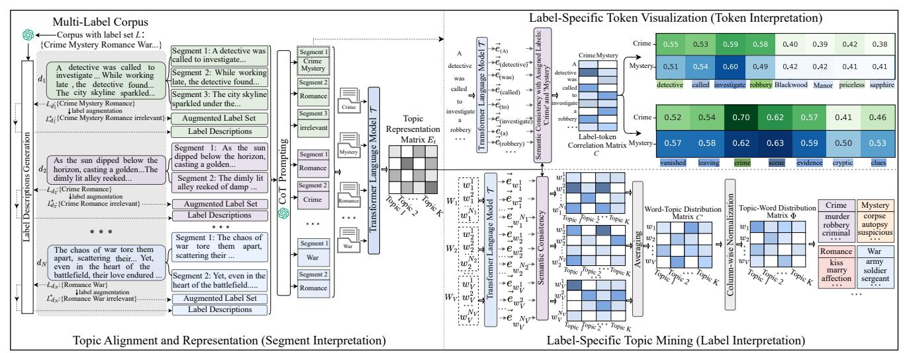
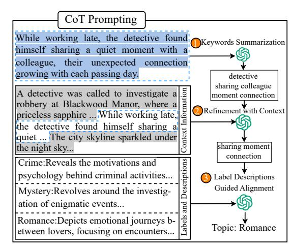
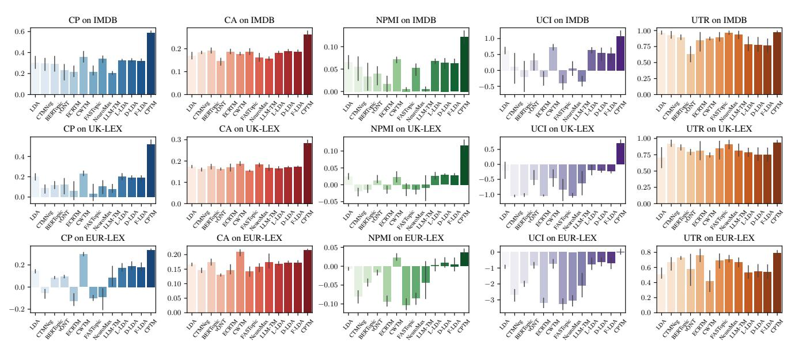
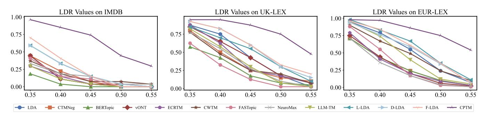
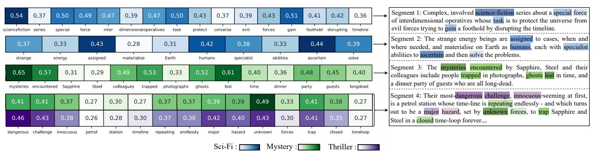
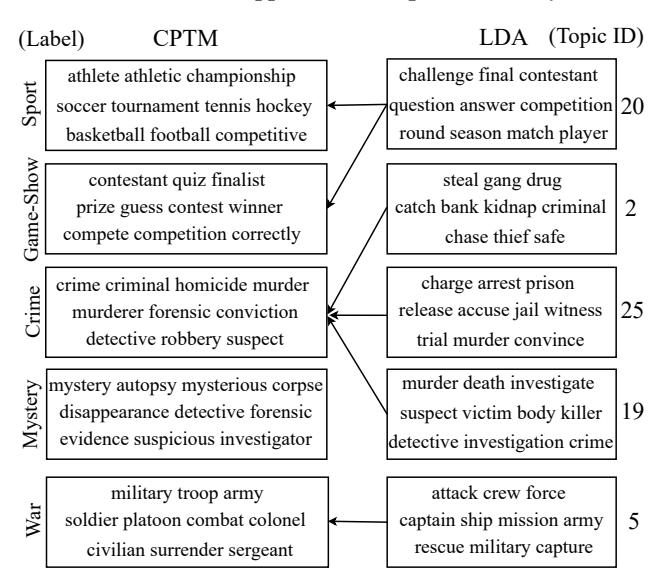

# Towards Multi-Label Text Interpretation with Chain-of-Thought Prompting and Contextualized Knowledge

[Rui Wang](https://orcid.org/0000-0001-9350-3667) School of Computer Science, Nanjing University of Posts and Telecommunications Nanjing, China Intelligent Interconnected Systems Laboratory of Anhui Province, Hefei University of Technology, Hefei, China rui\_wang@njupt.edu.cn

[Ziang Li](https://orcid.org/0009-0008-4158-8118) School of Computer Science, Nanjing University of Posts and Telecommunications Nanjing, China ziang\_li@njupt.edu.cn

[Haiping Huang](https://orcid.org/0000-0002-4392-3599)∗ School of Computer Science, Nanjing University of Posts and Telecommunications Nanjing, China The State Key Laboratory of Tibetan Intelligence, Nanjing University of Posts and Telecommunications, Nanjing, China hhp@njupt.edu.cn

[Jialin Yu](https://orcid.org/0000-0003-1381-2203) Department of Engineering Science, University of Oxford Oxford, United Kingdom jialin.yu@eng.ox.ac.uk

[Yuxiang Zhou](https://orcid.org/0009-0004-3720-9083) School of Electronic Engineering and Computer Science, Queen Mary University of London London, United Kingdom yuxiang.zhou@qmul.ac.uk

[Guozi Sun](https://orcid.org/0000-0003-1888-7001) School of Computer Science, Nanjing University of Posts and Telecommunications Nanjing, China sun@njupt.edu.cn

## Abstract

Existing multi-label topic models face several challenges when interpreting texts annotated with multiple labels: (1) they often associate irrelevant text segments with incorrect labels, which negatively impacts both segment and label interpretation; (2) they fail to effectively capture the semantic relationships between tokens and labels within the segment; (3) they do not integrate contextualized knowledge that could improve interpretability. To overcome these issues, we introduce the Contextualized Prompting Topic Model (CPTM). CPTM utilizes Chain-of-Thought (CoT) prompting to better align text segments with their semantically relevant labels. Furthermore, it integrates label-specific token visualization and topic mining procedure to facilitate the interpretation of tokens and labels. Experimental evaluations conducted on three multi-label text datasets show that CPTM significantly outperforms existing models in both segment and label interpretation. Human assessments also verify CPTM's effectiveness in accurately identifying label-relevant tokens within segments and providing insightful token-level interpretation.

### CCS Concepts

• Information systems → Document topic models.

### Keywords

Topic Alignment, Multi-Label Topic Modeling, Chain-of-Thought Prompting, Text Interpretation

∗Corresponding author.

[This work is licensed under a Creative Commons Attribution 4.0 International License.](https://creativecommons.org/licenses/by/4.0)

WWW '26, Dubai, United Arab Emirates © 2026 Copyright held by the owner/author(s). ACM ISBN 979-8-4007-2307-0/2026/04 <https://doi.org/10.1145/3774904.3792436>

### ACM Reference Format:

Rui Wang, Ziang Li, Haiping Huang, Jialin Yu, Yuxiang Zhou, and Guozi Sun. 2026. Towards Multi-Label Text Interpretation with Chain-of-Thought Prompting and Contextualized Knowledge. In Proceedings of the ACM Web Conference 2026 (WWW '26), April 13–17, 2026, Dubai, United Arab Emirates. ACM, New York, NY, USA, [12](#page-11-0) pages[. https://doi.org/10.1145/3774904.3792436](https://doi.org/10.1145/3774904.3792436)

### 1 Introduction

Textual data often convey multiple thematic concepts and may be annotated with several labels that reflect their semantics. For example, the summary of the movie 'Blindpassasjer' in Fig. [1](#page-1-0) is labeled with 'Mystery', 'Sci-Fi', and 'Thriller'. Such multi-label texts often encounter the Credit Attribution problem [\[23\]](#page-8-0), where multiple labels do not always apply with equal specificity across the text, pointing to a critical need for novel approaches to align segments/tokens to the interpretable labels.

To address this challenge, multi-label text interpretation should meet the following requirements: 1). Segment Interpretation: Each segment should be aligned with the corresponding labels associated with the text, as shown by the colored underlines in Fig. [1](#page-1-0) (top). 2). Token Interpretation: The semantic differences between tokens and their aligned labels within each segment should be captured, as indicated by the intensity of highlighted words in Fig. [1](#page-1-0) (top). 3). Label Interpretation: A semantic interpretation should be provided for labels in the label set, particularly when labels are semantically similar and difficult to distinguish, such as 'Horror', 'Mystery', and 'Thriller' in Fig. [1](#page-1-0) (bottom).

To interpret text in multi-label scenarios, multi-label topic modeling [\[1,](#page-8-1) [7,](#page-8-2) [35\]](#page-8-3) offers a promising direction and has seen significant progress. Ramage et al. [\[23\]](#page-8-0) propose the Labeled-LDA which learns label-word correspondence by establishing a one-to-one mapping between latent topics and labels. Similarly, Wang et al. [\[32\]](#page-8-4) extend the Labeled-LDA by integrating an autoencoding framework, resulting in a neural-based approach called Neural Labeled LDA.

**Summary**:The spaceship Marco Polo is returning from a mission at the newly discovered planet Rossum. While the five members of the crew are in deep sleep a mysterious shape is captured on one of the surveillance monitors. Awakened the crew soon discover that one of their number has been killed, and something is

living among them in the shape of a crewmate. But who is it ??

1 Segment Interpretation: 2 Token Interpretation:

**== Blindpassasjer ==**

Labels: Rate: **+** Review More

7.0

Sci-Fi Thriller irrelevant

Label Interpretation 3

Multi-Labeled Corpus

Label Set: {Horror, Mystery, Thriller...} War

History Sport

Horror Thriller

Docs Mystery

Semantically Similar Labels

Sample

Mystery

Mystery autopsy corpse suspicious ... ... ...

... ... ...

Horror creppy ghost zombie Thriller sinister assassin ruthless

History empire dynasty ancient

Sport player athelete soccer

War soldier army sergeant

Figure 1: Segment and token interpretations of movie summary 'Blindpassasjer', colored underlines indicate labels of segments, and the intensity of highlighted tokens means correlations between tokens and assigned labels. Topics in the box provide label interpretation.

However, these approaches have limitations in the following aspects: 1). They assign tokens from irrelevant segments (highlighted with a black underline in Fig. [1\)](#page-1-0) to predefined labels, thereby affecting the performance of segment and label interpretations. 2). They fail to capture semantic correlations between tokens and labels within segments, hindering token interpretation. 3). They do not integrate external semantic knowledge, particularly contextualized knowledge [\[25\]](#page-8-5) and large language models (LLMs) [\[15,](#page-8-6) [41\]](#page-8-7), to improve interpretation.

To address these limitations, we propose the novel Contextualized Prompting Topic Model (CPTM), which combines the Chain-of-Thought (CoT) prompting [\[33\]](#page-8-8) and a contextualized transformer [\[25\]](#page-8-5) for multi-label text interpretation. Specifically, to align each segment [1](#page-1-1) with semantically relevant labels and the 'irrelevant' label (as shown in Fig. [1\)](#page-1-0), CPTM introduces a CoT reasoning mechanism that integrates keywords, local context, and label descriptions with an LLM for accurate topic alignment. It also constructs the labelspecific topic representations using a transformer [\[25\]](#page-8-5). Using these topic representations, it then devises a label-specific token visualization scheme to mine and visualize the semantic correspondence between tokens and their associated labels for each segment. Additionally, it generates topics that are semantically consistent with labels in the label set using the label-specific topic mining scheme. By incorporating the 'irrelevant' label and contextualized knowledge in LLM [\[28\]](#page-8-9) and transformer [\[25\]](#page-8-5), CPTM enhances multi-label text interpretation at the segment, token and label levels jointly.

The main contributions of this work are:

- We propose the novel Contextualized Prompting Topic Model (CPTM), which is the first attempt to combine advanced prompt engineering and contextualized knowledge for multilabel text interpretation.
- CPTM employs the CoT prompting to integrate keywords, local context, and label descriptions with an LLM, aligning segments with semantically relevant labels for segment

interpretation. Additionally, it performs label and token interpretations using a transformer-based language model.

- Experimental results on three publicly available multi-label text corpora demonstrate that CPTM outperforms state-ofthe-art baselines in segment and label-level interpretations. Furthermore, human evaluation results confirm CPTM's effectiveness in highlighting label-relevant tokens within segments and providing meaningful token interpretation.

### 2 Related Work

Our work is related to three lines of research: multi-label topic modeling, contextualized language models and LLM-based prompt engineering.

### 2.1 Multi-label Topic Modeling

Multi-label topic modeling [\[7\]](#page-8-2), which bridges topic modeling and texts with multiple annotations, provides a direction to multi-label text interpretation.

Several attempts have been made, Ramage et al. [\[23\]](#page-8-0) built a oneto-one correspondence between labels and topics and proposed the Labeled-LDA to address the Credit Attribution problem. Following this, Rubin et al. [\[27\]](#page-8-10) extended the one-to-one assumption in Labeled-LDA and proposed the Dependency-LDA which models the topic as a mixture of labels to capture the dependency between topics and labels. Similarly, Wang et al. [\[32\]](#page-8-4) modeled topics with an autoencoding framework and proposed the Neural Labeled LDA. However, these approaches do not leverage semantic knowledge (such as LLM [\[39\]](#page-8-11) and Contextualized transformer [\[25\]](#page-8-5)) to improve topic quality.

## 2.2 Contextualized Language Models

Contextualized language models, such as the BERT [\[11\]](#page-8-12) and the FLAN-T5 [\[10\]](#page-8-13), have been explored in various Natural Language Processing (NLP) tasks due to their effectiveness in capturing contextualized linguistic information.

Concretely, Patel and Domeniconi [\[20\]](#page-8-14) incorporated the subword attention and post-processing mechanism to propose the SPRUCE for generating high-quality sentence embedding. Hawasly et al. [\[14\]](#page-8-15) explored combining contextualized word representations and clustering algorithms for latent concept discovery. Meanwhile, Meng et al. [\[18\]](#page-8-16) proposed the TopClus, which is a latent space learning and clustering framework built upon contextualized embeddings, for topic extraction. Similarly, Fang et al. [\[12\]](#page-8-17) incorporated the contextualized word representations into the topic modeling and proposed the Contextualized Word Topic Model (CWTM).

### 2.3 LLM-based Prompt Engineering

Advances in LLMs have made them a thriving research topic and have been explored for their robust capabilities in NLP tasks [\[29,](#page-8-18) [30,](#page-8-19) [40\]](#page-8-20).

Meanwhile, Prompt Engineering [\[16,](#page-8-21) [28\]](#page-8-9) has emerged as a crucial approach to extend the capability of LLMs. Radford et al. [\[22\]](#page-8-22) first introduced Zero-shot prompting, which marked a paradigm shift in leveraging LLMs. By providing several demonstrations to induce the target of the given task, Brown [\[5\]](#page-8-23) proposed the Few-shot

1 In this work, the document is segmented by sentence.

Figure 2: The framework of the proposed Contextualized Prompting Topic Model (CPTM).

prompting. Building on this, Wei et al. [\[33\]](#page-8-8) introduced the Chain-of-Thought (CoT) prompting, which guides LLMs to follow a step-bystep reasoning process. More recently, Yao et al. [\[38\]](#page-8-24) proposed Treeof-Thought (ToT) prompting, which further enhances the LLMs' ability to handle complex tasks.

### 3 Problem Formulation

Given a multi-label text corpus �� = {��1,��2,...,����} with an associated label set �� = {��1,��2,...,���� }. Each document �� ∈�� consists of a sequence of text segments (��1, ��2, ..., ���� ) and is linked to multiple labels ���� ={�� �� 1 ,���� 2 , ...,���� ���� } within the label set ��. Here, �� represents the number of segments in document ��, and ���� ≥ 1 indicates the number of labels assigned to ��. The aims of multi-label text interpretation are: 1). Segment Interpretation: For each segment ���� (�� ∈ {1, 2, ..., ��}) in ��, align it with the semantically relevant labels in the document-specific label set ���� . 2). Token Interpretation: For each label assigned to segment ���� , identify tokens in ���� that share similar semantic meanings and emphasize the differences in the semantic correlations between tokens and their corresponding labels. 3). Label Interpretation: For each label ���� ∈��, generate a labelspecific topic that is semantically consistent with ���� to provide a corpus-level label interpretation.

### 4 Methodologies

As shown in Fig. [2,](#page-2-0) our proposed CPTM consists of three components: 1). Topic Alignment and Representation: This module first aligns each segment ���� (�� ∈ {1, 2, ..., ��}) in document �� with the semantically relevant labels in the augmented document-specific label set �� ∗ �� = ���� ∪ 'irrelevant', forming the segment-specific label set ������ = {�� ���� 1 ,������ 2 , ...,������ ������ } [2](#page-2-1) , using a CoT prompting mechanism. Moreover, it also constructs the label-specific topic representation ��® �� �� for the ��-th topic (�� ∈ {1, 2, ..., ��}), thereby forming the topic representation matrix ���� . This matrix is then used for token visualization and topic mining with the transformer language model T. 2). Label-Specific Token Visualization: For each segment and its

Table 1: Key notations and illustrations.

corresponding segment-specific label set pair &lt;���� , ������&gt;, this module computes the semantic similarities between tokens and labels using the transformer T and highlights the label-relevant tokens in the segment. 3). Label-Specific Topic Mining: This module uses the contextualized word representations generated by T to mine topics that are semantically consistent with the labels. Detailed descriptions and functionalities of these components will be presented individually. For ease of illustration, we list notations that appeared in this paper in Table [1.](#page-2-2)

2������ denotes the number of labels in �� ∗ �� assigned to the segment ����

### 4.1 Topic Alignment and Representation

To address the credit attribution problem [\[23\]](#page-8-0) and enable segment interpretation in multi-label text, CPTM first aligns each segment with semantically relevant labels using a CoT prompting mechanism that integrates the keywords information, local context, and label descriptions generated by an LLM into the reasoning process, as shown in the left panel of Fig. [2.](#page-2-0) While working late, the detective found Keywords Summarization CoT Prompting 1

Concretely, for each document �� = (��1,��2, ...,���� ) associated with the label set ���� ={�� �� 1 ,���� 2 , ...,���� ���� }, we first add an 'irrelevant' label to align irrelevant segments and form the associated augmented label set �� ∗ �� . Additionally, we utilize an LLM to generate label descriptions to enrich the semantic information of document-associated labels. himself sharing a quiet moment with a colleague, their unexpected connection growing with each passing day. output Crime:Reveals the motivations and psychology behind criminal activities... detective sharing moment connection

Then, for each segment���� (��∈{1, 2, ..., ��}) in the document, we devise a three-step Chain-of-Thought reasoning mechanism to align the topic accurately, as shown in Fig. [3.](#page-3-0) Similar to human reasoning, CPTM first summarizes the segment's content and identifies keywords, forming a keywords set such as {'detective', 'sharing', 'colleague', 'moment', 'connection'}. Secondly, it filters out irrelevant keywords based on the local context, resulting in a refined keywords set {'sharing', 'moment', 'connection'}. Finally, CPTM aligns the segment with the 'Romance' topic by comparing the semantic correlations between the words in the refined keywords set and the label descriptions. The detailed prompt of this three-step reasoning is shown in Fig. [4,](#page-3-1) which follows the OpenAI released API [3](#page-3-2) . Topic: Romance Mystery:Revolves around the investigation of enigmatic events... Romance:Depicts emotional journeys between lovers, focusing on encounters... A renowned detective was called to investigate a robbery, but as he unraveled the evidence... While working late, the detective found himself sharing a quiet ... The city skyline sparkled under the night sky... Information Synthesis Label DescriptionsContext Informationoutput

Figure 3: CoT reasoning for topic alignment.

Besides, with these LLM-generated &lt;segment: label set&gt; pairs, we could collect all the segments aligned with label ���� ∈ �� and build a label-specific segment collection ���� for topic representation construction.

Specifically, for the ��-th segment �� �� = [�� �� 1 ,�� �� 2 ,...,�� �� ���� �� ] in collection ���� , we could generate its contextualized representation ��® �� with:

[®�� �� 1 , ��® �� 2 , ..., ��® �� ���� �� ] = T ( [�� �� 1 ,�� �� 2 , ...,�� �� ���� �� ]) (1)

��® �� = 1 ���� ∑︁���� �� ��=1 ��® �� �� (2)

| CoT Prompting for                                                              | Topic Alignment           |
|--------------------------------------------------------------------------------|---------------------------|
| Outputs                                                                        | : { Segment : Label Set } |
| content: I have a multi-labeled text segment, Please assign one or more labels | for                       |
| {Segment : Label Set},                                                         |                           |

Figure 4: Details of Chain-of-Thought prompting.

where T (·) is the transformer [\[25\]](#page-8-5), ���� �� means the number of words in segment �� �� , ��® �� �� is the contextualized word representation of the ��-th word in �� �� .

Thus, the topic representation ��® �� corresponding to the ��-th label ���� could be calculated with:

��® �� = 1 ���� ∑︁���� ��=1 ��® �� (3)

where ���� means the number of segments in ���� . Similarly, the topic representation matrix ���� ∈ R ��T ×�� can be constructed and used for token visualization and topic mining. Here, ��T means the dimension of transformer embedding.

### 4.2 Label-Specific Token Visualization

To identify tokens relevant to aligned labels in a segment and visualize the differences in semantic correlations between tokens and labels, we propose a label-specific token visualization scheme using contextualized word representations from the transformer [\[25\]](#page-8-5), as shown in the top-right panel of Fig. [2.](#page-2-0)

In detail, given the ��-th segment ���� in document �� that contains word sequence [�� ′ 1 ,��′ 2 ,...,��′ ������ ] and the LLM-responded segmentspecific label set ������={�� ���� 1 ,������ 2 ,...,������ ������ }, we first compute the contextualized word representations with transformer T:

[��®′ 1, ��®′ 2, ..., ��®′ ������ ] = T ( [�� ′ 1 ,��′ 2 , ...,��′ ������ ]) (4)

where ��®′ �� means the contextualized word representation of �� ′ (�� ∈ {1, 2, ..., ������ }), ������ represents the number of words in segment ���� , ������ indicates the number of labels associated with ���� . Then, the semantic correlations between word �� ′ and the �� ′ -th label �� ���� �� ′ in ������ could be calculated with:

�� �� ′ = cos(��®′ ��, ��® �� �� ���� ��′ ) (5)

where ��® �� �� ���� ��′ represents the topic representation, computed using Eq. [3,](#page-3-3) corresponding to the label �� �� ′ . Likewise, we could construct the label-token correlation matrix ������ ∈ R ������ ×������ to capture the correlations between tokens in segment ���� and labels in ������ , which can then be used to identify and visualize label-relevant tokens (with stopwords omitted in the visualization).

3<https://cookbook.openai.com/examples/>

| Dataset | #Docs  | #Vocabs | #Avg Length | #Labels | #Avg Labels |
|---------|--------|---------|-------------|---------|-------------|
| IMDB    | 85,477 | 5,984   | 23.6        | 27      | 1.99        |
| UK-LEX  | 30,334 | 5,728   | 90.3        | 40      | 1.47        |
| EUR-LEX | 62,133 | 6,675   | 93.9        | 100     | 4.51        |

Figure 5: Detailed comparison on coherence and diversity metrics, the height of colored bars means the average value over four topic number settings, and the length of error bars (black short lines) denotes a 95% confidence interval and indicates the statistical variability.

by human annotators and the proposed CPTM. Specifically, the Kendall's Tau correlation coefficient �� is calculated with:

�� = 2(�� − ��) ��(�� − 1) (12)

where �� and �� denote the number of concordant and discordant instances among two ranked lists, �� represents the number of instances in the ranked list. Similarly, the Spearman's Rank Correlation coefficient �� follows definition:

�� = 1 − 6 Í�� ��=1 �� 2 �� ��(�� 2 − 1) (13)

where ���� means the relative distance of the ��-th instance between two ranked lists, and �� is the number of instances in the list.

### 5.2 Label Interpretation Evaluation

To assess the performance of label interpretation, we consider both topic quality and semantic correlations between extracted topics and labels.

Topic Quality: We first perform the topic quality evaluation with four topic coherence (CP, CA, NPMI and UCI) and topic diversity (UTR) metrics. In detail, we set the topic number to four different values [13](#page-5-0) for each dataset and utilize documents associated with the selected labels to validate the effectiveness and stability of CPTM. The numerical comparison results are provided in Table [3.](#page-5-1) Each value is calculated by averaging the coherence and UTR values across the four topic number settings, with optimal results highlighted in bold. The last column (Rank) presents the overall ranking based on five metrics. Additionally, we present experimental results and error bars in Fig. [5.](#page-5-2) These results show that our proposed CPTM outperforms competitive baselines in coherence and diversity metrics while maintaining shorter error bars, indicating greater

Table 3: The numerical comparison of topic coherence and topic diversity on three datasets.

| Dataset Model    | CP     | CA    | NPMI   | UCI    | UTR   | Rank |
|------------------|--------|-------|--------|--------|-------|------|
| LDA              | 0.302  | 0.170 | 0.065  | 0.616  | 0.968 | 3    |
| CTMNeg           | 0.297  | 0.183 | 0.055  | 0.123  | 0.933 | 7    |
| BERTopic         | 0.293  | 0.192 | 0.033  | -0.200 | 0.898 | 10   |
| vONT             | 0.233  | 0.147 | 0.039  | 0.320  | 0.631 | 9    |
| ECRTM            | 0.217  | 0.187 | 0.016  | -0.203 | 0.852 | 11   |
| CWTM             | 0.358  | 0.178 | 0.071  | 0.726  | 0.877 | 2    |
| FASTopic IMDB    | 0.219  | 0.188 | 0.005  | -0.404 | 0.891 | 13   |
| NeuroMax         | 0.342  | 0.161 | 0.052  | 0.059  | 0.968 | 8    |
| LLM-TM           | 0.207  | 0.157 | 0.005  | -0.353 | 0.940 | 12   |
| L-LDA            | 0.328  | 0.183 | 0.067  | 0.633  | 0.787 | 4    |
| D-LDA            | 0.328  | 0.188 | 0.064  | 0.552  | 0.773 | 5    |
| F-LDA            | 0.322  | 0.187 | 0.063  | 0.533  | 0.768 | 6    |
| CPTM             | 0.587  | 0.261 | 0.122  | 1.143  | 0.973 | 1    |
| LDA              | 0.199  | 0.174 | 0.025  | -0.198 | 0.705 | 5    |
| CTMNeg           | 0.088  | 0.161 | -0.020 | -1.048 | 0.917 | 12   |
| BERTopic         | 0.114  | 0.174 | -0.014 | -1.023 | 0.862 | 11   |
| vONT             | 0.122  | 0.163 | 0.013  | -0.506 | 0.796 | 7    |
| ECRTM            | 0.058  | 0.170 | -0.014 | -1.039 | 0.813 | 13   |
| CWTM             | 0.229  | 0.187 | 0.024  | -0.443 | 0.738 | 6    |
| FASTopic UK-LEX  | 0.032  | 0.154 | -0.012 | -0.830 | 0.845 | 9    |
| NeuroMax         | 0.105  | 0.182 | -0.014 | -1.039 | 0.907 | 10   |
| LLM-TM           | 0.077  | 0.169 | -0.010 | -0.628 | 0.812 | 8    |
| L-LDA            | 0.201  | 0.166 | 0.027  | -0.189 | 0.785 | 2    |
| D-LDA            | 0.192  | 0.171 | 0.029  | -0.206 | 0.751 | 3    |
| F-LDA            | 0.188  | 0.172 | 0.028  | -0.219 | 0.748 | 4    |
| CPTM             | 0.520  | 0.284 | 0.116  | 0.709  | 0.933 | 1    |
| LDA              | 0.146  | 0.166 | -0.006 | -0.903 | 0.506 | 7    |
| CTMNeg           | -0.057 | 0.147 | -0.080 | -2.678 | 0.664 | 10   |
| BERTopic         | 0.084  | 0.173 | -0.043 | -1.973 | 0.726 | 8    |
| vONT             | 0.095  | 0.130 | -0.016 | -0.832 | 0.580 | 6    |
| ECRTM            | -0.128 | 0.146 | -0.094 | -3.191 | 0.758 | 12   |
| CWTM             | 0.296  | 0.208 | 0.023  | -0.739 | 0.419 | 3    |
| FASTopic EUR-LEX | -0.099 | 0.142 | -0.103 | -3.272 | 0.690 | 13   |
| NeuroMax         | -0.093 | 0.157 | -0.084 | -3.027 | 0.707 | 11   |
| LLM-TM           | 0.084  | 0.173 | -0.043 | -2.107 | 0.664 | 9    |
| L-LDA            | 0.171  | 0.168 | 0.003  | -0.759 | 0.530 | 5    |
| D-LDA            | 0.191  | 0.171 | 0.009  | -0.614 | 0.547 | 2    |
| F-LDA            | 0.180  | 0.171 | 0.005  | -0.714 | 0.540 | 4    |
| CPTM             | 0.336  | 0.214 | 0.036  | 0.030  | 0.787 | 1    |

13Topic numbers are set to [7, 14, 21, 27], [10, 20, 30, 40] and [25, 50, 75, 100] for IMDB, UK-LEX and EUR-LEX.

Figure 6: The comparison of LDR metric on IMDB, UK-LEX and EUR-LEX with various threshold parameters ��.

stability across different topic numbers. This improvement in label interpretation can be attributed to two key factors: 1). CoT prompting-based topic alignment helps identify the correct semantic topics for the segments. 2). The incorporation of contextualized knowledge during the topic-mining process enhances topic quality. Semantic Correlations: Beyond the topic quality evaluation, we also examine the semantic correlations between extracted topics and labels. We compute the Label Discovered Rate (LDR) values using Eq. [10](#page-4-10) with threshold hyper-parameter �� set to [0.35, 0.4, 0.45, 0.5, 0.55] on full datasets. As shown in Fig. [6,](#page-6-0) our proposed CPTM obtains more topics that share higher semantical similarity with labels in the label set, indicating superiority in the LDR metric. Additionally, with the increase in ��, CPTM's values decrease more gradually than the baselines, demonstrating its robustness in uncovering label-specific topics.

Table 4: The CS values comparison on three datasets.

| Dataset | L-LDA | D-LDA | F-LDA | CPTM  |
|---------|-------|-------|-------|-------|
| IMDB    | 0.308 | 0.342 | 0.337 | 0.496 |
| UK-LEX  | 0.413 | 0.458 | 0.450 | 0.534 |
| EUR-LEX | 0.405 | 0.389 | 0.406 | 0.529 |

Likewise, we also calculate the Correlation Score with Eq. [11](#page-4-11) and present the values in Table [4.](#page-6-1) Here, topic numbers are set to 27, 40 and 100 for the IMDB, UK-LEX and EUR-LEX, unsupervised baselines are omitted as their extracted topics do not correspond to the specific labels. It can be observed that CPTM surpasses the compared baselines by a large margin, which can be attributed to the accurate topic alignment conducted through the Chain-of-Thought Prompting. Detailed ablation study refers to Appendix [C.](#page-9-2) We also provide topic examples in Appendix [D](#page-10-0) to validate the effectiveness of CPTM in mining coherent and label-specific topics intuitively.

### 5.3 Segment Interpretation Evaluation

A key component of our framework is the LLM-based topic alignment mechanism, which forms the foundation for multi-level interpretation. To evaluate its effectiveness, we conduct experiments on manually annotated test sets. Specifically, we randomly sample three subsets from IMDB/UK-LEX/EUR-LEX datasets and manually annotate each segment with its most appropriate label from the document-specific label set, resulting in 613 (IMDB), 803 (UK-LEX), and 996 (EUR-LEX) annotated <Segment: Label> pairs. Following [\[23\]](#page-8-0), we employ Precision, Recall, MacroF1, and MicroF1 metrics for evaluation.

Table 5: Topic alignment comparison on three datasets.

| Dataset Model | # Precision | # Recall | % MacroF1 | % MicroF1 |
|---------------|-------------|----------|-----------|-----------|
| L-LDA         | 0.468       | 0.483    | 0.450     | 0.492     |
| D-LDA IMDB    | 0.622       | 0.593    | 0.561     | 0.603     |
| F-LDA         | 0.454       | 0.261    | 0.223     | 0.267     |
| CPTM          | 0.768       | 0.817    | 0.743     | 0.804     |
| L-LDA         | 0.518       | 0.543    | 0.489     | 0.553     |
| D-LDA UK-LEX  | 0.685       | 0.612    | 0.586     | 0.628     |
| F-LDA         | 0.675       | 0.589    | 0.547     | 0.572     |
| CPTM          | 0.796       | 0.805    | 0.785     | 0.832     |
| L-LDA         | 0.464       | 0.400    | 0.389     | 0.399     |
| D-LDA EUR-LEX | 0.528       | 0.451    | 0.450     | 0.458     |
| F-LDA         | 0.469       | 0.262    | 0.243     | 0.268     |
| CPTM          | 0.717       | 0.629    | 0.611     | 0.651     |

The experimental results in Table [5](#page-6-2) demonstrate the superior performance of CPTM in segment-level topic alignment compared with multi-labeled approaches. Several factors may contribute to this improvement: 1). The keywords summarization mechanism effectively filters out noise tokens, allowing CPTM to focus on semantically relevant content. 2). The contextual information integration helps calibrate the semantic scope of segments, leading to more accurate topic alignment. 3). The incorporation of label descriptions enriches the semantic representations beyond the limited information contained in label names alone. These results confirm that our LLM-based topic alignment mechanism effectively captures the semantic relationships between segments and labels.

### 5.4 Token Interpretation Evaluation

Token interpretation aims to identify semantic-relevant tokens within the segment for each label associated with the segment. To validate the effectiveness of CPTM in token interpretation, we perform human evaluations.

Firstly, we randomly select 65 <Segment: Label> [14](#page-6-3) pairs for each dataset. For each pair, we select the top five tokens, generated by CPTM, that are semantically relevant to the associated label as ranking candidates. Then, we recruit two expert annotators to rank the candidate tokens according to the semantic similarities between the tokens and the label. To measure the agreements between ranking results provided by human annotators and CPTM, we leverage two ranking metrics: Kendall's Tau Correlation [\[4\]](#page-8-39) and Spearman's Rank Correlation [\[17\]](#page-8-40). The results are presented

14We select segments assigned with one label for simplicity.

Figure 7: Segment and label-specific tokens visualizations of CPTM on movie Sapphire & Steel plot summary.

in Table [6.](#page-7-0) 'Human-Only' indicates the agreement between annotators, 'Human & CPTM' shows the agreement between annotators and CPTM. These statistics reflect the strong agreement between human judgments and CPTM's ranking results. Details of human evaluations please refer to Appendix [E.](#page-10-1)

Table 6: The measured agreement with Kendall's Tau Correlation and Spearman's Rank Correlation.

### 5.5 Visualization

To provide an intuitive insight into the multi-level interpretation capability of CPTM, we visualize segment-level, token-level, and label-level analyses. Fig. [7](#page-7-1) illustrates the segment and token interpretations of the movie plot summary "Sapphire & Steel" in the IMDB dataset. At the segment level, CPTM identifies distinct topical transitions: the initial segments are associated with 'Sci-Fi', followed by a segment related to 'Mystery', and concluding with a segment that exhibits dual topics of 'Mystery' and 'Thriller'. On the right of Fig. [7,](#page-7-1) the token-level visualization reveals the semantic relationships between individual tokens and their assigned labels. The top-5 most significant tokens are highlighted in the segments and stopwords are excluded for clarity. Jack discovers the bodies of six additional Coral Snake Commandos as a Tactical Team gets closer to the bomb's location. Division sends in Brad Hammond to look into CTU LA's situation. Action Thriller

At the label level, Fig. [8](#page-7-2) presents representative topics extracted by CPTM and LDA for corresponding label categories, revealing several key advantages of our approach. While LDA struggles to maintain semantic distinctions between related categories (e.g., 'Sport' and 'Game-Show'), CPTM successfully preserves these fine-grained topical boundaries. Furthermore, CPTM demonstrates better topic discovery capabilities, identifying topics like 'Mystery' that LDA fails to capture. This can be attributed to two key factors: 1). The integration of label signals through CoT prompting for label-topic correspondence. 2). The incorporation of contextualized knowledge in the mining process, which contributes to higher topic quality. Stanton finally reveals that he has known about the bomb all along and allowed it be smuggled Action Crime athlete athletic championship soccer tournament tennis hockey basketball football competitive contestant quiz finalist prize guess contest winner compete competition correctly challenge final contestant question answer competition round season match player steal gang drug catch bank kidnap criminal chase thief safe (Label) (Topic ID) Model LDA 20 2

### 6 Conclusion crime criminal homicide murder murderer charge arrest prison release accuse

In this paper, we have proposed the Contextualized Prompting Topic Model (CPTM) for interpreting multi-label text corpora at forensic conviction detective robbery suspect mystery autopsy mysterious disappearance corpse jail witness trial murder convince murder death investigate suspect victim 25

(Label) Model athlete athletic championship soccer tournament tennis hockey basketball football competitive contestant quiz finalist prize guess contest winner compete competition correctly crime criminal homicide murder murderer forensic conviction challenge final contestant question answer competition round season match player steal gang drug catch bank kidnap criminal chase thief safe charge arrest prison release accuse jail witness LDA (Topic ID) CrimeGame-ShowSportsegment, token and label levels. CPTM integrates keywords, local context, and label description information with a large language model (LLM), and employs a Chain-of-Thought (CoT) prompting for precise topic alignment. Additionally, it leverages semantic knowledge in transformers to visualize label-specific tokens within segments and generate label-specific topics for token and label interpretations. Experimental results on three multi-label text corpora reveal that CPTM outperforms state-of-the-art baselines in segment and label interpretations. Furthermore, human evaluation results further validate the effectiveness of CPTM in identifying label-relevant tokens and providing token-level interpretation.

### mystery autopsy mysterious corpse 7 Acknowledgements

disappearance detective forensic evidence suspicious investigator military troop army soldier platoon combat colonel civilian surrender sergeant suspect victim body killer detective investigation crime attack crew force captain ship mission army rescue military capture WarMysteryThis work is supported by the National Natural Science Foundation of China (Grant No. 62102192), the fellowship of China Postdoctoral Science Foundation (Grant No. 2022M710071), the Fundamental Research Funds for the Central Universities of China (Grant No. PA2025IISL0107) and the Innovation and Entrepreneurship Program of Jiangsu Province (Grant No. JSSCBS20210530). JY acknowledges support from Microsoft Ltd. This work is supported by the UKRI grant: Turing AI Fellowship EP/W002981/1.

detective robbery suspect

trial murder convince

Figure 8: Topic examples comparison with LDA.

### References

[1] Aly Abdelrazek, Yomna Eid, Eman Gawish, Walaa Medhat, and Ahmed Hassan Yousef. 2023. Topic modeling algorithms and applications: A survey. Inf. Syst. 112 (2023), 102131. [2] Suman Adhya, Avishek Lahiri, Debarshi Kumar Sanyal, and Partha Pratim Das. 2022. Improving Contextualized Topic Models with Negative Sampling. In Proceedings of the 19th International Conference on Natural Language Processing, ICON 2022, New Delhi, India, December 15-18, 2022. 128–138. [3] David M. Blei, Andrew Y. Ng, and Michael I. Jordan. 2001. Latent Dirichlet Allocation. In Advances in Neural Information Processing Systems 14 [Neural Information Processing Systems: Natural and Synthetic, NIPS 2001, December 3-8, 2001, Vancouver, British Columbia, Canada]. 601–608. [4] Claudio Giovanni Borroni. 2013. A new rank correlation measure. Statistical papers 54 (2013), 255–270. [5] Tom B Brown. 2020. Language models are few-shot learners. arXiv preprint arXiv:2005.14165 (2020). [6] Sophie Burkhardt and Stefan Kramer. 2018. Online multi-label dependency topic models for text classification. Mach. Learn. 107, 5 (2018), 859–886. [7] Sophie Burkhardt and Stefan Kramer. 2019. A Survey of Multi-Label Topic Models. SIGKDD Explor. 21, 2 (2019), 61–79. [8] Ilias Chalkidis, Manos Fergadiotis, Prodromos Malakasiotis, and Ion Androutsopoulos. 2019. Large-Scale Multi-Label Text Classification on EU Legislation. In Proceedings of the 57th Conference of the Association for Computational Linguistics, ACL 2019. 6314–6322. [9] Ilias Chalkidis and Anders Søgaard. 2022. Improved Multi-label Classification under Temporal Concept Drift: Rethinking Group-Robust Algorithms in a Label-Wise Setting. In Findings of the Association for Computational Linguistics: ACL 2022, Dublin, Ireland, May 22-27, 2022. 2441–2454. [10] Hyung Won Chung, Le Hou, Shayne Longpre, Barret Zoph, Yi Tay, William Fedus, Yunxuan Li, Xuezhi Wang, Mostafa Dehghani, Siddhartha Brahma, Albert Webson, Shixiang Shane Gu, Zhuyun Dai, Mirac Suzgun, Xinyun Chen, Aakanksha Chowdhery, Alex Castro-Ros, Marie Pellat, Kevin Robinson, Dasha Valter, Sharan Narang, Gaurav Mishra, Adams Yu, Vincent Y. Zhao, Yanping Huang, Andrew M. Dai, Hongkun Yu, Slav Petrov, Ed H. Chi, Jeff Dean, Jacob Devlin, Adam Roberts, Denny Zhou, Quoc V. Le, and Jason Wei. 2024. Scaling Instruction-Finetuned Language Models. J. Mach. Learn. Res. 25 (2024), 70:1–70:53. [11] Jacob Devlin, Ming-Wei Chang, Kenton Lee, and Kristina Toutanova. 2019. BERT: Pre-training of Deep Bidirectional Transformers for Language Understanding. In Proceedings of the 2019 Conference of the North American Chapter of the Association for Computational Linguistics: Human Language Technologies, NAACL-HLT 2019, Volume 1 (Long and Short Papers). 4171–4186. [12] Zheng Fang, Yulan He, and Rob Procter. 2024. CWTM: Leveraging Contextualized Word Embeddings from BERT for Neural Topic Modeling. In Proceedings of the 2024 Joint International Conference on Computational Linguistics, Language Resources and Evaluation, LREC/COLING 2024, Torino, Italy. 4273–4286. [13] Maarten Grootendorst. 2022. BERTopic: Neural topic modeling with a class-based TF-IDF procedure. CoRR abs/2203.05794 (2022). [14] Majd Hawasly, Fahim Dalvi, and Nadir Durrani. 2024. Scaling up Discovery of Latent Concepts in Deep NLP Models. In Proceedings of the 18th Conference of the European Chapter of the Association for Computational Linguistics (Volume 1: Long Papers). 793–806. [15] Katikapalli Subramanyam Kalyan. 2024. A survey of GPT-3 family large language models including ChatGPT and GPT-4. Nat. Lang. Process. J. 6 (2024), 100048. [16] Yilun Liu, Shimin Tao, Weibin Meng, Feiyu Yao, Xiaofeng Zhao, and Hao Yang. 2024. LogPrompt: Prompt Engineering Towards Zero-Shot and Interpretable Log Analysis. In Proceedings of the 2024 IEEE/ACM 46th International Conference on Software Engineering: Companion Proceedings, ICSE Companion 2024, Lisbon, Portugal, April 14-20, 2024. 364–365. [17] Thomas W MacFarland, Jan M Yates, Thomas W MacFarland, and Jan M Yates. 2016. Spearman's rank-difference coefficient of correlation. Introduction to nonparametric statistics for the Biological Sciences using R (2016), 249–297. [18] Yu Meng, Yunyi Zhang, Jiaxin Huang, Yu Zhang, and Jiawei Han. 2022. Topic Discovery via Latent Space Clustering of Pretrained Language Model Representations. In WWW '22: The ACM Web Conference 2022, Virtual Event, Lyon, France, April 25 - 29, 2022. 3143–3152. [19] Yida Mu, Chun Dong, Kalina Bontcheva, and Xingyi Song. 2024. Large Language Models Offer an Alternative to the Traditional Approach of Topic Modelling. In Proceedings of the 2024 Joint International Conference on Computational Linguistics, Language Resources and Evaluation, LREC/COLING 2024, 20-25 May, 2024, Torino, Italy. 10160–10171. [20] Raj Patel and Carlotta Domeniconi. 2024. Subword Attention and Post-Processing for Rare and Unknown Contextualized Embeddings. In Findings of the Association for Computational Linguistics: NAACL 2024. Mexico City, Mexico, 1383–1389. [21] Duy-Tung Pham, Thien Trang Nguyen Vu, Tung Nguyen, Linh Ngo Van, Duc Anh Nguyen, and Thien Huu Nguyen. 2024. NeuroMax: Enhancing Neural Topic Modeling via Maximizing Mutual Information and Group Topic Regularization. In Findings of the Association for Computational Linguistics: EMNLP 2024, Miami, Florida, USA, November 12-16, 2024, Yaser Al-Onaizan, Mohit Bansal, and Yun-Nung Chen (Eds.). 7758–7772. [22] Alec Radford, Jeffrey Wu, Rewon Child, David Luan, Dario Amodei, Ilya Sutskever, et al. 2019. Language models are unsupervised multitask learners. OpenAI blog 1, 8 (2019), 9. [23] Daniel Ramage, David Hall, Ramesh Nallapati, and Christopher D. Manning. 2009. Labeled LDA: A supervised topic model for credit attribution in multi-labeled corpora. In Proceedings of the 2009 Conference on Empirical Methods in Natural Language Processing, EMNLP 2009. 248–256. [24] Zeeshan Rasheed and Mubarak Shah. 2002. Movie Genre Classification By Exploiting Audio-Visual Features Of Previews. In 16th International Conference on Pattern Recognition, ICPR 2002. 1086–1089. [25] Nils Reimers and Iryna Gurevych. 2019. Sentence-BERT: Sentence Embeddings using Siamese BERT-Networks. In Proceedings of the 2019 Conference on Empirical Methods in Natural Language Processing and the 9th International Joint Conference on Natural Language Processing, EMNLP-IJCNLP 2019. 3980–3990. [26] Michael Röder, Andreas Both, and Alexander Hinneburg. 2015. Exploring the Space of Topic Coherence Measures. In Proceedings of the Eighth ACM International Conference on Web Search and Data Mining, WSDM 2015. 399–408. [27] Timothy N. Rubin, America Chambers, Padhraic Smyth, and Mark Steyvers. 2012. Statistical topic models for multi-label document classification. Mach. Learn. 88 (2012), 157–208. [28] Pranab Sahoo, Ayush Kumar Singh, Sriparna Saha, Vinija Jain, Samrat Mondal, and Aman Chadha. 2024. A Systematic Survey of Prompt Engineering in Large Language Models: Techniques and Applications. CoRR abs/2402.07927 (2024). [29] Joan Santoso, Patrick Sutanto, Billy Cahyadi, and Esther Setiawan. 2024. Pushing the Limits of Low-Resource NER Using LLM Artificial Data Generation. In Findings of the Association for Computational Linguistics: ACL 2024. Bangkok, Thailand, 9652–9667. [30] Tempest A. van Schaik and Brittany Pugh. 2024. A Field Guide to Automatic Evaluation of LLM-Generated Summaries. In Proceedings of the 47th International ACM SIGIR Conference on Research and Development in Information Retrieval, SIGIR 2024, Washington DC, USA, July 14-18, 2024. 2832–2836. [31] Rui Wang, Deyu Zhou, Haiping Huang, and Yongquan Zhou. 2024. MIT: Mutual Information Topic Model for Diverse Topic Extraction. IEEE Transactions on Neural Networks and Learning Systems (2024). [32] Wei Wang, Bing Guo, Yan Shen, Han Yang, Yaosen Chen, and Xinhua Suo. 2021. Neural labeled LDA: a topic model for semi-supervised document classification. Soft Comput. 25, 23 (2021), 14561–14571. [33] Jason Wei, Xuezhi Wang, Dale Schuurmans, Maarten Bosma, Brian Ichter, Fei Xia, Ed H. Chi, Quoc V. Le, and Denny Zhou. 2022. Chain-of-Thought Prompting Elicits Reasoning in Large Language Models. In Advances in Neural Information Processing Systems 35: Annual Conference on Neural Information Processing Systems 2022. [34] Xiaobao Wu, Xinshuai Dong, Thong Thanh Nguyen, and Anh Tuan Luu. 2023. Effective Neural Topic Modeling with Embedding Clustering Regularization. In International Conference on Machine Learning, ICML 2023 (Proceedings of Machine Learning Research). 37335–37357. [35] Xiaobao Wu, Thong Nguyen, and Anh Tuan Luu. 2024. A survey on neural topic models: methods, applications, and challenges. Artif. Intell. Rev. 57, 2 (2024), 18. [36] Xiaobao Wu, Thong Nguyen, Delvin Zhang, William Yang Wang, and Anh Tuan Luu. 2024. FASTopic: Pretrained Transformer is a Fast, Adaptive, Stable, and Transferable Topic Model. In Advances in Neural Information Processing Systems 38: Annual Conference on Neural Information Processing Systems 2024, NeurIPS 2024, Amir Globersons, Lester Mackey, Danielle Belgrave, Angela Fan, Ulrich Paquet, Jakub M. Tomczak, and Cheng Zhang (Eds.). [37] Weijie Xu, Xiaoyu Jiang, Srinivasan Sengamedu Hanumantha Rao, Francis Iannacci, and Jinjin Zhao. 2023. vONTSS: vMF based semi-supervised neural topic modeling with optimal transport. In Findings of the Association for Computational Linguistics: ACL 2023, Toronto, Canada, July 9-14, 2023. 4433–4457. [38] Shunyu Yao, Dian Yu, Jeffrey Zhao, Izhak Shafran, Tom Griffiths, Yuan Cao, and Karthik Narasimhan. 2023. Tree of Thoughts: Deliberate Problem Solving with Large Language Models. In Advances in Neural Information Processing Systems 36: Annual Conference on Neural Information Processing Systems 2023, NeurIPS 2023, New Orleans, LA, USA, December 10 - 16, 2023. [39] Junjie Ye, Xuanting Chen, Nuo Xu, Can Zu, Zekai Shao, Shichun Liu, Yuhan Cui, Zeyang Zhou, Chao Gong, Yang Shen, Jie Zhou, Siming Chen, Tao Gui, Qi Zhang, and Xuanjing Huang. 2023. A Comprehensive Capability Analysis of GPT-3 and GPT-3.5 Series Models. CoRR abs/2303.10420 (2023). [40] Yuwei Zhang, Zihan Wang, and Jingbo Shang. 2023. ClusterLLM: Large Language Models as a Guide for Text Clustering. In Proceedings of the 2023 Conference on Empirical Methods in Natural Language Processing, EMNLP 2023, Singapore, December 6-10, 2023. 13903–13920. [41] Yuxiang Zhou, Jiazheng Li, Yanzheng Xiang, Hanqi Yan, Lin Gui, and Yulan He. 2024. The Mystery of In-Context Learning: A Comprehensive Survey on Interpretation and Analysis. In Proceedings of the 2024 Conference on Empirical Methods in Natural Language Processing, EMNLP 2024, Miami, FL, USA, November 12-16, 2024. 14365–14378.

### A Baselines

We choose the following state-of-the-art unsupervised (•) and multilabel (∗) topic models as baselines:

- LDA [\[3\]](#page-8-28) is the most widely used topic model based on Bayesian statistics [15](#page-9-3) .
- CTMNeg [\[2\]](#page-8-29) is a contextualized neural topic model based on contrastive learning and negative sampling [16](#page-9-4) .
- BERTopic [\[13\]](#page-8-30) is a topic mining approach based on contextualized representation learning [17](#page-9-5) .
- vONT [\[37\]](#page-8-31) is a VAE-based neural topic model which models topics with von Mises-Fisher distribution [18](#page-9-6) .
- ECRTM [\[34\]](#page-8-32) is a neural topic model based on the optimal transport [19](#page-9-7) .
- CWTM [\[12\]](#page-8-17) is a neural topic model based on pre-trained language model [20](#page-9-8) .
- FASTopic [\[36\]](#page-8-33) leverages optimal transport between the document, topic, and word embeddings from pre-trained transformers to model topics [21](#page-9-9) .
- NeuroMax [\[21\]](#page-8-34) is a neural topic model based on PLMs and mutual information [22](#page-9-10) .
- LLM-TM [\[19\]](#page-8-35) is a topic mining approach based on LLM and prompt engineering [23](#page-9-11) . ∗ Labeled-LDA [\[23\]](#page-8-0) is the first multi-label topic model which aims to mine label-specific topics [24](#page-9-12) . ∗ Dependency-LDA [\[27\]](#page-8-10) is an extension of Labeled-LDA, it models each topic as a mixture of labels to capture the dependency between topics and labels [25](#page-9-13) . ∗ Fast Dep.-LLDA [\[6\]](#page-8-36) extends the Dependency-LDA with a greedy layer-wise training mechanism for acceleration [26](#page-9-14) .

## B Implementation Details

All experiments are conducted on a machine running Ubuntu, equipped with an NVIDIA RTX 3090Ti GPU (CUDA 12.2) and 64GB RAM. In our main experiments, we employ GPT-3.5-Turbo [27](#page-9-15) as the LLM for topic alignment and all-mpnet-base-v2 [28](#page-9-16) as the PLM for topic mining and token visualization.

### C Ablation Study

To further investigate the effectiveness of different components in CPTM, we conduct ablation studies on the IMDB dataset with 7 topics. The experiments focus on four critical aspects: the analysis of CoT prompting strategies, the impact of different LLMs, the

selection of PLMs, and the effectiveness of irrelevant segment handling. For comparison, we focus on CWTM as the representative unsupervised approach and L-LDA as the multi-label approach due to their superior performance in the baselines.

CoT Prompting Analysis: To validate the effectiveness of our prompt, we compare it with the Standard CoT [\[33\]](#page-8-8) and Hierarchical CoT [\[38\]](#page-8-24) on topic modeling performance. Also, the prompt in CPTM consists of different procedures and information for topic alignment. To understand the contribution of different prompting components, we ablate our prompting strategy by removing three key elements: keywords summarization, label descriptions, and contextual information from the complete prompt. Table [7](#page-9-17) presents the detailed comparison across different configurations. The results demonstrate that our prompt outperforms the existing advanced prompting strategies and each component contributes meaningfully to the performance of topic quality. Notably, the zero-shot setting, which excludes all specialized prompting components, shows the lowest performance. Even in its most basic configuration, CPTM maintains superior performance compared to baseline methods.

Table 7: Comparison of different CoT prompting components on topic modeling performance.

|              | Model & Strategy   | CP    | CA    | NPMI  | UCI   | UTR   | CS    |
|--------------|--------------------|-------|-------|-------|-------|-------|-------|
| CWTM         |                    | 0.286 | 0.171 | 0.060 | 0.671 | 0.885 | –     |
| L-LDA        |                    | 0.322 | 0.186 | 0.073 | 0.771 | 0.971 | 0.382 |
| Standard     | CoT                | 0.531 | 0.264 | 0.125 | 1.354 | 0.986 | 0.467 |
| Hierarchical | CoT                | 0.559 | 0.277 | 0.135 | 1.432 | 1.000 | 0.452 |
| Zero-Shot    |                    | 0.524 | 0.255 | 0.121 | 1.322 | 0.986 | 0.472 |
| w/o          | Keywords           | 0.542 | 0.259 | 0.128 | 1.414 | 0.986 | 0.466 |
| w/o          | Label Descriptions | 0.544 | 0.266 | 0.130 | 1.423 | 0.986 | 0.459 |
| w/o          | Context            | 0.551 | 0.263 | 0.127 | 1.404 | 0.986 | 0.456 |
| w/           | all-Information    | 0.602 | 0.278 | 0.140 | 1.435 | 1.000 | 0.481 |

Impact of Different LLMs: To study the generalizability of our approach across different LLMs, we evaluate CPTM with six popular LLMs: Mistral-Nemo [29](#page-9-18), Mistral-Large [30](#page-9-19), GPT-3.5-Turbo [31](#page-9-20), GPT-4o [32](#page-9-21), GPT-4o-mini [33](#page-9-22), and GPT-4 [34](#page-9-23) and three recently emerged reasoning LLMs: o1 [35](#page-9-24), o3-mini [36](#page-9-25), and DeepSeek-R1 [37](#page-9-26). The detailed results are listed in Table [9.](#page-10-2) While all CPTM variants outperform the baseline methods in topic quality, GPT-4 achieves the best results across all evaluation criteria. Furthermore, the evaluation statistics indicate that all variants exhibit improved capability in mining topics with higher semantic consistency with labels.

PLM Selection Analysis: We also explore the impact of different PLMs on the performance of CPTM. Table [10](#page-10-3) presents results across six widely-adopted PLMs. The experimental results demonstrate that although the numerical statistics fluctuate with different PLM architectures, CPTM consistently outperforms comparable

15<https://mimno.github.io/Mallet/>

16<https://github.com/AdhyaSuman/CTMNeg>

17<https://github.com/MaartenGr/BERTopic>

18<https://github.com/xuweijieshuai/NeuralTopicModeling-vmf>

19<https://github.com/bobxwu/ecrtm>

20<https://github.com/Fitz-like-coding/CWTM>

21<https://github.com/bobxwu/FASTopic>

22<https://github.com/Fsoft-AIC/NeuroMax>

23<https://github.com/GateNLP/LLMs-for-Topic-Modeling>

24<https://github.com/JoeZJH/Labeled-LDA-Python> 25<https://github.com/timothyrubin/DependencyLDA>

26<https://github.com/sophieburkhardt/Multi-Label-Topic-Modeling>

27<https://openai.com/index/gpt-3-5-turbo-fine-tuning-and-api-updates/>

28<https://huggingface.co/sentence-transformers/all-mpnet-base-v2>

29<https://mistral.ai/news/mistral-nemo>

30<https://mistral.ai/en/news/mistral-large>

31<https://openai.com/index/gpt-3-5-turbo-fine-tuning-and-api-updates/>

32<https://platform.openai.com/docs/models/gpt-4o>

33<https://openai.com/index/gpt-4o-mini-advancing-cost-efficient-intelligence/>

34<https://openai.com/index/gpt-4-api-general-availability/>

35<https://openai.com/o1/>

36<https://openai.com/index/openai-o3-mini/>

37<https://api-docs.deepseek.com/news/news250120>

Table 8: Comparison of irrelevant segments ablation on the IMDB dataset, 'w/' and 'w/o' mean with and without irrelevant segments, Δ columns (Δ���� , Δ����, Δ�� ������ , Δ������ and Δ���� ��) are increments of filtering the irrelevant segments.

| Model    | CP (w/) | CP (w/o) | Δ ����  | CA (w/) | CA (w/o) | Δ ����  | NPMI (w/) | NPMI  | (w/o) Δ �� ������ | UCI (w/) | UCI (w/o) | Δ ������ | UTR (w/) | UTR (w/o) | Δ ���� �� |
|----------|---------|----------|---------|---------|----------|---------|-----------|-------|-------------------|----------|-----------|----------|----------|-----------|-----------|
| LDA      | 0.245   | 0.269    | + 0.024 | 0.158   | 0.169    | + 0.011 | 0.050     | 0.061 | + 0.011           | 0.510    | 0.621     | + 0.111  | 1.000    | 1.000     | –         |
| CTMNeg   | 0.192   | 0.274    | + 0.082 | 0.178   | 0.196    | + 0.018 | 0.010     | 0.029 | + 0.019           | -0.699   | -0.479    | + 0.220  | 1.000    | 1.000     | –         |
| BERTopic | 0.377   | 0.430    | + 0.053 | 0.207   | 0.253    | + 0.046 | 0.075     | 0.107 | + 0.032           | 0.576    | 1.035     | + 0.459  | 0.943    | 0.957     | + 0.014   |
| vONT     | 0.091   | 0.106    | + 0.015 | 0.117   | 0.122    | + 0.005 | 0.001     | 0.010 | + 0.009           | -0.157   | -0.040    | + 0.117  | 0.757    | 0.786     | + 0.029   |
| ECRTM    | 0.216   | 0.299    | + 0.083 | 0.183   | 0.220    | + 0.037 | 0.044     | 0.058 | + 0.014           | -0.019   | 0.373     | + 0.392  | 1.000    | 1.000     | –         |
| CWTM     | 0.286   | 0.379    | + 0.093 | 0.171   | 0.204    | + 0.033 | 0.060     | 0.083 | + 0.023           | 0.671    | 0.878     | + 0.207  | 0.885    | 0.957     | + 0.072   |
| FASTopic | 0.299   | 0.342    | + 0.043 | 0.208   | 0.212    | + 0.004 | 0.007     | 0.077 | + 0.070           | -0.038   | 0.769     | + 0.807  | 1.000    | 1.000     | –         |
| NeuroMax | 0.285   | 0.371    | + 0.086 | 0.158   | 0.239    | + 0.081 | 0.061     | 0.077 | + 0.016           | 0.376    | 0.504     | + 0.128  | 0.971    | 1.000     | + 0.029   |
| LLM-TM   | 0.215   | 0.506    | + 0.291 | 0.156   | 0.238    | + 0.082 | 0.006     | 0.111 | + 0.105           | -0.425   | 1.059     | + 1.484  | 0.957    | 0.971     | + 0.014   |
| L-LDA    | 0.322   | 0.356    | + 0.034 | 0.186   | 0.202    | + 0.016 | 0.073     | 0.077 | + 0.004           | 0.771    | 0.795     | + 0.024  | 0.971    | 0.986     | + 0.015   |
| D-LDA    | 0.338   | 0.363    | + 0.025 | 0.200   | 0.206    | + 0.006 | 0.074     | 0.085 | + 0.011           | 0.667    | 0.905     | + 0.238  | 0.914    | 0.943     | + 0.029   |
| F-LDA    | 0.334   | 0.385    | + 0.051 | 0.197   | 0.211    | + 0.014 | 0.072     | 0.091 | + 0.019           | 0.652    | 0.974     | + 0.322  | 0.914    | 0.929     | + 0.015   |
| CPTM     | 0.570   | 0.602    | + 0.032 | 0.274   | 0.278    | + 0.004 | 0.133     | 0.140 | + 0.007           | 1.323    | 1.435     | + 0.112  | 1.000    | 1.000     | –         |

Table 9: Comparison of CPTM with different LLMs.

| Model               | CP    | CA    | NPMI  | UCI   | UTR   | CS    |
|---------------------|-------|-------|-------|-------|-------|-------|
| CWTM                | 0.286 | 0.171 | 0.060 | 0.671 | 0.885 | –     |
| L-LDA               | 0.322 | 0.186 | 0.073 | 0.771 | 0.971 | 0.382 |
| CPTM(Mistral-Nemo)  | 0.574 | 0.267 | 0.132 | 1.467 | 1.000 | 0.481 |
| CPTM(Mistral-Large) | 0.624 | 0.273 | 0.140 | 1.581 | 1.000 | 0.481 |
| CPTM(GPT-3.5-Turbo) | 0.602 | 0.278 | 0.140 | 1.435 | 1.000 | 0.481 |
| CPTM(GPT-4o)        | 0.613 | 0.279 | 0.143 | 1.603 | 1.000 | 0.485 |
| CPTM(GPT-4o-mini)   | 0.646 | 0.279 | 0.141 | 1.529 | 1.000 | 0.480 |
| CPTM(o1)            | 0.508 | 0.260 | 0.120 | 1.284 | 1.000 | 0.466 |
| CPTM(o3-mini)       | 0.516 | 0.262 | 0.120 | 1.263 | 1.000 | 0.486 |
| CPTM(DeepSeek-R1)   | 0.514 | 0.241 | 0.113 | 1.231 | 1.000 | 0.485 |
| CPTM(GPT-4)         | 0.650 | 0.287 | 0.152 | 1.760 | 1.000 | 0.488 |

approaches. This consistency proves its robustness to the selection of PLMs.

Table 10: Analysis of CPTM performance with various PLM architectures.

| Model                               | CP    | CA    | NPMI  | UCI   | UTR   | CS    |
|-------------------------------------|-------|-------|-------|-------|-------|-------|
| CWTM                                | 0.286 | 0.171 | 0.060 | 0.671 | 0.885 | –     |
| L-LDA                               | 0.322 | 0.186 | 0.073 | 0.771 | 0.971 | 0.382 |
| CPTM(bert-base-uncased 38 )         | 0.508 | 0.245 | 0.117 | 1.288 | 1.000 | 0.434 |
| CPTM(bert-base-nli-mean-tokens 39 ) | 0.543 | 0.255 | 0.117 | 1.217 | 1.000 | 0.421 |
| CPTM(sentenceT5 40 )                | 0.625 | 0.260 | 0.139 | 1.591 | 1.000 | 0.490 |
| CPTM(all-mpnet-base-v2 41 )         | 0.602 | 0.278 | 0.140 | 1.435 | 1.000 | 0.481 |
| CPTM(all-MiniLM-L6-v2 42 )          | 0.654 | 0.290 | 0.141 | 1.552 | 1.000 | 0.484 |
| CPTM(paraphrase-MiniLM-L6-v2 43 )   | 0.668 | 0.288 | 0.151 | 1.596 | 1.000 | 0.480 |

Irrelevant Segments Analysis: A distinctive assumption of CPTM is its ability to ignore irrelevant segments that are not related to the document-annotated labels through the incorporation of an 'irrelevant' label. To validate this design choice, we conduct experiments to observe the impact of the 'irrelevant' label for the label interpretation. Concretely, with the feedback from LLMs, we filter out the irrelevant segments in documents and explore the topic quality variation. The comparative analysis in Table [8](#page-10-4) reveals consistent improvements in topic quality metrics when irrelevant segments are properly identified and filtered.

### D Topic Examples

To demonstrate the effectiveness of CPTM in extracting coherent and label-specific topics, we present the topics extracted by both CPTM and L-LDA from the IMDB dataset, with the number of topics set to 27.

From the topics extracted in Table [11,](#page-11-1) we could observe the following findings: 1). CPTM generates more coherent topics than

L-LDA. 2). Topics extracted by CPTM exhibit stronger semantic correlations with the labels. 3) CPTM extracts topics that are semantically relevant to all labels, whereas L-LDA fails to identify topics related to 'Adult', 'Animation', 'Drama', 'Comedy', 'Documentary', 'Family', 'Musical' and 'Mystery'. These improvements can be attributed to the following factors: 1). CoT prompting aligns segments with semantically relevant labels more accurately. 2). The transformer-based topic-mining framework integrates semantic knowledge into the modeling process, enhancing the quality of the extracted topics. **Human Evaluation---Token Interpretation** Your task is to assess the semantic relevance of each of the five given words to the label associated with the provided sentence. Then, rank these five words from highest to lowest based on their relevance and fill in the blanks accordingly.

### E Details of Human Evaluations and its assigned label is : { Sport }

To conduct human evaluations on token interpretation, we invited two master's students majoring in computer science, both of whom are familiar with natural language processing. Both participants are informed that they are conducting human evaluations using an automatic method, and that no private information is collected during the evaluation process. The instructions used in the human evaluation experiments are shown in Fig. [9](#page-10-5) Submit (1) (2) (3) (4) (5)

Figure 9: Human evaluation example in the token interpretation section.

Table 11: Topic words comparison with L-LDA on IMDB dataset (27 labels), '—' means no matched label.

| Model Labels/Topics |             |              |               |                |                 |              | Topic         | Words         |                     |                                      |
|---------------------|-------------|--------------|---------------|----------------|-----------------|--------------|---------------|---------------|---------------------|--------------------------------------|
| Action              | action      | activate     | shield        | avenger        | command         | attack       | fury          | hulk          | commander           | defender                             |
| Adult               | adult       | sexual       | sexually      | porn nude      | lesbian         | pleasure     |               | naked sexy    | kiss                |                                      |
| Adventure           | adventure   | expedition   |               | explorer       | wilderness      |              | quest voyage  |               | cave treasure       | exploration island treasure          |
| Animation           | animation   | animate      |               | dinosaur       | frog mouse      | balloon      |               | puppet        | bubble dragon       | mechanical                           |
| Biography           | biography   | historian    |               | founder        | author          | career       | profile       | famous        | influential         | history historical                   |
| Comedy              | comedic     | humor        | comedian      | parody         | hilarious       |              | funny         | joke sitcom   | sketch              | laugh                                |
| Crime               | crime       | criminal     | homicide      | murder         | murderer        |              | forensic      | conviction    | detective           | robbery suspect                      |
| Documentary         | documentary |              | filmmaker     | footage        | explore         | wildlife     |               | examine       | researcher          | archive cultural cinema              |
| Drama               | drama       | tension      | bitterly      | tragedy        | unhappy         | dramatic     |               | reconcile     | emotionally         | affair upset                         |
| Family              | parent      | aunt         | household     | grandmother    |                 | nephew       | grandma       | grandpa       | grandfather         | cousin niece                         |
| Fantasy             | fantasy     | magical      | magic         | fairy          | realm           | spell witch  | wizard        | sword         | demon               |                                      |
| Game-Show           | contestant  | quiz         | finalist      | prize          | guess           | contest      | winner        | compete       | correctly           | competition                          |
| History             | history     | historical   | historian     |                | dynasty         | empire       | ancient       | historic      | emperor             | century revolution                   |
| Horror              | horror      | ghostly      | scary         | creepy         | haunt           | ghost zombie |               | paranormal    | nightmare           | supernatural                         |
| Music               | musician    | song         | singer        | album          | band musical    |              | sing vocal    | tune          | guitar              |                                      |
| Musical             | musical     | melody       | sing          | song theater   | tune            | piano        | vocal         | musician      | performance         |                                      |
| Mystery             | mystery     | autopsy      | mysterious    |                | disappearance   |              | corpse        | detective     | forensic            | mysteriously suspicious investigator |
| News                | news        | newspaper    | journalist    |                | correspondent   |              | republican    | presidential  |                     | trump democratic headline election   |
| Reality-TV          | reality     | chef         | kitchen       | culinary       | contestant      | dish         | cook          | menu          | housewife           | elimination                          |
| Romance             | romance     | romantic     | affection     |                | relationship    | admirer      |               | kiss lover    | seduce              | girlfriend marry                     |
| Sci-Fi              | spaceship   | alien        | scientist     | radiation      |                 | shuttle      | science       | planet        | space scientific    | astronaut                            |
| Short               | length      | tall simple  | height        | monologue      |                 | size tiny    | nickname      |               | strength            | easy                                 |
| Sport               | athlete     | athletic     | championship  |                | soccer          | tournament   |               | tennis        | hockey              | basketball football competitive      |
| Talk-Show           | podcast     | panelist     | conversation  |                | chat            | presenter    | speaker       | discussion    |                     | speech speak panel                   |
| Thriller            | thriller    | assassin     | assassination |                | terrorist       | murderous    |               | plot sinister | hostage             | ruthless kidnapper                   |
| War                 | military    | troop        | army          | soldier        | platoon         | combat       | colonel       | surrender     | civilian            | sergeant                             |
| Western             | western     | rancher      | outlaw        | cattle         | wagon           | saloon       | west          | railroad      | ranch               | cowboy                               |
| Action              | rescue      | attack       | steal force   | fight          | mission         | gang         | capture       | arrive        | secret              |                                      |
| —                   | hotel       | gunter       | kitchen       | poppy          | offer space     | idea         | sell inform   | project       |                     |                                      |
| Adventure           | island      | ship         | captain       | crew water     | land            | rescue       | travel        | boat river    |                     |                                      |
| —                   | dragon      | monster      | hero          | adventure      | bear            | steal        | power         | fall super    | book                |                                      |
| Biography           | career      | documentary  |               | character      | explore         | journey      | experience    |               | viewer              | actor personal review                |
| —                   | parent      | relationship |               | invite student | fall            | guest        | girlfriend    | business      | convince            | spend                                |
| Crime               | murder      | suspect      | investigate   |                | death crime     | detective    |               | victim        | drug investigation  | killer                               |
| —                   | challenge   | travel       | explore       | water          | history         | animal       | journey       | human         | country             | bear                                 |
| —                   | hospital    | daughter     | relationship  |                | offer           | husband      | continue      | death         | arrive              | deal sister                          |
| —                   | beaver      | class        | arrive animal | parent         | catch           | fall         | idea surprise |               | teacher             |                                      |
| Fantasy             | power       | king         | magic fight   | evil           | demon           | battle       | attack        | spell human   |                     |                                      |
| Game-Show           | contestant  | challenge    |               | answer         | final round     | question     |               | prize winner  | judge               | compete                              |
| History             | king        | history      | country       | century        | power           | queen        | empire        | battle        | french              | army                                 |
| Horror              | dean        | ghost        | spirit town   | zombie         | haunt           | death        | vampire       | paranormal    |                     | horror                               |
| Music               | perform     | song         | dance         | band sing      | musical         | guest        | performance   |               | update              | rock                                 |
| —                   | wedding     | dress        | relationship  |                | business        | lady         | bride idea    | dream         | husband             | marry                                |
| Crime               | murder      | death        | investigate   | body           | victim          | suspect      | killer        | detective     | local               | crime                                |
| News                | news        | president    | program       | issue          | political       | campaign     |               | rebroadcast   | examine             | segment health                       |
| Reality-TV          | challenge   | season       | model         | create         | food            | crew         | fashion       | dream         | race travel         |                                      |
| Romance             | accept      | wedding      | victor        | ridge          | offer hospital  |              | kiss convince |               | arrive marriage     |                                      |
| Sci-Fi              | planet      | alien        | ship space    | power          | doctor          | human        | crew          | destroy       | force               |                                      |
| Short               | chef        | food cook    | restaurant    | dish           | recipe          | prepare      | meal          | menu          | kitchen             |                                      |
| Sport               | player      | fight        | coach match   | race           | season          | football     | champion      |               | battle championship |                                      |
| Talk-Show           | guest       | actor        | director      | fashion        | book chat       | round        | table         | production    | panelist            |                                      |
| Crime               | death       | secret       | investigate   | force          | murder          | continue     | reveal        | attack        | deal                | body                                 |
| War                 | army        | german       | soldier       | force          | officer colonel |              | military      | battle        | troop attack        |                                      |
| Western             | town        | horse        | ranch train   | gang           | ride force      | arrive       | wagon         | cattle        |                     |                                      |