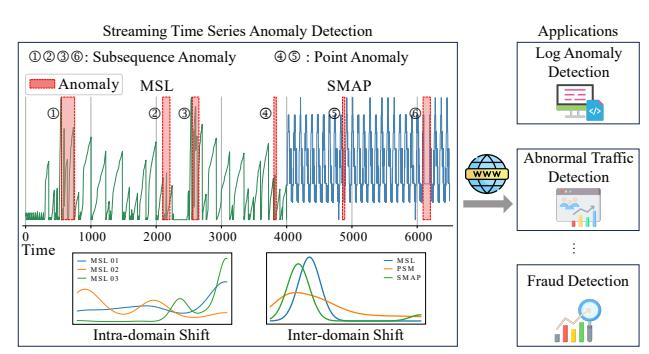
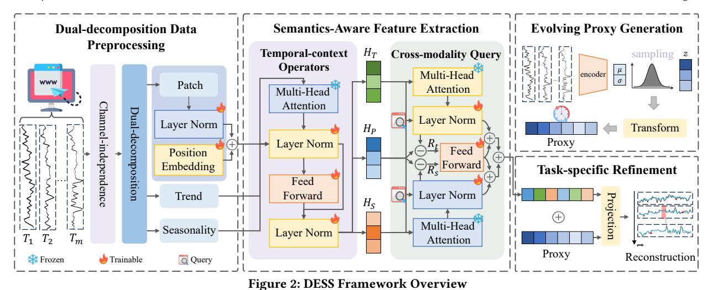
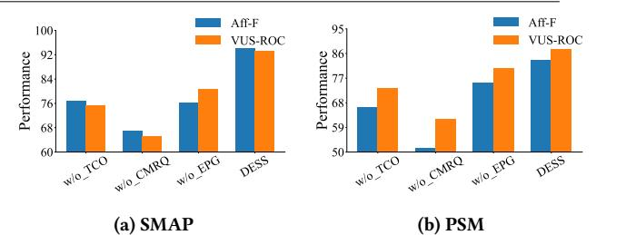
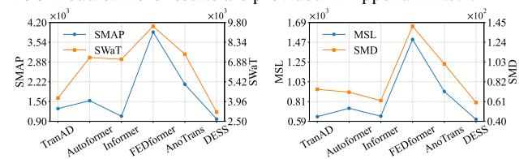
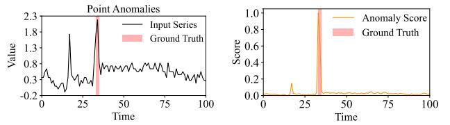
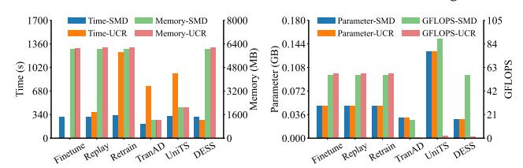
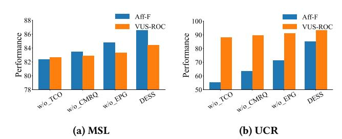
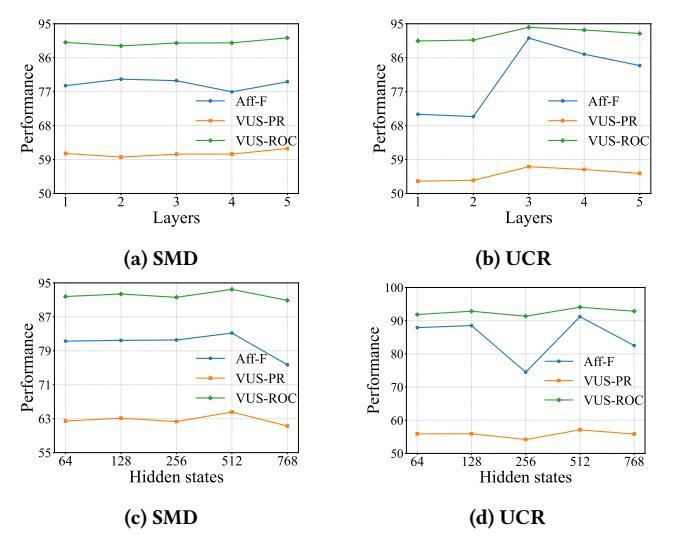
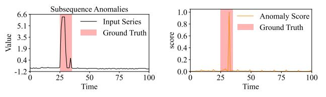

# Evolving Proxy Kills Drift: Data-Efficient Streaming Time Series Anomaly Detection

Qing Wei∗ Yangtze Delta Region Institute (Quzhou), University of Electronic Science and Technology of China qingwei@std.uestc.edu.cn

Hao Miao∗ The Hong Kong Polytechnic University hao.miao@polyu.edu.hk

Yan Zhao† Shenzhen Institute for Advanced Study, University of Electronic Science and Technology of China zhaoyan@uestc.edu.cn

Kai Zheng† University of Electronic Science and Technology of China (UESTC) zhengkai@uestc.edu.cn

Bin Yang East China Normal University byang@dase.ecnu.edu.cn

Volker Markl TU Berlin volker.markl@tu-berlin.de Christian S. Jensen Aalborg University csj@cs.aau.dk

### Abstract

Time series anomaly detection aims to identify samples that deviate from a normal sample distribution in a time series, enabling various web-centric applications. Most existing approaches are static, targeting pre-defined types of anomalies. These methods thus fail to work well on streaming time series with changing data distributions and anomaly formats. To contend with such streaming time series and to accommodate memory constraints, we propose the first data-efficient streaming time series anomaly detection framework, called DESS. To accumulate historical knowledge, DESS includes a novel evolving proxy generation module to synthesize a small but informative proxy summarizing the historical data, facilitating data efficiency. Next, DESS employs an innovative heterogeneous temporal feature extraction module to explicitly capture correlations of multi-level time series semantics. Finally, DESS enables fast streaming anomaly detection by employing a parameter-efficient training scheme that only activates a subset of lightweight parameters while ensuring performance. Extensive experiments on real data offer insight into the effectiveness and efficiency of DESS, showing that it is able to outperform the best baselines by up to 17.53% while reducing the training time by up to 64.88%.

### CCS Concepts

• Information systems → Data mining; • Computing methodologies → Anomaly detection.

## Keywords

Anomaly Detection, Time Series, Evolving Proxy Generation

∗Equal contribution.

†Corresponding authors: Yan Zhao and Kai Zheng. Kai Zheng is with Yangtze Delta Region Institute (Quzhou), School of Computer Science and Engineering, UESTC. He is also with Shenzhen Institute for Advanced Study, UESTC.

[This work is licensed under a Creative Commons Attribution 4.0 International License.](https://creativecommons.org/licenses/by/4.0) WWW '26, Dubai, United Arab Emirates

© 2026 Copyright held by the owner/author(s). ACM ISBN 979-8-4007-2307-0/2026/04 <https://doi.org/10.1145/3774904.3792440>

#### ACM Reference Format:

Qing Wei, Hao Miao, Yan Zhao, Kai Zheng, Bin Yang, Volker Markl, and Christian S. Jensen. 2026. Evolving Proxy Kills Drift: Data-Efficient Streaming Time Series Anomaly Detection. In Proceedings of the ACM Web Conference 2026 (WWW '26), April 13–17, 2026, Dubai, United Arab Emirates. ACM, New York, NY, USA, [12](#page-11-0) pages.<https://doi.org/10.1145/3774904.3792440>

### 1 Introduction

The growing Internet of Things (IoT) generates an unprecedented stream of time series [\[9,](#page-8-0) [10,](#page-8-1) [33\]](#page-8-2), motivating various intelligent web services [\[15,](#page-8-3) [32\]](#page-8-4), e.g., microservice log analytics [\[7\]](#page-8-5). As a key functionality integrated into these services, time series anomaly detection (TSAD) aims to identify abnormal data points or subsequences that deviate from normal patterns, denoting unexpected behaviors based on historical data.

TSAD has received substantial interest across academia and industry [\[1,](#page-8-6) [28,](#page-8-7) [32,](#page-8-4) [35\]](#page-8-8). Existing TSAD methods can be categorized as: discord-based [\[36\]](#page-8-9), proximity-based [\[3,](#page-8-10) [24\]](#page-8-11), forecastingbased [\[26,](#page-8-12) [50\]](#page-8-13), and reconstruction-based [\[28,](#page-8-7) [40\]](#page-8-14) methods. Anomalies are often subtle in web-related time series and may not deviate significantly from normal distributions. To address this, unsupervised reconstruction-based methods have become mainstream because of their superior performance and not requiring labeled anomalies. These methods often employ autoencoders [\[42\]](#page-8-15) to reconstruct the original time series. Then, when the difference, i.e., the reconstruction error, between data points in an original and a reconstructed time series exceeds a threshold, an anomaly is detected. In this study, we focus on reconstruction-based TSAD.

Next, existing TSAD methods are primarily tailored to detect pre-defined types of anomalies [\[32\]](#page-8-4), limiting their adaptability to real-world scenarios. Streaming time series [\[3\]](#page-8-10) often exhibit considerable concept drift, including intra-domain and inter-domain drift. In single-domain time series (e.g., the MSL dataset in Figure [1\)](#page-1-0), new anomalies may differ in formats from those previously observed, e.g., including point anomaly 4 and subsequence anomaly 3 , resulting in intra-domain drift. Further, we visualize the distributions of three MSL subsets (split over time) in Figure [1](#page-1-0) using kernel density estimation, which intuitively indicates the intra-domain shift. In addition, streaming web systems often ingest time series

#### Figure 1: Streaming Time Series Anomaly Detection

from multiple domains where data distributions and characteristics vary over time, causing inter-domain drift. For example, the sudden change at time slot 4000 in Figure [1](#page-1-0) exhibits notable inter-domain drift, which can also be seen from the varying distributions across MSL, PSM, and SMAP. The complex inner- and inter-drifts can confuse TSAD methods, limiting their generalized capabilities. Most existing TSAD methods [\[34,](#page-8-16) [48\]](#page-8-17) are static and ill-equipped to handle streaming anomalies, suffering from catastrophic forgetting, i.e., abruptly forgetting previously learned knowledge when adapting to new data.

In real-world web streaming settings, data streams are typically read once, making past accuracy degrade arbitrarily, especially when streaming time series are not independent and identically distributed. Although SAND [\[3\]](#page-8-10) presents a statistics-based streaming TSAD, it struggles with complex temporal correlations [\[29\]](#page-8-18) and emphasizes subsequence anomalies while overlooking point anomalies [\[32\]](#page-8-4). This underscores the need for a TSAD method that operates effectively under realistic web-scale streaming, adapts to evolving patterns, and handles diverse anomaly types. Thus, a need remains for a new TSAD method capable of operating in more realistic streaming settings. Such a method must be able to contend with the changes that occur over time and learn new characteristics, e.g., different types of anomalies. However, it is non-trivial to develop such a method due to three main challenges.

Challenge I: Progressive Knowledge Retention. It is challenging to progressively retain historical temporal knowledge of streaming time series and anomalies. First, anomalies in streaming time series often exhibit different patterns. Newly collected time series may introduce unseen anomalies whose patterns differ from those of previous ones (see Figure [1\)](#page-1-0), making it necessary to adapt to new anomaly patterns without forgetting historical knowledge. Further, real-world streaming time series from different domains often exhibit markedly different characteristics, e.g., sampling rates, feature attributes, and data volumes. Such variations can confuse a model, causing reduced model performance [\[17,](#page-8-19) [41\]](#page-8-20).

Challenge II: Complex Semantics Interaction. Existing TSAD methods often fall short in capturing complex interactions among multilevel temporal semantics, i.e., local patterns, trend, and seasonality, impeding effective cross-domain time series feature extraction. The capture of local semantics, encompassing contextual patterns in localized subsequences of time series [\[27\]](#page-8-21), facilitates the detection of subtle or transient anomalies. Further, the capture of trend and seasonal patterns enables time series global structural characteristics modeling, enhancing anomaly separation from normal patterns. Modeling these multi-level semantics adaptively enables anomaly

detection at different temporal granularities. Capturing their interactions across domains facilitates common knowledge extraction, which in turn enhances the generalizability of cross-domain TSAD.

Challenge III: Efficiency. The large volume of streaming time series and the large size of models often hinder efficient and scalable streaming TSAD. Existing methods often require re-training of their models on old and new data simultaneously to ensure performance. However, as data volumes keep growing over time, redundant retraining is required, incurring substantial computational overheads, leading to low efficiency. Although replay-based streaming methods [\[29,](#page-8-18) [41\]](#page-8-20) utilize a subset of historical data to alleviate catastrophic forgetting, these methods still store different amounts of historical data to maintain their primary patterns, which are difficult in many resource-constrained environments [\[38,](#page-8-22) [46\]](#page-8-23).

This paper introduces DESS to address the above challenges. First, DESS introduces an evolving proxy mechanism that progressively summarizes historical time series into compact synthetic proxies, enabling continual knowledge retention and alleviating catastrophic forgetting. Second, to capture multi-level temporal semantics, we design a semantics-aware feature extraction module that decomposes time series into local, trend, and seasonal components, and leverages a cross-modality query with residual fusion to model their interactions. Third, to ensure efficient adaptation in streaming settings, DESS employs a lightweight refinement module with parameter-efficient training, which updates only a subset of parameters while maintaining competitive detection accuracy.

To achieve progressive knowledge retention (Challenge I), we innovatively propose evolving proxy generation, including proxy initialization and data-efficient adaptation. This module automatically synthesizes a small but informative proxy to summarize historical time series such that historical knowledge is progressively accumulated in the synthetic proxy. To enable streaming TSAD, we incorporate the proxy into the current model training, alleviating catastrophic forgetting. Specifically, we initialize the small-scale proxy using a sampling-autoencoding scheme. Then, we update the small-scale proxy carefully employing data-efficient adaptation to retain knowledge spanning old and new time series.

To capture multi-level temporal semantics (Challenge II), we propose dual-decomposition data preprocessing and semantics-aware feature extraction (SeFAE) featuring a cross-modality query and residual fusion mechanism. We disentangle original time series into multi-level contextual semantics, i.e., local semantics, trend, and seasonality, by means of patching and frequency decomposition. A set of feature extractors, employing cross-modality query, is proposed to extract effective high-dimensional features of contextual semantics for reconstruction. The contextual semantics capture original time series from different perspectives. Thus, we consider each semantics as a modality. The proposed cross-modality query mechanism adaptively captures the dependencies among extracted contextual semantics based on a novel residual fusion.

To support efficient streaming TSAD (Challenge III), we propose a data-efficient, task-specific refinement module featuring a parameter-efficient training scheme. In particular, DESS maintains a buffer to store only a batch of proxies, considered as representative past samples. We feed these data-efficient proxies into the task-specific refinement module so that DESS achieves good performance when performing detection on historical and current data. Further, having obtained an initial TSAD detector, we update it via a parameter-efficient training scheme, which activates a subset of lightweight parameters and freezes other parameters that require high computational resources, reducing training costs considerably.

The main contributions are summarized as follows.

- To our best knowledge, this is the first streaming time series anomaly detection that goes beyond pre-defined anomalies and is applicable in both single-domain and cross-domain settings.
- Evolving proxy generation and semantics-aware feature extraction are proposed to progressively preserve historical knowledge and effectively capture multi-level temporal semantics.
- A novel data-efficient, task-specific refinement module and a parameter-efficient training scheme enable efficiency.
- We report on experiments using real data, offering evidence of the effectiveness and efficiency of the proposals.

#### 2 Related Work

Time Series Anomaly Detection. Time series anomaly detection is crucial for the automated operation and maintenance in web-sourced applications [\[42\]](#page-8-15), aiming to identify unusual patterns or outliers in time series [\[35\]](#page-8-8). Early studies propose discord-based methods [\[5,](#page-8-24) [36\]](#page-8-9) utilizing nearest neighbor distances among subsequences in time series for anomaly detection. Next, proximity-based methods [\[3,](#page-8-10) [4,](#page-8-25) [24\]](#page-8-11) estimate the density of different points in time series to identify anomalies. To capture intricate temporal dependencies, forecasting-based methods [\[11,](#page-8-26) [50\]](#page-8-13) use historical values in time series to predict future ones, where forecasting error is often adopted as an anomaly error, assuming that anomalies are much less frequent than normal behaviors. Reconstruction-based methods [\[28,](#page-8-7) [40,](#page-8-14) [48\]](#page-8-17) reconstruct time series and use reconstruction errors as anomaly scores. Points with high anomaly scores are more likely to be anomalies. However, existing methods are mainly static, failing to adapt as needed in stream settings. Particularly, anomalies may take on different formats and characteristics over time. In such cases, the model performance may decrease due to concept drift. Streaming Data Analytics. Data stream analytics attracts increasing research interests [\[20,](#page-8-27) [29,](#page-8-18) [41\]](#page-8-20), aiming to learn new tasks while maximally preserving the knowledge learned from the previous tasks. Generally, existing data stream analytics methods can be divided into three categories. First, rule-based methods [\[18\]](#page-8-28) include a regularization term to explicitly alleviate forgetting problems. Second, replay-based methods [\[6,](#page-8-29) [27,](#page-8-21) [41\]](#page-8-20) often maintain a small memory buffer to store a subset of historical data and then replay this data when learning a new task. Third, architecture-based methods [\[37\]](#page-8-30) adopt different sub-networks, where each sub-network is responsible for a task, thus avoiding forgetting. We focus on replay-based methods, which involve historical-data sampling [\[21\]](#page-8-31). However, existing sampling strategies are often either random [\[21\]](#page-8-31) or heuristic [\[29\]](#page-8-18). These methods can not promise representative sample selection and thus fall short in overcoming the forgetting problem, degrading the performance of data stream analytics.

### 3 Preliminaries

Definition 3.1 (Time Series). A time series�� = ⟨��0, ��1, · · · , ����−1⟩ is a time ordered sequence of�� observations, where each observation ���� ∈ R �� is a ��-dimensional vector. If �� = 1, �� is univariate, and if �� &gt; 1, �� is multivariate.

In data streams, the size of the time series is not known and is considered to be infinite as observations arrive incrementally [\[3\]](#page-8-10). We use cross-domain observations in this study, where �� may vary.

Definition 3.2 (Streaming Time Series Batch). Given a time point ��, we denote a streaming time series batch as an ordered set of time series T �� = {����,��,����+1,��, · · · ,����+���������� −��,��, }, where ����,�� is a time series starting at time point �� and ���������� = |T �� | is the batch size. T 0 �� is the first batch.

Streaming Time Series Anomaly Detection. Given a database consisting of a batch of T �� �� extracted from a data stream, we aim to compute an outlier score ���� (����) for each time point ��. A higher ���� (����) means it is more likely that ���� is an anomaly. We focus on Top-�� anomalies. Specifically, we consider the top ��% of ���� (����) as anomalies, where �� is a threshold. We focus on reconstruction-based methods and formulate the outlier score as���� (����) = |���� −��ˆ �� |, ��.�� .��ˆ �� = �� (��, ����), where ��ˆ �� is the reconstructed value of ���� , which is obtained by the learned TSAD function �� (·).

#### 4 Methodology

We proceed to detail the data-efficient streaming TSAD framework, DESS, as shown in Figure [2.](#page-3-0) DESS aims to adaptively detect anomalies in newly incoming time series data while maintaining historical knowledge, i.e., maximally preserving TSAD capabilities on previous time series. It encompasses four major modules: dual-decomposition data preprocessing, semantics-aware feature extraction, evolving proxy generation, and task-specific refinement. Given a streaming time series batch T ��, we first feed it into the dual-decomposition data preprocessing module, which performs patching and frequency decomposition, to capture multi-level temporal semantics, i.e., local semantics, trend, and seasonality. Next, we input these semantics into the semantics-aware feature extraction module, which includes a Transformer encoder and a crossmodality query mechanism. Further, the evolving proxy generation module synthesizes a batch of time series, retaining historical knowledge. This module encompasses proxy initialization and dataefficient adaptation. Finally, the learned features and condensed time series are fed into the task-specific refinement module for reconstruction-based streaming TSAD.

#### 4.1 Dual-decomposition Data Preprocessing

The dual-decomposition data preprocessing module is composed of a channel-independent mechanism and a dual-decomposition layer. The dual-decomposition layer includes patching and frequency decomposition, which disentangle the multi-level semantics, i.e., local semantics, trend, and seasonality, for subsequent feature extraction.

Channel-independent Mechanism. The cross-domain time series, e.g.,����,�� and����+���������� ,��, often differ in dimensionality due to different sampling strategies and feature attributes. When streaming cross-domain time series arrive, we activate CIM(·), the channelindependent mechanism [\[27\]](#page-8-21), to model each time series feature independently, avoiding uncontrollable influence by feature coupling and enabling effectiveness. Specifically, the channel-independent mechanism CIM(·) separates a batch of streaming time series T��,�� ∈

Table 1: Overall Streaming Single-domain TSAD Performance Comparison on Six Datasets

| Dataset Metric | DESS   | OCSVM  | IF     | LOF    | S2G    | SAND   | TranAD | Autoformer | Informer | FEDformer | iTransformer | PatchTST | Dlinear | AnoTrans | DCDetector | UniTS  |
|----------------|--------|--------|--------|--------|--------|--------|--------|------------|----------|-----------|--------------|----------|---------|----------|------------|--------|
| Aff-F          | 0.9419 | 0.5342 | 0.5059 | 0.5414 | 0.1778 | 0.2010 | 0.5782 | 0.7395     | 0.8247   | 0.6917    | 0.5773       | 0.7163   | 0.4525  | 0.7484   | 0.2046     | 0.3403 |
| VUS-PR SMAP    | 0.7727 | 0.1467 | 0.1460 | 0.1296 | 0.4569 | 0.4902 | 0.4170 | 0.6235     | 0.6994   | 0.5092    | 0.4117       | 0.5587   | 0.4005  | 0.7218   | 0.2376     | 0.5959 |
| VUS-ROC        | 0.9316 | 0.4899 | 0.4828 | 0.4906 | 0.5210 | 0.5299 | 0.6108 | 0.7656     | 0.8491   | 0.6774    | 0.6073       | 0.7097   | 0.5672  | 0.8855   | 0.5051     | 0.5549 |
| ROC-AUC        | 0.9488 | 0.3182 | 0.5857 | 0.5118 | 0.9195 | 0.7374 | 0.7343 | 0.9281     | 0.9395   | 0.8025    | 0.7299       | 0.8676   | 0.7695  | 0.9381   | 0.5253     | 0.7911 |
| Aff-F          | 0.8359 | 0.4103 | 0.4137 | 0.3947 | 0.1092 | 0.3487 | 0.4956 | 0.4692     | 0.5164   | 0.4517    | 0.5239       | 0.5198   | 0.5057  | 0.4915   | 0.6674     | 0.4870 |
| VUS-PR PSM     | 0.8278 | 0.4726 | 0.3818 | 0.6449 | 0.5673 | 0.5902 | 0.6907 | 0.6466     | 0.6966   | 0.6419    | 0.8095       | 0.8157   | 0.8313  | 0.6877   | 0.8082     | 0.7333 |
| VUS-ROC        | 0.8775 | 0.5464 | 0.4969 | 0.5271 | 0.4968 | 0.5890 | 0.6861 | 0.6200     | 0.6896   | 0.6129    | 0.8626       | 0.8675   | 0.8745  | 0.7001   | 0.8511     | 0.6457 |
| ROC-AUC        | 0.9491 | 0.6499 | 0.6287 | 0.7682 | 0.8564 | 0.7498 | 0.9101 | 0.9054     | 0.9154   | 0.9070    | 0.9289       | 0.9373   | 0.9258  | 0.9244   | 0.9036     | 0.9427 |
| Aff-F          | 0.8657 | 0.6936 | 0.6732 | 0.6510 | 0.1721 | 0.3094 | 0.8086 | 0.7413     | 0.8204   | 0.6748    | 0.7540       | 0.7866   | 0.8050  | 0.7432   | 0.6329     | 0.6308 |
| VUS-PR MSL     | 0.6580 | 0.2725 | 0.2156 | 0.1984 | 0.3764 | 0.4576 | 0.6184 | 0.5555     | 0.6433   | 0.4939    | 0.5797       | 0.6122   | 0.6228  | 0.5787   | 0.4196     | 0.6248 |
| VUS-ROC        | 0.8439 | 0.5515 | 0.5279 | 0.5184 | 0.5148 | 0.5279 | 0.8100 | 0.7483     | 0.8239   | 0.6874    | 0.7657       | 0.7968   | 0.8168  | 0.7671   | 0.5989     | 0.6905 |
| ROC-AUC        | 0.9214 | 0.5119 | 0.5156 | 0.5765 | 0.8245 | 0.6252 | 0.8959 | 0.8593     | 0.9090   | 0.8294    | 0.8679       | 0.8859   | 0.8934  | 0.8767   | 0.7335     | 0.8762 |
| Aff-F          | 0.6285 | 0.4213 | 0.2787 | 0.2941 | 0.1778 | 0.2051 | 0.4032 | 0.4391     | 0.3974   | 0.4338    | 0.4580       | 0.3798   | 0.4112  | 0.4579   | 0.1613     | 0.2640 |
| VUS-PR SWaT    | 0.6609 | 0.3230 | 0.3127 | 0.3758 | 0.4224 | 0.4681 | 0.3437 | 0.4856     | 0.4235   | 0.4633    | 0.4471       | 0.3928   | 0.4176  | 0.4632   | 0.4823     | 0.3934 |
| VUS-ROC        | 0.7972 | 0.7039 | 0.6308 | 0.5108 | 0.5845 | 0.5355 | 0.5941 | 0.6220     | 0.5784   | 0.6089    | 0.8359       | 0.7805   | 0.6915  | 0.5846   | 0.5268     | 0.5430 |
| ROC-AUC        | 0.9520 | 0.7977 | 0.7132 | 0.8081 | 0.9195 | 0.7417 | 0.8467 | 0.8937     | 0.8333   | 0.8644    | 0.9311       | 0.9214   | 0.8988  | 0.7759   | 0.6512     | 0.7885 |
| Aff-F          | 0.8318 | 0.6989 | 0.6992 | 0.7097 | 0.1932 | 0.4710 | 0.8113 | 0.7847     | 0.8211   | 0.7807    | 0.8284       | 0.8213   | 0.8060  | 0.7861   | 0.6664     | 0.6105 |
| VUS-PR SMD     | 0.6458 | 0.3001 | 0.2902 | 0.4320 | 0.0982 | 0.2074 | 0.5711 | 0.5014     | 0.6051   | 0.4936    | 0.6224       | 0.6227   | 0.6225  | 0.6303   | 0.4714     | 0.5651 |
| VUS-ROC        | 0.9347 | 0.5426 | 0.5945 | 0.5654 | 0.4815 | 0.5272 | 0.8682 | 0.8014     | 0.9158   | 0.7932    | 0.9133       | 0.9130   | 0.9139  | 0.7669   | 0.7520     | 0.6266 |
| ROC-AUC        | 0.9552 | 0.6053 | 0.6454 | 0.5952 | 0.5606 | 0.6770 | 0.9086 | 0.9007     | 0.9433   | 0.8997    | 0.9337       | 0.9334   | 0.9336  | 0.9570   | 0.9155     | 0.8162 |
| Aff-F          | 0.8526 | 0.6615 | 0.6804 | 0.6340 | 0.0513 | 0.3429 | 0.6901 | 0.8403     | 0.7054   | 0.8383    | 0.8254       | 0.8474   | 0.8107  | 0.5849   | 0.6775     | 0.1507 |
| VUS-PR UCR     | 0.5646 | 0.1287 | 0.1954 | 0.0316 | 0.2152 | 0.4823 | 0.5368 | 0.5583     | 0.5288   | 0.5445    | 0.5572       | 0.5532   | 0.5442  | 0.5157   | 0.5405     | 0.4964 |
| VUS-ROC        | 0.9341 | 0.5502 | 0.6028 | 0.5015 | 0.5181 | 0.6434 | 0.9083 | 0.9243     | 0.9014   | 0.9112    | 0.9278       | 0.9238   | 0.9151  | 0.8833   | 0.9195     | 0.6034 |
| ROC-AUC        | 0.9444 | 0.5584 | 0.5943 | 0.5004 | 0.7339 | 0.8906 | 0.9228 | 0.9347     | 0.9197   | 0.9307    | 0.9328       | 0.9344   | 0.9384  | 0.9199   | 0.9203     | 0.9408 |

As shown in Figure [2,](#page-3-0) we divide the model parameters into trainable parameters ���� and frozen parameters ���� , i.e., �� = (����, ���� ). We freeze the majority of parameters, i.e., |���� | &lt; |���� |.

Given the initial time series dataset T stored in the local database, we activate all parameters of �� to obtain an initial ��. In addition, existing studies [\[19\]](#page-8-38) show that LLMs are capable of encapsulating most of the generic knowledge learned from previous tasks. The architecture used in the SeFAE module resembles those of LLMs. Inspired by this, we assume that SeFAE learns generalized knowledge for TSAD. Then, when streaming time series batch T �� arrives, we freeze the parameters of the multi-head attention layers MHA(·) in SeFAE, thereby reducing the computational costs substantially. Further, to enhance streaming TSAD with minimal cost, we fine-tune the lightweight layers in DESS, including the layer normalization LNs(·), feed-forward networks FFNs(·), and the evolving proxy generation module. This captures the task-specific information and allows DESS to adapt to streaming TSAD.

Given a streaming time series batch T ��, DESS aims to enable streaming time series anomaly detection on T �� while preserving knowledge of maximally historical time series based on the evolving proxy generation. This avoids the raw reuse of historical datasets, thus facilitating computational efficiency.

Overall Objective Function. We proceed to specify the overall objective of the proposed method. It updates the trainable parameters by optimizing the loss function Ltask. In particular, for the initial time series datasets, we have Ltask (��; T ) = 1 | T | Í| T | ��=1 Tˆ �� − T�� 2 , where Tˆ �� and T�� denote the reconstructed and real values of the ��-th time series in T and �� denotes that all parameters are trainable. For the streaming time series batch T ��, we have Ltask (���� ; T ��) = 1 ��size Í��size ��=1 ��ˆ �� −���� 2 , where ���� denotes the trainable parameters.

### 5 Experimental Evaluation

### 5.1 Experimental Setup

5.1.1 Datasets. The experiments are carried out on six widely-used multivariate time series anomaly detection datasets [\[32\]](#page-8-4): SMAP, PSM, MSL, SWaT, SMD, and UCR, covering web-centric applications such as server monitoring, satellite telemetry, and industrial

systems. We include UCR to enable more reliable and fair Streaming TSAD [\[45\]](#page-8-41). We consider these datasets as representing distinct domains, and we process their data sequentially to enable streaming TSAD. The datasets contain different types of anomalies [\[32\]](#page-8-4). We provide more dataset details and streaming TSAD settings in Appendix [A.2.](#page-9-0)

5.1.2 Baselines. We compare DESS with 15 baselines covering classical machine learning and deep learning-based methods. The classical methods include OCSVM [\[39\]](#page-8-42), Isolation Forest (IF) [\[24\]](#page-8-11), Local Outlier Factor (LOF) [\[4\]](#page-8-25), Series2Graph (S2G) [\[2\]](#page-8-43), and SAND [\[3\]](#page-8-10), where SAND [\[3\]](#page-8-10) is designed for streaming subsequence time series anomaly detection. Among deep learning approaches, we include TranAD [\[40\]](#page-8-14), Autoformer [\[44\]](#page-8-44), Informer [\[52\]](#page-8-45), FEDformer [\[53\]](#page-8-46), iTransformer [\[25\]](#page-8-47), PatchTST [\[30\]](#page-8-33), Dlinear [\[51\]](#page-8-48), AnomalyTransformer (AnoTrans) [\[47\]](#page-8-49), DCDetector [\[49\]](#page-8-50), and UniTS [\[11\]](#page-8-26).

5.1.3 Evaluation Metrics. To enable fairness and avoid bias [\[32,](#page-8-4) [34\]](#page-8-16), we adopt the Affiliated F1-Score (Aff-F) [\[16\]](#page-8-51), Volume Under the Surface of the Precision-Recall Curve (VUS-PR), Volume Under the Surface of the ROC Curve (VUS-ROC) [\[31\]](#page-8-52), and Area Under the Receiver Operating Characteristic curve (AUC-ROC) [\[47\]](#page-8-49) as the evaluation metrics. The higher the values for these metrics, the more accurate a method is.

### 5.2 Experimental Results

5.2.1 Overall Performance on Streaming Single-domain Time Series. We compare the methods of streaming single-domain TSAD using the experimental settings from Appendix [A.2.3.](#page-9-1) The overall best performance is marked in bold, and the second-best performance is underlined. Streaming single-domain TSAD aims to assess the capability of a method to alleviate intra-domain drift. We report the results in Table [1.](#page-5-0) DESS achieves the best results across all evaluation metrics in most cases, performing better than the best among the baselines by up to 17.05%, 17.53%, 4.61%, and 2.09% in terms of Aff-F, VUS-PR, VUS-ROC, and ROC-AUC, respectively. The performance improvements obtained by DESS on SWaT exceed those on SMAP, PSM, MSL, and UCR. This is because SWaT has much more training data than the other datasets. DESS trained with more

| Dataset          | Table Metric | 2: DESS | Streaming OCSVM | IF     | Cross-domain LOF | TSAD S2G | SAND   | Performance TranAD | Informer | Comparison Dlinear | AnoTrans | DCDetector | UniTS  |
|------------------|--------------|---------|-----------------|--------|------------------|----------|--------|--------------------|----------|--------------------|----------|------------|--------|
| MSL → PSM → SMAP |              |         |                 |        |                  |          |        |                    |          |                    |          |            |        |
|                  | Aff-F        | 0.3934  | 0.2643          | 0.2417 | 0.2975           | 0.2270   | 0.1623 | 0.3891             | 0.2188   | 0.2073             | 0.1256   | 0.3068     | 0.1381 |
| MSL              | VUS-PR       | 0.5967  | 0.3839          | 0.2060 | 0.3232           | 0.4360   | 0.4251 | 0.5859             | 0.4292   | 0.5414             | 0.5742   | 0.5698     | 0.4440 |
|                  | VUS-ROC      | 0.5707  | 0.4759          | 0.5191 | 0.4781           | 0.5307   | 0.5069 | 0.5611             | 0.5096   | 0.5267             | 0.5202   | 0.5338     | 0.5118 |
|                  | ROC-AUC      | 0.7786  | 0.5248          | 0.5392 | 0.5646           | 0.5976   | 0.5898 | 0.7426             | 0.5367   | 0.7101             | 0.7660   | 0.7412     | 0.7211 |
|                  | Aff-F        | 0.4158  | 0.1947          | 0.1864 | 0.2047           | 0.2100   | 0.1878 | 0.4003             | 0.2597   | 0.3859             | 0.0595   | 0.3942     | 0.1192 |
| PSM              | VUS-PR       | 0.7084  | 0.3839          | 0.6400 | 0.5009           | 0.6114   | 0.6407 | 0.6792             | 0.6608   | 0.6964             | 0.6495   | 0.6582     | 0.6538 |
|                  | VUS-ROC      | 0.5944  | 0.5009          | 0.5009 | 0.5367           | 0.5208   | 0.5147 | 0.5602             | 0.5354   | 0.5837             | 0.5124   | 0.5379     | 0.5246 |
|                  | ROC-AUC      | 0.8801  | 0.5808          | 0.6638 | 0.5367           | 0.8053   | 0.8169 | 0.8498             | 0.7509   | 0.8438             | 0.8253   | 0.8470     | 0.8637 |
|                  | Aff-F        | 0.3385  | 0.2164          | 0.2053 | 0.2385           | 0.0907   | 0.1747 | 0.3088             | 0.1824   | 0.1632             | 0.1520   | 0.3006     | 0.2997 |
| SMAP             | VUS-PR       | 0.5826  | 0.1419          | 0.1349 | 0.1652           | 0.4899   | 0.5326 | 0.5679             | 0.5730   | 0.5625             | 0.5716   | 0.5605     | 0.5617 |
|                  | VUS-ROC      | 0.5494  | 0.4128          | 0.4793 | 0.5028           | 0.5041   | 0.5026 | 0.5304             | 0.5237   | 0.5203             | 0.5197   | 0.5269     | 0.5268 |
|                  | ROC-AUC      | 0.7625  | 0.3191          | 0.6347 | 0.6259           | 0.6692   | 0.5242 | 0.7515             | 0.7521   | 0.7507             | 0.7502   | 0.7262     | 0.7425 |
| SMD → UCR        |              |         |                 |        |                  |          |        |                    |          |                    |          |            |        |
|                  | Aff-F        | 0.6147  | 0.2194          | 0.3579 | 0.3643           | 0.6034   | 0.3547 | 0.5426             | 0.5829   | 0.5686             | 0.5411   | 0.6015     | 0.5852 |
| SMD              | VUS-PR       | 0.5564  | 0.0961          | 0.4254 | 0.5227           | 0.2143   | 0.1448 | 0.5534             | 0.5341   | 0.0028             | 0.5346   | 0.5429     | 0.5222 |
|                  | VUS-ROC      | 0.6374  | 0.4981          | 0.4579 | 0.5010           | 0.5205   | 0.4993 | 0.6204             | 0.6163   | 0.5449             | 0.5860   | 0.5769     | 0.5743 |
|                  | ROC-AUC      | 0.8306  | 0.5833          | 0.5909 | 0.5473           | 0.7110   | 0.5923 | 0.8222             | 0.7965   | 0.8018             | 0.7577   | 0.7925     | 0.8008 |
|                  | Aff-F        | 0.1430  | 0.1037          | 0.1025 | 0.1104           | 0.1149   | 0.1093 | 0.0190             | 0.0289   | 0.0329             | 0.0909   | 0.1154     | 0.0910 |
| UCR              | VUS-PR       | 0.4512  | 0.1272          | 0.1954 | 0.0383           | 0.3743   | 0.3383 | 0.0098             | 0.3904   | 0.3998             | 0.4159   | 0.4062     | 0.4285 |
|                  | VUS-ROC      | 0.5981  | 0.5462          | 0.4136 | 0.5046           | 0.5420   | 0.5021 | 0.4982             | 0.5118   | 0.5121             | 0.5415   | 0.5116     | 0.5219 |
|                  | ROC-AUC      | 0.9371  | 0.5613          | 0.5954 | 0.5100           | 0.9017   | 0.8906 | 0.4979             | 0.9015   | 0.9043             | 0.9107   | 0.9032     | 0.9106 |

training data yields better results. Although SMD has substantial training data, DESS performs slightly better than baselines. This is because of the fewer anomalies in SMD, which can be captured easily by existing methods. Traditional methods, i.e., OCSVM, IF, LOF, S2G, and SAND, perform worse than deep learning methods. This is because the complex temporal correlations of time series are hard to capture due to the limited feature extraction capabilities of these methods. Although SAND is capable of streaming TSAD, it targets mainly subsequence anomalies, failing to adapt to more general TSAD scenarios with different types of anomalies.

5.2.2 Overall Performance on Streaming Cross-domain Time Series. Time series are often incrementally from sensors deployed across different domains. Streaming cross-domain TSAD is thus desirable but challenging because anomalies across domains often differ in anomaly categories, feature attributes, and feature correlations, causing considerable concept drift. We determine whether DESS enables streaming cross-domain TSAD. Table [2](#page-6-0) shows the performance of DESS at streaming cross-domain TSAD, where MSL → PSM → SMAP (and SMD → UCR) indicate that we feed MSL, PSM, and SMAP (and SMD and UCR) into DESS and baselines sequentially. For brevity, we compare DESS with 5 classical baselines and 6 deep learning baselines that achieve competitive performance in streaming single-domain TSAD (see Table [1\)](#page-5-0). As shown in Table [2,](#page-6-0) DESS consistently achieves the best performance on all datasets. Specifically, DESS outperforms baselines by up to 12.40% and 44.14% in terms of Aff-F and VUS-PR on UCR, and by up to 24.78% and 44.77% in terms of Aff-F and VUS-PR on SMAP. Despite having been trained on highly heterogeneous datasets from different domains, DESS maintains robust performance on early datasets, such as MSL and SMD, while maintaining strong performance on subsequent datasets, such as SMAP and UCR. The results suggest that DESS can effectively preserve the knowledge learned from earlier tasks without replay mechanisms or access to historical data, which attributes to the evolving proxy generation mechanism. In addition, we observe that TranAD performs better than other baselines in most cases due to its multi-modal feature extraction capabilities. which are replaced by stacked feed-forwarded networks. w/o\_TCO

5.2.3 Ablation Study. To gain insight into the effects of the different components of DESS, we evaluate three variants:

- w/o\_TCO. DESS without the temporal-context operators (TCO),

#### Figure 3: Ablation Study Results of DESS and Its Variants

• w/o\_CMRQ. DESS without the cross-modality query and residual fusion (CMRQ), which is replaced by a feed-forward network. • w/o\_EPG. DESS without the evolving proxy generation (EPG). Figure [3](#page-6-1) shows results on SMAP and PSM. We report the average results of streaming single-domain TSAD. Regardless of the datasets, DESS outperforms three variants. This shows that the three components all contribute to improved streaming TSAD. DESS obtains Aff-F and VUS-ROC improvement by up to 32.06% and 27.90%, respectively, compared to w/o\_CMRQ. In addition, DESS obtains Aff-F and VUS-ROC improvement by up to 17.24% and 17.72%, respectively, compared to w/o\_TCO, which shows the benefits of the TCO module. More results are provided in Appendix [A.3.1.](#page-9-2)

Figure 4: Training Time of Single-domain TSAD (s/epoch) 5.2.4 Training Time. As efficiency is important for TSAD on streaming data, we study the training time (per epoch) on four datasets for single-domain streaming TSAD; see Figure [4.](#page-6-2) We select 5 wellperformed baselines (without proxy generation) for comparison. DESS (with proxy generation) consumes the least training time. For example, DESS is faster than FEDformer by 57.45%, which is largely because of the proposed parameter-efficient training scheme and data-efficient proxy generation mechanism. In addition, TranAD achieves the least training time among the baselines. However, compared to TranAD, DESS reduces the training time by 4.83% on four datasets, showing its efficiency. These findings indicate the feasibility of DESS for deployment in large-scale streaming TSAD scenarios.

Figure 5: Case Study on SMD

5.2.5 Case Study. To intuitively illustrate the effectiveness of DESS, we provide a case study on SMD. Figure [5](#page-7-0) reports the performance of DESS at detecting point anomalies on SMD. We show the original input time series in the first column and the corresponding anomaly scores in the second column. For point anomalies, the anomaly scores exhibit sharp increases at the anomalous point, indicating that the anomalies in the time series are detected successfully by the difference between reconstructed and actual values. For subsequence anomalies (see Figure [9\)](#page-10-0), the anomaly scores remain elevated across the anomalous time interval, showing strong sensitivity to the boundaries of subsequence anomalies. Overall, the case study exemplifies how DESS can accurately identify point anomalies, escaping from specific anomalies, showing its practicality in real-world scenarios.

Table 3: Effect of Different Streaming TSAD Strategies

| Dataset Metric | Aff-F  | MSL VUS-PR | Aff-F  | PSM VUS-PR | Aff-F  | SMAP VUS-PR |
|----------------|--------|------------|--------|------------|--------|-------------|
| DESS           | 0.3934 | 0.5967     | 0.4158 | 0.7084     | 0.3385 | 0.5826      |
| OneForAll      | 0.3899 | 0.5849     | 0.3564 | 0.6808     | 0.3145 | 0.5709      |
| Finetune       | 0.3394 | 0.5254     | 0.3891 | 0.6713     | 0.3093 | 0.5684      |
| Replay         | 0.3330 | 0.5000     | 0.3289 | 0.6964     | 0.3062 | 0.5519      |
| Retrain        | 0.3327 | 0.5256     | 0.4055 | 0.6849     | 0.3185 | 0.5691      |

5.2.6 Effect of Different Streaming TSAD Strategies. We propose data-efficient streaming TSAD based on evolving proxy generation. To evaluate the performance of training on streaming time series, we use four representative training strategies to replace the evolving proxy generation on MSL, PSM, and SMAP: 1). OneForAll: Trains a model with MSL and then perform TSAD on all datasets; 2). Finetune: Trains an initial model on MSL. Then, we repeatedly sample 500 time series from other datasets to fine-tune the initial model; 3). Replay: Fuses the 500 historical time series, which are stored in a replay buffer, with the current training data to train DESS; 4). Retrain: Trains a model using all available datasets.

Table [3](#page-7-1) shows the results on MSL, PSM, and SMAP. Generally, DESS performs best among the five methods, showing the benefits of the evolving proxy mechanism. Specifically, DESS outperforms Retrain by 6.07% and 7.11% in terms of Aff-F and VUS-PR on MSL, respectively. Further, compared to Replay, DESS obtains Aff-F and VUS-PR improvement by up to 6.04% and 9.67% on MSL, respectively. The results indicate that the evolving proxy generation mechanism and the parameter-efficient training effectively preserve essential temporal features and mitigate catastrophic forgetting, enabling effective streaming TSAD. Additionally, the simple Finetune strategy is insufficient for effective streaming TSAD, as it has forgetting problems. DESS achieves relatively stable performance on all datasets. Additional results on VUS-ROC and ROC-AUC are provided in Appendix [A.4.](#page-10-1)

5.2.7 Resource Efficiency Comparison. We conduct the following resource-efficiency experiments referring to TimeEmb [\[46\]](#page-8-23), with additional experiments in the Appendix. We adopt TranAD and UniTS for brevity due to their outstanding performance.

#### (a) Training Time and Memory (b) Parameter and GFLOPS Figure 6: Resource Efficiency Comparison

Streaming Training Time and Memory. We compare the streaming training time (per epoch) and GPU memory consumption of DESS, Finetune, Replay, Retrain, TranAD, and UniTS on SMD → UCR. The results are shown in Figure [6a.](#page-7-2) We observe that DESS achieves training times comparable to those of existing methods on the initial dataset, SMD, and that its training time is reduced on the streaming dataset, UCR. This is because of the parameter-efficient training scheme, which freezes the majority of parameters, accelerating the streaming training. DESS exhibits similar GPU memory usage with Finetune, Replay, and Retrain. We note two exceptions: UniTS achieves less training GPU memory on SMD and UCR, but UniTS is also much less accurate. Further, it is clear that DESS uses fewer resources than the most competing baseline, TranAD, on streaming data. More specifically, DESS reduces the training time by 64.88% compared to TranAD on UCR.

Parameters and Computational Cost. We study the number of parameters and computational costs on SMD → UCR. We use Giga Floating-point Operations Per Second (GFLOPS) to quantify the computational costs. The results are shown in Figure [6b.](#page-7-2) Generally, DESS has the fewest parameters and low computational costs, while the other methods fail to obtain a good balance between these two costs. Although TranAD has fewer GFLOPS and very similar numbers of parameters, it performs worse than DESS in handling streaming data. The low computational costs and few parameters of DESS are due to the data-efficient proxy generation mechanism. The results indicate the feasibility and scalability of DESS for model deployment in real-world streaming TSAD scenarios.

#### 6 Conclusion

We present DESS, a novel data-efficient streaming TSAD framework that features evolving proxy generation. To capture intricate temporal correlations, DESS is equipped with a semantics-aware feature extraction module featuring stacked TCOperators and crossmodality query and residual fusion. Additionally, DESS comes with an evolving proxy generation module that summarizes historical data to preserve historical knowledge and avoid catastrophic forgetting. Further, to enable efficient TSAD, DESS employs data-efficient task-specific refinement and parameter-efficient training, which is able to reduce memory and computational overhead substantially. Extensive experiments on real-world datasets offer evidence that DESS is able to advance the state-of-the-art in detection performance in both streaming single-domain and cross-domain scenarios while consuming fewer computational resources.

### Acknowledgments

This work is partially supported by NSFC (No. 62472068), Municipal Government of Quzhou under Grant (No. 2024D036), and DFF Inge Lehmann grant (No. 4303-00014).

#### References

[1] Paul Boniol, Ashwin K Krishna, Marine Bruel, Qinghua Liu, Mingyi Huang, Themis Palpanas, Ruey S Tsay, Aaron Elmore, Michael J Franklin, and John Paparrizos. 2025. VUS: effective and efficient accuracy measures for time-series anomaly detection. VLDBJ 34, 3 (2025), 32. [2] Paul Boniol and Themis Palpanas. 2020. Series2Graph: Graph-based Subsequence Anomaly Detection for Time Series. PVLDB 13, 11 (2020), 1821–1834. [3] Paul Boniol, John Paparrizos, Themis Palpanas, and Michael J Franklin. 2021. Sand in action: subsequence anomaly detection for streams. PVLDB 14, 12 (2021), 2867–2870. [4] Markus M Breunig, Hans-Peter Kriegel, Raymond T Ng, and Jörg Sander. 2000. LOF: identifying density-based local outliers. In SIGMOD. 93–104. [5] Yingyi Bu, Tat-Wing Leung, Ada Wai-Chee Fu, Eamonn Keogh, Jian Pei, and Sam Meshkin. 2007. WAT: Finding top-k discords in time series database. In SDM. 449–454. [6] Badrish Chandramouli and Jonathan Goldstein. 2017. Shrink: Prescribing resiliency solutions for streaming. PVLDB 10, 5 (2017), 505–516. [7] He Cheng, Depeng Xu, and Shuhan Yuan. 2025. Backdoor Attack against Log Anomaly Detection Models. In WWW. 915–918. [8] Razvan-Gabriel Cirstea, Chenjuan Guo, Bin Yang, Tung Kieu, Xuanyi Dong, and Shirui Pan. 2022. Triformer: Triangular, Variable-Specific Attentions for Long Sequence Multivariate Time Series Forecasting. In IJCAI. 1994–2001. [9] Yuchen Fang, Hao Miao, Yuxuan Liang, Liwei Deng, Yue Cui, Ximu Zeng, Yuyang Xia, Yan Zhao, Torben Bach Pedersen, Christian S. Jensen, Xiaofang Zhou, and Kai Zheng. 2026. Unraveling Spatio-Temporal Foundation Models Via the Pipeline Lens: A Comprehensive Review. TKDE (2026), 1–24. [10] Marios Fragkoulis, Paris Carbone, Vasiliki Kalavri, and Asterios Katsifodimos. 2024. A survey on the evolution of stream processing systems. VLDBJ 33, 2 (2024), 507–541. [11] Shanghua Gao, Teddy Koker, Owen Queen, Tom Hartvigsen, Theodoros Tsiligkaridis, and Marinka Zitnik. 2024. UniTS: A unified multi-task time series model. NeurIPS 37 (2024), 140589–140631. [12] Xiao Han, Chen Zhu, Hengshu Zhu, and Xiangyu Zhao. 2025. Swarm intelligence in geo-localization: A multi-agent large vision-language model collaborative framework. In SIGKDD. 814–825. [13] Neil D Hargreaves and Andrew J Calvert. 1991. Inverse Q filtering by Fourier transform. Geophysics 56, 4 (1991), 519–527. [14] Min Hou, Chang Xu, Zhi Li, Yang Liu, Weiqing Liu, Enhong Chen, and Jiang Bian. 2022. Multi-granularity residual learning with confidence estimation for time series prediction. In WWW. 112–121. [15] Sihao Hu, Tiansheng Huang, Ka-Ho Chow, Wenqi Wei, Yanzhao Wu, and Ling Liu. 2024. Zipzap: Efficient training of language models for large-scale fraud detection on blockchain. In WWW. 2807–2816. [16] Alexis Huet, Jose Manuel Navarro, and Dario Rossi. 2022. Local evaluation of time series anomaly detection algorithms. In SIGKDD. 635–645. [17] Duc Kieu, Tung Kieu, Peng Han, Bin Yang, Christian S. Jensen, and Bac Le. 2024. TEAM: Topological Evolution-Aware Framework for Traffic Forecasting. PVLDB 18, 2 (2024), 265–278. [18] James Kirkpatrick, Razvan Pascanu, Neil Rabinowitz, , et al. 2017. Overcoming catastrophic forgetting in neural networks. PNAS 114, 13 (2017), 3521–3526. [19] Guoliang Li, Xuanhe Zhou, and Xinyang Zhao. 2024. LLM for Data Management. PVLDB 17, 12 (2024), 4213–4216. [20] Weihe Li and Paul Patras. 2024. Stable-sketch: A versatile sketch for accurate, fast, web-scale data stream processing. In WWW. 4227–4238. [21] Yiming Li, Yanyan Shen, and Lei Chen. 2022. Camel: Managing data for efficient stream learning. In SIGMOD. 1271–1285. [22] Chenxi Liu, Kethmi Hirushini Hettige, Qianxiong Xu, Cheng Long, Shili Xiang, Gao Cong, Ziyue Li, and Rui Zhao. 2025. ST-LLM+: Graph Enhanced Spatio-Temporal Large Language Models for Traffic Prediction. TKDE 01 (2025), 1–14. [23] Chenxi Liu, Qianxiong Xu, Hao Miao, Sun Yang, Lingzheng Zhang, Cheng Long, Ziyue Li, and Rui Zhao. 2025. Timecma: Towards llm-empowered multivariate time series forecasting via cross-modality alignment. In AAAI, Vol. 39. 18780– 18788. [24] Fei Tony Liu, Kai Ming Ting, and Zhi-Hua Zhou. 2008. Isolation forest. In ICDM. 413–422. [25] Yong Liu, Tengge Hu, Haoran Zhang, Haixu Wu, Shiyu Wang, Lintao Ma, and Mingsheng Long. 2024. iTransformer: Inverted Transformers Are Effective for Time Series Forecasting. In ICLR. [26] Pankaj Malhotra, Lovekesh Vig, Gautam Shroff, Puneet Agarwal, et al. 2015. Long short term memory networks for anomaly detection in time series. In Proceedings, Vol. 89. 94. [27] Hao Miao, Ziqiao Liu, Yan Zhao, Chenjuan Guo, Bin Yang, Kai Zheng, and Christian S. Jensen. 2024. Less is more: Efficient time series dataset condensation via two-fold modal matching. PVLDB 18, 2 (2024), 226–238. [28] Hao Miao, Ronghui Xu, Yan Zhao, Senzhang Wang, Jianxin Wang, Philip S Yu, and Christian S. Jensen. 2025. A Parameter-Efficient Federated Framework for Streaming Time Series Anomaly Detection via Lightweight Adaptation. TMC 01 (2025), 1–14. [29] Hao Miao, Yan Zhao, Chenjuan Guo, Bin Yang, Kai Zheng, Feiteng Huang, Jiandong Xie, and Christian S. Jensen. 2024. A unified replay-based continuous learning framework for spatio-temporal prediction on streaming data. In ICDE. 1050–1062. [30] Yuqi Nie, Nam H. Nguyen, Phanwadee Sinthong, and Jayant Kalagnanam. 2023. A Time Series is Worth 64 Words: Long-term Forecasting with Transformers. In ICLR. [31] John Paparrizos, Paul Boniol, Themis Palpanas, Ruey S Tsay, Aaron Elmore, and Michael J Franklin. 2022. Volume under the surface: a new accuracy evaluation measure for time-series anomaly detection. PVLDB 15, 11 (2022), 2774–2787. [32] John Paparrizos, Yuhao Kang, Paul Boniol, Ruey S Tsay, Themis Palpanas, and Michael J Franklin. 2022. TSB-UAD: an end-to-end benchmark suite for univariate time-series anomaly detection. PVLDB 15, 8 (2022), 1697–1711. [33] Xiangfei Qiu, Xingjian Wu, Yan Lin, Chenjuan Guo, Jilin Hu, and Bin Yang. 2025. DUET: Dual Clustering Enhanced Multivariate Time Series Forecasting. In SIGKDD. 1185–1196. [34] Sebastian Schmidl, Felix Naumann, and Thorsten Papenbrock. 2024. AutoTSAD: Unsupervised Holistic Anomaly Detection for Time Series Data. PVLDB 17, 11 (2024), 2987–3002. [35] Sebastian Schmidl, Phillip Wenig, and Thorsten Papenbrock. 2022. Anomaly detection in time series: a comprehensive evaluation. PVLDB 15, 9 (2022), 1779– 1797. [36] Pavel Senin, Jessica Lin, Xing Wang, Tim Oates, Sunil Gandhi, Arnold P Boedihardjo, Crystal Chen, and Susan Frankenstein. 2015. Time series anomaly discovery with grammar-based compression.. In EDBT. 481–492. [37] Joan Serra, Didac Suris, Marius Miron, and Alexandros Karatzoglou. 2018. Overcoming catastrophic forgetting with hard attention to the task. In ICML. 4548– 4557. [38] Kai Sheng Tai, Vatsal Sharan, Peter Bailis, and Gregory Valiant. 2018. Sketching linear classifiers over data streams. In SIGMOD. 757–772. [39] David MJ Tax and Robert PW Duin. 2004. Support vector data description. Machine learning 54 (2004), 45–66. [40] Shreshth Tuli, Giuliano Casale, and Nicholas R Jennings. 2022. TranAD: deep transformer networks for anomaly detection in multivariate time series data. PVLDB 15, 6 (2022), 1201–1214. [41] Zhuoyi Wang, Yuqiao Chen, Chen Zhao, Yu Lin, Xujiang Zhao, Hemeng Tao, Yigong Wang, and Latifur Khan. 2021. CLEAR: Contrastive-Prototype Learning with Drift Estimation for Resource Constrained Stream Mining. In WWW. 1351– 1362. [42] Zexin Wang, Changhua Pei, Minghua Ma, Xin Wang, Zhihan Li, Dan Pei, Saravan Rajmohan, Dongmei Zhang, Qingwei Lin, Haiming Zhang, et al. 2024. Revisiting vae for unsupervised time series anomaly detection: A frequency perspective. In WWW. 3096–3105. [43] Shmuel Winograd. 1978. On computing the discrete Fourier transform. Mathematics of computation 32, 141 (1978), 175–199. [44] Haixu Wu, Jiehui Xu, Jianmin Wang, and Mingsheng Long. 2021. Autoformer: Decomposition transformers with auto-correlation for long-term series forecasting. NeurIPS 34 (2021), 22419–22430. [45] Renjie Wu and Eamonn J Keogh. 2021. Current time series anomaly detection benchmarks are flawed and are creating the illusion of progress. TKDE 35, 3 (2021), 2421–2429. [46] Mingyuan Xia, Chunxu Zhang, Zijian Zhang, Hao Miao, Qidong Liu, Yuanshao Zhu, and Bo Yang. 2025. TimeEmb: A Lightweight Static-Dynamic Disentanglement Framework for Time Series Forecasting. In NeurIPS. [47] Jiehui Xu, Haixu Wu, Jianmin Wang, and Mingsheng Long. 2022. Anomaly Transformer: Time Series Anomaly Detection with Association Discrepancy. In ICLR. [48] Ronghui Xu, Hao Miao, Senzhang Wang, Philip S Yu, and Jianxin Wang. 2024. PeFAD: A Parameter-Efficient Federated Framework for Time Series Anomaly Detection. In SIGKDD. 3621–3632. [49] Yiyuan Yang, Chaoli Zhang, Tian Zhou, Qingsong Wen, and Liang Sun. 2023. DCdetector: Dual Attention Contrastive Representation Learning for Time Series Anomaly Detection. In SIGKDD. 3033–3045. [50] Zahra Zamanzadeh Darban, Geoffrey I Webb, Shirui Pan, Charu Aggarwal, and Mahsa Salehi. 2024. Deep learning for time series anomaly detection: A survey. CSUR 57, 1 (2024), 1–42. [51] Ailing Zeng, Muxi Chen, Lei Zhang, and Qiang Xu. 2023. Are transformers effective for time series forecasting?. In AAAI, Vol. 37. 11121–11128. [52] Haoyi Zhou, Shanghang Zhang, Jieqi Peng, Shuai Zhang, Jianxin Li, Hui Xiong, and Wancai Zhang. 2021. Informer: Beyond efficient transformer for long sequence time-series forecasting. In AAAI, Vol. 35. 11106–11115. [53] Tian Zhou, Ziqing Ma, Qingsong Wen, Xue Wang, Liang Sun, and Rong Jin. 2022. FEDformer: Frequency enhanced decomposed transformer for long-term series forecasting. In ICML. 27268–27286.

| Datasets | Dimension | Window | #       | Train # Test | Anomaly (%) |
|----------|-----------|--------|---------|--------------|-------------|
| SMAP     | 25        | 100    | 135,183 | 427,617      | 12.79%      |
| PSM      | 25        | 100    | 132,481 | 87,841       | 27.76%      |
| MSL      | 55        | 100    | 58,317  | 73,729       | 10.53%      |
| SWaT     | 51        | 100    | 495,000 | 449,919      | 12.14%      |
| SMD      | 38        | 100    | 708,405 | 708,420      | 4.16%       |
| UCR      | 1         | 100    | 35,000  | 44,795       | 1.47%       |

Figure 8: Parameter Sensitivity Analysis on SMD and UCR

both the evolving proxy mechanism and the TCO module across diverse datasets.

A.3.2 Effect of the Number of TCOperators. We report the effect of the number of TCOperator layers on model performance in Figures [8a](#page-10-2) and [8b.](#page-10-2) Specifically, we vary the number of layers from 1 to 5. We observe that the effect varies across datasets. For example, the Aff-F curve first increases, then drops suddenly, and finally increases slightly on SMD. However, on UCR, the Aff-F curve first decreases slightly, then peaks when the number of layers is set to 3, and finally drops. This shows that too many TCOperator layers degrade the model performance on SMD. This is because deeper networks may result in overfitting, reducing model performance. Overall, the model offers acceptable performance when we set the number of TCOperators to 3 on both datasets, and we conclude that 3 TCOperators layers is an appropriate setting for DESS.

A.3.3 Effect of Hidden States. Next we study the sensitivity to the hidden state size of TCOperators on SMD and UCR. We report the results in Figures [8c](#page-10-2) and [8d,](#page-10-2) varying the number of hidden states from 64 to 768. We observe that the model achieves the best performance with 512 hidden states. In addition, when the number of hidden states increases, the model first performs better and then performs worse in terms of Aff-F, VUS-PR, and VUS-ROS on SMD because more hidden states result in dimensional collapse, degrading performance. Further, one can see that DESS achieves stable performance on UCR in terms of VUS-PR and VUS-ROC, indicating the robustness of DESS.

Figure 9: Case Study on SMD

A.3.4 Additional Case Study on SMD. Figure [9](#page-10-0) shows the case study for subsequence anomalies detection. The results demonstrate how DESS effectively distinguishes between normal and anomalous

Table 5: Effect of Different Streaming TSAD Strategies on Three Datasets

| Dataset Metric | VUS-ROC | MSL ROC-AUC | VUS-ROC | PSM ROC-AUC | VUS-ROC | SMAP ROC-AUC |
|----------------|---------|-------------|---------|-------------|---------|--------------|
| DESS           | 0.5707  | 0.7786      | 0.5944  | 0.8801      | 0.5494  | 0.7625       |
| OneForAll      | 0.5611  | 0.7429      | 0.5844  | 0.8652      | 0.5018  | 0.7383       |
| Finetune       | 0.5186  | 0.5680      | 0.5601  | 0.8209      | 0.5082  | 0.7392       |
| Replay         | 0.5183  | 0.5663      | 0.5825  | 0.8461      | 0.5179  | 0.7204       |
| Retrain        | 0.5184  | 0.5663      | 0.5709  | 0.8249      | 0.5174  | 0.7453       |

patterns in the time series, confirming its practical applicability in real-world scenarios.

Table 6: Historical Data Storage Comparison (MB)

| Dataset          | DESS | Finetune | Replay | Retrain | TranAD | UniTS  |
|------------------|------|----------|--------|---------|--------|--------|
| SMD → UCR        | 0.06 | 0.19     | 0.19   | 102.69  | 102.69 | 102.70 |
| MSL → PSM        | 0.08 | 4.77     | 4.77   | 24.47   | 24.47  | 24.47  |
| MSL → PSM → SMAP | 0.04 | 9.54     | 9.54   | 85.15   | 85.15  | 85.15  |

#### A.4 Additional Results of Different Streaming TSAD Strategies

Table [5](#page-10-3) presents the results on VUS-ROC and ROC-AUC. Consistent with the main paper, DESS achieves superior performance across datasets, further confirming its stability and robustness in streaming TSAD.

#### A.5 Additional Results of Resource Efficiency Comparison

Historical Data Volume. As the volume of historical time series is a main concern in streaming TSAD, we report the storage costs of DESS, Finetune, Replay, Retrain, TranAD, and UniTS in Table [6.](#page-10-4) Generally, DESS reduces the storage substantially compared with the other methods. For example, the storage of DESS is only 1.68% of that of Finetune on MSL → PSM. This is because of the lightweight data-efficient proxy generation mechanism in DESS. It only needs a batch of synthetic time series to summarize the historical data. Thus, DESS enables much lower storage volumes while achieving better performance at streaming TSAD.

#### A.6 Non-streaming TSAD Performance

To achieve a comprehensive comparison, we conduct experiments for non-streaming TSAD. We follow experimental settings of existing studies [\[40,](#page-8-14) [48\]](#page-8-17), ensuring fairness. The results are given in Table [7.](#page-11-1) Overall, DESS has the best performance except for VUS-PR on SMD, indicating its stable and outstanding performance. In particular, DESS performs better than the best among the baselines by up to 9.35% and 6.84% in terms of Aff-F and VUS-PR, respectively. In addition, DESS outperforms baselines by 9.35% and 1.40% in terms of Aff-F and ROC-AUC on PSM, respectively, and by 6.84% and 6.24% in terms of VUS-PR and VUS-ROC on UCR, respectively. In addition to the results in Table [1,](#page-5-0) we observe that the performance improvements by DESS on streaming TSAD are higher than those in non-streaming settings. This indicates that DESS is capable of alleviating the concept drift and the resulting catastrophic forgetting, which is attributed to the proposed evolving proxy generation mechanism. Overall, the experimental results in Tables [1,](#page-5-0) [2,](#page-6-0) and [7](#page-11-1)

Table 7: Non-streaming TSAD Performance Comparison on Six Datasets

| Dataset Metric | DESS   | OCSVM  | IF     | LOF    | S2G    | SAND   | TranAD | Autoformer | Informer | FEDformer | iTransformer | PatchTST | Dlinear | AnoTrans | DCDetector | UniTS  |
|----------------|--------|--------|--------|--------|--------|--------|--------|------------|----------|-----------|--------------|----------|---------|----------|------------|--------|
| Aff-F          | 0.4473 | 0.3500 | 0.3065 | 0.3421 | 0.0682 | 0.1852 | 0.3057 | 0.3291     | 0.3162   | 0.3263    | 0.2443       | 0.2992   | 0.3106  | 0.4243   | 0.4213     | 0.2757 |
| VUS-PR SMAP    | 0.6432 | 0.1868 | 0.1369 | 0.3731 | 0.5185 | 0.5587 | 0.5769 | 0.5868     | 0.5801   | 0.5835    | 0.5759       | 0.5931   | 0.5815  | 0.6104   | 0.5524     | 0.5802 |
| VUS-ROC        | 0.6110 | 0.4862 | 0.4837 | 0.5636 | 0.5060 | 0.5024 | 0.5425 | 0.5525     | 0.5455   | 0.5496    | 0.5336       | 0.5550   | 0.5450  | 0.6034   | 0.5179     | 0.5380 |
| ROC-AUC        | 0.8489 | 0.3352 | 0.6420 | 0.6259 | 0.7421 | 0.7354 | 0.7591 | 0.7726     | 0.7617   | 0.7628    | 0.7595       | 0.7706   | 0.7616  | 0.8272   | 0.5790     | 0.7718 |
| Aff-F          | 0.6245 | 0.4352 | 0.3888 | 0.3942 | 0.2224 | 0.2817 | 0.5097 | 0.4090     | 0.4690   | 0.4087    | 0.5310       | 0.5113   | 0.5071  | 0.5028   | 0.3840     | 0.4313 |
| VUS-PR PSM     | 0.7151 | 0.4295 | 0.4695 | 0.6401 | 0.6181 | 0.5573 | 0.7042 | 0.7058     | 0.7071   | 0.6884    | 0.6508       | 0.6847   | 0.6726  | 0.6504   | 0.6993     | 0.6942 |
| VUS-ROC        | 0.6038 | 0.5046 | 0.5275 | 0.5016 | 0.5263 | 0.5792 | 0.5877 | 0.5944     | 0.6021   | 0.5944    | 0.5879       | 0.5936   | 0.5967  | 0.5582   | 0.5866     | 0.5970 |
| ROC-AUC        | 0.9091 | 0.6086 | 0.7135 | 0.7303 | 0.8914 | 0.8893 | 0.8872 | 0.8801     | 0.8951   | 0.8801    | 0.8963       | 0.8613   | 0.8927  | 0.8714   | 0.8535     | 0.8728 |
| Aff-F          | 0.3929 | 0.2883 | 0.2751 | 0.3004 | 0.0702 | 0.2998 | 0.3700 | 0.3719     | 0.3846   | 0.3729    | 0.3773       | 0.3843   | 0.3101  | 0.3824   | 0.2668     | 0.2089 |
| VUS-PR MSL     | 0.6048 | 0.2455 | 0.2234 | 0.2991 | 0.5547 | 0.5185 | 0.5850 | 0.5933     | 0.5940   | 0.5836    | 0.5819       | 0.5902   | 0.5655  | 0.5492   | 0.5441     | 0.5455 |
| VUS-ROC        | 0.5772 | 0.5406 | 0.5324 | 0.5619 | 0.5160 | 0.4718 | 0.5609 | 0.5575     | 0.5568   | 0.5657    | 0.5684       | 0.5455   | 0.5348  | 0.5292   | 0.5136     | 0.5284 |
| ROC-AUC        | 0.8070 | 0.5682 | 0.6126 | 0.5560 | 0.6792 | 0.5906 | 0.7434 | 0.7717     | 0.7724   | 0.7874    | 0.7877       | 0.7987   | 0.7681  | 0.7734   | 0.5212     | 0.6988 |
| Aff-F          | 0.4757 | 0.3938 | 0.3632 | 0.3946 | 0.2970 | 0.3193 | 0.0046 | 0.0078     | 0.1659   | 0.0269    | 0.4032       | 0.4200   | 0.3998  | 0.4640   | 0.3003     | 0.3818 |
| VUS-PR SWaT    | 0.5741 | 0.5176 | 0.5255 | 0.5654 | 0.5224 | 0.4639 | 0.5649 | 0.5653     | 0.5531   | 0.5469    | 0.5046       | 0.5247   | 0.5331  | 0.5499   | 0.5529     | 0.5253 |
| VUS-ROC        | 0.5146 | 0.4799 | 0.4813 | 0.5097 | 0.4845 | 0.5134 | 0.5038 | 0.5042     | 0.4954   | 0.5060    | 0.4961       | 0.4674   | 0.4946  | 0.5049   | 0.5023     | 0.4725 |
| ROC-AUC        | 0.8426 | 0.7354 | 0.7311 | 0.7459 | 0.8224 | 0.7903 | 0.8277 | 0.8278     | 0.8238   | 0.8281    | 0.7945       | 0.7949   | 0.8245  | 0.8249   | 0.5081     | 0.8175 |
| Aff-F          | 0.7614 | 0.5265 | 0.5499 | 0.4821 | 0.5769 | 0.6357 | 0.6423 | 0.6430     | 0.6424   | 0.6428    | 0.7390       | 0.7359   | 0.7385  | 0.7435   | 0.5967     | 0.6344 |
| VUS-PR SMD     | 0.5863 | 0.2117 | 0.2299 | 0.4811 | 0.0301 | 0.2201 | 0.5538 | 0.5551     | 0.5541   | 0.5550    | 0.5479       | 0.5086   | 0.5058  | 0.6939   | 0.4703     | 0.6022 |
| VUS-ROC        | 0.6682 | 0.5751 | 0.5912 | 0.5950 | 0.4798 | 0.5376 | 0.6124 | 0.6425     | 0.6424   | 0.6425    | 0.6534       | 0.6465   | 0.6463  | 0.6525   | 0.5788     | 0.6481 |
| ROC-AUC        | 0.8520 | 0.6257 | 0.6751 | 0.6454 | 0.4967 | 0.7919 | 0.8222 | 0.8223     | 0.8222   | 0.8223    | 0.8412       | 0.8442   | 0.8393  | 0.8406   | 0.7796     | 0.8334 |
| Aff-F          | 0.2814 | 0.1288 | 0.1531 | 0.1444 | 0.0926 | 0.0785 | 0.0190 | 0.1461     | 0.1375   | 0.2577    | 0.0420       | 0.0841   | 0.0286  | 0.2619   | 0.2509     | 0.1172 |
| VUS-PR UCR     | 0.5757 | 0.1265 | 0.1973 | 0.0383 | 0.3667 | 0.3021 | 0.0098 | 0.4973     | 0.4651   | 0.4805    | 0.3991       | 0.4058   | 0.3986  | 0.5073   | 0.4935     | 0.4148 |
| VUS-ROC        | 0.6767 | 0.5455 | 0.6027 | 0.5046 | 0.5328 | 0.4386 | 0.4982 | 0.5836     | 0.5498   | 0.5795    | 0.5132       | 0.5144   | 0.5121  | 0.6143   | 0.6059     | 0.5528 |
| ROC-AUC        | 0.9386 | 0.5588 | 0.5925 | 0.5100 | 0.9089 | 0.8906 | 0.4979 | 0.9091     | 0.9090   | 0.9157    | 0.9181       | 0.9088   | 0.9081  | 0.9108   | 0.9097     | 0.8973 |

offer evidence that DESS is more effective than existing methods in both streaming and non-streaming scenarios.

Table 8: Precision, Recall, and F1 Score Comparison on SMD (Single-domain)

| Metric    | DESS   | TranAD | Informer | DCDetector | UniTS  |
|-----------|--------|--------|----------|------------|--------|
| Precision | 0.3659 | 0.3021 | 0.3104   | 0.3002     | 0.3114 |
| Recall    | 0.9969 | 0.9492 | 0.9551   | 0.9206     | 0.9843 |
| F1 Score  | 0.5353 | 0.4498 | 0.4685   | 0.4467     | 0.4732 |

### A.7 Performance Comparison with Additional Evaluation Metrics

In addition to the advanced evaluation metrics, i.e., Aff-F, VUS-PR, and VUS-ROC, classic metrics, including Precision, Recall, and F1 Score, are also important when assessing the effectiveness of DESS [\[3,](#page-8-10) [48\]](#page-8-17). We conduct experiments on both single-domain and cross-domain streaming TSAD. We select 4 competitive baselines, and report the results in Tables [8](#page-11-2) and [9.](#page-11-3) Overall, regardless of the

experimental setting, DESS has the best performance, indicating stable and superior performance. In single-domain streaming TSAD, UniTS achieves the best performance among the baselines, while DESS performs better than UniTS by 5.45% and 6.21% in terms of Precision and F1 Score, respectively. In addition, in cross-domain streaming TSAD, UniTS performs the best among the baselines on the streaming dataset UCR due to its multi-task learning capabilities. DESS performs better than UniTS by up to 9.49%, showing the best performance consistently.

Table 9: Precision, Recall, and F1 Score Comparison on SMD → UCR (Cross-domain)

| Dataset Metric | DESS   | TranAD | Informer | DCDetector | UniTS  |
|----------------|--------|--------|----------|------------|--------|
| Precision      | 0.7983 | 0.7785 | 0.7566   | 0.7619     | 0.7102 |
| Recall SMD     | 0.6713 | 0.6526 | 0.6473   | 0.5426     | 0.6230 |
| F1 Score       | 0.7293 | 0.7100 | 0.6976   | 0.6338     | 0.6638 |
| Precision      | 0.7379 | 0.0597 | 0.6344   | 0.5737     | 0.6430 |
| Recall UCR     | 0.8818 | 0.3252 | 0.8572   | 0.8625     | 0.8679 |
| F1 Score       | 0.8034 | 0.1009 | 0.7292   | 0.6891     | 0.7387 |