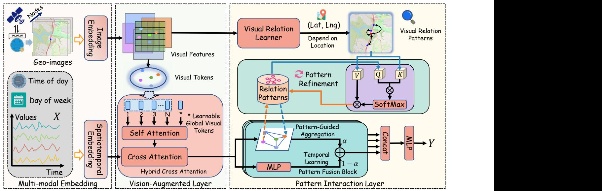
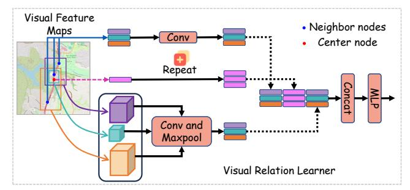
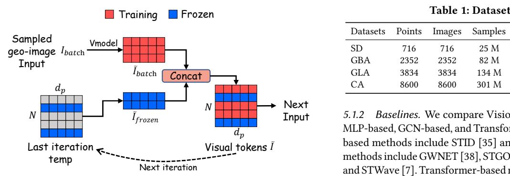
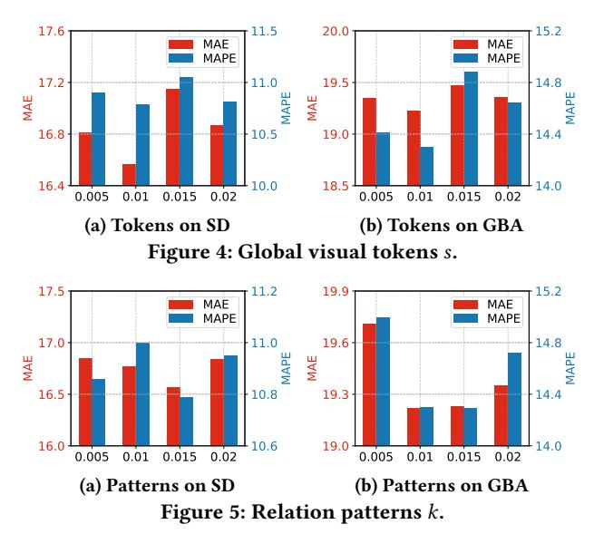
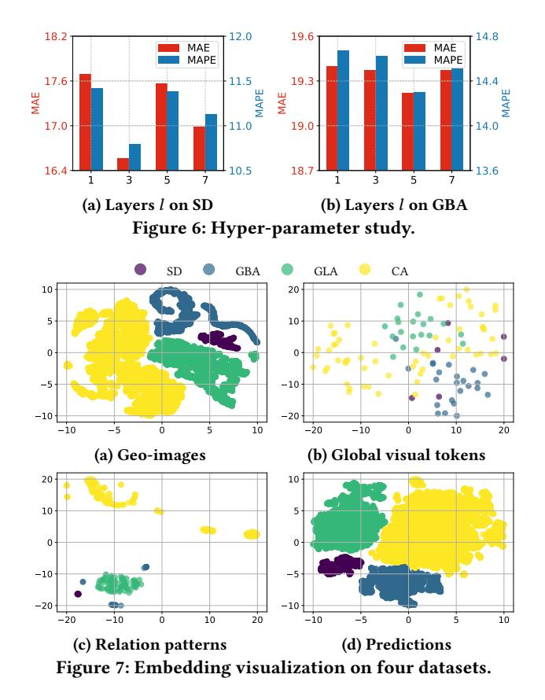
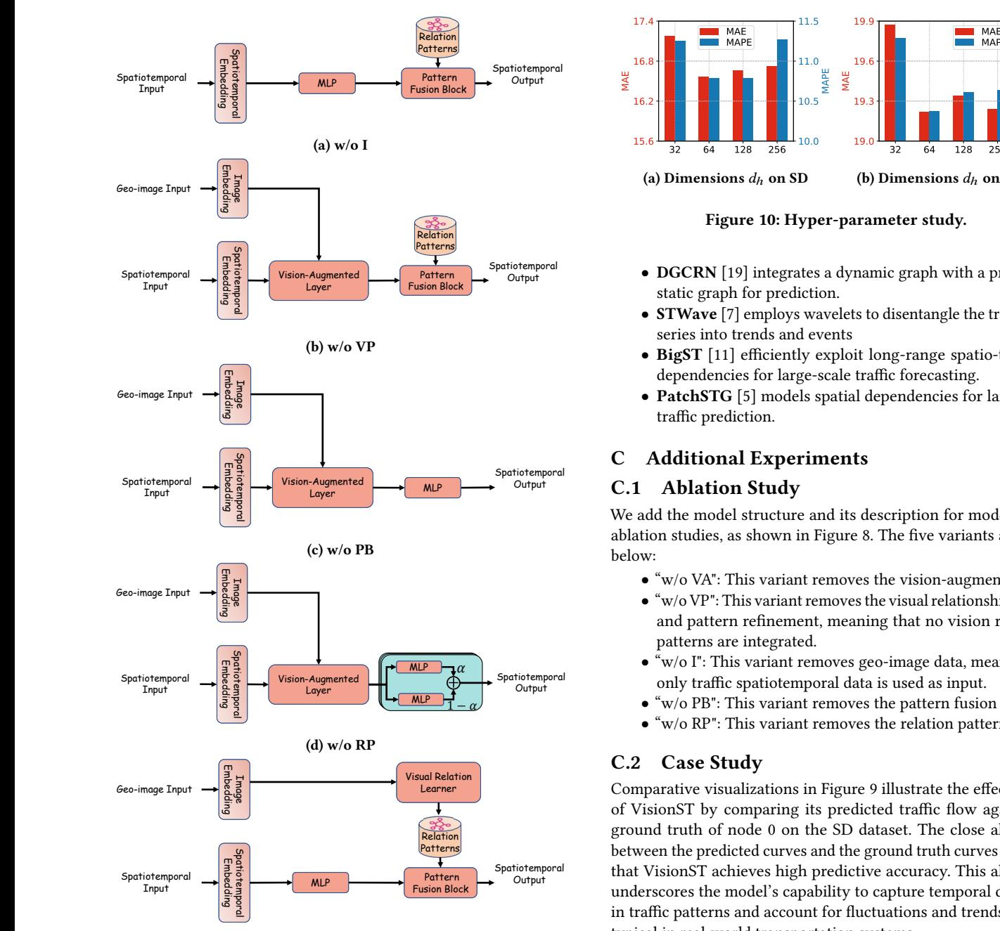
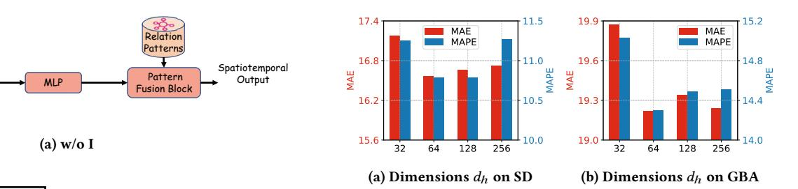
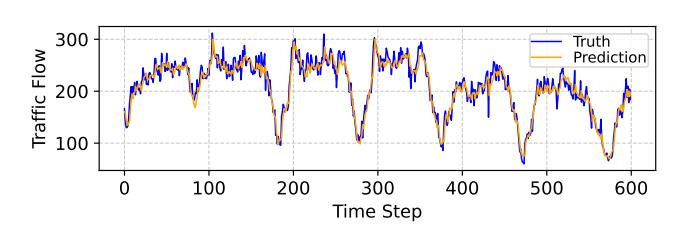

# VisionST: Coordinating Cross-modal Traffic Prediction with Interactive Geo-image Encoding

Jinwen Chen∗ University of Electronic Science and Technology of China Chengdu, China jinwenc@std.uestc.edu.cn

Hao Miao∗ The Hong Kong Polytechnic University Hong Kong, China hao.miao@polyu.edu.hk

Chenxi Liu Hong Kong Institute of Science & Innovation Chinese Academy of Sciences Hong Kong, China chenxi.liu@cair-cas.org.hk

Yan Zhao† Shenzhen Institute for Advanced Study, University of Electronic Science and Technology of China Chengdu, China zhaoyan@uestc.edu.cn

Kai Zheng† University of Electronic Science and Technology of China Chengdu, China zhengkai@uestc.edu.cn

#### Abstract

Traffic prediction plays a pivotal role in contemporary web technologies, motivating various intelligent web services such as route planning and remote traffic management. Many recent proposals that target deep learning for traffic prediction solely leverage historical traffic observations to predict future ones. However, traffic prediction is always susceptible to different factors such as road networks and social events, exhibiting different modalities. Most existing methods focus on a single modality, failing to capture the comprehensive traffic patterns among various factors, resulting in sub-optimal performance. Web-sourced geo-images, e.g., satellite imagery, encompass comprehensive contextual information and offer an effective way to represent diverse modalities. To unleash the power of such geo-images, we propose VisionST, a Visionaugmented Spatial-Temporal Neural Network, which coordinates cross-modal traffic prediction with interactive geo-image encoding. To bolster resilience against highly intricate and overlapping traffic patterns, VisionST features a visual semantic extraction mechanism and a pattern-guided aggregation mechanism. The former extracts node-level visual tokens and node-to-node visual relation patterns from geo-referenced images. The latter generates relation patterns that encompass visual, spatial, and temporal aspects, constraining nodes to interact with these relation patterns for contextual information interaction. Extensive experiments on real large-scale datasets offer insight into the effectiveness of the proposed solutions, showing that VisionST consistently outperforms state-of-theart baselines.

∗Equal Contribution.

[This work is licensed under a Creative Commons Attribution 4.0 International License.](https://creativecommons.org/licenses/by/4.0) WWW '26, Dubai, United Arab Emirates

© 2026 Copyright held by the owner/author(s). ACM ISBN 979-8-4007-2307-0/2026/04 <https://doi.org/10.1145/3774904.3792447>

#### CCS Concepts

• Computing methodologies → Machine learning; • Information systems → Spatial-temporal systems.

#### Keywords

Traffic Prediction, Cross-modal Modeling, Geo-image Encoding

#### ACM Reference Format:

Jinwen Chen, Hao Miao, Chenxi Liu, Yan Zhao, and Kai Zheng. 2026. VisionST: Coordinating Cross-modal Traffic Prediction with Interactive Geoimage Encoding. In Proceedings of the ACM Web Conference 2026 (WWW '26), April 13–17, 2026, Dubai, United Arab Emirates. ACM, New York, NY, USA, [11](#page-10-0) pages.<https://doi.org/10.1145/3774904.3792447>

## 1 Introduction

The widespread location-based services and digital transformation of societal activities significantly increase the availability of geographically spatiotemporal data [\[6,](#page-8-0) [15,](#page-8-1) [22,](#page-8-2) [30,](#page-8-3) [39\]](#page-8-4). For example, populations of in-road sensors provide data that captures traffic flow in multiple locations across time, while web-sourced satellite imagery complements these traffic observations by providing visual contexts such as point of interests (POIs), road layouts, and surrounding environments [\[14\]](#page-8-5). In this study, we focus on a new problem that unleashes the power of web-sourced visual contexts for effective cross-modal traffic prediction, enabling decision making across various web-centric applications, such as web computing [\[37\]](#page-8-6), urban planning [\[41,](#page-8-7) [49\]](#page-8-8), and geo-social networks [\[4\]](#page-8-9).

Effectively capturing the complex spatial and temporal correlations is crucial for traffic prediction. However, this task is particularly challenging due to the presence of highly intricate and overlapping traffic patterns, such as network topology, road connectivity, and periodicity. These complex interactions make traffic prediction particularly challenging. While many existing studies [\[5,](#page-8-10) [32\]](#page-8-11) rely solely on traffic observations for single-modal modeling of spatial and temporal dependencies, such approaches are often limited in scope and fail to capture the comprehensive real-world traffic patterns, particularly structural aspects such as roads. In contrast, the geographical (geo-) images offer rich visual information including

†Corresponding authors: Yan Zhao and Kai Zheng. Kai Zheng is with Yangtze Delta Region Institute (Quzhou), School of Computer Science and Engineering, UESTC. He is also with Shenzhen Institute for Advanced Study, UESTC.

road shapes and complex interconnections across locations [\[13\]](#page-8-12), which can complement traditional traffic data and enhance the spatio-temporal feature extraction. Inspired by recent advances in multi-modal learning [\[3,](#page-8-13) [34\]](#page-8-14), incorporating visual modalities, i.e., geo-images, is expected to enhance traffic prediction performance.

Numerous studies regarding multi-modal learning have been investigated in various domains, including image recognition [\[46\]](#page-8-15), natural language processing [\[17\]](#page-8-16), and time series analysis [\[22,](#page-8-2) [48\]](#page-8-17). In image recognition, textual descriptions assist visual models in identifying specific objects [\[46\]](#page-8-15). In natural language processing, the integration of audio, visual, and textual cues proves advantageous for sentiment analysis [\[34\]](#page-8-14). Additionally, in time series analysis, the combination of temporal, visual, and textual modalities contributes to improved prediction outcomes [\[48\]](#page-8-17). However, these methods are not specifically designed for traffic prediction, failing to capture the complex spatial and temporal correlations, simultaneously.

Geo-images widely exist in real-world applications [\[13\]](#page-8-12), which inherently provide rich visual information, such as road widths, shapes, configurations, and complex interconnections between locations, which could complement traditional spatiotemporal observations, providing more contextual information [\[44,](#page-8-18) [45\]](#page-8-19). Thus, in this study, we focus on coordinating cross-modal traffic prediction with interactive geo-image encoding. However, it is non-trivial to develop such a method due to three main challenges.

Challenge I: Extracting Compact Visual Semantics. It is challenging to extract meaningful and compact visual semantics from geoimages. On the one hand, existing computer vision studies [\[31,](#page-8-20) [46\]](#page-8-15) primarily focus on generic vision tasks such as image classification and object detection. However, these methods are not well-suited for traffic prediction, as they fail to effectively capture traffic-relevant patterns. On the other hand, a fundamental modality gap exists between geo-images and traffic observations. Further, geo-images often contain substantial redundant or irrelevant information [\[31\]](#page-8-20) , which dilutes the extraction of useful cues for modeling dynamic traffic patterns.

Challenge II: Effective Cross-modal Coordination. It is challenging to achieve cross-modal traffic prediction with geo-images. Although recent studies [\[3,](#page-8-13) [34,](#page-8-14) [46\]](#page-8-15) have investigated cross-modal learning in diverse domains, such as image recognition, these approaches are not directly applicable to traffic prediction. This is primarily due to the complex dynamic-static relationship between traffic data and geo-images, which calls for specialized coordination methods. Moreover, designing an effective training and inference process for integrating static image data with dynamic traffic observations remains challenging. Specifically, traffic data provides information for different locations at each time step. Appending visual data for each location at each time step may require processing all locationassociated images through the vision backbone during each training iteration, which is computationally prohibitive, especially for largescale road networks.

Challenge III: Three-fold Cross-modality Alignment. Effectively aligning three-fold cross-modality features, i.e., static visual features, dynamic spatial and temporal features, is challenging due to the feature divergences between static and dynamic data. Recent multi-modal learning studies [\[3,](#page-8-13) [28,](#page-8-21) [34\]](#page-8-14) provide means to perform feature alignment. However, they typically treat all data modalities as either static or dynamic, without addressing both static and

dynamic data. In contrast, traffic prediction requires the fusion of inherently heterogeneous modalities: static image and dynamic spatial and temporal features, hindering effective alignment.

To address these challenges, we introduce a Vision-augmented Spatial-Temporal Neural Network (VisionST) to unleash the power of geo-images for cross-modal traffic prediction. To capture compact visual semantics, we introduce a vision-augmented layer that generates node (location)-level global visual tokens to enrich the feature space with local environmental context derived from geoimages. Moreover, we introduce a visual relation learner to construct node-to-node visual relational patterns by sampling features from specific image regions, which can capture the local visual dependencies between nodes. Specifically, we apply a self-attention mechanism to reduce the number of visual tokens for compact visual representations (solving Challenge I). To achieve effective cross-modal coordination, we propose a pattern interaction layer that extracts relation patterns from geo-images and traffic observations. It constrains nodes to interact with these relation patterns, incorporating pattern-aware features into node representations for more expressive and relationally grounded learning. In addition, during training and inference, we introduce a novel cross-modal sample update strategy that selectively updates visual features at each iteration. This approach ensures efficient training while enabling full cross-modal fusion during inference (solving Challenge II). To effectively align visual, spatial, and temporal information, we propose a hybrid cross-attention mechanism that incorporates global visual tokens into spatiotemporal embeddings. Additionally, we introduce a pattern refinement module that fuses visual relational patterns with common relational representations for more comprehensive pattern integration (solving Challenge III).

The main contributions are summarized as follows:

- We propose a new Vision-augmented Spatial-Temporal Neural Network (VisionST), which aims to coordinate crossmodal traffic prediction with web-sourced geo-image encoding.
- We design a novel pattern interaction mechanism, which facilitates extracting and combining visual, spatial, and temporal patterns via an innovative message-passing process.
- We propose a cross-modal sample update strategy to effectively harmonize geo-images and traffic observations during both training and inference.
- Comprehensive experimental results on large traffic datasets demonstrate that the VisionST achieves state-of-the-art performance.

### 2 Related Work

Deep Learning Based Traffic Prediction. Deep learning based traffic prediction has been a long focus of both research and industry [\[2,](#page-8-22) [11,](#page-8-23) [12,](#page-8-24) [15,](#page-8-1) [16,](#page-8-25) [19,](#page-8-26) [21,](#page-8-27) [29,](#page-8-28) [35,](#page-8-29) [39\]](#page-8-4). Early approaches, such as GWNET [\[38\]](#page-8-30), introduced data-driven fixed adjacency matrices within graph neural networks to capture spatial dependencies. To model dynamic point-to-point spatial correlations, many like ASTGCN [\[9\]](#page-8-31), GMAN [\[47\]](#page-8-32), ST-GRAT [\[33\]](#page-8-33), and GMSDR [\[24\]](#page-8-34) apply attention mechanisms to model dynamic spatial correlations. Although these methods extract spatial and temporal dependencies from traffic data, they overlook rich visual patterns such as road

Figure 1: Framework overview

geometry, layout, and connectivity [\[48\]](#page-8-17), which are difficult to capture through traditional spatiotemporal inputs alone. Therefore, we propose VisionST, a cross-modal framework that coordinates cross-modal traffic prediction with interactive geo-image encoding. Multi-modal Learning. Recent studies have explored multi-modal across various domains [\[18,](#page-8-35) [20,](#page-8-36) [23,](#page-8-37) [25,](#page-8-38) [27\]](#page-8-39). In image recognition, some studies employ multi-modal models that enable end-to-end learning of visual–language contexts for object localization, identification, and association [\[40,](#page-8-40) [46\]](#page-8-15). In natural language processing, multi-modal analysis has been explored by integrating audio, visual, and textual modalities to capture semantic information [\[34,](#page-8-14) [43\]](#page-8-41). For meteorological spatiotemporal prediction, [\[3\]](#page-8-13) introduced the Terra dataset, which combines spatial imagery, descriptive text, and spatiotemporal observations. However, no specific dataset exists for cross-modal traffic prediction. To address this, we create a new multi-modal traffic dataset and a pattern interaction layer to align the features of spatiotemporal observations and geo-referenced satellite imagery extracted from the Map.

#### 3 Preliminaries

Definition 3.1 (Traffic Flow). Traffic flow data consists of multiple correlated time series collected from spatially distributed nodes where road sensors are deployed. At each time step ��, the traffic observation is represented as �� �� ∈ R �� ×��, where �� is the number of sensor nodes and �� denotes the number of features per node (e.g., traffic flow, speed, temperature, etc.).

Definition 3.2 (Geo-image). To enhance spatial representation, we incorporate image data derived from digital map tiles. Each node is associated with a corresponding image that captures the local environment centered on the node's geographic coordinates. Let I ∈ R �� ×�� ×�� ×3 denote the set of RGB images for all �� nodes, where �� and�� are the height and width of the images, respectively.

Definition 3.3 (Traffic Prediction). Given the past �� time steps of traffic node features X = {�� ��−�� +1 , . . . , ���� }, the node coordinates (latitude Lat ∈ R �� and longitude Lng ∈ R �� ), and the node-level images, we aim to learn a function �� to estimate the traffic flow over the next �� time steps:

Yˆ = �� (X, Lat, Lng,I), (1)

where Yˆ ∈ R �� ×�� ×�� is the prediction and X ∈ R �� ×�� ×�� is the input.

#### 4 Methodology

#### 4.1 Overview

An overview of the proposed Vision-augmented Spatial-Temporal Neural Network (VisionST) is illustrated in Figure [1.](#page-2-0) VisionST is composed of three main components: (1) Multi-modal Embedding, which consists of spatiotemporal embedding and image embedding, aims to transform the traffic data into a high-dimensional representation, thereby facilitating more effective learning of complex patterns. (2) Vision-Augmented Layer, which extracts node-level visual tokens from geo-images and integrates them into spatiotemporal representations, enriching the feature space with localized environmental context. (3) Pattern Interaction Layer, which generates relation patterns that encompass visual, spatial, and temporal aspects, constrains nodes to interact with them for contextual information interaction.

#### 4.2 Multi-modal Embedding

4.2.1 Spatiotemporal Embedding. For ease of processing, we reshape the input tensor X ∈ R �� ×�� ×�� into a two-dimensional matrix Xe ∈ R �� × (�� ∗��) . Following previous works [\[5,](#page-8-10) [38\]](#page-8-30), we adopt a fullyconnected layer to transform the raw numerical values of each input time series into high-dimensional embeddings. The transformation process is formulated as:

H = Xe��1 + ��1, (2)

where ��1 ∈ R (�� ∗��)×��ℎ and ��1 ∈ R ��ℎ are learnable parameters of the linear projection layer, and H ∈ R �� ×��ℎ denotes the resulting high-dimensional embedding.

Visual tokens �� �� ሚ Next Input 5.1.2 Baselines. We compare VisionST with nine baselines with MLP-based, GCN-based, and Transformer-based methods. The MLPbased methods include STID [\[35\]](#page-8-29) and BigST [\[11\]](#page-8-23). The GCN-based methods include GWNET [\[38\]](#page-8-30), STGODE [\[8\]](#page-8-45), RPMixer [\[42\]](#page-8-46), DGCRN [\[19\]](#page-8-26), and STWave [\[7\]](#page-8-47). Transformer-based methods include D2STGNN [\[36\]](#page-8-48) and PatchSTG [\[5\]](#page-8-10). Detailed descriptions of these models are provided in Appendix [B.4.](#page-9-1)

�� 5.1.3 Evaluation Metrics. We adopt three widely used numerical metrics to assess the quality of predicted traffic time series: Mean Absolute Error (MAE), Root Mean Squared Error (RMSE), and Mean Absolute Percentage Error (MAPE). The corresponding formulas are provided in Appendix [B.1.](#page-9-2)

Visual relation �� Sampled spatiotemporal Input optimize the forecasting model. In particular, the data flow for visual tokens is illustrated in Figure [3.](#page-5-0) The data flow for visual relation patterns is similar to this. Specifically, at each iteration, a selected subset of image regions��batch is processed through the vision model (Vmodel) to yield visual tokens e��batch and corresponding visual relation patterns ��ebatch. The remaining visual features e��frozen and ��efrozen are retained from previous iterations without recomputation. These, together with the corresponding spatiotemporal features ��batch, are then fed into the spatiotemporal model (STmodel) for prediction and gradient-based optimization. The overall process can be formally described as:

patterns 5.1.4 Implementation Details. Our experiments are conducted on a server equipped with NVIDIA RTX 4090 GPUs, running CUDA version 12.2. All models are implemented using PyTorch. Following baselines, each dataset is chronologically split into training, validation, and test sets with a ratio of 6:2:2. For geo-image datasets, each covers an area of 0.05 degrees in both longitude and latitude. To maintain consistency, all images are resized to 224×224 pixels. During training, VisionST is optimized using the AdamW optimizer with a learning rate of 0.002 and a weight decay of 0.0001. The learning rate is reduced by half every 15 epochs. More implementation details are provided in Appendix [B.2.](#page-9-3)

Figure 3: The visual tokens data flow in training process.

{��batch} Vmodel −−−−−−→ {e��batch, ��ebatch}, (22)

{��batch,e��, ��e} STmodel −−−−−−−→ ��ˆ batch. (23)

During inference, the vision model processes all available image data once to compute the full set of visual tokens and relation patterns. These fixed visual features are then paired with the spatiotemporal data to make predictions. The inference pipeline is illustrated as:

{�� } Vmodel −−−−−−→ {e��, ��e}, {��,e��, ��e} STmodel −−−−−−−→ �� . ˆ (24)

This design ensures efficient training and full cross-modal fusion at inference, enabling high-performance prediction with reduced computational overhead.

#### 5 Experiments

This section first presents the experimental setup and benchmarks the proposed VisionST model against state-of-the-art methods for traffic flow prediction. Additionally, we conduct comprehensive analyses, including ablation studies, the effect of global visual tokens, the effect of relation patterns, and hyper-parametric studies.

#### 5.1 Experimental Setup

5.1.1 Datasets. We conduct experiments on four large datasets, SD, GBA, GLA, and CA, as introduced in LargeST [\[26\]](#page-8-42). For image datasets, we utilize web-sourced geographic data from Open-StreetMap [\[10\]](#page-8-43) and generate corresponding geo-image tiles centered around sensor nodes using the Contextily toolkit [\[1\]](#page-8-44). Detailed descriptions of this generation are provided in Appendix [B.3.](#page-9-0) Table [1](#page-5-1) provides detailed statistics of spatiotemporal and geo-image datasets. Each geo-image represents the local environment centered on a node's geographic coordinates.

Table 1: Dataset statistics.

| Datasets | Points | Images |     | Samples | TimeSlices | Timespan          |
|----------|--------|--------|-----|---------|------------|-------------------|
| SD       | 716    | 716    | 25  | M       | 35040      | 01/01/19-12/31/19 |
| GBA      | 2352   | 2352   | 82  | M       | 35040      | 01/01/19-12/31/19 |
| GLA      | 3834   | 3834   | 134 | M       | 35040      | 01/01/19-12/31/19 |
| CA       | 8600   | 8600   | 301 | M       | 35040      | 01/01/19-12/31/19 |

#### 5.2 Experimental Results

5.2.1 Performance Comparisons. Table [2](#page-6-0) reports the MAE, RMSE, and MAPE for traffic prediction across all methods on four largescale datasets. The performance is evaluated at horizons 3, 6, and 12, as well as the average across all 12 horizons. VisionST consistently achieves state-of-the-art performance across all evaluated datasets, demonstrating average improvements of 3.95%, 3.12%, and 11.85% in MAE, RMSE, and MAPE, respectively, compared to the secondbest results. Transformer-based models, such as D2STGNN and PatchSTG, demonstrate improved predictive accuracy by leveraging self-attention mechanisms to aggregate global node features. In contrast, MLP-based models, such as STID and BigST, which treat nodes as independent channels, experience reduced performance due to the lack of spatial interaction information. This limitation stems from their inability to model the intricate spatial interactions between nodes. GCN-based models, like GWNET and STGODE, underperform due to their reliance on the global message-passing mechanism inherent in GCNs. While GCNs are capable of learning spatial dependencies, their fixed neighborhood aggregation approach is less flexible in capturing dynamic traffic patterns and local variations in traffic flow. Compared to GWNET, VisionST shows an average improvement of about 20.03%, 13.01%, and 28.16% in MAE, RMSE, and MAPE, respectively. This superior performance of VisionST can be attributed to its ability to jointly model visual,

Table 2: Large-scale traffic prediction performance comparison of our VisionST and baselines. The second-best performance method is underlined, and the overall best performance is marked in bold.

| Datasets Methods | MAE   | Horizon RMSE | 3 MAPE(%) | MAE   | Horizon RMSE | 6 MAPE(%) | MAE   | Horizon RMSE | 12 MAPE(%) | MAE   | Average RMSE | MAPE(%) |
|------------------|-------|--------------|-----------|-------|--------------|-----------|-------|--------------|------------|-------|--------------|---------|
| STID             | 15.15 | 25.29        | 9.82      | 17.95 | 30.39        | 11.93     | 21.82 | 38.63        | 15.09      | 17.86 | 31.00        | 11.94   |
| GWNET            | 15.24 | 25.13        | 9.86      | 17.74 | 29.51        | 11.70     | 21.56 | 36.82        | 15.13      | 17.74 | 29.62        | 11.88   |
| STGODE           | 16.75 | 28.04        | 11.00     | 19.71 | 33.56        | 13.16     | 23.67 | 42.12        | 16.58      | 19.55 | 33.57        | 13.22   |
| RPMixer          | 18.54 | 30.33        | 11.81     | 24.55 | 40.04        | 16.51     | 35.90 | 58.31        | 27.67      | 25.25 | 42.56        | 17.64   |
| 2 STGNN D SD     | 14.92 | 24.95        | 9.56      | 17.52 | 29.24        | 11.36     | 22.62 | 37.14        | 14.86      | 17.85 | 29.51        | 11.54   |
| DGCRN            | 15.34 | 25.35        | 10.01     | 18.05 | 30.06        | 11.90     | 22.06 | 37.51        | 15.27      | 18.02 | 30.09        | 12.07   |
| STWave           | 15.80 | 25.89        | 10.34     | 18.18 | 30.03        | 11.96     | 21.98 | 36.99        | 15.30      | 18.22 | 30.12        | 12.20   |
| BigST            | 16.42 | 26.99        | 10.86     | 18.88 | 31.60        | 13.24     | 23.00 | 38.59        | 15.92      | 18.80 | 31.73        | 12.91   |
| PatchSTG         | 14.61 | 24.26        | 9.25      | 17.26 | 28.69        | 11.98     | 21.16 | 36.01        | 16.49      | 17.24 | 29.18        | 12.24   |
| VisionST         | 14.26 | 23.95        | 9.01      | 16.55 | 27.90        | 10.66     | 20.13 | 34.61        | 13.70      | 16.57 | 28.30        | 10.79   |
| STID             | 17.36 | 29.39        | 13.28     | 20.45 | 34.51        | 16.03     | 24.38 | 41.33        | 19.90      | 20.22 | 34.61        | 15.91   |
| GWNET            | 17.85 | 29.12        | 13.92     | 21.11 | 33.69        | 17.79     | 25.58 | 40.19        | 23.48      | 20.91 | 33.41        | 17.66   |
| STGODE           | 18.84 | 30.51        | 15.43     | 22.04 | 35.61        | 18.42     | 26.22 | 42.90        | 22.83      | 21.79 | 35.37        | 18.26   |
| RPMixer          | 20.31 | 33.34        | 15.64     | 26.95 | 44.02        | 22.75     | 39.66 | 66.44        | 37.35      | 27.77 | 47.72        | 23.87   |
| 2 STGNN D GBA    | 17.54 | 28.94        | 12.12     | 20.92 | 33.92        | 14.89     | 25.48 | 40.99        | 19.83      | 20.71 | 33.65        | 15.04   |
| DGCRN            | 18.02 | 29.49        | 14.13     | 21.08 | 34.03        | 16.94     | 25.25 | 40.63        | 21.15      | 20.91 | 33.83        | 16.88   |
| STWave           | 17.95 | 29.42        | 13.01     | 20.99 | 34.01        | 15.62     | 24.96 | 40.31        | 20.08      | 20.81 | 33.77        | 15.76   |
| BigST            | 18.70 | 30.27        | 15.55     | 22.21 | 35.33        | 18.54     | 26.98 | 42.73        | 23.68      | 21.95 | 35.54        | 18.50   |
| PatchSTG         | 17.48 | 29.27        | 13.20     | 20.27 | 33.43        | 15.95     | 23.67 | 39.14        | 19.89      | 20.02 | 33.42        | 16.12   |
| VisionST         | 16.61 | 28.24        | 11.94     | 19.45 | 32.52        | 14.51     | 23.27 | 38.63        | 18.47      | 19.31 | 32.64        | 14.56   |
| STID             | 16.54 | 27.73        | 10.00     | 19.98 | 34.23        | 12.38     | 24.29 | 42.50        | 16.02      | 19.76 | 34.56        | 12.41   |
| GWNET            | 17.28 | 27.68        | 10.18     | 21.31 | 33.70        | 13.02     | 26.99 | 42.51        | 17.64      | 21.20 | 33.58        | 13.18   |
| STGODE           | 18.10 | 30.02        | 11.18     | 21.71 | 36.46        | 13.64     | 26.45 | 45.09        | 17.60      | 21.49 | 36.14        | 13.72   |
| RPMixer          | 19.94 | 32.54        | 11.53     | 27.10 | 44.87        | 16.58     | 40.13 | 69.11        | 27.93      | 27.87 | 48.96        | 17.66   |
| STWave GLA       | 17.48 | 28.05        | 10.06     | 21.08 | 33.58        | 12.56     | 25.82 | 41.28        | 16.51      | 20.96 | 33.48        | 12.70   |
| BigST            | 18.38 | 29.40        | 11.68     | 22.22 | 35.53        | 14.48     | 27.98 | 44.74        | 19.65      | 22.08 | 36.00        | 14.57   |
| PatchSTG         | 15.84 | 26.34        | 9.27      | 19.06 | 31.85        | 11.30     | 23.32 | 39.64        | 14.60      | 18.96 | 32.33        | 11.44   |
| VisionST         | 15.66 | 25.93        | 8.92      | 18.68 | 30.88        | 11.07     | 22.85 | 38.32        | 14.24      | 18.58 | 31.32        | 11.08   |
| STID             | 15.51 | 26.23        | 11.26     | 18.53 | 31.56        | 13.82     | 22.63 | 39.37        | 17.59      | 18.41 | 32.00        | 13.82   |
| GWNET            | 17.14 | 27.81        | 12.62     | 21.68 | 34.16        | 17.14     | 28.58 | 44.13        | 24.24      | 21.72 | 34.20        | 17.40   |
| STGODE           | 17.57 | 29.91        | 13.91     | 20.98 | 36.62        | 16.88     | 25.46 | 45.99        | 21.00      | 20.77 | 36.60        | 16.80   |
| RPMixer CA       | 18.18 | 30.49        | 12.86     | 24.33 | 41.38        | 18.34     | 35.74 | 62.12        | 30.38      | 25.07 | 44.75        | 19.47   |
| STWave           | 16.77 | 26.98        | 12.20     | 18.97 | 30.69        | 14.40     | 25.36 | 38.77        | 19.01      | 19.69 | 31.58        | 14.58   |
| BigST            | 17.15 | 27.92        | 13.03     | 20.44 | 33.16        | 15.87     | 25.49 | 41.09        | 20.97      | 20.32 | 33.45        | 15.91   |
| PatchSTG         | 15.06 | 25.18        | 11.30     | 17.92 | 29.89        | 13.62     | 21.63 | 36.51        | 16.72      | 17.77 | 30.14        | 13.65   |
| VisionST         | 14.84 | 25.09        | 10.47     | 17.49 | 29.53        | 12.46     | 21.06 | 35.79        | 15.62      | 17.37 | 29.75        | 12.50   |

Table 3: Ablation study of VisionST on average results of large-scale traffic datasets. Bold: best performance.

|          | Dataset Metric | MAE   | RMSE  | SD MAPE | (%) MAE | RMSE  | GBA MAPE | (%) MAE | RMSE  | GLA MAPE (%) |
|----------|----------------|-------|-------|---------|---------|-------|----------|---------|-------|--------------|
| w/o      | VA             | 16.74 | 28.46 | 10.82   | 20.06   | 33.63 | 15.39    | 18.86   | 31.80 | 11.37        |
| w/o      | VP             | 17.26 | 29.17 | 11.02   | 20.23   | 33.53 | 16.06    | 19.17   | 32.14 | 11.72        |
| w/o      | RP             | 16.66 | 28.48 | 10.84   | 19.74   | 33.14 | 15.31    | 18.77   | 31.68 | 11.09        |
| w/o      | I              | 17.12 | 28.89 | 11.56   | 20.06   | 33.56 | 15.72    | 19.02   | 31.85 | 11.24        |
| w/o      | PB             | 17.53 | 30.53 | 11.54   | 19.79   | 34.09 | 15.23    | 19.51   | 33.34 | 11.89        |
| VisionST |                | 16.57 | 28.30 | 10.79   | 19.31   | 32.64 | 14.56    | 18.58   | 31.32 | 11.08        |

spatial, and temporal patterns in a cross-modal framework. By capturing complex and heterogeneous traffic patterns through crossmodal integration, VisionST significantly enhances prediction and generalization capability.

5.2.2 Ablation Study. To evaluate the effectiveness of different components in VisionST, we conducted the ablation study with several variants of VisionST on the SD, GBA, and GLA datasets. The model structure and its description for the ablation studies are detailed in Appendix [C.1.](#page-10-1) As shown in table [3,](#page-6-1) VisionST consistently outperforms its variants, highlighting the efficacy of its

complete configuration. Among the variants, removing the pattern fusion block (w/o PB) leads to the most significant performance degradation, with average increases of 5.79%, 7.88%, and 6.95% in MAE, RMSE, and MAPE, respectively, compared to VisionST. Excluding the input geo-image data (w/o I) emphasizes the crucial role of geo-image data, as it provides valuable visual context for enhanced prediction. Without the relation pattern (w/o VP) or global visual token (w/o VA) suggests that relying solely on spatial and temporal patterns is inadequate. Visual semantics offer complementary semantic context that enhances spatial-temporal reasoning, especially in complex traffic scenes. Additionally, the absence of the pattern-aware messaging mechanism (w/o RP) underscores its crucial role in processing node relations.

5.2.3 Effect of Global Visual Tokens. Figure [4](#page-7-0) shows the results of analyzing the number of global visual tokens �� in VisionST on the SD and GBA datasets. Specifically, we evaluate �� within the range {0.005�� , 0.01�� , 0.015�� , 0.02��}, where �� denotes the total number of nodes in the dataset. VisionST achieves optimal performance on both datasets when the number of global visual tokens is set to 0.01��, suggesting that the ideal number of global visual tokens

scales positively with the dataset size and node count. This finding is consistent with the notion that larger datasets with more nodes require a greater number of visual tokens to adequately capture the spatial and contextual information embedded in the data. Furthermore, increasing �� beyond 0.01�� results in a notable performance decline. Specifically, larger values of �� contribute to overfitting, as the model becomes overly focused on fine-grained visual details that are less relevant for the task at hand.

5.2.4 Effect of Relation Patterns. We analyze the number of relational patterns �� in VisionST on the SD and GBA datasets in Figure [5.](#page-7-1) Specifically, we evaluate �� within the range {0.005�� , 0.01�� , 0.015�� , 0.02��}, where �� denotes the total number of nodes in the dataset. The best results occur at �� = 0.015�� for the SD dataset and �� = 0.01�� for the GBA dataset, suggesting that the GBA dataset is characterized by more compact relational patterns compared to the SD dataset. These findings suggest that VisionST can adapt to different dataset characteristics, with smaller values of �� being more suitable for datasets with tightly clustered relational structures, like GBA, and larger values of �� better capturing the more dispersed patterns in the SD dataset.

5.2.5 Hyper-parameter Study. The results of the hyper-parameter sensitivity analysis for VisionST on the SD and GBA datasets are presented in Figure [6.](#page-7-2) The analysis examines the effects of varying the number of pattern fusion blocks ��. Specifically, VisionST achieves peak performance with 3 layers on the SD dataset and 5 layers on the GBA dataset. These findings suggest that the optimal number of pattern fusion blocks depends on the complexity and size of the dataset. For the SD dataset, a shallower architecture with 3 layers appears sufficient to capture the traffic patterns. In contrast, the GBA dataset, being larger and more complex, benefits from a deeper architecture, with 5 layers enabling the model to better capture the intricate traffic dynamics characteristic .

5.2.6 Visualization. We visualize the geo-image, global visual token, relation pattern, and prediction embeddings in Figure [7.](#page-7-3) Figure [7a](#page-7-3) demonstrates that the geo-image embeddings form wellseparated clusters corresponding to each dataset. Figure [7b](#page-7-3) tightly

shows that global visual token embeddings have more cohesiveness. In Figure [7c,](#page-7-3) relation pattern embeddings have more complex inter-relations, indicating that each dataset has different patterns. Figure [7d](#page-7-3) illustrates that traffic prediction also forms well-separated clusters for each dataset. This suggests that the projection utilizes the geo-image embeddings to generate accurate forecasts. Overall, the step-by-step refinement shows how the VisionST improves data representations.

#### 6 Conclusion

In this study, we introduce VisionST, which coordinates cross-modal traffic prediction with interactive geo-image encoding. VisionST is a pioneering approach to modeling traffic patterns from visual, spatial, and temporal perspectives. This framework integrates websourced geo-image data with traffic spatiotemporal data to capture complex cross-modal latent patterns. Meanwhile, it adopts a crossmodal sample update strategy that ensures efficient training while allowing full cross-modal fusion during inference. Extensive experiments conducted on four real-world, large datasets demonstrate the superior performance of VisionST. In future research, an interesting research direction is to study whether VisionST can be applied to other spatio-temporal tasks, e.g., meteorological prediction.

#### 7 Acknowledgment

This work is partially supported by NSFC (No. 62472068), Municipal Government of Quzhou under Grant (No. 2024D036), DFF Inge Lehmann grant (No. 4303-00014), and InnoHK funding.

#### References

[1] Dani Arribas-Bel. 2021. contextily: Context GeoTIFF tiles in Python. [https:](https://contextily.readthedocs.io/) [//contextily.readthedocs.io/.](https://contextily.readthedocs.io/) Accessed: 2025-07-02. [2] Jinwen Chen, Hao Miao, Dazhuo Qiu, Jiannan Guo, Yawen Li, and Yan Zhao. 2025. Sustainability-Oriented Task Recommendation in Spatial Crowdsourcing. In ICDE. 2712–2725. [3] Wei Chen, Xixuan Hao, Yuankai Wu, and Yuxuan Liang. 2024. Terra: A multimodal spatio-temporal dataset spanning the earth. NeurIPS 37 (2024), 66329– 66356. [4] Amine Dadoun, Raphaël Troncy, Olivier Ratier, and Riccardo Petitti. 2019. Location embeddings for next trip recommendation. In WWW. 896–903. [5] Yuchen Fang, Yuxuan Liang, Bo Hui, Zezhi Shao, Liwei Deng, Xu Liu, Xinke Jiang, and Kai Zheng. 2025. Efficient large-scale traffic forecasting with transformers: A spatial data management perspective. In SIGKDD. [6] Yuchen Fang, Hao Miao, Yuxuan Liang, Liwei Deng, Yue Cui, Ximu Zeng, Yuyang Xia, Yan Zhao, Torben Bach Pedersen, Christian S. Jensen, Xiaofang Zhou, and Kai Zheng. 2026. Unraveling Spatio-Temporal Foundation Models Via the Pipeline Lens: A Comprehensive Review. TKDE (2026), 1–24. [7] Yuchen Fang, Yanjun Qin, Haiyong Luo, Fang Zhao, Bingbing Xu, Liang Zeng, and Chenxing Wang. 2023. When spatio-temporal meet wavelets: Disentangled traffic forecasting via efficient spectral graph attention networks. In ICDE. 517–529. [8] Zheng Fang, Qingqing Long, Guojie Song, and Kunqing Xie. 2021. Spatialtemporal graph ode networks for traffic flow forecasting. In SIGKDD. 364–373. [9] Shengnan Guo, Youfang Lin, Ning Feng, Chao Song, and Huaiyu Wan. 2019. Attention based spatial-temporal graph convolutional networks for traffic flow forecasting. In AAAI, Vol. 33. 922–929. [10] Muki Haklay and Patrick Weber. 2008. OpenStreetMap: User-Generated Street Maps. Pervasive Computing 7, 4 (2008), 12–18. [11] Jindong Han, Weijia Zhang, Hao Liu, Tao Tao, Naiqiang Tan, and Hui Xiong. 2024. BigST: Linear complexity spatio-temporal graph neural network for traffic forecasting on large-scale road networks. PVLDB 17, 5 (2024), 1081–1090. [12] Xiao Han, Zijian Zhang, Xiangyu Zhao, Yuanshao Zhu, Guojiang Shen, Xiangjie Kong, Xuetao Wei, Liqiang Nie, and Jieping Ye. 2025. Garlic: Gpt-augmented reinforcement learning with intelligent control for vehicle dispatching. In AAAI, Vol. 39. 255–263. [13] Xixuan Hao, Wei Chen, Yibo Yan, Siru Zhong, Kun Wang, Qingsong Wen, and Yuxuan Liang. 2025. UrbanVLP: Multi-granularity vision-language pretraining for urban socioeconomic indicator prediction. In AAAI, Vol. 39. 28061–28069. [14] Xixuan Hao, Wei Chen, Xingchen Zou, and Yuxuan Liang. 2025. Nature makes no leaps: Building continuous location embeddings with satellite imagery from the web. In WWW. 2799–2812. [15] Yayao Hong, Liyue Chen, Leye Wang, Xiuhuai Xie, Guofeng Luo, Cheng Wang, and Longbiao Chen. 2025. STKOpt: Automated Spatio-Temporal Knowledge Optimization for Traffic Prediction. In WWW. 2238–2249. [16] Jiahao Ji, Jingyuan Wang, Zhe Jiang, Jiawei Jiang, and Hu Zhang. 2022. STDEN: Towards physics-guided neural networks for traffic flow prediction. In AAAI, Vol. 36. 4048–4056. [17] Sanyam Kapoor, Nate Gruver, Manley Roberts, Katherine Collins, Arka Pal, Umang Bhatt, Adrian Weller, Samuel Dooley, Micah Goldblum, and Andrew Gordon Wilson. 2024. Large Language Models Must Be Taught to Know What They Don't Know. In NeurIPS, Vol. 37. 85932–85972. [18] Muhammad Uzair Khattak, Hanoona Rasheed, Muhammad Maaz, Salman Khan, and Fahad Shahbaz Khan. 2023. Maple: Multi-modal prompt learning. In CVPR. 19113–19122. [19] Fuxian Li, Jie Feng, Huan Yan, Guangyin Jin, Fan Yang, Funing Sun, Depeng Jin, and Yong Li. 2023. Dynamic graph convolutional recurrent network for traffic prediction: Benchmark and solution. TKDE 17, 1 (2023), 1–21. [20] Yeming Li, Chenxi Liu, Jie Zou, Cheng Long, Chaoning Zhang, Peng Wang, and Yang Yang. 2026. From Dialogue to Destination: Geography-Aware Large Language Models with Multimodal Fusion for Conversational Recommendation. In AAAI. [21] Chenxi Liu, Kethmi Hirushini Hettige, Qianxiong Xu, Cheng Long, Shili Xiang, Gao Cong, Ziyue Li, and Rui Zhao. 2025. ST-LLM+: Graph Enhanced Spatio-Temporal Large Language Models for Traffic Prediction. TKDE 37, 8 (2025), 4846–4859. [22] Chenxi Liu, Qianxiong Xu, Hao Miao, Sun Yang, Lingzheng Zhang, Cheng Long, Ziyue Li, and Rui Zhao. 2025. TimeCMA: Towards LLM-Empowered Multivariate Time Series Forecasting via Cross-Modality Alignment. In AAAI, Vol. 39. 18780– 18788. [23] Chenxi Liu, Shaowen Zhou, Qianxiong Xu, Hao Miao, Cheng Long, Ziyue Li, and Rui Zhao. 2025. Towards Cross-Modality Modeling for Time Series Analytics: A Survey in the LLM Era. In IJCAI. [24] Dachuan Liu, Jin Wang, Shuo Shang, and Peng Han. 2022. MSDR: Multi-step dependency relation networks for spatial temporal forecasting. In SIGKDD. 1042– 1050. [25] Xiyang Liu, Chunming Hu, Richong Zhang, Kai Sun, Samuel Mensah, and Yongyi Mao. 2024. Multimodal relation extraction via a mixture of hierarchical visual context learners. In WWW. 4283–4294. [26] Xu Liu, Yutong Xia, Yuxuan Liang, Junfeng Hu, Yiwei Wang, Lei Bai, Chao Huang, Zhenguang Liu, Bryan Hooi, and Roger Zimmermann. 2023. Largest: A benchmark dataset for large-scale traffic forecasting. NeurIPS 36 (2023), 75354– 75371. [27] Jiamin Luo, Jingjing Wang, Junxiao Ma, Yujie Jin, Shoushan Li, and Guodong Zhou. 2025. Omni-SILA: Towards Omni-scene Driven Visual Sentiment Identifying, Locating and Attributing in Videos. In WWW. 188–197. [28] Otniel-Bogdan Mercea, Thomas Hummel, A Sophia Koepke, and Zeynep Akata. 2022. Temporal and cross-modal attention for audio-visual zero-shot learning. In ECCV. 488–505. [29] Hao Miao, Ziqiao Liu, Yan Zhao, Chenjuan Guo, Bin Yang, Kai Zheng, and Christian S Jensen. 2024. Less is more: Efficient time series dataset condensation via two-fold modal matching. PVLDB 18, 2 (2024), 226–238. [30] Hao Miao, Yan Zhao, Chenjuan Guo, Bin Yang, Kai Zheng, Feiteng Huang, Jiandong Xie, and Christian S Jensen. 2024. A unified replay-based continuous learning framework for spatio-temporal prediction on streaming data. In ICDE. 1050–1062. [31] Matthias Minderer, Alexey Gritsenko, and Neil Houlsby. 2023. Scaling Open-Vocabulary Object Detection. In NeurIPS, Vol. 36. 72983–73007. [32] SBMATSDVBBI Neelakandan, MA Berlin, Sandesh Tripathi, V Brindha Devi, Indu Bhardwaj, and N Arulkumar. 2021. IoT-based traffic prediction and traffic signal control system for smart city. Soft computing 25, 18 (2021), 12241–12248. [33] Cheonbok Park, Chunggi Lee, Hyojin Bahng, Yunwon Tae, Seungmin Jin, Kihwan Kim, Sungahn Ko, and Jaegul Choo. 2020. ST-GRAT: A novel spatio-temporal graph attention networks for accurately forecasting dynamically changing road speed. In CIKM. 1215–1224. [34] Soujanya Poria, Erik Cambria, Newton Howard, Guang-Bin Huang, and Amir Hussain. 2016. Fusing audio, visual and textual clues for sentiment analysis from multimodal content. Neurocomputing 174 (2016), 50–59. [35] Zezhi Shao, Zhao Zhang, Fei Wang, Wei Wei, and Yongjun Xu. 2022. Spatialtemporal identity: A simple yet effective baseline for multivariate time series forecasting. In CIKM. 4454–4458. [36] Zezhi Shao, Zhao Zhang, Wei Wei, Fei Wang, Yongjun Xu, Xin Cao, and Christian S Jensen. 2022. Decoupled Dynamic Spatial-Temporal Graph Neural Network for Traffic Forecasting. PVLDB 15, 11 (2022), 2733–2746. [37] Nemin Wu, Qian Cao, Zhangyu Wang, Zeping Liu, Yanlin Qi, Jielu Zhang, Joshua Ni, Xiaobai Yao, Hongxu Ma, Lan Mu, et al. 2024. Torchspatial: A location encoding framework and benchmark for spatial representation learning. NeurIPS 37 (2024), 81437–81460. [38] Zonghan Wu, Shirui Pan, Guodong Long, Jing Jiang, and Chengqi Zhang. 2019. Graph wavenet for deep spatial-temporal graph modeling. In IJCAI. 1907–1913. [39] Mingyuan Xia, Chunxu Zhang, Zijian Zhang, Hao Miao, Qidong Liu, Yuanshao Zhu, and Bo Yang. 2025. TimeEmb: A Lightweight Static-Dynamic Disentanglement Framework for Time Series Forecasting. In NeurIPS. [40] Haiyang Xu, Qinghao Ye, Ming Yan, Yaya Shi, Jiabo Ye, Yuanhong Xu, Chenliang Li, Bin Bi, Qi Qian, Wei Wang, Guohai Xu, Ji Zhang, Songfang Huang, Fei Huang, and Jingren Zhou. 2023. mPLUG-2: A Modularized Multi-modal Foundation Model Across Text, Image and Video. In ICML. 38728–38748. [41] Yibo Yan, Haomin Wen, Siru Zhong, Wei Chen, Haodong Chen, Qingsong Wen, Roger Zimmermann, and Yuxuan Liang. 2024. Urbanclip: Learning text-enhanced urban region profiling with contrastive language-image pretraining from the web. In WWW. 4006–4017. [42] Chin-Chia Michael Yeh, Yujie Fan, Xin Dai, Uday Singh Saini, Vivian Lai, Prince Osei Aboagye, Junpeng Wang, Huiyuan Chen, Yan Zheng, Zhongfang Zhuang, et al. 2024. Rpmixer: Shaking up time series forecasting with random projections for large spatial-temporal data. In SIGKDD. 3919–3930. [43] Zhenfei Yin, Jiong Wang, Jianjian Cao, Zhelun Shi, Dingning Liu, Mukai Li, Xiaoshui Huang, Zhiyong Wang, Lu Sheng, Lei Bai, et al. 2023. Lamm: Languageassisted multi-modal instruction-tuning dataset, framework, and benchmark. NeurIPS 36 (2023), 26650–26685. [44] Chengqing Yu, Fei Wang, Zezhi Shao, Tangwen Qian, Zhao Zhang, Wei Wei, Zhulin An, Qi Wang, and Yongjun Xu. 2025. GinAR+: A Robust End-to-End Framework for Multivariate Time Series Forecasting With Missing Values. TKDE 37, 8 (2025), 4635–4648. [45] Yuan Yuan, Jingtao Ding, Chenyang Shao, Depeng Jin, and Yong Li. 2023. Spatiotemporal Diffusion Point Processes. In SIGKDD. 3173–3184. [46] Yuhang Zang, Wei Li, Jun Han, Kaiyang Zhou, and Chen Change Loy. 2025. Contextual object detection with multimodal large language models. IJCV 133, 2 (2025), 825–843. [47] Chuanpan Zheng, Xiaoliang Fan, Cheng Wang, and Jianzhong Qi. 2020. GMAN: A graph multi-attention network for traffic prediction. In AAAI, Vol. 34. 1234–1241. [48] Siru Zhong, Weilin Ruan, Ming Jin, Huan Li, Qingsong Wen, and Yuxuan Liang. 2025. Time-VLM: Exploring Multimodal Vision-Language Models for Augmented Time Series Forecasting. ICML (2025). [49] Zhengyang Zhou, Qihe Huang, Binwu Wang, Jianpeng Hou, Kuo Yang, Yuxuan Liang, Yu Zheng, and Yang Wang. 2025. ComS2T: A complementary spatiotemporal learning system for data-adaptive model evolution. TPAMI (2025).

#### A Details of Training

During training, VisionST jointly leverages both dynamically updated and frozen visual representations together with the spatiotemporal inputs to optimize the forecasting model. The data flow of visual tokens is illustrated in Figure [3,](#page-5-0) while that of visual relation patterns follows a similar process. In addition, Algorithm [1](#page-9-4) outlines the overall training process of VisionST. The algorithm takes as input the node-level traffic features X, corresponding geoimages I, and geographic coordinates (latitude and longitude). In each training epoch, VisionST first encodes all geo-images through an image embedding module to obtain compact visual tokens e�� and visual relation patterns ��e. Then, for each mini-batch of traffic data, the model samples a subset of geo-images and encodes them to obtain e��batch and ��ebatch, from which frozen visual representations e��frozen and ��efrozen are derived to preserve contextual consistency. The spatial temporal embedding Z is then enhanced via a hybrid cross attention mechanism. A common relation pattern matrix D captures inter-node dependencies, while subsequent MLP and PGA layers iteratively refine representations. The concatenated outputs are finally fed into an MLP to produce the predicted traffic flow Yˆ.

Algorithm 1: VisionST Training Input :Traffic node features X, node-level images I, latitude Lat, longitude Lng Output :Trained VisionST model parameters 1 for ��������ℎ = 1 to epoch number do 2 ˆ�� ← ImgEmbedding(I); 3 Extract compact visual tokens e�� and visual relation patterns ��efor each geo-image; 4 foreach ��batch ⊆ X do 5 Sample geo-images ��batch from I; 6 Extract batched tokens e��batch and patterns ��ebatch; 7 Obtain frozen visual representations e��frozen and ��efrozen (i.e., excluding current batch) from e��batch and ��ebatch, respectively; 8 Merge visual features: e�� ← {e��batch,e��frozen}, ��e← {��ebatch, ��efrozen}; 9 Z ← SpatioTemporalEmbedding(��batch); 10 eZ ← HybridCrossAttention(Z,e��); 11 Compute relation matrix D according to Eq. [13;](#page-4-0) 12 for �� = 1 to �� do 13 eZ (��) �� ← MLP (eZ); 14 eZ (��) �� ← PGA(eZ, D); 15 eZ (��) ← ��eZ (��) �� + (1 − ��)eZ (��) ; 16 end 17 Yˆ ← MLP (eZ (1) ∥eZ (2) ∥ . . . ∥eZ (��) ); 18 Update model parameters by minimizing loss between Yˆ and ground truth Y; 19 end 20 end

#### B Details of the Experiment Setup

#### B.1 Evaluation metrics

We use three widely adopted numerical metrics to assess the quality of predicted traffic time series: Mean Absolute Error (MAE), Root Mean Squared Error (RMSE), and Mean Absolute Percentage Error (MAPE). The formulas for these metrics are:

MAE = 1 �� �� ∑︁ �� ��=1 ∑︁ �� ��=1 ��ˆ �� �� − �� ��  , (25)

RMSE = vuut 1 �� �� ∑︁ �� ��=1 ∑︁ �� ��=1 ��ˆ �� �� − �� �� �� 2 , (26)

MAPE = 1 �� �� ∑︁ �� ��=1 ∑︁ �� ��=1 ��ˆ �� �� − �� �� �� �� �� × 100%, (27)

where ��ˆ �� �� denotes the predicted value for the ��-th node at the ��-th time step, and �� �� �� represents the actual value of the ��-th node at the ��-th time step. Here, �� refers to the total number of time steps, and �� represents the total number of nodes.

#### B.2 Implementation Details

To facilitate reproducibility, we summarize the default hyperparameters below. The input projection dimension across all datasets is set to 64. The dimensions for day-of-week embedding, time-sliceof-day embedding, spatial embedding, and image embedding are each set to 32. For traffic prediction, we adopt a sliding window approach, where each sample consists of 24 continuous time slices, using the first 12 as historical input and the remaining 12 as future predictions.

#### B.3 Geo-image Generation Algorithm

The algorithm generates geo-images by creating maps centered around sensor nodes in the traffic dataset, following these steps:

- (1) Iterates over each sensor node in the dataframe to extract the geographical coordinates (Lat, Lng).
- (2) Defines a bounding box for each node, with a 0.05-degree width and height centered around the geographical point.
- (3) Fetches a base map from OpenStreetMap for each sensor node, based on its location within the defined bounding box.

This generation ensures seamless incorporation of up-to-date geographical data, allowing real-time synchronization with the traffic dataset.

#### B.4 Details of Baselines

- STID [\[35\]](#page-8-29) efficiently leverages simple Multi-Layer Perceptrons for enhanced performance.
- GWNET [\[38\]](#page-8-30) combines dilated convolution with diffusion graph convolution and introduces a self-adaptive adjacency matrix.
- STGODE [\[8\]](#page-8-45) employs ordinary differential equations to forecast traffic flow.
- RPMixer [\[42\]](#page-8-46) treats each individual block within the network as a base learner in an ensemble model.
- D2STGNN [\[36\]](#page-8-48) models traffic flow by separating it into diffusion and inherent components.

- Spatiotemporal Output 多模态时空数据
  - DGCRN [\[19\]](#page-8-26) integrates a dynamic graph with a predefined static graph for prediction.
  - STWave [\[7\]](#page-8-47) employs wavelets to disentangle the traffic time series into trends and events
  - BigST [\[11\]](#page-8-23) efficiently exploit long-range spatio-temporal dependencies for large-scale traffic forecasting.
  - PatchSTG [\[5\]](#page-8-10) models spatial dependencies for large-scale traffic prediction.

#### MLP Output C.1 Ablation Study

- Spatiotemporal Output �� 1 − �� 多模态时空数据
- "w/o VA": This variant removes the vision-augmented layer.
- "w/o VP": This variant removes the visual relationships learner and pattern refinement, meaning that no vision relational patterns are integrated.
  - "w/o I": This variant removes geo-image data, meaning that only traffic spatiotemporal data is used as input.
  - "w/o PB": This variant removes the pattern fusion block.
  - "w/o RP": This variant removes the relation patterns.

Fusion Block Spatiotemporal Comparative visualizations in Figure [9](#page-10-3) illustrate the effectiveness of VisionST by comparing its predicted traffic flow against the ground truth of node 0 on the SD dataset. The close alignment between the predicted curves and the ground truth curves indicates that VisionST achieves high predictive accuracy. This alignment underscores the model's capability to capture temporal dynamics in traffic patterns and account for fluctuations and trends that are typical in real-world transportation systems.

(e) w/o VA

Figure 8: Variants of VisionST.

Figure 9: Case study on SD.

Figure 10: Hyper-parameter study.

## C Additional Experiments

We add the model structure and its description for model design ablation studies, as shown in Figure [8.](#page-10-2) The five variants are listed below:

## C.2 Case Study

## C.3 Hyper-parameter Study

The results of the hyperparameter sensitivity analysis for VisionST on the SD and GBA datasets are presented in Figure [10.](#page-10-4) The analysis examines the effects of varying the number of input fully-connected dimensions ��ℎ. Specifically, when the number of input dimensions is 64 for both SD and GBA datasets, VisionST achieves the best performance. This suggests that 64 dimensions strike a balance by capturing essential features while preventing overfitting.