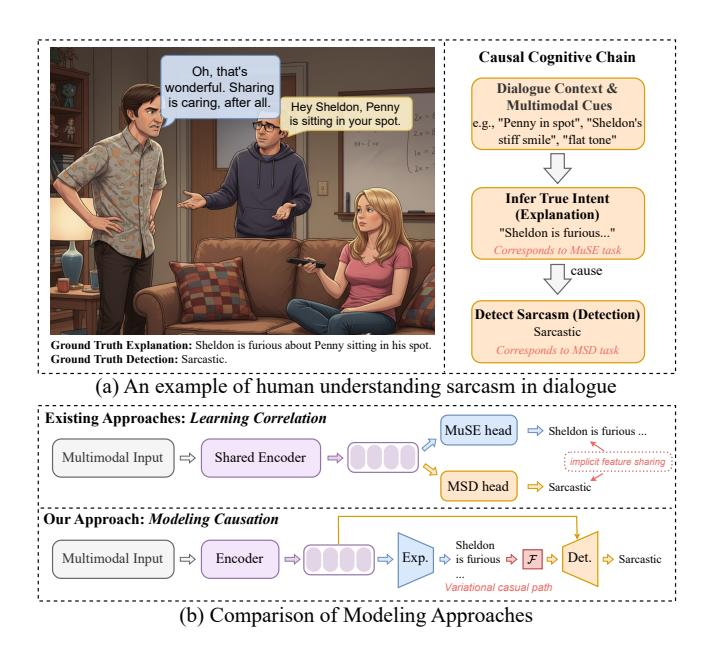
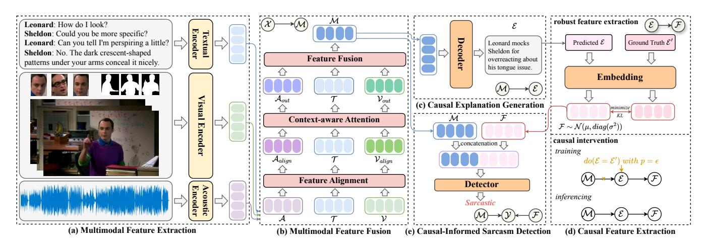
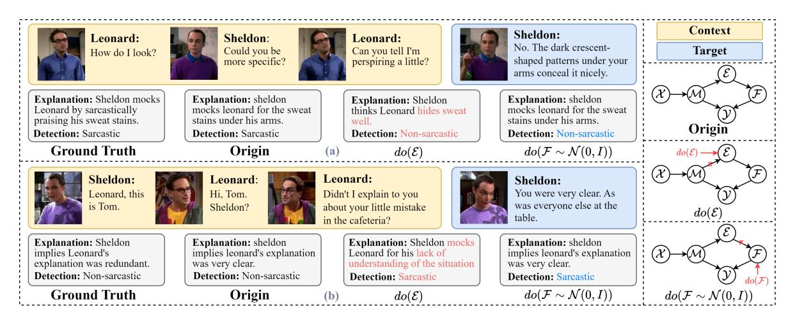
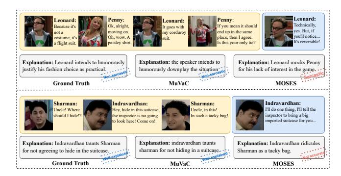
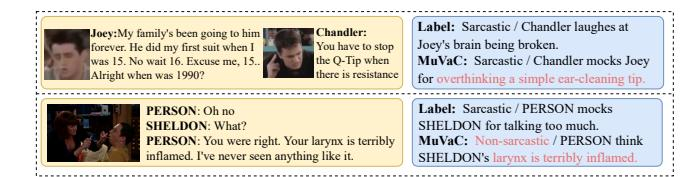
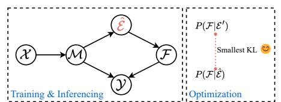

# MuVaC: A Variational Causal Framework for Multimodal Sarcasm Understanding in Dialogues

| Diandian Guo              |          |                           |
|---------------------------|----------|---------------------------|
| Institute of Information  |          |                           |
| Engineering, Chinese      |          |                           |
| Academy of Sciences       |          |                           |
| School of Cyber Security, |          |                           |
| University of Chinese     |          |                           |
| Academy of Sciences       |          |                           |
| Beijing, China            |          |                           |
| guo diandian@iie.ac.cn    |          |                           |
| Fangfang Yuan             |          |                           |
| Institute of Information  |          |                           |
| Engineering, Chinese      |          |                           |
| Academy of Sciences       |          |                           |
| School of Cyber Security, |          |                           |
| University of Chinese     |          |                           |
| Academy of Sciences       |          |                           |
| Beijing, China            |          |                           |
|                           | Cong     | Cao ∗                     |
| Institute                 | of       | Information               |
| Engineering,              |          | Chinese                   |
| Academy                   |          | of Sciences               |
| School                    | of Cyber | Security,                 |
| University                |          | of Chinese                |
| Academy                   |          | of Sciences               |
|                           | Beijing, | China                     |
|                           |          | Xixun Lin                 |
|                           |          | Institute of Information  |
|                           |          | Engineering, Chinese      |
|                           |          | Academy of Sciences       |
|                           |          | Beijing, China            |
| Chuan Zhou                |          |                           |
| Academy of Mathematics    |          |                           |
| and Systems Science,      |          |                           |
| Chinese Academy of        |          |                           |
| School of Cyber Security, |          |                           |
| University of Chinese     |          |                           |
| Academy of Sciences       |          |                           |
| Beijing, China            |          |                           |
| Hao Peng                  |          |                           |
| Beihang University        |          |                           |
| Beijing, China            |          |                           |
|                           | Yanan    | Cao                       |
| Institute                 | of       | Information               |
| Engineering,              |          | Chinese                   |
| Academy                   |          | of Sciences               |
| School                    | of Cyber | Security,                 |
| University                |          | of Chinese                |
| Academy                   |          | of Sciences               |
|                           | Beijing, | China                     |
|                           |          | Yanbing Liu               |
|                           |          | Institute of Information  |
|                           |          | Engineering, Chinese      |
|                           |          | Academy of Sciences       |
|                           |          | School of Cyber Security, |
|                           |          | University of Chinese     |
|                           |          | Academy of Sciences       |
|                           |          | Beijing, China            |

## Abstract

The prevalence of sarcasm in multimodal dialogues on the social platforms presents a crucial yet challenging task for understanding the true intent behind online content. Comprehensive sarcasm analysis requires two key aspects: Multimodal Sarcasm Detection (MSD) and Multimodal Sarcasm Explanation (MuSE). Intuitively, the act of detection is the result of the reasoning process that explains the sarcasm. Current research predominantly focuses on addressing either MSD or MuSE as a single task. Even though some recent work has attempted to integrate these tasks, their inherent causal dependency is often overlooked. To bridge this gap, we propose MuVaC, a variational causal inference framework that mimics human cognitive mechanisms for understanding sarcasm, enabling robust multimodal feature learning to jointly optimize MSD and MuSE. Specifically, we first model MSD and MuSE from the perspective of structural causal models, establishing variational causal pathways to define the objectives for joint optimization. Next, we design an alignment-then-fusion approach to integrate multimodal features, providing robust fusion representations for sarcasm detection and explanation generation. Finally, we enhance the reasoning trustworthiness by ensuring consistency between detection results

∗Corresponding author.

[This work is licensed under a Creative Commons Attribution 4.0 International License.](https://creativecommons.org/licenses/by/4.0)

WWW '26, Dubai, United Arab Emirates. © 2026 Copyright held by the owner/author(s). ACM ISBN 979-8-4007-2307-0/2026/04 <https://doi.org/10.1145/3774904.3792491>

and explanations. Experimental results demonstrate the superiority of MuVaC in public datasets, offering a new perspective for understanding multimodal sarcasm.

## CCS Concepts

• Information systems → Multimedia information systems.

## Keywords

sarcasm understanding; variational inference; social media analysis

### ACM Reference Format:

Diandian Guo, Fangfang Yuan, Cong Cao, Xixun Lin, Chuan Zhou, Hao Peng, Yanan Cao, and Yanbing Liu. 2026. MuVaC: A Variational Causal Framework for Multimodal Sarcasm Understanding in Dialogues. In Proceedings of the ACM Web Conference 2026 (WWW '26), April 13–17, 2026, Dubai, United Arab Emirates. ACM, New York, NY, USA, [12](#page-11-0) pages. [https://doi.org/10.1145/](https://doi.org/10.1145/3774904.3792491) [3774904.3792491](https://doi.org/10.1145/3774904.3792491)

## 1 Introduction

Modern social media has transformed the internet into a vast conversational space [\[19\]](#page-8-0). Public discourse and personal interactions now unfold through dynamic, multimodal dialogues. Within these conversational threads, sarcasm is a pervasive and complex phenomenon. On video-based social platforms like YouTube and Tik-Tok, sarcastic intent is no longer confined to static images or text. Instead, it is dynamically constructed through a complex interplay of dialogue history, vocal tone, facial expressions, and the shared context of a video. Accurately understanding this nuanced, context-sensitive sarcasm is therefore critical for enhancing web applications, such as sentiment analysis [\[11,](#page-8-1) [29\]](#page-8-2), public opinion mining [\[3\]](#page-8-3) and the development of sophisticated web agents.

Figure 1: An illustration of the causal chain in human sarcasm understanding, contrasted with different paradigms.

Early research focuses primarily on identifying sarcasm in text and establishes a basic detection framework through lexical feature analysis and semantic pattern mining [\[7,](#page-8-4) [45\]](#page-8-5). With the growth of multimodal content, sarcasm detection in dialogue requires a comprehensive analysis of multimodal factors such as textual content, gestures, and vocal tones, presenting significant technical challenges. This evolution has solidified two core research pillars for a comprehensive understanding of online sarcasm: Multimodal Sarcasm Detection (MSD), which aims to identify whether an utterance is sarcastic [\[4,](#page-8-6) [31,](#page-8-7) [40\]](#page-8-8), and Multimodal Sarcasm Explanation (MuSE) [\[9,](#page-8-9) [20,](#page-8-10) [21\]](#page-8-11), which seeks to generate natural language to articulate the sarcastic intent. While some studies [\[6,](#page-8-12) [37\]](#page-8-13) attempt to unify these tasks via multi-task learning, they typically treat MSD and MuSE as parallel objectives with only implicit feature sharing.

However, these approaches overlook a fundamental insight: the relationship between sarcasm explanation and detection is not merely correlational but deeply causal [\[25\]](#page-8-14). From a cognitive science perspective [\[13\]](#page-8-15), human sarcasm comprehension follows a distinct causal cognitive chain. As shown in Figure [1\(](#page-1-0)a), we first integrate the conflicting cues to infer the speaker's true, non-literal intent (the explanation). It is only after identifying a sharp incongruity between this inferred intent and the literal meaning of the utterance that we subsequently identify it as sarcasm (the detection). In essence, identifying that a statement is sarcastic (MSD) is the result of understanding why it is sarcastic (MuSE). However, this crucial cognitive process remains underexplored in existing methods. As depicted in Figure [1\(](#page-1-0)b), current approaches learn to associate surface-level cues with a sarcasm label, but they lack the underlying reasoning of why those cues lead to a sarcastic interpretation. This reliance on "what is associated" rather than "what causes what" often leads to a lack of robustness and poor generalization on diverse web content. Therefore, to build more intelligent

and reliable systems, there is a clear need to shift the paradigm from correlation-based learning to explicitly causal modeling.

To address these challenges, we are inspired by the cognitive mechanism of human understanding of sarcasm and propose a Multimodal sarcasm understanding framework based on Variational Causal inference (MuVaC). Our core idea is to emulate the human cognitive process by establishing a causal pathway from explanation to detection. However, due to the unavailability of ground truth explanations during inference, modeling a direct causal path between MuSE and MSD would introduce biases, which contradicts our objectives. Therefore, we reformulate the structural causal model (SCM) into a deep variational inference framework with latent variables by incorporating hidden features to enable joint optimization, while ensuring causal relevance and consistency between detection and explanation. To achieve controllable sarcasm explanations, we introduce probabilistic causal intervention during training to guide the generation of accurate explanations. To foster robust feature representation for causal inference, we emphasize expressions and postures as crucial supplementary features during feature extraction. For multimodal fusion, we propose an alignmentthen-fusion approach to integrate multimodal features, providing a robust fused representation for causal inference.

Our contributions are as follows:

• To the best of our knowledge, we are the first to formulate multimodal sarcasm understanding as a variational causal inference problem. This paradigm shifts the objective from learning task correlations to modeling the cognitive causal chain, better aligning computational models with human reasoning.

• We propose MuVaC, an end-to-end framework that jointly optimizes MSD and MuSE through a unified causal architecture. MuVaC introduces a novel align-then-fusion module to learn robust multimodal representations for effective causal inference.

• Experiments demonstrate that MuVaC not only achieves SOTA on both MSD and MuSE tasks, but also offers a new, causallygrounded perspective for multimodal sarcasm understanding. Mu-VaC achieves a significant F1-score improvement of nearly 10% on the MUSTARD++ dataset and surpasses all strong baselines.

## 2 Related Work

Multimodal Sarcasm Detection. Multimodal sarcasm detection refers to the process of identifying implicit sarcasm by analyzing multimodal contexts. Castro et al. [\[4\]](#page-8-6) developed the first multimodal conversational sarcasm detection benchmark dataset MUStARD. MO-Sarcation [\[40\]](#page-8-8) verified the significant effect of the modal fusion order on the MSD task. VyAnG-Net [\[31\]](#page-8-7) extracted cross-modal discriminative features with adaptive ConvNets. MV-BART [\[52\]](#page-9-0) dynamically adjusted the weights of multigranularity cues for different sarcastic scenarios. Recent studies explored multitask learning frameworks to jointly optimize sarcasm detection with sentiment analysis [\[2,](#page-8-16) [5\]](#page-8-17) and humor recognition [\[15\]](#page-8-18), offering insights for improving semantic understanding. However, existing methods rely on simple combinations that overlook cross-task semantic correlations. We address this by causally integrating MSD and MuSE, improving both credibility and interpretability.

Multimodal Sarcasm Explanation. Multimodal sarcasm explanation, as a derivative task of MSD, was first systematically defined

Figure 2: The overall architecture of MuVaC comprises five key steps: (a) Multimodal Feature Extraction, (b) Multimodal Feature Fusion, (c) Causal Explanation Generation, (d) Causal Feature Extraction, and (e) Causal-Informed Sarcasm Detection.

Figure 3: Structural causal models for MSD and MuSE.

by Desai et al. [\[9\]](#page-8-9). Kumar et al. [\[20\]](#page-8-10) explored sarcasm analysis in dialogue scenarios and constructed the WITS dataset. In addition, they proposed MAF, using a new attention-based modal fusion mechanism as a solid baseline. TEAM [\[17\]](#page-8-19) incorporated external common sense to enhance the generation of sarcasm explanations. SIRG [\[37\]](#page-8-13) introduced an innovative multimodal shared fusion method that seamlessly integrates cross-modal features through cross-attention mechanisms. Although our approach aligns with the main MuSE paradigms, it uniquely integrates sarcasm explanation as a core component of the causal model to enhance sarcasm detection.

Causal Inference. Causal inference aims to explore the causal relationship between the observed variables rather than the superficial correlation by constructing SCMs [\[26\]](#page-8-20). Leveraging its capabilities in counterfactual reasoning and unbiased estimation, causal inference has been increasingly applied to various tasks such as computer vision [\[48\]](#page-9-1) and natural language processing [\[41,](#page-8-21) [44\]](#page-8-22). Recently, causal inference has also been introduced into multimodal tasks. Agarwal et al. [\[1\]](#page-8-23) propose automatic semantic image manipulation to alleviate spurious correlations during learning. Sun et al. [\[38\]](#page-8-24) reveal harmful associations of text semantics in multimodal sentiment analysis through counterfactual manipulation. Yang et al. [\[49\]](#page-9-2) propose a causal attention mechanism to reduce the confusion bias that misleads the attention module. Different from existing works that focus on removing biased dependencies, we propose to reconstruct the neglected causal correlations between MuSE and MSD by transforming the SCM into deep variational inference.

### 3 Methodology

The overall architecture of MuVaC is shown in Figure [2.](#page-2-0) This section is organized as follows. We first formally define the joint task in Section [3.1.](#page-2-1) Following this, we introduce the theoretical foundation of our work: the variational causal framework in Section [3.2.](#page-2-2) We then proceed to detail the implementation of each component of the MuVaC architecture Section [3.3](#page-3-0)[-3.8,](#page-4-0) from multimodal feature processing to the final causal-informed detection.

## 3.1 Task Definition

The standard MSD task aims to detect whether an input X = (T, V, A) contains sarcasm and outputs Y ∈ {0, 1}. Here, T, V, and A denote the text, visual, and audio modalities, respectively. Given an input X, the traditional MuSE task is to generate an explanation E������ to explain why X embodies sarcastic information. The task we aim to undertake involves not only producing a sarcasm detection result Y for X but also providing the corresponding explanation E. This can be formalized as learning a model �� : (T, V, A) → (Y, E).

## 3.2 Variational Causal View for MuSE and MSD

We study this problem from the perspective of SCM. To establish and maintain consistency between explanation E and prediction Y, a basic causal framework is illustrated in Figure [3\(](#page-2-3)a). The optimization objective is �� (E = E ′ , Y = Y′ |M), where E ′ and Y′ denote the ground-truth sarcasm explanation and label, respectively. M is the multimodal feature. During training, we can directly optimize the joint probability distribution using ground-truth explanations E ′ : �� (E′ , Y = Y′ |M) = �� (E′ |M)�� (Y = Y′ |M, E ′ ). However, during inference, the basic model faces two critical challenges: (1) It cannot access the ground truth explanation E ′ ; and (2) optimizing �� (Y = Y′ |M, E = E ′ ) becomes infeasible, as it is empirically difficult to generate an explanation that is entirely consistent with E ′ Therefore, in this model, we can only use the explanation Eˆ with the highest generative probability to approximate �� (Y = Y′ |M, E)ˆ during inference, where Eˆ = arg max �� (E |M).

Table 1: Main Results on MUStARD dataset. \* indicates our reproduced results. The p-value of the significance test between BOLD result of MuVaC and the corresponding result of VyAnG-Net is less than 0.01.

| Modality | Method               | Acc.(%)    | Speaker Pre.(%) | Dependent Rec.(%) | F1(%)      | Acc.(%)    | Speaker Pre.(%) | Independent Rec.(%) | F1(%) |
|----------|----------------------|------------|-----------------|-------------------|------------|------------|-----------------|---------------------|-------|
|          | BERT (2019)          | 64.3       | 65.6            | 64.3              | 64.7       | 58.0       | 58.2            | 56.7                | 57.4  |
| T        | SMSD (2019b)         |            | 61.6            | 61.0              | 61.1       |            | 51.7            | 48.2                | 47.0  |
|          | MIARN (2018)         |            | 64.7            | 64.0              | 63.9       |            | 60.4            | 55.2                | 54.0  |
| T+V      | FiLM (2021)          | 67.0       | 67.3            | 66.2              | 66.7       | 60.6       | 60.8            | 59.4                | 60.1  |
|          | SVM (2019)           |            | 72.6            | 71.6              | 71.6       |            | 64.3            | 62.6                | 62.8  |
|          | A-MTL (2020)         |            | 73.4            | 72.8              | 72.6       |            | 69.5            | 66.0                | 65.9  |
|          | QPM (2021)           | 77.5       | 77.5            | 77.6              | 77.5       | 66.2       |                 |                     | 66.1  |
|          | IWAN (2021)          |            | 75.2            | 75.2              | 75.1       |            | 71.9            | 71.3                | 70.0  |
| T+V+A    | HKT (2022)           | 73.6       | 73.6            | 73.6              | 73.6       | 61.6       | 63.9            | 61.6                | 61.7  |
|          | MO-Sarcation* (2023) | 79.7       | 79.7            | 79.7              | 79.7       | 71.3       | 65.1            | 71.1                | 67.9  |
|          | VyAnG-Net (2024)     | 79.9       | 78.8            | 78.2              | 78.5       | 76.9       | 75.7            | 75.5                | 75.6  |
|          | CESDN (2024)         | 75.5       | 76.2            | 74.2              | 75.2       | 71.3       | 71.9            | 69.9                | 70.9  |
|          | MV-BART (2024)       |            | 80.6            | 82.8              | 81.7       |            |                 |                     |       |
|          | CCG-Net (2025)       |            | 79.1            | 79.1              | 79.0       |            |                 |                     |       |
|          | MuVaC (ours)         | 86.9 ↑ 7 0 | 86.8 ↑ 6 2      | 89.2 ↑ 6 4        | 88.0 ↑ 6 3 | 77.4 ↑ 0 5 |                 |                     |       |
|          |                      |            |                 |                   |            |            | 70.8            | 79.0 ↑ 3 5          |       |

MIARN [\[39\]](#page-8-32). (2) Multimodal methods: FiLM [\[14\]](#page-8-33), SVM [\[4\]](#page-8-6), A-MTL [\[5\]](#page-8-17), QPM [\[28\]](#page-8-34), IWAN [\[43\]](#page-8-35), HKT [\[15\]](#page-8-18), MO-Sarcation [\[40\]](#page-8-8), VyAnG-Net [\[31\]](#page-8-7), CESDN [\[23\]](#page-8-36), MV-BART [\[52\]](#page-9-0), CCG-Net [\[51\]](#page-9-3), Collaborative Gating [\[34\]](#page-8-29), AttFusion [\[12\]](#page-8-37), MEF [\[36\]](#page-8-38), and ViFi-CLIP [\[2\]](#page-8-16).

Baslines for MuSE. We compare the following sequence-tosequence methods: RNN [\[35\]](#page-8-39), mBART [\[27\]](#page-8-40), BART [\[22\]](#page-8-25), MAF [\[20\]](#page-8-10), MOSES [\[21\]](#page-8-11), EDGE [\[30\]](#page-8-41) and CCG-Net [\[51\]](#page-9-3).

Metrics. For the MSD task, we use accuracy, weighted-precision, weighted-recall, and weighted-F1 as evaluation indicators [\[40\]](#page-8-8). For the MuSE task, we use the common metrics ROUGE-1/2/L [\[24\]](#page-8-42), BLEU-1/2/3/4 [\[32\]](#page-8-43), METEOR [\[8\]](#page-8-44) and BERTscore [\[50\]](#page-9-4).

Implementation details. We use BART[1](#page-5-0) , CLIP[2](#page-5-1) , and CLAP[3](#page-5-2) as encoders for the textual, visual, and auditory modalities respectively. We set the feature dimension �� = 768. ATF module is inserted at the 6-th layer of the BART encoder, with the causal intervention probability �� set to 0.1. We employ the Adam optimizer. All experiments are conducted 5 times using a single RTX 4090 (24GB).

## 4.2 Main Results

MSD Performance. Tables [1](#page-5-3) and [2](#page-5-4) present experimental results on MUStARD and MUStARD++ datasets. These results demonstrate the effectiveness of our proposed MuVaC from two perspectives: (1) MuVaC significantly outperforms strong baselines in speaker-dependent settings. Compared with MV-BART, it achieves improvements exceeding 6% across all metrics. Besides, MuVaC demonstrates even stronger performance on MUStARD++, with an approximately 10% F1 improvement compared to baselines. This highlights that MuVaC effectively leverages causal dependencies in explanations to predict more accurate answers, confirming the critical role of explanation information. (2) MuVaC has competitive but partially suboptimal performance in speaker-independent settings. MuVaC outperforms VyAnG-Net in accuracy and recall

Table 2: Main results on MUStARD++ dataset.

| Method               | Pre.(%) | Rec.(%) | F1(%) |
|----------------------|---------|---------|-------|
| SVM                  | 66.2    | 66.3    | 66.2  |
| Collaborative Gating | 69.8    | 69.5    | 69.5  |
| AttFusion            | 74.3    | 74.3    | 74.3  |
| VyAnG-Net            | 72.4    | 72.1    | 72.2  |
| MEF                  | 74.7    | 76.1    | 74.5  |
| Gaze                 | 73.2    | 73.2    | 73.3  |
| ViFi-CLIP            | 73.5    | 72.8    | 73.1  |
| MuVaC                | 81.2    | 85.3    | 83.2  |

but slightly lags in precision and F1. The result aligns with expectations: when tested on unseen speakers (e.g., "Chandler mocks Moderator" without prior exposure to either "Chandler" or "Moderator"), generative models fail to produce accurate explanations. This indirectly degrades prediction quality. Despite this, MuVaC achieves higher recall and accuracy than all baselines, indicating its strong sensitivity to sarcastic dialogues.

MuSE Performance. Table [3](#page-6-0) presents the results for sarcasm explanation generation on the WITS dataset. The findings show that MuVaC surpasses all baseline models on most evaluation metrics, including a ROUGE-1 score of 44.7 and a BLEU-1 score of 41.1. Furthermore, MuVaC performs comparably with EDGE on semantic similarity metrics like METEOR and BERTscore (39.4 vs 39.9 and 79.3 vs 80.2, respectively). This demonstrates that our causal modeling and ATF fusion mechanism can effectively integrate multimodal information, generating more well-structured explanations.

Multi-task Performance. To further demonstrate MuVaC's multi-task superiority, we conduct comparative experiments on the annotated MUStARD dataset, with results shown in Table [4.](#page-6-1) All single-task baselines implement multi-task learning by sharing features from the last layer. The experiments reveal: (1) MuVaC achieves comprehensive superiority on both MSD and MuSE tasks;

1<https://huggingface.co/facebook/bart-base>

2<https://huggingface.co/openai/clip-vit-base-patch32>

3<https://huggingface.co/laion/clap-htsat-unfused>

Figure 4: Causal results of manually intervening E and F.

Table 3: Main results on WITS dataset. (R1/2/L, B1/2/3/4, M and BS are the abbreviations of ROUGE-1/2/L, BLEU-1/2/3/4, METEOR, and BERTscore, respectively.)

| Model   | R1   | R2   | RL   | B1   | B2   | B3   | B4   | M    | BS   |
|---------|------|------|------|------|------|------|------|------|------|
| RNN     | 29.2 | 7.9  | 27.6 | 22.1 | 8.2  | 4.8  | 2.9  | 18.5 | 73.2 |
| mBART   | 33.7 | 11.0 | 31.5 | 22.9 | 10.6 | 6.1  | 3.4  | 21.0 | 76.0 |
| BART    | 36.9 | 11.9 | 33.5 | 27.4 | 12.2 | 6.0  | 2.9  | 26.9 | 73.8 |
| MAF     | 39.7 | 17.1 | 37.4 | 33.2 | 18.7 | 12.4 | 8.6  | 30.4 | 77.7 |
| MOSES   | 42.2 | 20.4 | 39.7 | 34.9 | 21.5 | 15.5 | 11.5 | 32.4 | 77.8 |
| EDGE    | 44.4 | 21.8 | 42.4 | 37.6 | 23.2 | 16.6 | 12.9 | 39.9 | 80.2 |
| CCG-Net | 42.8 | 21.7 | 39.7 | 35.1 | 22.6 | 16.2 | 11.3 | 33.5 | 77.3 |
| MuVaC   | 44.7 | 22.1 | 42.4 | 41.1 | 26.1 | 17.9 | 13.2 | 39.4 | 79.3 |

(2) although CCG-Net maintains balanced performance across tasks, its conventional framework with implicit feature sharing exhibits performance bottlenecks; (3) the MSD method MO-Sarcation shows significant performance degradation on MuSE, exposing cross-task transfer limitations in single-task optimization. These findings suggest that MuVaC improves the performance of two tasks simultaneously by explicitly modeling the causal relationship.

Based on evaluation metrics for all tasks, we confidently conclude that MuVaC serves as the current SOTA solution for sarcasm detection and explanation. Its success stems from the integration of variational causal inference with explanation-aware modeling, effectively bridging the gap between detection and explanation.

## 4.3 Ablation Study

To validate the effectiveness of each module in MuVaC, we design two sets of ablation experiments, targeting variational causal modeling and multimodal feature utilization components, respectively. The results are shown in Table [5.](#page-7-0)

Variational Causal Modeling. We design four variant models that remove key components: w/o E (removing explanation generator, using direct M → Y path), only E (solely using M → E → F → Y path), w/o L������ (removing explanation loss), and w/o L������ (removing classification loss). Based on the results, we have the

Table 4: Multi-task results on MUStARD dataset in speaker dependent setting.

| Method       | Pre. | MSD Rec. | F1   | R1   | MuSE B1 | M    |
|--------------|------|----------|------|------|---------|------|
| BART         | 70.0 | 75.7     | 72.7 | 27.3 | 20.7    | 22.1 |
| MO-Sarcation | 79.7 | 79.7     | 79.7 | 22.8 | 20.1    | 17.0 |
| MOSES        | 73.1 | 81.0     | 76.9 | 35.6 | 29.6    | 28.2 |
| MAF          | 77.7 | 75.6     | 76.7 | 36.3 | 30.1    | 30.4 |
| CCG-Net      | 79.1 | 79.1     | 79.0 | 36.6 | 31.5    | 30.6 |
| MuVaC        | 86.8 | 89.2     | 88.0 | 38.4 | 32.4    | 32.7 |

following findings: (1) Simply relying on the explaination feature F or the multimodal feature M shows suboptimal performance, indicating that sarcastic explanations can enhance detection capabilities but require joint optimization with original multimodal features. This verifies that jointly modeling MuSE and MSD using a variational causal inference framework outperforms existing methods that employ separate task-specific heads for different tasks. (2) Removing task-specific losses severely degrades corresponding performance, confirming L������ and L������ 's effectiveness for detection and explanation generation.

Multimodal Feature Utilization. We design five variants for comparison. w/o F&P means discarding expression and posture features, w/o ATF denotes direct concatenation of multimodal feature, and w/ MOSES means using multimodal fusion module in MOSES [\[21\]](#page-8-11). The results show that: (1) w/o F&P leads to a 5.3% drop in F1-score on MUStARD, which validates the critical importance of these auxiliary non-verbal cues for capturing sarcastic signals. (2) The incremental performance gains observed with the step-by-step addition of +Align and +Context effectively demonstrate that each component of the ATF module is necessary for achieving robust multimodal feature fusion (3) The ATF module can learn more robust features than other existing feature fusion modules like MOSES. The results verify that MuVaC's multimodal feature extraction and fusion modules can effectively support causal modeling with better results.

Figure 5: Case study on MUStARD and WITS datasets.

Table 5: Ablation study of components (%).

Table 6: Analysis of causal effects (%).

### 4.4 Analysis of causal effects

To investigate whether MuVaC learns the intended causal relationships, we analyze causal effects via manual causal interventions and conduct quantitative/qualitative evaluations.

Quantitative Analysis. We quantify causal effects by intervening on E and F during inferencing, and the results are shown in Table [6.](#page-7-1) ���� (E) means using ground truth explanations E ′ instead of generated ones, blocking the M → E path; ���� (F ) replaces F with random Gaussian noise F ′ ∼ N (0, 1), blocking the E → F path. The results show that when using ground truth E ′ directly, the indicators of the sarcasm detection approach nearly 100%. This demonstrates that MuVaC effectively models the causal relationship between MuSE and MSD, yielding consistent results. In contrast, when intervening on F, the performance becomes even worse than when no explanations are used at all, as shown in Table [5.](#page-7-0) In this case, the explanation and detection result are predicted independently, leading to inconsistent outcomes.

Qualitative Analysis. We qualitatively analyze causal effects by observing the outcomes after manual intervention while keeping the input unchanged. As shown in Figure [4\(](#page-6-2)a), MuVaC's original detection result and generated explanation highlight Sheldon's sarcastic response to Leonard. When we manually replace the explanation with non-sarcastic content, the corresponding detection result changes to non-sarcastic, demonstrating the causal dependency of Y on E. As depicted in Figure [4\(](#page-6-2)b), when the explanation remains unchanged, replacing F with Gaussian noise leads to a non-sarcastic detection result. In this case, MuVaC cannot exploit the explanation information, resulting in independence between the explanation and the detection result.

Based on the above analysis, MuVaC establishes a reliable variational causal inference mechanism that ensures consistency between the model's explanation and detection result.

### 4.5 Case Study

To further verify the superiority of MuVaC, we design a case study on the MUStARD and WITS datasets. Since the WITS dataset is in Hindi, we provide its English translated version for consistent comparison, which is detailed in the Supplementary Materials. Case 1 in Figure [5](#page-7-2) shows the explanation information generated by MuVaC and other sarcastic explanation model MOSES on a non-sarcastic sample in MUStARD. Only MuVaC correctly outputs the original meaning of the conversation, while MOSES believes that the conversation contains implicit sarcasm. This indicates that existing MuSE baselines struggle to grasp the true intentions of speakers in normal conversations. Case 2 presents a comparison of the explanations of sarcastic samples from the WITS dataset, where MuVaC outperforms the baselines in quality and is more helpful in reflecting sarcastic facts. Therefore, MuVaC surpasses baselines in both correctness and quality.

### 5 Conclusion

In this paper, we introduce MuVaC, an innovative method that leverages variational causal inference to jointly integrate the MSD and MuSE tasks. This approach aims to simulate the human cognitive process of understanding sarcasm by explicitly modeling the causal relationship between sarcasm detection and explanation. To capture comprehensive sarcastic features, we not only incorporate multimodal cues often overlooked by existing models but also propose the ATF module for modality fusion. Experimental results demonstrate that MuVaC achieves state-of-the-art performance on both MSD and MuSE tasks, validating the causal relationship between tasks and offering a new perspective on multimodal sarcasm understanding.

## Acknowledgments

This research is supported by the National Key R&D Program of China (No. 2023YFC3303800). Xixun Lin is supported by the National Natural Science Foundation of China (No. 62402491) and the China Postdoctoral Science Foundation (No. 2025M771524). Chuan Zhou is supported by the NSFC (No. 62472416). Hao Peng is supported by the NSFC through grants U25B2029 and 62322202.

### References

- [1] Vedika Agarwal, Rakshith Shetty, and Mario Fritz. 2020. Towards causal vqa: Revealing and reducing spurious correlations by invariant and covariant semantic editing. In Proceedings of the IEEE/CVF Conference on Computer Vision and Pattern Recognition. 9690–9698. [2] Swapnil Bhosale, Abhra Chaudhuri, Alex Lee Robert Williams, Divyank Tiwari, Anjan Dutta, Xiatian Zhu, Pushpak Bhattacharyya, and Diptesh Kanojia. 2023. Sarcasm in Sight and Sound: Benchmarking and Expansion to Improve Multimodal Sarcasm Detection. arXiv preprint arXiv:2310.01430 (2023). [3] Yitao Cai, Huiyu Cai, and Xiaojun Wan. 2019. Multi-modal sarcasm detection in twitter with hierarchical fusion model. In Proceedings of the ACL. 2506–2515. [4] Santiago Castro, Devamanyu Hazarika, Verónica Pérez-Rosas, Roger Zimmermann, Rada Mihalcea, and Soujanya Poria. 2019. Towards Multimodal Sarcasm Detection (An \_Obviously\_ Perfect Paper). In Proceedings of the 57th Annual Meeting of the Association for Computational Linguistics. 4619–4629. [5] Dushyant Singh Chauhan, Dhanush S R, Asif Ekbal, and Pushpak Bhattacharyya. 2020. Sentiment and Emotion help Sarcasm? A Multi-task Learning Framework for Multi-Modal Sarcasm, Sentiment and Emotion Analysis. In Proceedings of the 58th Annual Meeting of the Association for Computational Linguistics. 4351–4360. [6] Zixin Chen, Hongzhan Lin, Ziyang Luo, Mingfei Cheng, Jing Ma, and Guang Chen. 2024. CofiPara: A coarse-to-fine paradigm for multimodal sarcasm target identification with large multimodal models. In Proceedings of the 62nd Annual Meeting of the Association for Computational Linguistics. 9663–9687. [7] Dmitry Davidov, Oren Tsur, and Ari Rappoport. 2010. Semi-supervised recognition of sarcasm in Twitter and Amazon. In Proceedings of the CoNLL. 107–116. [8] Michael Denkowski and Alon Lavie. 2014. Meteor Universal: Language Specific Translation Evaluation for Any Target Language. In Proceedings of the Ninth Workshop on Statistical Machine Translation. [9] Poorav Desai, Tanmoy Chakraborty, and Md Shad Akhtar. 2022. Nice perfume. how long did you marinate in it? multimodal sarcasm explanation. In Proceedings of the AAAI Conference on Artificial Intelligence, Vol. 36. 10563–10571. [10] Jacob Devlin, Ming-Wei Chang, Kenton Lee, and Kristina Toutanova. 2019. Bert: Pre-training of deep bidirectional transformers for language understanding. In Proceedings of the 2019 conference of the North American chapter of the association for computational linguistics: human language technologies. 4171–4186. [11] DI Hernández Farias and Paolo Rosso. 2017. Irony, sarcasm, and sentiment analysis. In Sentiment Analysis in Social Networks. Elsevier, 113–128. [12] Xiyuan Gao, Shekhar Nayak, and Matt Coler. 2024. Improving sarcasm detection from speech and text through attention-based fusion exploiting the interplay of emotions and sentiments. In Proceedings of Meetings on Acoustics, Vol. 54. Acoustical Society of America, 060002. [13] Raymond W Gibbs and Herbert L Colston. 2007. Irony in language and thought: A cognitive science reader. Psychology Press. [14] Sundesh Gupta, Aditya Shah, Miten Shah, Laribok Syiemlieh, and Chandresh Maurya. 2021. FiLMing Multimodal Sarcasm Detection with Attention. In Neural Information Processing. Springer International Publishing, Cham, 178–186. [15] Md Kamrul Hasan, Sangwu Lee, Wasifur Rahman, Amir Zadeh, Rada Mihalcea, Louis-Philippe Morency, and Ehsan Hoque. 2022. Humor Knowledge Enriched Transformer for Understanding Multimodal Humor. Proceedings of the AAAI Conference on Artificial Intelligence (Sep 2022), 12972–12980. [16] Jack Hessel, Ana Marasović, Jena D. Hwang, Lillian Lee, Jeff Da, Rowan Zellers, Robert Mankoff, and Yejin Choi. 2023. Do Androids Laugh at Electric Sheep? Humor "Understanding" Benchmarks from The New Yorker Caption Contest. arXiv preprint arXiv:2209.06293 (2023). [17] Liqiang Jing, Xuemeng Song, Kun Ouyang, Mengzhao Jia, and Liqiang Nie. 2023. Multi-source Semantic Graph-based Multimodal Sarcasm Explanation Generation. In Proceedings of the 61st Annual Meeting of the Association for Computational Linguistics (Volume 1: Long Papers). 11349–11361. [18] Glenn Jocher, Ayush Chaurasia, and Jing Qiu. 2023. YOLO by Ultralytics. [https:](https://github.com/ultralytics/ultralytics) [//github.com/ultralytics/ultralytics](https://github.com/ultralytics/ultralytics) [19] Danica Jovanovic and Theo Van Leeuwen. 2018. Multimodal dialogue on social media. Social Semiotics 28, 5 (2018), 683–699. [20] Shivani Kumar, Atharva Kulkarni, Md Shad Akhtar, and Tanmoy Chakraborty. 2022. When did you become so smart, oh wise one?! sarcasm explanation in multi-modal multi-party dialogues. arXiv preprint arXiv:2203.06419 (2022). [21] Shivani Kumar, Ishani Mondal, Md Shad Akhtar, and Tanmoy Chakraborty. 2023. Explaining (sarcastic) utterances to enhance affect understanding in multimodal dialogues. In Proceedings of the AAAI Conference on Artificial Intelligence, Vol. 37. 12986–12994. [22] Mike Lewis, Yinhan Liu, Naman Goyal, Marjan Ghazvininejad, Abdelrahman Mohamed, Omer Levy, Ves Stoyanov, and Luke Zettlemoyer. 2019. Bart: Denoising sequence-to-sequence pre-training for natural language generation, translation, and comprehension. arXiv preprint arXiv:1910.13461 (2019). [23] Yangyang Li, Yuelin Li, Shihuai Zhang, Guangyuan Liu, Yanqiao Chen, Ronghua Shang, and Licheng Jiao. 2024. An attention-based, context-aware multimodal fusion method for sarcasm detection using inter-modality inconsistency. Knowledge-Based Systems 287 (2024), 111457. [24] Chin-Yew Lin. 2004. ROUGE: A Package for Automatic Evaluation of Summaries. Meeting of the Association for Computational Linguistics,Meeting of the Association for Computational Linguistics (Jul 2004). [25] Xixun Lin, Yucheng Ning, Jingwen Zhang, Yan Dong, Yilong Liu, Yongxuan Wu, Xiaohua Qi, Nan Sun, Yanmin Shang, Kun Wang, et al. 2025. LLM-based Agents Suffer from Hallucinations: A Survey of Taxonomy, Methods, and Directions. arXiv preprint arXiv:2509.18970 (2025). [26] Xixun Lin, Qing Yu, Yanan Cao, Lixin Zou, Chuan Zhou, Jia Wu, Chenliang Li, Peng Zhang, and Shirui Pan. 2025. Generative Causality-driven Network for Graph Multi-task Learning. IEEE transactions on pattern analysis and machine intelligence (2025). [27] Y Liu. 2020. Multilingual denoising pre-training for neural machine translation. arXiv preprint arXiv:2001.08210 (2020). [28] Yaochen Liu, Yazhou Zhang, Qiuchi Li, Benyou Wang, and Dawei Song. 2021. What Does Your Smile Mean? Jointly Detecting Multi-Modal Sarcasm and Sentiment Using Quantum Probability. In Findings of the Association for Computational Linguistics: EMNLP 2021. [29] Diana G Maynard and Mark A Greenwood. 2014. Who cares about sarcastic tweets? investigating the impact of sarcasm on sentiment analysis. In Lrec 2014 proceedings. ELRA. [30] Kun Ouyang, Liqiang Jing, Xuemeng Song, Meng Liu, Yupeng Hu, and Liqiang Nie. 2025. Sentiment-enhanced graph-based sarcasm explanation in dialogue. IEEE Transactions on Multimedia (2025). [31] Ananya Pandey and Dinesh Kumar Vishwakarma. 2024. VyAnG-Net: A Novel Multi-Modal Sarcasm Recognition Model by Uncovering Visual, Acoustic and Glossary Features. arXiv preprint arXiv:2408.10246 (2024). [32] Kishore Papineni, Salim Roukos, Todd Ward, and Wei-Jing Zhu. 2001. BLEU. In Proceedings of the 40th Annual Meeting on Association for Computational Linguistics - ACL '02. [33] Alec Radford, Jong Wook Kim, Chris Hallacy, Aditya Ramesh, Gabriel Goh, Sandhini Agarwal, Girish Sastry, Amanda Askell, Pamela Mishkin, Jack Clark, et al. 2021. Learning transferable visual models from natural language supervision. In International conference on machine learning. PmLR, 8748–8763. [34] Anupama Ray, Shubham Mishra, Apoorva Nunna, and Pushpak Bhattacharyya. 2022. A Multimodal Corpus for Emotion Recognition in Sarcasm. In Proceedings of the Thirteenth Language Resources and Evaluation Conference. European Language Resources Association, Marseille, France, 6992–7003. [35] Mike Schuster and Kuldip K Paliwal. 1997. Bidirectional recurrent neural networks. IEEE transactions on Signal Processing 45, 11 (1997), 2673–2681. [36] Erin Shi. 2024. Multimodal Sarcasm Detection Using BERT, TimesFormer, and Wav2Vec 2.0 with MUStARD+. (2024). [37] Gopendra Vikram Singh, Mauajama Firdaus, Dushyant Singh Chauhan, Asif Ekbal, and Pushpak Bhattacharyya. 2024. Well, Now We Know! Unveiling Sarcasm: Initiating and Exploring Multimodal Conversations with Reasoning. In Proceedings of the AAAI Conference on Artificial Intelligence, Vol. 38. 18981–18989. [38] Teng Sun, Wenjie Wang, Liqaing Jing, Yiran Cui, Xuemeng Song, and Liqiang Nie. 2022. Counterfactual reasoning for out-of-distribution multimodal sentiment analysis. In Proceedings of the 30th ACM International Conference on Multimedia. [39] Yi Tay, Anh Tuan Luu, Siu Cheung Hui, and Jian Su. 2018. Reasoning with Sarcasm by Reading In-Between. In Proceedings of the 56th Annual Meeting of the Association for Computational Linguistics (Volume 1: Long Papers), Iryna Gurevych and Yusuke Miyao (Eds.). Association for Computational Linguistics, 1010–1020. [40] Mohit Tomar, Abhishek Tiwari, Tulika Saha, and Sriparna Saha. 2023. Your tone speaks louder than your face! Modality Order Infused Multi-modal Sarcasm Detection. In Proceedings of the 31st ACM International Conference on Multimedia. [41] Haobo Wang, Yiwen Dong, Ruixuan Xiao, Fei Huang, Gang Chen, and Junbo Zhao. 2024. Debiased and denoised entity recognition from distant supervision. Advances in Neural Information Processing Systems 36 (2024). [42] Yusong Wu, Ke Chen, Tianyu Zhang, Yuchen Hui, Taylor Berg-Kirkpatrick, and Shlomo Dubnov. 2023. Large-scale contrastive language-audio pretraining with feature fusion and keyword-to-caption augmentation. In ICASSP 2023-2023 IEEE International Conference on Acoustics, Speech and Signal Processing. IEEE, 1–5. [43] Yang Wu, Yanyan Zhao, Xin Lu, Bing Qin, Yin Wu, Jian Sheng, and Jinlong
  - Li. 2021. Modeling Incongruity between Modalities for Multimodal Sarcasm Detection. IEEE MultiMedia 28 (2021), 86–95. [44] Yu Xia, Tong Yu, Zhankui He, Handong Zhao, Julian McAuley, and Shuai Li. 2024. Aligning as Debiasing: Causality-Aware Alignment via Reinforcement Learning with Interventional Feedback. In Proceedings of the 2024 Conference of the North American Chapter of the Association for Computational Linguistics: Human Language Technologies (Volume 1: Long Papers). 4684–4695. [45] Tao Xiong, Peiran Zhang, Hongbo Zhu, and Yihui Yang. 2019. Sarcasm detection with self-matching networks and low-rank bilinear pooling. In The world wide web conference. 2115–2124. [46] Tao Xiong, Peiran Zhang, Hongbo Zhu, and Yihui Yang. 2019. Sarcasm Detection with Self-matching Networks and Low-rank Bilinear Pooling (WWW '19). Association for Computing Machinery, New York, NY, USA, 2115–2124. [47] Dizhan Xue, Shengsheng Qian, and Changsheng Xu. 2023. Variational causal inference network for explanatory visual question answering. In Proceedings of

the IEEE/CVF International Conference on Computer Vision. 2515–2525. [48] Dingkang Yang, Zhaoyu Chen, Yuzheng Wang, Shunli Wang, Mingcheng Li, Siao Liu, Xiao Zhao, Shuai Huang, Zhiyan Dong, Peng Zhai, et al. 2023. Context de-confounded emotion recognition. In Proceedings of the IEEE/CVF Conference on Computer Vision and Pattern Recognition. 19005–19015. [49] Xu Yang, Hanwang Zhang, Guojun Qi, and Jianfei Cai. 2021. Causal Attention for Vision-Language Tasks. In 2021 IEEE/CVF Conference on Computer Vision and Pattern Recognition (CVPR). [50] Tianyi Zhang, Varsha Kishore, Felix Wu, Kilian Q. Weinberger, and Yoav Artzi. 2020. BERTScore: Evaluating Text Generation with BERT. In International Conference on Learning Representations. [51] Xingjie Zhuang, Zhixin Li, Canlong Zhang, and Huifang Ma. 2025. A cross-modal collaborative guiding network for sarcasm explanation in multi-modal multiparty dialogues. Engineering Applications of Artificial Intelligence 142 (2025), 109884. [52] Xingjie Zhuang, Fengling Zhou, and Zhixin Li. 2024. MV-BART: Multi-view BART for Multi-modal Sarcasm Detection. In Proceedings of the 33rd ACM International Conference on Information and Knowledge Management. 3602–3611.

## A More Experiments

## A.1 Compared with LLMs and MLLMs

To examine the capabilities of LLMs and MLLMs in sarcasm detection and explanation, we conduct comparative experiments, with results shown in Table [7.](#page-10-0) Baseline models include Llama 3.1[4](#page-9-5) , Qwen 2.5[5](#page-9-6) , Qwen2.5VL[6](#page-9-7) , KimiVL[7](#page-9-8) and MiniCPM-V 2.6[8](#page-9-9) . For sarcasm detection, we constrain the output to "yes" or "no". For sarcasm explanation, we adopt a 1-shot setting.

Experimental results indicate that LLMs and MLLMs, without targeted training and fine-tuning, struggle to achieve satisfactory performance on sarcasm detection and explanation, showing significant gaps compared with mainstream methods. Our analysis on the poor performance of LLMs/MLLMs is as follows. For the MSD task, we think the reason is that LLM/MLLMs cannot process the key tone information in dialogue scene. MLLMs mostly sample the video as images without considering the audio. For MuSE, the reason is that the form of the explanation generated by LLM/MLLMs is free. Even if the form is restricted in the instructions, it is difficult to perform well under token-level indicators like ROUGE. However, the MuSE performance of LLM/MLLM improves under semantic indicators like BERTscore.

## A.2 Human evaluation and LLM as a judge

Since the evaluation of sarcastic explanations is subjective, it is important to include human evaluation and LLM-as-a-judge evaluation. We recruit five volunteers to evaluate the sarcastic explanations on WITS (0-5, 5 is the highest), without knowing which model generated the explanations during the evaluation process. We use ChatGPT-4o as the evaluation model for LLM-as-a-judge.

The results are shown in Table [8.](#page-10-1) From the results, we can conclude that MuVaC is competitive in human and LLM evaluation, second only to Qwen2.5VL-7b, a powerful MLLM.

## A.3 Analysis of different sarcasm analysis task

MuVaC can handle new sarcastic forms after modification (from dialogue to image-text pair), as shown in Table [9](#page-10-2) for the results on HUB [\[16\]](#page-8-45). We select two new tasks, Sarcasm Matching and Ranking,

Figure 6: Failure cases.

Figure 7: Variable causal inference pipline.

as additional evaluations for MuVaC. Matching requires models to select the finalist caption for the given cartoon from among distractors that were finalists, but for other contests. Quality ranking requires models to differentiate a finalist from a non-finalist, both written for the given cartoon. The prompt and settings are consistent with the original paper. MuVaC performs better than zero-shot MLLM and fine-tuned CLIP. The results show that MuVaC can show adaptability in richer sarcasm understanding scenarios, demonstrating MuVaC's outstanding sarcasm understanding ability.

## A.4 Analysis of different backbone

We conduct experiments to investigate the impact of different backbones, with results presented in Table [10.](#page-10-3) The findings reveal that although mBART has stronger multilingual capabilities than BART, it does not demonstrate definitive performance improvements in sarcasm detection and explanation tasks. At the same parameter scale, a larger semantic space does not learn more robust information. mBART's representation space is mixed. Its understanding of Hindi is inevitably interfered or averaged by its knowledge of dozens of other languages. This representation is good enough for a single task, but it may be noisy for joint tasks that require precise coordination. When MuVaC tries to optimize two objectives at the same time, this noise will be amplified. In addition, existing work [\[30\]](#page-8-41) also shows similar conclusions to ours.

## A.5 Analysis of different feature extractor

To verify the compatibility of our method with different feature extraction approaches, we directly employed features extracted by MO-sarcasm and modified corresponding model components for comparison. As shown in Table [11,](#page-10-4) MuVaC still demonstrates superior performance, achieving consistent improvements across different feature extraction methods.

## A.6 Failure cases and limitations

We provide two representative failure cases in Figure [6.](#page-9-10) The explanations in the failure cases tend to be superficial rather than having truly deep sarcastic connotations. The limitations mainly stem from the templated nature of the explanation generation, which may

4<https://huggingface.co/meta-llama/Llama-3.1-8B-Instruct>

5<https://huggingface.co/Qwen/Qwen2.5-7B-Instruct>

6<https://huggingface.co/Qwen/Qwen2.5-VL-7B-Instruct>

7<https://huggingface.co/moonshotai/Kimi-VL-A3B-Instruct>

8[https://huggingface.co/openbmb/MiniCPM-V-2\\_6](https://huggingface.co/openbmb/MiniCPM-V-2_6)

|       | Methods   | Pre.     | MuSTARD Rec. | F1   | Pre. | MuSTARD++ Rec. | F1   | R1   | B1   | WITS M | BS   |
|-------|-----------|----------|--------------|------|------|----------------|------|------|------|--------|------|
| Llama | 3.1       | 53.8     | 83.1         | 65.3 | 50.3 | 99.3           | 66.8 | 20.5 | 18.8 | 18.3   | 72.9 |
| Qwen  | 2.5       | 55.9     | 79.1         | 65.5 | 57.4 | 76.2           | 65.5 | 23.9 | 23.3 | 19.2   | 75.9 |
|       | MiniCPM-V | 2.6 57.2 | 62.6         | 59.8 | 52.4 | 73.7           | 61.3 | 20.4 | 17.9 | 18.8   | 71.8 |
| Qwen  | 2.5 VL    | 61.9     | 41.4         | 49.6 | 63.2 | 46.2           | 53.4 | 21.8 | 20.7 | 18.5   | 74.0 |
| Kimi  | VL        | 61.5     | 16.2         | 25.7 | 55.6 | 40.2           | 46.7 | 20.1 | 16.8 | 18.0   | 70.5 |
| Qwen  | 2.5 VL    | †        |              |      |      |                |      |      |      |        |      |
|       |           | 67.5     | 70.3         | 68.9 | 74.4 | 55.8           | 63.8 | 24.7 | 26.0 | 23.2   | 77.9 |
|       | MuVaC     | 86.8     | 89.2         | 88.0 | 81.2 | 85.3           | 83.2 | 44.7 | 41.1 | 39.4   | 79.3 |

| Method    | Human Evaluation | LLM-as-a-judge |
|-----------|------------------|----------------|
| MOSES     | 2.51             | 3.24           |
| MAF       | 2.54             | 3.28           |
| EDGE      | 2.76             | 3.36           |
| Qwen2.5VL | 3.18             | 2.43           |
| KimiVL    | 2.57             | 1.97           |
| MuVaC     | 2.82             | 3.36           |

| Method CLIP ViT-L       | Matching 62.3 | Ranking 57.0 |
|-------------------------|---------------|--------------|
| T5-Large                | 59.6          | 61.8         |
| Qwen2.5VL-7b(zero-shot) | 50.1          | 52.1         |
| Qwen2.5VL-7b(5-shot)    | 53.7          | 53.8         |
| KimiVL-A3b(zero-shot)   | 58.6          | 55.2         |
| KimiVL-A3b(5-shot)      | 59.7          | 54.6         |
| ChatGPT 3.5(zero-shot)  | 50.4          | 52.8         |
| ChatGPT 3.5(5-shot)     | 63.8          | 55.6         |
| MuVaC                   | 64.5          | 65.5         |

| Methods      | Acc. | Speaker Pre. | Dependent Rec. | F1   | Acc. | Speaker Pre. | Independent Rec. | F1   |
|--------------|------|--------------|----------------|------|------|--------------|------------------|------|
| MO-Sarcation | 79.7 | 79.7         | 79.7           | 79.7 | 71.3 | 65.1         | 71.1             | 67.9 |
| CCG-Net      | 78.2 | 79.4         | 72.9           | 76.1 | 64.0 | 57.1         | 63.1             | 60.0 |
| MuVaC        | 82.6 | 81.1         | 81.1           | 81.1 | 76.4 | 69.7         | 78.9             | 74.0 |

Proof. The ELBO derivation process used in this article is as follows:

log �� (Y′ |M ) = log ∫ F �� (Y′ , F |M )��F = log ∫ F �� (Y′ , F |M ) ��( F |M ) ��( F |M ) ��F = log E��(F|M ) �� (Y′ , F |M ) ��( F |M ) ≥ E��(F|M ) log �� (Y′ , F |M ) ��( F |M ) (Jensen's Inequality) = E��(F|M ) log �� (Y′ | F, M )�� ( F |M ) ��( F |M ) = E��(F|M ) [log �� (Y′ | F, M ) + log �� ( F |M ) − log��( F |M ) ] = E��(F|M ) [log �� (Y′ | F, M ) ] − ����(��( F |M ) ∥ �� ( F |M ) ) (26)

Algorithm 1: Video Keyframe Sampling and Feature Extraction

Input:

- Video set V
- Metadata JSON J containing "utterance" field
- Time weight �� = 0.1, target frames �� = 100, candidate frames �� = 500.

Output: R ���� tensor per video

Load CLIP model M

Load metadata D ← ReadJSON(J )

foreach video �� ∈ V do

��total ← GetTotalFrames(��)

if ��total &lt; �� then

Icand ← Oversample(0, ��total − 1, ��)

else

Icand ← LinSpace(0, ��total − 1, ��)

end

Fclip ← M.Encode(ExtractFrames(��, Icand))

T ← [ �� ��total | �� ∈ Icand]

end F ← F ˜

clip + �� · T

{C1, ..., C�� } ← K-Means(F˜ , ��) S ← ∅ foreach cluster C�� ∈ {C1, ..., C�� } do

��

∗ ← arg min��∈ C��

∥�� − ���� ∥2 S ← S ∪ {Icand [��

∗ ]}

end

Fout ← SortByTime(Fclip [S])

## C Differences from MOSES

Both MuVaC and MOSES' Context-Aware Attention are based on MO-Sarcation, which is a recognized contextual attention structure. However, there are two main differences: (1) Different inputs. The input of MuVaC is aligned features, while MOSES directly extracts features. (2) Different procedures. MuVaC is text-oriented, considering the contextual interaction of visual and auditory modalities, and has low overhead (only 4 attention calculations). MOSES

Table 12: Hyper-parameter settings.

tediously considers the combination of different modalities, which has greater overhead (9 calculations) and suboptimal results.

## D Prompts

Prompt for generating explanation For non-sarcastic samples. Please analyze the following dialogue and explain why there is no sarcasm based on the context and utterance. Provide your answer in one sentence with a maximum of 15 words. For example: [EXAMPLE] The dialogue is as follows: [DIALOGUE].

For sarcastic samples. Please analyze the following dialogue and explain why there is sarcasm based on the context and utterance. Provide your answer in one sentence, including the source of sarcasm, the action, and the target, with a maximum of 10 words. For example: [EXAMPLE] The dialogue is as follows: [DIALOGUE].

Prompt for MSD task. I will give you a paragraph of dialogue. Please check if there is any sarcastic meaning in this text. You can only answer yes or no. The dialogue is below: [DIALOGUE].

Prompt for MuSE task. Please analyze the following dialogue and explain why there is sarcasm based on the context and utterance. Provide your answer in one sentence, including the source of sarcasm, the action, and the target, with a maximum of 10 words. The dialogue is below: [DIALOGUE].

Prompt for LLM as a judge. Please evaluate how well the predicted explanation matches the reference explanation for sarcasm. Rate from 0-5 where 5 means perfect match and 0 means completely different.

## E Implementation Details

We utilize BART[9](#page-11-1) , CLIP[10](#page-11-2), and CLAP[11](#page-11-3) as encoders for the textual, visual, and auditory modalities respectively. We set the feature dimension �� = 768. The ATF layer is inserted at the 6-th layer of the BART encoder, with the causal intervention probability �� set to 0.1. We employ the Adam optimizer. The hyper-parameters are summarized in Table [12.](#page-11-4) All experiments are conducted 5 times using a single RTX 4090 (24GB). The video frame sample algorithm is shown in Algorithm [1.](#page-11-5) For expression features, we first use YOLOv8 [\[18\]](#page-8-46) for face detection, and then obtain the final features through CLIP after cropping. For posture features, we use the paddle detection library to track character movement and obtain the key frames of each person's movements. Then, we convert the character's posture into a silhouette image and finally obtain the features through CLIP.

9<https://huggingface.co/facebook/bart-base>

10<https://huggingface.co/openai/clip-vit-base-patch32>

11<https://huggingface.co/laion/clap-htsat-unfused>