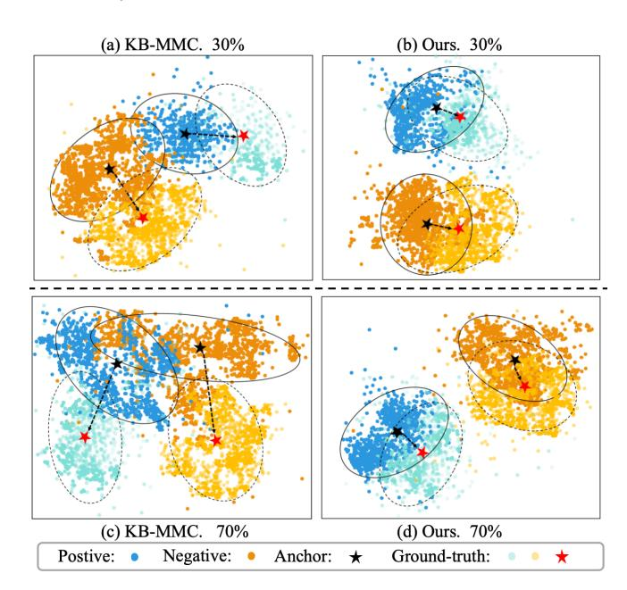
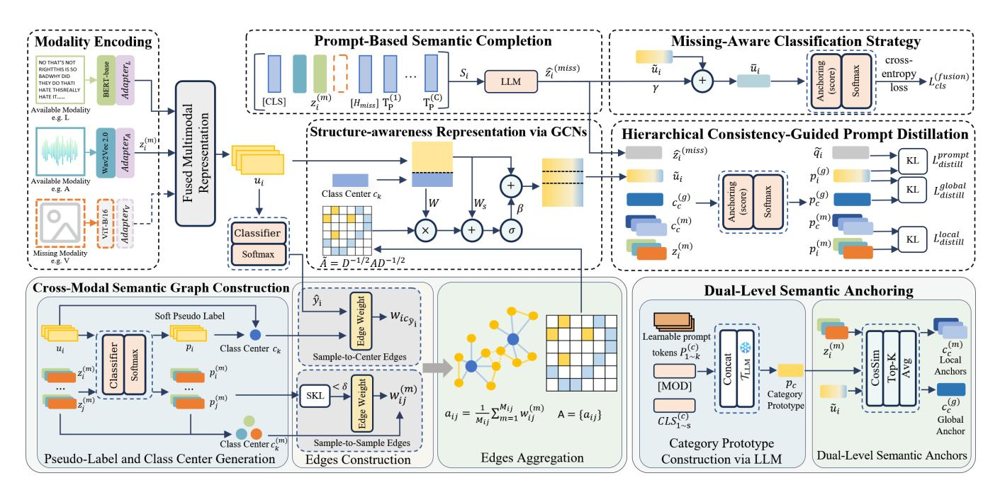
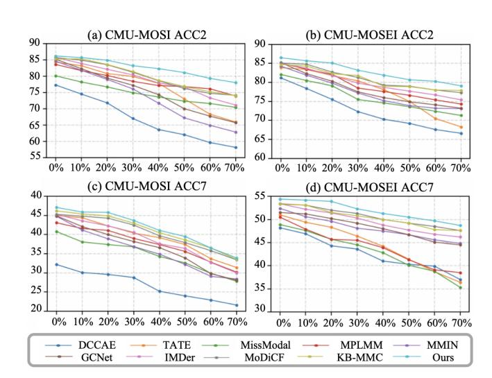
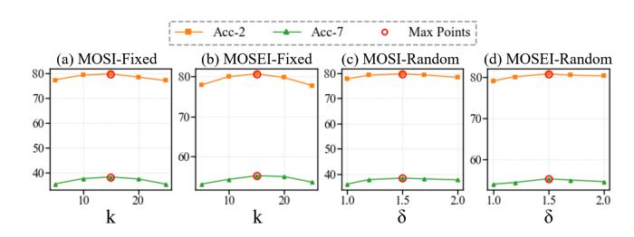
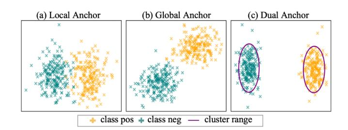

# Anchor Drift No More: Hierarchical Consistency-Guided Prompt Distillation for Incomplete Multimodal Learning

Ruiting Dai rtdai@uestc.edu.cn University of Electronic Science and Technology of China Chengdu, China

Zesen Cai zesen.cai@std.uestc.edu.cn University of Electronic Science and Technology of China Chengdu, China

Lisi Mo morris@uestc.edu.cn University of Electronic Science and Technology of China Chengdu, China

Guiduo Duan guiduo.duan@uestc.edu.cn University of Electronic Science and Technology of China Chengdu, China

Keren Shi skr@alu.uestc.edu.cn University of Electronic Science and Technology of China Chengdu, China

Tao He∗ tao.he01@hotmail.com University of Electronic Science and Technology of China Chengdu, China

### Abstract

Web-scale content is rich in modalities yet frequently incomplete due to device limits, transmission errors, or privacy controls, making learning with missing modalities a core challenge. Prior reconstruction and alignment strategies often fail to preserve a stable class geometry when inputs are partial, leading to anchor drift—a shift of class prototypes between complete and incomplete views that distorts the shared representation space and degrades generalization. We introduce HiCoD (Hierarchical Consistency-Guided Prompt Distillation), which learns a robust, class-anchored semantic space. HiCoD combines: (1) a modality-aware semantic graph that restores cross-modal structure under partial observations; (2) dual-level anchoring that unifies large-language-model–derived global category prototypes with top-K local exemplars to balance cross-modal coherence and modality-specific detail; and (3) multilevel distillation that aligns unimodal features, fused embeddings, and prompt-completed signals within a single anchor space. Across CMU-MOSI, CMU-MOSEI, and additional benchmarks, HiCoD sets a new state of the art under both fixed-pattern and random missingness, improving Acc-2 by up to 6.4 points over MPLMM and remaining robust when key modalities are absent.

# CCS Concepts

• Computing methodologies → Learning latent representations; Supervised learning by classification; • Information systems → Sentiment analysis.

# Keywords

Incomplete Multimodal Learning; Anchor Drift; Prompt Distillation; Structure-aware Modelling; Class-Anchored Semantic Space

∗Corresponding author.

[This work is licensed under a Creative Commons Attribution 4.0 International License.](https://creativecommons.org/licenses/by/4.0) WWW '26, Dubai, United Arab Emirates.

© 2026 Copyright held by the owner/author(s). ACM ISBN 979-8-4007-2307-0/2026/04 <https://doi.org/10.1145/3774904.3792498>

### ACM Reference Format:

Ruiting Dai, Zesen Cai, Lisi Mo, Guiduo Duan, Keren Shi, and Tao He. 2026. Anchor Drift No More: Hierarchical Consistency-Guided Prompt Distillation for Incomplete Multimodal Learning. In Proceedings of the ACM Web Conference 2026 (WWW '26), April 13–17, 2026, Dubai, United Arab Emirates. ACM, New York, NY, USA, [12](#page-11-0) pages.<https://doi.org/10.1145/3774904.3792498>

### 1 Introduction

User-generated content (UGC) [\[15\]](#page-8-0) underpins event understanding [\[25\]](#page-8-1), and finance [\[17\]](#page-8-2) across today's Web platforms. Yet, Web pipelines increasingly confront incomplete multimodal signals—videos without audio, images without captions, or privacy-redacted protection [\[20,](#page-8-3) [21\]](#page-8-4)—stemming from bandwidth limits and consent controls. While multimodal learning has leveraged complementary signals to advance sentiment analysis [\[37\]](#page-8-5), visual recognition [\[11,](#page-8-6) [13,](#page-8-7) [40,](#page-8-8) [40\]](#page-8-8), visual tracking [\[45–](#page-9-0)[47\]](#page-9-1) and cross-modal retrieval [\[12,](#page-8-9) [44\]](#page-9-2), missing modalities undermine standard fusion strategies that rely on cross-modal synergy.

Existing approaches to missing modalities largely fall into two families. Explicit reconstruction methods synthesize representations of the absent modality from observed ones (e.g., via autoencoders [\[8,](#page-8-10) [27\]](#page-8-11), generative models [\[6,](#page-8-12) [42\]](#page-8-13), or data selection [\[36\]](#page-8-14)), aiming to restore input-level completeness. Joint representation methods avoid reconstruction and instead optimize shared or aligned embeddings (e.g., via contrastive [\[5\]](#page-8-15) or co-regularized objectives [\[49\]](#page-9-3)) to mitigate the impact of missing inputs.

Despite clear progress, both families face a structural limitation: when modalities are missing, the structure of the representation space can change in class-specific ways. We refer to this phenomenon as anchor drift—a systematic shift of class prototypes (centroids) [\[26\]](#page-8-16) between the distributions of complete- vs. incomplete-modality inputs. Anchor drift arises from (i) the distributional gap between complete and incomplete instances and (ii) modality-specific variability that destabilizes the learned structure. As missing rates increase, this drift can induce boundary collapse and hinder generalization. Figure [1](#page-1-0) visualizes fused multimodal features under varying missingness, comparing a strong prior method (KB-MMC [\[16\]](#page-8-17)) and our approach; the anchor shift becomes more severe as missingness grows.

Figure 1: Visualization of binary emotion classification embeddings under different missing-modality ratios. As the missing-modality ratio increases from 30% to 70%, KB-MMC (a,c) shows anchor drift—missing modality prototypes (black star) shift from full modality centers (red star)—and boundary collapse. In contrast, HiCoD (ours) (b,d) preserves a classanchored geometry with minimal drift. Points are samples (blue/orange = missing modality; light blue/light orange = complete modality); solid vs. dashed circles enclose missingmodality vs. full modalities distributions.

From a consistency-learning perspective, prior work primarily emphasizes (i) intra-instance consistency (aligning representations of the same sample across modalities)[\[4\]](#page-8-18) and (ii) inter-instance consistency (matching same-class samples across modalities)[\[41\]](#page-8-19). In practice, intra-instance consistency may suppress modality-specific cues and over-penalize hard positives near dense boundaries (introducing false negatives), while inter-instance consistency often assumes cross-modal class congruence that breaks under unpaired or structurally inconsistent semantics. Figure [1](#page-1-0) visualizes these limitations under high missing-rate conditions, highlighting prevalent anchor drift and boundary collapse—underscoring the inherent difficulty of balancing structural stability and semantic alignment in existing approaches. This raises a key question: Can we move beyond reconstruction/alignment alone and learn representations that remain structurally stable as modalities drop out?

Our answer is a three-level semantic consistency framework that: (1) enforces local (within-instance) modality consistency, (2) aggregates inter-instance semantics for fusion consistency, and (3) aligns all features in a shared anchor space for global distribution consistency. Under mild regularity assumptions on the encoders and anchor estimation, we provide a theoretical analysis showing that these constraints guide unimodal and fused features to converge toward common class-anchored directions.

Building on this insight, we propose Hierarchical Consistency-Guided Prompt Distillation (HiCoD) to construct a unified semantic space that is resilient to missing modalities. A structure-aware, modality-adaptive semantic graph stabilizes topology under partial modalities; dual-level (global category / local modality-specific) anchors unify semantic directions while preserving modality detail; and a multi-level distillation couples intra-modality transfer, crossmodal fusion, and semantic completion in the anchor space.

In summary, our contributions are as follows:

- Analysis. We systematically analyze performance degradation under missing modalities and argue that it principally arises from a lack of semantic structural consistency, manifested as anchor drift.
- Method. We introduce an anchor-driven, prompt-guided framework in which category-level anchors unify alignment across local features, fused representations, and high-level prompts, improving cross-modal coherence and robustness.
- Modeling components. We develop a modality-aware semantic graph with pseudo-label-driven adjacency and graph convolution to enhance structural stability under incomplete inputs, together with a unified multi-level distillation mechanism operating in the anchor space.
- Results. Extensive experiments across multiple benchmarks show consistent improvements under missing-modality settings, including robustness to different missing rates and key-modality ablations, with up to a ∼6.4 point improvement in Acc-2 over the strong baseline MPLMM on CMU-MOSI and CMU-MOSEI.

### 2 Related Works

Generative Reconstruction. Early VAE and GAN methods follow a generate-then-fuse paradigm and reconstruct missing modalities via synthesis [\[3,](#page-8-20) [28\]](#page-8-21), while diffusion-based models have recently shown strong recovery quality [\[2,](#page-8-22) [33\]](#page-8-23). Some approaches further incorporate external knowledge, such as knowledge graphs or large multimodal models, to enable training-free completion [\[16,](#page-8-17) [48\]](#page-9-4). Nevertheless, these methods still rely on a downstream fusion stage, where reconstruction errors can accumulate and induce semantic drift under high missing rates.

Cross-Modal Knowledge Distillation and Prompt Transfer. Beyond logit mimicry, modern KD transfers richer structural semantics (e.g., relations, prototypes, or hierarchical cues) from full-modality teachers to missing-modality students [\[22\]](#page-8-24). Prompt distillation leverages frozen LLMs together with retrieved or generated anchors to inject high-level semantics without reconstructing raw signals [\[18,](#page-8-25) [35\]](#page-8-26). By unifying KD and prompt engineering, recent methods leverage strong models or external knowledge to compensate for missing modalities with minimal computational cost [\[34\]](#page-8-27).

Graph-Based Learning and Compensation. Graph neural networks compensate missing modalities via message passing over semantic, temporal, or speaker relations [\[23,](#page-8-28) [30\]](#page-8-29) to hallucinate missing edges and recover neighborhood structure. Spectral regularization and adaptive edges improve robustness to fragmented inputs [\[7,](#page-8-30) [23\]](#page-8-28). Overall, graph learning models structured relations to provide contextual cues for missing modalities.

For sample �� with available modalities A�� ⊆ {1, . . . , ��}, we construct an input sequence:

S�� = [CLS] ∥ {�� (��) �� }��∈A�� ∥ [��miss] ∥ �� (1) �� ∥ . . . ∥�� (��) �� , (16)

where [��miss] is a placeholder and �� (�� ) �� are category prompt templates. A frozen LLM encodes S�� to produce the missing-modality embedding ��ˆ (miss) �� ∈ R �� , which is mapped to the global anchor space to compute:

��˜��(��) = exp(⟨��ˆ (miss) �� , �� (g) ⟩/��) Í �� ′ exp(⟨��ˆ (miss) �� , �� (g) ′ ⟩/��) . (17)

The distillation loss is:

L prompt distill = ∑︁ KL(��˜�� ∥ �� (g) �� ), (18)

applied only during training to simulate missing scenarios and enable semantic recovery.

Missing-Aware Classification Strategy. We introduce a missing flag ���� ∈ {0, 1} (1 if sample �� has missing modalities) and a completion weight �� &gt; 0. The fusion compensation representation is:

��¯�� = (1 − ����)��˜�� + ���� ��˜�� +����ˆ (miss) , (19)

where ��˜�� is always preserved regardless of ���� , so that the representation consistently retains semantic cues from available modalities. When ���� = 1, the missing-modality embedding ��ˆ (miss) is incorporated as an auxiliary signal to mitigate semantic drift under missing modalities. This design enables the model to adaptively incorporate the missing-modality embedding without discarding valid information from available modalities. The final category probability is computed as:

�� (final) (��) = exp(⟨��¯�� , �� (g) ⟩/��) Í ′ exp(⟨��¯�� , �� (g) �� ′ ⟩/��) , (20)

and the classification loss is:

L (fusion) cls = − ∑︁�� ��=1 log �� (final) �� (����), (21)

where ���� is the ground-truth label.

Overall Training Objective. The final training objective combines classification loss and multiple distillation losses:

Ltotal = L (fusion) cls + ∑︁ �� ����L �� distill,

where �� ∈ {local, global, prompt} and ���� &gt; 0 are weighting hyperparameters.

### 5 Experiments

Datasets and Evaluation Metrics. We evaluate our method on two standard multimodal emotion recognition benchmarks: CMU-MOSI [\[38\]](#page-8-35) and CMU-MOSEI [\[1\]](#page-8-36). Performance is measured by three metrics: binary accuracy (Acc-2), macro F1 score (F1), and 7-class accuracy (Acc-7), under various missing-modality conditions.

Baseline Methods. We compare our approach with 9 state-of-theart methods for missing-modality scenarios: DCCAE [\[32\]](#page-8-37), TATE [\[39\]](#page-8-38), MissModal [\[24\]](#page-8-39), MPLMM [\[10\]](#page-8-40), MMIN [\[43\]](#page-8-41), GCNet [\[23\]](#page-8-28), IMDer [\[33\]](#page-8-23), MoDiCF [\[19\]](#page-8-42), and KB-MMC [\[16\]](#page-8-17). For MoDiCF, we replicate its modality diffusion recovery and generate counterfactual samples by masking and replacing dominant modalities, enabling robust emotion classification.

Implementation Details. We extract text features with BERTbase (768 d), visual expression features with Facet (35 d), and acoustic features with COVAREP (74 d). Each modality is projected into a shared 512 d space via a learned head. Category prompts are encoded by a frozen T5-Base text encoder with learnable context tokens (prompt template in Appendix C). We optimize with AdamW using a learning rate of 5×10−5 for BERT and 1×10−3 for all other components, batch size 32, and train for 20 epochs, selecting the checkpoint with the best validation F1. Unless noted, key scalars are: �� = 15 and �� = 1.5 in graph construction, temperature ��=0.7, graph gate ��=0.5, and loss weights (��local, ��global, ��prompt)=(1.0, 1.0, 0.5) with ��=0.3. For more details, please refer to Appendix C.

## 5.1 Comparison with state-of-the-art methods

We compare our approach to strong reconstruction and jointrepresentation baselines under fixed and random missing-modality protocols (Tab. [1](#page-6-0) and Fig. [3\)](#page-6-1). Unless noted, tables report mean over five seeds. Moreover, we have provided more experimental results under different missing rates in Appendix D.

Overall accuracy across fixed-missing configurations. Across CMU-MOSI and CMU-MOSEI, our method achieves best or statistically tied results in the majority of fixed-missing settings (Table [1\)](#page-6-0). Averaged over datasets and configurations, we improve F1 and Acc-2 by approximately 4–5 pp over joint-learning baselines (e.g., DCCAE, TATE, MissModal), and by 2–3 pp over leading reconstruction methods (e.g., IMDer, DiCMoR). These gains suggest that the proposed graph-structured fusion with anchor-guided distillation is more effective than directly fusing incomplete modalities. See the last row of Table [1](#page-6-0) for relative improvements.

Robustness when key modalities are absent. Text is typically the most informative modality for sentiment; most methods degrade sharply when it is removed. In the {A,V} fixed-missing setting, our model remains leading on both datasets (Table [1\)](#page-6-0), with margins that are positive and often significant. We attribute this to the multilevel anchor distillation, which preserves class-consistent structure in remaining modalities and reduces reliance on a single modality.

Resilience across increasing missing rates. Under random missingness, our model degrades gracefully: performance declines smoothly as the missing-modality ratio (��miss) increases from (0%) to (70%) (Fig. [3\)](#page-6-1). On CMU-MOSEI, the total reduction in Acc-2 stays within (8) percentage points over this full range, indicating strong robustness compared to baselines whose curves become markedly steeper in the high-missingness regime. The near-monotonic, gently sloped trend suggests that graph propagation reliably transfers complementary cues from observed modalities and neighboring instances, while anchor supervision keeps class prototypes stable in the embedding space. Together, these

Table 1: Performance on CMU-MOSI and CMU-MOSEI in terms of Acc-2 and F1 under various missing modalities (L, A, V, and their combinations) with a 70% missing rate. +x indicates improvement over the second-best. Bold denotes the best.

| Model     |                |      | {L}    |           |      | {A}    |           |      | {V}    |           |      | {L,A}  |           |      | {L,V}  |           |      | {A,V}  |           |      | {L,A,V} |           |
|-----------|----------------|------|--------|-----------|------|--------|-----------|------|--------|-----------|------|--------|-----------|------|--------|-----------|------|--------|-----------|------|---------|-----------|
| DCCAE     | [32]           | 76.4 | /      | 76.5      | 48.8 | /      | 42.1      | 52.6 | /      | 51.1      | 77.0 | /      | 77.0      | 76.7 | /      | 76.8      | 54.0 | /      | 52.5      | 76.4 | /       | 75.9      |
| TATE      | [39]           | 85.7 | /      | 85.6      | 59.4 | /      | 55.8      | 60.9 | /      | 58.0      | 85.8 | /      | 85.4      | 86.1 | /      | 85.7      | 64.2 | /      | 62.9      | 85.1 | /       | 85.2      |
| CMU-MOSI  | MissModal [24] | 79.1 | /      | 79.2      | 56.1 | /      | 54.5      | 55.0 | /      | 54.4      | 81.0 | /      | 81.0      | 81.1 | /      | 81.2      | 57.5 | /      | 57.4      | 80.8 | /       | 80.2      |
|           | MPLMM [10]     | 80.1 | /      | 80.3      | 62.7 | /      | 63.7      | 63.1 | /      | 63.7      | 80.8 | /      | 81.1      | 81.1 | /      | 81.2      | 65.0 | /      | 65.4      | 81.6 | /       | 81.5      |
| MMIN      | [43]           | 83.8 | /      | 83.8      | 55.3 | /      | 51.5      | 57.0 | /      | 54.0      | 84.0 | /      | 84.0      | 83.8 | /      | 83.9      | 60.4 | /      | 58.5      | 84.6 | /       | 84.4      |
| GCNet     | [23]           | 83.7 | /      | 83.6      | 56.1 | /      | 54.5      | 56.1 | /      | 55.7      | 84.5 | /      | 84.4      | 84.3 | /      | 84.2      | 62.0 | /      | 61.9      | 85.2 | /       | 85.1      |
| IMDer     | [33]           | 84.8 | /      | 84.7      | 62.0 | /      | 62.2      | 61.3 | /      | 60.8      | 85.4 | /      | 85.3      | 85.5 | /      | 85.4      | 63.6 | /      | 63.4      | 85.7 | /       | 85.6      |
| MoDiCF    | [19]           | 84.6 | /      | 84.6      | 60.7 | /      | 61.5      | 62.1 | /      | 61.2      | 85.5 | /      | 85.4      | 85.5 | /      | 85.6      | 64.4 | /      | 63.7      | 85.7 | /       | 85.6      |
|           | KB-MMC [16]    | 85.1 | /      | 84.7      | 62.6 | /      | 63.8      | 62.3 | /      | 61.2      | 85.5 | /      | 85.6      | 85.6 | /      | 85.8      | 64.9 | /      | 64.5      | 85.6 | /       | 85.5      |
| Ours      |                | 87.5 | +1.8 / | 87.3 +1.7 | 69.1 | +6.4 / | 69.0 +5.2 | 67.2 | +4.1 / | 67.2 +3.5 | 87.6 | +1.8 / | 87.4 +1.8 | 87.6 | +1.5 / | 87.5 +1.7 | 70.3 | +5.3 / | 70.2 +4.8 | 87.8 | +2.1 /  | 87.6 +2.0 |
| DCCAE     | [32]           | 79.7 | /      | 79.5      | 61.4 | /      | 53.8      | 61.1 | /      | 57.2      | 80.0 | /      | 80.0      | 80.4 | /      | 80.4      | 62.7 | /      | 59.2      | 80.5 | /       | 80.4      |
| TATE      | [39]           | 82.8 | /      | 82.5      | 65.5 | /      | 65.2      | 62.5 | /      | 61.2      | 84.1 | /      | 84.2      | 83.9 | /      | 83.8      | 64.1 | /      | 62.8      | 84.9 | /       | 84.4      |
| CMU-MOSEI | MissModal [24] | 82.6 | /      | 82.8      | 62.7 | /      | 54.5      | 62.6 | /      | 57.1      | 83.5 | /      | 83.3      | 83.2 | /      | 83.2      | 63.7 | /      | 62.7      | 83.1 | /       | 83.0      |
|           | MPLMM [10]     | 79.1 | /      | 79.2      | 67.3 | /      | 68.7      | 67.3 | /      | 69.4      | 80.5 | /      | 80.4      | 80.1 | /      | 80.1      | 68.2 | /      | 69.9      | 81.1 | /       | 81.4      |
| MMIN      | [43]           | 82.3 | /      | 82.4      | 58.9 | /      | 59.5      | 59.3 | /      | 60.0      | 83.7 | /      | 83.7      | 83.8 | /      | 83.4      | 63.5 | /      | 61.9      | 84.3 | /       | 84.2      |
| GCNet     | [23]           | 83.0 | /      | 83.2      | 60.2 | /      | 60.3      | 61.9 | /      | 61.6      | 84.3 | /      | 84.4      | 84.3 | /      | 84.4      | 64.1 | /      | 57.2      | 85.2 | /       | 85.1      |
| IMDer     | [33]           | 84.5 | /      | 84.5      | 63.8 | /      | 60.6      | 63.9 | /      | 63.6      | 85.1 | /      | 85.1      | 85.0 | /      | 85.0      | 64.9 | /      | 63.5      | 85.1 | /       | 85.1      |
| MoDiCF    | [19]           | 84.3 | /      | 84.4      | 63.2 | /      | 61.4      | 63.6 | /      | 63.7      | 84.9 | /      | 85.0      | 84.8 | /      | 84.9      | 65.5 | /      | 64.7      | 85.0 | /       | 85.1      |
|           | KB-MMC [16]    | 84.4 | /      | 84.3      | 63.7 | /      | 62.5      | 63.8 | /      | 63.8      | 84.8 | /      | 84.7      | 84.9 | /      | 84.8      | 66.5 | /      | 66.3      | 84.8 | /       | 84.5      |
| Ours      |                | 88.5 | +4.0 / | 88.3 +3.8 | 69.8 | +2.5 / | 69.6 +0.9 | 70.2 | +2.9 / | 70.0 +0.6 | 88.6 | +3.5 / | 88.5 +3.4 | 88.4 | +3.4 / | 88.3 +3.3 | 71.2 | +3.0 / | 71.0 +1.1 | 88.5 | +3.3 /  | 87.9 +2.8 |

Figure 3: Comparison of Method Performance under Random Missing Rates (0%–70%) on CMU-MOSI and CMU-MOSEI (Acc-2 and Acc-7).

components limit semantic drift, preserve decision boundaries, and maintain predictive reliability even when a large fraction of modalities is absent.

## 5.2 Ablation Studies

We evaluate the contribution of each component via controlled ablations covering module configuration, graph construction, anchor design, and sensitivity. Unless noted, all results use a fixed missing rate of��miss=70%, identical training settings across variants, and report mean over five seeds. Additional ablation results, such

Table 2: Comparison of different module configurations based on average Acc-2, F1, and Acc-7 scores across seven missing-modality scenarios on CMU-MOSI and CMU-MOSEI. Results are reported under a fixed missing rate of ��miss=70%.

| Variant |                      | MOSI-Fixed |        |        | MOSEI-Fixed |        |        |
|---------|----------------------|------------|--------|--------|-------------|--------|--------|
| Full    | (Ours)               | 79.6       | / 79.5 | / 38.3 | 80.7        | / 80.5 | / 55.2 |
| w/o     | GCN                  | 77.3       | / 77.4 | / 36.8 | 78.2        | / 78.2 | / 52.8 |
| w/o     | Distill              | 68.6       | / 67.2 | / 30.8 | 70.2        | / 68.0 | / 44.8 |
| w/o     | Anchor-distill       | 73.8       | / 74.5 | / 33.7 | 75.1        | / 75.7 | / 48.7 |
| w/o     | Compensation-distill | 78.3       | / 78.0 | / 37.1 | 79.2        | / 78.9 | / 53.7 |

as broader missing rates and extended variants, are provided in Appendix E for comprehensive analysis.

Module configuration. Table [2](#page-6-2) compares five variants: Full, w/o GCN (remove structure-aware propagation; see Section Structureaware Representation Learning), w/o Distill. (drop all distillation terms, keeping only Lsup), w/o Anchor-distill (remove anchor teachers and Llocal), and w/o Compensation-distill (remove Lprompt). All degradations relative to Full are non-trivial, confirming the necessity of each component. Removing GCN reduces performance by ≈2.3 pp (MOSI) and ≈2.5 pp (MOSEI) on Acc-2, underscoring the value of structure-aware modeling. When all distillation terms are disabled, the largest drop is observed, proving that distillation improves both semantic alignment and cross-modal transfer. Disabling anchor distillation results in a significant decrease, especially on F1, indicating that anchor-based supervision is central to multi-level alignment. Eliminating compensation distillation yields a moderate but consistent decrease, suggesting its utility for recovering semantics under severe missingness.

Table 3: Comparison of different graph construction strategies based on average Acc-2, F1, and Acc-7 scores across seven missing-modality scenarios on CMU-MOSI and CMU-MOSEI. All experiments use a fixed missing rate of ��miss=70%.

Figure 4: Performance under different parameters, i.e., �� (Top- �� for anchor selection) and �� (SKL threshold for edge gating) on CMU-MOSI and CMU-MOSEI. Results are reported under a fixed missing rate of ��miss=70%.

Graph construction strategy. We compare (i) our Pseudo-label graph (��-thresholded over soft class posteriors using symmetric KL divergence) to (ii) an Oracle (GT-Labels) graph that uses groundtruth labels only to build edges (privileged; analysis only). As shown in Table [3,](#page-7-0) pseudo-label graphs close much of the gap to the oracle and often match or exceed it on Acc-7, while remaining practical. We attribute this to preserving soft class distributions that capture semantic continuity and ambiguity—beneficial when modalities are missing—whereas GT labels enforce only hard intra-class ties.

Anchor construction strategy. Table [4](#page-7-1) evaluates three strategies: Top-�� + LLM (ours), Top-�� only (no text guidance), and Mean pooling. The full strategy achieves the best results across Acc-2, F1, and Acc-7; relative to Top-�� only it improves by ∼1.4 pp on Acc-2/F1 (often significant† ), indicating that LLM-guided prompts produce more salient, discriminative anchors. The gap widens against mean pooling, affirming the importance of high-quality anchors for crossmodal alignment and distillation under missingness.

Hyperparameter sensitivity. Furthermore, we perform a sensitivity analysis on two key hyperparameters: the �� (Top-��) used in anchor selection and the SKL threshold ��. As illustrated in Fig. [4,](#page-7-2) our method maintains consistently strong performance across a broad range of values for both parameters, demonstrating its robustness and practical viability.

Effect of anchor distillation on representation geometry. We visualize fused features with t-SNE under Local-only, Global-only, and Dual-anchor distillation (Fig. [5\)](#page-7-3); all runs use the same seed and t-SNE hyperparameters. Local anchors tighten intra-class clusters (fine-grained semantics), global anchors enlarge inter-class margins, and the dual-anchor setting balances both, yielding the most separable structure. A k-NN probe on the embeddings corroborates the qualitative trend.

Table 4: Comparison of different anchor construction strategies based on average Acc-2, F1, and Acc-7 scores across seven missing-modality scenarios on CMU-MOSI and CMU-MOSEI. All results use a fixed missing rate of ��miss=70%.

| Anchor Strategy   | MOSI-Fixed         | MOSEI-Fixed        |
|-------------------|--------------------|--------------------|
| Top-K + LLM (our) | 79.6 / 79.5 / 38.3 | 80.7 / 80.5 / 55.2 |
| Top-K Only        | 78.2 / 78.1 / 37.2 | 79.3 / 79.2 / 53.5 |
| Mean Pooling      | 76.0 / 75.7 / 34.8 | 77.0 / 76.6 / 50.0 |

Figure 5: Comparison of Semantic Representations under Different Anchor Distillation Strategies on CMU-MOSEI via t-SNE Visualization.

### 6 Conclusion

We studied anchor drift in multimodal learning under missing modalities and showed why existing consistency objectives struggle to balance modality-specific detail with semantic alignment. We introduced a hierarchical consistency-guided prompt distillation framework built on three levels of semantic consistency. The approach combines pseudo-label–guided semantic graphs, promptdriven dual-level anchors, and multi-channel distillation within a unified anchor space, yielding robust cross-modal representations. Extensive experiments across multiple benchmark datasets (e.g., CMU-MOSI, CMU-MOSEI) and diverse missingness protocols (both fixed-pattern and random modality dropout) demonstrate that HiCoD consistently outperforms state-of-the-art baselines. Limitation and future work. Our framework introduces extra compute and design complexity: constructing semantic graphs (with pseudo-labels and SKL gating) and encoding text prompts add overhead and depend on calibration of the teacher distributions. Future work will explore more efficient graph construction (e.g., learned sparsification), prompt-free or self-supervised anchors that reduce reliance on label text, backbone adaptation under missingness, and evaluation under more extreme and open-set conditions.

### Acknowledgments

This work was supported by the National Natural Science Foundation of China (NSFC) (granted No. 62306064) and the Central-Guided Local Science and Technology Development (granted No. 2023ZYD0165). We appreciate all the authors for their fruitful discussions. In addition, thanks are extended to anonymous reviewers for their insightful comments.

### References

- [1] AmirAli Bagher Zadeh, Paul Pu Liang, Soujanya Poria, Erik Cambria, and Louis-Philippe Morency. 2018. Multimodal Language Analysis in the Wild: CMU-MOSEI Dataset and Interpretable Dynamic Fusion Graph. In Proceedings of the 56th Annual Meeting of the Association for Computational Linguistics (ACL 2018), Volume 1: Long Papers. 2236–2246. [doi:10.18653/v1/P18-1208](https://doi.org/10.18653/v1/P18-1208) [2] Mustapha Bounoua, Giulio Franzese, and Pietro Michiardi. 2024. Multi-Modal Latent Diffusion. Entropy 26, 4 (2024). [doi:10.3390/e26040320](https://doi.org/10.3390/e26040320) [3] Bing Cao, Zhiwei Bi, Qinghua Hu, Han Zhang, Nannan Wang, Xinbo Gao, and Dinggang Shen. 2023. AutoEncoder-Driven Multimodal Collaborative Learning for Medical Image Synthesis. International Journal of Computer Vision 131, 8 (2023), 1995–2014. [doi:10.1007/s11263-023-01791-0](https://doi.org/10.1007/s11263-023-01791-0) [4] Chuangquan Chen, Zhencheng Li, Kit Ian Kou, Jie Du, Chen Li, Hongtao Wang, and Chi-Man Vong. 2025. Comprehensive Multisource Learning Network for Cross-Subject Multimodal Emotion Recognition. IEEE Trans. Emerg. Topics Comput. Intell. 9, 1 (2025), 365–380. [doi:10.1109/TETCI.2024.3406422](https://doi.org/10.1109/TETCI.2024.3406422) [5] Giordano Cicchetti, Eleonora Grassucci, Luigi Sigillo, and Danilo Comminiello. 2025. Gramian multimodal representation learning and alignment. In Proc. ICLR 2025. Singapore. [6] Ruiting Dai, Chenxi Li, Yandong Yan, Lisi Mo, Ke Qin, and Tao He. 2025. Unbiased Missing-modality Multimodal Learning. In Proc. ICCV. [7] Fangze Fu, Wei Ai, Fan Yang, Yuntao Shou, Tao Meng, and Keqin Li. 2025. SDR-GNN: Spectral Domain Reconstruction Graph Neural Network for incomplete multimodal learning in conversational emotion recognition. Knowledge-Based Systems 309 (2025), 112825. [doi:10.1016/j.knosys.2024.112825](https://doi.org/10.1016/j.knosys.2024.112825) [8] Pengxuan Gao, Tianyu Liu, Jia-Wen Liu, Bao-Liang Lu, and Wei-Long Zheng. 2024. Multimodal Multi-View Spectral-Spatial-Temporal Masked Autoencoder for Self-Supervised Emotion Recognition. In Proc. ICASSP 2024. 1926–1930. [doi:10.](https://doi.org/10.1109/ICASSP48485.2024.10447194) [1109/ICASSP48485.2024.10447194](https://doi.org/10.1109/ICASSP48485.2024.10447194) [9] Yanqi Ge, Qiang Nie, Ye Huang, Yong Liu, Chengjie Wang, Feng Zheng, Wen Li, and Lixin Duan. 2024. Beyond Prototypes: Semantic Anchor Regularization for Better Representation Learning. AAAI 38, 3 (Mar. 2024), 1887–1895. [doi:10.1609/](https://doi.org/10.1609/aaai.v38i3.27958) [aaai.v38i3.27958](https://doi.org/10.1609/aaai.v38i3.27958) [10] Zirun Guo, Tao Jin, and Zhou Zhao. 2024. Multimodal Prompt Learning with Missing Modalities for Sentiment Analysis and Emotion Recognition. In Proceedings of the 62nd Annual Meeting of the Association for Computational Linguistics (ACL 2024), Long Papers. 1726–1736. [doi:10.18653/v1/2024.acl-long.94](https://doi.org/10.18653/v1/2024.acl-long.94) [11] Tao He, Lianli Gao, Jingkuan Song, Jianfei Cai, and Yuan-Fang Li. 2021. Semantic compositional learning for low-shot scene graph generation. arXiv preprint arXiv:2108.08600 (2021). [12] Tao He, Lianli Gao, Jingkuan Song, and Yuan-Fang Li. 2021. Semisupervised network embedding with differentiable deep quantization. IEEE Transactions on Neural Networks and Learning Systems 34, 8 (2021), 4791–4802. [13] Xin Hu, Ke Qin, Guiduo Duan, Ming Li, Yuan-Fang Li, and Tao He. 2025. SPADE: Spatial-Aware Denoising Network for Open-vocabulary Panoptic Scene Graph Generation with Long-and Local-range Context Reasoning. In Proceedings of the IEEE/CVF International Conference on Computer Vision. 15562–15572. [14] Zhangqi Jiang, Tingjin Luo, and Xinyan Liang. 2024. Deep Incomplete Multi-View Learning Network with Insufficient Label Information. In Proc. AAAI 2024, Vol. 38. 12919–12927. [doi:10.1609/aaai.v38i11.29189](https://doi.org/10.1609/aaai.v38i11.29189) [15] Pranav Kasela, Marco Braga, Gabriella Pasi, and Raffaele Perego. 2024. SE-PQA: Personalized Community Question Answering. In Companion Proceedings of The Web Conference 2024 (WWW '24). 1095–1098. [doi:10.1145/3589335.3651445](https://doi.org/10.1145/3589335.3651445) [16] Guanzhou Ke, Shengfeng He, Xiaoli Wang, Bo Wang, Guoqing Chao, Yuanyang Zhang, Yi Xie, and Hexing Su. 2025. Knowledge Bridger: Towards Training-Free Missing Modality Completion. In Proc. CVPR. 25864–25873. [17] Zong Ke, Yuqing Cao, Zhenrui Chen, Yuchen Yin, Shouchao He, and Yu Cheng. 2025. Early warning of cryptocurrency reversal risks via multi-source data. Finance Research Letters (2025), 107890. [18] Jian Lang, Zhangtao Cheng, Ting Zhong, and Fan Zhou. 2025. Retrieval-Augmented Dynamic Prompt Tuning for Incomplete Multimodal Learning. In Proc. AAAI. 18035–18043. [doi:10.1609/aaai.v39i17.33984](https://doi.org/10.1609/aaai.v39i17.33984) [19] Jin Li, Shoujin Wang, Qi Zhang, Shui Yu, and Fang Chen. 2025. Generating with fairness: A modality-diffused counterfactual framework for incomplete multimodal recommendations. In Proceedings of the ACM on Web Conference 2025. 2787–2798. [20] Ming Li, Huazhu Fu, Shengfeng He, Hehe Fan, Jun Liu, Jussi Keppo, and Mike Zheng Shou. 2023. DR-FER: Discriminative and Robust Representation Learning for Facial Expression Recognition. IEEE Transactions on Multimedia 26 (2023), 6297–6309. [21] Ming Li, Xiangyu Xu, Hehe Fan, Pan Zhou, Jun Liu, Jia-Wei Liu, Jiahe Li, Jussi Keppo, Mike Zheng Shou, and Shuicheng Yan. 2023. STPrivacy: Spatio-temporal privacy-preserving action recognition. In ICCV. [22] Mingcheng Li, Dingkang Yang, Xiao Zhao, Shuaibing Wang, Yan Wang, Kun Yang, Mingyang Sun, Dongliang Kou, Ziyun Qian, and Lihua Zhang. 2024. Correlation-Decoupled Knowledge Distillation for Multimodal Sentiment Analysis with Incomplete Modalities. In Proc. CVPR 2025. 12458–12468. [doi:10.1109/CVPR52733.](https://doi.org/10.1109/CVPR52733.2024.01184) [2024.01184](https://doi.org/10.1109/CVPR52733.2024.01184) [23] Zheng Lian, Lan Chen, Licai Sun, Bin Liu, and Jianhua Tao. 2023. GCNet: Graph Completion Network for Incomplete Multimodal Learning in Conversation. IEEE Transactions on Pattern Analysis and Machine Intelligence 45, 7 (2023), 8419–8432. [doi:10.1109/TPAMI.2023.3234553](https://doi.org/10.1109/TPAMI.2023.3234553) [24] Ronghao Lin and Haifeng Hu. 2023. MissModal: Increasing Robustness to Missing Modality in Multimodal Sentiment Analysis. Transactions of the Association for Computational Linguistics 11 (2023), 1686–1702. [doi:10.1162/tacl\\_a\\_00628](https://doi.org/10.1162/tacl_a_00628) [25] Shaoyu Liu, Jianing Li, Guanghui Zhao, Yunjian Zhang, Xin Meng, Fei Richard Yu, Xiangyang Ji, and Ming Li. 2025. EventGPT: Event Stream Understanding with Multimodal Large Language Models. In Proceedings of the Computer Vision and Pattern Recognition Conference (CVPR). 29139–29149. [26] Suyuan Liu, Siwei Wang, Ke Liang, Junpu Zhang, Zhibin Dong, Tianrui Liu, En Zhu, Kunlun He, and Xinwang Liu. 2024. Alleviate Anchor-Shift: Explore Blind Spots with Cross-View Reconstruction for Incomplete Multi-View Clustering. In Advances in Neural Information Processing Systems, Vol. 37. 87509–87531. [doi:10.](https://doi.org/10.52202/079017-2777) [52202/079017-2777](https://doi.org/10.52202/079017-2777) [27] Yao Lu, Ji Zhaiyuan, Jiawei Du, Yu Shanqing, Qi Xuan, and Joey Tianyi Zhou. [n. d.]. AutoAnnotator: A Collaborative Annotation Framework for Large and Small Language Models. Transactions on Machine Learning Research ([n. d.]). [28] Yixin Luo and Zhouwang Yang. 2024. DynGAN: Solving Mode Collapse in GANs With Dynamic Clustering. IEEE Transactions on Pattern Analysis and Machine Intelligence 46, 8 (2024), 5493–5503. [doi:10.1109/TPAMI.2024.3367532](https://doi.org/10.1109/TPAMI.2024.3367532) [29] Rafael Müller, Simon Kornblith, and Geoffrey E Hinton. 2019. When does label smoothing help?. In Advances in Neural Information Processing Systems, H. Wallach, H. Larochelle, A. Beygelzimer, F. d'Alché-Buc, E. Fox, and R. Garnett (Eds.), Vol. 32. Curran Associates, Inc. [30] Thu Hang Phung, Binh P. Nguyen, Thanh Hung Nguyen, Quoc Viet Hung Nguyen, Phi Le Nguyen, and Thanh Trung Huynh. 2024. A Contrastive Learning and Graph-based Approach for Missing Modalities in Multimodal Federated Learning. In 2024 International Joint Conference on Neural Networks (IJCNN). 1–8. [doi:10.](https://doi.org/10.1109/IJCNN60899.2024.10650285) [1109/IJCNN60899.2024.10650285](https://doi.org/10.1109/IJCNN60899.2024.10650285) [31] Botao Wang, Jia Li, Yang Liu, Jiashun Cheng, Yu Rong, Wenjia Wang, and Fugee Tsung. 2023. Deep Insights into Noisy Pseudo Labeling on Graph Data. In Advances in Neural Information Processing Systems, A. Oh, T. Naumann, A. Globerson, K. Saenko, M. Hardt, and S. Levine (Eds.), Vol. 36. Curran Associates, Inc., 76214–76228. [32] Weiran Wang, Raman Arora, Karen Livescu, and Jeff Bilmes. 2015. On Deep Multi-View Representation Learning. In Proceedings of the 32nd International Conference on Machine Learning (Proceedings of Machine Learning Research, Vol. 37). Lille, France, 1083–1092.<https://proceedings.mlr.press/v37/wangb15.html> [33] Yuanzhi Wang, Yong Li, and Zhen Cui. 2023. Incomplete Multimodality-Diffused Emotion Recognition. In Advances in Neural Information Processing Systems,
  - A. Oh, T. Naumann, A. Globerson, K. Saenko, M. Hardt, and S. Levine (Eds.), Vol. 36. Curran Associates, Inc., 17117–17128. [34] Wei Wei, Jiabin Tang, Lianghao Xia, Yangqin Jiang, and Chao Huang. 2024. PromptMM: Multi-Modal Knowledge Distillation for Recommendation with Prompt-Tuning. In Proceedings of the ACM Web Conference 2024 (WWW '24). 3217–3228. [doi:10.1145/3589334.3645359](https://doi.org/10.1145/3589334.3645359) [35] Yingxue Xu, Fengtao Zhou, Chenyu Zhao, Yihui Wang, Can Yang, and Hao Chen. 2025. Distilled Prompt Learning for Incomplete Multimodal Survival Prediction. In Proc. CVPR. 5102–5111. [36] Jiawei Yao, Chuming Li, and Canran Xiao. 2024. Swift sampler: Efficient learning of sampler by 10 parameters. Advances in Neural Information Processing Systems 37 (2024), 59030–59053. [37] Wen Yin, Yong Wang, Guiduo Duan, Dongyang Zhang, Xin Hu, Yuan-Fang Li, and Tao He. 2025. Knowledge-Aligned Counterfactual-Enhancement Diffusion Perception for Unsupervised Cross-Domain Visual Emotion Recognition. In Proc. CVPR. 3888–3898. [38] Amir Zadeh, Rowan Zellers, Eli Pincus, and Louis-Philippe Morency. 2016. Multimodal Sentiment Intensity Analysis in Videos: Facial Gestures and Verbal Messages. IEEE Intelligent Systems 31, 6 (2016), 82–88. [doi:10.1109/MIS.2016.94](https://doi.org/10.1109/MIS.2016.94) [39] Jiandian Zeng, Tianyi Liu, and Jiantao Zhou. 2022. Tag-assisted Multimodal Sentiment Analysis under Uncertain Missing Modalities. In Proceedings of the 45th International ACM SIGIR Conference on Research and Development in Information Retrieval (Madrid, Spain) (SIGIR '22). 1545–1554. [doi:10.1145/3477495.3532064](https://doi.org/10.1145/3477495.3532064) [40] Shuang Zeng, Xinyuan Chang, Mengwei Xie, Xinran Liu, Yifan Bai, Zheng Pan, Mu Xu, and Xing Wei. 2025. FutureSightDrive: Thinking Visually with Spatio-Temporal CoT for Autonomous Driving. arXiv preprint arXiv:2505.17685 (2025). [41] Xiaoheng Zhang, Weigang Cui, Bin Hu, and Yang Li. 2024. A Multi-Level Alignment and Cross-Modal Unified Semantic Graph Refinement Network for Conversational Emotion Recognition. IEEE Transactions on Affective Computing 15, 3 (2024), 1553–1566. [doi:10.1109/TAFFC.2024.3354382](https://doi.org/10.1109/TAFFC.2024.3354382) [42] Yue Zhang, Chengtao Peng, Qiuli Wang, Dan Song, Kaiyan Li, and S. Kevin Zhou. 2025. Unified Multi-Modal Image Synthesis for Missing Modality Imputation. IEEE Trans. Med. Imaging 44, 1 (2025), 4–18. [doi:10.1109/TMI.2024.3424785](https://doi.org/10.1109/TMI.2024.3424785) [43] Jinming Zhao, Ruichen Li, and Qin Jin. 2021. Missing Modality Imagination Network for Emotion Recognition with Uncertain Missing Modalities. In Proc.

