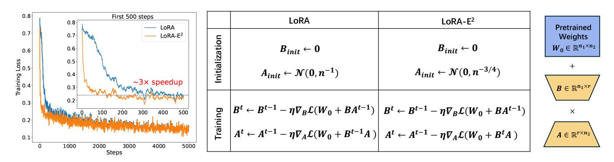
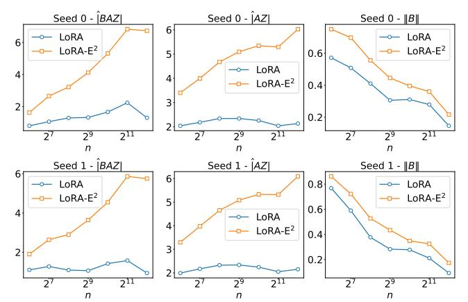
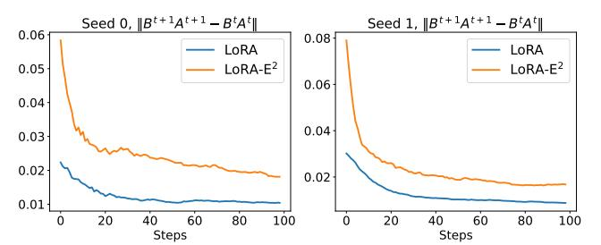
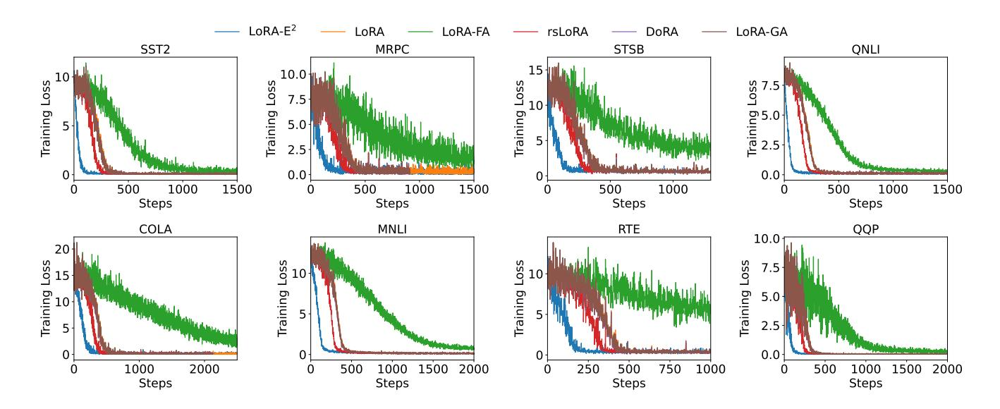

### **LoRA-E**2 : Effective and Efficient Low-rank Adaptation

| Shengkun Zhu              |                              |
|---------------------------|------------------------------|
| School of Computer        |                              |
| Wuhan University          |                              |
| Wuhan, China              |                              |
| Jinshan Zeng              |                              |
| School of Management      |                              |
| Xi’an Jiaotong University |                              |
| Xi’an, China              |                              |
|                           | Yiming Wang                  |
|                           | School of Computer           |
|                           | Wuhan University             |
|                           | Wuhan, China                 |
|                           | Sheng Wang ∗                 |
|                           | School of Computer           |
|                           | Wuhan University             |
|                           | Wuhan, China                 |
| Yuan Sun                  |                              |
| La Trobe Business School  |                              |
| La Trobe University       |                              |
| Melbourne, Australia      |                              |
| Shangfeng Chen            |                              |
| School of Computer        |                              |
| Wuhan University          |                              |
| Wuhan, China              |                              |
|                           | Yuan Yao                     |
|                           | Department of                |
|                           | Hong Kong University of      |
|                           | Science and Technology       |
|                           | Hong Kong, China             |
|                           | Qiang Yang                   |
|                           | The Hong Kong                |
|                           | Polytechnic University       |
|                           | Hong Kong, China             |
|                           | pro fqiang.yang@polyu.edu.hk |

yuany@ust.hk

# Abstract

Low-rank adaptation (LoRA) has emerged as an efficient fine-tuning technique for large language models, enabling parameter-efficient updates while maintaining task performance. However, LoRA suffers from two key issues: 1) inefficient feature learning when the width �� (embedding dimension) is large, and 2) ineffective updates to the adapter matrix �� due to the initialization of �� as zero. We propose LoRA-E2 , which utilizes a Gaussian initialization with variance Θ(�� −3/4 ) for ��, and employs the Gauss-Seidel iteration to train �� and �� during the warm-up phase, while employing Jacobi iteration for efficiency during main training. We theoretically show that LoRA-E2 enables more stable and efficient feature learning with effective parameter updates over LoRA. Empirically, LoRA-E2 achieves consistent gains in both natural language understanding and generation tasks. On the GLUE benchmark with T5-base, it improves performance by 1–10% over LoRA. When fine-tuning Llama 2-7B on MetaMathQA with GSM8K as validation, LoRA-E2 surpasses LoRA by 1–2% and converges up to ∼3× faster. Code is available at [https://github.com/whu-totemdb/LoRA-E2.](https://github.com/whu-totemdb/LoRA-E2)

# CCS Concepts

### • Computing methodologies → Natural language processing.

# Keywords

Low-rank adaptation, Fine-tuning, Large Language models, Initialization, Gauss-Seidel iteration

### ACM Reference Format:

Shengkun Zhu, Jinshan Zeng, Yiming Wang, Sheng Wang∗ , Yuan Sun, Shangfeng Chen, Yuan Yao, and Qiang Yang. 2026. LoRA-E2 : Effective and

Shengkun Zhu and Jinshan Zeng are co-first authors.

\*Sheng Wang is the corresponding author.

[This work is licensed under a Creative Commons Attribution 4.0 International License.](https://creativecommons.org/licenses/by/4.0) WWW '26, Dubai, United Arab Emirates

© 2026 Copyright held by the owner/author(s). ACM ISBN 979-8-4007-2307-0/2026/04 <https://doi.org/10.1145/3774904.3792500>

Efficient Low-rank Adaptation. In Proceedings of the ACM Web Conference 2026 (WWW '26), April 13–17, 2026, Dubai, United Arab Emirates. ACM, New York, NY, USA, [12](#page-11-0) pages.<https://doi.org/10.1145/3774904.3792500>

# 1 Introduction

Large language models (LLMs), such as ChatGPT [\[1\]](#page-8-0), Gemini [\[11\]](#page-8-1), and DeepSeek [\[6\]](#page-8-2), have achieved remarkable success across diverse applications, particularly in the context of web data, where largescale information retrieval and natural language understanding are crucial [\[4,](#page-8-3) [8,](#page-8-4) [20,](#page-8-5) [37\]](#page-8-6). These models, trained on vast amounts of web data, serve as versatile foundations for a wide range of tasks [\[2,](#page-8-7) [49\]](#page-8-8). However, adapting them for specific downstream applications still requires fine-tuning to address task-specific requirements [\[27\]](#page-8-9). Modern LLMs are comprised of billions of parameters, making full model fine-tuning computationally prohibitive [\[19\]](#page-8-10). This challenge has spurred the development of parameter-efficient finetuning (PEFT) methods [\[10\]](#page-8-11), which selectively update only a small subset of parameters while keeping the majority frozen, significantly reducing computational costs. PEFT methods have not only improved efficiency but also enabled comparable or even superior performance in specialized tasks, making LLMs more accessible and practical for real-world applications, especially in domains heavily reliant on dynamic web data [\[28,](#page-8-12) [29,](#page-8-13) [31,](#page-8-14) [36,](#page-8-15) [41\]](#page-8-16).

Among PEFT methods, Low-Rank Adaptation (LoRA) [\[19\]](#page-8-10) has become a well-known approach, using low-rank updates to the weights of large pretrained models for effective fine-tuning. Given a pretrained weight matrix ��0 ∈ R ��1×��2 from the pretrained model, LoRA reparameterizes the update as

�� = ��0 + �� ��, where �� = ����,

where �� is a scaling factor, and �� ∈ R ��×��2 and �� ∈ R ��1×�� are trainable matrices with rank �� ≪ min{��1, ��2}. This reparameterization reduces the number of trainable parameters to ��(��1 + ��2), significantly smaller than the full ��1 × ��2 matrix. By freezing ��0 and updating only �� and ��, LoRA enables efficient adaptation of large-scale models to downstream tasks while maintaining a low computational and memory footprint.

into each layer of the model. Subsequent methods, including prefixtuning [\[25\]](#page-8-25) and prompt-tuning [\[24\]](#page-8-26), shifted the focus toward modifying input or hidden representations by appending trainable parameters to existing layers. Among these techniques, LoRA [\[19\]](#page-8-10) has become one of the most influential and widely adopted PEFT strategies. By injecting low-rank adaptations into weight matrices, LoRA achieves substantial reductions in computational cost while effectively mitigating overfitting and catastrophic forgetting [\[3\]](#page-8-27).

## 2.1 Effective LoRA

Effective LoRA focuses on generating high-quality model outputs during fine-tuning, ensuring fast convergence and superior performance across diverse tasks. Several methods have been proposed to improve LoRA's effectiveness. AdaLoRA [\[51\]](#page-8-28) introduces dynamic pruning of insignificant weights using Singular Value Decomposition (SVD), reallocating rank to more critical regions within a fixed parameter budget. DoRA [\[30\]](#page-8-29) improves model expressiveness by incorporating learnable magnitudes into the direction adjustments made by low-rank matrix products. Despite these innovations, vanilla LoRA remains widely adopted due to its robust support in libraries and hardware. As such, advancing LoRA without altering its fundamental structure is essential. Several recent approaches focus on this aspect. For example, rsLoRA [\[21\]](#page-8-30) introduces a scaling factor that ensures the output is invariant to rank. However, many of these approaches encounter a common issue: initializing matrix �� to zero renders the gradient updates to matrix �� ineffective during early training. A class of solutions circumvents this issue by initializing �� with non-zero values. For instance, PiSSA [\[35\]](#page-8-31) approximates the original weight matrix �� using SVD and uses the resulting factors to initialize �� and ��. Similarly, LoRA-GA [\[44\]](#page-8-19) approximates the gradient of �� through SVD on sampled gradients, followed by appropriate scaling of the initialized matrices. Nevertheless, these SVD-based methods become computationally expensive and memory-intensive when applied to a large number of LoRA layers. In contrast, our approach retains the conventional initialization of �� = 0, and instead introduces an alternative update of �� and ��, effectively overcoming the issue of invalid update and leading to improved training effectiveness.

# 2.2 Efficient LoRA

Efficient variants of LoRA are primarily designed to reduce the computational overhead of model fine-tuning while maintaining strong downstream performance. Hayou et al. [\[15\]](#page-8-18) provided a principled framework for determining the LoRA learning rate, showing that increasing the learning rate of the parameter �� can promote efficient feature learning. However, excessively large learning rates cause training instability and eventual divergence. Building upon this framework, we demonstrate that efficient feature learning can be achieved by modifying the LoRA initialization alone, without the need to adjust other hyperparameters. There are several other techniques that improve the efficiency of LoRA, but these are orthogonal to the concept of efficient feature learning. One such method involves quantization [\[9,](#page-8-32) [26,](#page-8-33) [38,](#page-8-34) [45\]](#page-8-35). Dettmers et al. [\[9\]](#page-8-32) introduced a quantized version of LoRA, referred to as QLoRA, which reduces computational costs by quantizing pretrained weights to as few as four bits. Other LoRA variants have been proposed to further

reduce the number of trainable parameters [\[22,](#page-8-36) [50,](#page-8-37) [52\]](#page-8-38). For example, VeRA [\[22\]](#page-8-36) freezes random weight-tied adapters and instead learns vector scalings of the internal adapter activations, thereby achieving substantial reductions in trainable parameters while preserving performance comparable to standard LoRA.

### 3 Proposed **LoRA-E**2

In this section, we present the design of LoRA-E2 , with particular emphasis on its initialization and training procedures. We first describe the key aspects of LoRA-E2 initialization, which are crucial for ensuring both the stability and efficiency of LoRA fine-tuning updates. We then introduce the training methodology of LoRA-E2 , which employs an alternating update strategy for optimizing �� and ��, thereby addressing the limitations in standard LoRA. Finally, we provide a detailed description of the overall algorithmic design.

### 3.1 **LoRA-E**2 Initialization

Given the additive update structure of LoRA, it is crucial to initialize the product ���� to zero to ensure that fine-tuning begins from the pretrained model. This can be accomplished by setting one of the matrices, �� or ��, to zero. Initializing both to zero results in a saddle point where no learning occurs, as the parameter gradients would remain zero. Therefore, one matrix should be initialized to zero, while the other is initialized to a non-zero value. Hayou et al. [\[15\]](#page-8-18) has theoretically and empirically demonstrated that initializing �� to zero typically yields better performance, as initializing �� to zero leads to undertraining of ��, resulting in suboptimal training. Thus, in this paper, we focus exclusively on the initialization of �� to zero.

We consider initializing the trainable weights by assigning the entries ������ independently from Gaussian distribution, ������ ∼ N (0, ��2 ) and ������ ← 0. To maintain the stability as the input dimension �� grows, the variance �� is typically chosen proportional to �� −1 , a choice grounded in the Central Limit Theorem and widely adopted in initialization strategies such as Kaiming initialization [\[16\]](#page-8-39) and LeCun initialization [\[23\]](#page-8-40).

In LoRA training, initializing with a variance of �� 2 = Θ(�� −1 ) inevitably leads to inefficiency and instability, unless matrix �� is trained with a learning rate significantly larger than that of �� (i.e., ����/���� = Θ(��)) [\[15\]](#page-8-18). However, using such a large learning rate risks non-convergence. To ensure stability and efficiency without modifying the learning rate, we propose initializing �� with a variance of �� 2 = Θ(�� −3/4 ). A theoretical justification for this choice is provided in Section [4.](#page-4-0)

# 3.2 **LoRA-E**2 Training

For a given LoRA layer, we use �� to denote the input to that layer and ��¯ for the output after adding the pretrained weights. More precisely, we write the layer operation as

��¯ = (��0 + �� �� ����)��. (1)

We assume that the pretrained weights ��0 remain fixed throughout fine-tuning. The objective is to minimize empirical risk, also referred to as training loss, denoted by L (��¯ (��, ��), �� ), where �� represents the ground truth labels. At fine-tuning step ��, the gradients

properly conditioned prior to the main training stage. After the warm-up phase, the algorithm transitions to Jacobi iteration for the main training (Lines [7](#page-4-5)[–8\)](#page-4-6), where both �� and �� are updated simultaneously within each iteration using a single forward–backward pass.

### 4 **LoRA-E**2 Finetuning Dynamics

In this section, we aim to rigorously investigate the fine-tuning dynamics of LoRA with a focus on efficient feature learning. Our goal is to prove that LoRA-E2 induces efficient and stable feature learning. To this end, we formalize the concepts of LoRA features, stability, and feature learning, and derive precise conditions under which efficient learning is theoretically guaranteed. These results further allow us to identify the critical learning rate thresholds that delineate stable fine-tuning regimes from unstable ones. Since the primary aim of this work is methodological, the theoretical analysis is presented at a physics-level of rigor, intended to distill the key insights. We intentionally omit certain technical assumptions that, while necessary for full mathematical formalization, would obscure the core ideas with excessive complexity.

### 4.1 Stability and Feature Learning

Our main analysis relies on a careful estimation of the magnitude of several quantities involving LoRA features. Before delving into the full complexity of the setting, we introduce a simplifying assumption to clarify the role of individual LoRA components. When multiple LoRA layers are present, the feature updates are influenced not only by the changes in the low-rank matrices �� and ��, but also by the latent representations �� and ����¯, which are continuously updated during finetuning. To isolate the specific contribution of an individual LoRA layer to feature learning, we adopt a common methodological simplification: we assume that only a single LoRA layer is trainable, while all other LoRA layers remain frozen. Since LoRA layers are typically initialized to zero, this setup is effectively equivalent to incorporating only one active LoRA module in the model. Under this configuration, we can quantitatively evaluate

Figure 2: Evolution of the norms of the extracted features ���� and ���� averaged over the training data, and the norm of ��. We compute the norm ∥��∥, and the average feature norm |���� | := �� Í�� ��=1 ∥���� (����) ∥, and similarly for ����, where {���� } �� ��=1 are training samples.

Figure 3: Magnitude of low-rank update steps, measured by ∥�� ��+1�� ��+1 − �� ���� ∥, during training for two random seeds. Compared to LoRA, **LoRA-E**2 consistently exhibits larger update magnitudes, indicating more effective parameter updates at each step.

the extent of feature adaptation attributable solely to the trainable LoRA layer throughout the fine-tuning process. This strategy is widely employed in the study of LoRA fine-tuning dynamics [\[14,](#page-8-17) [15\]](#page-8-18). Next, we present a formal definition of the LoRA features defined in Hayou et al. [\[15\]](#page-8-18).

Definition 1 (LoRA Features). Consider a general neural architecture equipped with a LoRA layer, we define the LoRA features (����, ����) as ���� = ����, and ���� = ������ = ������. At fine-tuning step ��, we use the superscript �� to denote the value of LoRA features �� �� , �� , and the weights �� , ��

Stability ensures that no quantity in the network becomes unbounded as the model width increases, which is a critical property when scaling the model. To maintain stability, it is necessary to adjust hyperparameters such as initialization and learning rate as the model size �� grows. However, arbitrarily scaling the learning rate with width may result in suboptimal learning dynamics, even if fine-tuning remains stable [\[14\]](#page-8-17). To address this issue, we adopt the stability formulation for LoRA features in the asymptotic regime of increasing width [\[15\]](#page-8-18).

Table 1: Performance comparison of various adaptation methods on the GLUE benchmark. We report the mean and standard deviation of the overall Matthew's correlation for CoLA, Pearson correlation for STS-B, and accuracy for the remaining tasks, averaged over 10 trials. For all metrics, higher values indicate better performance.

| Methods          |       | SST-2  |       | MRPC   |       | STS-B  |       | QNLI   |       | CoLA   |       | MNLI   |       | RTE    |       | QQP    |
|------------------|-------|--------|-------|--------|-------|--------|-------|--------|-------|--------|-------|--------|-------|--------|-------|--------|
| LoRA             | 93.43 | ± 0.05 | 75.82 | ± 0.46 | 92.62 | ± 0.01 | 92.89 | ± 0.04 | 42.61 | ± 0.59 | 85.55 | ± 0.04 | 61.49 | ± 0.34 | 97.21 | ± 0.02 |
| LoRA-FA          | 92.16 | ± 0.29 | 67.57 | ± 0.90 | 91.67 | ± 0.08 | 90.51 | ± 0.24 | 23.31 | ± 16.2 | 71.95 | ± 2.80 | 60.38 | ± 0.42 | 97.15 | ± 0.02 |
| rsLoRA           | 93.96 | ± 0.11 | 73.69 | ± 0.12 | 92.65 | ± 0.03 | 92.98 | ± 0.03 | 41.34 | ± 0.35 | 85.80 | ± 0.01 | 64.14 | ± 0.61 | 97.12 | ± 0.06 |
| DoRA             | 93.46 | ± 0.09 | 69.28 | ± 0.31 | 92.64 | ± 0.02 | 92.90 | ± 0.03 | 29.58 | ± 2.50 | 85.56 | ± 0.04 | 61.49 | ± 0.74 | 97.21 | ± 0.01 |
| LoRA+            | 94.06 | ± 0.09 | 83.15 | ± 0.70 | 92.53 | ± 0.03 | 92.96 | ± 0.04 | 47.82 | ± 0.69 | 85.89 | ± 0.01 | 64.74 | ± 0.45 | 97.26 | ± 0.02 |
| LoRA-GA          | 93.96 | ± 0.11 | 73.69 | ± 0.12 | 92.65 | ± 0.03 | 92.98 | ± 0.03 | 41.34 | ± 0.35 | 85.80 | ± 0.01 | 65.52 | ± 0.38 | 97.12 | ± 0.06 |
| LoRA-E 2         | 94.10 | ± 0.14 | 83.91 | ± 1.20 | 92.72 | ± 0.09 | 93.06 | ± 0.08 | 52.1  | ± 0.18 | 85.92 | ± 0.09 | 66.79 | ± 0.78 | 97.35 | ± 0.04 |
| LoRA-E 2         |       |        |       |        |       |        |       |        |       |        |       |        |       |        |       |        |
| (rank=32)        | 94.18 | ± 0.12 | 84.21 | ± 0.14 | 92.65 | ± 0.06 | 93.13 | ± 0.04 | 53.09 | ± 0.22 | 85.71 | ± 0.05 | 67.46 | ± 0.41 | 97.37 | ± 0.04 |
| LoRA-E 2         |       |        |       |        |       |        |       |        |       |        |       |        |       |        |       |        |
| (rank=128)       | 94.80 | ± 0.03 | 85.62 | ± 0.15 | 92.71 | ± 0.02 | 93.25 | ± 0.02 | 56.10 | ± 0.27 | 86.24 | ± 0.08 | 69.74 | ± 0.26 | 97.36 | ± 0.02 |
| LoRA-E 2 +LoRA+  | 94.53 | ± 0.05 | 86.76 | ± 0.20 | 92.90 | ± 0.04 | 93.13 | ± 0.04 | 55.59 | ± 0.45 | 86.14 | ± 0.02 | 70.64 | ± 0.95 | 97.71 | ± 0.05 |
| LoRA-E 2 +rsLoRA | 94.11 | ± 0.05 | 84.40 | ± 0.50 | 92.75 | ± 0.03 | 93.13 | ± 0.08 | 50.48 | ± 1.40 | 85.96 | ± 0.13 | 68.90 | ± 0.64 | 97.67 | ± 0.06 |

LoRA-E2 highlights its improved ability to use gradient information, enabling more effective learning throughout the training.

# 6 Experiments with Language Models

We present empirical findings on fine-tuning a suite of language models with LoRA-E2 across multiple benchmark datasets. We begin by assessing the performance of our approach in comparison to various baselines across two language tasks: NLU and NLG. Next, we conduct an ablation study to demonstrate the efficacy of our proposed methods.

Baselines. In this paper, we leverage several baselines, all of which are based on LoRA and its variants, including LoRA [\[19\]](#page-8-10), LoRA-FA [\[52\]](#page-8-38), LoRA+ [\[15\]](#page-8-18), rsLoRA [\[21\]](#page-8-30), DoRA [\[30\]](#page-8-29), and LoRA-GA [\[44\]](#page-8-19). LoRA-FA is a method that updates parameter �� while keeping parameter �� fixed. LoRA+ modifies the learning rate of parameter ��, setting it to be greater than the learning rate of parameter ��. rsLoRA sets the scaling factor for the adapter as ��√ . decomposes the updates of the weights into two parts, magnitude and direction. Direction is handled by standard LoRA, whereas the magnitude is handled by a separate learnable parameter. LoRA-GA applies SVD to decompose the gradient matrix, using the resulting components as the initial values for parameters �� and ��.

# 6.1 Natural Language Understanding

Datasets and models. We evaluate the NLU tasks from the GLUE benchmark [\[43\]](#page-8-44), including MNLI, SST-2, CoLA, QNLI, STS-B, QQP, RTE, and MRPC using the T5-Base model [\[39\]](#page-8-45).

Results. The evaluation of various adaptation methods on the GLUE benchmark is presented in Table [1.](#page-6-0) The results clearly indicate that LoRA-E2 outperforms all other methods across multiple tasks, achieving the highest scores overall. In contrast, LoRA-FA demonstrates relatively poor performance, particularly on tasks such as MRPC (63.57 ± 0.90) and CoLA (23.31 ± 16.2), which suggests that fixing parameter �� while only updating parameter �� is ineffective for these tasks. Interestingly, the combination of LoRA-E2 with LoRA+ or rsLoRA yields additional improvements, delivering superior performance compared to other adaptation methods. This indicates that LoRA-E2 , when combined with additional adaptation

techniques, improves performance across various tasks. In conclusion, LoRA-E2 and its combinations, such as LoRA-E2 + rsLoRA, demonstrate superior performance across the GLUE benchmark, underscoring the efficacy of our approach. The performance of LoRA-E2 with various ranks further validates the versatility and effectiveness of our approach. Specifically, when LoRA-E2 is applied with a rank of 32, it yields an outstanding performance, with the highest score on SST-2 (94.18 ± 0.12) and consistent improvements across other tasks, including MNLI (85.92 ± 0.09) and QQP (97.35 ± 0.04). In contrast, increasing the rank to 128 leads to even better performance, with noticeable improvements across various tasks, particularly in CoLA and QQP. This highlights that LoRA-E2 continues to enhance its performance with higher ranks, further demonstrating the scalability and robustness of our method across different configurations.

Figure [4](#page-11-1) (see Appendix [B.4\)](#page-11-2) illustrates the training loss trajectories of various parameter-efficient fine-tuning methods across multiple GLUE benchmark tasks. LoRA+ is excluded from comparison because its increased learning rate leads to accelerated but non-comparable convergence dynamics. Across all tasks, LoRA-E2 exhibits consistently superior convergence behavior, achieving both the fastest decline in loss and the lowest final training loss. This demonstrates its strong capacity for rapid adaptation and efficient feature learning. The advantage is particularly evident in tasks such as SST2, QNLI, and MNLI, where LoRA-E2 reaches convergence significantly earlier than other methods. The smoothness of its loss curves also indicates enhanced training stability, aligning with our theoretical analysis of improved gradient conditioning. In contrast, LoRA-FA converges more slowly and attains higher steady-state losses, especially on MRPC and STSB, highlighting that fixing parameter �� while updating only �� constrains the representational flexibility required for these tasks. rsLoRA and DoRA achieve intermediate performance, better than LoRA-FA but still inferior to LoRA-E2 , suggesting that while their design alleviates part of the inefficiency in standard LoRA, they fall short in maintaining stable yet expressive feature updates. Overall, these results confirm that LoRA-E2 not only accelerates convergence but also achieves a more optimal training trajectory across diverse task types, validating its effectiveness as a robust and scalable PEFT framework.

Table 2: Results of fine-tuning Llama 2-7B using various LoRA variants, evaluated on the GSM8K dataset with three different random seeds.

| Methods          | GSM8K seed 0 | GSM8K seed 1 | GSM8K seed 2 |
|------------------|--------------|--------------|--------------|
| LoRA             | 57.47        | 57.09        | 57.85        |
| LoRA-FA          | 54.97        | 56.48        | 56.79        |
| rsLoRA           | 57.32        | 58.15        | 57.85        |
| Dora             | 57.70        | 56.56        | 56.79        |
| LoRA+            | 57.85        | 58.17        | 57.60        |
| LoRA-GA          | 58.00        | 58.23        | 58.16        |
| LoRA-E 2         | 58.07        | 58.30        | 59.36        |
| LoRA-E 2         |              |              |              |
| ( �� = 32 )      | 58.21        | 58.40        | 59.06        |
| LoRA-E 2         |              |              |              |
| ( �� = 128 )     | 58.42        | 59.56        | 58.81        |
| LoRA-E 2 +LoRA+  | 58.44        | 58.33        | 59.61        |
| LoRA-E 2 +rsLoRA | 58.30        | 58.23        | 57.47        |

### 6.2 Natural Language Generation

Datasets and models. We train our model on a 100K subset of MetaMathQA [\[48\]](#page-8-22), a dataset derived from other math instruction tuning datasets such as GSM8K [\[5\]](#page-8-46) and MATH [\[17\]](#page-8-47), which offers increased complexity and diversity. We select data sampled from the GSM8K training set and apply appropriate filtering. The accuracy is reported on the GSM8K evaluation set.

Results. The results in Table [2](#page-7-0) highlight the superior performance of LoRA-E2 across all three random seeds when fine-tuning Llama 2- 7B. LoRA-E2 consistently outperforms all other methods, achieving the highest scores in each seed, with a notable improvement in seed 2. In comparison, LoRA-FA shows the weakest performance across all seeds, suggesting that fixing one parameter while updating the other is less effective. Methods like rsLoRA and Dora perform better than LoRA-FA, but still fall short of LoRA-E2 , indicating the importance of more flexible adaptation strategies. The combination of LoRA-E2 with LoRA+ or rsLoRA results in marginal improvements, but LoRA-E2 alone remains the most effective approach. These findings demonstrate that LoRA-E2 is the optimal method for achieving the best performance on the NLG task.

We also evaluate the impact of different rank settings on the performance of LoRA-E2 . As shown in Table [2,](#page-7-0) both LoRA-E2 (�� = 32) and LoRA-E2 (�� = 128) achieve consistently strong results, surpassing all baseline methods across the three random seeds. Importantly, increasing the rank from 32 to 128 yields a clear performance gain, with average improvements of approximately 0.5–1.0% across seeds. For instance, while LoRA-E2 (�� = 32) achieves 58.21, 58.40, and 59.06 on seeds 0, 1, and 2, respectively, the higher-rank LoRA-E2 reaches 58.42, 59.56, and 58.81. These results highlight the scalability of LoRA-E2 , where a larger rank enables richer parameterization and more effective adaptation to the downstream task.

# 6.3 Ablation Study

The results presented in Table [3](#page-7-1) clearly demonstrate the effectiveness of LoRA-E2 , which integrates both the proposed initialization and the Gauss–Seidel iterative training for �� and ��. Comparing LoRA, Init, Training, and LoRA-E2 across various datasets reveals that each component independently contributes to improved

Table 3: Comparison of performance across GLUE and GSM8K. LoRA is the standard method, Init uses our proposed initialization, and Training applies Gauss-Seidel iteration to train �� and ��. **LoRA-E**2 combines both techniques.

| Datasets |       | LoRA   |       | Init    |       | Training |       | LoRA-E 2 |
|----------|-------|--------|-------|---------|-------|----------|-------|----------|
| SST-2    | 93.43 | ± 0.05 | 93.49 | ± 0.02  | 93.92 | ± 0.16   | 94.10 | ± 0.14   |
| MRPC     | 75.82 | ± 0.46 | 76.31 | ± 0.38  | 83.66 | ± 0.31   | 83.91 | ± 1.20   |
| STS-B    | 92.62 | ± 0.01 | 92.70 | ± 0.02  | 92.67 | ± 0.06   | 92.72 | ± 0.09   |
| QNLI     | 92.89 | ± 0.04 | 92.95 | ± 0.03  | 92.97 | ± 0.05   | 93.06 | ± 0.08   |
| CoLA     | 42.61 | ± 0.59 | 42.72 | ± 0.33  | 51.86 | ± 1.40   | 52.10 | ± 0.18   |
| MNLI     | 85.55 | ± 0.04 | 85.65 | ± 0.043 | 85.62 | ± 0.01   | 85.92 | ± 0.09   |
| RTE      | 61.49 | ± 0.34 | 62.31 | ± 0.34  | 65.34 | ± 0.51   | 66.79 | ± 0.78   |
| QQP      | 97.21 | ± 0.02 | 97.22 | ± 0.01  | 97.30 | ± 0.03   | 97.35 | ± 0.04   |
| GSM8K    | 57.47 | ± 0.31 | 57.56 | ± 0.56  | 57.96 | ± 0.34   | 58.58 | ± 0.56   |

performance. Specifically, employing the proposed initialization (Init) or adopting Gauss–Seidel training (Training) yields consistent gains over the standard LoRA baseline. For example, on CoLA, Init achieves a noticeable increase in accuracy (42.72 vs. 42.61), while Training provides a substantial improvement (51.86), highlighting the benefit of alleviating ineffective updates in early training. Similarly, on MRPC, Training markedly enhances performance (83.66 vs. 75.82), underscoring the importance of iterative optimization.

More importantly, the integration of both techniques in LoRA-E2 leads to the best overall results, consistently outperforming all other variants. On SST-2, LoRA-E2 achieves 94.10 accuracy, surpassing both Init (93.49) and Training (93.92). A similar trend is observed on MRPC, where LoRA-E2 reaches 83.91, exceeding Init (76.31) and Training (83.66). Across all datasets, including GSM8K, LoRA-E2 achieves the highest scores.

These findings confirm that both initialization and Gauss–Seidel updates are essential for enhancing LoRA's effectiveness, but their combination is particularly powerful. By integrating these strategies, LoRA-E2 achieves substantial improvements in stability, convergence, and task performance, thereby validating its design as an effective and efficient fine-tuning framework.

# 7 Conclusions

LoRA-E2 enhanced LoRA fine-tuning by addressing inefficient feature learning and early updates through a principled initialization and Gauss–Seidel optimization. Our framework provided provable stability and efficiency guarantees while delivering faster convergence and superior performance across NLU and NLG benchmarks compared to standard LoRA variants.

# Acknowledgment

This work was supported by the National Key R&D Program of China (2023YFB4503600), National Natural Science Foundation of China (62202338), Key R&D Program of Hubei Province (2023BAB081). This work of Jinshan Zeng is supported in part by the National Natural Science Foundation of China (62376110) and the Major Key Project of PCL (PCL2024A06). Yao Yuan was partially supported by the Research Grants Council (RGC) of Hong Kong, SAR, China (GRF-16308321), the NSFC/RGC Joint Research Scheme Grant N\_HKUST635/20, and gift funds from Edge Science and Zhuhai Kehui.

References [1] Josh Achiam, Steven Adler, Sandhini Agarwal, Lama Ahmad, Ilge Akkaya, Florencia Leoni Aleman, Diogo Almeida, Janko Altenschmidt, Sam Altman, Shyamal Anadkat, et al. 2023. Gpt-4 technical report. arXiv preprint arXiv:2303.08774 (2023). [2] Jinheon Baek, Nirupama Chandrasekaran, Silviu Cucerzan, Allen Herring, and Sujay Kumar Jauhar. 2024. Knowledge-augmented large language models for personalized contextual query suggestion. In WWW. 3355–3366. [3] Dan Biderman, Jacob Portes, Jose Javier Gonzalez Ortiz, Mansheej Paul, Philip Greengard, Connor Jennings, Daniel King, Sam Havens, Vitaliy Chiley, Jonathan Frankle, et al. 2024. Lora learns less and forgets less. arXiv preprint arXiv:2405.09673 (2024). [4] Hongru Cai, Yongqi Li, Wenjie Wang, Fengbin Zhu, Xiaoyu Shen, Wenjie Li, and Tat-Seng Chua. 2025. Large language models empowered personalized web agents. In WWW. 198–215. [5] Karl Cobbe, Vineet Kosaraju, Mohammad Bavarian, Mark Chen, Heewoo Jun, Lukasz Kaiser, Matthias Plappert, Jerry Tworek, Jacob Hilton, Reiichiro Nakano, et al. 2021. Training verifiers to solve math word problems. arXiv preprint arXiv:2110.14168 (2021). [6] DeepSeek-AI. 2024. DeepSeek LLM: Scaling Open-Source Language Models with Longtermism. arXiv preprint arXiv:2401.02954 (2024). [https://github.com/](https://github.com/deepseek-ai/DeepSeek-LLM) [deepseek-ai/DeepSeek-LLM](https://github.com/deepseek-ai/DeepSeek-LLM) [7] James W Demmel. 1997. Applied numerical linear algebra. SIAM. [8] Yang Deng, An Zhang, Yankai Lin, Xu Chen, Ji-Rong Wen, and Tat-Seng Chua. 2024. Large language model powered agents in the web. In WWW. 1242–1245. [9] Tim Dettmers, Artidoro Pagnoni, Ari Holtzman, and Luke Zettlemoyer. 2023. QLoRA: Efficient Finetuning of Quantized LLMs. In NeurIPS. [10] Ning Ding, Yujia Qin, Guang Yang, Fuchao Wei, Zonghan Yang, Yusheng Su, Shengding Hu, Yulin Chen, Chi-Min Chan, Weize Chen, Jing Yi, Weilin Zhao, Xiaozhi Wang, Zhiyuan Liu, Hai-Tao Zheng, Jianfei Chen, Yang Liu, Jie Tang, Juanzi Li, and Maosong Sun. 2023. Parameter-efficient fine-tuning of large-scale pre-trained language models. Nat. Mac. Intell. 5, 3 (2023), 220–235. [11] Team Gemini. 2023. Gemini: a family of highly capable multimodal models. arXiv preprint arXiv:2312.11805 (2023). [12] Akhilesh Gotmare, Nitish Shirish Keskar, Caiming Xiong, and Richard Socher. 2019. A Closer Look at Deep Learning Heuristics: Learning rate restarts, Warmup and Distillation. In ICLR. [13] Soufiane Hayou, Arnaud Doucet, and Judith Rousseau. 2019. On the Impact of the Activation function on Deep Neural Networks Training. In ICML, Vol. 97. 2672–2680. [14] Soufiane Hayou, Nikhil Ghosh, and Bin Yu. 2024. The impact of initialization on lora finetuning dynamics. NeurIPS 37 (2024), 117015–117040. [15] Soufiane Hayou, Nikhil Ghosh, and Bin Yu. 2024. LoRA+: Efficient Low Rank Adaptation of Large Models. In ICML. 17783–17806. [16] Kaiming He, Xiangyu Zhang, Shaoqing Ren, and Jian Sun. 2016. Deep Residual Learning for Image Recognition. In CVPR. 770–778. [17] Dan Hendrycks, Collin Burns, Saurav Kadavath, Akul Arora, Steven Basart, Eric Tang, Dawn Song, and Jacob Steinhardt. 2021. Measuring mathematical problem solving with the math dataset. arXiv preprint arXiv:2103.03874 (2021). [18] Neil Houlsby, Andrei Giurgiu, Stanislaw Jastrzebski, Bruna Morrone, Quentin de Laroussilhe, Andrea Gesmundo, Mona Attariyan, and Sylvain Gelly. 2019. Parameter-Efficient Transfer Learning for NLP. In ICML, Vol. 97. PMLR, 2790– 2799. [19] Edward J. Hu, Yelong Shen, Phillip Wallis, Zeyuan Allen-Zhu, Yuanzhi Li, Shean Wang, Lu Wang, and Weizhu Chen. 2022. LoRA: Low-Rank Adaptation of Large Language Models. In ICLR. [20] Jian Huang, Jianfeng Gao, Jiangbo Miao, Xiaolong Li, Kuansan Wang, Fritz Behr, and C Lee Giles. 2010. Exploring web scale language models for search query processing. In WWW. 451–460. [21] Damjan Kalajdzievski. 2023. A rank stabilization scaling factor for fine-tuning with lora. arXiv preprint arXiv:2312.03732 (2023). [22] Dawid Jan Kopiczko, Tijmen Blankevoort, and Yuki M. Asano. 2024. VeRA: Vector-based Random Matrix Adaptation. In ICLR. [23] Yann LeCun, Léon Bottou, Genevieve B. Orr, and Klaus-Robert Müller. 2012. Efficient BackProp. In Neural Networks: Tricks of the Trade - Second Edition. Vol. 7700. Springer, 9–48. [24] Brian Lester, Rami Al-Rfou, and Noah Constant. 2021. The Power of Scale for Parameter-Efficient Prompt Tuning. In EMNLP. 3045–3059. [25] Xiang Lisa Li and Percy Liang. 2021. Prefix-Tuning: Optimizing Continuous Prompts for Generation. In ACL. 4582–4597. [26] Yixiao Li, Yifan Yu, Chen Liang, Nikos Karampatziakis, Pengcheng He, Weizhu Chen, and Tuo Zhao. 2024. LoftQ: LoRA-Fine-Tuning-aware Quantization for Large Language Models. In ICLR. [27] Shao-En Lin, Brian Liu, Miao-Chen Chiang, Ming-Yi Hong, Yu-Shiang Huang, Chuan-Ju Wang, and Che Lin. 2025. BETag: Behavior-enhanced Item Tagging with Finetuned Large Language Models. In WWW. 4996–5009. [28] Haokun Liu, Derek Tam, Mohammed Muqeeth, Jay Mohta, Tenghao Huang, Mohit Bansal, and Colin Raffel. 2022. Few-Shot Parameter-Efficient Fine-Tuning is Better and Cheaper than In-Context Learning. In NeurIPS. [29] Qidong Liu, Xian Wu, Xiangyu Zhao, Yuanshao Zhu, Derong Xu, Feng Tian, and Yefeng Zheng. 2024. When MOE Meets LLMs: Parameter Efficient Fine-tuning for Multi-task Medical Applications. In SIGIR. ACM, 1104–1114. [30] Shih-Yang Liu, Chien-Yi Wang, Hongxu Yin, Pavlo Molchanov, Yu-Chiang Frank Wang, Kwang-Ting Cheng, and Min-Hung Chen. 2024. DoRA: Weight-Decomposed Low-Rank Adaptation. In ICML. [31] Zheng Liu, Yujia Zhou, Yutao Zhu, Jianxun Lian, Chaozhuo Li, Zhicheng Dou, Defu Lian, and Jian-Yun Nie. 2024. Information retrieval meets large language models. In WWW. 1586–1589. [32] Ilya Loshchilov and Frank Hutter. 2019. Decoupled Weight Decay Regularization. In ICLR. [33] Kai Lv, Yuqing Yang, Tengxiao Liu, Qipeng Guo, and Xipeng Qiu. 2024. Full Parameter Fine-tuning for Large Language Models with Limited Resources. In ACL. 8187–8198. [34] Sourab Mangrulkar, Sylvain Gugger, Lysandre Debut, Younes Belkada, Sayak Paul, and Benjamin Bossan. 2022. PEFT: State-of-the-art Parameter-Efficient Fine-Tuning methods. [https://github.com/huggingface/peft.](https://github.com/huggingface/peft) [35] Fanxu Meng, Zhaohui Wang, and Muhan Zhang. 2024. PiSSA: Principal Singular Values and Singular Vectors Adaptation of Large Language Models. In NeurIPS. [36] Carina Negreanu, Alperen Karaoglu, Jack Williams, Shuang Chen, Daniel Fabian, Andrew Gordon, and Chin-Yew Lin. 2022. Rows from Many Sources: Enriching row completions from Wikidata with a pre-trained Language Model. In WWW. 1272–1280. [37] Wenjun Peng, Guiyang Li, Yue Jiang, Zilong Wang, Dan Ou, Xiaoyi Zeng, Derong Xu, Tong Xu, and Enhong Chen. 2024. Large language model based long-tail query rewriting in taobao search. In WWW. 20–28. [38] Haotong Qin, Xudong Ma, Xingyu Zheng, Xiaoyang Li, Yang Zhang, Shouda Liu, Jie Luo, Xianglong Liu, and Michele Magno. 2024. Accurate LoRA-Finetuning Quantization of LLMs via Information Retention. In ICML. [39] Colin Raffel, Noam Shazeer, Adam Roberts, Katherine Lee, Sharan Narang, Michael Matena, Yanqi Zhou, Wei Li, and Peter J. Liu. 2020. Exploring the Limits of Transfer Learning with a Unified Text-to-Text Transformer. J. Mach. Learn. Res. 21 (2020), 140:1–140:67. [40] Samuel S. Schoenholz, Justin Gilmer, Surya Ganguli, and Jascha Sohl-Dickstein. 2017. Deep Information Propagation. In ICLR. [41] Yiwen Tang, Ray Zhang, Zoey Guo, Xianzheng Ma, Bin Zhao, Zhigang Wang, Dong Wang, and Xuelong Li. 2024. Point-PEFT: Parameter-Efficient Fine-Tuning for 3D Pre-trained Models. In AAAI. 5171–5179. [42] Hugo Touvron, Louis Martin, Kevin Stone, Peter Albert, Amjad Almahairi, Yasmine Babaei, Nikolay Bashlykov, Soumya Batra, Prajjwal Bhargava, Shruti Bhosale, et al. 2023. Llama 2: Open foundation and fine-tuned chat models. arXiv preprint arXiv:2307.09288 (2023). [43] Alex Wang. 2018. Glue: A multi-task benchmark and analysis platform for natural language understanding. arXiv preprint arXiv:1804.07461 (2018). [44] Shaowen Wang, Linxi Yu, and Jian Li. 2024. LoRA-GA: Low-Rank Adaptation with Gradient Approximation. In NeurIPS. [45] Yifei Xia, Fangcheng Fu, Wentao Zhang, Jiawei Jiang, and Bin Cui. 2024. Efficient Multi-task LLM Quantization and Serving for Multiple LoRA Adapters. In NeurIPS. [46] Ge Yang, Edward J. Hu, Igor Babuschkin, Szymon Sidor, Xiaodong Liu, David Farhi, Nick Ryder, Jakub Pachocki, Weizhu Chen, and Jianfeng Gao. 2021. Tuning Large Neural Networks via Zero-Shot Hyperparameter Transfer. In NeurIPS. 17084–17097. [47] Greg Yang, Dingli Yu, Chen Zhu, and Soufiane Hayou. 2023. Tensor programs vi: Feature learning in infinite-depth neural networks. arXiv preprint arXiv:2310.02244 (2023). [48] Longhui Yu, Weisen Jiang, Han Shi, Jincheng Yu, Zhengying Liu, Yu Zhang, James T Kwok, Zhenguo Li, Adrian Weller, and Weiyang Liu. 2023. Metamath: Bootstrap your own mathematical questions for large language models. arXiv preprint arXiv:2309.12284 (2023). [49] Chuxu Zhang, Kaize Ding, Jundong Li, Dongkuan Xu, Haoyu Wang, Derek Zhiyuan Cheng, and Huan Liu. 2025. Resource-Efficient Learning for the Web. In WWW. 77–80. [50] Longteng Zhang, Lin Zhang, Shaohuai Shi, Xiaowen Chu, and Bo Li. 2023. Lorafa: Memory-efficient low-rank adaptation for large language models fine-tuning. arXiv preprint arXiv:2308.03303 (2023). [51] Qingru Zhang, Minshuo Chen, Alexander Bukharin, Pengcheng He, Yu Cheng, Weizhu Chen, and Tuo Zhao. 2023. Adaptive Budget Allocation for Parameter-Efficient Fine-Tuning. In ICLR. [52] Jiacheng Zhu, Kristjan H. Greenewald, Kimia Nadjahi, Haitz Sáez de Ocáriz Borde, Rickard Brüel Gabrielsson, Leshem Choshen, Marzyeh Ghassemi, Mikhail Yurochkin, and Justin Solomon. 2024. Asymmetry in Low-Rank Adapters of Foundation Models. In ICML.

Figure 4: Comparison of the training loss across various baselines on the GLUE benchmark.

# B.3 Empirical Details of Natural Language Generation

We conduct experiments on the LLaMA 2-7B model using the following training and evaluation settings:

- Training Algorithm. We employ the AdamW optimizer [\[32\]](#page-8-50) with parameters ��1 = 0.9, ��2 = 0.999, �� = 1 × 10−8 , and zero weight decay. For LoRA-based methods, a learning rate of 2 × 10−5 is used, with a cosine learning rate schedule with a warm-up ratio of 0.03. All variants adopt the same warm-up strategy and decay scheduling.
- Numerical Precision. The base model uses bf16 precision during inference. However, LoRA's low-rank matrices �� and �� are maintained in fp32 precision throughout training, consistent with the PEFT framework [\[34\]](#page-8-51).
- LoRA Configuration. Across all experiments, we set the LoRA rank to �� = 8 and the scaling factor �� = 16. LoRA layers are inserted into all linear transformations except embeddings, layer normalizations, and the output head.
- General Hyperparameters. Training is performed for a single epoch (�� = 1) using a batch size of 1 with gradient accumulation of 4 steps. The sequence length is fixed at 1024.

# B.4 Complete Results

Figure [4](#page-11-1) illustrates the training loss trajectories of various parameter-efficient fine-tuning methods across multiple GLUE benchmark tasks. LoRA+ is excluded from comparison because its increased learning rate leads to accelerated but non-comparable convergence dynamics. Across all tasks, LoRA-E2 exhibits consistently superior convergence behavior, achieving both the fastest decline in loss and the lowest final training loss. This demonstrates its strong capacity for rapid adaptation and efficient feature learning. The advantage is particularly evident in tasks such as SST2, QNLI, and MNLI, where LoRA-E2 reaches convergence significantly earlier than other methods. The smoothness of its loss curves also indicates enhanced training stability, aligning with our theoretical analysis of improved gradient conditioning. In contrast, LoRA-FA converges more slowly and attains higher steady-state losses, especially on MRPC and STSB, highlighting that fixing parameter �� while updating only �� constrains the representational flexibility required for these tasks. rsLoRA and DoRA achieve intermediate performance, better than LoRA-FA but still inferior to LoRA-E2 , suggesting that while their design alleviates part of the inefficiency in standard LoRA, they fall short in maintaining stable yet expressive feature updates.